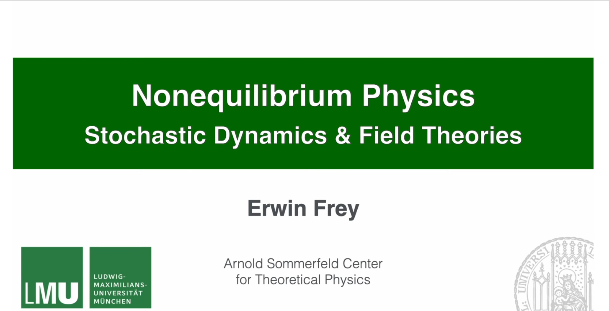

# Nonequilibrium Field Theories and Stochastic Dynamics

**Course**: Nonequilibrium Field Theories and Stochastic Dynamics  
**Instructor**: Prof. Erwin Frey  
**Institution**: Ludwig-Maximilians-Universität München (LMU Munich)  
**Semester**: Summer 2025

## Course Videos

  
  
<strong>YouTube Playlist</strong>: <a href="https://www.youtube.com/watch?v=-pEPKnuN1iY&list=PL2IEUF-u3gRdSbgtuqH5RNTuT798s0GqX" target="_blank">Complete Course Videos</a>

## About This Website

This website contains comprehensive learning materials for the **Nonequilibrium Field Theories and Stochastic Dynamics** course, including detailed Chinese lecture notes and corresponding Python code implementations.

### Course Content

This course explores the fundamental principles and advanced concepts of nonequilibrium field theories and stochastic dynamics. The focus is on stochastic processes in particle and field systems, emphasizing mathematical formalisms such as Langevin equations, Fokker-Planck equations, and path integrals. Additionally, the lectures cover applications in soft matter physics, active matter, and non-equilibrium statistical mechanics.

### Learning Materials

- **40 Chinese Lecture Notes**: Detailed theoretical derivations, physical explanations, and mathematical proofs
- **65 Python Code Implementations**: Computational experiments and visualizations corresponding to each lecture
- **Complete Image Resources**: All diagrams and illustrations used in the course
- **Terminology Glossary**: Professional terms with Chinese-English translations

### Course Structure

#### Part I: Foundations of Stochastic Processes (Lectures 1-10)
- Random Walks and Brownian Motion
- Elementary Stochastic Models
- Markov Processes and Master Equations

#### Part II: Stochastic Dynamics of Particles (Lectures 11-25)
- Langevin and Fokker-Planck Equations
- Stochastic Simulation Techniques
- Stochastic Thermodynamics

#### Part III: From Discrete States to Fields (Lectures 26-35)
- Reaction Networks and Field Theories
- Coarse-Grained Dynamics of Fields

#### Part IV: Field Theories of Nonequilibrium Systems (Lectures 36-40)
- Dynamical Functionals and MSR Formalism
- Hydrodynamics and Fluctuating Fluids
- Nonequilibrium Pattern Formation
- Field Theory of Active Matter

## Course Video Titles

Based on the course structure and repository contents, the lecture series includes the following topics:

### I. Foundations of Stochastic Processes (Lectures 1-10)

1. **Thermodynamics, Statistical Mechanics, Nonequilibrium Physics and Teaching Philosophy** (43 min)
2. **Simple Random Walk** (41 min)
3. **Gaussian Random Walk, Poisson Process, Gillespie Algorithm** (45 min)
4. **Gillespie Algorithm, Master Equation, Generating Function, Population Dynamics** (45 min)
5. **Population Dynamics: Linear Death Process, The Lotka-Volterra Process** (58 min)
6. **Fundamental Equations For Markov Processes: Chapman-Kolmogorov Equation** (36 min)
7. **Forward Master Eq., Q-matrix for Linear Birth-death Process, General Properties of Master Eq.** (41 min)
8. **Perron-Frobenius thm., Indecomposable Q-matrices, Rev. & Stationary Procs., Detailed Balance** (48 min)
9. **Consequences of Detailed Balance, Irreversibility and Entropy Production** (42 min)
10. **The Ehrenfest Model, Entropy and Kullback-Leibler Divergence** (37 min)

### II. Stochastic Dynamics of Particles (Lectures 11-25)

11. **Markov Chain Monte Carlo, Jump Processes, Diffusion Processes, Fokker-Planck Equation** (54 min)
12. **Brownian Motion (Wiener Process), Ornstein-Uhlenbeck Process, Einstein-Stokes Relation** (35 min)
13. **Monte Carlo Sampling as Stochastic Process** (44 min)
14. **Hamiltonian Monte Carlo Sampling** (49 min)
15. **Chemotaxis, Run-and-Tumble Motion as Two-State Process, Keller–Segel model** (47 min)
16. **Schnitzer Model, Anti-Diffusion, Motility-Induced Phase Separation** (33 min)
17. **Langevin Equation, Brownian Particle, Fluctuation–Dissipation Theorem** (43 min)
18. **Fokker-Planck Equation of Brownian Particle, Overdamped Langevin Equation, Smoluchowsky equation** (39 min)
19. **Path Integral Formulation of Langevin Equations** (45 min)
20. **Stochastic Differential Equations, Ito's Lemma, Stochastic integrals, Ito and Stratonovich** (42 min)
21. **Ito's Formulas, Transformation Between Stratonovich and Ito Formulation** (47 min)
22. **Path Integrals for Systems with Multiplicative Noise** (27 min)
23. **Interacting Brownian Particles, Fluctuations Near Equilibrium, Time Correlations of Fluctuations** (47 min)
24. **Onsager Coefficients and Symmetry Relations, Dynamic Form of the Fluctuation–Dissipation Theorem** (45 min)
25. **Gradient Dynamics, Model A, Classical Ising model, Ginzburg–Landau Equation, Allen–Cahn Equation** (54 min)

### III. From Discrete States to Fields (Lectures 26-35)

26. **Critical Slowing Down, Response Function, Dynamic Susceptibility, Model B** (39 min)
27. **Hydrodynamics of Simple Fluids, Frictionless Fluids, Euler Equation** (51 min)
28. **Viscous Fluid, Navier-Stokes Equation, Entropy Balance and Heat Conduction** (41 min)
29. **Irreversible Linear Thermodynamics, Dry Diffusive Particles Systems** (46 min)
30. **Brownian Particles Suspended in a Fluid, Model H** (30 min)
31. **Dynamic Functionals for Field Theories with Additive Noise, Onsager-Machlup Functional** (1h 3min)
32. **Janssen-De Dominicis Response Functional, Fluctuation-Dissipation Relation** (25 min)
33. **Non-Equilibrium Work and Fluctuation Theorem, Jarzynski's Work Relation, Crooks' Fluct. Theorem** (1h 19min)
34. **Directed Percolation, Spectral Method for Linear Death Process** (1h 6min)
35. **Path Integral for Master Equation** (31 min)

### IV. Field Theories of Nonequilibrium Systems (Lectures 36-40)

36. **Coherent State Path Integral, Operator Algebra and the Imaginary Noise** (40 min)
37. **Kramers-Moyal Expansion and the Low Noise Limit of the Path Integral** (41 min)
38. **Multi-Species Path Integrals, Rock-Paper-Scissors** (49 min)
39. **Path Integrals on a Lattice: From Hopping to Continuous Field Theories** (43 min)
40. **Kramers-Moyal Path Integral Approach, Field Theory for Interacting Particles** (32 min)

## Technical Features

- **Responsive Design**: Supports desktop and mobile devices
- **Dark/Light Theme**: Switchable interface themes
- **Mathematical Formula Rendering**: High-quality math display based on MathJax
- **Code Highlighting**: Syntax-highlighted Python code
- **One-Click Copy**: Quick copy of code snippets
- **Multilingual Support**: Chinese-English bilingual interface

## Usage Instructions

1. **Navigation**: Use the left sidebar to browse content by lecture
2. **Search**: Click the search icon in the header to find specific content
3. **Theme Toggle**: Use the top-right button to switch between dark/light themes
4. **Code Execution**: Copy code to your Python environment to run
5. **Mathematical Formulas**: Formulas support zooming and interactive viewing

## Language Support

Currently, most content is available in Chinese. English translations are being added gradually:

- **Course Introduction** (Lecture 1) - Available in English
- **Remaining Lectures** - Chinese with English interface

Use the language switcher in the header to toggle between Chinese and English views.

## Acknowledgments and Citation

### Course Source
This learning material is based on Prof. Erwin Frey's course at LMU Munich. All theoretical content is credited to the original course.

### Style Reference
The website design style references the [Physics-based Deep Learning](https://physicsbaseddeeplearning.org/intro.html) project.

### Open Source License
This project is licensed under the [Creative Commons Attribution-NonCommercial 4.0 International License](https://creativecommons.org/licenses/by-nc/4.0/).

---

*Note: This website is for educational purposes and contains study materials for the course "Nonequilibrium Field Theories and Stochastic Dynamics" by Prof. Erwin Frey at LMU Munich.*