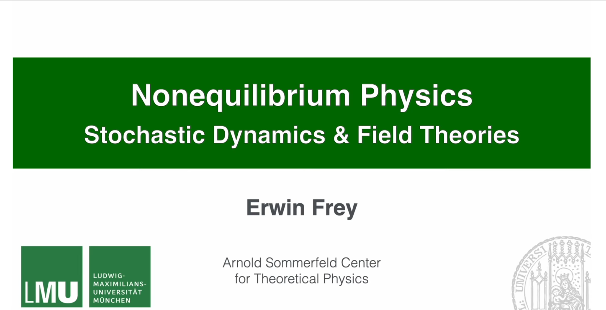
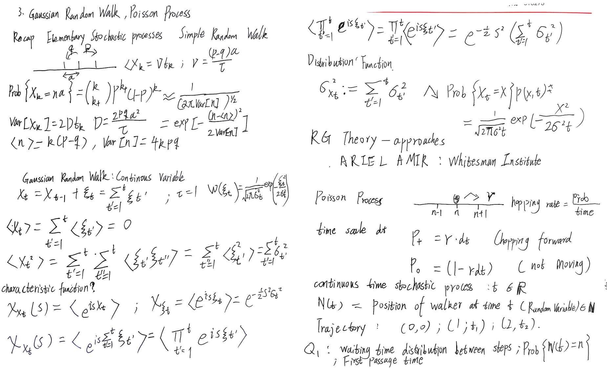
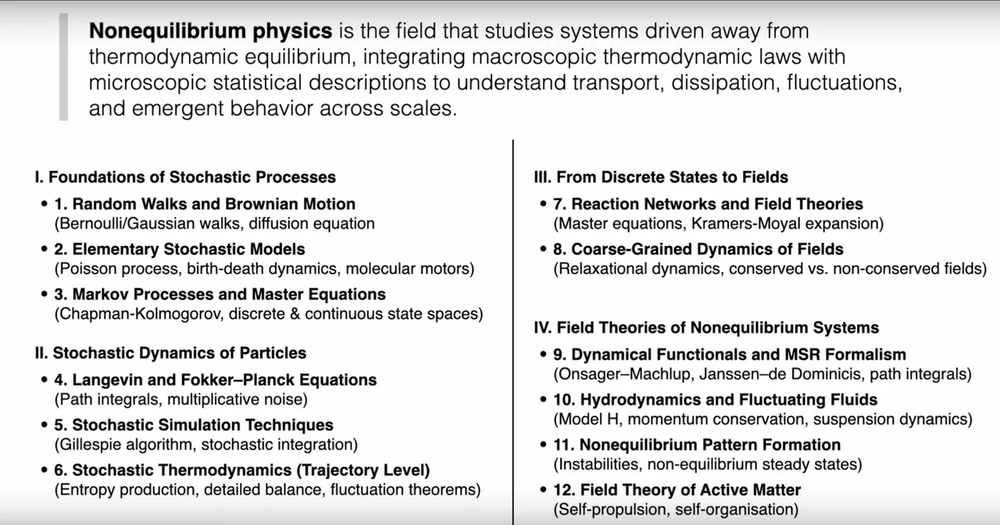
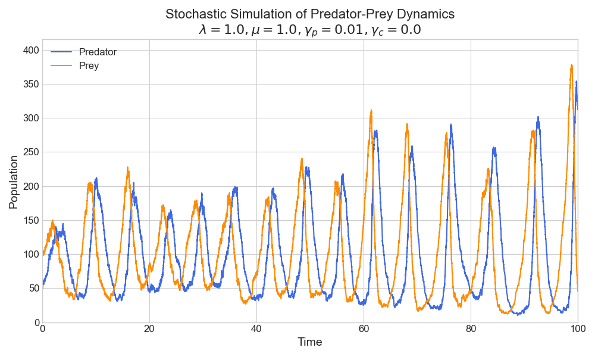
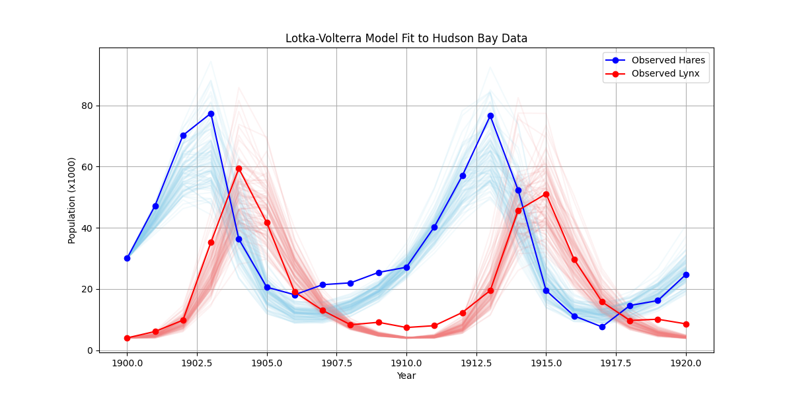
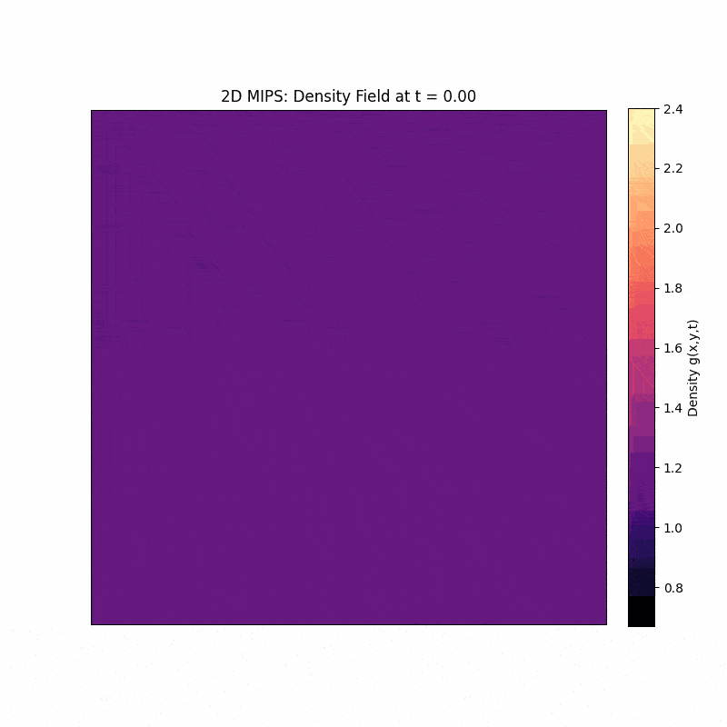
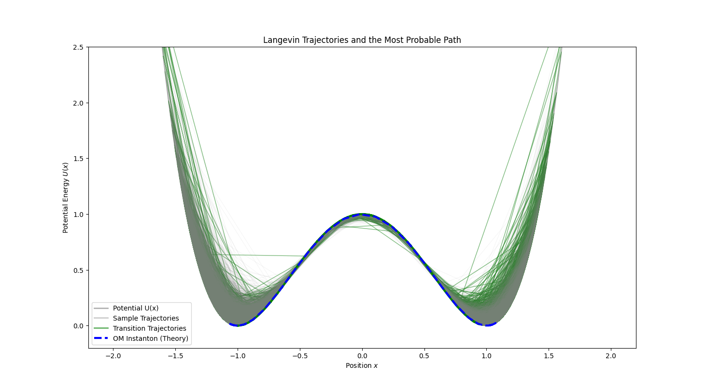
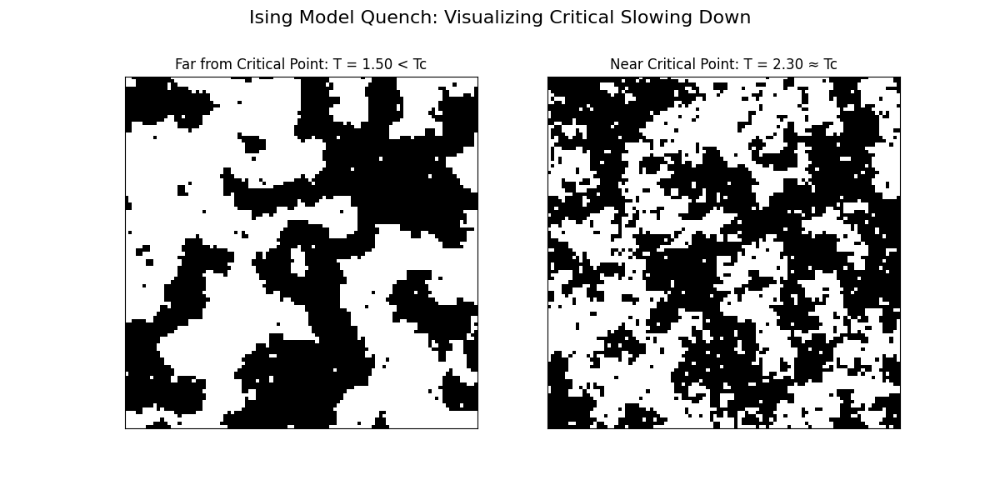
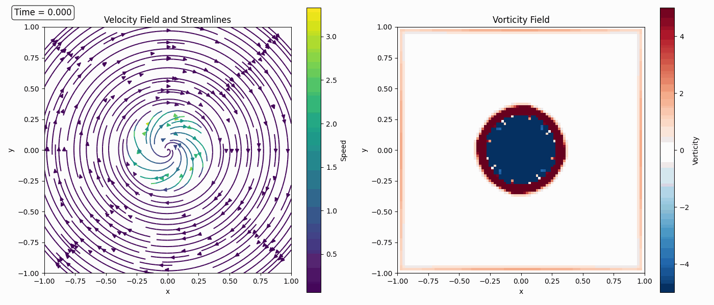
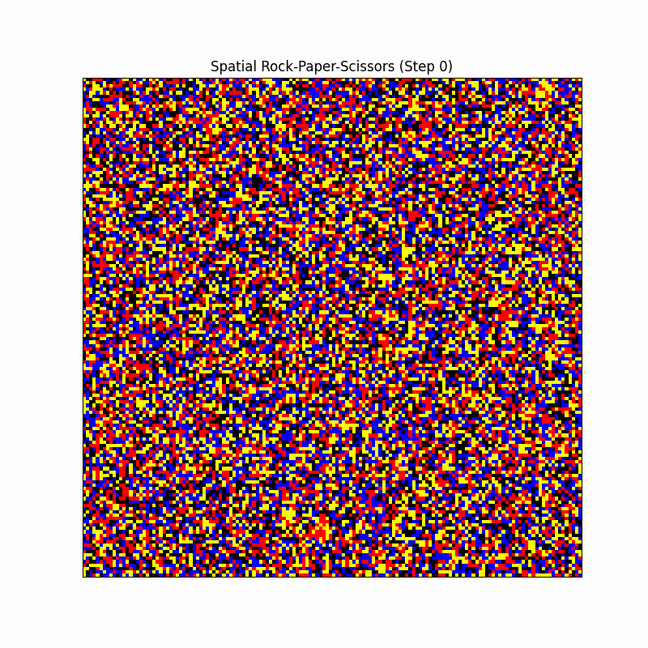

# Nonequilibrium Field Theories and Stochastic Dynamics

These are self-study notes for the course [**Nonequilibrium Field Theories and Stochastic Dynamics (Prof. Erwin Frey, LMU Munich, Summer Semester 2025)**](https://www.theorie.physik.uni-muenchen.de/lsfrey/teaching/index.html). [**Prof. Erwin Frey**](https://www.theorie.physik.uni-muenchen.de/lsfrey/members/group_leaders/erwin_frey/index.html) prefers chalkboard lectures. To document my learning, I organized my notes into articles and wrote Python code to deepen understanding. 

**Note:** I followed the course on YouTube only; there is no official handout. Everything here comes from notes taken while watching the videos. A sample of the original notes is below:

**Course Playlist:** [YouTube Playlist](https://www.youtube.com/watch?v=-pEPKnuN1iY&list=PL2IEUF-u3gRdSbgtuqH5RNTuT798s0GqX)

**Official Course Link:** [LMU Munich - Nonequilibrium Field Theories and Stochastic Dynamics](https://lsf.verwaltung.uni-muenchen.de/qisserver/rds?state=verpublish&status=init&vmfile=no&publishid=1075902&moduleCall=webInfo&publishConfFile=webInfo&publishSubDir=veranstaltung)

## Course Outline

## Course Contents

This lecture series explores the fundamental principles and advanced concepts of nonequilibrium field theories and stochastic dynamics. The course focuses on stochastic processes in particle and field systems, emphasizing mathematical formalisms such as Langevin equations, Fokker-Planck equations, and path integrals. Additionally, the lectures cover applications in soft matter physics, active matter, and non-equilibrium statistical mechanics.

The notes consist of four parts, totaling forty lectures:

**Part I: Foundations of Stochastic Processes.** From random walks and Brownian motion (Bernoulli or Gaussian walks; diffusion equation) through elementary stochastic models (Poisson processes, birth-death dynamics, molecular motors) to Markov processes and master equations (Chapman-Kolmogorov; discrete and continuous state spaces).

- [1. Introduction to Stochastic Processes](notes/1.%20Course%20Introduction.md)
- [2. Simple Random Walk](notes/2.%20Simple%20Random%20Walk.md)
- [3. Gaussian Random Walk and Poisson Process](notes/3.%20Gaussian%20Random%20Walk%20and%20Poisson%20Process.md)
- [4. Gillespie Algorithm, Master Equation, Generating Functions, and Population Dynamics](notes/4.%20Gillespie%20Algorithm,%20Master%20Equation,%20Generating%20Functions%20and%20Population%20Dynamics.md)
- [5. Population Dynamics: Linear Death Process and Lotka-Volterra System](notes/5.%20Population%20Dynamics%20-%20Linear%20Death%20Process%20and%20Lotka-Volterra%20System.md)
- [6. Fundamental Equations of Markov Processes: Chapman-Kolmogorov](notes/6.%20Fundamental%20Equations%20of%20Markov%20Processes%20—%20Chapman–Kolmogorov%20Equation.md)
- [7. Forward Master Equation and the Q Matrix](notes/7.%20Forward%20Master%20Equation%20and%20the%20Q%20Matrix.md)
- [8. Perron-Frobenius Theorem, Steady States, and Detailed Balance](notes/8.%20Perron–Frobenius%20Theorem,%20Steady%20States,%20and%20Detailed%20Balance.md)
- [9. Nonequilibrium States: Irreversibility and Entropy Production](notes/9.%20Nonequilibrium%20States%20—%20Irreversibility%20and%20Entropy%20Production.md)
- [10. Ehrenfest Model, Entropy, and KL Divergence](notes/10.%20Ehrenfest%20Model,%20Entropy,%20and%20KL%20Divergence.md)

**Part II: Stochastic Dynamics of Particles.** Langevin and Fokker-Planck equations (path integrals; multiplicative noise), stochastic simulation (Gillespie algorithm; stochastic integration), and stochastic thermodynamics (entropy production, detailed balance, fluctuation theorems).

- [11. Continuous Markov Processes and the Fokker-Planck Equation](notes/11.%20Continuous%20Markov%20Processes%20and%20the%20Fokker–Planck%20Equation.md)
- [12. Brownian Motion and the Ornstein-Uhlenbeck Process](notes/12.%20Brownian%20Motion%20and%20the%20Ornstein–Uhlenbeck%20Process.md)
- [13. Monte Carlo Sampling as a Stochastic Process](notes/13.%20Monte%20Carlo%20Sampling%20as%20a%20Stochastic%20Process.md)
- [14. Hamiltonian Monte Carlo](notes/14.%20Hamiltonian%20Monte%20Carlo%20Sampling.md)
- [15. Chemotaxis, Run-and-Tumble, and the Keller-Segel Model](notes/15.%20Chemotaxis,%20Run-and-Tumble%20Motion,%20and%20the%20Keller–Segel%20Model.md)
- [16. Schnitzer Model, Anomalous Diffusion, and Motility-Induced Phase Separation](notes/16.%20The%20Schnitzer%20Model,%20Anomalous%20Diffusion,%20and%20Motility‑Induced%20Phase%20Separation.md)
- [17. Langevin Equation, Brownian Particles, and the Fluctuation-Dissipation Theorem](notes/17.%20Langevin%20Equation,%20Brownian%20Particle,%20and%20the%20Fluctuation–Dissipation%20Theorem.md)
- [18. Fokker-Planck and Smoluchowski: From Trajectories to Probability Dynamics](notes/18.%20Fokker–Planck%20Equation%20and%20the%20Smoluchowski%20Equation%20—%20From%20Random%20Trajectories%20to%20Probability%20Dynamics.md)
- [19. Path-Integral Formulation of Stochastic Processes](notes/19.%20Path%20Integral%20Formulation%20of%20Stochastic%20Processes.md)
- [20. Stochastic Differential Equations](notes/20.%20Stochastic%20Differential%20Equations.md)
- [21. Ito Integrals and a Unified Framework](notes/21.%20Ito%20Integral%20and%20Unified%20Stochastic%20Process%20Framework.md)
- [22. Path Integrals for Systems with Multiplicative Noise](notes/22.%20Path%20Integrals%20for%20Systems%20with%20Multiplicative%20Noise.md)

**Part III: From Discrete States to Fields.** Reaction networks to field theories via the master equation and Kramers-Moyal expansion; coarse-grained field dynamics (relaxational dynamics; conserved vs. non-conserved fields).

- [23. From Coarse Graining to Fluctuating Continuum Theories](notes/23.%20From%20Coarse-Graining%20to%20Fluctuation%20Dynamics%20of%20Continuous%20Field%20Theories.md)
- [24. Onsager Coefficients, Reciprocity, and the Dynamic FDT](notes/24.%20Onsager%20Coefficients,%20Reciprocity,%20and%20the%20Dynamic%20Fluctuation–Dissipation%20Theorem.md)
- [25. Gradient Dynamics, Phase Transitions, and Relaxation](notes/25.%20Gradient%20Dynamics,%20Phase%20Transitions,%20and%20Relaxation.md)
- [26. Critical Slowing Down, Dynamic Response, and Conservation Laws](notes/26.%20Critical%20Slowing%20Down,%20Dynamic%20Response,%20and%20Conservation%20Laws.md)
- [27. Simple Fluids, Inertial Fluids, and Eulerian Hydrodynamics](notes/27.%20Hydrodynamics%20of%20Simple%20Fluids,%20Inviscid%20Flow,%20and%20the%20Euler%20Equation.md)
- [28. Viscous Fluids, Navier-Stokes, Entropy Balance, and Heat Conduction](notes/28.%20Viscous%20Fluids,%20the%20Navier–Stokes%20Equation,%20Entropy%20Balance,%20and%20Heat%20Conduction.md)
- [29. Irreversible Linear Thermodynamics and Dry Diffusive Particle Systems](notes/29.%20Irreversible%20Linear%20Thermodynamics%20and%20Dry%20Diffusive%20Particle%20Systems.md)
- [30. Brownian Particles in Fluids - Model H](notes/30.%20Brownian%20Particles%20Suspended%20in%20a%20Fluid%20—%20Model%20H.md)

**Part IV: Field Theories of Nonequilibrium Systems.** Dynamical functionals and MSR formalism (Onsager-Machlup; Janssen-de Dominicis), fluctuating hydrodynamics and Model H, nonequilibrium pattern formation, and active-matter field theory.

- [31. Dynamical Functionals, Additive-Noise Field Theory, and the Onsager-Machlup Functional](notes/31.%20Dynamical%20Functionals,%20Additive‑Noise%20Field%20Theory,%20and%20the%20Onsager–Machlup%20Functional.md)
- [32. Janssen-De Dominicis Response Functional and Fluctuation-Dissipation Relations](notes/32.%20Janssen–De%20Dominicis%20Response%20Functional%20and%20the%20Fluctuation–Dissipation%20Relation.md)
- [33. Nonequilibrium Work and Fluctuation Theorems](notes/33.%20Nonequilibrium%20Work%20and%20Fluctuation%20Theorems.md)
- [34. Directed Percolation, Absorbing States, and Spectral Methods](notes/34.%20Directed%20Percolation,%20Absorbing%20States,%20and%20Spectral%20Methods.md)
- [35. Path-Integral Representation of the Master Equation](notes/35.%20Path-Integral%20Representation%20of%20the%20Master%20Equation.md)
- [36. Coherent-State Path Integrals, Operator Algebras, and Imaginary Noise](notes/36.%20Coherent-State%20Path%20Integrals,%20Operator%20Algebra,%20and%20Imaginary%20Noise.md)
- [37. Kramers-Moyal Expansion and the Low-Noise Limit](notes/37.%20Kramers-Moyal%20Expansion%20and%20the%20Low-Noise%20Limit%20of%20Path%20Integrals.md)
- [38. Multi-Species Path Integrals and Cyclic Competition Dynamics](notes/38.%20Multi-Species%20Path%20Integrals%20and%20Cyclic%20Competition%20Dynamics.md)
- [39. From Particle Jumps to Continuum Field Theories](notes/39.%20From%20Particle%20Jumps%20to%20Continuous%20Field%20Theory.md)
- [40. A Unified Field-Theoretic Framework](notes/40.%20Unified%20Field%20Theory%20Framework.md)

## Usage

Each Python file corresponds to specific topics covered in the lecture series. The code serves as practical implementations of the theoretical concepts presented in the YouTube videos, developed as part of self-study and learning notes.

Here are some code output demonstrations:

<video src="assets/images/remote/fluid_simulation.mp4" controls="controls" style="max-width: 100%;"></video>

<strong>code/27.ScalarField.py</strong>

<video src="assets/images/remote/Starling.mp4" controls="controls" style="max-width: 100%;"></video>

<strong>code/40.InertialSpin.py</strong>

## Prerequisites

- Statistical mechanics and thermodynamics
- Probability theory and stochastic processes
- Differential equations
- Basic knowledge of field theory (helpful but not required)

## License

This project is licensed under the [CC BY-NC-ND 4.0](../LICENSE) License.

## Acknowledgments

- Prof. Erwin Frey and the Physics of Life group at LMU Munich for the excellent lecture series
- [PhysicsOfLifeLMU YouTube Channel](https://www.youtube.com/@PhysicsOfLifeLMU) for making these lectures publicly available