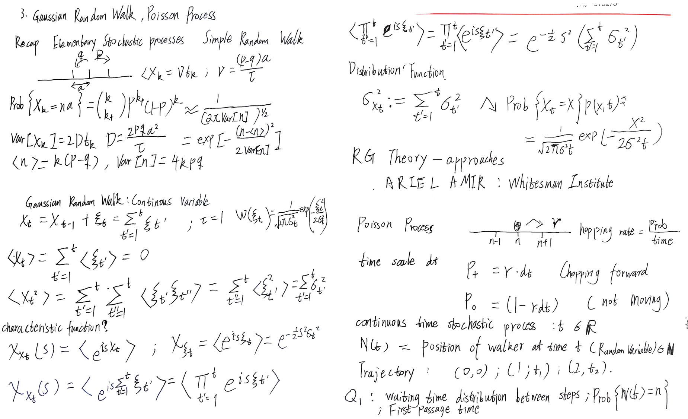
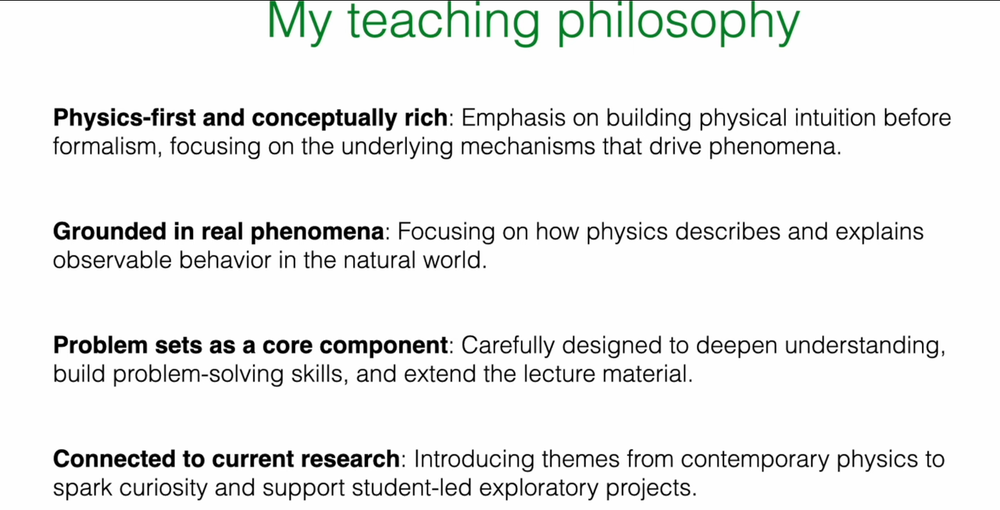
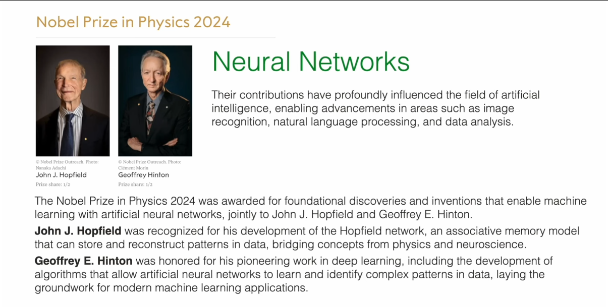

# Course Introduction

These notes summarize the YouTube course **Nonequilibrium Field Theories and Stochastic Dynamics** taught by Prof. Erwin Frey (LMU Munich, Summer Semester 2025). The instructor prefers chalkboard lectures, so I transcribed the material and reproduced the calculations in Python to reinforce the ideas. The project contains forty chapters; this first chapter provides the context for the entire series.

**Author's note:** The repository is built solely from the publicly available lectures. There is no official handout; every article stems from handwritten notes taken while watching the videos.

## Course Overview

The class develops the theoretical foundations and modern tools of nonequilibrium field theory and stochastic dynamics. It focuses on stochastic processes in particle and field systems and makes extensive use of the Langevin equation, the Fokker-Planck equation, and path-integral techniques. The curriculum spans fundamental stochastic-process models, the core equations of Markov dynamics, path-integral formulations, fluctuation theorems, and active-matter physics. Particular attention is paid to the Kardar-Parisi-Zhang (KPZ) equation, which captures universal features of nonequilibrium growth. Applications range from soft condensed matter and biological systems to complex fluids and turbulence. The learning path begins with simple random models, progresses to the master-equation formalism, and reaches modern field-theoretic methods for far-from-equilibrium systems.

## Teaching Philosophy

Prof. Frey structures the course around four intertwined principles.

* **Physics-first and conceptually rich:** Build physical intuition before introducing formal mathematics.
* **Grounded in real phenomena:** Anchor theory in observable systems such as pattern formation in biology or soft-matter rheology.
* **Problem sets as a core component:** Use assignments to deepen understanding and extend the lecture material.
* **Connected to current research:** Link foundational concepts to active research questions so students can transition smoothly to the literature.

# 1. Panorama of Physical Theory

To situate nonequilibrium physics within the broader discipline, the course reviews three related frameworks: thermodynamics, statistical physics, and nonequilibrium physics. Knowing how they connect is essential for the remainder of the lectures.

## 1.1 Thermodynamics: Universal Laws for Macroscopic Systems

Thermodynamics examines how energy, heat, and work control macroscopic behavior. Its power lies in universality: the laws apply to any macroscopic system without tracking microscopic detail.

### Fundamental Concepts and Variables

Thermodynamics distinguishes **intensive variables** (temperature $T$, pressure $P$, chemical potential $\mu$) from **extensive variables** (volume $V$, internal energy $E$, entropy $S$). Intensives describe system quality and do not scale with size; extensives add across subsystems and therefore scale with system size.

Thermodynamic potentials include internal energy $U$, Helmholtz free energy $F = U - TS$, and Gibbs free energy $G = U - TS + PV$. These functions support analyses under different constraints. Each potential has natural variables; for example, $G(T,P)$ matches the experimental control parameters of temperature and pressure. Potentials reach extrema at equilibrium, and their derivatives generate other state variables.

Heat and work separate ordered and disordered energy transfer. Work transfers energy in an organized way (for example, compressing a gas), whereas heat captures microscopic, disordered transfer. The distinction foreshadows the second law.

Equilibrium states keep macroscopic observables stationary. **State functions** such as $U$, $S$, and enthalpy $H$ depend only on the current state, not on the path used to reach it. Because their differentials are exact, we can compute changes through reversible reference paths and derive identities like the Maxwell relations.

### Guiding Role of the Laws

The **laws of thermodynamics** form the axioms:

* Zeroth law: defines temperature via transitivity.
* First law: expresses energy conservation, $dU = \delta Q - \delta W$.
* Second law: introduces entropy and the inequality $dS \geq 0$ for isolated systems, establishing the arrow of time.
* Third law: sets the absolute scale of entropy.

The second law ties irreversibility to entropy production. It explains why heat flows from hot to cold and gases spread to fill a container.

### From Fundamentals to Applications

Equations of state such as $PV = nRT$ relate measurable quantities and connect theory with experiment. More complex systems may require the van der Waals equation or other refined models.

The **Gibbs-Thomson relation**,
$$
\ln(p/p_0) = \frac{2\gamma V_m}{rRT},
$$
links curvature to vapor pressure via surface tension $\gamma$, molar volume $V_m$, and radius $r$. It explains droplet evaporation and underpins nucleation, growth, and Ostwald ripening.

**Thermodynamic response functions**-heat capacity, isothermal compressibility, thermal expansion-quantify how systems respond to small perturbations. Negative values signal instabilities.

When external conditions change, systems undergo **phase transitions** (boiling, Curie point, superconductivity) that display emergent order. Near critical points, fluctuations become long-ranged and obey universal scaling laws. The **Ginzburg-Landau free-energy** functional introduces an order parameter field to describe these transitions.

Outside equilibrium, **transport laws** describe relaxation: Fourier's law for heat conduction, Newtonian constitutive relations for viscous fluids, and so on. Linear nonequilibrium thermodynamics unifies these transport equations.

The **Onsager reciprocal relations** $L_{ij} = L_{ji}$ show that cross-effects (Seebeck versus Peltier) share symmetric transport coefficients derived from microscopic time-reversal symmetry.

## 1.2 Statistical Physics: Bridging Micro and Macro

Statistical physics explains why thermodynamic laws hold and how collective behavior emerges from microscopic degrees of freedom. It uses ensembles, fluctuations, and coarse-graining to connect particle-level dynamics with macroscopic observables.

### Microscopic Foundations and Probabilities

A **microstate** specifies every particle's position and momentum. Macroscopic measurements correspond to averages over a huge set of microstates. Because tracking each particle is impossible, statistical physics assigns a **probability distribution** to microstates.

### Ensembles and the Partition Function

An **ensemble** is a conceptual collection of system replicas under identical constraints. The **partition function**
$$
Z = \sum_i e^{-E_i/k_B T}
$$
sums Boltzmann weights and encodes all thermodynamic information for the canonical ensemble. Once $Z$ is known, we obtain the free energy $F = -k_B T \ln Z$, internal energy $\langle E \rangle$, entropy, and response functions.

### Statistical Entropy

**Statistical entropy** translates thermodynamic entropy into microscopic terms. Boltzmann's formula $S = k_B \ln \Omega$ counts accessible microstates; Gibbs' expression $S = -k_B \sum_i p_i \ln p_i$ interprets entropy as lack of information. Entropy increases because high-entropy macrostates vastly outnumber low-entropy ones.

### Fluctuations and Correlations

**Fluctuations** reveal how microscopic randomness manifests macroscopically. **Correlation functions** describe how fluctuations at different locations and times are related. Near continuous phase transitions, correlation lengths diverge and fluctuations become long-ranged.

**Order parameters** capture the degree of macroscopic order (magnetization, density difference, superfluid fraction). The **renormalization group** systematically coarse-grains a system and identifies universal behavior shared by disparate microscopic models.

### Tools Linking Micro and Macro

The **law of large numbers** explains why macroscopic observables appear deterministic despite microscopic randomness. The **Boltzmann distribution** $p_i \propto e^{-E_i/k_B T}$ provides the universal equilibrium weight for microstates.

**Fluctuation-dissipation theorems** connect equilibrium fluctuations to linear response, allowing predictions of transport coefficients from equilibrium measurements.

**Critical phenomena** display universality and scaling, while **linear response theory** expresses small departures from equilibrium in terms of equilibrium correlation functions.

Finally, statistical physics clarifies the emergence of **macroscopic irreversibility**: despite microscopic reversibility, overwhelmingly probable outcomes drive systems toward more disordered macrostates.

## 1.3 Nonequilibrium Physics: Beyond Equilibrium

Nonequilibrium physics investigates systems that remain away from thermodynamic equilibrium. It combines macroscopic laws with microscopic descriptions to address transport, dissipation, fluctuations, and emergent structures across scales.

### Hallmarks of Nonequilibrium Systems

These systems require continuous **driving** (energy or matter input) balanced by **dissipation**. They sustain fluxes-heat, particles, charge-and continually produce entropy. Many reach a **nonequilibrium steady state** (NESS) where observables are stationary even though internal currents persist.

### Breaking Detailed Balance

**Detailed balance** holds at equilibrium: transition rates satisfy $\pi_i W_{i \to j} = \pi_j W_{j \to i}$. Driving forces break this symmetry, creating circulating probability currents and directed motion. Molecular motors, for instance, rely on broken detailed balance to move along cytoskeletal tracks.

### Layered Theoretical Structure

The course organizes nonequilibrium theory into four layers:

**Part I: Foundations of Stochastic Processes.** Random walks, Brownian motion, Poisson processes, birth-death models, and Markov processes governed by the master equation establish the mathematical language of randomness.

**Part II: Stochastic Dynamics of Particles.** The Langevin and Fokker-Planck equations describe stochastic trajectories and probability densities; Monte Carlo sampling and stochastic thermodynamics explore path probabilities, entropy production, and fluctuation theorems.

**Part III: From Discrete States to Fields.** Reaction networks are coarse-grained into continuum descriptions via the Kramers-Moyal expansion, leading to effective field equations that capture relaxational dynamics and conservation laws.

**Part IV: Field Theories of Nonequilibrium Systems.** Dynamical functionals, the Martin-Siggia-Rose-Janssen-de Dominicis formalism, fluctuating hydrodynamics, nonequilibrium pattern formation, and active-matter field theories provide the modern toolkit.

The repository mirrors this structure: each lecture note carries the number of the corresponding video lecture.

### Comparative View

| Property | Thermodynamics | Statistical Physics | Nonequilibrium Physics |
|----------|----------------|---------------------|------------------------|
| Scope | Macroscopic systems | Bridge from microscopic to macroscopic | Dynamic, driven systems |
| Typical state | Equilibrium | Equilibrium ensembles | Nonequilibrium steady states and transients |
| Key variables | $T, P, V, E, S$ | Microstates, probability distributions, partition function | Fluxes, production rates, fluctuations |
| Governing principles | Laws of thermodynamics | Statistical ensembles and Boltzmann weight | Fluctuation theorems, entropy production, broken detailed balance |

# 2. Brownian Motion as the Canonical Example

Brownian motion is the historical doorway into stochastic processes. It demonstrates how microscopic fluctuations dominate mesoscopic dynamics.

## 2.1 Robert Brown's "Little Secret"

In 1827 Robert Brown observed pollen grains under a microscope and saw them move erratically without stopping. When Charles Darwin asked for the explanation, Brown replied, "That is my little secret." Many contemporaries attributed the motion to a vital force inside the grains.

## 2.2 Einstein's Explanation and Perrin's Verification

Albert Einstein analyzed the phenomenon in 1905. He argued that thermal molecular motion in the fluid bombards the particle from all sides. Because the particle is small, instantaneous collisions fail to cancel perfectly, generating a random walk driven by a **random force**. The insight provided visual evidence for atoms and revealed that the same microscopic collisions also produce viscous drag, hinting at the fluctuation-dissipation connection.

Jean Baptiste Perrin measured mean-square displacements, determined Avogadro's number, and verified Einstein's theory experimentally. His work settled the debate about the atomic nature of matter and earned the 1926 Nobel Prize in Physics.

# 3. Milestones in Nonequilibrium Physics

Brownian motion initiated a century-long development of nonequilibrium theory. Each stage elevated the level of abstraction and mathematical sophistication.

## 3.1 Stochastic Dynamics (1900s-1940s)

**Langevin equation.** Paul Langevin split Newton's law into a dissipative force $-\gamma \dot{x}$ and a random force $\eta(t)$,
$$
m \ddot{x} = -\gamma \dot{x} + \eta(t),
$$
creating one of the first stochastic differential equations.

**Fokker-Planck equation.** Instead of following single trajectories, this equation evolves the probability density $P(x,t)$:
$$
\frac{\partial P}{\partial t} = -\nabla \cdot (\mathbf{A} P) + \frac{1}{2} \nabla^2 (\mathbf{B} P).
$$
The drift term reflects systematic forces; the diffusion term encodes noise-induced spreading. The Langevin and Fokker-Planck pictures describe the same process from trajectory-level and distribution-level perspectives.

## 3.2 Linear Nonequilibrium Thermodynamics (1930s-1960s)

In the vicinity of equilibrium, fluxes $J_i$ respond linearly to thermodynamic forces $X_j$:
$$
J_i = \sum_j L_{ij} X_j.
$$
Lars Onsager discovered that the transport matrix is symmetric, $L_{ij} = L_{ji}$, provided microscopic dynamics respect time-reversal symmetry. The result explains cross-effects such as the Seebeck and Peltier phenomena.

## 3.3 Fluctuation-Dissipation Theorem (1950s-1970s)

The fluctuation-dissipation theorem (FDT) unifies Langevin and Onsager viewpoints. It states that linear response to an external perturbation is fully determined by equilibrium correlation functions. Johnson-Nyquist noise in resistors and diffusion constants of Brownian particles exemplify this principle. A breakdown of FDT is a hallmark of far-from-equilibrium behavior.

## 3.4 From Classic Patterns to Modern Frontiers

* **Classical pattern formation.** Alan Turing's reaction-diffusion mechanism explains spontaneous symmetry breaking and pattern formation in chemical media.
* **Field-theoretic approaches.** The Doi-Peliti and Martin-Siggia-Rose-Janssen-de Dominicis formalisms recast master equations as path integrals, enabling renormalization-group analysis.
* **Renormalization group.** Scaling analysis uncovers universality classes in nonequilibrium systems, paralleling equilibrium critical phenomena.
* **Large deviation theory.** Path-based probability theory quantifies rare events, entropy-production fluctuations, and noise-induced transitions.
* **Modern nonequilibrium pattern formation.** Noise can stabilize spatial structures, and driven systems can harness fluctuations to maintain order.
* **Active matter.** Collections of self-driven units-bacteria, cytoskeletal filaments, bird flocks-continuously break detailed balance and display emergent behavior such as flocking and motility-induced phase separation.

# 4. Nonequilibrium Physics, Life, and Complexity

## 4.1 Schrodinger's Question: "What Is Life?"

In 1944 Erwin Schrodinger proposed that living matter obeys additional physical principles that would ultimately integrate with existing laws. Today those principles are recognized as nonequilibrium rules governing open, energy-consuming systems that self-organize and perform complex functions.

## 4.2 Case Studies from the Frey Group

* **Yeast cell polarity** ([Nature Communications 2023](https://doi.org/10.1038/s41467-023-42100-0)). The GTPase Cdc42 creates a positive-feedback loop on the membrane while cytosolic diffusion redistributes inactive molecules. The interplay yields a stable polarity cap, demonstrating robust self-organization in the presence of gene knockouts and environmental perturbations.
* **Min oscillations in *E. coli*** ([Nature Physics 2025](https://www.nature.com/articles/s41567-025-02878-w)). The MinCDE proteins form an ATP-driven reaction-diffusion oscillator that shuttles from pole to pole. The time-averaged inhibitor profile is minimal at mid-cell, ensuring accurate placement of the division machinery. The pattern exemplifies a nonequilibrium steady state maintained by continuous energy consumption.
* **Geometry decoding in starfish oocytes** ([Nature Physics 2022](https://doi.org/10.1038/s41567-021-01164-9)). A long-range Cdk1 gradient encodes cell geometry and triggers a thresholded RhoA wave that travels across the cortex. Pattern-on-pattern dynamics translate geometric information into biochemical signals, providing robust targeting even under strong shape deformations.
* **Synthetic cell motility** ([Nature Physics 2023](https://doi.org/10.1038/s41567-023-02058-8)). Reconstituted Min proteins drive lipid vesicles to crawl directionally on a substrate through mechano-chemical feedback. The system moves without cytoskeletal machinery, illustrating how minimal nonequilibrium components generate self-propulsion.

## 4.3 Recognition within Complexity Science

* **2021 Nobel Prize in Physics:** Syukuro Manabe, Klaus Hasselmann, and Giorgio Parisi were honored for groundbreaking insights into complex physical systems. Parisi's work on spin glasses provided theoretical tools that resonate with stochastic field theory.
* **2024 Nobel Prize in Physics:** John J. Hopfield and Geoffrey E. Hinton were recognized for advances that made neural-network-based machine learning feasible, reflecting the deep link between statistical physics and information processing.

* **2025 Boltzmann Medal:** Mehran Kardar and Yoshiki Kuramoto received the award for contributions to fluctuations, interface growth, and synchronization, topics that stand at the heart of nonequilibrium physics.

These examples underscore that the ideas in this course are not academic curiosities; they are essential tools for understanding phenomena ranging from living matter to collective intelligence and remain central to current research.
