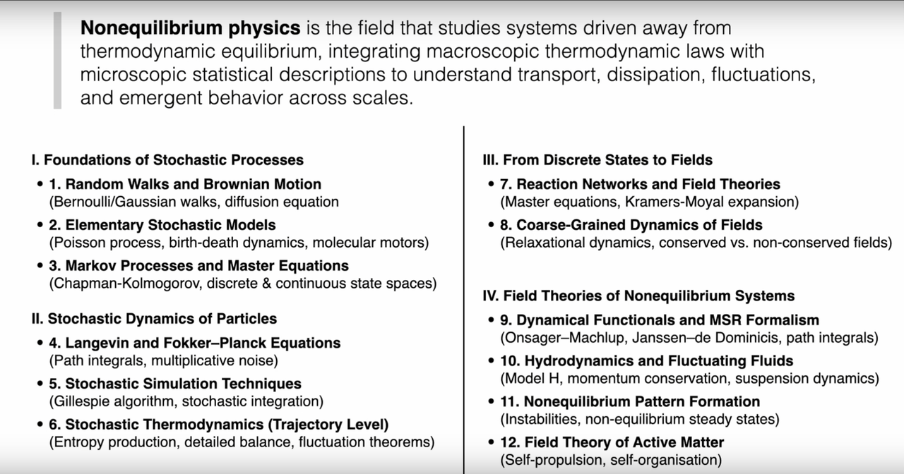
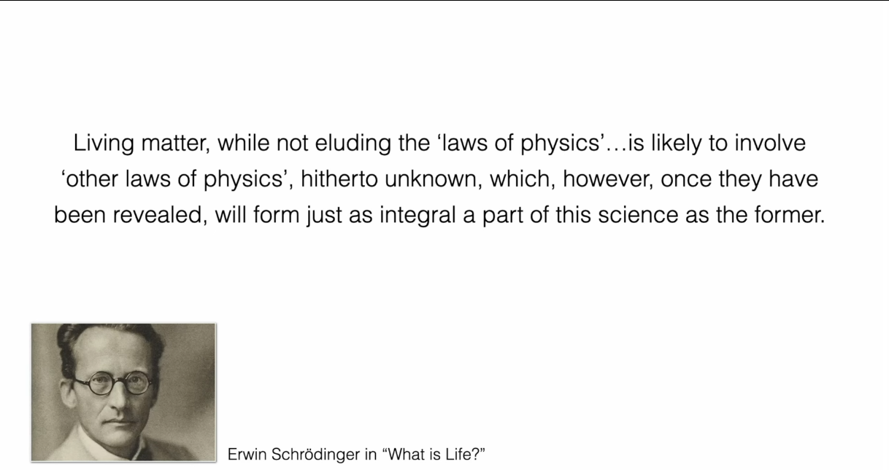
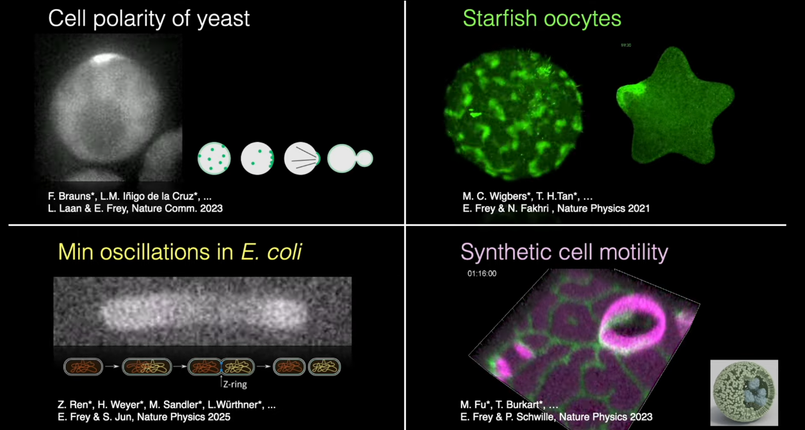
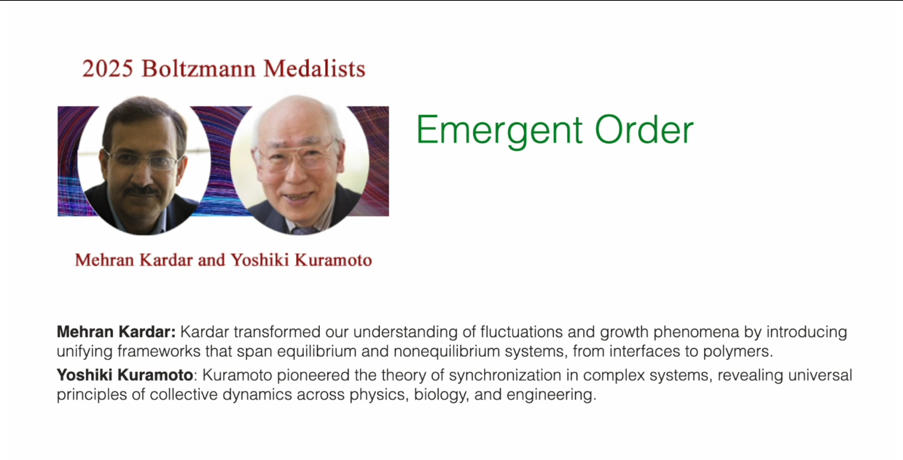

# Course Introduction

These are self-study notes for the course [**Nonequilibrium Field Theories and Stochastic Dynamics (Prof. Erwin Frey, LMU Munich, Summer Semester 2025)**](https://www.theorie.physik.uni-muenchen.de/lsfrey/teaching/index.html). [**Prof. Erwin Frey**](https://www.theorie.physik.uni-muenchen.de/lsfrey/members/group_leaders/erwin_frey/index.html) prefers chalkboard lectures. To document my learning, I organized my notes into articles and wrote Python code to deepen understanding. There are 40 chapters in total; this chapter is the course introduction.

**Note:** I followed the course on YouTube only; there is no official handout. Everything here comes from notes taken while watching the videos. A sample of the original notes is below:

# Course Overview

This course introduces the principles and advanced ideas of nonequilibrium field theory and stochastic dynamics, focusing on stochastic processes in particle and field systems, especially the Langevin equation, the Fokker-Planck equation, and path-integral formalisms.

The content spans a complete path from basic stochastic-process theory to modern methods in nonequilibrium field theory, including dynamical functionals and fluctuation theorems. Special attention is given to the Kardar-Parisi-Zhang (KPZ) equation, which describes universal features of nonequilibrium growth. We also discuss active-matter systems, where collective behavior emerges from interactions that break detailed balance.

Applications include soft condensed matter, active matter, and nonequilibrium statistical physics, providing a theoretical foundation for complex systems from biological processes to turbulent fluids. The learning path starts with elementary stochastic models, proceeds to the fundamental equations of Markov processes, and culminates in advanced field-theoretic methods such as dynamical functionals and fluctuation theorems.

## Teaching Philosophy

Prof. Erwin Frey structures the course around four guiding principles.

- **Physics-first and conceptually rich**: The course emphasizes building physical intuition before introducing formal mathematics, focusing on understanding the mechanisms behind phenomena rather than mere mathematical manipulation. Course content starts from specific physical problems and gradually guides students to corresponding theoretical frameworks.

- **Grounded in real phenomena**: Course content is closely connected to observable physical phenomena, including pattern formation in biological systems and the dynamics of soft matter systems. Theoretical methods are combined with practical applications, reflecting physics' value as a science that describes the natural world.

- **Problem sets as a core component**: Exercise design is an important component of the course, aimed at deepening conceptual understanding, developing problem-solving skills, and extending course content. Through systematic practice, students consolidate and expand their knowledge.

- **Connected to current research**: The course introduces contemporary topics and case studies from physics research, combining fundamental theory with cutting-edge developments to provide a foundation for students' further research.

# 1. Panorama of Physical Theory

To locate nonequilibrium physics within physics as a whole, three interlinked yet distinct frameworks are reviewed: thermodynamics, statistical physics, and nonequilibrium physics. Understanding their differences and connections is essential for this course.

## 1.1 Thermodynamics: Universal Laws for Macroscopic Systems

Thermodynamics studies how energy, heat, and work govern macroscopic behavior. Its power lies in universality: its laws (energy conservation, the second law, etc.) apply to all macroscopic systems without tracking microscopic details. We need not concern ourselves with the specific details of the microscopic particles (atoms, molecules) that constitute these systems.

### Basic concepts and variables

To construct thermodynamic theory, we first need to establish a language for describing system states. Thermodynamics introduces two fundamentally different types of physical quantities to characterize macroscopic systems:

**Intensive vs. extensive variables** - The distinction between intensive and extensive variables is the first step in understanding thermodynamics. Intensive variables such as temperature ($T$), pressure ($P$), and chemical potential ($\mu$) do not depend on system size - whether it's a glass of water or a lake, the temperature can be the same. In contrast, extensive variables such as volume ($V$), internal energy ($E$), and entropy ($S$) scale proportionally with system size and are additive. This distinction is not merely a mathematical convenience but reflects the deep structure of the physical world: intensive variables describe the "quality" of a system, while extensive variables describe its "quantity."

**Thermodynamic potentials** - Building on this foundation, the concept of thermodynamic potentials emerges. Internal energy $U$, Helmholtz free energy $F = U - TS$, and Gibbs free energy $G = U - TS + PV$ are characteristic functions for different constraints. Each potential selects a set of "natural variables" - for example, Gibbs free energy $G(T,P)$ uses temperature and pressure as natural variables, which are precisely the conditions most easily controlled in experiments. The importance of potential functions lies in the fact that when they reach extrema under their respective constraints, they correspond to equilibrium states, and their derivatives give all other thermodynamic quantities.

**Heat and work** - The concepts of heat and work define the accounting method for energy exchange. Work is ordered energy transfer (such as piston compressing gas), while heat is disordered energy transfer (such as molecular collisions). This distinction, seemingly simple, is actually profound: it implies differences in energy quality and lays the foundation for the formulation of the second law.

**Equilibrium and state functions** - These are the core concepts of thermodynamics. Equilibrium is a state with time-independent macroscopic properties, serving as the starting point for thermodynamic analysis. State functions such as internal energy $U$, entropy $S$, and enthalpy $H$ depend only on the current state of the system, not on the path taken to reach that state. This path independence allows us to compute changes in state functions along any reversible path, greatly simplifying thermodynamic calculations. The total differential properties of state functions ensure the consistency of thermodynamic relations, such as the Maxwell relations.

### Guiding role of the laws

**The four laws of thermodynamics** form the axiomatic foundation of the entire theory. The zeroth law establishes the consistency of the temperature concept; the first law expresses energy conservation, $dU = \delta Q - \delta W$; the second law introduces the concept of entropy and states that for isolated systems $dS \geq 0$; the third law sets the absolute scale of entropy.

Among these, **the relationship between the second law and irreversibility** is the most profound. The principle of entropy increase not only gives the direction of processes but also introduces the "arrow of time" into the macroscopic world. Why does heat always flow from hot objects to cold objects? Why do gases always diffuse from high-pressure regions to low-pressure regions? The answers are all contained in the principle of entropy increase - natural processes always proceed in the direction of increasing the total entropy of the system.

### From fundamentals to applications

Equations of state such as $PV = nRT$ connect measurable quantities and tie theory to experiment; more complex systems require refined equations of state such as the van der Waals equation.

Gibbs–Thomson relation. Surface effects alter phase equilibria. The Gibbs–Thomson relation $\ln(p/p_0) = \frac{2\gamma V_m}{rRT}$ relates curvature to equilibrium vapor pressure via surface tension $\gamma$, molar volume $V_m$, and radius $r$. It explains why small droplets evaporate more readily and small crystals dissolve more easily, and underlies nucleation, growth, and Ostwald ripening.

Thermodynamic response functions - heat capacity, isothermal compressibility, thermal expansion - quantify how systems respond to small perturbations and diagnose stability (negative values signal instabilities).

Phase transitions and emergence. Near critical points, systems display scale invariance and universal behavior - macroscopic order emerging from microscopic disorder.

Ginzburg-Landau free energy introduces an order parameter and an effective free energy to analyze diverse transitions within a unified framework.

Transport laws describe relaxation away from equilibrium: Fourier's law, constitutive relations for viscous fluids, and so on. Linear nonequilibrium thermodynamics unifies these relations.

Onsager reciprocal relations, $L_{ij} = L_{ji}$, reveal deep symmetry among transport processes (Seebeck and Peltier effects) rooted in microscopic time-reversal symmetry.

## 1.2 Statistical Physics: Bridging Micro and Macro

If thermodynamics describes what happens, statistical physics explains why. It shows how macroscopic laws and emergent collective behavior arise from probabilistic microscopic dynamics, using ensembles, fluctuations, and coarse graining to connect microstates to observables.

### Microscopic foundations and probabilities

The starting point of statistical physics is acknowledging a fundamental fact: we cannot and need not track the precise motion of every microscopic particle. Instead, we adopt the language of probability to describe systems.

**Microstate** - A microstate is the most detailed description of a system - specifying the position and momentum of every particle. Imagine a gas containing $10^{23}$ molecules; its microstate is a complete "snapshot" of this astronomical number of particles. However, macroscopic measurements (such as temperature, pressure) correspond not to a single microstate but to a vast collection of microstates. This leads to a profound realization: macroscopic properties are statistical averages of microstates.

To handle this statistical nature, statistical physics introduces the concept of **probability distribution**. Different microstates occur with different probabilities; this probability distribution contains all the statistical information about the system. The key question is: what determines this probability distribution?

### Ensembles and the partition function

**Ensemble** - An ensemble is the core concept of statistical physics - it is a collection of a large number of system replicas under identical macroscopic constraints. Different constraint conditions correspond to different ensembles: the canonical ensemble fixes temperature, the grand canonical ensemble fixes temperature and chemical potential, and so on.

**Partition function** - The central mathematical object is $Z = \sum_i e^{-E_i/(k_B T)}$, which appears simple but actually contains all the thermodynamic information of the system. What is the physical meaning of the partition function? It is the sum of "weights" of all possible microstates, where the weight of each state is given by the Boltzmann factor $e^{-E_i/(k_B T}$ - the higher the energy of a state, the smaller its probability of occurrence.

Once the partition function is obtained, thermodynamics naturally emerges from statistical physics: free energy $F = -k_B T \ln Z$, entropy $S = -\partial F/\partial T$, internal energy $U = \langle E \rangle$, and so on. This derivation from microscopic to macroscopic demonstrates the explanatory power of statistical physics.

### Statistical entropy

The concept of **statistical entropy** gives microscopic meaning to the abstract quantities of thermodynamics. Boltzmann's formula $S = k_B \ln \Omega$ tells us that entropy measures the "diversity" of system microstates - the more possible microstates, the greater the entropy. Gibbs' more general formulation $S = -k_B \sum_i p_i \ln p_i$ interprets entropy as the "information content" or "uncertainty" of the probability distribution.

This understanding explains why entropy always increases: isolated systems always evolve from a few special microstates (low entropy) to many ordinary microstates (high entropy), which is purely a result of probability - "ordinary" situations are more likely to occur than "special" ones.

### Fluctuations and correlations

Statistical physics not only predicts average behavior but also reveals the universality of **fluctuations**. Due to the random motion of microscopic particles, any macroscopic quantity fluctuates around its mean value. These fluctuations are not "noise" but physical phenomena carrying important information.

**Correlation functions** describe how fluctuations at different spatial and temporal points are related to each other; they are key to understanding collective behavior. Near critical points of phase transitions, correlation lengths diverge and systems exhibit long-range correlations - this is precisely the mechanism by which macroscopic order emerges from microscopic disorder.

**Order parameter** - A macroscopic variable that quantifies the degree of order, it occupies a central position in phase transition theory. In ordered phases, the order parameter is non-zero; in disordered phases, it is zero. For example, in ferromagnets, magnetization is the order parameter; in liquid-gas phase transitions, density difference is the order parameter. The concept of order parameters allows us to describe various seemingly different phase transition phenomena using a unified mathematical language, revealing their common essence.

**Renormalization group** - A powerful theoretical tool for handling multi-scale physical problems. Its core idea is to study how physical systems behave at different observation scales. Through systematic "coarse graining" - ignoring short-range details while preserving long-range behavior - the renormalization group reveals the universality of critical phenomena: different microscopic systems may exhibit the same macroscopic behavior near critical points because they belong to the same "universality class." This theory not only explains the universality of phase transitions but also provides deep insights into understanding scaling behavior in complex systems.

### Tools linking micro and macro

Statistical physics has developed a series of powerful theoretical tools to handle complex systems:

**Law of large numbers** - Ensures the determinism of macroscopic quantities: although individual particle behavior is random, the average behavior of large numbers of particles is deterministic. This explains why the macroscopic world appears deterministic despite its random microscopic foundation.

**Boltzmann distribution** - $p_i \propto e^{-E_i/(k_B T)}$ is the universal probability distribution for equilibrium states. It does not depend on the specific details of the system, only on energy and temperature. This universality is the source of statistical physics' predictive power.

**Fluctuation-dissipation theorems** - Establish quantitative relationships between equilibrium fluctuations and nonequilibrium response. They tell us that we can predict a system's response to external perturbations by observing its spontaneous fluctuations.

When systems approach phase transitions, **critical phenomena** reveal another aspect of statistical physics: systems exhibit **universality and scaling laws** near critical points, where different microscopic systems may exhibit the same macroscopic behavior. This universality suggests the existence of deeper symmetries and invariances.

**Linear response theory** - Handles system response to small external perturbations, transforming nonequilibrium problems into calculations of equilibrium properties, laying the foundation for understanding transport phenomena.

Finally, statistical physics must face a profound question: **the emergence of irreversibility**. Microscopic dynamics are time-reversal symmetric, yet macroscopic phenomena exhibit clear directionality. Statistical physics explains this apparent contradiction through probability theory and the law of large numbers: irreversibility is not absolute but the result of overwhelming probability.

Through these concepts and tools, statistical physics successfully bridges the gap between microscopic and macroscopic scales, not only explaining the origin of thermodynamic laws but also providing a solid theoretical foundation for understanding emergent behavior in complex systems.

## 1.3 Nonequilibrium Physics: Beyond Equilibrium

Nonequilibrium physics investigates systems away from thermodynamic equilibrium, combining macroscopic laws with microscopic descriptions to address transport, dissipation, fluctuations, and emergent structure across scales. Many compelling natural phenomena - from cell physiology to weather - are far from equilibrium.

### Hallmarks of nonequilibrium systems

To understand nonequilibrium physics, we must first recognize the fundamental differences between nonequilibrium and equilibrium systems.

**Driving and dissipation balance** - This is the core characteristic of nonequilibrium systems. Unlike equilibrium systems, nonequilibrium systems require continuous input of energy or matter to maintain their state. This external driving achieves dynamic balance with the system's internal dissipation processes, allowing the system to maintain a state far from thermodynamic equilibrium.

**Fluxes and production rates** - These concepts occupy a central position in nonequilibrium physics. In these systems, energy, matter, charge, and so on, flow continuously, forming various "flows" - heat flow, particle flow, current flow, etc. Simultaneously, the system continuously produces entropy, which is a direct manifestation of irreversible processes. These flows are not transient disturbances but defining features of the system's stable existence.

**Nonequilibrium steady state (NESS)** - This is a key concept in nonequilibrium physics. Many nonequilibrium systems, under continuous driving, reach a seemingly "stable" state: macroscopic properties do not change over time, but there are persistent net flows and entropy production internally. Living systems are paradigmatic examples of NESS - living cells maintain their highly ordered state through continuous metabolism, appearing static but actually full of dynamic processes.

### Breaking detailed balance

**Breaking of detailed balance** - This is the fundamental marker distinguishing equilibrium from nonequilibrium systems. At equilibrium, microscopic reversibility requires that the rate of any elementary process must equal the rate of its reverse process - this is the principle of detailed balance. Mathematically expressed as: for any two states $i$ and $j$, we must have $\pi_i W_{i \to j} = \pi_j W_{j \to i}$, where $\pi_i$ is the equilibrium probability and $W_{i \to j}$ is the transition rate.

In nonequilibrium systems, this principle is systematically violated. External driving breaks the symmetry of microscopic processes, leading to net circulating flows and directed motion. This breaking is not an accidental disturbance but the foundation of system function - it is precisely this asymmetry that enables molecular motors to move directionally and allows cells to actively transport matter.

### From stochastic processes to field theory: a layered syllabus

According to the lecture outline, the theory is organized into four ascending layers:

Foundations of Stochastic Processes. From random walks and Brownian motion (Bernoulli or Gaussian walks; diffusion equation) through elementary stochastic models (Poisson processes, birth-death dynamics, molecular motors) to Markov processes and master equations (Chapman-Kolmogorov; discrete and continuous state spaces).

- [2. Simple Random Walk](2.%20简单随机游走.md)
- [3. Gaussian Random Walk and Poisson Process](3.%20高斯随机游走与泊松过程.md)
- [4. Gillespie Algorithm, Master Equation, Generating Functions, and Population Dynamics](4.%20Gillespie%20算法、主方程、生成函数与种群动力学.md)
- [5. Population Dynamics: Linear Death Process and Lotka-Volterra System](5.%20种群动态学：线性死亡过程与Lotka-Volterra%20系统.md)
- [6. Fundamental Equations of Markov Processes: Chapman-Kolmogorov](6.%20马尔可夫过程的基本方程：查普曼-科尔莫戈罗夫方程.md)
- [7. Forward Master Equation and the Q Matrix](7.%20前向主方程与Q矩阵.md)
- [8. Perron-Frobenius Theorem, Steady States, and Detailed Balance](8.%20佩龙-弗罗贝尼乌斯定理、稳态与细致平衡.md)
- [9. Nonequilibrium States: Irreversibility and Entropy Production](9.%20非平衡态：不可逆性与熵产生的推论.md)
- [10. Ehrenfest Model, Entropy, and KL Divergence](10.%20埃伦费斯特模型、熵与KL散度.md)

Stochastic Dynamics of Particles. Langevin and Fokker-Planck equations (path integrals; multiplicative noise), stochastic simulation (Gillespie algorithm; stochastic integration), and stochastic thermodynamics (entropy production, detailed balance, fluctuation theorems).

- [11. Continuous Markov Processes and the Fokker-Planck Equation](11.%20连续马尔可夫过程与福克-普朗克方程.md)
- [12. Brownian Motion and the Ornstein-Uhlenbeck Process](12.%20布朗运动与奥恩斯坦-乌伦贝克过程.md)
- [13. Monte Carlo Sampling as a Stochastic Process](13.%20作为随机过程的蒙特卡洛采样.md)
- [14. Hamiltonian Monte Carlo](14.%20哈密尔顿蒙特卡洛采样.md)
- [15. Chemotaxis, Run-and-Tumble, and the Keller-Segel Model](15.%20趋化性、跑动-翻滚运动与Keller-Segel模型.md)
- [16. Schnitzer Model, Anomalous Diffusion, and Motility-Induced Phase Separation](16.%20Schnitzer模型、反常扩散与运动诱导相分离.md)
- [17. Langevin Equation, Brownian Particles, and the Fluctuation-Dissipation Theorem](17.%20朗之万方程、布朗粒子与涨落-耗散定理.md)
- [18. Fokker-Planck and Smoluchowski: From Trajectories to Probability Dynamics](18.%20福克-普朗克方程与斯摩棱霍夫斯基方程：从随机轨迹到概率动力学.md)
- [19. Path-Integral Formulation of Stochastic Processes](19.%20随机过程的路径积分表述.md)
- [20. Stochastic Differential Equations](20.%20随机微分方程.md)
- [21. Ito Integrals and a Unified Framework](21.%20伊藤积分与统一的随机过程框架.md)
- [22. Path Integrals for Systems with Multiplicative Noise](22.%20含乘性噪声系统的路径积分.md)

From Discrete States to Fields. Reaction networks to field theories via the master equation and Kramers-Moyal expansion; coarse-grained field dynamics (relaxational dynamics; conserved vs. non-conserved fields).

- [23. From Coarse Graining to Fluctuating Continuum Theories](23.%20从粗粒化到连续场论涨落动力学.md)
- [24. Onsager Coefficients, Reciprocity, and the Dynamic FDT](24.%20昂萨格系数、倒易关系与动态涨落-耗散定理.md)
- [25. Gradient Dynamics, Phase Transitions, and Relaxation](25.%20梯度动力学、相变与弛豫.md)
- [26. Critical Slowing Down, Dynamic Response, and Conservation Laws](26.%20临界慢化、动态响应与守恒律.md)
- [27. Simple Fluids, Inertial Fluids, and Eulerian Hydrodynamics](27.%20简单流体、无摩擦流体与欧拉方程的流体动力学.md)
- [28. Viscous Fluids, Navier-Stokes, Entropy Balance, and Heat Conduction](28.%20粘性流体、纳维-斯托克斯方程、熵平衡与热传导.md)
- [29. Irreversible Linear Thermodynamics and Dry Diffusive Particle Systems](29.%20不可逆线性热力学与干性扩散粒子系统.md)
- [30. Brownian Particles in Fluids - Model H](30.%20悬浮在流体中的布朗粒子%20—%20H模型.md)

Field Theories of Nonequilibrium Systems. Dynamical functionals and MSR formalism (Onsager-Machlup; Janssen-de Dominicis), fluctuating hydrodynamics and Model H, nonequilibrium pattern formation, and active-matter field theory.

- [31. Dynamical Functionals, Additive-Noise Field Theory, and the Onsager-Machlup Functional](31.%20动态泛函、加性噪声场论与Onsager-Machlup泛函.md)
- [32. Janssen-De Dominicis Response Functional and Fluctuation-Dissipation Relations](32.%20Janssen-De%20Dominicis%20响应泛函与涨落-耗散关系.md)
- [33. Nonequilibrium Work and Fluctuation Theorems](33.%20非平衡功与涨落定理.md)
- [34. Directed Percolation, Absorbing States, and Spectral Methods](34.%20有向渗流、吸收态与谱方法.md)
- [35. Path-Integral Representation of the Master Equation](35.%20主方程的路径积分表示.md)
- [36. Coherent-State Path Integrals, Operator Algebras, and Imaginary Noise](36.%20相干态路径积分、算符代数与虚噪声.md)
- [37. Kramers-Moyal Expansion and the Low-Noise Limit](37.%20Kramers-Moyal%20展开与路径积分的低噪声极限.md)
- [38. Multi-Species Path Integrals and Cyclic Competition Dynamics](38.%20多物种路径积分与循环竞争动力学.md)
- [39. From Particle Jumps to Continuum Field Theories](39.%20从粒子跳跃到连续场论.md)
- [40. A Unified Field-Theoretic Framework](40.%20统一的场论框架.md)

### Layered progression of methods

This structure reflects a layered methodology: from single-particle stochastic trajectories to ensemble probability evolution; from discrete jump processes to continuous field theories; from linear response near equilibrium to complex far-from-equilibrium behavior. Each layer brings specific mathematical tools and physical insights.

To place the three frameworks side by side, compare:

| Property | Thermodynamics | Statistical Physics | Nonequilibrium Physics |
|---|---|---|---|
| Scope | Macroscopic systems | Microscopic to macroscopic | Dynamic, evolving systems |
| Typical state | Equilibrium | Equilibrium ensembles | NESS; transient states |
| Key variables | $T, P, V, E, S$ (macroscopic) | Microstates; probability distributions; partition function | Fluxes; production rates; fluctuations |
| Governing principles | Laws of thermodynamics | Statistical ensembles; Boltzmann weight | Fluctuation theorems; entropy production; broken detailed balance |

# 2. A Paradigm of Stochastic Processes - Brownian Motion

History often provides a doorway into complex fields. Brownian motion is more than a story: it epitomizes how microscopic fluctuations dominate mesoscopic dynamics. It serves as a paradigm for understanding the core ideas of stochastic processes and nonequilibrium physics, demonstrating how random fluctuations in the microscopic world govern the motion of objects at the mesoscopic scale.

## 2.1 Robert Brown's "Little Secret": The Beginning

In 1827 the Scottish botanist Robert Brown observed pollen grains suspended in water under a microscope and found that these tiny particles moved rapidly and irregularly without ever stopping. This phenomenon, later called Brownian motion, puzzled contemporaries; some even attributed it to a vital force. In Darwin's recollection, Brown had shown him this phenomenon, but when asked for an explanation, Brown mysteriously replied, "That is my little secret." At the time, people could not explain the source of this motion, and some even speculated that it originated from the "vital force" of the pollen itself.

## 2.2 Einstein's Explanation and Perrin's Verification

This "secret" was not revealed until nearly 80 years later by Albert Einstein in his "miracle year" of 1905. Einstein pointed out that Brownian motion did not originate from within the particle but was the result of external environmental effects. He wrote in his paper: "According to the molecular kinetic theory of heat, bodies of microscopically visible size suspended in a liquid will perform movements of such magnitude that they can be easily observed in a microscope."

Einstein's insight was that he recognized that suspended particles are constantly bombarded by collisions from the surrounding liquid molecules. These molecules are in perpetual thermal motion. For a macroscopic body, collisions from all directions are statistically uniform, with a net force of zero. But for a tiny particle, due to the finite number of molecules, at any given moment, collisions from different directions are not perfectly balanced. This unbalanced, random collision force causes the irregular motion of the particle.

This explanation was revolutionary:

1. It provided direct, visible evidence for atoms and molecules, bridging invisible molecular collisions to visible mesoscopic motion.
2. It introduced the concept of a random force, foundational for modern stochastic dynamics.
3. It revealed the link between fluctuations and dissipation: the same molecular collisions that cause random motion also cause viscous drag under external forcing, foreshadowing the fluctuation-dissipation theorem.

The French physicist Jean Baptiste Perrin conducted precise quantitative experimental studies of Brownian motion, measuring the mean-squared displacements of particles and using them to accurately calculate Avogadro's number. His experimental results were in excellent agreement with theoretical predictions, providing decisive experimental support for Einstein's ideas and completing the atomic-molecular structure theory of matter. Perrin was awarded the 1926 Nobel Prize in Physics for this work.

# 3. Milestones in Nonequilibrium Physics

The success of Brownian motion theory opened the door to nonequilibrium physics. Throughout the 20th century, physicists developed a toolkit whose abstraction and scope steadily increased.

## 3.1 Stochastic Dynamics (1900s-1940s): Mesoscopic Noisy Dynamics

Goal: formulate dynamical equations for stochastic phenomena such as Brownian motion.

**Langevin equation** - This describes the trajectory of a single Brownian particle. Paul Langevin, building on Newton's second law ($m\ddot{x} = F$), ingeniously decomposed the force into two parts:

1) A systematic, predictable **dissipative force** proportional to the particle's velocity, $-\gamma \dot{x}$ (viscous drag).

2) A rapidly fluctuating, unpredictable random force $\eta(t)$ representing random collisions from fluid molecules.

3) Thus, the Langevin equation can be conceptually written as:

$$
m \ddot{x} = -\gamma \dot{x} + \eta(t)
$$

The physical significance of this equation is profound: it was the first time that macroscopic dissipation (characterized by the friction coefficient $\gamma$) and microscopic fluctuations (characterized by the random force $\eta(t)$) were unified in a single dynamical equation. It describes a random trajectory and is the origin of stochastic differential equations.

**Fokker-Planck equation** - While the Langevin equation describes the fate of a single particle, we are usually more concerned with the collective behavior of systems composed of many particles. The Fokker-Planck equation serves this purpose. Instead of tracking individual trajectories, it describes how the probability density function $P(x,t)$ of a particle ensemble evolves over time.

Its general form can be written as:

$$
\frac{\partial P}{\partial t} = -\nabla \cdot (\mathbf{A} P) + \frac{1}{2} \nabla^2 (\mathbf{B} P)
$$

The physical meaning of this equation is a fluid dynamics equation for probability:

1. **Drift Term**: The first term, related to the drift vector $\mathbf{A}$, describes the deterministic drift of probability density due to systematic forces (such as external force fields).

2. **Diffusion Term**: The second term, related to the diffusion tensor $\mathbf{B}$, describes the diffusion and spreading of probability density caused by random forces.

3. The Fokker-Planck and Langevin equations are two equivalent perspectives for describing the same stochastic process: the former is an "Eulerian description" based on probability distributions, while the latter is a "Lagrangian description" based on particle trajectories.

## 3.2 Linear Nonequilibrium Thermodynamics (1930s-1960s): Transport Near Equilibrium

For small departures from equilibrium, thermodynamic fluxes $J_i$ (heat, charge, particles) respond linearly to thermodynamic forces $X_j$ (temperature, electrical, chemical-potential gradients):

$$
J_i = \sum_j L_{ij} X_j.
$$

Diagonal $L_{ii}$ give direct laws (Fourier, Ohm, and so on).

Onsager reciprocal relations. Lars Onsager revealed the structure of cross effects: a temperature gradient can induce an electric current (Seebeck), and a potential gradient can induce heat flow (Peltier). In the absence of time-reversal breaking (for example, magnetic fields), $L_{ij} = L_{ji}$, with symmetry rooted in microscopic reversibility. Onsager received the 1968 Nobel Prize in Chemistry.

## 3.3 Fluctuation-Dissipation Theorem (1950s-1970s): Linking Response and Fluctuations

The FDT synthesizes the Langevin and Onsager viewpoints. Physically: a system's linear response to small external perturbations is quantitatively linked to its spontaneous equilibrium fluctuations.

Examples. For Brownian motion, diffusion (fluctuations) and mobility (response) are related. Johnson noise in resistors links resistance to the voltage-noise spectrum. Practically, by measuring equilibrium correlation functions (how a system "jitters" by itself), one predicts linear response to weak forcing. Breakdown of FDT signals far-from-equilibrium behavior.

## 3.4 From Classic to Modern: Pattern Formation to Active Matter

As the toolkit matured, attention moved from simple particle systems to spatially extended, driven systems far from equilibrium:

- Classical pattern formation (1960s-1980s). Turing-type reaction-diffusion systems generate stationary patterns (spots, stripes) via instabilities arising from unequal diffusion coefficients.
- Field-theoretic approaches (1970s-present). The Doi-Peliti and Martin-Siggia-Rose-Janssen-de Dominicis (MSRJD) formalisms map master equations for reacting-diffusing particles to field-theoretic path integrals, enabling coarse graining and renormalization-group analysis.
- Renormalization group (1970s-present). RG explains universality and scaling of fluctuations in equilibrium and nonequilibrium settings.
- Large-deviation theory (1980s-present). Path-based probability quantifies rare events, entropy-production fluctuations, and noise-induced transitions - central for nonequilibrium systems and biological processes.
- Nonequilibrium pattern formation (2000s-present). Noise and driving can stabilize complex spatiotemporal structures; noise can even help create and maintain order.
- Active matter (2000s-present). Self-driven units (bacteria, cytoskeletal filaments, bird flocks) continuously break detailed balance and exhibit emergent collective order.
- **Physics of living systems (2000s-present)**: This emerging field applies the theoretical tools of nonequilibrium physics to understand the quantitative laws of biological organization. Living systems are inherently complex nonequilibrium systems that maintain high levels of organization and functionality through continuous energy consumption. Research in this field includes mechanochemical feedback mechanisms (such as dynamic reorganization of the cytoskeleton), emergent collective behaviors (such as group effects in cell migration), and stochastic dynamics in biological networks. For example, the self-assembly of spindles during cell division, synchronized oscillations in neural networks, and morphogenesis in tissue development can all be understood using the language of nonequilibrium statistical physics. This quantitative approach not only deepens our understanding of life phenomena but also provides theoretical guidance for biomedicine and synthetic biology.

# 4. Nonequilibrium Pattern Formation and Physics of Living Systems

## 4.1 Nonequilibrium Pattern Formation

Nonequilibrium pattern formation represents one of the most fascinating aspects of modern nonequilibrium physics. Unlike classical pattern formation in equilibrium systems, nonequilibrium patterns emerge from the interplay between driving forces, dissipation, and fluctuations in systems far from equilibrium.

### Key Characteristics of Nonequilibrium Patterns

**Driving and Dissipation Balance**: Nonequilibrium patterns require continuous energy input to maintain their structure. This energy is dissipated through various mechanisms, creating a dynamic balance that sustains the pattern.

**Fluctuation-Stabilized Structures**: In contrast to equilibrium systems where fluctuations typically destroy order, nonequilibrium systems can use fluctuations to create and stabilize complex patterns. Noise can even help maintain order in certain regimes.

**Emergent Collective Behavior**: Individual components following simple rules can collectively generate complex, large-scale patterns through self-organization mechanisms.

### Examples of Nonequilibrium Pattern Formation

- **Turing Patterns**: Reaction-diffusion systems where different diffusion rates of chemical species lead to spontaneous pattern formation (spots, stripes, spirals)
- **Active Matter Patterns**: Self-propelled particles can form flocks, swarms, and other collective structures
- **Biological Morphogenesis**: Development of complex structures in living organisms through chemical signaling and mechanical forces

## 4.2 Physics of Living Systems

The physics of living systems represents a cutting-edge application of nonequilibrium statistical physics to biological phenomena. Living organisms are paradigmatic nonequilibrium systems that maintain high order through continuous energy consumption.

### Core Principles

**Mechanochemical Feedback**: Biological systems often involve feedback loops between mechanical forces and chemical processes, where mechanical deformation affects chemical reactions and vice versa.

**Collective Cell Behavior**: Individual cells can coordinate their behavior to produce emergent tissue-level phenomena through cell-cell communication and mechanical interactions.

**Stochastic Biological Networks**: Biological processes at the cellular and molecular level are inherently stochastic, requiring new theoretical frameworks to understand their dynamics.

### Research Applications

- **Cell Division and Morphogenesis**: Understanding how mechanical and chemical processes coordinate to create complex biological structures
- **Neural Network Dynamics**: Applying statistical physics to understand brain function and neural synchronization
- **Tissue Development**: Modeling how individual cells coordinate to form functional tissues

# 5. Frontiers and Intersections: Nonequilibrium Physics in Living Systems

Life is the quintessential nonequilibrium phenomenon: organisms maintain highly ordered states far from equilibrium by continuously consuming energy and matter. Living systems thus offer both rich case studies and tough challenges for nonequilibrium physics.

## 5.1 Schrodinger: "What Is Life?"

In 1944 Erwin Schrodinger argued that, although living matter does not evade known physical laws, it likely obeys additional, then-unknown principles that would, once revealed, become integral to physics. Today many of these are understood as nonequilibrium rules governing open, energy-consuming systems that self-organize and perform complex functions.

## 5.2 Case Studies from the Frey Group

The following examples from the Frey group illustrate how nonequilibrium ideas solve concrete biological problems.

- [**Cell polarity in yeast**](https://doi.org/10.1038/s41467-023-42100-0)
  - **Biological question**: Before budding, a single-celled budding yeast must select a specific point from its originally nearly spherically symmetric cell surface and concentrate all cell growth resources at that point to form a "bud." This is a typical symmetry breaking problem.
  
  - **Physical mechanism**: The core of this process is a GTPase named Cdc42. On the cell membrane, activated Cdc42 molecules can recruit and activate more Cdc42 molecules through a positive feedback loop. This "rich-get-richer" mechanism, combined with slow diffusion of molecules on the membrane and fast diffusion in the cytosol, can spontaneously concentrate originally uniformly distributed Cdc42 molecules into a single, stable "polarity cap," thereby marking the future growth site. This is a self-organization process driven by reaction-diffusion mechanisms. Research by Prof. Frey and his collaborators further reveals that this seemingly single process actually contains multiple, functionally redundant self-organization mechanisms, giving yeast polarity processes extremely strong robustness to gene mutations or environmental perturbations and explaining their high evolvability.

- [**Min oscillations in E. coli**](https://www.nature.com/articles/s41567-025-02878-w)
  - **Biological question**: A rod-shaped E. coli must divide precisely at the geometric center of the cell to ensure equal-sized daughter cells. How does the cell "find" its midpoint?
  
  - **Physical mechanism**: E. coli utilizes an exquisite dynamic positioning system - the Min protein system. This system consists of three proteins: MinC, MinD, and MinE. Among them, MinD is an ATP-consuming motor protein that can bind to the cell membrane when driven by ATP; MinE can promote MinD to hydrolyze ATP, causing it to detach from the membrane. The interaction and diffusion of these two proteins together constitute a reaction-diffusion oscillator. In the cell, MinD and MinE form a standing wave that shuttles from one pole to the other with a period of about one minute. As a division inhibitor, MinC protein follows MinD in its movement. Due to this back-and-forth oscillation, MinC protein has the highest time-averaged concentration at the poles and the lowest at the geometric center of the cell. Thus, the cell center becomes the only location "allowed" for the division machinery (FtsZ ring) to assemble, ensuring precise centering of division. This process is a typical nonequilibrium steady state (NESS) that continuously consumes energy (ATP hydrolysis) to maintain a dynamic, biologically functional spatial pattern.

- [**Geometry decoding in starfish oocytes**](https://doi.org/10.1038/s41567-021-01164-9)
  - **Biological question**: In life activities such as cell division, intracellular signals (such as protein concentration waves) must propagate accurately across complex, dynamically changing cell geometry and reach specific targets. How do cells accurately "decode" their own geometric information under different shapes to ensure precise execution of biological functions? For example, in very large starfish oocytes, a key RhoA protein activity wave always propagates precisely from the cell surface to the nucleus location, whether the cell is stretched into an ellipsoid or compressed into a star shape.
  
  - **Physical mechanism**: This research reveals an exquisite, hierarchical pattern formation mechanism ("patterns forming patterns"). The cell's geometric shape information is first encoded as a long-range, stable gradient of the cell-cycle regulator Cdk1 - a "background pattern" generated by a reaction-diffusion system. Then, a second reaction-diffusion system - the RhoA protein cycle - "reads" this background gradient. This system acts like a bistable switch, only being activated where Cdk1 concentration exceeds a certain threshold, launching an excitable traveling wave on the cortex. The propagation path and final position of this wave are precisely guided and determined by the first pattern (Cdk1 gradient). Through this cascading "pattern guides pattern" approach, the cell cleverly converts complex geometric information into robust biochemical signaling, ensuring that even under strong shape perturbations, key signals can still precisely reach their targets.

- [**Synthetic cell motility**](https://doi.org/10.1038/s41567-023-02058-8)
  - **Biological question/goal**: Autonomous cell movement is one of the most fundamental characteristics of life, relying on complex cytoskeletal and motor protein systems. Can we construct an autonomously moving "synthetic cell" using only minimal components without these complex "musculoskeletal" systems? This is a core challenge in the field of "bottom-up" synthetic biology, aimed at exploring the minimal physicochemical principles that drive life phenomena.
  
  - **Physical mechanism**: This research successfully utilized E. coli's Min protein system to achieve persistent, directed movement of a liposome (synthetic cell model) on a surface. The core is a mechano-chemical feedback loop. First, MinD and MinE proteins, driven by ATP, self-organize to form asymmetric protein concentration distributions on the inner and outer surfaces of the liposome membrane and the supporting plane (chemical part). This uneven protein distribution, through two possible mechanisms, leads to symmetry breaking of the liposome shape and generates driving force (mechanical part): 1) Proteins act like "zippers" to form and break unequal connections between the liposome and the supporting plane; 2) Protein aggregation directly changes local membrane curvature and tension. This chemical pattern-driven deformation and movement, in turn, affects the Min protein's own reaction-diffusion dynamics, because the Min system is very sensitive to geometric shape. This "chemical pattern affects shape; shape changes feedback to chemical pattern" cycle ultimately drives this minimalist synthetic cell to achieve unprecedented, cytoskeleton-free persistent crawling movement.

## 5.3 Complexity Science: Nobel Prizes and Other Honors

- **2021 Nobel Prize in Physics**: Awarded to Syukuro Manabe, Klaus Hasselmann, and Giorgio Parisi for their "groundbreaking contributions to our understanding of complex physical systems." Particularly noteworthy is Parisi's work, which revealed the hidden deep structures and fluctuation laws in disordered systems such as spin glasses. The theoretical tools developed by Parisi provide a universal framework for understanding various complex systems filled with randomness and "ergodicity breaking," which is closely related to the stochastic processes and statistical field theory ideas that will be studied in this course.

- **2024 Nobel Prize in Physics**: Awarded to John J. Hopfield and Geoffrey E. Hinton for their "groundbreaking discoveries and inventions that made artificial neural network machine learning possible." Notably, the mathematical model of the associative memory network (Hopfield network) proposed by Hopfield is precisely derived from the spin glass model in statistical physics. This eloquently demonstrates that statistical physics, particularly the ideas of handling many-body interactions and collective behavior, has become a theoretical cornerstone in fields such as artificial intelligence and information science.

- **2025 Boltzmann Medal**: Awarded to Mehran Kardar and Yoshiki Kuramoto. Kardar has made important contributions to the unified understanding of fluctuations, interface growth, and other phenomena in both equilibrium and nonequilibrium systems (such as the famous KPZ equation). Kuramoto pioneered the theory of synchronization phenomena in complex systems (such as the Kuramoto model), revealing universal principles of collective dynamic behavior from neural networks to firefly flashing. The work of these two scholars represents the core frontiers of nonequilibrium physics and is precisely the theme that will be deeply explored in the subsequent parts of this course.

These examples show that the concepts and methods in this course are not ivory-tower curiosities but keys to understanding complex phenomena from life to intelligence, and they remain central to active research today.

