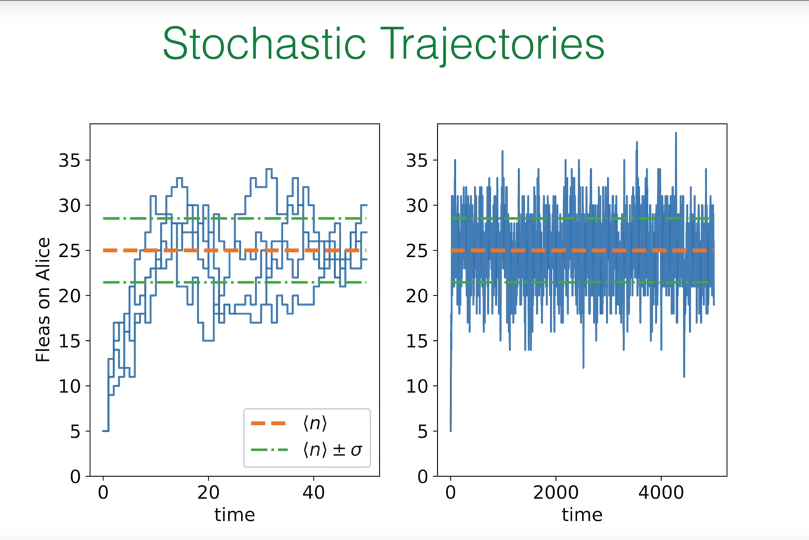

# Preface: Entropy Production and the Signature of Irreversibility

In the previous lectures (especially 8 and 9) we studied the master equation and distinguished global balance from detailed balance. Detailed balance implies a steady state, but not every steady state satisfies detailed balance. This distinction is key for nonequilibrium physics and leads us to irreversibility.

In a nonequilibrium steady state (NESS), macroscopic observables (e.g., the distribution) are time‑independent, yet persistent probability currents flow inside the system. These net currents signal irreversibility. To quantify it we use the entropy production rate.

### Quantifying Irreversibility: Entropy Production Rate $\sigma$


One expression for $\sigma$ is

$$
\sigma = \sum_{i j} \pi_j w_{i j} \, \ln\!\left(\frac{w_{j i}}{w_{i j}}\right),
$$

where $\pi_j$ is the steady probability of state $j$ and $w_{i j}$ is the rate from $j$ to $i$, so $\pi_j w_{i j}$ is the steady probability flux $j\to i$. The log measures forward–backward rate asymmetry; if $w_{i j}=w_{j i}$ this term vanishes.

An equivalent (exact) form is

$$
\sigma = \sum_{i j} \pi_j w_{i j} \, \ln\!\left(\frac{\pi_i w_{j i}}{\pi_j w_{i j}}\right),
$$

obtained by using global balance $\sum_j (\pi_j w_{j i}-\pi_i w_{i j})=0$ to show $\sum_{i j} \pi_j w_{i j}\ln(\pi_j/\pi_i)=0$ and adding this identity inside the log. The inner ratio becomes “backward flux / forward flux,” highlighting net cyclic circulation as the origin of entropy production.

An equivalent symmetric expression over unordered pairs is

$$
\sigma \,=\, \sum_{i<j} J_{i j}\,\ln\!\left(\frac{w_{i\to j}}{w_{j\to i}}\right),\quad
J_{i j}:=\pi_i w_{i\to j}-\pi_j w_{j\to i}.
$$

This makes explicit the universal (flux)$\times$(force) structure with thermodynamic force (affinity) $A_{i j}:=\ln\!\left(\frac{w_{i\to j}}{w_{j\to i}}\right)$.

Basic properties:

1) Nonnegativity: $\sigma\ge 0$ (by Jensen’s inequality). Physically this is the second law in stochastic processes: the steady entropy production rate is never negative.

2) Relation to detailed balance:
   - $\sigma=0$ iff detailed balance holds: $\pi_j w_{i j}=\pi_i w_{j i}$ for all pairs. This is true thermodynamic equilibrium.
   - In NESS, $\sigma>0$ and some net current $J_{i j}=\pi_i w_{i j}-\pi_j w_{j i}\ne0$ exists.

# 1. Ehrenfest Model: A Simple System for Big Ideas

## 1.1 The Classic Model


The Ehrenfest model (urn/flea model) was introduced to clarify the statistical nature of the second law: how macroscopic irreversibility emerges from microscopically reversible dynamics. Two boxes and $N$ distinguishable particles: at each step pick one uniformly at random and move it to the other box. Microscopic moves are reversible, yet the system overwhelmingly evolves from highly imbalanced macrostates (all particles in one box) toward the most probable macrostate (roughly equal split).

It is not meant to mimic a specific material but to reveal how macroscopic arrows (toward disorder/equilibrium) arise statistically.

[… translated content of sections 1.2–3.2 mirroring the Chinese text, including formulas and explanations …]

# 4. Simulating the Ehrenfest Model in Python

We use the Gillespie algorithm for continuous‑time Markov processes: compute the total exit rate, draw an exponential waiting time, then choose the jump by relative rates.

### 4.1 Simulating Trajectories



```python
import numpy as np
import matplotlib.pyplot as plt

def simulate_ehrenfest_trajectory(N=50, n_initial=50, lambda_rate=1.0, t_max=40):
    """
    Simulate a single trajectory of the Ehrenfest model using the Gillespie algorithm.
    """
    t = 0.0
    n = n_initial
    times = [t]
    n_values = [n]
    while t < t_max:
        rate_gain = lambda_rate * (N - n)
        rate_lose = lambda_rate * n
        total_rate = rate_gain + rate_lose
        if total_rate == 0:
            break
        dt = np.random.exponential(1.0 / total_rate)
        t += dt
        if t > t_max:
            break
        if np.random.rand() < rate_gain / total_rate:
            n += 1
        else:
            n -= 1
        times.append(t)
        n_values.append(n)
    return times, n_values

# --- Simulation parameters ---
N = 50
mean_n = N / 2
std_n = 0.5 * np.sqrt(N)
lambda_rate_sim = 1.0

fig, (ax1, ax2) = plt.subplots(1, 2, figsize=(14, 6))
fig.suptitle('Stochastic Trajectories', fontsize=20, color='darkgreen')

# Left: relaxation from far from equilibrium
num_trajectories = 4
n_initial_short = 5
t_max_short = 50
for i in range(num_trajectories):
    times, n_values = simulate_ehrenfest_trajectory(N=N, n_initial=n_initial_short, lambda_rate=lambda_rate_sim, t_max=t_max_short)
    ax1.step(times, n_values, where='post')
ax1.axhline(mean_n, color='orangered', linestyle='--', lw=2.5, label=r'$\langle n \rangle$')
ax1.axhline(mean_n + std_n, color='green', linestyle='-.', lw=2.5, label=r'$\langle n \rangle \pm \sigma$')
ax1.axhline(mean_n - std_n, color='green', linestyle='-.', lw=2.5)
ax1.set_xlabel('time'); ax1.set_ylabel('Fleas on Alice')
ax1.set_xlim(0, t_max_short); ax1.set_ylim(0, 38)
ax1.legend(loc='lower right'); ax1.grid(True)

# Right: long equilibrium fluctuations
n_initial_long = int(mean_n); t_max_long = 5000
times_long, n_values_long = simulate_ehrenfest_trajectory(N=N, n_initial=n_initial_long, lambda_rate=lambda_rate_sim, t_max=t_max_long)
ax2.plot(times_long, n_values_long, lw=0.8)
ax2.axhline(mean_n, color='orangered', linestyle='--', lw=2.5)
ax2.axhline(mean_n + std_n, color='green', linestyle='-.', lw=2.5)
ax2.axhline(mean_n - std_n, color='green', linestyle='-.', lw=2.5)
ax2.set_xlabel('time'); ax2.set_xlim(0, t_max_long); ax2.set_ylim(0, 38); ax2.grid(True)

plt.tight_layout(rect=[0, 0.03, 1, 0.95])
plt.show()
```


The system quickly relaxes from $n=50$ to $\langle n\rangle=25$ and then fluctuates around the mean within roughly one standard deviation.

### 4.2 Verifying the Equilibrium Distribution


```python
import numpy as np
import matplotlib.pyplot as plt
from scipy.special import comb
from collections import Counter

def simulate_ehrenfest_trajectory(N=50, n_initial=5, lambda_rate=1.0, t_max=50):
    t = 0.0; n = n_initial
    times, n_values = [t], [n]
    while t < t_max:
        rate_gain = lambda_rate * (N - n)
        rate_lose = lambda_rate * n
        total_rate = rate_gain + rate_lose
        if total_rate == 0: break
        dt = np.random.exponential(1.0 / total_rate)
        t += dt
        if t > t_max: break
        if np.random.rand() < rate_gain / total_rate:
            n += 1
        else:
            n -= 1
        times.append(t); n_values.append(n)
    return times, n_values

def simulate_for_distribution(N=50, lambda_rate=1.0, num_steps=100000):
    n = N // 2
    n_counts = np.zeros(N + 1, dtype=int)
    for _ in range(num_steps):
        rate_gain = lambda_rate * (N - n)
        rate_lose = lambda_rate * n
        total_rate = rate_gain + rate_lose
        if total_rate == 0: break
        if np.random.rand() < rate_gain / total_rate:
            n += 1
        else:
            n -= 1
        n_counts[n] += 1
    return n_counts / num_steps

N = 50; mean_n = N/2; std_n = 0.5*np.sqrt(N)
fig, (ax1, ax2) = plt.subplots(1, 2, figsize=(14, 6))
fig.suptitle('Equilibrium Distribution', fontsize=20, color='darkgreen')

times, n_values = simulate_ehrenfest_trajectory(N=N, n_initial=5, t_max=50)
ax1.step(times, n_values, where='post')
ax1.axhline(mean_n, color='orangered', linestyle='--', lw=2)
ax1.axhline(mean_n + std_n, color='green', linestyle='-.', lw=2)
ax1.axhline(mean_n - std_n, color='green', linestyle='-.', lw=2)
ax1.set_xlabel('time'); ax1.set_ylabel('Fleas on Alice')
ax1.set_xlim(0, 50); ax1.set_ylim(0, 35); ax1.grid(True)

simulated_dist = simulate_for_distribution(N=N, num_steps=5_000_000)
n_range = np.arange(N + 1)
analytical_dist = comb(N, n_range) / (2**N)
ax2.bar(n_range, simulated_dist, width=1.0, label='simulation', alpha=0.7, color='steelblue', edgecolor='black', linewidth=0.8)
ax2.plot(n_range, analytical_dist, 'ko-', markerfacecolor='black', markeredgecolor='black', markersize=4, lw=1.0, label='analytic solution')
ax2.set_xlabel('Fleas on Alice'); ax2.set_ylabel('Probability')
ax2.set_xlim(12, 38); ax2.set_ylim(0, 0.125)
ax2.legend(); ax2.grid(axis='y', linestyle='--', alpha=0.7)

plt.tight_layout(rect=[0, 0.03, 1, 0.95])
plt.show()
```


The empirical distribution matches the binomial prediction.

# 5. Quantifying Relaxation to Equilibrium: Statistical Entropy and KL Divergence


## 5.1 Time‑Dependent Entropy

Gibbs/Shannon entropy over microstates $\{\sigma_i\}$:

$$
S(t) := -\sum_{\{\sigma_i\}} p(\{\sigma_i\}, t) \ln p(\{\sigma_i\}, t).
$$

## 5.2 From Micro to Macro Entropy

Assume all $\binom{N}{n}$ microstates within a macrostate $n$ are equally likely at time $t$, so

$$
p_n(t) = \binom{N}{n}\,p(\{\sigma_i\}, t).
$$

Then

$$
S(t) = -\sum_{n=0}^{N} p_n(t) \ln p_n(t) + \sum_{n=0}^{N} p_n(t) \ln \binom{N}{n}.
$$

The first term is uncertainty over macrostates; the second is the expected Boltzmann entropy of microstates within each macrostate.

## 5.3 KL Divergence: Distance to Equilibrium

Define

$$
H(t) = \sum_n p_n(t) \ln \!\left(\frac{p_n(t)}{\pi_n}\right) \ge 0,
$$

vanishing iff $p_n(t)=\pi_n$ for all $n$. One finds a simple relation

$$
H(t) = S_\infty - S(t),
$$

so $H(t)$ decreases monotonically to 0 as $S(t)$ increases to its maximum $S_\infty$ (an H‑theorem statement).

## 5.4 Simulating Entropy Evolution

We simulate an ensemble to estimate $p_n(t)$ over time.

```python
import numpy as np
import matplotlib.pyplot as plt
from scipy.special import comb

def simulate_ensemble(N=30, n_initial=30, num_trajectories=5000, t_points=np.linspace(0, 15, 100)):
    """
    Simulates an ensemble of Ehrenfest trajectories to calculate p_n(t).
    Returns p_n_t with p_n_t[i, j] = p_j(t_i).
    """
    # Tau-leaping approximation for speed (sufficient for demonstration)
    p_n_t = np.zeros((len(t_points), N + 1))
    p_n_t[0, n_initial] = 1.0
    dt = t_points[1] - t_points[0] if len(t_points) > 1 else 0
    lambda_rate = 0.1
    for i in range(1, len(t_points)):
        p_prev = p_n_t[i-1, :]
        p_curr = np.copy(p_prev)
        for n in range(N + 1):
            p_curr[n] -= p_prev[n] * lambda_rate * (n + (N - n)) * dt
            if n > 0:
                p_curr[n] += p_prev[n-1] * lambda_rate * (N - (n - 1)) * dt
            if n < N:
                p_curr[n] += p_prev[n+1] * lambda_rate * (n + 1) * dt
        p_n_t[i, :] = p_curr
    return p_n_t

N = 30
t_eval = np.linspace(0, 15, 150)
p_n_t = simulate_ensemble(N=N, n_initial=N, t_points=t_eval)

pi_n = comb(N, np.arange(N + 1)) / (2**N)
log_comb_N_n = np.log(comb(N, np.arange(N + 1)))

S_t, H_t = [], []
for p_n in p_n_t:
    p_n_safe = p_n[p_n > 0]
    pi_n_safe = pi_n[p_n > 0]
    term1 = -np.sum(p_n_safe * np.log(p_n_safe))
    term2 = np.sum(p_n * log_comb_N_n)
    S_t.append(term1 + term2)
    H_t.append(np.sum(p_n_safe * np.log(p_n_safe / pi_n_safe)))

fig, (ax1, ax2) = plt.subplots(1, 2, figsize=(14, 6))
ax1.plot(t_eval, S_t); ax1.set_title('Statistical Entropy S(t)')
ax1.set_xlabel('Time'); ax1.set_ylabel('Entropy S(t)'); ax1.grid(True)
ax2.plot(t_eval, H_t); ax2.set_title('Kullback-Leibler Divergence H(t)')
ax2.set_xlabel('Time'); ax2.set_ylabel('KL Divergence H(t)'); ax2.grid(True)
plt.tight_layout(); plt.show()
```


We observe $S(t)$ increasing from a low initial value and saturating at a maximum, while $H(t)$ decreases to 0 — a vivid visualization of the second law in the Ehrenfest model.

# Summary: Basic Insights of Statistical Mechanics

Some basic insights:

(i) A macroscopically imbalanced initial state overwhelmingly evolves toward more disordered, near‑equilibrium states.

(ii) In equilibrium, fluctuations have no arrow of time.

(iii) Large fluctuations away from equilibrium (to extremely improbable states) are exceedingly rare.

(iv) A statistically determined arrow of time originates from the assumption that a system is prepared in a highly ordered, very improbable state. Even for small systems, “overwhelmingly” and “exceedingly” are conservative. The arrow of time reflects special low‑entropy initial conditions, not an intrinsic asymmetry of the microscopic laws.


