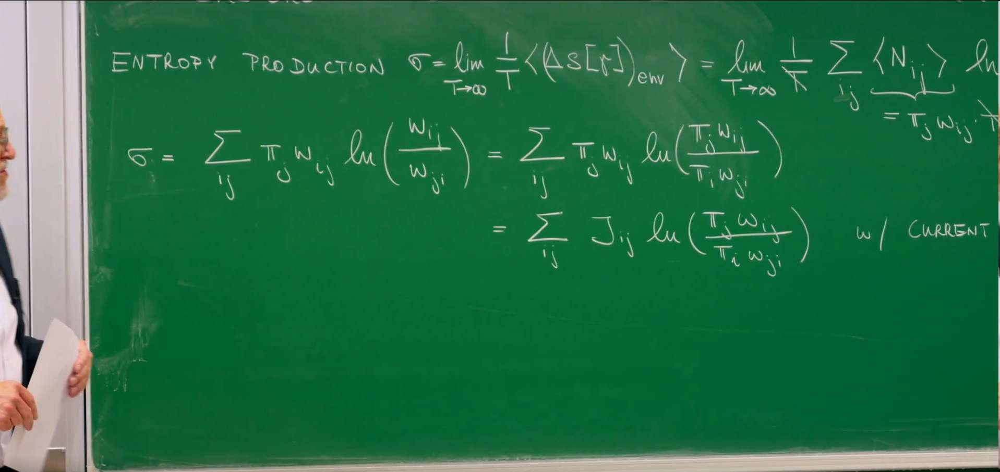
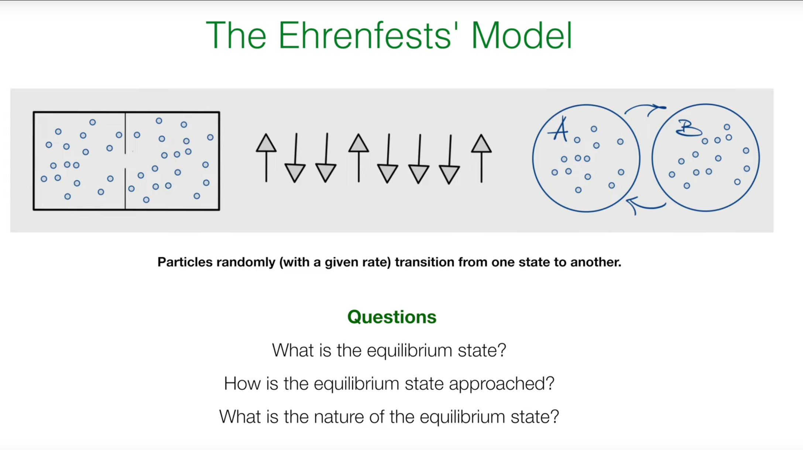
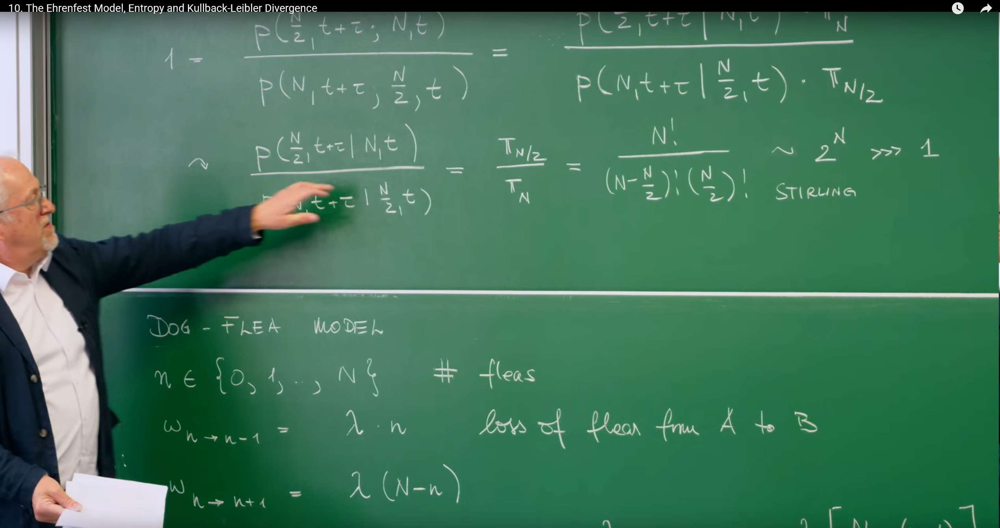
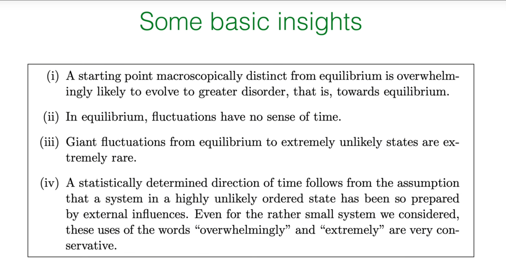

# Preface: Entropy Production and the Signature of Irreversibility

In the previous lectures (especially 8 and 9) we studied the master equation and distinguished global balance from detailed balance. Detailed balance implies a steady state, but not every steady state satisfies detailed balance. This distinction is key for nonequilibrium physics and leads us to irreversibility.

In a nonequilibrium steady state (NESS), macroscopic observables (e.g., the distribution) are time‑independent, yet persistent probability currents flow inside the system. These net currents signal irreversibility. To quantify it we use the entropy production rate.

## Quantifying Irreversibility: Entropy Production Rate $\sigma$



When reviewing the previous lecture content, the professor first presented the expression for the entropy production rate $\sigma$:

$$
\sigma = \sum_{i j} \pi_j w_{i j} \ln\left(\frac{w_{j i}}{w_{i j}}\right)
$$

Let us analyze this formula:

* $\pi_j$ is the steady-state probability of the system being in state $j$.

* $w_{ij}$ is the transition rate from state $j$ to state $i$.

* Therefore, $\pi_j w_{ij}$ represents the **probability flux** from state $j$ to state $i$ in the steady state.

* The logarithmic term $\ln\left(\frac{w_{j i}}{w_{i j}}\right)$ measures the **asymmetry** between the forward process ($j \to i$) and the reverse process ($i \to j$) rates. If $w_{ij} = w_{ji}$, this term vanishes, indicating that this pair of transitions is reversible.

The entire expression $\sigma$ is the sum of rate asymmetries weighted by probability fluxes for all possible transitions in the system. Therefore, $\sigma$ precisely quantifies the temporal asymmetry or irreversibility of the entire system at the macroscopic level.

Next, through a clever mathematical transformation, the professor gave another equivalent form of $\sigma$:

$$
\sigma = \sum_{i j} \pi_j w_{i j} \ln\left(\frac{\pi_i w_{j i}}{\pi_j w_{i j}}\right)
$$

This transformation is not an approximation but is exact. The derivation utilizes the global balance condition of the steady state $\sum_j [\pi_j w_{j i} - \pi_i w_{i j}] = 0$. Through this condition, one can prove an identity $\sum_{i j} \pi_j w_{i j} \ln(\pi_j / \pi_i) = 0$. By adding this zero term inside the logarithm of the original $\sigma$ expression, the new form is obtained.

This new form is conceptually more profound. The term inside the logarithm becomes the ratio of **forward flux** $\pi_j w_{ij}$ to **reverse flux** $\pi_i w_{ji}$. This directly reflects that entropy production originates from the net circulation of probability flow within the system.

An equivalent symmetric expression over unordered pairs is

$$
\sigma \,=\, \sum_{i<j} J_{i j}\,\ln\!\left(\frac{w_{i\to j}}{w_{j\to i}}\right),\quad
J_{i j}:=\pi_i w_{i\to j}-\pi_j w_{j\to i}.
$$

This makes explicit the universal (flux)$\times$(force) structure with thermodynamic force (affinity) $A_{i j}:=\ln\!\left(\frac{w_{i\to j}}{w_{j\to i}}\right)$.

The entropy production rate has two fundamental properties:

1. **Nonnegativity**: $\sigma \geq 0$. This is a mathematical conclusion based on **Jensen's inequality**. Its physical significance is extremely profound: the steady-state entropy production rate of any system can only be positive or zero, never negative. This is the manifestation of the second law of thermodynamics in stochastic processes.

2. **Relation to detailed balance**:

   * $\sigma = 0$ if and only if the system satisfies **detailed balance** (DB). Under detailed balance, the forward and reverse fluxes between every pair of states are equal, i.e., $\pi_j w_{ij} = \pi_i w_{ji}$, so the logarithmic terms are zero everywhere. This corresponds to true thermodynamic equilibrium.

   * When the system is in a **nonequilibrium steady state** (NESS), $\sigma > 0$. In this case, at least one net probability current $J_{ij} = \pi_j w_{ij} - \pi_i w_{ji} \neq 0$ exists.

Therefore, $\sigma$ is not merely a "switch" to determine whether a system is in equilibrium; its **numerical magnitude** itself is a measure that quantitatively describes the degree to which a system deviates from detailed balance (i.e., reversible equilibrium). The larger $\sigma$, the stronger the probability flow circulation within the system, the further the system is driven from equilibrium, and the stronger its irreversibility.

## 1. Ehrenfest Model: A Simple System for Big Ideas

## 1.1 The Classic Model



To understand more concretely the nature of irreversibility, entropy, and equilibrium, the professor introduced a classic pedagogical model in physics—the **Ehrenfest Model**. This model was proposed by Paul Ehrenfest and Tatyana Ehrenfest in the early 20th century, aiming to clarify the statistical nature of the second law of thermodynamics, rather than an absolute law.

The emergence of the Ehrenfest Model was to solve a core paradox in statistical mechanics: how the irreversible processes we observe in the macroscopic world (such as gas always diffusing from high-pressure regions to low-pressure regions, conforming to the second law of thermodynamics) emerge from microscopically completely reversible physical laws.

To this end, the physicist Ehrenfest couple designed an extremely simple "urn model" (or "dog-flea model"): imagine two boxes and $N$ distinguishable particles, randomly select one particle at each step and move it to the other box. Although each microscopic move is reversible, the model clearly demonstrates that the system will evolve with overwhelming probability from any imbalanced initial state (such as all particles in one box) to the most probable macroscopic equilibrium state (roughly equal distribution of particles in both boxes).

Therefore, it is not meant to simulate a specific physical system, but as a classic thought experiment and pedagogical tool, it profoundly reveals that macroscopic irreversibility is essentially a statistical phenomenon, and provides the most intuitive and simplest mathematical example for understanding equilibrium states, detailed balance, and how entropy serves as the driving force for the system to approach equilibrium.

This seemingly simple model, by simulating random jumps of particles between two containers, is sufficient to help us answer three fundamental questions:

1. What is the equilibrium state of the system?

2. How does the system approach equilibrium?

3. What is the nature of equilibrium?

## 1.2 Formal Description of the "Dog-Flea" Model

The model has a vivid metaphor: imagine two dogs (A and B) and $N$ fleas. The fleas will randomly jump between the two dogs at a certain rate. We are concerned with the number of fleas on dog A.

The formal definition of the model is as follows:

**State**: The macroscopic state of the system is defined by the number of fleas $n$ on dog A, where $n$ can take integer values $0, 1, \ldots, N$.

**Transition rates**:

**Losing a flea** (from A to B): The rate from state $n$ to $n-1$ is $\omega_{n \to n-1} = \lambda n$.

**Gaining a flea** (from B to A): The rate from state $n$ to $n+1$ is $\omega_{n \to n+1} = \lambda (N-n)$.

The setting of these rates is very intuitive:

The rate at which dog A loses fleas should be proportional to the number of fleas $n$ it already has, because each flea has the possibility of jumping away at rate $\lambda$ per unit time.

The rate at which dog A gains fleas should be proportional to the number of fleas on the other dog B, i.e., $(N-n)$.

This simple linear dependence is the core feature of the model. For ease of understanding, we summarize the key components of the model in the table below.

## 2. The Nature of Equilibrium: Detailed Balance and the Binomial Distribution

## 2.1 Finding the Steady State

**Now let us answer the first question: what is the equilibrium state (i.e., the steady-state probability distribution $\pi_n$) of this system?**

Since there are no external driving forces in this system (such as a "flea pump") to create sustained circulation flows, we can expect the system to eventually relax to a true thermodynamic equilibrium state. Such an equilibrium state must satisfy the stronger **detailed balance** condition.

The detailed balance condition requires that in the steady state, the forward and reverse probability flows between any two adjacent states must be equal:

$$
\pi_n \cdot \omega_{n \to n-1} = \pi_{n-1} \cdot \omega_{n-1 \to n}
$$

Substituting the specific rates of our model:

$$
\pi_n \cdot (\lambda n) = \pi_{n-1} \cdot (\lambda (N-(n-1)))
$$

## 2.2 Solving the Recurrence Relation

By solving the above equation, we can obtain the steady-state distribution $\pi_n$.

First, eliminating the rate constant $\lambda$, we get a **recurrence relation** for $\pi_n$:

$$
\pi_n = \frac{n}{N-n+1} \pi_{n-1}
$$

We can "unfold" this relation to express $\pi_n$ in terms of $\pi_0$:

$$
\pi_n = \frac{n}{N-n+1} \cdot \frac{n-1}{N-n+2} \pi_{n-2} = \ldots = \frac{n! N (N-1) \ldots (N-n+1)}{1} \pi_0
$$

We recognize that the fractional part on the right is exactly the definition of the binomial coefficient, i.e., $\binom{N}{n} = \frac{N!}{n!(N-n)!}$. So:

$$
\pi_n = \binom{N}{n} \pi_0
$$

Finally, we use the **normalization condition** for probabilities $\sum_{n=0}^{N} \pi_n = 1$ to determine the constant $\pi_0$:

$$
\sum_{n=0}^{N} \binom{N}{n} \pi_0 = \pi_0 \sum_{n=0}^{N} \binom{N}{n} = 1
$$

According to the binomial theorem, we know that $\sum_{n=0}^{N} \binom{N}{n} = 2^N$. Therefore, $\pi_0 = 1/2^N$.

Substituting $\pi_0$ back, we obtain the final steady-state distribution:

$$
\pi_n = \frac{1}{2^N} \binom{N}{n}
$$

This is a binomial distribution.

## 2.3 Physical Interpretation of the Result

This result is very intuitive. We can understand it from a more fundamental level—**microstates**. A microstate precisely specifies which dog each flea is on. Assuming each flea has two possibilities $\{+1, -1\}$ (representing dog A and dog B respectively), there are a total of $2^N$ different microstates.

If we assume that when the system reaches equilibrium, all $2^N$ microstates are **equally likely**, then the probability of each microstate occurring is $1/2^N$. How many microstates correspond to macrostate $n$ (i.e., $n$ fleas on dog A)? This is equivalent to the number of ways to choose $n$ fleas from $N$ fleas to place on dog A, which is $\binom{N}{n}$.

Therefore, the probability of macrostate $n$ is:

$$
P_n = (\text{Number of microstates corresponding to macrostate } n) \times (\text{Probability of each microstate}) = \binom{N}{n} \cdot \frac{1}{2^N}
$$

This is completely consistent with the result we derived through dynamics (detailed balance). **This shows that the dynamic process of the Ehrenfest model ultimately results in the system exploring all possible microstates and staying in them with equal probability.**

This binomial distribution has mean $\langle n \rangle = N/2$ and standard deviation $\sigma_n = \frac{1}{2}\sqrt{N}$. This means that at equilibrium, we are most likely to find fleas roughly equally distributed on both dogs, with fluctuations around the mean.

When we consider a large system, i.e., when $N$ becomes very large (thermodynamic limit), a profound phenomenon emerges. The relative size of fluctuations is:

$$
\frac{\sigma_n}{\langle n \rangle} = \frac{\frac{1}{2}\sqrt{N}}{N/2} = \frac{1}{\sqrt{N}}
$$

When $N \to \infty$, this ratio tends to zero. This means that although the absolute size of fluctuations ($\propto \sqrt{N}$) is increasing, relative to the average, it becomes negligible. This is how a macroscopically "sharp," predictable equilibrium state (like the temperature or pressure of gas in a container) emerges from a microscopically chaotic, fluctuating world. The Ehrenfest model perfectly demonstrates the law of large numbers in a physical context.

## 3. The Statistical Arrow of Time: Reconciling Microscopic Reversibility with Macroscopic Irreversibility

## 3.1 The Core Paradox

Now we address the most central problem. The microscopic dynamics of the model is time-reversible: a flea jumping from A to B and from B to A are equally reasonable physical processes. So why do we always observe macroscopic irreversible behavior? For example, a system with initial state of all fleas on dog A ($n=N$) always evolves to a roughly equal distribution state ($n \approx N/2$), and we almost never see the reverse process—a system in an equal distribution state spontaneously evolving to a state where all fleas are clustered on one side.

## 3.2 The Story of Two Trajectories

The professor reveals the answer to this paradox by comparing the probabilities of two trajectories.

* **Trajectory 1 (forward)**: The system is in a highly improbable state $n=N$ at time $t$ and evolves to the most probable state $n=N/2$ at time $t+\tau$.

* **Trajectory 2 (reverse)**: The system is in the most probable state $n=N/2$ at time $t$ and evolves to a highly improbable state $n=N$ at time $t+\tau$.



Let us calculate the ratio of the joint probabilities of these two complete paths:

$$
\frac{P(n=\frac{N}{2} \text{ at } t+\tau; n=N \text{ at } t)}{P(n=N \text{ at } t+\tau; n=\frac{N}{2} \text{ at } t)}
$$

Using the definition of conditional probability $P(A, B) = P(A|B)P(B)$, where $P(B)$ is the probability of the initial state given by the steady-state distribution $\pi$, the above can be rewritten as:

$$
= \frac{P(\frac{N}{2}, t+\tau | N, t) \cdot \pi_N}{P(N, t+\tau | \frac{N}{2}, t) \cdot \pi_{N/2}}
$$

Here, the professor makes a key approximation: for a system described by the master equation, the conditional probabilities of transitions are symmetric in some sense, i.e., the conditional probability of transitioning from one state to another is roughly equivalent to the conditional probability of the reverse process. Therefore, $P(N/2, t+\tau | N, t) \approx P(N, t+\tau | N/2, t)$.

This way, the entire ratio simplifies to the ratio of the steady-state probabilities of the two endpoint states:

$$
\approx \frac{\pi_N}{\pi_{N/2}}
$$

Substituting our derived binomial distribution result:

$$
\frac{\pi_N}{\pi_{N/2}} = \frac{\frac{1}{2^N} \binom{N}{N}}{\frac{1}{2^N} \binom{N}{N/2}} = \frac{\binom{N}{N}}{\binom{N}{N/2}} = \frac{1}{\binom{N}{N/2}} = \frac{(N/2)! (N/2)!}{N!}
$$

Using Stirling's approximation $N! \approx \sqrt{2\pi N} \left(\frac{N}{e}\right)^N$, we can estimate that this ratio is approximately $2^{-N}$. Even for a moderately sized system, say $N=50$, this ratio is an astronomical number ($\approx 10^{-15}$).

This means that the path from an ordered state ($n=N$) evolving to a disordered state ($n=N/2$) is astronomically more likely than its time-reversed path.

## 3.3 Resolution of the Paradox: Microstates vs. Macrostates

The key here lies in distinguishing **microstates** and **macrostates**. Macroscopic irreversibility does not arise from temporal asymmetry in the underlying physical laws, but from pure, overwhelming statistics.

* Macrostate $n=N$ corresponds to only **1** microstate (all fleas on dog A).

* Macrostate $n=N/2$ corresponds to $\binom{N}{N/2}$ microstates, which is a huge number.

The system is not being "pulled" toward equilibrium by some mysterious force; it is simply exploring all $2^N$ possible microstates equally. Since the number of microstates corresponding to the equilibrium macrostate is so vast, the system will spend the vast majority of its time in one of these microstates. Therefore, starting from a macrostate with only one microstate, the system will almost inevitably evolve to a macrostate with a huge number of microstates. The reverse process is not impossible, but its probability is so small that it is almost unobservable even on the time scale of the age of the universe.

This leads to a profound conclusion about the arrow of time. "A statistically determined direction of time arises from the assumption that a system in an extremely improbable ordered state is 'prepared' by external influences." We can only perceive the arrow of time because we (or nature) can create a low-entropy, highly ordered initial state. Starting from this special starting point, overwhelming probability determines that it must inevitably move toward disorder. If we observe a system already in equilibrium, we see it making small, symmetric fluctuations around the average. At this point, "a movie of these fluctuations, played forward or backward, is statistically indistinguishable," because near equilibrium, "fluctuations have no sense of time direction." Therefore, the arrow of time is not an intrinsic property of dynamics itself, but arises from a very special, nonequilibrium initial condition.

## 4. Simulating the Ehrenfest Model in Python

We use the Gillespie algorithm for continuous‑time Markov processes: compute the total exit rate, draw an exponential waiting time, then choose the jump by relative rates.

## 4.1 Simulating Trajectories


```python
import numpy as np
import matplotlib.pyplot as plt

def simulate_ehrenfest_trajectory(N=50, n_initial=50, lambda_rate=1.0, t_max=40):
    """
    Simulate a single trajectory of the Ehrenfest model using the Gillespie algorithm.
    """
    t = 0.0
    n = n_initial
    times = [t]
    n_values = [n]
    while t < t_max:
        rate_gain = lambda_rate * (N - n)
        rate_lose = lambda_rate * n
        total_rate = rate_gain + rate_lose
        if total_rate == 0:
            break
        dt = np.random.exponential(1.0 / total_rate)
        t += dt
        if t > t_max:
            break
        if np.random.rand() < rate_gain / total_rate:
            n += 1
        else:
            n -= 1
        times.append(t)
        n_values.append(n)
    return times, n_values

# --- Simulation parameters ---
N = 50
mean_n = N / 2
std_n = 0.5 * np.sqrt(N)
lambda_rate_sim = 1.0

fig, (ax1, ax2) = plt.subplots(1, 2, figsize=(14, 6))
fig.suptitle('Stochastic Trajectories', fontsize=20, color='darkgreen')

# Left: relaxation from far from equilibrium
num_trajectories = 4
n_initial_short = 5
t_max_short = 50
for i in range(num_trajectories):
    times, n_values = simulate_ehrenfest_trajectory(N=N, n_initial=n_initial_short, lambda_rate=lambda_rate_sim, t_max=t_max_short)
    ax1.step(times, n_values, where='post')
ax1.axhline(mean_n, color='orangered', linestyle='--', lw=2.5, label=r'$\langle n \rangle$')
ax1.axhline(mean_n + std_n, color='green', linestyle='-.', lw=2.5, label=r'$\langle n \rangle \pm \sigma$')
ax1.axhline(mean_n - std_n, color='green', linestyle='-.', lw=2.5)
ax1.set_xlabel('time'); ax1.set_ylabel('Fleas on Alice')
ax1.set_xlim(0, t_max_short); ax1.set_ylim(0, 38)
ax1.legend(loc='lower right'); ax1.grid(True)

# Right: long equilibrium fluctuations
n_initial_long = int(mean_n); t_max_long = 5000
times_long, n_values_long = simulate_ehrenfest_trajectory(N=N, n_initial=n_initial_long, lambda_rate=lambda_rate_sim, t_max=t_max_long)
ax2.plot(times_long, n_values_long, lw=0.8)
ax2.axhline(mean_n, color='orangered', linestyle='--', lw=2.5)
ax2.axhline(mean_n + std_n, color='green', linestyle='-.', lw=2.5)
ax2.axhline(mean_n - std_n, color='green', linestyle='-.', lw=2.5)
ax2.set_xlabel('time'); ax2.set_xlim(0, t_max_long); ax2.set_ylim(0, 38); ax2.grid(True)

plt.tight_layout(rect=[0, 0.03, 1, 0.95])
plt.show()
```


The system quickly relaxes from $n=50$ to $\langle n\rangle=25$ and then fluctuates around the mean within roughly one standard deviation.

### 4.2 Verifying the Equilibrium Distribution


```python
import numpy as np
import matplotlib.pyplot as plt
from scipy.special import comb
from collections import Counter

def simulate_ehrenfest_trajectory(N=50, n_initial=5, lambda_rate=1.0, t_max=50):
    t = 0.0; n = n_initial
    times, n_values = [t], [n]
    while t < t_max:
        rate_gain = lambda_rate * (N - n)
        rate_lose = lambda_rate * n
        total_rate = rate_gain + rate_lose
        if total_rate == 0: break
        dt = np.random.exponential(1.0 / total_rate)
        t += dt
        if t > t_max: break
        if np.random.rand() < rate_gain / total_rate:
            n += 1
        else:
            n -= 1
        times.append(t); n_values.append(n)
    return times, n_values

def simulate_for_distribution(N=50, lambda_rate=1.0, num_steps=100000):
    n = N // 2
    n_counts = np.zeros(N + 1, dtype=int)
    for _ in range(num_steps):
        rate_gain = lambda_rate * (N - n)
        rate_lose = lambda_rate * n
        total_rate = rate_gain + rate_lose
        if total_rate == 0: break
        if np.random.rand() < rate_gain / total_rate:
            n += 1
        else:
            n -= 1
        n_counts[n] += 1
    return n_counts / num_steps

N = 50; mean_n = N/2; std_n = 0.5*np.sqrt(N)
fig, (ax1, ax2) = plt.subplots(1, 2, figsize=(14, 6))
fig.suptitle('Equilibrium Distribution', fontsize=20, color='darkgreen')

times, n_values = simulate_ehrenfest_trajectory(N=N, n_initial=5, t_max=50)
ax1.step(times, n_values, where='post')
ax1.axhline(mean_n, color='orangered', linestyle='--', lw=2)
ax1.axhline(mean_n + std_n, color='green', linestyle='-.', lw=2)
ax1.axhline(mean_n - std_n, color='green', linestyle='-.', lw=2)
ax1.set_xlabel('time'); ax1.set_ylabel('Fleas on Alice')
ax1.set_xlim(0, 50); ax1.set_ylim(0, 35); ax1.grid(True)

simulated_dist = simulate_for_distribution(N=N, num_steps=5_000_000)
n_range = np.arange(N + 1)
analytical_dist = comb(N, n_range) / (2**N)
ax2.bar(n_range, simulated_dist, width=1.0, label='simulation', alpha=0.7, color='steelblue', edgecolor='black', linewidth=0.8)
ax2.plot(n_range, analytical_dist, 'ko-', markerfacecolor='black', markeredgecolor='black', markersize=4, lw=1.0, label='analytic solution')
ax2.set_xlabel('Fleas on Alice'); ax2.set_ylabel('Probability')
ax2.set_xlim(12, 38); ax2.set_ylim(0, 0.125)
ax2.legend(); ax2.grid(axis='y', linestyle='--', alpha=0.7)

plt.tight_layout(rect=[0, 0.03, 1, 0.95])
plt.show()
```


The empirical distribution matches the binomial prediction.

## 5. Quantifying the Journey to Equilibrium: Statistical Entropy and KL Divergence

We have qualitatively described how the system approaches equilibrium. Now we want to quantitatively characterize this process with a quantity. This quantity is **entropy**.


## 5.1 Defining Time-Dependent Entropy

In statistical mechanics, the most fundamental definition of entropy is the Gibbs/Shannon entropy, which measures the uncertainty or "spread" of the probability distribution over all possible microstates:

$$
S(t) := -\sum_{\{\sigma_i\}} p(\{\sigma_i\}, t) \ln p(\{\sigma_i\}, t)
$$

where the sum runs over all $2^N$ microstates $\{\sigma_i\}$, and $p(\{\sigma_i\}, t)$ is the probability that the system is in a specific microstate at time $t$.

## 5.2 From Micro to Macro Entropy

Directly handling microstate probabilities is usually difficult. The professor shows how to transition from the microscopic definition to entropy expressed in terms of macrostate probabilities $p_n(t)$. The core assumption is: at any time $t$, all $\binom{N}{n}$ microstates belonging to the same macrostate $n$ are equally likely. Therefore, the relationship between macrostate and microstate probabilities is:

$$
p_n(t) = \binom{N}{n} p(\{\sigma_i\}, t)
$$

Substituting this relationship into the entropy definition and simplifying, we obtain the macro-entropy expression:

$$
S(t) = -\sum_{n=0}^{N} p_n(t) \ln p_n(t) + \sum_{n=0}^{N} p_n(t) \ln \binom{N}{n}
$$

This formula reveals that the total entropy consists of two parts:

1. **First term** $-\sum p_n \ln p_n$: This is the entropy of uncertainty about which **macrostate** the system is in.

2. **Second term** $\sum p_n \ln \binom{N}{n}$: This is the average uncertainty about **microstates** given the macrostate distribution $p_n(t)$. Each term $\ln \binom{N}{n}$ is the Boltzmann entropy of macrostate $n$ (proportional to the logarithm of its number of microstates), and the entire sum is the expectation value of this Boltzmann entropy under the current macrostate distribution.

## 5.3 KL Divergence: Measuring "Distance" to Equilibrium

To describe the difference between the system's current state $p_n(t)$ and the final equilibrium state $\pi_n$, the professor introduces a powerful tool from information theory—the **Kullback-Leibler Divergence** (KL divergence):

$$
H(t) = \sum_n p_n(t) \ln \left(\frac{p_n(t)}{\pi_n}\right)
$$

The KL divergence $H(t)$ is an asymmetric measure used to quantify the "deviation" of probability distribution $p_n(t)$ relative to the reference distribution $\pi_n$. It is always non-negative ($H(t) \geq 0$), and equals zero if and only if the two distributions are identical (i.e., $p_n(t) = \pi_n$ for all $n$). In our physical context, $H(t)$ quantitatively describes the "information distance" between the system's current probability distribution and its final equilibrium distribution.

The most profound connection lies in a simple relationship between the KL divergence and the macro-entropy we defined:

$$
H(t) = S_\infty - S(t)
$$

where $S_\infty$ is the maximum entropy when the system reaches equilibrium. This relationship shows that the process of $H(t)$ monotonically decreasing to zero over time is completely equivalent to the process of the system's entropy $S(t)$ monotonically increasing to its maximum value $S_\infty$. This provides a formal, quantitative description of the second law of thermodynamics (entropy increase principle), known as the H-theorem.

## 5.4 Simulating Entropy Evolution

To visualize the evolution of entropy and KL divergence, we need to simulate an **ensemble**, i.e., a large number of independent system copies. By statistically analyzing the states of the ensemble at different times, we can approximate the time-dependent probability distribution $p_n(t)$.

```python
import numpy as np
import matplotlib.pyplot as plt
from scipy.special import comb

def simulate_ensemble(N=30, n_initial=30, num_trajectories=5000, t_points=np.linspace(0, 15, 100)):
    """
    Simulates an ensemble of Ehrenfest trajectories to calculate p_n(t).
    Returns p_n_t with p_n_t[i, j] = p_j(t_i).
    """
    # Tau-leaping approximation for speed (sufficient for demonstration)
    p_n_t = np.zeros((len(t_points), N + 1))
    p_n_t[0, n_initial] = 1.0
    dt = t_points[1] - t_points[0] if len(t_points) > 1 else 0
    lambda_rate = 0.1
    for i in range(1, len(t_points)):
        p_prev = p_n_t[i-1, :]
        p_curr = np.copy(p_prev)
        for n in range(N + 1):
            p_curr[n] -= p_prev[n] * lambda_rate * (n + (N - n)) * dt
            if n > 0:
                p_curr[n] += p_prev[n-1] * lambda_rate * (N - (n - 1)) * dt
            if n < N:
                p_curr[n] += p_prev[n+1] * lambda_rate * (n + 1) * dt
        p_n_t[i, :] = p_curr
    return p_n_t

N = 30
t_eval = np.linspace(0, 15, 150)
p_n_t = simulate_ensemble(N=N, n_initial=N, t_points=t_eval)

pi_n = comb(N, np.arange(N + 1)) / (2**N)
log_comb_N_n = np.log(comb(N, np.arange(N + 1)))

S_t, H_t = [], []
for p_n in p_n_t:
    p_n_safe = p_n[p_n > 0]
    pi_n_safe = pi_n[p_n > 0]
    term1 = -np.sum(p_n_safe * np.log(p_n_safe))
    term2 = np.sum(p_n * log_comb_N_n)
    S_t.append(term1 + term2)
    H_t.append(np.sum(p_n_safe * np.log(p_n_safe / pi_n_safe)))

fig, (ax1, ax2) = plt.subplots(1, 2, figsize=(14, 6))
ax1.plot(t_eval, S_t); ax1.set_title('Statistical Entropy S(t)')
ax1.set_xlabel('Time'); ax1.set_ylabel('Entropy S(t)'); ax1.grid(True)
ax2.plot(t_eval, H_t); ax2.set_title('Kullback-Leibler Divergence H(t)')
ax2.set_xlabel('Time'); ax2.set_ylabel('KL Divergence H(t)'); ax2.grid(True)
plt.tight_layout(); plt.show()
```


Running this code, we will get two plots: one showing entropy $S(t)$ monotonically increasing from a low initial value (corresponding to a highly ordered initial state) and eventually saturating at a maximum; the other showing KL divergence $H(t)$ starting from a positive value, monotonically decreasing, and eventually approaching zero. These two plots vividly visualize the operation of the second law of thermodynamics in the Ehrenfest model.

## Summary: Basic Insights of Statistical Mechanics

Some basic insights:

(i) A macroscopically imbalanced initial state overwhelmingly evolves toward more disordered, near-equilibrium states.

(ii) In equilibrium, fluctuations have no arrow of time.

(iii) Large fluctuations away from equilibrium (to extremely improbable states) are exceedingly rare.

(iv) Through detailed analysis and simulation of the Ehrenfest model, we have actually touched upon several of the most central ideas of statistical mechanics. The professor summarizes four "basic insights" at the end of the lecture, which are a perfect summary of this lecture's content:



**1. A macroscopically imbalanced initial state will evolve with overwhelming probability toward more disordered, near-equilibrium states.**

This is exactly what we revealed through calculating the probability ratio $\pi_{N/2}/\pi_N \sim 2^{-N}$. The system approaches equilibrium not because there is some "force" driving it, but because the number of microstates corresponding to the equilibrium state is simply too vast.

**2. In equilibrium, fluctuations have no arrow of time.**

This is closely related to the concept of detailed balance. Near equilibrium, the system jumps back and forth between two states with similar probabilities, and the forward and reverse processes are statistically indistinguishable.

**3. Large fluctuations from equilibrium (i.e., evolution to extremely improbable states) are exceedingly rare.**

This is a direct consequence of the properties of the binomial distribution. The probability distribution forms a sharp peak at the mean, with probabilities dropping exponentially for states far from the mean, making the spontaneous generation of macroscopically ordered states virtually impossible.

**4. A statistically determined arrow of time originates from the assumption that a system is prepared in a highly ordered, very improbable state. Even for the relatively small system we considered, using words like "overwhelmingly" and "exceedingly" is very conservative.**

A statistically determined arrow of time arises from our assumption that the system is "prepared" in a highly improbable ordered state. This is the most profound insight into the origin of the "arrow of time." We see irreversibility because we always start observing from a special, low-entropy initial condition. **The arrow of time is not an intrinsic property of physical laws, but a reflection of the initial conditions of the universe (or our experiments).**

In summary, despite its extreme simplicity, the Ehrenfest model allows us to clearly observe and understand the **cornerstones of statistical mechanics—irreversibility, entropy, equilibrium, and the statistical origin of the arrow of time.**
