# Introduction

In previous lectures, Prof. Erwin Frey discussed Markov processes for systems with discrete states, such as molecule counts or gene switch states. Many phenomena in nature, however, are intrinsically continuous: a particle's position in a fluid, a concentration field in a chemical reaction, or a cell's migration in tissue. The goal of this lecture is to extend our Markov-process framework from discrete to continuous state spaces.

This extension is not a trivial mathematical tweak; it reveals two distinct classes of stochastic dynamics and ultimately leads us to two core evolution equations that describe system evolution. For systems whose states undergo instantaneous changes of finite magnitude (e.g., molecular motor steps), we will derive an integro–differential master equation. For systems whose states change continuously and smoothly (e.g., Brownian motion), we will derive the celebrated Fokker–Planck equation, a partial differential equation.

# 1. Review of the Master Equation

Before entering the world of continuous state spaces, we briefly review the key concepts and equations for discrete Markov processes—the foundation on which the extension will be built.

## 1.1 Chapman–Kolmogorov Equation

The theoretical foundation of all Markov processes lies in the Markov property: the future depends only on the present, not on the past. This property's mathematical embodiment is the **Chapman–Kolmogorov equation**:

$$
 p(n,t\mid n_0,t_0) = \sum_{n'} p(n,t\mid n',t')\, p(n',t'\mid n_0,t_0) \quad \text{for } t_0 \le t' \le t.
$$

Physically, this says: the total probability of being in state $n$ at time $t$ starting from $n_0$ at $t_0$ equals the sum over all possible intermediate states $n'$ at an intermediate time $t'$. It describes how probability propagates via $t'$.

## 1.2 Master Equation

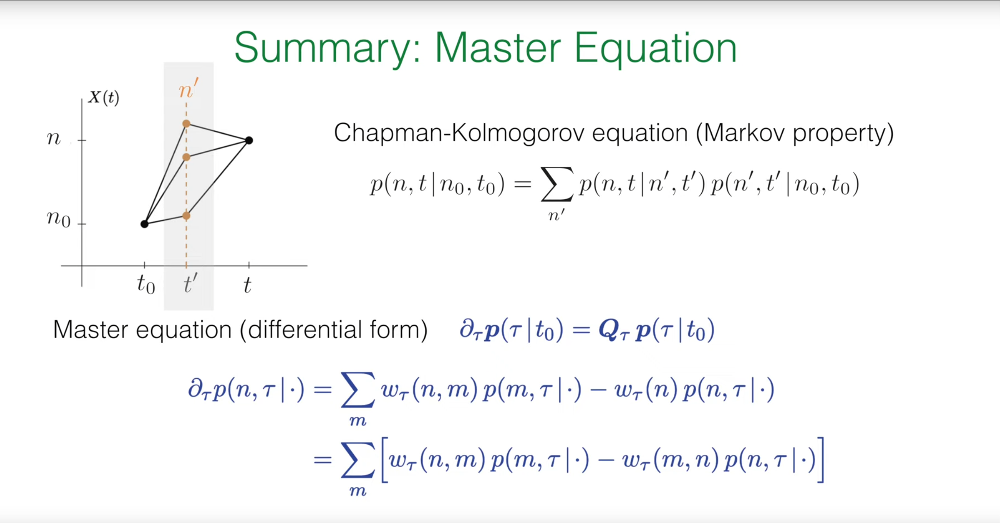

Writing the Chapman–Kolmogorov equation in differential form yields the master equation for continuous-time evolution:

$$
 \frac{d}{dt} p(t) = Q\, p(t).
$$

Here $p(t)$ is a column vector with elements $p(n,t)$ (the probability of being in state $n$ at time $t$), and $Q$ is the transition-rate matrix.

More concretely, the "gain–loss" form is

$$
 \partial_t p(n,t\mid\cdot) = \sum_m w(n,m)\, p(m,t\mid\cdot) - w(n)\, p(n,t\mid\cdot),
$$

where $w(n,m)$ is the rate from state $m$ to $n$, and the total outflow rate is $w(n)=\sum_m w(m,n)$. The interpretation is intuitive: the time rate of change of $p(n,t)$ equals the total inflow from all other states minus the total outflow from $n$.

Rearranging terms gives the "net-current" form:

$$
 \partial_t p(n,t\mid\cdot) = \sum_m \big[ w(n,m)\, p(m,t\mid\cdot) - w(m,n)\, p(n,t\mid\cdot) \big],
$$

highlighting the net probability current between each pair $(n,m)$.

## 1.3 Core Results for Irreducible Markov Processes

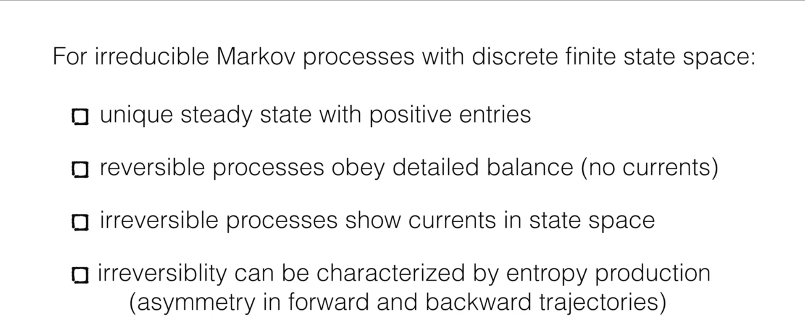

For finite, irreducible Markov processes (every state can reach every other state in finitely many steps), we have:

- A unique steady-state distribution $p^{\mathrm{ss}}$ with strictly positive components.
- If the process is reversible, it satisfies detailed balance: $w(n,m)\, p_m^{\mathrm{ss}} = w(m,n)\, p_n^{\mathrm{ss}}$. In steady state, the net current between any two states vanishes.
- If the process is irreversible, steady state exhibits sustained probability currents forming cycles.
- Irreversibility can be quantified by entropy production, reflecting asymmetry between forward and backward trajectories.

These notions—especially detailed balance—are central to equilibrium physics and also underpin powerful computational methods such as Markov chain Monte Carlo.

# 2. Markov Chain Monte Carlo (MCMC)

Markov chain Monte Carlo (MCMC) was initiated by Nicholas Metropolis and coauthors in 1953 (the Metropolis algorithm) and later generalized by W. K. Hastings, among others.

MCMC addresses a fundamental difficulty in physics and statistics: computing averages or sampling from complex distributions over enormous (even infinite) state spaces, where direct summation or integration is infeasible. The core idea is to "trade time for space": rather than exhaustively scanning the space, design a Markov chain that forgets its initial condition and converges to a unique steady-state distribution equal to the target (e.g., the Boltzmann distribution in physics).

## 2.1 Core Idea: Sampling with Markov Chains

In statistical physics, we often need to compute ensemble averages of physical quantities $A$, such as magnetization or energy. The definition is:

$$\langle A(X) \rangle = \sum_i A(X_i)p_i$$

where $X_i$ is a microstate of the system (e.g., a specific spin configuration), and $p_i$ is the probability of that state. For systems in thermal equilibrium, this probability is given by the canonical ensemble's Boltzmann distribution:

$$p_i = \frac{1}{Z} e^{-E_i/k_B T}$$

where $E_i$ is the energy of state $i$, $T$ is temperature, $k_B$ is Boltzmann's constant, and $Z$ is the partition function.

The problem is that for a system with many particles (e.g., a $50\times 50$ Ising model with $2^{2500}$ states), direct computation of this sum is absolutely impossible.

**Markov Chain Monte Carlo (MCMC)** provides an elegant solution. The core idea is: instead of trying to enumerate all states, we design an auxiliary Markov process whose steady-state distribution is exactly the target distribution $p_i$ we want to sample from. Then, we let this Markov process evolve for a sufficiently long time, and the sequence of states it visits $X_1,X_2,\ldots,X_N$ will be like samples drawn from $p_i$. Thus, the complex ensemble average calculation becomes a simple arithmetic average:

$$\langle A(X) \rangle \approx \frac{1}{N}\sum_{k=1}^N A(X_k)$$

## 2.2 Metropolis Algorithm

How can we cleverly design a Markov process whose steady state is exactly the Boltzmann distribution? The Metropolis algorithm provides a very elegant and general answer.

1. **Goal**: Construct a Markov process with transition rates $w_{i\to j}$ such that its steady-state distribution $p_i^{ss}$ is proportional to $p_i^{\text{therm}}=e^{-E_i/k_B T}$.

2. **Sufficient condition**: Based on our review, **detailed balance** is a sufficient condition to guarantee the system reaches the desired steady state. We only need the transition rates to satisfy:

$$w_{i\to j}p_i^{\text{therm}}=w_{j\to i}p_j^{\text{therm}}$$

3. **Derivation**: Substituting the expression for $p_i^{\text{therm}}$, we obtain the requirement for the transition rate ratio:

$$\frac{w_{j\to i}}{w_{i\to j}}=\frac{p_i^{\text{therm}}}{p_j^{\text{therm}}}=\frac{e^{-E_i/k_B T}}{e^{-E_j/k_B T}}=e^{-(E_j-E_i)/k_B T}$$

4. This relationship is the core of the Metropolis algorithm. It connects microscopic dynamics (transition rates) with the system's energy landscape (energy difference).

5. **Metropolis's choice**: There are many choices of $w_{i\to j}$ that satisfy the above ratio. Metropolis proposed a very simple and effective construction method. The algorithm consists of two steps: **propose** and **accept/reject**.

   - **Propose**: From the current state $i$, randomly propose a new state $j$. The simplest way is to make a small random perturbation to state $i$ (e.g., randomly flip a spin in the Ising model). Assume the probability of proposing $j$ from $i$ and proposing $i$ from $j$ is equal (i.e., the proposal distribution is symmetric).

   - **Accept/reject**: Calculate the energy change $\Delta E=E_j-E_i$.

     - If $\Delta E\leq 0$ (new state has lower or equal energy), then **always accept** this proposal, and the system transitions to state $j$.

     - If $\Delta E>0$ (new state has higher energy), then accept this proposal with probability $P_{\text{accept}}=e^{-\Delta E/k_B T}$. Specifically: generate a random number $r$ in $[0,1)$, if $r<P_{\text{accept}}$, then accept the transition; otherwise, **reject** the proposal, and the system **remains in the original state** $i$.

This acceptance criterion, with acceptance probability $\min(1,e^{-\Delta E/k_B T})$, exactly satisfies the detailed balance requirement. It intuitively reflects the physical process: the system tends to evolve toward lower energy states, but due to the presence of thermal fluctuations, it also has a certain probability of jumping to higher energy states, thus being able to explore the entire state space rather than just getting stuck in some local energy minimum.

## 2.3 Python Simulation: 2D Ising Model

To experience the Metropolis algorithm in a concrete setting, we simulate the classic 2D Ising model: a square lattice with spins $S_i=\pm1$ on each site and nearest-neighbor interactions. The Hamiltonian is

$$
 H = -J \sum_{\langle i,j \rangle} S_i S_j,
$$

with $J=1$ and $\langle i,j \rangle$ denoting nearest neighbors. Aligned neighbors ($S_i S_j=1$) lower the energy by $J$, while anti-aligned neighbors raise it by $J$. At low temperature the system tends to a ferromagnetic state of uniform magnetization.

The following Python code implements Metropolis sampling for the 2D Ising model.

```python
import numpy as np
import matplotlib.pyplot as plt
from matplotlib.animation import FuncAnimation

def initialize_lattice(N):
    """
    Initialize an N x N lattice with random spin states of +1 or -1.
    """
    return 2 * np.random.randint(2, size=(N, N)) - 1

def calculate_energy_change(lattice, i, j):
    """
    Calculate the energy change caused by flipping the spin at position (i, j).
    Periodic boundary conditions are used.
    """
    N = lattice.shape[0]
    s_current = lattice[i, j]
    
    # Find spin values of the four neighboring sites (top, bottom, left, right)
    s_top = lattice[(i - 1) % N, j]
    s_bottom = lattice[(i + 1) % N, j]
    s_left = lattice[i, (j - 1) % N]
    s_right = lattice[i, (j + 1) % N]
    
    # Energy change dE = E_final - E_initial
    # E_initial = -J * s_current * (s_top + s_bottom + s_left + s_right)
    # E_final = -J * (-s_current) * (s_top + s_bottom + s_left + s_right)
    # dE = E_final - E_initial = 2 * J * s_current * (sum of neighbors)
    # Set J=1
    dE = 2 * s_current * (s_top + s_bottom + s_left + s_right)
    return dE

def metropolis_sweep(lattice, beta):
    """
    Perform one complete Metropolis scan (N*N attempts).
    beta = 1 / (k_B * T)
    """
    N = lattice.shape[0]
    for _ in range(N * N):
        # Randomly select a lattice site
        i, j = np.random.randint(0, N, size=2)
        
        # Calculate energy change
        dE = calculate_energy_change(lattice, i, j)
        
        # Metropolis acceptance/rejection criterion
        if dE <= 0 or np.random.rand() < np.exp(-beta * dE):
            lattice[i, j] *= -1 # Accept flip
            
    return lattice

# --- Simulation parameters ---
N = 50  # Lattice size
T = 1.5 # Temperature (critical temperature Tc is approximately 2.269)
beta = 1.0 / T
n_sweeps = 3000 # Total number of sweeps for simulation
frame_interval = 50 # Record a frame every this many sweeps

# --- Initialization ---
lattice = initialize_lattice(N)

# Set up visualization
fig, ax = plt.subplots(figsize=(10, 8))
im = ax.imshow(lattice, cmap='RdYlBu', vmin=-1, vmax=1, interpolation='nearest')
ax.set_title(f'2D Ising Model (T = {T:.2f}, Sweep = 0)', fontsize=16)
ax.set_axis_off()

# Add color bar
cbar = plt.colorbar(im, ax=ax, shrink=0.8)
cbar.set_label('Spin', fontsize=14)

# --- Simulation and animation ---
def update(frame):
    global lattice
    # Perform frame_interval sweeps
    for _ in range(frame_interval):
        lattice = metropolis_sweep(lattice, beta)
    im.set_data(lattice)
    ax.set_title(f'2D Ising Model (T = {T:.2f}, Sweep = {frame * frame_interval})', fontsize=16)
    return [im]

# Create animation
ani = FuncAnimation(fig, update, frames=n_sweeps // frame_interval,
                    interval=100, blit=False, repeat=False)

plt.tight_layout()
plt.show()

# Save as GIF file

import imageio
print("Saving animation as GIF file...")
    
    # Re-run simulation to capture all frames
lattice_gif = initialize_lattice(N)
    
    # Create images for GIF
fig_gif, ax_gif = plt.subplots(figsize=(10, 8))
im_gif = ax_gif.imshow(lattice_gif, cmap='RdYlBu', vmin=-1, vmax=1, interpolation='nearest')
ax_gif.set_title(f'2D Ising Model (T = {T:.2f}, Sweep = 0)', fontsize=16)
ax_gif.set_axis_off()
cbar_gif = plt.colorbar(im_gif, ax=ax_gif, shrink=0.8)
cbar_gif.set_label('Spin', fontsize=14)
    
with imageio.get_writer('ising_model.gif', mode='I', duration=0.1, loop=0) as writer:
        # Save initial state
    fig_gif.canvas.draw()
    image_array = np.array(fig_gif.canvas.renderer._renderer)
    writer.append_data(image_array[:, :, :3])
    print(f"Saved 0/{n_sweeps // frame_interval} frames")
        
        # Step through simulation and save each frame
    for i in range(n_sweeps // frame_interval):
        for _ in range(frame_interval):
            lattice_gif = metropolis_sweep(lattice_gif, beta)
        im_gif.set_data(lattice_gif)
        ax_gif.set_title(f'2D Ising Model (T = {T:.2f}, Sweep = {(i+1) * frame_interval})', fontsize=16)
        fig_gif.canvas.draw()
        image_array = np.array(fig_gif.canvas.renderer._renderer)
        writer.append_data(image_array[:, :, :3])
            
        if (i+1) % 10 == 0:
            print(f"Saved {i+1}/{n_sweeps // frame_interval} frames")
    
plt.close(fig_gif)
```

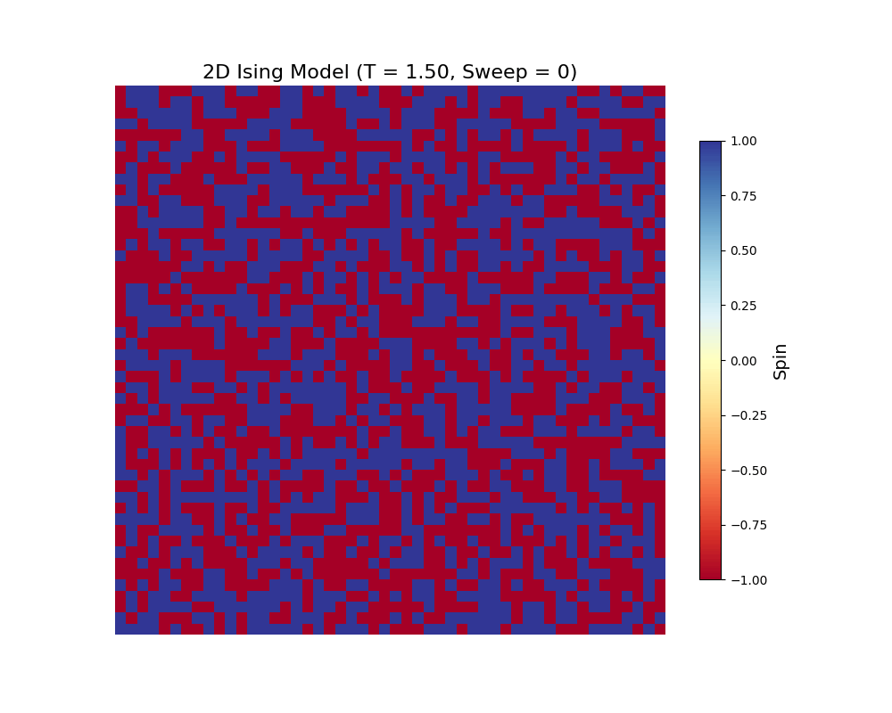

With temperature $T$ below the critical value $T_c\approx2.269$ (e.g., $T=1.5$), the system evolves from a random "salt-and-pepper" configuration into large same-spin domains, and eventually to an almost fully ordered ferromagnetic state. This showcases how simple local rules (a detailed-balance acceptance criterion) guide the system to the global low-energy equilibrium, illustrating emergence from micro to macro.

# 3. Markov Processes in Continuous State Space

We now make the core leap of this lecture: generalizing from discrete states (e.g., spins $\pm1$) to a continuous state space. The state variable $\vec{X}(t)$ takes values in a continuous domain, e.g., $\vec{X}(t)\in\mathbb{R}^d$. To build intuition, consider these examples.

- Brownian motion. A pollen grain suspended in fluid is incessantly buffeted by molecules and performs an irregular motion. Its position $X(t)\in\mathbb{R}^3$ is continuous in time; a trajectory is continuous but nowhere differentiable.

- Molecular motors.

  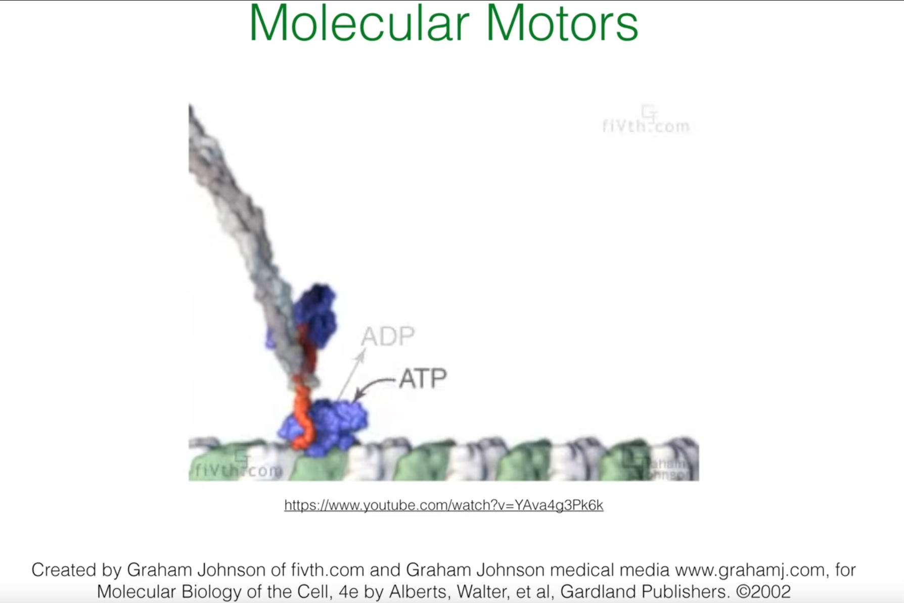

  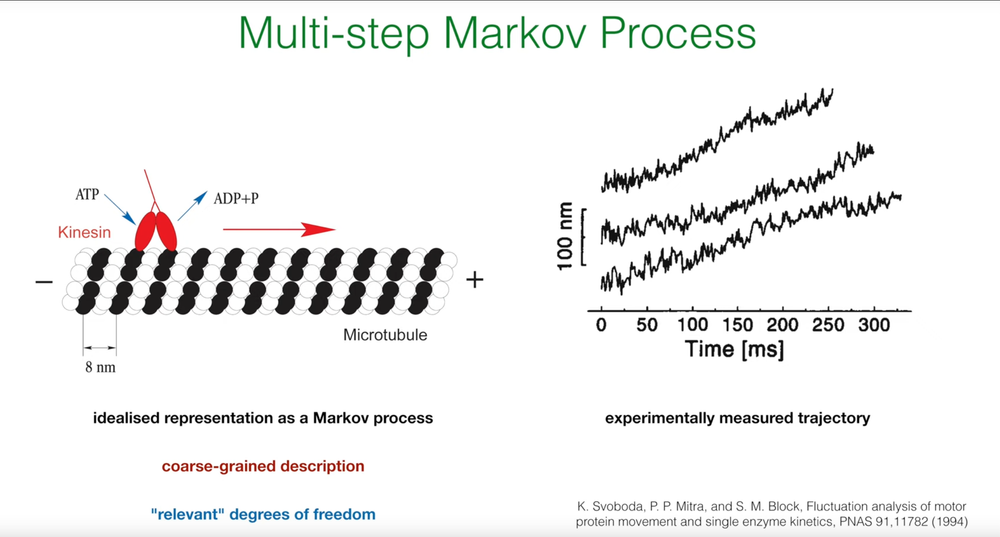

  Kinesin, for instance, walks along microtubules with steps of roughly 8 nm. A coarse-grained position $x(t)$ along the track captures its motion. Underlying chemistry (ATP hydrolysis) is discrete, so the position path mixes discrete jumps with thermal fluctuations near binding sites.

- Bacterial chemotaxis (run-and-tumble).

  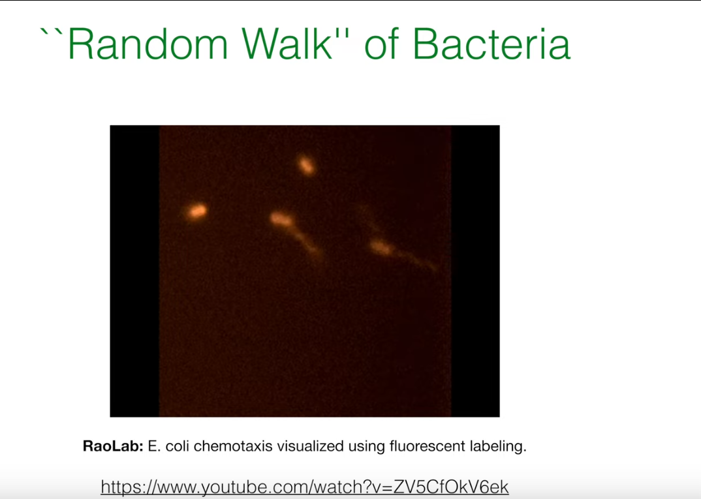

  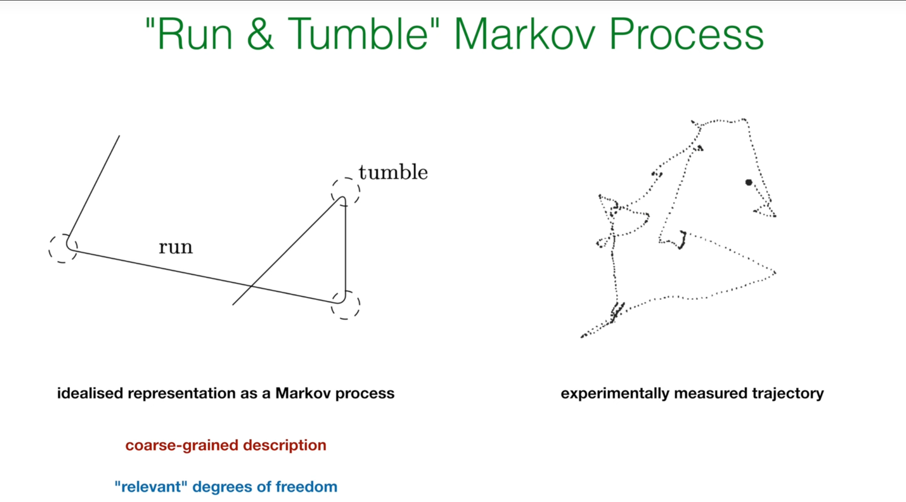

  E. coli searches for nutrients using alternating "runs" (straight motion) and "tumbles" (sudden reorientation). The state requires at least position $x(t)$ and direction $\theta(t)$, both continuous. Trajectories consist of smooth line segments punctuated by instantaneous direction changes.

These examples preview the models we will build: Brownian motion is a pure diffusion process with continuous paths; kinesin stepping is a jump process with discontinuous paths; chemotaxis is a hybrid mixing both. They provide concrete physical contexts for the abstract equations to follow.

# 4. Sample Paths and Evolution Equations

In continuous space, we describe states by a probability density function (PDF) $P(x,t)$, where $P(x,t)\,dx$ is the probability of finding the system within an infinitesimal volume around $x$ at time $t$.

## 4.1 Two Types of Paths

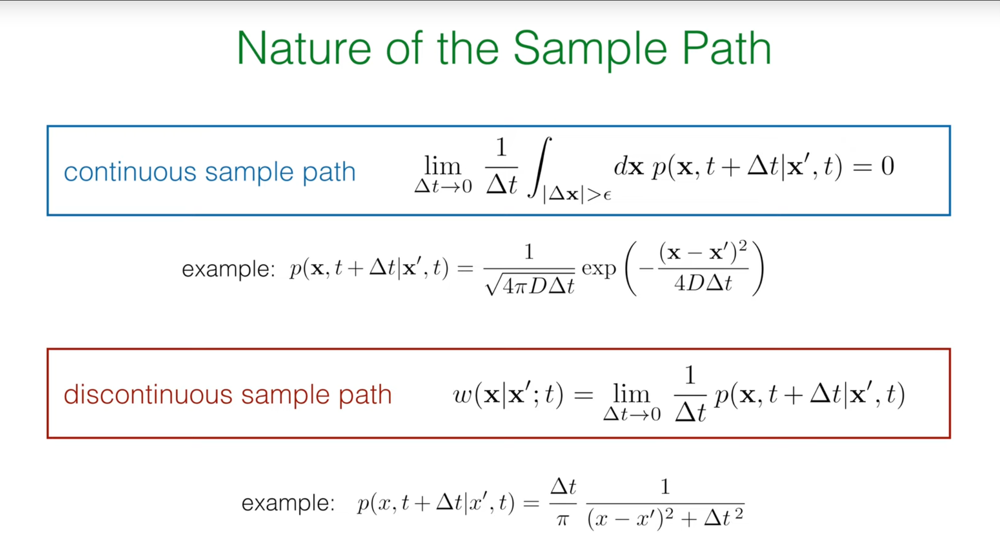

Based on the nature of sample paths over an infinitesimal time interval $\Delta t$, we distinguish two classes. The Kramers–Moyal criterion examines how the probability of a displacement larger than any small $\epsilon$ scales with $\Delta t$.

- Continuous sample paths. Changes are smooth; probability is transported locally by drift and spread by diffusion.

- Discontinuous (jump) paths. Changes occur via finite jumps; probability is transferred nonlocally between states via transition rates.

## 4.2 Derivation of Evolution Equations

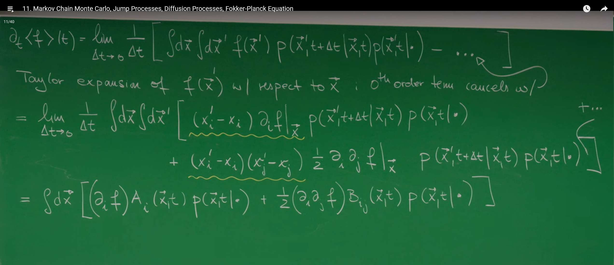

Our goal is to find an equation describing the time evolution of probability density $P(\vec{x},t)$, which will be the continuous-space version of the "master equation." The starting point of the derivation is to examine the time rate of change $\partial_t \langle f \rangle(t)$ of the expectation value of any smooth observable $f(\vec{x})$ (1).

$$\partial_t \langle f \rangle(t) = \partial_t \int d\vec{x}\, f(\vec{x}) P(\vec{x},t\mid\cdot)$$

According to the definition of derivative, we have:

$$\partial_t \langle f \rangle(t) = \lim_{\Delta t \to 0} \frac{1}{\Delta t} \left[ \int d\vec{x}\, f(\vec{x}) P(\vec{x},t+\Delta t\mid\cdot) - \int d\vec{x}\, f(\vec{x}) P(\vec{x},t\mid\cdot) \right]$$

The key step here is to use the Chapman–Kolmogorov equation to express $P(\vec{x},t+\Delta t\mid\cdot)$:

$$P(\vec{x},t+\Delta t\mid\cdot) = \int d\vec{x}'\, P(\vec{x},t+\Delta t\mid\vec{x}',t) P(\vec{x}',t\mid\cdot)$$

Substituting this and using probability conservation $\int d\vec{x}'\, P(\vec{x}',t+\Delta t\mid\vec{x},t)=1$, through clever transformations, we can obtain a unified starting point. Next, we will treat this expression differently depending on whether the paths are "jumps" or "diffusion."

## 4.3 Case I: Pure Jump Processes

For discontinuous sample paths, we use the previously defined transition rate density $w(\vec{x}\mid\vec{x}')$. Substituting it into the expression for $\partial_t \langle f \rangle(t)$ and exchanging the order of integration variables, we finally obtain:

$$\partial_t \langle f \rangle(t) = \int d\vec{x}\, f(\vec{x}) \int d\vec{x}'\, \Big[ w(\vec{x}\mid\vec{x}',t)\, P(\vec{x}',t\mid\cdot) - w(\vec{x}'\mid\vec{x},t)\, P(\vec{x},t\mid\cdot) \Big]$$

Since this equation must hold for any chosen function $f(\vec{x})$, we can directly remove the outer $\int d\vec{x}\, f(\vec{x})$, thus obtaining the evolution equation for the probability density $P(\vec{x},t)$ itself:

$$\partial_t P(\vec{x},t\mid\cdot) = \int d\vec{x}'\, \Big[ w(\vec{x}\mid\vec{x}',t)\, P(\vec{x}',t\mid\cdot) - w(\vec{x}'\mid\vec{x},t)\, P(\vec{x},t\mid\cdot) \Big]$$

This is the **continuous-state-space master equation** (1). Its structure is completely consistent with the discrete master equation: the first term is the gain from all other positions $\vec{x}'$ jumping into $\vec{x}$, and the second term is the loss from $\vec{x}$ jumping out to all other positions. The only difference is that the discrete sum $\sum_m$ is replaced by the continuous integral $\int d\vec{x}'$.

## 4.4 Case II: Pure Diffusion and the Fokker–Planck Equation

For processes with continuous sample paths, we cannot define jump rates because the system moves only within a neighborhood of its current position. Returning to the evolution of test-function averages, expand a smooth test function $f(x')$ around $x$ (Taylor expansion):

$$
 f(x') = f(x) + (x'_i - x_i)\, \partial_i f(x) + \tfrac{1}{2} (x'_i - x_i)(x'_j - x_j)\, \partial_i\partial_j f(x) + \cdots.
$$

This introduces the moments of the infinitesimal increment $\Delta x = x' - x$. For diffusion processes, only the first two moments survive in the limit $\Delta t\to0$. Define

- Drift vector $A_i(x,t)$:

  $$
  A_i(x,t) := \lim_{\Delta t\to0} \frac{1}{\Delta t} \int dx'\, (x'_i - x_i)\, P(x', t+\Delta t \mid x,t)
  \equiv \left. \frac{\langle \Delta x_i \rangle}{\Delta t} \right|_{\Delta t\to0}.
  $$

- Diffusion matrix $B_{ij}(x,t)$:

  $$
  B_{ij}(x,t) := \lim_{\Delta t\to0} \frac{1}{\Delta t} \int dx'\, (x'_i - x_i)(x'_j - x_j)\, P(x', t+\Delta t \mid x,t)
  \equiv \left. \frac{\langle \Delta x_i\, \Delta x_j \rangle}{\Delta t} \right|_{\Delta t\to0}.
  $$

Inserting the expansion and integrating by parts (to shift derivatives from $f$ to $P$) yields the Fokker–Planck equation for the probability density $P(x,t)$:

$$
 \partial_t P(x,t\mid\cdot) = -\partial_i\big[ A_i(x,t)\, P(x,t\mid\cdot) \big] + \tfrac{1}{2}\, \partial_i\partial_j \big[ B_{ij}(x,t)\, P(x,t\mid\cdot) \big].
$$

This equation is one of the most important equations in statistical physics. Its physical meaning can be understood as a probability-conserving **continuity equation** $\partial_t P = -\nabla \cdot \vec{J}_P$, where the probability current density $\vec{J}_P$ consists of two parts:

- **Drift current**: $\vec{J}_{\text{drift}} = \vec{A} P$. Driven by systematic forces.

- **Diffusion current**: $\vec{J}_{\text{diff}} = -\frac{1}{2} \nabla \cdot (\mathbf{B} P)$. Caused by random fluctuations, always flows from high probability density regions to low probability density regions.

The derivation of the Fokker–Planck equation perfectly demonstrates how statistical mechanics connects the microscopic and macroscopic. The equation itself is **deterministic**: given an initial probability distribution $P(\vec{x},0)$, its future evolution $P(\vec{x},t)$ is uniquely determined. However, the equation's coefficients—the drift term $\vec{A}$ and the diffusion term $\mathbf{B}$—are determined by the statistical properties (mean and variance) of the underlying **microscopic random** walk. This reveals a profound principle: although individual particle trajectories are unpredictable, the probability distribution evolution of an ensemble of many particles can be described by a deterministic macroscopic law.

The Fokker–Planck equation, also known as the Kolmogorov forward equation, is the core equation for describing the evolution of stochastic systems. Starting from the Langevin equation's microscopic description of Brownian motion, it characterizes the deterministic evolution of the system's probability distribution over time through statistical averaging. This equation elegantly captures the competition and balance between deterministic forces (described by the drift term $A_i$) and random fluctuations (described by the diffusion term $B_{ij}$).

Its applications are extremely wide-ranging, spanning modern science and engineering: in statistical physics, it studies how systems relax to thermodynamic equilibrium states given by the Boltzmann distribution; in financial mathematics, it is the foundation of option pricing theories like the Black–Scholes model, used to describe the random fluctuations of asset prices; in systems biology, it simulates fluctuations in intracellular chemical concentrations and gene expression noise; in neuroscience, it characterizes the random triggering processes of neuronal membrane potentials; in meteorology and fluid mechanics, it is used to study the diffusion and transport of pollutants in turbulence. In short, the Fokker–Planck equation provides us with a powerful mathematical framework for understanding and predicting ubiquitous random phenomena, serving as the "soul of stochastic dynamics" from microscopic particles to macroscopic markets.

## 4.5 Python Simulation: 2D Brownian Motion

To visualize diffusion and the solution to the Fokker–Planck equation, consider free diffusion in 2D with zero drift ($A=0$) and isotropic diffusion $B_{ij}=2D\,\delta_{ij}$. The Fokker–Planck equation reduces to

$$
 \partial_t P = D\, \nabla^2 P,
$$

whose solution is Gaussian with zero mean and variance growing linearly in time. A discrete-time approximation is the 2D random walk

$$
 \vec X(t+\Delta t) = \vec X(t) + \sqrt{2D\,\Delta t}\, \vec\eta,
$$

where $\vec\eta$ is a 2D standard normal vector. The following code simulates multiple trajectories, plots their endpoints and distributions, and creates an animation.

```python
import numpy as np
import matplotlib.pyplot as plt
from matplotlib.animation import FuncAnimation

# --- Simulation parameters ---
n_walkers = 10      # Number of particles to simulate
n_steps = 1000      # Number of steps for each particle
dt = 0.01           # Time step size
D = 1.0             # Diffusion coefficient

# --- Simulation process ---
# Generate random displacements for all steps
# Shape is (n_walkers, n_steps, 2), representing (particle, step, x/y coordinates)
# np.random.randn generates standard normal distribution random numbers
random_displacements = np.random.randn(n_walkers, n_steps, 2) * np.sqrt(2 * D * dt)

# Calculate trajectories for each particle
# np.cumsum(..., axis=1) performs cumulative sum along the time step dimension
# Initial position is (0,0)
trajectories = np.cumsum(random_displacements, axis=1)

# --- Visualization ---
fig, ax = plt.subplots(figsize=(8, 8))

# Plot trajectory of each particle
for i in range(n_walkers):
    # trajectories[i, :, 0] is all x coordinates of particle i
    # trajectories[i, :, 1] is all y coordinates of particle i
    ax.plot(trajectories[i, :, 0], trajectories[i, :, 1], alpha=0.7)

# Mark start and end points
start_points = np.zeros((n_walkers, 2))
end_points = trajectories[:, -1, :]  # Take the last point of each trajectory
ax.scatter(start_points[:, 0], start_points[:, 1], color='red', s=100, zorder=3, label='Start')
ax.scatter(end_points[:, 0], end_points[:, 1], color='green', s=50, zorder=3, label='End')

ax.set_title(f'2D Brownian Motion ({n_walkers} walkers, {n_steps} steps)')
ax.set_xlabel('X Position')
ax.set_ylabel('Y Position')
ax.legend()
ax.grid(True)
ax.set_aspect('equal', adjustable='box')
plt.show()

# --- Plot distribution of end points ---
fig_hist, ax_hist = plt.subplots(figsize=(10, 8))

# Increase number of particles to better show Gaussian distribution
n_walkers_hist = 1000  # Increased number of particles
random_displacements_hist = np.random.randn(n_walkers_hist, n_steps, 2) * np.sqrt(2 * D * dt)
trajectories_hist = np.cumsum(random_displacements_hist, axis=1)
end_points_hist = trajectories_hist[:, -1, :]

# Use more bins and better color mapping to show distribution
hist_plot = ax_hist.hist2d(end_points_hist[:, 0], end_points_hist[:, 1], bins=50, cmap='hot')
ax_hist.set_title('Distribution of End Points\n(2D Gaussian Distribution)', fontsize=16)
ax_hist.set_xlabel('Final X Position', fontsize=12)
ax_hist.set_ylabel('Final Y Position', fontsize=12)
ax_hist.set_aspect('equal', adjustable='box')

# Add theoretical contour lines
x_min, x_max = np.min(end_points_hist[:, 0]), np.max(end_points_hist[:, 0])
y_min, y_max = np.min(end_points_hist[:, 1]), np.max(end_points_hist[:, 1])
x = np.linspace(x_min, x_max, 100)
y = np.linspace(y_min, y_max, 100)
X, Y = np.meshgrid(x, y)
# Theoretical variance
sigma_squared = 2 * D * n_steps * dt
Z = np.exp(-(X**2 + Y**2) / (2 * sigma_squared))
ax_hist.contour(X, Y, Z, levels=5, colors='blue', alpha=0.6, linewidths=1)

# Add color bar
cbar = plt.colorbar(hist_plot[3], ax=ax_hist, label='Number of walkers')
cbar.set_label('Number of walkers', fontsize=12)

plt.tight_layout()
plt.show()

# --- Plot 1D projection distributions ---
fig_proj, (ax_x, ax_y) = plt.subplots(1, 2, figsize=(12, 5))

# X-direction projection
ax_x.hist(end_points_hist[:, 0], bins=50, density=True, alpha=0.7, color='skyblue', edgecolor='black', linewidth=0.5)
# Theoretical X-direction distribution
sigma = np.sqrt(2 * D * n_steps * dt)
x_range = np.linspace(np.min(end_points_hist[:, 0]), np.max(end_points_hist[:, 0]), 100)
gaussian_x = 1/np.sqrt(2*np.pi*sigma**2) * np.exp(-x_range**2/(2*sigma**2))
ax_x.plot(x_range, gaussian_x, 'r-', linewidth=2, label=f'Theoretical Gaussian\n$\sigma^2 = {sigma**2:.2f}$')
ax_x.set_xlabel('X Position')
ax_x.set_ylabel('Probability Density')
ax_x.set_title('X Distribution')
ax_x.legend()
ax_x.grid(True, alpha=0.3)

# Y-direction projection
ax_y.hist(end_points_hist[:, 1], bins=50, density=True, alpha=0.7, color='lightcoral', edgecolor='black', linewidth=0.5)
ax_y.plot(x_range, gaussian_x, 'r-', linewidth=2, label=f'Theoretical Gaussian\n$\sigma^2 = {sigma**2:.2f}$')
ax_y.set_xlabel('Y Position')
ax_y.set_ylabel('Probability Density')
ax_y.set_title('Y Distribution')
ax_y.legend()
ax_y.grid(True, alpha=0.3)

plt.tight_layout()
plt.show()

# --- Create Brownian motion animation ---
fig_anim, ax_anim = plt.subplots(figsize=(8, 8))

# Set animation parameters
n_frames = 200  # Number of animation frames
step_interval = n_steps // n_frames  # Steps between each frame

# Initialize animation elements
lines = [ax_anim.plot([], [], alpha=0.7)[0] for _ in range(n_walkers)]
points = ax_anim.scatter([], [], color='red', s=50, zorder=3)

# Set axes
ax_anim.set_xlim(np.min(trajectories[:, :, 0]), np.max(trajectories[:, :, 0]))
ax_anim.set_ylim(np.min(trajectories[:, :, 1]), np.max(trajectories[:, :, 1]))
ax_anim.set_title('2D Brownian Motion Animation')
ax_anim.set_xlabel('X Position')
ax_anim.set_ylabel('Y Position')
ax_anim.grid(True)
ax_anim.set_aspect('equal', adjustable='box')

def animate(frame):
    # Calculate which step to display for current frame
    step = min(frame * step_interval, n_steps - 1)
    
    # Update each trajectory
    for i in range(n_walkers):
        lines[i].set_data(trajectories[i, :step, 0], trajectories[i, :step, 1])
    
    # Update current point positions
    current_points = trajectories[:, step, :]
    points.set_offsets(current_points)
    
    ax_anim.set_title(f'2D Brownian Motion (Step {step}/{n_steps})')
    return lines + [points]

# Create animation
anim = FuncAnimation(fig_anim, animate, frames=n_frames, interval=50, blit=False, repeat=True)
plt.show()

# Save animation as GIF
try:
    import imageio
    import io
    from PIL import Image
    
    print("Saving Brownian motion animation as GIF file...")
    
    # Create temporary image list
    images = []
    
    # Generate animation frames
    for frame in range(0, n_frames, 2):  # Take every other frame to reduce file size
        animate(frame)
        fig_anim.canvas.draw()
        
        # Convert figure to image
        buf = io.BytesIO()
        fig_anim.savefig(buf, format='png', dpi=100)
        buf.seek(0)
        img = Image.open(buf)
        images.append(img)
        
        if frame % 20 == 0:
            print(f"Processed {frame}/{n_frames} frames")
    
    # Save as GIF
    images[0].save('brownian_motion.gif', save_all=True, append_images=images[1:], 
                   duration=100, loop=0)
    print("Animation saved as brownian_motion.gif")
    
except ImportError:
    print("Missing libraries required to save GIF (imageio or PIL), please install: pip install imageio pillow")

plt.show()
```

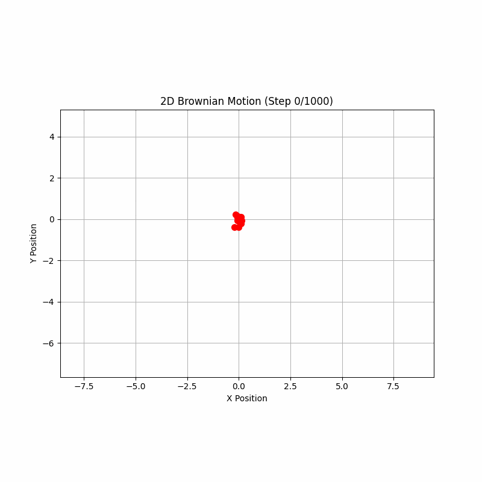

Ten independent walkers start at the origin (red dot) and follow 1,000-step trajectories. Each colored curve is one possible history. The Fokker–Planck equation does not track any particular path; it governs the time evolution of the ensemble probability "cloud" formed by many such paths.

Increasing the number of particles to 10,000 and plotting only endpoints yields a heatmap approximating the 2D Gaussian predicted by the diffusion equation from a delta-function initial condition. The overlaid blue contours are the theoretical iso-probability curves; simulation and theory agree.

Projecting the 2D distribution onto $x$- and $y$-axes gives one-dimensional Gaussian marginals. Although motion is in 2D, each orthogonal component follows an independent 1D Brownian motion.

# Summary

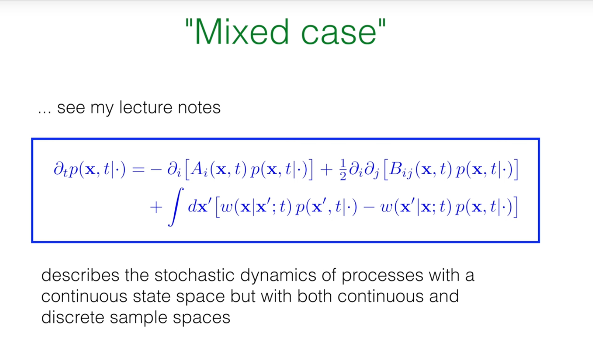

We discussed pure jump and pure diffusion processes. Many real systems combine both, as in run-and-tumble motion. A unified evolution equation combines a Fokker–Planck term with a continuous-space master-equation term:

$$
\partial_t P(\vec x,t\mid\cdot) = \underbrace{-\partial_i\big[A_i(\vec x,t)P\big] + \tfrac{1}{2}\, \partial_i\partial_j\big[B_{ij}(\vec x,t)P\big]}_{\text{drift and diffusion (Fokker–Planck)}}
+ \underbrace{\int d x'\,\big[ w(\vec x\mid\vec x';t) P(\vec x',t\mid\cdot) - w(\vec x'\mid\vec x;t) P(\vec x,t\mid\cdot) \big]}_{\text{jumps (master equation)}}.
$$

Thus, continuous-state stochastic processes split into two broad classes by path regularity: jump processes, described by a continuous-space master equation, and diffusion processes, described by a Fokker–Planck equation. Hybrid dynamics combine both contributions.