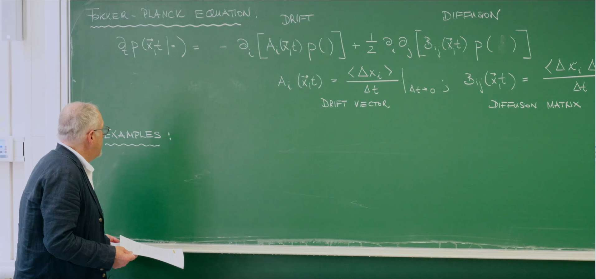
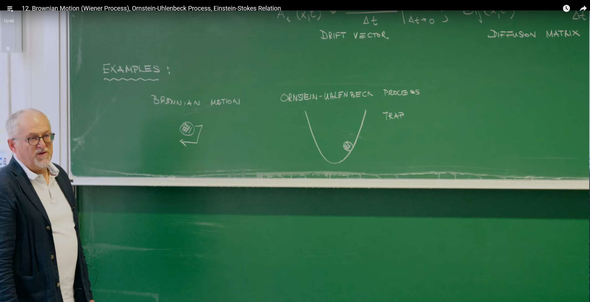
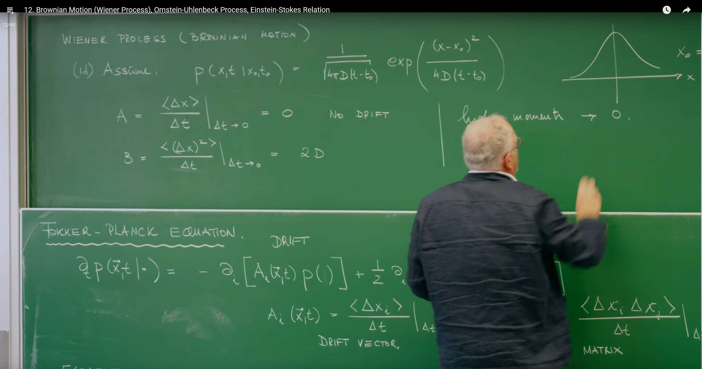
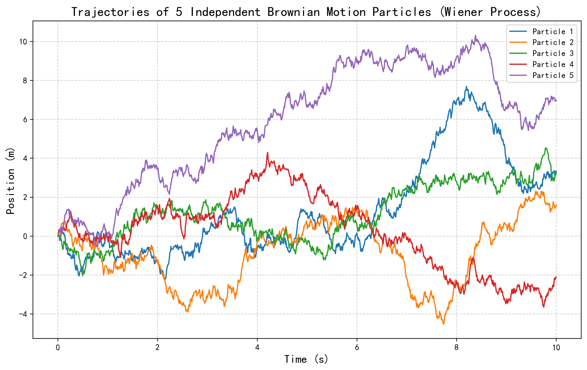
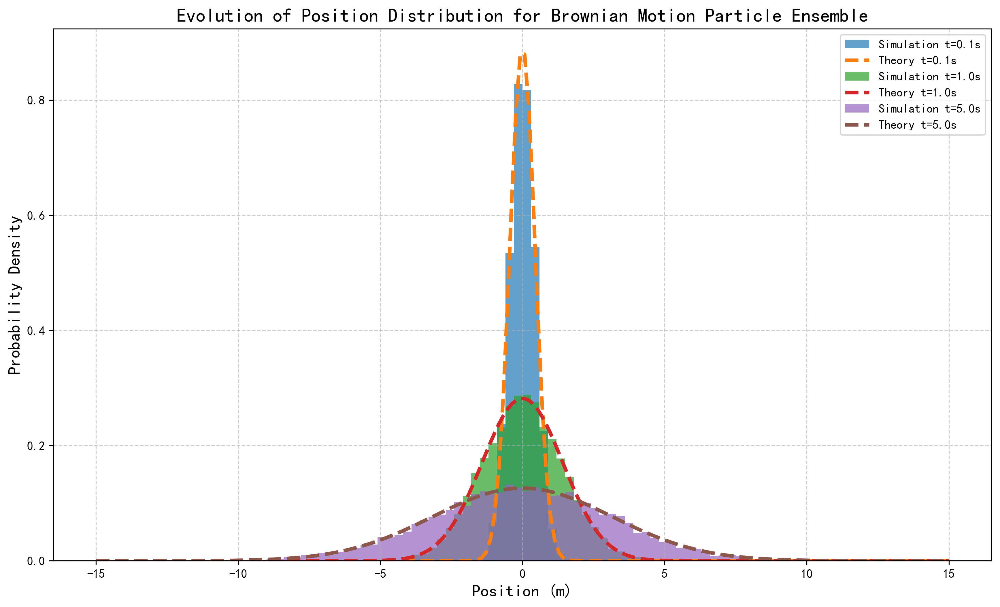
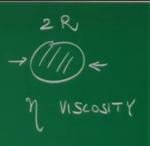
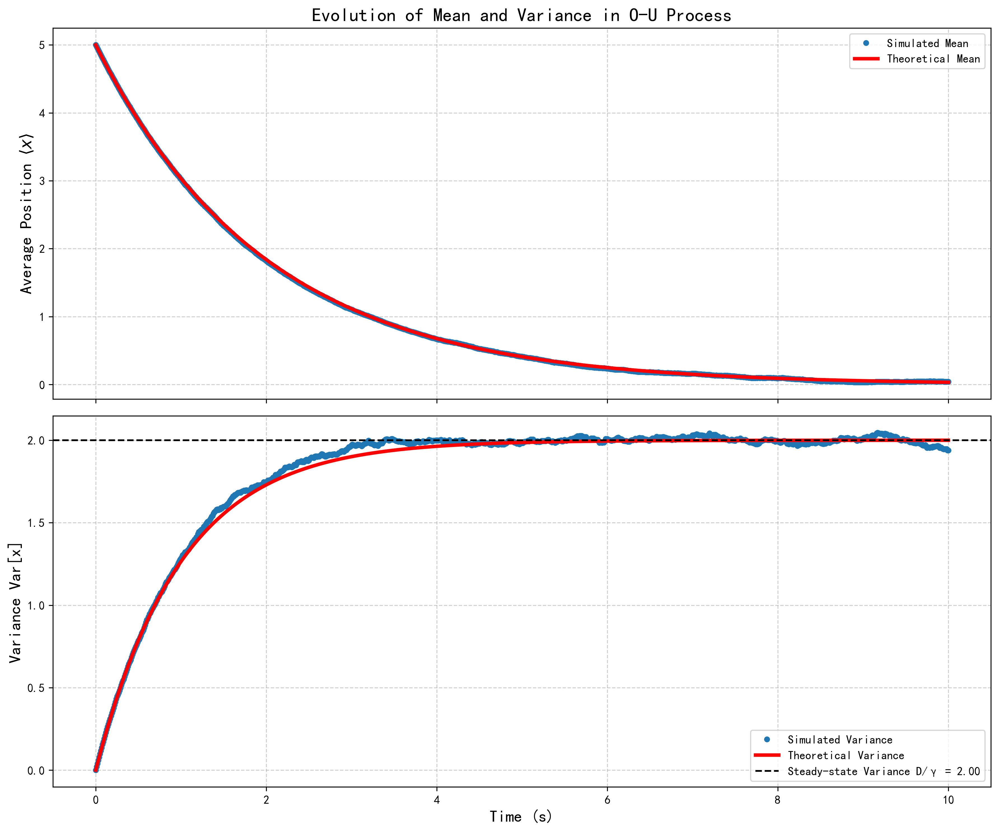

# Introduction: The Fokker–Planck Equation as a Unifying Framework



In the previous lecture we introduced the Fokker–Planck equation (FPE), a universal and powerful framework for the time evolution of probability density functions in continuous-state Markov processes.

For one-dimensional systems, the generic FPE reads

$$
\frac{\partial P(x,t)}{\partial t} = -\frac{\partial}{\partial x}\big[A(x)\,P(x,t)\big] + D(x)\,\frac{\partial^2}{\partial x^2} P(x,t),
$$

where $P(x,t)$ is the PDF of finding the particle at $x$ at time $t$. The equation contains two core parts describing two basic physical mechanisms:

- Drift term, with coefficient $A(x)$. This encodes deterministic, systematic influences (a force) and represents the local mean velocity at $x$, pushing the distribution’s center toward preferred directions/locations (e.g., gravity, spring restoring force).
- Diffusion term, with coefficient $D(x)$. This quantifies random kicks from thermal fluctuations and spreads the distribution in time. $D(x)$ is directly tied to the variance of displacements.

The FPE follows from the Chapman–Kolmogorov equation via the Kramers–Moyal expansion, under a key physical simplification: in an infinitesimal $\Delta t$, only the first (mean) and second (variance) moments of the displacement are significant; higher moments can be neglected. This holds for dynamics built from many small, independent random events (e.g., countless molecular collisions), so by the central limit theorem the net displacement approaches a Gaussian process. Thus the FPE captures phenomena driven by smooth deterministic forces plus fine-grained, approximately Gaussian noise.



We now study two fundamental special cases within this framework: the Wiener process and the Ornstein–Uhlenbeck (O–U) process. They represent, respectively, pure diffusion and diffusion with a linear restoring force, and will reveal core principles of stochastic dynamics.

# 1. Wiener Process — Prototype of Pure Diffusion

The Wiener process is the mathematically rigorous formulation of Brownian motion. It models a particle’s random motion driven solely by thermal fluctuations, with no external force or potential.

## 1.1 Basic Properties



Define the moments of the infinitesimal displacement $\Delta x$ over time $\Delta t$:

Zero drift:

$$
A = \lim_{\Delta t\to0} \frac{\langle \Delta x \rangle}{\Delta t} = 0,
$$

meaning there is no directional bias; left/right are equally likely and the ensemble-averaged displacement is zero.

Constant diffusion:

$$
B = \lim_{\Delta t\to0} \frac{\langle (\Delta x)^2 \rangle}{\Delta t} = 2D,
$$

with diffusion coefficient $D>0$. Hence the mean-squared displacement (MSD) scales linearly in time, $\langle(\Delta x)^2\rangle=2D\,\Delta t$. The uncertainty (spread) grows like $\sqrt{t}$; $D$ has units [length]$^2$/[time].

With $A(x)=0$ and $D(x)=D$ constant, the FPE becomes the diffusion equation:

## 1.2 Diffusion Equation and Its Solution

The diffusion equation describes evolution driven purely by random motion. For a particle located at $x_0$ at $t_0$, i.e., $P(x,t_0\mid x_0,t_0)=\delta(x-x_0)$, the solution is Gaussian:

$$
P(x,t\mid x_0,t_0) = \frac{1}{\sqrt{4\pi D (t-t_0)}} \exp\!\left[-\frac{(x-x_0)^2}{4D (t-t_0)}\right],\quad t>t_0.
$$

This has mean $\langle x\rangle=x_0$ and variance $\operatorname{Var}[x]=2D (t-t_0)$.

## 1.3 Computational Lab I: Simulating Brownian Motion in Python

We simulate: (1) single trajectories and (2) an ensemble distribution obeying the diffusion equation.

1) Single-trajectory simulation

```python
import numpy as np
import matplotlib.pyplot as plt

# Parameters
D = 1.0      # diffusion coefficient
T = 5.0      # total time
dt = 0.001   # time step
n_steps = int(T/dt)
n_traj = 5   # number of independent trajectories

# Simulate
t = np.linspace(0, T, n_steps+1)
traj = np.zeros((n_traj, n_steps+1))
for i in range(n_traj):
    xi = np.zeros(n_steps+1)
    for k in range(n_steps):
        xi[k+1] = xi[k] + np.sqrt(2*D*dt)*np.random.randn()
    traj[i] = xi

# Plot
plt.figure(figsize=(10,6))
for i in range(n_traj):
    plt.plot(t, traj[i], alpha=0.8)
plt.xlabel('Time')
plt.ylabel('Position')
plt.title('Sample Trajectories of 1D Brownian Motion (Wiener Process)')
plt.grid(True, ls='--', alpha=0.5)
plt.tight_layout()
plt.show()
```



Each path is continuous yet jagged; Wiener paths are continuous everywhere but nowhere differentiable. Since $\Delta X\propto\sqrt{\Delta t}$, the finite-difference “velocity” $\Delta X/\Delta t$ diverges as $\Delta t\to0$, hence SDEs use differentials $dX(t)$ rather than time derivatives.

2) Ensemble evolution and comparison to theory

```python
import numpy as np
import matplotlib.pyplot as plt
from scipy.stats import norm

# Parameters
D = 1.0
T = 5.0
dt = 0.01
num_steps = int(T/dt)
num_particles = 10000
x0 = 0.0

x = np.full(num_particles, x0)
snapshots = {}
snapshot_times = [0.1, 1.0, 5.0]

for i in range(num_steps):
    t_current = (i + 1) * dt
    x = x + np.sqrt(2 * D * dt) * np.random.randn(num_particles)
    for ts in snapshot_times:
        if np.isclose(t_current, ts):
            snapshots[ts] = x.copy()

plt.figure(figsize=(12,7))
bins = np.linspace(-15, 15, 101)
for ts, positions in snapshots.items():
    plt.hist(positions, bins=bins, density=True, alpha=0.6, label=f'Sim t={ts}s')
    mean_th = x0
    var_th = 2 * D * ts
    std_th = np.sqrt(var_th)
    xs = np.linspace(-15, 15, 400)
    plt.plot(xs, norm.pdf(xs, loc=mean_th, scale=std_th), 'k--', lw=2, label=f'Theory t={ts}s')

plt.title('Ensemble Position Distributions vs Diffusion Equation (Gaussian)')
plt.xlabel('x')
plt.ylabel('PDF')
plt.grid(True, ls='--', alpha=0.5)
plt.legend()
plt.tight_layout()
plt.show()
```



The ensemble histograms match the Gaussian solution, demonstrating how macroscopic determinism (the PDE) emerges from microscopic randomness.

# 2. Ornstein–Uhlenbeck Process — Constrained Diffusion

Many systems are constrained. The Ornstein–Uhlenbeck (O–U) process augments diffusion with a linear restoring force.

## 2.1 Physical System: Brownian Particle in a Harmonic Potential Well



Consider a small particle in fluid, buffeted by thermal noise and tethered by a harmonic potential

$$
U(x) = \tfrac{1}{2} k x^2.
$$

The restoring force is $F_{\rm restore}=-\nabla U=-k x$. In low-Reynolds-number flow (negligible inertia), this balances Stokes’ drag $F_{\rm drag}=\zeta\,\dot x$ with friction coefficient $\zeta=6\pi\eta R$. Force balance gives

$$
-kx=\zeta\,\dot x \quad\Rightarrow\quad \dot x = -\frac{k}{\zeta} x \equiv -\gamma x,
$$

with relaxation rate $\gamma=k/\zeta$ and relaxation time $\tau=1/\gamma$. Thus the drift is linear: $A(x)=-\gamma x$ (mean reversion). Thermal kicks yield constant diffusion $B=2D$.

## 2.2 Governing Equation and Solution

Insert $A(x)=-\gamma x$ and constant $D$ into the FPE:

$$
\frac{\partial P}{\partial t} = \frac{\partial}{\partial x}\big[\gamma x\, P\big] + D\, \frac{\partial^2 P}{\partial x^2}.
$$

We solve via Fourier transform and method of characteristics. Define the characteristic function

$$
\phi(k,t) := \int_{-\infty}^{\infty} e^{ikx} P(x,t)\,dx.
$$

It obeys

$$
\frac{\partial \phi}{\partial t} + \gamma k\, \frac{\partial \phi}{\partial k} = -D k^2\, \phi.
$$

Along characteristics $dk/dt=-\gamma k \Rightarrow k(t)=k_0 e^{-\gamma t}$, the total derivative satisfies

$$
\frac{d\phi}{dt} = -D\, k(t)^2\, \phi \quad\Rightarrow\quad
\phi(t) = \phi(0) \exp\!\left(-D \int_0^t k_0^2 e^{-2\gamma t'} dt'\right)
= \phi(0) \exp\!\left(-\frac{D k_0^2}{2\gamma}(1-e^{-2\gamma t})\right).
$$

For initial $P(x,0)=\delta(x-x_0)$, $\phi(0)=e^{ik_0 x_0}$. Using $k_0=k e^{\gamma t}$ yields

$$
\phi(k,t) = \exp\!\left( i k x_0 e^{-\gamma t} - \frac{D k^2}{2\gamma} (1-e^{-2\gamma t}) \right).
$$

## 2.3 Dynamical Interpretation

This is the characteristic function of a Gaussian. Comparing to $\exp\big( i k\, \langle x\rangle - \tfrac{1}{2} k^2\,\operatorname{Var}(x)\big)$ gives

Mean:

$$
\langle x \rangle(t) = x_0 e^{-\gamma t}.
$$

Variance:

$$
\operatorname{Var}[x](t) = \frac{D}{\gamma} \big(1 - e^{-2\gamma t}\big),
$$

so at short times $\operatorname{Var}\approx 2Dt$ (free diffusion limit), while as $t\to\infty$ it saturates at the steady-state value $D/\gamma$. The O–U process thus reaches a stationary Gaussian with mean 0 and variance $D/\gamma$.

## 2.4 Computational Lab II: Simulating a Confined Particle

The SDE is

$$
 dX(t) = -\gamma X(t)\,dt + \sqrt{2D}\, dW(t),
$$

with Euler–Maruyama update

$$
 X(t+\Delta t) = X(t) - \gamma X(t)\, \Delta t + \sqrt{2D\,\Delta t}\, N(0,1).
$$

1) Single-trajectory example

```python
import numpy as np
import matplotlib.pyplot as plt

D = 1.0
gamma = 0.5
T = 50.0
dt = 0.01
n = int(T/dt)

t = np.linspace(0, T, n+1)
x = np.zeros(n+1)
x[0] = 10.0

for i in range(n):
    x[i+1] = x[i] - gamma*x[i]*dt + np.sqrt(2*D*dt)*np.random.randn()

plt.figure(figsize=(10,6))
plt.plot(t, x, label='Trajectory')
plt.axhline(0, color='r', ls='--', label='Equilibrium (x=0)')
plt.title('O–U Process: Single Trajectory in a Harmonic Well')
plt.xlabel('Time')
plt.ylabel('x')
plt.grid(True, ls='--', alpha=0.5)
plt.legend()
plt.tight_layout()
plt.show()
```


2) Ensemble mean and variance vs theory

```python
import numpy as np
import matplotlib.pyplot as plt

D = 1.0
gamma = 0.5
T = 10.0
dt = 0.01
n = int(T/dt)
N = 10000
x0 = 5.0

t = np.linspace(0, T, n+1)
X = np.full((N, n+1), x0)
mean_sim = np.zeros(n+1)
var_sim = np.zeros(n+1)
mean_sim[0] = x0
var_sim[0] = 0.0

for i in range(n):
    X[:, i+1] = X[:, i] - gamma*X[:, i]*dt + np.sqrt(2*D*dt)*np.random.randn(N)
    mean_sim[i+1] = X[:, i+1].mean()
    var_sim[i+1] = X[:, i+1].var()

mean_the = x0*np.exp(-gamma*t)
var_the = (D/gamma)*(1 - np.exp(-2*gamma*t))

fig, (ax1, ax2) = plt.subplots(2, 1, figsize=(10,9), sharex=True)
ax1.plot(t, mean_sim, 'o', ms=4, label='Sim mean')
ax1.plot(t, mean_the, 'r-', lw=2.5, label='Theory mean')
ax1.set_ylabel('⟨x⟩')
ax1.set_title('Ornstein–Uhlenbeck: Mean and Variance')
ax1.grid(True, ls='--', alpha=0.5)
ax1.legend()

ax2.plot(t, var_sim, 'o', ms=4, label='Sim var')
ax2.plot(t, var_the, 'r-', lw=2.5, label='Theory var')
ax2.axhline(D/gamma, color='k', ls='--', label=f'Steady var D/γ = {D/gamma:.2f}')
ax2.set_xlabel('Time')
ax2.set_ylabel('Var[x]')
ax2.grid(True, ls='--', alpha=0.5)
ax2.legend()
plt.tight_layout()
plt.show()
```



## 2.5 Wiener vs Ornstein–Uhlenbeck: A Comparison

| Feature | Wiener process | Ornstein–Uhlenbeck process |
| :-- | :-- | :-- |
| Physical picture | Free dust in unbounded space | Bead tethered by a spring in fluid |
| Drift $A(x)$ | 0 (no bias) | $-\gamma x$ (linear restoring; mean reversion) |
| Diffusion $D(x)$ | $D$ (const.) | $D$ (const.) |
| FPE | $\partial_t P = D\, \partial_x^2 P$ | $\partial_t P = \partial_x(\gamma x P) + D\, \partial_x^2 P$ |
| Mean $\langle x\rangle(t)$ | $x_0$ (constant) | $x_0 e^{-\gamma t}$ (decays to 0) |
| Variance $\operatorname{Var}[x](t)$ | $2Dt$ (unbounded linear growth) | $\tfrac{D}{\gamma}(1-e^{-2\gamma t})$ (saturates) |
| Steady state | None (unbounded diffusion) | Gaussian with variance $D/\gamma$ |

# 3. Einstein–Stokes Relation: A Deep Link Between Fluctuation and Dissipation

## 3.1 Bridge to Thermodynamics

As $t\to\infty$, the O–U process reaches a steady state: a time-invariant Gaussian at the origin with variance

$$
\langle x^2 \rangle_{\rm ss} = \operatorname{Var}_{\rm ss} = \frac{D}{\gamma}.
$$

This corresponds physically to thermal equilibrium with the environment.

## 3.2 Equipartition Theorem

For a harmonic potential $U(x)=\tfrac{1}{2} k x^2$, equipartition gives

$$
\langle U \rangle = \left\langle \tfrac{1}{2} k x^2 \right\rangle = \tfrac{1}{2} k \langle x^2 \rangle = \tfrac{1}{2} k_B T,
$$

so

$$
\langle x^2 \rangle_{\rm eq} = \frac{k_B T}{k}.
$$

## 3.3 Derivation and Insight

Equating the two expressions for the same equilibrium quantity,

$$
\frac{D}{\gamma} = \frac{k_B T}{k}, \qquad \gamma = \frac{k}{\zeta} = \frac{k}{6\pi\eta R},
$$

yields the Einstein–Stokes relation

$$
D = \frac{k_B T}{6\pi\eta R} = \frac{k_B T}{\zeta}.
$$

## 3.4 Fluctuation–Dissipation Theorem (FDT)

- Fluctuation: $D$ measures microscopic random agitation from the thermal bath.
- Dissipation: $\zeta=6\pi\eta R$ quantifies macroscopic energy loss (drag) in driven motion.

The Einstein–Stokes relation shows they are two faces of the same microscopic interactions with the bath. Temperature $T$ links the strength of fluctuations and of dissipation.

# Summary

The O–U process offers an analytically tractable “laboratory” containing both fluctuation ($D$) and dissipation (via $\gamma$ and $\zeta$). Solving its dynamics and comparing the steady state to equilibrium thermodynamics yields a constructive proof of FDT. The principle reaches far beyond Brownian motion, e.g., Johnson–Nyquist noise of resistors in electronics.

