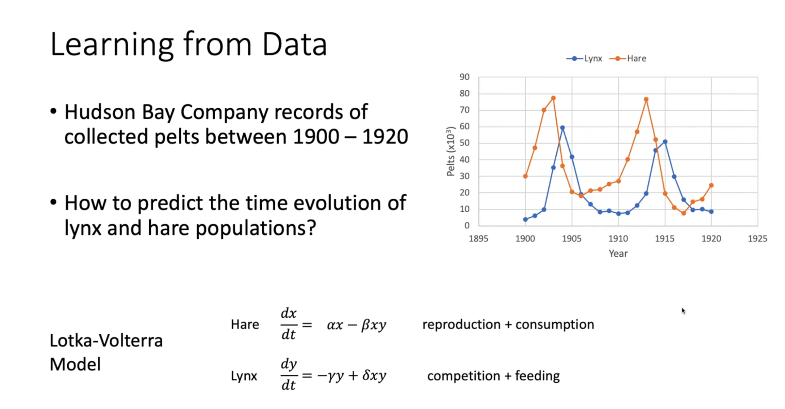

# Introduction: From Analytical Theory to a Computational Tool


This lecture is TA-led. In the past several sessions, Prof. Erwin Frey has built a powerful theoretical framework for understanding and describing stochastic processes. Starting from the basics of Markov processes, we derived the Chapman-Kolmogorov equation, and then obtained the master equation and the Fokker-Planck equation. We also discussed steady states, the detailed-balance condition, and the Perron-Frobenius theorem, which provide deep insight into how systems reach and maintain equilibrium.

So far our perspective has been analytical: given a stochastic process (defined by its transition rates), we analyze its behavior, e.g., what the steady-state distribution is. In this lecture, we shift from analysis to synthesis and application. We show how the Markov-process framework - especially Markov chains - can be turned into a practical computational tool to solve a fundamental problem across the sciences: statistical inference, i.e., learning model parameters from data.

By cleverly designing a Markov process whose stationary distribution is exactly a target distribution, we can generate samples from that distribution and thereby solve otherwise intractable integrals. This approach is called Markov chain Monte Carlo (MCMC). It has transformed Bayesian statistics and many scientific fields that rely on computational modeling.

# 1. Problem Statement: Inferring Models from Real-World Data

A core task in science is to build and validate mathematical models from observations. A good model not only explains existing data but also predicts the future. The predictive power of a model depends entirely on its parameters. How do we determine unknown parameters from experimental or observational data?

## 1.1 A Classic Ecosystem: Lynx and Hare

To make it concrete, consider a classic ecological example: the predator-prey dynamics of Canadian lynx (predator) and snowshoe hare (prey). The Hudson's Bay Company recorded pelts from 1900 to 1920; these counts are regarded as reliable proxies for population sizes.


Plotting the data reveals periodic oscillations in both species, with the predator peak lagging behind the prey peak.



A natural question is: can we find a mathematical model that explains and predicts this periodic behavior? More specifically, can we infer the "laws" (parameters) that govern the dynamics from the data?

## 1.2 Lotka-Volterra Model: A Mathematical Description

A famous model for predator-prey systems is the Lotka-Volterra equations, a pair of coupled ODEs describing changes in two populations. Let $x$ be the hare (prey) population and $y$ the lynx (predator) population:

$$
\frac{dx}{dt} = \alpha x - \beta xy \quad \text{(hares)}
$$

$$
\frac{dy}{dt} = -\gamma y + \delta xy \quad \text{(lynx)}
$$

Interpretation of each term:

- $\alpha x$: natural exponential growth of hares in the absence of predators ($y=0$); $\alpha$ is the hare birth rate.
- $-\beta xy$: loss of hares due to predation; encounter frequency $\propto xy$; $\beta$ is predation efficiency.
- $-\gamma y$: natural death of lynx in the absence of food ($x=0$); $\gamma$ is the lynx death rate.
- $+\delta xy$: lynx reproduction thanks to predation; proportional to $xy$; $\delta$ is the conversion efficiency from prey to predator growth.

The "laws" are encoded in $\theta=\{\alpha,\beta,\gamma,\delta\}$. Given observations $D$ (the time series), parameter inference asks for the most plausible $\theta$.

# 2. Bayesian Framework: A Systematic Approach

How can we systematically learn parameters \(\theta\) from data \(D\)? Bayesian inference provides a probability-based, logically coherent framework: it is fundamentally a rule for updating degrees of belief in light of new evidence.

## 2.1 Introducing Bayes' Theorem

Bayesian inference formalizes learning from data via

$$
\underbrace{p(\theta\mid D)}_{\text{posterior}} = \frac{\underbrace{p(D\mid\theta)}_{\text{likelihood}}\, \underbrace{p(\theta)}_{\text{prior}}}{\underbrace{p(D)}_{\text{evidence}}}.
$$

## 2.2 Decomposing Bayes' Theorem

- Prior $p(\theta)$: knowledge/belief before seeing data.
- Likelihood $p(D\mid\theta)$: plausibility of data under parameters.
- Evidence $p(D)$: normalization; often intractable.
- Posterior $p(\theta\mid D)$: what we want to characterize/sample.

Bayesian thinking differs from traditional "best-fit" approaches (e.g., least squares). Classical methods may return a single best parameter set. In contrast, Bayesian methods say: there is no single "correct" $\theta$ - instead there is a landscape of plausibilities over parameter space. One region may be very plausible while another is unlikely.

This probabilistic perspective is powerful. It lets us ask deeper questions such as: "What is the probability that the hare birth rate $\alpha$ lies between 0.5 and 0.6?" or "Are the predation rate $\beta$ and the lynx death rate $\gamma$ correlated?" This represents a shift from deterministic to probabilistic thinking that honestly reflects our uncertainty given finite data.

# 3. Computational Bottleneck: High-Dimensional Integrals

Having a posterior $p(\theta\mid D)$ solves inference in principle, but in practice we often need summaries such as expectations and variances.

## 3.1 From Distributions to Expectations

Model comparison, prediction, and uncertainty quantification are often expectations under the posterior. For a function $f(\theta)$ (e.g., $f(\theta)=\alpha$ to compute the mean of $\alpha$), we need to evaluate

$$
\langle f(\theta) \rangle = \int f(\theta)\, p(\theta\mid D)\, d\theta^n,
$$

an integral over the full $n$-dimensional parameter space (here $n=4$). We also encounter the evidence (normalization) itself,

$$
p(D) = \int p(D\mid\theta)\, p(\theta)\, d\theta,
$$

which is frequently the hardest quantity in Bayesian inference.

## 3.2 The Curse of Dimensionality

Why are these integrals so hard? Direct gridding explodes with dimension. Suppose we take 10 grid points per parameter:

- 1D: $10^1=10$ evaluations.
- 2D: $10^2=100$ evaluations.
- 4D (our Lotka-Volterra case): $10^4=10{,}000$ evaluations.
- 20D: $10^{20}$ evaluations - utterly infeasible.

Worse, high-dimensional geometry defeats low-dimensional intuition: the posterior mass typically concentrates in a tiny, irregular region, while most of the space has near-zero density.


Uniform grids are blind; they waste almost all effort evaluating points where $p(\theta\mid D)\approx 0$. The "curse of dimensionality" is not just slowness, but a fundamental scaling barrier. The problem is search efficiency: in an exponentially large space, we must find a small, unknown "important" region. We need a different strategy that focuses effort where it matters.

# 4. A New Strategy: Monte Carlo Integration

Facing high-dimensional integrals, we turn to a smarter approach: Monte Carlo integration replaces deterministic grids with random sampling.

## 4.1 Power of the Law of Large Numbers

Monte Carlo integration uses the law of large numbers to approximate integrals by sample averages:

$$
\langle f(\theta) \rangle = \int f(\theta)\, p(\theta\mid D)\, d\theta \;\approx\; \frac{1}{N} \sum_{i=1}^{N} f\big(\theta^{(i)}\big).
$$

The "magic" lies in how we generate the samples $\{\theta^{(i)}\}$.

## 4.2 Importance Sampling: The Key Insight

To make the approximation accurate and efficient, the samples should be drawn from the target itself, $p(\theta\mid D)$. This is the essence of importance sampling: by drawing from the target, computation automatically focuses on high-probability regions - the very regions that dominate the integral - rather than wasting effort in probability "deserts".

This reframes the problem: instead of integrating, we "just" need to sample from a complex, high-dimensional, and even unnormalized distribution $p(\theta\mid D)$ (since $p(D)$ is unknown). Embracing randomness becomes the way to overcome the curse of dimensionality. What we need is not an integrator, but a sampler.

# 5. Generating Samples via Stochastic Processes: MCMC

How do we build a machine that samples from an arbitrary $p(\theta\mid D)$? The answer returns to Markov chains.

## 5.1 Toolbox Recap: Markov Chains and Stationary Distributions

Recall key ideas (Lectures 6-8):

- Markov chain: a memoryless stochastic process; the future depends only on the present.
- Stationary distribution $\pi$: under conditions such as ergodicity, the chain converges to a limiting distribution $\pi$.
- Perron-Frobenius theorem: provides existence/uniqueness guarantees for broad classes.
- Detailed balance (sufficient condition): $\pi(\theta)\, W(\theta'\mid\theta) = \pi(\theta')\, W(\theta\mid\theta')$, where $W$ is the transition rule.

## 5.2 Core Idea of MCMC

Design a Markov chain whose unique stationary distribution equals the target posterior $\pi(\theta)=p(\theta\mid D)$. Then:

1) Pick any initial point $\theta^{(0)}$.
2) Evolve the chain according to its transition rule.
3) Run long enough to "forget" the initial condition (burn-in).
4) Record the subsequent states $\{\theta^{(i)}\}$.

By the definition of stationarity, $\{\theta^{(i)}\}$ are samples from $p(\theta\mid D)$. This inverts the usual direction of analysis: earlier we learned "given $W$, find $\pi$"; now we ask "given desired $\pi$, construct $W$" - and detailed balance provides the blueprint.

# 6. Metropolis-Hastings Algorithm: A Practical Recipe

How do we construct a suitable $W$ in practice? The Metropolis-Hastings (MH) algorithm provides a general and powerful recipe for building a Markov chain with any target distribution.

Historically, Metropolis et al. (1953) introduced the symmetric-proposal version to tackle high-dimensional problems in physics; Hastings (1970) generalized it to asymmetric proposals. Today MH is central across Bayesian computation and many other fields.

## 6.1 Algorithm: Metropolis-Hastings (MH)

The Metropolis-Hastings algorithm is one of the most important algorithms in modern computational statistics and physics, with its development spanning two key innovations in the mid-20th century. The original version of this algorithm was proposed by Nicholas Metropolis and his collaborators (including Arianna Rosenbluth, Marshall Rosenbluth, Augusta Teller, and Edward Teller) in 1953, primarily to solve state equation calculations for high-dimensional systems in physics. The core idea was to construct a Markov chain whose final stationary distribution would be our desired target distribution for sampling, with the original version limited to symmetric proposal distributions. Subsequently, in 1970, statistician W. K. Hastings generalized the algorithm to asymmetric proposal distributions, greatly expanding its scope of application and forming what we now know as the Metropolis-Hastings algorithm.

The algorithm has extremely wide applications, playing a central role especially in Bayesian statistics. When a model's posterior probability distribution is complex in form and high-dimensional, making direct analytical computation or sampling impossible, the Metropolis-Hastings algorithm provides a powerful numerical simulation tool. Specific applications include but are not limited to: Bayesian inference in machine learning for estimating parameters of complex models; phylogenetic tree construction in computational biology; simulating multi-particle system behavior in physics; risk modeling and option pricing in finance. It can be said that any scientific and engineering field that requires sampling from probability distributions that are difficult to handle directly can see the presence of the Metropolis-Hastings algorithm.

Steps:

1) Initialize with any $\theta^{(0)}$.
2) For $i=1,2,\dots,N$:
- Propose $\theta' \sim q(\theta'\mid \theta^{(i-1)})$ (e.g., Gaussian random walk).
- Compute acceptance probability
  $$
  A(\theta'\mid\theta) = \min\Bigl(1, \frac{p(\theta')\, q(\theta\mid\theta')}{p(\theta)\, q(\theta'\mid\theta)}\Bigr),
  $$
  where $p(\theta)$ denotes the (unnormalized) target $p(\theta\mid D)$.
- Draw $u\sim\mathrm{Unif}(0,1)$. If $u<A$, accept ($\theta^{(i)}=\theta'$); else reject ($\theta^{(i)}=\theta^{(i-1)}$).

## 6.2 Why It Works: Enforcing Detailed Balance

The MH acceptance rule ensures detailed balance and thus the target stationary distribution. Two key ratios appear in $A(\theta'\mid\theta)$:

- Target ratio $\dfrac{p(\theta')}{p(\theta)}$: if the proposal moves to a higher-probability region, this ratio exceeds 1 and the move is always accepted; if lower, the move is accepted with some probability, enabling exploration beyond just the peaks.
- Proposal correction $\dfrac{q(\theta\mid\theta')}{q(\theta'\mid\theta)}$: compensates for any asymmetry or bias in proposals. With a symmetric proposal (e.g., Gaussian random walk), this factor is 1 and we recover the original Metropolis rule $A=\min\bigl(1, p(\theta')/p(\theta)\bigr)$.

Crucially, the evidence $p(D)$ cancels in ratios:

$$
\frac{p(\theta\mid D)}{p(\theta'\mid D)} = \frac{p(D\mid\theta)\,p(\theta)}{p(D\mid\theta')\,p(\theta')}.
$$

Hence we only need likelihood and prior up to constants. This neatly sidesteps the hardest normalization in Bayesian inference while retaining correctness via detailed balance.

# 7. Using MCMC for Lotka-Volterra Parameter Inference

We now apply MH to infer $(\alpha,\beta,\gamma,\delta)$ from the Hudson's Bay data. The ODE model lacks a simple closed-form solution; for each parameter set we integrate numerically, making the posterior highly nontrivial - an ideal use case for MCMC. This case illustrates an end-to-end workflow: start from data, posit a mechanistic model, define a Bayesian posterior, and sample it via a carefully designed stochastic process.

## 7.1 Modeling Plan

1) **Model**: Lotka-Volterra differential equation system.
2) **Data**: 1900-1920 hare (H) and lynx (L) population counts.
3) **Target**: Solve the posterior probability distribution $p(\alpha, \beta, \gamma, \delta \mid \text{data})$.
4) **Method**: Construct a Metropolis-Hastings sampler.
    * **State space**: Four-dimensional parameter space $(\alpha, \beta, \gamma, \delta)$.
    * **Target distribution**: Posterior probability $p(\theta\mid D) \propto p(D\mid\theta)p(\theta)$.
        * **Likelihood function $p(D\mid\theta)$**: We assume that the errors between observed data and model predictions follow a log-normal distribution. This means we calculate the population numbers predicted by the model under given parameters $\theta$ and compare them with real data to compute their probability.
        * **Prior distribution $p(\theta)$**: Since we have little prior knowledge about the parameters, we choose a non-informative, broad uniform or normal distribution as the prior.
    * **Proposal distribution $q(\theta'\mid\theta)$**: We adopt a simple random walk strategy. Near the current parameter point $\theta$, we generate a new proposal point $\theta'$ by adding a small random perturbation (e.g., sampling from a multivariate normal distribution).

## 7.2 Python Implementation

```python
import numpy as np
import matplotlib.pyplot as plt
from scipy.integrate import odeint
from scipy.stats import norm

# 1. Load data
# Data source: https://github.com/stan-dev/example-models
# Year, Lynx (x1000), Hare (x1000)
data = np.array([
    [1900, 4.0, 30.0], [1901, 6.1, 47.2], [1902, 9.8, 70.2],
    [1903, 35.2, 77.4], [1904, 59.4, 36.3], [1905, 41.7, 20.6],
    [1906, 19.0, 18.1], [1907, 13.0, 21.4], [1908, 8.3, 22.0],
    [1909, 9.1, 25.4], [1910, 7.4, 27.1], [1911, 8.0, 40.3],
    [1912, 12.3, 57.0], [1913, 19.5, 76.6], [1914, 45.7, 52.3],
    [1915, 51.1, 19.5], [1916, 29.7, 11.2], [1917, 15.8, 7.6],
    [1918, 9.7, 14.6], [1919, 10.1, 16.2], [1920, 8.6, 24.7]
])
years = data[:, 0]
lynx_data = data[:, 1]
hare_data = data[:, 2]
y_obs = np.vstack((hare_data, lynx_data)).T # Observed data [H, L]

# 2. Define Lotka-Volterra model
def lotka_volterra(y, t, alpha, beta, gamma, delta):
    """
    Lotka-Volterra differential equations
    y: [H, L] population array
    t: time
    alpha, beta, gamma, delta: model parameters
    """
    H, L = y
    dH_dt = alpha * H - beta * H * L
    dL_dt = delta * H * L - gamma * L
    return [dH_dt, dL_dt]

# 3. Define log posterior probability function
def log_posterior(theta, y_obs, t_obs):
    alpha, beta, gamma, delta = theta
    
    # a. Log-Prior
    # Assume parameters follow wide normal distributions, and must be positive
    if any(p <= 0 for p in theta):
        return -np.inf
    log_prior_alpha = norm.logpdf(alpha, loc=1, scale=1)
    log_prior_beta = norm.logpdf(beta, loc=0.05, scale=0.05)
    log_prior_gamma = norm.logpdf(gamma, loc=1, scale=1)
    log_prior_delta = norm.logpdf(delta, loc=0.02, scale=0.02)
    log_p = log_prior_alpha + log_prior_beta + log_prior_gamma + log_prior_delta

    # b. Log-Likelihood
    # Initial conditions use the first point of data
    y0 = y_obs[0, :]
    # Numerically solve differential equations using odeint
    y_pred = odeint(lotka_volterra, y0, t_obs, args=(alpha, beta, gamma, delta))
    
    # Assume errors follow a log-normal distribution, equivalent to log-transformed data following a normal distribution
    # We also need to estimate a standard deviation sigma for the error
    # For simplicity, we fix a reasonable sigma value here
    sigma = 0.5 
    log_likelihood = np.sum(norm.logpdf(np.log(y_obs), loc=np.log(y_pred), scale=sigma))
    
    return log_p + log_likelihood

# 4. Implement Metropolis-Hastings MCMC
def metropolis_hastings(log_posterior_func, n_iter, initial_theta, proposal_std, y_obs, t_obs):
    # Initialization
    n_params = len(initial_theta)
    chain = np.zeros((n_iter, n_params))
    chain[0, :] = initial_theta
    
    current_log_post = log_posterior_func(initial_theta, y_obs, t_obs)
    
    accepted_count = 0
    
    for i in range(1, n_iter):
        if i % 1000 == 0:
            print(f"Iteration {i}/{n_iter}...")
            
        # a. Propose new point
        proposal_theta = np.random.normal(loc=chain[i-1, :], scale=proposal_std)
        
        # b. Calculate acceptance probability
        proposal_log_post = log_posterior_func(proposal_theta, y_obs, t_obs)
        
        log_alpha = proposal_log_post - current_log_post
        
        # c. Accept or reject
        if np.log(np.random.rand()) < log_alpha:
            chain[i, :] = proposal_theta
            current_log_post = proposal_log_post
            accepted_count += 1
        else:
            chain[i, :] = chain[i-1, :]
            
    print(f"Acceptance rate: {accepted_count / n_iter:.2f}")
    return chain

# 5. Run MCMC
n_iterations = 50000
burn_in = 10000 # Discard early unstable samples
initial_params = [1.0, 0.05, 1.0, 0.02] # Initial guess
proposal_widths = [0.05, 0.001, 0.05, 0.001] # Proposal distribution standard deviation, needs tuning
t_span = np.arange(len(years)) # Time points (0, 1, 2, ...)

chain = metropolis_hastings(log_posterior, n_iterations, initial_params, proposal_widths, y_obs, t_span)

# Discard burn-in and thin if desired
posterior_samples = chain[burn_in:, :]

# 6. Diagnostics and visualization
param_names = [r"alpha (hares)", r"beta (predation)", r"gamma (lynx)", r"delta (conversion)"]

# a. Trace plots
plt.figure(figsize=(15, 8))
for i in range(4):
    plt.subplot(2, 2, i+1)
    plt.plot(posterior_samples[:, i])
    plt.title(f'Trace of {param_names[i]}')
    plt.xlabel('Iteration')
    plt.ylabel('Parameter Value')
plt.tight_layout()
plt.show()

# b. Plot posterior distributions
plt.figure(figsize=(15, 8))
for i in range(4):
    plt.subplot(2, 2, i+1)
    plt.hist(posterior_samples[:, i], bins=50, density=True, alpha=0.6)
    plt.title(f'Posterior of {param_names[i]}')
    plt.xlabel('Parameter Value')
    plt.ylabel('Density')
plt.tight_layout()
plt.show()

# c. Plot model predictions vs. real data
plt.figure(figsize=(12, 6))
# Randomly sample some parameter combinations from the posterior distribution for simulation
n_samples_plot = 100
sample_indices = np.random.randint(0, len(posterior_samples), n_samples_plot)

for idx in sample_indices:
    params = posterior_samples[idx, :]
    y_pred = odeint(lotka_volterra, y_obs[0,:], t_span, args=tuple(params))
    plt.plot(years, y_pred[:, 0], color='skyblue', alpha=0.1) # Predicted hares
    plt.plot(years, y_pred[:, 1], color='lightcoral', alpha=0.1) # Predicted lynx

# Plot original data points
plt.plot(years, hare_data, 'o-', color='blue', label='Observed Hares')
plt.plot(years, lynx_data, 'o-', color='red', label='Observed Lynx')
plt.xlabel('Year')
plt.ylabel('Population (x1000)')
plt.title('Lotka-Volterra Model Fit to Hudson Bay Data')
plt.legend()
plt.grid(True)
plt.show()
```


**Trace plots**: These plots show how the sampled values for each parameter change during the MCMC iteration process. Ideally, we want to see these trajectories fluctuating randomly around a stable value like a "caterpillar," with no obvious upward or downward trends. This indicates that the Markov chain has "forgotten" its initial position and has begun exploring the typical region of the target posterior distribution. If the trace plots show obvious trends, it usually means the "burn-in" phase is not long enough, or the proposal distribution is inappropriate, resulting in low mixing efficiency of the chain.


**Posterior distributions**: These are the core results of our Bayesian inference. These histograms approximately depict our understanding of uncertainty for each parameter after being given the data. The peaks of the distributions represent the most likely values of the parameters (i.e., maximum a posteriori estimates), while the width of the distributions quantifies our uncertainty about these values. For example, a tall and narrow distribution means the data very strongly constrains that parameter to a small range; while a short and wide distribution indicates that the data provides limited information, and we remain quite uncertain about the true value of that parameter.


**Model predictions vs. data comparison**: This plot provides an intuitive comparison between our inference results and real-world data. The thin translucent lines in the figure represent model evolution trajectories generated from 100 different parameter sets randomly sampled from the posterior distribution. These curves form a "credible band" showing the prediction range of the model after considering parameter uncertainty. We can see that the real data points (blue and red dots) mostly fall within this credible band, indicating that our Lotka-Volterra model with inferred parameters can well capture and reproduce the historical periodic fluctuations of lynx and hare populations. This provides strong visual evidence for the validity of the model.

Through this case study, we have completed the entire workflow of using advanced sampling methods to solve real scientific problems: **starting from a real-world dataset, building a mathematical model, using the Bayesian inference framework to define the target (posterior distribution), and finally successfully sampling from this complex target distribution by constructing a clever stochastic process (MCMC), completing the quantitative learning of model parameters. This is exactly the embodiment of the powerful force of Monte Carlo methods as stochastic processes in modern scientific research.**

# Conclusion

This lecture turns stochastic-process theory from a purely analytical tool into a practical computational engine. Starting from a real scientific problem - inferring model parameters from data - we saw how the Bayesian framework defines the target posterior, but direct computation is blocked by the curse of dimensionality.

MCMC, especially Metropolis-Hastings, provides an elegant way out: by reframing sampling as the steady state of a constructed Markov chain and enforcing detailed balance, we both avoid the evidence and gain an efficient exploration strategy for complex high-dimensional spaces.

This bridges the theoretical first half of the course with applied methods, showing how deep theory becomes an immediately useful tool. MCMC and its variants are cornerstones of modern computational statistics, machine learning, and many quantitative sciences; mastering their core ideas opens the door to much more complex models.

