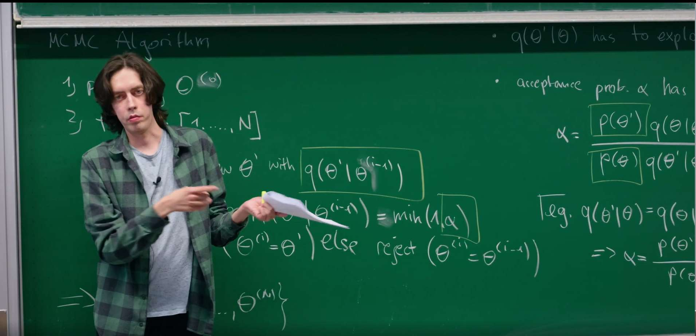
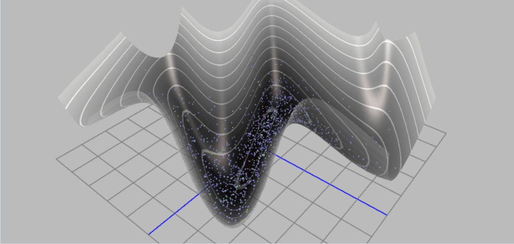
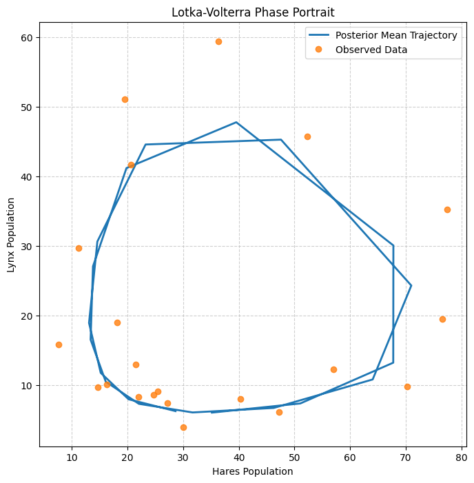

# Introduction: Overcoming the Inefficiency of Random Walks

This lecture, taught by the TA, introduces a more powerful Markov chain Monte Carlo (MCMC) method designed to overcome the main weakness of the standard Metropolis-Hastings algorithm: its inefficient "random-walk" exploration in state space. The method borrows ideas from classical mechanics to construct a more intelligent proposal mechanism.



The core idea is to stop taking random, directionless steps and instead regard the sampling variables as a particle moving in a potential energy field. By simulating its physical trajectory, we can propose new states that are far from the current one but still have high acceptance probability. This enables much faster exploration and convergence, especially in high dimensions.

# 1. Review: Metropolis-Hastings and Its Limitations

As discussed in the previous lecture Monte Carlo Sampling as a Stochastic Process, our goal is to construct a Markov chain whose stationary distribution equals the target distribution p(theta) we wish to sample. The Metropolis-Hastings algorithm provides a general scheme for this.

The algorithm proposes a new state theta' from a proposal distribution q(theta'|theta) and accepts it with probability alpha. As emphasized at the start of the lecture, this acceptance probability is the key to satisfying detailed balance. In general form:

$$\alpha(\theta'|\theta) = \min\left(1, \frac{p(\theta)q(\theta'|\theta)}{p(\theta')q(\theta|\theta')}\right)$$

This ratio corrects any asymmetry in the proposal q and biases the chain toward states of higher p. If we propose a move to a high-probability region, the factor p(theta') is large and alpha increases. If our proposal makes it easier to go from theta to theta' than to return, the factor q(theta|theta')/q(theta'|theta) compensates, ensuring the chain is not trapped in regions that are easy to enter but hard to leave.

A common simplification is to use a symmetric proposal, q(theta'|theta) = q(theta'|theta). Then the acceptance reduces to:

$$\alpha = \min\left(1, \frac{p(\theta')}{p(\theta)}\right)$$

This is the Metropolis algorithm, a special case of Metropolis-Hastings. Crucially, the normalization constant Z of p(theta) cancels in the ratio, which is a major practical advantage: we only need the unnormalized form of p(theta).

## "Random-Walk" Metropolis-Hastings and Its Fatal Pitfall

A very common symmetric proposal is a Gaussian centered at the current state:

$$q(\theta'|\theta) = \mathcal{N}(\theta'|\theta, \sigma^2)$$

This is intuitive and easy to implement, but it is precisely where inefficiency originates. The performance of the random walk depends critically on the step size sigma.

- Small sigma: proposals remain very close to the current state. Since p(theta) changes little, acceptance is high. However, the chain moves slowly and explores diffusively. This yields strong sample autocorrelation and demands very long chains to obtain effectively independent samples. The chain may get stuck near local probability peaks.
- Large sigma: exploration could be faster in principle. But for any moderately complex distribution, a large random jump is likely to land in a region of much lower probability (the "typical set" of a distribution is often a thin shell rather than a solid ball). Acceptance alpha collapses and the chain stalls.

The dilemma becomes severe in high dimensions. In 1D, a random step has about a 50% chance of pointing in a "useful" direction. In D dimensions, volume grows exponentially, and a random step almost surely points away from the narrow regions of high probability. Efficiency decays exponentially with D.

This trade-off makes random-walk Metropolis-Hastings unsuitable for complex, high-dimensional targets common in modern Bayesian statistics, machine learning, and physics. We need proposals that are both far-reaching and likely to be accepted.

# 2. A New View: Recasting Probability as Potential Energy

To overcome the fundamental limitation of random-walk exploration in high dimensions, we need a more intelligent strategy. The inspiration comes from a cornerstone model in statistical physics - the Ising model.

In the Ising model, the probability of a microscopic configuration (e.g., a string of up/down spins, denoted by {sigma}) is fully determined by its energy and the temperature, taking the elegant Boltzmann form:

$$p(\{\sigma\}) = \frac{1}{Z} e^{-\beta H(\{\sigma\})}$$

Here H is the Hamiltonian (energy) of the configuration, beta is an inverse-temperature parameter, and Z normalizes the probability to one. This suggests a powerful reinterpretation for generic sampling tasks: treat the negative log-density as potential energy.


Specifically, for a target density p(theta), define the energy (potential)

$$E(\theta) = -\log p(\theta) + \text{constant}$$

Equivalently, one can write the Boltzmann-style relation

$$p(\theta) \propto e^{-E(\theta)}.$$

so that high-probability regions correspond to low "energy." This opens the door to using dynamics to navigate the landscape.

This seemingly simple change of variables is a conceptual leap that reshapes how we view sampling:

1. From blind to directed: the original task of finding high-p(theta) regions in high dimensions becomes exploring low-E(theta) valleys. A purely statistical task turns into navigating an energy landscape with clear physical intuition.
2. Introducing "force": random walks are blind to terrain. In physics, motion is driven by force, which here is the negative gradient of potential:

   $$F = -\nabla E(\theta) = -\nabla(-\log p(\theta)) = \nabla \log p(\theta)$$

   This force always points toward increasing probability density, providing a principled direction for efficient exploration.

Historical note. The idea of leveraging Hamiltonian dynamics for sampling originated in lattice gauge theory. The pioneering Hybrid (Hamiltonian) Monte Carlo work by Duane, Kennedy, Pendleton, and Roweth (1987) addressed high-dimensional integrals in lattice QCD. The method was later popularized in statistics and machine learning - most notably by Radford Neal - and has become a cornerstone of modern Bayesian inference.

# 3. Building a Hamiltonian System: Introduce Momentum

## 3.1 Why Introduce Momentum?

If we only follow the gradient of log p(theta), we would perform steepest-descent-like moves that get trapped or move slowly along narrow valleys. Introducing a fictitious momentum variable v allows us to simulate inertial motion that can traverse long distances while respecting the geometry of the target.

## 3.2 Define the Hamiltonian H(theta, v)

Augment the parameter theta with momentum v and define the Hamiltonian as the sum of potential and kinetic energies:

$$H(\theta, v) = E(\theta) + K(v) = -\log p(\theta) + \frac{1}{2} v^{\top} M^{-1} v$$

where M is a positive-definite mass matrix (often the identity or a preconditioning matrix). The joint density over (theta, v) becomes a Gibbs distribution proportional to exp(-H(theta, v)).

- Momentum v: encodes speed and direction of exploration in parameter space.
- Mass matrix M: a key tuning element.
  - Simple choice: M = I assumes equal "mass" in all directions so the system responds uniformly to forces.
  - Deeper use: choosing M aligned with the target covariance makes "narrow" directions heavier (more cautious moves) and "wide" directions lighter (bolder moves), greatly improving efficiency for correlated targets.

## 3.3 Canonical (Gibbs) Joint Distribution

The augmented target becomes

$$\pi(\theta, v) \propto \exp\big(-H(\theta, v)\big) = p(\theta)\, \exp\!\left(-\tfrac{1}{2} v^{\top} M^{-1} v\right)$$

which factorizes into the original target p(theta) and an independent Gaussian over v. Resampling v from this Gaussian at each iteration enables the sampler to jump across level sets and explore the landscape rather than follow a single deterministic path.

Importantly, momentum is only an auxiliary variable used to drive exploration. After proposing and (possibly) accepting a new state, we discard v and retain only theta, so the collected samples are marginally distributed according to the original target p(theta).

# 4. A Step-by-Step Guide to Hamiltonian Monte Carlo

## 4.1 Step 1: Resample Momentum

Sample a fresh momentum \( \tilde v \sim \mathcal{N}(0, M) \). This randomization is what makes HMC a valid MCMC method: it allows the sampler to jump between energy level sets and explore the landscape. Without it, the dynamics would be purely deterministic and stuck on a single level set.

## 4.2 Step 2: Evolve by Hamilton's Equations

Given a start (theta, \(\tilde v\)), simulate the dynamics for a fixed time T to propose (theta', v') using Hamilton's equations:

$$\frac{d\theta}{dt} = \frac{\partial H}{\partial v} = M^{-1} v$$

$$\frac{dv}{dt} = -\frac{\partial H}{\partial \theta} = -\nabla_\theta E(\theta) = \nabla_\theta \log p(\theta)$$

Interpretation:
- The first equation says position changes at velocity \(M^{-1} v\).
- The second is Newton's second law: momentum changes with the force, the negative gradient of potential. The particle is "pulled" toward lower energy (higher probability).

This is the heart of HMC's power: unlike random walks, trajectories are guided by the gradient of log p(theta), naturally steering toward and through high-probability regions. We can thus propose a theta' far from theta yet still plausible, yielding high acceptance.

## 4.3 Step 3: Numerical Integration via the Leapfrog Method

Hamilton's equations are continuous ODEs and generally have no closed form, so we approximate trajectories numerically. Simple schemes like Euler quickly accumulate error and fail to conserve energy, leading to low acceptance. HMC uses a symplectic integrator, typically the leapfrog method, which preserves the geometric structure.

For a small step size epsilon, one leapfrog step is:

1. \( v(t + \tfrac{\epsilon}{2}) = v(t) - (\tfrac{\epsilon}{2}) \, \nabla_\theta E(\theta(t)) = v(t) + (\tfrac{\epsilon}{2}) \, \nabla_\theta \log p(\theta(t)) \)
2. \( \theta(t + \epsilon) = \theta(t) + \epsilon M^{-1} v(t + \tfrac{\epsilon}{2}) \)
3. \( v(t + \epsilon) = v(t + \tfrac{\epsilon}{2}) - (\tfrac{\epsilon}{2}) \, \nabla_\theta E(\theta(t + \epsilon)) = v(t + \tfrac{\epsilon}{2}) + (\tfrac{\epsilon}{2}) \, \nabla_\theta \log p(\theta(t + \epsilon)) \)

Repeat L = T/epsilon times to simulate total time T.

Why this scheme? Symplectic integrators such as leapfrog have two key properties:

1. Time reversibility: Simulating L steps from (theta, v) to (theta', v'), then flipping momentum to -v' and running L steps brings you exactly to (theta, -v). This is crucial for detailed balance.
2. Volume preservation: The map in (theta, v) phase space preserves volume, so it does not artificially compress or rarify probability mass - essential for valid MCMC transitions.

Although leapfrog does not conserve H exactly (it incurs O(epsilon^2) energy error), it has excellent long-term stability and preserves the geometry needed for high acceptance rates even after many steps.

## 4.4 Step 4: Metropolis-Hastings Correction

After L leapfrog steps we obtain a proposal (theta', v'). Because numerical integration is approximate, total energy is not perfectly conserved and H(theta', v') will slightly differ from H(theta, \(\tilde v\)). We make the algorithm exact by applying a final Metropolis acceptance step:

$$\alpha = \min\left(1, \exp\big[-(H(\theta', v') - H(\theta, \tilde{v}))\big]\right)$$

This is profound: in HMC, the accept/reject step is not the main driver of exploration (the dynamics are). Instead, it acts as a quality-control check on the integrator. If integration keeps energy nearly constant (H' ~ H), then alpha ~ 1. If epsilon is too large, errors increase, energy drifts, and proposals are (rightfully) rejected.

# 5. Visualizing HMC vs. Random-Walk Metropolis




The animations make the contrast clear. To build intuition, we compare a simple Random-Walk Metropolis (RWM) sampler to HMC on a correlated 2D Gaussian target - a classic test where correlations frustrate axis-aligned random walkers.

The code below implements and compares the two algorithms.

1. Target distribution: log-density (negative potential) and its gradient for a correlated 2D Gaussian.
2. RWM sampler: standard random-walk Metropolis.
3. HMC sampler: leapfrog integrator plus the full HMC loop.
4. Visualization: sample paths over contour lines of the target.

```python
import numpy as np
import matplotlib.pyplot as plt
from scipy.stats import multivariate_normal

# --- Target distribution (correlated 2D Gaussian distribution) --- 
# This defines our "potential energy field"
mean = np.array([0.0, 0.0])
cov = np.array([[1.0, 0.95], 
                [0.95, 1.0]])
inv_cov = np.linalg.inv(cov)
target_dist = multivariate_normal(mean, cov)

def potential_energy(theta):
    """ Potential energy U(theta) = -log p(theta) """
    return -target_dist.logpdf(theta)

def grad_potential_energy(theta):
    """ Gradient of potential energy, i.e., -d/d(theta) log p(theta) """
    # For Gaussian distribution N(mu, Sigma), the gradient of log p is -inv(Sigma) * (theta - mu)
    # So the gradient of potential energy (-log p) is inv(Sigma) * (theta - mu)
    return inv_cov @ (theta - mean)

# --- Leapfrog integrator ---
def leapfrog(theta, v, grad_U, epsilon, L):
    """
    Perform L steps of leapfrog integration.
    theta: current position
    v: current momentum
    grad_U: function to compute gradient of potential energy
    epsilon: step size
    L: number of steps
    """
    # Initial half-step momentum update
    v_half = v - 0.5 * epsilon * grad_U(theta)
    # L-1 full-step updates
    for _ in range(L - 1):
        theta = theta + epsilon * v_half
        v_half = v_half - epsilon * grad_U(theta)
    # Final full-step position update
    theta = theta + epsilon * v_half
    # Final half-step momentum update
    v = v_half - 0.5 * epsilon * grad_U(theta)
    return theta, v

# --- HMC sampler ---
def hmc_sampler(start_theta, n_samples, epsilon, L):
    samples = [start_theta]
    theta = start_theta
    
    for _ in range(n_samples - 1):
        # 1. Sample momentum
        v_current = np.random.randn(2)
        
        # 2. Simulate trajectory using leapfrog
        theta_prop, v_prop = leapfrog(np.copy(theta), np.copy(v_current), grad_potential_energy, epsilon, L)
        
        # 3. Metropolis-Hastings correction
        # H(theta, v) = U(theta) + K(v), where K(v) = 0.5 * v.T @ v
        U_current = potential_energy(theta)
        K_current = 0.5 * (v_current @ v_current)
        H_current = U_current + K_current
        
        U_prop = potential_energy(theta_prop)
        K_prop = 0.5 * (v_prop @ v_prop)
        H_prop = U_prop + K_prop
        
        # Acceptance probability
        alpha = min(1.0, np.exp(H_current - H_prop))
        
        if np.random.rand() < alpha:
            theta = theta_prop
            
        samples.append(theta)
        
    return np.array(samples)

# --- Random Walk Metropolis sampler ---
def rwm_sampler(start_theta, n_samples, step_size):
    samples = [start_theta]
    theta = start_theta
    
    for _ in range(n_samples - 1):
        # Propose a new state
        theta_prop = theta + step_size * np.random.randn(2)
        
        # Acceptance probability
        alpha = min(1.0, np.exp(potential_energy(theta) - potential_energy(theta_prop)))
        
        if np.random.rand() < alpha:
            theta = theta_prop
            
        samples.append(theta)
        
    return np.array(samples)

# --- Run simulation and plot ---
n_samples = 500
start_theta = np.array([-2.5, 2.5])

# Adjust parameters
hmc_samples = hmc_sampler(start_theta, n_samples, epsilon=0.1, L=20)
rwm_samples = rwm_sampler(start_theta, n_samples, step_size=0.15)

# Plotting
x = np.linspace(-3, 3, 100)
y = np.linspace(-3, 3, 100)
X, Y = np.meshgrid(x, y)
pos = np.dstack((X, Y))
Z = target_dist.pdf(pos)

plt.figure(figsize=(12, 6))

# RWM plot
plt.subplot(1, 2, 1)
plt.contour(X, Y, Z, levels=10, cmap='viridis')
plt.plot(rwm_samples[:, 0], rwm_samples[:, 1], 'r-o', markersize=3, alpha=0.5)
plt.title(f"Random Walk Metropolis (N={n_samples})")
plt.xlabel(r"$\\theta_1$")
plt.ylabel(r"$\\theta_2$")

# HMC plot
plt.subplot(1, 2, 2)
plt.contour(X, Y, Z, levels=10, cmap='viridis')
plt.plot(hmc_samples[:, 0], hmc_samples[:, 1], 'b-o', markersize=3, alpha=0.5)
plt.title(f"Hamiltonian Monte Carlo (N={n_samples})")
plt.xlabel(r"$\\theta_1$")
plt.ylabel(r"$\\theta_2$")

plt.tight_layout()
plt.show()
```


We see that the RWM path (left) is dense with tiny steps and diffusive exploration, whereas HMC (right) makes long moves across high-probability regions, yielding representative samples much faster.

# 6. Estimating Lotka-Volterra Parameters with Modern Bayesian Methods


We now put theory into practice and reproduce the classroom example from the lecture opening: predator-prey dynamics of lynx and hares. Using Hamiltonian Monte Carlo (HMC) in the modern probabilistic programming framework PyMC, and the Hudson's Bay Company dataset, we infer seven unknown parameters of the Lotka-Volterra model: \(\alpha,\beta,\gamma,\delta\), initial populations \(H_0, L_0\), and observation noise \(\sigma\).

The challenge is that the Lotka-Volterra model is a system of ODEs with no simple closed form. For any parameter vector, we must solve the ODEs numerically to obtain trajectories. This makes the posterior p(theta|D) highly complex and correlated in multiple dimensions - exactly the scenario where advanced MCMC like HMC (and NUTS) shines.

## 6.1 Modeling Plan

1. Model: Lotka-Volterra ODEs.
2. Data: hare and lynx populations from 1900-1920.
3. Target: the joint posterior \(p(\alpha,\beta,\gamma,\delta,H_{0},L_{0},\sigma\mid\text{data})\).
4. Method: build the probabilistic model in PyMC; use the default No-U-Turn Sampler (NUTS), an efficient HMC variant.

   State space: seven parameters \((\alpha,\beta,\gamma,\delta,H_{0},L_{0},\sigma)\).

   Target distribution: posterior \(p(\theta\mid D) \propto p(D\mid \theta) p(\theta)\).

   Likelihood \(p(D\mid\theta)\): assume log-normal errors between observations and model predictions, i.e., model outputs are positive and the log of predictions fits the log of the data with normal noise - very reasonable for population counts.

   Priors \(p(\theta)\): choose lognormal (or half-normal) priors to encode the physical constraint that all parameters (growth/interaction rates, initial populations, noise) are positive. This is reasonable prior knowledge and stabilizes the ODE solver.

   Gradient information and HMC: unlike random-walk MH, HMC uses Hamiltonian dynamics driven by gradients of the log-posterior. Here we employ sunode to efficiently compute sensitivities (gradients) of ODE solutions w.r.t. parameters, enabling NUTS to handle this challenging posterior.

```python
"""
Using modern PyMC (v5+) and sunode library to reproduce the Lotka-Volterra model.
This version replaces the old PyMC3 + Theano + manual gradient implementation.
"""
import pymc as pm
import numpy as np
import arviz as az
import sunode
import sunode.wrappers.as_pytensor
import matplotlib.pyplot as plt
import pandas as pd


# 1. Data preparation (Hudson Bay Company dataset)
# Keeping consistent with the data used in the original tutorial
times = np.arange(1900, 1921, 1)
hare_data = np.array([
    30.0, 47.2, 70.2, 77.4, 36.3, 20.6, 18.1, 21.4, 22.0, 25.4,
    27.1, 40.3, 57.0, 76.6, 52.3, 19.5, 11.2, 7.6, 14.6, 16.2, 24.7
])
lynx_data = np.array([
    4.0, 6.1, 9.8, 35.2, 59.4, 41.7, 19.0, 13.0, 8.3, 9.1, 7.4,
    8.0, 12.3, 19.5, 45.7, 51.1, 29.7, 15.8, 9.7, 10.1, 8.6
])
data = np.stack([hare_data, lynx_data]).T
species_names = ['hares', 'lynx']

# 2. Define ODE equations
# sunode uses sympy for symbolic definition and automatic differentiation, which is very efficient
def lotka_volterra(t, y, p):
    """
    Right-hand side of the Lotka-Volterra (predator-prey) equations.
    
    Args:
        t: Time (sympy symbol)
        y: Dataclass of state variables (species populations), containing y.hares and y.lynx
        p: Dataclass of parameters, containing p.alpha, p.beta, p.gamma, p.delta
        
    Returns:
        A dictionary describing the rate of change of each state variable.
    """
    return {
        'hares': p.alpha * y.hares - p.beta * y.lynx * y.hares,
        'lynx': p.delta * y.hares * y.lynx - p.gamma * y.lynx,
    }

# 3. Build PyMC probabilistic model
# Define coordinates to use 'time' and 'species' dimensions in the model
coords = {"time": times, "species": species_names}

with pm.Model(coords=coords) as model:
    # --- Prior distributions ---
    # Use Lognormal priors to ensure parameters are positive, preventing ODE solutions from becoming negative
    alpha = pm.Lognormal("alpha", mu=np.log(1), sigma=0.5)
    beta = pm.Lognormal("beta", mu=np.log(0.05), sigma=0.5)
    gamma = pm.Lognormal("gamma", mu=np.log(1), sigma=0.5)
    delta = pm.Lognormal("delta", mu=np.log(0.05), sigma=0.5)

    # Priors for initial states
    initial_hares = pm.Lognormal("initial_hares", mu=np.log(30), sigma=1)
    initial_lynx = pm.Lognormal("initial_lynx", mu=np.log(4), sigma=1)

    # Prior for observation noise
    sigma = pm.HalfNormal("sigma", sigma=1)

    # --- Solve ODE using sunode ---
    # This is the key step that replaces the manual Theano Op
    y_hat, _, _, _, _, _ = sunode.wrappers.as_pytensor.solve_ivp(
        y0={
            # Define initial conditions for the ODE
            # Format: {'variable_name': (PyTensor variable, shape)}
            'hares': (initial_hares, ()),
            'lynx': (initial_lynx, ()),
        },
        params={
            # Define parameters for the ODE
            # sunode will automatically compute gradients with respect to these PyTensor variables
            'alpha': (alpha, ()),
            'beta': (beta, ()),
            'gamma': (gamma, ()),
            'delta': (delta, ()),
            # sunode requires all parameters to be PyTensor variables or numpy arrays
            '_dummy': np.array(0.), 
        },
        # Pass in the ODE function we defined earlier
        rhs=lotka_volterra,
        # Define time points for solving
        tvals=times,
        t0=times[0],
    )

    # --- Likelihood function ---
    # sunode returns a dictionary, we need to stack the solution into a matrix to match the shape of observed data
    ode_solution = pm.math.stack([y_hat['hares'], y_hat['lynx']], axis=1)
    
    # Assume observations follow a log-normal distribution
    Y_obs = pm.Lognormal(
        "Y_obs", 
        mu=pm.math.log(ode_solution), 
        sigma=sigma, 
        observed=data, 
        dims=("time", "species")
    )

# 4. Run sampler
# The NUTS sampler will utilize the exact gradient information provided by sunode
with model:
    # sunode's C backend does not support multiprocessing "pickling", so we must use a single core
    idata = pm.sample(2000, tune=2000, chains=4, cores=1, target_accept=0.9)

# 5. Results visualization
# Plot posterior distributions of parameters
az.plot_posterior(idata, var_names=["alpha", "beta", "gamma", "delta", "initial_hares", "initial_lynx", "sigma"])
plt.suptitle("Posterior Distributions of Parameters", y=1.02)
plt.tight_layout()
plt.savefig("lv_posterior_distributions.png", dpi=300, bbox_inches='tight')
plt.show()

# Interpretation: Each subplot shows the posterior distribution of one parameter
# (alpha, beta, gamma, delta, initial_hares, initial_lynx, sigma). The peak
# indicates the most probable value (MAP region), and the width quantifies our
# uncertainty. A tall, narrow distribution means the data strongly constrains
# that parameter; a short, wide shape indicates weaker information and higher
# uncertainty.

# Extract posterior predictive samples
with model:
    posterior_predictive = pm.sample_posterior_predictive(idata)

# Plot posterior predictions vs. real data
fig, axes = plt.subplots(2, 1, figsize=(10, 8), sharex=True)

for i, (spec, color) in enumerate(zip(species_names, ['C0', 'C1'])):
    # Plot real data
    axes[i].plot(times, data[:, i], 'o', color=color, label=f"Observed {spec.capitalize()}")
    
    # Extract posterior predictive mean and 94% credible interval
    pred_mean = posterior_predictive.posterior_predictive['Y_obs'].mean(dim=('chain', 'draw')).sel(species=spec)
    hdi_94 = az.hdi(posterior_predictive.posterior_predictive['Y_obs'].sel(species=spec), hdi_prob=0.94)
    
    # Plot posterior predictions
    axes[i].plot(times, pred_mean, color=color, lw=2, label=f"Posterior Mean {spec.capitalize()}")
    # Use isel (integer selection) instead of sel (label selection) to get HDI upper and lower bounds
    axes[i].fill_between(times, hdi_94.Y_obs.isel(hdi=0), hdi_94.Y_obs.isel(hdi=1), color=color, alpha=0.3, label="94% HDI")
    
    axes[i].set_ylabel("Population")
    axes[i].set_title(f"{spec.capitalize()} Population Dynamics")
    axes[i].legend()

axes[1].set_xlabel("Year")
plt.tight_layout()
plt.savefig("lv_posterior_predictions.png", dpi=300, bbox_inches='tight')
plt.show()

# Interpretation: The thin translucent bands summarize uncertainty from the
# posterior predictive distribution. Most observed points fall within the
# credible band, showing that the Lotka-Volterra model, with inferred
# parameters, captures the historical predator-prey cycles. This visual
# agreement supports the adequacy of the model and the calibration of the
# inferred parameters.

# 6. Phase plot
plt.figure(figsize=(8, 8))
pred_mean_hares = posterior_predictive.posterior_predictive['Y_obs'].mean(dim=('chain', 'draw')).sel(species='hares')
pred_mean_lynx = posterior_predictive.posterior_predictive['Y_obs'].mean(dim=('chain', 'draw')).sel(species='lynx')

plt.plot(pred_mean_hares, pred_mean_lynx, lw=2, label="Posterior Mean Trajectory")
plt.plot(hare_data, lynx_data, 'o', alpha=0.8, label="Observed Data")
plt.xlabel("Hares Population")
plt.ylabel("Lynx Population")
plt.title("Lotka-Volterra Phase Portrait")
plt.legend()
plt.grid(True, linestyle='--', alpha=0.6)
plt.savefig("lv_phase_portrait.png", dpi=300, bbox_inches='tight')
plt.show()

# Interpretation: The phase portrait compares the posterior-mean trajectory in
# state space (hares vs. lynx) with the observed data. Agreement of the overall
# orbit shape and scale indicates that the inferred dynamics reproduce the
# characteristic predator-prey cycles.


# 7. Trace plot
# This plot is used to diagnose the health of the MCMC sampling process
az.plot_trace(idata, var_names=["alpha", "beta", "gamma", "delta", "initial_hares", "initial_lynx", "sigma"])
plt.tight_layout()
plt.savefig("lv_trace_plot.png", dpi=300, bbox_inches='tight')
plt.show()

# Interpretation: The trace plot is used to diagnose MCMC health. We expect
# caterpillar-like stationarity without long-term trends. Strong trends or
# stickiness indicate poor mixing (e.g., step size too large/small, too few
# integration steps) and may require retuning.

# 8. Results visualization
# Plot posterior distributions of parameters
az.plot_posterior(
    idata, 
    var_names=["alpha", "beta", "gamma", "delta", "initial_hares", "initial_lynx", "sigma"],
    kind="hist"  # Set chart type to histogram
)
plt.suptitle("Posterior Distributions of Parameters (Histogram)", y=1.02)
plt.tight_layout()
plt.savefig("lv_posterior_histograms.png", dpi=300, bbox_inches='tight')
plt.show()

# Interpretation: Histogram view of the posteriors provides a complementary
# summary of parameter uncertainty. Together with trace plots and posterior
# predictive checks, it supports a more honest uncertainty quantification than
# a single point estimate.
```


Compared with the previous lecture's hand-coded Metropolis-Hastings, this version runs longer: HMC is computationally more expensive per iteration. In each iteration, MH solves the ODE once to evaluate the likelihood; HMC, to achieve efficient exploration, must (via sunode) also compute gradients (adjoints) of the ODE solution and simulate a full trajectory to produce the next sample.

Why pay the extra cost? First, more complete modeling and more honest uncertainty: we do not fix initial conditions or errors but infer all eight parameters jointly, yielding a more faithful assessment of uncertainty. Second, unmatched sampling efficiency and reliability: while MH may produce 50,000 steps in 10 minutes, the strong autocorrelation can reduce the effective sample size to only hundreds. NUTS may take longer for 4,000 samples but often yields thousands of effectively independent draws. For scientific inference, sample quality matters far more than raw count - HMC is far more reliable for discovering the true shape of the posterior.

A natural question is whether faster methods such as scipy.optimize.curve_fit might suffice. Optimization can yield point estimates quickly, but it does not provide the full posterior, correlations, or credible intervals that are crucial for scientific conclusions.


Posterior distributions after learning from the Hudson's Bay Company data. Each subplot shows one of the seven unknown parameters (including two initial conditions and observation noise). Peaks indicate the most probable values; widths quantify uncertainty.


Blue and orange solid lines are posterior-mean predictions for hares and lynx. The model successfully reproduces the characteristic predator-prey oscillations: hare peaks first, lynx follows; then predation reduces hares, which subsequently reduces lynx, and the cycle repeats.



Phase portrait (hares vs. lynx). The closed loop is the hallmark of predator-prey dynamics. Compared to the time-series view, the phase portrait emphasizes that the inferred parameters (alpha, beta, gamma, delta) produce trajectories that match the observed cyclic path, indicating the model captures the internal feedback mechanisms.


Right: each parameter's trace shows stable, "caterpillar-like" stationarity without drift, indicating convergence. Left: posterior densities from the 4 independent chains almost perfectly overlap, confirming that all chains have discovered the same target distribution.

# Summary

HMC uses geometric information (gradients) to propose long, effective moves, dramatically improving sampling efficiency over diffusive random walks. The efficiency comes at a cost: computing gradients of the log-density and tuning more knobs (step size epsilon and number of steps L), with longer per-iteration runtime.

Table 1 summarizes key differences between the MCMC methods discussed:

**Table 1: Comparison of MCMC Sampling Algorithms**

| Feature | Random-Walk Metropolis (RWM) | Hamiltonian Monte Carlo (HMC) |
|:---|:---|:---|
| Proposal | Diffusive random steps (e.g., Gaussian noise) | Deterministic trajectories from Hamiltonian dynamics |
| Exploration | Local, slow, high sample autocorrelation | Global, fast, low sample autocorrelation |
| Information needed | Target density p(theta) (up to a constant) | Target density p(theta) and its gradient nabla log p(theta) |
| Acceptance rate | Sensitive to step size; often tuned to ~23% | Typically very high (>80%) if tuned; reflects integrator accuracy |
| Key tunables | Step size sigma | Step size epsilon, number of steps L |
| High-dimensional performance | Poor; suffers from curse of dimensionality | Excellent; scales better with dimension |
| Typical use | Simple targets or when gradients are unavailable | Gold standard for smooth targets in complex models |
| Speed | Fast per iteration (simple computations) | Slow per iteration (gradient computation) |

As a beginner, a natural question arises: with today's powerful deep learning tools, is this "old-school" method outdated or inferior? The answer is no - these are complementary tools suited to different problems - and the cutting edge is to combine them.

Beyond HMC vs. MH, a broader perspective is useful in the era of deep learning. These are complementary, not competing, tools. The frontier is to combine them.

Method comparison: Bayesian ODE inference vs. pure deep learning

| Aspect | Bayesian ODE inference (this lecture) | Pure deep learning (e.g., RNN/LSTM/Transformer) |
| :--- | :--- | :--- |
| Interpretability | Strong (white-box): each parameter has physical meaning; inspect posteriors | Weak (black-box): millions of weights; hard to explain |
| Data needs | Low: physics provides structure | High: needs large datasets to avoid overfitting |
| Prior/physics | Core advantage: embed domain knowledge via priors and equations | Typically ignored by default |
| Uncertainty quantification | Gold standard: full posteriors and credible intervals | Not provided by default; Bayesian NN exists but is complex |
| Compute profile | Inference (sampling) slow; "training" minimal | Training slow and data-hungry; inference fast once trained |
| Generalization/extrapolation | Strong due to physics-based structure | Weak, especially for out-of-distribution |

Two representative approaches in Scientific Machine Learning combine the best of both worlds:

1) Universal Differential Equations (UDEs)
- Start from a known but imperfect physics model (e.g., Lotka-Volterra).
- Add neural networks to learn unknown terms/residuals:

$$\frac{dx}{dt} = \alpha x - \beta xy + \mathbf{NN_x}(x, y, \theta_{NN})$$

$$\frac{dy}{dt} = \delta xy - \gamma y + \mathbf{NN_y}(x, y, \theta_{NN})$$

Benefits:
- Retains interpretability: infer physical parameters \(\alpha, \beta, \gamma, \delta\).
- Improves accuracy: \(\mathbf{NN}\) learns effects missing from the physics (e.g., carrying capacity, seasonality).
- Data-efficient: NN learns only residuals.
- Fast to train with gradient-based optimization; often orders of magnitude faster than pure MCMC.

2) Physics-Informed Neural Networks (PINNs)
- Fit data with a neural network but add a physics violation penalty to the loss:

Loss = data fit error + PDE/ODE residual

This forces the network to respect physical laws while learning from data.


