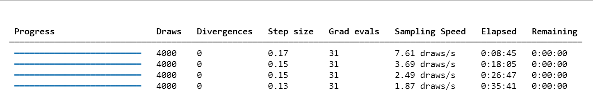

# Introduction: Overcoming the Inefficiency of Random Walks

This lecture continues to be taught by the TA, introducing a more powerful Markov chain Monte Carlo (MCMC) method designed to overcome the main weakness of the standard Metropolis-Hastings algorithm: its inefficient "random-walk" exploration in state space. The new method develops a more "intelligent" proposal mechanism by borrowing concepts from classical mechanics.


The core idea is to stop taking random, directionless steps and instead regard the sampling variables as a particle moving in a potential energy field. By simulating its physical trajectory, we can propose new states that are far from the current one but still have high acceptance probability. This enables much faster exploration and convergence, especially in high dimensions.

# 1. Review: Metropolis-Hastings and Its Limitations

As discussed in the previous lecture Monte Carlo Sampling as a Stochastic Process, our goal is to construct a Markov chain whose stationary distribution equals the target distribution p(theta) we wish to sample. The Metropolis-Hastings algorithm provides a general scheme for this.

The algorithm proposes a new state theta' from a proposal distribution q(theta'|theta) and accepts it with probability alpha. As emphasized at the start of the lecture, this acceptance probability is the key to satisfying detailed balance. In general form:

$$\alpha(\theta'|\theta) = \min\left(1, \frac{p(\theta)q(\theta'|\theta)}{p(\theta')q(\theta|\theta')}\right)$$

This ratio corrects any asymmetry in the proposal q and biases the chain toward states of higher p. If we propose a move to a high-probability region, the factor p(theta') is large and alpha increases. If our proposal makes it easier to go from theta to theta' than to return, the factor q(theta|theta')/q(theta'|theta) compensates, ensuring the chain is not trapped in regions that are easy to enter but hard to leave.

A common simplification is to use a symmetric proposal, q(theta'|theta) = q(theta'|theta). Then the acceptance reduces to:

$$\alpha = \min\left(1, \frac{p(\theta')}{p(\theta)}\right)$$

This is the Metropolis algorithm, a special case of Metropolis-Hastings. Crucially, the normalization constant Z of p(theta) cancels in the ratio, which is a major practical advantage: we only need the unnormalized form of p(theta).

## "Random-Walk" Metropolis-Hastings and Its Fatal Pitfall

A very common symmetric proposal is a Gaussian centered at the current state:

$$q(\theta'|\theta) = \mathcal{N}(\theta'|\theta, \sigma^2)$$

This is intuitive and easy to implement, but it is precisely where inefficiency originates. The performance of the random walk depends critically on the step size sigma.

- Small sigma: proposals remain very close to the current state. Since p(theta) changes little, acceptance is high. However, the chain moves slowly and explores diffusively. This yields strong sample autocorrelation and demands very long chains to obtain effectively independent samples. The chain may get stuck near local probability peaks.
- Large sigma: exploration could be faster in principle. But for any moderately complex distribution, a large random jump is likely to land in a region of much lower probability (the "typical set" of a distribution is often a thin shell rather than a solid ball). Acceptance alpha collapses and the chain stalls.

The dilemma becomes severe in high dimensions. In 1D, a random step has about a 50% chance of pointing in a "useful" direction. In D dimensions, volume grows exponentially, and a random step almost surely points away from the narrow regions of high probability. Efficiency decays exponentially with D.

This trade-off makes random-walk Metropolis-Hastings unsuitable for complex, high-dimensional targets common in modern Bayesian statistics, machine learning, and physics. We need proposals that are both far-reaching and likely to be accepted.

# 2. A New View: Recasting Probability as Potential Energy

To overcome the fundamental limitation of random-walk exploration in high dimensions, we need a more intelligent strategy. The inspiration comes from a cornerstone model in statistical physics - the **Ising model**.

The Ising model is a paradigm for understanding phase transitions in matter (such as magnetization in magnets). In it, the probability of a system being in a specific microscopic state (for example, a string of up/down spins, denoted by $\{\sigma\}$) is completely determined by its energy and the environmental temperature, taking the elegant **Boltzmann distribution** form:

$$p(\{\sigma\}) = \frac{1}{Z} e^{-\beta H(\{\sigma\})}$$

Here, $H$ is the Hamiltonian (energy) of the configuration, $\beta$ is a temperature-related constant, and $Z$ is the normalization constant (partition function) that ensures the total probability is 1. This formula embodies a profound physical intuition: **states with lower energy have exponentially higher probability of occurring**. Physical systems always tend to remain in more stable, lower-energy states.

This physical image gives us tremendous inspiration. We can "reverse" this logic: for any abstract target probability distribution $p(\theta)$ we want to sample, can we also define an equivalent "energy" function $E(\theta)$ for it? The answer is yes, we can force them to satisfy a Boltzmann-like relationship:

$$p(\theta) \propto e^{-E(\theta)}$$

By taking the logarithm of both sides, we can directly write the conversion relationship between them:

$$E(\theta) = -\log p(\theta) + \text{const}$$

We call this newly defined $E(\theta)$ the **potential energy**.

This seemingly simple mathematical transformation is actually a fundamental cognitive leap that completely changes how we view the sampling problem.


1. **From "blind" to "directed"**: Our original goal was to find regions with high $p(\theta)$ values in high-dimensional space. Now, our equivalent new goal is to explore regions with low potential energy $E(\theta)$. This successfully transforms a purely statistical sampling problem into a problem of exploring an energy landscape with rich physical intuition. The high-probability "peaks" in $p(\theta)$ have now become deep "valleys" in the $E(\theta)$ energy landscape.

2. **Introducing the concept of "force"**: Random walks are inefficient because they are "blind" - they don't understand the terrain when proposing the next step. But in the physical world, object motion is not blind. A small ball rolling in a valley is acted upon by forces. This force is precisely the **negative gradient** of potential energy:

   $$F = -\nabla E(\theta) = - \nabla (-\log p(\theta)) = \nabla \log p(\theta)$$

We have found the key to escaping randomness. We now have a "force" that is directly given by the gradient of the target distribution's logarithm, and this force **always points toward the direction of fastest increase in probability density**. We no longer need to blindly explore, but can follow the direction of the "force" to efficiently advance toward high-probability regions.

Through this perspective transformation, we have concretized the abstract sampling problem into simulating the motion of a physical particle in a potential energy field defined by the target distribution. This particle will be naturally "pushed" toward the regions we are most interested in.

Historical note. The idea of leveraging Hamiltonian dynamics for sampling originated in lattice gauge theory. The pioneering Hybrid (Hamiltonian) Monte Carlo work by Duane, Kennedy, Pendleton, and Roweth (1987) addressed high-dimensional integrals in lattice QCD. The method was later popularized in statistics and machine learning - most notably by Radford Neal - and has become a cornerstone of modern Bayesian inference.

# 3. Building a Hamiltonian System: Introduce Momentum

## 3.1 Why Introduce Momentum?

Introducing a fictitious auxiliary "momentum" variable $v$ with the same dimension as our model parameters $\theta$ (position) is equivalent to upgrading our problem from static landscape exploration to dynamic physical system simulation.

- **From first-order to second-order**: Traditional random walk methods are first-order, where the next position depends only on the current position. This is like a blindfolded person who can only randomly grope around at each step. After introducing momentum, we construct a second-order dynamical system where the next position depends not only on the current position but also on the current velocity (momentum). This is like giving an initial push to a skater in a valley - they will slide continuously along a smooth trajectory for a long distance, rather than spinning in place.

- **Persistent and directed exploration**: Momentum gives the exploration process "inertia." Once given initial momentum, the particle tends to move continuously in one direction while being acted upon by potential forces (opposite to the gradient direction) and elegantly changing direction. This persistent motion allows the sampler to perform long-distance, meaningful moves, traversing large areas of parameter space at once, thus efficiently exploring the entire probability distribution.

## 3.2 Define the Hamiltonian H(theta, v)

In classical mechanics, the total energy of an isolated system is conserved. This total energy, the **Hamiltonian $H$**, is the sum of its potential and kinetic energies. We completely adopt this most fundamental concept in physics to construct our system:

$$H(\theta, v) = E(\theta) + K(v)$$

- **Potential energy $E(\theta)$**: As defined above, $E(\theta) = -\log p(\theta)$. This part is completely determined by our target probability distribution, constructing the "terrain" or "energy landscape" for particle motion. Higher probability regions correspond to lower potential energy.

- **Kinetic energy $K(v)$**: This is the energy related to motion. Its form is directly borrowed from physics, being a quadratic function of momentum:
    $$K(v) = \frac{1}{2} v^T M^{-1} v$$
    Here $M$ is a symmetric positive-definite matrix called the **mass matrix**.
  - **Momentum $v$**: Can be intuitively understood as the "speed and direction" of particle exploration in parameter space.
  - **Mass matrix $M$**: In physics, mass represents the magnitude of inertia. Here, it plays an important regulatory role.
    - **Simple case**: The simplest choice is to set $M$ to the **identity matrix ($M=I$)**. This means we assume equal "mass" in all parameter dimensions, so the particle responds equally to "forces" in all directions.
    - **Deeper meaning**: In more advanced applications, $M$ can be set to be related to the target distribution's covariance, making the particle "heavier" in narrow directions of probability density (harder to push, more cautious moves) and "lighter" in wide directions of probability density (easier to push, bolder moves), thus greatly improving sampling efficiency on complex correlated distributions.

## 3.3 Canonical (Gibbs) Joint Distribution

We now define a **joint probability distribution $p(\theta, v)$** over position and momentum based on this Hamiltonian, in exactly the same form as the Boltzmann distribution, which is called the **canonical distribution** in physics:

$$p(\theta, v) = \frac{1}{Z'} e^{-H(\theta, v)} = \frac{1}{Z'} e^{-(E(\theta) + K(v))} = \frac{1}{Z'} e^{-E(\theta)} e^{-K(v)}$$

This construction seems to make the problem more complex: we originally only wanted to sample from $p(\theta)$, but now we have to sample from a higher-dimensional $p(\theta, v)$. The secret here is that this joint distribution has a **separable** structure. Because the Hamiltonian is designed as the sum of two parts, the joint probability can be **factorized**:

$$p(\theta, v) = \left(\frac{1}{Z_E} e^{-E(\theta)}\right) \left(\frac{1}{Z_K} e^{-K(v)}\right) = p(\theta) p(v)$$

Under our common choice for kinetic energy $K(v)$, $p(v)$ is simply a centered Gaussian distribution: $p(v) = \mathcal{N}(v|0, M)$.

This factorization is the cornerstone of the entire HMC theoretical framework. It guarantees us:

**In this extended joint distribution, position $\theta$ and momentum $v$ are mutually independent.**

This means that the momentum variable we introduced, while crucial in **dynamical evolution** (it drives exploration), does not affect our final sampled **static target distribution**. Therefore, if we can design an algorithm to generate sample pairs $(\theta, v)$ from the joint distribution $p(\theta, v)$, we simply need to **discard the momentum $v$ component** after sampling, and the remaining $\theta$ is the effective sample from the original target distribution $p(\theta)$ that we dream of.

Momentum is like a temporary "booster" or "scaffolding": we randomly set a momentum at the start of each step (giving the particle a random "kick"), let the system evolve under the guidance of physical laws, efficiently propose a high-quality candidate point, and after the task is complete, we throw away this booster, ready for the next launch.

# 4. A Step-by-Step Guide to Hamiltonian Monte Carlo

## 4.1 Step 1: Resample Momentum

Sample a fresh momentum \( \tilde v \sim \mathcal{N}(0, M) \). This randomization is what makes HMC a valid MCMC method: it allows the sampler to jump between energy level sets and explore the landscape. Without it, the dynamics would be purely deterministic and stuck on a single level set.

## 4.2 Step 2: Evolve by Hamilton's Equations

Given a start (theta, \(\tilde v\)), simulate the dynamics for a fixed time T to propose (theta', v') using Hamilton's equations:

$$\frac{d\theta}{dt} = \frac{\partial H}{\partial v} = M^{-1} v$$

$$\frac{dv}{dt} = -\frac{\partial H}{\partial \theta} = -\nabla_\theta E(\theta) = \nabla_\theta \log p(\theta)$$

Interpretation:
- The first equation says position changes at velocity \(M^{-1} v\).
- The second is Newton's second law: momentum changes with the force, the negative gradient of potential. The particle is "pulled" toward lower energy (higher probability).

This is the heart of HMC's power: unlike random walks, trajectories are guided by the gradient of log p(theta), naturally steering toward and through high-probability regions. We can thus propose a theta' far from theta yet still plausible, yielding high acceptance.

## 4.3 Step 3: Numerical Integration via the Leapfrog Method

Hamilton's equations are continuous ODEs and generally have no closed form, so we approximate trajectories numerically. Simple schemes like Euler quickly accumulate error and fail to conserve energy, leading to low acceptance. HMC uses a symplectic integrator, typically the leapfrog method, which preserves the geometric structure.

For a small step size epsilon, one leapfrog step is:

1. \( v(t + \tfrac{\epsilon}{2}) = v(t) - (\tfrac{\epsilon}{2}) \, \nabla_\theta E(\theta(t)) = v(t) + (\tfrac{\epsilon}{2}) \, \nabla_\theta \log p(\theta(t)) \)
2. \( \theta(t + \epsilon) = \theta(t) + \epsilon M^{-1} v(t + \tfrac{\epsilon}{2}) \)
3. \( v(t + \epsilon) = v(t + \tfrac{\epsilon}{2}) - (\tfrac{\epsilon}{2}) \, \nabla_\theta E(\theta(t + \epsilon)) = v(t + \tfrac{\epsilon}{2}) + (\tfrac{\epsilon}{2}) \, \nabla_\theta \log p(\theta(t + \epsilon)) \)

Repeat L = T/epsilon times to simulate total time T.

Why this scheme? Symplectic integrators such as leapfrog have two key properties:

1. Time reversibility: Simulating L steps from (theta, v) to (theta', v'), then flipping momentum to -v' and running L steps brings you exactly to (theta, -v). This is crucial for detailed balance.
2. Volume preservation: The map in (theta, v) phase space preserves volume, so it does not artificially compress or rarify probability mass - essential for valid MCMC transitions.

Although leapfrog does not conserve H exactly (it incurs O(epsilon^2) energy error), it has excellent long-term stability and preserves the geometry needed for high acceptance rates even after many steps.

## 4.4 Step 4: Metropolis-Hastings Correction

After $L$ leapfrog integration steps, we obtain a proposal state $(\theta', v')$. Because numerical integration is not perfect, the total energy $H$ is not completely conserved. $H(\theta', v')$ will differ slightly from $H(\theta, \tilde{v})$. To correct this numerical error and make the algorithm exact, we perform a final Metropolis acceptance step:

$$\alpha = \min\left(1, \exp[-(H(\theta', v') - H(\theta, \tilde{v}))]\right)$$

This is very profound. Unlike random walk Metropolis, the accept/reject step in HMC is not the main driver of exploration. The Hamiltonian dynamics are the explorers. The acceptance step is a quality-control check on the numerical integrator. If the integrator does a good job maintaining energy (if $H' \approx H$), then the acceptance probability $\alpha$ approaches 1, as written on the blackboard ($\alpha \approx 1$). If the step size $\epsilon$ is too large, integration errors become large, energy is not conserved, and proposals are (correctly) rejected.

# 5. Visualizing HMC vs. Random-Walk Metropolis


The animations make the contrast clear. To build intuition, we compare a simple Random-Walk Metropolis (RWM) sampler to HMC on a correlated 2D Gaussian target - a classic test where correlations frustrate axis-aligned random walkers.

The code below implements and compares the two algorithms.

1. Target distribution: log-density (negative potential) and its gradient for a correlated 2D Gaussian.
2. RWM sampler: standard random-walk Metropolis.
3. HMC sampler: leapfrog integrator plus the full HMC loop.
4. Visualization: sample paths over contour lines of the target.

```python
import numpy as np
import matplotlib.pyplot as plt
from scipy.stats import multivariate_normal

# --- Target distribution (correlated 2D Gaussian distribution) --- 
# This defines our "potential energy field"
mean = np.array([0.0, 0.0])
cov = np.array([[1.0, 0.95], 
                [0.95, 1.0]])
inv_cov = np.linalg.inv(cov)
target_dist = multivariate_normal(mean, cov)

def potential_energy(theta):
    """ Potential energy U(theta) = -log p(theta) """
    return -target_dist.logpdf(theta)

def grad_potential_energy(theta):
    """ Gradient of potential energy, i.e., -d/d(theta) log p(theta) """
    # For Gaussian distribution N(mu, Sigma), the gradient of log p is -inv(Sigma) * (theta - mu)
    # So the gradient of potential energy (-log p) is inv(Sigma) * (theta - mu)
    return inv_cov @ (theta - mean)

# --- Leapfrog integrator ---
def leapfrog(theta, v, grad_U, epsilon, L):
    """
    Perform L steps of leapfrog integration.
    theta: current position
    v: current momentum
    grad_U: function to compute gradient of potential energy
    epsilon: step size
    L: number of steps
    """
    # Initial half-step momentum update
    v_half = v - 0.5 * epsilon * grad_U(theta)
    # L-1 full-step updates
    for _ in range(L - 1):
        theta = theta + epsilon * v_half
        v_half = v_half - epsilon * grad_U(theta)
    # Final full-step position update
    theta = theta + epsilon * v_half
    # Final half-step momentum update
    v = v_half - 0.5 * epsilon * grad_U(theta)
    return theta, v

# --- HMC sampler ---
def hmc_sampler(start_theta, n_samples, epsilon, L):
    samples = [start_theta]
    theta = start_theta
    
    for _ in range(n_samples - 1):
        # 1. Sample momentum
        v_current = np.random.randn(2)
        
        # 2. Simulate trajectory using leapfrog
        theta_prop, v_prop = leapfrog(np.copy(theta), np.copy(v_current), grad_potential_energy, epsilon, L)
        
        # 3. Metropolis-Hastings correction
        # H(theta, v) = U(theta) + K(v), where K(v) = 0.5 * v.T @ v
        U_current = potential_energy(theta)
        K_current = 0.5 * (v_current @ v_current)
        H_current = U_current + K_current
        
        U_prop = potential_energy(theta_prop)
        K_prop = 0.5 * (v_prop @ v_prop)
        H_prop = U_prop + K_prop
        
        # Acceptance probability
        alpha = min(1.0, np.exp(H_current - H_prop))
        
        if np.random.rand() < alpha:
            theta = theta_prop
            
        samples.append(theta)
        
    return np.array(samples)

# --- Random Walk Metropolis sampler ---
def rwm_sampler(start_theta, n_samples, step_size):
    samples = [start_theta]
    theta = start_theta
    
    for _ in range(n_samples - 1):
        # Propose a new state
        theta_prop = theta + step_size * np.random.randn(2)
        
        # Acceptance probability
        alpha = min(1.0, np.exp(potential_energy(theta) - potential_energy(theta_prop)))
        
        if np.random.rand() < alpha:
            theta = theta_prop
            
        samples.append(theta)
        
    return np.array(samples)

# --- Run simulation and plot ---
n_samples = 500
start_theta = np.array([-2.5, 2.5])

# Adjust parameters
hmc_samples = hmc_sampler(start_theta, n_samples, epsilon=0.1, L=20)
rwm_samples = rwm_sampler(start_theta, n_samples, step_size=0.15)

# Plotting
x = np.linspace(-3, 3, 100)
y = np.linspace(-3, 3, 100)
X, Y = np.meshgrid(x, y)
pos = np.dstack((X, Y))
Z = target_dist.pdf(pos)

plt.figure(figsize=(12, 6))

# RWM plot
plt.subplot(1, 2, 1)
plt.contour(X, Y, Z, levels=10, cmap='viridis')
plt.plot(rwm_samples[:, 0], rwm_samples[:, 1], 'r-o', markersize=3, alpha=0.5)
plt.title(f"Random Walk Metropolis (N={n_samples})")
plt.xlabel(r"$\\theta_1$")
plt.ylabel(r"$\\theta_2$")

# HMC plot
plt.subplot(1, 2, 2)
plt.contour(X, Y, Z, levels=10, cmap='viridis')
plt.plot(hmc_samples[:, 0], hmc_samples[:, 1], 'b-o', markersize=3, alpha=0.5)
plt.title(f"Hamiltonian Monte Carlo (N={n_samples})")
plt.xlabel(r"$\\theta_1$")
plt.ylabel(r"$\\theta_2$")

plt.tight_layout()
plt.show()
```


We see that the RWM path (left) is dense with tiny steps and diffusive exploration, whereas HMC (right) makes long moves across high-probability regions, yielding representative samples much faster.

# 6. Estimating Lotka-Volterra Parameters with Modern Bayesian Methods


We now put theory into practice and reproduce the classroom example from the lecture opening: predator-prey dynamics of lynx and hares. Using Hamiltonian Monte Carlo (HMC) in the modern probabilistic programming framework PyMC, and the Hudson's Bay Company dataset, we infer seven unknown parameters of the Lotka-Volterra model: \(\alpha,\beta,\gamma,\delta\), initial populations \(H_0, L_0\), and observation noise \(\sigma\).

The challenge is that the Lotka-Volterra model is a system of ODEs with no simple closed form. For any parameter vector, we must solve the ODEs numerically to obtain trajectories. This makes the posterior p(theta|D) highly complex and correlated in multiple dimensions - exactly the scenario where advanced MCMC like HMC (and NUTS) shines.

## 6.1 Modeling Plan

1. Model: Lotka-Volterra ODEs.
2. Data: hare and lynx populations from 1900-1920.
3. Target: the joint posterior \(p(\alpha,\beta,\gamma,\delta,H_{0},L_{0},\sigma\mid\text{data})\).
4. Method: build the probabilistic model in PyMC; use the default No-U-Turn Sampler (NUTS), an efficient HMC variant.

   State space: seven parameters \((\alpha,\beta,\gamma,\delta,H_{0},L_{0},\sigma)\).

   Target distribution: posterior \(p(\theta\mid D) \propto p(D\mid \theta) p(\theta)\).

   Likelihood \(p(D\mid\theta)\): assume log-normal errors between observations and model predictions, i.e., model outputs are positive and the log of predictions fits the log of the data with normal noise - very reasonable for population counts.

   Priors \(p(\theta)\): choose lognormal (or half-normal) priors to encode the physical constraint that all parameters (growth/interaction rates, initial populations, noise) are positive. This is reasonable prior knowledge and stabilizes the ODE solver.

   Gradient information and HMC: unlike random-walk MH, HMC uses Hamiltonian dynamics driven by gradients of the log-posterior. Here we employ sunode to efficiently compute sensitivities (gradients) of ODE solutions w.r.t. parameters, enabling NUTS to handle this challenging posterior.

```python
"""
Using modern PyMC (v5+) and sunode library to reproduce the Lotka-Volterra model.
This version replaces the old PyMC3 + Theano + manual gradient implementation.
"""
import pymc as pm
import numpy as np
import arviz as az
import sunode
import sunode.wrappers.as_pytensor
import matplotlib.pyplot as plt
import pandas as pd


# 1. Data preparation (Hudson Bay Company dataset)
# Keeping consistent with the data used in the original tutorial
times = np.arange(1900, 1921, 1)
hare_data = np.array([
    30.0, 47.2, 70.2, 77.4, 36.3, 20.6, 18.1, 21.4, 22.0, 25.4,
    27.1, 40.3, 57.0, 76.6, 52.3, 19.5, 11.2, 7.6, 14.6, 16.2, 24.7
])
lynx_data = np.array([
    4.0, 6.1, 9.8, 35.2, 59.4, 41.7, 19.0, 13.0, 8.3, 9.1, 7.4,
    8.0, 12.3, 19.5, 45.7, 51.1, 29.7, 15.8, 9.7, 10.1, 8.6
])
data = np.stack([hare_data, lynx_data]).T
species_names = ['hares', 'lynx']

# 2. Define ODE equations
# sunode uses sympy for symbolic definition and automatic differentiation, which is very efficient
def lotka_volterra(t, y, p):
    """
    Right-hand side of the Lotka-Volterra (predator-prey) equations.
    
    Args:
        t: Time (sympy symbol)
        y: Dataclass of state variables (species populations), containing y.hares and y.lynx
        p: Dataclass of parameters, containing p.alpha, p.beta, p.gamma, p.delta
        
    Returns:
        A dictionary describing the rate of change of each state variable.
    """
    return {
        'hares': p.alpha * y.hares - p.beta * y.lynx * y.hares,
        'lynx': p.delta * y.hares * y.lynx - p.gamma * y.lynx,
    }

# 3. Build PyMC probabilistic model
# Define coordinates to use 'time' and 'species' dimensions in the model
coords = {"time": times, "species": species_names}

with pm.Model(coords=coords) as model:
    # --- Prior distributions ---
    # Use Lognormal priors to ensure parameters are positive, preventing ODE solutions from becoming negative
    alpha = pm.Lognormal("alpha", mu=np.log(1), sigma=0.5)
    beta = pm.Lognormal("beta", mu=np.log(0.05), sigma=0.5)
    gamma = pm.Lognormal("gamma", mu=np.log(1), sigma=0.5)
    delta = pm.Lognormal("delta", mu=np.log(0.05), sigma=0.5)

    # Priors for initial states
    initial_hares = pm.Lognormal("initial_hares", mu=np.log(30), sigma=1)
    initial_lynx = pm.Lognormal("initial_lynx", mu=np.log(4), sigma=1)

    # Prior for observation noise
    sigma = pm.HalfNormal("sigma", sigma=1)

    # --- Solve ODE using sunode ---
    # This is the key step that replaces the manual Theano Op
    y_hat, _, _, _, _, _ = sunode.wrappers.as_pytensor.solve_ivp(
        y0={
            # Define initial conditions for the ODE
            # Format: {'variable_name': (PyTensor variable, shape)}
            'hares': (initial_hares, ()),
            'lynx': (initial_lynx, ()),
        },
        params={
            # Define parameters for the ODE
            # sunode will automatically compute gradients with respect to these PyTensor variables
            'alpha': (alpha, ()),
            'beta': (beta, ()),
            'gamma': (gamma, ()),
            'delta': (delta, ()),
            # sunode requires all parameters to be PyTensor variables or numpy arrays
            '_dummy': np.array(0.), 
        },
        # Pass in the ODE function we defined earlier
        rhs=lotka_volterra,
        # Define time points for solving
        tvals=times,
        t0=times[0],
    )

    # --- Likelihood function ---
    # sunode returns a dictionary, we need to stack the solution into a matrix to match the shape of observed data
    ode_solution = pm.math.stack([y_hat['hares'], y_hat['lynx']], axis=1)
    
    # Assume observations follow a log-normal distribution
    Y_obs = pm.Lognormal(
        "Y_obs", 
        mu=pm.math.log(ode_solution), 
        sigma=sigma, 
        observed=data, 
        dims=("time", "species")
    )

# 4. Run sampler
# The NUTS sampler will utilize the exact gradient information provided by sunode
with model:
    # sunode's C backend does not support multiprocessing "pickling", so we must use a single core
    idata = pm.sample(2000, tune=2000, chains=4, cores=1, target_accept=0.9)

# 5. Results visualization
# Plot posterior distributions of parameters
az.plot_posterior(idata, var_names=["alpha", "beta", "gamma", "delta", "initial_hares", "initial_lynx", "sigma"])
plt.suptitle("Posterior Distributions of Parameters", y=1.02)
plt.tight_layout()
plt.savefig("lv_posterior_distributions.png", dpi=300, bbox_inches='tight')
plt.show()

# Interpretation: Each subplot shows the posterior distribution of one parameter
# (alpha, beta, gamma, delta, initial_hares, initial_lynx, sigma). The peak
# indicates the most probable value (MAP region), and the width quantifies our
# uncertainty. A tall, narrow distribution means the data strongly constrains
# that parameter; a short, wide shape indicates weaker information and higher
# uncertainty.

# Extract posterior predictive samples
with model:
    posterior_predictive = pm.sample_posterior_predictive(idata)

# Plot posterior predictions vs. real data
fig, axes = plt.subplots(2, 1, figsize=(10, 8), sharex=True)

for i, (spec, color) in enumerate(zip(species_names, ['C0', 'C1'])):
    # Plot real data
    axes[i].plot(times, data[:, i], 'o', color=color, label=f"Observed {spec.capitalize()}")
    
    # Extract posterior predictive mean and 94% credible interval
    pred_mean = posterior_predictive.posterior_predictive['Y_obs'].mean(dim=('chain', 'draw')).sel(species=spec)
    hdi_94 = az.hdi(posterior_predictive.posterior_predictive['Y_obs'].sel(species=spec), hdi_prob=0.94)
    
    # Plot posterior predictions
    axes[i].plot(times, pred_mean, color=color, lw=2, label=f"Posterior Mean {spec.capitalize()}")
    # Use isel (integer selection) instead of sel (label selection) to get HDI upper and lower bounds
    axes[i].fill_between(times, hdi_94.Y_obs.isel(hdi=0), hdi_94.Y_obs.isel(hdi=1), color=color, alpha=0.3, label="94% HDI")
    
    axes[i].set_ylabel("Population")
    axes[i].set_title(f"{spec.capitalize()} Population Dynamics")
    axes[i].legend()

axes[1].set_xlabel("Year")
plt.tight_layout()
plt.savefig("lv_posterior_predictions.png", dpi=300, bbox_inches='tight')
plt.show()

# Interpretation: The thin translucent bands summarize uncertainty from the
# posterior predictive distribution. Most observed points fall within the
# credible band, showing that the Lotka-Volterra model, with inferred
# parameters, captures the historical predator-prey cycles. This visual
# agreement supports the adequacy of the model and the calibration of the
# inferred parameters.

# 6. Phase plot
plt.figure(figsize=(8, 8))
pred_mean_hares = posterior_predictive.posterior_predictive['Y_obs'].mean(dim=('chain', 'draw')).sel(species='hares')
pred_mean_lynx = posterior_predictive.posterior_predictive['Y_obs'].mean(dim=('chain', 'draw')).sel(species='lynx')

plt.plot(pred_mean_hares, pred_mean_lynx, lw=2, label="Posterior Mean Trajectory")
plt.plot(hare_data, lynx_data, 'o', alpha=0.8, label="Observed Data")
plt.xlabel("Hares Population")
plt.ylabel("Lynx Population")
plt.title("Lotka-Volterra Phase Portrait")
plt.legend()
plt.grid(True, linestyle='--', alpha=0.6)
plt.savefig("lv_phase_portrait.png", dpi=300, bbox_inches='tight')
plt.show()

# Interpretation: The phase portrait compares the posterior-mean trajectory in
# state space (hares vs. lynx) with the observed data. Agreement of the overall
# orbit shape and scale indicates that the inferred dynamics reproduce the
# characteristic predator-prey cycles.


# 7. Trace plot
# This plot is used to diagnose the health of the MCMC sampling process
az.plot_trace(idata, var_names=["alpha", "beta", "gamma", "delta", "initial_hares", "initial_lynx", "sigma"])
plt.tight_layout()
plt.savefig("lv_trace_plot.png", dpi=300, bbox_inches='tight')
plt.show()

# Interpretation: The trace plot is used to diagnose MCMC health. We expect
# caterpillar-like stationarity without long-term trends. Strong trends or
# stickiness indicate poor mixing (e.g., step size too large/small, too few
# integration steps) and may require retuning.

# 8. Results visualization
# Plot posterior distributions of parameters
az.plot_posterior(
    idata, 
    var_names=["alpha", "beta", "gamma", "delta", "initial_hares", "initial_lynx", "sigma"],
    kind="hist"  # Set chart type to histogram
)
plt.suptitle("Posterior Distributions of Parameters (Histogram)", y=1.02)
plt.tight_layout()
plt.savefig("lv_posterior_histograms.png", dpi=300, bbox_inches='tight')
plt.show()

# Interpretation: Histogram view of the posteriors provides a complementary
# summary of parameter uncertainty. Together with trace plots and posterior
# predictive checks, it supports a more honest uncertainty quantification than
# a single point estimate.
```



We can see that compared to the Metropolis-Hastings MCMC code we implemented in the previous lecture, this code runs longer. The fundamental reason is that it uses the computationally more expensive **Hamiltonian Monte Carlo (HMC) algorithm**. In each iteration, Metropolis-Hastings only needs to numerically solve the differential equation (ODE) once to calculate the likelihood; while HMC, to achieve more efficient parameter space exploration, not only needs to solve the ODE but must also solve a more complex adjoint differential equation system through sunode to obtain the gradient of the posterior probability, and use this gradient information to simulate a complete trajectory to produce the next sample point.

Why do we still use HMC despite the longer computation time? First, HMC provides more comprehensive modeling and more honest uncertainty quantification. We do not assume that initial values and errors are known. By inferring all 8 parameters simultaneously, we obtain a more complete and honest assessment of the overall uncertainty of the system. The MH code from the previous lecture may have underestimated the final uncertainty because it fixed these values.

Second, unparalleled sampling efficiency and reliability - this may be the most important advantage. Although MH can provide 50,000 samples in 10 minutes, these samples may be highly correlated, effectively equivalent to only hundreds of independent effective samples. NUTS takes longer for 4,000 samples but may be equivalent to thousands of independent effective samples. For complex scientific problems, sample "quality" is far more important than "quantity". HMC provides results that are far more reliable than MH, better ensuring that we have explored the true shape of the posterior distribution.

Actually, students with some data background might wonder: we clearly have faster methods (like scipy.optimize.curve_fit) that can give you a set of optimal parameter values (a point estimate) in seconds. It can tell you "which curve best fits these data points." But the Bayesian ODE method (what we used): it not only provides parameter estimates but also provides the complete posterior distribution of parameters. It can tell you: "Based on the data and our physical model, the prey birth rate α has a 95% probability of being in the interval [0.5, 0.8], with the most likely value being 0.65."

This is a world of difference in scientific research. **What we care about is often not the optimal curve, but the intrinsic laws driving the system, that is, the true values of parameters like α, β, γ, δ.** Understanding these parameters is understanding the ecosystem itself. This is like a doctor diagnosing the root cause of disease, not just reducing fever.

Therefore, our real science is rigorous uncertainty quantification rather than just data alchemy. In science, engineering, and policy making, knowing "how certain we are about a result" is crucial. For example, when we say "according to the model, sea level rise in 2030 has a 95% probability of being between 10 and 15 centimeters," this kind of statement with strict probability guarantees is the cornerstone for formulating climate change response policies. Similarly, in drug development, determining the confidence interval for the effective dose of a new drug directly relates to patient safety. We are willing to spend weeks of computation time in exchange for this reliability.

More importantly, we can extract every drop of information from the data. In many research fields, data is extremely precious and sparse. For example:

- **Clinical trials**: Limited number of patients.
- **Paleontology**: Rare fossil samples.
- **Space exploration**: Limited data transmitted back by probes.

In these scenarios, we cannot use deep learning that requires massive amounts of data. But Bayesian methods can combine prior knowledge (our ODE model is a very strong prior) with small amounts of data to draw very robust conclusions. It "extracts" every drop of information from the data.


Bayesian model's final inference results for the seven unknown parameters in the Lotka-Volterra equations (including two initial values and noise) after learning from Hudson's Bay Company's historical data. Each subplot represents the probability distribution of one parameter.


The two solid lines in the figure (blue for hares, orange for lynx) are the model's "best prediction" trajectory (i.e., posterior mean prediction). We can clearly see that this prediction line very successfully captures the periodic fluctuation patterns of both species' populations over time. The hare population reaches its peak first, followed by the lynx population as a food source; the increase in lynx numbers leads to heavy predation and reduction of hares, then lynx also decrease due to food shortage, and the cycle repeats.


Phase portrait of the Lotka-Volterra model. The most core feature of this figure is a **closed loop**. This is precisely the hallmark dynamical characteristic of predator-prey systems. Compared to the time series figure above, this phase portrait better proves that the model is not just "fitting a few data points" but truly understands and reproduces the internal dynamical feedback mechanisms of this ecosystem. It proves that when the parameters learned by the model ($\alpha, \beta, \gamma, \delta$) are combined together, they can generate a theoretical trajectory very similar to the cyclic path observed in the real world.


The right side of the figure shows that each parameter's sampling trajectory is like a stable, "fuzzy caterpillar," with no upward or downward drift trends, indicating that the sampling process has completely converged. Meanwhile, in the posterior distribution plots on the left, the curves from 4 independent sampling chains almost perfectly overlap, further proving that they have all consistently found the same target distribution.

# Summary

HMC uses geometric information (gradients) to propose long, effective moves, dramatically improving sampling efficiency over diffusive random walks. The efficiency comes at a cost: computing gradients of the log-density and tuning more knobs (step size epsilon and number of steps L), with longer per-iteration runtime.

Table 1 summarizes key differences between the MCMC methods discussed:

**Table 1: Comparison of MCMC Sampling Algorithms**

| Feature | Random-Walk Metropolis (RWM) | Hamiltonian Monte Carlo (HMC) |
|:---|:---|:---|
| Proposal | Diffusive random steps (e.g., Gaussian noise) | Deterministic trajectories from Hamiltonian dynamics |
| Exploration | Local, slow, high sample autocorrelation | Global, fast, low sample autocorrelation |
| Information needed | Target density p(theta) (up to a constant) | Target density p(theta) and its gradient nabla log p(theta) |
| Acceptance rate | Sensitive to step size; often tuned to ~23% | Typically very high (>80%) if tuned; reflects integrator accuracy |
| Key tunables | Step size sigma | Step size epsilon, number of steps L |
| High-dimensional performance | Poor; suffers from curse of dimensionality | Excellent; scales better with dimension |
| Typical use | Simple targets or when gradients are unavailable | Gold standard for smooth targets in complex models |
| Speed | Fast per iteration (simple computations) | Slow per iteration (gradient computation) |

**As a beginner, after learning this lecture, a natural question arises: with today's powerful deep learning tools, is this "old-school" method outdated or "inferior" to deep learning?**

The answer is: they are not in a simple superior-inferior relationship, but two powerful tools suitable for different problems, each with its own strengths. The true scientific frontier lies in combining these two approaches.

Let us make an in-depth comparison.

Method comparison: Bayesian ODE inference vs. pure deep learning

| Aspect | Bayesian ODE inference (this lecture) | Pure deep learning (e.g., RNN/LSTM/Transformer) |
| :--- | :--- | :--- |
| Interpretability | Strong (white-box): each parameter has physical meaning; inspect posteriors | Weak (black-box): millions of weights; hard to explain |
| Data needs | Low: physics provides structure | High: needs large datasets to avoid overfitting |
| Prior/physics | Core advantage: embed domain knowledge via priors and equations | Typically ignored by default |
| Uncertainty quantification | Gold standard: full posteriors and credible intervals | Not provided by default; Bayesian NN exists but is complex |
| Compute profile | Inference (sampling) slow; "training" minimal | Training slow and data-hungry; inference fast once trained |
| Generalization/extrapolation | Strong due to physics-based structure | Weak, especially for out-of-distribution |

Two representative approaches in Scientific Machine Learning combine the best of both worlds:

1) Universal Differential Equations (UDEs)
- Start from a known but imperfect physics model (e.g., Lotka-Volterra).
- Add neural networks to learn unknown terms/residuals:

$$\frac{dx}{dt} = \alpha x - \beta xy + \mathbf{NN_x}(x, y, \theta_{NN})$$

$$\frac{dy}{dt} = \delta xy - \gamma y + \mathbf{NN_y}(x, y, \theta_{NN})$$

Benefits:
- Retains interpretability: infer physical parameters \(\alpha, \beta, \gamma, \delta\).
- Improves accuracy: \(\mathbf{NN}\) learns effects missing from the physics (e.g., carrying capacity, seasonality).
- Data-efficient: NN learns only residuals.
- Fast to train with gradient-based optimization; often orders of magnitude faster than pure MCMC.

2) Physics-Informed Neural Networks (PINNs)
- Fit data with a neural network but add a physics violation penalty to the loss:

Loss = data fit error + PDE/ODE residual

This forces the network to respect physical laws while learning from data.

One of the hottest directions in current computational science: **Scientific Machine Learning**, whose core idea is to combine the best parts of both approaches. Representative technologies include:

**1. Universal Differential Equations (UDEs)**

The approach is:

- We start from a known but imperfect physics model (like our Lotka-Volterra equations).
- Then, we **use a neural network to learn the unknown parts or error terms of the model**.

The equations become like this:

$$\frac{dx}{dt} = \alpha x - \beta xy + \mathbf{NN_x}(x, y, \theta_{NN})$$

$$\frac{dy}{dt} = \delta xy - \gamma y + \mathbf{NN_y}(x, y, \theta_{NN})$$

**Benefits of this approach:**

- **Retains interpretability**: We can still infer physically meaningful parameters $\alpha, \beta, \gamma, \delta$.

- **Improves model accuracy**: Neural networks $\mathbf{NN}$ can learn from data and correct shortcomings of the original physics model (for example, environmental carrying capacity, seasonal changes, and other factors not considered by Lotka-Volterra).

- **More data-efficient**: Since most structure is provided by physical laws, neural networks only need to learn the "residual" part, requiring far less data than pure deep learning.

- **Faster**: Usually trained using gradient-based optimization algorithms, orders of magnitude faster than pure MCMC sampling.

**2. Physics-Informed Neural Networks (PINNs)**

This is another approach. It lets a neural network directly fit data, but **adds a penalty term in the training loss function for solutions that violate known physical laws (such as ODE equations)**.

* **Loss function =** data fitting error + physics equation residual

This is equivalent to forcing the neural network to "respect" physical laws while learning data patterns.