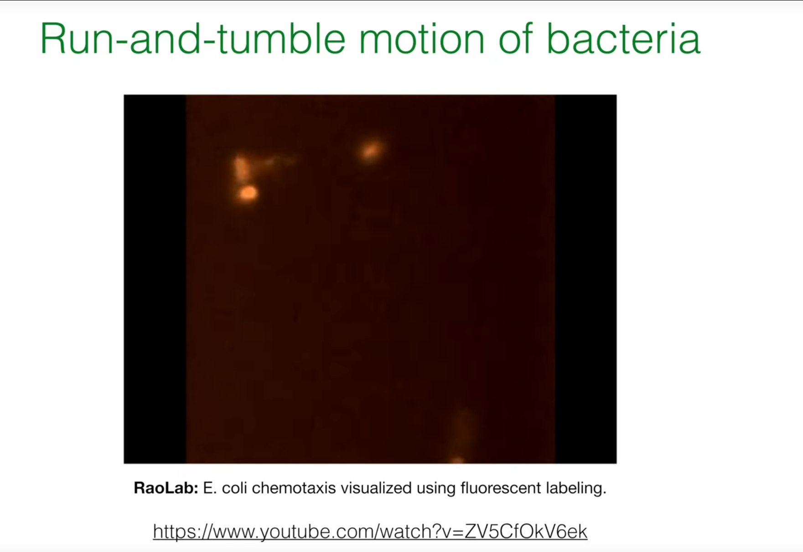
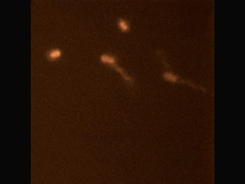
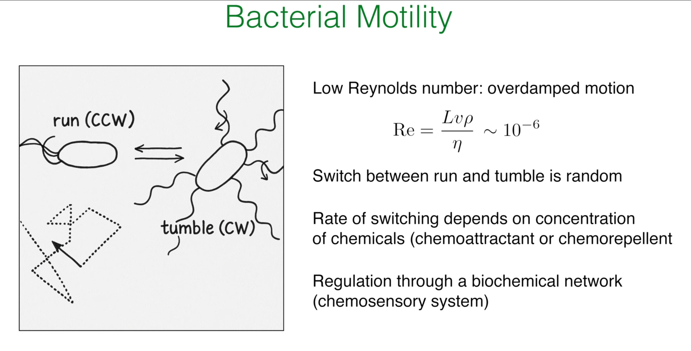
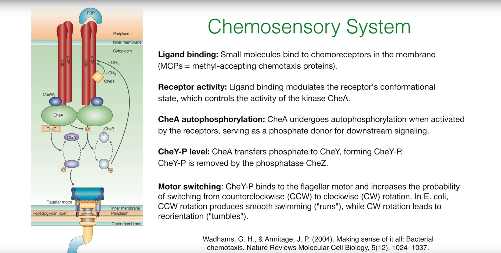
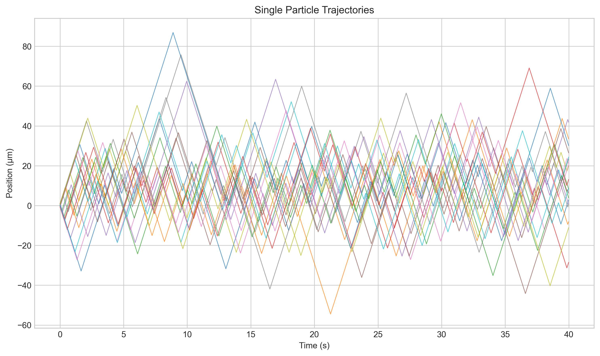

# Prologue: From Unbiased to Biased Random Walks

In earlier lectures, Professor Erwin Frey has explored the concept of simple random walks and revealed their profound connection to diffusion equations at macroscopic scales. These walks are completely unbiased: each step's direction choice is purely random, ultimately leading to the dispersion of particle clouds. However, in the biological world, we observe many microorganisms that, despite being in a viscosity-dominated physical environment where inertia is negligible, can exhibit remarkable navigation capabilities, moving toward food sources or away from harmful substances.



Our central question: How can an organism achieve directional motion under random forces in a low-Reynolds-number regime? We study chemotaxis as the paradigm. Chemotaxis is a biased random walk: microscopic, stochastic choices are orchestrated into an effective macroscopic navigation strategy. This is a biological marvel and a compelling problem in statistical physics.

# 1. Biological Background of Bacterial Chemotaxis



## 1.1. E. coli's Motion: Run-and-Tumble

The motion pattern of *E. coli* is not continuous smooth swimming, but rather alternates between two distinct behaviors:

* **Run:** During this phase, the bacterium's several flagella rotate counterclockwise (Counter-clockwise, CCW), they bundle together, and like a propeller, propel the cell body forward approximately along a straight line.

* **Tumble:** During this phase, the flagellar rotation direction switches to clockwise (Clockwise, CW). This causes the flagellar bundle to fall apart, with each flagellum moving independently, thus causing the cell body to randomly change direction in place, setting a new, random departure angle for the next "run."

The core mechanism of chemotaxis does not lie in the bacterium's ability to "manipulate" a steering wheel for precise turns, but rather in their ability to **regulate the frequency of tumbling** based on changes in the concentration of favorable or harmful chemical substances in the environment. When bacteria sense they are moving toward higher concentrations of chemoattractants, they suppress tumbling, thereby prolonging the current "run." Conversely, if they find themselves swimming toward an unfavorable direction (such as decreasing chemoattractant concentration or increasing repellent concentration), they increase the frequency of tumbling to try a new random direction more quickly. Through this simple "continue if better, change if worse" strategy, the bacterial random walk becomes statistically biased, ultimately achieving macroscopic migration toward regions of high chemoattractant concentration.

## 1.2. Physics of the Microscopic World: Life at Low Reynolds Number



To understand why bacteria adopt this seemingly clumsy run-and-tumble strategy, we must examine the physical environment they inhabit. The dimensionless number describing the relative importance of inertial and viscous forces in fluid dynamics is the **Reynolds number**, defined as:

$$Re = \frac{\rho Lv}{\eta}$$

where $L$ is the characteristic length (for bacteria, about several micrometers), $v$ is the velocity (about 20-30 μm/s), $\rho$ is the fluid density (density of water), and $\eta$ is the fluid viscosity. For a typical *E. coli*, the calculated Reynolds number is extremely low, approximately $10^{-6}$.

Such a low Reynolds number means that viscous forces absolutely dominate bacterial motion, while inertial forces are completely negligible. This brings several crucial physical consequences. **First, there is no "gliding" or "inertia."** Once the bacterium's flagella stop providing thrust, viscous resistance causes it to stop almost instantly. This explains why the transition between "run" (with thrust) and "tumble" (direction reset) is so distinct. Second, strategies like continuous turning through body undulation (like fish in the macroscopic world) are ineffective in a viscosity-dominated world. Therefore, bacteria must evolve a unique motion strategy adapted to this "highly damped" environment: stochastic run-and-tumble motion. This is not a suboptimal choice, but an efficient and necessary navigation method at their physical scale.

## 1.3. Molecular Machines: The Chemosensory System



How do bacteria sense environmental changes and convert them into flagellar motor control signals? Behind this lies a precise and complex biochemical signal transduction network—the chemosensory system. The core steps are as follows:

1. **Ligand Binding:** Chemoattractant or chemorepellent molecules bind to methyl-accepting chemotaxis proteins (MCPs) on the cell membrane.

2. **Signal Transduction:** Ligand binding alters the conformation of MCPs, which further modulates the autophosphorylation activity of the coupled histidine kinase CheA. Chemoattractant binding suppresses CheA activity.

3. **Phosphorylation Cascade:** Activated CheA (CheA-P) transfers its phosphate group to the response regulator protein CheY.

4. **Motor Control:** Phosphorylated CheY (CheY-P) is the key signaling molecule. It diffuses in the cytoplasm and binds to the flagellar motor switch complex, significantly increasing the probability of motor switching from CCW (run) to CW (tumble) rotation. Therefore, high CheY-P concentration means high tumble frequency.

5. **Adaptation:** The system also includes an adaptation module. Phosphatase CheZ continuously removes phosphate groups from CheY-P, inactivating it. More importantly, the intracellular domains of MCPs can be reversibly methylated (catalyzed by CheR) and demethylated (catalyzed by CheB). This methylation modification level can regulate MCPs' influence on CheA activity, enabling bacteria to respond to **relative changes** in chemical concentration (i.e., gradients) rather than to **absolute concentrations**. This is precisely the biological foundation of the "temporal sensing" mechanism discussed in the next section.

## 1.4. Challenges in Chemotaxis Research


Understanding chemotaxis, particularly bacterial chemotaxis, is not merely about describing motion patterns and molecular mechanisms. Deeper research faces a series of challenges spanning physics, biology, and information theory:

1. **Limits of Sensing and Navigation under Noise:**
   * **Core question:** How can organisms (such as bacteria) navigate accurately using only local, stochastic (random fluctuation) measurements?
   * **Deeper meaning:** At the microscopic scale, the diffusion and binding of chemical molecules are random events, causing the signals perceived by cells to inherently carry noise. Additionally, intracellular signal transduction networks also have inherent biochemical noise. In such a high-noise environment, cells need to extract useful gradient information from noisy signals and make effective decisions. This involves the intersection of statistical inference, information theory, and control theory: for a finite-size, finite-energy biological system, where are the theoretical limits of sensing and navigation? How does it optimize information acquisition and processing through its molecular networks under physical constraints?

2. **Thermodynamics of Sensing and Adaptation:**
   * **Core question:** What are the energy and information costs of chemotactic behavior?
   * **Deeper meaning:** Cell sensing of chemical gradients, signal processing, flagellar motor regulation, and adaptation (insensitivity to background concentration changes, responding only to relative changes) all require energy consumption. For example, phosphorylation processes, and the activity of methylase and demethylase enzymes all require ATP. The adaptation mechanism itself requires precise balance to maintain its sensitivity. From a thermodynamic perspective, how much energy cost do biological systems need to pay to acquire and process environmental information? Is there a fundamental thermodynamic lower bound that specifies the minimum energy required to achieve specific sensing precision? These questions link information theory with nonequilibrium thermodynamics.

3. **From Single-Cell Behavior to Collective Transport:**
   * **Core question:** How do individual cell fluctuations shape population-level dynamics?
   * **Deeper meaning:** Although we understand the run-and-tumble mechanism of individual bacteria, when millions or even billions of bacteria gather together, they exhibit complex collective behaviors, such as collective migration, biofilm formation, and chemotactic collapse as mentioned above. These collective phenomena often cannot be simply obtained by superposition of individual cell behaviors. We need to understand how interactions between individual cells (directly or indirectly through chemical fields) lead to macroscopic self-organized patterns. This requires combining microscopic stochastic processes with macroscopic continuum models (such as the Keller-Segel model) and exploring the impact of individual variability on population dynamics.

# 2. A Minimal Motion Model: Two-State Process

We abstract 3D run-and-tumble to a 1D, two-state process.

## 2.1. Reduction to One Dimension

We assume bacteria can only move on a one-dimensional straight line. Their state is determined not only by their position $x$, but also by their internal motion direction state $\sigma$.

* $\sigma=+1$: represents bacteria moving to the right (Right-movers).
* $\sigma=-1$: represents bacteria moving to the left (Left-movers).


## 2.2. Direction-Switching Rates

“Tumbling” changes σ. Model it as stochastic switching with rates:
- α+(x): rate to switch +1 → −1 at position x.
- α−(x): rate to switch −1 → +1 at position x.

Allowing α+/-(x) to depend on x encodes environmental information (chemical gradients). If α+(x) ≠ α−(x), the walk becomes biased.

## 2.3. Master Equations for Directional Probabilities

Let p+(x,t) (resp. p−) be the probability density of a right- (resp. left-) mover at (x,t). Consider a small interval [x, x+dx] and track the change over a short time dt. The evolution consists of three contributions: advection, loss, and gain:

$$\partial_t p_+(x,t) = -v_0 \, \partial_x p_+(x,t) - \alpha_+(x) \, p_+(x,t) + \alpha_-(x) \, p_-(x,t)$$

$$\partial_t p_-(x,t) = +v_0 \, \partial_x p_-(x,t) - \alpha_-(x) \, p_-(x,t) + \alpha_+(x) \, p_+(x,t)$$

Key variables and parameters

| Symbol | Name | Meaning | Units |
| --- | --- | --- | --- |
| x, t | position, time | spacetime coordinates | m, s |
| σ | direction state | internal state (+1 right, −1 left) | dimensionless |
| v0 | swim speed | constant speed during run | m/s |
| α+(x) | right→left rate | tumble rate +1→−1 at x | 1/s |
| α−(x) | left→right rate | tumble rate −1→+1 at x | 1/s |
| p+(x,t) | right-mover density | prob. density of σ=+1 at (x,t) | 1/m |
| p−(x,t) | left-mover density | prob. density of σ=−1 at (x,t) | 1/m |

# 3. From Microstates to Macroscopic Transport

## 3.1. Macroscopic Observables

Define total density p and probability current J:

$$p(x,t) := p_+(x,t) + p_-(x,t)$$

$$J(x,t) := v_0 \, [p_+(x,t) - p_-(x,t)]$$

## 3.2. Continuity Equation

With these two definitions, we can combine the two master equations through simple algebraic operations. Adding the master equations describing $p_+$ and $p_-$:

$$\partial_t (p_+ + p_-) = -v_0 \partial_x (p_+ - p_-) - (\alpha_+ p_+ - \alpha_- p_-) + (-\alpha_- p_- + \alpha_+ p_+)$$

It can be found that the terms related to the tumbling rates $\alpha_\pm$ cancel out exactly. Substituting the definitions of $p$ and $J$, we immediately obtain:

$$\partial_t p(x,t) = -\partial_x J(x,t)$$

This is an extremely important equation, the continuity equation, which is a universal conservation law. This derivation process reveals a profound physical connotation: tumbling (state switching) is an internal process. It only redistributes particles between the right-moving and left-moving populations, but does not create or annihilate particles in space. Changes in the total particle number (or total probability) at a location can only arise from particles swimming in or out from neighboring regions. The perfect cancellation of tumbling terms in mathematics precisely reflects the fundamental physical principle of local conservation of particle number (probability).

## 3.3. Dynamics of the Probability Current

Subtracting the master equations and substituting

$$p_\pm = \tfrac{1}{2}\big(p \pm J/v_0\big)$$

yields

$$\partial_t J(x,t) = -v_0^2 \, \partial_x p(x,t) - (\alpha_+ + \alpha_-) \, J(x,t) + v_0 \, (\alpha_- - \alpha_+) \, p(x,t)$$


Interpretation of terms:
- −v0^2 ∂x p: diffusive term; density gradients drive flux like pressure.
- −(α+ + α−) J: persistence damping by randomization of directions via tumbles.
- v0 (α− − α+ ) p: drift term; asymmetry of switching creates net drift even without ∂x p.

# 4. Coarse-Grained View: Fokker-Planck Equation

## 4.1. Adiabatic Elimination: Time-Scale Separation

Let us examine the time scales involved in the system:

* **Run time (Run time):** $\tau_{run} \sim 1/\alpha \sim 1$ s. This is the characteristic time for direction changes at the microscopic level, determined by the tumbling rate.

* **Diffusion time (Diffusion time):** $\tau_D \sim L^2/D_{eff}$. This is the characteristic time for significant changes in the macroscopic density distribution $p(x,t)$. For a scale of $L\sim 100\mu m$, this time is approximately 25 s.

We find that $\tau_D \gg \tau_{run}$. This significant separation in time scales is the key to making approximations. It tells us that the dynamics of the probability current $J$ (dominated by fast tumbling processes) are much faster than the dynamics of the total density $p$. This means that for the slowly evolving $p$, we can consider that $J$ can always instantly adjust to a quasi-steady state adapted to the current $p$ and its gradient. This is called "adiabatic elimination" or the "slave principle" in physics: fast-changing variables ($J$) are "enslaved" by slow-changing variables ($p$). Therefore, we can make a powerful approximation: $\partial_t J \approx 0$.

## 4.2. Effective Fokker-Planck Equation

From ∂t J ≈ 0 we get

$$J_{\text{eff}}(x,t) = -\frac{v_0^2}{\alpha_+ + \alpha_-} \, \partial_x p \, + \, v_0 \, \frac{\alpha_- - \alpha_+}{\alpha_+ + \alpha_-} \, p$$

Substitute into the continuity equation to obtain a closed Fokker-Planck equation (FPE):

$$\partial_t p(x,t) = \partial_x \Big[ D_{\text{eff}}(x) \, \partial_x p - v_{\text{eff}}(x) \, p \Big]$$

with

$$D_{\text{eff}}(x) = \frac{v_0^2}{\alpha_+(x) + \alpha_-(x)}, \qquad v_{\text{eff}}(x) = v_0 \, \frac{\alpha_+(x) - \alpha_-(x)}{\alpha_+(x) + \alpha_-(x)}$$

## 4.3. Python Simulation I: Biased Run-and-Tumble

The code below simulates an ensemble of 1D particles with position-dependent tumble rates, demonstrating macroscopic drift and diffusion.

```python
import numpy as np
import matplotlib.pyplot as plt

def run_tumble_1d_simulation(num_particles=5000, num_steps=4000, v0=20.0, dt=0.01, L=200.0):
    """
    Simulate biased run-and-tumble motion in one-dimensional space.

    Parameters:
    num_particles (int): Number of particles to simulate.
    num_steps (int): Total number of simulation steps.
    v0 (float): Run speed (micrometers/s).
    dt (float): Time step (s).
    L (float): Length of spatial domain (-L/2 to L/2).
    """
    positions = np.random.uniform(-1, 1, num_particles)
    directions = np.random.choice([1, -1], num_particles)
    position_history = np.zeros((num_steps, num_particles))

    def alpha_plus(x):
        return 1.0 * (1 + 2.0 * np.tanh(x / (L/4)))
    def alpha_minus(x):
        return 1.0 * (1 - 2.0 * np.tanh(x / (L/4)))

    for step in range(num_steps):
        position_history[step] = positions
        prob_tumble_plus = alpha_plus(positions) * dt
        prob_tumble_minus = alpha_minus(positions) * dt
        rand_nums = np.random.rand(num_particles)
        tumble_indices_plus = (directions == 1) & (rand_nums < prob_tumble_plus)
        directions[tumble_indices_plus] = -1
        tumble_indices_minus = (directions == -1) & (rand_nums < prob_tumble_minus)
        directions[tumble_indices_minus] = 1
        positions += directions * v0 * dt
        positions[positions > L/2] = L - positions[positions > L/2]; directions[positions > L/2] *= -1
        positions[positions < -L/2] = -L - positions[positions < -L/2]; directions[positions < -L/2] *= -1

    return position_history

# Run and visualize
history = run_tumble_1d_simulation()
num_steps, num_particles = history.shape
time_points = np.arange(num_steps) * 0.01
mean_pos = np.mean(history, axis=1)
var_pos  = np.var(history,  axis=1)

# 1) Trajectories
plt.style.use('seaborn-v0_8-whitegrid')
fig, ax = plt.subplots(figsize=(10, 6))
for i in range(20):
    ax.plot(time_points, history[:, i], lw=0.8, alpha=0.7)
ax.set_title('Single Particle Trajectories')
ax.set_xlabel('Time (s)')
ax.set_ylabel('Position (micrometers)')
plt.tight_layout(); plt.savefig('particle_trajectories.png', dpi=300, bbox_inches='tight'); plt.close()

# 2) Distributions over time
fig, ax = plt.subplots(figsize=(10, 6))
time_indices_to_plot = [int(num_steps/10), int(num_steps/3), int(2*num_steps/3), num_steps-1]
for t_idx in time_indices_to_plot:
    time = t_idx * 0.01
    ax.hist(history[t_idx, :], bins=50, density=True, alpha=0.6, label=f't = {time:.1f} s')
ax.set_title('Distribution of Particles')
ax.set_xlabel('Position (micrometers)')
ax.set_ylabel('Probability Density')
ax.legend()
plt.tight_layout(); plt.savefig('particle_distributions.png', dpi=300, bbox_inches='tight'); plt.close()

# 3) Mean and variance evolution
fig, ax = plt.subplots(figsize=(10, 6)); ax2 = ax.twinx()
p1, = ax.plot(time_points, mean_pos, 'r-', label='Mean Position')
p2, = ax2.plot(time_points, var_pos,  'b-', label='Variance')
ax.set_title('Evolution of Mean and Variance')
ax.set_xlabel('Time (s)')
ax.set_ylabel('Mean Position (micrometers)', color='r')
ax2.set_ylabel('Variance (micrometers^2)',  color='b')
ax.tick_params(axis='y', labelcolor='r'); ax2.tick_params(axis='y', labelcolor='b')
ax.legend([p1, p2], ['Mean Position', 'Variance'], loc='center right')
plt.tight_layout(); plt.savefig('mean_variance_evolution.png', dpi=300, bbox_inches='tight'); plt.close()
```



1) Trajectories show random motion with an overall pull toward the center (x = 0), i.e., bias.


2) Histograms show aggregation toward x = 0 over time, confirming a macroscopic drift.


3) Mean and variance quantitatively reflect the ensemble behavior. With a center-directed drift, the mean approaches zero; the variance grows then saturates, reflecting drift-diffusion balance. With constant asymmetric α+/-, we would observe linear growth as predicted by the FPE.

# 5. Closing the Loop: Biological Basis of Sensing

We have linked α+/-(x) to v_eff(x). How do cells map an external chemical field c(x) into spatially varying α+/-(x)?

## 5.1. Temporal Sensing Mechanism

A bacterium with a size of only a few micrometers cannot directly measure the tiny concentration differences across its body to determine the spatial gradient $\partial_x c$. It adopts a more ingenious strategy: temporal sensing. When bacteria swim through space, they continuously monitor the chemical concentration around them. What they actually measure is the rate of concentration change over time $\frac{dc}{dt}$. Using the chain rule, we can relate this time derivative to the spatial gradient:

$$
\frac{dc}{dt} = \frac{\partial c}{\partial t} + \frac{\partial c}{\partial x} \frac{dx}{dt}
$$

Assuming the chemical field $c(x)$ is static ($\frac{\partial c}{\partial t} = 0$) and the bacterium moves at speed $v_0\sigma(t)$, then the concentration change rate it experiences is:

$$
\frac{dc}{dt} = v_0 \sigma(t) \partial_x c
$$

It is this time derivative $\frac{dc}{dt}$ as an input signal that is processed by the chemosensory system described in the first section. If the bacterium is swimming toward increasing chemoattractant concentration (for example, $\sigma=+1$ and $\partial_x c > 0$), then $\frac{dc}{dt} > 0$. This positive signal will suppress CheA activity through the signaling pathway, reduce CheY-P levels, thereby reducing tumble probability and prolonging the current "run." Conversely, if $\frac{dc}{dt} < 0$, the tumble probability will increase.

## 5.2. Modeling Switching Rates

We can describe the above biological mechanism using a simple linear response model. Assume that the tumbling rate is a linear response to the perceived concentration change rate $\frac{dc}{dt}$, fluctuating around a baseline rate $\alpha_0$:

$$
\alpha(\text{perceived change}) = \alpha_0(1 - \chi' \frac{dc}{dt})
$$

where $\chi'$ is a coefficient measuring chemotactic sensitivity. For right-moving particles ($\sigma=+1$), the perceived change rate is $v_0\partial_x c$; for left-moving particles ($\sigma=-1$), the perceived change rate is $-v_0\partial_x c$. Therefore, we can obtain specific expressions for $\alpha_+$ and $\alpha_-$:

$$
\alpha_+(x) = \alpha_0(1 - \chi v_0 \partial_x c) \\
\alpha_-(x) = \alpha_0(1 + \chi v_0 \partial_x c)
$$

Here we combine $\chi'\alpha_0$ into a new chemotactic coefficient $\chi$.

Now, we can substitute these two expressions into the formulas for effective drift velocity $v_{eff}$ and effective diffusion coefficient $D_{eff}$ that we derived earlier, thereby directly linking the transport coefficients to the chemical field gradient.

Derivation of effective drift velocity:

$$
v_{eff} = v_0 \frac{\alpha_+(x) - \alpha_-(x)}{\alpha_+(x) + \alpha_-(x)} = v_0 \frac{\alpha_0(1 - \chi v_0 \partial_x c) - \alpha_0(1 + \chi v_0 \partial_x c)}{\alpha_0(1 - \chi v_0 \partial_x c) + \alpha_0(1 + \chi v_0 \partial_x c)}
$$

$$
v_{eff} = v_0 \frac{-2 \chi v_0 \partial_x c}{2 \alpha_0 (1 - (\chi v_0 \partial_x c)^2)} \approx -\frac{\chi v_0^2}{\alpha_0} \partial_x c
$$

In the common case of gentle gradients ($\chi v_0 \partial_x c \ll 1$), we obtain a core conclusion: the effective drift velocity is proportional to the negative gradient of chemoattractant concentration. This means that bacterial populations will drift toward the direction of increasing chemoattractant concentration (if $\chi > 0$).

Derivation of effective diffusion coefficient:

$$
D_{eff} = \frac{v_0^2}{\alpha_+(x) + \alpha_-(x)} = \frac{v_0^2}{2 \alpha_0 (1 - (\chi v_0 \partial_x c)^2)} \approx \frac{v_0^2}{2\alpha_0}
$$

Under the same gentle gradient approximation, the effective diffusion coefficient approximates a constant.

At this point, we have completely constructed the theoretical chain from external chemical fields to macroscopic bacterial population motion.

# 6. Collective Dynamics: The Keller-Segel Model

The previous discussions all assumed that the chemical field $c(x)$ is a fixed background field determined by the external environment. However, in many biological scenarios, organisms themselves modify their chemical environment through metabolic activities (such as consuming nutrients or secreting signaling molecules). This introduces a crucial **feedback loop**: bacterial motion responds to chemical gradients, while their aggregation and metabolic activities in turn alter the chemical gradients. **This dynamic coupling between cells and their environment is the root cause of complex collective behaviors and pattern formation.**

The Keller-Segel model was jointly proposed by Evelyn F. Keller and Lee A. Segel in the early 1970s, initially aiming to describe the aggregation process of slime molds (*Dictyostelium discoideum*) under starvation conditions guided by cyclic adenosine monophosphate (cAMP) concentration gradients through a coupled system of partial differential equations. This pioneering work laid the foundation for mathematical biology research on cellular chemotaxis. The core of the model lies in characterizing the key biophysical phenomenon that cell populations not only diffuse randomly but also migrate directionally along chemical signal concentration gradients. Its specific applications have greatly expanded from the initial slime mold research to numerous fields, including explaining bacterial community pattern formation, guided migration of endothelial cells in angiogenesis, tumor cell invasion and metastasis processes, recruitment of white blood cells to inflammatory sites in the immune system, and even morphogenesis in multicellular organism embryonic development, becoming a paradigmatic mathematical model connecting cellular self-organization behaviors with macroscopic pattern emergence.

## 6.1. Coupled Equations

A standard Keller-Segel system couples cell density ρ(x,t) and chemical concentration c(x,t) (we use nabla to accommodate higher spatial dimensions):

$$\partial_t \rho = \nabla \cdot \big[ D \, \nabla \rho - \chi(\rho,c) \, \rho \, \nabla c \big] + f_{\text{growth}}(\rho)$$

$$\partial_t c = D_c \, \nabla^2 c + f_{\text{prod}}(\rho) - f_{\text{degrad}}(c)$$


Physical meaning: changes in ρ result from diffusion, chemotactic flux, and local net growth; changes in c come from diffusion, production by cells, and degradation.

## 6.2. A Keller-Segel Visualization


*2D chemotaxis visualization; source: https://visualpde.com/sim/?preset=KellerSegel*

Strongly related 2D model (as in the visualization):

$$\frac{\partial u}{\partial t} = \nabla^2 u - \nabla \cdot (\chi(u) \, \nabla v) + u(1-u)$$

$$\frac{\partial v}{\partial t} = D \, \nabla^2 v + u - a v$$

Interpretation: u is cell density, v is chemical concentration.

* $\nabla^2 u$: random motion (effective diffusion).
* $-\nabla \cdot (\chi(u) \nabla v)$: chemotactic flux; $\chi(u) = c u/(1+u^2)$ models saturation at high density.
* $u(1-u)$: logistic growth.
* $D \nabla^2 v$: chemical diffusion.
* $u - a v$: production proportional to u and linear decay.

## 6.3. Emergent Patterns: Chemotactic Collapse

**What is the core dynamics of this coupled system?** Consider a small fluctuation in a uniform cell distribution, i.e., a slight local increase in cell density. According to the second equation, these cells will produce more chemical substances, thus forming a weak concentration peak at this location. This concentration peak will generate a gradient $\nabla v$ pointing toward this location. According to the chemotactic term in the first equation, this gradient will attract more surrounding cells to aggregate toward this peak. The newly aggregated cells will produce more chemical substances, further strengthening this concentration peak, thereby attracting even more cells.

This is a strong **positive feedback loop**. If the chemotactic attraction effect (controlled by coefficient $\chi$) is strong enough to overcome the cell's own random diffusion effect (controlled by coefficient $D$), then this positive feedback will become unstable. The initially small density fluctuations will be exponentially amplified, causing cells to heavily aggregate at certain points, forming sharp peaks. This phenomenon is called **chemotactic collapse**. It perfectly demonstrates how simple local interaction rules can emerge complex spatial structures and patterns at the macroscopic level, which is a hallmark feature of complex systems. Mathematical linear stability analysis can provide precise conditions for pattern formation.

## 6.4. Python Simulation II: 1D Keller-Segel via Finite Differences

```python
import numpy as np
import matplotlib.pyplot as plt
from matplotlib.animation import FuncAnimation
import imageio, os

def solve_keller_segel_1d(L=100.0, Nx=200, T=50.0, Nt=5000, D_u=1.0, D_v=20.0, chi_0=25.0, a=1.0):
    """
    1D Keller-Segel with explicit finite differences.
    u_t = D_u * u_xx - chi_0 * (u * v_x)_x
    v_t = D_v * v_xx + u - a*v
    """
    dx = L / Nx; dt = T / Nt
    x = np.linspace(0, L, Nx, endpoint=False)
    if dt > dx**2 / (2 * max(D_u, D_v)):
        dt = 0.2 * dx**2 / (2 * max(D_u, D_v)); Nt = int(T / dt)
    u = 1.0 + 0.01 * (np.random.rand(Nx) - 0.5)
    v = u / a
    u_history, v_history = [u.copy()], [v.copy()]
    for n in range(Nt):
        u_prev, u_next = np.roll(u, 1), np.roll(u, -1)
        v_prev, v_next = np.roll(v, 1), np.roll(v, -1)
        u_xx = (u_next - 2*u + u_prev) / dx**2
        v_xx = (v_next - 2*v + v_prev) / dx**2
        v_x  = (v_next - v_prev) / (2*dx)
        J    = chi_0 * u * v_x; J_prev = np.roll(J, 1)
        divJ = (J - J_prev) / dx
        u_new = u + dt * (D_u * u_xx - divJ)
        v_new = v + dt * (D_v * v_xx + u - a*v)
        u_new = np.maximum(u_new, 0); v_new = np.maximum(v_new, 0)
        if np.any(~np.isfinite(u_new)) or np.any(~np.isfinite(v_new)):
            break
        u, v = u_new, v_new
        if n % 50 == 0:
            u_history.append(u.copy()); v_history.append(v.copy())
    return x, u_history, v_history

x, u_hist, v_hist = solve_keller_segel_1d(T=100.0, Nt=20000, chi_0=40.0)

fig, ax = plt.subplots(figsize=(10, 6))
line, = ax.plot(x, u_hist[0], 'b-', lw=2)
ax.set_xlim(0, 100); ax.set_ylim(0, 5)
ax.set_xlabel('Position x'); ax.set_ylabel('Cell Density u(x,t)')
ax.set_title('1D Keller-Segel Simulation: Chemotactic Collapse')
time_text = ax.text(0.05, 0.9, '', transform=ax.transAxes)

temp_dir = 'temp_frames'; os.makedirs(temp_dir, exist_ok=True)
gif_filename = 'keller_segel_simulation.gif'

def update(frame):
    line.set_ydata(u_hist[frame])
    time = frame * 50 * (100.0/20000)
    time_text.set_text(f'Time = {time:.2f}')
    return line, time_text

filenames = []
for i in range(len(u_hist)):
    update(i)
    filename = f'{temp_dir}/frame_{i:03d}.png'
    plt.savefig(filename); filenames.append(filename)

with imageio.get_writer(gif_filename, mode='I', duration=0.1, loop=0) as writer:
    for filename in filenames:
        image = imageio.imread(filename); writer.append_data(image)

for filename in filenames: os.remove(filename)
os.rmdir(temp_dir)

# Snapshots
plt.figure(figsize=(10, 6))
for frame in [0, len(u_hist)//4, len(u_hist)//2, len(u_hist)-1]:
    time = frame * 50 * (100.0/20000)
    plt.plot(x, u_hist[frame], label=f'Time = {time:.2f}')
plt.xlabel('Position x'); plt.ylabel('Cell Density u(x,t)')
plt.title('Snapshots of Cell Density Evolution')
plt.legend(); plt.grid(True)
plt.savefig('keller_segel_snapshots.png', dpi=300, bbox_inches='tight')
plt.show()
```


The simulation reproduces chemotactic collapse: from nearly uniform initial conditions with small noise, local peaks grow, sharpen, and stabilize. Chemical-mediated interactions spontaneously break symmetry and form ordered structures.

# Conclusion

We began at the molecular scale, examining the precise chemosensory network inside a single bacterium — the biochemical foundation of environmental sensing. We then abstracted this rich biology to a single-particle statistical model in one dimension: a two-state (run/tumble) process, captured by a few key switching rates alpha+/-.

Through coarse-graining and an adiabatic (time-scale separation) approximation, we elevated this microscopic stochastic model to a continuum description. The result is a Fokker-Planck equation for the population density, with clear physical origins for the effective diffusion coefficient and drift velocity.

Finally, coupling the cell population to its chemical environment leads to a nonlinear dynamical system — the Keller-Segel model — which exhibits emergent collective behavior not present at the single-cell level: spontaneous pattern formation and chemotactic collapse.

This modeling chain, from molecules to populations and from microscopic stochasticity to macroscopic determinism, illustrates how theoretical physics clarifies complex bio-physical phenomena and reveals the universal organizing principles behind them.
