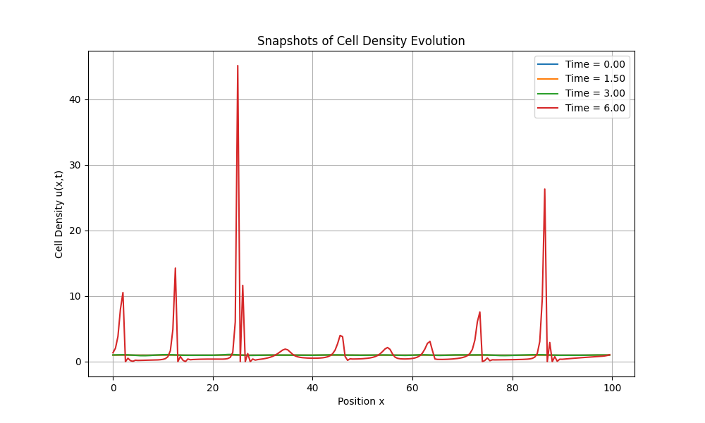

# Prologue: From Unbiased to Biased Random Walks

In earlier lectures, we examined simple random walks and their deep connection to diffusion at macroscopic scales. Those walks are unbiased: each step's direction is purely random, and a cloud of walkers spreads out over time. In biology, however, many microorganisms navigate impressively, moving toward food sources or away from harmful chemicals, even in environments where viscosity dominates and inertia is negligible.


Our central question: How can an organism achieve directional motion under random forces in a low-Reynolds-number regime? We study chemotaxis as the paradigm. Chemotaxis is a biased random walk: microscopic, stochastic choices are orchestrated into an effective macroscopic navigation strategy. This is a biological marvel and a compelling problem in statistical physics.

# 1. Biological Background of Bacterial Chemotaxis


## 1.1. E. coli's Motion: Run-and-Tumble

E. coli does not swim smoothly and continuously. Instead, it alternates between two distinct behaviors:

- Run: Several flagella rotate counterclockwise (CCW), bundle, and propel the cell forward approximately along a straight line.
- Tumble: The rotation switches to clockwise (CW), the bundle falls apart, and flagella act individually, causing a nearly in-place random reorientation that sets a new direction for the next run.

Chemotaxis does not “steer” like a wheel. Rather, cells modulate the frequency of tumbles in response to changes in attractant/repellent concentration. When moving up an attractant gradient, tumbles are suppressed and runs are prolonged. When moving down an attractant gradient (or up a repellent gradient), tumble frequency increases to try a new direction sooner. This “continue if better, change if worse” rule biases the random walk and yields a macroscopic drift toward high attractant concentration.

## 1.2. Physics of the Microscopic World: Life at Low Reynolds Number


The dimensionless Reynolds number Re = ρLv/η measures inertial vs. viscous forces. For bacteria (L in micrometers, v ≈ 20-30 micrometers/s), Re ≈ 10^−6. Viscosity dominates and inertia is negligible. Consequences:
- No gliding or inertia: once flagellar thrust stops, motion ceases almost instantly.
- Continuous turning via body undulations (like fish) is ineffective at these scales.
Hence bacteria evolved a strategy adapted to a highly damped world: stochastic run-and-tumble. It is not a compromise, but an efficient, necessary navigation strategy at this scale.

## 1.3. Molecular Machines: The Chemosensory System


How is environmental change sensed and converted into motor control? A precise biochemical signaling network-the chemosensory system-implements this:

1) Ligand binding: Attractant/repellent molecules bind methyl-accepting chemotaxis proteins (MCPs) in the membrane.
2) Signal transduction: Binding alters MCP conformation, modulating the autophosphorylation of histidine kinase CheA. Attractant binding suppresses CheA activity.
3) Phosphorylation cascade: Activated CheA (CheA-P) transfers phosphate to the response regulator CheY.
4) Motor control: Phosphorylated CheY (CheY-P) diffuses and binds the flagellar switch, increasing the probability of CCW→CW transitions (tumbles). High CheY-P implies high tumble frequency.
5) Adaptation: CheZ dephosphorylates CheY-P. MCP cytoplasmic domains are reversibly methylated (CheR) and demethylated (CheB). Methylation tunes MCP control over CheA, enabling response to relative changes (gradients), not absolute levels-biological grounding of temporal sensing below.

## 1.4. Challenges in Chemotaxis Research


- Limits of sensing and navigation under noise
  - Core question: How can organisms (e.g., bacteria) navigate accurately using only local, stochastic measurements?
  - Deeper meaning: At microscopic scales, diffusion and binding events are random, producing noisy signals; intracellular signaling adds intrinsic biochemical noise. Cells must extract gradient information from noisy data and make effective decisions. This touches statistical inference, information theory, and control: What are the theoretical limits for finite, energy-limited systems, and how do molecular networks approach optimal information acquisition and processing?
- Thermodynamics of sensing and adaptation
  - Core question: What are the energy and information costs of chemotaxis?
  - Deeper meaning: Gradient sensing, signaling, motor control, and adaptation (insensitivity to background and sensitivity to relative changes) consume energy (e.g., ATP). Is there a fundamental thermodynamic lower bound for achieving a target sensing precision? These questions bridge information theory and nonequilibrium thermodynamics.
- From single-cell behavior to collective transport
  - Core question: How do individual fluctuations shape population-level dynamics?
  - Deeper meaning: Even if run-and-tumble is understood at the single-cell level, populations exhibit complex phenomena (collective migration, biofilms, chemotactic collapse) that do not arise from simple superposition. We must link microscopic stochastic processes to macroscopic continuum models (e.g., Keller-Segel) and study how individual variability impacts collective dynamics.

# 2. A Minimal Motion Model: Two-State Process

We abstract 3D run-and-tumble to a 1D, two-state process.

## 2.1. Reduction to One Dimension

Let bacteria move on a line. State is (x, σ) with direction σ ∈ {+1, −1}.

- σ = +1: right-mover.
- σ = −1: left-mover.


## 2.2. Direction-Switching Rates

“Tumbling” changes σ. Model it as stochastic switching with rates:
- α+(x): rate to switch +1 → −1 at position x.
- α−(x): rate to switch −1 → +1 at position x.

Allowing α+/-(x) to depend on x encodes environmental information (chemical gradients). If α+(x) ≠ α−(x), the walk becomes biased.

## 2.3. Master Equations for Directional Probabilities

Let p+(x,t) (resp. p−) be the probability density of a right- (resp. left-) mover at (x,t). Consider a small interval [x, x+dx] and track the change over a short time dt. The evolution consists of three contributions: advection, loss, and gain:

$$\partial_t p_+(x,t) = -v_0 \, \partial_x p_+(x,t) - \alpha_+(x) \, p_+(x,t) + \alpha_-(x) \, p_-(x,t)$$

$$\partial_t p_-(x,t) = +v_0 \, \partial_x p_-(x,t) - \alpha_-(x) \, p_-(x,t) + \alpha_+(x) \, p_+(x,t)$$

Key variables and parameters

| Symbol | Name | Meaning | Units |
| --- | --- | --- | --- |
| x, t | position, time | spacetime coordinates | m, s |
| σ | direction state | internal state (+1 right, −1 left) | dimensionless |
| v0 | swim speed | constant speed during run | m/s |
| α+(x) | right→left rate | tumble rate +1→−1 at x | 1/s |
| α−(x) | left→right rate | tumble rate −1→+1 at x | 1/s |
| p+(x,t) | right-mover density | prob. density of σ=+1 at (x,t) | 1/m |
| p−(x,t) | left-mover density | prob. density of σ=−1 at (x,t) | 1/m |

# 3. From Microstates to Macroscopic Transport

## 3.1. Macroscopic Observables

Define total density p and probability current J:

$$p(x,t) := p_+(x,t) + p_-(x,t)$$

$$J(x,t) := v_0 \, [p_+(x,t) - p_-(x,t)]$$

## 3.2. Continuity Equation

Adding the master equations and using the definitions, the terms involving α+/- cancel exactly and we get

$$\partial_t p(x,t) = -\partial_x J(x,t)$$

This is the continuity equation, a universal conservation law. Tumbling is an internal exchange process between right- and left-mover subpopulations; it cannot create or annihilate particles in space. Changes in total density at a location arise only from flux entering or leaving neighboring regions. The exact cancellation of tumbling terms reflects local conservation of particle number (probability).

## 3.3. Dynamics of the Probability Current

Subtracting the master equations and substituting

$$p_\pm = \tfrac{1}{2}\big(p \pm J/v_0\big)$$

yields

$$\partial_t J(x,t) = -v_0^2 \, \partial_x p(x,t) - (\alpha_+ + \alpha_-) \, J(x,t) + v_0 \, (\alpha_- - \alpha_+) \, p(x,t)$$


Interpretation of terms:
- −v0^2 ∂x p: diffusive term; density gradients drive flux like pressure.
- −(α+ + α−) J: persistence damping by randomization of directions via tumbles.
- v0 (α− − α+ ) p: drift term; asymmetry of switching creates net drift even without ∂x p.

# 4. Coarse-Grained View: Fokker-Planck Equation

## 4.1. Adiabatic Elimination: Time-Scale Separation

Run time τrun ~ 1/α ~ 1 s; diffusion time τD ~ L^2/Deff (e.g., L ~ 100 micrometers gives ~25 s). With τD ≫ τrun, J relaxes much faster than p. Set ∂t J ≈ 0 (slave principle) to obtain the quasi-steady current.

## 4.2. Effective Fokker-Planck Equation

From ∂t J ≈ 0 we get

$$J_{\text{eff}}(x,t) = -\frac{v_0^2}{\alpha_+ + \alpha_-} \, \partial_x p \, + \, v_0 \, \frac{\alpha_- - \alpha_+}{\alpha_+ + \alpha_-} \, p$$

Substitute into the continuity equation to obtain a closed Fokker-Planck equation (FPE):

$$\partial_t p(x,t) = \partial_x \Big[ D_{\text{eff}}(x) \, \partial_x p - v_{\text{eff}}(x) \, p \Big]$$

with

$$D_{\text{eff}}(x) = \frac{v_0^2}{\alpha_+(x) + \alpha_-(x)}, \qquad v_{\text{eff}}(x) = v_0 \, \frac{\alpha_+(x) - \alpha_-(x)}{\alpha_+(x) + \alpha_-(x)}$$

## 4.3. Python Simulation I: Biased Run-and-Tumble

The code below simulates an ensemble of 1D particles with position-dependent tumble rates, demonstrating macroscopic drift and diffusion.

```python
import numpy as np
import matplotlib.pyplot as plt

def run_tumble_1d_simulation(num_particles=5000, num_steps=4000, v0=20.0, dt=0.01, L=200.0):
    """
    Simulate biased run-and-tumble motion in one-dimensional space.

    Parameters:
    num_particles (int): Number of particles to simulate.
    num_steps (int): Total number of simulation steps.
    v0 (float): Run speed (micrometers/s).
    dt (float): Time step (s).
    L (float): Length of spatial domain (-L/2 to L/2).
    """
    positions = np.random.uniform(-1, 1, num_particles)
    directions = np.random.choice([1, -1], num_particles)
    position_history = np.zeros((num_steps, num_particles))

    def alpha_plus(x):
        return 1.0 * (1 + 2.0 * np.tanh(x / (L/4)))
    def alpha_minus(x):
        return 1.0 * (1 - 2.0 * np.tanh(x / (L/4)))

    for step in range(num_steps):
        position_history[step] = positions
        prob_tumble_plus = alpha_plus(positions) * dt
        prob_tumble_minus = alpha_minus(positions) * dt
        rand_nums = np.random.rand(num_particles)
        tumble_indices_plus = (directions == 1) & (rand_nums < prob_tumble_plus)
        directions[tumble_indices_plus] = -1
        tumble_indices_minus = (directions == -1) & (rand_nums < prob_tumble_minus)
        directions[tumble_indices_minus] = 1
        positions += directions * v0 * dt
        positions[positions > L/2] = L - positions[positions > L/2]; directions[positions > L/2] *= -1
        positions[positions < -L/2] = -L - positions[positions < -L/2]; directions[positions < -L/2] *= -1

    return position_history

# Run and visualize
history = run_tumble_1d_simulation()
num_steps, num_particles = history.shape
time_points = np.arange(num_steps) * 0.01
mean_pos = np.mean(history, axis=1)
var_pos  = np.var(history,  axis=1)

# 1) Trajectories
plt.style.use('seaborn-v0_8-whitegrid')
fig, ax = plt.subplots(figsize=(10, 6))
for i in range(20):
    ax.plot(time_points, history[:, i], lw=0.8, alpha=0.7)
ax.set_title('Single Particle Trajectories')
ax.set_xlabel('Time (s)')
ax.set_ylabel('Position (micrometers)')
plt.tight_layout(); plt.savefig('particle_trajectories.png', dpi=300, bbox_inches='tight'); plt.close()

# 2) Distributions over time
fig, ax = plt.subplots(figsize=(10, 6))
time_indices_to_plot = [int(num_steps/10), int(num_steps/3), int(2*num_steps/3), num_steps-1]
for t_idx in time_indices_to_plot:
    time = t_idx * 0.01
    ax.hist(history[t_idx, :], bins=50, density=True, alpha=0.6, label=f't = {time:.1f} s')
ax.set_title('Distribution of Particles')
ax.set_xlabel('Position (micrometers)')
ax.set_ylabel('Probability Density')
ax.legend()
plt.tight_layout(); plt.savefig('particle_distributions.png', dpi=300, bbox_inches='tight'); plt.close()

# 3) Mean and variance evolution
fig, ax = plt.subplots(figsize=(10, 6)); ax2 = ax.twinx()
p1, = ax.plot(time_points, mean_pos, 'r-', label='Mean Position')
p2, = ax2.plot(time_points, var_pos,  'b-', label='Variance')
ax.set_title('Evolution of Mean and Variance')
ax.set_xlabel('Time (s)')
ax.set_ylabel('Mean Position (micrometers)', color='r')
ax2.set_ylabel('Variance (micrometers^2)',  color='b')
ax.tick_params(axis='y', labelcolor='r'); ax2.tick_params(axis='y', labelcolor='b')
ax.legend([p1, p2], ['Mean Position', 'Variance'], loc='center right')
plt.tight_layout(); plt.savefig('mean_variance_evolution.png', dpi=300, bbox_inches='tight'); plt.close()
```


1) Trajectories show random motion with an overall pull toward the center (x = 0), i.e., bias.


2) Histograms show aggregation toward x = 0 over time, confirming a macroscopic drift.


3) Mean and variance quantitatively reflect the ensemble behavior. With a center-directed drift, the mean approaches zero; the variance grows then saturates, reflecting drift-diffusion balance. With constant asymmetric α+/-, we would observe linear growth as predicted by the FPE.

# 5. Closing the Loop: Biological Basis of Sensing

We have linked α+/-(x) to v_eff(x). How do cells map an external chemical field c(x) into spatially varying α+/-(x)?

## 5.1. Temporal Sensing Mechanism

A few-micrometer cell cannot directly measure tiny spatial differences across its body to estimate ∂x c. Instead, it uses temporal sensing by monitoring concentration over time. It measures dc/dt and, by the chain rule:

$$\frac{dc}{dt} = \frac{\partial c}{\partial t} + \frac{\partial c}{\partial x} \, \frac{dx}{dt}$$

For a static field and motion at speed v0 σ(t):

$$\frac{dc}{dt} = v_0 \, \sigma(t) \, \partial_x c$$

If dc/dt > 0 (moving up an attractant gradient), CheA is suppressed, CheY-P decreases, tumbles are suppressed, and the run is prolonged; dc/dt < 0 has the opposite effect.

## 5.2. Modeling Switching Rates

Assume a linear response around a baseline α0:

$$\alpha(\text{sensed change}) = \alpha_0 \big(1 - \chi' \, \tfrac{dc}{dt}\big)$$

For σ = +1 and σ = −1, dc/dt = +/- v0 ∂x c. With χ := χ' α0, we get

$$\alpha_+(x) = \alpha_0 \big(1 - \chi \, v_0 \, \partial_x c\big)$$

$$\alpha_-(x) = \alpha_0 \big(1 + \chi \, v_0 \, \partial_x c\big)$$

Substitute into Deff and veff. For shallow gradients (χ v0 ∂x c ≪ 1):

$$v_{\text{eff}} \approx -\frac{\chi \, v_0^2}{\alpha_0} \, \partial_x c, \qquad D_{\text{eff}} \approx \frac{v_0^2}{2\alpha_0}$$

Thus cells drift up attractant gradients (χ > 0) with approximately constant effective diffusion.

# 6. Collective Dynamics: The Keller-Segel Model

Organisms often modify their chemical environment by consumption/secretion, creating feedback: motion responds to gradients while aggregation alters the gradients-leading to pattern formation.

Keller-Segel (early 1970s) modeled Dictyostelium aggregation guided by cAMP, launching mathematical biology of chemotaxis. Applications now span bacterial patterning, angiogenesis, tumor invasion/metastasis, leukocyte recruitment, and morphogenesis.

## 6.1. Coupled Equations

A standard Keller-Segel system couples cell density ρ(x,t) and chemical concentration c(x,t) (we use nabla to accommodate higher spatial dimensions):

$$\partial_t \rho = \nabla \cdot \big[ D \, \nabla \rho - \chi(\rho,c) \, \rho \, \nabla c \big] + f_{\text{growth}}(\rho)$$

$$\partial_t c = D_c \, \nabla^2 c + f_{\text{prod}}(\rho) - f_{\text{degrad}}(c)$$


Physical meaning: changes in ρ result from diffusion, chemotactic flux, and local net growth; changes in c come from diffusion, production by cells, and degradation.

## 6.2. A Keller-Segel Visualization


<video src="../assets/images/remote/KellerSegel.mp4"></video>

Strongly related 2D model (as in the visualization):

$$\frac{\partial u}{\partial t} = \nabla^2 u - \nabla \cdot (\chi(u) \, \nabla v) + u(1-u)$$

$$\frac{\partial v}{\partial t} = D \, \nabla^2 v + u - a v$$

Interpretation: u is cell density, v is chemical concentration.
- nabla^2 u: random motion (effective diffusion).
- −nabla·(χ(u) nablav): chemotactic flux; χ(u) = c u/(1+u^2) models saturation at high density.
- u(1−u): logistic growth.
- D nabla^2 v: chemical diffusion.
- u − a v: production proportional to u and linear decay.

## 6.3. Emergent Patterns: Chemotactic Collapse

A small density fluctuation produces slightly more chemical, creating a weak peak in v, generating nablav that attracts more cells, which produce more chemical-a positive feedback loop. If χ is strong enough to overcome diffusion D, the instability amplifies fluctuations and sharp peaks form: chemotactic collapse. Linear stability analysis yields precise conditions.

## 6.4. Python Simulation II: 1D Keller-Segel via Finite Differences

```python
import numpy as np
import matplotlib.pyplot as plt
from matplotlib.animation import FuncAnimation
import imageio, os

def solve_keller_segel_1d(L=100.0, Nx=200, T=50.0, Nt=5000, D_u=1.0, D_v=20.0, chi_0=25.0, a=1.0):
    """
    1D Keller-Segel with explicit finite differences.
    u_t = D_u * u_xx - chi_0 * (u * v_x)_x
    v_t = D_v * v_xx + u - a*v
    """
    dx = L / Nx; dt = T / Nt
    x = np.linspace(0, L, Nx, endpoint=False)
    if dt > dx**2 / (2 * max(D_u, D_v)):
        dt = 0.2 * dx**2 / (2 * max(D_u, D_v)); Nt = int(T / dt)
    u = 1.0 + 0.01 * (np.random.rand(Nx) - 0.5)
    v = u / a
    u_history, v_history = [u.copy()], [v.copy()]
    for n in range(Nt):
        u_prev, u_next = np.roll(u, 1), np.roll(u, -1)
        v_prev, v_next = np.roll(v, 1), np.roll(v, -1)
        u_xx = (u_next - 2*u + u_prev) / dx**2
        v_xx = (v_next - 2*v + v_prev) / dx**2
        v_x  = (v_next - v_prev) / (2*dx)
        J    = chi_0 * u * v_x; J_prev = np.roll(J, 1)
        divJ = (J - J_prev) / dx
        u_new = u + dt * (D_u * u_xx - divJ)
        v_new = v + dt * (D_v * v_xx + u - a*v)
        u_new = np.maximum(u_new, 0); v_new = np.maximum(v_new, 0)
        if np.any(~np.isfinite(u_new)) or np.any(~np.isfinite(v_new)):
            break
        u, v = u_new, v_new
        if n % 50 == 0:
            u_history.append(u.copy()); v_history.append(v.copy())
    return x, u_history, v_history

x, u_hist, v_hist = solve_keller_segel_1d(T=100.0, Nt=20000, chi_0=40.0)

fig, ax = plt.subplots(figsize=(10, 6))
line, = ax.plot(x, u_hist[0], 'b-', lw=2)
ax.set_xlim(0, 100); ax.set_ylim(0, 5)
ax.set_xlabel('Position x'); ax.set_ylabel('Cell Density u(x,t)')
ax.set_title('1D Keller-Segel Simulation: Chemotactic Collapse')
time_text = ax.text(0.05, 0.9, '', transform=ax.transAxes)

temp_dir = 'temp_frames'; os.makedirs(temp_dir, exist_ok=True)
gif_filename = 'keller_segel_simulation.gif'

def update(frame):
    line.set_ydata(u_hist[frame])
    time = frame * 50 * (100.0/20000)
    time_text.set_text(f'Time = {time:.2f}')
    return line, time_text

filenames = []
for i in range(len(u_hist)):
    update(i)
    filename = f'{temp_dir}/frame_{i:03d}.png'
    plt.savefig(filename); filenames.append(filename)

with imageio.get_writer(gif_filename, mode='I', duration=0.1, loop=0) as writer:
    for filename in filenames:
        image = imageio.imread(filename); writer.append_data(image)

for filename in filenames: os.remove(filename)
os.rmdir(temp_dir)

# Snapshots
plt.figure(figsize=(10, 6))
for frame in [0, len(u_hist)//4, len(u_hist)//2, len(u_hist)-1]:
    time = frame * 50 * (100.0/20000)
    plt.plot(x, u_hist[frame], label=f'Time = {time:.2f}')
plt.xlabel('Position x'); plt.ylabel('Cell Density u(x,t)')
plt.title('Snapshots of Cell Density Evolution')
plt.legend(); plt.grid(True)
plt.savefig('keller_segel_snapshots.png', dpi=300, bbox_inches='tight')
plt.show()
```




The simulation reproduces chemotactic collapse: from nearly uniform initial conditions with small noise, local peaks grow, sharpen, and stabilize. Chemical-mediated interactions spontaneously break symmetry and form ordered structures.

# Conclusion

We began at the molecular scale, examining the precise chemosensory network inside a single bacterium — the biochemical foundation of environmental sensing. We then abstracted this rich biology to a single-particle statistical model in one dimension: a two-state (run/tumble) process, captured by a few key switching rates alpha+/-.

Through coarse-graining and an adiabatic (time-scale separation) approximation, we elevated this microscopic stochastic model to a continuum description. The result is a Fokker-Planck equation for the population density, with clear physical origins for the effective diffusion coefficient and drift velocity.

Finally, coupling the cell population to its chemical environment leads to a nonlinear dynamical system — the Keller-Segel model — which exhibits emergent collective behavior not present at the single-cell level: spontaneous pattern formation and chemotactic collapse.

This modeling chain, from molecules to populations and from microscopic stochasticity to macroscopic determinism, illustrates how theoretical physics clarifies complex bio-physical phenomena and reveals the universal organizing principles behind them.


