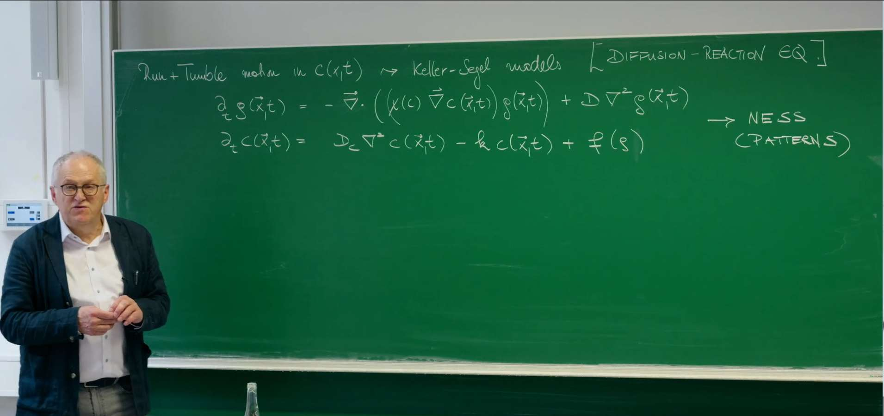

# Introduction: From Externally Driven to Internally Driven Pattern Formation

In the previous lecture, we studied chemotaxis and the classic Keller-Segel model, which describes how biological populations (e.g., bacteria) aggregate in response to chemical gradients. To set the stage, we briefly recall its core idea. The Keller-Segel model consists of coupled reaction-diffusion equations that describe the spatiotemporal evolution of the particle (e.g., bacterial) density $(g(\vec{x},t))$ and chemical concentration $(c(\vec{x},t))$.



The density evolves as
$$
\partial_t g(\vec{x}, t) = - \vec{\nabla} \cdot \Big( \big( \chi(c) \, \vec{\nabla} c(\vec{x}, t) \big) \, g(\vec{x}, t) \Big) + D \, \nabla^2 g(\vec{x}, t)
$$

The chemical concentration evolves as
$$
\partial_t c(\vec{x},t) = D_c \, \nabla^2 c(\vec{x},t) - k \, c(\vec{x},t) + f(g)
$$

The first equation changes the density via a chemotactic term (motion up the chemical gradient with sensitivity $(\chi(c))$) and ordinary diffusion (random motion). The second describes production and dissipation of the chemical: diffusion $(D_c \nabla^2 c)$, degradation $(-k c)$, and sources produced by particles $(f(g))$.

At the core of Keller-Segel lies positive feedback: where particles accumulate, they raise the signal concentration, which in turn attracts even more particles. Such externally guided motion (by a chemical gradient) can transform a uniform state into a non-equilibrium steady state (NESS) with complex spatial structure, e.g., clusters or patterns.


While Keller-Segel explains many aggregation phenomena, it relies on a relatively intricate biological mechanism: particles must sense the environmental gradient and adjust their motion accordingly. This raises a deeper, more general physics question: even without external guidance and without direct attractive interactions, can intrinsic motility alone cause spontaneous pattern formation?

This lecture addresses that question and explores a new mechanism of pattern formation. We will see that the intrinsic properties of particle motion - especially how speed depends on the surroundings (e.g., particle density) - can drive phase separation. This phenomenon is called motility-induced phase separation (MIPS). It marks a shift from externally driven, system-specific behavior to self-organization governed by broadly applicable physical principles.

# 1. The Schnitzer Model: A Microscopic Description of Run-and-Tumble Dynamics

To understand how microscopic motion leads to macroscopic patterns, we introduce a classic model: the Schnitzer model. Originally devised as a continuum description for run-and-tumble motion of microorganisms such as E. coli in chemotaxis, we will use it here as an idealized system to reveal the physics of MIPS.

Developed in the late 1990s and early 2000s (M. J. Schnitzer, G. Oster, H. C. Berg), the model builds a statistical-mechanical framework for chemotactic behavior from first principles: it couples run-and-tumble stochastic motion to intracellular signaling, and via master/Fokker-Planck equations derives macroscopic drift/diffusion of populations in chemical fields. Beyond chemotaxis, it has become a standard paradigm for microbial motility, used to quantify search strategies, model pathogen invasion and immune tracking, and inspire algorithms for micro/nano-robotic swarms.

## 1.1. System Definition

Consider a simplified one-dimensional system with two particle types:

- Right-movers of density $(P_+(x,t))$ travel with speed $(v(x))$ in +x.
- Left-movers of density $(P_-(x,t))$ travel with speed $(v(x))$ in -x.

Both the speed $(v(x))$ and tumble rate $(\alpha(x))$ may depend on position. Tumbles (at rate $(\alpha(x))$) randomly flip direction; in 1D, right-movers become left-movers and vice versa.

## 1.2. Master Equations

The densities $(P_\pm)$ evolve according to coupled PDEs. For right-movers:
$$
\partial_t P_+ = -\partial_x [v(x) P_+] - \tfrac{1}{2} \, \alpha(x) P_+ + \tfrac{1}{2} \, \alpha(x) P_-
$$

This has three parts:

1. Advection: $-\partial_x [v(x) P_+]$. This is the outflow term of a continuity equation, describing how the density of right-movers changes because they travel to the right at speed $v(x)$.

2. Loss: $-\tfrac{1}{2}\,\alpha(x) P_+$. Right-movers tumble at rate $\alpha(x)$. In one dimension, after a tumble the direction is randomized, so with probability one half the particle becomes a left-mover. This term represents the loss from the $P_+$ population due to such tumbles.

3. Gain: $+\tfrac{1}{2}\,\alpha(x) P_-$. Symmetrically, left-movers tumble and with probability one half become right-movers, replenishing the $P_+$ population.

For left-movers:
$$
\partial_t P_- = +\partial_x [v(x) P_-] - \tfrac{1}{2} \, \alpha(x) P_- + \tfrac{1}{2} \, \alpha(x) P_+
$$

The advection sign is positive (motion in -x). Loss/gain mirror the $(P_+)$ equation.

## 1.3. Macroscopic Observables

We focus on macroscopic quantities derived from $(P_\pm)$:

- Total density: $(g(x,t) = P_+(x,t) + P_-(x,t))$
- Particle flux/current: $(J(x,t) = v(x) [P_+(x,t) - P_-(x,t)])$

Our goal is a closed evolution equation for $(g(x,t))$ alone - i.e., to coarse-grain.

# 2. From Microscopic Rules to Macroscopic Law via Adiabatic Elimination

## 2.1. Principle of Adiabatic Elimination

When variables evolve on widely separated time scales, fast variables can be assumed to relax instantaneously to quasi-steady values set by the slow ones. Eliminating the fast variables yields effective dynamics for the slow variables alone.

In the Schnitzer model:
- Slow variable: total density $(g = P_+ + P_-)$, which changes via spatial transport.
- Fast variable: the density difference $(P_+ - P_-)$ tied to the flux $(J)$, relaxing quickly via tumbling at rate $(\alpha)$.

## 2.2. Derivation of the Effective Fokker-Planck Equation

Add/subtract the master equations:

- Adding:
$$
\partial_t (P_+ + P_-) = -\partial_x [v (P_+ - P_-)]  =>  \partial_t g = -\partial_x J
$$
This is exact particle conservation: changes in total density equal minus the flux divergence.

- Subtracting:
$$
\partial_t (P_+ - P_-) = -\partial_x [v (P_+ + P_-)] - \alpha (P_+ - P_-)
$$

Adiabatic approximation: $(\partial_t (P_+ - P_-) \approx 0)$. Then
$$
0 \approx -\partial_x [v (P_+ + P_-)] - \alpha (P_+ - P_-) = -\partial_x [v g] - \alpha (P_+ - P_-)
$$
so
$$
(P_+ - P_-) \approx -\frac{1}{\alpha(x)} \, \partial_x [v(x) g(x,t)]
$$

Insert into the flux definition:
$$
J = v(x) (P_+ - P_-) \approx -\frac{v(x)}{\alpha(x)} \, \partial_x [v(x) g(x,t)]
$$

Insert $(J)$ into conservation $(\partial_t g = -\partial_x J)$:
$$
\partial_t g(x,t) = \partial_x \Big( \frac{v(x)}{\alpha(x)} \, \partial_x [v(x) g(x,t)] \Big)
$$

With the $(\tfrac{1}{2})$ convention used in the master equation (loss terms are $(\tfrac{1}{2}\alpha P_\pm)$), the final form carries an explicit $(\tfrac{1}{2})$:
$$
\partial_t g(x,t) = \partial_x \Big( \frac{v(x)}{2\,\alpha(x)} \, \partial_x [v(x) g(x,t)] \Big)
$$

## 2.3. Effective Flux and Diffusion

Expand the effective flux $(J)$:
$$
J = -\frac{v(x)}{\alpha(x)} \Big( g(x,t) \, \partial_x v(x) + v(x) \, \partial_x g(x,t) \Big)
$$

Collecting terms:
$$
J = - (v(x)^2/\alpha(x)) \, \partial_x g  -  (g(x,t) \, v(x)/\alpha(x)) \, \partial_x v(x)
$$

Thus macroscopic motion has two pieces:
- Effective diffusion: Fick-like with $(D_eff(x) = v(x)^2/\alpha(x))$.
- Effective drift: proportional to $(g)$ and $(\partial_x v(x))$, pulling toward lower $(v(x))$.

# 3. Physics of Active Particle Accumulation

## 3.1. Steady-State Analysis

Consider a closed system; at steady state the net flux $(J_ss)$ vanishes. For constant tumbling $(\alpha(x)=\alpha_0)$:
$$
-\alpha_0 \, v(x) \, \partial_x [v(x) \, g_{ss}(x)] = 0
$$
so
$$
v(x) \, g_{ss}(x) = constant
$$

Therefore
$$
g_{ss}(x) \propto 1/v(x)
$$

## 3.2. Physical Interpretation: "Active Particles Accumulate Where They Move Slowly"

The relation $(g \propto 1/v)$ is a cornerstone of active-matter physics and contrasts with equilibrium. In equilibrium, steady distributions follow Boltzmann weights $(g \propto e^{-U/k_BT})$ determined by energy landscapes, not by kinematics. In active systems, a non-equilibrium steady state is set by dynamics. Intuitively, if particles slow down in a region, they linger longer and accumulate ("traffic jam" effect), while fast regions are traversed quickly.

# 4. Motility-Induced Phase Separation (MIPS)

So far $(v(x))$ was a prescribed function of position. Now we introduce a physically crucial ingredient that directly leads to phase separation.

## 4.1. Key Feedback: Density-Dependent Motility

Assume particle speed depends on the local density, $(v = v(g))$. This captures crowding/steric effects (and, e.g., quorum sensing) that reduce speed at higher density. We focus on monotonically decreasing motility:
$$
v'(g) = dv/dg < 0
$$

## 4.2. Onset of Instability: Anti-Diffusion

With $(v(g))$ and, for simplicity, $(\alpha=1)$, the effective flux becomes
$$
J = -v(g) \, \partial_x [g \, v(g)]
$$

Using the chain rule,
$$
J = -v(g) [ v(g) \, \partial_x g + g \, v'(g) \, \partial_x g ]
$$

so
$$
J = - [ v(g)^2 + g \, v(g) \, v'(g) ] \, \partial_x g
$$

This is still Fick-like, $(J = -D_eff(g) \, \partial_x g)$, but the effective diffusivity now depends on $(g)$:
$$
D_eff(g) = v(g)^2 + g \, v(g) \, v'(g)
$$

## 4.3. Aggregation Criterion and Positive Feedback

The sign of $(D_eff(g))$ controls macroscopic behavior:
- Normal diffusion: if $(D_eff(g) > 0)$, flux runs down gradients and smooths inhomogeneities.
- Anti-diffusion: if $(D_eff(g) < 0)$, flux points up the gradient, amplifying fluctuations and causing spontaneous aggregation and patterns.

Since $(v(g)>0)$, instability occurs when
$$
v(g) + g \, v'(g) < 0
$$

equivalently
$$
d/dg [g \, v(g)] < 0
$$

The mechanism is a positive feedback loop (the core of MIPS):

1) Initial fluctuation: starting from a nearly uniform state, a small positive density fluctuation appears due to noise.

2) Slowing: because $(v'(g) < 0)$, particles in the slightly denser region slow down.

3) Accumulation: using the principle $(g \propto 1/v)$, active particles accumulate where they move slowly, so more particles drift into the already denser region.

4) Amplification: further accumulation raises the local density even more, which further decreases speed, which attracts even more particles, and so on.

This runaway amplification breaks uniformity and drives phase separation into a dense, low-motility "liquid" and a dilute, high-motility "gas." It is a purely non-equilibrium transition caused by motility rather than attractive forces.

# 5. 2D Simulation of MIPS and Numerical Method

To explore MIPS in space, we build and solve a two-dimensional model. While 1D reveals the instability, 2D shows pattern formation, competition, and coarsening - hallmarks of phase separation.

## 5.1. Physical Model: The Cahn-Hilliard Equation

In 2D, a robust description of phase separation is the Cahn-Hilliard equation. It captures competition between "uphill diffusion" and an interfacial penalty that prevents infinitely sharp interfaces.

For density $(g(\vec{x}, t))$:
$$
\frac{\partial g}{\partial t} = M \, \nabla^2 \mu
$$

Here $(M)$ is a constant mobility and $(\mu)$ an effective chemical potential given by the functional derivative of an effective free energy $(F[g])$. This is a continuity equation: particles flow from higher chemical potential to lower chemical potential.
$$
\mu = \delta F/\delta g = f'(g) - \kappa \, \nabla^2 g
$$

- Bulk term $(f'(g))$: tied to effective interactions; in MIPS it relates to $(D_{eff}(g))$ via $(f''(g) \propto D_{eff}(g))$. For $(v(g) = v_0 (1 - g/g^*))$:

$$
f'(g) = v_0^2 \left( g - \frac{3}{2g^*} g^2 + \frac{2}{3(g^*)^2} g^3 \right)
$$

- Interfacial term $(-\kappa \, \nabla^2 g)$: $\kappa>0$ sets interfacial "tension," penalizing high curvature and giving interfaces a finite width and energy.

Combining these two contributions yields a fourth-order nonlinear partial differential equation that we solve for $g(\vec{x},t)$.

Many bacteria (e.g., E. coli, Myxococcus xanthus) form dense colonies/biofilms on substrates. Frequent collisions hinder motion ("crowding-induced slowing"), separating into dense, nearly immotile droplets and dilute, fast "gas."

A helpful macroscopic analogy (Frey's lecture): shoppers clustering at a storefront slow down, forcing others to slow or detour, increasing local density without any attractive force - rules of motion alone cause aggregation.

### 5.2. Numerical Method: Finite Differences

We solve the Cahn-Hilliard equation on an $(N_x \times N_y)$ grid with finite differences. Grid indices are $(i,j)$, and the time index is $n$.

### Spatial Discretization: 2D Laplacian (Five-Point Stencil)
$$
(\nabla^2 U)_{i,j} \approx (U_{i+1,j} + U_{i-1,j} + U_{i,j+1} + U_{i,j-1} - 4U_{i,j}) / (\Delta x)^2
$$

We assume equal spacing in both directions, $\Delta x = \Delta y$. Here $U_{i\pm1,j}$ and $U_{i,j\pm1}$ denote nearest neighbors in the $x$ and $y$ directions, respectively.

### Time Discretization: Forward Euler
$$
(\partial g/\partial t)_{t=t_n} \approx (g_{i,j}^{n+1} - g_{i,j}^n)/(\Delta t)
$$

### Full Update (One Time Step)
1. Compute $(\nabla^2 g)^n_{i,j}$ from $g^n$. For each grid point $(i,j)$, apply the five-point stencil above.
2. Compute the chemical potential $\mu^n_{i,j} = f'(g_{i,j}^n) - \kappa \, (\nabla^2 g)^n_{i,j}$.
3. Compute $(\nabla^2 \mu)^n_{i,j}$. Again use the five-point stencil on $\mu^n$.
4. Update $g_{i,j}^{n+1} = g_{i,j}^n + M \, \Delta t \, (\nabla^2 \mu)^n_{i,j}$.

We use periodic boundary conditions in both directions (implemented via array rolls in the code).

## 5.3. Python Implementation

```python
import numpy as np
import matplotlib.pyplot as plt
import imageio
import os
from tqdm import tqdm

# --- 1. Parameter settings ---
L = 10.0      # System domain side length
Nx = 128      # Number of spatial grid points (same in x and y directions)
dx = L / Nx   # Spatial step size

# --- Simulation total time T=20 ---
T = 20.0
# --- Correspondingly reduce total steps ---
Nt = 8000
dt = T / Nt

# Model parameters
v0 = 1.0
g_star = 2.0
g0 = 1.2      # Average density
M = 1.0       # Mobility
kappa = 1e-4  # Surface tension coefficient

# --- 2. Define relevant functions ---
def mu_bulk_func(g, v0, g_star):
    term1 = g
    term2 = -(3.0 / (2.0 * g_star)) * g**2
    term3 = (2.0 / (3.0 * g_star**2)) * g**3
    return v0**2 * (term1 + term2 + term3)

# --- 3. Initialize density field ---
g = g0 + 0.05 * (np.random.rand(Nx, Nx) - 0.5)

# Frames for storing GIF and statistical plots
frames = []

# --- 4. Main simulation loop ---
for n in tqdm(range(Nt), desc=f"Simulating 2D MIPS (T={T})"):
    g_up, g_down = np.roll(g, -1, axis=0), np.roll(g, 1, axis=0)
    g_left, g_right = np.roll(g, -1, axis=1), np.roll(g, 1, axis=1)
    lap_g = (g_up + g_down + g_left + g_right - 4*g) / (dx**2)

    mu_bulk = mu_bulk_func(g, v0, g_star)
    mu = mu_bulk - kappa * lap_g

    mu_up, mu_down = np.roll(mu, -1, axis=0), np.roll(mu, 1, axis=0)
    mu_left, mu_right = np.roll(mu, -1, axis=1), np.roll(mu, 1, axis=1)
    lap_mu = (mu_up + mu_down + mu_left + mu_right - 4*mu) / (dx**2)

    g = g + M * dt * lap_mu

    if n % (Nt // 100) == 0:
        frames.append(g.copy())

# --- 5. Create GIF animation ---
print("\nCreating GIF animation...")
temp_dir = 'temp_frames_mips2d_short'
os.makedirs(temp_dir, exist_ok=True)
gif_filename = 'MIPS_2D.gif'
filenames = []

all_data = np.concatenate([frame.flatten() for frame in frames])
vmin = np.percentile(all_data, 0.1)
vmax = np.percentile(all_data, 99.9)

for i, frame_data in enumerate(frames):
    fig, ax = plt.subplots(figsize=(8, 8))
    im = ax.imshow(frame_data, cmap='magma', vmin=vmin, vmax=vmax, interpolation='bicubic')
    ax.set_title(f'2D MIPS: Density Field at t = {i / (len(frames)-1) * T:.2f}')
    ax.set_xticks([]); ax.set_yticks([])
    plt.colorbar(im, ax=ax, fraction=0.046, pad=0.04, label="Density g(x,y,t)")

    filename = f'{temp_dir}/frame_{i:03d}.png'
    plt.savefig(filename)
    filenames.append(filename)
    plt.close(fig)

gif_duration = 0.2
with imageio.get_writer(gif_filename, mode='I', duration=gif_duration, loop=0) as writer:
    for filename in tqdm(filenames, desc="Building GIF"):
        image = imageio.imread(filename)
        writer.append_data(image)

print(f'\nAnimation saved as {gif_filename}')

# --- 6. Plot core statistics: density histogram ---
print("Creating statistical histogram plot...")
fig_hist, ax_hist = plt.subplots(figsize=(10, 7))

# Select representative time points to plot
# Change last index from 100 to 99, as list indices range from 0 to 99
snapshot_indices = [0, 10, 30, 99]
colors = plt.cm.viridis(np.linspace(0, 1, len(snapshot_indices)))

for i, frame_idx in enumerate(snapshot_indices):
    time = frame_idx / (len(frames) - 1) * T  # Corrected time calculation
    data = frames[frame_idx].flatten()
    ax_hist.hist(data, bins=100, density=True, alpha=0.7,
                 label=f't = {time:.1f}', color=colors[i])

ax_hist.set_title('Evolution of Density Distribution during MIPS', fontsize=16)
ax_hist.set_xlabel('Density (g)', fontsize=14)
ax_hist.set_ylabel('Probability Density', fontsize=14)
ax_hist.legend()
ax_hist.grid(True, alpha=0.3)
plt.tight_layout()
plt.savefig('MIPS_density_histogram.png')
plt.show()

print('Histogram plot saved as MIPS_density_histogram.png')
```


The animation shows the initiation of phase separation: starting near uniform, instability amplifies small noise into an interlaced labyrinth, which breaks and retracts by interfacial tension into rounded, high-density "droplets" in a low-density "gas."


- $(t = 0.0)$ (purple): a single narrow peak at $(g_0=1.2)$ (uniform state).
- $(t = 2.0)$ (blue): distribution rapidly broadens and collapses to both sides - uniformity breaks.
- $(t = 6.1)$ (green): a clear bimodal structure appears - two phases emerge.
- $(t = 20.0)$ (yellow): bimodality fully developed; peaks correspond to "gas" (~0.7) and "liquid" (~2.25).

# 6. An Effective Thermodynamic Description

Though MIPS is complex and intrinsically out of equilibrium, its behavior admits a description reminiscent of equilibrium free energy.

## 6.1. Mapping to a Gradient Flow

The effective flux can be written
$$
J_eff(x,t) = - M(g) \, \partial_x \, \mu_eff(g)
$$

Comparison with earlier expressions identifies
- Mobility: $(M(g) = g \, v(g)^2)$
- Effective chemical potential: $(\mu_eff(g) = \log g + \log v(g))$

## 6.2. Lyapunov Functional

Let $(\mu_eff)$ be the functional derivative of an effective free energy (a Lyapunov functional):
$$
F_eff[g] = \int dx [ g(x) \log g(x) - g(x) + \int_0^g ds \, \log v(s) ]
$$

Indeed,
$$
\mu_eff(g) = \delta F_eff/\delta g = \partial/\partial g ( g \log g - g + \int_0^g ds \, \log v(s) ) = \log g + \log v(g)
$$

## 6.3. The System Always "Moves Downhill"

The dynamics becomes a gradient flow:
$$
\partial_t g = \partial_x [ M(g) \, \partial_x \, \delta F_eff/\delta g ]
$$

Thus the effective free energy decreases monotonically:
$$
\frac{dF_eff}{dt} = \int dx \, \mu_eff \, \partial_t g = \int dx \, \mu_eff \, \partial_x [ M(g) \, \partial_x \mu_eff ]
$$

With periodic boundaries (integration by parts),
$$
\frac{dF_eff}{dt} = - \int dx \, M(g) \, (\partial_x \mu_eff)^2  <=  0
$$

So, despite being out of equilibrium, the evolution can be viewed as descending an effective energy landscape toward a minimum - the stable, phase-separated steady state. Coarsening (small droplets merging into large ones) lowers interface area and $(F_eff)$, akin to Ostwald ripening in equilibrium systems.

# Conclusion

This lecture starts from a microscopic model of single-particle run-and-tumble motion (the Schnitzer model). Through coarse-graining (adiabatic elimination), we derive a macroscopic evolution equation for the population density: an effective Fokker-Planck equation.

By introducing a physically reasonable feedback (crowding-induced slowing), this macroscopic equation predicts a dynamical instability (anti-diffusion) that culminates in a striking collective phenomenon: motility-induced phase separation (MIPS). Finally, we show that the entire non-equilibrium process admits an elegant effective thermodynamic description via a Lyapunov functional; the dynamics proceeds as if the system were descending an energy landscape toward its minimum.

Motility-induced phase separation is one of the most basic and universal self-organization mechanisms in active matter, broadly observed from bacterial colonies and synthetic colloids to robot collectives. The tools presented here provide a firm foundation for understanding these fascinating self-organizing phenomena.


