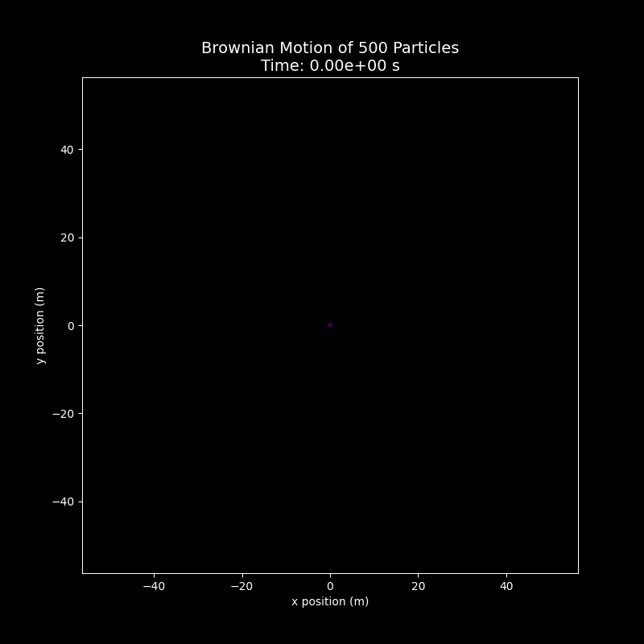

# Introduction

In previous lectures, Prof. Erwin Frey discussed how to describe stochastic processes using the master equation and the Fokker-Planck equation. These tools are powerful: they tell us how the probability distribution for being in a certain state at a given time evolves. This viewpoint is an ensemble perspective because it focuses on the average behavior of a theoretical collection of infinitely many identical systems. However, it does not tell us how a single particle - say, a pollen grain suspended in a liquid - actually moves along a specific, jagged path. This lecture marks a crucial shift in perspective: from describing the smooth evolution of probabilities to writing down an equation of motion that generates single-particle random trajectories. The key tool is the Langevin equation, which fuses deterministic Newtonian mechanics with stochasticity from statistical physics, providing an intuitive way to understand and simulate the behavior of particles in a thermal environment.

# 1. From Ensemble to Trajectory: Recap and New View


## 1.1. Recap of Markov Processes

To build a theory for single-particle trajectories, we first recall the frameworks used earlier to describe stochastic processes.

- Discrete state space

  For systems whose states are countable (e.g., the number of molecules in a compartment), probability evolution is governed by the master equation:

  $$
  \frac{dP(t)}{dt} = Q P(t)
  $$

  Here, $P(t)$ is a vector whose components are the probabilities of being in each discrete state, and $Q$ is the transition-rate matrix. This equation describes the deterministic evolution of the entire distribution (the ensemble). If we want a single random history of an individual system, we use a trajectory sampler such as the Gillespie algorithm.

- Continuous state space

  For systems with continuous variables (e.g., position or velocity), probability evolution is described by the Fokker-Planck equation. Conceptually, it can be decomposed into parts:

  $$
  \frac{\partial P(x,t)}{\partial t} = \text{drift} + \text{diffusion} + \text{jumps}
  $$

  This equation likewise gives the deterministic evolution of the ensemble quantity $P(x,t)$: a cloud of many particles drifts and diffuses.

## 1.2. Posing the Core Question

Both the master and Fokker-Planck equations answer "Where might the particle be at time $t$?" But they do not directly answer "How did a particular particle move from time 0 to $t$?" A single Brownian trajectory is continuous yet kinked everywhere and unpredictable.


This raises our core question: can we write a Newton-like equation of motion for an individual random particle - i.e., can we determine the unknown term in

$$
\frac{dx(t)}{dt} = ?
$$

The answer is the Langevin equation, proposed by Paul Langevin in the early 20th century.

Langevin introduced his equation in 1908 to describe the irregular motion of a suspended particle undergoing molecular collisions in a fluid - a cornerstone for statistical mechanics and stochastic processes. It is a stochastic differential equation (SDE) combining deterministic forces (e.g., viscous drag) and random forces (Gaussian white noise), capturing the dynamics of a microscopic particle under driving forces, friction, and randomness. It satisfies the fluctuation-dissipation theorem, revealing how systems relax toward thermal equilibrium from nonequilibrium states.

The equation has wide applications: simulating Brownian motion and molecular dynamics in physics, modeling reaction rates in chemistry, protein folding dynamics in biology; it underlies stochastic gradient methods in machine learning and is used for risk and volatility modeling in quantitative finance.

The shift from the Fokker-Planck to Langevin equation is not merely a change of mathematical tool but a conceptual shift. The Fokker-Planck dynamics of $P(x,t)$ are deterministic: given an initial distribution, the future evolution is fixed. By contrast, Langevin dynamics for a single trajectory $x(t)$ are stochastic. The two are two sides of the same coin: one describes how the cloud of walkers evolves; the other generates each walker's steps. We will see a precise mapping between the parameters in Langevin dynamics (drift forces and noise strength) and the coefficients in the Fokker-Planck equation (drift and diffusion). Understanding this duality is foundational in stochastic process theory.

# 2. Modeling a Brownian Particle: The Necessity of Random Forces

## 2.1. Naive Macroscopic Model

Consider a microscopic particle suspended in a liquid - the classic Brownian particle. A simplest model uses familiar macroscopic physics: an object moving in a viscous fluid experiences a drag force approximately proportional to velocity (Stokes drag). Newton's second law gives

$$
m \frac{dv(t)}{dt} = - m \xi \, v(t)
$$

Here $m$ is mass and $v(t)$ the velocity; the combination $m\xi$ is the friction coefficient, usually denoted $\gamma$, so $\gamma = m\xi$. For a sphere of radius $R$ in a fluid of viscosity $\eta$,

$$
\gamma = 6\pi \eta R.
$$

This first-order ODE has solution

$$
v(t) = v_0 e^{-\xi t}.
$$

It predicts exponential relaxation of velocity to zero on the timescale $\xi^{-1}$. The model captures dissipative energy loss due to friction but ignores random kicks from thermal motion, hence predicts eventual rest - contradicting observation.

## 2.2. Conflict with Thermodynamics

The conclusion that a particle in a fluid ultimately stops contradicts thermodynamics. By the equipartition theorem, in thermal equilibrium each quadratic degree of freedom has mean energy $\tfrac{1}{2}k_B T$. For three translational degrees of freedom,

$$
\langle E_{\text{kin}} \rangle = \tfrac{1}{2} m \langle v^2 \rangle = \tfrac{3}{2} k_B T.
$$

Hence, as long as $T>0$, the mean squared speed $\langle v^2 \rangle$ is nonzero. The root-mean-square (thermal) speed is

$$
\sqrt{\langle v^2 \rangle} = \sqrt{\frac{3k_B T}{m}}.
$$

Thus the naive deterministic model ($v\to 0$) conflicts with the thermodynamic requirement that $\langle v^2 \rangle$ remains fixed by temperature.

## 2.3. Langevin's Hypothesis: A Fluctuating Force

To resolve the conflict, Langevin postulated an additional, rapidly fluctuating random force $\eta(t)$ representing incessant, irregular collisions with surrounding fluid molecules. Adding this to the equation of motion gives the Langevin equation for velocity:

$$
m \frac{dv(t)}{dt} = - m \xi \, v(t) + \eta(t).
$$

This embodies the fluid's dual role:

1. Dissipation: the viscous term $-m\xi v(t)$ continuously removes kinetic energy.
2. Fluctuation: the random term $\eta(t)$ injects thermal energy into the particle.

Importantly, the microscopic mechanism causing dissipation (friction) and that causing fluctuations (random kicks) is the same: collisions with fluid molecules. The macroscopic drag $-m\xi v$ is the average effect; the stochastic $\eta(t)$ is the fluctuation around that average. This unity underlies the fluctuation-dissipation theorem derived next.

# 3. The Langevin Equation and the Fluctuation-Dissipation Theorem

We cannot know the exact value of $\eta(t)$ at each instant, but we can specify its statistics.

## 3.1. Noise Statistics

- Zero mean. By symmetry, random collisions average to zero:

  $$
  \langle \eta(t) \rangle = 0.
  $$

- Delta-correlated (white noise). Molecular collision timescales (picoseconds) are far shorter than typical Brownian timescales (microseconds or longer). Idealize the force as temporally uncorrelated Gaussian white noise with correlation

  $$
  \langle \eta_i(t) \, \eta_j(t') \rangle = 2\, \Gamma\, \delta_{ij} \, \delta(t-t').
  $$

  Here are the elements of this correlation:

  - $\Gamma$ (noise strength): a constant that sets the amplitude of random-force fluctuations; its value is unknown a priori.
  - $\delta_{ij}$ (Kronecker delta): equals 1 if $i=j$ and 0 otherwise; independent force components, e.g., $x$ is uncorrelated with $y$ or $z$.
  - $\delta(t-t')$ (Dirac delta): correlations exist only at the same instant $t=t'$; for $t\ne t'$ the correlation vanishes.

## 3.2. Solving for Velocity

Treating the Langevin equation as a linear ODE driven by $\eta(t)$ gives the integral solution

$$
v(t) = v_0 e^{-\xi t} + \frac{1}{m} \int_0^t d\tau\, e^{-\xi (t-\tau)} \, \eta(\tau).
$$

Define standardized white noise $\lambda(t) = \eta(t)/\sqrt{2\Gamma}$ with $\langle \lambda_i(t) \lambda_j(t') \rangle = \delta_{ij}\delta(t-t')$. Then

$$
v(t) = v_0 e^{-\xi t} + \frac{\sqrt{2\Gamma}}{m} \int_0^t d\tau\, e^{-\xi (t-\tau)} \, \lambda(\tau).
$$

## 3.3. Velocity Autocorrelation Function

A central quantity is the velocity autocorrelation function (VACF), $\langle v_i(t) v_j(t') \rangle$. Substituting the solution and averaging yields four terms; cross terms vanish since $\langle \lambda \rangle=0$. Using $\langle \lambda_i(\tau) \lambda_j(\tau') \rangle = \delta_{ij}\delta(\tau-\tau')$ one finds

$$
\langle v_i(t) v_j(t') \rangle = \Big( v_{0i} v_{0j} - \frac{\Gamma}{\xi m^2} \, \delta_{ij} \Big) e^{-\xi (t+t')} + \frac{\Gamma}{\xi m^2} \, \delta_{ij} \, e^{-\xi |t-t'|}.
$$

## 3.4. Deriving the Fluctuation-Dissipation Theorem

At long times ($t,t'\gg\xi^{-1}$) the initial-velocity term decays, giving the stationary VACF

$$
\langle v_i(t) v_j(t') \rangle_{\text{stat}} = \frac{\Gamma}{\xi m^2} \, \delta_{ij} \, e^{-\xi |t-t'|}.
$$

Setting $t=t'$ gives

$$
\langle v_i^2(t) \rangle = \frac{\Gamma}{\xi m^2}, \qquad \langle v^2(t) \rangle = 3\, \frac{\Gamma}{\xi m^2}.
$$

Equating with equipartition $\langle v^2 \rangle = 3k_B T/m$ yields

$$
\frac{3\Gamma}{\xi m^2} = \frac{3k_B T}{m} \;\Rightarrow\; \Gamma = m\xi k_B T = \gamma k_B T.
$$

This is the fluctuation-dissipation theorem (FDT): the noise strength $\Gamma$ is not an independent parameter but is fixed by the dissipation (friction $\gamma=m\xi$) and the thermal energy scale $k_B T$.

For reference, here are the key physical parameters used in this lecture:

| Symbol | Name | Meaning |
| --- | --- | --- |
| $m$ | mass | Inertia of the Brownian particle. |
| $v(t)$ | velocity | Instantaneous particle velocity. |
| $\xi$ | damping rate | Friction per unit mass ($\gamma/m$); sets velocity relaxation time $\xi^{-1}$. |
| $\gamma=m\xi$ | friction coefficient | Viscous drag; for a sphere, $\gamma=6\pi\eta R$. |
| $\eta(t)$ | random force | Thermal kicks from molecular collisions. |
| $\Gamma$ | noise strength | Amplitude in $\langle \eta(t)\eta(t') \rangle$. |
| $k_B$ | Boltzmann constant | Relates temperature and energy. |
| $T$ | absolute temperature | Mean kinetic energy of molecules. |
| $D$ | diffusion coefficient | Introduced in Section 4. |

# 4. Mean Squared Displacement: From Ballistic to Diffusive Motion

We now turn from velocity to position, which is often what experiments track.

## 4.1. Computing the MSD

The displacement is the time integral of velocity,

$$\Delta x(t) = x(t) - x(0) = \int_0^t v(s)\, ds,$$

and the mean squared displacement (MSD) is

$$\langle |\Delta x(t)|^2 \rangle = \Big\langle \Big(\int_0^t v(s) ds\Big) \cdot \Big(\int_0^t v(s') ds'\Big) \Big\rangle = \int_0^t ds \int_0^t ds'\, \langle v(s) \cdot v(s') \rangle.$$

Using the stationary VACF $\langle \vec v(s)\cdot\vec v(s')\rangle = 3\, (k_B T/m)\, e^{-\xi |s-s'|}$ (by FDT), one finds after integration

$$\langle |\Delta x(t)|^2 \rangle = \frac{6k_B T}{m\xi} \Big[t - \frac{1}{\xi}\big(1-e^{-\xi t}\big)\Big].$$

## 4.2. Two Regimes of Motion

This MSD contains rich physics revealed by limiting behaviors:

- Short times (ballistic). For $t\ll \xi^{-1}$, $e^{-\xi t}\approx 1-\xi t + \tfrac{1}{2}(\xi t)^2$, hence

  $$\langle |\Delta x(t)|^2 \rangle \approx \frac{3k_B T}{m} t^2 = \langle v^2 \rangle\, t^2.$$

  The particle has not yet suffered many collisions; inertia dominates and MSD $\propto t^2$.

- Long times (diffusive). For $t\gg \xi^{-1}$, $e^{-\xi t}\to 0$, giving

  $$\langle |\Delta x(t)|^2 \rangle \approx \frac{6k_B T}{m\xi}\, t.$$

  Memory of the initial velocity is lost; steps become uncorrelated and MSD $\propto t$.

On a log-log plot, the slope crosses over smoothly from 2 at short times to 1 at long times around the relaxation time $\tau_v=\xi^{-1}=m/\gamma$. In this sense, the entire MSD curve serves as a "kinetic fingerprint" of particle-environment interaction: it vividly documents the transition of the governing physics from inertia-dominated motion to friction-dominated motion. The crossover occurs right around $\tau_v$, telling a complete story of motion from an "inertial world" to a "friction-dominated world".


## 4.3. Einstein-Stokes Relation

In $d$ dimensions the diffusion coefficient $D$ is defined via the long-time MSD: $\langle |\Delta x(t)|^2 \rangle = 2d D t$. Comparing with the $d=3$ result above yields

$$D = \frac{k_B T}{m\xi} = \frac{k_B T}{\gamma}.$$

This is the Einstein-Stokes relation linking a macroscopic transport property (diffusivity) to microscopic parameters (temperature and friction).

# 5. Simulating Brownian Particles in Python

We now visualize ensemble spreading and verify the theory quantitatively.

## 5.1. Numerical Method: Euler-Maruyama Scheme

Because the Langevin equation contains an unpredictable random term $\eta(t)$, there is no fixed analytical trajectory; we must use numerical methods. The simplest SDE integrator is Euler-Maruyama, a direct extension of Euler's method for ODEs. With timestep $\Delta t$ the updates are

$$x_{n+1} = x_n + v_n\, \Delta t,$$

$$m (v_{n+1}-v_n) = -m\xi v_n\, \Delta t + \int_{t_n}^{t_{n+1}} \eta(\tau)\, d\tau.$$

Because of delta correlations, the noise integral scales as $\sqrt{\Delta t}$ and is approximated by a Gaussian with variance $2\Gamma\Delta t$. Thus

$$v_{n+1} = v_n - \xi v_n\, \Delta t + \frac{\sqrt{2\Gamma\Delta t}}{m}\, N(0,1),$$

with $N(0,1)$ standard normal.

## 5.2. Python Implementation

Below is a complete Python script (with comments) that simulates many Brownian particles in 2D, creates an animation of the ensemble, and plots the MSD with reference lines for ballistic ($\propto t^2$) and diffusive ($\propto t$) regimes.

```python
import numpy as np
import matplotlib.pyplot as plt
import imageio
import os
import shutil
import warnings

plt.style.use('dark_background')
warnings.filterwarnings("ignore", category=UserWarning, module='imageio')

# --- Parameter settings ---

m = 1.0
xi = 1.0         # Friction rate -> Relaxation time tau = 1/xi = 1.0s
kBT = 1.0        # Thermal energy, set to 1
gamma = m * xi
Gamma = gamma * kBT
total_time = 100.0
dt = 0.01

# --- General simulation parameters ---
num_particles = 500
num_steps = int(total_time / dt)
dimensions = 2

# --- 2. Initialization and simulation execution ---
positions = np.zeros((num_particles, num_steps + 1, dimensions))
velocities = np.zeros((num_particles, num_steps + 1, dimensions))

# Draw initial velocities from Gaussian distribution according to equipartition theorem
v_std = np.sqrt(kBT / m)
velocities[:, 0, :] = np.random.normal(0, v_std, (num_particles, dimensions))

# Pre-calculate noise term amplitude for efficiency
noise_amp = np.sqrt(2 * Gamma * dt) / m

print("Starting particle motion simulation...")
for i in range(num_steps):
    # Euler-Maruyama for velocity
    noise = np.random.normal(0, 1, (num_particles, dimensions))
    velocities[:, i+1, :] = velocities[:, i, :] - xi * velocities[:, i, :] * dt + noise_amp * noise
    # Position update
    positions[:, i+1, :] = positions[:, i, :] + velocities[:, i, :] * dt

# --- 3. Create animation frames ---
print("Creating animation frames...")
frames_to_render = 80
step_interval = max(1, num_steps // frames_to_render)
temp_dir = 'temp_frames'
os.makedirs(temp_dir, exist_ok=True)
filenames = []

for idx, step in enumerate(range(0, num_steps + 1, step_interval)):
    fig, ax = plt.subplots(figsize=(7, 7))
    ax.scatter(positions[:, step, 0], positions[:, step, 1], s=7, alpha=0.7, c='#00A0FF', edgecolor='none')
    radius = np.sqrt(np.mean(np.sum(positions[:, step, :]**2, axis=1))) + 2.0
    ax.set_xlim(-radius, radius)
    ax.set_ylim(-radius, radius)
    ax.set_aspect('equal', 'box')
    ax.set_title(f"Brownian Ensemble at t = {step * dt:.2f}s", color='white')
    ax.set_xlabel("x", color='white')
    ax.set_ylabel("y", color='white')
    ax.grid(True, linestyle='--', alpha=0.3)

    filename = os.path.join(temp_dir, f"frame_{idx:04d}.png")
    filenames.append(filename)
    plt.savefig(filename, dpi=100)
    plt.close()

gif_filename = 'brownian_motion.gif'
print("Writing GIF animation...")
with imageio.get_writer(gif_filename, mode='I', duration=0.08, loop=0) as writer:
    for filename in filenames:
        writer.append_data(imageio.imread(filename))
shutil.rmtree(temp_dir)
print(f"Animation saved to '{gif_filename}'")

# --- 4. Calculate and plot key MSD statistics ---
print("Calculating and plotting MSD statistics...")
sq_displacements = np.sum(positions**2, axis=2)
msd = np.mean(sq_displacements, axis=0)
time_axis = np.arange(num_steps + 1) * dt
fig_msd, ax_msd = plt.subplots(figsize=(10, 7))
ax_msd.loglog(time_axis[1:], msd[1:], 'o', color='#00A0FF', markersize=3, alpha=0.8, label='Simulated MSD')

# Reference lines
tau_relax = 1/xi
ballistic_indices = (time_axis > 0) & (time_axis < 0.1 * tau_relax)
ballistic_line = (dimensions * kBT / m) * time_axis[ballistic_indices]**2
ax_msd.loglog(time_axis[ballistic_indices], ballistic_line, 'r--', lw=2.5, label=r'Ballistic Regime ($\\propto t^2$)')

diffusive_indices = time_axis > 10 * tau_relax
D_eff = kBT / gamma
diffusive_line = 2 * dimensions * D_eff * time_axis[diffusive_indices]
ax_msd.loglog(time_axis[diffusive_indices], diffusive_line, 'g--', lw=2.5, label=r'Diffusive Regime ($\\propto t$)')

ax_msd.axvline(x=tau_relax, color='purple', linestyle=':', lw=2, label=f'Relaxation Time $\\tau = 1/\\xi = {tau_relax:.2e}$ s')
ax_msd.set_title("Mean Squared Displacement (MSD) vs. Time", color='white', fontsize=16)
ax_msd.set_xlabel("Time (s)", color='white', fontsize=12)
ax_msd.set_ylabel("MSD (m$^2$)", color='white', fontsize=12)
ax_msd.legend(facecolor='gray', framealpha=0.2, labelcolor='white')
ax_msd.grid(True, which="both", ls="--", color='gray', alpha=0.5)
plt.tight_layout()
plt.savefig("msd_plot.png", dpi=150)
plt.show()
print(f"MSD image saved to 'msd_plot.png'")
```



Shows how an ensemble (500 particles) spreads in time: all start at the origin and diffuse outward under random forces, visualizing the expanding "probability cloud" behind the Fokker-Planck equation.


The MSD of all 500 simulated particles on a log-log plot. At short times ($t\ll\tau=1.0\,\mathrm{s}$), the data (blue circles) align with the $t^2$ guide (red dashed), characteristic of ballistic motion. At long times ($t\gg\tau=1.0\,\mathrm{s}$), the data align with the $t$ guide (green dashed), characteristic of diffusion. Around the relaxation time $\tau=1.0\,\mathrm{s}$ (purple vertical dotted line), the curve crosses over smoothly between regimes.

This numerical experiment is a simple visualization. Our theoretical derivation used an idealized model (delta-correlated white noise). The simulation discretizes exactly that idealization (independent noise per step) yet reproduces the two-regime behavior robustly, indicating that white noise is an excellent effective model whenever the Brownian timescales of interest are long compared to microscopic collision times.

# Conclusion

We completed the shift from ensemble descriptions to single-trajectory descriptions. Key points:

1. Perspective shift: from the Fokker-Planck equation for probability distributions to the Langevin equation for individual trajectories - two complementary views.
2. Necessity of random forces: a purely dissipative macroscopic model contradicts equipartition; a random (thermal) force must be included.
3. Fluctuation-dissipation theorem: noise strength and dissipation are linked by temperature, $\Gamma=\gamma k_B T$. This principle ensures that, over long times, the dynamics relax to the correct thermal equilibrium predicted by statistical mechanics.
4. Unified regimes: Langevin dynamics unify ballistic ($\text{MSD}\propto t^2$) and diffusive ($\text{MSD}\propto t$) motion, yielding the Einstein-Stokes relation.

The Langevin equation is a powerful tool to simulate and analyze stochastic dynamics and clarifies the intrinsic link between macroscopic dissipation and microscopic fluctuations.
