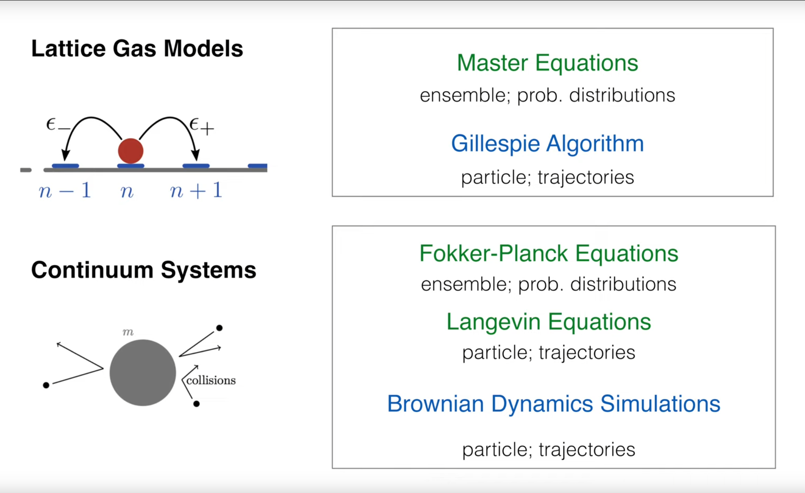
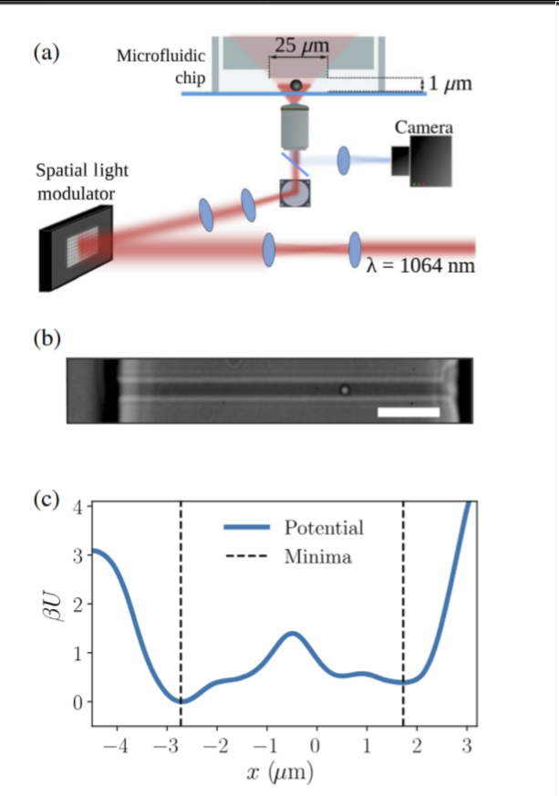
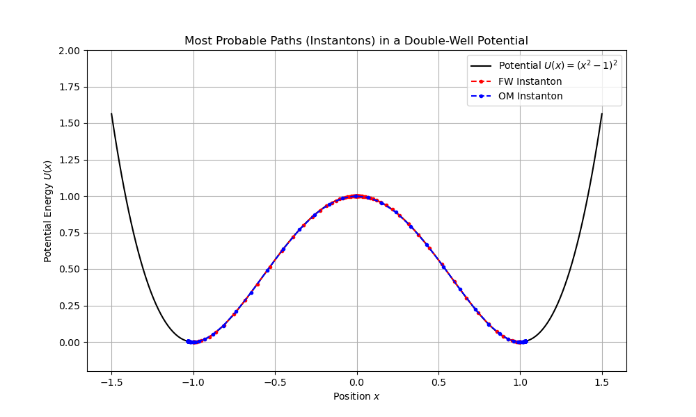
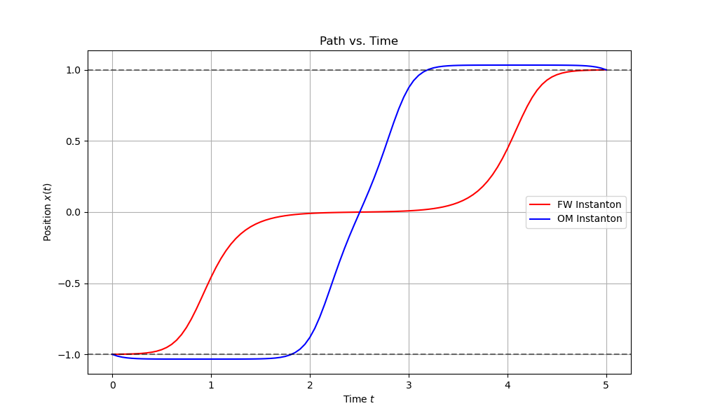
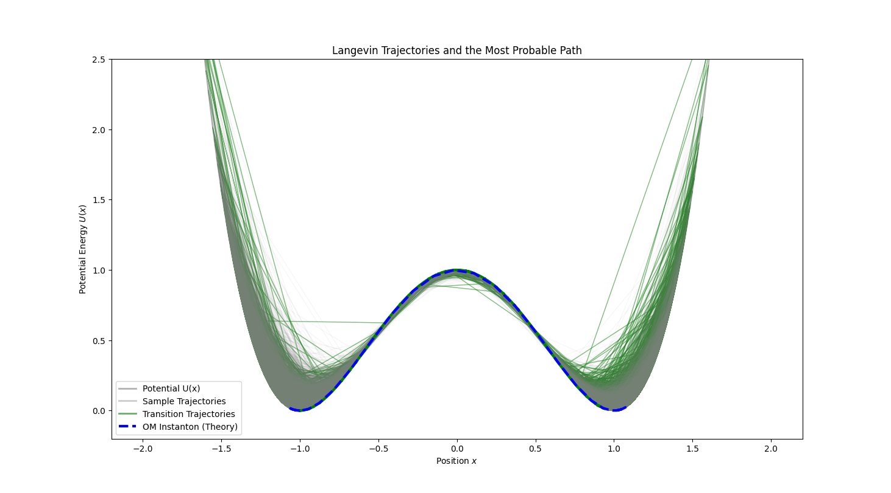
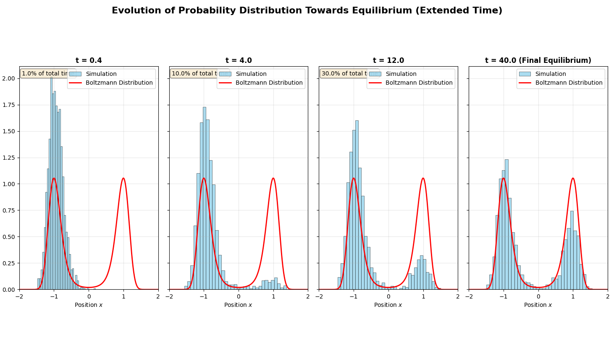

# Introduction: A New View of Stochastic Dynamics

In previous lectures, we studied two principal ways to describe stochastic processes: Langevin equations and Fokker–Planck equations. Langevin equations track single‑particle trajectories under deterministic and random forces (a microscopic view), while Fokker–Planck equations describe how the probability density of an ensemble evolves in time (a macroscopic statistical view). These correspond to following “a single tree” versus describing “the whole forest.”

This lecture introduces a powerful framework — the path integral. It provides a third perspective: rather than stepping state‑to‑state, we consider the complete history (trajectory) $x(\tau)$ over a time interval. The core idea is to assign a probability weight to each possible path and then “sum” (i.e., perform a functional integral) over all paths to compute observables such as transition probabilities between states.

The idea parallels Feynman’s path integral in quantum mechanics: a particle’s transition amplitude from $A$ to $B$ is obtained by integrating over all paths connecting $A$ and $B$ with phase weight $e^{iS/\hbar}$, where $S$ is the classical action. In stochastic dynamics, we use real probabilities rather than complex phases; weights typically take the form $e^{-S}$, where $S$ is an action functional measuring how “unlikely” or “costly” a path is.

With this framework we can ask not only “Where will the particle be next?” but also “Over a time interval, which path from $A$ to $B$ is most probable?” Beyond elegance, this perspective is useful in soft matter physics, biophysics, and quantitative finance.

# 1. Recap: Theoretical Landscape of Stochastic Models

Before building the path‑integral machinery, Prof. Erwin Frey recaps common models to situate path integrals within the broader theory.


We can classify along two axes: discrete vs continuous space, and ensemble vs trajectory descriptions.

- Discrete vs continuous systems:

  - Lattice gas models: particles live on discrete lattice sites; used for crystals, spins, etc.

  - Continuum systems: particles move in continuous space and interact via collisions; e.g., colloids in solution.

- Ensemble vs trajectory descriptions — the key conceptual split:

  - Ensemble view (forest): focus on the time evolution of the probability distribution $P(x,t)$.

    - Master equations: probability evolution on discrete state spaces — the backbone of ensemble descriptions.

    - Fokker–Planck equations: the continuum counterpart of master equations; PDEs for $P(x,t)$ under drift and diffusion.

  - Trajectory view (a tree): focus on individual realizations $x(t)$.

    - Gillespie algorithm: exact stochastic simulation for jump processes; widely used in reaction networks.

    - Langevin equations: SDEs for continuous variables (e.g., position) with deterministic drift and random noise; solutions are random trajectories.

    - Brownian dynamics simulations: numerical trajectories based on Langevin equations.

We start from the familiar overdamped Langevin equation in 1D:

$$\dot{x}(t)=A(x(t))+\xi(t)$$

Here $x(t)$ is position, $\dot{x}(t)$ the velocity, $A(x)$ the deterministic drift (e.g., force $F(x)$ from a potential $U(x)$ divided by friction $\gamma$: $A=F/\gamma$), and $\xi(t)$ is random noise from the environment.

For Gaussian white noise we use:

1. Zero mean: $\langle \xi(t) \rangle = 0$.

2. Delta correlation (memoryless): $\langle \xi(t)\,\xi(t') \rangle = 2D\,\delta(t-t')$, where $D$ is the noise strength (diffusion coefficient; in equilibrium, $D = k_B T/\gamma$).

# 2. Probability of Noise: From Discrete Steps to Continuous Paths

The first and most basic step in constructing the path-integral is to build a probability functional for the noise $\xi(\tau)$ itself. The strategy is "discretize first, then take the continuum limit".

A functional is a “function of a function”. Ordinary functions input a number (e.g., time $t$) and return a number (e.g., temperature $T(t)$). A functional inputs an entire function (e.g., a full curve $T(t)$) and returns a number (e.g., the average energy or total path length associated with that curve).

## 2.1. Time Discretization

Divide $[0,t]$ into $n$ small steps of size $\Delta t$ so that $t=n\Delta t$. At each time $\tau_i=i\Delta t$ ($i=0,1,\ldots,n-1$), define $\xi_i=\xi(\tau_i)$. For white noise, different times are statistically independent, so each $\xi_i$ is an independent Gaussian:

$$p(\xi_i) = \frac{1}{\sqrt{2\pi\sigma_\xi^2}} \exp\left[-\frac{\xi_i^2}{2\sigma_\xi^2}\right]$$

where $\sigma_\xi^2$ is the variance of the noise over one step $\Delta t$.

## 2.2. Joint Probability of a Discrete Path

Since the $\xi_i$ are IID, the probability of a particular discrete noise path $(\xi_0,\xi_1,\ldots,\xi_{n-1})$ is the product:

$$
p(\xi_0, \xi_1, \ldots, \xi_{n-1}) = \prod_{i=0}^{n-1} p(\xi_i) = \left( \frac{1}{2\pi\sigma_\xi^2} \right)^{n/2} \exp \left( -\sum_{i=0}^{n-1} \frac{\xi_i^2}{2\sigma_\xi^2} \right)
$$
We focus on the exponential, which sets relative weights.

## 2.3. Continuum Limit

Now take $\Delta t \to 0$ and $n \to \infty$ with $t=n\Delta t$ fixed so sums become integrals.

Match the discrete variance $\sigma_\xi^2$ to the continuum diffusion $D$ by equating correlations. Discrete: $\langle\xi_i\xi_j\rangle=\sigma_\xi^2\delta_{ij}$. Continuum: $\langle\xi(t)\xi(t')\rangle=2D\,\delta(t-t')$. Averaging the continuum over discrete bins gives

$$
\langle \xi_i \xi_j \rangle = \int_{\tau_i}^{\tau_{i+1}} d\tau \int_{\tau_j}^{\tau_{j+1}} d\tau' \frac{\langle \xi(\tau) \xi(\tau') \rangle}{(\Delta t)^2} \approx \frac{2D}{\Delta t}\, \delta_{ij}.
$$

Hence $\sigma_\xi^2=2D/\Delta t$. Substituting into the exponent,

$$- \sum_{i=0}^{n-1} \frac{\xi_i^2}{2\sigma_{\xi}^2} = - \frac{1}{4D} \sum_{i=0}^{n-1} \xi_i^2 \Delta t$$

and as $\Delta t \to 0$ the Riemann sum becomes

$$\sum_{i=0}^{n-1} \xi_i^2 \Delta t \;\to\; \int_0^t d\tau \, \xi^2(\tau).$$

## 2.4. Probability Functional of Noise

Thus the probability functional of a continuous noise history $\xi(\tau)$ is

$$P[\xi(\tau)] \sim \exp\left(-\frac{1}{4D}\int_0^t d\tau\, \xi^2(\tau)\right).$$

This is the cornerstone of the path‑integral description. It says that a noise history’s probability decays exponentially with its “energy” $\int \xi^2\,d\tau$: larger amplitude and longer duration noise fluctuations are less likely.

Formally, the path integral is

$$\langle \mathcal{O}[\xi(\tau)] \rangle = \int \mathcal{D}[\xi(\tau)] \, \mathcal{O}[\xi(\tau)] \exp\left(-\frac{1}{4D}\int_0^t d\tau\, \xi^2(\tau)\right),$$

with $\mathcal{O}[\xi(\tau)]$ a functional observable and $\mathcal{D}[\xi(\tau)]$ the measure over paths (formally $\lim_{n\to\infty}\prod_{i=0}^{n-1}\tfrac{d\xi_i}{\sqrt{2\pi\sigma_\xi^2}}$, including normalization).

# 3. From Noise to Particle: The Onsager–Machlup Action

We have the probability functional for noise. Our goal is the probability functional for particle paths $x(\tau)$: $P[x(\tau)]$. The key is a change of variables in the functional integral from $\xi(\tau)$ to $x(\tau)$.

## 3.1. Change of Variables

In the functional integral the Jacobian is $\det\!\left(\tfrac{\delta \xi(\tau')}{\delta x(\tau)}\right)$. A direct evaluation is involved, so return to a discrete picture.

## 3.2. Jacobian: A Subtle but Crucial Factor

Write the discretized Langevin equation as

$$\frac{x_{i+1}-x_i}{\Delta t} = \theta A(x_{i+1})+(1-\theta)A(x_i)+\xi_i$$

with $\theta\in[0,1]$ selecting where we sample $A(x)$ in the interval.

- $\theta=0$ (Itô): use $x_i$ at the beginning of the step.

- $\theta=1$ (anti‑Itô): use $x_{i+1}$ at the end of the step.

- $\theta=1/2$ (Stratonovich): midpoint sampling.

Numerically, these correspond to evaluating $A(x)$ at different points in $[t_i,t_{i+1}]$, controlled by $\theta$. Itô ($\theta=0$) samples at the start (finance; martingales); Stratonovich ($\theta=1/2$) approximates the midpoint, preserving the usual chain rule and matching limits of continuous noise in physical systems; anti‑Itô ($\theta=1$) samples at the end (mainly of theoretical interest). The choice affects stability and, crucially, the Jacobian correction in the path integral, leading to different continuum limits and interpretations.

Solving for $\xi_i$ gives

$$\xi_i = \frac{x_{i+1}-x_i}{\Delta t} - [\theta A(x_{i+1})+(1-\theta)A(x_i)].$$

The Jacobian matrix has elements $J_{ij}=\tfrac{\partial \xi_i}{\partial x_j}$, a lower‑triangular form with determinant the product of diagonal entries. The diagonals are

$$J_{ii} = \frac{\partial \xi_i}{\partial x_i} = -\frac{1}{\Delta t}-(1-\theta)A'(x_i).$$

(A fully rigorous derivation tracks the $x_{i+1}$ dependence on $x_i$, but the final structure is the same.) In the continuum limit the Jacobian contributes an additive term to the action. One finds

$$\ln(\text{Jacobian}) = -\theta \int_0^t d\tau\, A'(x(\tau)).$$

Thus the path weight depends not only on deviations from the deterministic trajectory but also on the local gradient of the drift field, with a coefficient set by the discretization choice $\theta$.

## 3.3. Onsager–Machlup Action

Combining the Jacobian with the Gaussian weight yields the full path probability for $x(\tau)$:

$$P[x(\tau)] \sim \exp(-S[x(\tau)])$$

with action

$$S[x(\tau)] = \int_0^t d\tau \left[\frac{(\dot{x}-A(x))^2}{4D} + \theta A'(x)\right].$$

For physical stochastic processes the Stratonovich interpretation ($\theta=1/2$) is most natural, giving the Onsager–Machlup (OM) action

$$S_{OM}[x(\tau)] = \int_0^t d\tau \left[\frac{(\dot{x}-A(x))^2}{4D} + \frac{1}{2} A'(x)\right].$$

This action is the core result: it assigns a number to each path $x(\tau)$ whose negative exponential is proportional to the path’s probability. Smaller action means higher probability.

Introduced by Lars Onsager and Stefan Machlup (1953, “Fluctuations and Irreversible Processes”), the OM theory gives a least‑action‑like description of thermal fluctuations: each possible Brownian path has probability proportional to $\exp(-S_{OM}[x])$, where $S_{OM}$ contains both the “kinetic” deviation from drift and a curvature/Jacobian correction from $A'(x)$. It connects broken time‑reversal symmetry to path weights and bridges microscopic fluctuations to macroscopic irreversibility. Today OM actions are used across physics, biophysics (single‑molecule trajectories), soft‑matter dynamics, path‑sampling algorithms, etc., as a basis for most‑probable paths, transition states, entropy production, and more.

# 4. Physical Meaning: Most Probable Paths and Experiments

The OM action carries deep physical meaning and, as discussed in class, is supported by modern high‑precision experiments.

## 4.1. Deconstructing the Action

The OM action has two parts:

- Freidlin–Wentzell (FW) part

  $$
  \mathcal{L}_{FW} = \frac{1}{4D}(\dot{x} - A(x))^2
  $$

  It quantifies the “cost” of deviating from deterministic drift: if $\dot{x}=A(x)$, this vanishes (minimal cost). Any noise‑induced deviation increases the action and lowers the path probability. In the weak‑noise limit ($D\to 0$), minimizing the total action favors $\dot{x}=A(x)$, i.e., the classical deterministic path.

- Jacobian/curvature correction

  $$ \mathcal{L}_{corr} = \frac{1}{2}A'(x)$$

  This distinguishes OM from FW. Using $A(x)=F/\gamma=-U'(x)/\gamma$ it can be written

$$
\frac{1}{2}A'(x) = -\frac{1}{2\gamma}U''(x).
$$

  • At a potential minimum (stable point), $U''(x)>0$, so $A'(x)<0$ reduces the action and increases path probability — the system “lingers” in wells.

  • At a barrier top (unstable point), $U''(x)<0$, so $A'(x)>0$ raises the action and suppresses paths lingering at the barrier.

Thus at finite temperature ($D>0$) path probabilities depend both on following the drift and on the local stability (curvature) of the explored landscape.

## 4.2. Link to Experiment: Gladrow et al. (2021)

Prof. Frey highlighted an experiment that “measures” relative path probabilities, providing evidence for the theory:

Gladrow, J., Keyser, U. F., Adhikari, R., & Kappler, J. (2021). Experimental measurement of relative path probabilities and stochastic actions. Physical Review X, 11(3), 031022.

### 4.2.1. Experimental Challenge and Sojourn Probability

Any exact continuous path $x(\tau)$ has zero probability measure, making direct path probabilities unobservable. The workaround is the sojourn probability: measure the probability that a trajectory remains within a thin tube of radius $R$ around a reference path $\varphi(t)$ over a time interval, $P_R^{\varphi}(t)$. This is finite and measurable. Taking ratios for two references $\varphi_1,\varphi_2$ and extrapolating $R\to 0$ yields $e^{-S[\varphi_1]}/e^{-S[\varphi_2]}$ — the relative path probability from theory.

### 4.2.2. Experimental Verdict: OM Wins




The key finding: at room temperature (a typical finite‑temperature setting), measured relative path probabilities match the theoretical prediction using the OM action, while predictions using the simpler FW action show significant deviations. This proves that the Jacobian correction $\\tfrac{1}{2}A'(x)$ is not a dispensable mathematical detail but has real, measurable physical effects at finite temperature; it is essential for correctly describing fluctuations.

This dialogue between theory and experiment elevates the choice between Itô and Stratonovich interpretations from a mere mathematical convention to a principle set by physical reality.
The setup traps a colloidal particle in a laser‑made double‑well potential inside a microchannel and tracks its position by high‑speed imaging.

### 4.2.3. Most Probable Paths as Physical Entities (Instantons)

Theoretically, transitions between stable states (e.g., wells) are rare events. Among all paths that realize such a transition, some have the highest probability — the most probable paths, or instantons — obtained by minimizing the action $S[x(\tau)]$.

In the experiment, the instanton concept was made tangible: analyzing data, the authors identified the path minimizing the integral escape rate within the tube, and took it as the measured instanton. This data‑extracted path agrees strikingly with the instanton from minimizing the OM action, showing that instantons are not merely theoretical — they represent the typical/central paths followed in rare events such as barrier crossings.

| Feature | Freidlin–Wentzell (FW) action | Onsager–Machlup (OM) action |
|---|---|---|
| Lagrangian | $\mathcal{L}_{FW} = \tfrac{1}{4D}(\dot{x} - A(x))^2$ | $\mathcal{L}_{OM} = \tfrac{1}{4D}(\dot{x} - A(x))^2 + \tfrac{1}{2}A'(x)$ |
| Origin | Emerges in weak‑noise ($D \to 0$) limit; Itô discretization ($\theta=0$) | From variable change with correct Jacobian; Stratonovich ($\theta=1/2$) |
| Applicability | Accurate for most‑probable paths only at asymptotically low T or very fast transitions | Accurate at finite temperature for path probabilities and most‑probable paths |
| Experimental test | Disagrees with room‑temperature colloid data | Agrees excellently with experiment |
| Core physics | Captures cost of deviations from deterministic dynamics | Captures both deviation cost and curvature effects on fluctuations |

## 4.3. Python Simulation 1: Instanton in a Double‑Well Potential

To intuitively understand the difference between FW and OM instantons, we can find them numerically. We discretize a path into a sequence of points and then use an optimizer to minimize the discretized action.

The Python code below defines a double‑well potential and computes the FW and OM instantons that connect the two wells.


* Purpose: numerically compute and visualize the most probable path (instanton) in the double‑well $U(x)=(x^2-1)^2$ from $x=-1$ to $x=1$.

Two cost functionals are defined:

* Freidlin–Wentzell (FW) action:

  Defined as $\mathcal{S}_{\text{FW}} = \int \frac{(\dot{x}-A)^2}{4D}\, dt$, with Lagrangian
  $$
  \text{Lagrangian\_fw} = \frac{(\dot{x} - A)^2}{4D}
  $$
  This corresponds to the main term in the OM action and only accounts for the cost of deviating from the deterministic drift.

* Onsager–Machlup (OM) action:

  Adding a correction term, the full form is:
  $$
  \mathcal{S}_{\text{OM}} = \int \left[ \frac{(\dot{x} - A)^2}{4D} + \frac{1}{2} 
  \nabla A \right] dt
  $$
  where the correction is $\text{Lagrangian_om} = 0.5\times A'$. Here $A' = dA/dx$ is the spatial derivative of the drift $A(x)$. This correction originates from the Jacobian of the transform from noise paths to particle paths and is physically essential.

```python
import numpy as np
import matplotlib.pyplot as plt
from scipy.optimize import minimize

# Define physical parameters
gamma = 1.0  # Friction coefficient
D = 0.05     # Reduce diffusion coefficient to enhance differences

# 1. Define double-well potential and its derivatives
def potential(x):
    """Double-well potential U(x) = (x^2 - 1)^2"""
    return (x**2 - 1)**2

def force(x):
    """Force F(x) = -U'(x)"""
    return -4 * x * (x**2 - 1)

def drift(x):
    """Drift term A(x) = F(x) / gamma"""
    return force(x) / gamma

def drift_prime(x):
    """Derivative of drift term A'(x)"""
    return (-12 * x**2 + 4) / gamma

# 2. Discretized action
def get_action(path, dt, action_type='OM'):
    """Calculate discrete action of path"""
    x = path
    x_dot = np.diff(x) / dt
    x_mid = (x[:-1] + x[1:]) / 2  # Midpoints for evaluating A(x) and A'(x)
    
    A = drift(x_mid)
    A_prime = drift_prime(x_mid)
    
    # FW Lagrangian
    lagrangian_fw = (x_dot - A)**2 / (4 * D)
    
    if action_type == 'FW':
        action = np.sum(lagrangian_fw * dt)
    elif action_type == 'OM':
        # OM correction term
        lagrangian_om_corr = 0.5 * A_prime
        action = np.sum((lagrangian_fw + lagrangian_om_corr) * dt)
    else:
        raise ValueError("action_type must be 'FW' or 'OM'")
        
    return action

# 3. Numerical optimization to find instanton
# Time and path settings
T_total = 8.0  # Increase total time
N_points = 201  # Increase number of path points
dt = T_total / (N_points - 1)
time = np.linspace(0, T_total, N_points)

# Initial path guess (straight line from -1 to +1)
initial_path = np.linspace(-1, 1, N_points)

# Optimization functions
def objective_fw(p):
    return get_action(p, dt, 'FW')

def objective_om(p):
    return get_action(p, dt, 'OM')

# Run optimization
# Fix start and end points of path
cons = ({'type': 'eq', 'fun': lambda x: x[0] + 1},
        {'type': 'eq', 'fun': lambda x: x[-1] - 1})

print("Minimizing FW action...")
result_fw = minimize(objective_fw, initial_path, constraints=cons, method='SLSQP', 
                     options={'maxiter': 1000, 'ftol': 1e-9})
path_fw = result_fw.x
print("FW minimization successful:", result_fw.success)
print("FW action value:", result_fw.fun)

print("Minimizing OM action...")
# Use FW result as initial guess for OM
result_om = minimize(objective_om, path_fw, constraints=cons, method='SLSQP',
                     options={'maxiter': 1000, 'ftol': 1e-9})
path_om = result_om.x
print("OM minimization successful:", result_om.success)
print("OM action value:", result_om.fun)


# 4. Plotting
plt.figure(figsize=(10, 6))
x_plot = np.linspace(-1.5, 1.5, 200)
U_plot = potential(x_plot)

plt.plot(x_plot, U_plot, 'k-', label='Potential $U(x)=(x^2-1)^2$')
plt.plot(path_fw, potential(path_fw), 'r.--', label='FW Instanton')
plt.plot(path_om, potential(path_om), 'b.--', label='OM Instanton')

plt.title('Most Probable Paths (Instantons) in a Double-Well Potential')
plt.xlabel('Position $x$')
plt.ylabel('Potential Energy $U(x)$')
plt.ylim(-0.2, 2)
plt.legend()
plt.grid(True)
plt.show()

# Plot path vs. time
plt.figure(figsize=(10, 6))
plt.plot(time, path_fw, 'r-', label='FW Instanton')
plt.plot(time, path_om, 'b-', label='OM Instanton')
plt.axhline(-1, color='k', linestyle='--', alpha=0.5)
plt.axhline(1, color='k', linestyle='--', alpha=0.5)
plt.title('Path vs. Time')
plt.xlabel('Time $t$')
plt.ylabel('Position $x(t)$')
plt.legend()
plt.grid(True)
plt.show()
```




- Results: FW instanton (red) tends to move at near‑constant speed directly between wells (it minimizes the drift‑deviation cost only). OM instanton (blue) leaves the initial well faster, crosses the barrier quickly, then spends more time approaching/stabilizing in the target well.

- Physical meaning: this difference reflects the $A'(x)$ term. Near well bottoms, $A'(x)<0$ lowers the action, so OM paths prefer to spend time there. The simple simulation reproduces the theory qualitatively and matches the experimental observations of Gladrow et al.

# 5. Advanced Tool: Response‑Field (MSRJD) Formulation

The OM action is physically complete but can be inconvenient for explicit calculations (nonlinear in x when $A$ and $A'$ are complex). Borrowing from quantum field theory leads to the Martin–Siggia–Rose–Janssen–de Dominicis (MSRJD) response‑field formalism.

Its idea: introduce an auxiliary (response) field $\tilde{x}(\tau)$ to rewrite the action as one linear (or at most quadratic) in $x$ and $\tilde{x}$, simplifying calculations.

## 5.1. Derivation Idea (Hubbard–Stratonovich Transform)

Start from the discretized path probability

$$P[\{x_i\}] \sim \exp \left(-\tfrac{1}{4D}\sum_i (x_{i+1}-x_i-\Delta t A(x_i))^2\right) \times \text{Jacobian}$$

and use the Gaussian identity

$$e^{-ay^2} = \sqrt{\tfrac{\pi}{a}} \int \frac{d\tilde{y}}{2\pi} e^{-\tilde{y}^2/(4a) + i\tilde{y}y}$$

Applying this to $(\dot{x}-A)$ with one $\tilde{x}_i$ per time step and taking the continuum limit yields a new action $S'[x, \tilde{x}]$.

## 5.2. MSRJD Action

With a purely imaginary response field $i\tilde{x}$ (Stratonovich, $\theta=1/2$), the path probability becomes

$$P \sim \int \mathcal{D}[x]\mathcal{D}[\tilde{x}] \exp(-S'[x, \tilde{x}])$$

with

$$S'[x, \tilde{x}] = \int_0^t d\tau \left[\tilde{x}(\dot{x}-A(x)) + iD\tilde{x}^2\right]$$

Advantages:

1. Linear in $\dot{x}$ (easy time derivatives).

2. Quadratic in $\tilde{x}$; nonlinearity is isolated in $i\tilde{x}A(x)$.

3. Starting point for perturbation theory (e.g., Feynman diagrams) by splitting into “free” (quadratic) and “interaction” parts.

# 6. Simulation Practice: Visualizing Random Paths

We now solve the Langevin equation and generate many stochastic trajectories to compare with the most probable path.

## 6.1. Python Simulation 2: Langevin Dynamics and Path Distributions

We use Euler–Maruyama to integrate the overdamped Langevin equation in the double‑well.
```python
import numpy as np
import matplotlib.pyplot as plt

# Use the same physical parameters and potential function as simulation 1
gamma = 1.0
D = 0.25     # Moderate diffusion coefficient, balancing transition rate and rarity
T_total = 40.0  # Further increase total time to ensure complete equilibrium
N_points = 801  # Further increase time resolution
dt = T_total / (N_points - 1)
time = np.linspace(0, T_total, N_points)

def potential(x):
    return (x**2 - 1)**2

def drift(x):
    return -4 * x * (x**2 - 1) / gamma

def drift_prime(x):
    """Derivative of drift term A'(x)"""
    return (-12 * x**2 + 4) / gamma

# Simple calculation of OM instanton path (for plotting)
def get_simple_om_instanton():
    """Calculate simplified OM instanton path for visualization"""
    from scipy.optimize import minimize
    
    def get_action(path, dt):
        x = path
        x_dot = np.diff(x) / dt
        x_mid = (x[:-1] + x[1:]) / 2
        A = drift(x_mid)
        A_prime = drift_prime(x_mid)
        lagrangian_fw = (x_dot - A)**2 / (4 * D)
        lagrangian_om_corr = 0.5 * A_prime
        action = np.sum((lagrangian_fw + lagrangian_om_corr) * dt)
        return action
    
    # Simplified optimization
    initial_path = np.linspace(-1, 1, N_points)
    cons = ({'type': 'eq', 'fun': lambda x: x[0] + 1},
            {'type': 'eq', 'fun': lambda x: x[-1] - 1})
    
    try:
        result = minimize(lambda p: get_action(p, dt), initial_path, 
                         constraints=cons, method='SLSQP', 
                         options={'maxiter': 1000, 'ftol': 1e-6})
        if result.success:
            return result.x
    except:
        pass
    
    # If optimization fails, return a simple S-shaped curve
    t_norm = np.linspace(0, 1, N_points)
    return np.tanh(4 * (t_norm - 0.5))

# 1. Langevin simulator
def langevin_trajectory(x0, T, dt):
    """Generate a Langevin trajectory"""
    n_steps = int(T / dt)
    t = np.linspace(0, T, n_steps + 1)
    x = np.zeros(n_steps + 1)
    x[0] = x0
    
    # Pre-generate all random numbers
    noise = np.random.normal(0, 1, n_steps)
    
    for i in range(n_steps):
        A = drift(x[i])
        stochastic_term = np.sqrt(2 * D * dt) * noise[i]
        x[i+1] = x[i] + A * dt + stochastic_term
        
    return t, x

# 2. Generate large number of trajectories
num_trajectories = 2000  # Increase total trajectories to get sufficient transition samples
trajectories = []
transition_paths = []
print(f"Simulating {num_trajectories} trajectories...")
for i in range(num_trajectories):
    t, x = langevin_trajectory(x0=-1.0, T=T_total, dt=dt)
    trajectories.append(x)
    # Record successful transition paths (increase threshold for stricter definition of transition)
    if x[-1] > 0.3:  # Increase threshold to ensure truly reaching right potential well
        transition_paths.append(x)
print(f"Found {len(transition_paths)} transition paths.")
print(f"Transition rate: {len(transition_paths)/num_trajectories*100:.1f}%")

trajectories = np.array(trajectories)
transition_paths = np.array(transition_paths)

# 3. Plotting
plt.figure(figsize=(12, 8))

# Plot potential background
x_plot = np.linspace(-2, 2, 200)
U_plot = potential(x_plot)
plt.plot(x_plot, U_plot, 'k-', alpha=0.3, label='Potential $U(x)$')

# First plot transition trajectories (at bottom layer)
if len(transition_paths) > 0:
    # Only plot some transition trajectories to avoid excessive density
    num_to_plot = min(len(transition_paths), 25)  # Display at most 25 green trajectories
    for i in range(num_to_plot):
        plt.plot(transition_paths[i, :], potential(transition_paths[i, :]), color='green', alpha=0.5, linewidth=1)

# Then plot sample trajectories (at upper layer, increase transparency)
for i in range(min(150, num_trajectories)):  # Display more gray trajectories but with higher transparency
    plt.plot(trajectories[i, :], potential(trajectories[i, :]), color='gray', alpha=0.08, linewidth=0.8)

# Finally plot important paths (top layer)
if len(transition_paths) > 0:
    # Plot average transition path
    avg_transition_path = np.mean(transition_paths, axis=0)
    plt.plot(avg_transition_path, potential(avg_transition_path), 'g-', linewidth=3, label='Average Transition Path')

# Overlay theoretical instanton path
print("Computing OM instanton path...")
path_om = get_simple_om_instanton()
plt.plot(path_om, potential(path_om), 'b--', linewidth=3, label='OM Instanton (Theory)')


plt.title('Langevin Trajectories and the Most Probable Path')
plt.xlabel('Position $x$')
plt.ylabel('Potential Energy $U(x)$')
plt.ylim(-0.2, 2.5)
# Create a custom legend
from matplotlib.lines import Line2D
legend_elements = [Line2D([0], [0], color='k', alpha=0.3, lw=2, label='Potential U(x)'),
                   Line2D([0], [0], color='gray', alpha=0.4, lw=2, label='Sample Trajectories'),
                   Line2D([0], [0], color='green', alpha=0.6, lw=2, label='Transition Trajectories'),
                   Line2D([0], [0], color='b', linestyle='--', lw=3, label='OM Instanton (Theory)')]
plt.legend(handles=legend_elements)
plt.show()

# Plot evolution of probability distribution over time
fig, axes = plt.subplots(1, 4, figsize=(24, 5), sharey=True)
# Adjust time points, covering longer time range to observe complete equilibrium process
time_points = [int(0.01 * N_points), int(0.1 * N_points), int(0.3 * N_points), N_points - 1]

for i, t_idx in enumerate(time_points):
    ax = axes[i]
    if i < 3:
        time_label = f't = {time[t_idx]:.1f}'
    else:
        time_label = f't = {T_total:.1f} (Final Equilibrium)'
    
    # Plot histogram of particle positions
    ax.hist(trajectories[:, t_idx], bins=35, density=True, alpha=0.7, 
            color='skyblue', edgecolor='black', linewidth=0.5, label='Simulation')
    
    # Plot theoretical equilibrium distribution (Boltzmann distribution)
    x_theory = np.linspace(-2, 2, 200)
    boltzmann_dist = np.exp(-potential(x_theory) / D)
    boltzmann_dist /= np.trapz(boltzmann_dist, x_theory)
    ax.plot(x_theory, boltzmann_dist, 'r-', linewidth=2, label='Boltzmann Distribution')
    
    ax.set_title(time_label, fontsize=12, fontweight='bold')
    ax.set_xlabel('Position $x$')
    if i == 0:
        ax.set_ylabel('Probability Density')
    ax.legend()
    ax.grid(True, alpha=0.3)
    ax.set_xlim(-2, 2)
    
    # Add text showing percentage of total time
    if i < 3:
        percentage = time[t_idx] / T_total * 100
        ax.text(0.02, 0.98, f'{percentage:.1f}% of total time', 
                transform=ax.transAxes, verticalalignment='top', 
                bbox=dict(boxstyle='round', facecolor='wheat', alpha=0.5))

plt.suptitle('Evolution of Probability Distribution Towards Equilibrium (Extended Time)', 
             fontsize=16, fontweight='bold')
plt.tight_layout(rect=[0, 0.03, 1, 0.95])
plt.show()
```



1. Trajectory cloud and instanton: many gray trajectories fluctuate near the initial well ($x=-1$); a few green ones gain enough random "energy" to cross the barrier to $x=+1$. These successful paths form a fuzzy "tube". The theoretical OM instanton (blue dashed) passes through the tube's center, showing it is the most probable path for rare events.


2. Evolution of probability distribution: the histograms show the ensemble view emerging from trajectories. Initially localized at $x=-1$, the distribution broadens and leaks to the other well; at long times it approaches the Boltzmann distribution $P(x) \\propto e^{-U(x)/D}$.

# Conclusion

This lecture developed a third description of stochastic dynamics — a path‑integral formulation that sums over all possible paths with appropriate weights.

* Starting from Gaussian white noise, we constructed probability functionals for noise and for particle paths via discretize→continuum.

* We derived the Onsager–Machlup action: beyond drift‑deviation cost (FW term), it incorporates the curvature/Jacobian correction, essential at finite temperature.

* Crucially, experiment (Gladrow et al.) connects directly to the theory via sojourn probabilities, confirming OM at room temperature.

* Finally, we outlined the MSRJD response‑field formalism as a practical tool for analytic calculations.

In sum, path integrals offer not only an equivalent description to Langevin/Fokker–Planck but also a powerful intuition for “whole histories,” revealing most‑probable paths for rare events and the hidden order in fluctuations.


