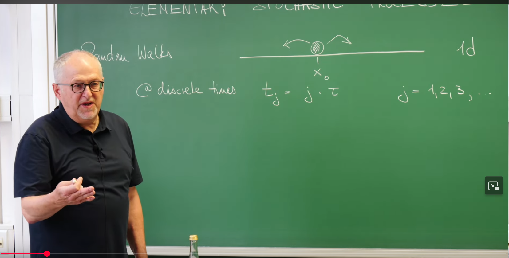
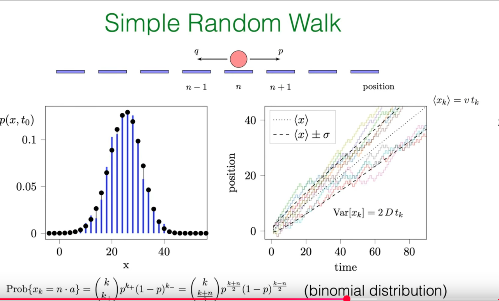

# Introduction: From Random Steps to Physical Laws

A stochastic process is a mathematical framework for describing systems that evolve probabilistically over time. Among the many stochastic processes, the random walk is undoubtedly the most typical and fundamental model. Its applications are ubiquitous, from the diffusion of molecules within cells to price fluctuations in financial markets, where its basic ideas play a central role. This note aims to systematically organize and explain the one-dimensional simple random walk model based on Prof. Erwin Frey's lecture content.

## Defining Random Walk

Based on Prof. Frey's blackboard work at the beginning of the lecture, we can construct the basic model of a one-dimensional random walk.



**Basic model elements**: Imagine a particle (or "walker") moving on a one-dimensional straight line. Its motion is not continuous but occurs at discrete time points $t_k = k\tau$, where $k = 1, 2, 3, \ldots$ is the step number and $\tau$ is the time interval between each jump. The particle's position observed at any time $t_k$ is denoted as $X_k$.

**Core random variable: step length $\xi_k$**: The displacement of each jump, i.e., the step length $\xi_k$, is a random variable. The key assumption of this model is that all step lengths $\xi_k$ are **independent and identically distributed (IID)** random variables. "Identically distributed" means that each jump follows the same probability rules; "independent" means that the result of any step does not affect any other step.

**Discrete vs. continuous step lengths**: The distribution of step lengths can be either discrete or continuous.

**Discrete case**: Step lengths can only take a finite number of specific values. The simplest case is that the particle can only move right by distance $a$ or left by distance $a$ in each step. That is, $\xi_k \in \{+a, -a\}$. The probability of moving right is $p$, and the probability of moving left is $q$, with $p + q = 1$. This is the core of this lecture - the **simple random walk**.

**Continuous case**: Step lengths can take any real value, with their probability described by a probability density function $W(\xi)$, i.e., the probability that the step length falls in the interval $[\xi, \xi + d\xi]$ is $W(\xi)d\xi$.

## Mathematical Formulation

The dynamic evolution of this model can be described by a simple recurrence relation:

$$
X_k = X_{k-1} + \xi_k
$$

This formula expresses the "local" motion rule of the model: the new position equals the old position plus a random step length.

If we assume the particle starts from the origin, i.e., $X_0 = 0$, then by iteratively expanding the above recurrence relation, we can obtain the explicit solution for the particle's position at the $k$-th step:

$$
X_k = \sum_{j=1}^{k} \xi_j
$$

This formula reveals the most profound mathematical structure of the model: the macroscopic physical quantity we observe (position $X_k$) is essentially the sum of a large number of microscopic, independent random variables (step lengths $\xi_j$). It is precisely this "summation" structure that allows us to use powerful statistical tools such as the law of large numbers and the central limit theorem to analyze this seemingly completely random process and discover deterministic, predictable macroscopic laws. The IID assumption is the cornerstone of all this analysis, ensuring that the statistical properties of the process do not change over time, thus allowing us to derive physical constants such as drift velocity and diffusion coefficient that do not depend on time.

For clarity, we summarize the key variables and parameters in the model as follows.

### Table 1: Key variables and parameters of the simple random walk model

| Symbol | Description | Definition/Value |
| --- | --- | --- |
| $k$ | Step number | Integer, $1, 2, 3, \ldots$ |
| $\tau$ | Time step | Duration of each jump |
| $t_k$ | Physical time | $k\tau$ |
| $a$ | Step size | Fixed distance of single-step movement |
| $p$ | Probability of jumping right | $P(\xi_k = +a)$ |
| $q$ | Probability of jumping left | $P(\xi_k = -a)$, $q = 1 - p$ |
| $\xi_k$ | Step length of the $k$-th step | Random variable, takes values $+a$ or $-a$ |
| $X_k$ | Position after the $k$-th step | $\sum_{j=1}^{k} \xi_j$ (assuming $X_0 = 0$) |
| $v$ | Drift velocity | $\frac{a(p-q)}{\tau}$ |
| $D$ | Diffusion coefficient | $\frac{2a^2pq}{\tau}$ |

## 1. Statistical Averages and the Emergence of Physical Laws

For a stochastic process, we cannot accurately predict the exact position of the walker in a single experiment. However, by analyzing the statistical average behavior of a large number of such processes, we can extract deterministic physical information. We no longer ask "Where is the particle?" but rather "Where is the particle **on average**?" and "How dispersed are the possible positions of the particle?" These questions can be answered by calculating the moments of random variables (such as mean and variance).

## 1.1 Average Position: Revealing Drift Phenomena

We first calculate the expected value (or mean) of the particle's position after $k$ steps, denoted as $\langle X_k \rangle$.

**Derivation process**:

Using the linearity property of expectation, the expected value of the total displacement equals the sum of the expected values of each step's displacement:

$$
\langle X_k \rangle = \left\langle \sum_{j=1}^{k} \xi_j \right\rangle = \sum_{j=1}^{k} \langle \xi_j \rangle
$$

Calculate the expected value of single-step displacement $\langle \xi_j \rangle$. According to the definition of expectation, it equals the sum of all possible values multiplied by their corresponding probabilities:

$$
\langle \xi_j \rangle = (+a) \cdot P(\xi_j = a) + (-a) \cdot P(\xi_j = -a) = ap - aq = a(p-q)
$$

This value represents the average displacement per step.

Since all step lengths are identically distributed, the expectation of each step is the same. Therefore, the expected value of the total displacement is:

$$
\langle X_k \rangle = \sum_{j=1}^{k} a(p-q) = k \cdot a(p-q)
$$

**Physical interpretation**:

This mathematical result tells us that the particle's average position is proportional to the number of steps $k$. Introducing physical time $t_k = k\tau$, we can define an average velocity, the drift velocity $v$:

$$
v = \frac{\langle X_k \rangle}{t_k} = \frac{k a(p-q)}{k\tau} = \frac{a(p-q)}{\tau}
$$

This means that although the motion trajectory of a single particle is tortuous and unpredictable, from a macroscopic perspective, the particle population appears to be moving in a directed manner at a constant velocity $v$. This macroscopic directed motion caused by probability asymmetry is **drift**.

**Symmetric vs. asymmetric walks**:

The expression for the average position is entirely determined by the nature of the term $(p-q)$. This reveals two fundamental modes of model behavior:

1. **Symmetric random walk $(p = q = 1/2)$**: In this case, $p - q = 0$, so $\langle X_k \rangle = 0$. The particle has equal probability of moving left and right, with no directional preference. On average, the particle always stays near the origin. This is a **pure diffusion** process.

2. **Biased/asymmetric random walk $(p \neq q)$**: In this case, $p - q \neq 0$, resulting in a non-zero drift velocity. The particle will move in the direction of higher probability on average. In the PPT slide (Image 4), the dashed line showing the average position $\langle x \rangle$ increasing linearly with time clearly depicts a biased random walk with $p > q$.

Therefore, the value of parameter $p$ connects the abstract mathematical model with specific physical scenarios. A dye molecule diffusing in a stationary solvent can be described by a symmetric model, while a charged particle moving in an external electric field (electrophoresis) or a particle suspended in a flowing liquid requires a biased model.

## 1.2 Variance: The Mathematical Fingerprint of Diffusion Phenomena

Next, we analyze the variance $\mathrm{Var}[X_k]$ of the particle's position, which measures the dispersion or width of the position distribution.

**Derivation process**:

According to the definition of variance: $\mathrm{Var}[X_k] = \langle X_k^2 \rangle - \langle X_k \rangle^2$. We have already calculated $\langle X_k \rangle$; now the task is to calculate the second moment $\langle X_k^2 \rangle$.

Expanding $X_k^2$:

$$
\langle X_k^2 \rangle = \left\langle \left( \sum_{j=1}^{k} \xi_j \right)^2 \right\rangle = \left\langle \left( \sum_{i=1}^{k} \xi_i \right) \left( \sum_{j=1}^{k} \xi_j \right) \right\rangle = \sum_{i=1}^{k} \sum_{j=1}^{k} \langle \xi_i \xi_j \rangle
$$

**Key step: separating diagonal and off-diagonal terms**. This is a core technique in the solution process. We split the double sum into two parts:

- Diagonal terms $(i = j)$: $\sum_{j=1}^{k} \langle \xi_j^2 \rangle$

- Off-diagonal terms $(i \neq j)$: $\sum_{i \neq j} \langle \xi_i \xi_j \rangle$

**Applying IID properties**:

For off-diagonal terms $(i \neq j)$, since step lengths $\xi_i$ and $\xi_j$ are mutually independent, the expectation of their product equals the product of their individual expectations:

$$
\langle \xi_i \xi_j \rangle = \langle \xi_i \rangle \langle \xi_j \rangle = (a(p-q))^2
$$

For diagonal terms $(i = j)$, we calculate the expectation of the square of step length:

$$
\langle \xi_j^2 \rangle = (+a)^2 \cdot p + (-a)^2 \cdot q = a^2(p+q) = a^2
$$

**Combining calculations**: There are $k$ diagonal terms and $k(k-1)$ off-diagonal terms in total. Therefore,

$$
\langle X_k^2 \rangle = k \cdot a^2 + k(k-1) \cdot (a(p-q))^2
$$

**Final variance calculation**: Substituting $\langle X_k^2 \rangle$ and $\langle X_k \rangle^2 = (ka(p-q))^2$ into the variance definition:

$$
\mathrm{Var}[X_k] = (k a^2 + k(k-1)a^2(p-q)^2) - (k a(p-q))^2
$$

$$
= k a^2 + (k^2-k)a^2(p-q)^2 - k^2 a^2(p-q)^2
$$

$$
= k a^2 - k a^2(p-q)^2 = k a^2 (1 - (p-q)^2)
$$

Using $p + q = 1$, we have $1 - (p-q)^2 = (p+q)^2 - (p-q)^2 = 4pq$. So we finally obtain:

$$
\mathrm{Var}[X_k] = 4k a^2 pq
$$

**Physical interpretation**:

The most important feature of this result is that the variance is proportional to the number of steps $k$, and therefore also proportional to physical time $t_k$. This property of variance growing linearly with time is precisely the hallmark of a **diffusive process**.

We can define the **diffusion coefficient** $D$ through the relation $\mathrm{Var}[X_k] = 2D t_k$. By comparing with our derived result, we obtain:

$$
2D = \frac{4k a^2 pq}{t_k} = \frac{4k a^2 pq}{k\tau} = \frac{4 a^2 pq}{\tau} \implies D = \frac{2 a^2 pq}{\tau}
$$

The diffusion coefficient $D$ is a physical quantity that measures the speed of random diffusion.

**"Funnel of uncertainty" and square root scaling**:

The physical meaning of variance growing linearly with time ($\mathrm{Var} \propto t$) is that the width of the particle position distribution, i.e., the standard deviation $\sigma = \sqrt{\mathrm{Var}}$, grows with the square root of time ($\sigma \propto \sqrt{t}$). This sub-linear growth pattern is a universal characteristic of diffusive processes, fundamentally different from ballistic motion (where position $x \propto t$). The conical region formed by $\langle x \rangle \pm \sigma$ in the PPT is an excellent visualization of this fundamental scaling law. The $\sqrt{t}$ scaling explains why diffusion is efficient at microscopic scales (such as within cells) but extremely slow at macroscopic scales.



## 1.3 Application Example: Random Walk of E. coli

To connect abstract theory with the real world, Prof. Frey performed an estimation in the lecture, which in physics is called a "back-of-the-envelope calculation" to test the model's reasonableness.

**Problem**: How long does it take for a molecule to diffuse across an E. coli cell?

**Estimation**: We know the cell size $L \approx 1\,\mu\mathrm{m}$ and the diffusion coefficient of similar-sized molecules in the cytoplasm $D \approx 10\,\mu\mathrm{m}^2/\mathrm{s}$. We can estimate the characteristic time $t$ by setting the variance of the position distribution approximately equal to the square of the distance, i.e., $L^2 \approx 2Dt$.

**Calculation**:

$$
t \approx \frac{L^2}{2D} \approx \frac{(1\,\mu\mathrm{m})^2}{2 \cdot (10\,\mu\mathrm{m}^2/\mathrm{s})} = 0.05\,\mathrm{s}
$$

**Significance**: This simple calculation demonstrates the power of the diffusion coefficient $D$ as a key physical parameter, connecting microscopic random steps with macroscopic diffusion time scales, enabling us to make quantitative predictions about real biological or chemical systems.

## 2. Complete Probability Distribution

Mean and variance describe the center and width of the distribution, but to obtain complete information about the particle's position, we need to solve its complete probability distribution function $P(X_k = x)$. It answers the question: "What is the exact probability of finding the particle at position $x$ after $k$ steps?"

## 2.1 Combinatorial Method: Binomial Distribution

We can solve this problem precisely using combinatorial methods.

**Problem setup**: Suppose the particle takes $k_+$ steps to the right ($+a$) and $k_-$ steps to the left ($-a$) in $k$ steps. Then the total number of steps $k = k_+ + k_-$. The final position is $X_k = (k_+ - k_-)a$. For convenience, we define a dimensionless position $n = k_+ - k_-$, so $X_k = na$.

**Derivation process**:

**Solving for $k_+$ and $k_-$**: We can express $k_+$ and $k_-$ in terms of the known $k$ and $n$:

$$
k_+ = \frac{k+n}{2}, \quad k_- = \frac{k-n}{2}
$$

It is worth noting that for $k_+$ and $k_-$ to be integers, $k$ and $n$ must have the same parity (both even or both odd); otherwise, the particle cannot reach position $na$, and its probability is zero.

**Calculating the probability of a single path**: Any specific path containing $k_+$ steps to the right and $k_-$ steps to the left (e.g., "right-right-left-right-..."), since each step is independent, has a probability of:

$$
p^{k_+} q^{k_-} = p^{k_+} (1-p)^{k_-}
$$

**Calculating the total number of paths**: How many different paths can reach the final position $na$? This is a classic combinatorial problem: in $k$ total positions, choose $k_+$ positions to place "right steps." The number of ways is given by the binomial coefficient:

$$
\binom{k}{k_+} = \frac{k!}{k_+!(k-k_+)!} = \frac{k!}{k_+! k_-!}
$$

**Final result**: Multiplying the probability of a single path by the total number of paths, we obtain the total probability that the particle is at position $na$ after the $k$-th step, which is precisely the **binomial distribution**:

$$
P(X_k = na) = \binom{k}{k_+} p^{k_+} (1-p)^{k_-}
$$

**Connection between microstates and macrostates**:

The structure of this formula profoundly embodies the basic ideas of statistical mechanics. Each specific sequence of steps (such as RRLR...) is a microstate. The final net displacement (such as $n = 2$) is a macrostate. The formula shows that the probability of a macrostate occurring equals the probability of a single microstate leading to that macrostate ($p^{k_+} q^{k_-}$) multiplied by the degeneracy or multiplicity of that macrostate ($\binom{k}{k_+}$), i.e., how many different microstates can produce the same macroscopic result. The most likely macrostates are those corresponding to the most microstate paths. The combinatorial coefficient here plays a role similar to "entropy."

## 2.2 Continuous Limit: Emergence of Gaussian Distribution

The binomial distribution is exact, but when the number of steps $k$ is large, its calculation becomes very cumbersome. In physics, we are often more concerned with macroscopic behavior after many steps.

**Central Limit Theorem (CLT)**:

The professor pointed out that when the number of steps $k$ is very large ($k \gg 1$), the binomial distribution can be approximated by a Gaussian distribution, also called a normal distribution:

$$
P(n) \approx \frac{1}{\sqrt{2\pi \mathrm{Var}[n]}} \exp\left(-\frac{(n-\langle n \rangle)^2}{2\mathrm{Var}[n]}\right)
$$

This transition is not merely a mathematical approximation (such as using Stirling's formula for factorials), but a manifestation of a deeper physical principle - the **Central Limit Theorem**. This theorem states that the distribution of the sum of a large number of independent and identically distributed random variables (in our model, $X_k = \sum \xi_j$) will tend toward a Gaussian distribution, regardless of the distribution form of the individual random variables themselves (here, the distribution of individual step lengths is a simple two-point Bernoulli distribution). This explains why in nature, processes involving the accumulation of many random factors often exhibit Gaussian distributions.

**Parameters of the Gaussian distribution**:

The mean and variance of this approximate Gaussian distribution are exactly the mean and variance we directly calculated in the first section.

**Mean**: $\langle n \rangle = k(p-q)$, corresponding to a position mean of $\langle X_k \rangle = a\langle n \rangle = ak(p-q)$.

**Variance**: $\mathrm{Var}[n] = 4kpq$, corresponding to a position variance of $\mathrm{Var}[X_k] = a^2\mathrm{Var}[n] = 4k a^2 pq$.

This perfectly demonstrates the self-consistency of the model. The results obtained by directly calculating moments are completely consistent with the results obtained by solving the complete distribution and then taking the limit. **This process clearly shows how macroscopic diffusion laws (whose solution is a Gaussian function) "emerge" from microscopic random walk rules.**

## 3. Python Computational Simulation and Visualization

### Note

The following content is written by the author after studying the course and is not part of the lecture content

Theoretical analysis provides profound insights, while computational simulation is the "third method" of physics research, helping us build intuitive physical images and verify the correctness of theoretical predictions.

## 3.1 Simulation Algorithm

The algorithm for simulating a single random walk trajectory is very simple:

1. Initialize position $x = 0$ and time $t = 0$.

2. Perform $k$ iterations.

3. In each step, generate a random number in the interval $[0,1]$. If this number is less than $p$, move one step to the right ($x \leftarrow x + a$); otherwise, move one step to the left ($x \leftarrow x - a$).

4. Record the position at each step.

To analyze the overall behavior of a particle ensemble, we simply repeat the above process $N_{\text{walkers}}$ times.

Below is a complete Python code using `numpy` and `matplotlib` libraries to simulate simple random walks and reproduce the two figures from the course PPT slides.


```python
import numpy as np
import matplotlib.pyplot as plt
from scipy.special import comb

# --- Simulation parameters (inferred from PPT) ---
p = 0.75  # Probability of moving right
q = 1 - p # Probability of moving left
a = 1     # Step size
tau = 1   # Time interval

# --- Figure 1: Probability distribution (left plot) ---
num_steps_dist = 50       # Total number of steps
num_walkers_dist = 50000  # Number of simulated particles for statistical distribution

# Simulation
# Generate displacement for each step (+a or -a)
steps = np.random.choice([a, -a], size=(num_walkers_dist, num_steps_dist), p=[p, q])
# Calculate final position of each particle
final_positions = np.sum(steps, axis=1)

# Plot histogram of simulation results
plt.figure(figsize=(12, 5))
plt.subplot(1, 2, 1)
# Use bins to center on even or odd positions
bins = np.arange(final_positions.min(), final_positions.max() + 2) - 0.5
plt.hist(final_positions, bins=bins, density=True, color='blue', alpha=0.7, label=f'Simulation (N={num_walkers_dist})')

# Calculate and plot theoretical binomial distribution
n_values = np.arange(-num_steps_dist, num_steps_dist + 1, 2) # Possible final positions n = k+ - k-
k_plus = (num_steps_dist + n_values) / 2
prob_theory = comb(num_steps_dist, k_plus) * (p**k_plus) * (q**(num_steps_dist - k_plus))
plt.plot(n_values * a, prob_theory, 'ko', label='Theoretical (Binomial)')

plt.title(f'Probability Distribution at k={num_steps_dist}')
plt.xlabel('Position x')
plt.ylabel('Probability P(x, t)')
plt.legend()
plt.grid(True, linestyle='--', alpha=0.6)


# --- Figure 2: Trajectories and statistical moments (right plot) ---
num_steps_traj = 80       # Total number of steps
num_walkers_traj_show = 10 # Number of displayed trajectories
num_walkers_traj_stat = 2000 # Number of particles for calculating mean and variance statistics

# Simulation
steps_stat = np.random.choice([a, -a], size=(num_walkers_traj_stat, num_steps_traj), p=[p, q])
# Calculate position of each particle at each step (cumulative sum)
trajectories = np.cumsum(steps_stat, axis=1)
# Add initial position 0 before trajectories
trajectories = np.insert(trajectories, 0, 0, axis=1)

# Plotting
plt.subplot(1, 2, 2)
time_points = np.arange(num_steps_traj + 1) * tau

# Plot sample trajectories
for i in range(num_walkers_traj_show):
    plt.plot(time_points, trajectories[i, :], alpha=0.5)

# Calculate and plot statistical mean (from simulation)
mean_sim = np.mean(trajectories, axis=0)
# Calculate and plot theoretical mean
mean_theory = time_points * a * (p - q) / tau
plt.plot(time_points, mean_theory, 'k:', linewidth=2, label=r'$\langle x \rangle$')

# Calculate and plot theoretical standard deviation range
variance_theory = 4 * (time_points/tau) * (a**2) * p * q
std_theory = np.sqrt(variance_theory)
plt.plot(time_points, mean_theory + std_theory, 'k--', linewidth=2, label=r'$\langle x \rangle \pm \sigma$')
plt.plot(time_points, mean_theory - std_theory, 'k--', linewidth=2)


plt.title('Random Walk Trajectories and Moments')
plt.xlabel('Time')
plt.ylabel('Position')
plt.legend()
plt.grid(True, linestyle='--', alpha=0.6)

plt.tight_layout()
plt.show()
```


The probability distribution plot on the left is actually equivalent to taking a "vertical slice" at a specific time point (e.g., $t = 50$) in the right plot and then counting the distribution of all simulated particle positions at that moment.

## Summary: The Powerful Force of a Simple Model

Prof. Erwin Frey's lecture, starting from an extremely simple model, led us to appreciate the core ideas of statistical physics: **how to derive observable, deterministic physical laws in the macroscopic world from the basic random rules of the microscopic world**.

We saw that the **mean of particle position grows linearly with time** ($\langle X_k \rangle \propto t$), which is the macroscopic manifestation of **drift**; while its **variance also grows linearly with time** ($\mathrm{Var}[X_k] \propto t$), which is the universal characteristic of **diffusion**. The linear growth of variance is equivalent to the **square root growth** of standard deviation with time ($\sigma_k \propto \sqrt{t}$), which is the key scaling law distinguishing diffusion from other transport processes.

From defining the most basic random steps, to calculating their statistical moments, to solving the complete probability distribution and revealing its universality in the Gaussian distribution, this entire process is not only a mathematical derivation but also a brilliant lesson on how order emerges from disorder in the physical world. Although the simple random walk model is simple, it provides a solid foundation and profound physical intuition for understanding more complex stochastic phenomena.
