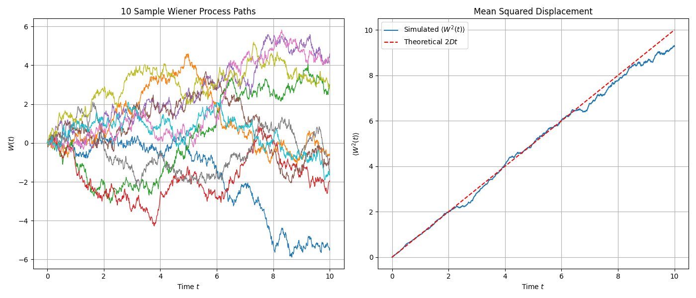

# Introduction: From Physical Intuition to Mathematical Rigor

In earlier lectures (especially Lecture 16), we have encountered the **Langevin equation** for describing stochastic phenomena such as Brownian motion. The Langevin equation provides a very intuitive physical picture: a particle's motion is determined by two parts—one part is a deterministic, predictable force (such as friction), and the other part is a rapidly fluctuating random force $\xi(t)$ generated by numerous microscopic particle collisions.

This random force, namely **white noise**, is typically idealized as being completely uncorrelated at any two different moments. This "memoryless" property is mathematically expressed through the Dirac $\delta$ function:

$$\langle\xi(t)\xi(t')\rangle=2D\delta(t-t')$$

However, while this idealization is very useful physically, it brings mathematical troubles. A "function" that is uncorrelated with other moments at any time must be filled with infinite spikes and have infinite variance, so it is not a function in the strict sense. Direct calculus operations on such an object encounter severe mathematical challenges.

To overcome this difficulty, mathematicians developed a completely new language—**stochastic differential equations (SDEs)**. This is not merely a symbolic change, but a fundamental leap in thinking. The core idea is to **avoid directly dealing with the singular white noise $\xi(t)$ and instead study its integral**. The integral of white noise, namely the **Wiener process $W(t)$**, is a well-behaved, path-continuous stochastic process. The purpose of this lecture is to establish this rigorous mathematical tool, enabling us to precisely describe and analyze physical, biological, and even financial systems driven by randomness.

## 1. The Language of Stochastic Differential Equations

The development history of stochastic differential equations (SDEs) originates from the theoretical description of Brownian motion. French physicist Paul Langevin first proposed the Langevin equation in 1908, combining deterministic viscous resistance with random noise forces, laying the foundation for statistical mechanics and stochastic process research. This physical model was later mathematically rigorized, particularly through the development of complete stochastic integration theory by Itô and Stratonovich, solving the difficult problem of how to properly handle stochastic variable calculus. Today, SDEs have extremely wide applications: in finance, they form the basis for risk assessment, stock price volatility simulation, and the famous Black-Scholes equation; in physics, they are used for Brownian motion and molecular dynamics simulation; in biology, they are applied to population dynamics and protein folding analysis; in addition, they provide theoretical frameworks for reaction rate modeling in chemistry and stochastic gradient descent algorithms in machine learning.

## 1.1 Wiener Increments: Capturing the Basic Units of Randomness

Professor Erwin Frey starts with the simplest stochastic differential equation, which describes the motion of a particle driven only by random forces:

$$\dot{x}=\xi(t),$$

Here, $\xi(t)$ is the white noise we discussed earlier, with correlation function $\langle\xi(t)\xi(t')\rangle=2D\delta(t-t')$, where $D$ is the diffusion coefficient.

To handle this equation mathematically, we do not directly solve $\dot{x}$, but instead examine the change in particle position $x$ over a small time interval $\Delta t$. By integrating the above equation, we obtain:

$$x(t+\Delta t)-x(t)=\int_t^{t+\Delta t}d\tau\,\xi(\tau)\equiv\Delta W(t),$$

This integral result $\Delta W(t)$ is defined as the Wiener increment. Its physical meaning is very clear: **during the time interval $\Delta t$, the particle experiences countless microscopic, independent random collisions from surrounding medium molecules, and $\Delta W(t)$ is the net displacement accumulated from these collision effects.**

The Wiener increment has two crucial statistical properties:

**1. Mean Square Value:**

We can directly calculate the mean value of the square of $\Delta W(t)$:

$$
\langle\Delta W^2(t)\rangle=\Big\langle\int_t^{t+\Delta t}\!d\tau\,\xi(\tau)\int_t^{t+\Delta t}\!d\tau'\,\xi(\tau')\Big\rangle
$$

Using the property that expectation and integration can be interchanged, we get:

$$
\langle\Delta W^2(t)\rangle=\int_t^{t+\Delta t}\!d\tau\int_t^{t+\Delta t}\!d\tau'\,\langle\xi(\tau)\xi(\tau')\rangle=\int_t^{t+\Delta t}\!d\tau\int_t^{t+\Delta t}\!d\tau'\,2D\,\delta(\tau-\tau').
$$

Due to the properties of the $\delta$ function, the integral has value only when $\tau=\tau'$, so the integral over $\tau'$ yields 1 (as long as the integration interval contains $\tau$). Finally, we obtain:

$$\langle\Delta W^2(t)\rangle=\int_t^{t+\Delta t}2D\,d\tau=2D\,\Delta t.$$

This result $\langle\Delta W^2(t)\rangle=2D\Delta t$ is the hallmark characteristic of diffusion processes: **mean squared displacement is proportional to time interval**, not to the square of time interval (the latter being characteristic of uniform linear motion). This reflects the essence of random motion.

**2. Gaussian Distribution:**

Since the Wiener increment is the superposition of numerous independent random collision effects, according to the central limit theorem, regardless of the details of individual collisions, their sum always tends toward a Gaussian (normal) distribution. Therefore, the probability distribution of $\Delta W(t)$ is:

$$
P(\Delta W(t)) = \frac{1}{\sqrt{4\pi D \Delta t}} \exp\left(-\frac{\Delta W(t)^2}{4D\Delta t}\right)
$$

This is a Gaussian distribution with mean 0 and variance $2D\Delta t$.

## 1.2 Stochastic Integrals and the Wiener Process

With the basic building blocks—**Wiener increments**—we can construct the particle's position $x(t)$ at any time $t$. We partition the time interval $[0,t]$ into $n$ small intervals $\Delta t=t/n$, each corresponding to an independent Wiener increment $\Delta W_k$. The particle's total displacement is the sum of these increments. When the time intervals become infinitesimally small ($n\to\infty$), this summation becomes an integral:

$$x(t)=\lim_{n\to\infty}\sum_{k=0}^{n-1}\Delta W_k\equiv\int_0^t dW(s)$$

This limit process defines what is called a **stochastic integral**. This integral itself, as a function of time $t$, defines the **Wiener process** $W(t)$, which is also called **Brownian motion**.

This method of constructing continuous-time stochastic processes ($W(t)$) from discrete, independent random steps ($\Delta W_k$) through limits is a bridge connecting discrete random walks and continuous stochastic processes.

The statistical properties of the Wiener process $W(t)\equiv x(t)$ can be derived from the properties of its constituent units $\Delta W_k$:

* **Mean squared displacement**: Since each $\Delta W_k$ is independent and identically distributed (iid Gaussian), the expectation of the total displacement squared equals the sum of expectations of individual displacement squares:
  $$
  \langle x^2(t)\rangle=\langle(\sum_{k=0}^{n-1}\Delta W_k)^2\rangle=\sum_{k=0}^{n-1}\langle\Delta W_k^2\rangle=\sum_{k=0}^{n-1}2D\Delta t=n\cdot(2D\frac{t}{n})=2Dt
  $$

* **Probability distribution**: Similarly, according to the central limit theorem, the sum of multiple Gaussian random variables is still a Gaussian random variable, with variance equal to the sum of individual variances. Therefore, the probability distribution of $x(t)$ is:
  $$
  P(x,t)=\frac{1}{\sqrt{4\pi Dt}}\exp\left(-\frac{x^2}{4Dt}\right)
  $$

It is worth noting that this probability distribution $P(x,t)$ is exactly the solution to the **diffusion equation** (or heat equation) that we derived in earlier lectures. This reveals the deep connection between stochastic differential equations (microscopic trajectory description) and the Fokker-Planck equation (probability evolution description).

The transformation from $\xi(t)$ to $dW_t$ is the core of the entire stochastic calculus theory. It shifts our focus from a mathematically difficult-to-handle object (white noise) to a well-defined, path-continuous (though nowhere differentiable) stochastic process (Wiener process). The Langevin equation $\dot{x}=\cdots+\xi(t)$ is physically intuitive but mathematically non-rigorous. The stochastic differential equation $dx=\cdots+dW_t$ is not a simple symbolic substitution—it is essentially a shorthand for an **integral equation**, i.e., $x(t)-x(0)=\int_0^t\cdots ds+\int_0^t dW_s$. **Only in integral form is the entire theory mathematically self-consistent and rigorous.**

## 1.3 Computational Simulation: Wiener Process

We can use the properties of Wiener increments to generate trajectories of the Wiener process through simple iteration. The core discretized update rule is:

$$W(t_{i+1})=W(t_i)+\Delta W_i$$

where $\Delta W_i$ is a random number drawn from a Gaussian distribution with mean 0 and variance $2D\Delta t$, which is equivalent to $\sqrt{2D\Delta t}\cdot N(0,1)$, where $N(0,1)$ is the standard normal distribution.

The following Python code simulates and plots multiple Wiener process trajectories, verifying their mean squared displacement grows linearly with time.

```python
import numpy as np
import matplotlib.pyplot as plt

# --- Parameter settings ---
T = 10.0          # Total time
N = 1000          # Number of time steps
dt = T / N        # Time step size
D = 0.5           # Diffusion coefficient (2D = 1)
num_paths = 500   # Number of simulated trajectories

# --- Simulate Wiener process ---
# Create an array of shape (num_paths, N+1) to store all trajectories
# N+1 because it includes the initial point at t=0
paths = np.zeros((num_paths, N + 1))

# Generate random increments for all time steps
# np.random.normal(loc=mean, scale=std_dev, size=...)
# std_dev = sqrt(variance) = sqrt(2*D*dt)
increments = np.random.normal(0, np.sqrt(2 * D * dt), (num_paths, N))

# Build trajectories by accumulating increments
# paths[:, 1:] means filling from the second time point onwards
# np.cumsum(..., axis=1) performs cumulative sum along the time axis (columns)
paths[:, 1:] = np.cumsum(increments, axis=1)

# --- Plotting ---
# 1. Plot several sample trajectories
plt.figure(figsize=(14, 6))
time_axis = np.linspace(0, T, N + 1)

plt.subplot(1, 2, 1)
for i in range(min(num_paths, 10)): # Only plot first 10 to maintain clarity
    plt.plot(time_axis, paths[i, :], lw=1)
plt.title(f'{min(num_paths, 10)} Sample Wiener Process Paths')
plt.xlabel('Time $t$')
plt.ylabel('$W(t)$')
plt.grid(True)

# 2. Verify mean squared displacement
# Calculate mean squared displacement at each time point
# np.mean(paths**2, axis=0) computes mean along the trajectory axis (rows)
mean_squared_displacement = np.mean(paths**2, axis=0)
theoretical_msd = 2 * D * time_axis

plt.subplot(1, 2, 2)
plt.plot(time_axis, mean_squared_displacement, label='Simulated $\\langle W^2(t) \\rangle$')
plt.plot(time_axis, theoretical_msd, 'r--', label='Theoretical $2Dt$')
plt.title('Mean Squared Displacement')
plt.xlabel('Time $t$')
plt.ylabel('$\\langle W^2(t) \\rangle$')
plt.legend()
plt.grid(True)

plt.tight_layout()
plt.show()
```



The left panel shows 10 simulated Wiener process sample trajectories, all starting from 0 and performing random walks. The right panel averages the squared displacements of 500 trajectories at each time point, and the resulting mean squared displacement (blue line) matches the theoretical value $2Dt$ (red dashed line), verifying the core characteristics of the diffusion process.

## 2. The Surprising Aspects of Stochastic Calculus

Upon entering the core domain of stochastic calculus, we discover that it follows a set of operational rules completely different from ordinary calculus. The root of these differences lies in the inherent "**roughness**" of Wiener process paths.

## 2.1 First Exploration of Itô's Lemma: The Integral of $(dW_s)^2$

The professor introduces a seemingly strange quantity:

$$Y(t)=\sum_{k=0}^{n-1}(\Delta W_k)^2$$

In ordinary Riemann integration, a similar summation $\sum(\Delta t_k)^2$ would rapidly vanish as $\Delta t\to 0$, because $(\Delta t)^2$ is a higher-order infinitesimal than $\Delta t$. **But in the stochastic world, the situation is completely different.**

First, we calculate the expectation of this quantity. For simplicity, we follow the lecture's setting and let $2D=1$, so that $\langle(\Delta W_k)^2\rangle=\Delta t_k$.

$$\langle Y(t)\rangle=\langle\sum_{k=0}^{n-1}(\Delta W_k)^2\rangle=\sum_{k=0}^{n-1}\langle(\Delta W_k)^2\rangle=\sum_{k=0}^{n-1}\Delta t_k=t$$

This is an astonishing result: **the expectation of the sum of squares of random increments exactly equals the total time length $t$**. This summation is called the **quadratic variation** of the process in stochastic analysis.

Even more surprising is that when $n\to\infty$, this sum not only has expectation $t$, but converges to the deterministic value $t$. This conclusion is the cornerstone of **Itô calculus**, usually represented by a concise but extremely powerful symbolic rule:

$$(dW_t)^2=dt$$

This contrasts sharply with the rule $(dt)^2=0$ in ordinary calculus and is the ultimate source of all differences between stochastic and ordinary calculus.


The fundamental reason for this difference lies in the **scaling behavior** of fluctuations. A smooth, differentiable function changes $\Delta f$ proportionally to $\Delta t$ over a small interval $\Delta t$. Therefore, its square $(\Delta f)^2$ is proportional to $(\Delta t)^2$, which is a higher-order infinitesimal and can be ignored in integration. However, Wiener process paths are continuous but nowhere differentiable, with **fractal characteristics**. The typical fluctuation size in time $\Delta t$ is not $\Delta t$, but $\sqrt{\Delta t}$. Therefore, the magnitude of its squared fluctuation $(\Delta W)^2$ is $(\sqrt{\Delta t})^2=\Delta t$. This means that the square of random fluctuations is **of the same order of magnitude** as deterministic drift terms (such as $A(x)\Delta t$) and must never be ignored. This is precisely the fundamental reason why **Itô's lemma**—the chain rule for stochastic processes—has an additional correction term.

## 2.2 Variance and Mean Square Convergence

To prove that $\sum(\Delta W_k)^2$ indeed converges to a deterministic value $t$, we need to prove that its variance tends to zero as $n\to\infty$.


**1. Calculate the variance:**

Since each $\Delta W_k$ is independent, the variance of the sum equals the sum of variances:

$$
\text{Var} = \text{Var}\left[\sum_{k=0}^{n-1}(\Delta W_k)^2\right] = \sum_{k=0}^{n-1} \text{Var}[(\Delta W_k)^2]
$$

**2. Variance of individual increment squares:**

According to the variance definition $\text{Var}[Z]=\langle Z^2\rangle-(\langle Z\rangle)^2$, we have:

$$
\text{Var}[(\Delta W_k)^2]=\langle(\Delta W_k^2)^2\rangle-(\langle\Delta W_k^2\rangle)^2=\langle\Delta W_k^4\rangle-(\langle\Delta W_k^2\rangle)^2
$$

**3. Fourth moment of Gaussian variables:**

For a Gaussian random variable $Z$ with mean 0 and variance $\sigma^2$, its fourth moment is $\langle Z^4\rangle=3(\sigma^2)^2$. In our example (with $2D=1$), $\sigma^2=\langle\Delta W_k^2\rangle=\Delta t$. Therefore:

$$
\langle\Delta W_k^4\rangle=3(\Delta t)^2
$$

**4. Substitute and calculate:**

$$
\text{Var}[(\Delta W_k)^2]=3(\Delta t)^2-(\Delta t)^2=2(\Delta t)^2
$$

**5. Total variance:**

Adding up the individual variances and substituting $\Delta t=t/n$:

$$
\text{Var}=\sum_{k=0}^{n-1}2(\Delta t)^2=n\cdot 2(\frac{t}{n})^2=\frac{2t^2}{n}
$$

**6. Take the limit:**

When the time partition becomes infinitely fine, $n\to\infty$, the total variance tends to zero:

$$
\lim_{n\to\infty}\text{Var}=\lim_{n\to\infty}\frac{2t^2}{n}=0
$$

A random variable with expectation $t$ and variance 0 means that the distribution of this random variable is a $\delta$ function at point $t$—it is no longer random, but deterministically equals $t$. This type of convergence is called **mean square convergence**. This provides rigorous mathematical justification for writing the following integral identity:

$$\int_0^t(dW_s)^2=t=\int_0^t ds$$

## 2.3 Computational Simulation: Verifying Quadratic Variation

We can intuitively verify the quadratic variation theory through numerical simulation. The following Python code simulates a Wiener process path and calculates its quadratic variation $\sum(\Delta W_k)^2$. By changing the number of time steps $N$, we can observe how the result converges to the total time duration $T$.

```python
import numpy as np
import matplotlib.pyplot as plt

def simulate_quadratic_variation(T=1.0, N_steps_list=[100, 1000, 10000, 100000], num_trials=1000):
    """
    Simulate and demonstrate convergence of quadratic variation
    """
    results_mean = []
    results_std = []
    
    print("N_steps\t\tMean(QV)\tStd(QV)")
    print("-" * 40)

    for N in N_steps_list:
        dt = T / N
        qvs = []
        for _ in range(num_trials):
            # Generate increments of a Brownian motion path
            # 2D=1, so variance = dt
            dW = np.random.normal(0, np.sqrt(dt), N)
            
            # Calculate quadratic variation
            qv = np.sum(dW**2)
            qvs.append(qv)
        
        mean_qv = np.mean(qvs)
        std_qv = np.std(qvs)
        results_mean.append(mean_qv)
        results_std.append(std_qv)
        print(f"{N:<10}\t{mean_qv:.6f}\t{std_qv:.6f}")
        
    # Plotting
    plt.figure(figsize=(12, 5))
    
    # Mean convergence plot
    plt.subplot(1, 2, 1)
    plt.plot(N_steps_list, results_mean, 'o-', label='Mean of Simulated QV')
    plt.axhline(T, color='r', linestyle='--', label=f'Theoretical Value T={T}')
    plt.xscale('log')
    plt.xlabel('Number of Steps (N)')
    plt.ylabel('Mean of Quadratic Variation')
    plt.title('Convergence of Mean QV')
    plt.legend()
    plt.grid(True)

    # Standard deviation convergence plot
    plt.subplot(1, 2, 2)
    plt.plot(N_steps_list, results_std, 'o-', label='Std Dev of Simulated QV')
    # Theoretically standard deviation is proportional to 1/sqrt(N)
    # Var = 2T^2/N => Std = T*sqrt(2/N)
    theoretical_std = T * np.sqrt(2 / np.array(N_steps_list))
    plt.plot(N_steps_list, theoretical_std, 'r--', label=r'Theoretical scaling $\propto 1/\sqrt{N}$')
    plt.xscale('log')
    plt.yscale('log')
    plt.xlabel('Number of Steps (N)')
    plt.ylabel('Standard Deviation of QV')
    plt.title('Convergence of Std Dev of QV')
    plt.legend()
    plt.grid(True)
    
    plt.tight_layout()
    plt.show()

# Run simulation
simulate_quadratic_variation(T=1.0)
```

Program output:

```Python
N_steps          Mean(QV)        Std(QV)
----------------------------------------
100             0.989475        0.138506
1000            1.000001        0.045184
10000           1.000812        0.014119
100000          0.999990        0.004668
```


Numerical simulation verifies the quadratic variation theory. The left panel shows that as the number of time steps N increases, the mean of the simulated quadratic variation (QV) rapidly converges to the theoretical value T=1. The right panel in log-log coordinates shows that the simulated standard deviation (blue line) is consistent with the theoretically predicted $1/\sqrt{N}$ scaling (red line), indicating that the variance indeed tends to zero as $N\to\infty$.

## 3. Multiplicative Noise and Its Consequences

## 3.1 When Noise Depends on System State

So far, the noise strength $\xi(t)$ or $dW_t$ we have discussed has been constant and does not change with the system state $x$. This type of noise is called **additive noise**. However, in many real systems, the intensity of random perturbations itself depends on the current state of the system. This type of noise is called **multiplicative noise**.

A general Langevin equation with multiplicative noise can be written as:

$$\frac{dx(t)}{dt}=A(x,t)+C(x,t)\Lambda(t)$$

where the noise term is multiplied by a function $C(x,t)$ that depends on the state $x$ and time $t$.

Multiplicative noise has wide applications across various fields:

* **Population dynamics**: For a population of size $N$, the number of random fluctuations in birth and death events naturally scales proportionally with population size $N$. A large population has far more random events than a small population.

* **Finance**: The volatility of a stock price is typically considered proportional to its own price. The higher the stock price, the greater the absolute fluctuation value of its price. This is exactly the foundation of the famous geometric Brownian motion model.

* **Physics**: When a parameter in a system (such as temperature, pressure) undergoes random fluctuations, and this parameter affects the system's evolution rate, multiplicative noise is produced.

## 3.2 From Multiplicative to Additive: A Transformation and a Surprise

SDEs with multiplicative noise are usually more complex to handle than additive noise. The course introduces a clever variable substitution method that attempts to transform multiplicative noise problems into additive noise problems we are already familiar with.

Consider the SDE $\dot{x}=A(x)+C(x)\Lambda(t)$. We define a new variable $y$ such that its rate of change is related to the rate of change of $x$ through $C(x)$:

$$
dy = \frac{dx}{C(x)}
$$

Substituting the original SDE, we obtain the equation for $y$:

$$\frac{dy}{dt}=\frac{1}{C(x)}\frac{dx}{dt}=\frac{A(x)}{C(x)}+\Lambda(t)$$

If we write $A(x)/C(x)$ as a function of $y$, $\tilde{A}(y)$, then the equation for $y$ becomes a standard additive noise SDE:

$$\frac{dy}{dt}=\tilde{A}(y)+\Lambda(t)$$

For this additive noise process in $y$, we can directly write the Fokker-Planck equation satisfied by its probability density $\tilde{p}(y,t)$ (recalling Lecture 17, with unit noise strength):

$$\partial_t\tilde{p}(y,t)=-\partial_y[\tilde{A}(y)\tilde{p}(y,t)]+\frac{1}{2}\partial_y^2\tilde{p}(y,t)$$

Now, the most crucial step is **transforming this equation back to the original variable $x$**. This requires using two transformation relationships:

1. **Derivative transformation**: According to the chain rule, $dy=dx/C(x)\implies\partial_x=\frac{dy}{dx}\partial_y=\frac{1}{C(x)}\partial_y\implies\partial_y=C(x)\partial_x$.

2. **Probability density transformation**: Probability conservation requires $p(x,t)dx=\tilde{p}(y,t)dy$, so $\tilde{p}(y,t)=p(x,t)\frac{dx}{dy}=C(x)p(x,t)$.

Substituting these two relationships into the Fokker-Planck equation for $\tilde{p}$ above, after a series of tedious but straightforward algebraic operations, we finally obtain equation (4) for $p(x,t)$:

$$\partial_tp(x,t)=-\partial_x[(A(x)+\frac{1}{2}C(x)C'(x))p(x,t)]+\frac{1}{2}\partial_x^2[C^2(x)p(x,t)]$$

Comparing this result with our "naive" expected Fokker-Planck equation, we find an additional term in the drift term: $\frac{1}{2}C(x)C'(x)$. This term is called "**pseudo-drift**" or "**Itô drift**". It appears to be an additional deterministic force that emerges out of nowhere, but this is not a calculation error—it is a manifestation of the profound implications of stochastic calculus.

The emergence of this additional drift term can be understood as a **geometric effect**. Imagine a particle randomly walking on a line. If its step size is fixed (additive noise), then it has no net drift. But if the step size depends on position $C(x)$ (multiplicative noise), the situation is different. Suppose that when $x>0$, the step size is larger. Then, after the particle randomly takes a step to the right from the origin, its next step (whether left or right) will have a larger average step size; conversely, if it takes a step to the left, the next step will have a smaller average step size. Over time, the particle's "exploration" range in regions with larger step sizes is broader, causing it to have a net tendency to drift from regions with small step sizes to regions with large step sizes. The Itô drift term $\frac{1}{2}C(x)C'(x)$ is precisely the mathematical quantification of this effect, proportional to the noise intensity $C(x)$ and the gradient of noise intensity $C'(x)$. It is not a force in the traditional sense, but a statistical preference generated by the geometric structure of the noise.

## 4. The Itô-Stratonovich Controversy

The mysterious "Itô drift" that appeared in the third section has its roots in the ambiguity of stochastic integral definitions. This leads to a core and subtle issue in stochastic calculus: the distinction between Itô and Stratonovich integrals.

## 4.1 The Ambiguity of Stochastic Integrals

We now use the more rigorous differential form of SDEs to write the equation:

$$dx_t=A(x_t,t)dt+C(x_t,t)dW_t$$

This expression is shorthand for its integral form. The stochastic part $\int C(x_\tau,\tau)dW_\tau$ encounters difficulties in definition. We naturally think of defining it using Riemann sums:

$$\int_{t_0}^t C(x_\tau,\tau)dW_\tau=\lim_{n\to\infty}\sum_{i=1}^n C(x_{\bar{t}_i},\bar{t}_i)\Delta W_i$$

where $\Delta W_i=W(t_i)-W(t_{i-1})$, and $\bar{t}_i$ is some sampling point in the small interval $[t_{i-1},t_i]$.

For ordinary Riemann-Stieltjes integrals, if both the integrand and the function being integrated are "well-behaved" (e.g., the integrand has bounded variation), then regardless of how $\bar{t}_i$ is chosen within the interval, the limit is unique. However, while the paths of the Wiener process $W_t$ are continuous, their total variation is infinite (the paths are extremely tortuous). This leads to a surprising consequence:

**Different choices of $\bar{t}_i$ lead to integrals converging to completely different results.**

## 4.2 Two Conventions, Two Calculi

To resolve this ambiguity, mathematicians and physicists developed two mainstream integration conventions, each defining a self-consistent calculus system.

### Itô Integral

* **Definition**: Choose the **left endpoint** of the interval as the sampling point, i.e., $\bar{t}_i=t_{i-1}$.

  $$
  \int_{t_0}^t C(x_\tau)dW_\tau:=\lim_{n\to\infty}\sum_{i=1}^n C(x_{t_{i-1}})\Delta W_i
  $$

* **Core property**: This definition has a very important characteristic, namely **non-anticipating**. In each term of the summation, the value of the integrand $C(x_{t_{i-1}})$ is determined **before** the random "kick" $\Delta W_i$ occurs. Therefore, $C(x_{t_{i-1}})$ and $\Delta W_i$ are statistically uncorrelated, i.e., $\langle C(x_{t_{i-1}})\Delta W_i\rangle=\langle C(x_{t_{i-1}})\rangle\langle\Delta W_i\rangle=0$. This makes the Itô integral have the property of a **martingale**, meaning its expectation value does not change over time (in the absence of drift terms). This property is crucial in financial mathematics because it conforms to the basic principle that "one cannot use future price information to determine current trading strategies."

* **Chain rule**: The Itô integral does not satisfy the classical chain rule and requires the use of the modified **Itô's lemma**.

### Stratonovich Integral

* **Definition**: Choose the **midpoint** of the interval as the sampling point, i.e., $\bar{t}_i=(t_i+t_{i-1})/2$.

  $$
  \int_{t_0}^t C(x_\tau)\circ dW_\tau:=\lim_{n\to\infty}\sum_{i=1}^n C(x_{\frac{t_i+t_{i-1}}{2}})\Delta W_i
  $$
  (Usually denoted by the $\circ$ symbol for Stratonovich integral).

* **Core property**: This symmetric sampling method makes its calculus system **satisfy the classical chain rule**. For example, for a function $f(W_t)$, its differential is simply $df=f'(W_t)\circ dW_t$. This makes it more intuitive for physicists accustomed to classical calculus and is essential when dealing with geometric problems such as random motion on manifolds.

* **Physical origin**: The Stratonovich integral can be viewed as the mathematical limit of more realistic physical processes. Real-world noise (called "**colored noise**") always has an extremely short but non-zero correlation time $\tau_c$. The famous **Wong-Zakai theorem** proves that when this correlation time $\tau_c\to 0$, the solutions of systems driven by colored noise converge to solutions of Stratonovich SDEs driven by white noise. Therefore, it is generally considered the more "physical" choice.

## 4.3 Connecting the Two Calculi: Unraveling the "Pseudo-Drift" Mystery

These two integrals are not independent of each other; they can be converted to each other through a precise formula:

$$\int_0^t C(x_s)\circ dW_s\text{(Stratonovich)}=\int_0^t C(x_s)dW_s\text{(Ito)}+\frac{1}{2}\int_0^t C(x_s)\frac{\partial C(x_s)}{\partial x}ds$$

The mystery is now solved! **The difference between the two integrals is exactly the "pseudo-drift" term we encountered in the third section**. This means:

* The Fokker-Planck equation we derived through variable substitution in the third section actually corresponds to the **Itô SDE**.

* If we start from a **Stratonovich SDE**, i.e., $dx_t=A(x_t)dt+C(x_t)\circ dW_t$, then the drift term in its corresponding Fokker-Planck equation is $A(x)$, **without** the additional $\frac{1}{2}C(x)C'(x)$ term.

So, the "Itô-Stratonovich controversy" is not a question of mathematical right or wrong, but a **choice of physical modeling**. Which calculus you choose equals choosing how to interpret the physical source of noise and determines the effective drift term in the system's probability evolution.

| Property | Itô Integral | Stratonovich Integral |
|------|-------------------------|-------------------------------------------|
| Summation sampling point | Left endpoint: $t_{i-1}$ | Midpoint: $(t_{i}+t_{i-1})/2$ |
| Chain rule | Modified chain rule (Itô's lemma) | Classical chain rule |
| Martingale property | $\int C(x_{t})dW_{t}$ is a martingale | Not necessarily a martingale |
| Physical model | Idealized white noise; non-anticipating systems (e.g., finance) | Limit of colored noise with finite correlation time (e.g., physics) |
| F-P equation drift term | $A(x)+\frac{1}{2} C(x)C^{\prime}(x)$ | $A(x)$ |
| Numerical scheme | Euler-Maruyama method | Euler-Heun method / Milstein method |

## 4.4 Computational Simulation: Trajectory Differences between Itô and Stratonovich SDEs

We can intuitively feel the difference between the two integrals by simulating a simple multiplicative noise SDE. **Geometric Brownian Motion (GBM)** in finance is an excellent example:

$$dx_t=\mu x_t dt+\sigma x_t dW_t$$

where $\mu$ is the drift rate and $\sigma$ is the volatility.

* Itô form simulation (Euler-Maruyama method):

  This is the most direct discretization, corresponding to left endpoint sampling of the Itô integral.

  $$
  x_{i+1}=x_i+\mu x_i\Delta t+\sigma x_i\Delta W_i
  $$

* Stratonovich form simulation (Euler-Heun method):

  This is a predictor-corrector scheme that approximates the effect of midpoint sampling.

  1. **Prediction step** (Euler-Maruyama):
     $$
     \tilde{x}_{i+1}=x_i+\mu x_i\Delta t+\sigma x_i\Delta W_i
     $$

  2. **Correction step**:
     $$
     x_{i+1}=x_i+\mu x_i\Delta t+\frac{\sigma}{2}(x_i+\tilde{x}_{i+1})\Delta W_i
     $$

The following Python code uses the same random number sequence to simulate the GBM process under both Itô and Stratonovich interpretations.

```python
import numpy as np
import matplotlib.pyplot as plt
# Can use sdeint library for more complex SDE solving
# import sdeint

# --- Parameter settings ---
x0 = 1.0          # Initial value
T = 1.0           # Total time
N = 1000          # Number of time steps
dt = T / N        # Time step size
mu = 0.1          # Drift rate
sigma = 0.4       # Volatility
num_paths = 500   # Number of simulated trajectories

# --- Simulation ---
# Generate Wiener increments shared by all paths
dW = np.random.normal(0, np.sqrt(dt), (num_paths, N))

# Initialize path arrays
x_ito = np.zeros((num_paths, N + 1))
x_stratonovich = np.zeros((num_paths, N + 1))
x_ito[:, 0] = x0
x_stratonovich[:, 0] = x0

# Iterative solving
for i in range(N):
    # Ito (Euler-Maruyama)
    x_ito[:, i+1] = x_ito[:, i] + mu * x_ito[:, i] * dt + sigma * x_ito[:, i] * dW[:, i]
    
    # Stratonovich (Euler-Heun)
    # Prediction step
    x_pred = x_stratonovich[:, i] + mu * x_stratonovich[:, i] * dt + sigma * x_stratonovich[:, i] * dW[:, i]
    # Correction step
    g_avg = 0.5 * (sigma * x_stratonovich[:, i] + sigma * x_pred)
    x_stratonovich[:, i+1] = x_stratonovich[:, i] + mu * x_stratonovich[:, i] * dt + g_avg * dW[:, i]

# --- Plotting ---
time_axis = np.linspace(0, T, N + 1)
mean_ito = np.mean(x_ito, axis=0)
mean_stratonovich = np.mean(x_stratonovich, axis=0)

# Theoretical mean
# Ito interpretation: E[x(t)] = x0 * exp(mu * t)
# Stratonovich interpretation: E[x(t)] = x0 * exp((mu + 0.5*sigma^2) * t)
theoretical_mean_ito = x0 * np.exp(mu * time_axis)
theoretical_mean_stratonovich = x0 * np.exp((mu + 0.5 * sigma**2) * time_axis)

plt.figure(figsize=(10, 6))
plt.plot(time_axis, mean_ito, label='Ito (Euler-Maruyama) Mean')
plt.plot(time_axis, mean_stratonovich, label='Stratonovich (Euler-Heun) Mean')
plt.plot(time_axis, theoretical_mean_ito, 'k--', label='Theoretical Ito Mean $x_0 e^{\mu t}$')
# plt.plot(time_axis, theoretical_mean_stratonovich, 'g:', label='Theoretical Stratonovich Mean')
plt.title('Comparison of Ito and Stratonovich Simulations (Mean of 500 paths)')
plt.xlabel('Time $t$')
plt.ylabel('Mean value $\langle x(t) \rangle$')
plt.legend()
plt.grid(True)
plt.show()
```


Numerical simulation of the same geometric Brownian motion SDE using Itô (blue line) and Stratonovich (orange line) numerical schemes respectively. The figure shows the average path of 500 trajectories. It can be seen that the trajectory average under the Stratonovich interpretation is systematically higher than that under the Itô interpretation, with the latter matching the theoretical expectation value of the Itô solution $x_0e^{\mu t}$ (black dashed line). This intuitively demonstrates the effective drift differences caused by different integration conventions.

## Conclusion

In this lecture, the professor led us through a journey from physical intuition to mathematical rigor. We started from the intuitive but definitionally ambiguous Langevin equation and, through the introduction of the Wiener process, established the rigorous mathematical language of stochastic differential equations (SDEs).

We discovered that this new world dominated by randomness follows a set of peculiar rules, with $(dW_t)^2=dt$ at its core. This rule overturns the understanding of classical calculus and directly gives rise to the cornerstone of stochastic analysis—Itô's lemma.

Further, in exploring multiplicative noise problems that are closer to reality, we revealed the ambiguity in the definition of stochastic integrals themselves. This led to two different calculus systems: Itô and Stratonovich. We ultimately clarified that these two systems are not a matter of right or wrong, but correspond to different physical modeling assumptions about the source of noise. **The Itô integral emphasizes strict causality and is the preferred choice in finance and other fields; while the Stratonovich integral preserves the form of classical calculus and corresponds to the limit of colored noise in real physical systems. The difference between the two exactly explains the mysterious "pseudo-drift" term that appears in multiplicative noise.**

Mastering the mathematical tools introduced in this lecture is like obtaining a map to enter the world of stochastic dynamics. In subsequent lectures, we will use this powerful language to quantitatively analyze and predict more complex stochastic systems in physics, chemistry, biology, and other fields.
