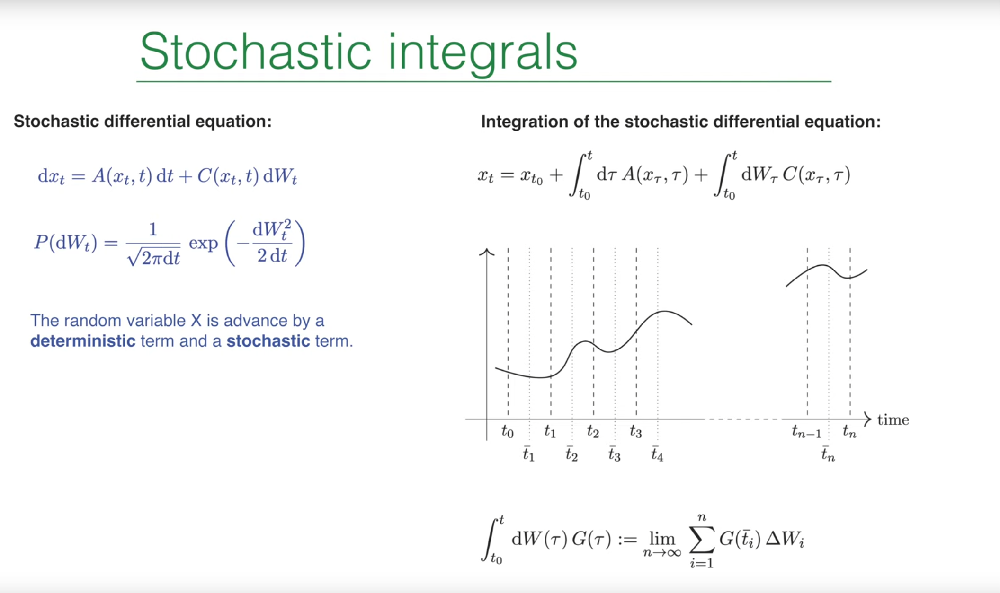
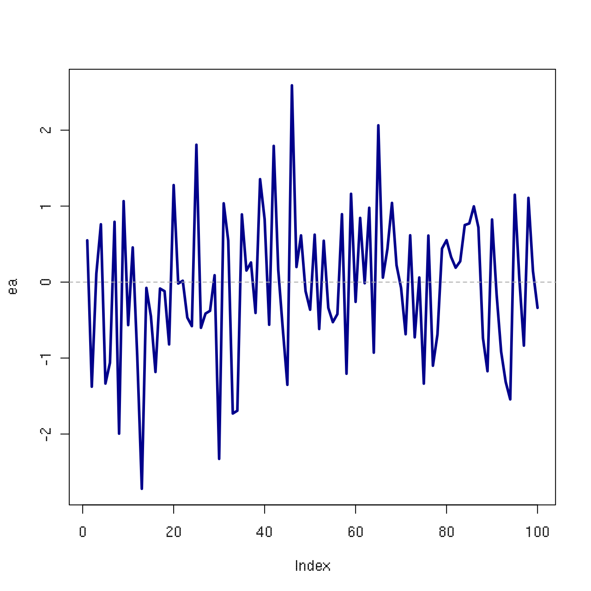
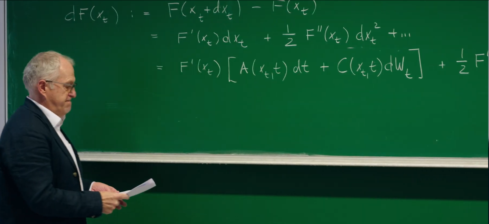
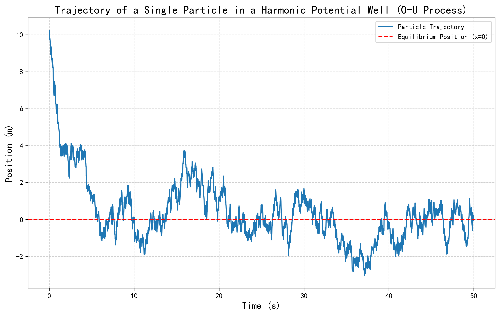
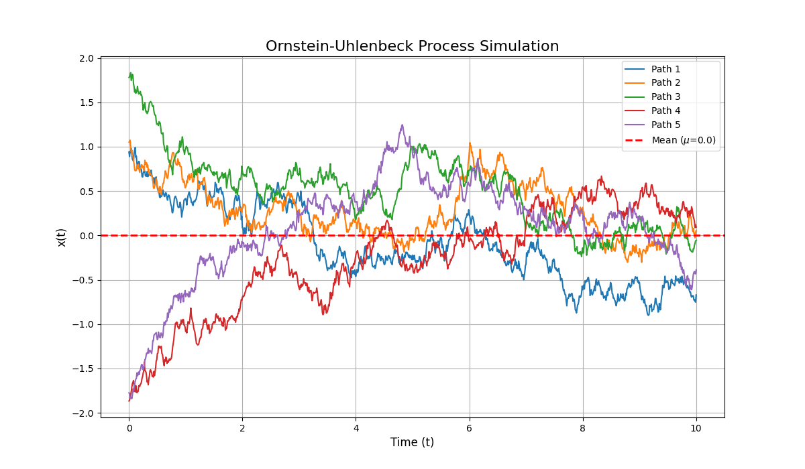
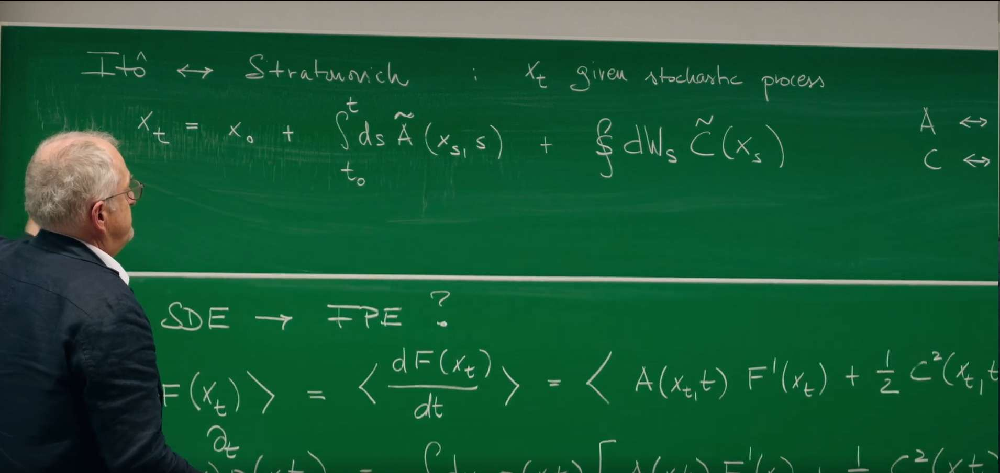
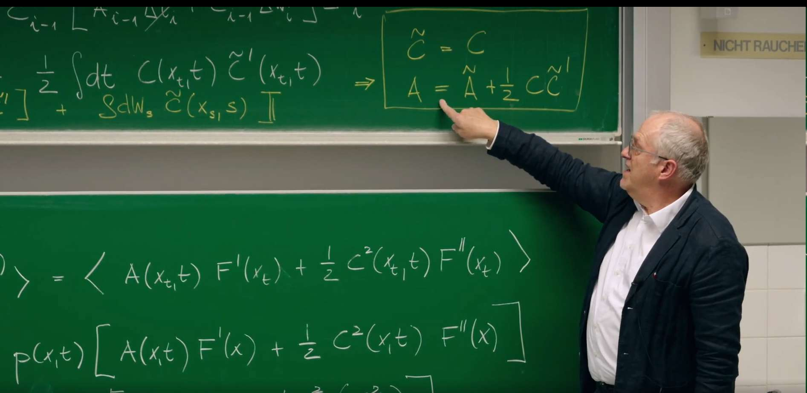
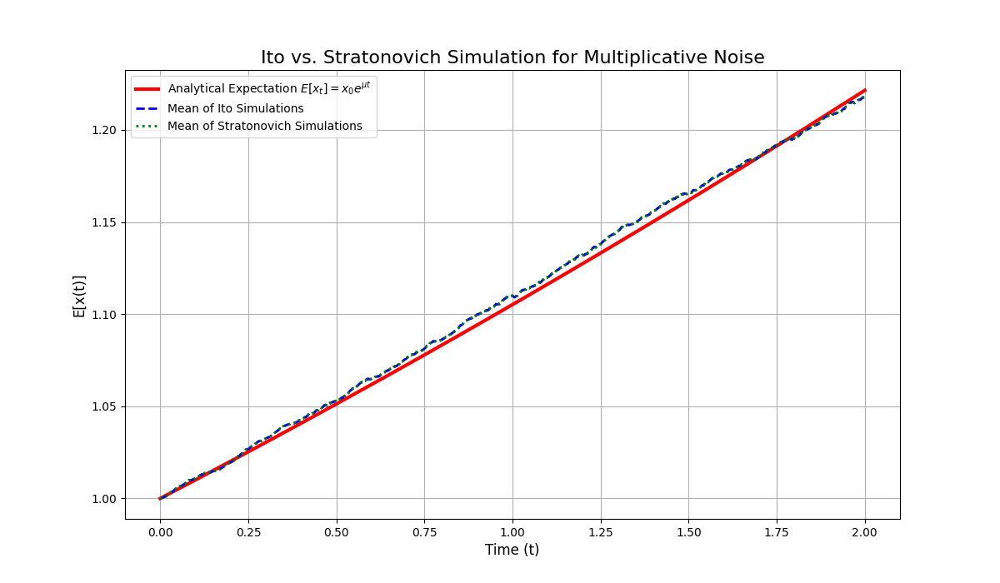
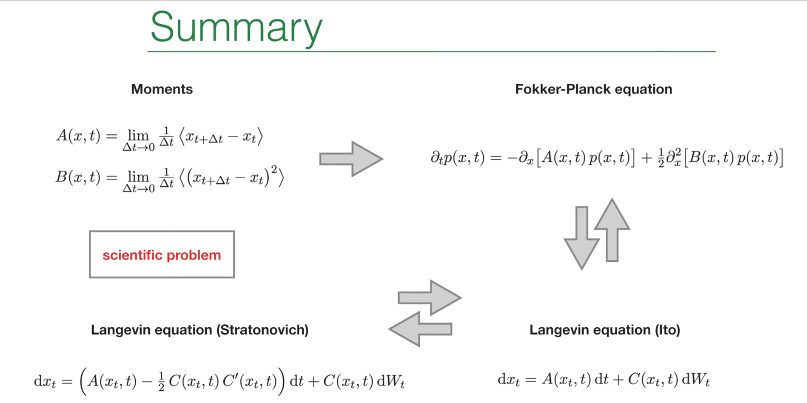

# Introduction

In the previous lecture (Lecture 20), Prof. Erwin Frey formally introduced stochastic differential equations (SDEs) as a powerful tool for describing the dynamics of systems influenced by random noise. We completed the transition from the physically intuitive but mathematically informal Langevin equation to the more rigorous SDE formulation, with the core being the replacement of the singular white noise $\xi(t)$ with its integral—the well-behaved **Wiener process $W(t)$**. **However, this also left us with an unresolved central question: how do we integrate terms involving the random increment $dW_t$? We glimpsed the wonder of stochastic calculus, namely $(dW_t)^2 = dt$, which foreshadows that it will follow a set of rules fundamentally different from classical calculus.**

This lecture will further introduce the core mathematical tool mentioned in the previous section—**Ito calculus**. This lecture will start from the ambiguity in defining stochastic integrals mentioned in the previous lecture and precisely establish a calculus system suitable for stochastic processes. Ito's formula plays a role in stochastic calculus comparable to the chain rule in classical calculus and reveals how randomness introduces an additional "correction term."

Furthermore, using this powerful tool, this lecture will establish a bridge from microscopic random trajectories (Ito SDEs) to macroscopic probability evolution (Fokker-Planck equation). Finally, the previous lecture briefly mentioned two types of stochastic integrals—Ito integral and Stratonovich integral. This lecture will provide a detailed understanding of their physical background differences and clarify the precise conversion relationship between them.

# 1. Recap: SDEs and the Ito Integral



In the previous lectures, we learned how to describe the evolution of a random variable $x_t$. The core idea is that within a small time step $dt$, the change $dx_t$ of $x_t$ consists of two parts: a deterministic, predictable drift term and a random, unpredictable diffusion term. The most general language for describing such processes is a one-dimensional stochastic differential equation (SDE):

$$
dx_t = A(x_t, t)dt + C(x_t, t)dW_t
$$

This equation describes the evolution of a random variable $x_t$ within an infinitesimal time step $dt$.

* **Drift Term**: $A(x_t, t)dt$ represents the deterministic evolution part of the system. $A(x_t, t)$ can be understood as the average velocity or "force" that a particle experiences when it is at position $x$ at time $t$.

* **Diffusion Term**: $C(x_t, t)dW_t$ represents the random evolution part of the system. $C(x_t, t)$ is the diffusion coefficient or noise intensity, which determines the magnitude of random fluctuations.

* **Wiener Process Increment**: $dW_t$ is the infinitesimal increment of the Wiener process, which is a mathematical modeling of Brownian motion. $dW_t$ itself is a random variable following a Gaussian distribution with mean 0 and variance $dt$:

$$
P(dW_t) = \frac{1}{\sqrt{2\pi dt}} \exp\left(-\frac{dW_t^2}{2dt}\right)
$$

## 1.1 Integral form and definition of the Ito integral

**The rules of classical calculus, such as the chain rule, fail when dealing with the "rough" or "jagged" paths of stochastic processes. These paths, typified by the Wiener process, are continuous everywhere but nowhere differentiable.** This unique mathematical property requires us to develop a completely new calculus framework—Ito calculus.

It should be emphasized that the differential form of SDEs is mathematically just a convenient notation. Since **the paths of the Wiener process are nowhere differentiable**, the expression "$dW_t/dt$" has no rigorous definition. Therefore, the rigorous definition of SDEs is their corresponding integral form:

$$
x_t = x_{t_0} + \int_{t_0}^{t} d\tau A(x_\tau, \tau) + \int_{t_0}^{t} C(x_\tau, \tau) dW_\tau
$$

where the first integral is a standard Riemann integral, while the second integral—the stochastic integral—requires special care in its definition. According to the professor's definition on the PPT, this integral is defined as the limit of a discrete sum:

$$
\int_{t_0}^{t} G(\tau) dW(\tau) := \lim_{n\rightarrow\infty} \sum_{i=1}^{n} G(\bar{t}_i) \Delta W_i
$$

Here, the time interval $[t_0, t]$ is divided into $n$ subintervals, and $\Delta W_i = W(t_i) - W(t_{i-1})$ is the Wiener process increment in the $i$-th interval.

## 1.2 Ito convention: non-anticipative integration

The value of the stochastic integral depends on where the integrand $G(\tau)$ is sampled in each subinterval $[\tilde{t}_i]$. Different sampling conventions lead to different types of stochastic integrals. The default convention adopted in class is the **Ito convention**, which samples at the **left endpoint** of each time interval, $\tilde{t}_i = t_{i-1}$.

$$
\int_{t_0}^{t} G(\tau) dW(\tau) := \lim_{n\rightarrow\infty} \sum_{i=1}^{n} G(t_{i-1}) \Delta W_i
$$

This choice has profound physical and mathematical significance: it embodies the **non-anticipativity principle**. At time $t_{i-1}$, we determine our weight for the future random "kick" $\Delta W_i$ based on the current state of the system $G(t_{i-1})$. The system state at time $t_{i-1}$ cannot "anticipate" the random fluctuations that will occur in the interval $(t_{i-1}, t_i]$. This property makes the Ito integral a **martingale**, meaning the expectation of the integral is zero, which is an extremely important property in financial mathematics and many physical applications.

**Martingale**, originally referring to a class of betting strategies popular in 18th-century France, describes random processes like "fair gambling"—the future average result always equals the present value. For example, in coin flipping, your average return won't change in the long run. This "unbiased" property is used in finance to analyze stock prices or option pricing. Martingale theory is a core concept in probability theory and stochastic processes, used to describe **random processes whose future expectations are independent of current information**. Mathematically, a random process $\{X_t\}$ is called a martingale if it satisfies the following conditions:
1. **Adaptedness**: The value of $X_t$ depends only on current and past information (i.e., $\mathcal{F}_t$-measurable).
2. **Expectation conservation**: Given the information at current time $t$, the expectation at any future time $s > t$ equals the current value, i.e., $\mathbb{E}[X_s \mid \mathcal{F}_t] = X_t$.



This property embodies **non-anticipativity**: the future behavior of a martingale cannot be predicted through current or past information, and its expectation remains constant. For example, in Ito integrals, the stochastic integral $\int_{t_0}^t G(\tau) dW_\tau$ is a martingale with zero expectation, reflecting the unbiased nature of Brownian motion (Wiener process). Martingales are particularly important in financial mathematics, often used to model fair games or arbitrage-free market price dynamics.

# 2. Ito Calculus: New Rules for a Random World

The chain rule in classical calculus tells us that if $x(t)$ is a differentiable function, then $dF(x(t)) = F'(x)dx$. However, for stochastic processes $x_t$ described by SDEs, due to the "rough" and non-differentiable nature of their paths, this simple rule no longer holds. We need a new rule to handle functions of random variables, which is Ito's formula.

Ito calculus was developed by Japanese mathematician Kiyoshi Ito in the 1940s, initially to describe the random path properties of **Brownian motion** (Wiener process). Its core lies in defining **stochastic integrals** (such as $\int G(t) dW_t$) by sampling at the **left endpoint** of time intervals (Ito convention), avoiding "anticipation" of future random fluctuations, thus constructing a rigorous mathematical framework for stochastic differential equations (SDEs). Its physical essence is **non-anticipativity**: the system state at any moment depends only on current information and cannot be predicted through past or future, making Ito integrals **martingales** (expectation conservation), reflecting the unbiased nature of random processes in nature and financial systems. Specific applications include: **financial mathematics** (option pricing, risk hedging), **quantum mechanics** (path integral formulation), **biostatistics** (population dynamics modeling), **engineering control** (system stability analysis in noisy environments), etc., providing mathematical tools for handling "rough" random paths and becoming the cornerstone of modern stochastic analysis.

## 2.1 Deriving Ito's Formula



Our goal is to calculate the infinitesimal change $dF(x_t)$ of an arbitrary (sufficiently smooth) function $F(x_t)$ of the random variable $x_t$. We start with the Taylor expansion of $F(x_t)$, as demonstrated by the professor on the blackboard:

$$
dF(x_t) = F(x_t + dx_t) - F(x_t) = F'(x_t)dx_t + \frac{1}{2}F''(x_t)dx_t^2 + O(dx_t^3)
$$

Next, we substitute the SDE expression $dx_t = A dt + C dW_t$ into the above equation:

$$
dF(x_t) = F'(x_t)(A dt + C dW_t) + \frac{1}{2}F''(x_t)(A dt + C dW_t)^2 + \cdots
$$

Expanding the squared term:

$$
(A dt + C dW_t)^2 = A^2(dt)^2 + 2AC(dt dW_t) + C^2(dW_t)^2
$$

## 2.2 Stochastic calculus multiplication rules and the core identity $dW_t^2 = dt$

To simplify the above expression, we need to determine the order of magnitude of various infinitesimal quantities. Based on the properties of the Wiener process, namely that its standard deviation is proportional to the square root of time ($\Delta W \sim \sqrt{\Delta t}$), we can establish a set of "stochastic multiplication rules":

* $(dt)^2 \sim O(dt^2)$: can be ignored.
* $dt dW_t \sim O(dt^{3/2})$: can be ignored.
* $(dW_t)^2 \sim O(dt)$: **cannot be ignored**.

**The third rule is the most counterintuitive but also the most central conclusion in stochastic calculus.** It shows that the square of Wiener process increments, in the infinitesimal limit, no longer behaves randomly but acts like a deterministic quantity $dt$.

This conclusion is not a wild guess but can be proven in the strict **mean-square limit** sense. Consider the discrete sum $\sum_i (\Delta W_i^2 - \Delta t_i)$. We want to prove that as the time step approaches zero, the fluctuations of this sum also approach zero. For this purpose, we calculate its variance, which is the quantity $\Delta I$ defined by the professor on the blackboard:

$$
\Delta I := \lim_{n\rightarrow\infty} \left\langle \left( \sum_i G_{i-1}^2 (\Delta W_i^2 - \Delta t_i) \right)^2 \right\rangle
$$

Expanding the squared term, we get diagonal terms ($i=j$) and off-diagonal terms ($i \neq j$). Since Wiener increments from different time intervals are independent (i.e., $\langle \Delta W_i \Delta W_j \rangle = 0$ for $i \neq j$), the expectations of all cross terms are zero. Therefore, only the sum of diagonal terms remains:

$$
\Delta I = \lim_{n \to \infty} \sum_i \left\langle G_{i-1}^2 (\Delta W_i^2 - \Delta t_i)^2 \right\rangle
$$

Expanding the square inside the brackets and using the moment properties of Wiener process increments ($\langle \Delta W_i^2 \rangle = \Delta t_i$ and $\langle \Delta W_i^4 \rangle = 3(\Delta t_i)^2$), we get:

$$
\langle (\Delta W_i^2 - \Delta t_i)^2 \rangle = \langle \Delta W_i^4 \rangle - 2\Delta t_i \langle \Delta W_i^2 \rangle + (\Delta t_i)^2 = 3(\Delta t_i)^2 - 2(\Delta t_i)^2 + (\Delta t_i)^2 = 2(\Delta t_i)^2
$$

Substituting into the expression for $\Delta I$:

$$
\Delta I = \lim_{n\rightarrow\infty} \sum_i \langle G_{i-1}^2 \rangle \cdot 2(\Delta t_i)^2
$$

Assuming $G$ is bounded and the time steps are uniform $\Delta t_i = t/n$, then:

$$
\Delta I \leq 2G_{\text{bound}}^2 \lim_{n \to \infty} \sum_{i=1}^{n} \left( \frac{t}{n} \right)^2 = 2G_{\text{bound}}^2 \lim_{n \to \infty} n \left( \frac{t^2}{n^2} \right) = 2G_{\text{bound}}^2 \lim_{n \to \infty} \frac{t^2}{n} \to 0
$$

The variance approaches zero, which means that in the mean-square sense, the stochastic integral $\int G(\tau) dW_\tau^2$ is equivalent to the ordinary integral $\int G(\tau) d\tau$. This provides a rigorous mathematical foundation for our core identity:

$$
dW_t^2 = dt
$$

**Physical meaning**: This identity is a manifestation of the **finite quadratic variation** of the Wiener process. An ordinary Brownian particle has zero expected displacement, but the expectation of its displacement squared (proportional to variance) grows linearly with time, i.e., $\langle (\Delta x)^2 \rangle \propto \Delta t$. The relationship $dW_t^2 = dt$ elevates this macroscopic statistical property to the level of calculus rules. It tells us that although the particle's path is random, its "accumulated squared fluctuations" grow in a deterministic, predictable way over time.

## 2.3 The final form of Ito's formula

Substituting $dW_t^2 = dt$ and the rule that other higher-order terms are zero into the expansion of $dF(x_t)$, we obtain the final **Ito's formula** (also called Ito's lemma):

$$
dF(x_t) = \left[ A(x_t, t) F'(x_t) + \frac{1}{2} C^2(x_t, t) F''(x_t) \right] dt + C(x_t, t) F'(x_t) dW_t
$$

Compared to the chain rule in classical calculus, we find an additional term $\frac{1}{2} C^2 F'' dt$. This term is called the **Ito correction term**.

**Physical meaning**: This correction term is entirely generated by noise. It is a deterministic drift term whose magnitude depends on the noise intensity ($C^2$) and the curvature of the function $F(x)$ ($F''$). Intuitively, if the function is convex ($F'' > 0$, like a bowl), then random fluctuations will cause the expectation of $F(x_t)$ to systematically drift upward; conversely, if the function is concave ($F'' < 0$), noise will cause its expectation to drift downward. This can be analogized to **Jensen's inequality**. Ito's formula precisely quantifies this effective drift produced by the interaction between noise and nonlinear functions.

# 3. Application: From Single Trajectories to Probability Dynamics

One of the most powerful applications of Ito's formula is to establish a bridge between microscopic SDE descriptions and macroscopic probability density evolution equations (i.e., the Fokker-Planck equation).

## 3.1 Deriving the Fokker-Planck equation from an Ito SDE

**Our goal is to derive a partial differential equation describing how the probability density function $p(x, t)$ evolves over time. For this purpose, we examine the time evolution of the expectation value of an arbitrary smooth test function $F(x)$.**

First, write the derivative of the expectation value:

$$
\frac{d}{dt}\langle F(x_t) \rangle = \left\langle \frac{d}{dt} F(x_t) \right\rangle
$$

Here, we substitute the differential form of Ito's formula into the expectation value. The $dt$ part of Ito's formula gives the deterministic evolution, while the $dW_t$ part is random.

$$
\frac{d}{dt}\langle F(x_t) \rangle = \left\langle A(x_t, t) F'(x_t) + \frac{1}{2} C^2(x_t, t) F''(x_t) \right\rangle + \left\langle C(x_t, t) F'(x_t) \frac{dW_t}{dt} \right\rangle
$$

Due to the non-anticipativity of Ito integrals, the system state $x_t$ at time $t$ is uncorrelated with the subsequent Wiener increment $dW_t$, and $\langle dW_t \rangle = 0$. Therefore, the expectation of the random term is zero:

$$
\left\langle C(x_t, t) F'(x_t) dW_t \right\rangle = 0
$$

Thus, the evolution of the expectation value is entirely determined by the deterministic term:

$$
\frac{d}{dt}\langle F(x_t) \rangle = \left\langle A(x_t, t) F'(x_t) + \frac{1}{2} C^2(x_t, t) F''(x_t) \right\rangle
$$

Now, we express the expectation value in terms of the probability density $p(x, t)$:

$$
\int dx F(x) \frac{\partial p(x, t)}{\partial t} = \int dx p(x, t) \left[ A(x, t) F'(x) + \frac{1}{2} C^2(x, t) F''(x) \right]
$$

To obtain the equation for $p(x, t)$, we need to transfer the derivatives from the test function $F(x)$ to $p(x, t)$ on the right side. This can be achieved through **integration by parts**. Assuming good boundary conditions at infinity ($p(x, t)$ and its derivatives tend to zero).

Performing integration by parts on the first term:

$$
\int dx p(x, t) A(x, t) F'(x) = [pAF]_{-\infty}^{\infty} - \int dx F(x) \frac{\partial}{\partial x} [A(x, t) p(x, t)] = -\int dx F(x) \frac{\partial}{\partial x} [Ap]
$$

Performing integration by parts twice on the second term:

$$
\frac{1}{2} \int dx p C^2 F'' = \frac{1}{2} ([pC^2F']_{-\infty}^{\infty} - \int dx F' \frac{\partial}{\partial x} [pC^2]) = -\frac{1}{2} \int dx F' \frac{\partial}{\partial x} [pC^2]
$$

$$
= -\frac{1}{2} ([F \frac{\partial}{\partial x} [pC^2]]_{-\infty}^{\infty} - \int dx F \frac{\partial^2}{\partial x^2} [pC^2]) = \frac{1}{2} \int dx F(x) \frac{\partial^2}{\partial x^2} [C^2(x, t) p(x, t)]
$$

Substituting the results after integration by parts back into the original equation:

$$
\int dx F(x) \frac{\partial p(x, t)}{\partial t} = \int dx F(x) \left[ -\frac{\partial}{\partial x}(A p) + \frac{1}{2} \frac{\partial^2}{\partial x^2}(C^2 p) \right]
$$

Since this equality holds for arbitrary test functions $F(x)$, the integrands under the two integral signs must be equal. Thus, we obtain the long-awaited **Fokker-Planck equation (FPE)**:

$$
\frac{\partial p(x, t)}{\partial t} = -\frac{\partial}{\partial x}[A(x, t) p(x, t)] + \frac{1}{2} \frac{\partial^2}{\partial x^2}[C^2(x, t) p(x, t)]
$$

This equation is a continuity equation for probability density, describing how the probability "fluid" drifts and diffuses in state space. The drift flux is $J_{\text{drift}} = Ap$, and the diffusive flux is $J_{\text{diff}} = -\frac{1}{2} \frac{\partial}{\partial x}(C^2 p)$.

## 3.2 Python simulation: Visualization of the Ornstein-Uhlenbeck process

Recall that in **Lecture 12: Brownian Motion and O-U Process**, we simulated a single confined particle **Ornstein-Uhlenbeck process (OU process)**, which is a very important model in both physics and finance: it describes a Brownian particle moving in a harmonic oscillator potential well and affected by thermal noise, with the SDE:

$$
dx_t = -\theta (x_t - \mu) dt + \sigma dW_t
$$

where $\theta > 0$ is the reversion rate (determining how fast the system reverts to the mean), $\mu$ is the long-term mean (center of the potential well), and $\sigma$ is the noise intensity.



To deepen our understanding, this lecture we can use the **Euler-Maruyama method** to numerically simulate this Ito SDE with multiple particles. This is the most direct discretization of SDEs:

$$
x_{i+1} = x_i - \theta (x_i - \mu) \Delta t + \sigma \sqrt{\Delta t} \cdot Z_i
$$

where $\Delta t$ is the time step and $Z_i$ are independent random numbers drawn from the standard normal distribution $N(0,1)$.

The following Python code simulates multiple OU process trajectories, showing how they start from different initial positions and eventually fluctuate around the mean $\mu$.

```python
import numpy as np
import matplotlib.pyplot as plt

# --- Parameter definition ---
theta = 0.5  # Reversion rate
mu = 0.0     # Long-term mean
sigma = 0.4  # Noise intensity
dt = 0.01    # Time step
T = 10.0     # Total time
n = int(T / dt) # Total steps
num_paths = 5 # Number of simulated trajectories

# --- Simulation process ---
x = np.zeros((num_paths, n + 1))
x[:, 0] = np.random.uniform(-2, 2, num_paths) # Random initial positions

# Generate all random numbers
Z = np.random.randn(num_paths, n)

for i in range(n):
    # Euler-Maruyama method
    dW = np.sqrt(dt) * Z[:, i]
    dx = -theta * (x[:, i] - mu) * dt + sigma * dW
    x[:, i+1] = x[:, i] + dx

# --- Plotting ---
t = np.linspace(0, T, n + 1)
plt.figure(figsize=(12, 7))

for i in range(num_paths):
    plt.plot(t, x[i, :], lw=1.5, label=f'Path {i+1}')

plt.axhline(mu, color='r', linestyle='--', lw=2, label=f'Mean ($\\mu$={mu})')
plt.title("Ornstein-Uhlenbeck Process Simulation", fontsize=16)
plt.xlabel("Time (t)", fontsize=12)
plt.ylabel("x(t)", fontsize=12)
plt.grid(True)
plt.legend()
plt.show()
```



Regardless of the initial position, all trajectories tend to fluctuate around the mean $\mu$, with the amplitude of fluctuations determined by $\sigma$.

# 4. The Ito-Stratonovich Debate: A Tale of Two Integrals

In the previous section, we briefly introduced two integration conventions and made a comparison table. So far, we have been using the Ito convention to define stochastic integrals. However, we know this is not the only choice. Another convention widely used in physics is the **Stratonovich convention**. These two conventions reflect different philosophical approaches to modeling stochastic processes, and understanding their relationship is crucial.

| Property | Ito Integral | Stratonovich Integral |
|------|-------------------------|-------------------------------------------|
| Summation sampling point | Left endpoint: $t_{i-1}$ | Midpoint: $(t_{i}+t_{i-1})/2$ |
| Chain rule | Modified chain rule (Ito's lemma) | Follows classical chain rule |
| Martingale property | $\int C(x_{t})dW_{t}$ is a martingale | Not necessarily a martingale |
| Physical modeling | Idealized white noise; non-anticipative systems (e.g., finance) | Limit of colored noise with finite correlation time (e.g., physics) |
| F-P equation drift term | $A(x)+\frac{1}{2} C(x)C^{\prime}(x)$ | $A(x)$ |
| Numerical scheme | Euler-Maruyama method | Euler-Heun method / Milstein method |

## 4.1 Definition and physical motivation of the Stratonovich integral

The definition of the Stratonovich stochastic integral is very similar to the Ito integral, with the only difference being the sampling point of the integrand. It chooses to sample at the **midpoint** of the time interval:

$$
\int C(x_t) \circ dW_t := \lim_{n\rightarrow\infty} \sum_{i=1}^{n} C\left(\frac{x_i + x_{i-1}}{2}\right) \Delta W_i
$$

(The $\circ$ symbol here is a common notation used to distinguish Stratonovich integrals).

**Physical motivation**: Why do physicists often prefer Stratonovich integrals? The reason is that many physical systems are not driven by ideal "white noise" (i.e., completely uncorrelated in time), but by "colored noise" with a very small but finite correlation time. When we derive the corresponding SDE by taking the limit of correlation time approaching zero for a physical process driven by colored noise, the natural result is the Stratonovich form of SDE.

More importantly, Stratonovich calculus **preserves the chain rule of classical calculus**. That is, if $x_t$ is a Stratonovich process, then $dF(x_t) = F'(x_t) \circ dx_t$, which is formally identical to classical calculus. This makes it more intuitive when building models based on classical mechanics or thermodynamic principles.

## 4.2 Deriving the conversion relationship between the two formulations

Since the same physical process can be described in two different mathematical languages, there must be a "translation dictionary" between these two languages. Now, let's derive this conversion formula, following the professor's blackboard derivation strictly.



We start from the discrete sum of the Stratonovich integral:

$$
\sum_i C\left(\frac{x_i + x_{i-1}}{2}\right) \Delta W_i = \sum_i C\left(x_{i-1} + \frac{1}{2}\Delta x_i\right) \Delta W_i
$$

We perform a Taylor expansion of the integrand $C$ around the left endpoint $x_{i-1}$:

$$
C\left(x_{i-1} + \frac{1}{2}\Delta x_i\right) \approx C(x_{i-1}) + \frac{1}{2} C'(x_{i-1}) \Delta x_i
$$

Substituting the expansion back into the sum, we get two terms:

$$
\sum_i C(x_{i-1}) \Delta W_i + \frac{1}{2} \sum_i C'(x_{i-1}) \Delta x_i \Delta W_i
$$

* The first term $\sum_i C(x_{i-1}) \Delta W_i$ is exactly the definition of the **Ito integral**.

* The second term is the key to the difference between the two. We substitute the discrete form of the Ito SDE $\Delta x_i = A_{i-1} \Delta t_i + C_{i-1} \Delta W_i$ into the second term:

$$
\frac{1}{2} \sum_i C'_{i-1} (A_{i-1} \Delta t_i + C_{i-1} \Delta W_i) \Delta W_i = \frac{1}{2} \sum_i (C'_{i-1} A_{i-1} \Delta t_i \Delta W_i + C'_{i-1} C_{i-1} (\Delta W_i)^2)
$$

In the limit $n\rightarrow\infty$, the $\Delta t_i \Delta W_i$ term is a higher-order infinitesimal and will vanish. The $(\Delta W_i)^2$ term, according to our previously proven core identity, becomes $\Delta t_i$. Therefore, the second term converges to an ordinary Riemann integral:

$$
\lim_{n\rightarrow\infty} \frac{1}{2} \sum_i C'_{i-1} C_{i-1} \Delta t_i = \frac{1}{2} \int C(x_t) C'(x_t) dt
$$

## 4.3 The final conversion formula

Combining the above derivation, we obtain the conversion relationship between Ito and Stratonovich integrals:

$$
\text{(Stratonovich)} \int C(x_s) \circ dW_s = \text{(Ito)} \int C(x_s) dW_s + \frac{1}{2} \int dt \, C(x_t) C'(x_t)
$$

This integral relationship directly leads to the conversion rule between the two SDE formulations. Suppose a physical process can be described by a Stratonovich SDE as:

$$
dx_t = \tilde{A}(x_t, t) dt + C(x_t, t) \circ dW_t
$$

Then, the completely equivalent Ito SDE is:

$$
dx_t = A(x_t, t) dt + C(x_t, t) dW_t
$$

where the diffusion coefficient $C$ remains unchanged, while the drift coefficients are related as follows:

$$
A_{\text{Ito}} = A_{\text{Strat}} + \frac{1}{2} C(x_t, t) C'(x_t, t)
$$

**This relationship is one of the core achievements of this lecture. It shows that the Ito formulation of SDEs contains an additional "noise-induced drift" or "spurious drift" in the drift term. The appearance of this drift term is precisely to compensate for the correlation between the integrand and noise increments that is ignored in the Ito integral definition.**



## 4.4 Python simulation: Differences under multiplicative noise

When the noise intensity $C(x_t, t)$ depends on the system state $x_t$ (i.e., so-called **multiplicative noise**), the differences between Ito and Stratonovich formulations become crucial. We use geometric Brownian motion as an example, which is the standard model for simulating stock prices in finance:

$$
dx_t = \mu x_t dt + \sigma x_t dW_t \quad \text{(Ito)}
$$

The corresponding Stratonovich form is (using the conversion formula $A_{\text{Strat}} = A_{\text{Ito}} - \frac{1}{2} C C'$, where $C = \sigma x$, $C' = \sigma$):

$$
dx_t = (\mu - \frac{1}{2} \sigma^2) x_t dt + \sigma x_t \circ dW_t \quad \text{(Stratonovich)}
$$

The exact solution of this SDE is $x_t = x_0 \exp((\mu - \frac{1}{2} \sigma^2) t + \sigma W_t)$. Its expectation is $E[x_t] = x_0 e^{\mu t}$.

The following code will use two numerical methods to simulate this process and compare with the analytical expectation:

1. **Ito simulation**: Using the standard Euler-Maruyama method.

2. **Stratonovich simulation**: Using a simple predictor-corrector scheme (Heun method) to approximate the midpoint rule.

```python
import numpy as np
import matplotlib.pyplot as plt

# --- Parameter definition ---
mu = 0.1      # True drift rate
sigma = 0.3   # Volatility
x0 = 1.0      # Initial value
dt = 0.001    # Time step
T = 2.0       # Total time
n = int(T / dt) # Total steps
num_paths = 5000 # Simulate large number of trajectories to calculate expected values

# --- Simulation process ---
x_ito = np.zeros((num_paths, n + 1))
x_strat = np.zeros((num_paths, n + 1))
x_ito[:, 0] = x0
x_strat[:, 0] = x0

# Generate all random numbers
Z = np.random.randn(num_paths, n)
dW = np.sqrt(dt) * Z

# Drift coefficient
A_ito = mu
A_strat = mu - 0.5 * sigma**2

for i in range(n):
    # 1. Ito Simulation (Euler-Maruyama)
    x_ito[:, i+1] = x_ito[:, i] + A_ito * x_ito[:, i] * dt + sigma * x_ito[:, i] * dW[:, i]

    # 2. Stratonovich Simulation (Heun's method)
    # Predictor step
    x_pred = x_strat[:, i] + A_strat * x_strat[:, i] * dt + sigma * x_strat[:, i] * dW[:, i]
    # Corrector step using midpoint approximation
    C_mid = sigma * (x_strat[:, i] + x_pred) / 2.0
    x_strat[:, i+1] = x_strat[:, i] + A_strat * x_strat[:, i] * dt + C_mid * dW[:, i]


# --- Calculate expected values and plot ---
t = np.linspace(0, T, n + 1)
expected_x_ito = np.mean(x_ito, axis=0)
expected_x_strat = np.mean(x_strat, axis=0)
analytical_expected_x = x0 * np.exp(mu * t)

plt.figure(figsize=(12, 7))
plt.plot(t, analytical_expected_x, 'r-', lw=3, label='Analytical Expectation $E[x_t]=x_0 e^{\\mu t}$')
plt.plot(t, expected_x_ito, 'b--', lw=2, label='Mean of Ito Simulations')
plt.plot(t, expected_x_strat, 'g:', lw=2, label='Mean of Stratonovich Simulations')

plt.title("Ito vs. Stratonovich Simulation for Multiplicative Noise", fontsize=16)
plt.xlabel("Time (t)", fontsize=12)
plt.ylabel("E[x(t)]", fontsize=12)
plt.grid(True)
plt.legend()
plt.show()
```



Both numerical methods correctly converge to the analytical expectation $x_0 e^{\mu t}$. This strongly proves that as long as we choose a **numerical integration scheme that matches the given SDE form** (Ito or Stratonovich), both are completely equivalent languages describing the same physical reality.

**If we mistakenly use the Euler-Maruyama method (an Ito scheme) for a Stratonovich-form SDE, we will get the wrong expected value evolution trajectory. This practical example ultimately emphasizes the extreme importance of understanding and correctly applying Ito-Stratonovich conversion rules (which will be further emphasized in the next subsection).**

# Summary: A Unified Stochastic Process Framework

Finally, Prof. Erwin Frey integrates the core content of this lecture and the previous lectures to construct a **unified theoretical framework** for describing one-dimensional stochastic processes. This framework includes four mathematically equivalent but physically different formulations and reveals their precise conversion relationships, connecting three different levels of description of a stochastic process—microscopic moments, macroscopic probability evolution, and mesoscopic trajectory dynamics.



## Starting point: From "scientific problems" to measurable "moments"

The construction of theory often begins with a specific **"scientific problem"**. This could be an experimental observation (such as tracking a single colloidal particle's Brownian motion), a computer simulation (such as molecular dynamics simulation), or a microscopic theoretical model. Facing these complex, stochastic data or trajectories, the first step is to extract their most essential statistical characteristics, i.e., **"moments"**.

**Drift coefficient**: $A(x, t) = \lim_{\Delta t \to 0} \frac{1}{\Delta t} \langle x_{t+\Delta t} - x_t \rangle$.

**Physical meaning**: The drift coefficient $A$ describes the **average, deterministic displacement** that the system experiences per unit time. It represents the combined effect of all deterministic "forces" acting on the particle, such as forces from external potential fields, friction, etc. At the macroscopic level, it determines the overall motion direction and speed of the **particle ensemble (probability cloud)**.

**Diffusion coefficient**: $B(x, t) = \lim_{\Delta t \to 0} \frac{1}{\Delta t} \langle (x_{t+\Delta t} - x_t)^2 \rangle$.

**Physical meaning**: The diffusion coefficient $B$ describes the **mean squared displacement** of the system per unit time, quantifying the intensity of random fluctuations. It represents the intensity of random "kicks" produced by countless microscopic collisions from the environment (such as a thermal bath). At the macroscopic level, it determines the speed at which the probability cloud diffuses and spreads.

Drift and diffusion are the most fundamental macroscopic dynamic parameters extracted from microscopic randomness, serving as a bridge connecting microscopic trajectories with macroscopic statistical laws.

## From moments to macroscopic evolution: The Fokker-Planck equation

Once we determine the drift coefficient $A$ and diffusion coefficient $B$ through experiments or microscopic models, we can immediately write down the macroscopic dynamic equation describing the evolution of the entire system's probability density $p(x,t)$—the **Fokker-Planck equation (FPE)**.

$$
\partial_t p(x,t) = -\partial_x [A(x, t) p(x, t)] + \frac{1}{2} \partial_x^2 [B(x, t) p(x, t)]
$$

**Physical process and meaning**: The Fokker-Planck equation is a **continuity equation describing probability conservation**. It depicts a picture of "probability fluid" flowing in phase space:

**Drift term** $-\partial_x [A p]$ acts like an **advection term**, describing how the center of the probability cloud is pushed by the deterministic drift force $A$.

**Diffusion term** $\frac{1}{2} \partial_x^2 [Bp]$ acts like a **diffusion term**, describing how the probability cloud continuously spreads and disperses due to random fluctuations $B$.

The FPE itself is a **deterministic** partial differential equation. It perfectly illustrates the core idea of statistical physics: although individual particle trajectories are unpredictable, the probability evolution laws of ensembles composed of many particles are completely deterministic. This is a perspective shift from the random growth of "a single tree" to the deterministic transformation of "an entire forest".

## From macroscopic evolution to microscopic trajectories: Equivalent Langevin equations

The macroscopic probability evolution described by the Fokker-Planck equation must correspond to a microscopic, single-particle level random dynamics. This microscopic dynamics is precisely described by the **Langevin equation**, which is the **stochastic differential equation (SDE)** we learned in this lecture. The FPE and SDE are completely equivalent and can be derived from each other.

**Ito formulation**:

$$
dx_t = A(x_t, t) dt + C(x_t, t) dW_t
$$

Here, the noise amplitude $C(x,t)$ has a direct relationship with the diffusion coefficient in the FPE: $B(x,t) = C^2(x,t)$. This form directly corresponds to the coefficients $A$ and $B$ of the FPE, and due to its excellent mathematical properties (martingale property), it becomes the preferred choice for theoretical analysis and numerical simulation (such as the Euler-Maruyama method).

**Stratonovich formulation**:

$$
dx_t = \left(A(x_t, t) - \frac{1}{2} C(x_t, t) C'(x_t, t) \right) dt + C(x_t, t) \circ dW_t
$$

(Note: The $dW_t$ in the PPT should be understood as $\circ dW_t$ here)

This form describes the **exactly same** physical process but adopts different mathematical conventions.

**Physical process and meaning**: The charm of the Stratonovich formulation lies in that it follows the chain rule of classical calculus. It is often considered more "physical" because it can be strictly proven to be the correct mathematical form obtained when a physical system driven by "colored noise" with extremely short but non-zero correlation time takes the limit of correlation time approaching zero. To maintain the elegant form of classical calculus rules, it must **explicitly absorb the correction effects** produced by the $(dW_t)^2=dt$ rule in the Ito formulation **into the drift term**. This correction term $-\frac{1}{2}CC'$ is precisely the reverse embodiment of the Ito drift we derived earlier. It is not a real physical force but the "price" paid for translation between different mathematical languages.

## The unified stochastic process framework

The **connectivity and equivalence** revealed by this summary diagram tells us that when facing a stochastic dynamics problem, we can freely switch between four equivalent descriptive levels according to our needs:

1. Starting from **experimental data**, calculate the **moments** $A$ and $B$.

2. With the moments, we can construct the **FPE** to analyze the evolution, steady state, and relaxation times of probability distributions at the macroscopic level.

3. If we want to perform computer simulations, we can directly translate $A$ and $B$ into **Ito SDEs** to generate specific random trajectories.

4. If the theoretical model is more suitable to be expressed using classical calculus rules, we can transform it into **Stratonovich SDEs** through precise conversion formulas.

Ultimately, choosing which formulation (especially Ito vs. Stratonovich) is not a question of physical right or wrong, but a **question of mathematical tool choice**. **Physical reality is unique, but the languages to describe it can be different.** As long as we master the conversion rules between them, we can ensure that our description of the same physical process is **self-consistent and correct**. This unified framework is the cornerstone of modern nonequilibrium statistical physics for analyzing, modeling, and simulating random phenomena.

## Beginner's guide: When to use which formulation?

### When to use Ito formulation?

* **Numerical simulation**: Most standard SDE numerical integration schemes, such as the Euler-Maruyama method we used, are based on discretization of Ito integrals. Therefore, before performing computer simulations, we usually need to convert SDEs to Ito form.

* **Financial mathematics**: The martingale property of Ito integrals is the cornerstone of risk-neutral pricing theory, so it dominates in the financial field.

* **Mathematical analysis**: When we need to use powerful mathematical tools like martingale theory for rigorous analysis, the Ito formulation is the preferred choice.

### When to use Stratonovich formulation?

* **Physical modeling**: When building models based on classical calculus rules (such as variational principles), Stratonovich is a more natural choice.

* **Colored noise limit**: When the model is obtained as the white noise limit of a colored noise-driven system, the Stratonovich formulation is the correct result.

* **Coordinate invariance**: When dealing with SDEs on manifolds, the Stratonovich formulation has better coordinate transformation properties.

**Golden rule**: An SDE without explicitly specifying the integration convention is **ambiguous**. In any application, you must clearly specify whether you are using Ito or Stratonovich integration.
