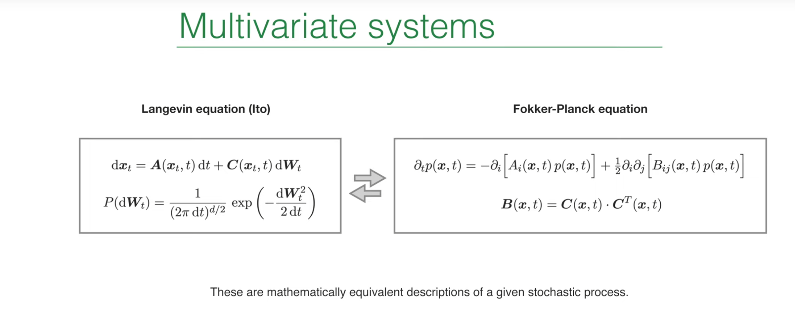
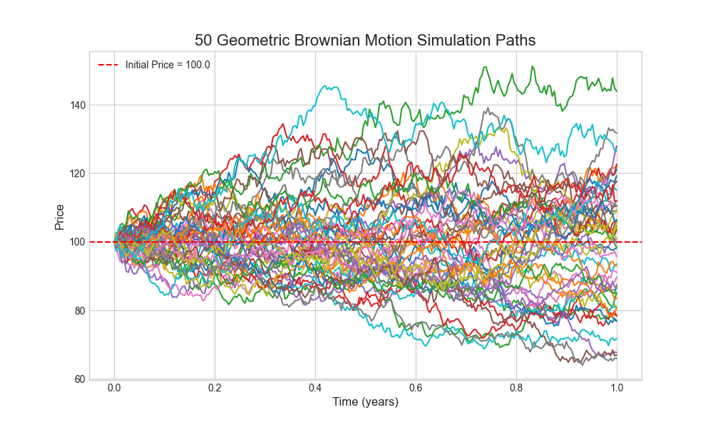

# Introduction: A Third Perspective on Random Motion

In earlier lectures, Prof. Erwin Frey discussed two powerful frameworks for stochastic processes: the Langevin equation and the Fokker-Planck equation. The Langevin equation takes a microscopic view, tracking a single, concrete, noise-driven trajectory of a particle under random forces. The Fokker-Planck equation adopts a macroscopic statistical view, describing how the probability density of an ensemble of such particles evolves in time. These two descriptions are equivalent, but they provide different angles on the same problem.



In **Lecture 19** we introduced a third framework: the **path integral**. The path integral method was originally proposed by **Norbert Wiener** in his study of stochastic processes and was later developed by **Richard Feynman** for quantum mechanics, becoming one of the cornerstones of modern physics. It offers a revolutionary viewpoint: to compute the probability for a system to evolve from an initial state to a final state, we do not focus only on the most probable path; instead, we consider and "sum over" **all possible paths** the system could take.

This “sum over histories” connects the trajectory view of Langevin equations with the probability-density view of the Fokker-Planck equation. Each admissible path is assigned a weight that reflects how likely that path is. By integrating these weights over all paths — an integral over an infinite-dimensional function space — we obtain the total transition probability.

Beyond its conceptual elegance, the method is computationally powerful. It turns an SDE problem into a functional integral problem, akin to those in statistical mechanics or quantum field theory. We can then borrow mature tools such as perturbation theory and renormalization group methods to analyze complex stochastic systems, especially those with **multiplicative noise**. The goal of this lecture is to systematically derive and understand how to construct a path-integral formulation for stochastic processes with multiplicative noise.

# 1. Review: Basic Description of Multivariate Systems

Before deriving the path integral, we first review two equivalent mathematical frameworks for multivariate stochastic systems. Understanding these two starting points is essential to build the bridge that the path integral provides between them.

## 1.1 Langevin Equation (Ito Form): Microscopic View of a Particle

For a multivariate system under the Ito interpretation, the Langevin equation describes the time evolution of the state vector $x_t$:

$$
dx_t = A(x_t, t)\,dt + C(x_t, t)\,dW_t
$$

where:

- $x_t$ is a $d$-dimensional vector representing the system state at time $t$ (e.g., positions, velocities of multiple particles).

- $A(x_t, t)$ is the drift vector, representing deterministic forces or trends acting on the system. It gives the average direction of motion in the absence of noise.

- $dW_t$ is a $d$-dimensional increment of a Wiener process (Brownian motion). Each component is an independent Gaussian random variable with distribution

  $$
  P(dW_t) = \frac{1}{(2\pi\,dt)^{d/2}} \exp\!\left(-\frac{dW_t^2}{2\,dt}\right),
  $$

  so $\mathbb{E}[dW_t]=0$ and $\mathrm{Var}(dW_t)=dt$.

- $C(x_t, t)$ is the noise matrix (diffusion matrix), encoding how random forces act on different degrees of freedom.

This lecture focuses on multiplicative noise, characterized by the fact that the noise matrix $C$ depends on the current state $x_t$. Physically, the strength or nature of fluctuations depends on the system’s position in state space. Examples include price-volatility proportionality in finance and population-size–dependent environmental fluctuations in population dynamics. Such state-dependent noise leads to dynamics far richer than the additive-noise case (constant $C$).

## 1.2 Fokker-Planck Equation: Macroscopic View of the Ensemble

In contrast to single-trajectory descriptions, the Fokker-Planck equation governs the time evolution of the probability density $p(x,t)$ for an ensemble of identical systems:

$$
\partial_t p(\mathbf{x}, t) = -\sum_i \partial_i \big[ A_i(\mathbf{x}, t)\, p(\mathbf{x}, t) \big] + \frac{1}{2} \sum_{i,j} \partial_i \partial_j \big[ B_{ij}(\mathbf{x}, t)\, p(\mathbf{x}, t) \big].
$$

This can be viewed as a continuity equation for probability in state space:

- The first term is the drift term, describing how the “center” or peak of the distribution is transported by the deterministic drift field $A$.
- The second term is the diffusion term, describing how the distribution broadens or spreads with time.

A key link between the two descriptions is the relation between the diffusion tensor $B$ and the noise matrix $C$:

$$
B(x,t) = C(x,t)\, C^T(x,t).
$$

This relation precisely encodes how the microscopic noise statistics map to macroscopic diffusion of the probability density. The matrix product computes the covariance matrix of the noise after transformation by $C$. If $C$ is diagonal, noises along different directions are independent; if $C$ has off-diagonal entries, random kicks along different directions are correlated. The diffusion tensor $B$ captures these correlations and sets the shape of the spreading probability cloud in multiple dimensions (e.g., circular vs. elliptical). Hence, this formula is the key bridge between the microscopic (Langevin) and macroscopic (Fokker-Planck) descriptions.

# 2. Deriving the Path Integral for SDEs

We now start from the Langevin equation and construct the equivalent path-integral representation step by step. The derivation shows how the path integral “grows” from discrete time steps.

## 2.1 From Continuous Time to Discrete Steps: Euler-Maruyama Scheme

We cannot directly manipulate continuous-time SDEs, so we discretize time. Split the total time $T$ into $N$ small steps of size $\Delta t=T/N$. Over a single step from $t_i$ to $t_{i+1}$, the Langevin equation is approximated by

$$
x_{i+1} - x_i = A(x_i)\, \Delta t + C(x_i)\, \Delta W_{i+1}.
$$

Here $\Delta W_{i+1} = W(t_{i+1}) - W(t_i)$ is a Gaussian random vector with mean 0 and covariance $I\,\Delta t$. This discretization is the Euler-Maruyama method.

Historical and practical note: Euler-Maruyama generalizes Euler’s method for ODEs to SDEs by adding Brownian increments to model stochastic evolution. It combines deterministic drift with random kicks and iterates an update rule to approximate SDE solutions. The method is simple and widely used in practice, including geometric Brownian motion in option pricing, Brownian dynamics in physics, stochastic models in biomedicine, and diffusion-model sampling in machine learning. Its drawbacks are low order of convergence and step-size sensitivity, so it is best for low-accuracy settings or as a first exploratory tool.

A crucial detail: both the drift $A$ and the noise matrix $C$ are evaluated at the beginning of the time step, i.e., at $x_i$. This non-anticipating choice is the hallmark of Ito calculus and fixes the path integral we derive to the Ito interpretation. Sampling at the midpoint would lead to the Stratonovich convention (we will compare later).

## 2.2 Short-Time Propagator: One-Step Transition Probability

We compute the conditional probability to go from $x_i$ to $x_{i+1}$ in a single step, $P(x_{i+1}\mid x_i)$. Since $\Delta W_{i+1}$ is Gaussian, the increment $x_{i+1}-x_i$ is Gaussian with

- Mean:

  $$
  \mu_i = x_i + A(x_i)\, \Delta t.
  $$

- Covariance matrix:

  $$
  \langle (C(x_i)\,\Delta W_{i+1}) (C(x_i)\,\Delta W_{i+1})^T \rangle = C(x_i)\, (I\,\Delta t)\, C^T(x_i) = B(x_i)\, \Delta t.
  $$

Thus the one-step transition probability is the multivariate Gaussian

$$
P(\vec{x}_{i+1}\mid \vec{x}_i) = \frac{1}{\sqrt{(2\pi\,\Delta t)^d \det \mathbf{B}(\vec{x}_i)}}\, \exp\!\left[-\frac{1}{2\,\Delta t} (\vec{x}_{i+1}-\vec{\mu}_i)^T \mathbf{B}^{-1}(\vec{x}_i) (\vec{x}_{i+1}-\vec{\mu}_i)\right].
$$

The expression is exact, but the inverse $\mathbf{B}^{-1}$ inside the exponent will be inconvenient later. We next eliminate it via a Fourier representation.

## 2.3 Introducing the Response Field: Fourier-Space Method

To handle the matrix inverse in the exponential term, we use a very powerful mathematical tool: the Fourier representation of Gaussian integrals. Any Gaussian function can be expressed as an integral form of its Fourier transform. We use the following Gaussian integral identity:

$$
\exp\!\left(-\tfrac{1}{2}\, \vec{v}^T \mathbf{M}^{-1} \vec{v}\right) = \sqrt{\frac{\det \mathbf{M}}{(2\pi)^d}} \int d^d\!\vec{q}\; \exp\!\left(-\tfrac{1}{2}\, \vec{q}^T \mathbf{M} \vec{q} + i\, \vec{q}^T \vec{v}\right).
$$

With $\vec{v}=\vec{x}_{i+1}-\vec{\mu}_i$ and $\mathbf{M}=\mathbf{B}(\vec{x}_i)\,\Delta t$, the one-step propagator becomes an integral over an auxiliary variable $\vec{q}$:

$$
P(\vec{x}_{i+1}\mid \vec{x}_i) = \int \frac{d^d\!\vec{q}_{i+1}}{(2\pi)^d}\; \exp\!\left[-\tfrac{1}{2}\, \Delta t\, \vec{q}_{i+1}^T \mathbf{B}(\vec{x}_i) \vec{q}_{i+1} + i\, \vec{q}_{i+1}^T (\vec{x}_{i+1}-\vec{x}_i - \vec{A}(\vec{x}_i)\,\Delta t)\right].
$$

This transformation is a key step in the entire derivation. We have introduced a new integration variable $\vec{q}$, which is physically called the **response field**. Through this transformation, we successfully replace the complex matrix inverse $\mathbf{B}^{-1}$ in the original exponential term with a simple quadratic form $\vec{q}^T \mathbf{B} \vec{q}$, which paves the way for connecting many time steps together.

## 2.4 Assemble the Path: From Steps to Trajectory

A complete path runs from $x_0$ at $t_0$ through intermediate states $x_1,\ldots,x_{N-1}$ to $x_N$ at $t_N$. The total transition probability, by the Markov property (Chapman-Kolmogorov), is the product of one-step propagators integrated over all intermediate states:

$$
P(x_N,t_N\mid x_0,t_0) = \int dx_1\cdots\int dx_{N-1} \prod_{i=0}^{N-1} P(x_{i+1}\mid x_i).
$$

Replacing each $P(x_{i+1}\mid x_i)$ by its Fourier representation yields

$$
P(\vec{x}_f,t_f\mid \vec{x}_0,t_0) = \int \Big(\prod_{i=1}^{N-1} d\vec{x}_i\Big) \Big(\prod_{j=1}^{N} \frac{d\vec{q}_j}{(2\pi)^d}\Big) 
\exp\!\left[-\tfrac{1}{2}\sum_{k=1}^{N} \Delta t\, \vec{q}_k^T \mathbf{B}(\vec{x}_{k-1}) \vec{q}_k + i \sum_{k=1}^{N} \vec{q}_k^T (\vec{x}_k-\vec{x}_{k-1} - \vec{A}(\vec{x}_{k-1})\,\Delta t)\right],
$$

with $x_f=x_N$. We are already close to a path integral: we integrate over all intermediate positions $\{\vec{x}_i\}$ and all auxiliary fields $\{\vec{q}_j\}$.

## 2.5 Continuum Limit and the MSRJD Action

Finally, take the continuum limit $N\to\infty$, $\Delta t\to 0$:

- Sums $\sum_{k=1}^{N} \Delta t\, (\cdots)$ become $\int_{t_0}^{t_f} dt\, (\cdots)$.
- Differences $(x_k-x_{k-1})/\Delta t$ become the time derivative $\partial_t x$.
- Products of ordinary integrals over all $x_i$ and $q_j$ become functional integrals $\int \mathcal{D}[x] \mathcal{D}[q]$.

Collecting terms gives the path integral

$$
P(x_f,t_f\mid x_0,t_0) = \int_{x(t_0)=x_0}^{x(t_f)=x_f} \mathcal{D}[x] \, \mathcal{D}[q] \; e^{-S[x, i q]}
$$

with the action

$$
S[\vec{x}, i\vec{q}] = \int_{t_0}^{t_f} dt\, \Big[ i\, \vec{q}^{\,T} (\partial_t \vec{x} - \vec{A}(\vec{x})) + \tfrac{1}{2}\, (i\vec{q})^{T} \mathbf{B}(\vec{x}) (i\vec{q}) \Big].
$$

This is the Martin-Siggia-Rose-Janssen-de Dominicis (MSRJD) action introduced in Lecture 19. It rewrites the SDE problem as a field theory.

# 3. Physical Interpretation of the Path-Integral Action

We have derived the MSRJD action. We now clarify the physical meaning of each term.

## 3.1 “Drift” Term: Enforcing the Dynamical Rule

The first term, $i\,\vec{q}^{\,T}(\partial_t \vec{x} - \vec{A}(\vec{x}))$, acts as a Lagrange multiplier when we integrate over all functions $\vec{q}(t)$:

$$
\int \mathcal{D}[q] \exp\!\left(- \int dt\; i\, q^T (\partial_t x - \mathbf{A}(x)) \right) \propto \delta[\partial_t x - \mathbf{A}(x)].
$$

The functional delta is a hard constraint: in the absence of noise, all paths $x(t)$ contributing to the integral must satisfy the deterministic evolution $\partial_t x = A(x)$. This term embeds the deterministic rule of motion into the path integral.

## 3.2 “Noise–Response” Term: Encoding Fluctuation Statistics

The second term, $\tfrac{1}{2} (i q)^T \mathbf{B}(x) (i q)$, is quadratic in the response field. It has exactly the form of the exponent of a zero-mean Gaussian with covariance $\mathbf{B}(x)$.

Hence this term encodes the full noise statistics — variances and cross-correlations — through the diffusion tensor $\mathbf{B}(x)$. The field $q$ is called a response field because, with sources coupled to $q$, functional derivatives generate linear response functions to external perturbations.

Rewriting the stochastic process as a path integral turns it into a (0+1)-dimensional field theory (time only). The state $x(t)$ and response field $q(t)$ become dynamical fields. This viewpoint lets us import field-theoretic tools — Feynman diagrams, perturbation theory, RG — to analyze classical stochastic processes, which is particularly powerful near phase transitions and critical phenomena.
# 4. An Alternative View: A Heuristic Derivation

Beyond the discrete-time derivation, a more physical, heuristic route yields the same action and clarifies the origin of the response field $q$.

1) Start from explicit noise. Write the Langevin equation with a standard Gaussian white-noise source $\eta(t)$:

$$
\partial_t x = A(x) + C(x)\, \eta(t), \qquad \langle \eta_i(t) \eta_j(t') \rangle = \delta_{ij}\,\delta(t-t').
$$

The noise paths are weighted by $\mathcal{P}[\eta] \propto \exp\!\left(-\tfrac{1}{2}\int dt\, \eta^2\right)$.

2) Average over noise. For any observable $\sigma(x)$,

$$
\langle \sigma(x) \rangle = \int \mathcal{D}[\eta] \; \sigma(x)\, \mathcal{P}[\eta].
$$

3) Impose the constraint with a delta functional so that $x(t)$ solves the SDE for the given $\eta(t)$:

$$
\langle \sigma(x) \rangle = \int \mathcal{D}[x] \mathcal{D}[\eta] \; \sigma(x)\, \delta[\partial_t x - A(x) - C(x)\eta(t)]\, \exp\!\left(-\tfrac{1}{2}\int dt\, \eta^2\right).
$$

4) Fourier-represent the delta, which naturally introduces the response field $q$:

$$
\delta[\cdots] = \int \mathcal{D}[q]\; \exp\!\left(i \int dt\, q^T (\partial_t x - A(x) - C(x)\eta(t))\right).
$$

5) Integrate out the noise. The integral over $\eta$ is Gaussian (quadratic from $\mathcal{P}[\eta]$ plus linear from coupling to $q$). Completing the square gives

$$
\int \mathcal{D}[\vec{\eta}] \exp\!\left(-\int dt\, \Big[ \tfrac{1}{2} \vec{\eta}^{\,T}\vec{\eta} + i\,\vec{q}^{\,T} \mathbf{C}\, \vec{\eta} \Big]\right) = \exp\!\left(-\int dt\, \tfrac{1}{2} \vec{q}^{\,T} \mathbf{C}\,\mathbf{C}^{\,T} \vec{q}\right).
$$

Combining the remaining terms yields the path integral over $x$ and $q$ with the same action as before. This derivation reveals the physical meaning of $q$: it is the Fourier-conjugate field enforcing the dynamical constraint $(\partial_t x - A - C\eta)$. After integrating out $\eta$, the noise statistics are transferred into the quadratic $q$ term, and the response-field part of the action can be viewed as the “ghost” left by the eliminated physical noise.
# 5. Simulation and Visualization: Geometric Brownian Motion in Python

Theory is abstract; simulation reveals the distinctive effects of multiplicative noise. We illustrate with geometric Brownian motion (GBM), a canonical multiplicative-noise process.

## 5.1 Canonical Example: Geometric Brownian Motion

The SDE is

$$
dX_t = \mu X_t\, dt + \sigma X_t\, dW_t,
$$

where $\mu$ is the drift rate and $\sigma$ is the volatility. This is a perfect example of multiplicative noise because both the deterministic drift term $\mu X_t dt$ and the random diffusion term $\sigma X_t dW_t$ scale with the current state $X_t$.

This model has wide applications in many fields. For example, in finance, it is used to model stock prices (higher prices lead to larger absolute fluctuations, and prices cannot be negative); in biology, it can describe population growth in unlimited resource environments, where both growth and fluctuations are proportional to the current population size.

## 5.2 Python Implementation via Euler-Maruyama

We discretize with Euler-Maruyama:

$$
X_{n+1} = X_n + \mu X_n\, \Delta t + \sigma X_n\, \Delta W_n = X_n (1 + \mu \Delta t + \sigma \sqrt{\Delta t}\, Z_n),
$$

with $Z_n\sim N(0,1)$. Full code:

```python
import numpy as np
import matplotlib.pyplot as plt

def simulate_gbm(x0, mu, sigma, T, dt, num_paths):
    """
    Simulate Geometric Brownian Motion (GBM) using the Euler-Maruyama method.

    Parameters:
    x0 : float
        Initial value.
    mu : float
        Drift rate.
    sigma : float
        Volatility.
    T : float
        Total time.
    dt : float
        Time step.
    num_paths : int
        Number of paths to simulate.

    Returns:
    t : numpy.ndarray
        Array of time points.
    X : numpy.ndarray
        Simulated GBM paths, shape (num_steps, num_paths).
    """
    num_steps = int(T / dt)
    t = np.linspace(0, T, num_steps + 1)
    
    # Create an array to store paths
    X = np.zeros((num_steps + 1, num_paths))
    X[0, :] = x0
    
    # Generate random numbers for all time steps
    # Z is an array of shape (num_steps, num_paths), each element follows N(0, 1)
    Z = np.random.standard_normal((num_steps, num_paths))
    
    # Iteratively compute each step
    for i in range(num_steps):
        # dW = sqrt(dt) * Z
        dW = np.sqrt(dt) * Z[i]
        # Euler-Maruyama step
        X[i+1] = X[i] + mu * X[i] * dt + sigma * X[i] * dW
        
    return t, X

# --- Simulation parameters ---
x0 = 100.0      # Initial price
mu = 0.05       # Annualized drift (5%)
sigma = 0.2     # Annualized volatility (20%)
T = 1.0         # Total time (1 year)
dt = 0.004      # Time step (approximately one trading day)
num_paths = 50  # Number of paths to simulate

# --- Run simulation ---
t, X = simulate_gbm(x0, mu, sigma, T, dt, num_paths)

# --- Visualization of results ---
plt.style.use('seaborn-v0_8-whitegrid')
fig, ax = plt.subplots(figsize=(10, 6))

ax.plot(t, X)
ax.set_title(f'{num_paths} Geometric Brownian Motion Simulation Paths', fontsize=16)
ax.set_xlabel('Time (years)', fontsize=12)
ax.set_ylabel('Price', fontsize=12)
ax.axhline(y=x0, color='r', linestyle='--', label=f'Initial Price = {x0}')
ax.legend()

plt.show()
```



From the same starting point, 50 GBM paths fan out over time — the most visible signature of multiplicative noise:

- If a path happens to move to higher values by chance, $X_t$ increases.
- Because the noise term $\sigma X_t dW_t$ scales with $X_t$, a larger $X_t$ yields larger random swings.
- This promotes larger jumps and widens the spread between paths.

By contrast, additive-noise processes (e.g., standard Brownian motion with constant noise) produce a more uniform, symmetric broadening. GBM’s multiplicative noise leads to a distribution that grows wider and becomes right-skewed with a long tail.

# Conclusion

We built a path-integral formulation for stochastic processes with multiplicative noise. Starting from a discretized Langevin equation we derived the MSRJD action and interpreted its terms. The path-integral view links stochastic processes to statistical field theory and provides powerful computational tools.

Finally, recall the subtle difference between Ito and Stratonovich integrals discussed earlier. The difference matters only for multiplicative noise; for additive noise they coincide. The key is to state clearly which convention you use and be consistent. In the derivation above, the Ito convention was fixed at the first discretization step.
