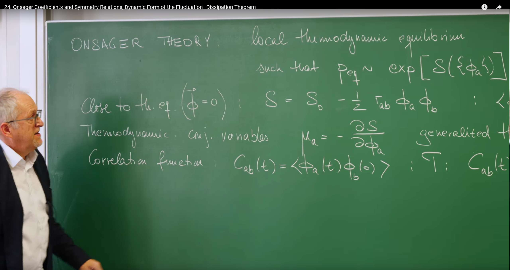
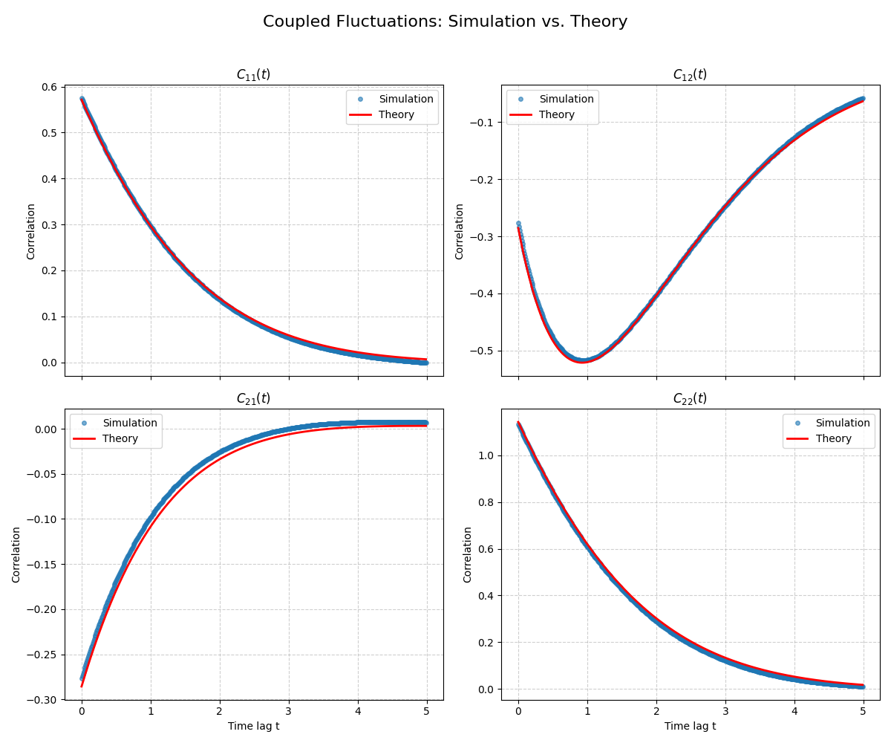

# Introduction

In previous lectures, we have built a powerful toolkit to understand stochastic processes. Starting from **Lecture 17's Langevin equation**, which describes the specific, noisy trajectories of individual particles from a microscopic perspective, we then turned to the **Fokker-Planck equation and path integrals**, which depict the evolution of probability from a macroscopic statistical viewpoint.

In Lecture 23 the course reached a key turning point and examined two complementary routes to macroscopic theory:

- Bottom‑Up: by coarse‑graining, start from known microscopic rules (e.g., interparticle potentials) and derive a continuous field theory for collective behavior. This approach has a clear physical picture but depends on microscopic details.

- Top‑Down: assume we know nothing about microscopic details and instead use the most basic principles of thermodynamics and symmetry to build a universal theory of fluctuations.

So far, our discussions have mostly focused on systems described by a single variable (e.g., the position of a single Brownian particle). However, real-world physical systems, from chemical reaction networks to biological cells to condensed matter, typically require multiple coupled macroscopic variables (we denote them as $\{\phi_a\}$) to collectively describe their state. This leads to the core questions this lecture aims to solve:

* **How do we describe the fluctuation dynamics of these coupled macroscopic variables $\phi_a$ when a system is near but not exactly at thermal equilibrium?**
* **Do there exist universal physical laws that can govern such near-equilibrium behavior without depending on the specific, complex microscopic details of the system?**

To answer these questions, Prof. Erwin Frey will introduce two powerful theoretical frameworks, both of which have been mentioned in previous lectures and together form the foundation of near-equilibrium nonequilibrium statistical physics:

1. **Onsager's Theory:** This is a grand framework based on fundamental symmetry principles (especially microscopic reversibility), introduced in the previous lecture. It can derive the famous **Onsager reciprocity relations**, revealing the intrinsic connections between different transport processes.

2. **Dynamic Fluctuation-Dissipation Theorem (DFDT):** This is a generalization of the fluctuation-dissipation theorem we learned in Lecture 17. It is no longer limited to static or zero-frequency cases, but precisely connects the spectrum of spontaneous thermal fluctuations with the system's dissipative response to external perturbations across the entire frequency domain.



# 1. Review: Thermodynamic Framework for Near‑Equilibrium Fluctuations

In the previous lecture, the professor established the "top-down" research approach: building a macroscopic fluctuation theory based solely on universal thermodynamic principles without relying on microscopic details. In this section, we will systematically construct the static framework of this theory. The core idea is to **regard entropy $S$ as a "potential landscape" describing system stability**—all near-equilibrium static properties can be derived from the geometric shape of this landscape.

## 1.1 Local Equilibrium Hypothesis

The cornerstone of Onsager's theory is the **local thermodynamic equilibrium hypothesis**. This hypothesis states that even when a system is globally out of equilibrium, we can still consider that within sufficiently small spatiotemporal scales, each small part (or subsystem) of the system is in its own local equilibrium state. This seemingly simple assumption has powerful implications because it allows us to use all the theoretical tools of equilibrium statistical mechanics, particularly **entropy**, to describe the system's state.

Based on this assumption, the probability of a macroscopic state (described by a set of variables $\{\phi_a\}$) is directly related to the entropy $S(\{\phi_a\})$ of that state, in a form similar to the Boltzmann distribution:

$$P_{\text{eq}}(\{\phi_a\}) \propto \exp \left(\frac{S(\{\phi_a\})}{k_B}\right)$$

This formula is the bridge connecting macroscopic thermodynamics with statistical fluctuations. **It tells us that the system's fluctuation behavior is essentially an exploration on the "landscape" constituted by entropy.** A system always fluctuates around its most probable state (i.e., the state of maximum entropy). Therefore, the probability of observing a fluctuation that departs from equilibrium must be related to how much this fluctuation reduces entropy. The above formula is the mathematical embodiment of this physical principle.

## 1.2 Gaussian Approximation of Entropy

As mentioned in the previous section, we are concerned with small fluctuations around a stable equilibrium state (the maximum point of entropy, which we define as $\phi_{\text{eq}}=0$). Near any maximum point of a function, we can approximate it with a quadratic function (parabola). Therefore, we can perform a Taylor expansion of entropy $S$ around the equilibrium point and retain terms up to second order, obtaining a Gaussian approximation:

$$S \approx S_0-\frac{1}{2}\tau_{ab}\phi_a\phi_b$$

Here we use Einstein summation convention, and the matrix $\tau_{ab}$ is precisely the stability matrix $\Gamma_{ab} = -\left.\frac{\partial^2 S}{\partial \phi_a \partial \phi_b}\right|_{\phi=0}$ we defined in the previous lecture. We use $\tau_{ab}$ in this lecture to distinguish it from the kinetic matrix in the next section.

- $S_0$ is the maximum entropy at equilibrium.
- The symmetric and positive definite matrix $\tau_{ab}$ plays a central role here. It describes the curvature of the entropy "peak," representing the system's thermodynamic stiffness. The larger the value of $\tau_{ab}$, the steeper the entropy "peak," and the more "reluctant" the system is to deviate from equilibrium, resulting in smaller fluctuations.

Through this approximation, we transform the abstract "entropy landscape" into a concrete, mathematically tractable inverted paraboloid.

## 1.3 Static Properties: Reading the “Landscape”

The quadratic entropy landscape implies a Gaussian equilibrium distribution

$$
P_{\rm eq}(\{\phi_a\}) \propto \exp\!\big(-\tfrac{1}{2}\, \tau_{ab}\, \phi_a\phi_b\big),
$$

from which static correlations follow immediately:

$$
\langle \phi_a \phi_b \rangle_{\rm eq} = (\tau^{-1})_{ab} \equiv \chi_{ab}. 
$$

Thus, the susceptibility matrix $\chi$ equals the covariance matrix of equilibrium fluctuations—one static form of the fluctuation–dissipation relation.

## 1.4 Introducing Dynamics: The Mark of Microscopic Reversibility

To move beyond statics, we introduce dynamics while respecting fundamental symmetry: microscopic time‑reversal invariance (in the absence of TRS‑breaking fields). This symmetry will imprint nontrivial constraints on dynamical coefficients and correlation functions, ultimately yielding Onsager’s reciprocal relations.

# 2. Linear Dynamics and the Onsager Regression Hypothesis

In the first section, we used entropy $S$ to construct a static "thermodynamic landscape" and derived the amplitude of fluctuations and restoring forces from its shape (described by the thermodynamic matrix $\tau_{ab}$). Now, we need to answer the next key question: **How does the system "move" on this landscape?** This requires us to introduce a dynamical evolution equation for the fluctuation variables $\phi_a$.

## 2.1 Multivariate Langevin Equation: A Reasonable Dynamical Model

The most natural and simplest way to describe the dynamics of near-equilibrium systems is to generalize the single-variable Langevin equation we learned in Lecture 17. We assume that the evolution of fluctuations is driven by two parts: a deterministic restoring force that pulls the system back to equilibrium, and a random force representing microscopic thermal motion. Thus, we write the linear multivariate Langevin equation:

$$
\partial_t \phi_a(t) = -\Gamma_{ab} \phi_b(t) + \xi_a(t)
$$

**Deterministic Restoring Term ($-\Gamma_{ab} \phi_b(t)$)**: This term describes how the system deterministically returns to the equilibrium point ($\phi = 0$).

- The newly introduced matrix $\Gamma_{ab}$ is a **kinetic matrix**. It describes how fast the presence of fluctuation $\phi_b$ causes changes in variable $\phi_a$.

- Key distinction: This kinetic matrix $\Gamma$ is a completely different concept from the thermodynamic matrix $\tau$ in the previous section. $\tau$ describes the magnitude of static restoring forces (landscape steepness), while $\Gamma$ describes the rate of dynamic response (sliding speed). Moreover, unlike $\tau$ which must be symmetric, $\Gamma$ is not necessarily symmetric.

**Random Noise Term ($\xi_a(t)$)**: This term represents the continuous random "kicks" from the microscopic degrees of freedom within the system. We assume it is a Gaussian white noise, whose statistical properties are defined by its mean and covariance:

$$ \langle \xi_a(t) \rangle = 0 $$
$$ \langle \xi_a(t) \xi_b(t') \rangle = N_{ab} \delta(t - t') $$

where $N_{ab}$ is the noise correlation matrix, which describes the intensity of the noise. We temporarily treat it as an unknown quantity, but we will later find that it is not an independent parameter.

## 2.2 Onsager Regression Hypothesis: A Bridge from Random to Deterministic

The Langevin equation above is stochastic, and its solutions are noisy trajectories. But the correlation function $C_{ab}(t) = \langle \phi_a(t) \phi_b(0) \rangle$ we care about is a smooth, deterministic function. How do we get a deterministic result from a stochastic equation?

Here, Onsager proposed a brilliant physical insight, known as **Onsager's regression hypothesis**.

The Onsager Reciprocity Relations were proposed by the American physical chemist Lars Onsager in 1931 as one of the core theories of nonequilibrium thermodynamics. Their physical essence lies in revealing that within the linear response range near thermodynamic equilibrium, the coupling coefficients between different irreversible processes (such as heat conduction, diffusion, electrochemistry, etc.) have symmetry. Lars Onsager (1903-1976) was born in Norway and later immigrated to the United States, teaching at Cornell University. He is famous for solving the two-dimensional Ising Model and nonequilibrium thermodynamics problems, and won the Nobel Prize in Chemistry in 1968 for "the discovery of reciprocal relations for irreversible processes."

**The core idea of Onsager's regression hypothesis is:** The average decay behavior of a small fluctuation spontaneously generated by thermal motion follows exactly the same dynamical laws as the macroscopic relaxation behavior caused by a small external perturbation (such as gently nudging the system with tweezers).

The physical intuition behind this is that the system itself "doesn't know" how the fluctuation was generated. Once a fluctuation appears, the underlying dynamical mechanisms of the system (described by $\Gamma$) will "smooth it out" in the same way.

The mathematical power of this hypothesis lies in the fact that when we calculate a conditional average—i.e., fixing the initial fluctuation as $\phi(0)$ and then observing the subsequent average evolution path $\bar{\phi}_a(t) = \langle \phi_a(t) \rangle_{\phi(0)}$—the average effect of the random noise term is zero ($\langle \xi_a(t) \rangle_{\phi(0)} = 0$). Therefore, the evolution of this average path is no longer stochastic but follows a purely deterministic equation:

$$
\partial_t \bar{\phi}_a(t) = -\Gamma_{ab} \bar{\phi}_b(t) \quad (\text{for } t > 0)
$$

## 2.3 Dynamics of Correlations: Merging the Ingredients

Onsager's hypothesis provides us with a bridge. Now, we combine it with the definition of correlation functions. By taking the time derivative of the correlation function $C_{ab}(t)$ and applying the regression hypothesis, we immediately obtain a purely deterministic differential equation for the correlation function itself:

$$
\partial_t C_{ab}(t) = -\Gamma_{ad} C_{db}(t)
$$

This equation needs an initial condition, and **this initial condition is precisely the result we derived using static thermodynamics in the first section**!

$$
C_{ab}(0) = \langle \phi_a(0) \phi_b(0) \rangle = (\tau^{-1})_{ab}
$$

This is a milestone achievement! **We have successfully transformed a stochastic dynamical problem into a familiar, deterministic system of linear ordinary differential equations.** Its solution perfectly embodies the fusion of statics and dynamics:

$$
C(t) = e^{-\Gamma t} \cdot C(0) = e^{-\Gamma t} \cdot \tau^{-1}
$$

This solution tells us a clear physical picture:
- The **initial amplitude $C(0)$** of fluctuations is determined by the shape of the thermodynamic landscape ($\tau$).
- The way fluctuations decay over time $e^{-\Gamma t}$ is determined by the system's intrinsic dynamics ($\Gamma$).

In this way, we have seamlessly connected the static thermodynamic framework with the dynamic evolution model.

Microscopic reversibility and time‑reversal parity will impose additional symmetry constraints (Sec. 3).

# 3. Onsager Reciprocal Relations: Hidden Symmetry in Dynamics

We have obtained the complete dynamical equation describing how fluctuations decay over time: $C(t) = e^{-\Gamma t} \tau^{-1}$. Although this result is complete, its form is still somewhat abstract. Now, we will "translate" it into the more commonly used and physically intuitive language of nonequilibrium thermodynamics—the language of **"flux" and "force"**. Through this perspective shift, we will reveal a profound symmetry hidden in the kinetic matrix $\Gamma$.

## 3.1 Onsager Kinetic Coefficients $L$: The Language of Transport

In nonequilibrium thermodynamics, we usually don't directly discuss fluctuation variables $\phi_a$, but rather their **rates of change**, which are called **thermodynamic fluxes**, denoted as $J_a \equiv \partial_t \bar{\phi}_a$. For example, it could be the amount of heat passing through a certain interface per unit time (heat flux), the number of particles (particle flux), or charge (current).

Meanwhile, what drives these "fluxes" are precisely the **generalized thermodynamic forces** we defined in the first section: $\mu_d = -\tau_{db}\phi_b$. This force represents the degree to which the system deviates from equilibrium, such as temperature gradients, chemical potential gradients, or electric potential differences.

Near equilibrium, a natural assumption is that the magnitude of "flux" is linearly related to the "force" driving it. This is like Ohm's law in circuits (current proportional to voltage). Therefore, we can write the central equation of macroscopic transport processes:

$$J_a = -L_{ad}\mu_d$$

The matrix $L_{ad}$ here is the famous **Onsager kinetic coefficients**. It is a **transport coefficient matrix**, where the diagonal elements $L_{aa}$ describe how force $\mu_a$ drives its conjugate flux $J_a$ (e.g., electrical conductivity), while the off-diagonal elements $L_{ad}$ describe cross-effects between different processes (e.g., how temperature gradients cause current, i.e., thermoelectric effects).

What is the relationship between this physically intuitive $L$ matrix and the abstract matrices $\Gamma$ and $\tau$ we defined earlier? Through simple algebraic substitution, we can easily establish the bridge between them:

$$J_a = \partial_t \bar{\phi}_a = -\Gamma_{ab}\bar{\phi}_b = \Gamma_{ab}(\tau^{-1})_{bd}(-\tau_{dk}\bar{\phi}_k) = \underbrace{\Gamma_{ab}(\tau^{-1})_{bd}}_{L_{ad}} \mu_d$$

Therefore, we have found the exact relationship between them:

$$L = \Gamma \tau^{-1}$$

Through this "translation," we have transformed the problem into: **Does this physically measurable transport matrix $L$ have any universal properties?**

## 3.2 Deriving Reciprocity: Gathering All Clues

Now, we have reached the climax of this lecture's derivation. We will gather all the key results from earlier to prove that the $L$ matrix must obey an astonishing symmetry.

Our derivation process is like a logically perfect proof, requiring three key inputs:

1. **Input One (from Section 1.4)**: The correlation function symmetry $C_{ab}(t) = \epsilon_a\epsilon_b C_{ba}(-t)$ derived from **microscopic reversibility**.

2. **Input Two (from Section 2.3)**: The correlation function dynamical equation $\partial_t C(t) = -\Gamma C(t)$ derived from **Onsager's regression hypothesis**.

3. **Input Three (from Section 1.3)**: The initial condition $C(0) = \tau^{-1}$ derived from **thermodynamics**.

### Start of the Derivation:

1. We start from the microscopic reversibility relation, take the derivative of both sides with respect to time $t$, and then examine the instant $t \to 0^+$:

$$\left.\frac{dC_{ab}(t)}{dt}\right|_{t=0^+} = \epsilon_a\epsilon_b \left.\frac{dC_{ba}(-t)}{dt}\right|_{t=0^+} = -\epsilon_a\epsilon_b \left.\frac{dC_{ba}(s)}{ds}\right|_{s=0^-}$$

Since the correlation function is continuous and differentiable at $t=0$ (for both $t>0$ and $t<0$), the left and right derivatives are equal, therefore:

$$\left.\frac{dC_{ab}(t)}{dt}\right|_{t=0^+} = \epsilon_a\epsilon_b \left.\frac{dC_{ba}(t)}{dt}\right|_{t=0^+}$$

2. Now, we use the dynamical equation to calculate this derivative:

$$\left.\frac{dC(t)}{dt}\right|_{t=0^+} = -\Gamma C(0) = -\Gamma\tau^{-1} = -L$$

3. Substituting the result from step 2 into the equation from step 1, we get:

$$(-L)_{ab} = \epsilon_a\epsilon_b (-L)_{ba}$$

4. After rearrangement, we obtain the final **Onsager Reciprocity Relation**:

$$L_{ab} = \epsilon_a\epsilon_b L_{ba}$$

This is an extremely profound and powerful conclusion! It tells us that a transport coefficient $L_{ab}$ describing "how force b drives flux a" and a coefficient $L_{ba}$ describing "how force a drives flux b" must have a simple symmetric relationship determined by time-reversal parity.

**This is like a poem in physics: a time symmetry hidden in the microscopic world, invisible to mortals, has left its elegant symmetric "fingerprint" on the measurable transport coefficient matrix in the macroscopic world.** For example, it predicts that heating one end of a metal rod will produce a voltage at the other end, and conversely, applying voltage to this rod will also cause heat transport, with the strengths of these two cross-effects being strictly related. This law is completely independent of the type of metal or microscopic structure and is a universal law for all near-equilibrium systems.

To clearly distinguish the multiple matrices appearing in this lecture ($\tau$, $\Gamma$, $L$, $N$), which are similar in form but have very different physical roles, we summarize them in the following table:

| Symbol | Name | Definition | Physical Meaning and Properties |
| --- | --- | --- | --- |
| $\phi_a$ | Thermodynamic variables | Macroscopic state variables | Describe the system's deviation from equilibrium. |
| $\mu_a$ | Thermodynamic forces | $\mu_a = -\tau_{ab} \phi_b$ | Generalized forces driving the system back to equilibrium. |
| $\tau_{ab}$ | Thermodynamic matrix | $S = S_0 - \frac{1}{2} \tau_{ab} \phi_a \phi_b$ | Defines the stiffness of the entropy "barrier." Symmetric matrix: $\tau_{ab} = \tau_{ba}$, and positive definite. |
| $\Gamma_{ab}$ | Kinetic matrix | $\partial_t \bar{\phi}_a = -\Gamma_{ab} \bar{\phi}_b$ | Relates the rate of change of variables to their current values. Not necessarily symmetric. |
| $L_{ab}$ | Onsager coefficient matrix | $J_a = -L_{ad} \mu_d$ ($L = \Gamma \tau^{-1}$) | Connects thermodynamic fluxes ($J_a$) with forces ($\mu_d$). Encodes the system's linear response. Obeys reciprocity relations $L_{ab} = \epsilon_a \epsilon_b L_{ba}$. |
| $N_{ab}$ | Noise correlation matrix | $\langle \xi_a(t) \xi_b(t') \rangle = N_{ab} \delta(t - t')$ | Specifies the intensity and correlation of microscopic random forces. Symmetric matrix. |

# 4. Entropy Production and the Second Law

Starting from microscopic time symmetry, we have derived the **symmetry** of the transport matrix $L$. Now, we will examine the $L$ matrix from a completely different, yet equally fundamental physical principle—**the second law of thermodynamics**—to see what other constraints it must satisfy. This examination will give our theory a solid macroscopic thermodynamic foundation.

## 4.1 Entropy Production Rate: The Engine of Irreversibility

The core of the second law of thermodynamics is that for a process where an isolated system spontaneously evolves toward equilibrium, its total entropy must increase (or remain constant), i.e., $\partial_t S \geq 0$. Let us calculate the rate of entropy change within our theoretical framework.

Using the chain rule, the rate of entropy evolution over time can be written as:

$$\partial_t S(\{\bar{\phi}_a(t)\}) = \frac{\partial S}{\partial \bar{\phi}_b} \partial_t \bar{\phi}_b$$

We immediately recognize that these two terms are precisely the **thermodynamic forces** ($\mu_b = \frac{\partial S}{\partial \phi_b}$) and **thermodynamic fluxes** ($J_b = \frac{\partial \phi_b}{\partial t}$) we defined in the third section! Therefore, we obtain an extremely important expression in nonequilibrium thermodynamics:

$$\partial_t S = \sum_b \mu_b J_b$$

The physical meaning of this formula: **The total entropy production rate of the system equals the sum of the products of all (generalized) "forces" and their conjugate "fluxes"**. This is like the total power consumed in a circuit equals the sum of (voltage × current) for all components. It quantifies the rate at which irreversible processes within the system "burn" energy and produce entropy.

Now, we substitute the linear relationship $J_b = L_{bd}\mu_d$ from the previous section to get:

$$\partial_t S = \mu_b L_{bd} \mu_d$$

## 4.2 Positive Definiteness of $L$: Guarantee of Stability

The second law of thermodynamics requires that for any nonequilibrium state (i.e., any non-zero thermodynamic forces $\mu_a$), the entropy production rate must be positive: $\partial_t S > 0$. Applying this physical requirement to our mathematical expression:

$$\mu_b L_{bd} \mu_d > 0 \quad (\text{for any } \mu \neq 0)$$

This is a standard quadratic form expression. In linear algebra, a matrix $L$ that makes the quadratic form $x^TLx$ positive for any non-zero vector $x$ is defined as a **positive-definite matrix**.

Therefore, we obtain a powerful conclusion: **The second law of thermodynamics requires the Onsager coefficient matrix $L$ to be positive definite.**

The physical meaning of this conclusion is:
* **Guarantee of equilibrium stability**: The positive definiteness of $L$ ensures that once the system deviates from equilibrium, entropy will definitely increase, thus driving the system **inevitably** back toward equilibrium, rather than spontaneously moving toward states further from equilibrium.
* **Exclusion of "perpetual motion machines"**: It prohibits the occurrence of any macroscopic processes with net entropy reduction.

So far, we have imposed two powerful mathematical constraints on the transport coefficient matrix $L$ from two completely independent, first-principles physical principles:

1.**From microscopic reversibility (Section 3) → $L$ has symmetry ($L_{ab} = \epsilon_a \epsilon_b L_{ba}$)**

2.**From the second law of thermodynamics (Section 4) → $L$ must be positive definite**

These two constraint conditions together constitute the core of Onsager's theory, and they greatly limit the possible forms that the macroscopic dynamical behavior of any near-equilibrium system can have.

# 5. The Dynamic Fluctuation-Dissipation Theorem: Pricing the Noise

So far, we have constructed a fairly complete near-equilibrium dynamics theory. We have a **thermodynamic matrix $\tau$** describing the system's static stability, a **kinetic matrix $\Gamma$** describing the system's dynamic relaxation rate, and an **Onsager matrix $L$** describing macroscopic transport.

However, in the core of our theory—the Langevin equation $\partial_t\phi = -\Gamma\phi + \xi$—there is still one key parameter whose identity is unknown: the **noise correlation matrix $N$**. It describes the intensity of microscopic random forces, but so far, it is just a parameter we introduced out of thin air. This is clearly unsatisfactory. A complete theory must be able to explain the source and magnitude of noise.

The core task of this section is to **"price" the noise $N$**. We will prove that $N$ is not an independent parameter that needs additional measurement, but is completely determined by the matrices we already know that describe the system's macroscopic **dissipation** properties ($L$ or $\Gamma$ and $\tau$). This profound connection is the **Dynamic Fluctuation-Dissipation Theorem**.

Our strategy is: **Use two completely different perspectives to calculate the same physical quantity—the fluctuation spectral density $C_{ab}(\omega)$**. One path starts from macroscopic response, the other from microscopic noise. By making the two converge, we can unlock the secret of $N$.

## 5.1 Viewpoint I: Fluctuation Spectra from Macroscopic Response

The first method starts from the system's **macroscopic response** behavior. We already know that the average decay behavior of a fluctuation is described by the deterministic equation $\partial_t C(t) = -\Gamma C(t)$. This equation describes how the system **dissipates** a fluctuation.

By performing a Fourier transform on this time-domain equation, we can obtain the **power spectral density** $C(\omega)$ of fluctuations in the frequency domain. This spectral density tells us how the system's "fluctuation energy" is distributed across different frequencies (or time scales). After calculation, we get:

$$C(\omega) = G(\omega)\tau^{-1} + (G(-\omega)\tau^{-1})^T$$

where $G(\omega) = (-i\omega I + \Gamma)^{-1}$ is the system's **propagator** or **response function**. It describes the system's response strength to an external perturbation of frequency $\omega$.

The physical picture of this expression is: **The system's fluctuation spectrum is completely determined by its macroscopic response (`G`) and static thermodynamic stiffness (`τ`)**.

## 5.2 Viewpoint II: Fluctuation Spectra from Microscopic Noise

The second method goes straight to the source, starting from **microscopic noise**. We directly perform a Fourier transform on the Langevin equation itself:

$$-i\omega \phi_a(\omega) = -\Gamma_{ab}\phi_b(\omega) + \xi_a(\omega)$$

Solving for $\phi(\omega)$, we get an extremely clear physical picture:

$$\phi(\omega) = G(\omega) \xi(\omega)$$

The meaning of this expression is: **The system's observable fluctuations $\phi(\omega)$ with complex frequency structure are simply the result of the purest white noise $\xi(\omega)$ from the microscopic world being "filtered" by the system's own dynamical characteristics (described by the response function `G(ω)`)**. The system acts like a filter, amplifying noise at certain frequencies while suppressing noise at other frequencies.

Now, we use this relationship to calculate the fluctuation spectrum $C(\omega)$, which is directly related to the (unknown) intensity $N$ of the noise:

$$C(\omega) = \langle \phi(\omega) \phi(-\omega)^T \rangle = G(\omega) \langle \xi(\omega) \xi(-\omega)^T \rangle G(-\omega)^T = G(\omega) N G^\dagger(\omega)$$

## 5.3 Matchup: Deriving the Dynamic FDT

Now, we have reached the decisive moment of the theory. We have two equivalent expressions for the same physical quantity $C(\omega)$. One is derived from the perspective of macroscopic dissipation, the other from the perspective of microscopic fluctuations. **The self-consistency of physics requires that these two must be equal**:

$$G(\omega)\tau^{-1} + (G(-\omega)\tau^{-1})^T = G(\omega) N G^\dagger(\omega)$$

This equation is like a "detective game," with the only unknown being $N$. After a series of matrix algebraic operations (using $G^{-1} = -i\omega I + \Gamma$), we can uniquely solve for $N$ from this, obtaining the final core result of this lecture—the **Dynamic Fluctuation-Dissipation Theorem**:

$$N = \Gamma\tau^{-1} + (\Gamma\tau^{-1})^T = L + L^T$$

This theorem is one of the pinnacle achievements of statistical physics. It establishes a universal, quantitative connection between microscopic fluctuations and macroscopic dissipation that holds at all time scales:

* **Fluctuation**: The noise correlation matrix $N$ on the left side of the equation, which characterizes the intensity and correlation of microscopic random forces within the system. It is a measure of the system's "restlessness."

* **Dissipation**: The symmetric part of the Onsager matrix $L + L^T$ on the right side. The Onsager matrix $L$ describes how the system responds to and dissipates energy when driven externally, and is a measure of the system's "damping and friction."

**This theorem declares: The intensity of microscopic noise driving system fluctuations is not an independent mysterious parameter, but is completely determined by the system's macroscopic, measurable dissipation properties (such as electrical conductivity, viscosity coefficients, etc.). A system's "intrinsic noisiness" and its "resistance to external disturbances" are two sides of the same coin.**

For the simple case where all variables are even parity, $L$ is symmetric, and the theorem simplifies to $N = 2L$. This can be seen as the most magnificent generalization of the familiar **Einstein relation** ($D = \mu k_B T$) to multivariable, time-dependent systems. At this point, our theoretical framework is completely closed and self-consistent.

# 6. Practice: Python Simulation of Coupled Fluctuations

We will simulate a two-dimensional coupled Ornstein-Uhlenbeck process, which is a typical example of the linear Langevin dynamics discussed in this lecture. Through simulation, we will be able to numerically verify our theoretical predictions for correlation functions.

## 6.1 Model System

We consider a system described by two variables $\phi_1$ and $\phi_2$, whose dynamics is given by the following equation:

$$\partial_t \begin{pmatrix} \phi_1 \\ \phi_2 \end{pmatrix} = -\begin{pmatrix} \Gamma_{11} & \Gamma_{12} \\ \Gamma_{21} & \Gamma_{22} \end{pmatrix} \begin{pmatrix} \phi_1 \\ \phi_2 \end{pmatrix} + \begin{pmatrix} \xi_1 \\ \xi_2 \end{pmatrix}$$

The system's entropy is given by:

$$S = -\frac{1}{2} (\tau_{11}\phi_1^2 + \tau_{22}\phi_2^2 + 2\tau_{12}\phi_1\phi_2)$$

## 6.2 Code Implementation

### Set Physical Parameters

First, we import the necessary libraries and define the physical parameters of the system: the thermodynamic matrix $\tau$ and the kinetic matrix $\Gamma$. To make the example more interesting, we will choose an asymmetric $\Gamma$ matrix, which means $L$ will also be asymmetric, which is common in systems with magnetic fields or rotation.

### Derive Dependent Parameters

According to the dynamic fluctuation-dissipation theorem, the properties of noise are not arbitrary—they must be determined by the system's dissipation properties. Therefore, we first calculate the Onsager matrix $L = \Gamma\tau^{-1}$, then use the FDT to calculate the noise correlation matrix $N = L + L^T$. This is a crucial step: we are not guessing the noise, but *deriving* it from dissipation.

### Numerical Integration and Correlated Noise Generation

We will use the Euler-Maruyama method to numerically integrate this system of stochastic differential equations. For a time step $dt$, the update rule is:

$$\phi(t + dt) = \phi(t) - \Gamma \phi(t) dt + \sqrt{dt} \cdot \eta(t)$$

Here, $\eta(t)$ is a two-dimensional Gaussian random vector with zero mean and covariance matrix $N$. To generate random numbers with this specific covariance, we first perform a Cholesky decomposition of $N$ to get a lower triangular matrix $C$ such that $N = C C^T$. Then, we generate a vector $z$ composed of two independent standard normal random numbers, and $C z$ is the random vector with covariance $N$ that we need.

### Ensemble Simulation and Correlation Functions

To obtain statistically meaningful results, we simulate a large number of independent trajectories (an ensemble). Then, we write a function to calculate the time correlation functions $C_{ab}(t) = \langle \phi_a(t_0+t)\phi_b(t_0) \rangle$, calculated by averaging over all trajectories and all possible starting times $t_0$.

### Verification and Visualization

Finally, we compare the simulation results with theoretical predictions. The exact analytical solution for the correlation matrix is $C(t) = e^{-\Gamma t}\tau^{-1}$, where $e^{-\Gamma t}$ is the matrix exponential. We will plot the four correlation functions obtained from simulation ($C_{11}, C_{12}, C_{21}, C_{22}$) and compare them with their theoretical curves on the same plot.

```python
import numpy as np
import matplotlib.pyplot as plt
from scipy.linalg import cholesky, expm

# --- 1. Set physical parameters ---

# Define thermodynamic matrix tau (must be symmetric and positive definite)
# tau_11 and tau_22 determine the "cost" of fluctuations of each variable
# tau_12 describes the thermodynamic coupling between the two variables
tau = np.array([[2.0, 0.4],
                [0.4, 1.5]])

# Define kinetic matrix Gamma (can be asymmetric)
# Gamma_11, Gamma_22 are the relaxation rates of each variable
# Gamma_12, Gamma_21 are the kinetic coupling coefficients
Gamma = np.array([[1.0, 0.6],
                  [0.2, 0.8]])

dt = 0.001     # time step
n_steps = 20000 # steps per trajectory
n_traj = 100    # number of trajectories for ensemble averaging

# --- 2. Derive dependent parameters (apply theory) ---

# Calculate the inverse of tau, which is the equal-time correlation function C(0)
tau_inv = np.linalg.inv(tau)
C0 = tau_inv.copy()

# Calculate Onsager matrix L = Gamma * tau_inv
L = Gamma @ tau_inv

# Apply dynamic fluctuation-dissipation theorem to compute noise matrix N = L + L^T
N = L + L.T

# Check if L satisfies reciprocity relations (here epsilon_a=epsilon_b=1, so L should be symmetric)
# Note: With asymmetric Gamma, L may be asymmetric, corresponding to TRS breaking (e.g., magnetic field).

# --- 3. Numerical simulation setup ---

max_lag = 500
time_lags = np.arange(max_lag) * dt
trajectories = np.zeros((n_traj, n_steps, 2))

# Perform Cholesky decomposition of noise matrix N for generating correlated noise
# N = C * C^T, where C is a lower triangular matrix
C_noise = cholesky(N, lower=True)

print("Running simulation...")
for i in range(n_traj):
    phi = np.zeros((n_steps, 2))
    # Initialize from equilibrium Gaussian with covariance C0
    phi[0, :] = np.random.multivariate_normal(mean=[0, 0], cov=C0)
    
    for j in range(1, n_steps):
        # Generate two independent standard normals
        z = np.random.randn(2)
        # Generate correlated noise via Cholesky factor
        correlated_noise = C_noise @ z
        
        # Euler-Maruyama step
        drift = -Gamma @ phi[j-1, :]
        stochastic = correlated_noise / np.sqrt(dt)  # dt scaling of noise
        
        phi[j, :] = phi[j-1, :] + drift * dt + stochastic * dt
        
    trajectories[i, :, :] = phi

print("Simulation finished.")

# --- 5. Calculate correlation functions ---
def calculate_correlation_function(data, max_lag):
    """Calculate autocorrelation and cross-correlation functions for multiple trajectories"""
    n_traj, n_t, n_var = data.shape
    corr = np.zeros((max_lag, n_var, n_var))
    
    for i in range(n_var):
        for j in range(n_var):
            for k in range(n_traj):
                traj_i = data[k, :, i] - np.mean(data[k, :, i])
                traj_j = data[k, :, j] - np.mean(data[k, :, j])
                conv = np.correlate(traj_i, traj_j, mode='full')
                corr[:, i, j] += conv[n_t-1:n_t-1+max_lag]
    
    # Normalize for each time delay
    normalization = n_traj * (n_t - np.arange(max_lag))[:, np.newaxis, np.newaxis]
    corr /= normalization
    return corr

C_sim = calculate_correlation_function(trajectories, max_lag)

# --- 6. Theoretical predictions and plots ---
C_theory = np.zeros((max_lag, 2, 2))
for i, t in enumerate(time_lags):
    # C(t) = exp(-Gamma * t) * C(0)
    C_theory[i, :, :] = expm(-Gamma * t) @ C0

fig, axes = plt.subplots(2, 2, figsize=(12, 10), sharex=True)
fig.suptitle("Coupled Fluctuations: Simulation vs. Theory", fontsize=16)
labels = [r'$C_{11}(t)$', r'$C_{12}(t)$', r'$C_{21}(t)$', r'$C_{22}(t)$']
positions = [(0, 0), (0, 1), (1, 0), (1, 1)]

for i, pos in enumerate(positions):
    ax = axes[pos]
    r, c = pos
    # Simulation results
    ax.plot(time_lags, C_sim[:, r, c], 'o', markersize=4, alpha=0.6, label='Simulation')
    # Theory
    ax.plot(time_lags, C_theory[:, r, c], 'r-', linewidth=2, label='Theory')
    ax.set_title(labels[i])
    ax.set_ylabel('Correlation')
    ax.grid(True, linestyle='--', alpha=0.6)
    ax.legend()

axes[1, 0].set_xlabel('Time lag t')
axes[1, 1].set_xlabel('Time lag t')

plt.tight_layout(rect=[0, 0, 1, 0.96])

plt.savefig('Coupled_Fluctuations.png')
plt.show()

# Check relationship between C12(t) and C21(t)
# With asymmetric L (TRS broken), C(t) need not be symmetric.
# C(t)^T = (expm(-Gamma*t) * C0)^T = C0^T * expm(-Gamma^T*t) = C0 * expm(-Gamma^T*t)
# Generally not equal to C(t): indeed C12(t) != C21(t).
```



The ensemble‑averaged data points agree with the theoretical curves. The autocorrelations $C_{11}(t)$ and $C_{22}(t)$ decay exponentially as expected. The cross‑correlations $C_{12}(t)$ and $C_{21}(t)$ reveal coupled dynamics between variables: a fluctuation in one produces a non‑instantaneous response in the other. The asymmetry between $C_{12}(t)$ and $C_{21}(t)$ is not an error; with asymmetric $\Gamma$ (or, equivalently, TRS breaking), it is a real physical effect, illustrating the Onsager–Casimir relations: the causal influence of 1 on 2 need not equal that of 2 on 1.

# Conclusion: A Unified Picture of Near‑Equilibrium Dynamics

This lecture constructs a universal framework for describing the dynamical behavior of any system near thermodynamic equilibrium.

* **Onsager Reciprocity Relations:** Rooted in the fundamental symmetry principle of microscopic time reversibility, they impose strict symmetry constraints on macroscopic transport coefficients. This deeply connects seemingly unrelated physical processes (such as heat conduction and electrical conduction).

* **The Dynamical Manifestation of the Second Law of Thermodynamics:** The stability of thermodynamic equilibrium requires the Onsager coefficient matrix to be positive definite, providing a dynamical foundation for the directionality of macroscopic dissipation processes.

* **Dynamic Fluctuation-Dissipation Theorem:** The quantitative relationship between fluctuations and dissipation across the entire frequency domain $N = L + L^T$. This theorem is one of the core achievements of statistical physics, perfectly unifying the random fluctuations of the microscopic world with the deterministic dissipation of the macroscopic world.

In summary, Onsager's theory and the dynamic fluctuation-dissipation theorem together paint a physical picture. They reveal that between random microscopic fluctuations and deterministic macroscopic dissipation, there exists a profound and harmonious intrinsic connection governed by symmetry and thermodynamic principles, fusing statistics, dynamics, and thermodynamics into a single, self-consistent theoretical system.

