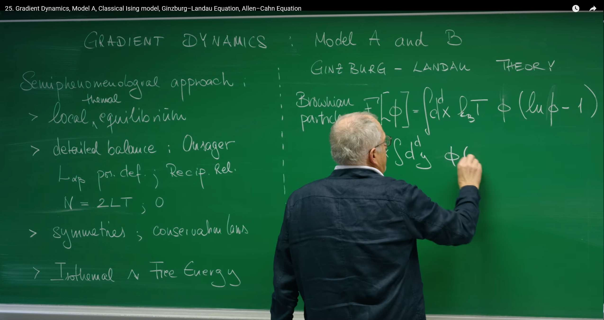
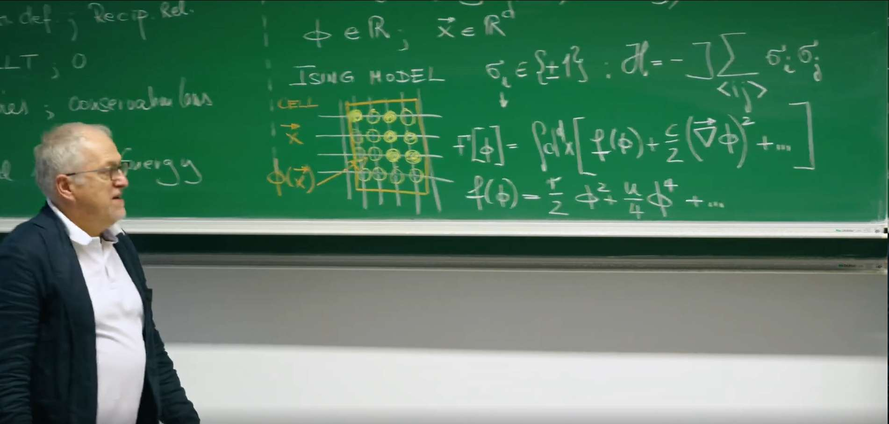
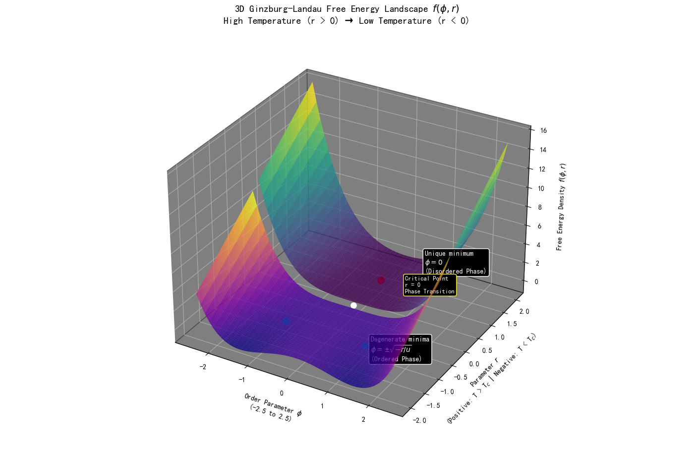
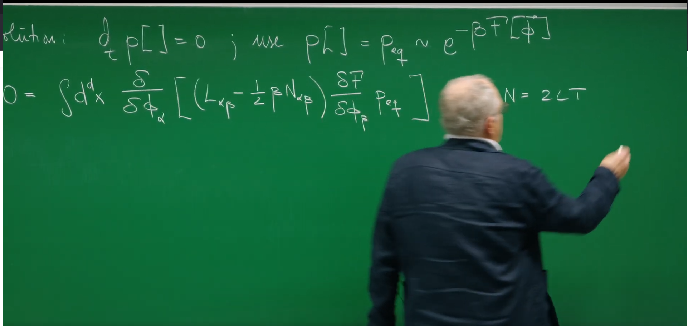

# Introduction: Toward Dynamic Evolution - Relaxational Dynamics

In previous lectures, Prof. Erwin Frey established a grand and universal theoretical framework through **Onsager's Theory** and the **Dynamic Fluctuation-Dissipation Theorem**. This framework utilizes symmetry and fundamental thermodynamic principles to construct a unified physical picture for the fluctuation and dissipation laws that any system close to equilibrium must follow. We drew a static free-energy landscape: **the system sits stably in the "valleys" of that landscape.**

However, a fundamental question remains unresolved: **If the system does not initially start at the minimum of the free energy, how does it get there? Along what path and at what rate does the system "slide" toward equilibrium?**

This lecture will use the universal principles established in the previous lecture to **move from static equilibrium descriptions to dynamic evolution processes.** We will explore how a system, driven by free energy, gradually evolves toward equilibrium over time. This process is called **relaxation**.

To achieve this goal, we will construct the simplest and most fundamental dynamical models describing relaxation processes. Based on whether the key macroscopic quantity—the **order parameter**—is conserved, these models are divided into two types:

**Model A:** Describes the dynamics of a **non-conserved** order parameter. This is the focus of this lecture.

**Model B:** Describes the dynamics of a **conserved** order parameter. This will be discussed in the next lecture.

Prof. Frey will show how to derive a powerful theoretical equation—the **Time-Dependent Ginzburg-Landau Equation**—from a few universal physical principles. It can not only describe the deterministic "downhill" motion of the system along the free-energy gradient, but also incorporate the incessant random "kicks" from temperature. We will see how to construct a powerful theory from a few universal physical principles. This model will become the cornerstone for understanding more complex nonequilibrium phenomena, especially suitable for describing **the dynamical behavior near continuous phase transition critical points**.



# 1. Theoretical Basis - Gradient Dynamics and the Ginzburg-Landau Framework

Before formally constructing the dynamical equation describing "how" a system relaxes, we first need a powerful tool to describe "**what**" the system is, i.e., the **static properties** of the system near equilibrium. This tool is the foundational theory in condensed matter physics and statistical mechanics—the **Ginzburg-Landau Theory**.

This theory was proposed by Soviet physicists Vitaly Ginzburg and Lev Landau in 1950 to describe superconducting phenomena (this achievement ultimately helped them win the Nobel Prize in Physics), but the universality of its ideas extends far beyond this. The essence of the Ginzburg-Landau theory is a **phenomenological theory for studying phase transitions**. Its core idea is extremely elegant: **Near continuous phase transition points, the macroscopic state of a system can be described by a slowly varying order-parameter field, and the system's total free energy can be expanded into a power series of this order parameter and its gradients according to symmetry principles.**

This approach of "**ignoring microscopic details and focusing on macroscopic symmetry**" has achieved tremendous success and has been widely applied to describe phase transition processes in ferromagnets, liquid crystals, superfluids, and even cosmology.

## 1.1 Guiding Principles: A "Semiphenomenological" Method

Before building any dynamical theory, we need to clarify the guiding philosophy. As Prof. Frey reviewed at the beginning of the lecture, we will adopt a **"semiphenomenological"** approach. This method does not derive everything from first-principles microscopic foundations, but rather cleverly utilizes the most fundamental universal principles in physics as three "iron laws" to constrain the mathematical form of our theory.

**Constraint One: Local Thermal Equilibrium** This is the cornerstone of the entire framework. We assume that although the system is not globally in equilibrium, within each sufficiently small spatiotemporal region, it has already reached local thermodynamic equilibrium. The power of this assumption lies in the fact that it allows us to use the powerful theory of equilibrium thermodynamics—particularly **free energy**—to describe the local state of the system. This enables us to define a local free-energy density that depends on spatial position.

**Constraint Two: Detailed Balance and Onsager Relations** Detailed balance is a powerful feature of equilibrium states, requiring that any microscopic process and its reverse process occur at equal rates. In the linear response regime near equilibrium, this principle manifests as **Onsager reciprocity relations**. If we use a set of generalized fluxes $J_a$ and generalized forces $X_b$ to describe the system's relaxation process, their linear relationship is given by the kinetic coefficient matrix $L_{ab}$ (i.e., Onsager coefficients): $J_a = \sum_b L_{ab} X_b$. The Onsager relations state that in the absence of magnetic fields, this matrix is symmetric, i.e., $L_{ab} = L_{ba}$. This is a profound manifestation of microscopic reversibility at the macroscopic level of dynamical equations, providing strong constraints for our model.

**Constraint Three: Symmetries and Conservation Laws** This is the most fundamental law in physics. Any dynamical equation we construct must "respect" the intrinsic symmetries of the system. For example, for the classic **Ising model**, its energy remains unchanged under the transformation of all spin reversals ($\phi \to -\phi$), and our theory must reflect this. Similarly, **conservation laws** are crucial: whether a physical quantity (order parameter) is conserved will directly determine the form of its dynamical equation, which is also the core distinction between Model A (non-conserved) and Model B (conserved).

The power of this semiphenomenological method lies in the fact that it enables us to use a unified theoretical framework to describe a large class of physical systems that exhibit universal behavior near critical points (such as magnets, liquid-gas phase transitions, binary alloys, etc.) without getting entangled in the complex microscopic details of each system. **We use universal principles to determine the form of the equations, while the specific parameters in the equations (such as kinetic coefficients) are left to experiments to determine.**

## 1.2 Ginzburg-Landau Free-Energy Functional: The Landscape of Possibilities

Following Guiding Principle 1, the central physical quantity describing the (isothermal) equilibrium state of a system is the **Ginzburg-Landau (GL) free-energy functional** $F[\phi]$. It is a "function of functions" with the **order parameter** field $\phi(\mathbf{x})$ as its variable. The order parameter is a coarse-grained physical quantity used to measure the **degree of order** of the system. For example, in magnetic systems, $\phi(\mathbf{x})$ can represent the average magnetization near point $\mathbf{x}$.

Now, we use Guiding Principle 3 (symmetry) to construct the specific form of this functional. For an isotropic system, the most general form of its free-energy functional can be written as an integral over the entire space:

$$F[\phi] = \int d^d x \left[ f(\phi) + \frac{c}{2}(\nabla \phi)^2 + \ldots \right] \quad \text{}$$

This functional consists of two key contributions:

### 1. Local Potential $f(\phi)$ and Spontaneous Symmetry Breaking



The first term $f(\phi)$ is the local free-energy density. To respect the Ising symmetry $\phi \to -\phi$, its Taylor expansion contains only even powers. Truncating at quartic order gives the minima structure relevant near criticality:

$$f(\phi) = \frac{r}{2}\,\phi^2 + \frac{u}{4}\,\phi^4, \qquad u>0.$$

- For $r>0$ (high temperature, $T>T_c$), $f$ is a single-well potential with a unique minimum at $\phi=0$ (disordered phase).
- For $r<0$ (low temperature, $T<T_c$), $f$ becomes a symmetric double-well with degenerate minima at $\phi=\pm\sqrt{-r/u}$ (ordered phase). Choosing one minimum breaks the $\phi\to-\phi$ symmetry spontaneously - spontaneous symmetry breaking.

### 2. Gradient-Energy Term $\tfrac{c}{2}(\nabla \phi)^2$

This term penalizes spatial variations of $\phi$ and encodes interfacial costs. Positive $c$ favors smooth configurations, suppressing sharp domain walls and representing an effective surface tension for interfaces between phases.

### What Was Omitted?

Higher-order local terms (e.g., $\phi^6$) and higher-order gradient terms (e.g., $(\nabla^2 \phi)^2$) are omitted here. Near the critical point and for slowly varying fields, the quartic local term and the quadratic gradient term capture the essential physics. Additional anisotropies or couplings can be included when required by symmetry or materials specifics.

### Code Implementation 1: Visualizing the Free-Energy Landscape

To see spontaneous symmetry breaking more clearly, we can plot $f(\phi)$ for both $r>0$ and $r<0$.

```python
import numpy as np
import matplotlib.pyplot as plt

# Set matplotlib to support Chinese display
plt.rcParams['font.sans-serif'] = ['SimHei', 'FangSong', 'Microsoft YaHei']  # Specify default font
plt.rcParams['axes.unicode_minus'] = False  # Solve the problem that the minus sign '-' is displayed as a square when saving the image

def gld_potential(phi, r, u):
    """
    Calculate the Ginzburg-Landau local free energy density f(φ).
    
    Parameters:
    phi (np.ndarray): Order parameter values
    r (float): Temperature parameter
    u (float): Stability parameter
    
    Returns:
    np.ndarray: Free energy density f(φ)
    """
    return 0.5 * r * phi**2 + 0.25 * u * phi**4

# Define parameters
u = 1.0  # Stability parameter, kept positive
phi_range_3d = np.linspace(-2.5, 2.5, 100)

# Create a 3D figure with dark background
fig = plt.figure(figsize=(14, 10), facecolor='black')
ax = fig.add_subplot(111, projection='3d')
ax.xaxis.pane.fill = True
ax.yaxis.pane.fill = True
ax.zaxis.pane.fill = True
ax.xaxis.pane.set_color('black')
ax.yaxis.pane.set_color('black')
ax.zaxis.pane.set_color('black')
ax.xaxis.pane.set_edgecolor('white')
ax.yaxis.pane.set_edgecolor('white')
ax.zaxis.pane.set_edgecolor('white')
ax.tick_params(axis='x', colors='white')
ax.tick_params(axis='y', colors='white')
ax.tick_params(axis='z', colors='white')

# Set title and axis labels with detailed information
ax.set_title('3D Ginzburg-Landau Free Energy Landscape $f(\\phi, r)$\nHigh Temperature (r > 0) → Low Temperature (r < 0)', 
             color='white', fontsize=14, pad=20)
ax.set_xlabel('Order Parameter $\\phi$\n(-2.5 to 2.5)', color='white', labelpad=10)
ax.set_ylabel('Parameter $r$\n(Positive: T > T$_c$ | Negative: T < T$_c$)', color='white', labelpad=10)
ax.set_zlabel('Free Energy Density $f(\\phi, r)$', color='white', labelpad=10)

# Create two separate surfaces for r > 0 and r < 0 cases
# r > 0 (High temperature, disordered phase)
r_range_positive = np.linspace(0.1, 2.0, 50)
Phi_3d_pos, R_3d_pos = np.meshgrid(phi_range_3d[::2], r_range_positive)
F_3d_positive = 0.5 * R_3d_pos * Phi_3d_pos**2 + 0.25 * u * Phi_3d_pos**4

# r < 0 (Low temperature, ordered phase)
r_range_negative = np.linspace(-2.0, -0.1, 50)
Phi_3d_neg, R_3d_neg = np.meshgrid(phi_range_3d[::2], r_range_negative)
F_3d_negative = 0.5 * R_3d_neg * Phi_3d_neg**2 + 0.25 * u * Phi_3d_neg**4

# Plot both surfaces
surf1 = ax.plot_surface(Phi_3d_pos, R_3d_pos, F_3d_positive, cmap='viridis', alpha=0.8, label='r > 0 (T > T_c) - Disordered Phase')
surf2 = ax.plot_surface(Phi_3d_neg, R_3d_neg, F_3d_negative, cmap='plasma', alpha=0.8, label='r < 0 (T < T_c) - Ordered Phase')

# Add annotations for key features
# For r > 0 case: single minimum at phi = 0
ax.plot([0], [1.0], [0], 'ro', markersize=10)
ax.text(0.8, 1.5, 0.4, 'Unique minimum\n$\\phi = 0$\n(Disordered Phase)', color='white', fontsize=10,
        bbox=dict(boxstyle="round,pad=0.3", facecolor='black', edgecolor='white'))

# Add critical point indicator
ax.plot([0], [0], [0], 'wo', markersize=8)
ax.text(0.9, 0.6, 0.8, 'Critical Point\nr = 0\nPhase Transition', 
        color='white', fontsize=9,
        bbox=dict(boxstyle="round,pad=0.3", facecolor='black', edgecolor='yellow'))

# For r < 0 case: degenerate minima at phi = ±√(-r/u)
phi_min_pos = np.sqrt(-(-1.0) / u)  # For r = -1.0
phi_min_neg = -phi_min_pos
f_min = 0.5 * (-1.0) * phi_min_pos**2 + 0.25 * u * phi_min_pos**4
ax.plot([phi_min_pos, phi_min_neg], [-1.0, -1.0], [f_min, f_min], 'co', markersize=10)
ax.text(phi_min_pos+0.5, -1.5, f_min+0.5, 'Degenerate minima\n$\\phi = \\pm\\sqrt{-r/u}$\n(Ordered Phase)', 
        color='white', fontsize=10, bbox=dict(boxstyle="round,pad=0.3", facecolor='black', edgecolor='white'))

plt.tight_layout()
plt.show()
```



The three axes represent the order parameter $\phi$, the control parameter $r$ (temperature related), and the free-energy density $f(\phi,r)$. The colored surface is the "landscape"; at any fixed temperature (fixed $r$), the system flows toward the lowest valley.

- High-temperature disordered region ($r>0$): single-well potential with the unique minimum at $\phi=0$ (disordered phase).
- Low-temperature ordered region ($r<0$): as $r$ crosses zero and becomes negative, $\phi=0$ turns unstable and two symmetric valleys appear at lower energy (ordered phase).
- Phase transition and spontaneous symmetry breaking: the critical point $r=0$ marks the transition. For $r<0$, the system must choose one of the degenerate minima $\phi=\pm\sqrt{-r/u}$; once chosen, the state no longer respects left-right symmetry even though the underlying laws do. This is spontaneous symmetry breaking.

# 2. Model A - Equation of Motion for Relaxation

With the free-energy landscape describing the system's state, we can now construct the dynamical equation describing how the system "moves" on this landscape. Model A describes the simplest case: the relaxation dynamics of a **non-conserved** order parameter.

Non-conserved means that the total integral value of the order parameter in the system $\int \phi(\mathbf{x}, t) d^d x$ is not a quantity that must remain constant (for example, the total magnetization can change under the action of external fields). The microscopic mechanism behind this is that the system's order parameter can exchange with the external "heat bath." In a ferromagnet, when a single atom's spin flips, its angular momentum is exchanged with the lattice vibrations (phonons), so the total magnetization is not a conserved quantity of an isolated subsystem. This forms a sharp contrast with Model B to be discussed in the next lecture, which describes conserved fields (such as particle concentration in binary alloys) that cannot be created or destroyed out of thin air, but can only be redistributed within the system.

### 2.1 Langevin Equation for a Non-Conserved Field

The dynamics of Model A is described by a **Langevin equation**, which is the core equation of this lecture:

$$\frac{\partial \phi_\alpha(\mathbf{x}, t)}{\partial t} = -L_{\alpha\beta} \frac{\delta F[\phi]}{\delta \phi_\beta(\mathbf{x}, t)} + \xi_\alpha(\mathbf{x}, t)$$

This equation is not written out of thin air—it is a direct application of the Onsager theoretical framework we established in the previous lecture. Recall that in the previous lecture, we obtained a linear relationship between thermodynamic "flux" $J_a$ and "force" $\mu_b$: $J_a = L_{ab} \mu_b$. Here:

**Flux** $J_\alpha$ is the rate of change of the order parameter with time $\frac{\partial \phi_\alpha}{\partial t}$.

**Force** $\mu_\beta$ is the thermodynamic force conjugate to the order parameter $\phi_\beta$. For an isothermal system, it is proportional to the negative functional derivative of the free energy, i.e., $\mu_\beta \propto -\frac{\delta F}{\delta \phi_\beta}$.

Therefore, the deterministic part of this equation is essentially the concrete manifestation of the Onsager linear relationship $J = L \mu$ in continuous field theory.

We can decompose this equation into two parts for understanding:

**Deterministic Term:** $-L \frac{\delta F}{\delta \phi}$

* This term describes the deterministic evolution of the system driven by the free-energy landscape, embodying the core idea of **gradient dynamics**. This means that the system's evolution path has no "inertia"—its "velocity" ($\partial_t \phi$) at any moment is directly proportional to the "slope" at the current position ($-\delta F/\delta \phi$). This is a typical overdamped dynamics, consistent with the Smoluchowski equation we learned in Lecture 18.

* $\frac{\delta F}{\delta \phi}$ is the **functional derivative** of the free-energy functional $F$ with respect to the field $\phi$. Physically, it plays the role of the **thermodynamic force** or **chemical potential** $\mu$ driving the system's evolution. If we make a small perturbation to $\phi$ at some position $\mathbf{x}$ in the field, how much will the total free energy $F$ change as a result. It measures the "local slope" of the free-energy landscape in infinite-dimensional function space.

* The negative sign in the equation indicates that the direction of change of the system's order parameter is opposite to the gradient direction of the free energy. In other words, the system always evolves toward the direction that makes the free energy **decrease fastest**, just like a ball rolling down a hill will follow the steepest path.

* $L_{\alpha\beta}$ is the **Onsager kinetic coefficient** matrix, which is a positive-definite matrix describing the system's **mobility**. It determines how fast the order parameter relaxes under the same thermodynamic force, i.e., it sets the time scale of the system's evolution.

**Stochastic Term:** $\xi(\mathbf{x}, t)$

* This term represents **thermal noise** from the heat bath. Its physical origin is that the system (described by the coarse-grained order parameter $\phi$) is constantly exchanging energy with the numerous microscopic degrees of freedom that constitute the heat bath (such as atomic vibrations, molecular collisions). These microscopic interactions manifest as random "kicks" to the order parameter at the macroscopic scale.

* This noise term is typically modeled as **Gaussian white noise**, whose statistical properties are defined by the following two equations:

  1. Zero mean: $\langle \xi_\alpha(\mathbf{x}, t) \rangle = 0$. This means that the random kicks of the noise have no bias toward any specific direction on average.

  2. Spatiotemporal delta correlation: $\langle \xi_\alpha(\mathbf{x}, t) \xi_\beta(\mathbf{x}', t') \rangle = N_{\alpha\beta} \delta_{\alpha\beta} \delta(\mathbf{x} - \mathbf{x}') \delta(t-t')$. This indicates that noise at different times or different spatial points is completely uncorrelated. $N_{\alpha\beta}$ is a constant matrix that determines the intensity of the noise. The spatial $\delta(\mathbf{x} - \mathbf{x}')$ correlation is an idealized assumption, whose physical premise is that the correlation scale of microscopic processes that generate noise (such as molecular collisions) is much smaller than the variation scale of the order parameter $\phi$ we care about.

## 2.2 Arrow of Time: Free Energy as a Lyapunov Function

Does this equation indeed drive the system toward equilibrium? Consider $dF/dt$ in the deterministic limit:

$$
\frac{dF}{dt}
= \int d^d x \, \frac{\delta F}{\delta \phi_\alpha} \, \frac{\partial \phi_\alpha}{\partial t}
= \int d^d x \, \frac{\delta F}{\delta \phi_\alpha} \, \Big(-L_{\alpha\beta} \, \frac{\delta F}{\delta \phi_\beta}\Big)
= - \int d^d x \, \Big(\frac{\delta F}{\delta \phi}\Big)^T \! L \, \Big(\frac{\delta F}{\delta \phi}\Big) \le 0,
$$

since $L$ is positive definite. Thus $F$ never increases; it monotonically decreases until reaching a minimum where $\delta F/\delta\phi=0$. In dynamical systems, functions with this property are called Lyapunov functions.

This is not merely mathematical elegance; it has deep physical meaning. For an isothermal system in contact with a heat bath, the second law is equivalently expressed as non-increasing free energy, $dF/dt \le 0$. Showing that $F$ is a Lyapunov function embeds an irreversible arrow of time: the system inevitably relaxes toward equilibrium.

Historically, Aleksandr Lyapunov introduced his method in 1892 (General Problem of the Stability of Motion), allowing one to establish stability without solving nonlinear equations explicitly. The physical intuition is simple: in a dissipative system, total energy decays and the system comes to rest at a minimum. In our setting, the free energy plays this role.

## 2.3 Fluctuation-Dissipation Theorem: The Physics of Noise

The noise $\xi$ is essential at finite temperature $T$. The heat bath both dissipates energy (via friction/viscosity) and agitates the system (via random kicks). These two effects are two sides of the same microscopic coin, connected by the fluctuation-dissipation theorem (FDT).



From the Langevin equation one obtains a functional Fokker-Planck equation for $P[\phi,t]$. Requiring the known equilibrium solution $P_{\text{eq}}[\phi] \propto \exp[-F[\phi]/(k_B T)]$ to be stationary forces the drift and diffusion terms to cancel exactly. This yields the relation between the noise strength $N$ and the kinetic coefficients $L$ (in units with $k_B=1$):

$$N = 2 L T.$$

Thus dissipation (via $L$) and fluctuations (via $N$) are strictly linked, with proportionality set by $T$. This guarantees relaxation to and maintenance of thermal equilibrium.

# 3. Applications and Analysis of Model A

Now, we will apply the universal framework established earlier to the specific Ginzburg-Landau model and analyze its dynamical behavior.

## 3.1 Time-Dependent Ginzburg-Landau (Allen-Cahn) Equation

By substituting the GL free-energy functional into the dynamical equation of Model A, we can obtain a specific partial differential equation. To do this, we first need to calculate the functional derivative of the GL functional:

The calculation of functional derivatives is similar to the calculus of variations. For a functional $F[\phi] = \int d^d x \, \mathcal{L}(\phi, \nabla\phi)$, its functional derivative is $\frac{\delta F}{\delta \phi} = \frac{\partial \mathcal{L}}{\partial \phi} - \nabla \cdot \frac{\partial \mathcal{L}}{\partial (\nabla\phi)}$. In our example:

$$\mathcal{L} = \frac{r}{2}\phi^2 + \frac{u}{4}\phi^4 + \frac{c}{2}(\nabla\phi)^2$$

The ordinary derivative part with respect to $\phi$ gives: $\frac{\partial \mathcal{L}}{\partial \phi} = r\phi + u\phi^3$.

The derivative part with respect to $\nabla\phi$ gives: $\frac{\partial \mathcal{L}}{\partial (\nabla\phi)} = c\nabla\phi$.

Taking the divergence of the above and transferring the Laplacian operator acting on the test function to $\phi$ through integration by parts, we obtain the second part contribution as $-c\nabla^2\phi$.

Combining these, we get the complete functional derivative:

$$\frac{\delta F}{\delta \phi} = r\phi + u\phi^3 - c\nabla^2\phi$$

Substituting this result into the Langevin equation of Model A (considering a scalar field, i.e., $L_{\alpha\beta} \to L$), we obtain:

$$\frac{\partial \phi}{\partial t} = -L(r\phi + u\phi^3 - c\nabla^2\phi) + \xi(\mathbf{x}, t)$$

This equation is called the **Time-Dependent Ginzburg-Landau (TDGL) equation**. In the field of materials science, it has another more widely known name—the (noisy) **Allen-Cahn equation**. This equation was proposed by Sam Allen and John Cahn in 1979, originally used to describe the motion of **antiphase domain boundaries** in ordered alloys, and is a classic model for studying phase separation and interface dynamics.

This equation has a very clear physical picture: it is a **reaction-diffusion equation**.

- Reaction term $-L(r\phi + u\phi^3)$: a local driving toward minima of $f(\phi)$.
- Diffusion term $+Lc\nabla^2\phi$: a spatial coupling that smooths inhomogeneities, akin to surface tension penalizing interfaces.

Their competition produces rich spatiotemporal patterns, including domain coarsening.


## 3.2 Analysis in the Disordered Phase: Precursors of Criticality

To obtain analytic results, consider small fluctuations around $\phi=0$ for $r>0$ (above $T_c$). In the Gaussian approximation we drop $u\phi^4$ in $F$ and $u\phi^3$ in the dynamics. Fourier transforming to wavevector $\mathbf{q}$ decouples modes and yields

$$\frac{\partial \phi(\mathbf{q}, t)}{\partial t} = -L\,(r + c q^2)\, \phi(\mathbf{q}, t) + \xi(\mathbf{q}, t).$$

Each mode is an independent Ornstein-Uhlenbeck process with restoring rate $\Gamma_q=L(r+cq^2)$.

### Ornstein-Zernike Correlation Function

The static structure factor is $\langle |\phi(\mathbf{q})|^2 \rangle$. For an O-U process,

$$\langle |\phi(\mathbf{q})|^2 \rangle = \frac{\text{noise strength}}{\text{restoring rate}} = \frac{2LT}{2\,\Gamma_q} = \frac{T}{r + c q^2}.$$

This Lorentzian form is the Ornstein-Zernike correlation function, introduced in 1914 to explain critical opalescence.

### Divergent Correlations and Correlation Length $\xi$

Rewrite

$$\langle |\phi(\mathbf{q})|^2 \rangle = \frac{T/c}{q^2 + r/c} = \frac{T/c}{q^2 + \xi^{-2}}, \qquad \xi = \sqrt{\frac{c}{r}}.$$

The correlation length $\xi$ sets the spatial range of fluctuations. As $T \to T_c^+$, $r\to 0^+$ and $\xi\to\infty$: correlations become long-ranged and the system loses a characteristic length scale (scale invariance). In reciprocal space this appears as $\langle |\phi(\mathbf{q}\to 0)|^2 \rangle \propto T/r \to \infty$. This is the hallmark of criticality.

# Conclusion

Starting from universal concepts such as **Onsager's theory** established in the previous lecture, we have successfully constructed a concrete dynamical framework for an important class of physical processes—**the relaxation of non-conserved order parameters**—namely **Model A**. The entire process is guided by three core conceptual pillars:

1. **Gradient Dynamics**: We have clarified that the driving force for system relaxation comes from the gradient of the **free-energy functional**. The system moves toward equilibrium by "descending" along the free-energy landscape, with its evolution rate determined by the local free-energy gradient. The free energy itself plays the role of a **Lyapunov function**, ensuring that this "descent" path is unidirectional and irreversible, ultimately stabilizing at the energy minimum.

2. **Fluctuation-Dissipation Theorem**: The fluctuations of the heat bath (noise term $\xi$) and dissipation (Onsager coefficient $L$) are two sides of the same microscopic process. The strict relationship between them determined by temperature $T$, $N = 2LT$, is the key to ensuring that our dynamical model can correctly evolve to the thermodynamic equilibrium state described by the Boltzmann distribution.

3. **Critical Phenomena**: Through solving the model under Gaussian approximation, we have touched the core of modern phase transition theory. When the system approaches a continuous phase transition point ($r \to 0$), its **correlation length ($\xi = \sqrt{c/r}$)** diverges, leading to long-range correlations and intense fluctuations. This is the universal behavior revealed by the analysis of the **Ornstein-Zernike** correlation function, which perfectly explains the origin of **scale invariance** at critical points.

By integrating these ideas, we ultimately derived the **Time-Dependent Ginzburg-Landau (Allen-Cahn) equation**, which is a paradigmatic model for describing the dynamics of non-conserved order parameters. It successfully unifies local phase separation tendencies (the "reaction" term) and non-local interface tension (the "diffusion" term) in the same equation, and has wide applications in many fields of physics and materials science (such as **domain coarsening** in alloys).

However, Model A deals with the simplest case. In many physical systems, the order parameter is **conserved**, for example, the total number of atoms of two components in a binary alloy is fixed. In this case, the order parameter cannot disappear out of thin air at some location—its decrease must be accompanied by an increase elsewhere, which means the dynamics must be described by a "flow" or "flux." This constraint of conservation laws will fundamentally alter the form of the dynamical equation, leading to **Model B (Cahn-Hilliard equation)** to be explored in the next lecture. It will reveal more mysteries about structure formation in the nonequilibrium world.

