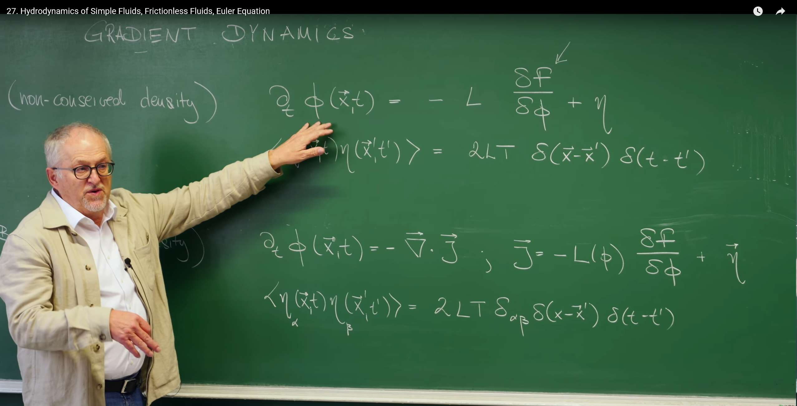
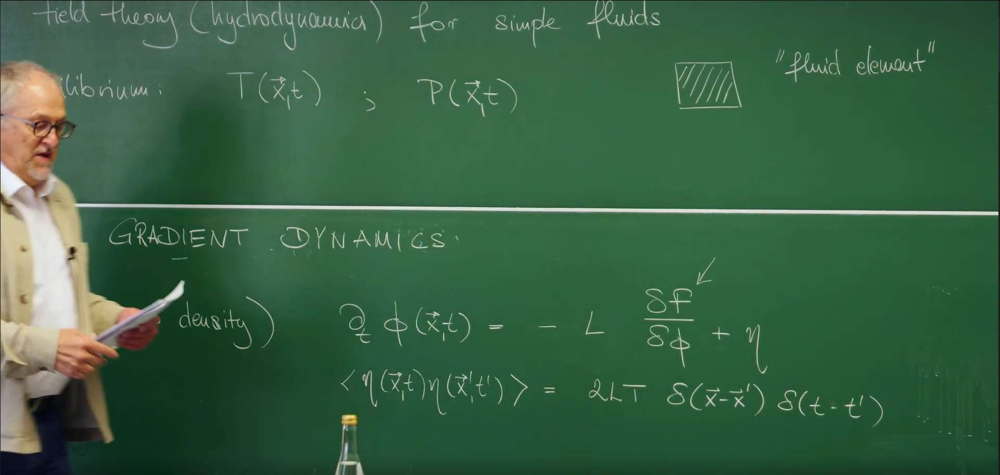
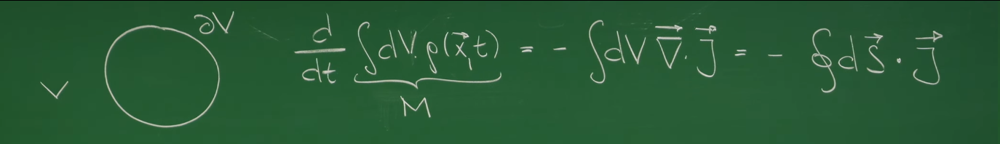
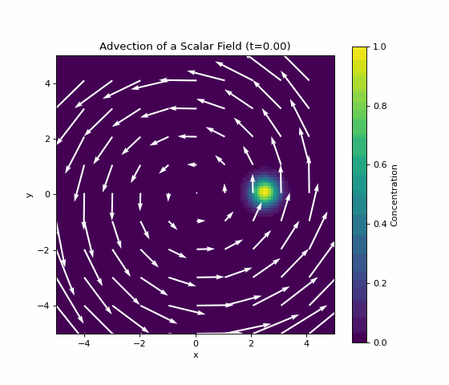

# Introduction: From Scalar Fields to Fluids

In earlier lectures we built a powerful framework for describing near-equilibrium systems based on **free energy** and **Onsager relations**, but our discussion has been limited to the evolution of a single **scalar order parameter** $\phi(x,t)$. In this lecture we broaden our scope from gradient dynamics of an abstract order parameter to hydrodynamics—the most ubiquitous macroscopic motion in the physical world. This is not merely adding variables; it is a new level of description.

We will see that the equations governing fluid motion arise from the same foundations as before: symmetries and conservation laws. Our goal is to derive, from first principles, the full dynamical equations for the most idealized fluid—an inviscid (frictionless) fluid.

We systematically develop the three basic conservation laws:
- Mass conservation
- Momentum conservation
- Energy conservation

Along the way we obtain two landmark equations of fluid mechanics—the continuity equation and the Euler equation—and uncover the thermodynamic content of ideal fluid motion.

# 1. From Gradient Dynamics to Hydrodynamics

In our exploration of near-equilibrium system dynamics, we have deeply studied the gradient dynamics describing the evolution of a single scalar field $\phi(x,t)$. To better connect with the content of this lecture, Professor Erwin Frey first briefly reviews its core ideas and explains how they naturally lead to a more comprehensive and universal theory of fluids.



## 1.1 Review: Two Relaxational Models

In previous lectures, we learned that gradient dynamics is mainly divided into two models, distinguished by whether the order parameter is **conserved**.

- **Model A (non-conserved field)**: Its dynamics is described by a local Langevin equation:

  $$\frac{\partial \phi(\vec{x},t)}{\partial t} = -L \frac{\delta F}{\delta \phi} + \eta$$

  The noise term satisfies:

  $$\langle \eta(\vec{x}, t) \eta(\vec{x}', t') \rangle = 2LT \delta(\vec{x} - \vec{x}') \delta(t - t')$$

  This equation describes a local **relaxation** process. The field $\phi$ at any point in space can independently increase or decrease, and the driving force for its change comes from the decrease of the system's **free energy** $F$. $L$ is a **kinetic coefficient**, and $\eta$ represents **thermal noise**.

- **Model B (conserved field)**: Its dynamics must follow the form of a **continuity equation**:

  $$\frac{\partial \phi(\vec{x},t)}{\partial t} = -\nabla \cdot \vec{J}$$

  where the flux $\vec{J}$ is driven by the gradient of chemical potential:

  $$\vec{J} = -M \nabla \frac{\delta F}{\delta \phi} + \vec{\eta}_J$$

  The fluctuation flux term satisfies:

  $$\langle \eta_{J\alpha}(\vec{x}, t) \eta_{J\beta}(\vec{x}', t') \rangle = 2MT \delta_{\alpha\beta} \delta(\vec{x} - \vec{x}') \delta(t - t')$$

  This form is fundamentally different in physics. It indicates that the total amount of the field $\phi$ is conserved and cannot be created or destroyed out of thin air in space. Any local change in the field must originate from a physical **flux** $\vec{J}$ flowing into or out of that region. (Note: Here we use the more complete Model B expression, where $M$ is usually called the mobility. In the blackboard review, the professor may have omitted the gradient operator $\nabla$ for simplicity.)

## 1.2 Hydrodynamics as a Universal Theory

This lecture will transition from Model B describing a single scalar field to **hydrodynamics**. The equation form of Model B, $\frac{\partial (\text{density})}{\partial t} + \nabla \cdot (\text{flux}) = 0$, is not merely an equation describing a single order parameter; it is actually the universal mathematical template for all **conservation laws** in physics.

The core task of hydrodynamics is to extend this universal mathematical framework from describing a single abstract order parameter to describing the most fundamental set of **conserved quantities** that any fluid must obey. These conserved quantities—**mass, momentum, and energy**—are the dominant degrees of freedom for any macroscopic system at low frequencies (long time scales) and long wavelengths (large spatial scales). Because their changes can only be accomplished through long-distance transport, they are the "slowest" variables in the system.

Therefore, hydrodynamics is an extremely universal theory that does not care about microscopic details (such as specific intermolecular forces) but focuses only on the most fundamental symmetries and conservation laws of the system. The entire content of this lecture is to find the corresponding "flux" for each of the three basic conserved quantities of fluids—mass, momentum, and energy—and construct a complete set of dynamical equations describing ideal fluids (frictionless fluids).

Our task is to identify, for each conserved density, its conjugate flux and assemble the ideal (inviscid) fluid equations.

# 2. Foundations: Assumptions and State Fields

To establish a universal theory capable of describing the macroscopic motion of fluids, we do not need to delve into the specific behavior of each molecule. Instead, we start from two powerful and fundamental physical assumptions and define a set of **macroscopic fields** that can describe the state of the fluid based on these assumptions.

## 2.1 Assumption I: Continuum Medium and Fluid Element

We first introduce the **continuum medium assumption**. Under this assumption, we ignore the microscopic molecular structure of the fluid and treat it as a continuous substance that can be infinitely divided. To mathematically handle this continuum, we define a core concept—the **"fluid element"**.

A "fluid element" is such a small volume:

* **On macroscopic scales, it is small enough** to be approximated as a mathematical point $(\vec{x}, t)$, allowing us to use calculus tools (such as gradients and divergences) to describe the spatial variations of physical quantities.
* **On microscopic scales, it is large enough** to contain a huge number of molecules. This allows statistical physical quantities such as density, pressure, and temperature to be well defined within it, and the internal fluctuations can be averaged out.

As the professor mentioned in class, the scope of application of this assumption is surprisingly broad. Even at the scale of 20-30 nanometers, for fluids like water, the continuum description is still valid in most cases.




## 2.2 Assumption II: Local Thermal Equilibrium

This is the second cornerstone of fluid dynamics theory: the **local equilibrium assumption**. It states:

Even when the entire fluid system is macroscopically out of equilibrium (for example, there is flow, temperature gradients, etc.), we can still assume that every "fluid element" is in its own **internal thermodynamic equilibrium state** at any moment.

The power of this assumption lies in the fact that it allows us to define a series of local thermodynamic state variables at each spacetime point $(\vec{x}, t)$, such as local temperature $T(\vec{x}, t)$ and local pressure $P(\vec{x}, t)$. It is precisely because of this that we can apply all the powerful tools and relations of equilibrium thermodynamics (such as the first law of thermodynamics, Gibbs relations, etc.) to describe a dynamically evolving, non-equilibrium fluid system.

## 2.3 Fundamental Fields: Conserved Slow Variables

Based on the above assumptions, we need to choose a set of the most fundamental physical fields to describe the state of the fluid. Which fields should we choose? The guiding principle of theoretical physics is: **choose the slow variables of the system, because they determine the macroscopic dynamics of the system at long times and large scales**. In a fluid system, the "slowest" variables are precisely those **conserved quantities**, because their changes can only be accomplished through long-distance material transport.

For a **simple fluid** (i.e., a fluid composed of a single component), we choose the densities of the following three basic conserved fields to describe its state:

1. **Mass density field** $\rho(\vec{x}, t)$: the mass of fluid per unit volume. This is our most basic scalar field.

2. **Momentum density field** $\vec{g}(\vec{x}, t)$: the momentum of fluid per unit volume. It is a vector field, closely related to the fluid's **velocity field** $\vec{v}(\vec{x}, t)$, defined as:

   $$\vec{g}(\vec{x}, t) = \rho(\vec{x}, t) \vec{v}(\vec{x}, t)$$

   The velocity field $\vec{v}(\vec{x}, t)$ will be one of the core variables we need to solve for.

3. **Energy density field** $\epsilon(\vec{x}, t)$: in the construction of fluid dynamics, we usually focus on the **internal energy per unit mass**. The total energy density of the fluid also needs to consider the kinetic energy of macroscopic flow, which we will discuss in detail in the energy conservation section.

Angular momentum is also a conserved quantity, but in the absence of internal spin or external torque, its dynamics can be derived from the evolution of the momentum field, so we do not take it as an independent fundamental field here.

With this set of basic assumptions and descriptive fields, we can now construct the corresponding dynamical equations for each conserved quantity.

# 3. First Pillar: Mass Conservation and the Continuity Equation

## 3.1 Integral Form: Physical Intuition

Now we begin to apply the conservation law framework established in the first section. The first, and simplest, fundamental pillar comes from the **mass conservation law**. Our task is to find the corresponding "density" and "flux" for the conserved quantity of mass.

We start from the most intuitive physical picture: consider an arbitrary fixed control volume $V$ in space with surface $\partial V$. The physical intuition of mass conservation is: "the change in total mass within a closed volume can only be achieved through material flow across its boundary."

* **"Density"**: The density describing mass is the **mass density field** $\rho(\vec{x}, t)$. Therefore, the total mass within volume $V$ is $M = \int_V dV \, \rho(\vec{x}, t)$.

* **"Flux"**: The physical quantity describing mass flow is the **mass current** or **mass flux** $\vec{J}(\vec{x}, t)$. For a fluid with velocity $\vec{v}$, this flux is intuitively equal to density times velocity: $\vec{J}(\vec{x}, t) = \rho(\vec{x}, t) \vec{v}(\vec{x}, t)$.

* **Conservation law**: The rate of change of total mass within the volume must equal the **net inflow** of mass into that volume. The total flux flowing outward through surface $\partial V$ is $\oint_{\partial V} d\vec{S} \cdot \vec{J}$, where $d\vec{S} = \hat{n} dS$ is the area element pointing outward from the volume. Therefore, the integral form of mass conservation can be written as:

$$\frac{d}{dt} \int_V dV \, \rho = -\oint_{\partial V} d\vec{S} \cdot \vec{J}$$

The negative sign on the right side of the equation indicates that when the net flux is positive (outward flow), the internal mass decreases.



## 3.2 Differential Form: Local Conservation

The integral form describes the macroscopic behavior of the entire volume. To obtain a local equation applicable to every point in space, we use **Gauss's Divergence Theorem** to convert the surface integral in the above equation into a volume integral:

$$\oint_{\partial V} d\vec{S} \cdot \vec{J} = \int_V dV (\nabla \cdot \vec{J})$$

Substituting into the integral form of the conservation equation and moving the time derivative inside the integral, we get:

$$\int_V dV \left( \frac{\partial \rho}{\partial t} + \nabla \cdot \vec{J} \right) = 0$$

Since this relationship must hold for **arbitrarily chosen** control volumes $V$, the integrand itself must be zero everywhere. Thus, we obtain the differential form of mass conservation, the **continuity equation**:

$$\frac{\partial \rho}{\partial t} + \nabla \cdot (\rho \vec{v}) = 0$$

This equation is the first fundamental equation of fluid dynamics. It perfectly embodies the conservation law structure of Model B and lays the foundation for us to derive other equations next.

# 4. Second Pillar: Momentum Conservation and the Euler Equation

After establishing mass conservation, we now turn to the next conserved quantity—momentum. The description of momentum conservation will reveal to us the dynamical laws of how fluids move. For an ideal fluid without viscosity (i.e., frictionless), this law is given by the famous **Euler equation**.

## 4.1 Material Derivative: Bridging Lagrangian and Eulerian Views

When deriving dynamical equations, we face a core perspective problem: Newton's second law ($\vec{F}=m\vec{a}$) is applied to a specific object (i.e., a particular "fluid element"), describing the acceleration that this object **experiences itself**. This is a "go with the flow" **Lagrangian view**. However, the field theory we have established describes how physical fields evolve in a fixed laboratory coordinate system, which is a "stand and observe" **Eulerian view**.

To build a bridge between these two perspectives, we need a mathematical tool that can answer this question: "What is the total rate of change of a physical quantity $f$ experienced by a particle following the fluid motion?" This tool is the **material derivative**, denoted $\frac{D f}{D t}$.

A particle following the fluid motion experiences changes in the physical quantity $f(\vec{x}, t)$ from two parts:

1. **Local change**: Even if the particle doesn't move, the value of $f$ at its location $\vec{x}$ may change over time, described by the partial derivative $\frac{\partial f}{\partial t}$.

2. **Convective change**: The particle is "carried" by the velocity field $\vec{v}$ to a new position, and the value of $f$ at the new position is different from that at the original position. This change caused by position movement is called **convection**, described by $(\vec{v} \cdot \nabla)f$.

Adding the two together, we get the complete expression for the material derivative:

$$\frac{D f}{D t} = \frac{\partial f}{\partial t} + (\vec{v} \cdot \vec{\nabla})f$$

This derivative perfectly combines the field change in the Eulerian view ($\frac{\partial f}{\partial t}$) with the particle motion in the Lagrangian view ($\vec{v}$).

## 4.2 Euler Equation: Newton’s Second Law for a Fluid Element

Now we can apply Newton's second law $\vec{F} = m \vec{a}$ to a fluid element with volume $dV$:

* **Mass** $m$: $m = \rho dV$.
* **Acceleration** $\vec{a}$: The acceleration of the fluid element is the rate of change of its velocity **following the fluid motion**, so we must use the material derivative: $\vec{a} = \frac{D\vec{v}}{Dt}$.
* **Force** $\vec{F}$: For an ideal fluid without friction, the only force acting on the fluid element comes from the **pressure** of the surrounding fluid. The net pressure on a fluid element comes from the pressure difference across its surface, and this net force equals the **negative gradient** of pressure times volume: $\vec{F} = -(\nabla P) dV$.

Substituting these three terms into Newton's second law:

$$(\rho dV) \frac{D\vec{v}}{Dt} = -(\nabla P) dV$$

Canceling $dV$ and expanding the material derivative, we obtain the final form of the **Euler equation**:

$$\rho \left( \frac{\partial \vec{v}}{\partial t} + (\vec{v} \cdot \nabla) \vec{v} \right) = -\nabla P$$

This equation describes how the velocity field of an inviscid fluid evolves in time and space due to pressure gradients. The **nonlinear convective term** $(\vec{v} \cdot \nabla) \vec{v}$ is the core source of the richness and complexity of fluid mechanics. It is precisely this term of the velocity field multiplied by its own gradient that dominates the self-transport of momentum in the fluid and ultimately leads to complex fluid phenomena such as turbulence and vortices.

## 4.3 Momentum Flux Tensor: A Unified Conservation Form

To maintain consistency with the form of mass conservation, we can use the continuity equation to strictly rewrite Euler's equation into the "density-flux" form of momentum conservation:

$$\frac{\partial (\rho v_i)}{\partial t} = -\sum_k \frac{\partial \Pi_{ik}}{\partial x_k}$$

Here the "density" is the $i$-th component of momentum $\rho v_i$, while the "flux" is a more complex object—the **momentum flux tensor** $\Pi_{ik}$. For an inviscid fluid, it is defined as:

$$\Pi_{ik} = P \delta_{ik} + \rho v_i v_k$$

The physical meaning of this second-order tensor $\Pi_{ik}$ is: **the transport of the $i$-th component of momentum through a unit area with normal pointing in the $k$-th direction per unit time**. It is contributed by two completely different physical processes:

1. **Hydrostatic pressure term** $P \delta_{ik}$: This represents momentum exchange due to random thermal motion of molecules, manifesting as macroscopic isotropic pressure. The **Kronecker delta** $\delta_{ik}$ ensures that it only contributes normal stress.

2. **Convective transport term** $\rho v_i v_k$: This represents momentum transport carried by the macroscopic overall motion of the fluid. It is the result of the $i$-th component of momentum being "carried" by the $k$-th component of velocity through the plane. This is an anisotropic contribution whose magnitude and direction depend on the flow direction. This term is also called a **dyadic product**.

By introducing the momentum flux tensor, we successfully unify the complex Euler equation into the universal conservation law framework of $\frac{\partial (\text{density})}{\partial t} + \nabla \cdot (\text{flux}) = 0$.

## 4.4 Visualization: Python Advection of a Scalar Field

Before letting a vector field advect itself, visualize how a given velocity field transports a scalar concentration $c$.

```python
import numpy as np
import matplotlib.pyplot as plt
from matplotlib.animation import FuncAnimation

# --- 1. Set simulation parameters ---
L = 4.0
N = 200
dt = 0.02
n_steps = 200
omega = 1.0  # angular speed for solid-body rotation

# --- 2. Create grid and field ---
x = np.linspace(-L/2, L/2, N)
y = np.linspace(-L/2, L/2, N)
X, Y = np.meshgrid(x, y)

# Initial scalar field: a Gaussian "dye drop"
c = np.exp(-((X - L/4)**2 + Y**2) / (0.5**2))

# Velocity field: a vortex rotating around the origin
vx = -omega * Y
vy = omega * X

# --- 3. Set up plot ---
fig, ax = plt.subplots(figsize=(7, 6))

# Plot scalar field c
im = ax.imshow(c, extent=[-L/2, L/2, -L/2, L/2], origin='lower',
               cmap='viridis', vmin=0, vmax=1)
fig.colorbar(im, label='Concentration')

# Plot velocity field v (plot every 10 points to keep it clear)
skip = 10
ax.quiver(X[::skip, ::skip], Y[::skip, ::skip],
          vx[::skip, ::skip], vy[::skip, ::skip],
          color='white', scale=30)

ax.set_title("Advection of a Scalar Field (t=0.00)")
ax.set_xlabel("x")
ax.set_ylabel("y")
ax.set_aspect('equal')

# --- 4. Define animation update function ---
def animate(frame):
    global c
    # Calculate gradient of scalar field
    # np.gradient returns dy, dx order
    grad_c_y, grad_c_x = np.gradient(c, y, x)

    # Calculate advection term v dot grad(c)
    advection_term = vx * grad_c_x + vy * grad_c_y

    # Update scalar field using forward Euler method
    c = c - advection_term * dt

    # Update image data
    im.set_array(c)
    ax.set_title(f"Advection of a Scalar Field (t={frame*dt:.2f})")
    return [im]

# --- 5. Create and run animation ---
ani = FuncAnimation(fig, animate, frames=n_steps,
                    interval=30, blit=True)

# --- 6. Save animation as GIF file ---
# Requires ImageMagick or ffmpeg
ani.save('advection.gif', writer='pillow', dpi=80, fps=20)

plt.show()
```



- Transport: the dye swirls around under the velocity field.
- Deformation: because the velocity varies in space, the drop is stretched and twisted.

This illustrates the meaning of $(\mathbf{v}\cdot\nabla)f$: advection redistributes a field by the flow. In Euler’s equation the advected field is $\mathbf{v}$ itself—momentum is transported by the fluid.

# 5. Third Pillar: Energy Conservation and Isentropic Flow

After establishing mass and momentum conservation, we now derive the last and most profound conservation law—**energy conservation**. As the professor mentioned, this derivation is not so intuitive because it requires us to closely combine the dynamical equations we derived earlier with **thermodynamics**. This process will ultimately reveal a crucial thermodynamic property of inviscid fluids.

The total energy of a fluid element consists of two parts: **kinetic energy** contributed by macroscopic overall motion and **internal energy** contributed by random microscopic molecular motion. Therefore, the total energy density per unit volume is:

$$e_{\text{total}} = \frac{1}{2} \rho v^2 + \rho \epsilon$$

where $\epsilon$ is the **internal energy per unit mass**. Our goal is still to find the corresponding **energy current** $\vec{J}^{(\epsilon)}$ for this conserved energy density, such that it satisfies the general form of conservation law: $\frac{\partial e_{\text{total}}}{\partial t} = -\nabla \cdot \vec{J}^{(\epsilon)}$.

## 5.2 Derivation of Energy Conservation

This is a relatively complex derivation. We will follow the classroom approach, dividing the total energy into kinetic and internal energy parts and calculating their time derivatives separately.

### 1. Time derivative of the kinetic energy term:

We first calculate the time derivative of kinetic energy density $\frac{1}{2} \rho v^2$. Using the product rule and substituting the **continuity equation** we derived (for $\partial_t \rho$) and **Euler's equation** (for $\partial_t \vec{v}$), after a series of algebraic operations, we obtain:

$$\frac{\partial}{\partial t} \left( \frac{1}{2} \rho v^2 \right) = -\nabla \cdot \left( \rho \vec{v} \frac{1}{2} v^2 \right) - \vec{v} \cdot \nabla P$$

The physical meaning of this expression is: the local change in kinetic energy density comes partly from the convection of kinetic energy (first term, a perfect flux divergence form) and partly from the work done by pressure gradients on the fluid (second term).

2) Thermodynamics:

Local equilibrium implies the Gibbs relation for the specific internal energy $\epsilon$,

$$d\epsilon = T\,ds + \frac{P}{\rho^2}d\rho,$$

and it is convenient to introduce the specific enthalpy $h=\epsilon + P/\rho$ with $dh=T\,ds + (1/\rho)\,dP$.

3) Combine and simplify:

With these relations, the total energy balance becomes

$$\frac{\partial}{\partial t}\Big(\tfrac{1}{2}\rho v^2 + \rho\epsilon\Big) = -\nabla\cdot\big[\rho\mathbf{v}\,(\tfrac{1}{2}v^2 + h)\big] + \rho T\Big(\frac{\partial s}{\partial t} + (\mathbf{v}\cdot\nabla)s\Big).$$

## 5.3 Isentropic Condition: A Consequence of Inviscid Flow

For ideal flow without viscosity or heat conduction, there are no irreversible sources of entropy. Hence the advected entropy is constant:

Observing the final form of the above equation, it is almost a perfect conservation equation, except for the last term. The left side is the time derivative of energy density, and the first term on the right side is the divergence of a flux. For energy to be truly conserved, the **source/sink term** on the right side of the equation must be zero. This means:

$$\rho T \left( \frac{\partial s}{\partial t} + (\vec{v} \cdot \vec{\nabla}) s \right) = \rho T \frac{Ds}{Dt} = 0$$

Since $\rho$ and $T$ are usually non-zero, we obtain a profound physical conclusion:

$$\frac{Ds}{Dt} = 0$$

The meaning of this equation is: for an ideal fluid without friction and heat conduction, **every fluid element maintains constant entropy as it follows the fluid motion**. This type of flow is called **isentropic flow**. This is precisely the inevitable thermodynamic result of our initial "frictionless, non-dissipative" assumption: because there is no internal friction producing irreversible heat, the evolution of fluid elements is reversible, so their entropy does not increase.

Thus each fluid element carries constant entropy (isentropic flow), and the energy equation becomes a pure conservation law with flux $\mathbf{J}^{(\epsilon)}=\rho\mathbf{v}(\tfrac{1}{2}v^2 + h)$.

## 5.4 Physical Meaning of the Energy Flux

The energy flux combines transport of kinetic energy and enthalpy by the flow—a compact way to express mechanical work and internal‑energy transport under isentropic, inviscid conditions.

## 5.5 Code Practice: Eulerian Fluid Simulation (Conjugate Gradient)

We will adopt a more direct **macroscopic approach**—a solver based on **Eulerian grids** that directly performs numerical solutions of fluid dynamics equations. The algorithm we will implement is the very classic "Stable Fluids" method in the field of computer graphics.

The core of this algorithm is to decompose the evolution of the fluid into several physically clear steps and execute them sequentially at each time step:

1. **Advection**: This step is responsible for moving the physical properties of the fluid itself, such as velocity and color (dye). It answers the question: "Where will the fluid at the current position move to in the next moment?" We adopt an efficient **semi-Lagrangian method** that calculates which position from the previous time step the physical quantity at the current grid point should "inherit" from through time backtracking.

2. **External Forces**: In this step, we can add various forces or sources to the fluid. In our simulation, this mainly manifests as continuously "injecting" new dye and velocity from a specified region.

3. **Projection**: This is the **most critical step** for ensuring realistic and natural fluid motion. Its sole goal is to ensure that the flow field satisfies **incompressibility**, i.e., the divergence of the fluid is zero ($\nabla \cdot \vec{v} = 0$). This step itself is divided into three subtasks:
   a. Calculate the **divergence** of the current velocity field to find regions that do not satisfy the incompressibility condition.
   b. Solve a **pressure Poisson equation**, i.e., $\nabla^2 p = \nabla \cdot \vec{v}$. The solved pressure field $p$ tells us where pressure needs to be applied to "correct" the fluid flow direction.
   c. Use the calculated pressure gradient $\nabla p$ to correct the velocity field, ultimately obtaining a new velocity field with zero divergence that satisfies the incompressibility condition.

We will use the powerful **conjugate gradient method** to efficiently solve the pressure Poisson equation and utilize the parallel computing capabilities of the `Taichi` framework to accelerate the entire simulation process.

The following Taichi implementation demonstrates an Eulerian fluid solver with projection (pressure Poisson equation solved by CG), semi‑Lagrangian advection, and an RGB dye field.

```python
import taichi as ti

ti.init(arch=ti.gpu)

# General settings
resolutionX = 512
pixels = ti.Vector.field(3, dtype=ti.f32, shape=(resolutionX, resolutionX))  # Use RGB color
dt = 0.02
pause = False
temp_dye = 1.0
pixel_mid = resolutionX // 2
ix_length = 5
iy_length = 10
area = ti.Vector([8, pixel_mid - iy_length, 8 + ix_length, pixel_mid + iy_length])
inflow_velocity = ti.Vector([3.0, 0.0])

# Grid settings
_velocities = ti.Vector.field(2, dtype=ti.f32, shape=(resolutionX, resolutionX))
_new_velocities = ti.Vector.field(2, dtype=ti.f32, shape=(resolutionX, resolutionX))
velocity_divs = ti.field(dtype=ti.f32, shape=(resolutionX, resolutionX))
_pressures = ti.field(dtype=ti.f32, shape=(resolutionX, resolutionX))
_new_pressures = ti.field(dtype=ti.f32, shape=(resolutionX, resolutionX))
_dye_buffer = ti.Vector.field(3, dtype=ti.f32, shape=(resolutionX, resolutionX))  # RGB dye
_new_dye_buffer = ti.Vector.field(3, dtype=ti.f32, shape=(resolutionX, resolutionX))

# CG settings
b = ti.field(dtype=ti.f32, shape=resolutionX * resolutionX)
p = ti.field(dtype=ti.f32, shape=resolutionX * resolutionX)
Ax = ti.field(dtype=ti.f32, shape=resolutionX * resolutionX)
Ap = ti.field(dtype=ti.f32, shape=resolutionX * resolutionX)
r = ti.field(dtype=ti.f32, shape=resolutionX * resolutionX)
new_r = ti.field(dtype=ti.f32, shape=resolutionX * resolutionX)

# TexPair class for buffer swapping
class TexPair:
    def __init__(self, cur, nxt):
        self.cur = cur
        self.nxt = nxt

    def swap(self):
        self.cur, self.nxt = self.nxt, self.cur

# Interpolation functions
@ti.func
def sample(qf, u, v, res):
    i, j = int(u), int(v)
    i = max(0, min(res - 1, i))
    j = max(0, min(res - 1, j))
    return qf[i, j]

@ti.func
def lerp(vl, vr, frac):
    return vl + frac * (vr - vl)

@ti.func
def bilerp(vf, u, v, res):
    s, t = u - 0.5, v - 0.5
    iu, iv = int(s), int(t)
    fu, fv = s - iu, t - iv
    a = sample(vf, iu + 0.5, iv + 0.5, res)
    b = sample(vf, iu + 1.5, iv + 0.5, res)
    c = sample(vf, iu + 0.5, iv + 1.5, res)
    d = sample(vf, iu + 1.5, iv + 1.5, res)
    return lerp(lerp(a, b, fu), lerp(c, d, fu), fv)

velocities_pair = TexPair(_velocities, _new_velocities)
pressures_pair = TexPair(_pressures, _new_pressures)
dyes_pair = TexPair(_dye_buffer, _new_dye_buffer)

@ti.func
def vel_with_boundary(vf: ti.template(), i: int, j: int) -> ti.f32:
    if (i == j == 0) or (i == j == resolutionX - 1) or (i == 0 and j == resolutionX - 1) or (
            i == resolutionX - 1 and j == 0):
        vf[i, j] = ti.Vector([0.0, 0.0])
    elif i == 0:
        vf[i, j] = -vf[1, j]
    elif j == 0:
        vf[i, 0] = -vf[i, 1]
    elif i == resolutionX - 1:
        vf[resolutionX - 1, j] = -vf[resolutionX - 2, j]
    elif j == resolutionX - 1:
        vf[i, resolutionX - 1] = -vf[i, resolutionX - 2]
    return vf[i, j]

@ti.func
def p_with_boundary(pf: ti.template(), i: int, j: int) -> ti.f32:
    if (i == j == 0) or (i == j == resolutionX - 1) or (i == 0 and j == resolutionX - 1) or (
            i == resolutionX - 1 and j == 0):
        pf[i, j] = 0.0
    elif i == 0:
        pf[0, j] = pf[1, j]
    elif j == 0:
        pf[i, 0] = pf[i, 1]
    elif i == resolutionX - 1:
        pf[resolutionX - 1, j] = pf[resolutionX - 2, j]
    elif j == resolutionX - 1:
        pf[i, resolutionX - 1] = pf[i, resolutionX - 2]
    return pf[i, j]

@ti.kernel
def apply_vel_bc(vf: ti.template()):
    for i, j in vf:
        vel_with_boundary(vf, i, j)

@ti.kernel
def apply_p_bc(pf: ti.template()):
    for i, j in pf:
        p_with_boundary(pf, i, j)

@ti.kernel
def advect(vf: ti.template(), qf: ti.template(), new_qf: ti.template()):
    for IX, IY in vf:
        # Backtrace using semi-Lagrangian with 2nd order Runge-Kutta
        coord_curr = ti.Vector([IX, IY]) + ti.Vector([0.5, 0.5])
        vel_curr = vf[IX, IY]
        coord_mid = coord_curr - 0.5 * dt * vel_curr
        vel_mid = bilerp(vf, coord_mid[0], coord_mid[1], resolutionX)
        coord_prev = coord_curr - dt * vel_mid
        q_prev = bilerp(qf, coord_prev[0], coord_prev[1], resolutionX)
        new_qf[IX, IY] = q_prev

@ti.kernel
def addInflow(qf: ti.template(), area: ti.template(), quality: ti.template()):
    bl_ix, bl_iy, tr_ix, tr_iy = area[0], area[1], area[2], area[3]
    for i, j in qf:
        if bl_ix <= i <= tr_ix and bl_iy <= j <= tr_iy:
            qf[i, j] = quality

@ti.kernel
def fill_color(ipixels: ti.template(), idyef: ti.template()):
    for i, j in ipixels:
        density = ti.min(1.0, ti.max(0.0, idyef[i, j].norm()))
        ipixels[i, j] = ti.Vector([
            ti.min(density * 2.0, 1.0),
            ti.max(0.0, density * 2.0 - 1.0),
            ti.max(0.0, 1.0 - density * 2.0)
        ])

@ti.func
def coeff_matrix(row: int, col: int) -> ti.f32:
    res = 0.0
    n = resolutionX * resolutionX
    IY = row // resolutionX
    IX = row - resolutionX * IY
    if row >= n or row < 0 or col >= n or col < 0:
        res = 0.0
    else:
        if (IX == IY == 0) or (IX == IY == resolutionX - 1) or (IX == 0 and IY == resolutionX - 1) or (
                IX == resolutionX - 1 and IY == 0):
            if row == col:
                res = 1.0
            else:
                res = 0.0
        if row == col:
            res = -4.0
        elif ti.abs(col - row) == 1:
            res = 1.0
        elif ti.abs(col - row) == resolutionX:
            res = 1.0
    return res

@ti.func
def visit_vector(v: ti.template(), vid: int, length: int) -> ti.f32:
    res = 0.0
    if vid < 0 or vid >= length:
        res = 0.0
    else:
        res = v[vid]
    return res

@ti.func
def visit_pf_vector(pf: ti.template(), vid: int) -> ti.f32:
    res = 0.0
    n = resolutionX * resolutionX
    if vid >= n or vid < 0:
        res = 0.0
    else:
        IY = vid // resolutionX
        IX = vid - resolutionX * IY
        res = pf[IX, IY]
    return res

@ti.kernel
def pressure_cg_init(pf: ti.template(), b: ti.template()):
    n = resolutionX * resolutionX
    for row in range(n):
        ve1 = visit_pf_vector(pf, row - resolutionX)
        ve2 = visit_pf_vector(pf, row - 1)
        ve3 = visit_pf_vector(pf, row)
        ve4 = visit_pf_vector(pf, row + 1)
        ve5 = visit_pf_vector(pf, row + resolutionX)
        me1 = coeff_matrix(row, row - resolutionX)
        me2 = coeff_matrix(row, row - 1)
        me3 = coeff_matrix(row, row)
        me4 = coeff_matrix(row, row + 1)
        me5 = coeff_matrix(row, row + resolutionX)

        temp_Ax = me1 * ve1 + me2 * ve2 + me3 * ve3 + me4 * ve4 + me5 * ve5

        Ax[row] = temp_Ax
        r[row] = b[row] - Ax[row]
        p[row] = r[row]

@ti.kernel
def pressure_cg_iter(pf: ti.template()) -> ti.f32:
    n = resolutionX * resolutionX
    rkT_rk = 0.0
    pkT_A_pk = 0.0

    for i in range(n):
        rkT_rk += (r[i] * r[i])
        ve1 = visit_vector(p, i - resolutionX, n)
        ve2 = visit_vector(p, i - 1, n)
        ve3 = visit_vector(p, i, n)
        ve5 = visit_vector(p, i + resolutionX, n)
        me1 = coeff_matrix(i, i - resolutionX)
        me2 = coeff_matrix(i, i - 1)
        me3 = coeff_matrix(i, i)
        me4 = coeff_matrix(i, i + 1)
        me5 = coeff_matrix(i, i + resolutionX)

        temp_Ap = me1 * ve1 + me2 * ve2 + me3 * ve3 + me4 * ve4 + me5 * ve5
        Ap[i] = temp_Ap
        pkT_A_pk += (p[i] * temp_Ap)

    alpha = rkT_rk / pkT_A_pk
    res = 0.0
    top = 0.0
    bottom = 0.0
    for i in range(n):
        IY = i // resolutionX
        IX = i - resolutionX * IY
        new_pf_val = pf[IX, IY] + alpha * p[i]
        diff = ti.abs(new_pf_val - pf[IX, IY])
        res += (diff * diff)
        pf[IX, IY] = new_pf_val
        new_r_val = r[i] - alpha * Ap[i]
        new_r[i] = new_r_val
        top += (new_r_val * new_r_val)
        bottom += (r[i] * r[i])

    beta = top / bottom
    for i in range(n):
        p[i] = new_r[i] + beta * p[i]
        r[i] = new_r[i]
    res = ti.sqrt(res)
    return res

@ti.kernel
def construct_cg_b(divf: ti.template(), b: ti.template()):
    for IX, IY in divf:
        if (0 < IX < resolutionX - 1) and (0 < IY < resolutionX - 1):
            b[IY * resolutionX + IX] = divf[IX, IY]
        else:
            b[IY * resolutionX + IX] = 0.0

def pressure_cg(pf_pair, divf: ti.template()):
    residual = 10
    counter = 0
    construct_cg_b(divf, b)
    pressure_cg_init(pf_pair.cur, b)
    while residual > 0.01:
        residual = pressure_cg_iter(pf_pair.cur)
        counter += 1
        if counter > 30:
            break
    apply_p_bc(pf_pair.cur)

@ti.kernel
def divergence(field: ti.template(), divf: ti.template()):
    for i, j in field:
        divf[i, j] = 0.5 * (field[i + 1, j][0] - field[i - 1, j][0] + field[i, j + 1][1] - field[i, j - 1][1])

@ti.kernel
def correct_divergence(vf: ti.template(), vf_new: ti.template(), pf: ti.template()):
    for i, j in vf:
        vf_new[i, j] = vf[i, j] - ti.Vector([(pf[i + 1, j] - pf[i - 1, j]) / 2.0, (pf[i, j + 1] - pf[i, j - 1]) / 2.0])

gui = ti.GUI('Colorful Fluid Simulation', (512, 512))
frame_counter = 0

# Initial dye color is blue
initial_dye_color = ti.Vector([0.2, 0.2, 1.0])

while True:
    while gui.get_event(ti.GUI.PRESS):
        if gui.event.key in [ti.GUI.ESCAPE, ti.GUI.EXIT]: 
            exit(0)
        if gui.event.key == ti.GUI.SPACE:
            pause = not pause
    if not pause:
        for itr in range(15):
            # Add inflow
            addInflow(velocities_pair.cur, area, inflow_velocity)
            addInflow(dyes_pair.cur, area, initial_dye_color)
            # Advection
            apply_vel_bc(velocities_pair.cur)
            advect(velocities_pair.cur, velocities_pair.cur, velocities_pair.nxt)
            advect(velocities_pair.cur, dyes_pair.cur, dyes_pair.nxt)
            velocities_pair.swap()
            dyes_pair.swap()
            apply_vel_bc(velocities_pair.cur)
            # Projection step
            divergence(velocities_pair.cur, velocity_divs)
            pressure_cg(pressures_pair, velocity_divs)
            correct_divergence(velocities_pair.cur, velocities_pair.nxt, pressures_pair.cur)
            velocities_pair.swap()
        fill_color(pixels, dyes_pair.cur)

    frame_counter += 1
    filename = f'./video/frame_{frame_counter:05d}.png'
    gui.set_image(pixels.to_numpy())
    try:
        gui.show(filename)
    except:
        gui.show()
```

<video src="../assets/images/remote/fluid_simulation.mp4"></video>

The complex plumes, rolls, and mixing are driven by the nonlinear convective term $(\mathbf{v}\cdot\nabla)\mathbf{v}$—the source of rich flow morphologies from laminar structures to turbulence.

# 7. Summary

In this lecture, starting from the conserved model of **gradient dynamics**, we systematically constructed a theoretical framework for fluid dynamics describing **frictionless, non-conducting** simple fluids. Its core is based on the **local equilibrium assumption**, establishing conservation law equations for the three basic conserved quantities of fluids—mass, momentum, and energy. By deriving the corresponding physical "flux" for each conserved "density," we finally obtained a closed set of equations describing ideal fluid behavior, which is the **equations of ideal hydrodynamics**.

The following table summarizes the core content of this lecture, clearly showing the unified structure of these three conservation laws:

| Conserved Quantity | Density | Local Law | Flux | Physical Meaning |
| --- | --- | --- | --- | --- |
| Mass | $\rho$ | $\partial_t\rho + \nabla\cdot(\rho\mathbf{v})=0$ | $\mathbf{J}=\rho\mathbf{v}$ | Convective transport of mass |
| Momentum | $\rho v_i$ | $\partial_t(\rho v_i) + \partial_k\Pi_{ik}=0$ | $\Pi_{ik}=P\delta_{ik}+\rho v_iv_k$ | Isotropic pressure + convective momentum transport |
| Energy | $\tfrac{1}{2}\rho v^2+\rho\epsilon$ | $\partial_t e_{\text{total}} + \nabla\cdot\mathbf{J}^{(\epsilon)}=0$ | $\mathbf{J}^{(\epsilon)}=\rho\mathbf{v}(\tfrac{1}{2}v^2+h)$ | Transport of kinetic energy and enthalpy |

This set of equations is the cornerstone for our further understanding of more complex fluid phenomena. So far, we have constructed the most fundamental, non-dissipative "motion skeleton" for the fluid world. In the upcoming lectures, we will introduce **dissipative effects** (such as viscosity and heat conduction) on this basis, transitioning from the ideal Euler equation to the more universal **Navier-Stokes equations**, thereby enabling the description of more realistic and complex fluid phenomena.

