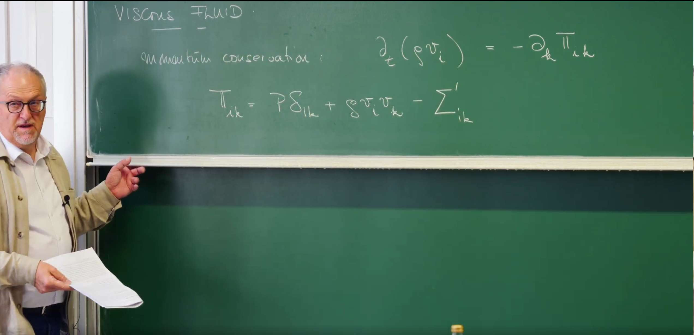
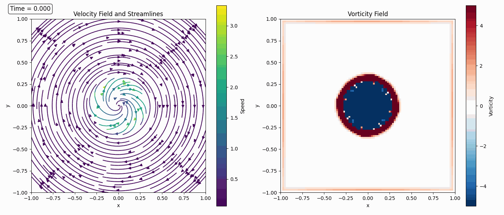
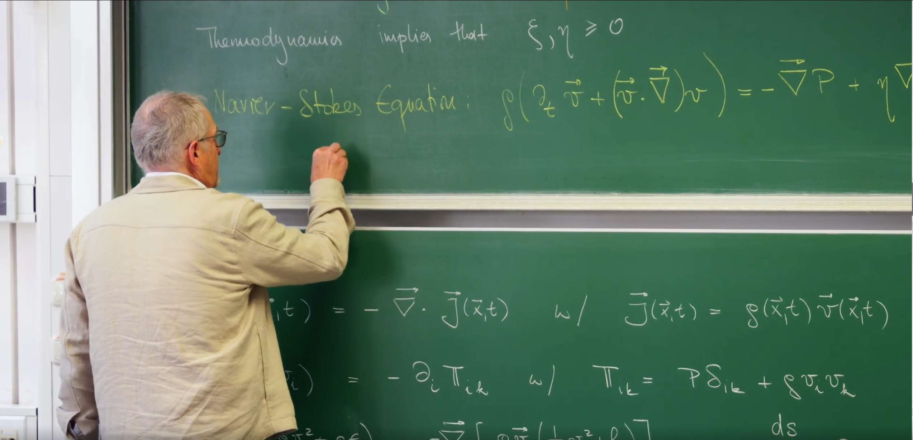
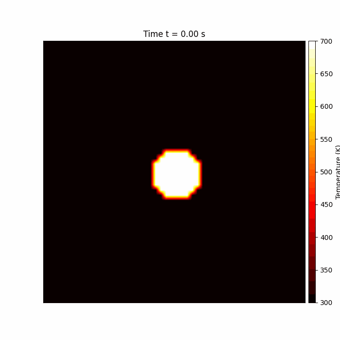

# Introduction: From Ideal to Real Fluids — Dissipation and Irreversibility

The previous lecture successfully constructed the dynamical framework of an **ideal fluid** by applying the three fundamental **conservation laws** of mass, momentum, and energy, with the core achievement being the **Euler equation**. The ideal fluid model is built on two key assumptions: no internal friction (i.e., inviscid) and no heat transfer, which means all processes are **reversible**, and each fluid element maintains constant entropy during motion (i.e., **isentropic flow**).

However, this elegant theoretical picture contrasts sharply with our daily experience. For example, when cream is stirred into coffee, it spreads uniformly, but we never see the spread cream spontaneously re-aggregate. This **irreversibility** is a fundamental characteristic of the real world. The Euler equation, due to its **time-reversal symmetry**, cannot describe such dissipative processes—a film of ideal fluid motion played backwards would still show trajectories that are completely consistent with physical laws.

This lecture transitions from the idealized reversible physical world to a more realistic irreversible world. Real fluids have two core dissipative mechanisms:

1. **Internal friction**, which manifests macroscopically as **viscosity**.
2. **Internal heat transfer**, which manifests macroscopically as **heat conduction**.

These two phenomena are concrete manifestations of the **irreversible processes** discussed in Lecture 24's Onsager theory. They are the microscopic sources of entropy production in the macroscopic world, irreversibly converting ordered macroscopic kinetic energy into disordered internal energy (heat).

To integrate these physical realities into the theory, we must amend the momentum flux tensor and energy flux derived in the previous lecture. Professor Erwin Frey introduces new terms to describe the **viscous stress tensor** driven by velocity gradients and the **heat flux density** driven by temperature gradients. Through this process, we break the time symmetry of the Euler equation, derive the more universal **Navier-Stokes equation**, and ultimately connect fluid dynamics with the second law of thermodynamics through constructing the **entropy balance equation**.



# 1. Dissipative Stress Tensor: Quantifying Irreversible Internal Friction

In the previous lecture, Professor Erwin Frey derived the momentum conservation equation for ideal fluids, with the core being the **momentum flux tensor** $\Pi_{ik} = P \delta_{ik} + \rho v_i v_k$. This expression describes two reversible momentum transfer mechanisms: isotropic pressure and macroscopic convection. However, this idealized model lacks a crucial component in the real world: **dissipation**. To describe the irreversible momentum exchange caused by internal friction, we need to correct this ideal momentum flux tensor.

The core task of this lecture is to establish a mathematical description for this dissipative process from basic physical principles, i.e., to construct the constitutive relation for the **viscous stress tensor**.

## 1.1 Correcting the Momentum Flux Tensor

Starting from the local form of the universal momentum conservation law, for the case without external body force sources, this law is expressed as:

$$\partial_t (\rho v_i) = -\partial_k \Pi_{ik}$$

where $\rho$ is the mass density, $v_i$ is the velocity field component, and $\Pi_{ik}$ is the momentum flux density tensor. Decompose the total stress on a fluid element’s surface as

$$\Sigma_{ik} = -P\,\delta_{ik} + \Sigma'_{ik},$$

- **Hydrostatic Pressure** $-P \delta_{ik}$: This is the only surface force that exists in ideal fluids, arising from the random thermal motion of molecules, with the effect of isotropic compression. The negative sign here is a convention, indicating that positive pressure $P$ produces compressive stress.

- **Viscous Stress Tensor** $\Sigma_{ik}'$: This is the new term introduced to describe real fluids, also called the **dissipative stress tensor**. It represents the additional, directional momentum exchange caused by velocity differences within the fluid (i.e., internal friction).

Substituting the total stress tensor gives the total momentum flux tensor for real fluids:

$$\Pi_{ik} = \underbrace{P\delta_{ik}+\rho v_i v_k}_{\text{ideal}} \;\underbrace{-\,\Sigma'_{ik}}_{\text{viscous}}.$$

The task is now to specify the constitutive relation for $\Sigma'_{ik}$ in terms of local kinematics.

## 1.2 Constitutive Relation for the Viscous Stress

A constitutive relation is not a universal fundamental law like momentum conservation, but rather a **phenomenological equation** describing the macroscopic behavior of specific materials or media. Its role is to establish mathematical connections between internal "responses" (such as stress, heat flow, electric current) and the "stimuli" that drive them (such as deformation, temperature gradients, electric fields). This relationship contains parameters characterizing material properties, such as Young's modulus for solids, electrical conductivity for conductors, and the viscosity coefficients to be determined for fluids.

Therefore, finding a constitutive relation for $\Sigma_{ik}'$ means answering: **For the fluid under study, how is the internal friction precisely determined by its flow pattern (i.e., velocity field gradients)?**

For **Newtonian fluids**, a core assumption is that viscous stress has a linear relationship with velocity gradients $\partial_k v_i$. This is completely consistent with the spirit of **Onsager's linear response theory** learned in Lecture 24: near thermodynamic equilibrium, fluxes driven by thermodynamic forces (here velocity gradients) are linearly related to those forces.

To construct this relationship, we first need to understand the physical meaning of the velocity gradient tensor $\partial_k v_i$. From a purely mathematical perspective, any second-order tensor (or square matrix) can be decomposed into a symmetric part and an antisymmetric part:

- **Antisymmetric part**: $\frac{1}{2}(\partial_k v_i - \partial_i v_k)$, which describes the **rigid-body rotation** of fluid elements, i.e., vortices. Imagine a tiny fluid square rotating as a whole, with the relative positions of internal points remaining unchanged, so no "friction" or energy dissipation occurs. Therefore, viscous stress is unrelated to this part of the motion.

- **Symmetric part**: $e_{ik} = \frac{1}{2}(\partial_k v_i + \partial_i v_k)$, called the **rate-of-strain tensor**, describes the **shape and volume changes (deformation)** of fluid elements. It is precisely this deformation that causes relative displacement between adjacent fluid layers and is the true source of internal friction.

Therefore, $\Sigma_{ik}'$ must depend only on the symmetric rate-of-strain tensor $e_{ik}$. To further distinguish different types of deformation, we decompose $e_{ik}$ into a trace part and a traceless part:

- **Trace part (expansion/compression)**: The trace of the tensor $\partial_\ell v^\ell = \nabla \cdot \mathbf{v}$ is a scalar describing the rate of volume change (expansion rate) of fluid elements.

- **Symmetric traceless part (shear)**: $\frac{1}{2}(\partial_i v_k + \partial_k v_i - \frac{2}{3}\delta_{ik}\partial_\ell v^\ell)$, this tensor describes the rate of shape change (shear deformation rate) of fluid elements while keeping volume constant.

**Shear** can be imagined as a stack of playing cards. If you place your palm flat on the top card and push horizontally forward, the entire stack transforms from a rectangle into a parallelogram. **In this process, each card slides relative to the one below it, but the total volume (or area) of the entire stack remains unchanged**. This "shape change caused by mutual sliding between layers" is **shear**. In fluids, shear occurs when one layer of fluid flows at a different speed than adjacent layers. It describes the **shape change** of fluid elements.

The "trace" mathematically refers to the sum of diagonal elements of a matrix. In fluid dynamics, the "trace" of the velocity gradient tensor ($\nabla \cdot \mathbf{v}$) has a very intuitive physical meaning. Imagine our previous square fluid element—its trace part describes the **expansion or compression of the square itself**. If the trace is positive, it means the fluid element is **expanding** like a balloon, increasing in volume. If the trace is negative, it means the fluid element is being **compressed**, decreasing in volume. In fluids, the trace part represents the purely **volume-changing** part of fluid motion, unrelated to shape changes.

The "traceless" concept combines the previous two. Since we know the "trace part" represents pure volume changes, "traceless" means "no volume change." In fluids, to mathematically precisely separate pure shape changes (i.e., shear), we need to "subtract" or "remove" the volume-changing part from the total deformation. The remaining part after this operation is **traceless**, representing motion that **only changes shape without changing volume**. This is the precise mathematical description of "shear." Therefore, the term multiplied by **shear viscosity** $\eta$ is a **symmetric traceless tensor**.

For an **isotropic** fluid (whose physical properties do not depend on direction), the most general linear relationship between the viscous stress tensor $\Sigma_{ik}'$ and these two deformation parts must be characterized by two independent scalar coefficients. These two coefficients are precisely the **Onsager coefficients**.

First, "isotropic" means the fluid has no "special direction." Like a cup of still water. No matter which direction you measure its properties (like viscosity), you get the same result. It's not like wood, where properties differ along the grain versus across the grain. This means the mathematical form of physical laws describing fluid behavior **cannot depend on how we choose our coordinate system**. If we rotate the coordinate system, the form of the equations themselves must remain unchanged. This is an extremely powerful **symmetry constraint**.

Now the task is to "construct" internal friction (described by the viscous stress tensor $\Sigma'_{ik}$) from fluid motion (described by the velocity gradient tensor $\partial_k v_i$). This construction process is like building a house with "blocks," and must follow the two rules of "isotropy" and "linearity."

Since we already know that the velocity gradient tensor can be decomposed into two physically completely independent parts: the trace part and the traceless part. The symmetry principle tells us that an isotropic relationship can only connect a tensor with another tensor of the **same type and direction**, and the "glue" between them can only be a simple **scalar (a number)**. You cannot turn a tensor describing shear into a tensor describing pure volume changes.

**Construction process**:

* The stress that resists **shape changes** within the fluid must be proportional to the tensor $S_{ik}$ that describes shape changes. We introduce a proportionality coefficient (scalar), called **shear viscosity $\eta$**.
    
* The stress that resists **volume changes** within the fluid must be proportional to the tensor $T_{ik}$ that describes volume changes. We introduce another independent proportionality coefficient, called **bulk viscosity $\xi$**.

    Adding these two contributions linearly gives the **only possible**, most general linear relationship:
    
    $$\Sigma'_{ik} = (2\eta) \cdot S_{ik} + \xi \cdot T_{ik}$$
    
    (The factor of 2 appears here due to historical definition and does not affect the physical essence).

The reason it is "necessarily characterized by two independent scalar coefficients" is that we have **completely** decomposed fluid deformation into two **distinct and mutually independent** modes: **shape change** and **volume change**.

* A fluid element can change shape without changing volume (pure shear).
* A fluid element can change volume without changing shape (uniform expansion).

Because these two deformations are physically independent, the fluid's "resistance ability" to these two deformations must also be mutually independent, requiring two independent physical parameters to describe. $\eta$ is the resistance to shape changes, and $\xi$ is the resistance to volume changes.

Finally, we obtain the constitutive equation for the viscous stress tensor:

$$\Sigma'_{ik} = \eta \left( \partial_i v_k + \partial_k v_i - \frac{2}{3} \delta_{ik} \partial_\ell v^\ell \right) + \xi \delta_{ik} \partial_\ell v^\ell$$

where $\eta$ and $\xi$ are the Onsager coefficients for shear viscosity and bulk viscosity, respectively. This directly connects to the core ideas of Lecture 24. Onsager theory tells us that near equilibrium, any irreversible flux $J_a$ driven by thermodynamic forces $X_b$ is linearly related to the forces $J_a = \sum_b L_{ab} X_b$, where the proportionality coefficients $L_{ab}$ are the **Onsager coefficients**.

In the case of fluids:

* **Thermodynamic forces ($X_b$)** are the **velocity gradients** that cause the system to deviate from equilibrium.
* **Irreversible fluxes ($J_a$)** are the resulting dissipative momentum flows, i.e., **viscous stress $\Sigma'_{ik}$**.

The constitutive equation we derived is precisely a concrete, real manifestation of this abstract Onsager relationship in fluid mechanics. Therefore, the proportionality coefficients $\eta$ and $\xi$ that connect "forces" and "fluxes" are, by definition, **Onsager coefficients**.

## 1.3 Physical Meaning of the Viscosity Coefficients

- **Shear viscosity (Shear Viscosity) $\eta$**: It is the proportionality coefficient between shear stress (produced by the symmetric traceless part) and the rate of shear deformation. It measures the fluid's ability to resist **shape** changes. Imagine applying a tangential force between two fluid layers to make them slide past each other—shear viscosity is a measure of their "sticky" degree, like honey being more "viscous" than water. From a dynamical perspective, it is the root of **momentum diffusion**: momentum "diffuses" from high-speed fluid layers to low-speed fluid layers.

- **Bulk viscosity (Bulk Viscosity) $\xi$**: It is the proportionality coefficient between isotropic viscous stress (produced by the trace part) and the rate of volume change. It measures the fluid's additional ability to resist **volume** changes beyond the reversible resistance provided by thermodynamic pressure during rapid compression or expansion. For monatomic ideal gases, due to the absence of internal degrees of freedom, $\xi=0$. But for polyatomic molecular fluids (like carbon dioxide), bulk viscosity is related to the **relaxation time** of molecular internal degrees of freedom (such as rotation and vibration), quantifying dissipative processes like sound absorption.

## 1.4 Python Simulation II: Viscous Decay of a 2D Vortex and Vorticity Diffusion

To dynamically and intuitively understand the role of viscosity, we will simulate a more vivid example: how a 2D vortex decays over time in a viscous fluid. This process directly demonstrates the physical essence of viscosity as a **momentum diffusion** mechanism.

The following simulation will solve the numerical solution of the 2D incompressible **Navier-Stokes equation**:

$$\frac{\partial \vec{v}}{\partial t} + (\vec{v} \cdot \nabla)\vec{v} = \nu \nabla^2 \vec{v}$$

where $\nu = \eta/\rho$ is the **kinematic viscosity**. This equation contains two core dynamical processes:

* **Nonlinear convection term $(\vec{v} \cdot \nabla)\vec{v}$**: Originating from the Euler equation, it describes how the fluid "carries" its own momentum in motion.
* **Viscous diffusion term $\nu \nabla^2 \vec{v}$**: The new term we introduced in this section, describing how momentum diffuses from high-speed regions to low-speed regions due to internal friction.

We will simultaneously visualize the **velocity field** and **vorticity field**. Vorticity $\omega = \nabla \times \vec{v}$ is a physical quantity measuring the local "rotation" degree of fluid elements, and its evolution can more clearly reveal the diffusion effects of viscosity.

**Specific physical process**:

1. **Driving force**: In the initial vortex, there exists a huge **velocity gradient** between the high-speed core region and the low-speed outer region, corresponding to the sharp peak in the vorticity field.

2. **Viscous action**: This velocity gradient produces strong **viscous shear stress**. This stress continuously transfers (or "diffuses") momentum from the high-speed rotating inner fluid layers to the slower outer fluid layers. This process manifests in the vorticity field as vorticity diffusing from high-concentration regions to low-concentration regions. The core role of the viscous term $\eta \nabla^2 \vec{v}$ in the dynamical equation: **It is a dissipative term whose effect is to make any non-uniform velocity distribution (and vorticity distribution) decay and homogenize over time.**

3. **Energy dissipation**: This momentum transfer process is accompanied by the conversion of mechanical energy to internal energy (heat), which is a typical **irreversible dissipative process**. In the simulation, the total kinetic energy of the system will monotonically decrease over time.

4. **Final result**: Viscous action continuously "smooths out" velocity gradients, eventually making the entire system's velocity field uniform (here uniformly stationary), with zero vorticity everywhere, and the system reaches the energy-minimum equilibrium state.

```python
import numpy as np
import matplotlib.pyplot as plt
import matplotlib.animation as animation

# --- Simulation Parameters ---
L = 2.0                 # Domain size
nx, ny = 100, 100       # Grid resolution
nu = 0.005              # Kinematic viscosity (higher for visible effect)
dt = 0.005              # Time step
n_steps = 100           # Number of time steps
n_steps_per_frame = 5   # Steps between frames

# --- Grid Setup ---
x = np.linspace(-L/2, L/2, nx)
y = np.linspace(-L/2, L/2, ny)
X, Y = np.meshgrid(x, y)
dx = L / (nx - 1)

# --- Initial Velocity Field (Rankine Vortex) ---
# Create a more realistic vortex with both rotational core and potential flow outer region
r = np.sqrt(X**2 + Y**2)
R_core = 0.3            # Core radius

# Velocity components for a Rankine vortex
# Inside core (solid body rotation)
inside = r <= R_core
u = np.zeros_like(X)
v = np.zeros_like(Y)

# Inside the core: solid body rotation (v = omega * r)
u[inside] =  Y[inside] * 2.0 / R_core**2
v[inside] = -X[inside] * 2.0 / R_core**2

# Outside the core: potential vortex (v = Gamma / (2*pi*r))
outside = r > R_core
u[outside] =  Y[outside] / (2 * np.pi * r[outside]**2)
v[outside] = -X[outside] / (2 * np.pi * r[outside]**2)

# Scale the vortex
u *= 0.5
v *= 0.5

# --- Vorticity Calculation ---
def calculate_vorticity(u, v, dx):
    """Calculate vorticity field from velocity field"""
    dudy = (u[2:, 1:-1] - u[:-2, 1:-1]) / (2*dx)
    dvdx = (v[1:-1, 2:] - v[1:-1, :-2]) / (2*dx)
    vorticity = dvdx - dudy
    return vorticity

# --- Numerical Solver (Navier-Stokes with viscous terms) ---
def viscous_step(u, v, nu, dt, dx):
    """Solve Navier-Stokes equations with viscous terms"""
    u_new = u.copy()
    v_new = v.copy()
    for i in range(1, ny-1):
        for j in range(1, nx-1):
            d2u_dx2 = (u[i, j+1] - 2*u[i, j] + u[i, j-1]) / dx**2
            d2u_dy2 = (u[i+1, j] - 2*u[i, j] + u[i-1, j]) / dx**2
            d2v_dx2 = (v[i, j+1] - 2*v[i, j] + v[i, j-1]) / dx**2
            d2v_dy2 = (v[i+1, j] - 2*v[i, j] + v[i-1, j]) / dx**2
            du_dx = (u[i, j+1] - u[i, j-1]) / (2*dx)
            du_dy = (u[i+1, j] - u[i-1, j]) / (2*dx)
            dv_dx = (v[i, j+1] - v[i, j-1]) / (2*dx)
            dv_dy = (v[i+1, j] - v[i-1, j]) / (2*dx)
            DuDt_conv = -u[i, j]*du_dx - v[i, j]*du_dy
            DvDt_conv = -u[i, j]*dv_dx - v[i, j]*dv_dy
            DuDt_diff = nu * (d2u_dx2 + d2u_dy2)
            DvDt_diff = nu * (d2v_dx2 + d2v_dy2)
            u_new[i, j] = u[i, j] + dt * (DuDt_conv + DuDt_diff)
            v_new[i, j] = v[i, j] + dt * (DvDt_conv + DvDt_diff)
    u_new[0, :] = 0.0; u_new[-1, :] = 0.0; u_new[:, 0] = 0.0; u_new[:, -1] = 0.0
    v_new[0, :] = 0.0; v_new[-1, :] = 0.0; v_new[:, 0] = 0.0; v_new[:, -1] = 0.0
    return u_new, v_new

# --- Visualization Setup ---
fig, (ax1, ax2) = plt.subplots(1, 2, figsize=(14, 6))
im = ax2.imshow(np.zeros_like(X), extent=[-L/2, L/2, -L/2, L/2], origin='lower', cmap='seismic', vmin=-2, vmax=2)
fig.colorbar(im, ax=ax2, label='Vorticity')
ax1.set_title('Velocity Field and Streamlines'); ax2.set_title('Vorticity Field')
ax1.set_xlabel('x'); ax1.set_ylabel('y'); ax2.set_xlabel('x'); ax2.set_ylabel('y')
ax1.set_aspect('equal'); ax2.set_aspect('equal')
strm = ax1.streamplot(X, Y, u, v, color=np.hypot(u, v), cmap='viridis', density=1.5)
time_text = ax1.text(0.02, 0.95, '', transform=ax1.transAxes, color='w')

def animate(frame):
    global u, v
    for _ in range(n_steps_per_frame):
        u, v = viscous_step(u, v, nu, dt, dx)
    for coll in strm.lines.collections:
        coll.remove()
    speed = np.hypot(u, v)
    strm = ax1.streamplot(X, Y, u, v, color=speed, cmap='viridis', density=1.5)
    vorticity = np.zeros_like(X)
    vorticity_interior = calculate_vorticity(u, v, dx)
    vorticity[1:-1, 1:-1] = vorticity_interior
    im.set_array(vorticity)
    current_time = frame * n_steps_per_frame * dt
    time_text.set_text(f'Time = {current_time:.3f}')
    return strm.lines, im

ani = animation.FuncAnimation(fig, animate, frames=n_steps//n_steps_per_frame, interval=100, blit=False, repeat=True)
plt.tight_layout()
ani.save('vortex_decay_detailed.gif', writer='pillow', fps=10)
```



- Velocity field: streamlines thin out; rotation slows and broadens in extent.
- Vorticity field: the sharp central peak diffuses outward; amplitude decays and the footprint widens. Viscosity acts like diffusion, homogenizing gradients while dissipating kinetic energy into heat.

# 2. The Navier–Stokes Equation: Governing Real Fluids

The previous subsection successfully applied symmetry principles and linear response theory to construct the constitutive relation for the internal friction of fluids—the **viscous stress tensor** $\Sigma'_{ik}$. This completes a crucial piece of the puzzle in the physical picture of real fluids. Now, everything is ready to substitute this dissipative tensor back into the universal momentum conservation law.

This process will achieve the core goal of this lecture: starting from the **Euler equation** describing ideal fluids from the previous lecture, derive the more universal governing equation that can describe real, viscous fluid motion—the **Navier-Stokes equation**.

The Navier-Stokes equation is a motion equation describing momentum conservation for viscous incompressible fluids, independently established by French scientist C.L.M.H. Navier in 1821 and British physicist G.G. Stokes in 1845. It is hailed as the "soul" of fluid mechanics, the fundamental equation describing fluid motion, widely applied in aerospace, meteorology, oceanography, engineering design, and other fields.

This equation is a nonlinear partial differential equation, very difficult to solve, and currently only has exact solutions under certain specific conditions. It is also one of the "Seven Millennium Prize Problems" listed by the Clay Mathematics Institute, with the existence and smoothness of its solutions still unresolved.



The professor mentioned in class a book "Landau & Lifshitz Vol. 6," which is an excellent textbook on fluid mechanics, the sixth volume of a series of physics textbooks co-authored by Lev Landau and Evgeny Lifshitz, commonly known as the "Landau-Lifshitz Theoretical Physics Course."


## 2.1 Derivation

The starting point for deriving the Navier-Stokes equation is Newton's second law applied to a "fluid element," i.e., the **Lagrangian form** of momentum conservation:

$$\rho \frac{D v_i}{D t} = \partial_k \Sigma_{ik}$$

The left side of this equation is the "mass ($\rho$) times acceleration ($Dv_i/Dt$)" of the fluid element, and the right side is the net effect of surface forces acting on this fluid element (the divergence of the total stress tensor).

1. **Substitute the total stress tensor**: Substitute the total stress tensor $\Sigma_{ik} = -P \delta_{ik} + \Sigma_{ik}'$ defined in Section 1 into the above equation:

    $$\rho \frac{D v_i}{D t} = \partial_k (-P \delta_{ik} + \Sigma_{ik}') = -\partial_i P + \partial_k \Sigma_{ik}'$$

Compared to the Euler equation for ideal fluids, the right side of the equation has an additional term **viscous force density** $\partial_k \Sigma_{ik}'$.

2. **Substitute the constitutive relation**: Next, substitute the constitutive relation for the viscous stress tensor and calculate its divergence $\partial_k \Sigma_{ik}'$.

    $$\partial_k \Sigma_{ik}' = \partial_k \left[ \eta \left( \partial_i v_k + \partial_k v_i - \frac{2}{3} \delta_{ik} \partial_\ell v^\ell \right) + \xi \delta_{ik} \partial_\ell v^\ell \right]$$
    
    Assuming the viscosity coefficients $\eta$ and $\xi$ are spatially uniform constants, after some tensor operations, this can be organized into a more intuitive vector form.

3. **Obtain the final equation**: Combining the above result with the Eulerian form of the material derivative $\frac{D \mathbf{v}}{D t} = \frac{\partial \mathbf{v}}{\partial t} + (\mathbf{v} \cdot \nabla) \mathbf{v}$, we obtain the complete form of the **Navier-Stokes equation**:

    $$\rho \left( \frac{\partial \mathbf{v}}{\partial t} + (\mathbf{v} \cdot \nabla) \mathbf{v} \right) = -\nabla P + \eta \nabla^2 \mathbf{v} + \left(\xi + \frac{\eta}{3} \right) \nabla (\nabla \cdot \mathbf{v})$$

    This equation is the cornerstone of fluid dynamics, profoundly depicting the dynamic balance between inertia, pressure, and internal friction in fluid motion.

## 2.2 Anatomy of the Terms

The Navier-Stokes equation is a magnificent embodiment of Newton's second law in fluid continuous media. Each term in the equation corresponds to a clear physical force (per unit volume $\rho$):

* **Inertia term**: $\rho \left( \frac{\partial \mathbf{v}}{\partial t} + (\mathbf{v} \cdot \nabla) \mathbf{v} \right)$. This is the "mass times acceleration" of the fluid element, i.e., the **material derivative**. It includes the **local acceleration** $\frac{\partial \mathbf{v}}{\partial t}$ seen from a fixed observer's perspective, and the **convective acceleration** $(\mathbf{v} \cdot \nabla) \mathbf{v}$ due to the fluid element moving to a new position with different velocity. This term is identical in both the Euler equation and the Navier-Stokes equation.

* **Pressure gradient force**: $-\nabla P$. This is the conservative force per unit volume of fluid driven by pressure differences, directed from high-pressure regions to low-pressure regions. It is also part of reversible processes and exists in the Euler equation as well.

* **Viscous force**: $\eta \nabla^2 \mathbf{v} + \left(\xi + \frac{\eta}{3} \right) \nabla (\nabla \cdot \mathbf{v})$. This is precisely what distinguishes real fluids from ideal fluids. It is the irreversible dissipative force per unit volume of fluid caused by internal friction.
    * **Momentum diffusion**: The Laplacian term $\eta \nabla^2 \mathbf{v}$ has extremely profound physical implications. Mathematically, it has exactly the same form as the diffusion equations we encountered in Lecture 26 (such as the heat conduction equation $\partial_t T = D \nabla^2 T$). The heat conduction equation describes how heat diffuses from high-temperature regions to low-temperature regions, eventually smoothing out temperature gradients. Completely analogously, the viscous term in the Navier-Stokes equation describes **momentum diffusion**. When velocity gradients exist in the fluid (i.e., $\nabla^2 \mathbf{v} \neq 0$), viscous forces act like "friction," driving momentum to "diffuse" from high-speed regions to low-speed regions, thus tending to smooth out velocity differences. Therefore, **viscosity is not just "resistance," but more fundamentally a mechanism for momentum transport and dissipation.**

## 2.3 Incompressible Simplification

The term $\left(\xi + \frac{\eta}{3} \right) \nabla (\nabla \cdot \mathbf{v})$ also carries important physics. Let's unpack its physical meaning:

1. **Core physical quantity $\nabla \cdot \mathbf{v}$**: As we discussed in Section 1.2, the divergence of velocity $\nabla \cdot \mathbf{v}$ (i.e., the trace of the velocity gradient tensor) describes the **rate of volume change** of fluid elements. If it's positive, the fluid is expanding; if it's negative, the fluid is compressing.

2. **Driving force $\nabla (\nabla \cdot \mathbf{v})$**: This expression is the **gradient** of the volume change rate. When it's not zero, it means that **different regions of the fluid experience different expansion or compression rates**.

Imagine squeezing a sponge. If you squeeze it uniformly and synchronously with both hands, the compression rate is the same everywhere, so $\nabla (\nabla \cdot \mathbf{v}) \approx 0$. But if you poke it at one point with a fingertip, the sponge under the fingertip is severely compressed ($\nabla \cdot \mathbf{v}$ is a large negative value), while nearby regions are barely compressed ($\nabla \cdot \mathbf{v} \approx 0$). At the interface between these two regions, there exists a huge compression rate gradient, i.e., $\nabla (\nabla \cdot \mathbf{v}) \neq 0$.

3. **Force response $\left(\xi + \frac{\eta}{3} \right) \nabla (\nabla \cdot \mathbf{v})$**:
    This entire term is the force generated by the fluid internally to resist this **non-uniform compression/expansion**. It attempts to make the compression/expansion effects smoother. This force has two contributions:
    * **Bulk viscosity contribution $\xi \nabla (\nabla \cdot \mathbf{v})$**: This is the main part. **Bulk viscosity $\xi$** is itself the intrinsic property of the fluid to resist volume changes. Therefore, when there exists a **gradient** in volume changes, bulk viscosity produces a force to "smooth out" this gradient, just like heat conduction smooths temperature gradients.
    
    * **Shear viscosity contribution $\frac{\eta}{3} \nabla (\nabla \cdot \mathbf{v})$**: This is a more subtle cross-effect. When a fluid is non-uniformly compressed, fluid elements not only change volume but also inevitably distort in shape. Therefore, the **shear viscosity $\eta$** that resists shape changes is also "mobilized" and contributes part of the resistance. The $\frac{1}{3}$ coefficient is a mathematical result of tensor decomposition in three-dimensional space.

If $\eta \nabla^2 \mathbf{v}$ is the friction caused by **differences in velocity direction and magnitude** (shear), then $\left(\xi + \frac{\eta}{3} \right) \nabla (\nabla \cdot \mathbf{v})$ is the friction caused by **differences in the rates of volume expansion/compression** (non-uniform compression/expansion).

In many important physical situations, such as most liquids and low-speed gas flows (typically Mach number less than 0.3), we can assume that the fluid density remains constant when following fluid elements, i.e., $\frac{D\rho}{Dt}=0$. This is called **incompressible flow**.

According to the **continuity equation** of mass conservation $\frac{\partial \rho}{\partial t} + \nabla \cdot (\rho \mathbf{v}) = 0$, the incompressible condition $\frac{D\rho}{Dt} = \frac{\partial \rho}{\partial t} + \mathbf{v}\cdot\nabla\rho = 0$ can ultimately be simplified to a purely kinematic constraint on the velocity field:

$$\nabla \cdot \mathbf{v} = 0$$

This condition means that the velocity field of incompressible fluids is **divergence-free**. Under this condition, the Navier-Stokes equation is greatly simplified. All terms containing $\nabla \cdot \mathbf{v}$ disappear, especially terms related to bulk viscosity $\xi$ (since there's no volume change, the force resisting volume changes naturally does no work). In the most important **incompressible flow** approximation ($\nabla \cdot \mathbf{v} = 0$), this entire term naturally becomes zero, which is why it's often ignored in many applications. The equation becomes:

$$\rho \left( \frac{\partial \mathbf{v}}{\partial t} + (\mathbf{v} \cdot \nabla) \mathbf{v} \right) = -\nabla P + \eta \nabla^2 \mathbf{v}$$

This equation, together with the continuity equation $\nabla \cdot \mathbf{v} = 0$, constitutes the basic equation system describing incompressible viscous fluids and is the foundation for solving the vast majority of problems in modern computational fluid dynamics (CFD).

# 3. Energy Conservation: Adding Heat Conduction and Closing the System

So far, we have derived the **continuity equation** describing mass conservation and the **Navier-Stokes equation** describing momentum conservation for real fluids. However, this system of equations is not yet complete. The Navier-Stokes equation contains thermodynamic quantities such as density $\rho$, pressure $P$, and viscosity coefficients $\eta$ and $\xi$, which are typically **functions of temperature $T$**.

This means that if we want to solve a flow field with significant temperature variations, we must know the evolution law of the temperature field itself. To "close" the entire fluid dynamics equation system, we must introduce the final fundamental pillar—the **energy conservation law**. The core task of this lecture is to establish a local energy conservation equation for real viscous, heat-conducting fluids, and in this process, introduce the final key dissipative mechanism: **heat conduction**.

## 3.1 Energy Conservation Equation

Like mass and momentum, energy is also a conserved quantity. The total energy of a fluid element consists of two parts: **kinetic energy** contributed by macroscopic overall motion and **internal energy** contributed by random microscopic molecular motion. Therefore, the total energy density per unit volume is:

$$e_{\text{total}} = \underbrace{\frac{1}{2} \rho v^2}_{\text{kinetic energy density}} + \underbrace{\rho \epsilon}_{\text{internal energy density}}$$

where $\epsilon$ is the **internal energy per unit mass**.

The local law of energy conservation follows the same conservation law paradigm we are familiar with, i.e., the local rate of change of energy density equals the negative divergence of energy flow:

$$\partial_t \left( \frac{1}{2} \rho v^2 + \rho \epsilon \right) = -\nabla \cdot \mathbf{j}^{(\epsilon)}$$

The entire challenge here lies in correctly identifying all the physical mechanisms that constitute the **total energy flux density vector** $\mathbf{j}^{(\epsilon)}$.

## 3.2 Deriving the Energy‑Flux Vector

Energy can cross an imaginary surface through multiple mechanisms, which together constitute the total energy flow $\mathbf{j}^{(\epsilon)}$:

1. **Convective Transport**: Energy is carried by the macroscopic motion of the fluid. This is the most intuitive way of energy transfer, where mass flow $\rho\mathbf{v}$ carries the energy per unit mass (kinetic energy $\frac{1}{2}v^2$ and internal energy $\epsilon$). Its flux is:
    $$\mathbf{j}^{(\text{conv})} = \rho \mathbf{v} \left( \frac{1}{2} v^2 + \epsilon \right)$$

2. **Mechanical Work**: Forces acting on the fluid surface (pressure and viscous forces) do work on the fluid, which is also a way of energy transfer. The power per unit area equals the dot product of the stress vector $(\Sigma \cdot \mathbf{n})_i = \Sigma_{ik}n_k$ and the velocity vector $v_i$. Therefore, the energy flux density vector caused by the total stress tensor $\Sigma$ is:
    $$\mathbf{j}^{(\text{work})} = \mathbf{v} \cdot (-\Sigma) = \mathbf{v} \cdot (P\mathbf{I} - \Sigma')$$
    The negative sign here is because we consider the energy **inflow** caused by external work on the fluid element. It includes both **work done by pressure** and **work done by viscous forces**.

3. **Heat Conduction**: This is a way of energy transfer independent of macroscopic motion, purely through microscopic molecular collisions. We introduce here the final important **constitutive relation**—**Fourier's Law of Heat Conduction**. This law states that the heat flux density vector $\mathbf{j}^{(q)}$ is opposite in direction to the temperature gradient and proportional in magnitude:
    $$\mathbf{j}^{(q)} = -\kappa \nabla T$$
    where the proportionality coefficient $\kappa$ is called the **thermal conductivity**, a transport coefficient that depends on material properties. Like $\eta$ and $\xi$, it is also an **Onsager coefficient** that quantifies the material's ability to conduct heat.

Combining the above three terms, we obtain the complete expression for the total energy flux density vector. To get a more physical and concise form, we notice that the convective term and pressure work term can be combined: $\rho\mathbf{v}\epsilon + P\mathbf{v} = \rho\mathbf{v}(\epsilon + P/\rho)$. The quantity in parentheses is an important state function in thermodynamics—the **enthalpy per unit mass** $h = \epsilon + P/\rho$.

**Physical meaning of enthalpy**: Enthalpy not only includes the internal energy $\epsilon$ of the fluid element but also the **flow work** $P/\rho$ necessary to "push" it into the surrounding pressurized environment. Therefore, when fluid flows, the energy it carries should be enthalpy, not just internal energy.

Finally, we obtain the final expression for the total energy flux density vector:

$$\mathbf{j}^{(\epsilon)} = \underbrace{\rho \mathbf{v} \left( \frac{1}{2} v^2 + h \right)}_{\text{convection (including flow work)}} + \underbrace{- \mathbf{v} \cdot \Sigma'}_{\text{work by viscous forces}} + \underbrace{- \kappa \nabla T}_{\text{heat conduction}}$$

This expression clearly shows the three physical channels of energy transport: energy convection accompanying mass flow, work done by viscous forces, and heat conduction driven by temperature gradients.

## 3.3 Python Simulation III: 2D Heat Conduction

The heat diffusion process described by Fourier's law is mathematically very similar to the momentum diffusion process caused by viscosity in the previous section. To intuitively understand heat conduction, we can simulate a heat diffusion process on a 2D plate. We set an initial "hot spot" and then observe how it evolves over time, eventually making the entire plate's temperature uniform.

**Physical process**:

1. **Driving force**: In the initial state, the huge **temperature gradient** between the hot spot and cold regions is the "thermodynamic force" driving the entire process.

2. **Heat flux**: According to Fourier's law $\mathbf{j}^{(q)} = -\kappa \nabla T$, this gradient produces a **heat flux** from the high-temperature region to the low-temperature region, transporting energy from the center outward.

3. **Diffusion process**: The physical parameter responsible for this process is the **thermal conductivity $\kappa$** (manifested as thermal diffusivity D in the code). The larger $\kappa$, the faster this diffusion process. This process is mathematically described by the heat conduction equation $\partial_t T \propto \nabla^2 T$, where the Laplacian operator $\nabla^2$ is the mathematical signature of "diffusion."

4. **Irreversibility**: This is a typical **irreversible process**. We never see in reality a uniformly temperature plate spontaneously concentrating heat to the center to form a hot spot. This process always proceeds unidirectionally toward eliminating temperature gradients and increasing system entropy, providing an intuitive foundation for our next section's discussion of entropy balance.

```python
import numpy as np
import matplotlib.pyplot as plt
import matplotlib.animation as animation

# --- Simulation Parameters ---
plate_size = 50
dx = 1.0
D = 1.0             # Thermal diffusivity (kappa / (rho c_p))
T_cool = 300.0      # Initial low temperature
T_hot = 700.0       # Initial hot spot temperature

# Time step must satisfy stability condition
dt = dx**2 / (4 * D)

# --- Initialize Temperature Field ---
u = np.full((plate_size, plate_size), T_cool)

# Set initial hot spot (e.g., a circular region)
radius = 5
for i in range(plate_size):
    for j in range(plate_size):
        if (i-plate_size/2)**2 + (j-plate_size/2)**2 < radius**2:
            u[i, j] = T_hot

# Record temperature field history for animation
u_history = [u.copy()]
num_steps = 200

# --- Time Evolution (Finite Difference Method) ---
def update(u_prev):
    u_new = u_prev.copy()
    u_new[1:-1, 1:-1] = u_prev[1:-1, 1:-1] + D * dt / dx**2 * (
        u_prev[2:, 1:-1] - 2 * u_prev[1:-1, 1:-1] + u_prev[:-2, 1:-1] +
        u_prev[1:-1, 2:] - 2 * u_prev[1:-1, 1:-1] + u_prev[1:-1, :-2]
    )
    u_new[0, :] = T_cool; u_new[-1, :] = T_cool
    u_new[:, 0] = T_cool; u_new[:, -1] = T_cool
    return u_new

for _ in range(num_steps):
    u = update(u)
    u_history.append(u.copy())

# --- Animation Creation ---
fig, ax = plt.subplots(figsize=(7, 7))

def animate(k):
    ax.clear()
    im = ax.imshow(u_history[k], cmap='hot', vmin=T_cool, vmax=T_hot, interpolation='bilinear')
    ax.set_title(f"Time t = {k * dt:.2f} s")
    ax.set_xticks([]); ax.set_yticks([])
    return [im]

ani = animation.FuncAnimation(fig, animate, frames=len(u_history), interval=50, blit=True)

# Add colorbar
cax = fig.add_axes([ax.get_position().x1+0.01, ax.get_position().y0, 0.02, ax.get_position().height])
fig.colorbar(ax.imshow(u, cmap='hot', vmin=T_cool, vmax=T_hot), cax=cax, label='Temperature (K)')

ani.save('heat_diffusion.gif', writer='pillow', fps=15)
plt.show()
```



The central hot spot cools as heat flows outward; the surrounding cold region warms. Temperature gradients flatten and the system approaches a uniform equilibrium.

# 4. Entropy Balance and the Second Law

So far, we have established dynamical equations for the three fundamental conserved quantities: mass, momentum, and energy. However, while these equations describe how physical quantities are conserved, they do not yet clearly reflect the **direction of evolution** of physical processes. What determines that heat always flows from high temperature to low temperature, and not the reverse? What prevents a cup of still coffee from spontaneously rotating? The key to answering these questions lies in one of the most profound principles in physics: the **second law of thermodynamics**.

The climax of this lecture lies in connecting fluid dynamics conservation laws with fundamental thermodynamic laws, deriving a local balance equation for **entropy**, and proving that it is precisely the two dissipative mechanisms we introduced—viscosity and heat conduction—that act as "sources" of entropy, thereby endowing the dynamical equations with an irreversible **"arrow of time"**.

## 4.1 Entropy Balance: A Conservation Law with a Source

Entropy, unlike mass or energy, is not an absolute conserved quantity. Therefore, we cannot simply write down a standard conservation equation for it. Instead, we must start from the known energy conservation and mass conservation equations, combine them with fundamental thermodynamic relations (such as the Gibbs relation $Tds = d\epsilon + Pdv_s$), and derive the entropy evolution equation through rigorous mathematical derivation.

This derivation process (though algebraically tedious, is logically straightforward) ultimately yields a local balance equation describing the evolution of entropy density per unit volume $\rho s$. Its final form is:

$$\partial_t (\rho s) + \nabla \cdot \mathbf{j}^{(s)} = \sigma^{(s)}$$

The structure of this equation is very profound. Its left side has exactly the same form as the conservation laws we encountered before, describing how the local change in entropy density comes from the net inflow of entropy. However, its right side is **not zero**. This **entropy production rate** $\sigma^{(s)}$ is not from external sources to the system, but is "created out of nothing" due to **internal irreversible processes** within the system. For ideal fluids, $\sigma^{(s)}=0$, and entropy is conserved when following fluid motion; for real fluids, it is precisely this source term that represents irreversibility.

### Physical Composition of Entropy Flux Density ($\mathbf{j}^{(s)}$)

The derivation shows that entropy flow consists of two parts:

$$\mathbf{j}^{(s)} = \rho s \mathbf{v} + \frac{\mathbf{j}^{(q)}}{T}$$

* **Convective term $\rho s \mathbf{v}$**: This is the most intuitive part, representing entropy being carried by the macroscopic motion of the fluid (mass flow $\rho\mathbf{v}$).

* **Heat flow term $\mathbf{j}^{(q)}/T$**: This term is more profound, originating from the thermodynamic definition $dS = \delta Q_{rev}/T$. It tells us that **heat flow ($\mathbf{j}^{(q)}$) is essentially a way of transporting entropy**. In an environment at temperature T, an energy flow $\mathbf{j}^{(q)}$ corresponds to an entropy flow $\mathbf{j}^{(q)}/T$.

## 4.2 Structure of Entropy Production: Onsager's Theory Realized

Now let's look at the entropy production rate $\sigma^{(s)}$, which is the core of irreversibility. Its expression is:

$$\sigma^{(s)} = \mathbf{j}^{(q)} \cdot \nabla\left(\frac{1}{T}\right) + \frac{1}{T} \sum_{i,k} \Sigma_{ik}' (\partial_k v_i)$$

This expression is not a random collection of terms; it confirms the **Onsager theory** established from abstract symmetry principles in Lecture 24. This theory predicts that the entropy production rate must necessarily be a sum of "**thermodynamic fluxes**" times their conjugate "**thermodynamic forces**."

In fluid systems, these two pairs of flux-force relationships are clearly visible:

| Irreversible process | Thermodynamic flux (response) | Thermodynamic force (drive) |
| --- | --- | --- |
| **Heat conduction** | Heat flux density $\mathbf{j}^{(q)}$ | Temperature inverse gradient $\nabla(1/T) = -\frac{1}{T^2}\nabla T$ |
| **Viscous dissipation** | Viscous stress tensor $\Sigma_{ik}'$ | Velocity gradient tensor (temperature weighted) $\frac{1}{T}\partial_k v_i$ |

Starting from concrete, Newtonian mechanics-based fluid dynamics equations, we ultimately derived an entropy production form that completely matches the form predicted by the very universal, statistics and symmetry-based Onsager theory. This not only proves the self-consistency of the theory but also provides a unified framework for understanding all irreversible processes.

## 4.3 Constraints from the Second Law

The local statement of the second law of thermodynamics is: for any spontaneous physical process, entropy **can only increase, not decrease**. This means the entropy production rate must be **non-negative**.

$$\sigma^{(s)} \geq 0$$

This seemingly simple physical principle provides extremely powerful mathematical constraints for the transport coefficients we previously introduced phenomenologically. Substituting the constitutive relations (Fourier's law $\mathbf{j}^{(q)}=-\kappa\nabla T$ and Newton's viscous law) into the entropy production rate expression, after organizing we get:

$$\sigma^{(s)} = \frac{\kappa (\nabla T)^2}{T^2} + \frac{\eta}{2T} \left( \partial_i v_k + \partial_k v_i - \frac{2}{3} \delta_{ik} \partial_\ell v_\ell \right)^2 + \frac{\xi}{T} (\nabla \cdot \mathbf{v})^2$$

Observing the above equation, each term on the right side is a square of gradient terms (or squared dot product of tensors), so they are mathematically non-negative themselves. To ensure that for **any possible** fluid flow (i.e., for any arbitrary velocity field and temperature field), the inequality $\sigma^{(s)} \geq 0$ always holds, the only possibility is that the coefficients of each term must themselves be non-negative.

Thus, starting from the first principle of the second law of thermodynamics, we have strictly proven that all transport coefficients must satisfy:

$$\eta \geq 0, \quad \xi \geq 0, \quad \kappa \geq 0$$

If any coefficient were negative, it would mean there exists some flow pattern that can spontaneously reduce the system's entropy, which is equivalent to allowing heat to flow from low-temperature objects to high-temperature objects, or allowing a cup of still coffee to spontaneously rotate—all of these are "perpetual motion machines of the second kind" prohibited by physical laws.

# 5. Conclusion

This lecture completed the key theoretical construction from non-dissipative ideal fluids to real fluids containing irreversible processes. We are no longer limited to the idealized reversible world, but have successfully integrated the most fundamental dissipative mechanisms in physics—**viscosity** and **heat conduction**—into the fluid dynamics framework.

1. **Through introducing constitutive relations**, we established mathematical descriptions for internal friction and heat flow, clarifying the physical meaning of **shear viscosity** $\eta$, **bulk viscosity** $\xi$, and **thermal conductivity** $\kappa$ as core transport coefficients.

2. **Combining these dissipative terms with basic conservation laws**, we upgraded from the ideal fluid Euler equation to the more universal **Navier-Stokes equation** and complete **energy conservation equation**, and deeply understood the physical mechanism of viscosity as **momentum diffusion**.

3. **Most importantly**, through deriving the **entropy balance equation**, we connected fluid dynamics with the **second law of thermodynamics**. The non-negativity of entropy production not only embedded an irreversible "arrow of time" into our model, but also provided fundamental thermodynamic constraints for all transport coefficients ($\eta, \xi, \kappa \geq 0$) from first principles, ensuring the physical self-consistency of our entire theoretical framework.

So far, we have established a complete set of continuous medium theoretical equations describing real fluid behavior. The (flux × force) structure presented by entropy production rate in this lecture, as well as the linear constitutive relations we used, are all special cases of a more grand theoretical framework.

The next lecture will introduce that near thermodynamic equilibrium, any irreversible flux $\mathbf{J}$ can be written as a linear combination of all thermodynamic forces $\mathbf{X}$, i.e., $\mathbf{J} = \mathbf{L} \mathbf{X}$, where $\mathbf{L}$ is the Onsager coefficient matrix. The $\eta, \xi, \kappa$ encountered in this lecture are examples of these Onsager coefficients. This theoretical framework will also lead to the profound symmetry principle—**Onsager reciprocal relations**. Additionally, the "dry diffusive particle systems" introduced in the next lecture will serve as a new example of applying these nonequilibrium thermodynamic principles, extending from single continuous fluids to multi-particle interacting systems.
