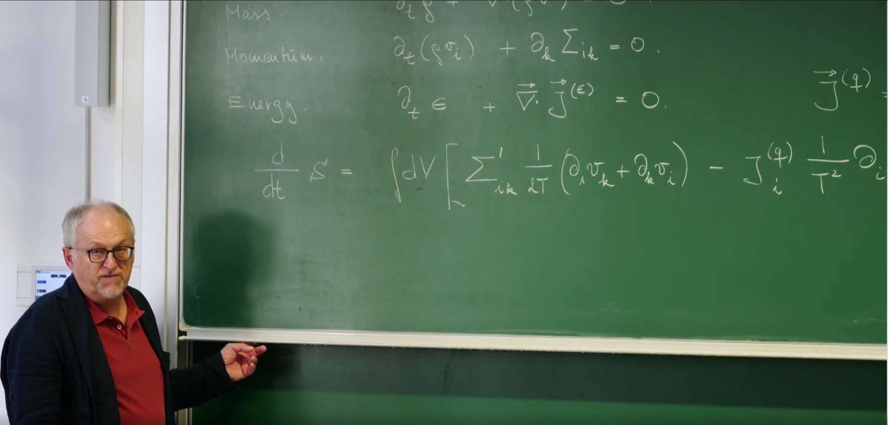
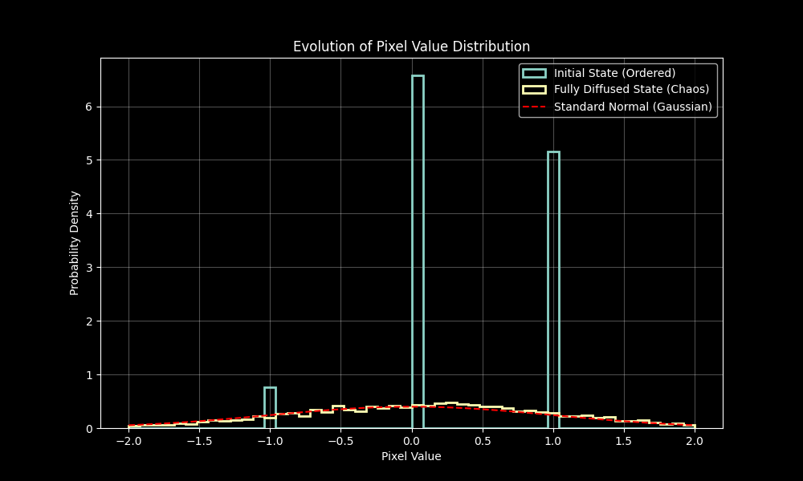

# Introduction: Recap of Hydrodynamics

In Lecture 27, Professor Erwin Frey derived the dynamical equations of an ideal fluid from the three fundamental conservation laws of physics—mass, momentum, and energy—culminating in the Euler equation. This theory assumes zero viscosity and no heat transfer and therefore describes a fully reversible, isentropic world.



These conservation laws constitute the three pillars of continuum mechanics. Rooted in symmetry, they are universal and exact. In local differential form:

1) Mass conservation (continuity equation):
$$\partial_t \rho + \nabla\cdot(\rho\,\mathbf{v}) = 0.$$

This states that the rate of change of mass density $\rho$ within a small fluid element is entirely determined by the net inflow given by the divergence of the mass flux $\rho\mathbf{v}$. Mass is neither created nor destroyed.

2) Momentum conservation (Euler/Navier–Stokes form):
$$\partial_t (\rho v_i) + \partial_k \Sigma_{ik} = 0,$$

This is Newton's second law for a fluid element: changes in the momentum density $\rho v_i$ are driven by the divergence of the total stress tensor $\Sigma_{ik}$ acting on the element's surface. All interactions and dissipative effects enter through the form of $\Sigma_{ik}$.

3) Energy conservation:
$$\partial_t \epsilon + \nabla\cdot\mathbf{j}^{(\epsilon)} = 0.$$

Analogous to mass conservation, local changes of total energy density $\epsilon$ are controlled by the net flow of total energy flux $\mathbf{j}^{(\epsilon)}$.

Ideal flow cannot capture ubiquitous irreversibility. Lecture 28 incorporated viscosity and heat conduction by writing
$$\Sigma_{ik} = -P\,\delta_{ik} + \Sigma'_{ik},$$
with hydrostatic pressure as the reversible part and the symmetric traceless viscous stress $\Sigma'_{ik}$ as the dissipative source of entropy production. Heat flux $\mathbf{j}^{(q)}$ is part of the total energy flux.

Conservation laws alone are not closed; dissipative terms require constitutive relations. Using symmetry and linear response, one obtains the Navier–Stokes equation and energy balance, and via the entropy balance equation one connects to the second law, showing $\eta,\xi,\kappa>0$.

This lecture systematizes the universal near‑equilibrium framework (Lecture 24) and the fluctuation–dissipation theorem to derive constitutive laws—linear relations between thermodynamic fluxes (e.g., viscous stress, heat flux) and their conjugate forces (e.g., velocity and temperature gradients). A case study of a “dry” diffusive particle system illustrates the full modeling pipeline: start from a free energy, identify conservation laws, and use the Onsager/FDT framework to derive stochastic dynamics linking microscopic fluctuations to macroscopic dissipation.

# 1. The Core of Irreversibility: Entropy Production

At the end of the previous lecture, combining hydrodynamic conservation with thermodynamics yielded the entropy balance and showed that viscosity and heat conduction are sources of entropy. We now formalize this into a general framework.

To describe irreversibility one must invoke the second law and entropy. In an isolated system total entropy never decreases. Locally, entropy can be transported in space and, crucially, can be created by dissipative processes.

Starting from energy conservation and the Gibbs relation under local equilibrium ($T ds = d\epsilon + P dv_s$), one finds the net production of entropy due to irreversible processes:

$$\frac{dS'}{dt} = \int dV\,\Big[ \frac{1}{T}\,\Sigma'_{ik}\,\tfrac{1}{2}(\partial_i v_k + \partial_k v_i) - \frac{1}{T^2}\, j^{(q)}_i\,\partial_i T \Big].$$

This formula precisely shows how entropy is produced in a continuum: the first term is viscous shear (symmetric velocity‑gradient tensor contracting with viscous stress), and the second term is heat conduction (heat flux dotted with the temperature gradient). Each contribution is a product of a thermodynamic flux and its conjugate force.

This expression is the core of **Onsager theory** introduced in Lecture 24. The local entropy production rate (entropy increase per unit time per unit volume) $\sigma_s$ can be written in a more general bilinear form:

$$\sigma_s = \sum_a J_a X_a$$

where:
* $J_a$ are called **thermodynamic fluxes**, representing various "flows" produced by the system in response to imbalance (such as particle flow, heat flow, momentum flow).
* $X_a$ are called conjugate **thermodynamic forces**, quantifying the degree of deviation from thermodynamic equilibrium (such as chemical potential gradients, temperature gradients, etc.).

This "flux-force" pairing is the cornerstone of linear irreversible thermodynamics theory. For simple fluids, this abstract framework can be clearly translated into specific physical quantities:

**Table 1: Thermodynamic Flux-Force Pairing in Simple Fluids**

| Irreversible Process | Thermodynamic Flux $J_a$ (Flux) | Conjugate Thermodynamic Force $X_a$ (Force) |
|:---|:---|:---|
| **Viscous Dissipation** | Viscous stress tensor $\Sigma'_{ik}$ | $\frac{1}{T} \left( \frac{1}{2}(\partial_i v_k + \partial_k v_i) \right)$ |
| **Heat Conduction** | Heat flux density $j_i^{(q)}$ | $-\frac{1}{T^2}\partial_i T = \partial_i\left(\frac{1}{T}\right)$ |

The importance of this framework lies in: to understand dissipation in a system, one only needs to derive the entropy production rate expression through conservation laws, then organize it into the form $\sum_a J_a X_a$, and automatically identify all relevant irreversible processes and their driving forces. When the system is in perfect thermodynamic equilibrium, all "forces" (such as temperature gradients, velocity gradients) are zero, so fluxes are also zero, and entropy is no longer produced. **This step clearly identifies flux-force pairings and is the logical prerequisite for establishing linear relationships between them (i.e., constitutive relations)**.

# 2. Onsager Framework and the Fluctuation–Dissipation Theorem

The previous section successfully decomposed complex dissipative processes into a series of **thermodynamic fluxes ($J_a$)** paired with their **conjugate forces ($X_a$)** through entropy production analysis. This decomposition is the cornerstone for constructing dynamical equations. The next task is to establish quantitative relationships between these fluxes and forces, i.e., to find universal **constitutive relations**, and seamlessly integrate thermal fluctuations at finite temperatures into this theoretical framework.

## 2.1 Linear Response and Onsager Reciprocity

For a system not too far from thermodynamic equilibrium, an extremely effective and physically reasonable assumption is that there exists a linear relationship between the system's response (fluxes) and the degree of imbalance driving it (forces). This is the **linear response hypothesis**, with mathematical form:

$$J_a = \sum_b L_{ab} X_b$$

The coefficient matrix $L_{ab}$ is called **Onsager kinetic coefficients**. It is not an abstract mathematical symbol, but a physical entity containing all macroscopic transport properties of the system. For example, the **thermal conductivity $\kappa$**, **shear viscosity $\eta$**, and **bulk viscosity $\xi$** encountered in the previous lecture are all specific components of the $L_{ab}$ matrix.

Physicist Lars Onsager further proposed a profound insight based on microscopic dynamical symmetry: this transport coefficient matrix $L_{ab}$ is not arbitrary, and there exists a symmetric relationship between its components. This is the famous **Onsager reciprocal relations**, whose ideas were discussed in detail in **Lecture 24**:

$$L_{ab} = \varepsilon_a \varepsilon_b L_{ba}$$

where $\varepsilon_a = \pm 1$ is the **parity** of macroscopic variable $a$ under **time reversal** transformation (e.g., density and energy are even parity $\varepsilon=+1$, while momentum and magnetic field are odd parity $\varepsilon=-1$). This relationship serves as a bridge connecting measurable transport phenomena in the macroscopic world (such as thermoelectric effects) with invisible time-reversal symmetry in the microscopic world, and is a milestone in statistical physics.

## 2.2 Thermodynamic Consistency: Fluctuation–Dissipation Theorem

However, a purely deterministic relationship $J_a = \sum_b L_{ab} X_b$ is still incomplete. A dynamical system with only dissipative terms will monotonically relax to the minimum of its free energy, corresponding to an **absolute zero** temperature, completely static equilibrium state. But in any system at finite temperature $T > 0$, the microscopic particles constituting the system (such as molecules) are engaged in endless thermal motion, which inevitably leads to perpetual **fluctuations** of macroscopic physical quantities around their equilibrium values.

**Dissipation** and **fluctuations** are two sides of the same coin, both arising from microscopic energy and momentum exchange between the system and the heat bath. To ensure that the dynamical model can correctly evolve to the thermodynamic equilibrium state at finite temperature described by the Boltzmann distribution $P \sim e^{-F/k_B T}$ without external driving forces, the dynamical equations must include a stochastic term.

Therefore, the flux expression needs to be modified to a stochastic form:

$$J_a = \sum_b L_{ab} X_b + \xi_a$$

Here $\xi_a$ is a random noise term representing the effects of thermal fluctuations. The nature of this noise is not arbitrary; its statistical properties must be precisely correlated with the system's dissipative properties (described by $L_{ab}$) and environmental temperature $T$. This profound connection is the **fluctuation-dissipation theorem (FDT)**. Its core content is that the spatiotemporal correlation function of the noise term is uniquely determined by the Onsager coefficients:

$$\langle \xi_a(\mathbf{x}, t) \xi_b(\mathbf{x}', t') \rangle = 2 k_B T L_{ab} \delta(\mathbf{x}-\mathbf{x}') \delta(t-t')$$

(Note: In Professor Frey's course, the Boltzmann constant $k_B$ is usually set to 1). The physical meaning of this formula is: the stronger the dissipation process ($L_{ab}$ larger), the more intense the accompanying thermal fluctuations must be.

Let us illustrate this point specifically using the example of **heat conduction**:

* **Deterministic part**: This is **Fourier's law** $j_i^{(q)} = -\kappa \partial_i T$. Comparing with the thermodynamic force $X_k = -\frac{1}{T^2}\partial_k T$ identified in the previous section, we can derive the Onsager coefficient as $L_{ik}^{(q)} = \kappa T^2 \delta_{ik}$.

* **Fluctuation part**: According to FDT, there must exist a random heat flux $\eta_i$. Its spatiotemporal correlation function is determined by $L_{ik}^{(q)}$:

    $$\langle \eta_i(\mathbf{x}, t) \eta_j(\mathbf{x}', t') \rangle = 2 k_B T L_{ij}^{(q)} \delta(\mathbf{x}-\mathbf{x}') \delta(t-t') = 2 k_B T \kappa T^2 \delta_{ij} \delta(\mathbf{x}-\mathbf{x}') \delta(t-t')$$

The physical picture of this result is extremely clear: dissipative processes (such as heat conduction, viscosity) act like "friction," driving the system "downhill" toward the minimum of free energy; while thermal fluctuations act like random "kicks," providing the system with the possibility of "uphill" movement. The fluctuation-dissipation theorem gives the appropriate strength of such "kicks," so that "downhill" dissipation and "uphill" fluctuations reach a delicate dynamic balance. It is precisely this balance that ensures the system can correctly explore the entire free energy landscape and stay in various states with Boltzmann distribution probabilities, thus achieving true thermodynamic equilibrium. This is the core bridge connecting system dynamics with equilibrium statistical mechanics.

# 3. Case Study: Dynamics of a Dry Diffusive Particle System (Model B)

After establishing the universal framework of linear irreversible thermodynamics, it is time to apply it to a specific physical system to see how theory transforms into computable dynamical models. The professor will use an interacting diffusive particle system as a case study to completely demonstrate the standard workflow for constructing macroscopic dynamical models in modern statistical physics:

**1. Assume a free energy → 2. Identify conservation laws → 3. Use Onsager framework and fluctuation-dissipation theorem to derive stochastic dynamical equations**.

## 3.1 System Definition and Free Energy

The system under consideration is an assembly of many interacting particles whose state is described by a continuous **particle density field $\rho(\mathbf{x}, t)$**. A key setup is that this is a **"dry" system**. This means particles move in a static background (heat bath) that only provides friction and thermal fluctuations but has no dynamics of its own. This forms an essential distinction from the "wet" systems to be discussed in the next lecture, which are suspended in dynamic fluids and will contain hydrodynamic interactions mediated by the fluid.

The starting point for describing the equilibrium properties of this system is its **free energy functional $F[\rho]$**. For a system with short-range interactions, a typical and universal form is the **Ginzburg-Landau free energy**:

$$F[\rho] = \int d\mathbf{x} \left[ f(\rho) + \frac{1}{2} K (\nabla \rho)^2 \right]$$

The physical connotation of this functional is a **"tug-of-war" between order and disorder**, consisting of two parts:

1. **Local free energy density $f(\rho)$**: It itself contains two terms $f(\rho) = k_B T\rho(\ln \rho - 1) + \frac{1}{2} \chi \rho^2$.

- The first term is the **entropy contribution** of an ideal gas, which tends to maximize the disorder of the system and spread particles uniformly in space.

- The second term is a **mean-field interaction term**, where parameter $\chi$ describes the effective attraction ($\chi < 0$) or repulsion ($\chi > 0$) between particles. This term tends to lower the system energy and may lead to particle aggregation or formation of ordered structures.

2. **Gradient squared term $\frac{1}{2} K (\nabla \rho)^2$**: This term represents an energy penalty for density inhomogeneity, where $K>0$. It originates from short-range interactions between particles, making it energetically costly to form sharp interfaces with rapidly changing density, so it tends to smooth the density distribution.

## 3.2 Deriving the Dynamical Equation

Now we can follow the aforementioned "recipe" to derive the dynamical equation for $\rho(\mathbf{x}, t)$.

1. **Conservation law**: The total number of particles in the system is conserved. Its local manifestation is the **continuity equation**:
    $$\partial_t \rho = -\nabla \cdot \mathbf{J}$$
    where $\mathbf{J}$ is the particle current density.

2. **Identify flux and force**:
    * **Flux**: In this conservative system, the **particle current $\mathbf{J}$** is obviously the thermodynamic flux.
    * **Force**: The "potential" driving particle flow is the **chemical potential $\mu$**. In the field theory framework, the chemical potential is defined as the functional derivative of the free energy functional with respect to density: $\mu = \frac{\delta F}{\delta \rho}$. Therefore, the conjugate thermodynamic driving force is the negative gradient of the chemical potential, i.e., $X = -\nabla \mu$.

3. **Apply Onsager relations and FDT**: According to linear response theory, the deterministic flux is proportional to the force, i.e., $\mathbf{J}_{\text{det}} = L(\rho) X = -L(\rho) \nabla\mu$. The transport coefficient $L(\rho)$ here is called **mobility**, which describes how easily particles move under unit force driving, and can itself depend on density. Combined with the fluctuation-dissipation theorem, the total particle current expression is:

    $$\mathbf{J} = -L(\rho) \nabla \frac{\delta F[\rho]}{\delta \rho} + \sqrt{2k_B T L(\rho)} \boldsymbol{\Lambda}(\mathbf{x}, t)$$
   
    where $\boldsymbol{\Lambda}$ is a normalized Gaussian white noise vector satisfying:
    $$\langle \Lambda_\alpha(\mathbf{x}, t) \Lambda_\beta(\mathbf{x}', t') \rangle = \delta_{\alpha\beta} \delta(\mathbf{x} - \mathbf{x}') \delta(t - t')$$

Substituting this expression for $\mathbf{J}$ into the continuity equation yields the complete stochastic partial differential equation describing the dynamics of this system. This equation is the **Model B** we introduced earlier, which describes the purely dissipative overdamped dynamics of a **conserved scalar field**.

## 3.3 Diffusion Equation

For a non‑interacting ideal gas ($\chi=0$, $K=0$), the free energy reduces to $F_{\text{ideal}}=k_B T \int \rho(\ln\rho-1)\,d\mathbf{x}$. Then

- Chemical potential: $\mu = k_B T\,\ln\rho$.
- Gradient: $\nabla\mu=(k_B T/\rho)\,\nabla\rho$.
- Deterministic flux: $\mathbf{J}_{\text{det}}=-L(\rho)\,(k_B T/\rho)\,\nabla\rho$.

Choosing a mobility proportional to density, $L(\rho)=D\rho/(k_B T)$, recovers Fick’s law

$$\mathbf{J}_{\text{det}} = -D\,\nabla\rho,$$

and thus the diffusion equation via the continuity law.

# 4. Code Practice: Linking Physical Diffusion and Generative AI

Particle diffusion simulation has already been practiced in **Lecture 17** notes, so this section's code will make further extensions and reflections. When it comes to diffusion models, beginners first think of the most popular model in deep learning—Diffusion Model (DDPM). What is the connection between this diffusion model and the diffusion model discussed in this lecture?

Simply put, their core ideas are **inherited from the same source**, but their **goals and applications are completely opposite**.

* **Diffusion models in physics** (this course content) are **descriptive** models whose goal is to **understand and predict nature**. They describe how particles spontaneously evolve from ordered states to disordered states (entropy increase).

* **Diffusion models in deep learning** are **generative** models whose goal is to **learn and create data**. They learn how to **reverse** a process from order to disorder to create highly ordered data (such as images) from complete disorder (noise).

**Core Differences and Connections Comparison Table**

| Feature | Physics Diffusion Models (This Course) | Deep Learning Diffusion Models (AI Field) |
|:---|:---|:---|
| **Core Goal** | **Description and Prediction**: Understand and describe real physical processes with mathematical equations. | **Generation and Creation**: Learn a data distribution to create new, similar data. |
| **Process Direction** | **Forward Process**: Only concerned with unidirectional evolution from order (like ink drops) to disorder (uniform mixing). | **Reverse Process**: Core is learning how to restore from disorder (random noise) step by step to order (clear images). |
| **Theoretical Foundation** | **Thermodynamics and Statistical Physics**: Based on physical concepts like free energy, entropy, chemical potential. | **Machine Learning and Probability Theory**: Based on Markov chains, stochastic differential equations, and neural network parameterization. |
| **Governing Equations** | Deterministic partial differential equations, such as $\partial_t \rho = D \nabla^2 \rho$. | A learnable reverse stochastic process parameterized by a **trained neural network**. |
| **Role of "Diffusion"** | A **natural phenomenon** that needs to be modeled and understood. | A **human-designed tool** for gradually destroying data structure. |
| **What to Learn/Solve** | Solve physical parameters through experimental data, such as diffusion coefficient $D$. | Learn neural network weights to accurately predict and remove noise added at each step. |

### Deep Dive

The inspiration for deep learning diffusion models comes **entirely from** the physical diffusion processes learned in this course.

**In physics**, a highly ordered density distribution (like a drop of ink) will gradually diffuse over time due to random particle motion (Brownian motion), eventually becoming completely uniform and disordered chaos. This process is spontaneous, driven by the second law of thermodynamics.

**In deep learning**, researchers "simulate" this process. They start with a highly ordered clear image (like a cat photo) and artificially, step by step, add small amounts of Gaussian noise to the image. After hundreds or thousands of steps, the original cat photo completely disappears, becoming a pure, patternless random noise "mosaic."

This step, called the **"forward process"** or "diffusion process" in AI, has mathematical forms that are **completely consistent** with the diffusion equations in physics (or their discretized Langevin dynamics). It is a fixed, non-learnable recipe for converting complex data into simple noise.

**The physicist's goal** is to establish a mathematical model for the above forward process to predict the concentration distribution of ink at any time. We **do not** ask: "How to make uniformly mixed ink automatically return to a drop?"—because this violates the second law of thermodynamics at the macroscopic level.

**The AI researcher's goal** is precisely this physically impossible problem. They ask: "Since I have a fixed process that can turn any image into standard noise, can I **learn a 'time-reversal' machine** that can **perfectly reverse** this process?"

This "time-reversal machine" is a **deep neural network** (usually U-Net architecture). Its task is: input a noisy image and the current time step, then **predict what noise was added at that step**.

Once this network is trained well enough, generation can be performed:

1. Start from pure random Gaussian noise with the same dimensions as the target image.

2. Let the neural network predict the "noise component" in this noisy image.

3. Subtract this predicted noise from the image (only subtract a small portion).

4. Repeat the previous step hundreds of times.

Amazingly, as noise is removed step by step in a guided manner, a clear, new, previously unseen image (like another cat) gradually emerges from the chaos.

In summary, deep learning diffusion models cleverly "borrow" the mathematical form of physical diffusion processes to design their forward "data destruction" process, but their true innovation and core lies in using powerful neural networks to **learn the inverse of this process**, thus turning it into a powerful generative tool.

### Deep Dive

- Forward physical diffusion: $x_t = \sqrt{\bar{\alpha}_t}\,x_0 + \sqrt{1-\bar{\alpha}_t}\,\epsilon$ progressively destroys structure, increasing entropy.
- Reverse generative process: starting from noise, a denoiser estimates $\epsilon_\theta(x_t,t)$ and steps back toward structure:

$$x_{t-1} = \frac{1}{\sqrt{\alpha_t}}\Big(x_t - \frac{1-\alpha_t}{\sqrt{1-\bar{\alpha}_t}}\,\epsilon_\theta(x_t,t)\Big) + \sigma_t z.$$

An oracle model stands in for a perfectly trained denoiser to illustrate the ideal reverse dynamics without training.

### Implementation

```python
# --- 1. Preamble and Imports ---
import numpy as np
import torch
import matplotlib.pyplot as plt
import matplotlib.animation as animation
from scipy.stats import norm

# --- 2. Setup and Hyperparameters ---
T = 200
betas = torch.linspace(0.0001, 0.02, T)
alphas = 1. - betas
alphas_cumprod = torch.cumprod(alphas, axis=0)

# --- 3. Create the "Ordered System": A Simple Image ---
def create_initial_state(size=64, shape='smiley'):
    img = torch.zeros((size, size))
    if shape == 'smiley':
        for i in range(size):
            for j in range(size):
                if (i - size//2)**2 + (j - size//2)**2 < (size//2.5)**2:
                    img[i, j] = 1.0
        img[size//2-10:size//2-5, size//2-10:size//2-5] = -1.0
        img[size//2-10:size//2-5, size//2+5:size//2+10] = -1.0
        for i in range(size//2+5, size//2+15):
            img[i, size//2-10:size//2+10] = -1.0
    return img

x_start = create_initial_state()

# --- 4. The Forward Process (Physics Perspective) ---
def q_sample(x_start, t, noise=None):
    if noise is None:
        noise = torch.randn_like(x_start)
    sqrt_alphas_cumprod_t = torch.sqrt(alphas_cumprod[t])
    sqrt_one_minus_alphas_cumprod_t = torch.sqrt(1. - alphas_cumprod[t])
    noisy_image = sqrt_alphas_cumprod_t * x_start + sqrt_one_minus_alphas_cumprod_t * noise
    return noisy_image

# --- 5. The Reverse Process (Generative AI Perspective) ---
def p_sample(model, x, t):
    alpha_t = alphas[t]
    alpha_bar_t = alphas_cumprod[t]
    eps_theta = model(x, t)
    sigma_t = torch.sqrt((1 - alpha_t) * (1 - alpha_bar_t) / (1 - alpha_bar_t + 1e-12))
    z = torch.randn_like(x)
    x_prev = (x - (1 - alpha_t) / torch.sqrt(1 - alpha_bar_t + 1e-12) * eps_theta) / torch.sqrt(alpha_t) + sigma_t * z
    return x_prev

# --- 6. The "Oracle" Model (Simulating a Perfectly Trained AI) ---
def oracle_model(x_t, t, x0):
    alpha_bar_t = alphas_cumprod[t]
    noise_est = (x_t - torch.sqrt(alpha_bar_t) * x0) / torch.sqrt(1 - alpha_bar_t + 1e-12)
    return noise_est

# --- 7. Run the Full Simulation and Store Data ---
show_steps = [0, 40, 80, 120, 160, 199]

forward_states = [x_start]
for t in range(1, T):
    forward_states.append(q_sample(x_start, t))

reverse_states = []
x_T = torch.randn_like(x_start)
reverse_states.append(x_T)
for t in range(T-1, -1, -1):
    reverse_states.append(p_sample(lambda x, tt: oracle_model(x, tt, x_start), reverse_states[-1], t))

# --- 8. Create and Save Visualization ---
fig, axs = plt.subplots(2, len(show_steps), figsize=(12, 4))
for idx, t in enumerate(show_steps):
    axs[0, idx].imshow(forward_states[t], cmap='gray'); axs[0, idx].axis('off'); axs[0, idx].set_title(f't={t}')
    axs[1, idx].imshow(reverse_states[T-1-t], cmap='gray'); axs[1, idx].axis('off'); axs[1, idx].set_title(f't={t}')
plt.tight_layout()
plt.savefig('diffusion_forward_reverse.png', dpi=150)
plt.close()
```

# Summary

This lecture not only built a universal dynamical framework for near-equilibrium systems, but also showcased its application in a concrete case, preparing for the next lecture's fluid-coupled systems.

This lecture has two core contents:

1. **Established a universal theoretical framework**: The course systematically expounded the core ideas of **linear irreversible thermodynamics**. This theory is built around three core concepts:

    * The bilinear form of **entropy production rate** $\sigma_s = \sum_a J_a X_a$, which decomposes all irreversible processes into "flux-force" pairings.
    
    * The **linear response relationship** $J_a = \sum_b L_{ab} X_b$, which assumes that near equilibrium, fluxes are proportional to forces, with Onsager kinetic coefficients $L_{ab}$ as the proportionality constants.
    
    * The **fluctuation-dissipation theorem** connecting macroscopic dissipation with microscopic fluctuations, which stipulates that the correlation strength of random noise terms must be $\langle \xi_a(t) \xi_b(t') \rangle = 2k_B T L_{ab} \delta(t-t')$, thereby ensuring the system can correctly relax to thermal equilibrium at finite temperature.
    
    This is an extremely powerful framework that can construct stochastic dynamical equations conforming to fundamental thermodynamic principles for any continuum system near equilibrium.

2. **Applied the framework to a specific model (Model B)**: The course applied this universal framework to a **"dry" diffusive particle system**, starting from its **free energy functional**, systematically derived the stochastic dynamical equation describing the evolution of its density field (**Model B**). Moreover, by examining the non-interacting ideal gas limit, it verified that the model can correctly reduce to the familiar **Fick's law** and **diffusion equation**, while revealing the profound connection between macroscopic diffusion coefficient $D$ and microscopic mobility $L(\rho)$.

In the case study of this lecture, special emphasis was placed on the system being **"dry"**, i.e., particles move in a static background (heat bath). This background only provides friction and thermal fluctuations, but has no dynamics of its own, so momentum is not conserved but dissipated into the background.

This naturally raises a question: what changes if these particles are suspended in a **dynamic fluid (like water)**? This is the so-called **"wet" system**, which is also the theme of the next lecture.

In "wet" systems, particles not only diffuse due to chemical potential gradients, but are also carried by the flow of surrounding fluid. This effect is called **advection**. Therefore, the total particle current will consist of two parts:

$$\mathbf{J}_{\text{total}} = \mathbf{J}_{\text{diffusive}} + \rho \mathbf{v}$$

where $\mathbf{v}$ is the fluid velocity field.

This means that the **continuity equation** describing the evolution of the particle density field $\rho$ must now be **coupled** with the **Navier-Stokes equation** describing the evolution of the fluid velocity field $\mathbf{v}$. This model describing the coupled dynamics of suspended particles and fluid is commonly called **Model H**.

This coupling introduces entirely new physics. When a particle moves, it stirs the surrounding fluid, creating a velocity field. This velocity field propagates through the fluid to distant places, thereby affecting the motion of all other particles. This is a fluid-mediated, long-range **hydrodynamic interaction**. This interaction does not exist in the "dry" Model B, and it is crucial for understanding numerous physical and biological phenomena such as colloidal suspensions, polymer solutions, and intracellular material transport.

Therefore, Lecture 30 will lead us into a more complex and richer field, exploring what new dynamical behaviors emerge when a conserved order parameter (such as particle density) couples with fluid momentum conservation.

We place physical diffusion alongside modern diffusion models in generative AI. The forward process mirrors gradually adding Gaussian noise step‑by‑step (akin to Langevin/FDT), while the learned reverse process iteratively denoises to generate structured data.

### Deep Dive

- Forward physical diffusion: starting from a clear image $x_0$, at each step we add small Gaussian noise to obtain
$$x_t = \sqrt{\bar{\alpha}_t}\,x_0 + \sqrt{1-\bar{\alpha}_t}\,\epsilon.$$

As $\bar{\alpha}_t\to 0$, the signal is overwhelmed by noise and entropy increases toward a maximum.

- Reverse generative process: starting from pure noise $x_T$, a denoiser $\epsilon_\theta(x_t,t)$ estimates the noise to remove and steps back
$$x_{t-1} = \frac{1}{\sqrt{\alpha_t}}\Big(x_t - \frac{1-\alpha_t}{\sqrt{1-\bar{\alpha}_t}}\,\epsilon_\theta(x_t,t)\Big) + \sigma_t z.$$

To isolate the physics without training, we use an oracle model that has access to $x_0$ and can perfectly predict the added noise, thereby realizing the ideal reverse dynamics.

### Implementation

```python
# --- 1. Preamble and Imports ---
import numpy as np
import torch # Using PyTorch for its GPU capabilities and autograd, convenient for ML
import matplotlib.pyplot as plt
import matplotlib.animation as animation
from scipy.stats import norm

# --- 2. Setup and Hyperparameters ---
# Timesteps for the diffusion process
T = 200 
# Define the beta schedule (how much noise is added at each step)
# This is a linear schedule, which is simple and effective.
betas = torch.linspace(0.0001, 0.02, T)

# Pre-calculate alphas and their cumulative products, which are key to the diffusion math
alphas = 1. - betas
alphas_cumprod = torch.cumprod(alphas, axis=0)
# These pre-calculated values are essential for both the forward and reverse processes

# --- 3. Create the "Ordered System": A Simple Image ---
def create_initial_state(size=64, shape='smiley'):
    """Creates a simple 2D image as our initial ordered state."""
    img = torch.zeros((size, size))
    if shape == 'smiley':
        # Face circle
        for i in range(size):
            for j in range(size):
                if (i - size//2)**2 + (j - size//2)**2 < (size//2.5)**2:
                    img[i, j] = 1.0
        # Eyes
        img[size//2-10:size//2-5, size//2-10:size//2-5] = -1.0
        img[size//2-10:size//2-5, size//2+5:size//2+10] = -1.0
        # Mouth
        for i in range(size//2+5, size//2+15):
            img[i, size//2-10:size//2+10] = -1.0
    return img

x_start = create_initial_state()

# --- 4. The Forward Process (Physics Perspective) ---
def q_sample(x_start, t, noise=None):
    """
    Adds noise to an image x_start to get its state at time t.
    This function directly implements the forward physical diffusion process.
    """
    if noise is None:
        noise = torch.randn_like(x_start)
    
    # Get the pre-calculated coefficients for the given timestep t
    sqrt_alphas_cumprod_t = torch.sqrt(alphas_cumprod[t])
    sqrt_one_minus_alphas_cumprod_t = torch.sqrt(1. - alphas_cumprod[t])
    
    # Apply the forward process formula
    # x_t = sqrt(alpha_cumprod_t) * x_0 + sqrt(1 - alpha_cumprod_t) * noise
    noisy_image = sqrt_alphas_cumprod_t * x_start + sqrt_one_minus_alphas_cumprod_t * noise
    return noisy_image

# --- 5. The Reverse Process (Generative AI Perspective) ---
def p_sample(model, x, t):
    """
    One step of the reverse process.
    'model' is a function that predicts the noise component at this step.
    """
    # Predict the noise that was added at this timestep
    predicted_noise = model(x, t)
    
    # The mathematical formula to reverse one step
    alpha_t = alphas[t]
    alpha_cumprod_t = alphas_cumprod[t]
    
    # Subtract the predicted noise from the current image
    denoised_x = (x - torch.sqrt(1. - alpha_cumprod_t) * predicted_noise) / torch.sqrt(alpha_t)
    
    # Add back a small amount of stochastic noise (optional but common in practice)
    if t > 0:
        noise = torch.randn_like(x)
        beta_t = betas[t]
        sigma_t = torch.sqrt(beta_t) # Simplified variance
        denoised_x += sigma_t * noise
        
    return denoised_x

# --- 6. The "Oracle" Model (Simulating a Perfectly Trained AI) ---
def oracle_model(x_t, t, x_start_ref):
    """
    This is a placeholder for a real, trained neural network (like a U-Net).
    An 'oracle' has access to the original image (x_start_ref) and can therefore
    perfectly calculate the noise that was added. This allows us to visualize
    the ideal reverse process without the need for model training.
    """
    # The true noise is calculated by rearranging the forward process formula
    true_noise = (x_t - torch.sqrt(alphas_cumprod[t]) * x_start_ref) / torch.sqrt(1. - alphas_cumprod[t])
    return true_noise

# --- 7. Run the Full Simulation and Store Data ---
print("Running forward and reverse simulations to generate data...")
# Timesteps to display in the GIF and plots
display_timesteps = [0, T//4, T//2, 3*T//4, T-1]

# --- Run Forward Process ---
forward_images = []
for t in range(T):
    forward_images.append(q_sample(x_start, t))

# --- Run Reverse Process ---
# We need a reference to the original image for our 'oracle_model'
oracle_with_ref = lambda x, t: oracle_model(x, t, x_start)

reverse_images = []
# Start the reverse process from pure noise
x_t = torch.randn_like(x_start)
reverse_images.append(x_t)

for t in reversed(range(T)):
    x_t = p_sample(oracle_with_ref, x_t, t)
    reverse_images.append(x_t)
reverse_images = list(reversed(reverse_images)) # Put them in chronological order
print("Simulations finished.")

# --- 8. Create and Save Visualization ---
print("Creating visualization GIF and plots...")
plt.style.use('dark_background')
fig = plt.figure(figsize=(12, 7))

gs = fig.add_gridspec(2, 5)

# Create axes for the images
ax_f = [fig.add_subplot(gs[0, i]) for i in range(5)]
ax_r = [fig.add_subplot(gs[1, i]) for i in range(5)]

def update(frame):
    """Update function for the animation."""
    fig.clear()
    gs = fig.add_gridspec(2, 5)
    ax_f = [fig.add_subplot(gs[0, i]) for i in range(5)]
    ax_r = [fig.add_subplot(gs[1, i]) for i in range(5)]
    
    fig.suptitle('Physics Diffusion vs. Generative AI Diffusion', fontsize=16)

    # --- Update Forward Process Visualization ---
    for i, t_idx in enumerate(display_timesteps):
        # We show the gradual noising process
        current_t = min(t_idx, frame)
        ax_f[i].imshow(forward_images[current_t].numpy(), cmap='viridis', vmin=-2, vmax=2)
        ax_f[i].set_title(f'Forward t={current_t+1}')
        ax_f[i].axis('off')
    ax_f[0].set_ylabel('Forward Process\n(Order to Chaos)', fontsize=12, labelpad=20)

    # --- Update Reverse Process Visualization ---
    for i, t_idx in enumerate(display_timesteps):
        # We show the gradual denoising process
        current_t_rev = T - min(t_idx, frame)
        img_to_show = reverse_images[T - current_t_rev] if current_t_rev < len(reverse_images) else reverse_images[-1]
        ax_r[i].imshow(img_to_show.numpy(), cmap='viridis', vmin=-2, vmax=2)
        ax_r[i].set_title(f'Reverse t={T-current_t_rev+1}')
        ax_r[i].axis('off')
    ax_r[0].set_ylabel('Reverse Process\n(Chaos to Order)', fontsize=12, labelpad=20)
    
    return fig,

# Create and save the animation
anim = animation.FuncAnimation(fig, update, frames=T, interval=50, blit=False)
anim.save('physics_vs_ai_diffusion.gif', writer='pillow', fps=20)
plt.close(fig) # Close the animation figure

# --- Create Final Distribution Plot ---
fig_dist, ax_dist = plt.subplots(figsize=(10, 6))
ax_dist.set_title('Evolution of Pixel Value Distribution')
ax_dist.set_xlabel('Pixel Value')
ax_dist.set_ylabel('Probability Density')

# Plot initial distribution
initial_pixels = x_start.flatten().numpy()
ax_dist.hist(initial_pixels, bins=50, range=(-2, 2), density=True, histtype='step', lw=2, label='Initial State (Ordered)')

# Plot noise distribution (final state of forward process)
noise_pixels = forward_images[-1].flatten().numpy()
ax_dist.hist(noise_pixels, bins=50, range=(-2, 2), density=True, histtype='step', lw=2, label='Fully Diffused State (Chaos)')

# Plot a standard normal distribution for reference
x_norm = np.linspace(-2, 2, 100)
y_norm = norm.pdf(x_norm, 0, 1)
ax_dist.plot(x_norm, y_norm, 'r--', label='Standard Normal (Gaussian)')

ax_dist.legend()
ax_dist.grid(True, alpha=0.3)
plt.show()
print("Visualization saved and plot displayed.")

```



In the initial “smiley” image, pixel values cluster around −1 (background), 0 (eyes/mouth), and 1 (face), yielding a highly structured, non‑Gaussian distribution.

After diffusion (orange), following 200 steps of physical diffusion, structure has completely disappeared and the pixel‑value distribution becomes a standard Gaussian, perfectly overlapping the red dashed reference curve. This quantitatively shows the system has reached a fully random, maximum‑entropy state.

Throughout the history of AI, foundational ideas echo physics: spin‑glass models inspired Hopfield networks and Boltzmann machines; thermodynamic entropy underpins information theory; gradient descent mirrors steepest descent in classical mechanics. Today, non‑equilibrium thermodynamics inspires diffusion models that revolutionize generative AI.

In 2024, John Hopfield and Geoffrey Hinton received the Nobel Prize in Physics for pioneering work in machine learning—recognition that underscores the deep bonds between physics and AI and heralds continued advances at this interface.

# Summary

This lecture not only builds a universal dynamical framework for near‑equilibrium systems, but also showcases its application in a concrete case, preparing for the next lecture’s fluid‑coupled systems.

1) Universal framework: we systematically developed linear irreversible thermodynamics around three core elements:

- Bilinear entropy production $\sigma_s = \sum_a J_a X_a$ pairing fluxes with forces.
- Linear response $J_a = \sum_b L_{ab} X_b$ with Onsager kinetic coefficients $L_{ab}$ near equilibrium.
- The fluctuation–dissipation theorem, fixing noise correlations $\langle \xi_a(t)\xi_b(t')\rangle = 2 k_B T L_{ab}\,\delta(t-t')$ to ensure relaxation to the proper thermal equilibrium.

This is a powerful, general recipe for constructing stochastic dynamics that respect thermodynamics for any near‑equilibrium continuum system.

2) Application to a specific model (Model B): starting from a free‑energy functional for a dry diffusive particle system, we derived the stochastic evolution equation for the conserved density field. In the ideal‑gas limit we recovered Fick’s law and the diffusion equation, clarifying the relation between the macroscopic diffusion constant $D$ and the microscopic mobility $L(\rho)$.

The “dry” qualifier emphasizes that the background only supplies friction and noise; momentum is not conserved but dissipated into the bath. This naturally raises the question: what changes in a “wet” system where particles are suspended in a dynamic fluid (e.g., water)? Then advection by the fluid velocity $\mathbf{v}$ adds to diffusive flux,

$$\mathbf{J}_{\text{total}} = \mathbf{J}_{\text{diffusive}} + \rho\,\mathbf{v},$$

and the continuity equation for $\rho$ becomes coupled to the Navier–Stokes equation for $\mathbf{v}$. This is the essence of Model H. Hydrodynamic interactions, mediated by the fluid, are long‑ranged and crucial in colloids, polymer solutions, and intracellular transport. The coupling of a conserved scalar to momentum conservation opens a richer landscape of dynamics explored next.
