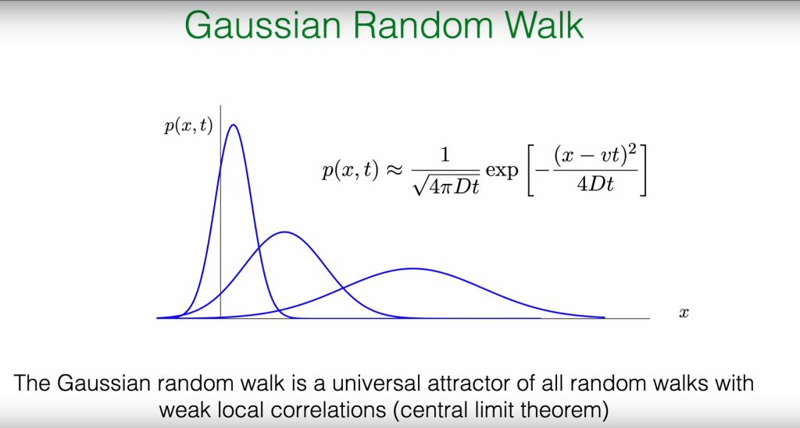
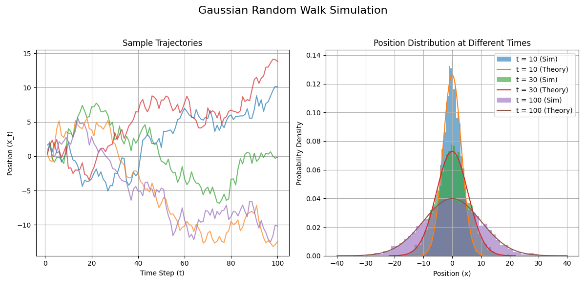
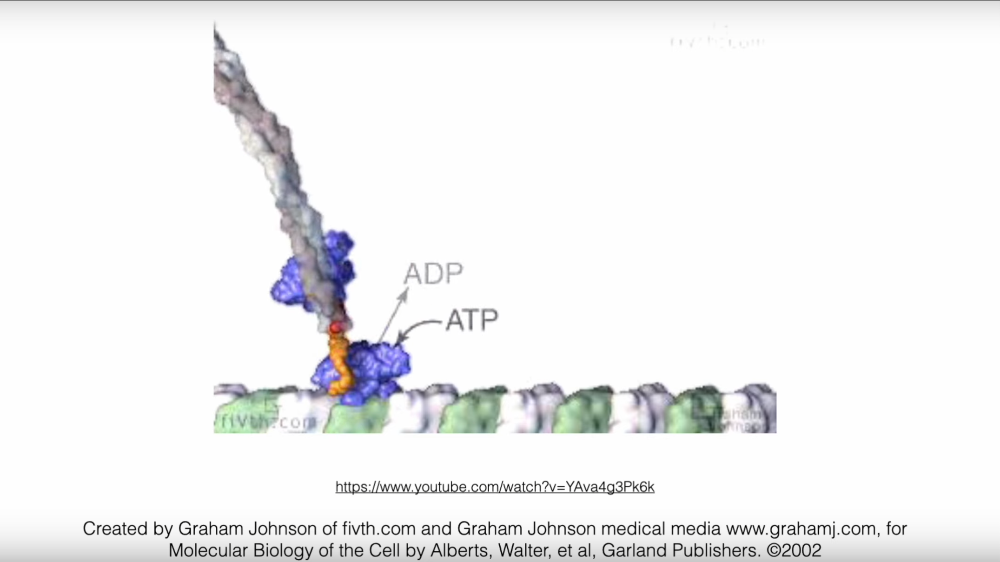
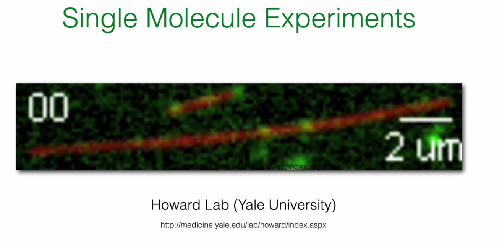
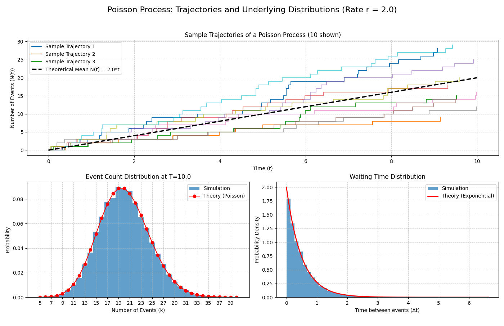

# Introduction: Crossing from Discrete to Continuous Worlds

Based on the introduction to simple random walks in the previous section, this section will further deepen our understanding of stochastic processes, evolving from the simple, discrete models introduced in the previous lecture to continuous models that can more accurately describe physical reality. This process will be achieved through two key generalizations:

1. **Spatial Continuization**: We will generalize the random walk model from a fixed, discrete lattice to continuous space. This step will naturally guide us from the binomial distribution to the Gaussian distribution, thus establishing the **Gaussian Random Walk (GRW)** model.

2. **Temporal Randomization**: We will break the constraint that "time steps" are fixed and deterministic, and instead explore scenarios where events occur randomly on a continuous time axis. This will lead to the **Poisson Process**, which is crucial in statistical physics and biology.

By relaxing the strict constraints on space and time, we can construct a more universal and applicable theoretical framework, laying the foundation for understanding phenomena from molecular motors to macroscopic diffusion.

To organize the models learned in this course so far, the following table summarizes and compares their key characteristics:

| Characteristic | Simple Random Walk (SRW) | Gaussian Random Walk (GRW) | Poisson Process |
|----------------|--------------------------|----------------------------|-----------------|
| Time Domain | Discrete ($k=1,2,\ldots$) | Discrete ($t=1,2,\ldots$) | Continuous ($t \in \mathbb{R}$) |
| Space Domain | Discrete (lattice) | Continuous ($X_t \in \mathbb{R}$) | Discrete (lattice) |
| Step Length Distribution | Bernoulli ($\pm a$) | Gaussian ($N(0, \sigma^2)$) | Fixed (e.g., $+1$) |
| Step Time | Fixed interval ($\tau$) | Fixed interval ($\tau=1$) | Random (exponential distribution) |
| Core Statistical Tool | Binomial distribution → Gaussian (CLT) | Characteristic function | Survival probability |
| Limiting Distribution | Gaussian distribution (position) | Gaussian distribution (position) | Exponential distribution (waiting time) |

## 1. Review: Simple Random Walk (SRW) and Its Continuous Limit

To better understand the content of this lecture, we first review the core model from the previous lecture—the Simple Random Walk (SRW)—and clarify its intrinsic connection to this lecture's content. The professor's blackboard work clearly outlines the mathematical context of this transition.


### Core Conclusions of the Discrete SRW Model

On a one-dimensional coordinate system, a particle moves a distance $a$ to the right with probability $p$ and a distance $a$ to the left with probability $q=1-p$ in each discrete time step $\tau$. After $k$ steps (total time $t_k = k\tau$), we obtain the following key statistical properties:

* **Average displacement**: The expected position of the particle grows linearly with time, with its velocity determined by the probability difference between left and right jumps.

$$
\langle X_k \rangle = v t_k, \quad \text{where velocity } v = \frac{(p-q)a}{\tau}
$$

* **Position probability**: The probability that the particle is at position $na$ after $k$ steps is described by the binomial distribution. If it jumped right $k_+$ times and left $k_-$ times, then $k = k_+ + k_-$ and $n = k_+ - k_-$.

  $$
  \text{Prob}\{X_k = na\} = \binom{k}{k_+} p^{k_+} (1-p)^{k_-}
  $$

* **Variance and diffusion**: The variance of position also grows linearly with time, which is the hallmark characteristic of diffusive processes.

  $$
  \text{Var}[X_k] = 2D t_k, \quad \text{where diffusion coefficient } D = \frac{2pqa^2}{\tau}
  $$

**Physical meaning**: These two simple formulas reveal two fundamental characteristics of stochastic processes from microscopic to macroscopic scales.

1. **Drift**: The average displacement $\langle X_k \rangle \propto t_k$ describes the overall directional motion trend of the system. This trend is determined by microscopic asymmetry ($p \neq q$). Like a weak but persistent wind, although each leaf's trajectory is tortuous and random, the entire leaf population will slowly drift in the direction of the wind.

2. **Diffusion**: The variance $\text{Var}[X_k] \propto t_k$ describes the growth of "blur" or "uncertainty" around the average trend. This is caused by the cumulative effect of microscopic randomness (both $p$ and $q$ are non-zero). Even if the wind is constant ($p=q$, no drift), leaves will spread due to random air disturbances, with their spread range (standard deviation $\sigma \propto \sqrt{t_k}$) growing with time. **The linear relationship between variance and time is the "fingerprint" of diffusive processes**, telling us that uncertainty accumulates through a large number of independent random events.

We see that although each step is completely random, the collective behavior of many steps exhibits regularity—linear growth of average displacement and linear growth of variance (i.e., diffusion).

However, many processes in the real world, such as the motion of molecular motors within cells and the occurrence of chemical reactions, evolve continuously in time. The goal of this lecture is to smoothly transition us from a discrete worldview to a continuous worldview. We will see how, when the observation scale is much larger than the step length and time interval of a single jump, the discrete binomial distribution "emerges" into a continuous, universal Gaussian distribution. When we consider many, small, and frequent steps, the discrete lattice model transitions to a continuous space and time model. The core of this process is one of the most profound ideas in statistical physics—the **Central Limit Theorem (CLT)**. Professor Frey further guides us to think: Why is the Gaussian distribution so special? Why do we always see it macroscopically regardless of microscopic details? Behind this lies a profound idea called "Attractor" and "Universality," and the **Renormalization Group (RG)** method mentioned in the reference papers provides us with a powerful theoretical tool for understanding this universality.

## 2. Gaussian Distribution: A Universal Attractor



When the number of steps $k$ is very large, the binomial distribution describing the particle's position can be excellently approximated by a Gaussian (normal) distribution. This is the core content of the **Central Limit Theorem (CLT)**.

$$
\binom{k}{k_+} p^{k_+} (1-p)^{k_-} \approx \frac{1}{\sqrt{2\pi \text{Var}[n]}} \exp\left[-\frac{(n - \langle n \rangle)^2}{2 \text{Var}[n]}\right]
$$

where $\langle n \rangle = k(p-q)$ and $\text{Var}[n] = 4kpq$.

$p(x,t)$ is the probability density of finding the walker at position $x$ at time $t$.

The peak of the distribution moves at velocity $v$, which corresponds to the drift we discussed earlier.

The width of the distribution is determined by the standard deviation $\sigma_t=\sqrt{2Dt}$, which grows with the square root of time. This indicates that particles are spreading outward through diffusion, as shown in the slide image: over time, the blue curve becomes increasingly wide and flat.

The classroom PPT points out that **the Gaussian random walk is the "universal attractor" for all random walks with weak local correlations**. This concept originates from dynamical systems and statistical physics, and its physical meaning is far more profound than a mere mathematical approximation. The physical premise of this approximation is that our observation scale (final displacement $x$) is much larger than the single-step length $a$, and the total time $t$ is much larger than the single-step time $\tau$. It is precisely under this macroscopic perspective that the microscopic discreteness becomes unimportant, and the continuous, smooth Gaussian distribution emerges as an effective macroscopic description.

It means that at long times and large scales, the macroscopic statistical behavior of stochastic processes (ultimately presenting a Gaussian distribution) does not depend on their microscopic details (for example, whether single-step jumps follow a Bernoulli distribution, uniform distribution, or other distributions). As long as the single-step random variables satisfy certain basic conditions (such as having finite variance), their large-scale accumulation will always be "attracted" to the same endpoint—the Gaussian distribution.

**The intuitive explanation of CLT is:** The distribution of the sum of a large number of independent and identically distributed random variables (here our each step) will tend toward a Gaussian distribution (also called normal distribution), regardless of what the specific distribution of single steps is (as long as its variance is finite). Therefore, the Central Limit Theorem becomes a bridge connecting the discrete microscopic world with the continuous macroscopic world, and reveals a profound principle in nature: **Universality**. It is precisely this universality that allows us to ignore the complexity of microscopic details and grasp the common laws governing the macroscopic behavior of systems. This idea also lays the groundwork for our subsequent understanding of the more general renormalization group theory.

### 2.1 Model Definition

The Gaussian Random Walk (GRW) describes a process that is spatially continuous but temporally advances with fixed steps, defined as a sequence of random variables $X_t$ with the following evolution rule:

$$
X_t = X_{t-1} + \xi_t
$$

where $X_t$ is the position at time $t$, and $\xi_t$ is the random displacement at that time. Unlike SRW, $\xi_t$ is a continuous random variable drawn from a Gaussian distribution $W(\xi_t)$ with mean 0 and variance $\sigma_\xi^2$.

$$
W(\xi_t) = \frac{1}{\sqrt{2\pi\sigma_\xi^2}} \exp\left(-\frac{\xi_t^2}{2\sigma_\xi^2}\right)
$$

Assuming starting from $X_0 = 0$, after $t$ steps, the total displacement is the sum of all independent and identically distributed (i.i.d.) single-step displacements:

$$
X_t = \sum_{t'=1}^{t} \xi_{t'}
$$

### 2.2 Direct Calculation of Statistical Properties

We can directly use the linearity properties of expectation and variance to calculate the statistical properties of $X_t$:

**Average displacement:** Since the average displacement of each step $\langle \xi_{t'} \rangle = 0$, the average of the total displacement is also 0.

$$
\langle X_t \rangle = \left\langle \sum_{t'=1}^{t} \xi_{t'} \right\rangle = \sum_{t'=1}^{t} \langle \xi_{t'} \rangle = 0
$$

**Variance:** Since the displacements $\xi_{t'}$ of each step are mutually independent, the variance of the total displacement equals the sum of the variances of each step. If the variance of each step is the same, denoted as $\sigma_\xi^2$, then:

$$
\langle X_t^2 \rangle = \text{Var}[X_t] = \left\langle \left(\sum_{t'=1}^{t} \xi_{t'}\right) \left(\sum_{t''=1}^{t} \xi_{t''}\right) \right\rangle = \sum_{t'=1}^{t} \sum_{t''=1}^{t} \langle \xi_{t'} \xi_{t''} \rangle
$$

Since $\langle \xi_{t'} \xi_{t''} \rangle = \delta_{t't''} \sigma_\xi^2$ (non-zero only when $t'=t''$), we have:

$$
\langle X_t^2 \rangle = \sum_{t'=1}^{t} \langle \xi_{t'}^2 \rangle = \sum_{t'=1}^{t} \sigma_\xi^2 = t \sigma_\xi^2
$$

**This again verifies the diffusive property of variance growing linearly with time.**

### 2.3 Characteristic Function: A Powerful Tool for Handling Sums of Random Variables

Although directly calculating the mean and variance is simple, obtaining the complete probability distribution function $p(x,t)$ is more complex. For handling problems of summing independent random variables, the **characteristic function** is an extremely powerful mathematical tool.

#### 2.3.1 Definition and Role

The characteristic function of a random variable $X$ is defined as the expectation value of $e^{isX}$:

$$
\chi_X(s) = \langle e^{isX} \rangle = \int_{-\infty}^{\infty} e^{isx} p(x) dx
$$

where $i$ is the imaginary unit and $s$ is a real variable. From the definition, it can be seen that the characteristic function is essentially the Fourier transform of the probability density function (PDF). It is so important mainly based on the following key properties:

1. **Uniqueness**: A probability distribution is uniquely determined by its characteristic function. If two random variables have the same characteristic function, their probability distributions must also be the same.

2. **Sum property**: This is its most core advantage. For two independent random variables $X$ and $Y$, the characteristic function of their sum $Z=X+Y$ equals the product of their respective characteristic functions: $\chi_Z(s) = \chi_X(s) \chi_Y(s)$.

This property converts a complex convolution operation in real space ($p_Z(z) = \int p_X(x)p_Y(z-x)dx$) into a simple multiplication operation in Fourier space, greatly simplifying the analysis process.

#### 2.3.2 Derivation of GRW's Characteristic Function

Now, we use the characteristic function to derive the complete probability distribution of $X_t$, which completely reproduces the professor's calculation process on the blackboard.

**Single-step characteristic function**: First, calculate the characteristic function $\chi_{\xi_t}(s)$ of a single-step Gaussian displacement $\xi_t$.

$$
\chi_{\xi_t}(s) = \langle e^{is\xi_t} \rangle = \int_{-\infty}^{\infty} e^{is\xi} \frac{1}{\sqrt{2\pi\sigma_\xi^2}} e^{-\frac{\xi^2}{2\sigma_\xi^2}} d\xi = e^{-\frac{1}{2}s^2\sigma_\xi^2}
$$

This is a standard Gaussian integral result, showing that the Fourier transform of a Gaussian distribution is still in Gaussian form.

**$t$-step sum characteristic function**: Since $X_t = \sum_{t'=1}^{t} \xi_{t'}$ is the sum of $t$ independent random variables, its characteristic function $\chi_{X_t}(s)$ is the product of all single-step characteristic functions.

$$
\chi_{X_t}(s) = \left\langle e^{is \sum_{t'=1}^{t} \xi_{t'}} \right\rangle = \left\langle \prod_{t'=1}^{t} e^{is\xi_{t'}} \right\rangle
$$

Since each step is independent, the expectation of the product equals the product of expectations:

$$
\chi_{X_t}(s) = \prod_{t'=1}^{t} \langle e^{is\xi_{t'}} \rangle = \prod_{t'=1}^{t} \chi_{\xi_{t'}}(s)
$$

Substituting the single-step result, we get:

$$
\chi_{X_t}(s) = \prod_{t'=1}^{t} e^{-\frac{1}{2}s^2\sigma_\xi^2} = e^{-\frac{1}{2}s^2 \sum_{t'=1}^{t} \sigma_\xi^2} = e^{-\frac{1}{2}s^2 (t\sigma_\xi^2)}
$$

**Obtaining the probability distribution function**: We compare the final result with the form of the single-step characteristic function. We find that $\chi_{X_t}(s)$ is exactly the characteristic function corresponding to a Gaussian distribution with mean 0 and variance $\sigma_{X_t}^2 = t\sigma_\xi^2$. According to the uniqueness of characteristic functions, we can conclude that $X_t$ also follows a Gaussian distribution. Through inverse Fourier transform, we can obtain its probability density function:

$$
p(x,t) = \frac{1}{\sqrt{2\pi\sigma_{X_t}^2}} \exp\left(-\frac{x^2}{2\sigma_{X_t}^2}\right)
$$

This derivation perfectly demonstrates the power of characteristic functions: a complex problem involving $t$ convolutions, through conversion to Fourier space, becomes simple exponential multiplication, ultimately easily obtaining analytical results.

To intuitively understand the properties of GRW, we can simulate it through Python code. The following code simulates multiple GRW trajectories and shows the distribution of particle positions at different times.

```python
import numpy as np
import matplotlib.pyplot as plt
from scipy.stats import norm

# --- Parameter settings ---
num_walkers = 5000  # Number of simulated particles
num_steps = 100     # Total number of steps
sigma_xi = 1.0      # Standard deviation of single-step displacement (σ_ξ)
plot_times = [10, 30, 100]  # Time points at which to plot the distribution

# --- Simulation process ---
# Generate random displacements for all steps, shape is (num_walkers, num_steps)
# Each step is sampled from N(0, sigma_xi^2)
steps = np.random.normal(loc=0.0, scale=sigma_xi, size=(num_walkers, num_steps))

# Calculate the position of each walker at each step (cumulative sum)
# positions has the same shape as (num_walkers, num_steps)
positions = np.cumsum(steps, axis=1)

# --- Visualization of results ---
plt.figure(figsize=(12, 6))
plt.suptitle('Gaussian Random Walk Simulation', fontsize=16)

# Plot some sample trajectories
plt.subplot(1, 2, 1)
for i in range(5): # Only plot 5 trajectories as examples
    plt.plot(range(1, num_steps + 1), positions[i, :], alpha=0.7)
plt.title('Sample Trajectories')
plt.xlabel('Time Step (t)')
plt.ylabel('Position (X_t)')
plt.grid(True)

# Plot position distributions at specified time points
plt.subplot(1, 2, 2)
for t in plot_times:
    # Theoretical variance
    variance_t = t * sigma_xi**2
    std_dev_t = np.sqrt(variance_t)
    
    # Plot histogram of simulation data
    plt.hist(positions[:, t-1], bins=50, density=True, alpha=0.6, label=f't = {t} (Sim)')
    
    # Plot theoretical Gaussian distribution curve
    x = np.linspace(-4 * std_dev_t, 4 * std_dev_t, 200)
    pdf = norm.pdf(x, loc=0, scale=std_dev_t)
    plt.plot(x, pdf, label=f't = {t} (Theory)')

plt.title('Position Distribution at Different Times')
plt.xlabel('Position (x)')
plt.ylabel('Probability Density')
plt.legend()
plt.grid(True)

plt.tight_layout(rect=[0, 0.03, 1, 0.95])
plt.show()
```



The simulation results clearly show: as time $t$ increases, the distribution range (variance) of particle positions continues to expand, but the distribution shape always remains Gaussian, which is completely consistent with our theoretical derivation.

## 3.0 Conceptual Deepening: Universality, Scaling, and Renormalization Group Ideas

In the classroom, after deriving the Gaussian distribution, the professor mentioned "RG Theory" and a paper by Ariel Amir. This is a very key but easily confusing hint, because it connects a probability theory problem with one of the most profound ideas in modern physics—the **Renormalization Group (RG)**.

Since there are no handouts, the professor only mentioned the general name and author. A relatively matching reference is probably this paper:

Amir A. An elementary renormalization-group approach to the generalized central limit theorem and extreme value distributions[J]. Journal of Statistical Mechanics: Theory and Experiment, 2020, 2020(1): 013214.

### 3.1 Limitations of the Standard Central Limit Theorem

First, it needs to be clarified that the Central Limit Theorem we discussed earlier and the Gaussian attractor it derives have a premise: the variance of single-step random variables must be finite. However, in the physical world, there exist many "heavy-tailed" distributions whose variance is infinite. For example, in certain glassy materials or financial markets, the probability of extreme events (very large fluctuations) is much higher than predicted by Gaussian distributions. For such systems, the limiting distribution after summing many random variables will no longer be Gaussian. This raises a question: Does there exist a more universal theoretical framework that can uniformly describe all these situations?

### 3.2 The Renormalization Group Perspective

Renormalization group theory was initially developed to solve divergence problems in quantum field theory, but its core ideas have permeated all areas of physics, especially in the phase transition theory of statistical physics.

* **Core idea of RG: Coarse-graining and scaling transformations**: The essence of RG is a systematic "coarse-graining" method. Imagine a magnetic system composed of microscopic spins. We can treat a small group (e.g., 2×2) of spins as a whole, describing their average behavior with an "equivalent" block spin. In this way, we ignore microscopic details and obtain a new system at a larger scale with fewer variables. Then, we repeat the same operation on this new system. This process of continuously "zooming out" the observation scale and readjusting parameters to keep the theoretical form unchanged is the RG transformation.

* **Fixed points and universality**: In the process of repeatedly performing RG transformations, the system's parameters will "flow" along some trajectory. The endpoint of this flow is called a "fixed point." Fixed points describe systems with **scale invariance**, meaning they look self-similar at different scales. A fixed point and all initial systems that can flow to it together constitute a **universality class**. Systems in the same universality class, despite having vastly different microscopic details, exhibit completely identical properties in macroscopic critical behavior (described by the same set of critical exponents).

### 3.3 Applying RG Ideas to Random Walks

Ariel Amir's paper provides an excellent perspective connecting RG ideas with the Central Limit Theorem.

* **Summing random variables is coarse-graining**: Adding $n$ independent and identically distributed (i.i.d.) random variables $\xi_i$ to get a new random variable $S_n = \sum_{i=1}^n \xi_i$ can itself be seen as a coarse-graining operation in RG. We start from $n$ microscopic variables and obtain a macroscopic variable $S_n$ describing behavior at larger scales. After coarse-graining in RG, a **scaling transformation** is usually needed to compare the new system with the original system. In the random walk problem, this corresponds to standardizing the total displacement $S_n$, for example, by dividing by a factor $\sqrt{n}$ (for cases with finite variance). We find that after the transformation $S_n / \sqrt{n}$, the form of the distribution tends to stabilize (Gaussian distribution), which exactly reflects the **self-similarity** of the system under transformation.

* **Stable distributions are fixed points**: What we are looking for are the limiting distributions under the summation operation. A distribution that maintains its form unchanged after summation (with appropriate translation and scaling) is called a **stable distribution**. In RG language, these stable distributions are exactly the **fixed points** of the summation RG transformation.

* **RG interpretation of the Central Limit Theorem**: Now we can reinterpret CLT: For all random variables with finite variance in their initial distributions (this defines a huge "basin of attraction"), under the action of the summation (coarse-graining) RG flow, they will all be attracted to the same, and only, fixed point—the **Gaussian distribution**. Other details of the initial distribution (such as skewness, kurtosis, etc.) are called "irrelevant operators" in RG language, and they are gradually "smoothed out" in the continuous coarse-graining process, having no effect on the final macroscopic behavior.

* **Generalized Central Limit Theorem (GCLT)**: When the initial distribution has infinite variance (e.g., heavy-tailed distributions), the system is no longer within the basin of attraction of the Gaussian fixed point. At this point, the RG flow will take them to other fixed points. These non-Gaussian stable distributions are the so-called **Lévy stable distributions**. Unlike Gaussian distributions, Lévy distributions typically have "heavy tails," meaning the probability of extremely large jumps is much higher than predicted by Gaussian distributions, and their variance may even be infinite. Amir's paper uses this RG approach to derive all stable distribution forms, including Gaussian and Lévy distributions, in a unified and elegant way.

Therefore, the professor's mention of RG theory is to reveal a deeper picture: the Central Limit Theorem is not an isolated probability theory conclusion, but a manifestation of the grand theory about scaling and universality in physics (RG) in a specific problem. It tells us that the ubiquity of Gaussian distributions stems from their unique stability under the basic physical operation of summing random variables.

## 4.0 Poisson Process: Introducing Random Time

So far, in the models we have discussed, time has always advanced with fixed, deterministic beats. However, in many processes in nature, the occurrence of events itself is random. For example, radioactive atomic nucleus decay, molecular motor movement within cells, etc. The Poisson process is precisely the basic model for describing the random distribution of such events in time.

### 4.1 Motivation: From "Clock" Steps to Random Events

In SRW and GRW models, particles are like wound clocks, moving one step every fixed time $\tau$. Now we consider a new scenario: a particle has a fixed probability of jumping forward one step in any infinitesimal time interval $dt$. This probability of jumping per unit time, we call the **hopping rate**, denoted as $r$ (or $\nu$ in the slides).


* Probability of jumping forward one step in $dt$ time: $P_+ = r \cdot dt$

* Probability of not moving in $dt$ time: $P_0 = 1 - r \cdot dt$

The core assumption here is that $r$ is a constant, not changing with time.

### 4.2 Physical Example: Kinesin Molecular Motor





The kinesin shown in the classroom is an excellent physical example. Kinesin is a molecular motor that "walks" along microtubules within cells, responsible for transporting various organelles and vesicles. Its movement is unidirectional, but the timing of each step is random.

* **Step size**: Each step of kinesin is about 8 nm in size, which happens to be the length of one tubulin dimer on a microtubule.

* **Energy source**: For each step, kinesin needs to hydrolyze one ATP molecule to provide energy. Therefore, its stepping rate is closely coupled to the ATP hydrolysis rate, usually in a 1:1 relationship.

* **Rate**: Under physiological conditions, kinesin's walking rate is about several tens to hundreds of steps per second. For example, experimentally measured ATP hydrolysis rates can reach about $50-100 \text{ s}^{-1}$. This makes our previously defined abstract hopping rate very specific: for kinesin, $r \approx 100 \text{ s}^{-1}$.

### 4.3 Deriving the Waiting Time Distribution

The first core problem of the Poisson process is: After one event occurs, how long do we need to wait for the next event to occur? This question can be answered by deriving the **waiting time distribution**.

#### 4.3.1 The Concept of Survival Probability

We introduce a key quantity: the **survival probability** $S(t) = \text{Prob}\{T > t\}$, which represents the probability that the event we care about (e.g., one jump) **has not yet occurred** by time $t$. Here $T$ is the waiting time random variable. According to the definition, the relationship between the survival function and the cumulative distribution function (CDF) $F(t) = \text{Prob}\{T \le t\}$ is $S(t) = 1 - F(t)$.

#### 4.3.2 From Difference to Differential Equation

Now we derive the evolution equation for $S(t)$, which is also the core derivation on the blackboard.

Consider the survival probability $S(t+dt)$ at time $t+dt$. For the system to "survive" until time $t+dt$, it must satisfy two independent conditions:

1. It has already survived until time $t$ (probability $S(t)$).

2. And, in the next infinitesimal time interval $[t, t+dt]$, no jump occurred (probability $1 - r dt$).

Therefore,

$$
S(t+dt) = S(t) \cdot (1 - r dt)
$$

Rearranging the above equation:

$$
\frac{S(t+dt) - S(t)}{dt} = -r S(t)
$$

When $dt \to 0$, the left side is the derivative of $S(t)$, and we get a first-order ordinary differential equation:

$$
\frac{dS(t)}{dt} = -r S(t)
$$

#### 4.3.3 Exponential Distribution

The solution to this differential equation is very simple. We know the initial condition is $S(0)=1$ (at time $t=0$, the event has definitely not occurred yet). Solving this equation gives:

$$
S(t) = e^{-rt}
$$

We obtain the survival probability function. The probability density function $p(t)$ of waiting time can be obtained by taking the derivative of $F(t) = 1 - S(t)$, i.e., $p(t) = -dS/dt$:

$$
p(t) = r e^{-rt}
$$

This is the exponential distribution. It describes the distribution of waiting times between two consecutive events when the event occurrence rate is constant.

### 4.4 Properties of the Poisson Process

From the exponential distribution, we can derive some important properties of the Poisson process:

* **Average waiting time**: $\langle T \rangle = \int_0^\infty t \cdot p(t) dt = 1/r$. This makes intuitive sense: the higher the rate, the shorter the average waiting time.

* **Waiting time variance**: $\text{Var} = 1/r^2$.

* **Memoryless Property**: This is the most unique property of the exponential distribution. It refers to the fact that the probability of future events occurring is independent of how long we have waited in the past. Mathematically expressed as $\text{Prob}(T > t+s | T > t) = \text{Prob}(T > s)$. That is, if we have already waited $t$ seconds and kinesin hasn't moved, the probability that it will still not move in the next $s$ seconds is exactly the same as the probability that a kinesin that just started waiting will not move in $s$ seconds. The "history" of this system is forgotten. This property directly stems from our initial physical assumption—that the hopping rate $r$ is a constant that does not change with time.

### 4.5 Event Counting: Poisson Distribution

In addition to waiting time, another core problem of the Poisson process is: "What is the probability that exactly $k$ events occur in a given time window $T$?" The answer is given by the Poisson distribution:

$$
P(k; T) = \frac{(\nu T)^k}{k!} e^{-\nu T}
$$

where $\lambda = \nu T$ is the average number of events expected to occur in that time window. This distribution, together with the exponential distribution, constitutes a complete description of the Poisson process: the exponential distribution describes "how long to wait between events," while the Poisson distribution describes "how many things can happen in a period of time."

## 5.0 Simulation: Gillespie Algorithm

The detailed details of this algorithm will be introduced in the next lecture.

The theoretical derivation of the previous section not only gives the statistical properties of the Poisson process but also provides us with a precise and efficient computer simulation method, the **Gillespie algorithm** (or stochastic simulation algorithm, SSA). Traditional simulation methods might discretize time into many small $dt$ intervals and then decide whether events occur based on probability $r dt$ in each $dt$. This method is not only computationally inefficient but also approximate.

The essence of the Gillespie algorithm lies in its use of the analytical results we have already derived to directly answer two questions:

1. **When will the next event occur?** Answer: The waiting time $\Delta t$ is drawn from the exponential distribution $p(t) = re^{-rt}$.

2. **What event will occur?** (When there are multiple possible events) Answer: Decide based on the relative rates of each event. For example, if a particle can jump forward at rate $\nu_f$ or backward at rate $\nu_b$, then the total rate is $\nu_{total} = \nu_f + \nu_b$. After determining that the next step will occur, the probability of jumping forward is $\nu_f / \nu_{total}$, and the probability of jumping backward is $\nu_b / \nu_{total}$. In this way, the Gillespie algorithm can precisely simulate arbitrarily complex stochastic reaction networks.

For the simple unidirectional jumping process we are currently discussing, the second step is deterministic (will only jump forward). Therefore, the core of the algorithm is to continuously generate the next waiting time from the exponential distribution.

The following Python code implements the Gillespie algorithm for simulating a simple unidirectional Poisson process.

```python
import numpy as np
import matplotlib.pyplot as plt
from scipy.stats import poisson, expon

# --- Parameter settings ---
r = 2.0                # Average event rate
T_max = 10.0             # Total simulation time for trajectories
num_trajectories = 10    # [Modification] Increase the number of displayed trajectories to 10
num_simulations = 20000  # Number of simulations for statistical distribution

# --- Create canvas ---
fig = plt.figure(figsize=(14, 10))
ax_traj = plt.subplot2grid((2, 2), (0, 0), colspan=2)
ax_count = plt.subplot2grid((2, 2), (1, 0))
ax_wait = plt.subplot2grid((2, 2), (1, 1))

fig.suptitle(f'Poisson Process: Trajectories and Underlying Distributions (Rate r = {r})', fontsize=16)

# --- 1. Simulate and plot several trajectories (top plot) ---
all_waiting_times = [] 
for i in range(num_trajectories):
    t = 0.0
    x = 0
    times = [t]
    positions = [x]
    
    while t < T_max:
        delta_t = np.random.exponential(scale=1.0/r)
        all_waiting_times.append(delta_t)
        
        t += delta_t
        if t < T_max:
            x += 1
            times.append(t)
            positions.append(x)

    # To make the graph clear, only add labels for the first few trajectories
    if i < 3:
        ax_traj.step(times, positions, where='post', label=f'Sample Trajectory {i+1}')
    else:
        ax_traj.step(times, positions, where='post', alpha=0.6) # Make subsequent trajectories semi-transparent

# Plot theoretical mean line
t_theory = np.linspace(0, T_max, 100)
mean_theory = r * t_theory
ax_traj.plot(t_theory, mean_theory, 'k--', linewidth=2.5, label=f'Theoretical Mean N(t) = {r}*t')
ax_traj.set_title(f'Sample Trajectories of a Poisson Process ({num_trajectories} shown)')
ax_traj.set_xlabel('Time (t)')
ax_traj.set_ylabel('Number of Events (N(t))')
ax_traj.grid(True, linestyle='--', alpha=0.6)
ax_traj.legend()


# --- 2. Plot event count distribution (bottom left plot) ---
event_counts_at_Tmax = np.random.poisson(lam=r * T_max, size=num_simulations)
k_values = np.arange(event_counts_at_Tmax.min(), event_counts_at_Tmax.max() + 1)
ax_count.hist(event_counts_at_Tmax, bins=np.arange(k_values.min(), k_values.max() + 2) - 0.5, density=True, alpha=0.7, label='Simulation')

poisson_pmf_theory = poisson.pmf(k=k_values, mu=r * T_max)
ax_count.plot(k_values, poisson_pmf_theory, 'ro-', label='Theory (Poisson)')
ax_count.set_title(f'Event Count Distribution at T={T_max}')
ax_count.set_xlabel(f'Number of Events (k)')
ax_count.set_ylabel('Probability')
ax_count.set_xticks(k_values[::2])
ax_count.legend()
ax_count.grid(True, linestyle='--', alpha=0.6)


# --- 3. Plot waiting time distribution (bottom right plot) ---
additional_waits = np.random.exponential(scale=1.0/r, size=num_simulations)
all_waiting_times.extend(additional_waits)

ax_wait.hist(all_waiting_times, bins=50, density=True, alpha=0.7, label='Simulation')

t_values_exp = np.linspace(0, max(all_waiting_times), 200)
expon_pdf_theory = expon.pdf(t_values_exp, scale=1.0/r)
ax_wait.plot(t_values_exp, expon_pdf_theory, 'r-', linewidth=2, label='Theory (Exponential)')
ax_wait.set_title('Waiting Time Distribution')
ax_wait.set_xlabel('Time between events (Δt)')
ax_wait.set_ylabel('Probability Density')
ax_wait.legend()
ax_wait.grid(True, linestyle='--', alpha=0.6)


# --- Display final image ---
plt.tight_layout(rect=[0, 0.03, 1, 0.95])
plt.show()
```



It can be seen that no two trajectories are exactly the same, their jump time points are different, and their final positions at $t=10$ seconds are also different. However, despite being full of randomness, all trajectories fluctuate around the black theoretical mean line $N(t) = 2.0 \cdot t$. **Individual processes are unpredictable, but their long-term behavior follows an average trend.**

**Bottom left plot (Event count distribution)**: This plot reveals the **deterministic laws** of the process from a **statistical** perspective. It counts the final positions of thousands of simulations at the exact moment $t=10$ seconds and plots them as a histogram. We will find that although the results of individual experiments are random, the distribution of results from many experiments presents a very regular bell shape. More importantly, this distribution composed of simulation data (blue) coincides with the theoretical **Poisson distribution** (red dotted line). **At fixed time points, the probability of the system's state can be precisely predicted.**

**Bottom right plot (Waiting time distribution)**: This plot delves into the **microscopic dynamics** of the process. It collects all the time intervals between each "jump" in all trajectories (i.e., the "horizontal length" of each step in the top plot) and plots their probability distribution. The results show that the vast majority of waiting times are very short, while long waiting times are very rare, with their probability decaying exponentially. This simulation result (blue) also matches the theoretical **exponential distribution** (red line). **The "engine" driving the evolution of the entire process—the waiting time for event occurrence—is itself a random variable following strict probability laws.**

## Summary

This lecture led us to complete two key transitions from discrete to continuous stochastic processes, deepening our understanding of random phenomena:

1. **From discrete space to continuous space**: We saw that simple random walks tend toward Gaussian distributions in the macroscopic limit. This process can not only be described by the Central Limit Theorem but can also be interpreted from the profound ideas of renormalization groups, i.e., the Gaussian distribution is a universal fixed point under the summation operation. In this process, the **characteristic function** as an analytical tool demonstrates its great power in handling problems of summing independent random variables.

2. **From discrete time to continuous time**: By introducing a constant event occurrence rate $r$, we constructed the Poisson process model. Its core lies in the fact that the waiting time between two events follows an **exponential distribution** and has the unique property of **memorylessness**. The **survival probability** analysis method, by establishing and solving differential equations, becomes the key to deriving this result.

The core theme throughout this lecture is how to derive universal, macroscopic statistical laws from simple, microscopic physical assumptions (such as single-step jump distributions, constant event rates).

A natural next step is to combine these two ideas: study a process that occurs in **continuous space** with events happening at **continuous random times**. This will directly lead us into the realm of **Brownian motion** and the mathematical language describing it—**Langevin Equation and Fokker-Planck Equation**—which will be the core content explored in subsequent courses.
