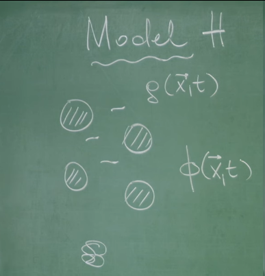
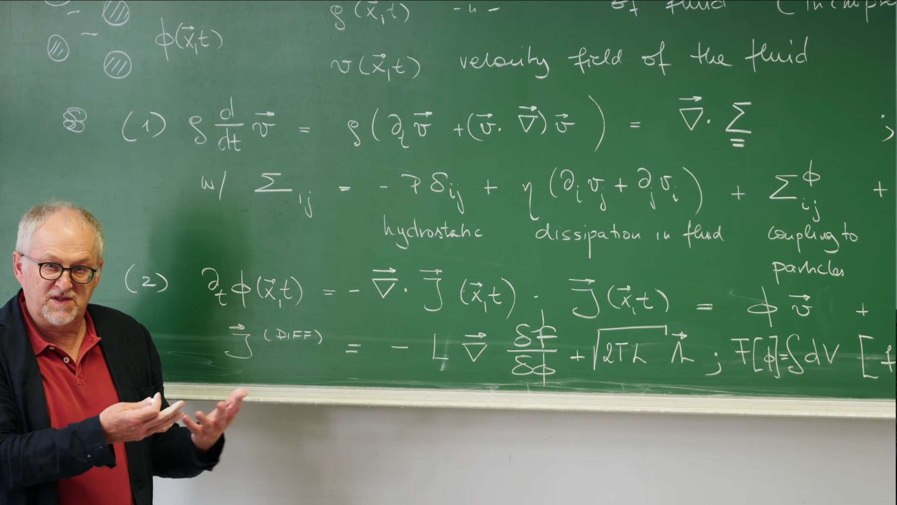

# Introduction: A Bridge Between Hydrodynamics and Suspended Particles

## From Model B to Model H: Dynamics of Coupled Conserved Fields

In Lectures 25 and 26 we distinguished models for order‑parameter dynamics, particularly introducing **Model B** for conserved order parameters. As discussed in detail in **Lecture 29**, for a conserved quantity such as the particle density $\phi(\mathbf{x},t)$, its dynamics cannot be simply described by local relaxation; it must follow a **continuity equation**:

$$\frac{\partial \phi(\mathbf{x},t)}{\partial t} = -\nabla\cdot \mathbf{J}(\mathbf{x},t).$$

This equation expresses a basic physical fact: the rate of change of particle density in a region can only arise from the net inflow or outflow of the particle current $\mathbf{J}(\mathbf{x},t)$. In Model B, the particle current $\mathbf{J}(\mathbf{x},t)$ is assumed to be driven by gradients of the chemical potential $\mu = \frac{\delta F}{\delta \phi}$, namely $\mathbf{J}(\mathbf{x},t) = -L \nabla\mu = -L \nabla \frac{\delta F[\phi]}{\delta \phi}$, where $L$ is the mobility. This ultimately yields a diffusion-like equation and establishes the foundation for understanding $\phi$ as a conserved scalar field. This Model B describes the case of particles diffusing in a **"dry" background**.

This lecture asks: what fundamentally changes when this conserved particle system, described by $\phi(\mathbf{x},t)$, is suspended in a dynamic fluid? The fluid itself has a crucial conserved quantity—the momentum density $\rho\,\mathbf{v}(\mathbf{x},t)$—whose dynamics are governed by the Navier–Stokes equations derived in Lectures 27 and 28. We thus face a complex system with two coupled conserved fields: the particle density $\phi(\mathbf{x},t)$ and the fluid velocity $\mathbf{v}(\mathbf{x},t)$.

This doubly conserved, mutually coupled system falls into the H model (Model H) of the Hohenberg–Halperin dynamical universality classes. Model H is a general framework for the dynamical coupling between a conserved scalar order parameter (e.g., $\phi$) and a conserved vector field (e.g., fluid momentum $\rho\mathbf{v}$, or equivalently the fluid velocity $\mathbf{v}$). This coupling is defining and underlies the rich hydrodynamic behavior. Our goal is to derive, from first principles, the coupled equations describing the mutual influence of $\phi(\mathbf{x},t)$ and $\mathbf{v}(\mathbf{x},t)$.



## Physical Essence of the Coupling: A Dynamic Feedback Loop

Model H does not merely superimpose two independent systems (particles and fluid). It encodes a deep feedback loop.

On one hand, the fluid advects the suspended particles. Thus changes in the fluid velocity $\mathbf{v}(\mathbf{x},t)$ directly affect the evolution of the density field $\phi(\mathbf{x},t)$. This is intuitive: a water current carries sand. Therefore the particle current $\mathbf{J}(\mathbf{x},t)$ must contain a convective contribution due to advection by $\mathbf{v}(\mathbf{x},t)$.

On the other hand, by Newton’s third law, forces come in action–reaction pairs. If the fluid exerts a convective force on the particles, the particles exert a back‑reaction on the fluid. This back‑reaction is not a simple external force; it must arise from the intrinsic thermodynamics of the particle–fluid mixture. Consequently, the total stress tensor $\Sigma_{ij}$ describing internal forces in the fluid (introduced in Lecture 28 to include viscosity and pressure) must acquire an additional contribution that depends on the particle configuration $\phi(\mathbf{x},t)$, denoted $\Sigma^{\phi}_{ij}$. This particle‑induced stress acts on the fluid through its divergence $\nabla\cdot\Sigma^{\phi}$, thereby influencing the evolution of $\mathbf{v}(\mathbf{x},t)$.

Our core task is therefore to derive this key coupling term $\Sigma^{\phi}_{ij}$ and the convective contribution to the particle current, thereby closing the dynamical feedback loop between particles and fluid. The objective is not two separate equations but their deep physical interconnection. Model H provides a comprehensive view of collective dynamics in complex particle–fluid mixtures.

# 1. Governing Equations: Two Coupled Conserved Fields

At the end of Lecture 29 we distinguished dry systems (e.g., Model B) from wet systems where particles are suspended in a dynamic fluid. Here we build the basic equations for such wet systems. The dynamics are governed by two coupled conserved fields: the fluid velocity $\mathbf{v}(\mathbf{x},t)$ and the suspended‑particle density $\phi(\mathbf{x},t)$.

## 1.1 Fluid Field: Stochastic, Incompressible Navier–Stokes

The fundamental equation describing the fluid velocity field $\mathbf{v}(\mathbf{x}, t)$ is the **momentum conservation law**. As established from first principles in **Lectures 27 and 28**, the manifestation of this law on a fluid element (i.e., Newton's second law) is:

$$\rho\,\frac{D\mathbf{v}}{Dt} = \nabla\cdot \Sigma_{ij},$$

with constant mass density $\rho$.

- **Material Derivative**: The $D\mathbf{v}/Dt$ on the left side is the key connecting Eulerian and Lagrangian perspectives, describing the acceleration observed when following a fluid element in motion:
  $$\frac{D\mathbf{v}}{Dt} = \underbrace{\frac{\partial \mathbf{v}}{\partial t}}_{\text{local acceleration}} + \underbrace{(\mathbf{v} \cdot \nabla)\mathbf{v}}_{\text{convective acceleration}}.$$
  $\frac{\partial \mathbf{v}}{\partial t}$ is the velocity change observed at a fixed point in space, while the **nonlinear convective term** $(\mathbf{v} \cdot \nabla)\mathbf{v}$ arises because a fluid element is carried by itself to new positions with different velocities. This nonlinearity is the root of complex phenomena such as turbulence in fluid mechanics.

- **Incompressibility Condition**: For liquids like water, they can be well approximated as incompressible fluids. This physical condition manifests mathematically as a kinematic constraint on the velocity field, namely its divergence is zero everywhere:
  $$\nabla \cdot \mathbf{v} = 0.$$
  This condition means that the volume of any fluid element remains constant during motion, which greatly simplifies the form of the stress tensor.

- **Stress Tensor $\Sigma_{ij}$ Decomposition**: The right side $\nabla \cdot \Sigma_{ij}$ represents the net surface force density acting on a fluid element. The total stress tensor $\Sigma_{ij}$ can be decomposed into several parts with distinctly different physical origins, directly derived from **Lecture 28**:
  $$\Sigma_{ij} = -p\delta_{ij} + \eta(\partial_i v_j + \partial_j v_i) + \Sigma^\phi_{ij} + \sigma_{ij}.$$
  1. **Isotropic pressure ($-p\delta_{ij}$)**: This is the **reversible** part of the fluid, representing thermodynamic pressure, and is the only internal stress present in ideal fluid (Euler equation).
  2. **Viscous stress ($\eta(\partial_i v_j + \partial_j v_i)$)**: This is the **irreversible dissipative** part of the fluid, representing internal friction. $\eta$ is the shear viscosity coefficient. Note that this uses the simplified form under the incompressible flow condition ($\nabla \cdot \mathbf{v} = 0$).
  3. **Random stress ($\sigma_{ij}$)**: This is the Langevin noise term in the momentum equation, the source of **fluctuations**. It represents random momentum exchange from the thermal motion of fluid molecules themselves. According to the **fluctuation-dissipation theorem**, its strength is strictly related to dissipation (viscosity) and temperature, ensuring the system reaches the correct Boltzmann equilibrium state in the absence of external forces.
  4. **Particle-induced stress ($\Sigma^\phi_{ij}$)**: This is the key **coupling term** to be found in this lecture. It describes the back-reaction of suspended particles on the fluid and is the bridge connecting the two fields. Its derivation is one of the central tasks of this lecture.

## 1.2 Particle Field: A Coupled Advection–Diffusion Equation

For the evolution of the particle density field $\phi(\mathbf{x}, t)$, exactly as in **Model B from Lecture 29**, due to particle number conservation, its dynamics must be determined by the **continuity equation**:

$$\frac{\partial \phi}{\partial t} = -\nabla \cdot \mathbf{J}.$$

In a "wet" system, the particle current $\mathbf{J}$ has two physically distinct contributions:

$$\mathbf{J} = \mathbf{J}_{\text{conv}} + \mathbf{J}_{\text{diff}}.$$

- **Convection ($\mathbf{J}_{\text{conv}} = \phi\mathbf{v}$)**: This part describes the transport process of particles being passively carried (advected) by the background fluid $\mathbf{v}$. This is a completely new term compared to the "dry" Model B, and it constitutes the first ring of the coupling feedback loop: **the fluid field $\mathbf{v}$ drives the motion of the particle field $\phi$**.

- **Diffusive current ($\mathbf{J}_{\text{diff}}$)**: This part describes the motion of particles relative to the surrounding fluid, driven by thermodynamic forces. Its form is identical to the "dry" Model B, both given by the **Onsager linear relationship** and **fluctuation-dissipation theorem** established in **Lectures 24 and 29**:
  $$\mathbf{J}_{\text{diff}} = -L\nabla\mu + \boldsymbol{\xi}_J,$$
  where the chemical potential $\mu = \frac{\delta F}{\delta \phi}$ is the **thermodynamic driving force**, $L$ is the Onsager kinetic coefficient (mobility), and $\boldsymbol{\xi}_J$ is the random noise current related to the diffusion process, whose correlation strength is determined by $L$ and temperature $T$.

Combining these two parts yields the complete dynamics equation for the particle density field, a **noisy advection-diffusion equation**:
$$\frac{\partial \phi}{\partial t} + \nabla \cdot (\phi \mathbf{v}) = \nabla \cdot (L \nabla\mu) - \nabla \cdot \boldsymbol{\xi}_J.$$

In the final form of the equation, the advection term has been moved to the left side. The combination $\partial_t \phi + \nabla \cdot (\phi \mathbf{v})$ clearly shows how the density field $\phi$ is "carried" and transported by the velocity field $\mathbf{v}$, which mathematically echoes the material derivative term in the Navier-Stokes equation.

At this point, the form of the two basic governing equations of Model H has been established. They clearly show a **unidirectional coupling relationship**: the velocity field $\mathbf{v}$ in the Navier-Stokes equation directly affects the spatiotemporal evolution of the particle density field $\phi$ through the advection term $\phi\mathbf{v}$.

However, this theoretical framework is currently incomplete because the feedback loop has not been closed. According to Newton's third law, if the fluid can push particles, the particles must also exert a back-reaction force on the fluid. This back-reaction is hidden in the **particle-induced stress tensor $\Sigma^\phi_{ij}$** in the Navier-Stokes equation that has not yet been determined. In the current form, any changes in the particle field $\phi$ would not affect the fluid field $\mathbf{v}$ at all, which is physically impossible.

Therefore, the core task ahead is to use thermodynamic and symmetry principles to derive the specific expression for this crucial coupling term $\Sigma^\phi_{ij}$, thereby **closing this feedback loop** and constructing a complete and self-consistent Model H.

At this stage the coupling is one‑way: $\mathbf{v}$ advects $\phi$. To complete the feedback loop we must derive the particle‑induced stress $\Sigma^{\phi}_{ij}$ that encodes the back‑reaction of $\phi$ on $\mathbf{v}$.

# 2. The Key Coupling: Deriving $\Sigma^{\phi}$ from Thermodynamics

How do particles exert a back‑reaction on the fluid? This physical process is mathematically encapsulated in the **particle-induced stress tensor $\Sigma^\phi$**. This section will connect **particle system thermodynamics** with **fluid mechanics** to find the precise expression for this crucial coupling term. The clever aspect of the derivation lies in applying the **principle of virtual work**, which asserts that under a tiny virtual displacement, the work done by external/internal forces equals the change in free energy.

**Virtual Work** is not real work that actually occurs. It is work calculated in a "thought experiment."

Imagine a system in a **static equilibrium** state, such as a stone sitting steadily on the ground, or a balance with equal weights on both sides. Now, we perform a **virtual displacement** on this system in our minds.

This "virtual displacement" has three key characteristics: **Hypothetical**, **Infinitesimal**, and **Instantaneous**. The sum of work done by all forces acting on the system.

Therefore, for a system in static equilibrium, the total virtual work produced by all external forces is zero.

Mathematically expressed as:

$$\delta W = \sum_i \mathbf{F}_i \cdot \delta\mathbf{r}_i = 0$$

where $\delta W$ is the total virtual work, $\mathbf{F}_i$ is the force acting on particle $i$, and $\delta\mathbf{r}_i$ is the virtual displacement of particle $i$.

This allows us to analyze only forces and displacements, completely ignoring complex internal constraint forces (such as rope tension, contact surface support forces, etc.) that we are not concerned with, as these constraint forces typically do no work in virtual displacements or their work cancels out.

## 2.1 Thermodynamic Drive: The Free‑Energy Functional $F[\phi]$

To understand the behavior of the particle system, the starting point must be the **free energy functional $F[\phi]$** describing its equilibrium properties. This is consistent with the analysis of Models A and B in **Lectures 25 and 29**. The free energy is the "potential energy" driving system evolution, with its specific form being the classical Ginzburg-Landau (or Cahn-Hilliard) functional:

$$F[\phi] = \int d^3x \left[ f(\phi) + \frac{\kappa}{2}(\nabla\phi)^2 \right]$$

- **Bulk free energy density ($f(\phi)$)**: This term describes the free energy per unit volume in a uniform system, determined jointly by entropy contributions and mean-field interactions between particles. For systems that undergo phase separation, $f(\phi)$ typically has a double-well structure.

- **Gradient energy ($\frac{\kappa}{2}(\nabla\phi)^2$)**: This term represents an energy penalty for concentration gradients, where the coefficient $\kappa > 0$. It makes forming steep concentration gradients (i.e., phase interfaces) energetically costly, which is precisely the microscopic origin of **surface tension**.

With the free energy functional, the **chemical potential $\mu$** driving particle diffusion can be defined through the functional derivative, representing the change in free energy caused by adding a particle to a certain location in the system:

$$\mu = \frac{\delta F}{\delta \phi} = \frac{\partial f}{\partial \phi} - \kappa \nabla^2 \phi$$

This chemical potential $\mu$ is the effective thermodynamic force driving particle diffusion.

## 2.2 Derivation via Virtual Work

Now, following the derivation approach in the lecture, let's find the relationship between $\Sigma^\phi$ and $\mu$.

**Step 1: Calculate free energy change from mechanical perspective**

Consider a tiny, incompressible ($\nabla \cdot \mathbf{u} = 0$) fluid **virtual displacement field** $\mathbf{u}(\mathbf{x})$. During this deformation process, the work done by the particle stress tensor $\Sigma^\phi$ on the fluid equals the change in system free energy $\delta F$. This work is obtained by integrating the product of stress and strain rate (here the displacement gradient $\partial_i u_j$) over the entire volume:

$$\delta F_{\text{mech}} = \int d^3x \sum_{i,j} \Sigma^\phi_{ij} (\partial_i u_j)$$

**Step 2: Calculate free energy change from thermodynamic perspective**

The same fluid displacement $\mathbf{u}$ will necessarily advect the particle density field. After displacement, the new density $\phi'(\mathbf{x})$ at point $\mathbf{x}$ comes from the density at point $\mathbf{x}-\mathbf{u}$ before displacement, i.e., $\phi'(\mathbf{x}) = \phi(\mathbf{x}-\mathbf{u})$. For small displacement $\mathbf{u}$, the local density change is $\delta\phi = \phi'(\mathbf{x}) - \phi(\mathbf{x}) \approx -\mathbf{u} \cdot \nabla\phi$. The free energy change caused by this material redistribution can be calculated from the thermodynamic perspective:

$$\delta F_{\text{therm}} = \int d^3x \frac{\delta F}{\delta \phi} \delta \phi = \int d^3x \mu (-\mathbf{u} \cdot \nabla \phi)$$

**Step 3: Set the two expressions equal**

For a system dominated by conservative forces (forces that can be derived from a potential function):

1. **Mechanical work ($\delta F_{mech}$)**: This is the work done by internal stresses (forces) during the virtual displacement (deformation) process. It represents **energy input or exchange**.

2. **Free energy change ($\delta F_{therm}$)**: This is the change in internally stored potential energy (here thermodynamic free energy). It represents **changes in the system's internal energy state**.

In this case, the principle of virtual work is actually a manifestation of the **work-energy principle**: in a reversible, infinitesimal process, the work done on the system must equal the change in internally stored energy.

This is like slowly compressing a spring: the **mechanical work** you do on the spring ($\delta W_{mech}$) is **completely converted** and stored as the spring's **elastic potential energy** ($\delta U_{potential}$). The two must be numerically equal: $\delta W_{mech} = \delta U_{potential}$.

Therefore, according to the principle of virtual work, these two free energy changes calculated from different perspectives (mechanical vs. thermodynamic) must be equal:

$$\int d^3x \sum_{i,j} \Sigma^\phi_{ij} (\partial_i u_j) = -\int d^3x \mu (\mathbf{u} \cdot \nabla \phi)$$

**Step 4: Integration by parts to separate $\mathbf{u}$**

To extract a universally valid relationship from the integral, we need to use integration by parts to move the derivative from the arbitrary displacement field $\mathbf{u}$.

- **Left side integral**: Using integration by parts (and assuming boundary terms vanish), the derivative is transferred from $u_j$ to $\Sigma^\phi_{ij}$:

    $$\int \Sigma^\phi_{ij} (\partial_i u_j) d^3x = -\int u_j (\partial_i \Sigma^\phi_{ij}) d^3x$$

- **Right side integral**: Here the goal is to separate $\mathbf{u}$ from the derivative. Using the vector identity $\mu(\nabla\phi) = \nabla(\mu\phi) - \phi(\nabla\mu)$, substitute into the right side integral:
    $$-\int \mathbf{u} \cdot [\nabla(\mu\phi) - \phi(\nabla\mu)] d^3x = -\int \mathbf{u} \cdot \nabla(\mu\phi) d^3x + \int \mathbf{u} \cdot (\phi \nabla\mu) d^3x$$
    Apply integration by parts to the first term again, and using the incompressibility condition $\nabla \cdot \mathbf{u} = 0$, it can be shown that this integral vanishes. Therefore, the right side finally becomes:
    $$\delta F_{\text{therm}} = \int d^3x \mathbf{u} \cdot (\phi \nabla\mu)$$

**Step 5: Obtain the core relationship**

Now both sides have separated $\mathbf{u}$:

$$-\int d^3x \sum_j u_j (\partial_i \Sigma^\phi_{ij}) = \int d^3x \sum_j u_j (\phi \partial_j \mu)$$

Since the displacement field $\mathbf{u}$ is arbitrary, for this equality to hold universally, the integrands must be equal everywhere. Therefore, we obtain the most fundamental coupling relationship:

$$\nabla \cdot \Sigma^\phi = \phi \nabla\mu$$

## 2.3 Physical Interpretation: Osmotic Pressure and Interfacial Tension

This result, while elegant, is still somewhat abstract. It tells us that the **force density** exerted by particles on the fluid is $\phi \nabla\mu$. What exactly is this force? Its physical connotation:

$$\Sigma^\phi_{ij} = (\phi\mu - \tilde{f}(\phi))\delta_{ij} - \kappa (\partial_i \phi)(\partial_j \phi)$$

where $\tilde{f}(\phi) = f(\phi) + \frac{\kappa}{2}(\nabla\phi)^2$. This expression perfectly encodes two important physical phenomena:

1. **Osmotic Pressure**: The first term $(\phi\mu - \tilde{f}(\phi))\delta_{ij}$ is an isotropic stress, i.e., a pressure. It is precisely the **osmotic pressure $\Pi_{\text{osm}}$** arising from the presence of suspended particles. In thermodynamics, inhomogeneous solute concentration produces osmotic pressure gradients, which drive solvent flow. Here, the force density term $\phi\nabla\mu$ is the macroscopic manifestation of this thermodynamic force on the fluid.

2. **Interfacial Tension**: The second term $-\kappa (\partial_i \phi)(\partial_j \phi)$ is an anisotropic stress. It is nonzero only where $\nabla\phi \neq 0$ (i.e., at phase interfaces). Its tensor structure $-(gradient) \otimes (gradient)$ means this is a **tensile stress** along the interface direction (trying to minimize interface area), while in the direction perpendicular to the interface it is a **compressive stress**—precisely the mechanical manifestation of **surface tension**.

In summary, the derived coupling force density $\phi\nabla\mu$ does not appear out of nowhere; it is deeply rooted in the thermodynamic free energy of the particle system and acts on the fluid through two physical mechanisms—osmotic pressure (bulk effect) and interfacial tension (interface effect)—thereby completing the crucial feedback loop in Model H.

Through the principle of virtual work, we have successfully connected the thermodynamic properties of the particle system (described by free energy $F[\phi]$ and chemical potential $\mu$) with the mechanical properties of the fluid (stress tensor $\Sigma$). **The derivation of the core relationship $\nabla \cdot \Sigma^\phi = \phi \nabla\mu$ formally closes the feedback loop proposed at the end of Section 1**.

Now, both governing equations of Model H are complete. The fluid affects particles through the advection term $\phi\mathbf{v}$, while particles react back on the fluid through the force density term $\phi\nabla\mu$. At this point, all the physical elements needed to construct the complete model are in place, and we can assemble them to obtain the final form of Model H.

# 3. Final Equation Set of Model H

After the construction and derivation of the previous two sections, all the key elements constituting Model H—the particle current $\mathbf{J}$ and particle-induced stress $\Sigma^\phi$—have been determined. Now, substituting these results into their respective conservation law frameworks, we can obtain the complete equation set describing the coupled dynamics of suspended particles and fluid.

## 3.1 Particle Density Equation (Noisy Advection-Diffusion Equation)

Substituting the complete expression for the particle current $\mathbf{J} = \phi\mathbf{v} - L\nabla\mu + \boldsymbol{\xi}_J$ into the continuity equation $\partial_t \phi = -\nabla \cdot \mathbf{J}$, we obtain:

$$\frac{\partial \phi}{\partial t} = -\nabla \cdot (\phi\mathbf{v}) + \nabla \cdot (L\nabla\mu) - \nabla \cdot \boldsymbol{\xi}_J$$

Using the incompressibility condition of the fluid $\nabla \cdot \mathbf{v} = 0$, the advection term can be expanded as $\nabla \cdot (\phi\mathbf{v}) = (\nabla\phi)\cdot\mathbf{v} + \phi(\nabla\cdot\mathbf{v}) = \mathbf{v} \cdot \nabla\phi$. Assuming the mobility $L$ is constant, the equation is finally organized as:

$$\frac{\partial \phi}{\partial t} + \mathbf{v} \cdot \nabla \phi = L\nabla^2\mu - \nabla \cdot \boldsymbol{\xi}_J$$

This equation beautifully describes the dual dynamics of particle density:

* **Left side $\frac{\partial \phi}{\partial t} + \mathbf{v} \cdot \nabla \phi$** is precisely the **material derivative $\frac{D\phi}{Dt}$** of the density field $\phi$ (in incompressible fluid). It describes the density change observed by an observer moving with the fluid.

* **Right side** describes the sources of this change: first, the **diffusion** process of particles relative to the background fluid, driven by chemical potential gradients ($L\nabla^2\mu$); second, **random fluctuations** caused by the heat bath ($-\nabla \cdot \boldsymbol{\xi}_J$).

## 3.2 Fluid Velocity Equation (Generalized Navier-Stokes Equation)

Substituting the core coupling relationship $\nabla \cdot \Sigma^\phi = \phi \nabla\mu$ into the momentum conservation equation $\rho \frac{D\mathbf{v}}{Dt} = \nabla \cdot \Sigma$ and expanding other terms, we obtain:

$$\rho \left( \frac{\partial \mathbf{v}}{\partial t} + (\mathbf{v} \cdot \nabla)\mathbf{v} \right) = -\nabla p + \eta\nabla^2\mathbf{v} + \phi \nabla\mu + \nabla \cdot \sigma$$

This equation is a generalization of the standard Navier-Stokes equation:

* **Left side and first two terms** ($\rho \frac{D\mathbf{v}}{Dt}$, $-\nabla p$, $\eta\nabla^2\mathbf{v}$) are standard fluid mechanics terms, representing inertia, pressure gradient, and viscous dissipation respectively.

* **Core coupling term $\phi \nabla\mu$** is the newly introduced force density. It represents how the thermodynamic state of the particle system (described by chemical potential $\mu$) is directly converted into a mechanical force acting on the fluid. It is precisely this term that constitutes the second ring of the feedback loop: **the particle field $\phi$ reacts back on the fluid field $\mathbf{v}$ through chemical potential gradients**.

## 3.3 Momentum Conservation: A Consistency Check

Now let's prove momentum conservation to verify the self-consistency of the entire theoretical framework.

The total momentum of the system is $\mathbf{P}_{\text{tot}} = \int d^3x (\rho \mathbf{v})$ (here we only consider fluid momentum, as particle mass is usually much smaller than fluid). Its time derivative is:

$$\frac{d\mathbf{P}_{\text{tot}}}{dt} = \int d^3x \rho \frac{D\mathbf{v}}{Dt} = \int d^3x (\nabla \cdot \Sigma)$$

According to Gauss's divergence theorem, the volume integral of divergence can be transformed into a flux integral across the boundary of that volume. For an isolated system, there are no forces on its infinitely distant boundary surface, so the flux is zero.

$$\int_V (\nabla \cdot \Sigma) d^3x = \oint_{\partial V} \Sigma \cdot d\mathbf{S} = 0$$

This shows that **all internal forces, including the crucial coupling term $\phi\nabla\mu$, integrate to zero throughout the entire system**. The role of the coupling term is to **redistribute momentum** between the particle and fluid subsystems, but the total momentum of the entire particle-fluid system is conserved. This verification confirms that the derived coupling term is physically reasonable, as it correctly plays the role of an "internal force."

# 4. Code Practice: Visualizing the Competition of Advection and Diffusion

Solving the fully coupled PDEs of Model H is demanding. To visualize the core physics—advection versus diffusion—we simulate individual Brownian particles forming a cluster in a simple shear flow and track their trajectories. This links the field equation
$$\partial_t\phi + \mathbf{v}\cdot\nabla\phi = \nabla\cdot(L\,\nabla\mu) - \nabla\cdot\boldsymbol{\xi}_J$$
to its microscopic basis, the Langevin dynamics of single particles,
$$\frac{d\mathbf{r}}{dt} = \mathbf{v}(\mathbf{r}) + \sqrt{2D}\,\boldsymbol{\eta}(t).$$

## 4.1 Simulation: A Brownian Particle Cluster in Shear Flow

```python
import numpy as np
import matplotlib.pyplot as plt
from matplotlib.animation import FuncAnimation, PillowWriter

# --- 1. Set simulation parameters ---
n_particles = 50     # Number of particles to simulate (increased)
n_steps = 5000       # Number of time steps
dt = 0.01            # Length of each time step
D = 0.1              # Diffusion coefficient (controls Brownian motion strength)
gamma = 1.0          # Shear rate (controls flow field strength)

# --- 2. Initialize particle positions ---
# Randomly place particles near the center of the region
np.random.seed(42) # For reproducible results
positions = np.random.randn(n_particles, 2) * 0.5
# Record trajectories of each particle
trajectories = np.zeros((n_particles, n_steps + 1, 2))
trajectories[:, 0, :] = positions

# --- 3. Simulate evolution (Euler-Maruyama method) ---
for i in range(n_steps):
    # Current positions
    r = trajectories[:, i, :]
    # Flow field velocity v(r) = (gamma * y, 0)
    v_flow = np.zeros_like(r)
    v_flow[:, 0] = gamma * r[:, 1]
    
    # Random noise term
    noise = np.random.randn(n_particles, 2)
    
    # Update positions
    # r(t+dt) = r(t) + v_flow(r) * dt + sqrt(2*D*dt) * noise
    trajectories[:, i + 1, :] = r + v_flow * dt + np.sqrt(2 * D * dt) * noise
    
    # Keep particles within bounds to prevent them from leaving the view
    # X boundary
    outbound_x = np.where(trajectories[:, i + 1, 0] > 5)
    trajectories[outbound_x, i + 1, 0] = 5
    outbound_x = np.where(trajectories[:, i + 1, 0] < -5)
    trajectories[outbound_x, i + 1, 0] = -5
    
    # Y boundary
    outbound_y = np.where(trajectories[:, i + 1, 1] > 5)
    trajectories[outbound_y, i + 1, 1] = 5
    outbound_y = np.where(trajectories[:, i + 1, 1] < -5)
    trajectories[outbound_y, i + 1, 1] = -5

# --- 4. Create dynamic visualization ---
fig, ax = plt.subplots(figsize=(10, 8))

# Set black background
fig.patch.set_facecolor('black')
ax.set_facecolor('black')

# a) Plot background flow field (Quiver Plot)
x_grid = np.linspace(-5, 5, 20)
y_grid = np.linspace(-5, 5, 20)
X, Y = np.meshgrid(x_grid, y_grid)
U = gamma * Y  # x-direction velocity
V = np.zeros_like(X) # y-direction velocity

# Create alternating color pattern for flow field arrows
# Alternate between two colors to create moving effect
colors_pattern = np.zeros((X.shape[0], X.shape[1], 4))
colors_pattern[::2, ::2] = [1, 1, 1, 0.7]  # White
colors_pattern[1::2, 1::2] = [1, 1, 1, 0.7]  # White
colors_pattern[::2, 1::2] = [0.5, 0.5, 1, 0.7]  # Blueish
colors_pattern[1::2, ::2] = [0.5, 0.5, 1, 0.7]  # Blueish

# Flatten the color array for use with quiver
C = np.zeros((X.shape[0] * X.shape[1], 4))
C[::2] = [1, 1, 1, 0.7]  # White
C[1::2] = [0.5, 0.5, 1, 0.7]  # Blueish

# Set flow field arrows with alternating colors
quiver = ax.quiver(X, Y, U, V, color=C, alpha=0.7)

# b) Initialize trajectory lines and particle points with comet effect
lines = []
points = []
# Create multiple points for each particle to achieve glowing effect
glow_points = []
colors = plt.cm.plasma(np.linspace(0, 1, n_particles))

# Tail length for comet effect (increased)
tail_length = 100

for i in range(n_particles):
    # Main particle point
    point, = ax.plot([], [], 'o', color=colors[i], markersize=8)
    # Comet tail (longer trajectory)
    line, = ax.plot([], [], color=colors[i], alpha=0.6, linewidth=2)
    # Glowing effect - multiple points with decreasing size and increasing transparency
    glow_set = []
    for j in range(5):
        glow_point, = ax.plot([], [], 'o', color=colors[i], 
                             markersize=8-j*1.2, alpha=0.8-j*0.15)
        glow_set.append(glow_point)
    
    points.append(point)
    lines.append(line)
    glow_points.append(glow_set)

# c) Set figure format
ax.set_title('Brownian Particles in a Shear Flow', fontsize=16, color='white')
ax.set_xlabel('x position', fontsize=12, color='white')
ax.set_ylabel('y position', fontsize=12, color='white')
ax.set_aspect('equal', adjustable='box')
ax.set_xlim(-5, 5)
ax.set_ylim(-5, 5)
ax.grid(True, linestyle='--', alpha=0.3, color='gray')

# Set axis tick colors
ax.tick_params(colors='white')

# d) Animation update function
def update(frame):
    # Animate the flow field by shifting the color pattern
    t = frame % 4  # Cycle through 4 phases
    
    # Create new color pattern based on time
    if t == 0:
        C_new = np.zeros((X.shape[0] * X.shape[1], 4))
        C_new[::2] = [1, 1, 1, 0.7]  # White
        C_new[1::2] = [0.5, 0.5, 1, 0.7]  # Blueish
    elif t == 1:
        C_new = np.zeros((X.shape[0] * X.shape[1], 4))
        C_new[1::4] = [1, 1, 1, 0.7]  # White
        C_new[3::4] = [1, 1, 1, 0.7]  # White
        C_new[::4] = [0.5, 0.5, 1, 0.7]  # Blueish
        C_new[2::4] = [0.5, 0.5, 1, 0.7]  # Blueish
    elif t == 2:
        C_new = np.zeros((X.shape[0] * X.shape[1], 4))
        C_new[::2] = [0.5, 0.5, 1, 0.7]  # Blueish
        C_new[1::2] = [1, 1, 1, 0.7]  # White
    else:  # t == 3
        C_new = np.zeros((X.shape[0] * X.shape[1], 4))
        C_new[1::4] = [0.5, 0.5, 1, 0.7]  # Blueish
        C_new[3::4] = [0.5, 0.5, 1, 0.7]  # Blueish
        C_new[::4] = [1, 1, 1, 0.7]  # White
        C_new[2::4] = [1, 1, 1, 0.7]  # White
    
    # Update quiver colors to create moving effect
    quiver.set_color(C_new)
    
    # Display more trajectory points per frame for smoother animation
    step = max(1, frame * 5)  # Add 5 time steps of data points per frame
    if step > n_steps:
        step = n_steps
    
    for i in range(n_particles):
        # Determine the range for the comet tail
        start_idx = max(0, step - tail_length)
        end_idx = step
        
        # Update comet tail (longer trajectory)
        lines[i].set_data(trajectories[i, start_idx:end_idx, 0], 
                         trajectories[i, start_idx:end_idx, 1])
        
        # Update main particle point position
        points[i].set_data(trajectories[i, step-1, 0], trajectories[i, step-1, 1])
        
        # Update glowing effect points (multiple points trailing behind)
        for j, glow_point in enumerate(glow_points[i]):
            offset = j + 1
            if step > offset:
                glow_point.set_data(trajectories[i, step-1-offset, 0], 
                                   trajectories[i, step-1-offset, 1])
            else:
                glow_point.set_data([], [])  # Hide if not enough history
    
    # Return all animated elements
    flat_glow_points = [item for sublist in glow_points for item in sublist]
    return [quiver] + lines + points + flat_glow_points

# e) Create animation
# To control animation length, we calculate total frames
n_frames = n_steps // 5
ani = FuncAnimation(fig, update, frames=range(0, n_frames, 5), blit=True, interval=30)

# f) Save as GIF
ani.save('brownian_particles_comet.gif', writer=PillowWriter(fps=25))

plt.show()

```


This reveals the competition of two core processes in Model H:

- Advection shapes structure: the initially circular cluster (a localized density fluctuation) is stretched by the background shear flow into an inclined, ellipsoidal shape. Particles with $y>0$ move faster to the right than those with $y<0$, deforming and transporting the cluster. This directly visualizes the convective term $\mathbf{v}\cdot\nabla\phi$: the flow acts on the density gradient to produce inhomogeneous transport that sculpts macroscopic structure.

- Diffusion smooths structure: simultaneously the cluster’s boundary blurs and its extent grows. Brownian motion is fluctuation‑driven diffusion, corresponding to the field‑level diffusion term $\nabla\cdot(L\nabla\mu)$ and noise term $-\nabla\cdot\boldsymbol{\xi}_J$. Together they counteract inhomogeneity and spread particles, maximizing entropy.

Advection is deterministic and tends to create/stretch structure; diffusion is stochastic and tends to erase structure by increasing entropy. The richness of Model H stems from their continuing competition and balance across scales.

# 5. Conclusion



We systematically derived and interpreted Model H: a powerful continuum theory for the coupled dynamics of a conserved order parameter (e.g., particle concentration) and the host fluid momentum. The core physics lies in the mutual interaction: the fluid advects particles, while particles exert the thermodynamic force density $\phi\nabla\mu$ on the fluid, manifesting macroscopically as osmotic pressure and interfacial tension. The resulting coupled equations provide a firm basis for studying phase separation, colloidal suspensions, and other complex fluids.

So far our method has been to write stochastic equations of motion (Langevin equations), a differential viewpoint tracking step‑by‑step evolution. Next we switch perspective and ask a global question: what is the probability of a particular history (path) $\phi(\mathbf{x},t)$? The answer is furnished by path integrals. The Onsager–Machlup functional will appear as an “action” for stochastic dynamics: just as least action picks a unique classical path, Onsager–Machlup weights every fluctuation path with a probability. It provides a powerful, elegant framework for non‑equilibrium statistics, enabling calculations of fluctuation spectra, response functions, and more.

