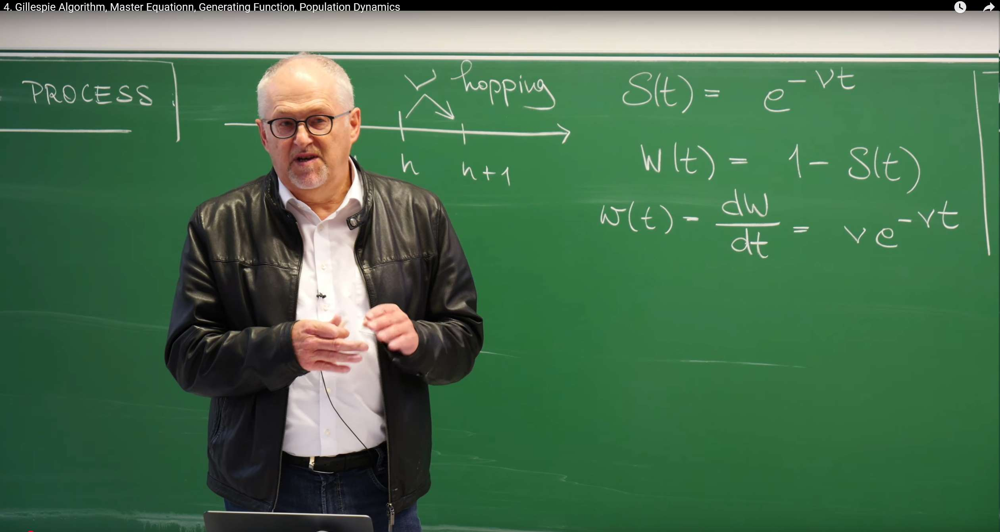
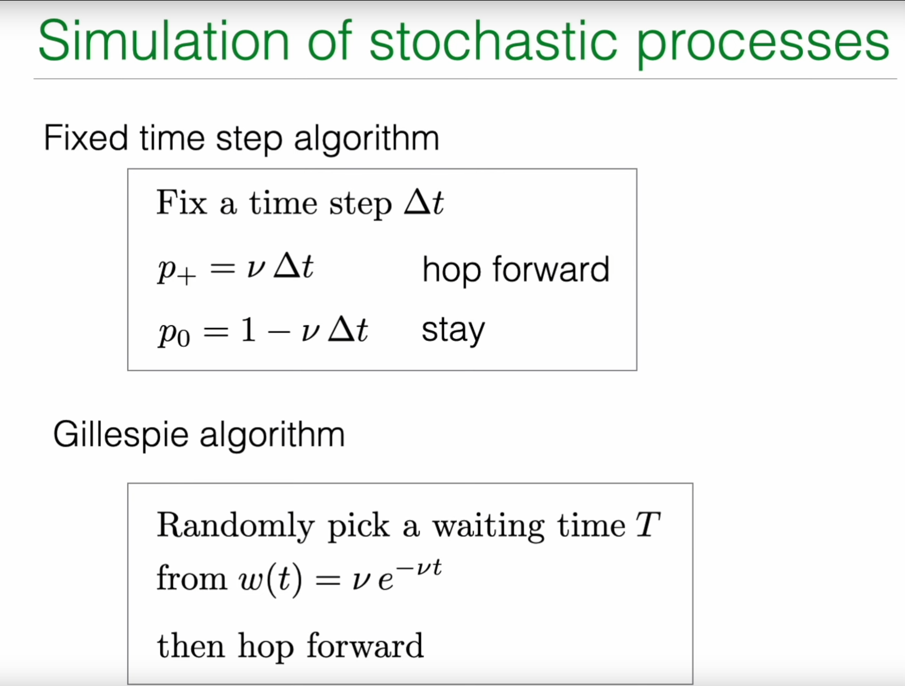
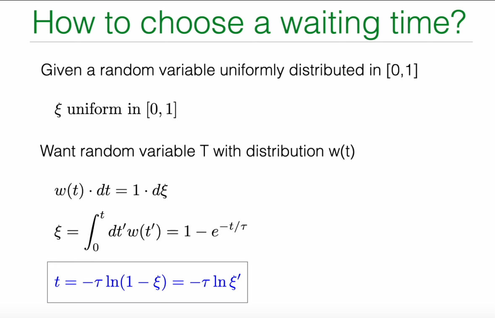
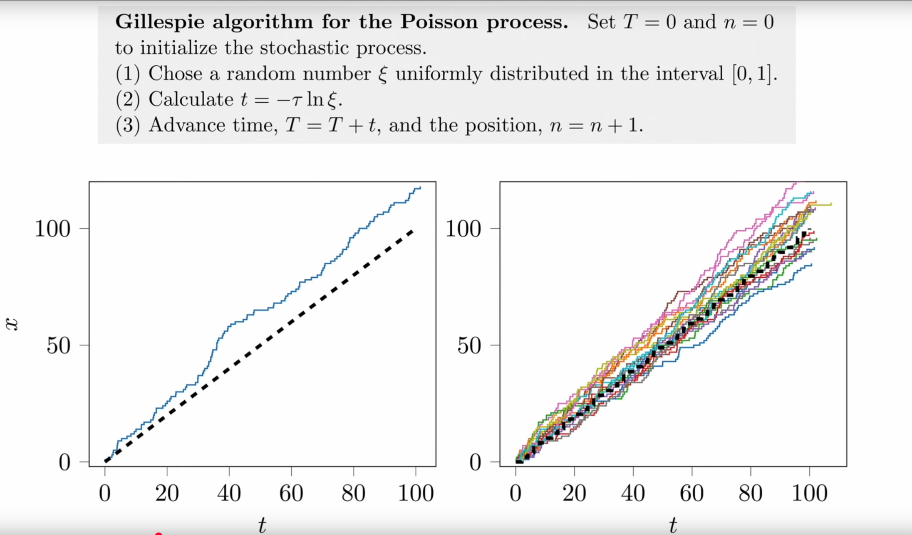
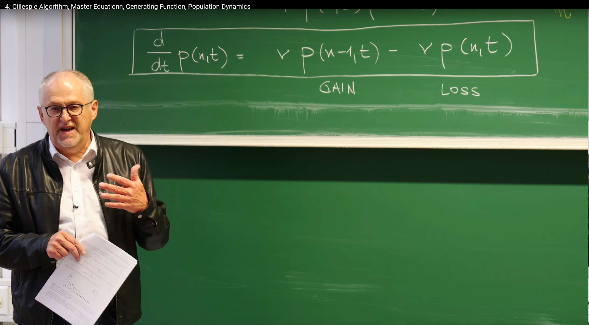
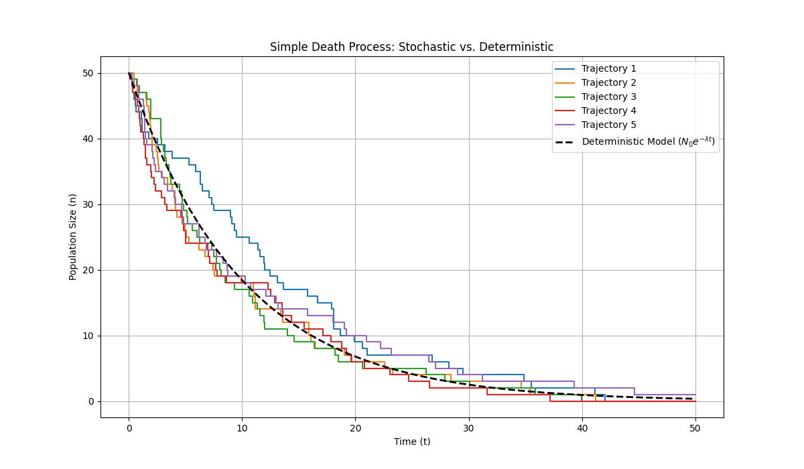

# Review: Poisson Process and Its Simulation

In the previous lecture, Prof. Erwin Frey discussed in detail the Poisson process, which describes a stochastic process where events occur at a constant average rate in continuous time. This section begins by reviewing the core mathematical characteristics of the Poisson process and uses this as a foundation to introduce more advanced stochastic process simulation and analysis methods.

## Waiting Time Distribution and Memorylessness

A core feature of the Poisson process is its "**memorylessness**." This means that the probability of the next event occurring in some future time interval is independent of how long we have already waited. This physical property is mathematically manifested as the waiting times between events following an exponential distribution.

The professor reviewed several key formulas describing this property on the blackboard:



**Survival Probability $S(t)$:** The probability that no event occurs for a waiting time exceeding $t$ starting from any moment. For the Poisson process, this probability decays exponentially with time:

$$
S(t)=e^{-\nu t}
$$

where $\nu$ is the constant rate of event occurrence.

**Cumulative Distribution Function (CDF) of Waiting Time $W(t)$:** The probability that the waiting time is less than or equal to $t$. It equals 1 minus the survival probability:

$$
W(t)=1-S(t)=1-e^{-\nu t}
$$

**Probability Density Function (PDF) of Waiting Time $w(t)$:** The probability density of event occurrence in an infinitesimal time window $dt$ around time $t$. It is the derivative of the cumulative distribution function:

$$
w(t)=\frac{dW(t)}{dt}=\nu e^{-\nu t}
$$

This set of formulas forms the foundation of the Poisson process. The exponential form of the waiting time distribution $w(t)$ directly embodies memorylessness. We can verify this by calculating conditional probabilities: assuming no event has occurred before time $t_0$, the conditional probability of an event occurring in the next $dt$ time is:

$$
P(t_0 < T \leq t_0 + dt \mid T > t_0) = \frac{w(t_0) \, dt}{S(t_0)} = \frac{\nu e^{-\nu t_0} \, dt}{e^{-\nu t_0}} = \nu \, dt
$$

This result is independent of $t_0$, indicating that regardless of how long we have waited, the probability of an event occurring in the next instant is always $\nu dt$.

## Simulation Dilemma: Limitations of Fixed Time Step Methods

With the analytical description of the Poisson process, a natural question arises: How do we simulate such a process on a computer? The most intuitive method is the **fixed time step algorithm**.



The approach is as follows:

1.Discretize time into a series of small time steps $\Delta t$.

2.In each time step, the particle has a certain probability of "jumping" forward one step (i.e., one event occurs).

3.This probability $p_+$ is set to the rate $\nu$ multiplied by the time step $\Delta t$, i.e., $p_+=\nu\Delta t$.

4.Correspondingly, the probability of no jump occurring in this step is $p_0=1-p_+=1-\nu\Delta t$.

However, this seemingly simple method has profound theoretical flaws and practical difficulties:

- **Accuracy issues**: This method is valid only under the premise that $\nu\Delta t\ll 1$, i.e., the probability of an event occurring in one time step must be very small. If $\Delta t$ is not small enough, this approximation no longer holds. More seriously, it completely ignores the possibility of two or more events occurring in one $\Delta t$ (with probability proportional to $(\nu\Delta t)^2$ or higher-order terms).

- **Efficiency issues**: If the event occurrence rate $\nu$ is very small, then in the vast majority of time steps, the system is in a "nothing happens" state ($p_0\approx 1$). The computer spends a lot of time simulating these "no-event" steps, resulting in extremely low efficiency.

- **Correctness issues**: This method introduces an artificial time grid, forcing events to occur only at discrete time points $k\cdot\Delta t$ (where $k$ is an integer), which contradicts the characteristic of real Poisson processes where events can occur at any continuous time.

These limitations drive us to seek a more accurate and efficient simulation method, which is one of the core contents of this lecture—the **Gillespie algorithm**.

# 1. Gillespie Algorithm: A Precise Stochastic Simulation Method

The Gillespie algorithm, also known as the Stochastic Simulation Algorithm (SSA), is an **event-driven** method that completely abandons the concept of fixed time steps. Its core idea is not to ask **"Will an event occur in the next $\Delta t$?"** but to directly ask **"When will the next event occur?"** By directly sampling random numbers from the theoretically correct waiting time distribution, this algorithm can precisely simulate every event of the stochastic process, making it an "**exact**" simulation method whose results are statistically identical to the theoretical analytical solution.

## 1.1 Core Idea: Inverse Transform Sampling



The foundation of the Gillespie algorithm is how to generate a random number that follows a specific probability distribution (here, the exponential distribution $w(t)=\nu e^{-\nu t}$). This requires a powerful statistical technique—**Inverse Transform Sampling**.

The principle is as follows:

1.We have a target probability density function $w(t)$ and its corresponding cumulative distribution function $W(t)=\int_0^t w(t')dt'$.

2.We also have a tool that can generate uniformly distributed random numbers in the $[0, 1]$ interval, which we call $\xi$.

3.The core equation is probability conservation: the probability $w(t)dt$ in the range $dt$ around $t$ should equal the probability $1\cdot d\xi$ in the range $d\xi$ around $\xi$. That is:

$$
w(t)dt=d\xi
$$

4.Integrating both sides of this equation from 0 to $t$, the left side gives the cumulative distribution function $W(t)$, and the right side gives $\xi$:

$$
\xi=\int_0^t w(t')dt'=W(t)
$$

5.For the Poisson process, we have $W(t)=1-e^{-\nu t}$, so:

$$
\xi=1-e^{-\nu t}
$$

6.Now, our goal is to solve for $t$ given the known $\xi$. Through simple algebraic transformation, we can obtain the expression for $t$:

$$
e^{-\nu t}=1-\xi
$$

$$
-\nu t=\ln(1-\xi)
$$

$$
t=-\frac{1}{\nu}\ln(1-\xi)
$$

7.**Here is a clever simplification:** Since $\xi$ is a uniformly distributed random number in the $[0, 1]$ interval, $1-\xi$ is also a uniformly distributed random number in the $[0, 1]$ interval. Therefore, we can use another uniform random number $\xi'$ to replace $1-\xi$, thus obtaining the final sampling formula:

$$
t=-\frac{1}{\nu}\ln(\xi')
$$

In the lecture notes, the professor used the characteristic time $\tau=1/\nu$ to express this, writing the formula as $t=-\tau\ln(\xi)$.

This derivation not only provides a method for generating waiting times in the Poisson process but, more importantly, reveals a universal principle: **to sample from any probability distribution, one only needs to first generate a uniform random number $\xi$ on $[0, 1]$, then calculate the inverse function of its cumulative distribution function $W^{-1}(\xi)$**.

## 1.2 Gillespie Algorithm Steps for Poisson Process

Based on the above principle, the Gillespie algorithm for simulating the Poisson process can be clearly summarized as the following three-step loop:

1.**Initialization**: Set initial time $T=0$ and initial position (event count) $n=0$.

2.**Sample waiting time**:

   a. Generate a uniformly distributed random number $\xi$ in the $[0, 1]$ interval.

   b. Calculate the waiting time $t$ for the next event occurrence according to the formula $t=-\frac{1}{\nu}\ln(\xi)$.

3.**Update system state**:

   a. Advance the current time by $t$: $T \leftarrow T+t$.

   b. Increment the event count by one: $n \leftarrow n+1$.

4.**Loop**: Repeat steps 2 and 3 until the simulation time $T$ reaches the preset termination time.

This event-driven simulation method, where the time step $t$ itself is random, perfectly reproduces the inherent uncertainty of stochastic processes. It is both accurate and efficient because the computer only performs calculations when events actually occur.



## 1.3 Python Code Implementation

Below is an example Python code implementing the Gillespie algorithm to simulate the Poisson process. The code will generate and reproduce the trajectories shown in the PPT.

```python
import numpy as np
import matplotlib.pyplot as plt

def gillespie_poisson(nu, t_max):
    """
    Simulate a Poisson process using the Gillespie algorithm.

    Parameters:
    nu (float): Event rate.
    t_max (float): Total simulation time.

    Returns:
    tuple: Two lists containing event times and corresponding event counts.
    """
    # Initialization
    t = 0.0  # Current time
    n = 0    # Current event count

    # Lists to store trajectory
    times = [t]
    counts = [n]
    
    # Simulation loop until maximum time is reached
    while t < t_max:
        # 1. Draw a uniform random number from (0, 1]
        #    Note: xi cannot be 0 because log(0) is negative infinity.
        #    np.random.random() generates random numbers in (0, 1), which meets the requirement.
        xi = np.random.random()
        
        # 2. Calculate waiting time according to the formula
        dt = -1.0/nu * np.log(xi)
        
        # 3. Update time and count
        t += dt
        n += 1
        
        # 4. Record trajectory point
        times.append(t)
        counts.append(n)
        
    return times, counts

# --- Simulation and plotting ---
# Set parameters
nu = 1.0      # Event rate
t_max = 100   # Total simulation time
num_traj = 10 # Number of simulated trajectories

# Create figure with two subplots
plt.figure(figsize=(15, 6))

# Left subplot: Single trajectory
plt.subplot(1, 2, 1)
times, counts = gillespie_poisson(nu, t_max)
plt.step(times, counts, where='post', linewidth=1.5, color='blue')
# Add theoretical expectation line (straight line y = νt)
t_theory = np.linspace(0, t_max, 100)
n_theory = nu * t_theory
plt.plot(t_theory, n_theory, 'k--', linewidth=2)
plt.xlabel('Time ($t$)')
plt.ylabel('Event Count ($x$)')
plt.title('Single Trajectory')
plt.grid(True, alpha=0.3)

# Right subplot: Multiple trajectories
plt.subplot(1, 2, 2)
for i in range(num_traj):
    times, counts = gillespie_poisson(nu, t_max)
    plt.step(times, counts, where='post', linewidth=1.5, alpha=0.7)

# Add theoretical expectation line (straight line y = νt)
t_theory = np.linspace(0, t_max, 100)
n_theory = nu * t_theory
plt.plot(t_theory, n_theory, 'k--', linewidth=2, label='Expected $\\nu t$')

# Set chart properties
plt.xlabel('Time ($t$)')
plt.ylabel('Event Count ($x$)')
plt.title('Multiple Trajectories')
plt.grid(True, alpha=0.3)
plt.legend()

plt.tight_layout()
plt.show()
```


# 2. Master Equation: Deterministic Evolution of Probability Distribution

Although the Gillespie algorithm can generate single random trajectories, to understand the statistical properties of the entire stochastic process, we need a more macroscopic descriptive tool. This is the **Master Equation**. The master equation describes how the probability of the system being in various possible states evolves over time, and it is a deterministic differential equation.

The history of the master equation can be traced back to the early 20th century, first proposed by physicists Max Born and Werner Heisenberg in their research on quantum mechanics and statistical physics. Its core idea is to transform microscopic stochastic processes into macroscopic probability evolution descriptions, enabling systematic analysis of the overall behavioral characteristics of stochastic systems.

**The basic principle of the master equation method is probability conservation: the rate of change of the probability that the system is in a specific state at a certain time equals the probability flow into that state minus the probability flow out of that state. This "gain-loss" balance concept not only applies to physical systems but is also widely used in chemical reactions, biological population dynamics, financial modeling, and many other fields.**

In specific applications, the master equation is particularly suitable for handling Markov processes with discrete state spaces. For example:

- In chemical reactions, describing the probability distribution of reactant molecule numbers changing over time

- In biological population dynamics, characterizing the probability evolution process of population size

- In epidemic models, analyzing the probability distribution of susceptible, infected, and recovered individuals

- In finance, used for modeling the probability characteristics of asset price movements

Compared to the Gillespie algorithm, the master equation provides a more systematic and comprehensive analytical framework. **The Gillespie algorithm focuses on the random evolution of single trajectories, while the master equation focuses on the deterministic evolution of the entire probability distribution.** The two complement each other and together constitute an important toolkit for stochastic process analysis.

For beginners, it is necessary to distinguish between the master equation and the mean-field self-consistent equation introduced later. The two have fundamental differences in both mathematical structure and physical meaning and should not be confused.

The difference between self-consistent equations and master equations lies in: master equations describe the time evolution of probability distributions, while self-consistent equations focus on the internal consistency of system steady-state solutions.

- **Master equation**: Describes the time evolution of probability distributions, in the form $\frac{d}{dt}p(n,t) = \text{gain term} - \text{loss term}$, focusing on the statistical behavior of the entire ensemble.

- **Self-consistent equation**: Usually refers to equations of the form $x = f(x)$, where the unknown $x$ appears on both sides of the equation, requiring the solution to be consistent with itself. In physics, it is commonly found in mean-field approximations, such as $m = \tanh(\beta(Jm + h))$ where the magnetization $m$ is determined through its own value.

## 2.1 From Microscopic Processes to Macroscopic Evolution

Let us return to the microscopic description of the Poisson process. When deriving the Gillespie algorithm, we considered the probability $p(n, t+dt)$ that the system is in state $n$ (i.e., $n$ events have occurred) at time $t+dt$. To reach this state, there are only two possible precursor paths:

1.At time $t$, the system was already in state $n-1$, and then one jump occurred in the next $dt$ time. The probability of this jump is $\nu dt$. Therefore, the contribution of this path is $p(n-1, t) \cdot \nu dt$.

2.At time $t$, the system was already in state $n$, and then no jump occurred in the next $dt$ time. The probability of no jump is $1 - \nu dt$. Therefore, the contribution of this path is $p(n, t) \cdot (1 - \nu dt)$.

Adding the probabilities of these two mutually exclusive cases, we obtain the expression for $p(n, t+dt)$:

$$p(n, t+dt) = p(n-1, t) \cdot \nu dt + p(n, t) \cdot (1 - \nu dt)$$

Next, we rearrange this equation:

$$p(n, t+dt) - p(n, t) = \nu p(n-1, t) dt - \nu p(n, t) dt$$

$$\frac{p(n, t+dt) - p(n, t)}{dt} = \nu p(n-1, t) - \nu p(n, t)$$

When $dt \to 0$, the left side is the derivative of $p(n, t)$ with respect to time. Thus, we obtain the master equation for the Poisson process:

$$\frac{d}{dt} p(n, t) = \nu p(n-1, t) - \nu p(n, t)$$

This equation holds for all $n \ge 1$. For the special case $n=0$, since there is no state $n=-1$, the system can only leave state 0 but cannot enter it. Therefore, its equation is:

$$\frac{d}{dt} p(0, t) = -\nu p(0, t)$$

## 2.2 Gain-Loss Interpretation

The structure of the master equation has a very clear physical meaning, and it can be viewed as a balance equation for probability flow on each state $n$:

$$\frac{d}{dt} p(n, t) = \underbrace{\nu p(n-1, t)}_{\text{GAIN}} - \underbrace{\nu p(n, t)}_{\text{LOSS}}$$

- **Gain term (GAIN):** $\nu p(n-1, t)$ represents the probability flux flowing from state $n-1$ into state $n$. Its magnitude equals the probability of the source state $p(n-1, t)$ multiplied by the transition rate $\nu$.

- **Loss term (LOSS):** $\nu p(n, t)$ represents the probability flux flowing from state $n$ out to state $n+1$. Its magnitude equals the probability of the current state $p(n, t)$ multiplied by the total rate $\nu$ of leaving that state.



This "gain-loss" structure is a common feature of all master equations. It is essentially a **continuity equation** in discrete state space, describing how the rate of change of probability "density" $p(n, t)$ equals the net difference between the probability "flows" into and out of that state. This also ensures total probability conservation, i.e., $\frac{d}{dt} \sum_n p(n, t) = 0$.

## 2.3 From Random Trajectories to Deterministic Evolution

Here we see a profound conceptual shift. The Gillespie algorithm simulates a random, unpredictable path $n(t)$. The master equation, on the other hand, is a **deterministic system of differential equations** whose solution $p(n, t)$ is a smooth, predictable function.

The connection between these two lies in: the master equation describes the statistical behavior of an **ensemble** composed of infinitely many Gillespie trajectories. If we run countless Gillespie simulations and then count the distribution histogram of $n$ values at some fixed time $t$ in all simulation results, the shape of this histogram will approach the solution $p(n, t)$ of the master equation. Therefore, the master equation connects microscopic randomness with macroscopic deterministic evolution of probabilities.

In the later part of the lecture, the professor also showed the matrix form of the master equation:

$$\frac{d}{dt} \vec{p}(t) = W \vec{p}(t)$$

where $\vec{p}(t)$ is a column vector with elements $[p(0,t), p(1,t), \dots]^T$, and $W$ is a **transition rate matrix**. This form reveals that the master equation is essentially a system of linear ordinary differential equations, opening the way for using linear algebra tools (such as eigenvalue decomposition) to solve system dynamics.

# 3. Solving Master Equations with Generating Functions

Although the master equation has an elegant form, it is an infinite-dimensional coupled system of ordinary differential equations, making direct solution usually very difficult. To solve this problem, a powerful tool has been developed in mathematical physics—the **Generating Function**.

## 3.1 Definition and Transformation of Generating Functions

The core idea of generating functions is to encode an infinite sequence of probabilities $p(0,t), p(1,t), \dots$ into a single function $G(s, t)$. Its definition is:

$$G(s, t) = \sum_{n=0}^{\infty} p(n, t) s^n$$

Here, the variable $s$ is an auxiliary variable with no direct physical meaning, but it acts like a "ledger" where the coefficient of $s^n$ is the probability $p(n, t)$ we care about.

The magic of generating functions lies in their ability to transform difference operations in master equations (such as $p(n-1, t)$) into algebraic operations. We multiply both sides of the master equation $\frac{d}{dt} p(n, t) = \nu p(n-1, t) - \nu p(n, t)$ by $s^n$ and then sum over all $n$:

$$\sum_{n=0}^{\infty} \frac{d}{dt} p(n, t) s^n = \sum_{n=0}^{\infty} \nu p(n-1, t) s^n - \sum_{n=0}^{\infty} \nu p(n, t) s^n$$

We handle this equation term by term:

- **Left side**: Since summation and differentiation can be interchanged, we get

$$
\frac{d}{dt} \sum_{n=0}^{\infty} p(n, t) s^n = \frac{dG(s, t)}{dt}
$$

- **Right side second term**:

$$
\sum_{n=0}^{\infty} \nu p(n, t) s^n = \nu \sum_{n=0}^{\infty} p(n, t) s^n = \nu G(s, t)
$$

- **Right side first term**: This is the most crucial step. We make a variable substitution, let $m=n-1$, then $n=m+1$.

$$
\sum_{n=1}^{\infty} \nu p(n-1, t) s^n = \nu \sum_{m=0}^{\infty} p(m, t) s^{m+1} = \nu s \sum_{m=0}^{\infty} p(m, t) s^m = \nu s G(s, t)
$$

(Note that the summation starts from $n=1$ because $p(-1,t)=0$)

Combining these three terms, we successfully transform the infinite-dimensional system of ordinary differential equations into a **single-variable partial differential equation**:

$$
\frac{dG(s, t)}{dt} = \nu s G(s, t) - \nu G(s, t) = \nu(s-1) G(s, t)
$$

## 3.2 Solution and Result Recovery

This equation for $G(s,t)$ is a simple first-order linear ordinary differential equation (for fixed $s$), which we can solve directly by integration. First, we need an initial condition. Usually, we assume the system starts from $n=0$ at $t=0$, i.e., $p(n, 0) = \delta_{n,0}$ (1 when $n=0$, 0 otherwise). This initial condition corresponds in generating function space to:

$$
G(s, 0) = \sum_{n=0}^{\infty} p(n, 0) s^n = p(0, 0) s^0 = 1
$$

Now solving the differential equation $\frac{dG}{G} = \nu(s-1) dt$ by integrating from $t=0$ to $t$, we get:

$$\ln(G(s, t)) - \ln(G(s, 0)) = \nu(s-1)t$$

$$\ln(G(s, t)) = \nu(s-1)t$$

$$G(s, t) = e^{\nu t(s-1)}$$

We have obtained the analytical expression for the generating function. The final step is how to "decode" the desired $p(n,t)$ from $G(s,t)$. According to the definition of Taylor expansion, $p(n,t)$ is exactly the coefficient of the $s^n$ term in the Taylor expansion of $G(s,t)$ at $s=0$ divided by $n!$. A more intuitive method is to directly expand $G(s,t)$:

$$G(s, t) = e^{\nu t s} e^{-\nu t} = e^{-\nu t} \sum_{n=0}^{\infty} \frac{(\nu t s)^n}{n!} = \sum_{n=0}^{\infty} \left[ e^{-\nu t} \frac{(\nu t)^n}{n!} \right] s^n$$

By comparing this expansion term by term with the generating function definition $G(s, t) = \sum_{n=0}^{\infty} p(n, t) s^n$, we immediately obtain the solution to the master equation:

$$p(n, t) = e^{-\nu t} \frac{(\nu t)^n}{n!}$$

This is the familiar **Poisson distribution** with mean $\lambda = \nu t$.

## 3.3 The Power of Generating Functions: Computing Moments

Generating functions can not only be used to solve probability distributions but also serve as a powerful "moment generating machine." We can conveniently compute various moments of the distribution by taking derivatives of $G(s,t)$.

- **Mean $\langle n(t) \rangle$:**

$$
\langle n(t) \rangle = \sum_{n=0}^{\infty} n \cdot p(n, t)
$$

Noting that $\frac{\partial G}{\partial s} = \sum n \cdot p(n,t) s^{n-1}$. Therefore,

$$
\langle n(t) \rangle = \left. \frac{\partial G(s, t)}{\partial s} \right|_{s=1} = \left. \nu t e^{\nu t(s-1)} \right|_{s=1} = \nu t
$$

- **Variance $\text{Var}[n(t)]$:**

Computing variance requires the second moment. We can first calculate $\langle n(n-1) \rangle = \left. \frac{\partial^2 G(s, t)}{\partial s^2} \right|_{s=1} = (\nu t)^2$

Then using the formula $\text{Var}(n) = \langle n^2 \rangle - \langle n \rangle^2 = \langle n(n-1) \rangle + \langle n \rangle - \langle n \rangle^2$:

$$
\text{Var}[n(t)] = (\nu t)^2 + \nu t - (\nu t)^2 = \nu t
$$

These two results $\langle n(t) \rangle = \nu t$ and $\text{Var}[n(t)] = \nu t$ are the hallmark characteristics of the Poisson distribution, which we have now obtained again through the systematic method of generating functions.

# 4. Application: Introduction to Population Dynamics

So far, all the content we have discussed has revolved around the Poisson process with constant rates. However, the power of the master equation framework lies in its universality. By changing the functional form of transition rates, we can use it to describe a wide variety of more complex stochastic processes. In the final part of the lecture, the professor demonstrates this through an example of **Population Dynamics**.

## 4.1 Simple Death Process

Consider the simplest model: the **Simple Death Process**. This process can be represented by a chemical reaction-like equation:

$$A \xrightarrow{\lambda} \varnothing$$

This indicates that individuals of species $A$ die or disappear from the system at a certain rate. The key here is the physical meaning of $\lambda$: it is the **per capita death rate**.

This means that if there are currently $n$ individuals in the system, the **total death rate** of the entire population is $n \cdot \lambda$. This is a crucial distinction: the transition rate is no longer a constant but depends on the current state $n$ of the system. This **state-dependent rate** is a very common and important concept in stochastic modeling.

## 4.2 Master Equation for Death Process

We can again apply the "gain-loss" logic to construct the master equation for this process. We are concerned with the probability $p(n,t)$ that the population size is $n$ at time $t$.

- **Gain term (GAIN):** For the system to reach state $n$ at time $t$, it must have come from state $n+1$ through one death event. When the population size is $n+1$, the total death rate is $(n+1)\lambda$. Therefore, the probability flux flowing from state $n+1$ into state $n$ is $\lambda (n+1) p(n+1, t)$.

- **Loss term (LOSS):** If the system is currently in state $n$, it will leave this state due to a death event. The total death rate at this time is $n\lambda$. Therefore, the probability flux flowing out of state $n$ is $\lambda n p(n, t)$.

Combining the gain and loss terms, we obtain the master equation for the simple death process:

$$\frac{d}{dt} p(n, t) = \lambda (n+1) p(n+1, t) - \lambda n p(n, t)$$

The structure of this equation is similar to the master equation for the Poisson process, but the transition rate has changed from the constant $\nu$ to the state-dependent $n\lambda$. This simple change causes a qualitative change in the dynamic behavior of the model.

## 4.3 Stochastic Model vs. Deterministic Model

It is worth noting that the deterministic model corresponding to this stochastic model is the differential equation $\frac{dN}{dt} = -\lambda N$, whose solution is exponential decay $N(t) = N_0 e^{-\lambda t}$.

The stochastic model described by the master equation provides much richer information than the deterministic model:

- It can not only give the evolution of the average population size (it can be proven that $\langle n(t) \rangle = n_0 e^{-\lambda t}$, consistent with the deterministic model) but also describe the **fluctuations** around the average.

- More importantly, it can calculate the **extinction probability**, i.e., $p(0,t)$. This is a purely stochastic phenomenon. In the deterministic model, the population size only asymptotically approaches zero but never actually reaches zero. For small populations, this extinction caused by randomness is a crucial dynamic characteristic.

## 4.4 Python Code Implementation: Gillespie Simulation of Death Process

We can modify the previous Gillespie algorithm to simulate this state-dependent death process. The only key change is that when calculating waiting times, the rate used is no longer a constant but a function of the current population size $n$.

```python
import numpy as np
import matplotlib.pyplot as plt

def gillespie_death_process(lam, n0, t_max):
    """
    Simulate a simple death process using the Gillespie algorithm.

    Parameters:
    lam (float): Per capita death rate.
    n0 (int): Initial population size.
    t_max (float): Total simulation time.

    Returns:
    tuple: Two lists containing event times and corresponding population sizes.
    """
    # Initialization
    t = 0.0
    n = n0
    
    times = [t]
    counts = [n]
    
    while t < t_max and n > 0:
        # Key difference: Rate depends on state
        rate = lam * n
        
        # Draw waiting time
        xi = np.random.random()
        dt = -1.0 / rate * np.log(xi)
        
        # Update time
        t += dt
        
        # Check if exceeding maximum time
        if t >= t_max:
            # If exceeding maximum time, record final state and exit
            times.append(t_max)
            counts.append(n)
            break
            
        # Record state before event occurs
        times.append(t)
        counts.append(n)
        
        # Update population size (one individual dies)
        n -= 1
        
        # Record state after event occurs
        times.append(t)
        counts.append(n)
            
    # If extinction occurs before t_max, extend trajectory to t_max
    if t < t_max and n == 0:
        times.append(t_max)
        counts.append(0)

    return times, counts

# --- Simulation and plotting ---
# Set parameters
lam = 0.1     # Per capita death rate
n0 = 50       # Initial population size
t_max = 50    # Total simulation time
num_traj = 5  # Simulate 5 trajectories

# Create figure
plt.figure(figsize=(12, 7))

# Plot multiple trajectories to show randomness
for i in range(num_traj):
    times, counts = gillespie_death_process(lam, n0, t_max)
    plt.step(times, counts, where='post', label=f'Trajectory {i+1}')

# Plot deterministic model solution for comparison
t_deterministic = np.linspace(0, t_max, 200)
n_deterministic = n0 * np.exp(-lam * t_deterministic)
plt.plot(t_deterministic, n_deterministic, 'k--', linewidth=2, label='Deterministic Model ($N_0 e^{-\lambda t}$)')

plt.xlabel('Time (t)')
plt.ylabel('Population Size (n)')
plt.title('Simple Death Process: Stochastic vs. Deterministic')
plt.grid(True)
plt.legend()
plt.show()
```



Running this code will show multiple colored step-like curves, each representing a simulated random history. You will find that although their overall trend is downward, the specific timing of decline and the final extinction time (when the curve touches the horizontal axis) are all random. The black dashed line represents the solution of the deterministic model, depicting the average behavior of all random trajectories. This comparison vividly demonstrates the rich dynamics that stochastic models can capture.

# Summary

This lecture led us to deeply understand stochastic processes from three complementary perspectives: the Gillespie algorithm, master equations, and generating functions. These three together constitute a powerful and complete theoretical and computational framework.

1.**Gillespie Algorithm**: Provides a **numerical simulation** perspective. It is an event-driven exact algorithm that can generate specific single trajectories of stochastic processes, allowing us to intuitively see how randomness manifests.

2.**Master Equation**: Provides a **probability evolution** perspective. It is a deterministic differential equation that describes how the probability of the system being in various possible states evolves over time, capturing the statistical laws of the entire stochastic process ensemble.

3.**Generating Function**: Provides an **analytical solution** perspective. It is a powerful mathematical tool that can transform complex master equations (infinite-dimensional differential equation systems) into simple single equations, thereby obtaining analytical solutions for probability distributions and conveniently computing their various moments.

These three methods each have their focus and together provide a solid foundation for analyzing various stochastic phenomena from particle motion in physics to population dynamics in biology.

By introducing state-dependent rates, we have begun to glimpse how to apply this framework to more complex systems, such as chemical reaction networks and more realistic ecological models.

