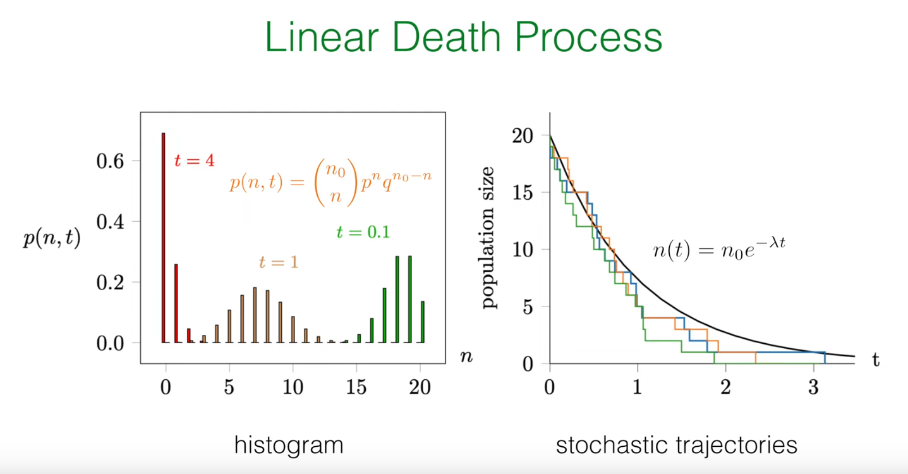
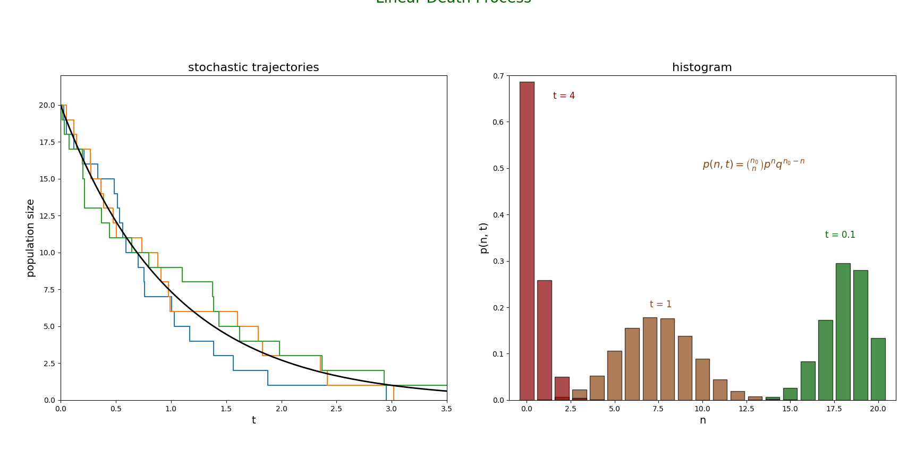
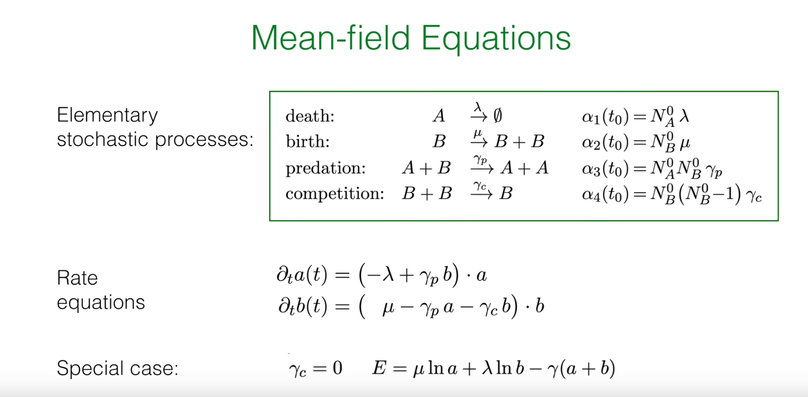
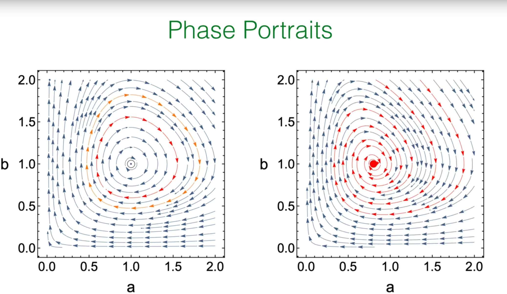
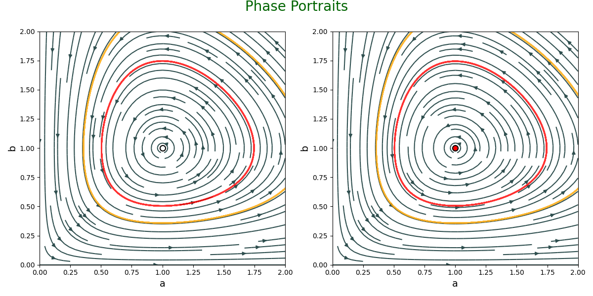
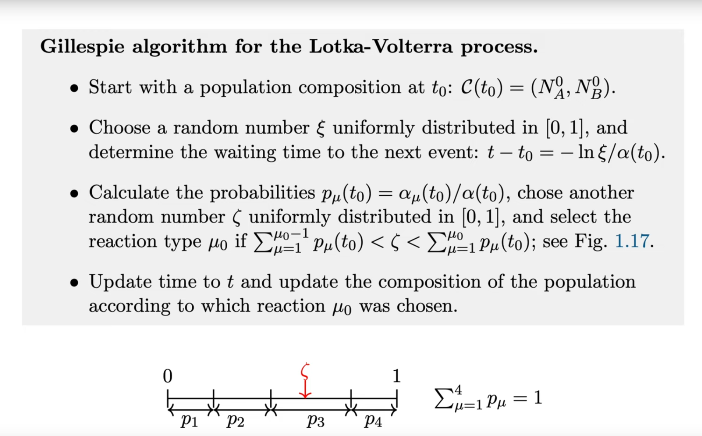
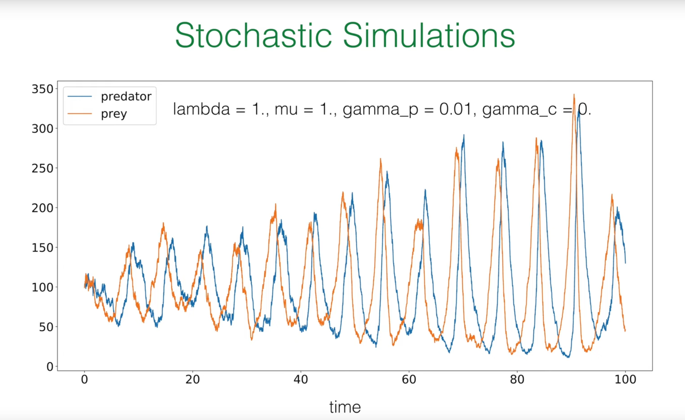
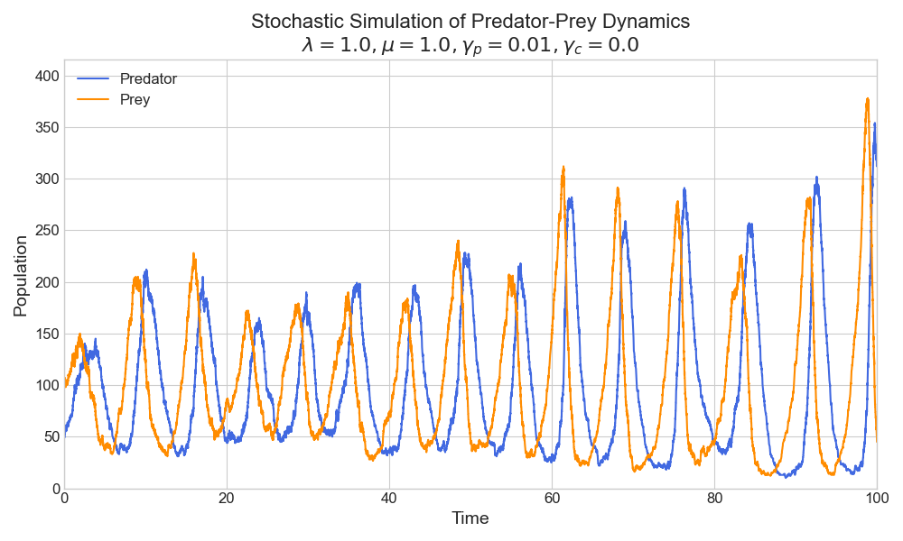
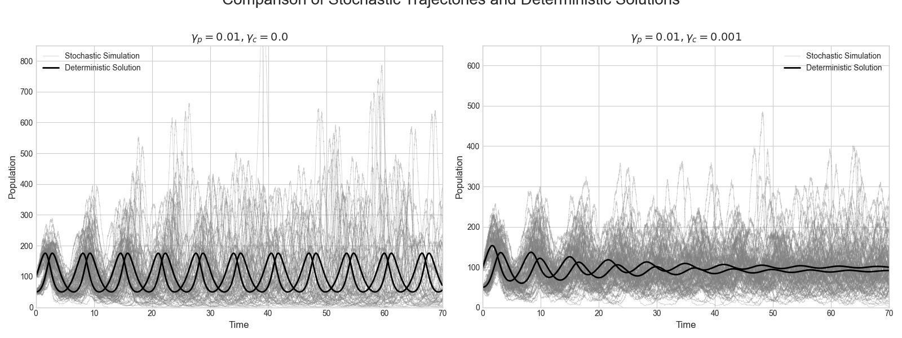
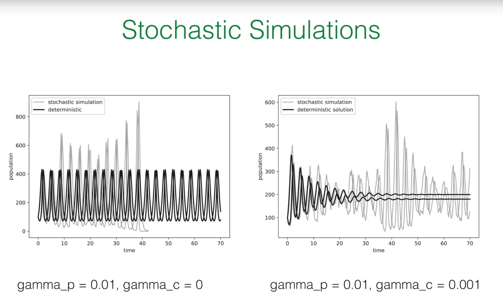

# Introduction: Applying Stochastic Toolkit to Life Dynamics

In the previous lectures, the professor has helped us establish a powerful theoretical framework for describing stochastic processes. This lecture applies these abstract tools to a specific and important field: population dynamics. The goal of this lecture is to use the knowledge we have learned to simulate the birth, death, and interactions of populations composed of discrete individuals.

# 1. Core Concepts Review

Before delving into new models, the professor briefly reviewed several key concepts from our toolkit:

**Master Equation:** This is the core equation describing the time evolution of probability distributions in stochastic systems. Its essential idea is very intuitive: the rate of change of the probability $p(n,t)$ that the system is in a specific state $n$ equals the rate of transitions from other states to state $n$ (the "gain" term) minus the rate of transitions from state $n$ to other states (the "loss" term). Its general form is:

$$\frac{d}{dt}p(n,t) = \text{"gain"} - \text{"loss"}$$

This equation provides us with a complete, probabilistic description of the system.

**Gillespie Algorithm:** Although the master equation is precise, it is usually a set of coupled differential equations that are difficult to solve analytically. The Gillespie algorithm is an ingenious numerical method that is not an approximation to the master equation, but rather its **exact stochastic realization**. This algorithm can generate a series of stochastic trajectories whose statistical properties are completely consistent with those described by the master equation.

**Connection between Theory and Simulation:** There exists a profound connection between theory (master equation) and simulation (Gillespie algorithm). If we run a large number of Gillespie simulations and collect the system states (e.g., population size $n$) of all trajectories at a specific time point $t$, then plot a histogram of these states, this histogram will converge to the true probability distribution $p(n,t)$ predicted by the master equation when the number of simulations is sufficiently large.

## Why Do We Need Stochastic Models?

You might ask, we already have deterministic models describing population growth (such as the logistic equation), so why do we need to introduce such a complex stochastic framework?

The answer lies in the fundamental nature of physical reality. Populations are composed of **discrete** individuals, and individual behaviors—birth, death, predation, mating—are essentially **probabilistic** events. Deterministic models treat population size as a continuous variable, ignoring individuality and randomness, which is a reasonable approximation when population size is very large. However, when population size is small, random fluctuations (i.e., "demographic noise") may dominate system behavior. A random sequence of death events may cause a small population to unexpectedly go extinct, which deterministic models cannot predict.

Therefore, stochastic models are not merely a more complex alternative to deterministic models; they are a more **fundamental and realistic** description of living systems. They enable us to understand and quantify phenomena driven by randomness itself, such as extinction risk, probability of disease outbreaks, and maintenance of biodiversity. In this lecture, the professor will start with the simplest "linear death process" and gradually build a complex ecosystem containing predators and prey, revealing how randomness fundamentally changes our understanding of system behavior.

# 2. Linear Death Process: Foundation of Stochastic Population Models

To establish an intuitive understanding of stochastic population dynamics, we start with the simplest non-trivial model: individuals in a population can only die, not be born. We will analyze this process from three different perspectives: the deterministic mean-field perspective, the stochastic master equation perspective, and the exact analytical solution.

## 2.1 Deterministic Perspective (Mean-Field Theory)

First, we consider the simplest description. Suppose we have a species $A$ whose individuals die at a constant rate $\lambda$. We can represent this process with a chemical reaction-like equation:

$$A \xrightarrow{\lambda} \varnothing$$

Here, $\lambda$ represents the probability of death per individual per unit time, i.e., the per capita death rate.

Under the mean-field approximation, we assume that the population size is very large and mixed very uniformly, so we can ignore the discreteness of individuals and random fluctuations, treating the population size $n(t)$ as a continuous, deterministic variable.

In this case, the rate of decrease of the entire population size equals the per capita death rate $\lambda$ multiplied by the current population size $n(t)$. This gives us a simple first-order ordinary differential equation (ODE):

$$\frac{d}{dt}n(t) = -\lambda n(t)$$

This is a first-order linear differential equation we are very familiar with. Given the initial condition $n(t=0)=n_0$, its solution is the classic exponential decay:

$$n(t) = n_0 e^{-\lambda t}$$

This deterministic solution tells us the average behavioral trend of the population. It will serve as a benchmark for evaluating more complete stochastic models.

## 2.2 Deeper Exploration: Stochastic Description through Master Equation

Now, we abandon the mean-field approximation and treat the population size $N(t)$ as a discrete random variable. Our goal is no longer to solve for a deterministic trajectory $n(t)$, but to find the probability distribution that the population size is exactly $n$ at any time $t$, i.e., $p(n,t) = \text{Prob}(N(t)=n)$. For this, we need to construct the master equation for this process.

We again apply the "gain-loss" principle to construct the equation:

$$\frac{d}{dt}p(n,t) = \text{gain} - \text{loss}$$

* **Loss Term:** How does the system leave state $n$? The only way is for a death event to occur. When the population size is $n$, each individual may die at rate $\lambda$. Since all individual death events are mutually independent (this is the core assumption of the "linear" process), the total rate of death events in the entire population is $n \times \lambda$. Therefore, the system leaves state $n$ at rate $\lambda n$. This term contributes negatively to $p(n,t)$, i.e., $-\lambda n p(n,t)$.

* **Gain Term:** How does the system enter state $n$? The only way is for the system to originally be in state $n+1$, then a death event occurs. When the population size is $n+1$, the total rate of death events in the entire population is $(n+1) \times \lambda$. Therefore, the rate of transition from state $n+1$ to state $n$ is $\lambda(n+1)p(n+1,t)$. This term contributes positively.

Combining the gain and loss terms, we obtain the complete master equation for the linear death process:

$$\frac{d}{dt}p(n,t) = \lambda(n+1)p(n+1,t) - \lambda n p(n,t)$$

This is an infinite-dimensional system of coupled ordinary differential equations (for $n=0,1,2,...,n_0$), and solving it directly is quite difficult. Fortunately, Professor Frey demonstrated a more elegant and physically intuitive method to obtain its exact solution.

## 2.3 Exact Solution: Revealing the Binomial Distribution Nature of Survival

Rather than directly solving the master equation, let us start with a simpler problem and then generalize step by step.

### 2.3.1 Survival of a Single Individual

First, consider the case where there is initially only one individual ($n_0=1$). What is the probability that this individual is still alive at time $t$? This is a classic exponential waiting problem. In any small time interval $dt$, its probability of death is $\lambda dt$. Therefore, the probability $p(t)$ that it is still alive at time $t$ follows:

$$\frac{d}{dt}p(t) = -\lambda p(t)$$

Solving gives $p(t) = e^{-\lambda t}$. Correspondingly, its probability of having died by time $t$ is $q(t) = 1 - p(t) = 1 - e^{-\lambda t}$.

### 2.3.2 Generalization to $n_0$ Individuals

Now, we return to the case where the initial population is $n_0$. A core assumption of the linear death process is that **each individual's death events are mutually independent**. One individual's death does not affect another individual's death probability. This means that at time $t$, the survival situation of the entire population can be viewed as conducting $n_0$ independent "Bernoulli trials".

Each trial corresponds to an initial individual, and the trial result has only two outcomes:

1. "Success": The individual is still alive at time $t$, with probability $p(t) = e^{-\lambda t}$.

2. "Failure": The individual has died by time $t$, with probability $q(t) = 1 - e^{-\lambda t}$.

We are concerned with the probability that exactly $n$ "successes" occur in $n_0$ trials (i.e., $n$ individuals survive). This is exactly the definition of the binomial distribution! Therefore, we can directly write its probability distribution:

$$p(n,t) = \binom{n_0}{n} [p(t)]^n [q(t)]^{n_0-n} = \binom{n_0}{n} (e^{-\lambda t})^n (1 - e^{-\lambda t})^{n_0-n}$$

This result is very profound. It reveals the direct connection between the mathematical form of the model and its physical assumptions:

Linear rate (total rate $\propto n$) $\implies$ Individual independence (no interactions) $\implies$ Bernoulli trials (each individual independently survives or dies) $\implies$ Binomial distribution solution.

This logical chain is key to understanding the physical meaning of stochastic processes.

## 2.4 Distribution Moments: Mean and Variance

Once we know that the probability distribution is a binomial distribution, we can use its known properties to calculate the mean and variance. For a binomial distribution with parameters $(N,p)$, its mean is $Np$ and its variance is $Np(1-p)$.

In our model, $N$ corresponds to the initial population $n_0$, and $p$ corresponds to the survival probability of a single individual $p(t) = e^{-\lambda t}$. Therefore, we can immediately obtain:

**Mean Population Size:**

$$\langle n(t) \rangle = n_0 p(t) = n_0 e^{-\lambda t}$$

**Population Size Variance:**

$$\sigma^2(t) = n_0 p(t) (1 - p(t)) = n_0 e^{-\lambda t} (1 - e^{-\lambda t})$$

Here we discover a crucial conclusion: the **mean value** $\langle n(t) \rangle$ of the stochastic process is exactly the same as the **deterministic mean-field solution** $n(t)$ we derived earlier! This is a universally valid elegant result for all linear processes. It tells us that the deterministic equation indeed correctly captures the average behavior of the system.

However, the variance $\sigma^2(t)$ is a completely new quantity brought purely by randomness. It quantifies the magnitude of "demographic noise"—that is, the degree of fluctuation of actual population trajectories around the mean value due to the randomness of individual death events. This is information that the mean-field method cannot capture at all.

## 2.5 Computational Verification: Simulating the Linear Death Process

We will use the Gillespie algorithm to simulate the linear death process and generate the first figure from the lecture PPT.



The logic of the Gillespie algorithm is as follows:

1.**Initialization**: At time $t=0$, set population size $N(0)=n_0$.

2.**Calculate total rate**: At any moment, when the population size is $N$, the total rate of the next event (any death) occurring is $\alpha = \lambda N$.

3.**Determine waiting time**: The waiting time $\tau$ until the next event occurs follows an exponential distribution with rate $\alpha$. We can generate this time using the inverse transform sampling method: $\tau = -\frac{1}{\alpha} \ln(\xi)$, where $\xi$ is a uniformly distributed random number in the $(0, 1]$ interval.

4.**Execute event**: Since there is only one type of event in the system (death), we directly update the population size: $N \to N-1$.

5.**Update time**: Advance the current time: $t \to t+\tau$.

6.**Repeat**: Return to step 2, continue simulation until population size $N=0$ or the preset total simulation duration is reached.

Below is the Python code that implements this process and reproduces the two figures from the lecture.

```python
import numpy as np
import matplotlib.pyplot as plt
from scipy.special import comb

# --- Simulation parameters ---
n0 = 20      # Initial population size
lambda_rate = 1.0  # Per capita death rate
t_max = 4.0    # Maximum simulation time
num_simulations = 10000 # Total number of simulated trajectories

# --- Gillespie algorithm implementation for linear death process ---
def linear_death_gillespie(n_start, rate, t_end):
    """
    Simulate linear death process using Gillespie algorithm
    """
    t = 0.0
    n = n_start
    
    times = [t]
    populations = [n]
    
    while n > 0 and t < t_end:
        # Total reaction rate
        alpha = rate * n
        
        # Generate waiting time tau
        xi1 = np.random.uniform(0, 1)
        tau = -np.log(xi1) / alpha
        
        # Update time and population
        t += tau
        n -= 1 # Only death events
        
        times.append(t)
        populations.append(n)
        
    return np.array(times), np.array(populations)

# --- Run multiple simulations ---
all_trajectories = []
for _ in range(num_simulations):
    times, populations = linear_death_gillespie(n0, lambda_rate, t_max)
    all_trajectories.append((times, populations))

# --- Plotting ---
plt.style.use('default')
fig, axes = plt.subplots(1, 2, figsize=(12, 5))

# --- Figure 1: Stochastic trajectories and deterministic solution ---
ax = axes[0]
# Plot some example trajectories
for i in range(3):
    times, populations = all_trajectories[i]
    ax.step(times, populations, where='post')

# Plot deterministic solution
t_deterministic = np.linspace(0, t_max, 200)
n_deterministic = n0 * np.exp(-lambda_rate * t_deterministic)
ax.plot(t_deterministic, n_deterministic, color='black', lw=2, label=r'$n(t) = n_0 e^{-\lambda t}$')

ax.set_xlabel('t', fontsize=14)
ax.set_ylabel('population size', fontsize=14)
ax.set_title('stochastic trajectories', fontsize=16)
ax.set_ylim(0, n0 + 2)
ax.set_xlim(0, t_max - 0.5)

# --- Figure 2: Histogram and theoretical solution at different times ---
ax = axes[1]
time_points = [0.1, 1.0, 4.0]
colors = ['darkgreen', 'saddlebrown', 'darkred']
bar_width = 0.8

# Helper function: get population size at a specific time from a trajectory
def get_population_at_time(trajectory, t_point):
    times, populations = trajectory
    # Find the index of the last time point <= t_point
    idx = np.searchsorted(times, t_point, side='right') - 1
    return populations[idx]

for t, color in zip(time_points, colors):
    # Collect population sizes at this time point from all simulations
    populations_at_t = [get_population_at_time(traj, t) for traj in all_trajectories]
    
    # Calculate histogram
    n_values, counts = np.unique(populations_at_t, return_counts=True)
    probabilities = counts / num_simulations
    
    # Plot histogram
    ax.bar(n_values, probabilities, width=bar_width, color=color, alpha=0.7, ec='black', label=f't = {t}')
    
    # Plot theoretical binomial distribution
    p_survival = np.exp(-lambda_rate * t)
    n_range = np.arange(0, n0 + 1)
    p_n_t = comb(n0, n_range) * (p_survival**n_range) * ((1 - p_survival)**(n0 - n_range))
    # For visualization, only plot points with significant probabilities
    # ax.plot(n_range, p_n_t, 'o', color=color, markersize=4)

ax.set_xlabel('n', fontsize=14)
ax.set_ylabel('p(n, t)', fontsize=14)
ax.set_title('histogram', fontsize=16)
ax.set_xlim(-1, n0 + 1)
ax.set_ylim(0, 0.7)

# Add theoretical formula text
ax.text(10, 0.5, r'$p(n,t) = \binom{n_0}{n} p^n q^{n_0-n}$', fontsize=14, color='saddlebrown')
ax.text(1.5, 0.65, 't = 4', fontsize=12, color='darkred')
ax.text(7, 0.2, 't = 1', fontsize=12, color='saddlebrown')
ax.text(17, 0.35, 't = 0.1', fontsize=12, color='darkgreen')

fig.suptitle('Linear Death Process', fontsize=20, color='darkgreen', y=1.02)
plt.tight_layout()
plt.show()
```



**Right figure (histogram):** This figure shows the probability distribution of population size at three different time points ($t=0.1, 1, 4$). The bar chart is the empirical distribution we obtained by running tens of thousands of Gillespie simulations. We can see that as time progresses, the peak of the distribution moves left (average population size decreases), and the distribution becomes wider (relative uncertainty increases). Eventually, at very long times, most simulations end with population extinction ($n=0$). This is completely consistent with the dynamic behavior of the binomial distribution we derived.

**Left figure (stochastic trajectories):** This figure shows three independent simulation trajectories (colored step lines). Each trajectory represents a possible history. The black smooth curve is the deterministic solution $n(t)=n_0e^{-\lambda t}$ we derived, which is the mean value of the stochastic process. This figure intuitively demonstrates the core characteristics of stochastic processes: **individual realizations (trajectories) are random and discrete, but the average behavior of many realizations converges to the deterministic mean-field solution**.

# 3. Lotka-Volterra Process: Simulating Predator-Prey Interactions

After mastering the simplest single-species model, we now challenge a more complex and interesting system: an ecosystem containing two interacting species—predators and prey. This is the famous Lotka-Volterra model. We will see that nonlinear interactions between species produce dynamic behaviors that are far richer and more surprising than linear processes.

The Lotka-Volterra equations are a set of coupled nonlinear differential equations describing the dynamics of predator-prey ecosystems. This model originated from the needs of ecological research in the early 20th century, independently proposed by Alfred Lotka and Vito Volterra to explain the periodic fluctuations of predator and prey population sizes in nature.

The establishment of this system of equations is based on the following biological assumptions:

1. Predator population decreases due to natural death at rate $-\lambda a$
2. Predators reproduce by preying on prey at rate $+\gamma_p ab$
3. Prey population grows due to self-reproduction at rate $+\mu b$
4. Prey decreases due to predation at rate $-\gamma_p ab$
5. Prey die due to resource competition among themselves at rate $-\gamma_c b^2$

These assumptions ultimately form the following coupled system of equations:
$$
\frac{d}{dt}a(t) = (-\lambda + \gamma_p b) \cdot a
$$

$$
\frac{d}{dt}b(t) = (\mu - \gamma_p a - \gamma_c b) \cdot b
$$
where $a(t)$ and $b(t)$ represent the population densities of predators and prey, respectively.

In practical applications, the Lotka-Volterra equations are widely used for:

1. **Ecosystem modeling**: Analyzing predator-prey relationships, such as wolf-deer, cat-mouse ecosystem behaviors
2. **Fishery resource management**: Guiding the formulation of sustainable fishing strategies
3. **Biological pest control**: Designing schemes to control agricultural pests using natural enemies
4. **Epidemiological research**: Simulating virus-host interactions in disease transmission
5. **Economic modeling**: Describing dynamic relationships between different enterprises in business competition

Although this model simplifies the complexity of real ecosystems, the nonlinear interaction principles it reveals are of great significance for understanding complex system behavior. Especially when randomness is introduced, this model can better reflect the fluctuation characteristics of population sizes in real ecosystems, providing theoretical foundations for ecological risk assessment and biodiversity conservation.

## 3.1 Building the Ecosystem: Basic Stochastic Processes

We define two species in the system:

* **A**: Predator
* **B**: Prey

The dynamics of this ecosystem are determined by four basic (or elementary) stochastic processes:

1. **Predator Death:** Predators die due to natural causes. This is a linear death process, similar to what we analyzed before.
   $$\varnothing \xleftarrow{\lambda} A$$

2. **Prey Birth:** Prey reproduce themselves. Assuming sufficient resources, this is also a linear birth process.
   $$B \xrightarrow{\mu} B + B$$

3. **Predation:** This is the core interaction of the model. When a predator A encounters a prey B, it eats the prey and reproduces a new predator in the process.

   
   $$
   A + B \xrightarrow{\gamma_p} A + A
   $$
   

4. **Prey Competition:** When prey numbers are too high, they compete for limited resources (such as food, space), causing one individual to die.
   $$
   B + B \xrightarrow{\gamma_c} B
   $$
   

## 3.2 Quantifying Changes: Reaction Propensities

To simulate this system using the Gillespie algorithm or derive its mean-field equations, we need to convert the above symbolic reactions into mathematical rate expressions, i.e., propensity functions $\alpha_\mu$. The propensity $\alpha_\mu$ represents the probability of reaction $\mu$ occurring per unit time.

Suppose the current state of the system is $(N_A, N_B)$, where $N_A$ is the number of predators and $N_B$ is the number of prey.

$\alpha_1 = \lambda N_A$: Total rate of predator death. Like the linear death process, it is proportional to the number of predators $N_A$.

$\alpha_2 = \mu N_B$: Total rate of prey birth, proportional to prey number $N_B$.

$\alpha_3 = \gamma_p N_A N_B$: Total rate of predation events. This quadratic term is the key to the model. It originates from the assumption of the "law of mass action": in a well-mixed system, the frequency of encounters between two different types of individuals is proportional to the product of their respective numbers.

$\alpha_4 = \gamma_c N_B(N_B - 1)$: Total rate of prey competition. Competition requires two prey individuals to participate. Among $N_B$ prey, the number of different individual pairs that can be formed is $\binom{N_B}{2} = \frac{1}{2}N_B(N_B - 1)$. Therefore, the total rate is proportional to this. In Professor Frey's lecture notes, the rate constant is defined as $\gamma_c$, absorbing the factor $1/2$, so the propensity is written as $\gamma_c N_B(N_B - 1)$. When $N_B$ is large, this approximates $\gamma_c N_B^2$.

To clearly organize this information, we can create a table that will serve as a blueprint for our understanding and programming:

| Process Name | Chemical Reaction | Rate Constant | Propensity Function $\alpha_\mu(N_A, N_B)$ | State Change $(\Delta N_A, \Delta N_B)$ |
| --- | --- | --- | --- | --- |
| Predator Death | $A \xrightarrow{\lambda} \emptyset$ | $\lambda$ | $\lambda N_A$ | $(-1, 0)$ |
| Prey Birth | $B \xrightarrow{\mu} B + B$ | $\mu$ | $\mu N_B$ | $(0, +1)$ |
| Predation | $A + B \xrightarrow{\gamma_p} A + A$ | $\gamma_p$ | $\gamma_p N_A N_B$ | $(+1, -1)$ |
| Prey Competition | $B + B \xrightarrow{\gamma_c} B$ | $\gamma_c$ | $\gamma_c N_B (N_B - 1)$ | $(0, -1)$ |

This table completely defines our stochastic model. Each row tells us the "occurrence rate" (propensity) of an event and "what happens after occurrence" (state change).

## 3.3 Mean-Field Approximation: Coupled Rate Equations



Similar to the linear death process, we can derive deterministic equations describing the average behavior of the system by ignoring random fluctuations. We use continuous variables $a(t)$ and $b(t)$ to represent the population densities of predators and prey, respectively.

**Change in predator density $a(t)$:**

  * Decreases due to natural death at rate $-\lambda a$.

  * Increases due to preying on prey at rate $+\gamma_p ab$.

  * Combined: $\frac{d}{dt}a(t) = (-\lambda + \gamma_p b) \cdot a$

**Change in prey density $b(t)$:**

  * Increases due to self-reproduction at rate $+\mu b$.

  * Decreases due to predation at rate $-\gamma_p ab$.

  * Decreases due to internal competition at rate $-\gamma_c b^2$ (here we use $b^2$ as a continuous approximation of $b(b-1)$).

  * Combined: $\frac{d}{dt}b(t) = (\mu - \gamma_p a - \gamma_c b) \cdot b$

These two coupled nonlinear ordinary differential equations are the deterministic Lotka-Volterra equations.

## 3.4 Dynamics in Phase Space: Fixed Points and Phase Portraits

The long-term behavior of the deterministic equations can be understood by analyzing their flow field in the $(a,b)$ phase space. We are concerned with fixed points, i.e., points where population densities no longer change ($\partial_t a=0$ and $\partial_t b=0$).



**Special case ($\gamma_c=0$):** This is the most classic Lotka-Volterra model, without prey competition.

There are two fixed points: one is the extinction point $(0,0)$, and the other is the coexistence fixed point $(a^*,b^*)=(\mu/\gamma_p,\lambda/\gamma_p)$.

Analysis shows that this coexistence fixed point is a neutrally stable center. The system's trajectories are a series of closed orbits (periodic oscillations) around this center. The specific orbit the system is on is determined by the initial conditions.

This system is conservative, with a conserved quantity $E = \mu \ln a + \lambda \ln b - \gamma_p(a+b)$. Each orbit corresponds to a constant $E$ value.

**General case ($\gamma_c>0$):** After introducing prey competition, the situation changes qualitatively.

The position of the coexistence fixed point becomes $(a^*,b^*)$, where $b^* = (\mu-\gamma_p a^*)/\gamma_c$.

The competition term $\gamma_c b^2$ acts as "damping". The fixed point is no longer a neutral center, but a stable spiral point. Regardless of the initial conditions (as long as the population doesn't go extinct), the system's trajectories will oscillate and spiral toward this unique coexistence fixed point.

We can visualize these dynamic behaviors by plotting phase portraits.

```python
# --- Import necessary libraries ---
import numpy as np
import matplotlib.pyplot as plt
from scipy.integrate import odeint

# --- Define Lotka-Volterra ODE system ---
def lotka_volterra_ode(y, t, lambda_rate, mu_rate, gamma_p, gamma_c):
    a, b = y
    da_dt = mu_rate * a - gamma_p * a * b
    db_dt = -lambda_rate * b + gamma_p * a * b - gamma_c * b
    return [da_dt, db_dt]

# --- Set parameters ---
lambda_rate = 1.0
mu_rate = 1.0
gamma_p = 1.0
gamma_c = 0.0

# --- Plot phase diagrams ---
fig, axes = plt.subplots(1, 2, figsize=(12, 6))

# --- Case 1: gamma_c = 0 (neutral center) ---
gamma_c = 0.0
ax = axes[0]
a_max, b_max = 2.0, 2.0
a_grid, b_grid = np.meshgrid(np.linspace(0, a_max, 20), np.linspace(0, b_max, 20))

u, v = np.zeros_like(a_grid), np.zeros_like(b_grid)
NI, NJ = a_grid.shape
for i in range(NI):
    for j in range(NJ):
        y = [a_grid[i, j], b_grid[i, j]]
        dydt = lotka_volterra_ode(y, 0, lambda_rate, mu_rate, gamma_p, gamma_c)
        u[i, j], v[i, j] = dydt[0], dydt[1]

# Plot flow field
ax.streamplot(a_grid, b_grid, u, v, density=1.2, color='darkslategrey')

# Plot fixed point
a_star = mu_rate / gamma_p
b_star = lambda_rate / gamma_p
ax.plot(a_star, b_star, 'o', markersize=8, markerfacecolor='white', markeredgecolor='black', markeredgewidth=1.5)

# Plot sample trajectories
initial_conditions = [[a_star*1.5, b_star*1.5], [a_star*0.5, b_star*0.5]]
t_span = np.linspace(0, 50, 500)
colors = ['red', 'orange']
for i, y0 in enumerate(initial_conditions):
    sol = odeint(lotka_volterra_ode, y0, t_span, args=(lambda_rate, mu_rate, gamma_p, gamma_c))
    ax.plot(sol[:, 0], sol[:, 1], color=colors[i], lw=2, alpha=0.8)

ax.set_xlabel('a', fontsize=14)
ax.set_ylabel('b', fontsize=14)
ax.set_xlim(0, a_max)
ax.set_ylim(0, b_max)

# --- Case 2: gamma_c > 0 (stable spiral point) ---
gamma_c = 0.001
ax = axes[1]
a_max, b_max = 2.0, 2.0
a_grid, b_grid = np.meshgrid(np.linspace(0, a_max, 20), np.linspace(0, b_max, 20))

u, v = np.zeros_like(a_grid), np.zeros_like(b_grid)
NI, NJ = a_grid.shape
for i in range(NI):
    for j in range(NJ):
        y = [a_grid[i, j], b_grid[i, j]]
        dydt = lotka_volterra_ode(y, 0, lambda_rate, mu_rate, gamma_p, gamma_c)
        u[i, j], v[i, j] = dydt[0], dydt[1]

ax.streamplot(a_grid, b_grid, u, v, density=1.2, color='darkslategrey')

# Plot fixed point
b_star_damped = lambda_rate / gamma_p
a_star_damped = (mu_rate - gamma_c * b_star_damped) / gamma_p
ax.plot(a_star_damped, b_star_damped, 'o', markersize=8, markerfacecolor='red', markeredgecolor='black', markeredgewidth=1.5)

# Plot sample trajectories
initial_conditions = [[a_star_damped*1.5, b_star_damped*1.5], [a_star_damped*0.5, b_star_damped*0.5]]
t_span = np.linspace(0, 50, 500)
colors = ['red', 'orange']
for i, y0 in enumerate(initial_conditions):
    sol = odeint(lotka_volterra_ode, y0, t_span, args=(lambda_rate, mu_rate, gamma_p, gamma_c))
    ax.plot(sol[:, 0], sol[:, 1], color=colors[i], lw=2, alpha=0.8)

ax.set_xlabel('a', fontsize=14)
ax.set_ylabel('b', fontsize=14)
ax.set_xlim(0, a_max)
ax.set_ylim(0, b_max)

fig.suptitle('Phase Portraits', fontsize=20, color='darkgreen', y=1.0)
plt.tight_layout()
plt.show()
```



**Left figure ($\gamma_c=0$)**: This figure clearly shows a neutrally stable center. The streamlines form closed loops around the central fixed point (white circle). The two trajectories we plotted (orange and red-orange) also run along these closed orbits, never approaching or moving away from the center. This represents the continuous periodic oscillations of predator and prey numbers.

**Right figure ($\gamma_c>0$)**: This figure shows a stable spiral point. The streamlines now all point toward the central fixed point inside (red circle). A trajectory we plotted (red) also shows the population numbers oscillating and decaying, eventually tending toward a stable coexistence state.

# 4. Complete Stochastic Simulation: Gillespie Algorithm

The deterministic model provides us with a blueprint for the average behavior of the system, but the real story lies hidden in randomness. Now, we will use the Gillespie algorithm to simulate the complete stochastic Lotka-Volterra process.





The Gillespie algorithm steps for multiple reaction channels are as follows:

1.**Initialization**: At $t=0$, set state $(N_A,N_B)$.

2.**Calculate all propensities**: Based on the current state $(N_A,N_B)$, calculate all four reaction propensities $\alpha_1,\alpha_2,\alpha_3,\alpha_4$.

3.**Calculate total rate**: Add all propensities to get the total rate $\alpha_{\text{tot}} = \sum_{\mu=1}^{4} \alpha_\mu$.

4.**Determine waiting time**: Generate the waiting time $\tau = -\frac{1}{\alpha_{\text{tot}}} \ln(\xi_1)$ until the next event, where $\xi_1$ is a uniform random number on $(0, 1]$.

5.**Select the event to occur**: This is the key step. We need to decide which specific event occurs based on each reaction's relative probability $\alpha_\mu/\alpha_{\text{tot}}$. This can be achieved using the "roulette wheel" selection method: generate a second uniform random number $\xi_2 \in [0,1]$, then select the reaction $\mu$ that satisfies $\sum_{\nu=1}^{\mu-1} \alpha_\nu < \xi_2 \alpha_{\text{tot}} \leq \sum_{\nu=1}^{\mu} \alpha_\nu$.

6.**Execute event**: According to the selected reaction type, update the system state according to the state change table.

7.**Update time**: Advance the current time: $t \to t+\tau$.

8.**Repeat**: Return to step 2, continue simulation until the preset total simulation duration is reached.

Below is the Python code that implements this algorithm:

```python
import numpy as np
import matplotlib.pyplot as plt
from scipy.integrate import odeint

# --- Parameter Setup ---
lambda_rate = 1.0  # Predator death rate
mu_rate = 1.0      # Prey birth rate
gamma_p = 0.01     # Predation rate

# --- Deterministic ODE Definition ---
def lotka_volterra_ode(y, t, lambda_r, mu_r, gamma_p_r, gamma_c_r):
    """
    Defines the system of ordinary differential equations for the Lotka-Volterra model.
    """
    a, b = y
    dadt = (-lambda_r + gamma_p_r * b) * a
    dbdt = (mu_r - gamma_p_r * a - gamma_c_r * b) * b
    return [dadt, dbdt]

# --- Gillespie Algorithm for Lotka-Volterra Process ---
def lotka_volterra_gillespie(n_a, n_b, rates, t_end):
    """
    Simulates the Lotka-Volterra process using the Gillespie algorithm.
    
    Args:
        n_a (int): Initial number of predators.
        n_b (int): Initial number of prey.
        rates (tuple): A tuple of rate constants (lambda_r, mu_r, gamma_p_r, gamma_c_r).
        t_end (float): The end time for the simulation.
        
    Returns:
        A tuple containing arrays for times, predator populations, and prey populations.
    """
    lambda_r, mu_r, gamma_p_r, gamma_c_r = rates
    
    t = 0.0
    # Ensure populations are floats to avoid potential integer division issues
    n_a = float(n_a)
    n_b = float(n_b)
    
    times = [t]
    populations_a = [n_a]
    populations_b = [n_b]
    
    # Stoichiometry matrix: rows are reactions, columns are species (A, B)
    nu = np.array([
        [-1,  0],  # Reaction 1: A -> 0 (Predator death)
        [ 0, +1],  # Reaction 2: B -> 2B (Prey birth)
        [+1, -1],  # Reaction 3: A+B -> 2A (Predation)
        [ 0, -1]   # Reaction 4: 2B -> B (Prey competition)
    ])
    
    while t < t_end:
        if n_a == 0 or n_b == 0:
            break  # Stop if one species goes extinct
            
        # Calculate propensities for each reaction
        propensities = np.array([
            lambda_r * n_a,
            mu_r * n_b,
            gamma_p_r * n_a * n_b,
            gamma_c_r * n_b * (n_b - 1)
        ])
        
        a_total = np.sum(propensities)
        
        if a_total == 0:
            break # No more reactions can occur
            
        # Generate waiting time (tau) until the next reaction
        xi1 = np.random.uniform(0, 1)
        tau = -np.log(xi1) / a_total
        
        # Choose which reaction occurs
        xi2 = np.random.uniform(0, 1)
        p_normalized = propensities / a_total
        reaction_idx = np.random.choice(len(propensities), p=p_normalized)
        
        # Update time and populations
        t += tau
        n_a += nu[reaction_idx, 0]
        n_b += nu[reaction_idx, 1]
        
        times.append(t)
        populations_a.append(n_a)
        populations_b.append(n_b)
        
    return np.array(times), np.array(populations_a), np.array(populations_b)

# --- Initial Conditions ---
# The deterministic fixed point is (100, 100) for gamma_c=0.
# We start away from the fixed point to observe oscillations.
n_a0 = 50
n_b0 = 100

# --- Plot 1: Stochastic Oscillations Time Series (Reproducing PPT_1.jpg) ---
plt.style.use('seaborn-v0_8-whitegrid')
fig1, ax1 = plt.subplots(figsize=(10, 6))

gamma_c_1 = 0.0
rates_1 = (lambda_rate, mu_rate, gamma_p, gamma_c_1)
# For a better single trajectory view, let's start this one away from the fixed point too
t_sim_1, n_a_sim_1, n_b_sim_1 = lotka_volterra_gillespie(50, 100, rates_1, 100)

ax1.plot(t_sim_1, n_a_sim_1, label='Predator', lw=1.5, color='royalblue')
ax1.plot(t_sim_1, n_b_sim_1, label='Prey', lw=1.5, color='darkorange')
ax1.set_xlabel('Time', fontsize=14)
ax1.set_ylabel('Population', fontsize=14)
ax1.set_title(f'Stochastic Simulation of Predator-Prey Dynamics\n'
              f'$\lambda={lambda_rate}, \mu={mu_rate}, \gamma_p={gamma_p}, \gamma_c={gamma_c_1}$', 
              fontsize=16)
ax1.legend(fontsize=12)
ax1.tick_params(axis='both', which='major', labelsize=12)
ax1.set_xlim(0, 100)
ax1.set_ylim(0, max(np.max(n_a_sim_1), np.max(n_b_sim_1)) * 1.1 if len(n_a_sim_1) > 0 else 100)
plt.tight_layout()
plt.show()

# --- Plot 2: Stochastic vs. Deterministic (Reproducing PPT2.jpg) ---
fig2, axes = plt.subplots(1, 2, figsize=(16, 6))

# --- Left Subplot: gamma_c = 0 ---
ax2_left = axes[0]
gamma_c_left = 0.0
rates_left = (lambda_rate, mu_rate, gamma_p, gamma_c_left)
num_simulations = 50  # Number of stochastic trajectories to plot

# Run and plot multiple stochastic simulations
for i in range(num_simulations):
    t_sim, n_a_sim, n_b_sim = lotka_volterra_gillespie(n_a0, n_b0, rates_left, 70)
    # Use a low alpha to create a "cloud" effect
    ax2_left.plot(t_sim, n_a_sim, color='gray', lw=0.5, alpha=0.4, 
                  label='Stochastic Simulation' if i == 0 else "")
    ax2_left.plot(t_sim, n_b_sim, color='gray', lw=0.5, alpha=0.4)


# Deterministic solution
t_ode = np.linspace(0, 70, 1000)
y0 = [n_a0, n_b0]
sol_left = odeint(lotka_volterra_ode, y0, t_ode, args=rates_left)
# Plot deterministic solution with a thick black line for contrast
ax2_left.plot(t_ode, sol_left[:, 0], color='black', lw=2.0, label='Deterministic Solution')
ax2_left.plot(t_ode, sol_left[:, 1], color='black', lw=2.0)


ax2_left.set_xlabel('Time', fontsize=12)
ax2_left.set_ylabel('Population', fontsize=12)
ax2_left.set_title(f'$\gamma_p = {gamma_p}, \gamma_c = {gamma_c_left}$', fontsize=14)
ax2_left.legend()
ax2_left.set_xlim(0, 70)
ax2_left.set_ylim(0, 850)


# --- Right Subplot: gamma_c > 0 ---
ax2_right = axes[1]
gamma_c_right = 0.001
rates_right = (lambda_rate, mu_rate, gamma_p, gamma_c_right)

# Run and plot multiple stochastic simulations
for i in range(num_simulations):
    t_sim, n_a_sim, n_b_sim = lotka_volterra_gillespie(n_a0, n_b0, rates_right, 70)
    ax2_right.plot(t_sim, n_a_sim, color='gray', lw=0.5, alpha=0.4,
                   label='Stochastic Simulation' if i == 0 else "")
    ax2_right.plot(t_sim, n_b_sim, color='gray', lw=0.5, alpha=0.4)


# Deterministic solution
sol_right = odeint(lotka_volterra_ode, y0, t_ode, args=rates_right)
ax2_right.plot(t_ode, sol_right[:, 0], color='black', lw=2.0, label='Deterministic Solution')
ax2_right.plot(t_ode, sol_right[:, 1], color='black', lw=2.0)

ax2_right.set_xlabel('Time', fontsize=12)
ax2_right.set_ylabel('Population', fontsize=12)
ax2_right.set_title(f'$\gamma_p = {gamma_p}, \gamma_c = {gamma_c_right}$', fontsize=14)
ax2_right.legend()
ax2_right.set_xlim(0, 70)
ax2_right.set_ylim(0, 650)


fig2.suptitle('Comparison of Stochastic Trajectories and Deterministic Solutions', fontsize=20, y=1.02)
plt.tight_layout()
plt.show()
```



**First figure (stochastic oscillation time series):** This figure shows a typical stochastic simulation result in the case without prey competition ($\gamma_c=0$). We can see clear predator-prey oscillations: prey (orange line) numbers first increase, then predator (blue line) numbers increase due to abundant food; increased predators cause prey numbers to decline, then predators decline due to food shortage, completing a cycle. However, unlike the perfect periodicity of the deterministic model, the oscillations here have **randomly varying amplitudes and periods**.



**Second figure (stochastic vs. deterministic comparison):** This figure is the most core and thought-provoking result of this lecture.



**Left subplot ($\gamma_c=0$)**: The deterministic solution (thick black line) is a perfect, stable periodic orbit. However, the behavior of stochastic simulations (thin gray lines) is completely different. The oscillation amplitudes of stochastic trajectories **tend to continuously increase**, showing increasingly higher peaks and increasingly lower valleys. Why is this? The deterministic system is conservative, "trapped" on an orbit determined by initial conditions. Random events (birth, death) are like random "kicks" to the system, allowing it to randomly walk between different orbits. Since there is no force pulling it back to a specific orbit, this random walk causes oscillation amplitudes to spread, greatly increasing the risk of a species' numbers reaching zero (i.e., extinction). Here, **intrinsic noise plays a destabilizing role**.

**Right subplot ($\gamma_c > 0$)**: After introducing prey competition, the deterministic solution (thick black line) shows damped oscillations, eventually stabilizing at a fixed point. The ecosystem reaches a static equilibrium. However, stochastic simulations (thin gray lines) tell a different story again. Trajectories are indeed attracted to the vicinity of the fixed point, but they **do not stop**. Instead, they continue to undergo random fluctuations around the fixed point. Here, deterministic dynamics act like a "restoring force", always trying to pull the system back to the equilibrium point; while random events act like a continuous "driving force", constantly kicking the system away from the equilibrium point. The dynamic balance achieved between these two maintains **sustained, noisy oscillations**. In this case, **intrinsic noise plays a role in maintaining dynamics and preventing the system from "dying"**.

# Summary

Through this lecture, we completed a journey from simple to complex, from exponential decay of a single species to complex interactions of a complete ecosystem. More importantly, we deeply explored two different philosophies for describing these systems: deterministic mean-field theory and complete stochastic theory.

We summarize the following key lessons:

1.**Deterministic models capture average behavior**: For linear processes, or for nonlinear processes with very large population sizes, deterministic (mean-field) equations can well describe the average dynamics of the system. For example, the mean value of the linear death process is completely consistent with the deterministic solution.

2.**Randomness reveals the essence of fluctuations**: Stochastic models not only give average behavior but also precisely quantify fluctuations around the mean (variance or the entire probability distribution). This "demographic noise" is invisible in the deterministic world, but in real biological systems, they are inevitable, core components.

3.**The role of noise is subtle and system-dependent**: By comparing Lotka-Volterra models with and without competition, we see one of the most profound conclusions: noise is not always an "annoying" random perturbation. Its role is closely related to the deterministic dynamic structure of the system itself.

* In conservative systems with neutrally stable orbits (such as $\gamma_c=0$), noise is **destructive**, amplifying oscillations and driving the system toward extinction.
    
    
* In dissipative systems with stable attractors (such as $\gamma_c>0$), noise is **creative**, counterbalancing deterministic attraction, maintaining sustained dynamic fluctuations of the system, and preventing it from falling into dead equilibrium.

Finally, this lecture tells us that to truly understand phenomena such as ecosystems, cellular networks, or epidemic transmission, we must embrace randomness. Random fluctuations are not details to be averaged away, but key factors driving systems to produce rich, complex, and even counterintuitive behaviors. The "master equation-Gillespie algorithm" framework we established provides powerful and precise tools for exploring this stochastic world.

