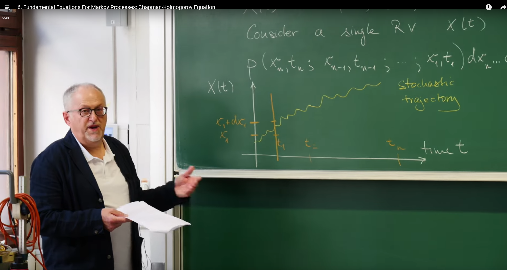
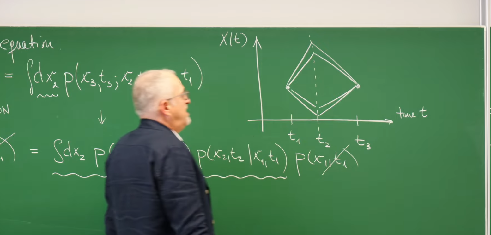
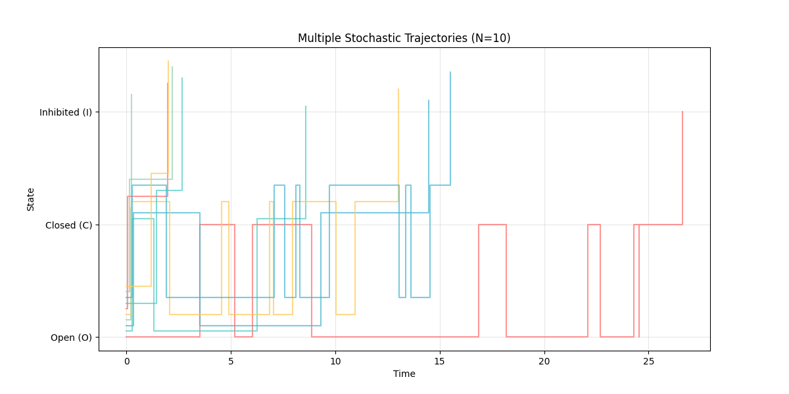
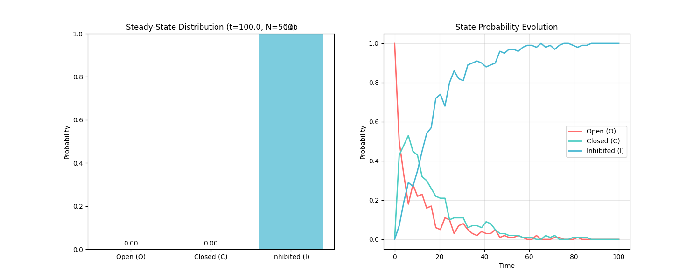
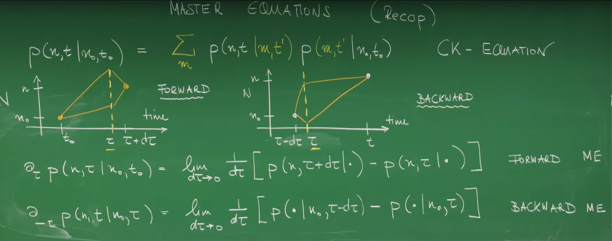

# Introduction

In previous lectures, we explored several concrete examples of stochastic processes. From the “simple random walk” of a particle on a one‑dimensional lattice in Lecture 1 to the “population dynamics” of birth–death processes in Lecture 4, we saw the central role of randomness in physical and biological systems. While these examples are specific, they raise a deeper question: Is there a universal mathematical framework, a common language, for evolution processes that “do not care about the past, only the present”?

The goal of this lecture is to establish and understand that common language. Erwin Frey will derive and explain two fundamental equations that govern all Markov processes. The first is the Chapman–Kolmogorov (CK) equation, which acts as a bridge in the macroscopic description, connecting probability distributions at different times. Then we move from the macroscopic to the microscopic and derive the Master Equation, which introduces instantaneous “rates” as a powerful tool to describe how state probabilities evolve continuously in time. Together, these two equations form the cornerstone of stochastic‑process theory.

# 1. Probabilistic Description of a Stochastic Process

## 1.1 Defining a Stochastic Process

To build a general theory, we start with a precise definition. A stochastic process can be viewed as a collection of random variables indexed by time t. In the most general case, it can be a multidimensional vector:

$$
X(t) = (X_1(t), X_2(t), \ldots)
$$

Each component $X_i(t)$ is itself a random variable. Its values may be real numbers ($X_i \in \mathbb{R}$), for example the position of a Brownian particle; or integers ($X_i \in \mathbb{Z}$), for example the number of individuals in a population.

To focus on core ideas, we follow the lecture and consider a single‑component random variable $X(t)$ for now.

## 1.2 Joint Probability Density: The Complete Description

How do we completely describe a stochastic process? The answer is: we need the joint probability that, at any sequence of times $t_1, t_2, \ldots, t_n$, the random variable $X(t)$ takes values $x_1, x_2, \ldots, x_n$. This is given by the joint probability density $P(x_n, t_n; x_{n-1}, t_{n-1}; \ldots; x_1, t_1)$ defined by

$$
P(x_n, t_n; \ldots; x_1, t_1)\, dx_n \cdots dx_1 = \mathrm{Prob}\{x_n \le X(t_n) \le x_n + dx_n; \ldots; x_1 \le X(t_1) \le x_1 + dx_1\}.
$$

This expression means the joint probability that the system is observed near $x_1$ at time $t_1$ and near $x_2$ at time $t_2$, …, and near $x_n$ at time $t_n$.

The joint probability density is the most fundamental and complete description of a stochastic process because it encodes all temporal correlations. It contains all possible correlation information between the system at different time points. However, this "completeness" brings huge complexity. Imagine that to determine this function for a real system, we need to measure or compute the probabilities of all possible history paths. As the number of time points $n$ grows or the state space dimension increases, the complexity explodes, making it practically unusable. This exposes a core challenge in theoretical modeling: we must introduce reasonable physical simplification assumptions to extract a useful, solvable mathematical model from this intractable complexity. The Markov property is precisely such a powerful simplification that we will introduce.

## 1.3 Stochastic Trajectory and Conditional Probability

To build intuition, we can introduce the concept of a "stochastic trajectory." Each concrete realization of the stochastic process $X(t)$ over time forms one specific path, i.e., one concrete history of the system's evolution. It depicts one specific evolution history of the system state over time, as shown in the figure below:



To analyze the dependence relationships between different time points—i.e., how the past influences the future—we need to use the mathematical tool of conditional probability. According to its definition, given a series of past events (states $x_1, \ldots, x_n$ at times $t_1, \ldots, t_n$), the probability of a series of future events (states $x_{n+1}, \ldots, x_{n+m}$ at times $t_{n+1}, \ldots, t_{n+m}$) is

$$
P(x_{n+m}, t_{n+m}; \ldots; x_{n+1}, t_{n+1} \mid x_n, t_n; \ldots; x_1, t_1) = \frac{P(x_{n+m}, t_{n+m}; \ldots; x_{n+1}, t_{n+1}; x_n, t_n; \ldots; x_1, t_1)}{P(x_n, t_n; \ldots; x_1, t_1)}.
$$

This will be our starting point for the Markov property.

# 2. Core Assumption: The Markov Property

## 2.1 Defining a “Memoryless” Process

The Markov property restricts the “memory” of a stochastic process and underpins everything that follows. Its core idea is memorylessness: the future depends only on the present, not on the entire past history that led to the present.

In terms of conditional probabilities,

$$
P(x_n, t_n \mid x_{n-1}, t_{n-1}; \ldots; x_1, t_1) = P(x_n, t_n \mid x_{n-1}, t_{n-1}).
$$

This equation means that to predict the probability of the system being at state $x_n$ at time $t_n$, we only need to know its state $x_{n-1}$ at the immediately preceding time $t_{n-1}$. All earlier historical information ($x_{n-2}, \ldots, x_1$) is redundant for predicting the future. The current state $x_{n-1}$ already contains all the information needed to predict the future.

Behind this seemingly simple mathematical assumption lies a profound physical insight. A physical system can be approximated as a Markov process usually because there exists a **separation of time scales**. For example, consider a large particle moving in a fluid (Brownian motion). Its position $X(t)$ is the random variable we are concerned with. Strictly speaking, its motion has memory because its velocity is maintained over short periods. A complete description would need to consider the state $(X(t), V(t))$. However, collisions with numerous tiny fluid molecules cause the velocity correlation time (memory time) to be very short. If we observe the particle position on a time scale much longer than this velocity correlation time, then on our observation scale, the particle's next displacement depends almost only on its current position, not on its previous velocity history. Therefore, the Markov property is not an absolute physical law but an extremely effective approximation that applies when all unobserved, memory-carrying "fast variables" can quickly reach equilibrium on their relaxation time scale, thereby not affecting the evolution of the "slow variables" we care about.

## 2.2 Simplifying the Joint Probability

The power of the Markov property is that it greatly simplifies the extremely complex joint probability density we mentioned earlier. Using the chain rule of conditional probabilities, we can decompose the joint probability:

$$
P(x_n, t_n; \ldots; x_1, t_1) = P(x_n, t_n \mid x_{n-1}, t_{n-1}; \ldots; x_1, t_1) \cdot P(x_{n-1}, t_{n-1}; \ldots; x_1, t_1)
$$

Applying the Markov property, the conditional probability in the above equation is greatly simplified. Repeating this process, we can decompose the entire joint probability into a product of a series of two-point transition probabilities:

$$
P(x_n, t_n; \ldots; x_1, t_1) = P(x_n, t_n \mid x_{n-1}, t_{n-1}) P(x_{n-1}, t_{n-1} \mid x_{n-2}, t_{n-2}) \cdots P(x_2, t_2 \mid x_1, t_1) P(x_1, t_1)
$$

This result is extraordinary. It tells us that the complete statistical properties of a complex Markov process are entirely determined by two elements:

1. **Initial condition**: the probability distribution $P(x_1, t_1)$ of the system at the starting time $t_1$.

2. **Transition rule**: the conditional probabilities $P(x_j, t_j \mid x_{j-1}, t_{j-1})$ that describe how the system transitions from one state to the next.

We no longer need to deal with that intractable joint probability function that contains all historical information. The entire system's evolution can now be viewed as a step-by-step "propagation" of the initial probability distribution through transition probabilities.

# 3. Chapman–Kolmogorov Equation: A Bridge Across Times

Armed with the Markov property, we now derive the first fundamental equation: the Chapman–Kolmogorov (CK) equation.

## 3.1 Derivation: The Power of Marginalization

The derivation of the CK equation is based on a fundamental law in probability theory—the law of total probability, also known as marginalization. Consider three time points $t_1 < t_2 < t_3$. We want to find the probability $P(x_3, t_3 \mid x_1, t_1)$ of the system transitioning from state $(x_1, t_1)$ to state $(x_3, t_3)$.

To go from $t_1$ to $t_3$, the system must pass through some intermediate state $x_2$ at time $t_2$. Since $x_2$ can be any possible state, we need to sum (or integrate) over all possible intermediate states, which is precisely the idea of marginalization:

$$
P(x_3, t_3 \mid x_1, t_1) = \int dx_2 P(x_3, t_3; x_2, t_2 \mid x_1, t_1)
$$

Now, we can use the definition of conditional probability and the Markov property to simplify the integrand:

$$
P(x_3, t_3; x_2, t_2 \mid x_1, t_1) = \frac{P(x_3, t_3; x_2, t_2; x_1, t_1)}{P(x_1, t_1)}
$$

Applying the chain rule and the Markov property to the numerator:

$$
P(x_3, t_3; x_2, t_2; x_1, t_1) = P(x_3, t_3 \mid x_2, t_2) P(x_2, t_2 \mid x_1, t_1) P(x_1, t_1)
$$

Substituting this result back:

$$
P(x_3, t_3; x_2, t_2 \mid x_1, t_1) = P(x_3, t_3 \mid x_2, t_2) P(x_2, t_2 \mid x_1, t_1)
$$

Finally, substituting this simplified expression into the marginalization integral, we obtain the Chapman-Kolmogorov equation.



## 3.2 Form and Physical Meaning

Depending on whether the state is continuous or discrete, CK has two forms:

- Continuous state:

$$
P(x_3, t_3 \mid x_1, t_1) = \int dx_2\, P(x_3, t_3 \mid x_2, t_2)\, P(x_2, t_2 \mid x_1, t_1).
$$

- Discrete state (use $n$ for state and set $t_1=t_0,\, t_2=t',\, t_3=t$):

$$
P(n, t \mid n_0, t_0) = \sum_{n'} P(n, t \mid n', t')\, P(n', t' \mid n_0, t_0).
$$

**Physical meaning**: The physical meaning of the CK equation is very intuitive. It shows that the entire evolution process from state $n_0$ to $n$ can be decomposed into two independent Markovian steps: first evolving from $n_0$ to some intermediate state $n'$, then evolving from $n'$ to the final state $n$. The core idea of the equation is "**sum over all possible intermediate paths**." It expresses a large time-interval transition probability as the sum of probabilities over all possible intermediate paths, reflecting the composition rule of Markov process evolution.

For discrete state systems, the form of the CK equation suggests a deep connection with linear algebra. If we define a transition probability matrix $\mathbf{T}(t_a \to t_b)$ with matrix elements $(\mathbf{T})_{ij} = P(j, t_b \mid i, t_a)$, then the discrete form of the CK equation can be concisely written as matrix multiplication:

$$
\mathbf{T}(t_1 \to t_3) = \mathbf{T}(t_2 \to t_3) \mathbf{T}(t_1 \to t_2)
$$

This perspective is extremely important, as it transforms the problem of probability evolution in stochastic processes into the familiar and powerful problem of linear algebra. For example, the long-term behavior of the system (steady-state distribution) is closely related to the eigenvectors and eigenvalues of the transition matrix.

# 4. From Macroscopic to Microscopic: The Master Equation

The Chapman-Kolmogorov equation describes the evolution of probability over a **finite** time interval. However, in many physical and chemical problems, we are more concerned with the **instantaneous** rate of change of probability. To obtain a differential equation describing this instantaneous change, we need to start from the CK equation and consider an infinitesimal time step, which leads to the Master Equation.

## 4.1 From Finite Steps to Instantaneous Rates

We start from the discrete form of the CK equation and set the time interval $t-t'$ to an infinitesimal quantity $\Delta t$, i.e., $t' = t, t = t + \Delta t$. The equation becomes:

$$
P(n, t+\Delta t \mid n_0, t_0) = \sum_m P(n, t+\Delta t \mid m, t)\, P(m, t \mid n_0, t_0).
$$

Consider the time derivative

$$
\frac{d}{dt} P(n, t \mid n_0, t_0) = \lim_{\Delta t\to 0} \frac{1}{\Delta t}\big[P(n, t+\Delta t \mid n_0, t_0) - P(n, t \mid n_0, t_0)\big].
$$

Insert CK and use $P(n, t \mid n_0, t_0) = \sum_m \delta_{n,m}\, P(m, t \mid n_0, t_0)$ to obtain

$$
\frac{d}{dt} P(n, t \mid n_0, t_0) = \lim_{\Delta t\to 0} \frac{1}{\Delta t} \sum_m \big[ P(n, t+\Delta t \mid m, t) - \delta_{n,m} \big] P(m, t \mid n_0, t_0).
$$

The bracket measures the short‑time change in probability to go from $m$ to $n$ in $\Delta t$.

## 4.2 The Transition Rate Matrix, Q

To simplify the above expression, we define a key physical quantity—the **transition rate matrix** (Transition Rate Matrix) $\mathbf{Q}$. Its matrix elements $Q(n,m)$ (sometimes also written as $Q_{nm}$) are defined as:

$$
Q(n, m) := \lim_{\Delta t \to 0} \frac{1}{\Delta t} [P(n, t + \Delta t \mid m, t) - \delta_{n,m}]
$$

The elements of this matrix have clear physical meaning:

**Non-diagonal elements (Gain)**: When $n \neq m$, $\delta_{n,m} = 0$. The matrix element is usually denoted as $w_{m \to n}$:

$$
w_{m \to n} := Q(n, m) = \lim_{\Delta t \to 0} \frac{1}{\Delta t} P(n, t + \Delta t \mid m, t)
$$

$w_{m \to n}$ represents the **instantaneous rate** of the system transitioning from state $m$ to state $n$. Its unit is $[\text{time}]^{-1}$. In an infinitesimal time $d\tau$, the dimensionless probability of transitioning from $m$ to $n$ is $w_{m \to n} d\tau$. This represents the probability "gain" (Gain) term flowing into state $n$.

**Diagonal elements (Loss)**: When $n = m$, $\delta_{n,m} = 1$. The matrix element is:

$$
Q(m, m) = \lim_{\Delta t \to 0} \frac{1}{\Delta t} [P(m, t + \Delta t \mid m, t) - 1]
$$

Since the probability of no transition occurring in a short time $P(m, t + \Delta t \mid m, t)$ is close to 1, $Q(m,m)$ is a negative number. We usually define a positive **exit rate** $w_m$:

$$
w_m := -Q(m, m) = \lim_{\Delta t \to 0} \frac{1}{\Delta t} [1 - P(m, t + \Delta t \mid m, t)]
$$

$w_m$ represents the total rate for the system to **leave** state $m$ (transition to any other state). This represents the probability "loss" (Loss) term flowing out of state $m$.

## 4.3 Final Form of the Master Equation

With $\mathbf{Q}$,

$$
\frac{d}{dt} P(n, t \mid n_0, t_0) = \sum_m Q(n,m)\, P(m, t \mid n_0, t_0).
$$

To expose gain–loss form, use probability conservation.

## 4.4 Manifestation of Probability Conservation

Since from any starting state $m$, the system must be in some state (including $m$ itself) at the next moment, total probability must be conserved: $\sum_n P(n, t + \Delta t \mid m, t) = 1$. Using this property, we can prove that each column of the $\mathbf{Q}$ matrix sums to zero:

$$
\sum_n Q(n, m) = \lim_{\Delta t \to 0} \frac{1}{\Delta t} \left[ \sum_n P(n, t + \Delta t \mid m, t) - \sum_n \delta_{n,m} \right] = \lim_{\Delta t \to 0} \frac{1}{\Delta t} [1-1] = 0
$$

This mathematical property is a direct manifestation of the physical **law of probability conservation**. It means that the diagonal loss rate exactly equals the sum of all gain rates from that state flowing to all other states:

$$
-Q(m, m) = \sum_{n \neq m} Q(n, m) \quad \implies \quad w_m = \sum_{n \neq m} w_{m \to n}
$$

This relationship is key to constructing the "gain-loss" equation. The master equation can be viewed as a **continuity equation** in state space. Total probability is a conserved quantity that cannot be created or destroyed out of nothing, but only redistributed among different states. Terms like $w_{m \to n} P(m,t)$ play the role of "probability flux" flowing from state $m$ to state $n$. The constraint that each column of the $\mathbf{Q}$ matrix sums to zero ensures that the total probability flux is zero, i.e., total probability does not change over time.

Let $P_n(t) \equiv P(n, t \mid n_0, t_0)$. Using $w_{m\to n}=Q_{nm}$ and $w_n=-Q_{nn}=\sum_{m\ne n} w_{n\to m}$ gives

$$
\frac{d}{dt} P_n(t) = \underbrace{\sum_{m\ne n} w_{m\to n}\, P_m(t)}_{\text{Gain: from all } m \text{ into } n} \;-
\underbrace{\sum_{m\ne n} w_{n\to m}\, P_n(t)}_{\text{Loss: from } n \text{ to all } m}.
$$

This states: the rate of change of $P_n$ equals total inflow from all other states minus total outflow from $n$ to others.

## 4.5 Forward vs. Backward Master Equations

The equation derived above differentiates with respect to the “end” time $t$ ($\partial_t$), so it is called the forward Master Equation: given an initial condition, how does the future distribution evolve? There is also a backward Master Equation, with derivative with respect to the “start” time $t_0$ ($\partial_{t_0}$), answering a different question: given a fixed final state, how should the initial distribution be chosen? In physics and chemistry, the forward equation is more common because it naturally describes forward time evolution.

# 5. Python Simulation: Visualizing a Discrete Markov Process

To connect the "rates" defined in the Master Equation with actual random trajectories, we can use numerical simulation methods. For discrete-state, continuous-time Markov processes described by the master equation, the most classic simulation algorithm is the **Gillespie algorithm** (introduced in Lecture 3).

## 5.1 Model Setup

We set up a simple three-state model, for example, a protein molecule that can be in three conformations: Open (O), Closed (C), and Inhibited (I). We use numbers 0, 1, 2 to represent these three states respectively. The transition rates between states are as follows:

$O \leftrightarrow C$: interconversion with rates $w_{0\to 1}=k_{OC}$ and $w_{1\to 0}=k_{CO}$.

$C \to I$: irreversible transition with rate $w_{1\to 2}=k_{CI}$.

The rate matrix $\mathbf{Q}$ is

$$
\mathbf{Q} = \begin{pmatrix}
-k_{OC} & k_{CO} & 0 \\
k_{OC} & -k_{CO} - k_{CI} & 0 \\
0 & k_{CI} & 0
\end{pmatrix}
$$

Each column sums to zero, ensuring probability conservation.

## 5.2 Algorithm and Code Implementation

The core idea of the Gillespie algorithm is that at any moment, both what happens next and how long to wait are random. The algorithm determines the next event through two steps of random sampling:

1. **Determine waiting time**: The total exit rate $W$ is the sum of all possible outgoing rates from the current state. The waiting time $\Delta t$ follows an exponential distribution and can be generated by $\Delta t = -\frac{1}{W} \ln(r_1)$, where $r_1$ is a random number in $(0,1]$.

2. **Determine the next event**: Use a second random number $r_2$ to decide which specific transition occurs. Divide the interval proportionally according to each transition rate, and see which subinterval $r_2 \cdot W$ falls into, then the corresponding transition occurs.

The following is the Python code implementing this process:

```python
import numpy as np
import matplotlib.pyplot as plt
from matplotlib.patches import FancyBboxPatch, ArrowStyle
import matplotlib.patches as mpatches
from collections import Counter

def simulate_markov_process(initial_state, rates, t_max):
    """
    Simulate a discrete state, continuous time Markov process using the Gillespie algorithm.

    Parameters:
        initial_state (int): Initial state of the system (0, 1 or 2).
        rates (dict): Dictionary of transition rates, e.g. {'k_oc': 1.0,...}.
        t_max (float): Maximum simulation time.

    Returns:
        tuple: A tuple containing lists of times and states.
    """
    # Unpack rate parameters
    k_oc = rates.get('k_oc', 0)
    k_co = rates.get('k_co', 0)
    k_ci = rates.get('k_ci', 0)

    # Store trajectory data
    times = [0.0]
    states = [initial_state]

    current_time = 0.0
    current_state = initial_state

    while current_time < t_max:
        # Define possible transitions and their rates in the current state
        possible_transitions = []
        if current_state == 0:  # State O
            possible_transitions = [(1, k_oc)]
        elif current_state == 1:  # State C
            possible_transitions = [(0, k_co), (2, k_ci)]
        elif current_state == 2:  # State I (absorbing state)
            # No outward transitions from state I
            break

        # Calculate total exit rate W
        total_rate = sum(rate for _, rate in possible_transitions)

        if total_rate == 0:
            # Absorbing state, simulation ends
            break

        # Step 1: Determine time interval to next event
        r1 = np.random.rand()
        dt = -np.log(r1) / total_rate
        
        current_time += dt
        if current_time > t_max:
            break

        # Step 2: Determine which event occurs
        r2 = np.random.rand()
        cumulative_prob = 0.0
        next_state = -1
        for state, rate in possible_transitions:
            cumulative_prob += rate / total_rate
            if r2 < cumulative_prob:
                next_state = state
                break

        # Update state and store results
        current_state = next_state
        times.append(current_time)
        states.append(current_state)

    return times, states

def plot_state_diagram(rates):
    """
    Plot state transition diagram
    """
    fig, ax = plt.subplots(1, 1, figsize=(10, 6))
    
    # State positions
    positions = {0: (2, 4), 1: (2, 2), 2: (2, 0)}  # O, C, I
    state_names = {0: 'Open (O)', 1: 'Closed (C)', 2: 'Inhibited (I)'}
    colors = {0: '#FF6B6B', 1: '#4ECDC4', 2: '#45B7D1'}
    
    # Draw state nodes (larger circles)
    for state, pos in positions.items():
        circle = plt.Circle(pos, 0.5, color=colors[state], alpha=0.8)  # Increased radius from 0.3 to 0.5
        ax.add_patch(circle)
        ax.text(pos[0], pos[1], state_names[state], ha='center', va='center', 
                fontsize=10, fontweight='bold', color='white')
    
    # Draw transition arrows
    k_oc = rates.get('k_oc', 0)
    k_co = rates.get('k_co', 0)
    k_ci = rates.get('k_ci', 0)
    
    # O <-> C
    if k_oc > 0:
        arrow1 = mpatches.FancyArrowPatch((2, 3.5), (2, 2.5), 
                                          arrowstyle='->', mutation_scale=20, 
                                          color='gray', alpha=0.7, 
                                          connectionstyle="arc3,rad=-0.3")
        ax.add_patch(arrow1)
        ax.text(2.5, 3, f'k_OC = {k_oc}', fontsize=9, rotation=-90, ha='center')
    
    if k_co > 0:
        arrow2 = mpatches.FancyArrowPatch((2, 2.5), (2, 3.5), 
                                          arrowstyle='->', mutation_scale=20, 
                                          color='gray', alpha=0.7,
                                          connectionstyle="arc3,rad=-0.3")
        ax.add_patch(arrow2)
        ax.text(1.5, 3, f'k_CO = {k_co}', fontsize=9, rotation=90, ha='center')
    
    # C -> I
    if k_ci > 0:
        arrow3 = mpatches.FancyArrowPatch((2, 1.5), (2, 0.5), 
                                          arrowstyle='->', mutation_scale=20, 
                                          color='gray', alpha=0.7)
        ax.add_patch(arrow3)
        ax.text(2.5, 1, f'k_CI = {k_ci}', fontsize=9, rotation=-90, ha='center')
    
    ax.set_xlim(0, 4)
    ax.set_ylim(-0.5, 5)
    ax.set_aspect('equal')
    ax.axis('off')
    ax.set_title('State Transition Diagram', fontsize=14, fontweight='bold')
    
    return fig

def plot_multiple_trajectories(initial_state, rates, t_max, num_trajectories=5):
    """
    Plot multiple trajectories to show randomness
    """
    fig, ax = plt.subplots(1, 1, figsize=(12, 6))
    
    colors = ['#FF6B6B', '#4ECDC4', '#45B7D1', '#96CEB4', '#FECA57']
    state_labels = ['Open (O)', 'Closed (C)', 'Inhibited (I)']
    
    for i in range(num_trajectories):
        times, states = simulate_markov_process(initial_state, rates, t_max)
        # Add small offset to each trajectory for better visualization
        offset_states = [s + (i*0.05) for s in states]
        ax.step(times, offset_states, where='post', alpha=0.7, 
                color=colors[i % len(colors)], linewidth=1.5)
    
    ax.set_yticks([0, 1, 2])
    ax.set_yticklabels(state_labels)
    ax.set_xlabel('Time')
    ax.set_ylabel('State')
    ax.set_title(f'Multiple Stochastic Trajectories (N={num_trajectories})')
    ax.grid(True, alpha=0.3)
    
    return fig

def plot_state_probability_distribution(initial_state, rates, t_max, num_samples=1000):
    """
    Plot state probability distribution
    """
    # Run multiple simulations to get statistics
    final_states = []
    all_times = []
    all_states = []
    
    for _ in range(num_samples):
        times, states = simulate_markov_process(initial_state, rates, t_max)
        if times:
            final_states.append(states[-1])
            all_times.extend(times)
            all_states.extend(states)
    
    # Count final state distribution
    state_counts = Counter(final_states)
    total = sum(state_counts.values())
    state_probs = {state: count/total for state, count in state_counts.items()}
    
    fig, (ax1, ax2) = plt.subplots(1, 2, figsize=(15, 6))
    
    # Final state distribution
    state_labels = ['Open (O)', 'Closed (C)', 'Inhibited (I)']
    state_colors = ['#FF6B6B', '#4ECDC4', '#45B7D1']
    probs = [state_probs.get(i, 0) for i in range(3)]
    
    bars = ax1.bar(state_labels, probs, color=state_colors, alpha=0.7)
    ax1.set_ylabel('Probability')
    ax1.set_title(f'Steady-State Distribution (t={t_max}, N={num_samples})')
    ax1.set_ylim(0, 1)
    
    # Add value labels on bars
    for bar, prob in zip(bars, probs):
        height = bar.get_height()
        ax1.text(bar.get_x() + bar.get_width()/2., height + 0.01,
                f'{prob:.2f}', ha='center', va='bottom')
    
    # State occupancy over time (simplified)
    time_points = np.linspace(0, t_max, 50)
    state_occupancy = {0: [], 1: [], 2: []}
    
    for t in time_points:
        count = {0: 0, 1: 0, 2: 0}
        total_count = 0
        for _ in range(100):  # Sample 100 trajectories at each time point
            times, states = simulate_markov_process(initial_state, rates, t_max)
            # Find state at time t
            state_at_t = states[0]  # Default to initial state
            for i in range(len(times)-1):
                if times[i] <= t < times[i+1]:
                    state_at_t = states[i]
                    break
                elif t >= times[-1]:
                    state_at_t = states[-1]
                    break
            count[state_at_t] += 1
            total_count += 1
        
        for state in [0, 1, 2]:
            state_occupancy[state].append(count[state] / total_count if total_count > 0 else 0)
    
    # Plot state occupancy over time
    for state in [0, 1, 2]:
        ax2.plot(time_points, state_occupancy[state], 
                label=state_labels[state], color=state_colors[state], linewidth=2)
    
    ax2.set_xlabel('Time')
    ax2.set_ylabel('Probability')
    ax2.set_title('State Probability Evolution')
    ax2.legend()
    ax2.grid(True, alpha=0.3)
    
    return fig

# --- Simulation parameters ---
params = {
    'k_oc': 0.5,  # Rate O -> C
    'k_co': 0.2,  # Rate C -> O
    'k_ci': 0.1   # Rate C -> I
}
initial_state = 0  # Start from state O
simulation_time = 100.0

# --- Create enhanced visualizations ---
# 1. State transition diagram
fig1 = plot_state_diagram(params)
plt.show()

# 2. Multiple trajectories
fig2 = plot_multiple_trajectories(initial_state, params, simulation_time, num_trajectories=10)
plt.show()

# 3. State probability distribution
fig3 = plot_state_probability_distribution(initial_state, params, simulation_time, num_samples=500)
plt.show()
```

Dynamics of the protein system: the transition from Closed to Inhibited is irreversible, while Open and Closed interconvert.


**Stochasticity:** Different trajectories occupy different states at the same time, reflecting randomness.

**State jumps:** The system switches instantaneously between states, consistent with Markov dynamics.

**Absorbing state:** All trajectories eventually end in the Inhibited state because it is absorbing.

**Dwell time:** The residence time in each state is random and exponentially distributed.



This shows the final‑state distribution after long evolution ($t=100$). All samples end in the Inhibited state with probability near 1.0; probabilities of Open and Closed are near 0, indicating eventual capture by the absorbing state.

# Summary



This lecture led us through a logical construction from universal description to concrete dynamical equations. The entire process can be summarized as a clear line of thought:

1. We started from the most complete yet most complex description of a stochastic process—the **joint probability density**.

2. To make it manageable, we introduced the core physical simplification—the **Markov property**, i.e., "memorylessness."

3. Based on the Markov property, we derived the first fundamental equation—the **Chapman-Kolmogorov equation**. It is a sum/integral equation describing the probability of the system transitioning from one state to another within a **finite time step**, with the core idea of "summing over all intermediate paths."

4. Finally, by taking the **infinitesimal time limit** of the CK equation, we obtained the more powerful **Master Equation**. It is a differential equation that precisely describes the **instantaneous change** of system state probabilities by defining **transition rates**, with the core idea being the "gain-loss" balance of probability among different states.

To more clearly contrast these two core equations, the following table summarizes their key characteristics:

| Feature | Chapman–Kolmogorov equation | Master Equation |
| --- | --- | --- |
| Time scale | Finite time step ($t \to t + \Delta t$) | Infinitesimal time step ($dt$) |
| Object | Transition probability $P(n, t + \Delta t \mid m, t)$ | Transition rate $w_{m \to n}$ |
| Math form | Sum/integral equation | Differential equation |
| Core idea | Sum over intermediate paths | Balance of probability flux |

The Master Equation is not the end of theory but the start of applications. With mastery of the Master Equation, we possess a powerful tool for analyzing various stochastic systems. In subsequent studies, we can use it to:

- Solve for **steady-state distributions** (Steady-State Distribution): What are the probabilities of the system being in each state as time approaches infinity? This usually corresponds to the zero solution of the Master Equation.

- Compute **relaxation times** (Relaxation Times): How long does it take for the system to return to steady state after being perturbed? This is related to the eigenvalues of the transition rate matrix.

- Analyze **first-passage times** (First-Passage Time): Starting from an initial state, what is the average time for the system to first reach a target state?

These questions have crucial applications in physics, chemistry, biology, and finance.