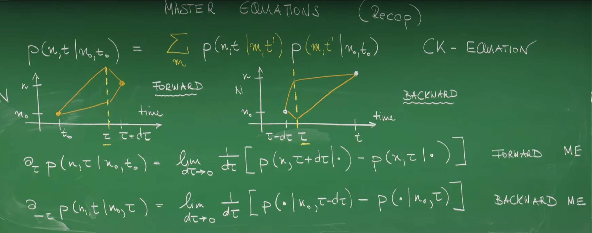
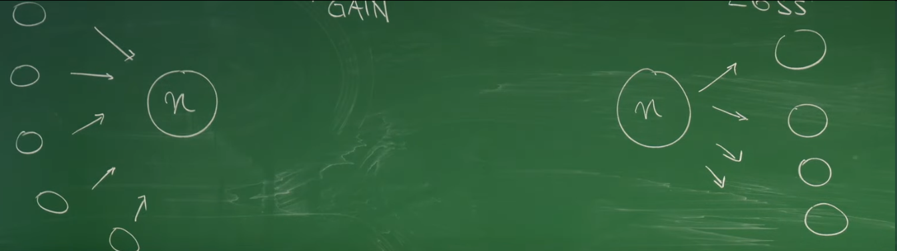
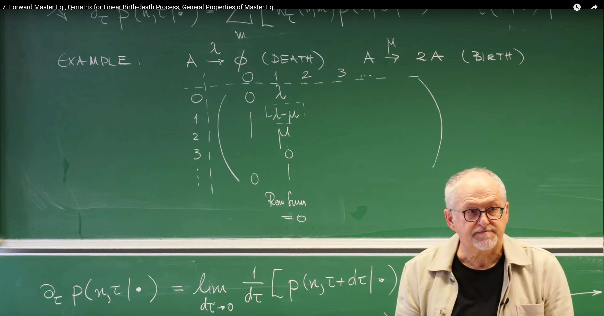
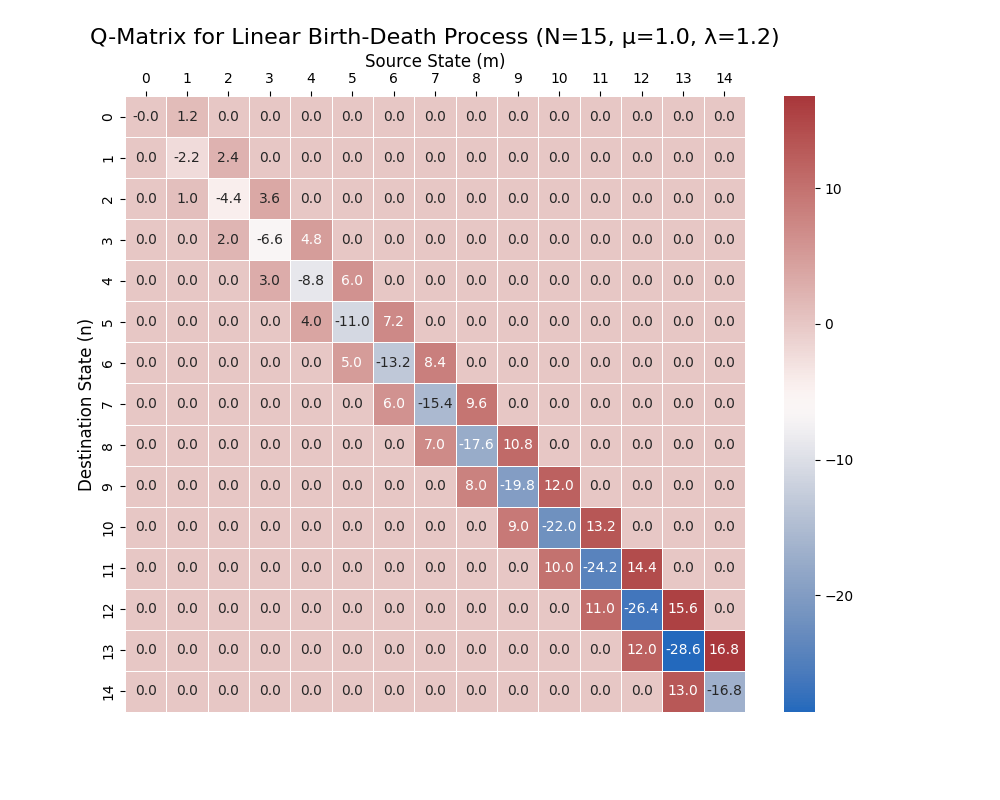
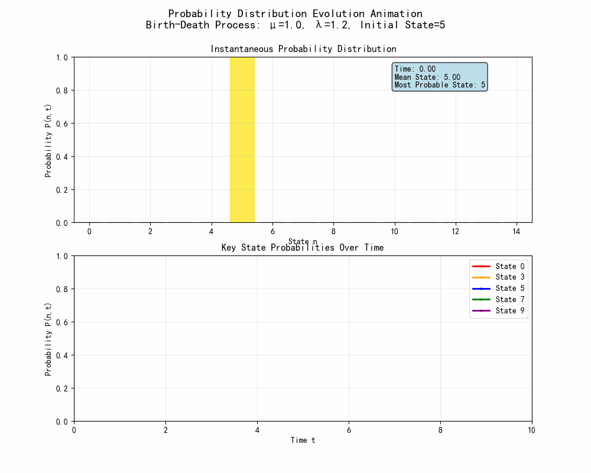
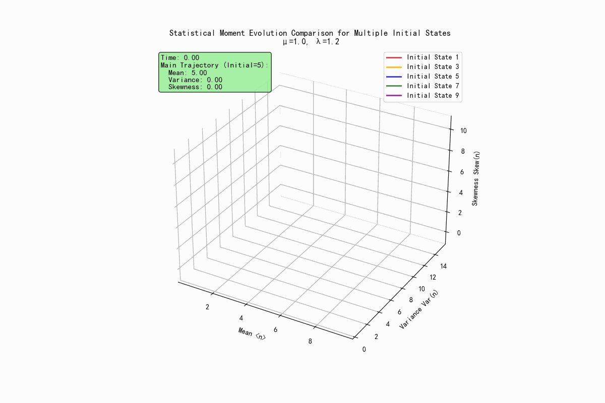
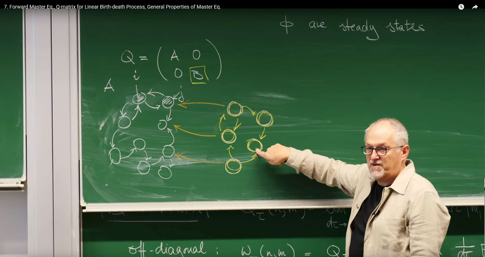
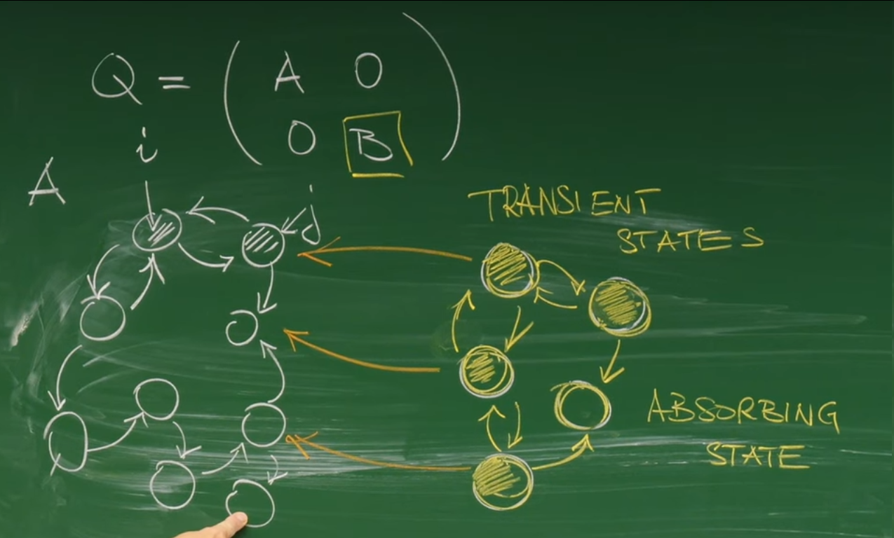

# Introduction: From Global Jumps to Instantaneous Rates

In the previous lecture we studied the Chapman–Kolmogorov (CK) equation, a cornerstone for describing the evolution of Markov processes. CK provides a global view: over a finite time interval, the probability to go from one state to another is linked through all possible intermediate states. In many physical and chemical applications, however, we care about how the state probabilities change instantaneously in time. We want an equation akin to $F=ma$ in Newtonian mechanics: not one that summarizes an entire trajectory, but one that gives the "driving force" or rate of change at any given moment.

This lecture, led by Professor Erwin Frey, derives that more powerful tool: a differential equation for the instantaneous rate of change of a probability distribution (the master equation). By pushing the finite time step in CK to an infinitesimal limit, we pass from an integral equation about finite-time jumps to a differential equation about instantaneous probability flow. This shift from global to local is both mathematically convenient and physically intuitive.

# 1. Deriving the Master Equation

## 1.1 Review: CK Equation as the Starting Point



For a Markov process on a discrete state space, CK governs the time evolution of conditional probabilities. Given three times $t_0<t'<t$, the probability to evolve from initial state $n_0$ to final state $n$ is obtained by summing over all intermediate states $m$ at time $t'$:

$$
P(n,t\mid n_0,t_0)=\sum_m P(n,t\mid m,t')\,P(m,t'\mid n_0,t_0).
$$

This reflects memorylessness: once the system is at state $m$ at time $t'$, its future evolution depends only on $m$, not on how it got there.

As reviewed in class, CK supports two complementary viewpoints:

- **Forward equation**: fix $(n_0,t_0)$ and an intermediate time $t'$, and study how $P(n,t\mid\cdot)$ evolves forward in $t$.
- **Backward equation**: fix $(n,t)$ and $t'$, and study how $P(\cdot\mid n_0,t_0)$ evolves backward in $t_0$.

Here we focus on the forward master equation because it answers the common physical question: **given a specified initial condition, how does the probability distribution evolve as time passes?**

This seemingly simple mathematical assumption contains profound physical insights. A physical system can be approximated as a Markov process typically because there exists **separation of time scales**. For example, consider a large particle moving in a liquid (Brownian motion). Its position $X(t)$ is the random variable we care about. Strictly speaking, its motion has memory because its velocity will persist for a short time. A complete description would need to consider the state $(X(t), V(t))$. However, collisions between the particle and numerous tiny liquid molecules cause the correlation time (memory time) of its velocity to be very short. If we observe the particle position on a time scale much larger than this velocity correlation time, then on our observation scale, the particle's next displacement depends almost only on its current position, not on its previous velocity history. Therefore, the Markov property is not an absolute physical law, but an extremely effective approximation, applicable to systems where all unobserved, memory-carrying "fast variables" can rapidly reach equilibrium on their relaxation time scale, thus not affecting the evolution of the "slow variables" we care about.

## 1.2 From Finite Time Steps to an Instantaneous View

To obtain a differential equation for the instantaneous change, consider an infinitesimal interval $d\tau$. Start from the definition

$$
\partial_\tau P(n,\tau\mid n_0,t_0)=\lim_{d\tau\to 0}\frac{1}{d\tau}\big[P(n,\tau+d\tau\mid n_0,t_0)-P(n,\tau\mid n_0,t_0)\big].
$$

Use CK with $t=\tau+d\tau$ and $t'=\tau$:

$$
P(n,\tau+d\tau\mid n_0,t_0)=\sum_m P(n,\tau+d\tau\mid m,\tau)\,P(m,\tau\mid n_0,t_0).
$$

Substitute into the derivative and introduce the Kronecker delta via $\sum_m\delta_{nm}P(m,\tau\mid\cdot)=P(n,\tau\mid\cdot)$ to write

$$
\partial_\tau P(n,\tau\mid\cdot)=\lim_{d\tau\to 0}\frac{1}{d\tau}\sum_m\Big[P(n,\tau+d\tau\mid m,\tau)P(m,\tau\mid\cdot)-\delta_{nm}P(m,\tau\mid\cdot)\Big].
$$

Rearranging,

$$
\partial_\tau P(n,\tau\mid\cdot)=\sum_m\left(\lim_{d\tau\to 0}\frac{P(n,\tau+d\tau\mid m,\tau)-\delta_{nm}}{d\tau}\right)P(m,\tau\mid\cdot).
$$

This is the embryo of the forward master equation: the instantaneous change of $P(n,\tau)$ is determined by the current probabilities $P(m,\tau)$ and the infinitesimal transition rates from $m$ to $n$.

This marks a fundamental shift in viewpoint. CK answers a global question (“How does the system go from A to C via B?”). The master equation, via $d\tau\to 0$, answers a local one: “At this moment, how does probability flow into and out of the current state?” Like going from average speed over a trip to instantaneous velocity, the local differential form is the foundation of most dynamical theories in physics.

# 2. The Q Matrix: Engine of Time Evolution

The derivation above naturally introduces a core mathematical object: the matrix that encodes all infinitesimal transition information. We define the Q matrix (also called the infinitesimal generator or transition rate matrix).

## 2.1 Formal Definition

Define

$$
Q_{\tau}(n,m):=\lim_{d\tau\to 0}\frac{1}{d\tau}\big[P(n,\tau+d\tau\mid m,\tau)-\delta_{nm}\big].
$$

With this, the forward master equation becomes

$$
\partial_\tau P(n,\tau\mid\cdot)=\sum_m Q_{\tau}(n,m)\,P(m,\tau\mid\cdot).
$$

In vector form, with $\vec P(\tau)$ collecting the components $P(n,\tau)$,

$$
\partial_\tau\,\vec P(\tau\mid t_0)=Q_{\tau}\,\vec P(\tau\mid t_0).
$$

Given $\vec P(t_0)$, solving this linear ODE yields the probability distribution at any later time. Q acts as the engine driving probability evolution.

**Convention**: To avoid notational confusion, we adopt the following convention: $Q_{\text{row},\,\text{col}}$ represents the rate from the "column" state to the "row" state (i.e., col→row rate), hence columns of $Q$ sum to zero.

## 2.2 Deconstructing Q

- Off-diagonal elements ($n\ne m$): transition rates

$$
Q_{nm}=w(n,m)=\lim_{d\tau\to 0}\frac{P(n,\tau+d\tau\mid m,\tau)}{d\tau} \;\ge 0.
$$

This means: when the system is in state $m$, the probability to jump to $n$ in an infinitesimal interval $d\tau$ is $P(n,\tau+d\tau\mid m,\tau)$, so the instantaneous jump rate is that probability divided by the interval length. Because probabilities are nonnegative, all off-diagonal entries satisfy $Q_{nm}\ge 0$.

- Diagonal elements ($n=m$): negative exit rate

$$
Q_{mm}=\lim_{d\tau\to 0}\frac{P(m,\tau+d\tau\mid m,\tau)-1}{d\tau},\qquad w(m):=-Q_{mm}\ge 0.
$$

Here $P(m,\tau+d\tau\mid m,\tau)$ is the probability to remain in $m$ over $d\tau$. Then $1-P(m,\tau+d\tau\mid m,\tau)$ is the total probability to leave $m$ during $d\tau$. Dividing by $d\tau$ and taking $d\tau\to 0$ yields the total exit rate. Since the stay-probability is at most 1, it follows that $Q_{mm}\le 0$. We define $w(m)=-Q_{mm}$ as the total exit rate from $m$.

## 2.3 Fundamental Constraint: Probability Conservation

From $\sum_n P(n,\tau+d\tau\mid m,\tau)=1$ (starting from $m$ you must be in some state after $d\tau$, including $m$ itself), subtract 1 on both sides, divide by $d\tau$, and take the limit:

$$
\lim_{d\tau\to 0}\frac{1}{d\tau}\left(\sum_n P(n,\tau+d\tau\mid m,\tau)-\sum_n\delta_{nm}\right)=0.
$$

Exchanging sum and limit (finite state space),

$$
\sum_n Q_{nm}=0.
$$

Thus the diagonal loss equals the sum of all off-diagonal gains in that column:

$$
w(m)=-Q_{mm}=\sum_{n\ne m}Q_{nm}=\sum_{n\ne m}w(n,m).
$$

This property encodes probability conservation: the negative diagonal (loss) must exactly balance the sum of off-diagonal inflows (gains) out of the same source column. In words, the total rate to leave a state equals the sum of rates to all other possible destinations. The linear-algebraic constraint on $Q$ is nothing but the algebraic imprint of probability conservation.

Summary (Q at a glance):

| Entry | Definition | Physical meaning | Constraint |
| --- | --- | --- | --- |
| Off‑diagonal $Q_{nm}$ ($n\ne m$) | $w(n,m)=\lim_{d\tau\to 0}\tfrac{P(n,\tau+d\tau\mid m,\tau)}{d\tau}$ | Rate from $m$ to $n$ | $Q_{nm}\ge 0$ |
| Diagonal $Q_{mm}$ | $-w(m)=\lim_{d\tau\to 0}\tfrac{P(m,\tau+d\tau\mid m,\tau)-1}{d\tau}$ | Negative total exit rate from $m$ | $Q_{mm}\le 0$ |
| Column sum | $\sum_n Q_{nm}=0$ | Probability conservation | Holds for all $m$ |

# 3. Physical Intuition: Gain–Loss Balance

While $\partial_\tau P=QP$ is compact, the equivalent gain-loss form offers clearer intuition. Split the sum into diagonal and off-diagonal parts,

$$
\partial_\tau P(n,\tau)=Q_{nn}P(n,\tau)+\sum_{m\ne n}Q_{nm}P(m,\tau).
$$

Using $Q_{nm}=w(n,m)$ and $Q_{nn}=-\sum_{m\ne n}w(m,n)$,

$$
\partial_\tau P(n,\tau)=\sum_{m\ne n}w(n,m)P(m,\tau)-\Big(\sum_{m\ne n}w(m,n)\Big)P(n,\tau),
$$

or symmetrically

$$
\partial_\tau P(n,\tau)=\sum_{m\ne n}\big[w(n,m)P(m,\tau)-w(m,n)P(n,\tau)\big].
$$



- Gain term $w(n,m)P(m,\tau)$
  - Represents probability flux flowing into $n$ from state $m$.
  - $P(m,\tau)$ is the probability to be in $m$ at time $\tau$.
  - $w(n,m)$ is the transition rate from $m$ to $n$.
  - Their product is the increase per unit time in the probability of $n$ due to jumps from $m$.
  - Total gain sums contributions over all $m\ne n$: $\sum_{m\ne n}w(n,m)P(m,\tau)$.

- Loss term $-w(m,n)P(n,\tau)$
  - Represents probability flux flowing out of $n$ into states $m$.
  - $P(n,\tau)$ is the probability to be in $n$ at time $\tau$.
  - $w(m,n)$ is the transition rate from $n$ to $m$.
  - Their product is the decrease per unit time in the probability of $n$ due to jumps to $m$.
  - Total loss sums over all possible destinations $m\ne n$: $\sum_{m\ne n}w(m,n)P(n,\tau)$.

Net change = total inflow minus total outflow. This is a continuity equation for probability on a discrete state space: $P(n,\tau)$ plays the role of a density, $\partial_\tau P(n,\tau)$ its time change, and the bracketed sum the net incoming probability flux. Equivalently, denote the probability flux from $m$ into $n$ by $J_{n\leftarrow m}:=w(n,m)P(m,\tau)$. Then

$$
\partial_\tau P(n,\tau)
= \sum_{m\ne n} \big[ J_{n\leftarrow m} - J_{m\leftarrow n} \big].
$$

# 4. Case Study: Linear Birth–Death Process

## 4.1 Model Definition

Consider a population of identical individuals with size $n$. Two events occur:

- Birth: each individual replicates with rate $\mu$, $A\xrightarrow{\mu}2A$. Total birth rate $\propto n$, so $w(n+1,n)=\mu n$.
- Death: each individual disappears with rate $\lambda$, $A\xrightarrow{\lambda}\emptyset$. Total death rate $\propto n$, so $w(n-1,n)=\lambda n$.

State $n=0$ is absorbing: with no individuals, both total birth and death rates vanish, so once at $n=0$ the system stays there.

## 4.2 Building the Q Matrix for the Birth-Death Process

Now, we will construct the Q matrix for this process step by step according to the above rules. The matrix rows and columns are indexed by population size $n=0,1,2,\ldots$.

**Non-diagonal elements:**

- For transitions from $n$ to $n+1$ (birth), we have $Q_{n+1,n} = w(n+1,n) = \mu n$. These elements are located above the main diagonal (super-diagonal).
- For transitions from $n$ to $n-1$ (death), we have $Q_{n-1,n} = w(n-1,n) = \lambda n$. These elements are located below the main diagonal (sub-diagonal).
- Since only one individual can be born or die at a time, there are no transitions with jumps larger than one unit, such as from $n$ to $n+2$. Therefore, all other non-diagonal elements are zero.

**Diagonal elements:**

- The diagonal element $Q_{n,n}$ is the negative total exit rate. From state $n$, the system can only transition to $n+1$ or $n-1$. Therefore, the total exit rate is the sum of the rates of these two processes: $w(n) = w(n+1,n) + w(n-1,n) = \mu n + \lambda n = (\mu + \lambda)n$.
- So, the diagonal element is $Q_{n,n} = -(\mu + \lambda)n$.
- For the absorbing state $n=0$, the exit rate is zero, so $Q_{0,0} = 0$.



In summary, the Q matrix for the linear birth-death process has a very clear **tridiagonal structure**:

$$
Q = \begin{pmatrix}
0 & 0 & 0 & 0 & \cdots \\
\lambda & -(\mu+\lambda) & \mu & 0 & \cdots \\
0 & 2\lambda & -2(\mu+\lambda) & 2\mu & \cdots \\
0 & 0 & 3\lambda & -3(\mu+\lambda) & \cdots \\
\vdots & \vdots & \vdots & \vdots & \ddots
\end{pmatrix}
$$

This example demonstrates a profound principle: **the structure of the Q matrix is the direct "fingerprint" of the system's microscopic dynamical rules.** The birth-death process only allows population size changes of $\pm 1$, which constitutes "nearest-neighbor" jumps in the state space. When we translate these rules into a Q matrix, we naturally obtain a sparse matrix with only the main diagonal and the immediately adjacent upper and lower diagonals being non-zero. This is a universal law: **the sparsity pattern of the Q matrix directly reflects the connectivity of the state-space graph.** A tridiagonal matrix means the states form a one-dimensional chain. Conversely, if a Q matrix is dense, it means any state can directly transition to any other state.

## 4.3 Python Visualization: From Static Structure to Dynamics

```python
import numpy as np
import matplotlib.pyplot as plt
import seaborn as sns

def create_birth_death_q_matrix(N, mu, lam):
    """
    Construct the Q matrix for a linear birth-death process.
    
    Parameters:
    N (int): Size of the state space (from 0 to N-1). This is a truncation, as theoretically the state space is infinite.
    mu (float): Birth rate per individual.
    lam (float): Death rate per individual (lambda is a keyword in python, so we use lam).
    
    Returns:
    numpy.ndarray: Q matrix of size (N, N).
    """
    # Initialize an N x N zero matrix
    Q = np.zeros((N, N))
    
    # Fill non-diagonal elements
    for n in range(1, N):
        # Death process: n -> n-1
        # Q_{n-1, n} = w(n-1, n) = lambda * n
        Q[n-1, n] = lam * n
        # Birth process: n-1 -> n
        # Q_{n, n-1} = w(n, n-1) = mu * (n-1)
        Q[n, n-1] = mu * (n-1)
    
    # Fill diagonal elements
    # Q_{n,n} = - (exit rate) = - (birth rate + death rate)
    for n in range(N):
        # Exit rate is the negative sum of all non-diagonal elements in this column
        # This is also equivalent to - (mu * n + lam * n)
        # Note: The row sum of Q matrix is 0, but here we follow the professor's board notation,
        # where transition rates are placed in Q_{destination, source}, so the column sum is 0.
        # If it's the standard mathematical notation Q_{i,j} representing transition from j->i, then the column sum is 0.
        # If it's the common notation in probability theory Q_{i,j} representing transition from i->j, then the row sum is 0.
        # The implementation here follows Q[row, col] = Q_{row, col}, i.e., transition from col to row, so the column sum is 0.
        # Q_{n,n} = - sum_{m!=n} Q_{m,n}
        Q[n, n] = -np.sum(Q[:, n])
    
    return Q

# --- Parameter settings ---
N_states = 15  # State space size (0, 1,..., 14)
mu = 1.0       # Birth rate
lambda_rate = 1.2 # Death rate

# Create Q matrix
Q_matrix = create_birth_death_q_matrix(N_states, mu, lambda_rate)

# --- Visualization ---
plt.figure(figsize=(10, 8))
sns.heatmap(Q_matrix, annot=True, fmt=".1f", cmap="vlag", linewidths=.5, cbar=True)
plt.title(f'Q-Matrix for Linear Birth-Death Process (N={N_states}, μ={mu}, λ={lambda_rate})', fontsize=16)
plt.xlabel('Source State (m)', fontsize=12)
plt.ylabel('Destination State (n)', fontsize=12)
plt.gca().xaxis.tick_top()
plt.gca().xaxis.set_label_position('top')
plt.show()

print("Q Matrix (truncated):")
print(np.round(Q_matrix, 2))
```



**Main diagonal (blue)**: These are the negative exit rates $Q_{n,n} = -(\mu + \lambda)n$, whose absolute values increase linearly with $n$. **Super-diagonal (red)**: These are the birth rates $Q_{n+1,n} = \mu n$, which also increase linearly with $n$. **Sub-diagonal (red)**: These are the death rates $Q_{n-1,n} = \lambda n$, which also increase linearly with $n$. **Other regions**: All zero, indicating no "long-range" jumps exist.

## 4.4 Probability and Phase‑Space Evolution

With the Q matrix as our "engine," we can now numerically solve the master equation $\partial_\tau \vec{P} = Q\vec{P}$ to observe how the probability distribution evolves from a sharp initial condition to the steady-state distribution. Theory tells us what the steady state is, but it doesn't explain how the system reaches the steady state. The transient behavior during the evolution process is equally important, as it reflects the system's relaxation dynamics and makes the abstract concept of "probability flow" concrete through animation.

Now we solve the master equation to observe how the probability distribution dynamically evolves over time:

```python
"""
Probability Evolution and Phase Space Animation Demonstration
"""
import numpy as np
import matplotlib.pyplot as plt
import matplotlib.animation as animation
from scipy.integrate import odeint

class BirthDeathAnimator:
    def __init__(self, N=15, mu=1.0, lam=1.2):
        self.N = N; self.mu = mu; self.lam = lam
        self.Q = self._create_q_matrix()
        self.t_max = 10
        self.n_frames = 150
        self.t_points = np.linspace(0, self.t_max, self.n_frames)
    def _create_q_matrix(self):
        Q = np.zeros((self.N, self.N))
        for n in range(1, self.N):
            if n < self.N - 1:
                Q[n+1, n] = self.mu * n
            Q[n-1, n] = self.lam * n
        for n in range(self.N):
            Q[n, n] = -np.sum(Q[:, n])
        return Q
    def solve_master_equation(self, initial_state):
        def master_eq(P, t): return self.Q @ P
        P0 = np.zeros(self.N); P0[initial_state] = 1.0
        return odeint(master_eq, P0, self.t_points)
    def create_probability_evolution_animation(self, initial_state=5, save_path=None):
        P_t = self.solve_master_equation(initial_state)
        fig, (ax1, ax2) = plt.subplots(2, 1, figsize=(10, 8))
        fig.suptitle(f'Probability Distribution Evolution\nμ={self.mu}, λ={self.lam}, Initial={initial_state}', fontsize=14, fontweight='bold')
        states = np.arange(self.N)
        bars = ax1.bar(states, P_t[0], alpha=0.8, color='skyblue', edgecolor='navy')
        ax1.set_xlim(-0.5, self.N-0.5); ax1.set_ylim(0, 1.0)
        ax1.set_xlabel('State n'); ax1.set_ylabel('Probability P(n,t)')
        ax1.set_title('Instantaneous Probability Distribution'); ax1.grid(True, alpha=0.3)
        stats_text = ax1.text(0.7, 0.95, '', transform=ax1.transAxes, va='top', fontsize=10,
                              bbox=dict(boxstyle='round,pad=0.3', facecolor='lightblue', alpha=0.8))
        key_states = [0, max(1, initial_state-2), initial_state, min(initial_state+2, self.N-1), min(initial_state+4, self.N-1)]
        colors = ['red','orange','blue','green','purple']; lines=[]
        for state,color in zip(key_states,colors):
            line,=ax2.plot([],[],color=color,linewidth=2,label=f'State {state}',marker='o',markersize=2)
            lines.append((line,state))
        ax2.set_xlim(0,self.t_max); ax2.set_ylim(0,1.0)
        ax2.set_xlabel('Time t'); ax2.set_ylabel('Probability P(n,t)')
        ax2.set_title('Key State Probabilities Over Time'); ax2.legend(loc='upper right',fontsize=10)
        ax2.grid(True, alpha=0.3)
        time_line=ax2.axvline(x=0,color='black',linestyle='--',alpha=0.7)
        def animate(frame):
            current_time=self.t_points[frame]; current_prob=P_t[frame]
            for bar,prob in zip(bars,current_prob):
                bar.set_height(prob)
                intensity = prob/np.max(current_prob) if np.max(current_prob)>0 else 0
                bar.set_color(plt.cm.viridis(intensity))
            mean_state=np.sum(states*current_prob); max_prob_state=states[np.argmax(current_prob)]
            stats_text.set_text(f'Time: {current_time:.2f}\nMean State: {mean_state:.2f}\nMost Probable State: {max_prob_state}')
            for line,state in lines:
                if frame>0:
                    x=self.t_points[:frame+1]; y=P_t[:frame+1,state]
                    line.set_data(x,y)
            time_line.set_xdata([current_time,current_time])
            return [*bars,stats_text,*[line for line,_ in lines],time_line]
        anim=animation.FuncAnimation(fig,animate,frames=self.n_frames,interval=80,blit=False,repeat=True)
        if save_path:
            anim.save(save_path, writer='pillow', fps=12, dpi=100)
        plt.tight_layout(); plt.show(); return anim
```



The top panel shows the probability $P(n,t)$ at each time point, with color depth dynamically reflecting the probability magnitude (darker = higher probability), demonstrating how probability spreads from the initial "spike." The bottom panel tracks the probability evolution of 5 representative states over time: State 0 is the absorbing state, with probability monotonically increasing; State 3 is below the initial state, showing probability flow toward lower states; State 5 is the initial state, with probability first decreasing then approaching the steady-state value; State 7 is above the initial state, showing the probability diffusion effect; and State 9 is a higher state, demonstrating the behavior in the high-state region.

```python
    def create_phase_space_animation(self, initial_state=5, save_path=None):
        """
        Create phase space evolution animation
        Display comparison of statistical moment evolution trajectories for multiple initial states
        """
        # Calculate evolution for multiple different initial states
        initial_states = [1, max(2, initial_state-2), initial_state,
                         min(initial_state+2, self.N-2), min(initial_state+4, self.N-2)]
        colors = ['red', 'orange', 'blue', 'green', 'purple']
        all_moments = []

        for init_state in initial_states:
            P_t = self.solve_master_equation(init_state)

            # Calculate statistical moments
            states = np.arange(self.N)
            moments = np.zeros((len(self.t_points), 3))

            for i, prob in enumerate(P_t):
                # First moment: mean
                moments[i, 0] = np.sum(states * prob)
                # Second central moment: variance
                moments[i, 1] = np.sum((states - moments[i, 0])**2 * prob)
                # Third normalized moment: skewness (simplified calculation)
                if moments[i, 1] > 1e-6:  # Avoid division by zero
                    moments[i, 2] = np.sum((states - moments[i, 0])**3 * prob) / (moments[i, 1]**(1.5))
                else:
                    moments[i, 2] = 0

            all_moments.append(moments)

        # Create 3D figure
        fig = plt.figure(figsize=(12, 8))
        ax = fig.add_subplot(111, projection='3d')

        # Initialize multiple trajectory lines and current points
        lines = []
        points = []
        for i, (color, init_state) in enumerate(zip(colors, initial_states)):
            line, = ax.plot([], [], [], color=color, linewidth=2, alpha=0.8,
                           label=f'Initial State {init_state}')
            point, = ax.plot([], [], [], 'o', color=color, markersize=6)
            lines.append(line)
            points.append(point)

        # Set axes
        ax.set_xlabel('Mean <n>')
        ax.set_ylabel('Variance Var(n)')
        ax.set_zlabel('Skewness Skew(n)')
        ax.set_title(f'Statistical Moment Evolution Comparison for Multiple Initial States\nμ={self.mu}, λ={self.lam}')
        ax.legend()

        # Dynamically set axis ranges (based on all trajectories)
        all_moments_combined = np.concatenate(all_moments, axis=0)
        margin = 0.1
        ax.set_xlim(np.min(all_moments_combined[:, 0])*(1-margin),
                   np.max(all_moments_combined[:, 0])*(1+margin))
        ax.set_ylim(np.min(all_moments_combined[:, 1])*(1-margin),
                   np.max(all_moments_combined[:, 1])*(1+margin))
        z_range = np.max(all_moments_combined[:, 2]) - np.min(all_moments_combined[:, 2])
        ax.set_zlim(np.min(all_moments_combined[:, 2])-z_range*margin,
                   np.max(all_moments_combined[:, 2])+z_range*margin)

        # Information text (avoid obstruction)
        time_text = ax.text2D(0.02, 0.98, '', transform=ax.transAxes, fontsize=11,
                             verticalalignment='top',
                             bbox=dict(boxstyle="round,pad=0.3", facecolor="lightgreen", alpha=0.8))

        def animate_phase(frame):
            """Phase space animation update function"""
            current_time = self.t_points[frame]

            # Update all trajectory lines and current points
            for i, (line, point, moments) in enumerate(zip(lines, points, all_moments)):
                if frame > 0:
                    line.set_data_3d(moments[:frame+1, 0], moments[:frame+1, 1], moments[:frame+1, 2])
                    point.set_data_3d([moments[frame, 0]], [moments[frame, 1]], [moments[frame, 2]])

            # Update time information (display information from main trajectory)
            main_moments = all_moments[2]  # Use middle initial state (index 2) as main display
            time_text.set_text(
                f'Time: {current_time:.2f}\n'
                f'Main Trajectory (Initial={initial_state}):\n'
                f'  Mean: {main_moments[frame, 0]:.2f}\n'
                f'  Variance: {main_moments[frame, 1]:.2f}\n'
                f'  Skewness: {main_moments[frame, 2]:.2f}'
            )

            return [*lines, *points, time_text]

        # Create animation
        anim = animation.FuncAnimation(fig, animate_phase, frames=self.n_frames,
                                     interval=80, blit=False, repeat=True)

        # Save animation
        if save_path:
            anim.save(save_path, writer='pillow', fps=12, dpi=100)

        plt.show()
        return anim
```

```python
# Demonstration usage
if __name__ == "__main__":
    # Create animation demonstrator
    animator = BirthDeathAnimator(N=15, mu=1.0, lam=1.2)

    # 1) Probability evolution animation
    anim1 = animator.create_probability_evolution_animation(
        initial_state=5,
        save_path="probability_evolution.gif"
    )

    # 2) Phase space evolution animation
    anim2 = animator.create_phase_space_animation(
        initial_state=5,
        save_path="phase_space_evolution.gif"
    )
```



One can clearly see the net flow of probability from high states to low states, and the evolution paths of the system in (mean, variance, skewness) space. The trajectories ultimately converge to a fixed point corresponding to the steady state, reflecting the system's relaxation dynamics.

# 5. Long‑Time Dynamics and General Properties

## 5.1 Reaching Equilibrium: Steady State

At a steady state (stationary distribution) $\vec\pi$, the time derivative vanishes:

$$
\partial_\tau\vec P(\tau)=0.
$$

Thus

$$
Q\,\vec\pi=0,
$$

so $\vec\pi$ is a right eigenvector of $Q$ with eigenvalue 0. This links a dynamical question to linear algebra (the null space of $Q$). Probability conservation also implies a left eigenvector of ones: $(1,1,\ldots,1)Q=0$.

## 5.2 Structure of the State Space



- Absorbing states: once entered, the system cannot leave. In the column-sum convention used here (transitions from column to row), an absorbing state has $Q_{ii}=0$ and all $Q_{ji}=0$ for $j\ne i$.



- Transient states: states that can be left and that may never be revisited (nonzero probability). In systems with absorbing states, all nonabsorbing states are transient.

- Irreducibility: a system (or subset) is irreducible if every state can reach every other in finitely many steps; otherwise it is reducible. A block-diagonal $Q$ indicates a reducible system, corresponding to two independent subsystems $A$ and $B$ that do not communicate with each other,

$$
Q=\begin{pmatrix}A&0\\0&B\end{pmatrix}.
$$

## 5.3 Perron–Frobenius: Guaranteeing a Unique Physical Steady State

For an irreducible system, we ask whether a physically meaningful (all components positive) steady state exists and is unique. The Perron-Frobenius theorem gives affirmative answers.

- Uniqueness: eigenvalue 0 is simple (algebraic multiplicity 1), so the solution of $Q\vec\pi=0$, normalized by $\sum_n\pi_n=1$, is unique.
- Positivity: the unique steady eigenvector $\vec\pi$ can be chosen strictly positive ($\pi_n>0$ for all $n$), giving a bona fide probability distribution.

Thus, under the intuitive condition of irreducibility ("sufficient mixing"), the system relaxes to a unique, physically sensible steady state. In reducible systems (e.g., with absorbing states), the long-time outcome can depend on the initial state. The theorem links a graph property (strong connectivity of the state space) to a spectral property (a simple zero eigenvalue), which in turn guarantees a key physical property (existence and uniqueness of a steady-state probability distribution with strictly positive components).

# Summary

We built a theory from global to local and back to global:

1. Start from the CK equation for finite‑time evolution.
2. Take the infinitesimal limit to derive the forward master equation, a differential equation for instantaneous change.
3. Encapsulate transition information in the Q matrix—the engine of probability evolution.
4. Interpret the master equation as a gain–loss balance, i.e., a continuity equation for probability.
5. Apply the framework to the linear birth–death process: construct $Q$ from microscopic rules and relate its structure to dynamics.
6. Analyze long‑time behavior and invoke Perron–Frobenius: irreducibility guarantees a unique, physically meaningful steady state.

