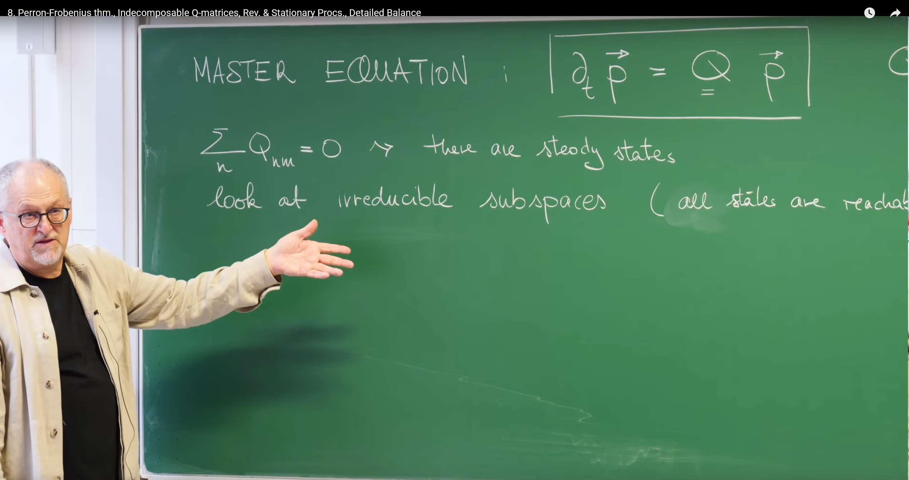

# Introduction: Seeking a Unique and Physical Steady State

In the previous lecture, Prof. Erwin Frey developed the core tools for Markov processes—the forward master equation and the Q matrix. The time evolution of a probability distribution is governed by

$$\frac{dP}{dt}(t) = Q\,P(t),$$

where $P(t)$ is a column vector with component $P_n(t)$ the probability to be in state $n$ at time $t$. The Q matrix (transition‑rate matrix) has

- Off‑diagonals $Q_{n m}=w_{m\to n}\ge 0$ for $n\ne m$ (rate from $m$ to $n$).
- Diagonals $Q_{n n} = -\sum_{m\ne n} w_{n\to m}$ (total exit rate from $n$).

Crucially, Q has column sums equal to zero:

$$\sum_n Q_{n m}=0.$$



In many fields—physics, chemistry, biology—we care most about long‑time behavior: what state does the system approach? A time‑independent distribution is a steady state (or equilibrium). The column‑sum property implies that steady states exist. A steady distribution $\pi$ satisfies $\frac{d\pi}{dt}=0$, and thus

$$Q\,\pi=0.$$

In linear‑algebra terms, steady states are right eigenvectors of Q with eigenvalue 0. Column sums equal to zero guarantee that $0$ is an eigenvalue of Q.

This raises key questions:

1) Uniqueness: Is $\pi$ the unique long‑time fate, or can multiple steady states exist, depending on initial conditions?
2) Physicality: As a probability distribution, all components $\pi_n\ge 0$; can we guarantee this, or even strict positivity $\pi_n>0$?
3) Reachability: Under what physical conditions do uniqueness and positivity hold?

To answer these, we use a powerful mathematical tool about nonnegative matrices: the Perron–Frobenius theorem. Our goal is to use it to establish that, under suitable conditions, the process relaxes to a unique, physically meaningful steady state.

# 1. Perron–Frobenius: A Powerful Guarantee for Positive Matrices

The Perron–Frobenius (PF) theorem is a deep result in linear algebra about eigenvalues and eigenvectors of nonnegative (and positive) matrices.

Originating with Oskar Perron (1907) and Ferdinand Frobenius (1912), the theorem studies nonnegative matrices ($\ge 0$) and positive matrices ($>0$). For irreducible nonnegative matrices, there exists a unique largest real eigenvalue (the Perron root) with a corresponding eigenvector having strictly positive components.

Applications span Markov chains (uniqueness and physicality of steady states), population dynamics, economic input–output models, network science (PageRank and influence), ecology (stability), and open quantum systems.


## 1.1 Statement of the Theorem

The theorem can be stated in simple terms as follows:

For a real square matrix $M$ with all elements being **nonnegative** ($M_{nm} \geq 0$) and **indecomposable** (also called irreducible), the following conclusions hold:

1) There exists a **unique, real positive eigenvalue** $\lambda$ that has the largest absolute value among all eigenvalues. That is, for any other eigenvalue $\mu$ of $M$ (which may be complex), we have $|\mu| < \lambda$. This special eigenvalue $\lambda$ is called the **Perron root** or dominant eigenvalue.

2) The eigenvector $p^{(\lambda)}$ corresponding to the Perron root $\lambda$ is unique (up to multiplication by a positive constant factor) and can be chosen such that all its components are **strictly positive** ($p_n^{(\lambda)} > 0$ for all $n$).


Spectrally, all eigenvalues lie inside a disk of radius $\lambda$ centered at the origin in the complex plane; the Perron root sits on the positive real axis, strictly outside all others.

## 1.2 Physical Meaning of the Assumptions

To understand the power of the PF theorem, we must deeply analyze its two core prerequisite conditions.

**Terminology note:** In this chapter, "indecomposable" and "irreducible" are synonymous. To match standard Markov process and PF theorem usage, we will use "irreducible" henceforth.

### Nonnegativity ($M_{nm} \geq 0$)

This condition is very natural in physical and biological models. Matrix elements often represent quantities that are inherently non-negative, such as species counts, chemical concentrations, or in Markov chains, transition probabilities. This condition is the foundation of the entire theorem.

### Indecomposability (Irreducibility)

This is the most crucial physical condition when applying the PF theorem. A matrix is indecomposable, meaning the system it describes is a **whole**, rather than composed of several isolated, non-communicating subsystems. This concept can be understood through several approaches to build the strongest physical intuition:

- **Graph theory perspective:** We can imagine each state $n$ of the system as a node in a graph. If matrix element $M_{nm} > 0$, we draw a directed edge from node $m$ to node $n$, indicating the system can transition from state $m$ to state $n$. Then, the **indecomposability** of the matrix is equivalent to this directed graph being **strongly connected**. Strong connectivity means that from any node, there exists a path of directed edges that can reach any other node in the graph.

- **Physical perspective:** An indecomposable (or irreducible) system, physically means the system can explore all possible state spaces over time. There are no so-called "traps" or "islands" in the system—that is, certain sets of states that, once entered, the system can never leave, or certain states that can never be reached from other parts of the system. As the professor mentioned in class, this is equivalent to "all states are reachable."

- **Formal definition:** Mathematically, indecomposability is defined as the matrix having no non-trivial **invariant subspaces**. A subspace $V$ is invariant if for any vector $v \in V$ belonging to that subspace, after transformation by matrix $M$, the result $Mv$ still lies within that subspace.

Indecomposability is the mathematical language that guarantees the consistency of the system's global behavior. If a system is decomposable, it's as if it's divided into several parts by an invisible wall. Physically, this means the system's long-term behavior will depend entirely on its initial state. If it starts from "region A," it will be forever trapped in the steady state of "region A"; if it starts from "region B," it will reach the steady state of "region B." This leads to multiple possible steady states, destroying uniqueness.

Therefore, the **indecomposability** condition, by excluding this possibility of "imprisonment," forces the system, regardless of where it starts, to eventually explore all states and tend toward a **globally unified steady state**. This deeply connects an abstract mathematical condition with a key physical property—the uniqueness of steady states.

# 2. Applying PF to Q: Proof of a Unique Steady State

Q is not nonnegative (diagonals are negative). We therefore construct an auxiliary matrix that is nonnegative.

## 2.1 Constructing a Nonnegative Matrix $M$

Define

$$
M_{n m}:=Q_{n m}+\alpha\,\delta_{n m},
$$

where $\delta_{n m}$ is the Kronecker delta and

$$
\alpha=\max_n |Q_{n n}|=\max_n \sum_{m\ne n} w_{n\to m}
$$

is the maximal exit rate. This “lifts” the diagonal to make $M\ge 0$.

Note: “:=” reads “is defined as”.

## 2.2 Step‑by‑Step Derivation

1.$M\ge 0$: Off‑diagonals $M_{n m}=Q_{n m}=w_{m\to n}\ge 0$ for $n\ne m$. Diagonals $M_{n n}=Q_{n n}+\alpha=-\sum_{m\ne n} w_{n\to m}+\alpha\ge 0$ by definition of $\alpha$.

2.Link eigenproblems: For $Mp=\lambda p$, $(Q+\alpha I)p=\lambda p$, so

$$Qp=(\lambda-\alpha)p.$$

Thus Q and M share eigenvectors; Q's eigenvalues equal M's eigenvalues minus $\alpha$.

3.Apply PF to $M$: For an irreducible Markov process, the state space is strongly connected. Hence $M$ is irreducible. PF yields a unique dominant eigenvalue $\lambda_{\mathrm{PF}}$ with a strictly positive eigenvector $p^{(\lambda_{\mathrm{PF}})}$.

4.Determine $\lambda_{\mathrm{PF}}$: This is the core step of the proof, completely reproducing the professor's blackboard derivation.


We sum the eigenvalue equation of $M$ over all components $n$:

$$
\sum_n (Mp^{(\lambda_{\mathrm{PF}})})_n = \sum_n \sum_m M_{nm} p_m^{(\lambda_{\mathrm{PF}})} = \sum_n \lambda_{\mathrm{PF}} p_n^{(\lambda_{\mathrm{PF}})}
$$

On the left side, we swap the order of summation and substitute the definition of $M$:

$$
\sum_m \left(\sum_n M_{nm}\right) p_m^{(\lambda_{\mathrm{PF}})} = \sum_m \left(\sum_n (Q_{nm} + \alpha \delta_{nm})\right) p_m^{(\lambda_{\mathrm{PF}})} = \lambda_{\mathrm{PF}} \sum_n p_n^{(\lambda_{\mathrm{PF}})}
$$

The summation inside the brackets can be calculated. We know that the column sums of the $Q$ matrix are zero, i.e., $\sum_n Q_{nm} = 0$. And $\sum_n \alpha \delta_{nm}$ is non-zero only when $n = m$, with value $\alpha$. Therefore, the value inside the brackets is $\alpha$. The equation becomes:

$$
\sum_m \alpha p_m^{(\lambda_{\mathrm{PF}})} = \lambda_{\mathrm{PF}} \sum_n p_n^{(\lambda_{\mathrm{PF}})}
$$

Since $\sum_m p_m^{(\lambda_{\mathrm{PF}})}$ and $\sum_n p_n^{(\lambda_{\mathrm{PF}})}$ are the same sum, and according to the PF theorem, all components of $p^{(\lambda_{\mathrm{PF}})}$ are positive, this sum is also positive and can be canceled from both sides. We finally obtain an amazingly simple result:

$$
\lambda_{\mathrm{PF}} = \alpha
$$

5.Return to Q: From $Qp=(\lambda-\alpha)p$, Q's eigenvalue associated with $p^{(\lambda_{\mathrm{PF}})}$ is

$$\lambda_Q=\lambda_{\mathrm{PF}}-\alpha=0.$$

## 2.3 Summary and Physical Meaning

This proof has answered our initial questions. It tells us:

**For any continuous-time Markov process with an irreducible state space (i.e., all states are mutually accessible), its transition rate matrix $Q$ has a unique eigenvector with eigenvalue 0. According to the Perron-Frobenius theorem, this eigenvector can be chosen to have all components strictly positive.**

This vector is precisely the **unique, physically meaningful steady-state distribution** $\pi$ that we've been seeking. Its uniqueness guarantees that the system's long-term behavior is deterministic, independent of the initial state. Its positivity ($\pi_n > 0$) ensures that in the steady state, every state in the system has a non-zero probability of being visited, which aligns with our physical intuition about an "active," irreducible system.

Furthermore, since $\lambda_{\mathrm{PF}} = \alpha$ is the **dominant** eigenvalue of $M$, all other eigenvalues $\mu$ satisfy $|\mu| < \alpha$. Consequently, all other eigenvalues of $Q$, given by $\lambda_Q' = \mu - \alpha$, will satisfy $\mathrm{Re}(\lambda_Q') < 0$. These eigenvalues with negative real parts represent all the "transient modes" in the system that decay exponentially with time. As time approaches infinity, these modes will all disappear, leaving only the steady-state mode corresponding to the eigenvalue 0.

# 3. Characterizing Balance: Stationary and Reversible Processes

With uniqueness established for irreducible systems, we now characterize steady behavior.

## 3.1 Stationary Process

In a stationary process, statistics are invariant under time shifts:

- For any $t$, $\mathrm{Prob}\{X(t)=n\}=\pi_n$.
- Joint probabilities depend only on time differences, e.g., $\mathrm{Prob}\{X(t_1)=n_1, X(t_2)=n_2\}$ depends only on $t_2-t_1$.

## 3.2 Reversible Process


A stationary process is reversible if its statistics are invariant under time reversal. Intuitively, a time‑reversed movie is statistically indistinguishable from a forward one. Formally,

$$
\mathrm{Prob}\{X(t_1)=n_1,\ldots,X(t_k)=n_k\}=\mathrm{Prob}\{X(t_1)=n_k,\ldots,X(t_k)=n_1\}.
$$

Reversibility implies stationarity: if statistics evolve in time, forward and backward movies differ.

# 4. Detailed Balance: Microscopic Signature of Thermodynamic Equilibrium

Reversibility can be expressed via detailed balance. Any steady state must satisfy overall (global) balance: for each state, total inflow equals total outflow; otherwise its probability changes in time. Overall balance, however, allows persistent net cycles (currents) in the network: like a ring of pipes with steady water level but circulating flow.

Detailed balance is stricter: for every pair of directly connected states, the bidirectional probability fluxes are exactly equal.


Left: overall balance—split the state space by an arbitrary cut into $S_+$ and $S_-$. In steady state, the total flux across the cut from $S_-$ to $S_+$ equals that from $S_+$ back to $S_-$. Otherwise probability would accumulate on one side and stationarity would be violated. Overall balance is universal, but it permits net cycles (e.g., $A\to B\to C\to A$), provided each state’s (or subset’s) total in/out flux matches.

Right: detailed balance—consider a single edge between adjacent states $j$ and $k$. In steady state, flux $j\to k$ equals flux $k\to j$. With every edge locally balanced, no net cycles can exist.

Summary:

| Property | Overall balance | Detailed balance |
| --- | --- | --- |
| Scope | Macroscopic cut between subsets | Each microscopic edge between neighbors |
| Applicability | Required by all steady states | Only specific (reversible) steady states |
| Cycles | Net cycles allowed | No net cycles |
| Strength | Weaker condition | Strong constraint |

## 4.1 Detailed Balance Condition

$$\pi_j\,w_{j\to k}=\pi_k\,w_{k\to j}.$$

This relation holds in steady state $\pi$ for any two directly connected states $j$ and $k$.

## 4.2 Physical Interpretation: No Net Probability Flux

$\pi_j\,w_{j\to k}$ is the probability flux (current density) from $j$ to $k$ per unit time in steady state. Detailed balance enforces pairwise equality of opposing fluxes on every edge—no net local current anywhere.

## 4.3 Derivation: Reversibility $\Leftrightarrow$ Detailed Balance


From reversibility, for any $j,k$ and $t,t+\tau$,

$$\mathrm{Prob}\{X(t)=j, X(t+\tau)=k\}=\mathrm{Prob}\{X(t)=k, X(t+\tau)=j\}.$$

Using conditional probabilities in steady state,

$$P(k,t+\tau\mid j,t)\,\pi_j=P(j,t+\tau\mid k,t)\,\pi_k.$$

For infinitesimal $\tau=\Delta t$ and $j\ne k$, $P(k,t+\Delta t\mid j,t)\approx w_{j\to k}\,\Delta t$. Dividing by $\Delta t$ gives detailed balance:

$$w_{j\to k}\,\pi_j=w_{k\to j}\,\pi_k.$$

Thus a stationary Markov process is reversible iff it satisfies detailed balance.

### Key Distinction: Global vs. Detailed Balance


This is a crucial conceptual distinction that relates to how we understand different types of steady states.

The steady-state condition we derived from $Q\pi = 0$ is actually a **global balance** condition. It requires that the total inflow probability to each state equals the total outflow probability:

$$\text{Total inflow to } j \text{ probability flux} = \sum_{k \neq j} \pi_k w_{k \to j} = \text{Total outflow from } j \text{ probability flux} = \sum_{k \neq j} \pi_j w_{j \to k}$$

Detailed balance is a **much stronger** condition than global balance. If detailed balance holds, i.e., $\pi_k w_{k \to j} = \pi_j w_{j \to k}$ for all $k$, then summing this equality over all $k \neq j$ naturally gives global balance. The converse is not true.

We can understand the distinction between the two through a physical analogy. Imagine a lake and a river.

- **Lake (thermodynamic equilibrium):** The lake water is in equilibrium, with a constant macroscopic water level. At the microscopic level, water molecules are constantly moving, but the flux of water molecules from any point A to point B is exactly canceled by the flux from point B to point A. This is **detailed balance**, with no macroscopic net water flow.

- **River (nonequilibrium steady state):** A river can also have a stable water level (steady state), but the river water has a clear downstream direction overall. At any cross-section, the water inflow from upstream equals the outflow downstream, maintaining water level stability. This is **global balance**. However, if you examine two points A and B in the river (A upstream), the net water flux from A to B far exceeds the reverse flux from B to A. Here there exists a **net probability flux (water flow)**.

This analogy reveals a profound physical principle: the distinction between detailed balance and global balance is precisely the distinction between **thermodynamic equilibrium** and **nonequilibrium steady states (NESS)** in stochastic processes.

A system satisfying detailed balance is in true thermodynamic equilibrium, with no net flow of energy or matter. A system satisfying only global balance is in a nonequilibrium steady state maintained by continuous external driving (such as energy input), like a living cell. This distinction connects the abstract mathematical concepts of this lecture with the profound principles of physics and biology.

# 5. Examples: Simulation and Physical Intuition

## 5.1 Linear Birth–Death: A System with Detailed Balance

### Model

Population size $n$; two events:

- Birth: each particle creates a new one at rate $\lambda$, so $n\to n+1$ has total rate $\lambda_n=\lambda n$.
- Death: each particle disappears at rate $\mu$, so $n\to n-1$ has total rate $\mu_n=\mu n$.

This is a 1D chain with nearest‑neighbor transitions. Whenever a steady state exists, it must satisfy detailed balance since no loops exist to support cycles.

### Steady State via Detailed Balance

For adjacent $n$ and $n-1$:

$$\pi_{n-1}\,w_{n-1\to n}=\pi_n\,w_{n\to n-1}.$$

With rates,

$$\pi_{n-1}\,\lambda(n-1)=\pi_n\,\mu n,$$

giving

$$\pi_n=\pi_{n-1}\,\frac{\lambda(n-1)}{\mu n}.$$

Starting from $\pi_1=\pi_0\,\frac{\lambda\cdot 0}{\mu\cdot 1}=0$, all $\pi_{n>0}=0$. Thus the unique steady state is extinction: $\pi_0=1$.

### Python (Gillespie)

```python
import numpy as np
import matplotlib.pyplot as plt

def linear_birth_death_gillespie(n0, lamb, mu, t_max):
    """
    Simulate linear birth-death process using Gillespie algorithm.
    """
    t = 0.0; n = n0
    times = [t]; populations = [n]
    while t < t_max:
        if n == 0: break
        birth_rate = lamb * n; death_rate = mu * n
        total_rate = birth_rate + death_rate
        dt = np.random.exponential(1.0 / total_rate)
        t += dt
        if np.random.rand() < birth_rate / total_rate:
            n += 1
        else:
            n -= 1
        times.append(t); populations.append(n)
    return np.array(times), np.array(populations)

# --- Simulation parameters ---
initial_population = 10
lambda_rate = 1.0
mu_rate = 1.1
simulation_time = 50.0
num_simulations = 500

# --- Run multiple simulations ---
final_populations = []
plt.figure(figsize=(12, 8))

# Example trajectories
plt.subplot(2, 1, 1)
for i in range(5):
    times, populations = linear_birth_death_gillespie(initial_population, lambda_rate, mu_rate, simulation_time)
    plt.step(times, populations, where='post', alpha=0.7)

plt.title(f'Example Trajectories of Linear Birth-Death Process ($n_0={initial_population}, \\lambda={lambda_rate}, \\mu={mu_rate}$)')
plt.xlabel('Time'); plt.ylabel('Population Size'); plt.grid(True)

# Final population histogram
for _ in range(num_simulations):
    _, populations = linear_birth_death_gillespie(initial_population, lambda_rate, mu_rate, simulation_time)
    final_populations.append(populations[-1])

plt.subplot(2, 1, 2)
plt.hist(final_populations, bins=np.arange(-0.5, max(final_populations) + 1.5, 1), density=True, rwidth=0.8)
plt.title(f'Distribution of Final Population Size after {num_simulations} Simulations (Steady State)')
plt.xlabel('Final Population Size'); plt.ylabel('Probability Density'); plt.grid(True)
plt.xticks(np.arange(0, max(final_populations) + 1, 1))
plt.tight_layout(); plt.show()
```


Trajectories fluctuate but ultimately reach $0$; the histogram concentrates at $0$ for long times, matching $\pi_0=1, \pi_{n>0}=0$.

## 5.2 1D Random Walk with Absorbing Boundaries: No Nontrivial Steady State

### Model

1D random walk with two absorbing boundaries.

### Why PF Fails Here

The presence of absorbing classes makes the chain reducible; irreducibility fails, so PF’s uniqueness/positivity conclusion does not apply.

### Trivial “Steady State”

Probability leaks from $n>0$ and accumulates at absorbing states; only trivial absorbing distributions remain.

### Python

```python
import numpy as np
import matplotlib.pyplot as plt

def random_walk_1d_two_boundaries(start_pos, n_steps, boundary_left=0, boundary_right=10):
    """
    Simulate a one-dimensional random walk with two absorbing boundaries.
    """
    position = start_pos
    path = [position]
    for _ in range(n_steps):
        if position == boundary_left or position == boundary_right:
            path.append(position)
            continue
        step = np.random.choice([-1, 1])
        position += step
        path.append(position)
    return path

# --- Simulation parameters ---
initial_position = 5
max_steps = 500
num_trajectories = 20
boundary_left_pos = 0
boundary_right_pos = 20

# --- Run and plot multiple trajectories ---
plt.figure(figsize=(12, 7))
for i in range(num_trajectories):
    path = random_walk_1d_two_boundaries(initial_position, max_steps, boundary_left_pos, boundary_right_pos)
    plt.plot(path, alpha=0.7, color=plt.cm.cool(i / num_trajectories))

# Absorbing boundaries
plt.axhline(y=boundary_left_pos, color='r', linestyle='--', linewidth=2, label=f'Left Absorbing Boundary (Position {boundary_left_pos})')
plt.axhline(y=boundary_right_pos, color='r', linestyle='--', linewidth=2, label=f'Right Absorbing Boundary (Position {boundary_right_pos})')

plt.title(f'{num_trajectories} Random Walk Trajectories in [{boundary_left_pos}, {boundary_right_pos}] Interval')
plt.xlabel('Steps'); plt.ylabel('Position'); plt.legend(); plt.grid(True)
plt.ylim(bottom=boundary_left_pos - 1, top=boundary_right_pos + 1)
plt.show(); plt.close()
```


As expected with two absorbing boundaries, trajectories eventually hit one of the absorbing states (left or right boundary). Probability leaks out of interior states and accumulates at the absorbing boundaries; a nontrivial steady state does not exist.

# Conclusion

We have successfully addressed the fundamental questions about whether the long-term behavior governed by Q is predictable and unique:

1.**Perron-Frobenius provides the key mathematical tool.** For irreducible systems where all states communicate, the process converges to a unique steady state with strictly positive components. This mathematical guarantee underpins the stability observed in many physical, chemical, and biological systems.

2.**We distinguished between different types of steady states:** detailed balance (reversible, thermodynamic equilibrium, no currents) versus global balance (nonequilibrium steady states maintained by external driving, allowing net cycles). This distinction is crucial for understanding the difference between true thermodynamic equilibrium and nonequilibrium steady states.

3.**Through concrete examples, we demonstrated these principles in action.** The linear birth-death process illustrates how a system reaches a (trivial) equilibrium under detailed balance conditions. The random walk with absorbing boundaries clearly warns us that when the crucial condition of **irreducibility** is violated, the system cannot maintain dynamic balance and instead decays to one or more absorbing states.

In summary, this lecture has provided us with a complete set of analytical tools that enable us to understand and predict the ultimate fate of a large class of stochastic systems after long-term evolution. The Perron-Frobenius theorem serves as the mathematical foundation that connects abstract linear algebra with the physical reality of complex systems, ensuring that under appropriate conditions, nature itself guarantees the emergence of unique, physically meaningful steady states.


