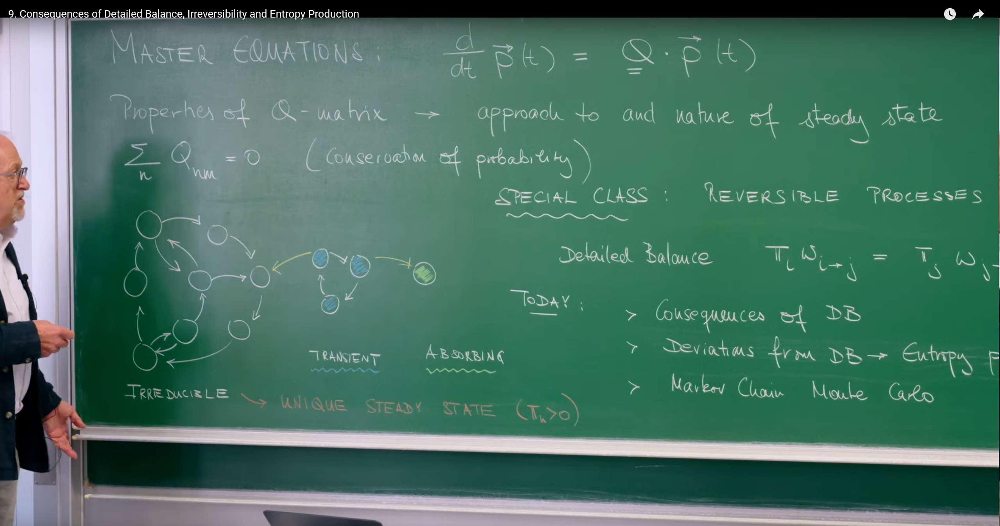
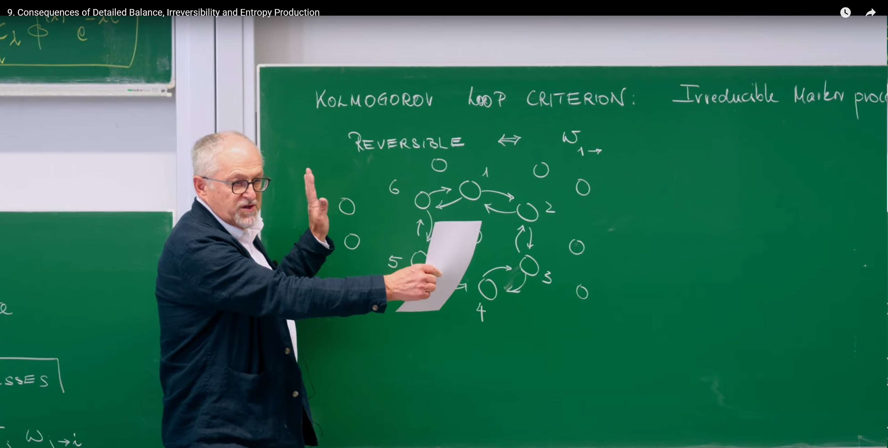
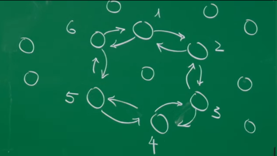
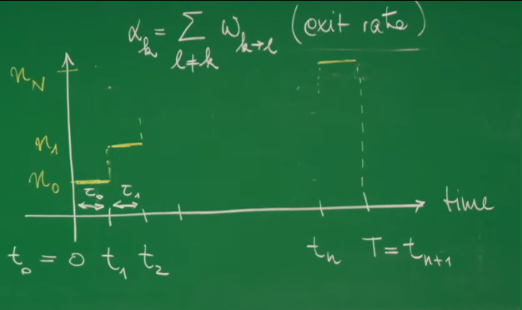
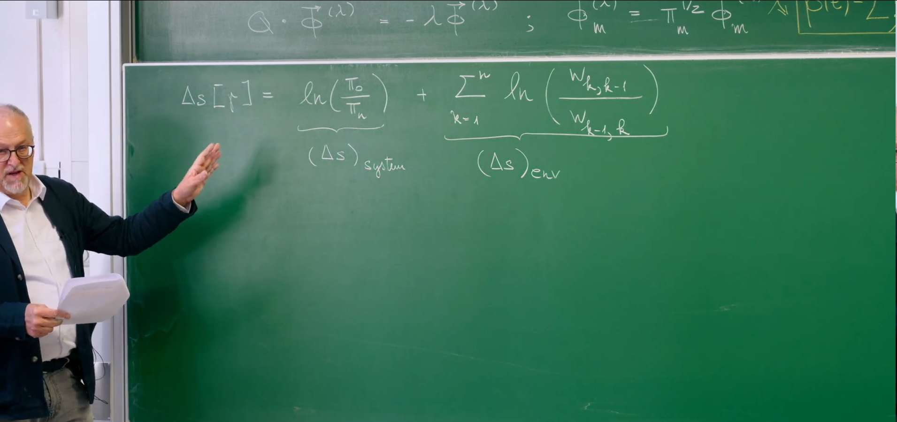
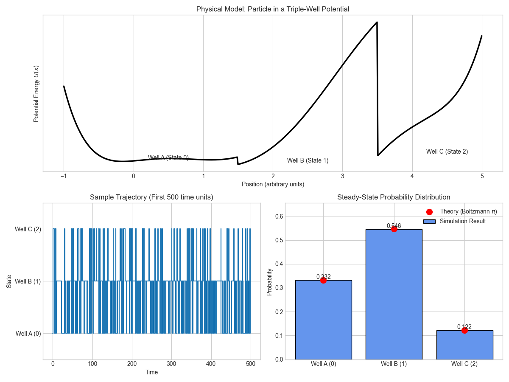
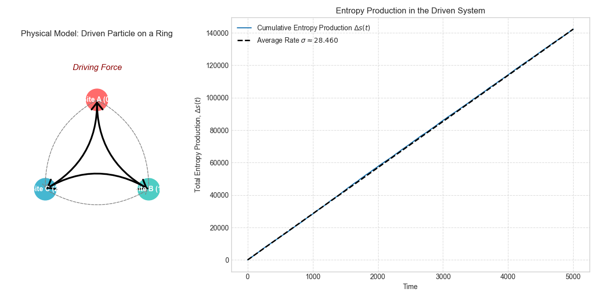

# Introduction

This lecture marks a key milestone in our study of stochastic processes. In previous lectures, we have established the master equation framework as the cornerstone that describes how probabilities evolve among states. Now, we move from simply describing "how" evolution happens to exploring the deeper physical "why" — the thermodynamic meaning behind these evolutions.

**We will step out of the ideal world of equilibrium and enter a broader, more real realm: nonequilibrium physics.** When detailed balance is broken, the system exhibits persistent probability currents, like steady water flow in a river. This unidirectional, irreversible flow is precisely the hallmark of living processes, chemical reactions, and all systems driven by external energy. We will learn how to start from a single stochastic trajectory, precisely quantify this irreversibility, and finally define entropy production. This quantity is the direct microscopic manifestation of the second law of thermodynamics in the random world.

This lecture serves as the crucial bridge connecting microscopic random events with the macroscopic "arrow of time."

The core theme of this lecture is to distinguish between two fundamentally different classes of stochastic processes.

## Reversible Process

This type of process is the microscopic manifestation of **thermodynamic equilibrium** in stochastic systems, with its core hallmark being the satisfaction of **detailed balance** conditions. In such systems, the "arrow" of time disappears; past and future are statistically indistinguishable.

We can understand its profound implications from the following aspects:

1) **Time symmetry**: Imagine recording the evolution trajectory of a reversible process with a camera, then playing the tape **backward**. From a statistical perspective, the reversed movie is indistinguishable from the forward one. For example, observing a single pollen grain (Brownian motion) in equilibrium water, it moves randomly and aimlessly in the water. Whether played forward or backward, we see the same chaotic random motion. This temporal symmetry is the most intuitive characteristic of reversible processes.

2) **Perfect microscopic balance (detailed balance)**: This macroscopic temporal symmetry stems from the perfect balance achieved between every independent process and its reverse at the microscopic level. This is precisely the mathematical expression of the **detailed balance condition**:

$$
\pi_j w_{j\to k} = \pi_k w_{k\to j}
$$

This formula tells us that in steady state, the total probability flux from any state $j$ to state $k$ (left side) is **precisely** canceled by the total probability flux from $k$ back to $j$ (right side). This balance occurs between **every pair** of directly connected states, not merely the macroscopic balance of the entire system.

1. **"Static" balance with no net cycles**: Since every "microscopic path" is perfectly balanced with its reverse, the system cannot have any persistent, net probability circulation. We can use a **lake** as an analogy: the lake water is in equilibrium with a constant macroscopic water level. At the microscopic level, water molecules are in constant motion, but the molecular flow from any point A to point B is precisely canceled by the molecular flow from point B to point A. The entire lake, while highly dynamic internally, has no net water flow macroscopically. This is precisely the essence of thermodynamic equilibrium — a seemingly "silent" but actually "bustling" dynamic balance at the microscopic level.

2. **Simple dynamical behavior**: As derived in the lecture, systems satisfying detailed balance have exceptionally "pure" dynamical evolution. The process of the system approaching equilibrium from any initial state is smooth, **non-oscillatory exponential relaxation**. This indicates that the system "slides" toward its most stable equilibrium state in the most direct, monotonic way, without complex periodic behavior.

## Irreversible Process

This type of process breaks the strict constraints of detailed balance and is the common characteristic of all active, energy-consuming **nonequilibrium systems**. It is precisely this imbalance that endows time with a clear direction — the origin of the "arrow of time" we experience in the microscopic world.

1) **Time asymmetry**: For an irreversible process, forward and backward movies are **completely different** statistically. Imagine a molecular motor inside a cell "walking" along microtubules, consuming energy provided by ATP and moving steadily in one direction. If we reverse this movie, we would see a molecular motor "walking" backward while "synthesizing" ATP in the process — this is physically impossible to occur spontaneously. This statistical asymmetry gives time a clear direction.

2) **Persistent microscopic currents**: The root of irreversibility lies in the breaking of detailed balance, i.e., $\pi_j w_{j\to k} \ne \pi_k w_{k\to j}$. This means there exists a **net probability current** between states $j$ and $k$. When these net currents form one or more closed cycles in the system (i.e., violating Kolmogorov's loop criterion), the system is in a **nonequilibrium steady state (NESS)**.

3) **Energy-driven "dynamic" balance**: We can use a **river** as an analogy for this state. The river's water level can be stable (steady state), but this requires continuous water inflow from upstream (energy input). At any cross-section of the river, inflow equals outflow (maintaining steady level), which corresponds to the weaker "global balance" condition compared to detailed balance. However, the river as a whole has a clear downstream direction with **net water flow**. Living systems, such as a living cell, are such highly ordered nonequilibrium steady states maintained by continuous metabolism (energy flow).

4) **Continuous entropy production**: This unidirectional, irreversible flow comes at a cost — the cost is **continuous entropy production**. As defined in the lecture, we can precisely quantify this irreversibility by comparing the probability of occurrence of a forward trajectory $\gamma$ with its reverse trajectory $\bar{\gamma}$. The logarithmic ratio, i.e., **entropy production** $\Delta s[\gamma] = \ln(P[\gamma]/P[\bar{\gamma}])$, is always non-negative. For a nonequilibrium steady state system, its **average entropy production rate** $\sigma$ is a positive constant, which measures the rate at which the system must "dissipate" energy to the environment to maintain its dynamic activity. This quantity is the most precise mathematical expression of the second law of thermodynamics at the stochastic process level.

# 1. Detailed Balance

The physical condition of thermal equilibrium imposes powerful constraints on the mathematical description of the system, making its dynamic behavior exceptionally concise and predictable.

## 1.1 Revisiting the Master Equation: Rules of the Game



The lecture begins by reviewing the master equation, which is the cornerstone of our entire theoretical framework.

$$
\frac{d\mathbf{p}(t)}{dt} = Q \cdot \mathbf{p}(t)
$$

This equation describes how probabilities evolve over time in a continuous-time Markov process. We can write it in component form to understand its physical meaning more clearly:

$$
\frac{dp_n(t)}{dt} = \sum_{m \neq n} (p_m(t) w_{m \to n} - p_n(t) w_{n \to m})
$$

**Physical meaning**: This form clearly shows that the change in probability $p_n(t)$ of state $n$ over time is determined by a "gain term" and a "loss term" together.

**Gain Term**: $\sum_{m \neq n} p_m(t) w_{m \to n}$ represents the total rate of transitions from all other states $m$ to state $n$.

**Loss Term**: $\sum_{m \neq n} p_n(t) w_{n \to m} = p_n(t) \sum_{m \neq n} w_{n \to m}$ represents the total rate of transitions from state $n$ to any other state.

Another important property of the Q-matrix is that its **column sums are zero**:

$$
\sum_n Q_{nm} = 0
$$

**Physical meaning**: This property is the mathematical embodiment of **probability conservation**. $Q_{mm} = -\sum_{n \neq m} w_{m \to n}$ is the total rate of outflow from state $m$, while $\sum_{n \neq m} Q_{nm} = \sum_{n \neq m} w_{m \to n}$ is the total rate of inflow to all other states. Their sum being zero means that after a particle leaves state $m$, it must enter some other state $n$, keeping the total probability constant at 1.

## 1.2 Detailed Balance Principle: Hallmark of Equilibrium

For a special class of processes, namely **reversible processes**, the system reaches a very special steady state defined by the **detailed balance (DB)** condition.

$$
\pi_i w_{i \to j} = \pi_j w_{j \to i}
$$

$\pi_i$ and $\pi_j$ are the steady-state probabilities of the system being in states $i$ and $j$.
$w_{i \to j}$ is the transition rate from $i$ to $j$.
$\pi_i w_{i \to j}$ is the **probability flux** from state $i$ to state $j$ per unit time in steady state.

**Physical meaning**: Detailed balance is not merely a mathematical formula; it is a profound physical statement, namely the **principle of microscopic reversibility**. In thermal equilibrium, the probability flux between any two states is bidirectional and perfectly equal. The flux from $i$ to $j$ is precisely canceled by the flux from $j$ to $i$. This means the net probability flux $J_{ij} = \pi_i w_{i \to j} - \pi_j w_{j \to i}$ is precisely zero for all state pairs $(i,j)$. We can liken this to a busy two-way street where the number of vehicles traveling north exactly equals the number traveling south, resulting in no net traffic flow.

### Important Distinction: Detailed Balance Is Sufficient But Not Necessary for Steady State

**Steady state** is defined as the probability distribution not changing over time, i.e., $\frac{d\mathbf{p}(t)}{dt} = 0$, which is $Q \cdot \boldsymbol{\pi} = 0$.

**Detailed balance** is a stronger condition. If detailed balance holds, we can prove that the steady-state condition must also hold. However, the converse is not necessarily true. A system can be in a steady state with constant probability distribution but with persistent, non-zero net probability flows internally. This state is called a **nonequilibrium steady state (NESS)**, which we will explore in detail in the second part.

Therefore, detailed balance defines a special subset of all steady states — **equilibrium states**.

## 1.3 The Power of Symmetry: Simplifying System Dynamics

A powerful corollary of the detailed balance condition is that it allows us to **symmetrize** the usually asymmetric Q-matrix through a similarity transformation. Define a new matrix $\tilde{Q}$:

$$
\tilde{Q}_{mn} := \pi_m^{-1/2} Q_{mn} \pi_n^{1/2}
$$

If the system satisfies detailed balance, then this new $\tilde{Q}$ matrix is **symmetric**, i.e., $\tilde{Q}_{mn} = \tilde{Q}_{nm}$.

**Derivation process**:

For off-diagonal elements ($m \neq n$), we have $Q_{mn} = w_{n \to m}$.

$$
\tilde{Q}_{mn} = \pi_m^{-1/2} w_{n \to m} \pi_n^{1/2}
$$

Using the detailed balance condition $w_{n \to m} = w_{m \to n} \frac{\pi_n}{\pi_m}$, substituting into the above:

$$
\tilde{Q}_{mn} = \pi_m^{-1/2} (w_{m \to n} \frac{\pi_n}{\pi_m}) \pi_n^{1/2} = \pi_m^{1/2} w_{m \to n} \pi_n^{-1/2}
$$

On the other hand, we calculate $\tilde{Q}_{nm}$:

$$
\tilde{Q}_{nm} = \pi_n^{-1/2} Q_{nm} \pi_m^{1/2} = \pi_n^{-1/2} w_{m \to n} \pi_m^{1/2}
$$

Comparing the two expressions, we find $\tilde{Q}_{mn} = \tilde{Q}_{nm}$, proving its symmetry.

Why is this mathematical "trick" so important? Because it reveals the profound physical properties of equilibrium system dynamics:

1. **Real eigenvalues**: Symmetric matrices (or more generally, Hermitian matrices) guarantee that all their eigenvalues are real. In our problem, the eigenvalues of the Q-matrix are $-\lambda$. This means the relaxation rates $\lambda$ are all real.

2. **Non-oscillatory relaxation**: Real eigenvalues mean that the system's evolution toward equilibrium is pure exponential decay without oscillation. The general solution of the master equation can be written as a superposition of eigenmodes:
$$
p(t) = \sum_{\lambda} c_{\lambda} \Phi(\lambda) e^{-\lambda t}
$$

where $\lambda > 0$ (for non-steady modes), representing that the relaxation process from any initial state to the unique steady state $\boldsymbol{\pi}$ (corresponding to the $\lambda = 0$ mode) is smooth and non-oscillatory.

3. **Orthogonal basis**: The eigenvectors of symmetric matrices form a complete orthogonal basis. This means any initial probability distribution can be uniquely decomposed into a linear combination of these fundamental "relaxation modes."

In summary, the symmetrizability of the Q-matrix is the mathematical manifestation of the absence of intrinsic cyclic dynamics in equilibrium systems, connecting abstract Markov processes with the physics of conservative systems.

## 1.4 Kolmogorov's Loop Criterion: An Intuitive Equilibrium Test





In addition to the algebraic form of the detailed balance condition, there is an equivalent, more intuitive geometric criterion — **Kolmogorov's Loop Criterion**. This criterion states that an irreducible Markov process is reversible (i.e., satisfies detailed balance) if and only if for **any closed loop** in the state space, the product of transition rates in the clockwise direction equals the product of transition rates in the counter-clockwise direction.

$$w_{1 \to 2} w_{2 \to 3} \cdots w_{N \to 1} = w_{1 \to N} w_{N \to N-1} \cdots w_{2 \to 1}$$

**Intuitive understanding**: Taking a simple three-state system $\{1, 2, 3\}$ as an example, this criterion requires:

$$
w_{1 \to 2} w_{2 \to 3} w_{3 \to 1} = w_{2 \to 1} w_{3 \to 2} w_{1 \to 3}
$$

If this equality fails (e.g., clockwise product > counter-clockwise), it means there is a persistent, clockwise **net probability circulation** in the system. This net circulation is the fundamental hallmark of irreversibility. The existence of even a single loop violating this criterion implies that the system must be in a nonequilibrium state, requiring external energy input to maintain its steady state.

This criterion provides us with a powerful visual tool that directly connects irreversibility with "cycles" in the state space, laying the conceptual foundation for our subsequent quantification of entropy production and fluxes.

# 2. Beyond Equilibrium — Irreversibility and the Arrow of Time

In this section, we will bid farewell to the simple world of equilibrium and enter the more universal realm of nonequilibrium. These systems are active, dynamic, and have a clear direction of time. Our goal is to quantify this "**directionality**."

## 2.1 When Equilibrium Is Broken: NESS

When the detailed balance condition is not satisfied, the system can still reach a steady state, where the probability distribution does not change over time $\frac{d\mathbf{p}(t)}{dt} = 0$. However, at this point, the system has persistent, non-zero net probability currents $J_{ij} = \pi_i w_{i \to j} - \pi_j w_{j \to i} \neq 0$ internally. This is a **nonequilibrium steady state (NESS)**.

An excellent analogy is a fountain: the water level (corresponding to probability) remains constant, but this is not because the water is still. Instead, a pump continuously lifts water to a high place, and it continuously flows back into the pool. This process maintains a dynamic balance, requiring continuous energy input (pump work) to resist gravity (dissipation). Similarly, living systems, circuits, and all molecular machines that perform functions operate in NESS states.

## 2.2 Forward and Backward Trajectories

To quantify irreversibility, we need to compare the probability of occurrence of a **forward trajectory** of the system evolution with its **time-reversed backward trajectory**.



First, define a forward trajectory $\gamma$ as a sequence of states and dwell times:

$$\gamma: 0 \xrightarrow{\tau_1} 1 \xrightarrow{\tau_2} \cdots \xrightarrow{\tau_n} n$$

How is the probability (strictly speaking, probability density) $P[\gamma]$ of this trajectory constructed? It is composed of the product of a series of event probabilities:

1. **Initial probability**: First, the probability that the system is in state $0$ at time $t=0$ is $\pi_0$.

2. **Waiting probability**: The probability of staying in state $k$ for time $\tau_k$ without jumping. This is a Poisson process with probability $e^{-\alpha_k \tau_k}$, where $\alpha_k = \sum_{\ell \neq k} w_{k \to \ell}$ is the total rate of leaving state $k$, also called the **exit rate**.

3. **Jump probability**: The probability of a jump from $k$ to $k+1$ is proportional to the transition rate $w_{k \to k+1}$.

Combining these parts, we get the probability of the forward trajectory:

$$P[\gamma] = \pi_0 \cdot e^{-\alpha_0 \tau_0} \cdot w_{0 \to 1} \cdot e^{-\alpha_1 \tau_1} \cdot w_{1 \to 2} \cdots w_{n-1 \to n} \cdot e^{-\alpha_n \tau_n}$$

Similarly, we can define the time-reversed trajectory $\bar{\gamma}$, which starts from state $n$ and traverses the same states in reverse order back to state $0$. Its probability is:

$$P[\bar{\gamma}] = \pi_n \cdot e^{-\alpha_n \tau_n} \cdot w_{n \to n-1} \cdots w_{1 \to 0} \cdot e^{-\alpha_0 \tau_0}$$

## 2.3 Quantifying Irreversibility: Entropy Produced Along a Path

The core of irreversibility lies in the fact that forward and reverse trajectories no longer have equal probabilities. We can quantify this asymmetry by calculating their ratio:

$$\frac{P[\bar{\gamma}]}{P[\gamma]} = \frac{\pi_n e^{-\alpha_n \tau_n} w_{n \to n-1} \cdots w_{1 \to 0} e^{-\alpha_0 \tau_0}}{\pi_0 e^{-\alpha_0 \tau_0} w_{0 \to 1} \cdots w_{n-1 \to n} e^{-\alpha_n \tau_n}}$$

A very profound result is that all exponential terms $e^{-\alpha_k \tau_k}$ related to waiting times are precisely canceled out! This tells us that the root of irreversibility (and subsequently defined entropy production) lies in **jumps between states**, not in waiting in a particular state.

After simplification, we get:

$$\frac{P[\bar{\gamma}]}{P[\gamma]} = \frac{\pi_n}{\pi_0} \cdot \frac{w_{n \to n-1} w_{n-1 \to n-2} \cdots w_{1 \to 0}}{w_{0 \to 1} w_{1 \to 2} \cdots w_{n-1 \to n}}$$

Based on this ratio, we can define the **total entropy production** $\Delta s[\gamma]$ along trajectory $\gamma$:

$$\Delta s[\gamma] = \ln \frac{P[\bar{\gamma}]}{P[\gamma]}$$

This logarithmic ratio form is not accidental; it has a deep connection with the **relative entropy (Kullback-Leibler Divergence)** in information theory.

**Physical meaning**: $\Delta s[\gamma]$ quantifies our ability to distinguish forward from reverse trajectories.

- If $\Delta s[\gamma] \gg 0$, it means $P[\gamma] \gg P[\bar{\gamma}]$, indicating that the forward process is much more likely to occur than the reverse process, giving a very clear direction to the arrow of time.

- If the system satisfies detailed balance, then on average, this ratio would be 1, and $\Delta s[\gamma]$ would fluctuate around 0, indicating that the process is time-symmetric.

**Information theory perspective**: Entropy production can be viewed as the amount of information we gain by observing a trajectory to determine the direction of time flow. An irreversible process continuously produces information, thereby distinguishing past from future.

## 2.4 Decomposing Entropy: System and Environment



The total entropy production can be decomposed into two parts with clear physical meaning:

$$\Delta s[\gamma] = \ln\left(\frac{\pi_n}{\pi_0}\right) + \sum_{k=1}^{n} \ln\left(\frac{w_{k \to k-1}}{w_{k-1 \to k}}\right)$$

We define these two terms as:

1. **System entropy change**:

$$
(\Delta s)_{\text{system}} = \ln\left(\frac{\pi_n}{\pi_0}\right) = -\ln \pi_n - (-\ln \pi_0)
$$

This term depends only on the initial and final states of the trajectory, independent of the intermediate path taken. This is the typical characteristic of a **state function**. It represents the change in the system's own information entropy (in the form of Boltzmann entropy $S = -k_B \ln p$).

2. **Environment entropy change**:

$$
(\Delta s)_{\text{env}} = \sum_{k=1}^{n} \ln\left(\frac{w_{k \to k-1}}{w_{k-1 \to k}}\right)
$$

This term is the sum of contributions from each jump step in the trajectory. If we take a different path from state 0 to state n, this value would change. This is the characteristic of a **path function**, similar to heat and work in classical thermodynamics. It represents the entropy exchanged between the system and environment (usually in the form of heat) to drive this trajectory to occur.

This decomposition is the cornerstone of stochastic thermodynamics, providing a precise restatement of the macroscopic second law of thermodynamics at the level of single microscopic trajectories:

$$
\Delta s_{\text{total}} = \Delta s_{\text{sys}} + \Delta s_{\text{env}}
$$

## 2.5 Mean Entropy Production Rate $\sigma$

For a system in a nonequilibrium steady state (NESS), we are more concerned with its long-term, sustained entropy production capability. This is measured by the **average entropy production rate** $\sigma$.

$$\sigma = \lim_{T \to \infty} \frac{1}{T} \langle \Delta s[\gamma] \rangle$$

Here $\langle \cdot \rangle$ represents averaging over all possible trajectories that can occur within time $T$. In the long-time limit, the contribution of system entropy change $(\Delta s)_{\text{system}}$ will be averaged out because it depends only on the initial and final states, and the environment entropy change dominates.

After derivation, we obtain an extremely elegant final expression:

$$
\sigma = \frac{1}{2} \sum_{i,j} (\pi_i w_{i \to j} - \pi_j w_{j \to i}) \ln\left(\frac{\pi_j w_{j \to i}}{\pi_i w_{i \to j}}\right)
$$

This formula can also be written as:

$$
\sigma = \sum_{i < j} J_{ij} \ln \left( \frac{w_{i \to j}}{w_{j \to i}} \right)
$$

**Profound physical structure**: This expression has the universal structure of **(flux) × (thermodynamic force)**, which is the core of the dissipation theory for all irreversible processes.

**Flux**: $J_{ij} = \pi_i w_{i \to j} - \pi_j w_{j \to i}$ is the net probability current between states.

**Thermodynamic Force**: $A_{ij} = \ln\left(\frac{w_{j \to i}}{w_{i \to j}}\right)$ is the "**force**" that drives the generation of this flux.

**Non-negativity**: Using the inequality $(x-y)\ln(x/y) \geq 0$, we can prove that $\sigma \geq 0$. The equality holds if and only if, for all state pairs $(i,j)$, the net flux $J_{ij} = 0$. This is precisely the condition for detailed balance.

Therefore, any system that deviates from thermal equilibrium (any NESS) must necessarily be a "machine" that continuously produces entropy. $\sigma$ is the inevitable thermodynamic cost that must be paid to maintain its nonequilibrium structure and function.

# 3. Python Simulation

## 3.1 Simulating a Reversible System: Thermal Motion of a Particle in a Triple-Well

Imagine a microscopic particle (such as a colloidal particle) immersed in a constant-temperature heat bath and constrained to move within a "potential well" system with three stable depths. Due to random collisions from surrounding liquid molecules (thermal fluctuations), this particle has sufficient energy to jump over the "energy barriers" between wells, thus randomly transitioning between three states (**Well A**, **Well B**, **Well C**). Since the entire system is in equilibrium with a single-temperature heat bath, it must satisfy the detailed balance condition and is a perfect reversible process.

**Implementation approach**:

1. **Construct energy landscape**: We set the energy depths of three wells ($E_A, E_B, E_C$) and the heights of energy barriers between them.

2. **Calculate rates**: The transition rates are given by **Arrhenius law**, meaning it is much easier to jump from a deep well to a shallow well than the reverse process. The rate from state $i$ to $j$ is $w_{i \to j} \propto \exp(-\frac{\Delta E_{\text{barrier}}}{k_B T})$.

3. **Theoretical steady state**: In thermal equilibrium, the probability of finding the particle in each well follows the **Boltzmann distribution**, i.e., $\pi_i \propto \exp(-\frac{E_i}{k_B T})$. The lower the energy of the well, the higher the probability of the particle staying in it.

4. **Analysis and verification**: We will run Gillespie simulations and verify that the trajectories have no net circulation statistically and that the final occupancy probabilities converge precisely to the theoretical Boltzmann distribution.

```python
import numpy as np
import matplotlib.pyplot as plt
from collections import Counter

def gillespie_simulation(Q, initial_state, T_max):
    """
    Simulates a continuous-time Markov process using the Gillespie algorithm.
    Args:
        Q (np.array): Transition rate matrix (Q_ij = w_j->i).
        initial_state (int): Starting state.
        T_max (float): Maximum simulation time.
    Returns:
        tuple: (times, states, transitions)
    """
    num_states = Q.shape[0]
    states = np.arange(num_states)
    current_state = initial_state; t = 0.0
    time_points = [t]; state_trajectory = [current_state]; transitions = []
    while t < T_max:
        rates_out = np.array([Q[j, current_state] for j in states if j != current_state])
        total_rate_out = np.sum(rates_out)
        if total_rate_out == 0: break
        dt = np.random.exponential(1.0 / total_rate_out)
        t += dt
        if t >= T_max: break
        possible_next = [j for j in states if j != current_state]
        next_state = np.random.choice(possible_next, p=rates_out/total_rate_out)
        transitions.append((current_state, next_state))
        current_state = next_state
        time_points.append(t); state_trajectory.append(current_state)
    return time_points, state_trajectory, transitions

print("--- Simulating Reversible System (Thermal Equilibrium) ---")
E = np.array([-1.5, -2.0, -0.5])
E_barrier_base = 0.5; prefactor = 1.0
Z = np.sum(np.exp(-E)); pi_theory = np.exp(-E) / Z

rates = {}
rates[(0,1)] = prefactor * np.exp(-(E_barrier_base + max(E[0], E[1]) - E[0]))
rates[(1,0)] = prefactor * np.exp(-(E_barrier_base + max(E[0], E[1]) - E[1]))
rates[(1,2)] = prefactor * np.exp(-(E_barrier_base + max(E[1], E[2]) - E[1]))
rates[(2,1)] = prefactor * np.exp(-(E_barrier_base + max(E[1], E[2]) - E[2]))
rates[(2,0)] = prefactor * np.exp(-(E_barrier_base + max(E[2], E[0]) - E[2]))
rates[(0,2)] = prefactor * np.exp(-(E_barrier_base + max(E[2], E[0]) - E[0]))

Q_rev = np.zeros((3,3))
for (i,j), rate in rates.items(): Q_rev[j,i] = rate
for i in range(3): Q_rev[i,i] = -np.sum(Q_rev[:,i])

prod_cw  = rates[(0,1)]*rates[(1,2)]*rates[(2,0)]
prod_ccw = rates[(0,2)]*rates[(2,1)]*rates[(1,0)]
print("Kolmogorov's Loop Criterion Check:")
print(f"  Clockwise rate product = {prod_cw:.4f}")
print(f"  Counter-clockwise rate product = {prod_ccw:.4f}")
print(f"  Ratio (should be 1.0): {prod_cw/prod_ccw:.4f}\n")

T_max_rev = 200000
times, states, transitions = gillespie_simulation(Q_rev, 0, T_max_rev)

from collections import Counter
cnt = Counter(transitions)
cw  = cnt.get((0,1),0)+cnt.get((1,2),0)+cnt.get((2,0),0)
ccw = cnt.get((0,2),0)+cnt.get((2,1),0)+cnt.get((1,0),0)
print(f"In a simulation of T={T_max_rev}:")
print(f"  Total clockwise jumps: {cw}")
print(f"  Total counter-clockwise jumps: {ccw}")
print("The counts are very close, indicating no net probability flux.\n")

occupancy = np.zeros(3)
for i in range(len(times)-1): occupancy[states[i]] += times[i+1]-times[i]
occupancy[states[-1]] += T_max_rev - times[-1]
pi_sim = occupancy / T_max_rev
print("Steady-State Distribution (Boltzmann) Comparison:")
print(f"  Theoretical pi = {np.round(pi_theory,4)}")
print(f"  Simulated pi   = {np.round(pi_sim,4)}")

plt.style.use('seaborn-v0_8-whitegrid')
fig = plt.figure(figsize=(12,9)); gs = fig.add_gridspec(2,2)
ax1 = fig.add_subplot(gs[0,:])
x = np.linspace(-1,5,500)
U = 0.1*(x**6 - 12*x**5 + 47*x**4 - 60*x**3 + 16*x**2 + 10*x)
U -= np.min(U)
U[x<1.5] += E[0]-np.min(U[x<1.5])+2.5
U[(x>=1.5)&(x<=3.5)] += E[1]-np.min(U[(x>=1.5)&(x<=3.5)])+2.5
U[x>3.5] += E[2]-np.min(U[x>3.5])+2.5
ax1.plot(x,U,color='black',linewidth=2.5)
ax1.set_title('Physical Model: Particle in a Triple-Well Potential')
ax1.set_xlabel('Position (arbitrary units)'); ax1.set_ylabel(r'Potential Energy $U(x)$')
ax1.text(0.5, E[0]+2.8, 'Well A (State 0)', ha='center')
ax1.text(2.5, E[1]+2.8, 'Well B (State 1)', ha='center')
ax1.text(4.5, E[2]+2.8, 'Well C (State 2)', ha='center')
ax1.set_yticks([])

ax2 = fig.add_subplot(gs[1,0])
labels = ['Well A (0)','Well B (1)','Well C (2)']
limit = min(500, T_max_rev); idx = np.where(np.array(times) <= limit)
ax2.step(np.array(times)[idx], np.array(states)[idx], where='post')
ax2.set_title(f'Sample Trajectory (First {limit} time units)')
ax2.set_xlabel('Time'); ax2.set_ylabel('State')
ax2.set_yticks([0,1,2]); ax2.set_yticklabels(labels); ax2.set_ylim(-0.5,2.5)

ax3 = fig.add_subplot(gs[1,1])
ax3.bar(labels, pi_sim, color='cornflowerblue', edgecolor='black', label='Simulation Result')
ax3.plot(labels, pi_theory, 'ro', markersize=10, label=r'Theory (Boltzmann $\pi$)')
ax3.set_title('Steady-State Probability Distribution')
ax3.set_ylabel('Probability'); ax3.legend()
plt.tight_layout(); plt.show()
```

Code execution output:

```text
--- Simulating Reversible System (Thermal Equilibrium) ---
Kolmogorov's Loop Criterion Check:
  Clockwise rate product = 0.0498
  Counter-clockwise rate product = 0.0498
  Ratio (should be 1.0): 1.0000

In a simulation of T=200000:
  Total clockwise jumps: 69792
  Total counter-clockwise jumps: 69734
The counts are very close, indicating no net probability flux.

Steady-State Distribution (Boltzmann) Comparison:
  Theoretical pi = [0.3315 0.5465 0.122 ]
  Simulated pi   = [0.3318 0.5461 0.122 ]
```



Top: the energy landscape with three wells (B deepest, C shallowest). Bottom‑left: a sample trajectory (thermal hopping). Bottom‑right: simulated steady distribution (bars) matches the Boltzmann prediction (red dots).

## 3.2 Simulating an Irreversible System: Driven Ring

**Physical model**: Imagine a charged particle confined to three discrete sites (**Site A**, **Site B**, **Site C**) arranged in a ring. Now, we apply a constant circular electric field (non-conservative force). This field drives the charged particle to preferentially move in one direction (e.g., clockwise). Although thermal fluctuations still allow the particle to occasionally "go against the current," there will be an overall persistent net particle flow. This system must continuously draw energy from the external electric field to maintain this steady "current" and dissipate it as heat, making it a typical nonequilibrium steady state (NESS).

**Implementation approach**:

1. **Build model**: We directly set the clockwise jump rate ($w_{cw}$) to be much greater than the counter-clockwise rate ($w_{ccw}$) to simulate the external driving force.

2. **Verification and simulation**: This rate setting clearly violates Kolmogorov's criterion. We run Gillespie simulations.

3. **Analysis**:
   - Count clockwise vs counter-clockwise jumps, expecting to observe a huge difference, which is evidence of **net probability current**.
   - Calculate and plot the **cumulative entropy production** over time. For this driven system, the curve should grow linearly, with its slope being the average entropy production rate $\sigma$.

```python
import numpy as np
import matplotlib.pyplot as plt
from collections import Counter
import matplotlib.patches as patches

def gillespie_simulation(Q, initial_state, T_max):
    """Simulates a continuous-time Markov process using the Gillespie algorithm."""
    num_states = Q.shape[0]; states = np.arange(num_states)
    current_state = initial_state; t = 0.0
    time_points=[t]; state_traj=[current_state]; transitions=[]
    while t < T_max:
        rates_out = np.array([Q[j, current_state] for j in states if j != current_state])
        tot = np.sum(rates_out)
        if tot == 0: break
        dt = np.random.exponential(1.0/tot); t += dt
        if t >= T_max: break
        next_state = np.random.choice([j for j in states if j != current_state], p=rates_out/tot)
        transitions.append((current_state,next_state)); current_state=next_state
        time_points.append(t); state_traj.append(current_state)
    return time_points, state_traj, transitions

print("--- Simulating Irreversible System (Non-Equilibrium Steady State) ---")
Q_irrev = np.zeros((3,3))
w_cw, w_ccw = 10.0, 0.5
w01_i, w12_i, w20_i = w_cw, w_cw, w_cw
w10_i, w21_i, w02_i = w_ccw, w_ccw, w_ccw
Q_irrev[1,0]=w01_i; Q_irrev[0,1]=w10_i
Q_irrev[2,1]=w12_i; Q_irrev[1,2]=w21_i
Q_irrev[0,2]=w20_i; Q_irrev[2,0]=w02_i
for i in range(3): Q_irrev[i,i] = -np.sum(Q_irrev[:,i])
prod_cw  = w01_i*w12_i*w20_i
prod_ccw = w02_i*w21_i*w10_i
print("Kolmogorov's Loop Criterion Check:")
print(f"  Clockwise rate product = {prod_cw:.4f}")
print(f"  Counter-clockwise rate product = {prod_ccw:.4f}")
print("The products are unequal, confirming the system is irreversible.\n")

T=5000
times, states, transitions = gillespie_simulation(Q_irrev, 0, T)
cnt = Counter(transitions)
cw  = cnt.get((0,1),0)+cnt.get((1,2),0)+cnt.get((2,0),0)
ccw = cnt.get((0,2),0)+cnt.get((2,1),0)+cnt.get((1,0),0)
print(f"In a simulation of T={T}:")
print(f"  Total clockwise jumps: {cw}")
print(f"  Total counter-clockwise jumps: {ccw}")
print("A strong net clockwise probability current is observed.\n")

# Cumulative entropy production
entropy_times = [0.0]; cumulative_entropy = [0.0]
avg_sigma = 0.0
for (i,j) in transitions:
    # local increment: ln(w_{i->j}/w_{j->i})
    inc = np.log(Q_irrev[j,i]/Q_irrev[i,j]) if Q_irrev[i,j] > 0 else 0.0
    cumulative_entropy.append(cumulative_entropy[-1] + inc)
entropy_times.extend(times[1:])
avg_sigma = cumulative_entropy[-1]/entropy_times[-1] if entropy_times[-1] > 0 else 0.0

fig = plt.figure(figsize=(12,6)); gs = fig.add_gridspec(1,2)
ax1 = fig.add_subplot(gs[0])
pos = {0:(0,0),1:(1,0),2:(0.5,0.866)}
for s,(x,y) in pos.items(): ax1.plot(x,y,'ko'); ax1.text(x,y+0.08,f'State {s}',ha='center')
# Clockwise (strong)
ax1.add_patch(patches.FancyArrowPatch(pos[0], pos[1], connectionstyle="arc3,rad=.3", color="black", arrowstyle='->,head_length=10,head_width=8', linewidth=2.5))
ax1.add_patch(patches.FancyArrowPatch(pos[1], pos[2], connectionstyle="arc3,rad=.3", color="black", arrowstyle='->,head_length=10,head_width=8', linewidth=2.5))
ax1.add_patch(patches.FancyArrowPatch(pos[2], pos[0], connectionstyle="arc3,rad=.3", color="black", arrowstyle='->,head_length=10,head_width=8', linewidth=2.5))
# Counter-clockwise (weak)
ax1.add_patch(patches.FancyArrowPatch(pos[1], pos[0], connectionstyle="arc3,rad=.3", color="gray", arrowstyle='->,head_length=5,head_width=4', linewidth=1, linestyle='--'))
ax1.add_patch(patches.FancyArrowPatch(pos[2], pos[1], connectionstyle="arc3,rad=.3", color="gray", arrowstyle='->,head_length=5,head_width=4', linewidth=1, linestyle='--'))
ax1.add_patch(patches.FancyArrowPatch(pos[0], pos[2], connectionstyle="arc3,rad=.3", color="gray", arrowstyle='->,head_length=5,head_width=4', linewidth=1, linestyle='--'))
ax1.text(0, 1.5, 'Driving Force', ha='center', fontsize=12, style='italic', color='darkred')
ax1.set_xlim(-1.5,1.5); ax1.set_ylim(-1.5,2.0); ax1.set_aspect('equal'); ax1.axis('off')
ax1.set_title('Physical Model: Driven Particle on a Ring')

ax2 = fig.add_subplot(gs[1])
ax2.plot(entropy_times, cumulative_entropy, '-', label=r'Cumulative Entropy Production $\Delta s(t)$')
ax2.plot(entropy_times, avg_sigma*np.array(entropy_times), 'k--', linewidth=2, label=fr'Average Rate $\sigma \approx {avg_sigma:.3f}$')
ax2.set_title('Entropy Production in the Driven System')
ax2.set_xlabel('Time'); ax2.set_ylabel(r'Total Entropy Production, $\Delta s(t)$')
ax2.legend(); ax2.grid(True, linestyle='--', alpha=0.7)
plt.tight_layout(); plt.show()
```

Code execution output

```text
--- Simulating Irreversible System (Non-Equilibrium Steady State) ---
Kolmogorov's Loop Criterion Check:
  Clockwise rate product = 1000.0000
  Counter-clockwise rate product = 0.1250
The products are unequal, confirming the system is irreversible.

In a simulation of T=5000:
  Total clockwise jumps: 50008
  Total counter-clockwise jumps: 2508
A strong net clockwise probability current is observed.

Simulated average entropy production rate (sigma) ~ 28.4600
```



Left: the driven ring (strong clockwise arrows, weak counter‑clockwise dashed arrows). Right: cumulative entropy production grows roughly linearly; the slope is the average production rate $\sigma$.

# Conclusion

This lecture formally leads us from equilibrium to nonequilibrium physics. The key points of this section are as follows:

**Equilibrium** is defined by **detailed balance**, characterized by no net probability flows ($J_{ij} = 0$), zero average entropy production rate ($\sigma = 0$), and time-reversible dynamics. Its mathematical simplicity (Q-matrix symmetrizability) reflects its physical "silence."

**Nonequilibrium** breaks detailed balance, characterized by persistent net probability flows ($J_{ij} \neq 0$), strictly positive entropy production rate ($\sigma > 0$), and thus a clear direction of time.

By introducing the concept of trajectory entropy, we can precisely define and quantify thermodynamic quantities at the microscopic level of single molecules and single trajectories, such as system entropy, environment entropy, and total entropy production. The final average entropy production rate formula $\sigma = \sum J \cdot A$ reveals the universal structure of all dissipative processes.

These concepts are far from theoretical abstractions; they are the fundamental grammar for understanding the dynamic world we inhabit. The continuous production of entropy is the inevitable physical cost that all processes with functionality and directionality must pay. We see it driving life itself at the microscopic scale: it is the energy consumption of molecular motors inside cells dragging cargo along tracks, the fundamental mechanism of ion pumps working against concentration gradients to maintain neural electrical potentials, and the foundation of entire metabolic networks converting food into ordered biological structures. At the macroscopic scale, it is equally ubiquitous: it is the reason computers must dissipate heat when processing information, the manifestation of chemical reactions (such as combustion) irreversibly releasing energy, the hallmark of electric current flowing stably in circuits, and even the engine of solar energy driving Earth's weather systems to form magnificent storms.

Ultimately, this reveals a profound truth of physics: any system that wants to maintain its complex structure and function while staying far from "heat death" (i.e., perfect equilibrium) must continuously draw energy from the environment and dissipate it in the form of entropy. In the nonequilibrium world, entropy production is not merely a sign of chaos and decay; it is the prerequisite for complexity, functionality, and even life itself.
