这是课程 [**非平衡场论与随机动力学** **Nonequilibrium Field Theories and Stochastic Dynamics, Prof. Erwin Frey, LMU Munich, Summer Semester 2025**](https://www.theorie.physik.uni-muenchen.de/lsfrey/teaching/index.html)的自学笔记。[**Erwin Frey 教授**](https://www.theorie.physik.uni-muenchen.de/lsfrey/members/group_leaders/erwin_frey/index.html)喜欢在黑板上写板书，为记录学习过程，将所学笔记整理为文，并撰写python代码加深理解。共计40章学习笔记，本章是课程的导论。

**注：**需要说明的是，本人只在Youtube上学习该课程，并没有讲义，都是先听课做笔记，再撰文章，原始笔记示例如下：

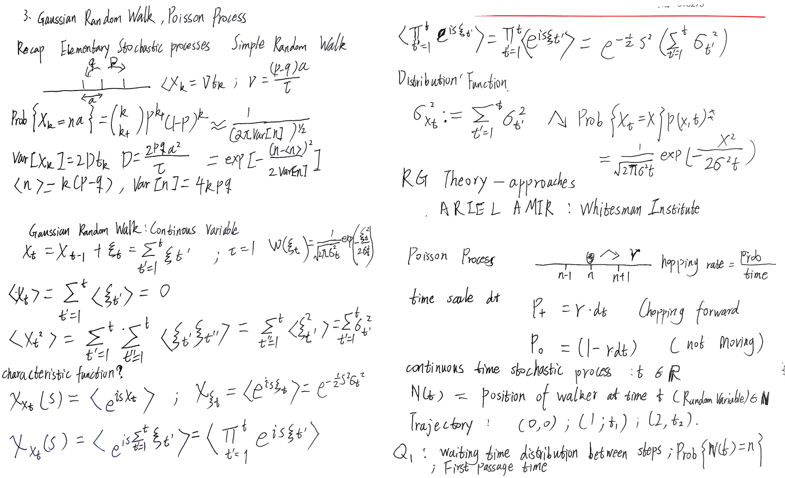

# 课程简介

这门课介绍非平衡场论和随机动力学的基本原理和高级概念，重点关注粒子和场系统中的随机过程，特别是朗之万方程、福克-普朗克方程和路径积分等数学形式。

内容涵盖从基础随机过程理论到现代非平衡场论方法的完整知识体系，包括动态泛函和涨落定理等高级理论方法。特别关注Kardar-Parisi-Zhang方程，该方程描述了非平衡生长过程的普适性特征。此外，还将探讨活性物质系统，其中集体行为从非平衡相互作用中涌现。

应用领域包括软物质物理、活性物质和非平衡统计力学，为理解从生物过程到湍流流体等复杂系统提供理论基础。学习路径从基础随机模型开始，逐步深入马尔可夫过程的基本方程，最终探索包括动态泛函和涨落定理在内的高级场论方法。

## 教学理念

Erwin Frey 教授在教学这门课中将遵循以下四个教学理念：

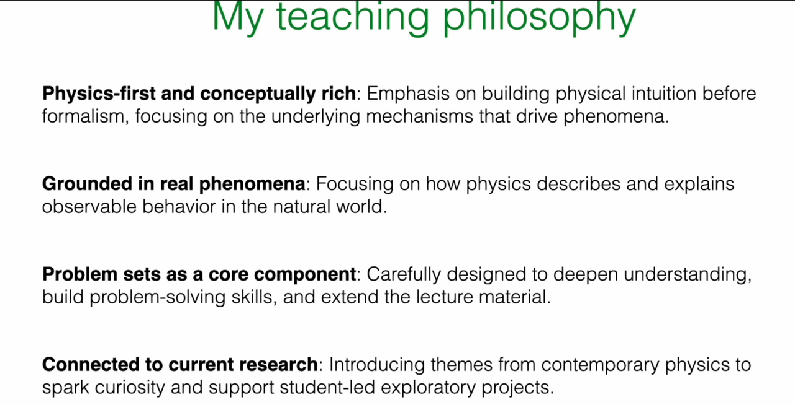

* **物理优先，概念丰富 (Physics-first and conceptually rich)**: 课程强调在引入数学形式之前建立物理直觉，注重理解现象背后的物理机制而非单纯的数学操作。教学内容从具体物理问题出发，逐步引导至相应的理论框架。

* **植根于真实物理现象 (Grounded in real phenomena)**: 课程内容与可观测的物理现象紧密联系，包括生物系统中的模式形成和软物质系统的动力学行为等。理论方法与实际应用相结合，体现物理学作为描述自然世界科学的价值。

* **习题是核心组成部分 (Problem sets as a core component)**: 习题设计是课程的重要组成部分，旨在深化概念理解、培养问题解决能力并扩展课程内容。通过系统性的练习巩固和拓展所学知识。

* **与前沿研究相结合 (Connected to current research)**: 课程引入当代物理学研究中的主题和案例，将基础理论与前沿发展相结合，为学生的进一步研究提供基础。

# 1. 物理学理论的全景图

为了准确地定位非平衡物理学在整个物理学知识体系中的位置，Erwin Frey 教授首先回顾了三个相互关联但又各有侧重的理论框架：**热力学、统计物理学和非平衡物理学。**理解它们的区别与联系，是开启本课程学习的必要前提。

## 1.1 热力学：宏观世界的普适法则

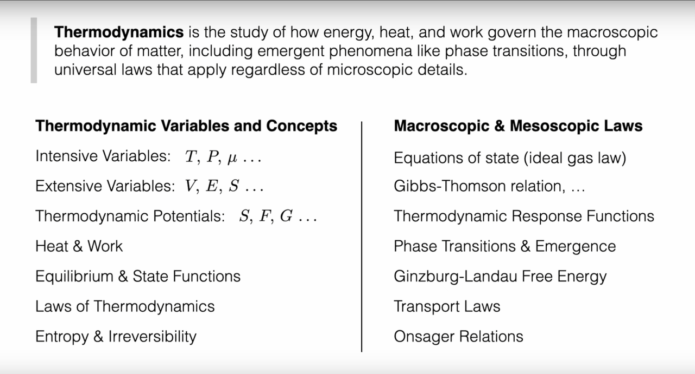

热力学是研究能量、热量和功如何支配物质宏观行为的学科。它的强大之处在于其定律的普适性——这些定律（如能量守恒、熵增原理）适用于所有宏观系统，而无需关心构成这些系统的微观粒子（原子、分子）的具体细节。

### 基本概念与变量

要构建热力学理论，首先需要建立描述系统状态的语言。热力学引入了两类根本不同的物理量来刻画宏观系统：

**强度量与广延量 (Intensive and Extensive Variables)** 的区分是理解热力学的第一步。强度量如温度($T$)、压强($P$)、化学势($\mu$)，它们不依赖于系统的大小——无论一杯水还是一湖水，其温度都可以是相同的。相反，广延量如体积($V$)、内能($E$)、熵($S$)与系统的大小成正比，具有可加性。这种区分不仅是数学上的便利，更反映了物理世界的深层结构：强度量描述系统的"品质"，广延量描述系统的"数量"。

在此基础上，**热力学势 (Thermodynamic Potentials)** 的概念应运而生。内能$U$、亥姆霍兹自由能$F=U-TS$、吉布斯自由能$G=U-TS+PV$等，它们是不同约束条件下的特征函数。每个势函数都选择了一组"自然变量"——例如，吉布斯自由能$G(T,P)$以温度和压强为自然变量，这正是实验中最容易控制的条件。势函数的重要性在于，它们在相应约束下达到极值时对应着平衡态，其导数给出所有其他热力学量。

**热与功 (Heat & Work)** 的概念则规定了能量交换的记账方式。功是有序的能量传递（如活塞压缩气体），而热是无序的能量传递（如分子碰撞）。这一区分看似简单，实则深刻：它暗示了能量品质的差异，为第二定律的表述奠定了基础。

**平衡态与状态函数 (Equilibrium & State Functions)** 是热力学的核心概念。平衡态是系统宏观性质不随时间变化的状态，它是热力学分析的起点。状态函数如内能$U$、熵$S$、焓$H$等，只依赖于系统的当前状态，而不依赖于达到该状态的路径。这种路径无关性使得我们可以通过任意可逆路径来计算状态函数的变化，极大地简化了热力学计算。状态函数的全微分性质保证了热力学关系式的一致性，如麦克斯韦关系等。

### 热力学定律的统领作用

**热力学四定律 (Laws of Thermodynamics)** 构成了整个理论的公理基础。第零定律确立了温度概念的一致性；第一定律表述能量守恒$dU = \delta Q - \delta W$；第二定律引入熵的概念，指出孤立系统的熵永不减少$dS \geq 0$；第三定律则规定了熵的绝对标度。

其中，**第二定律与不可逆性 (Entropy & Irreversibility)** 的关系最为深刻。熵增原理不仅给出了过程进行的方向，更为宏观世界引入了"时间之箭"。为什么热量总是从高温物体流向低温物体？为什么气体总是从高压区扩散到低压区？答案都蕴含在熵增原理中——自然过程总是朝着增加系统总熵的方向进行。

### 从基础到应用的理论体系

有了这些基本概念，热力学便能构建出丰富的理论体系：

**状态方程 (Equations of State)** 如理想气体定律$PV=nRT$，连接了可直接测量的宏观量，使理论与实验相结合。更复杂的系统需要更精细的状态方程，如范德瓦尔斯方程等。

**Gibbs-Thomson关系 (Gibbs-Thomson Relation)** 等热力学关系式揭示了表面效应对相平衡的影响。该关系描述了小液滴或晶体的平衡蒸气压如何随曲率半径变化：$\ln(p/p_0) = \frac{2\gamma V_m}{rRT}$，其中$\gamma$是表面张力，$V_m$是摩尔体积，$r$是曲率半径。这种关系解释了为什么小液滴更容易蒸发，小晶体更容易溶解，是理解成核、生长和奥斯特瓦尔德熟化等现象的关键。

**热力学响应函数 (Thermodynamic Response Functions)** ——比热、等温可压缩性、热膨胀系数等——描述系统对外界微小扰动的响应。它们不仅是材料的特征参数，更是热力学稳定性的判据：负比热或负可压缩性意味着系统的不稳定。

当系统参数变化时，可能发生**相变与涌现现象 (Phase Transitions & Emergence)**。水的沸腾、磁体的居里转变、超导体的转变等，都是宏观有序从微观无序中涌现的例子。在相变临界点附近，系统表现出标度不变性和普适行为，这为理解复杂系统提供了重要线索。

**Ginzburg-Landau自由能 (Ginzburg-Landau Free Energy)** 理论则提供了描述相变的统一框架。通过引入序参量——描述有序程度的宏观变量——并构造其有效自由能，可以系统地分析各种相变现象。

当系统偏离平衡时，**输运定律 (Transport Laws)** 开始发挥作用。傅里叶导热定律、黏性流体的本构关系等，描述了系统如何通过输运过程回到平衡。这些看似独立的定律，实际上都可以从线性非平衡热力学的框架中统一导出。

**昂萨格倒易关系 (Onsager Relations)** $L_{ij}=L_{ji}$则揭示了不同输运过程之间的深刻联系。例如，温度梯度不仅引起热流，还可能引起电流（塞贝克效应）；反之，电流也可能引起热流（帕尔帖效应）。昂萨格证明，这些交叉效应的系数必须满足对称关系，其根源在于微观动力学的时间反演对称性。

这样，从基本概念出发，热力学构建了一个逻辑严密、应用广泛的理论体系，为理解宏观物理世界提供了强有力的工具。

## 1.2 统计物理：连接微观与宏观的桥梁

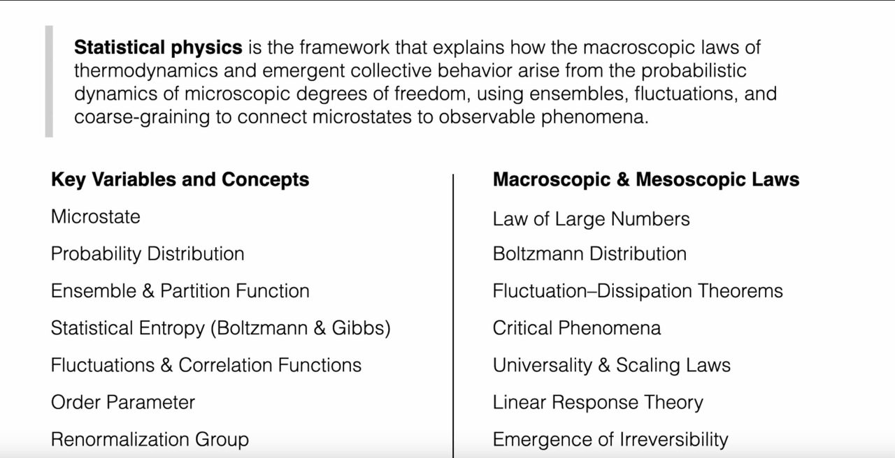

如果说热力学成功地描述了宏观世界"是什么"样，那么统计物理则深刻地解释了"为什么"是这样。统计物理学是解释热力学宏观定律和涌现集体行为如何从微观自由度的概率动力学中产生的理论框架，它使用系综、涨落和粗粒化等概念将微观态连接到可观测现象。

### 微观基础与概率描述

统计物理的出发点是承认一个根本事实：我们无法也无需追踪每个微观粒子的精确运动。相反，我们采用概率的语言来描述系统。

**微观态 (Microstate)** 是系统最精细的描述——指定每个粒子的位置和动量。想象一个包含$10^{23}$个分子的气体，其微观态就是这天文数字个粒子的完整"快照"。然而，宏观测量（如温度、压强）对应的不是单一微观态，而是无数个微观态的集合。这就引出了一个深刻的认识：宏观性质是微观态的统计平均。

为了处理这种统计性质，统计物理引入了**概率分布 (Probability Distribution)** 的概念。不同微观态出现的概率不同，这个概率分布包含了系统的全部统计信息。关键问题是：什么决定了这个概率分布？

### 系综理论与配分函数

**系综 (Ensemble)** 是统计物理的核心概念——它是大量处于相同宏观约束下的系统复制品的集合。不同的约束条件对应不同的系综：正则系综固定温度，巨正则系综固定温度和化学势等。

**配分函数 (Partition Function)** $Z = \sum_i e^{-E_i/k_B T}$是系综理论的数学核心。它看似简单，实则包含了系统的全部热力学信息。配分函数的物理意义是什么？它是所有可能微观态的"权重"之和，其中每个态的权重由玻尔兹曼因子$e^{-E_i/k_B T}$给出——能量越高的态，出现概率越小。

一旦求得配分函数，热力学便从统计物理中自然涌现：自由能$F = -k_B T \ln Z$，熵$S = -\partial F/\partial T$，内能$U = \langle E \rangle$等。这种从微观到宏观的推导，展示了统计物理的解释力量。

### 统计熵的深刻内涵

**统计熵 (Statistical Entropy)** 的概念将热力学的抽象量赋予了微观意义。玻尔兹曼的公式$S = k_B \ln \Omega$告诉我们，熵衡量的是系统微观态的"多样性"——可能的微观态越多，熵越大。吉布斯的更一般表述$S = -k_B \sum_i p_i \ln p_i$则将熵理解为概率分布的"信息量"或"不确定性"。

这种理解解释了为什么熵总是增加：孤立系统总是从少数特殊的微观态（低熵）演化到大量普通的微观态（高熵），这纯粹是概率的结果——"普通"的情况比"特殊"的情况更可能出现。

### 涨落现象与关联函数

统计物理不仅预测平均行为，更揭示了**涨落 (Fluctuations)** 的普遍性。由于微观粒子的随机运动，任何宏观量都会在其平均值附近涨落。这些涨落不是"噪音"，而是携带重要信息的物理现象。

**关联函数 (Correlation Functions)** 描述不同时空点的涨落如何相互关联，它们是理解集体行为的关键。在相变临界点附近，关联长度发散，系统表现出长程关联——这正是宏观有序从微观无序中涌现的机制。

**序参量 (Order Parameter)** 是描述系统有序程度的宏观变量，它在相变理论中占据核心地位。在有序相中序参量非零，在无序相中为零。例如，在铁磁体中，磁化强度是序参量；在液-气相变中，密度差是序参量。序参量的概念使我们能够用统一的数学语言描述各种看似不同的相变现象，揭示它们的共同本质。

**重整化群 (Renormalization Group)** 是处理多尺度物理问题的强大理论工具。它的核心思想是研究物理系统在不同观察尺度下的行为变化。通过系统地"粗粒化"——即忽略短程细节而保留长程行为——重整化群揭示了临界现象的普适性：不同的微观系统在临界点附近可能表现出相同的宏观行为，因为它们属于同一个"普适类"。这一理论不仅解释了相变的普适性，更为理解复杂系统中的标度行为提供了深刻洞察。

### 从微观到宏观的理论工具

统计物理发展出了一系列强大的理论工具来处理复杂系统：

**大数定律 (Law of Large Numbers)** 保证了宏观量的确定性：虽然单个粒子的行为是随机的，但大量粒子的平均行为是确定的。这解释了为什么宏观世界看起来是确定性的，尽管其微观基础是随机的。

**玻尔兹曼分布 (Boltzmann Distribution)** $p_i \propto e^{-E_i/k_B T}$是平衡态的普适概率分布，它不依赖于系统的具体细节，只取决于能量和温度。这种普适性是统计物理预测力的源泉。

**涨落-耗散定理 (Fluctuation-Dissipation Theorems)** 建立了平衡涨落与非平衡响应之间的定量关系，它告诉我们可以通过观察系统的自发涨落来预测其对外界扰动的响应。

当系统接近相变时，**临界现象 (Critical Phenomena)** 展现了统计物理的另一面：系统在临界点附近表现出**普适性和标度律 (Universality & Scaling Laws)**，不同的微观系统可能表现出相同的宏观行为。这种普适性暗示存在更深层的对称性和不变性。

**序参量 (Order Parameter)** 概念为描述有序-无序转变提供了统一语言，而**重整化群 (Renormalization Group)** 理论则揭示了不同尺度上物理规律的关联，成为理解临界现象和多尺度物理的强大工具。

**线性响应理论 (Linear Response Theory)** 处理系统对微小外界扰动的响应，它将非平衡问题转化为平衡态性质的计算，为理解输运现象奠定了基础。

最终，统计物理还必须面对一个深刻问题：**不可逆性的涌现 (Emergence of Irreversibility)**。微观动力学是时间可逆的，但宏观现象却表现出明显的方向性。统计物理通过概率论和大数定律解释了这种表观矛盾：不可逆性不是绝对的，而是压倒性概率的结果。

通过这些概念和工具，统计物理成功地架起了微观与宏观之间的桥梁，不仅解释了热力学定律的起源，更为理解复杂系统的涌现行为提供了坚实的理论基础。

## 1.3 非平衡物理学：超越平衡的广阔领域

非平衡物理学是研究远离热力学平衡系统的领域，它整合宏观热力学定律与微观统计描述，以理解输运、耗散、涨落以及跨尺度涌现行为。热力学和平衡统计物理虽然成就辉煌，但其适用范围主要局限于平衡态或近平衡态系统。然而，宇宙中绝大多数引人入胜的现象——从细胞的生命活动到气象的演变——都发生在远离平衡的状态。

### 非平衡系统的基本特征

要理解非平衡物理学，首先需要认识非平衡系统与平衡系统的根本差异。

**驱动与耗散的平衡**是非平衡系统的核心特征。与平衡系统不同，非平衡系统需要持续的能量或物质输入来维持其状态。这种外部驱动与系统内部的耗散过程达成动态平衡，使系统能够维持在远离热力学平衡的状态。

**流与产生率 (Fluxes and Production Rates)** 的概念在非平衡物理中占据中心地位。在这些系统中，能量、物质、电荷等会持续流动，形成各种"流"——热流、粒子流、电流等。同时，系统会持续产生熵，这是不可逆过程的直接体现。这些流不是瞬时的扰动，而是系统稳定存在的特征。

**非平衡稳态 (Nonequilibrium Steady State, NESS)** 是非平衡物理学中的一个关键概念。许多非平衡系统在持续的驱动下，会达到一种表面上"稳定"的状态：宏观性质不随时间改变，但内部存在持续的净流和熵产生。生命系统是NESS的典型例子——活细胞通过持续的新陈代谢维持其高度有序的状态，看似静止，实则充满动态过程。

### 细节平衡的破缺与循环流

**细节平衡破缺 (Breaking of Detailed Balance)** 是区分平衡与非平衡系统的根本标志。在平衡态，微观可逆性要求任何基元过程与其逆过程的速率必须相等，这就是细节平衡原理。数学上表达为：对于任意两个状态$i$和$j$，必须满足$\pi_i W_{i \to j} = \pi_j W_{j \to i}$，其中$\pi_i$是平衡概率，$W_{i \to j}$是转移速率。

在非平衡系统中，这一原理被系统性地违背。外部驱动打破了微观过程的对称性，导致净的循环流和定向运动。这种破缺不是偶然的扰动，而是系统功能的基础——正是这种不对称性使得分子马达能够定向运动，使得细胞能够主动输运物质。

### 从随机过程到场论的理论体系

根据PPT显示的课程结构，非平衡物理学的理论体系可以分为四个递进的层次：

**第一部分：随机过程基础 (Foundations of Stochastic Processes)** 建立了描述随机性的数学语言。从**随机游走与布朗运动 (Random Walks and Brownian Motion)** 开始，我们学习伯努利/高斯游走和扩散方程等基本模型。**基础随机模型 (Elementary Stochastic Models)** 引入泊松过程、生灭动力学和分子马达等具体例子。**马尔可夫过程与主方程 (Markov Processes and Master Equations)** 则建立了Chapman-Kolmogorov方程和离散/连续状态空间的统一框架。

- [2. 简单随机游走](2.%20简单随机游走.md)
- [3. 高斯随机游走与泊松过程](3.%20高斯随机游走与泊松过程.md)
- [4. Gillespie 算法、主方程、生成函数与种群动力学](4.%20Gillespie%20算法、主方程、生成函数与种群动力学.md)
- [5. 种群动态学：线性死亡过程与Lotka-Volterra 系统](5.%20种群动态学：线性死亡过程与Lotka-Volterra%20系统.md)
- [6. 马尔可夫过程的基本方程：查普曼-科尔莫戈罗夫方程](6.%20马尔可夫过程的基本方程：查普曼-科尔莫戈罗夫方程.md)
- [7. 前向主方程与Q矩阵](7.%20前向主方程与Q矩阵.md)
- [8. 佩龙-弗罗贝尼乌斯定理、稳态与细致平衡](8.%20佩龙-弗罗贝尼乌斯定理、稳态与细致平衡.md)
- [9. 非平衡态：不可逆性与熵产生的推论](9.%20非平衡态：不可逆性与熵产生的推论.md)
- [10. 埃伦费斯特模型、熵与KL散度](10.%20埃伦费斯特模型、熵与KL散度.md)

**第二部分：粒子的随机动力学 (Stochastic Dynamics of Particles)** 将抽象的数学工具应用于具体的物理对象。**朗之万与福克-普朗克方程 (Langevin and Fokker-Planck Equations)** 处理路径积分和乘性噪声问题。**随机模拟技术 (Stochastic Simulation Techniques)** 介绍Gillespie算法和随机积分方法。**随机热力学 (Stochastic Thermodynamics)** 则在轨迹层面讨论熵产生、细节平衡和涨落定理。

- [11. 连续马尔可夫过程与福克-普朗克方程](11.%20连续马尔可夫过程与福克-普朗克方程.md)
- [12. 布朗运动与奥恩斯坦-乌伦贝克过程](12.%20布朗运动与奥恩斯坦-乌伦贝克过程.md)
- [13. 作为随机过程的蒙特卡洛采样](13.%20作为随机过程的蒙特卡洛采样.md)
- [14. 哈密尔顿蒙特卡洛采样](14.%20哈密尔顿蒙特卡洛采样.md)
- [15. 趋化性、跑动-翻滚运动与Keller-Segel模型](15.%20趋化性、跑动-翻滚运动与Keller-Segel模型.md)
- [16. Schnitzer模型、反常扩散与运动诱导相分离](16.%20Schnitzer模型、反常扩散与运动诱导相分离.md)
- [17. 朗之万方程、布朗粒子与涨落-耗散定理](17.%20朗之万方程、布朗粒子与涨落-耗散定理.md)
- [18. 福克-普朗克方程与斯摩棱霍夫斯基方程：从随机轨迹到概率动力学](18.%20福克-普朗克方程与斯摩棱霍夫斯基方程：从随机轨迹到概率动力学.md)
- [19. 随机过程的路径积分表述](19.%20随机过程的路径积分表述.md)
- [20. 随机微分方程](20.%20随机微分方程.md)
- [21. 伊藤积分与统一的随机过程框架](21.%20伊藤积分与统一的随机过程框架.md)
- [22. 含乘性噪声系统的路径积分](22.%20含乘性噪声系统的路径积分.md)

**第三部分：从离散态到场 (From Discrete States to Fields)** 实现了关键的抽象跃迁。**反应网络与场论 (Reaction Networks and Field Theories)** 通过主方程和Kramers-Moyal展开将离散过程连续化。**场的粗粒化动力学 (Coarse-Grained Dynamics of Fields)** 研究弛豫动力学以及守恒场与非守恒场的区别。

- [23. 从粗粒化到连续场论涨落动力学](23.%20从粗粒化到连续场论涨落动力学.md)
- [24. 昂萨格系数、倒易关系与动态涨落-耗散定理](24.%20昂萨格系数、倒易关系与动态涨落-耗散定理.md)
- [25. 梯度动力学、相变与弛豫](25.%20梯度动力学、相变与弛豫.md)
- [26. 临界慢化、动态响应与守恒律](26.%20临界慢化、动态响应与守恒律.md)
- [27. 简单流体、无摩擦流体与欧拉方程的流体动力学](27.%20简单流体、无摩擦流体与欧拉方程的流体动力学.md)
- [28. 粘性流体、纳维-斯托克斯方程、熵平衡与热传导](28.%20粘性流体、纳维-斯托克斯方程、熵平衡与热传导.md)
- [29. 不可逆线性热力学与干性扩散粒子系统](29.%20不可逆线性热力学与干性扩散粒子系统.md)
- [30. 悬浮在流体中的布朗粒子 — H模型](30.%20悬浮在流体中的布朗粒子%20—%20H模型.md)

**第四部分：非平衡系统的场论 (Field Theories of Nonequilibrium Systems)** 运用最先进的理论工具。**动态泛函与MSR形式 (Dynamical Functionals and MSR Formalism)** 发展Onsager-Machlup和Janssen-de Dominicis路径积分方法。**流体动力学与涨落流体 (Hydrodynamics and Fluctuating Fluids)** 应用模型H、动量守恒和悬浮动力学。**非平衡模式形成 (Nonequilibrium Pattern Formation)** 研究失稳和非平衡稳态。**活性物质场论 (Field Theory of Active Matter)** 则探讨自推进和自组织现象。

- [31. 动态泛函、加性噪声场论与Onsager-Machlup泛函](31.%20动态泛函、加性噪声场论与Onsager-Machlup泛函.md)
- [32. Janssen-De Dominicis 响应泛函与涨落-耗散关系](32.%20Janssen-De%20Dominicis%20响应泛函与涨落-耗散关系.md)
- [33. 非平衡功与涨落定理](33.%20非平衡功与涨落定理.md)
- [34. 有向渗流、吸收态与谱方法](34.%20有向渗流、吸收态与谱方法.md)
- [35. 主方程的路径积分表示](35.%20主方程的路径积分表示.md)
- [36. 相干态路径积分、算符代数与虚噪声](36.%20相干态路径积分、算符代数与虚噪声.md)
- [37. Kramers-Moyal 展开与路径积分的低噪声极限](37.%20Kramers-Moyal%20展开与路径积分的低噪声极限.md)
- [38. 多物种路径积分与循环竞争动力学](38.%20多物种路径积分与循环竞争动力学.md)
- [39. 从粒子跳跃到连续场论](39.%20从粒子跳跃到连续场论.md)
- [40. 统一的场论框架](40.%20统一的场论框架.md)

### 理论方法的层次递进

这种课程结构体现了非平衡物理学理论方法的层次性：从描述单个粒子的随机轨迹，到描述粒子系综的概率演化；从处理离散的跳跃过程，到构建连续的场论；从分析近平衡的线性响应，到探索远离平衡的复杂行为。

每一层次都有其独特的数学工具和物理洞察。随机过程理论提供了处理不确定性的语言；朗之万和福克-普朗克方程连接了微观随机性与宏观确定性；主方程到场论的转换实现了从离散到连续的抽象；而动态泛函方法则为处理复杂的多体相互作用提供了强大的工具。

通过这样的理论体系，非平衡物理学不仅能够描述和预测远离平衡系统的行为，更能揭示这些系统中涌现的新奇现象——从简单的扩散过程到复杂的生命活动，从个体的随机运动到集体的有序行为。

为了更清晰地理解这三个理论框架的定位，可以参考下表：

| 特性 (Property) | 热力学 (Thermodynamics) | 统计物理 (Statistical Physics) | 非平衡物理 (Nonequilibrium Physics) |
|------------------|--------------------------|-------------------------------|-------------------------------------|
| **研究范畴 (Scope)** | 宏观系统 (Macroscopic systems) | 从微观到宏观 (Microscopic to Macroscopic) | 动态、演化中的系统 (Dynamic, evolving systems) |
| **核心状态 (Core State)** | 平衡态 (Equilibrium) | 平衡系综 (Equilibrium Ensemble) | 非平衡稳态 (NESS), 瞬态 (Transient states) |
| **关键变量 (Key Variables)** | $ T, P, V, E, S $ (宏观量) | 微观态, 概率分布, 配分函数 | 流 (Fluxes), 产生率 (Production rates), 涨落 |
| **基本原理 (Principles)** | 热力学定律 (Laws of Thermodynamics) | 统计系综, 玻尔兹曼分布 | 涨落定理, 熵产生, 细节平衡破缺 |

# 2. 随机过程的范例——布朗运动

历史常常为我们提供进入一个复杂领域的入口。布朗运动不仅是一个有趣的历史故事，更是理解随机过程和非平衡物理核心思想的范例。它展示了微观世界的随机涨落如何主宰介观尺度上的物体运动。

## 2.1 布朗的“小秘密”：历史的开端

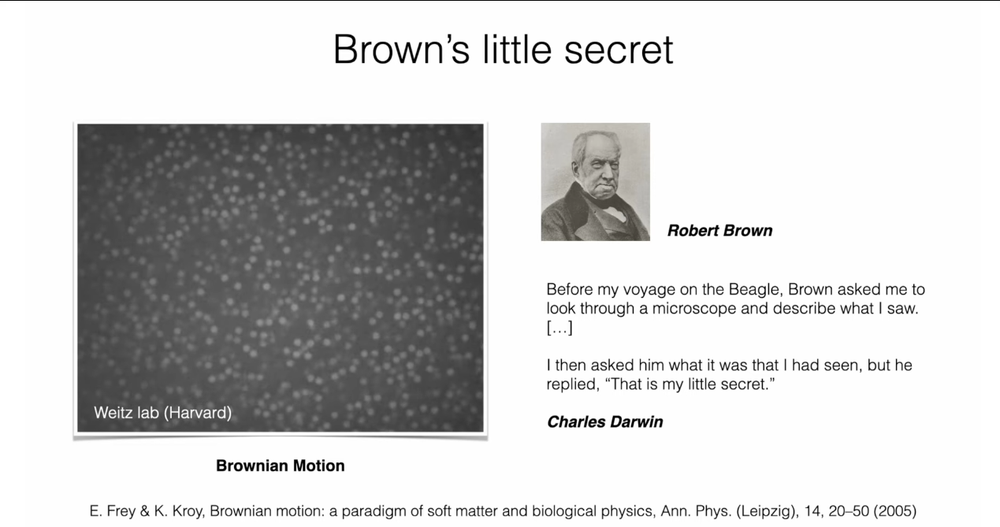

1827年，苏格兰植物学家罗伯特·布朗 (Robert Brown) 在显微镜下观察悬浮在水中的花粉颗粒时，发现这些微小的颗粒永不停歇地进行着快速、无规则的运动。这种现象后来被称为“布朗运动”。在达尔文的回忆中，布朗曾向他展示了这一现象，但当被问及其原因时，布朗只是神秘地回答：“那是我的一点小秘密”。在当时，人们无法解释这种运动的来源，有人甚至猜测这源于花粉自身的“生命力”。

## 2.2 爱因斯坦的解释与佩兰的验证

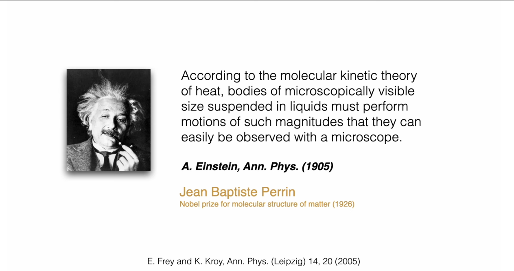

这个“秘密”直到近80年后才被阿尔伯特·爱因斯坦 (Albert Einstein) 在其1905年的“奇迹年”中彻底揭开。爱因斯坦指出，布朗运动并非源于粒子内部，而是外部环境作用的结果。他在论文中写道：“根据热的分子动理论，悬浮在液体中的微观可见大小的物体，必须进行一定程度的运动，这种运动的幅度可以通过显微镜轻易观察到。”

爱因斯坦的洞见在于，他认识到悬浮颗粒时刻受到来自周围大量液体分子的碰撞。这些分子在进行着永不停息的热运动。对于一个宏观物体，来自四面八方的碰撞在统计上是均匀的，其合力为零。但对于一个微小颗粒，由于分子数量有限，在任何一个瞬间，来自不同方向的碰撞是不完全平衡的。这种不平衡的、随机的碰撞力导致了颗粒的无规则运动。

这一解释具有划时代的意义：

1. **它为原子和分子的存在提供了直接、可见的证据。** 布朗运动成为了连接不可见的微观世界（分子碰撞）和可见的介观世界（颗粒运动）的桥梁。

2. **它引入了“随机力” (random force) 的概念**，这是现代随机动力学理论的基石。

3. **它揭示了涨落与耗散的内在联系。** 导致颗粒随机运动的分子碰撞，同样也是当颗粒在外力下运动时产生粘性阻力（摩擦力）的原因。这一思想的萌芽，最终将发展为深刻的涨落耗散定理。

法国物理学家让·巴蒂斯特·佩兰 (Jean Baptiste Perrin) 通过对布朗运动的精细定量实验研究，测量了颗粒的均方位移，并据此精确地计算出阿伏伽德罗常数，其实验结果与理论预测高度吻合。这项工作为爱因斯坦的理论提供了决定性的实验验证，也为物质的原子-分子结构学说画上了圆满的句号。佩兰因此荣获1926年的诺贝尔物理学奖。

# 3. 非平衡物理学的发展脉络

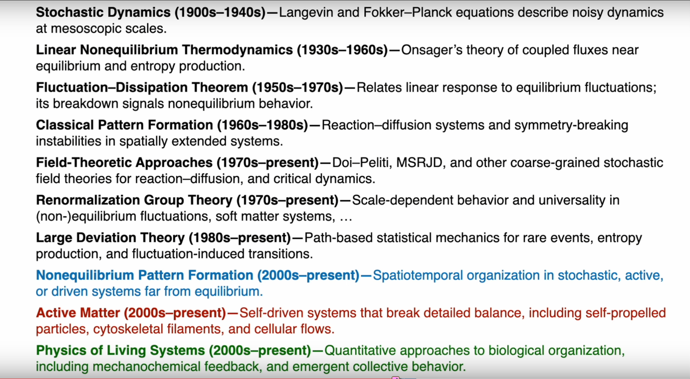

布朗运动的成功解释开启了非平衡物理学发展的大门。在整个20世纪，物理学家们逐步建立起一套描述和理解非平衡现象的理论工具箱。这个发展过程并非一蹴而就，而是一个概念不断深化、抽象层次不断提升的“阶梯”。

## 3.1 随机动力学 (1900s-1940s): 描述介观尺度上的含噪动力学

这一时期的核心目标是为布朗运动这样的随机现象建立数学化的动力学方程。

* **朗之万方程 (Langevin Equation)**

  这是对单个布朗粒子运动轨迹的描述。保罗·朗之万 (Paul Langevin) 在牛顿第二定律 ($m\ddot{x} = F$) 的基础上，天才地将作用力分解为两部分：

  1. 一个系统的、可预测的**耗散力 (dissipative force)**，即与粒子速度成正比的粘性阻力，$-\gamma \dot{x}$。

  2. 一个快速涨落的、不可预测的随机力 (random force)，$\eta(t)$，代表了来自流体分子的随机碰撞。

  3. 于是，朗之万方程可以概念性地写为：

     $$
     m \ddot{x} = -\gamma \dot{x} + \eta(t)
     $$

  这个方程的物理意义极为深刻：它首次将宏观的耗散（由摩擦系数 $\gamma$ 表征）和微观的涨落（由随机力 $\eta(t)$ 表征）放在了同一个动力学方程中。它描述的是一条随机的轨迹，是随机微分方程的滥觞。

* **福克-普朗克方程 (Fokker-Planck Equation)**

  朗之万方程描述的是单个粒子的命运，但通常我们更关心大量粒子组成的系统的集体行为。福克-普朗克方程正是为此而生。它不追踪单个轨迹，而是描述粒子系综的概率密度函数 $P(x,t)$ 如何随时间演化。

  其一般形式可以写为：

  $$
  \frac{\partial P}{\partial t} = -\nabla \cdot (\mathbf{A} P) + \frac{1}{2} \nabla^2 (\mathbf{B} P)
  $$

  这个方程的物理意义是概率的流体动力学方程：

  1. **漂移项 (Drift Term)**: 第一项，与漂移矢量 $\mathbf{A}$ 相关，描述了由系统性作用（如外力场）引起的概率密度的确定性漂移。

  2. **扩散项 (Diffusion Term)**: 第二项，与扩散张量 $\mathbf{B}$ 相关，描述了由随机力引起的概率密度的扩散和展宽。

  3. 福克-普朗克方程和朗之万方程是描述同一个随机过程的两种等价视角：前者是基于概率分布的“欧拉描述”，后者是基于粒子轨迹的“拉格朗日描述”。

## 3.2 线性非平衡热力学 (1930s-1960s): 近平衡区的输运理论

当系统只是略微偏离平衡态时，各种热力学“流” ($J_i$)，如热流、电流、粒子流，可以近似地看作是与引起它们的热力学“力” ($X_j$)，如温度梯度、电势梯度、化学势梯度，成线性关系：

$$
J_i = \sum_j L_{ij} X_j
$$

其中 $L_{ij}$ 被称为动力学系数或输运系数。对角项 $L_{ii}$ 描述了直接效应，如傅里叶定律（热流正比于温度梯度）或欧姆定律（电流正比于电势梯度）。

* **昂萨格倒易关系 (Onsager Reciprocal Relations)**

  拉斯·昂萨格 (Lars Onsager) 的杰出贡献在于揭示了非对角项（交叉效应）的深刻性质。例如，温度梯度不仅能引起热流，还能引起电流（塞贝克效应），这由系数 $L_{\text{电},\text{温}}$ 描述；反之，电势梯度也能引起热流（帕尔帖效应），这由系数 $L_{\text{热},\text{电}}$ 描述。昂萨格证明，在没有磁场等破坏时间反演对称性的因素存在时，动力学系数矩阵是对称的：

  $$
  L_{ij} = L_{ji}
  $$

  这个宏观的对称性关系，其根源在于微观动力学在时间反演下的不变性（即微观可逆性原理）。这是非平衡物理学中的第一个深刻的、具有普适性的对称性原理，昂萨格也因此获得了1968年的诺贝尔化学奖。

## 3.3 涨落耗散定理 (1950s-1970s): 连接响应与涨落

涨落耗散定理 (Fluctuation-Dissipation Theorem, FDT) 是对朗之万和昂萨格思想的集大成与升华，是非平衡统计物理的基石之一。

该定理的物理思想可以直观地理解为：**一个系统对外部微小扰动的响应（耗散），与其在平衡态下的自发涨落之间存在着定量的、深刻的联系**。

* **直观例子**:

  * **布朗运动**: 推动布朗粒子运动的随机力（涨落）和阻碍其运动的粘滞力（耗散）源于同一个物理过程——与周围流体分子的碰撞。FDT定量地将扩散系数（描述涨落大小）和迁移率（描述对力的响应）联系起来。

  * **约翰逊噪声**: 电阻器中的电阻（耗散电能）和其中自发产生的热噪声电流（涨落）都源于电子与晶格的散射。FDT定量地将电阻值与噪声电压的谱密度联系起来。

FDT的深刻之处在于，它断言我们可以通过仅仅观察一个系统在平衡态下“如何自发地抖动”（测量其平衡涨落的关联函数），就能完全预测出当我们“轻轻推它一下”时它会如何反应（计算其对微弱外场的线性响应函数）。这个定理的成立依赖于系统接近平衡态。因此，**涨落耗散定理的失效，成为了判断一个系统是否处于远离平衡状态的重要标志**。

## 3.4 从经典到现代：从模式形成到活性物质

随着理论工具的不断发展，非平衡物理学的研究对象也从简单的粒子系统扩展到具有复杂时空结构的、远离平衡的系统。

* **经典模式形成 (Classical Pattern Formation, 1960s-1980s)**: 这一时期，人们开始关注反应-扩散系统。最著名的例子是图灵斑图 (Turing pattern)，它解释了在远离平衡的化学反应系统中，两种扩散速率不同的化学物质如何通过相互作用，自发地从一个均匀的状态演化出稳定的空间斑图（如斑点、条纹），为生物形态发生提供了理论模型。

* **场论方法 (Field-Theoretic Approaches, 1970s-present)**: 为了处理包含大量相互作用粒子的复杂随机过程，物理学家发展了强大的场论方法。例如，**Doi-Peliti 形式** 和 **Martin-Siggia-Rose-Janssen-de Dominicis (MSRJD) 形式**，能够将描述粒子数生灭、反应和扩散的离散主方程 (Master Equation)，严格地转化为一个等价的、描述连续场的路径积分（或场论）。这种"粗粒化" (Coarse-graining) 的思想，使得人们可以运用量子场论中强大的重整化群等技术来分析非平衡系统中的临界现象和标度行为。

* **重整化群理论 (Renormalization Group Theory, 1970s-present)**: 重整化群方法在非平衡物理学中的应用标志着理论的重大突破。它不仅能够处理平衡态的临界现象，更能揭示非平衡涨落中的标度依赖行为和普适性。在软物质系统中，重整化群理论帮助我们理解为什么不同的微观系统在长程、低频的行为上表现出相同的普适特征。例如，在临界点附近，系统的关联长度和弛豫时间都表现出幂律标度行为，而这些标度指数具有普适性——它们只依赖于系统的对称性和维度，而不依赖于微观细节。

* **大偏差理论 (Large Deviation Theory, 1980s-present)**: 这一理论框架为研究稀有事件和涨落诱导的转变提供了强有力的工具。大偏差理论采用基于路径的统计力学方法，能够精确计算那些在典型涨落理论中被忽略的极端事件的概率。在非平衡系统中，大偏差理论特别重要，因为它能够量化熵产生的涨落，并预测系统何时会发生反常的、看似违反第二定律的涨落。这种理论不仅加深了我们对涨落定理的理解，更为理解生物系统中的稀有但关键的事件（如蛋白质折叠、基因表达的突发等）提供了理论基础。

* **非平衡模式形成 (Nonequilibrium Pattern Formation, 2000s-present)**: 进入21世纪，非平衡模式形成研究进入了一个新的阶段。与经典的反应-扩散系统不同，现代研究更关注在随机、活性或外部驱动的系统中远离平衡的时空组织。这些系统能够在噪声环境中维持复杂的空间结构，甚至利用噪声来增强模式的稳定性。例如，在随机激发的介质中，噪声可以诱导相干结构的形成；在活性系统中，局部的非平衡活动可以驱动全局模式的涌现。这一领域的研究揭示了噪声不仅仅是破坏有序的因素，在某些条件下反而是创造和维持复杂结构的关键机制。

* **活性物质 (Active Matter, 2000s-present)**: 这是非平衡物理学在21世纪最激动人心的前沿之一。活性物质由能够将存储的或环境中的能量持续转化为机械运动或力的"活性粒子"组成。例子包括细菌群、细胞骨架蛋白、鸟群和鱼群等。其核心物理特征是在单个粒子尺度上**持续地打破细节平衡**。这意味着系统内部存在持续的能量通量和熵产生，从而能够涌现出系统中前所未见的集体行为，例如椋鸟群（starlings）展现出的壮观的、长程有序的集体飞行模式。

* **生命系统物理学 (Physics of Living Systems, 2000s-present)**: 这一新兴领域将非平衡物理学的理论工具应用于理解生物组织的定量规律。生命系统本质上是复杂的非平衡系统，它们通过持续的能量消耗维持高度的组织性和功能性。该领域的研究包括机械化学反馈机制（如细胞骨架的动态重组）、涌现的集体行为（如细胞迁移中的群体效应）、以及生物网络中的随机动力学。例如，细胞分裂过程中纺锤体的自组装、神经网络中的同步振荡、以及组织发育中的形态发生，都可以用非平衡统计物理的语言来理解。这种定量方法不仅加深了我们对生命现象的理解，更为生物医学和合成生物学提供了理论指导。

这个发展历程清晰地展示了非平衡物理学的一条主线：从描述单个粒子的随机轨迹，到描述粒子系综的概率分布；从研究近平衡的线性响应，到揭示涨落与耗散的普适联系；最终发展出强大的场论工具，用以探索远离平衡的复杂系统中涌现出的自组织和集体行为。

# 4. 前沿交叉：生命系统中的非平衡物理

生命本身就是最极致的非平衡现象。一个生命体通过不断地从环境中摄取能量和物质，维持其内部高度有序的、远离平衡的状态。因此，生命系统为非平衡物理学提供了最丰富的研究对象和最严峻的挑战。

## 4.1 薛定谔：“生命是什么？”

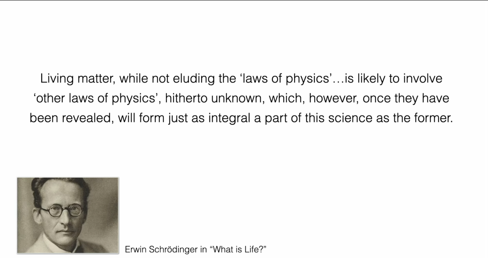

1944年，物理学家埃尔温·薛定谔 (Erwin Schrödinger) 在其著作《生命是什么？》中提出了一个深刻的预言：“生命物质，虽然没有逃脱‘物理学定律’……但很可能包含着‘迄今未知的其他物理学定律’，然而，一旦这些定律被揭示，它们将像前者一样，构成这门科学不可分割的一部分。”这句话激励了几代物理学家投身于生命现象的研究。今天我们知道，这些“其他定律”很大程度上就是非平衡物理学的定律，它们描述了开放、耗能系统如何自发地形成有序结构和实现复杂功能。

## 4.2 Frey教授研究组的实例

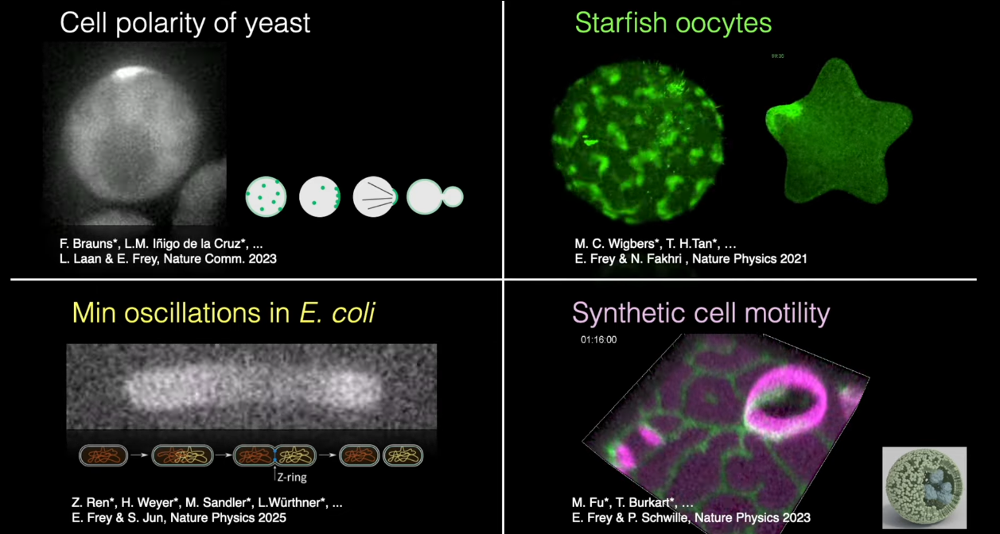

Frey教授的讲座通过介绍其研究组的工作，具体展示了非平衡物理学的思想和方法如何被用来解决真实的生物学问题。

* [**酵母菌的细胞极性 (Cell polarity of yeast)**](https://doi.org/10.1038/s41467-023-42100-0)
  * **生物学问题**: 单细胞的芽殖酵母在出芽生殖前，必须从一个原本近乎球对称的细胞表面选择一个特定的点，并将细胞生长的所有资源都集中到该点，形成一个“芽”。这是一个典型的对称性破缺 (symmetry breaking) 问题。
  
  * **物理机制**: 这个过程的核心是名为 Cdc42 的GTP酶。在细胞膜上，活化的Cdc42分子可以通过一个正反馈循环，招募并激活更多的Cdc42分子。这个“富者愈富”的机制，结合分子在细胞膜上的慢扩散和在细胞质中的快扩散，能够将原本均匀分布的Cdc42分子自发地汇聚成一个单一的、稳定的“极化帽”，从而标记出未来的生长点。这是一个由反应-扩散 (reaction-diffusion) 机制驱动的自组织过程。Frey教授及其合作者的研究进一步揭示，这个看似单一的过程中实际包含了多个、功能冗余的自组织机制，这使得酵母的极化过程对基因突变或环境扰动表现出极强的稳健性 (robustness)，并解释了其高度的可演化性。
  
* [**大肠杆菌中的Min蛋白振荡 (Min oscillations in E. coli)**](https://www.nature.com/articles/s41567-025-02878-w)
  * **生物学问题**: 杆状的大肠杆菌需要精确地在细胞的几何中心进行分裂，以确保两个子代细胞大小均等。细胞如何“找到”它的中点？
  
  * **物理机制**: 大肠杆菌利用了一个精妙的动态定位系统——Min蛋白系统。该系统由MinC、MinD、MinE三种蛋白组成。其中，MinD是一种消耗ATP的马达蛋白，它可以在ATP驱动下结合到细胞膜上；MinE则可以促进MinD水解ATP，使其从膜上脱落。这两种蛋白的相互作用和在细胞内的扩散，共同构成了一个反应-扩散振荡器。在细胞中，MinD和MinE会形成一个从一极到另一极来回穿梭的驻波，周期约为1分钟。作为分裂的抑制剂，MinC蛋白会跟随着MinD一起运动。由于这种来回振荡，MinC蛋白在两极的时间平均浓度最高，而在细胞的几何中心，其时间平均浓度最低。这样，细胞中心就成为了唯一"允许"分裂机器（FtsZ环）组装的位置，从而确保了分裂的精确居中。这个过程是一个典型的非平衡稳态 (NESS)，它持续消耗能量（ATP水解）来维持一个动态的、具有生物学功能的空间模式。
  
* [**海星卵母细胞中的蛋白模式与细胞形状解码 (Starfish oocytes)**](https://doi.org/10.1038/s41567-021-01164-9)
  * **生物学问题**: 在细胞分裂等生命活动中，细胞内部的信号（例如蛋白浓度波）需要在复杂的、动态变化的细胞几何形状中精确传播，并到达特定的靶点。细胞是如何在不同形状下，依然能够准确地"解码"自身的几何信息，从而确保生物学功能的精准执行？例如，在巨大的海星卵母细胞中，一个关键的RhoA蛋白活性波总是能从细胞表面精确地传播到细胞核的所在位置，无论细胞是被拉伸成椭球还是挤压成星形。
  
  * **物理机制**: 这项研究揭示了一种精妙的、分层级的模式形成机制（"patterns forming patterns"）。细胞的几何形状信息首先被编码成一种长程的、稳定的细胞周期蛋白（Cdk1）的浓度梯度。这个梯度本身是一个反应-扩散系统形成的"背景模式"。接着，第二个反应-扩散系统——RhoA蛋白循环——会"读取"这个背景梯度。这个系统像一个双稳态开关，只有在Cdk1浓度超过某个阈值时才会被激活，从而形成一个在细胞皮层上传播的、被激发的行波。这个波的传播路径和最终位置，正是由第一个模式（Cdk1梯度）所引导和决定的。通过这种"模式引导模式"的级联方式，细胞巧妙地将复杂的几何信息转化为鲁棒的生化信号，确保了即便在剧烈的形状扰动下，关键信号依然能够精确归位。
  
* [**人造细胞的自驱动运动 (Synthetic cell motility)**](https://doi.org/10.1038/s41567-023-02058-8)
* **生物学问题/目标**: 细胞的自主运动是生命最基本的特征之一，它依赖于复杂的细胞骨架和马达蛋白系统。能否在没有这些复杂"肌肉骨骼"的情况下，仅用最少的组分构建出一个可以自主运动的"人造细胞"？这是"自下而上"合成生物学领域的一个核心挑战，旨在探索驱动生命现象的最小物理化学原理。
  
* **物理机制**: 该研究成功地利用大肠杆菌的Min蛋白系统实现了一个脂质体（人造细胞模型）在平面上的持续定向运动。其核心是一个力化学反馈循环。首先，MinD和MinE蛋白在ATP的驱动下，在脂质体膜的内外表面以及支撑平面上自组织形成非对称的蛋白质浓度分布（化学部分）。这种不均匀的蛋白分布，通过两种可能的机制，导致了脂质体形状的对称性破缺并产生了驱动力（力学部分）：1) 蛋白像"拉链"一样在脂质体与支撑平面间形成和断开不均衡的连接；2) 蛋白的聚集直接改变了膜的局部曲率和张力。这种由化学模式驱动的形变和运动，反过来又会影响Min蛋白自身的反应-扩散动力学，因为Min系统对几何形状非常敏感。这种"化学模式影响形状，形状变化反馈于化学模式"的循环，最终驱动着这个极简的人造细胞实现了前所未有的、无需细胞骨架的持续爬行运动。

## 4.3 复杂性科学：诺贝尔奖与其他荣誉

非平衡物理学和复杂性科学的思想不仅在生物学中取得了巨大成功，其深远影响也得到了科学界的最高认可。

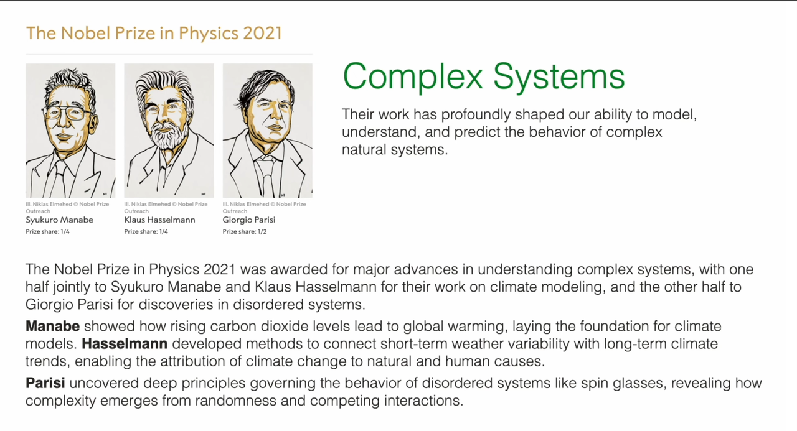

* **2021年诺贝尔物理学奖**: 授予了Syukuro Manabe, Klaus Hasselmann 和 Giorgio Parisi，以表彰他们“对我们理解复杂物理系统的开创性贡献”。特别是Parisi的工作，他揭示了像自旋玻璃这样的无序系统中隐藏的深刻结构和涨落规律。Parisi发展的理论工具，为理解各种充满随机性和“遍历性破缺”的复杂系统提供了普适的框架，这与本课程将要学习的随机过程和统计场论思想息息相关。

* **2024年诺贝尔物理学奖**: 授予了John J. Hopfield 和 Geoffrey E. Hinton，以表彰他们“使得利用人工神经网络进行机器学习成为可能的奠基性发现和发明”。值得注意的是，Hopfield提出的联想记忆网络（Hopfield网络）的数学模型，其思想正是源于统计物理中的自旋玻璃模型。这雄辩地证明了统计物理，特别是处理多体相互作用和集体行为的思想，已经成为人工智能和信息科学等领域的理论基石。

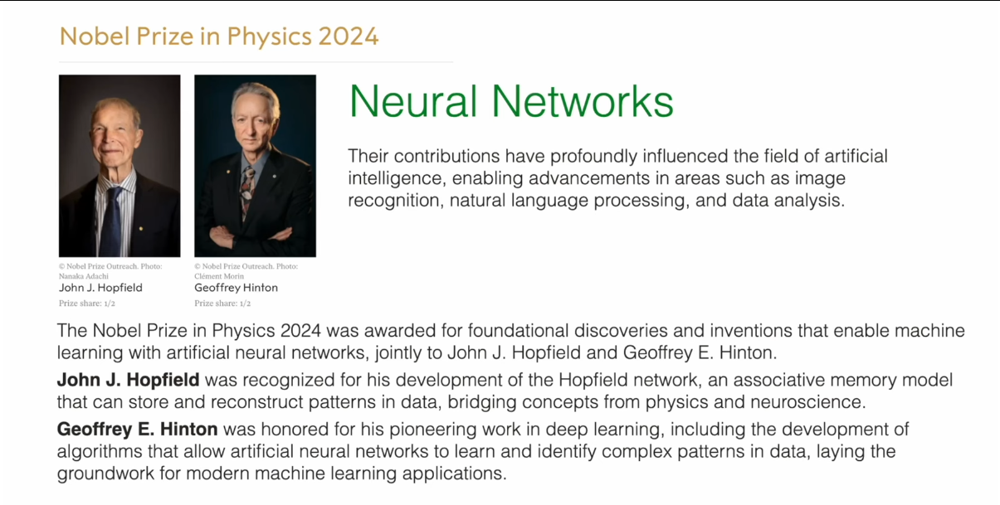

* **2025年玻尔兹曼奖章**: 授予了Mehran Kardar 和 Yoshiki Kuramoto。Kardar在统一理解平衡与非平衡系统中的涨落、界面生长等现象方面做出了重要工作（如著名的KPZ方程）。Kuramoto则开创了复杂系统中同步现象的理论（如Kuramoto模型），揭示了从神经元网络到萤火虫闪烁等各种集体动力学行为的普适原理。这两位学者的工作代表了非平衡物理学的核心前沿，也正是本课程后续将要深入探讨的主题。

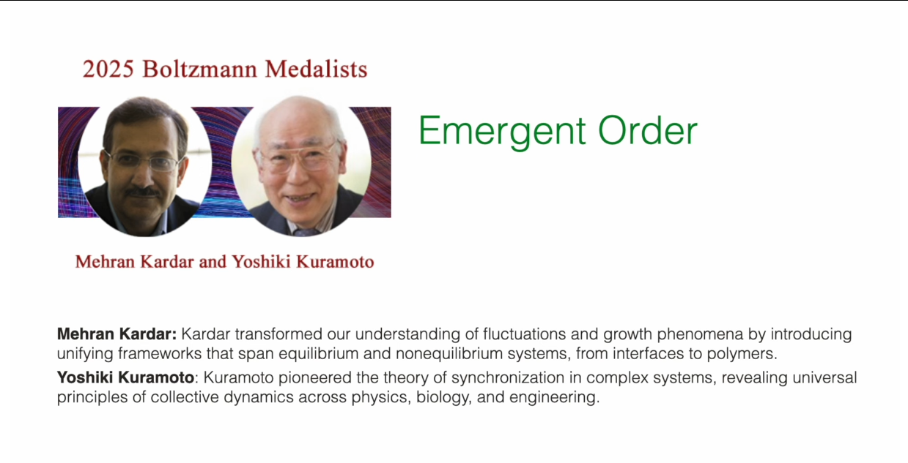

这些例子清晰地表明，这门课所介绍的概念和方法，并非象牙塔中的屠龙之技，而是理解从生命到智能等一系列复杂现象的钥匙，是当代科学研究中最具活力和影响力的思想宝库之一。

