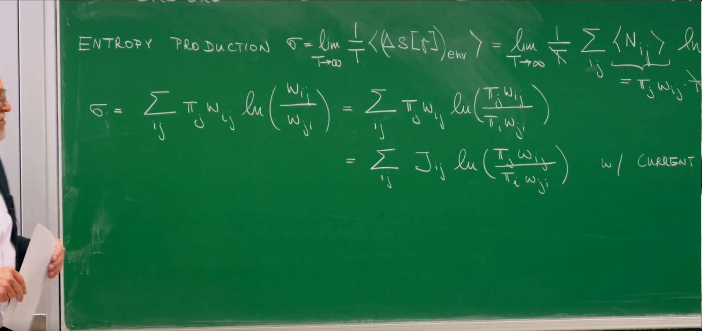
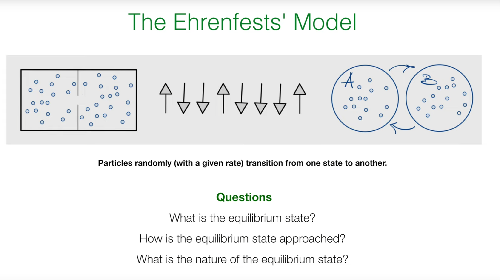
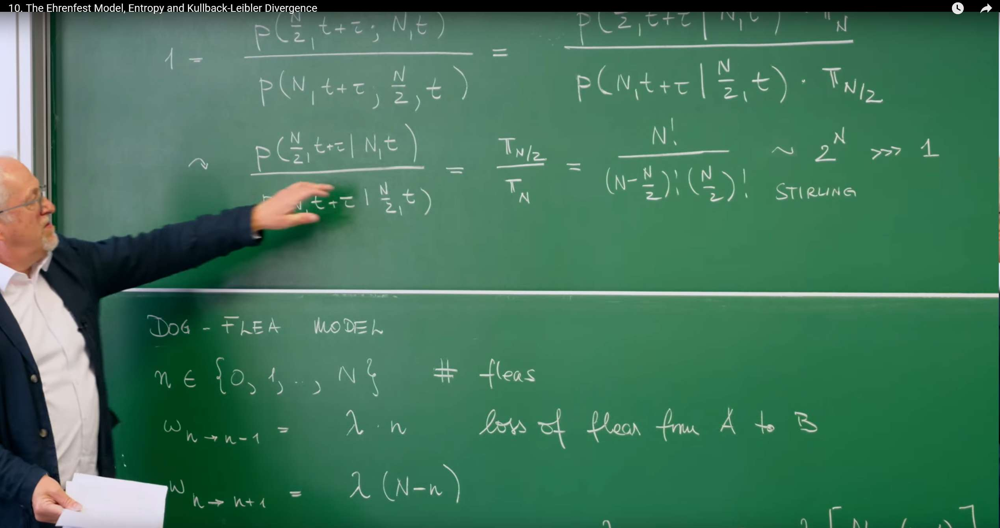
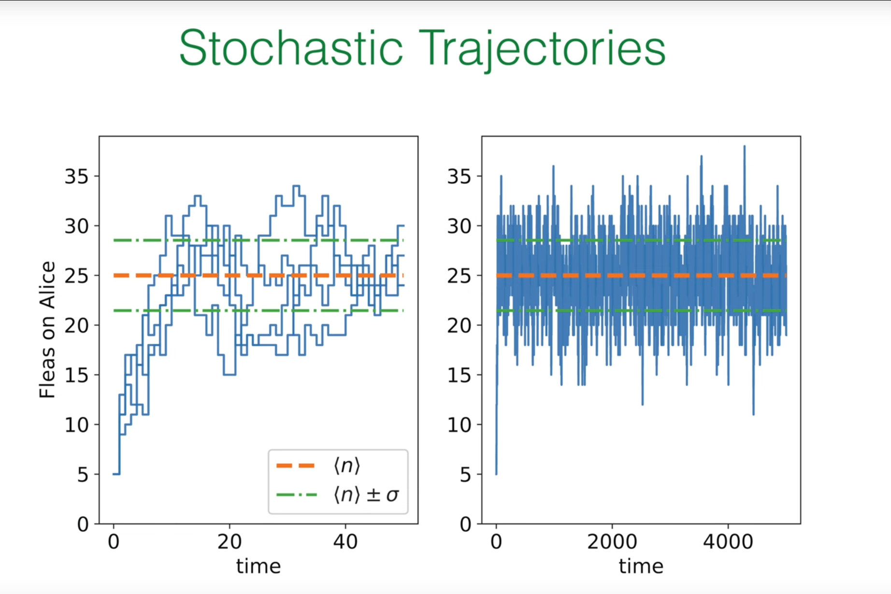
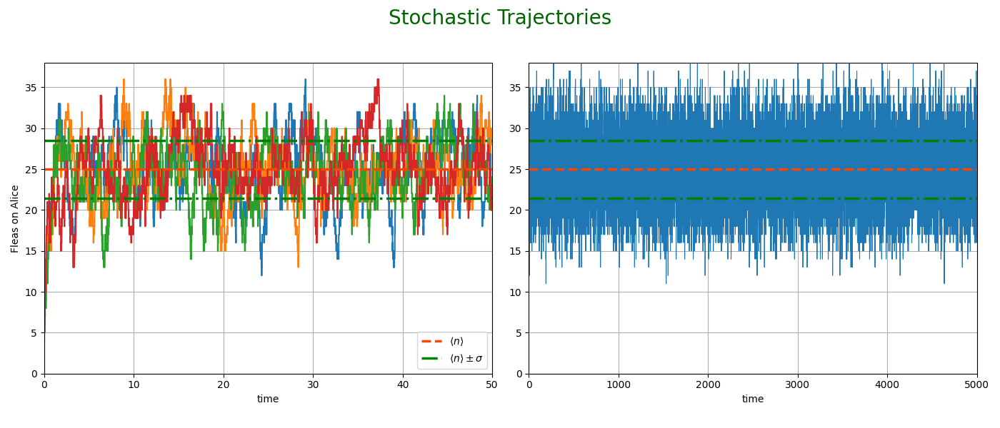
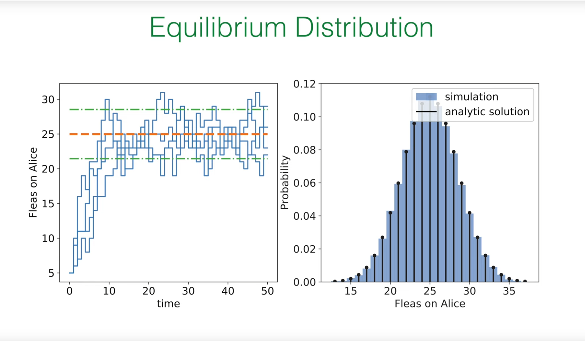
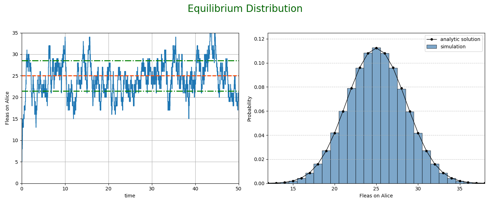
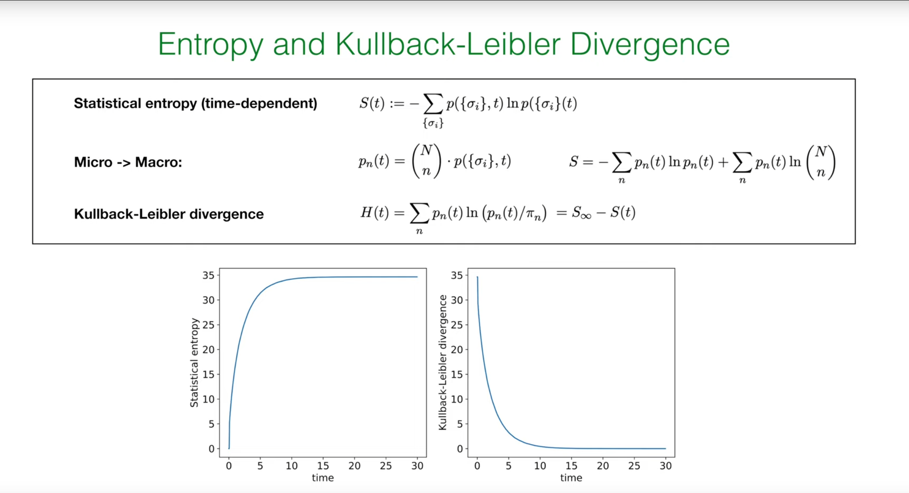
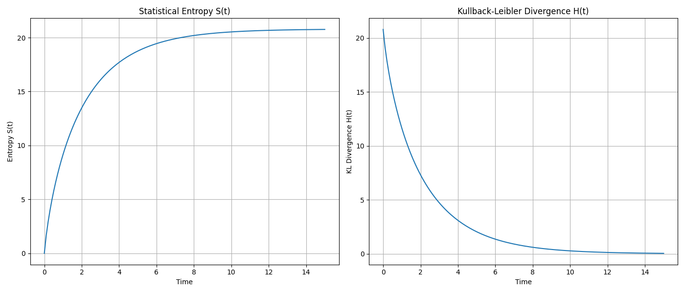
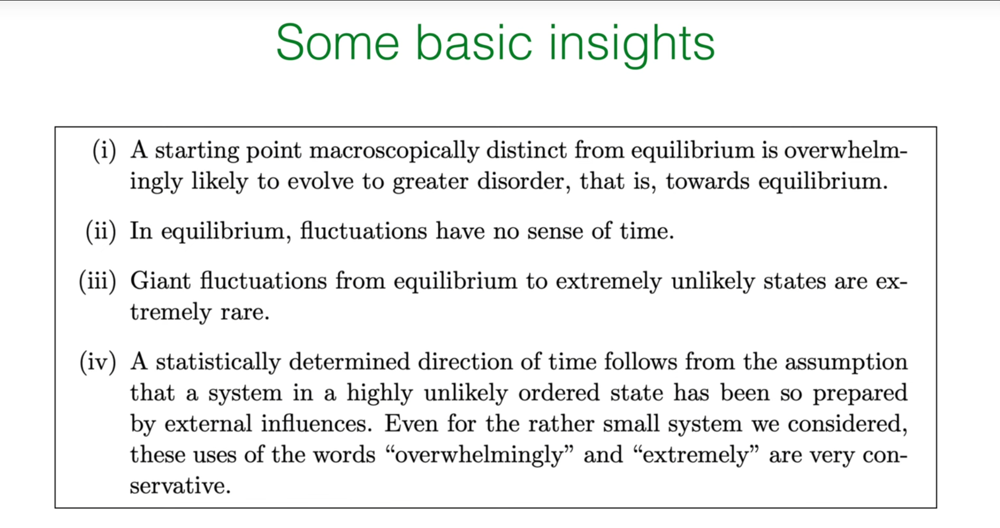

# 序言:回顾熵产生与不可逆性的标志

在之前的讲座中(特别是第8讲和第9讲),我们探讨了描述系统状态随时间演化的主方程,并区分了两种重要的状态:**全局平衡(Global Balance)和细致平衡(Detailed Balance)**。我们知道,满足细致平衡的系统必然处于稳态,但并非所有稳态系统都满足细致平衡。这一区别是理解非平衡物理学的关键,它将我们引向了"不可逆性"这一核心概念。

当一个系统处于非平衡稳态(Non-Equilibrium Steady State, NESS)时,尽管其宏观性质(如概率分布)不随时间改变,但系统内部存在着持续不断的概率流(probability current)。这些净概率流的存在,正是系统不可逆性的体现。为了量化这种不可逆性,我们需要一个物理量,这就是**熵产生率**。

### 量化不可逆性:熵产生率 $\sigma$




教授在回顾上一讲内容时,首先给出了熵产生率 $\sigma$ 的表达式:

$$
\sigma = \sum_{ij} \pi_j w_{ij} \ln\left(\frac{w_{ji}}{w_{ij}}\right)
$$

让我们来解析这个公式:

* $\pi_j$ 是系统处于状态 $j$ 的稳态概率。

* $w_{ij}$ 是从状态 $j$ 到状态 $i$ 的转移速率。

* 因此,$\pi_j w_{ij}$ 代表在稳态下,从状态 $j$ 转移到状态 $i$ 的**概率流**(probability flux)。

* 对数项 $\ln\left(\frac{w_{ji}}{w_{ij}}\right)$ 衡量了正向过程 ($j \to i$) 和逆向过程 ($i \to j$) 速率的**不对称性**。如果 $w_{ij} = w_{ji}$,该项为零,表示这对转移是可逆的。

整个表达式 $\sigma$ 是对系统中所有可能转移的概率流加权的速率不对称性的总和。因此,$\sigma$ 精确地量化了整个系统在宏观层面上的时间不对称性或不可逆性。

接着,教授通过一个巧妙的数学变换,给出了 $\sigma$ 的另一个等价形式:

$$
\sigma = \sum_{ij} \pi_j w_{ij} \ln\left(\frac{\pi_i w_{ji}}{\pi_j w_{ij}}\right)
$$

这个变换并非近似,而是严格的。其推导利用了稳态的全局平衡条件 $\sum_j [\pi_j w_{ji} - \pi_i w_{ij}] = 0$。通过这个条件可以证明一个恒等式 $\sum_{ij} \pi_j w_{ij} \ln(\pi_j / \pi_i) = 0$。将这个为零的项加到原始的 $\sigma$ 表达式的对数内部,就得到了新的形式。

这个新形式在概念上更为深刻。对数内部的项变成了**正向通量** $\pi_j w_{ij}$ 与**逆向通量** $\pi_i w_{ji}$ 的比值。这直接体现了熵产生来源于系统内部概率流动的净循环。

熵产生率具有两个基本性质:

1. **非负性**: $\sigma \geq 0$。这是一个基于**詹森不等式（Jensen's inequality）**的数学结论。其物理意义极为深远:任何系统的稳态熵产生率只能为正或为零,绝不会为负。这是热力学第二定律在随机过程中的体现。

2. **与细致平衡的联系**:

   * 当且仅当系统满足**细致平衡**(Detailed Balance, DB)时,$\sigma = 0$。在细致平衡下,每一对状态之间的正向通量和逆向通量都相等,即 $\pi_j w_{ij} = \pi_i w_{ji}$,因此对数项处处为零。这对应于真正的热力学平衡态。

   * 当系统处于**非平衡稳态**(NESS)时,$\sigma > 0$。此时,至少存在一个净的概率流 $J_{ij} = \pi_j w_{ij} - \pi_i w_{ji} \neq 0$。

因此,$\sigma$ 不仅仅是一个判断系统是否处于平衡态的"开关",它的**数值大小**本身就是一个度量,它定量地描述了一个系统偏离细致平衡(即可逆的平衡态)的程度。$\sigma$ 越大,意味着系统内部的概率流循环越强,系统被驱动得离平衡态越远,其不可逆性也越强。

# 1. 埃伦费斯特模型:一个探索复杂思想的简单系统

## 1.1 经典模型的引入




为了更具体地理解不可逆性、熵和平衡的本质,教授引入了一个物理学中的经典教学模型——**埃伦费斯特模型(Ehrenfest Model)**。这个模型由保罗·埃伦费斯特和塔季扬娜·埃伦费斯特夫妇在20世纪初提出,旨在澄清热力学第二定律的统计学本质,而非绝对定律。

Ehrenfest Model 的出现,是为了解决统计力学中一个核心的悖论:宏观世界中我们观察到的不可逆过程(如气体总是从高压区扩散到低压区,符合热力学第二定律)是如何从微观层面完全可逆的物理定律中涌现出来的。

为此,物理学家埃伦费斯特夫妇设计了一个极其简洁的"瓮模型"(或称"狗蚤模型"):想象有两个箱子和N个可区分的粒子,每次随机选择一个粒子并将其移动到另一个箱子。尽管微观上每一次移动都是可逆的,但该模型清晰地展示了,系统会以压倒性的概率从任何不均衡的初始状态(如所有粒子都在一个箱子里)演化到一个最可能的宏观平衡态(粒子在两个箱子中大致均等分布)。

因此,它并非用于模拟某一具体的物理系统,而是作为一个经典的思想实验和教学工具,深刻地揭示了宏观不可逆性本质上是一种统计现象,并为理解平衡态、细致平衡以及熵如何作为系统趋向平衡的驱动力提供了最直观、最简单的数学范例。

这个看似简单的模型,通过模拟粒子在两个容器间的随机跳跃,足以帮助我们回答三个根本性问题:

1. 系统的平衡态是什么样的?

2. 系统是如何趋近于平衡态的?

3. 平衡态的本质是什么?

### 1.2. "狗-跳蚤"模型的形式化描述

该模型有一个生动的比喻:想象有两条狗(A和B)和 $N$ 只跳蚤。跳蚤会以一定的速率在两条狗之间随机跳来跳去。我们关心的是狗A身上跳蚤的数量。

模型的形式化定义如下:

**状态**: 系统的宏观状态由狗A身上的跳蚤数量 $n$ 来定义,其中 $n$ 可以取整数值 $0, 1, \ldots, N$。

**转移速率**:

**失去一只跳蚤**(从A到B):从状态 $n$ 转移到 $n-1$ 的速率为 $\omega_{n \to n-1} = \lambda n$。

**得到一只跳蚤**(从B到A):从状态 $n$ 转移到 $n+1$ 的速率为 $\omega_{n \to n+1} = \lambda (N-n)$。

这些速率的设定非常直观:

狗A失去跳蚤的速率,应该正比于它身上已有的跳蚤数 $n$,因为每只跳蚤都有可能在单位时间内以速率 $\lambda$ 跳走。

狗A得到跳蚤的速率,应该正比于另一条狗B身上的跳蚤数,即 $(N-n)$。

这个简单的线性依赖关系是该模型的核心特征。为了便于理解,我们将模型的关键组成部分总结在下表中。

# 2. 平衡的本质:细致平衡与二项分布

## 2.1 寻找稳态

**现在我们来回答第一个问题:这个系统的平衡态(即稳态概率分布 $\pi_n$)是什么?**

由于这个系统中没有外部驱动力(比如一个"跳蚤泵")来制造持续的循环流,我们可以预期系统最终会弛豫到一个真正的热力学平衡态。这样的平衡态必须满足更强的**细致平衡(Detailed Balance)**条件。

细致平衡条件要求,在稳态下,任意两个相邻状态之间的正向概率流和逆向概率流必须相等:

$$
\pi_n \cdot \omega_{n \to n-1} = \pi_{n-1} \cdot \omega_{n-1 \to n}
$$

将我们模型的具体速率代入:

$$
\pi_n \cdot (\lambda n) = \pi_{n-1} \cdot (\lambda (N-(n-1)))
$$

## 2.2 求解递推关系

通过求解上述方程,我们可以得到稳态分布 $\pi_n$。

首先,消去速率常数 $\lambda$,得到一个关于 $\pi_n$ 的**递推关系**:

$$
\pi_n = \frac{n}{N-n+1} \pi_{n-1}
$$

我们可以"展开"这个关系,将 $\pi_n$ 用 $\pi_0$ 来表示:

$$
\pi_n = \frac{n}{N-n+1} \cdot \frac{n-1}{N-n+2} \pi_{n-2} = \ldots = \frac{n! N (N-1) \ldots (N-n+1)}{1} \pi_0
$$

我们认出右边的分数部分正是二项式系数的定义,即 $\binom{N}{n} = \frac{N!}{n!(N-n)!}$。所以:

$$
\pi_n = \binom{N}{n} \pi_0
$$

最后,我们利用概率的**归一化条件** $\sum_{n=0}^{N} \pi_n = 1$ 来确定常数 $\pi_0$:

$$
\sum_{n=0}^{N} \binom{N}{n} \pi_0 = \pi_0 \sum_{n=0}^{N} \binom{N}{n} = 1
$$

根据二项式定理,我们知道 $\sum_{n=0}^{N} \binom{N}{n} = 2^N$。因此,$\pi_0 = 1/2^N$。

将 $\pi_0$ 代回,我们得到了最终的稳态分布:

$$
\pi_n = \frac{1}{2^N} \binom{N}{n}
$$

这是一个二项分布。

## 2.3 结果的物理解释

这个结果非常符合直觉。我们可以从一个更基本的层面——**微观态(microstate)**——来理解它。一个微观态精确地指定了**每一只**跳蚤在哪条狗身上。假设每只跳蚤有 $\{+1, -1\}$ 两种可能(分别代表狗A和狗B),那么总共有 $2^N$ 个不同的微观态。

如果我们假设系统达到平衡时,所有 $2^N$ 个微观态都是**等可能**的,那么每个微观态出现的概率就是 $1/2^N$。而宏观态 $n$(即狗A上有 $n$ 只跳蚤)对应的微观态有多少个呢?这等价于从 $N$ 只跳蚤中选出 $n$ 只放在狗A身上的组合数,即 $\binom{N}{n}$。

因此,宏观态 $n$ 的概率就是:

$$
P_n = (\text{对应于宏观态}n\text{的微观态数目}) \times (\text{每个微观态的概率}) = \binom{N}{n} \cdot \frac{1}{2^N}
$$

这与我们通过动力学(细致平衡)推导出的结果完全一致。**这表明,埃伦费斯特模型的动力学过程,其最终结果恰好是让系统遍历所有可能的微观态,并以等概率停留在其中。**

这个二项分布的均值为 $\langle n \rangle = N/2$,标准差为 $\sigma_n = \frac{1}{2}\sqrt{N}$。这意味着在平衡时,我们最有可能发现跳蚤在两条狗身上是均分的,并且存在围绕均值的涨落。

当我们考虑一个大系统,即 $N$ 变得非常大时(热力学极限),一个深刻的现象出现了。涨落的相对大小为:

$$
\frac{\sigma_n}{\langle n \rangle} = \frac{\frac{1}{2}\sqrt{N}}{N/2} = \frac{1}{\sqrt{N}}
$$

当 $N \to \infty$ 时,这个比值趋向于零。这意味着,尽管绝对涨落的大小($\propto \sqrt{N}$)在增加,但相对于平均值而言,它变得微不足道。这就是一个宏观上"尖锐"的、可预测的平衡态(如容器中气体的温度或压强)如何从一个微观上混乱、涨落的世界中涌现出来的。埃伦费斯特模型完美地展示了物理背景下的大数定律。

# 3. 统计学的时间之箭:调和微观可逆性与宏观不可逆性

## 3.1 核心悖论

现在我们来处理最核心的问题。模型的微观动力学是时间可逆的:一只跳蚤从A跳到B,和从B跳到A,在物理上是同样合理的过程。那么,为什么我们总是观察到宏观上的不可逆行为?例如,一个初始状态为所有跳蚤都在狗A上($n=N$)的系统,总是会演化到接近均分的状态($n \approx N/2$),而我们几乎永远看不到反向的过程——一个处于均分状态的系统自发地演化到所有跳蚤都聚集在一边的状态。

## 3.2 两种轨迹的故事

教授通过比较两条轨迹的概率来揭示这个悖论的答案。

* **轨迹1(正向)**: 系统在时间 $t$ 处于一个极不可能的状态 $n=N$,在 $t+\tau$ 时演化到了最可能的状态 $n=N/2$。

* **轨迹2(逆向)**: 系统在时间 $t$ 处于最可能的状态 $n=N/2$,在 $t+\tau$ 时演化到了极不可能的状态 $n=N$。




我们来计算这两条完整路径的联合概率之比:

$$
\frac{P(n=\frac{N}{2} \text{ at } t+\tau; n=N \text{ at } t)}{P(n=N \text{ at } t+\tau; n=\frac{N}{2} \text{ at } t)}
$$

利用条件概率的定义 $P(A, B) = P(A|B)P(B)$,其中 $P(B)$ 是初始状态的概率,由稳态分布 $\pi$ 给出,上式可以改写为:

$$
= \frac{P(\frac{N}{2}, t+\tau | N, t) \cdot \pi_N}{P(N, t+\tau | \frac{N}{2}, t) \cdot \pi_{N/2}}
$$

在这里,教授做了一个关键的近似:对于一个由主方程描述的系统,其转移的条件概率在某种意义上是对称的,即从一个状态转移到另一个状态的条件概率与反向过程的条件概率大致相当。因此,$P(N/2, t+\tau | N, t) \approx P(N, t+\tau | N/2, t)$。

这样一来,整个比值就简化为两个端点状态的稳态概率之比:

$$
\approx \frac{\pi_N}{\pi_{N/2}}
$$

代入我们求出的二项分布结果:

$$
\frac{\pi_N}{\pi_{N/2}} = \frac{\frac{1}{2^N} \binom{N}{N}}{\frac{1}{2^N} \binom{N}{N/2}} = \frac{\binom{N}{N}}{\binom{N}{N/2}} = \frac{1}{\binom{N}{N/2}} = \frac{(N/2)! (N/2)!}{N!}
$$

利用斯特林公式(Stirling's approximation)$N! \approx \sqrt{2\pi N} \left(\frac{N}{e}\right)^N$,可以估算出这个比值的大小约为 $2^{-N}$。即使对于一个中等大小的系统,比如 $N=50$,这个比值也是一个天文数字($\approx 10^{-15}$)。

这意味着,从一个有序状态($n=N$)演化到无序状态($n=N/2$)的路径,要比其时间反演的路径,发生的可能性高出天文数字般的倍数。

## 3.3 悖论的消解:微观态 vs. 宏观态

这里的关键在于区分**微观态**和**宏观态**。宏观上的不可逆性并非源于底层物理定律的时间不对称,而是源于纯粹的、压倒性的统计学。

* 宏观态 $n=N$ 只对应**1个**微观态(所有跳蚤都在狗A上)。

* 宏观态 $n=N/2$ 对应着 $\binom{N}{N/2}$ 个微观态,这是一个巨大的数字。

系统并不是被某种神秘的力量"拉"向平衡态;它只是在平等地探索所有 $2^N$ 个可能的微观态。由于对应于平衡宏观态的微观态数量是如此之多,系统绝大多数时间都会处于这些微观态之一。因此,从一个只有一个微观态的宏观态出发,系统几乎必然会演化到拥有海量微观态的宏观态。反向过程并非不可能,只是其发生的概率小到在宇宙年龄的时间尺度内也几乎无法观测到。

这引出了一个关于时间之箭的深刻结论。"一个由统计决定的时间方向,源于这样一个假设:一个处于极不可能的有序状态的系统,是由外部影响所'制备'的。" 我们之所以能感知到时间之箭,仅仅是因为我们(或大自然)能够创造出一个低熵、高度有序的初始状态。从这个特殊的起点出发,压倒性的概率决定了它必然会走向无序。如果我们观察一个已经处于平衡态的系统,我们会看到它在平均值附近做微小的、对称的涨落。此时,"一部关于这些涨落的电影,正着放还是倒着放,在统计上是无法区分的",因为在平衡态附近,"涨落没有时间方向感"。因此,时间之箭并非动力学本身的内禀属性,而是源于一个非常特殊的、非平衡的初始条件。

# 4. 用Python模拟埃伦费斯特模型


我们将使用**Gillespie算法**,这是模拟此类连续时间马尔可夫过程的标准方法。其核心思想是:

1) 计算当前状态的总跳出速率;
2) 依此速率生成一个随机的等待时间,直到下一次跳跃发生;
3) 根据各个转移路径的相对速率,随机决定发生哪种跳跃(是失去还是得到一只跳蚤)。

### 4.1 模拟随机轨迹


第一个模拟旨在复现讲义中的轨迹图,展示狗A身上的跳蚤数 $n(t)$ 随时间的变化。

```python
import numpy as np
import matplotlib.pyplot as plt

def simulate_ehrenfest_trajectory(N=50, n_initial=50, lambda_rate=1.0, t_max=40):
    """
    Simulate a single trajectory of the Ehrenfest model using the Gillespie algorithm.
    """
    t = 0.0
    n = n_initial
    
    times = [t]
    n_values = [n]
    
    while t < t_max:
        rate_gain = lambda_rate * (N - n)
        rate_lose = lambda_rate * n
        total_rate = rate_gain + rate_lose
        
        if total_rate == 0:
            break
            
        dt = np.random.exponential(1.0 / total_rate)
        t += dt
        
        if t > t_max:
            break

        if np.random.rand() < rate_gain / total_rate:
            n += 1
        else:
            n -= 1
            
        times.append(t)
        n_values.append(n)
        
    return times, n_values

# --- Simulation parameters ---
N = 50
mean_n = N / 2
std_n = 0.5 * np.sqrt(N)
# Use an appropriate rate to match the trajectory density in the figure
lambda_rate_sim = 1.0

# --- Create figure consistent with PPT ---
fig, (ax1, ax2) = plt.subplots(1, 2, figsize=(14, 6))
fig.suptitle('Stochastic Trajectories', fontsize=20, color='darkgreen')

# --- Left subplot: Ladder-like trajectory approaching equilibrium ---
num_trajectories = 4
# Start from a position far from equilibrium (n=5)
n_initial_short = 5 
t_max_short = 50

for i in range(num_trajectories):
    times, n_values = simulate_ehrenfest_trajectory(
        N=N, n_initial=n_initial_short, 
        lambda_rate=lambda_rate_sim, 
        t_max=t_max_short
    )
    # Use step plot to draw ladder-like trajectory
    ax1.step(times, n_values, where='post')

# Plot mean and standard deviation lines
ax1.axhline(mean_n, color='orangered', linestyle='--', lw=2.5, label=r'$\langle n \rangle$')
ax1.axhline(mean_n + std_n, color='green', linestyle='-.', lw=2.5, label=r'$\langle n \rangle \pm \sigma$')
ax1.axhline(mean_n - std_n, color='green', linestyle='-.', lw=2.5)

ax1.set_xlabel('time')
ax1.set_ylabel('Fleas on Alice')
ax1.set_xlim(0, t_max_short)
ax1.set_ylim(0, 38)
# Place legend in the lower right corner
ax1.legend(loc='lower right')
ax1.grid(True)


# --- Right subplot: Long-term equilibrium fluctuations ---
n_initial_long = int(mean_n)
t_max_long = 5000

times_long, n_values_long = simulate_ehrenfest_trajectory(
    N=N, n_initial=n_initial_long, 
    lambda_rate=lambda_rate_sim, 
    t_max=t_max_long
)
# For very dense plots, plot and step look similar, but plot has better performance
ax2.plot(times_long, n_values_long, lw=0.8)

# Plot mean and standard deviation lines
ax2.axhline(mean_n, color='orangered', linestyle='--', lw=2.5)
ax2.axhline(mean_n + std_n, color='green', linestyle='-.', lw=2.5)
ax2.axhline(mean_n - std_n, color='green', linestyle='-.', lw=2.5)

ax2.set_xlabel('time')
ax2.set_xlim(0, t_max_long)
ax2.set_ylim(0, 38)
ax2.grid(True)


# --- Final adjustments and display ---
plt.tight_layout(rect=[0, 0.03, 1, 0.95])
plt.show()
```


系统从初始的高度有序状态($n=50$)迅速地向均值($n=25$)弛豫,并随后在均值附近进行随机涨落,涨落的范围大致由标准差决定。

## 4.2 验证平衡态分布




单条轨迹展示了动力学过程,但要验证我们的统计理论,我们需要进行长时间的模拟,统计系统在每个状态 $n$ 上花费的时间比例。这个比例应该收敛到我们理论推导出的二项分布 $\pi_n$。

```python
import numpy as np
import matplotlib.pyplot as plt
from scipy.special import comb
from collections import Counter

# Function to simulate a trajectory over time (for the left plot)
def simulate_ehrenfest_trajectory(N=50, n_initial=5, lambda_rate=1.0, t_max=50):
    """
    Simulates a single trajectory of the Ehrenfest model vs. time.
    """
    t = 0.0
    n = n_initial
    times, n_values = [t], [n]
    
    while t < t_max:
        rate_gain = lambda_rate * (N - n)
        rate_lose = lambda_rate * n
        total_rate = rate_gain + rate_lose
        if total_rate == 0: break
        
        dt = np.random.exponential(1.0 / total_rate)
        t += dt
        if t > t_max: break
        
        if np.random.rand() < rate_gain / total_rate:
            n += 1
        else:
            n -= 1
            
        times.append(t)
        n_values.append(n)
        
    return times, n_values

# Your function to simulate for the probability distribution (for the right plot)
# This function is efficient and correct, so we keep it as is.
def simulate_for_distribution(N=50, lambda_rate=1.0, num_steps=100000):
    """
    Runs a long simulation (fixed number of jumps) to find the equilibrium distribution.
    """
    n = N // 2
    n_counts = np.zeros(N + 1, dtype=int)
    
    for _ in range(num_steps):
        rate_gain = lambda_rate * (N - n)
        rate_lose = lambda_rate * n
        total_rate = rate_gain + rate_lose
        if total_rate == 0: break
        
        if np.random.rand() < rate_gain / total_rate:
            n += 1
        else:
            n -= 1
        
        n_counts[n] += 1
        
    return n_counts / num_steps

# --- Simulation Parameters ---
N = 50
mean_n = N / 2
std_n = 0.5 * np.sqrt(N)

# --- Create the figure with two subplots ---
fig, (ax1, ax2) = plt.subplots(1, 2, figsize=(14, 6))
fig.suptitle('Equilibrium Distribution', fontsize=20, color='darkgreen')

# --- Left Subplot: Stochastic Trajectory ---
times, n_values = simulate_ehrenfest_trajectory(N=N, n_initial=5, t_max=50)
ax1.step(times, n_values, where='post')

ax1.axhline(mean_n, color='orangered', linestyle='--', lw=2)
ax1.axhline(mean_n + std_n, color='green', linestyle='-.', lw=2)
ax1.axhline(mean_n - std_n, color='green', linestyle='-.', lw=2)

ax1.set_xlabel('time')
ax1.set_ylabel('Fleas on Alice')
ax1.set_xlim(0, 50)
ax1.set_ylim(0, 35)
ax1.grid(True)


# --- Right Subplot: Probability Distribution ---
# 1. Run your simulation for the distribution data
simulated_dist = simulate_for_distribution(N=N, num_steps=5000000)

# 2. Calculate the analytical solution
n_range = np.arange(N + 1)
analytical_dist = comb(N, n_range) / (2**N)

# 3. Plot the results, styled to match the PPT
ax2.bar(n_range, simulated_dist, width=1.0, label='simulation', 
        alpha=0.7, color='steelblue', edgecolor='black', linewidth=0.8)
ax2.plot(n_range, analytical_dist, 'ko-', markerfacecolor='black', 
         markeredgecolor='black', markersize=4, lw=1.0, label='analytic solution')

ax2.set_xlabel('Fleas on Alice')
ax2.set_ylabel('Probability')
ax2.set_xlim(12, 38)
ax2.set_ylim(0, 0.125)
ax2.legend()
ax2.grid(axis='y', linestyle='--', alpha=0.7)


# --- Final adjustments and display ---
plt.tight_layout(rect=[0, 0.03, 1, 0.95])
plt.show()
```


输出的概率分布它与理论上的二项分布曲线吻合,验证了我们之前的理论推导是正确的。

# 5. 量化趋向平衡的旅程:统计熵与KL散度

我们已经定性地描述了系统如何走向平衡,现在我们希望用一个量来定量地刻画这个过程。这个量就是**熵**。



## 5.1 定义随时间变化的熵

在统计力学中,熵的最基本定义是吉布斯/香农熵,它衡量了概率分布在所有可能微观态上的不确定性或"铺展"程度:

$$
S(t) := -\sum_{\{\sigma_i\}} p(\{\sigma_i\}, t) \ln p(\{\sigma_i\}, t)
$$

其中,求和遍历所有 $2^N$ 个微观态 $\{\sigma_i\}$,$p(\{\sigma_i\}, t)$ 是在时刻 $t$ 系统处于特定微观态的概率。

## 5.2 从微观熵到宏观熵

直接处理微观态的概率通常很困难。教授展示了如何从微观定义过渡到用宏观态概率 $p_n(t)$ 来表达的熵。核心假设是:在任意时刻 $t$,属于同一个宏观态 $n$ 的所有 $\binom{N}{n}$ 个微观态都是等可能的。因此,宏观态概率和微观态概率的关系为:

$$
p_n(t) = \binom{N}{n} p(\{\sigma_i\}, t)
$$

将此关系代入熵的定义并化简,得到宏观熵的表达式:

$$
S(t) = -\sum_{n=0}^{N} p_n(t) \ln p_n(t) + \sum_{n=0}^{N} p_n(t) \ln \binom{N}{n}
$$

这个公式揭示了总熵由两部分构成:

1. **第一项** $-\sum p_n \ln p_n$: 这是关于系统处于哪个**宏观态**的不确定性的熵。

2. **第二项** $\sum p_n \ln \binom{N}{n}$: 这是在已知宏观态分布 $p_n(t)$ 的情况下,对**微观态**不确定性的平均。每一项 $\ln \binom{N}{n}$ 是宏观态 $n$ 的玻尔兹曼熵(正比于其微观态数量的对数),而整个求和是这个玻尔兹曼熵在当前宏观态分布下的期望值。

## 5.3 KL散度:衡量与平衡的"距离"

为了描述系统当前状态 $p_n(t)$ 与最终平衡态 $\pi_n$ 之间的差异,教授引入了一个来自信息论的强大工具——库尔贝克-莱布勒散度(Kullback-Leibler Divergence, KL散度):

$$
H(t) = \sum_n p_n(t) \ln \left(\frac{p_n(t)}{\pi_n}\right)
$$

KL散度 $H(t)$ 是一个非对称的度量,用于衡量概率分布 $p_n(t)$ 相对于参考分布 $\pi_n$ 的"偏离程度"。它总是非负的($H(t) \geq 0$),并且当且仅当两个分布完全相同时(即对所有 $n$ 都有 $p_n(t) = \pi_n$),$H(t)$ 才等于零。在我们的物理情境中,$H(t)$ 定量地描述了系统当前的概率分布距离其最终平衡分布的"信息距离"。

最深刻的联系在于,KL散度与我们定义的宏观熵之间存在一个简单的关系:

$$
H(t) = S_\infty - S(t)
$$

其中 $S_\infty$ 是系统在达到平衡时的最大熵。这个关系表明,$H(t)$ 随时间单调递减并最终趋于零的过程,完全等价于系统的熵 $S(t)$ 随时间单调增加并最终达到其最大值 $S_\infty$ 的过程。这为热力学第二定律(熵增原理)提供了一个形式化的、定量的描述,被称为H定理。


## 5.4 模拟熵的演化

为了可视化熵和KL散度的演化,我们需要模拟一个**系综(ensemble)**,即大量独立的系统副本。通过对系综在不同时刻的状态进行统计,我们可以近似得到随时间变化的概率分布 $p_n(t)$。

```python
import numpy as np
import matplotlib.pyplot as plt
from scipy.special import comb

def simulate_ensemble(N=30, n_initial=30, num_trajectories=5000, t_points=np.linspace(0, 15, 100)):
    """
    Simulates an ensemble of Ehrenfest trajectories to calculate p_n(t).
    
    Args:
        N (int): Total number of fleas.
        n_initial (int): Initial state for all trajectories.
        num_trajectories (int): Number of trajectories in the ensemble.
        t_points (numpy.ndarray): Time points at which to calculate p_n(t).
        
    Returns:
        numpy.ndarray: A 2D array p_n_t where p_n_t[i, j] is p_j(t_i).
    """
    # Using a simpler simulation method for ensemble (tau-leaping approximation) for speed
    # This is sufficient for demonstrating the concept.
    # A full Gillespie ensemble would be more accurate but much slower.
    
    p_n_t = np.zeros((len(t_points), N + 1))
    p_n_t[0, n_initial] = 1.0  # At t=0, all systems are in n_initial
    
    dt = t_points[1] - t_points[0] if len(t_points) > 1 else 0
    lambda_rate = 0.1  # This rate affects the time scale
    
    for i in range(1, len(t_points)):
        p_prev = p_n_t[i-1, :]
        p_curr = np.copy(p_prev)
        
        # Evolution of probabilities based on the Master Equation
        for n in range(N + 1):
            # Flow out of state n
            p_curr[n] -= p_prev[n] * lambda_rate * (n + (N - n)) * dt
            # Flow into state n
            if n > 0:
                p_curr[n] += p_prev[n-1] * lambda_rate * (N - (n - 1)) * dt
            if n < N:
                p_curr[n] += p_prev[n+1] * lambda_rate * (n + 1) * dt
        
        p_n_t[i, :] = p_curr
        
    return p_n_t

# --- Calculation and Plotting ---
N = 30
t_eval = np.linspace(0, 15, 150)
p_n_t = simulate_ensemble(N=N, n_initial=N, t_points=t_eval)

# Calculate S(t) and H(t)
pi_n = comb(N, np.arange(N + 1)) / (2**N)
log_comb_N_n = np.log(comb(N, np.arange(N + 1)))

S_t = []
H_t = []

for p_n in p_n_t:
    # Avoid log(0) issues
    p_n_safe = p_n[p_n > 0]
    pi_n_safe = pi_n[p_n > 0]
    
    # S(t) calculation
    term1 = -np.sum(p_n_safe * np.log(p_n_safe))
    term2 = np.sum(p_n * log_comb_N_n)
    S_t.append(term1 + term2)
    
    # H(t) calculation
    H = np.sum(p_n_safe * np.log(p_n_safe / pi_n_safe))
    H_t.append(H)

# Plotting
fig, (ax1, ax2) = plt.subplots(1, 2, figsize=(14, 6))

ax1.plot(t_eval, S_t)
ax1.set_title('Statistical Entropy S(t)')
ax1.set_xlabel('Time')
ax1.set_ylabel('Entropy S(t)')
ax1.grid(True)

ax2.plot(t_eval, H_t)
ax2.set_title('Kullback-Leibler Divergence H(t)')
ax2.set_xlabel('Time')
ax2.set_ylabel('KL Divergence H(t)')
ax2.grid(True)

plt.tight_layout()
plt.show()
```



运行这段代码,我们将得到两张图:一张显示熵 $S(t)$ 从一个较低的初始值(对应于高度有序的初始状态)单调增加,最终饱和到一个最大值;另一张显示KL散度 $H(t)$ 从一个正值开始,单调递减,最终趋近于零。这两张图生动地可视化了热力学第二定律在埃伦费斯特模型中的运作。

# 总结:统计力学的基本见解


一些基本见解 

(i) 一个宏观上明显偏离平衡的初始状态,有压倒性的可能性会向着更无序的状态演化,也就是趋向平衡。 

(ii) 在平衡态中,涨落没有时间方向感。 

(iii) 从平衡态出发,发生巨大涨落从而演化到极不可能的状态,是极其罕见的。 

(iv) 通过对埃伦费斯特模型的详细分析和模拟,我们实际上已经接触到了统计力学的几个最核心的思想。教授在讲义的最后总结了四点"基本见解",它们是对本讲内容的完美概括:



**1. 一个宏观上偏离平衡的初始状态,将以压倒性的可能性演化向更无序的、接近平衡的状态。**

这正是我们通过计算概率比值 $\pi_{N/2}/\pi_N \sim 2^{-N}$ 所揭示的。系统走向平衡并非因为有某种"力"在驱动,而是因为平衡态对应的微观态数量实在太多了。

**2. 在平衡态中,涨落没有时间方向感。**

这与细致平衡的概念紧密相关。在平衡态附近,系统在两个概率相近的状态之间来回跳跃,其正向和逆向过程在统计上是无法区分的。

**3. 从平衡态出发的巨大涨落(即演化到极不可能的状态)是极其罕见的。**

这是二项分布性质的直接推论。概率分布在均值处形成一个尖锐的峰,远离均值的状态其概率呈指数级下降,因此自发产生宏观有序状态的可能性微乎其微。

**4. 统计上确定的时间方向源于这样一个假设:一个处于极不可能的有序状态的系统,是经由外部影响所准备的。即使对于我们所考虑的这个相当小的系统,使用"压倒性的"和"极其"这些词也是非常保守的说法。**

一个由统计决定的时间方向,源于我们假设系统是被"制备"在一个高度不可能的有序状态。这是对"时间之箭"来源的最深刻的洞察。我们之所以看到不可逆性,是因为我们总是从一个特殊的、低熵的初始条件开始观察。**时间之箭并非物理定律的内禀属性,而是宇宙(或我们实验)初始条件的反映。**

总而言之,埃伦费斯特模型尽管极其简单,却让我们得以清晰地观察和理解**统计力学的基石——不可逆性、熵、平衡以及时间之箭的统计学起源。**

