# 引言

在之前的课程中，Erwin Frey 教授已经深入探讨了描述状态离散的系统的马尔可夫过程，例如系统中分子的数量或基因开关的状态。然而，自然界的许多现象本质上是连续的，比如一个粒子在液体中的位置、一个化学反应的浓度场，或者一个细胞在组织中的迁移。这节课的核心任务，便是将我们已经建立的马尔可夫过程理论框架，从离散状态空间推广到连续状态空间。

这次推广并非简单的数学延伸，它揭示了两种截然不同的随机动力学行为，并最终引导我们得到两种描述系统演化的核心方程。对于那些状态会发生瞬时、有限幅度变化的系统（如分子马达的步进），我们将推导出一种积分-微分形式的主方程。而对于那些状态连续、平滑变化的系统（如布朗运动），我们将推导出著名的福克-普朗克方程（Fokker-Planck Equation），一种偏微分方程。

# 1. 主方程回顾

在进入连续状态空间的世界之前，教授首先回顾了描述离散马尔可夫过程的核心概念和方程，这些都是我们接下来进行推广的基石。

## 1.1 查普曼-科尔莫戈罗夫方程 (Chapman-Kolmogorov Equation)

一切马尔可夫过程的理论基础都源于马尔可夫性质，即系统的未来状态只依赖于其当前状态，而与过去的历史无关。这一性质的数学体现就是**查普曼-科尔莫戈罗夫方程**：

$$p(n,t\mid n_0,t_0)=\sum_{n'} p(n,t\mid n',t')p(n',t'\mid n_0,t_0) \text{ for } t_0\leq t' \leq t$$

这个方程的物理意义是：从初始状态 $n_0$ 在 $t_0$ 时刻出发，到 $t$ 时刻处于状态 $n$ 的总概率，等于所有可能经过的中间状态 $n'$ 的概率之和。它描述了概率如何通过中间时刻 $t'$ 进行传播。


## 1.2 主方程 (Master Equation)


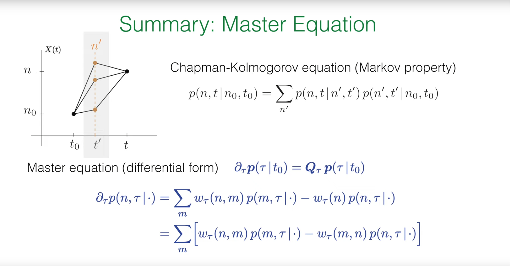


当我们将查普曼-科尔莫戈罗夫方程写成微分形式时，就得到了描述概率随时间连续演化的主方程。其通用形式为：

$$\frac{d}{dt}p(t)=Qp(t)$$

其中 $p(t)$ 是一个列向量，其元素 $p(n,t)$ 是系统在时刻 $t$ 处于状态 $n$ 的概率，而 $Q$ 是转移速率矩阵。

更具体地，主方程可以写成如下的"得失"形式：

$$\partial_t p(n,t\mid\cdot)=\sum_m w(n,m)p(m,t\mid\cdot)-w(n)p(n,t\mid\cdot)$$

这里的 $w(n,m)$ 是从状态 $m$ 转移到状态 $n$ 的速率。方程的物理意义非常直观：处于状态 $n$ 的概率 $p(n,t)$ 的变化率，等于从所有其他状态 $m$ 流入到状态 $n$ 的总速率（增益项），减去从状态 $n$ 流出到所有其他状态的总速率（损失项）。其中，总流出速率 $w(n)=\sum_m w(m,n)$。

通过重新组合项，我们还可以得到"净流"形式：

$$\partial_t p(n,t\mid\cdot)=\sum_m [w(n,m)p(m,t\mid\cdot)-w(m,n)p(n,t\mid\cdot)]$$

这个形式强调了每一对状态 $(n,m)$ 之间的概率净流。


## 1.3 不可约马尔可夫过程的核心结论


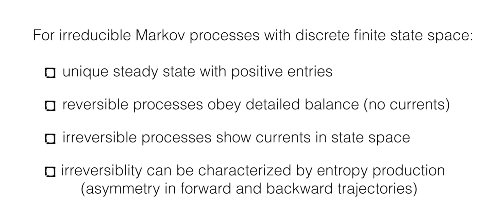


对于状态有限且不可约（即任何状态都可以通过有限步到达任何其他状态）的马尔可夫过程，我们有以下重要结论：

1. 存在一个**唯一的稳态分布** $p^{ss}$，其所有元素均为正。

2. 如果过程是**可逆的**，它将满足**细致平衡 (detailed balance)** 条件：$w(n,m)p_m^{ss}=w(m,n)p_n^{ss}$。在稳态下，任意两个状态之间的净概率流为零。

3. 如果过程是**不可逆的**，稳态下会存在持续的**概率流**，形成环路。

4. 不可逆性可以通过**熵产生**来量化，它反映了正向和反向轨迹的概率不对称性。

这些概念，特别是细致平衡，不仅是理解平衡态物理的关键，也为我们接下来要介绍的一种强大的计算方法——马尔可夫链蒙特卡洛——奠定了理论基础。

# 2. 马尔可夫链蒙特卡洛 (MCMC)
马尔可夫链蒙特卡洛（Markov Chain Monte Carlo, MCMC）方法由 Nicholas Metropolis 等人于1953年在研究核物理问题时首创（Metropolis算法），后经 W.K. Hastings 等统计学家发展为通用算法。

马尔可夫链蒙特卡洛（MCMC）方法的提出源于物理和统计学中一个棘手的基础性问题：如何在一个极其巨大甚至无限的状态空间中计算一个物理量的平均值或对一个复杂的概率分布进行抽样。直接对所有状态求和或积分在计算上是不可行的。MCMC的提出正是为了解决这一难题，其核心思想是“用时间换空间”：它放弃了遍历整个空间，转而设计一个巧妙的随机行走过程，即**马尔可夫链**。

这条链被精确构建，使其最终会“忘记”初始状态，并收敛到一个唯一的稳态分布，而这个稳态分布恰好就是我们想要研究的目标概率分布（例如，物理学中的玻尔兹曼分布）。因此，我们只需让这个随机过程运行足够长的时间，然后收集它所访问的状态样本，这些样本就自然地代表了目标分布，我们便可以用这些样本的简单平均来近似真实的系综平均值。

其具体应用极其广泛，早已超越其物理学起源：
1.  **统计物理学**：这是其经典应用，用于模拟伊辛模型、晶格规范理论等，计算磁化率、比热等宏观热力学性质。
2.  **贝叶斯统计与机器学习**：MCMC是现代贝叶斯推断的基石。当模型的后验概率分布极其复杂、无法解析求解时，MCMC方法（如Gibbs抽样、Metropolis-Hastings算法）被用来从中抽取样本，从而估计模型参数、进行模型选择和预测。
3.  **计算生物学**：用于推断物种间的进化关系（系统发育树）、进行基因序列比对和模拟蛋白质折叠。
4.  **金融工程**：用于金融衍生品定价和风险价值（VaR）的计算，对复杂的随机过程进行建模。


## 2.1 核心思想：用马尔可夫链进行抽样
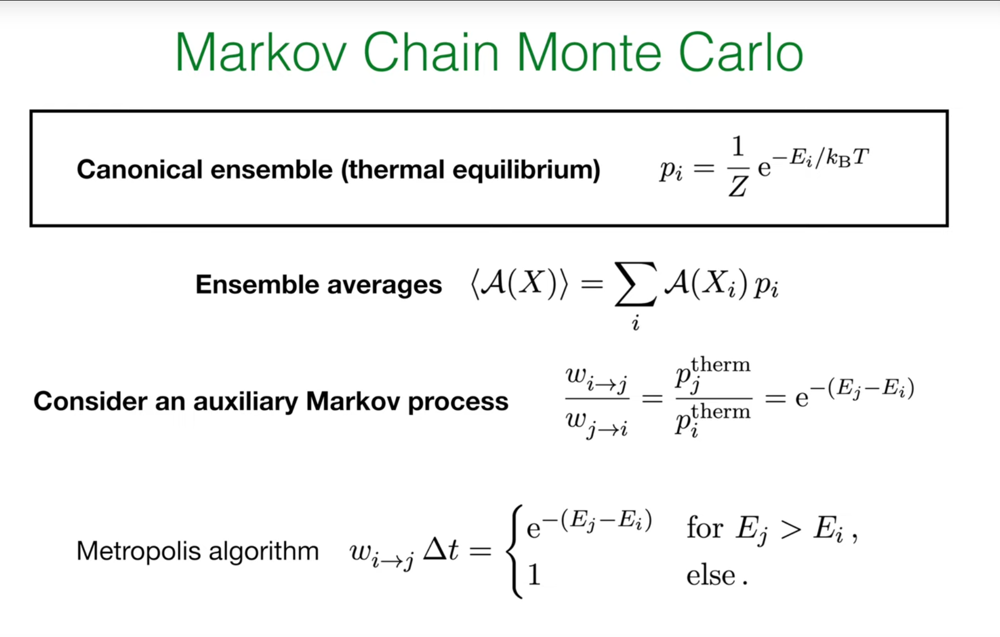

在统计物理中，我们经常需要计算某个物理量 $A$ 的系综平均值，例如磁化强度或能量。其定义为：

$$\langle A(X) \rangle = \sum_i A(X_i)p_i$$

其中 $X_i$ 是系统的一个微观状态（例如，一个具体的自旋构型），$p_i$ 是该状态出现的概率。对于处于热平衡的系统，这个概率由正则系综 (canonical ensemble) 的玻尔兹曼分布给出：

$$p_i = \frac{1}{Z} e^{-E_i/k_B T}$$

这里 $E_i$ 是状态 $i$ 的能量，$T$ 是温度，$k_B$ 是玻尔兹曼常数，$Z$ 是配分函数 1。

问题在于，对于一个包含大量粒子（比如一个 $50\times 50$ 的伊辛模型，有 $2^{2500}$ 个状态）的系统，直接计算这个求和是绝对不可能的。

**马尔可夫链蒙特卡洛 (MCMC)** 方法提供了一个绝妙的解决方案。它的核心思想是：我们不再尝试遍历所有状态，而是设计一个辅助的马尔可夫过程，使其稳态分布恰好是我们想要抽样的目标分布 $p_i$。然后，我们让这个马尔可夫过程演化足够长的时间，它所访问的状态序列 $X_1,X_2,\ldots,X_N$ 就会像是从 $p_i$ 中抽取的一系列样本。于是，复杂的系综平均计算就转化为了一个简单的算术平均：

$$\langle A(X) \rangle \approx \frac{1}{N}\sum_{k=1}^N A(X_k)$$


## 2.2 Metropolis 算法

如何巧妙地设计一个马尔可夫过程，使其稳态恰好是玻尔兹曼分布呢？Metropolis 算法给出了一个非常优雅和通用的答案。

1. **目标**：构建一个转移速率为 $w_{i\to j}$ 的马尔可夫过程，使得其稳态分布 $p_i^{ss}$ 正比于 $p_i^{\text{therm}}=e^{-E_i/k_B T}$。

2. **充分条件**：根据我们刚才的回顾，**细致平衡**是一个足以保证系统达到所需稳态的条件。我们只需要让转移速率满足：

$$w_{i\to j}p_i^{\text{therm}}=w_{j\to i}p_j^{\text{therm}}$$

3. **推导**：将 $p_i^{\text{therm}}$ 的表达式代入，我们可以得到对转移速率比值的要求：

$$\frac{w_{j\to i}}{w_{i\to j}}=\frac{p_i^{\text{therm}}}{p_j^{\text{therm}}}=\frac{e^{-E_i/k_B T}}{e^{-E_j/k_B T}}=e^{-(E_j-E_i)/k_B T}$$

4. 这个关系式是Metropolis算法的核心。它将微观动力学（转移速率）与系统的能量景观（能量差）联系了起来。

5. **Metropolis 的选择**：满足上述比值的 $w_{i\to j}$ 有很多种选择。Metropolis 提出了一种非常简单且有效的构造方法。该算法分为两步：**提议 (propose)** 和 **接受/拒绝 (accept/reject)。**

   * **提议**：从当前状态 $i$，随机地提议一个新状态 $j$。最简单的方式是对状态 $i$ 做一个微小的随机扰动（例如，在伊辛模型中随机翻转一个自旋）。假设从 $i$ 提议 $j$ 和从 $j$ 提议 $i$ 的概率是相等的（即提议分布是对称的）。

   * **接受/拒绝**：计算能量变化 $\Delta E=E_j-E_i$。

     * 如果 $\Delta E\leq 0$（新状态能量更低或相等），则**总是接受**这个提议，系统转移到状态 $j$。

     * 如果 $\Delta E>0$（新状态能量更高），则以一定的概率 $P_{\text{accept}}=e^{-\Delta E/k_B T}$ **接受**这个提议。具体操作是：生成一个 $[0,1)$ 之间的随机数 $r$，如果 $r<P_{\text{accept}}$，则接受转移；否则，**拒绝**提议，系统**保持在原状态** $i$ 不变。

这个接受准则，即接受概率为 $\min(1,e^{-\Delta E/k_B T})$，恰好满足了细致平衡的要求。它直观地体现了物理过程：系统倾向于向低能量状态演化，但由于热涨落的存在，它也有一定概率跳到能量更高的状态，从而能够探索整个状态空间，而不是仅仅陷入某个局部能量最低点。


## 2.3 Python 模拟：二维伊辛模型

为了具体感受 Metropolis 算法的威力，我们用它来模拟一个经典的物理系统：**二维伊辛模型 (2D Ising Model)。**这是一个描述铁磁性的简化模型，由一个二维晶格构成，每个格点上有一个自旋，其状态为"上"(+1)或"下"(-1)。

系统的总能量（哈密顿量）由下式给出：

$$H = -J \sum_{\langle i,j \rangle} S_i S_j$$

其中 $\sum_{\langle i,j \rangle}$ 表示对所有最近邻的自旋对求和，$S_i$ 和 $S_j$ 是相邻格点上的自旋值。我们设耦合常数 $J=1$。当相邻自旋方向相同时 $(S_i S_j = 1)$，能量贡献为 $-J$，系统能量降低；方向相反时 $(S_i S_j = -1)$，能量贡献为 $+J$，系统能量升高。因此，系统在低温下倾向于所有自旋朝向一致，形成宏观磁化，即铁磁态。

下面的 Python 代码实现了 Metropolis 算法来模拟二维伊辛模型。


```python
import numpy as np
import matplotlib.pyplot as plt
from matplotlib.animation import FuncAnimation

def initialize_lattice(N):
    """
    Initialize an N x N lattice with random spin states of +1 or -1.
    """
    return 2 * np.random.randint(2, size=(N, N)) - 1

def calculate_energy_change(lattice, i, j):
    """
    Calculate the energy change caused by flipping the spin at position (i, j).
    Periodic boundary conditions are used.
    """
    N = lattice.shape[0]
    s_current = lattice[i, j]
    
    # Find spin values of the four neighboring sites (top, bottom, left, right)
    s_top = lattice[(i - 1) % N, j]
    s_bottom = lattice[(i + 1) % N, j]
    s_left = lattice[i, (j - 1) % N]
    s_right = lattice[i, (j + 1) % N]
    
    # Energy change dE = E_final - E_initial
    # E_initial = -J * s_current * (s_top + s_bottom + s_left + s_right)
    # E_final = -J * (-s_current) * (s_top + s_bottom + s_left + s_right)
    # dE = E_final - E_initial = 2 * J * s_current * (sum of neighbors)
    # Set J=1
    dE = 2 * s_current * (s_top + s_bottom + s_left + s_right)
    return dE

def metropolis_sweep(lattice, beta):
    """
    Perform one complete Metropolis scan (N*N attempts).
    beta = 1 / (k_B * T)
    """
    N = lattice.shape[0]
    for _ in range(N * N):
        # Randomly select a lattice site
        i, j = np.random.randint(0, N, size=2)
        
        # Calculate energy change
        dE = calculate_energy_change(lattice, i, j)
        
        # Metropolis acceptance/rejection criterion
        if dE <= 0 or np.random.rand() < np.exp(-beta * dE):
            lattice[i, j] *= -1 # Accept flip
            
    return lattice

# --- Simulation parameters ---
N = 50  # Lattice size
T = 1.5 # Temperature (critical temperature Tc is approximately 2.269)
beta = 1.0 / T
n_sweeps = 3000 # Total number of sweeps for simulation
frame_interval = 50 # Record a frame every this many sweeps

# --- Initialization ---
lattice = initialize_lattice(N)

# Set up visualization
fig, ax = plt.subplots(figsize=(10, 8))
im = ax.imshow(lattice, cmap='RdYlBu', vmin=-1, vmax=1, interpolation='nearest')
ax.set_title(f'2D Ising Model (T = {T:.2f}, Sweep = 0)', fontsize=16)
ax.set_axis_off()

# Add color bar
cbar = plt.colorbar(im, ax=ax, shrink=0.8)
cbar.set_label('Spin', fontsize=14)

# --- Simulation and animation ---
def update(frame):
    global lattice
    # Perform frame_interval sweeps
    for _ in range(frame_interval):
        lattice = metropolis_sweep(lattice, beta)
    im.set_data(lattice)
    ax.set_title(f'2D Ising Model (T = {T:.2f}, Sweep = {frame * frame_interval})', fontsize=16)
    return [im]

# Create animation
ani = FuncAnimation(fig, update, frames=n_sweeps // frame_interval,
                    interval=100, blit=False, repeat=False)

plt.tight_layout()
plt.show()

# Save as GIF file

import imageio
print("Saving animation as GIF file...")
    
    # Re-run simulation to capture all frames
lattice_gif = initialize_lattice(N)
    
    # Create images for GIF
fig_gif, ax_gif = plt.subplots(figsize=(10, 8))
im_gif = ax_gif.imshow(lattice_gif, cmap='RdYlBu', vmin=-1, vmax=1, interpolation='nearest')
ax_gif.set_title(f'2D Ising Model (T = {T:.2f}, Sweep = 0)', fontsize=16)
ax_gif.set_axis_off()
cbar_gif = plt.colorbar(im_gif, ax=ax_gif, shrink=0.8)
cbar_gif.set_label('Spin', fontsize=14)
    
with imageio.get_writer('ising_model.gif', mode='I', duration=0.1, loop=0) as writer:
        # Save initial state
    fig_gif.canvas.draw()
    image_array = np.array(fig_gif.canvas.renderer._renderer)
    writer.append_data(image_array[:, :, :3])
    print(f"Saved 0/{n_sweeps // frame_interval} frames")
        
        # Step through simulation and save each frame
    for i in range(n_sweeps // frame_interval):
        for _ in range(frame_interval):
            lattice_gif = metropolis_sweep(lattice_gif, beta)
        im_gif.set_data(lattice_gif)
        ax_gif.set_title(f'2D Ising Model (T = {T:.2f}, Sweep = {(i+1) * frame_interval})', fontsize=16)
        fig_gif.canvas.draw()
        image_array = np.array(fig_gif.canvas.renderer._renderer)
        writer.append_data(image_array[:, :, :3])
            
        if (i+1) % 10 == 0:
            print(f"Saved {i+1}/{n_sweeps // frame_interval} frames")
    
plt.close(fig_gif)
```
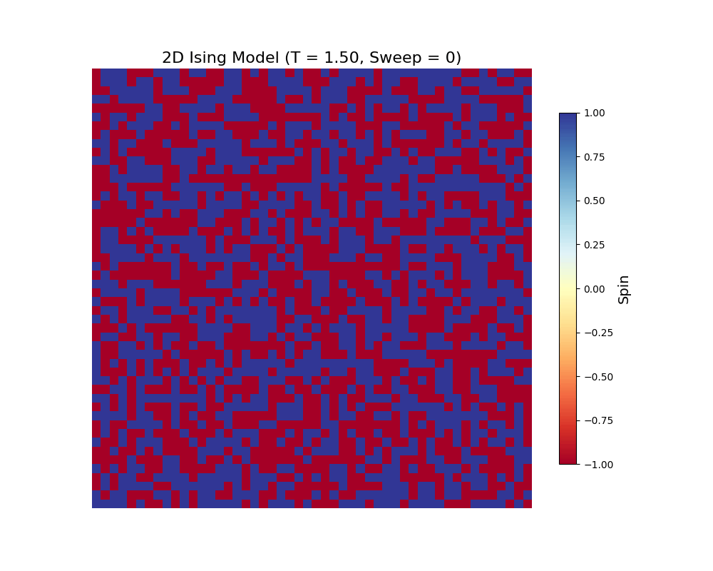


当温度 *T* 设置在临界温度 *Tc*≈2.269 以下时（例如 *T*=1.5），你会观察到系统从初始的随机“椒盐”状态，逐渐演化出大片的同向自旋“畴”。最终，整个系统会趋向于一个几乎完全有序的铁磁态（全蓝或全红）。这个过程生动地展示了Metropolis算法如何通过遵循简单的**局部规则**（满足细致平衡的接受/拒绝准则），成功地引导系统找到其**全局的**低能平衡态，从而涌现出宏观的有序结构。这正是统计力学中从微观规则到宏观行为的精髓所在。


# 3. 连续状态空间中的马尔可夫过程

现在，我们准备进行这节课的核心跨越：将马尔可夫过程的描述从离散状态（如自旋状态 $\pm 1$）推广到连续状态空间。这意味着系统的状态变量 $\vec{X}(t)$ 可以在一个连续的域中取值，例如 $\vec{X}(t)\in\mathbb{R}^d$。为了建立直观的理解，教授在讲座中列举了几个典型的物理和生物学例子。

**1. 布朗运动 (Brownian Motion)**

一个悬浮在液体中的花粉颗粒，由于受到大量微小的、随机的水分子碰撞，会进行永不停歇的无规则运动。这个颗粒的位置 $X(t)\in\mathbb{R}^3$ 就是一个连续的状态变量。它的轨迹看起来是连续但处处不可微的，充满了锯齿状的随机行走。

**2. 分子马达 (Molecular Motors)**

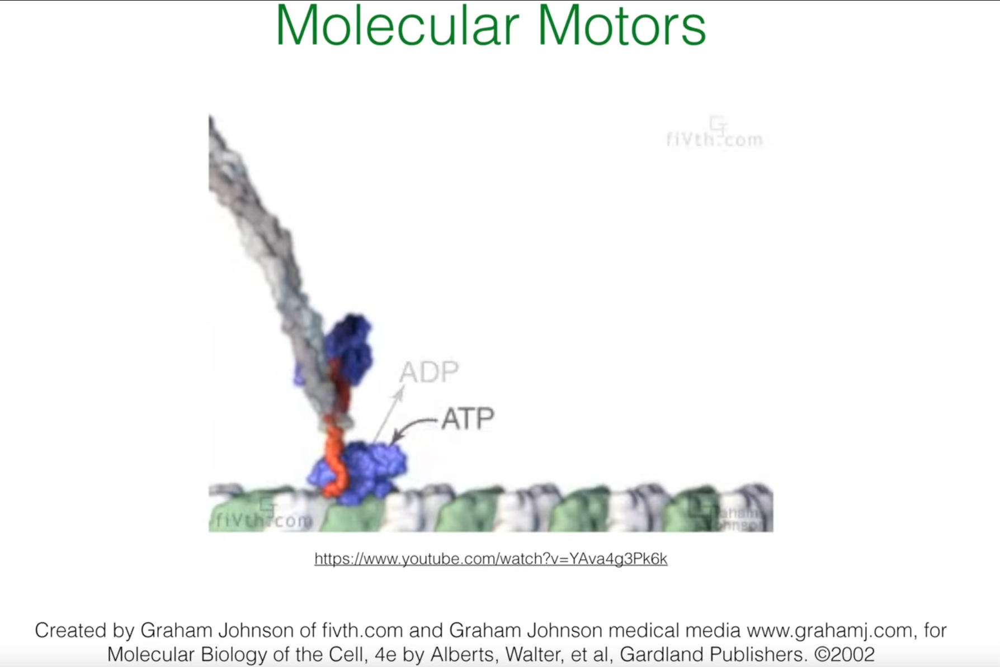


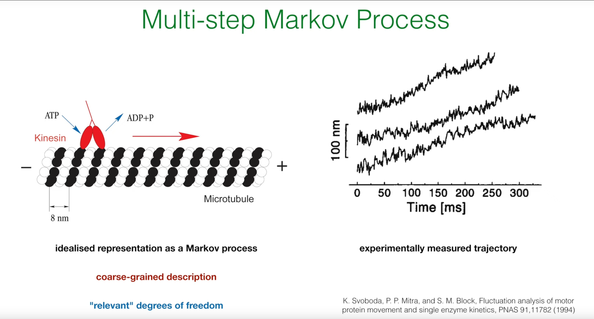

以驱动蛋白（Kinesin）为例，它像一个微型搬运工，沿着细胞内的微管轨道"行走"来运输物质。它的每一步大小是固定的（约 8 nm），因此从宏观上看，其运动可以被粗粒化地描述为一个在微管上的位置变量 $x(t)$。虽然底层的化学反应（ATP水解）是离散事件，但其位置轨迹混合了离散的跳跃和在每个结合位点附近的热振动。

**3. 细菌趋化性 (Bacterial Chemotaxis)**

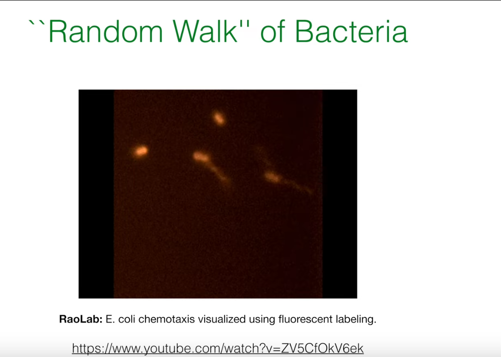

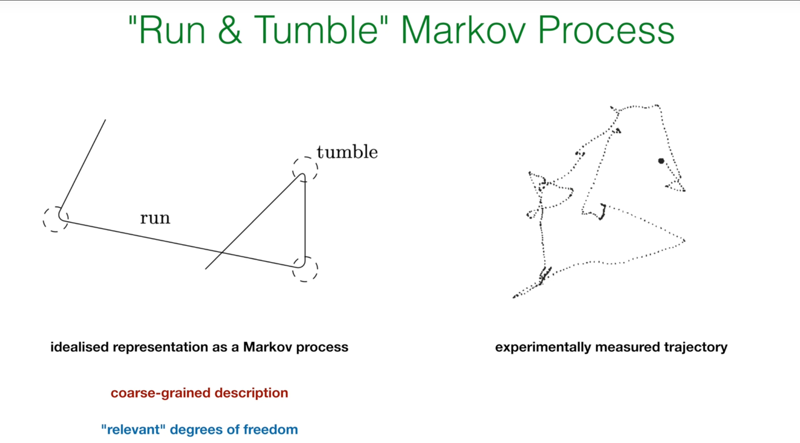

大肠杆菌在环境中寻找食物时，会采用一种"奔跑-翻滚 (Run & Tumble)"的运动策略。在"奔跑"阶段，它沿着一个方向直线前进；在"翻滚"阶段，它会原地随机改变方向。描述这个过程的状态变量至少需要位置 $x(t)$ 和方向 $\theta(t)$，两者都是连续的。其轨迹由平滑的直线段和瞬时的方向改变构成。

这三个例子并非随意挑选，它们巧妙地预示了我们即将要建立的不同数学模型。布朗运动是**纯扩散过程**的典范，其样本路径是连续的。驱动蛋白的运动是**跳跃过程**的代表，其样本路径是分段常数、不连续的。而细菌的运动则是一个**混合过程**，既包含连续的运动，也包含离散的事件。这些物理图像为我们接下来推导的抽象数学方程提供了具体的物理情景。

# 4. 样本路径与演化方程

从离散到连续，最核心的变化在于我们如何描述状态之间的“转移”。对于连续空间，我们不再使用概率 $P_n(t)$，而是使用概率密度函数 (Probability Density Function, PDF) $P(x, t)$。$P(x, t) dx$ 表示在时刻 $t$ 发现系统处于以 $x$ 为中心的微小体积元 $dx$ 内的概率。

## 4.1 路径的两种性质

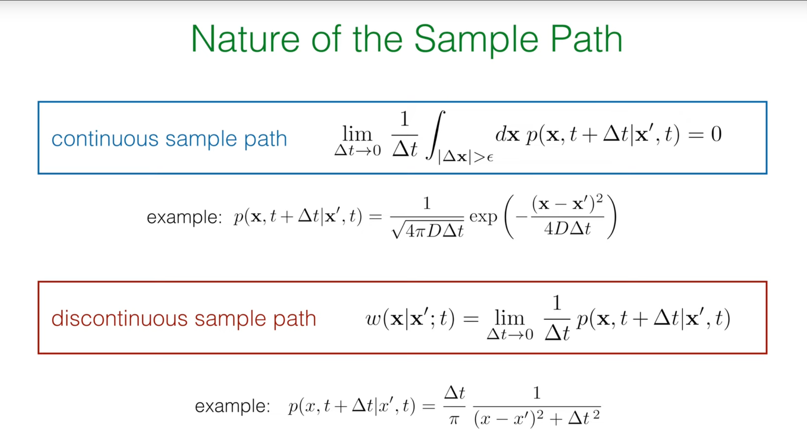

根据系统状态随时间演化的轨迹（样本路径）的性质，我们可以将连续空间中的马尔可夫过程分为两大类。这个分类的数学判据（Kramers-Moyal条件）是看在一个无穷小的时间间隔 $\Delta t$ 内，系统发生一个大于任意小量 $\epsilon$ 的位移的概率如何随 $\Delta t$ 变化。

**1. 连续样本路径 (Continuous Sample Path)**

对于这类过程，系统状态的改变是平滑的，不会发生瞬时的、有限大小的跳跃。数学上，这意味着在一个小时间隔 $\Delta t$ 内发生大跳跃的概率趋近于零的速度比 $\Delta t$ 本身还要快：


$$
\lim_{\Delta t \to 0} \frac{1}{\Delta t} \int_{|\Delta x|>\epsilon} dx\ p(x,t+\Delta t\mid x',t) = 0
$$

布朗运动就是最典型的例子。其转移概率密度是一个高斯分布（正态分布），方差正比于 $\Delta t$：


$$
p(x,t+\Delta t\mid x',t) = \frac{1}{\sqrt{4\pi D\Delta t}} \exp\left(-\frac{(x-x')^2}{4D\Delta t}\right)
$$

当 $\Delta t\to 0$ 时，这个分布会无限集中在起点 $x'$ 附近，表明发生大跳跃的概率极低。

**2. 不连续样本路径 (Discontinuous Sample Path)**

   对于这类过程，系统可以发生瞬时的、有限大小的跳跃。此时，在 $\Delta t\to 0$ 的极限下，转移概率密度除以 $\Delta t$ 会收敛到一个有限的转移速率密度 (transition rate density) $w(x|x')$：

$$
w(x\mid x';t) = \lim_{\Delta t \to 0} \frac{1}{\Delta t} p(x,t+\Delta t\mid x',t)
$$


$w(x\mid x')dx$ 可以理解为系统当前在 $x'$ 处，单位时间内跳跃到以 $x$ 为中心的微小区间 $dx$ 内的速率。驱动蛋白的步进运动就属于此类。


## 4.2 演化方程的推导


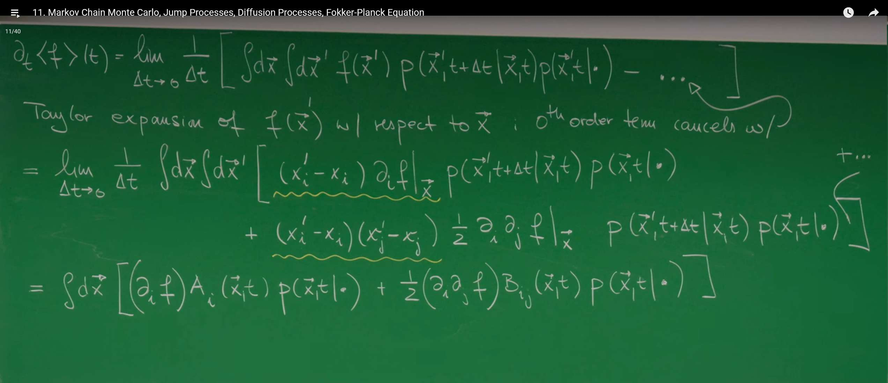

我们的目标是找到一个描述概率密度 $P(\vec{x},t)$ 随时间演化的方程，它将是连续空间版本的"主方程"。推导的起点是考察任意一个光滑可观测量 $f(\vec{x})$ 的期望值随时间的变化率 $\partial_t \langle f \rangle(t)$ (1)。

$$\partial_t \langle f \rangle(t) = \partial_t \int d\vec{x}\ f(\vec{x}) P(\vec{x},t\mid\cdot)$$

根据导数的定义，我们有：

$$\partial_t \langle f \rangle(t) = \lim_{\Delta t \to 0} \frac{1}{\Delta t} \left[ \int d\vec{x}\ f(\vec{x}) P(\vec{x},t+\Delta t\mid\cdot) - \int d\vec{x}\ f(\vec{x}) P(\vec{x},t\mid\cdot) \right]$$

这里的关键一步是使用查普曼-科尔莫戈罗夫方程来表达 $P(\vec{x},t+\Delta t|\cdot)$：

$$P(\vec{x},t+\Delta t\mid\cdot) = \int d\vec{x}'\ P(\vec{x},t+\Delta t\mid\vec{x}',t) P(\vec{x}',t\mid\cdot)$$

将此式代入，并利用概率守恒 $\int d\vec{x}'\ P(\vec{x}',t+\Delta t\mid\vec{x},t)=1$，经过巧妙的变换，我们可以得到一个统一的出发点。接下来，我们将根据路径是"跳跃"还是"扩散"这两种情况，对这个表达式进行不同的处理。


## 4.3 情况一：纯跳跃过程

对于不连续的样本路径，我们使用之前定义的转移速率密度 $w(\vec{x}|\vec{x}')$。将它代入到 $\partial_t \langle f \rangle(t)$ 的表达式中，并交换积分变量的次序，最终可以得到：

$$\partial_t \langle f \rangle(t) = \int d\vec{x}\ f(\vec{x}) \int d\vec{x}'\ [w(\vec{x}\mid\vec{x}',t) P(\vec{x}',t\mid\cdot) - w(\vec{x}'\mid\vec{x},t) P(\vec{x},t\mid\cdot)]$$

由于这个方程必须对任意选择的函数 $f(\vec{x})$ 都成立，我们可以直接去掉外层的 $\int d\vec{x}\ f(\vec{x})$，从而得到概率密度 $P(\vec{x},t)$ 自身的演化方程：

$$\partial_t P(\vec{x},t\mid\cdot) = \int d\vec{x}'\ [w(\vec{x}\mid\vec{x}',t) P(\vec{x}',t\mid\cdot) - w(\vec{x}'\mid\vec{x},t) P(\vec{x},t\mid\cdot)]$$

这就是**连续状态空间的主方程** (1)。它的结构与离散主方程完全一致：第一项是是所有其他位置 $\vec{x}'$ 跳入 $\vec{x}$ 的增益项，第二项是从 $\vec{x}$ 跳出到所有其他位置的损失项。唯一的区别是，离散求和 $\sum_m$ 被连续积分 $\int d\vec{x}'$ 所取代。

## 4.4 情况二：纯扩散过程与福克-普朗克方程

对于连续的样本路径，情况则完全不同。我们不能定义一个跳转速率，因为系统总是在当前位置的邻域内移动。此时，我们回到 $\partial_t \langle f \rangle(t)$ 的推导过程，对函数 $f(\vec{x}')$ 在点 $\vec{x}$ 附近进行泰勒展开：

$$f(\vec{x}') = f(\vec{x}) + (x_i'-x_i)\partial_i f(\vec{x}) + \frac{1}{2}(x_i'-x_i)(x_j'-x_j)\partial_i \partial_j f(\vec{x}) + \ldots$$

将这个展开式代入，我们会发现表达式中出现了位移 $\Delta \vec{x}=\vec{x}'-\vec{x}$ 的各阶矩。对于扩散过程，我们假设只有前两阶矩在 $\Delta t\to 0$ 的极限下是非零的。

我们定义这两个重要的物理量：

**1. 漂移矢量 (Drift Vector)** $A_i(\vec{x},t)$:

$$
A_i(x, t) := \lim_{\Delta t \to 0} \frac{1}{\Delta t} \int dx' (x'_i - x_i) P(x', t + \Delta t \mid x, t) \equiv \left. \frac{\langle \Delta x_i \rangle}{\Delta t} \right|_{\Delta t \to 0}
$$

   它描述了在 $\vec{x}$ 点的粒子所感受到的平均速度或系统性的"漂移"。

**2. 扩散矩阵 (Diffusion Matrix)** $B_{ij}(\vec{x},t)$:

$$
B_{ij}(x, t) := \lim_{\Delta t \to 0} \frac{1}{\Delta t} \int dx' (x'_i - x_i)(x'_j - x_j) P(x', t + \Delta t \mid x, t) \equiv \left. \frac{\langle \Delta x_i \Delta x_j \rangle}{\Delta t} \right|_{\Delta t \to 0}
$$

它描述了随机力的强度和关联性，即位移的协方差。对角元素 $B_{ii}$ 描述了沿 $i$ 方向的扩散强度，非对角元素 $B_{ij}$ 描述了不同方向上随机运动的关联。

将泰勒展开和这两个定义代入 $\partial_t \langle f \rangle(t)$ 的表达式，并使用分部积分法将导数从测试函数 $f$ 转移到概率密度 $P$ 上，经过一番推导，我们最终得到一个关于 $P(\vec{x},t)$ 的偏微分方程——**福克-普朗克方程 (Fokker-Planck Equation)：**


$$\partial_t P(\vec{x}, t \mid \cdot) = -\partial_i \left[ A_i(\vec{x}, t) P(\vec{x}, t \mid \cdot) \right] + \frac{1}{2} \partial_i \partial_j \left[ B_{ij}(\vec{x}, t) P(\vec{x}, t \mid \cdot) \right]$$

这个方程是统计物理中最重要的方程之一。它的物理意义可以被理解为一个概率守恒的**连续性方程** $\partial_t P = -\nabla \cdot \vec{J}_P$，其中概率流密度 $\vec{J}_P$ 由两部分组成：

* **漂移流 (Drift Current)**: $\vec{J}_{\text{drift}} = \vec{A} P$。由系统性的力驱动。

* **扩散流 (Diffusion Current)**: $\vec{J}_{\text{diff}} = -\frac{1}{2} \nabla \cdot (\mathbf{B} P)$。由随机涨落引起，总是从高概率密度区域流向低概率密度区域。

福克-普朗克方程的推导过程完美地展示了统计力学如何连接微观与宏观。方程本身是**确定性的**：给定一个初始的概率分布 $P(\vec{x},0)$，它的未来演化 $P(\vec{x},t)$ 就被唯一确定了。然而，方程的系数——漂移项 $\vec{A}$ 和扩散项 $\mathbf{B}$——却是由底层的**微观随机**行走的统计性质（均值和方差）所决定的。这揭示了一个深刻的原理：虽然单个粒子的轨迹是不可预测的，但大量粒子组成的系综的概率分布演化却是可以被一个确定性的宏观定律所描述的。


Fokker-Planck方程，也称为 Kolmogorov 前向方程，是描述随机系统演化的核心方程，它从朗之万方程对布朗运动的微观描述出发，通过统计平均刻画出系统概率分布随时间的确定性演化脉络。该方程精妙地刻画了确定性力（由漂移项 $A_i$ 描述）与随机涨落（由扩散项 $B_{ij}$ 描述）之间的竞争与平衡。

其具体应用极为广泛，贯穿于现代科学与工程领域：在统计物理中，它用于研究系统如何弛豫到由玻尔兹曼分布给出的热力学平衡态；在金融数学中，它是Black-Scholes模型等期权定价理论的基础，用于描述资产价格的随机波动；在系统生物学中，它模拟细胞内化学物质浓度的涨落和基因表达噪声；在神经科学中，它刻画神经元膜电位的随机触发过程；在气象学和流体力学中，它用于研究污染物在湍流中的扩散和输运。简而言之，Fokker-Planck方程为我们提供了一套强大的数学框架，用以理解和预测无处不在的随机现象，是从微观粒子到宏观市场的“随机动力学之魂”。

## 4.5 Python 模拟：二维布朗运动

为了直观地理解扩散过程和福克-普朗克方程的解，我们可以模拟最简单的情况：一个在二维平面上自由扩散的粒子。此时，没有漂移（$A=0$），扩散是各向同性的（$B_{ij}=2D\delta_{ij}$，其中 $D$ 是扩散系数）。对应的福克-普朗克方程就是著名的扩散方程：

$$\partial_t P = D \nabla^2 P$$

这个方程的解是一个均值为零、方差随时间线性增大的高斯分布。

我们可以通过模拟一个二维随机行走 (2D Random Walk) 来近似这个过程。在每个离散的时间步 $\Delta t$ 内，粒子的位置发生一个随机位移：

$$\vec{X}(t+\Delta t) = \vec{X}(t) + \sqrt{2D\Delta t} \cdot \vec{\eta}$$

其中 $\vec{\eta}$ 是一个二维标准正态分布的随机向量（即其分量是均值为0，方差为1的独立高斯随机数）。

下面的 Python 代码模拟了多个从原点出发的二维随机行走轨迹。


```python
import numpy as np
import matplotlib.pyplot as plt
from matplotlib.animation import FuncAnimation

# --- Simulation parameters ---
n_walkers = 10      # Number of particles to simulate
n_steps = 1000      # Number of steps for each particle
dt = 0.01           # Time step size
D = 1.0             # Diffusion coefficient

# --- Simulation process ---
# Generate random displacements for all steps
# Shape is (n_walkers, n_steps, 2), representing (particle, step, x/y coordinates)
# np.random.randn generates standard normal distribution random numbers
random_displacements = np.random.randn(n_walkers, n_steps, 2) * np.sqrt(2 * D * dt)

# Calculate trajectories for each particle
# np.cumsum(..., axis=1) performs cumulative sum along the time step dimension
# Initial position is (0,0)
trajectories = np.cumsum(random_displacements, axis=1)

# --- Visualization ---
fig, ax = plt.subplots(figsize=(8, 8))

# Plot trajectory of each particle
for i in range(n_walkers):
    # trajectories[i, :, 0] is all x coordinates of particle i
    # trajectories[i, :, 1] is all y coordinates of particle i
    ax.plot(trajectories[i, :, 0], trajectories[i, :, 1], alpha=0.7)

# Mark start and end points
start_points = np.zeros((n_walkers, 2))
end_points = trajectories[:, -1, :]  # Take the last point of each trajectory
ax.scatter(start_points[:, 0], start_points[:, 1], color='red', s=100, zorder=3, label='Start')
ax.scatter(end_points[:, 0], end_points[:, 1], color='green', s=50, zorder=3, label='End')

ax.set_title(f'2D Brownian Motion ({n_walkers} walkers, {n_steps} steps)')
ax.set_xlabel('X Position')
ax.set_ylabel('Y Position')
ax.legend()
ax.grid(True)
ax.set_aspect('equal', adjustable='box')
plt.show()

# --- Plot distribution of end points ---
fig_hist, ax_hist = plt.subplots(figsize=(10, 8))

# Increase number of particles to better show Gaussian distribution
n_walkers_hist = 1000  # Increased number of particles
random_displacements_hist = np.random.randn(n_walkers_hist, n_steps, 2) * np.sqrt(2 * D * dt)
trajectories_hist = np.cumsum(random_displacements_hist, axis=1)
end_points_hist = trajectories_hist[:, -1, :]

# Use more bins and better color mapping to show distribution
hist_plot = ax_hist.hist2d(end_points_hist[:, 0], end_points_hist[:, 1], bins=50, cmap='hot')
ax_hist.set_title('Distribution of End Points\n(2D Gaussian Distribution)', fontsize=16)
ax_hist.set_xlabel('Final X Position', fontsize=12)
ax_hist.set_ylabel('Final Y Position', fontsize=12)
ax_hist.set_aspect('equal', adjustable='box')

# Add theoretical contour lines
x_min, x_max = np.min(end_points_hist[:, 0]), np.max(end_points_hist[:, 0])
y_min, y_max = np.min(end_points_hist[:, 1]), np.max(end_points_hist[:, 1])
x = np.linspace(x_min, x_max, 100)
y = np.linspace(y_min, y_max, 100)
X, Y = np.meshgrid(x, y)
# Theoretical variance
sigma_squared = 2 * D * n_steps * dt
Z = np.exp(-(X**2 + Y**2) / (2 * sigma_squared))
ax_hist.contour(X, Y, Z, levels=5, colors='blue', alpha=0.6, linewidths=1)

# Add color bar
cbar = plt.colorbar(hist_plot[3], ax=ax_hist, label='Number of walkers')
cbar.set_label('Number of walkers', fontsize=12)

plt.tight_layout()
plt.show()

# --- Plot 1D projection distributions ---
fig_proj, (ax_x, ax_y) = plt.subplots(1, 2, figsize=(12, 5))

# X-direction projection
ax_x.hist(end_points_hist[:, 0], bins=50, density=True, alpha=0.7, color='skyblue', edgecolor='black', linewidth=0.5)
# Theoretical X-direction distribution
sigma = np.sqrt(2 * D * n_steps * dt)
x_range = np.linspace(np.min(end_points_hist[:, 0]), np.max(end_points_hist[:, 0]), 100)
gaussian_x = 1/np.sqrt(2*np.pi*sigma**2) * np.exp(-x_range**2/(2*sigma**2))
ax_x.plot(x_range, gaussian_x, 'r-', linewidth=2, label=f'Theoretical Gaussian\n$\\sigma^2 = {sigma**2:.2f}$')
ax_x.set_xlabel('X Position')
ax_x.set_ylabel('Probability Density')
ax_x.set_title('X Distribution')
ax_x.legend()
ax_x.grid(True, alpha=0.3)

# Y-direction projection
ax_y.hist(end_points_hist[:, 1], bins=50, density=True, alpha=0.7, color='lightcoral', edgecolor='black', linewidth=0.5)
ax_y.plot(x_range, gaussian_x, 'r-', linewidth=2, label=f'Theoretical Gaussian\n$\\sigma^2 = {sigma**2:.2f}$')
ax_y.set_xlabel('Y Position')
ax_y.set_ylabel('Probability Density')
ax_y.set_title('Y Distribution')
ax_y.legend()
ax_y.grid(True, alpha=0.3)

plt.tight_layout()
plt.show()

# --- Create Brownian motion animation ---
fig_anim, ax_anim = plt.subplots(figsize=(8, 8))

# Set animation parameters
n_frames = 200  # Number of animation frames
step_interval = n_steps // n_frames  # Steps between each frame

# Initialize animation elements
lines = [ax_anim.plot([], [], alpha=0.7)[0] for _ in range(n_walkers)]
points = ax_anim.scatter([], [], color='red', s=50, zorder=3)

# Set axes
ax_anim.set_xlim(np.min(trajectories[:, :, 0]), np.max(trajectories[:, :, 0]))
ax_anim.set_ylim(np.min(trajectories[:, :, 1]), np.max(trajectories[:, :, 1]))
ax_anim.set_title('2D Brownian Motion Animation')
ax_anim.set_xlabel('X Position')
ax_anim.set_ylabel('Y Position')
ax_anim.grid(True)
ax_anim.set_aspect('equal', adjustable='box')

def animate(frame):
    # Calculate which step to display for current frame
    step = min(frame * step_interval, n_steps - 1)
    
    # Update each trajectory
    for i in range(n_walkers):
        lines[i].set_data(trajectories[i, :step, 0], trajectories[i, :step, 1])
    
    # Update current point positions
    current_points = trajectories[:, step, :]
    points.set_offsets(current_points)
    
    ax_anim.set_title(f'2D Brownian Motion (Step {step}/{n_steps})')
    return lines + [points]

# Create animation
anim = FuncAnimation(fig_anim, animate, frames=n_frames, interval=50, blit=False, repeat=True)
plt.show()

# Save animation as GIF
try:
    import imageio
    import io
    from PIL import Image
    
    print("Saving Brownian motion animation as GIF file...")
    
    # Create temporary image list
    images = []
    
    # Generate animation frames
    for frame in range(0, n_frames, 2):  # Take every other frame to reduce file size
        animate(frame)
        fig_anim.canvas.draw()
        
        # Convert figure to image
        buf = io.BytesIO()
        fig_anim.savefig(buf, format='png', dpi=100)
        buf.seek(0)
        img = Image.open(buf)
        images.append(img)
        
        if frame % 20 == 0:
            print(f"Processed {frame}/{n_frames} frames")
    
    # Save as GIF
    images[0].save('brownian_motion.gif', save_all=True, append_images=images[1:], 
                   duration=100, loop=0)
    print("Animation saved as brownian_motion.gif")
    
except ImportError:
    print("Missing libraries required to save GIF (imageio or PIL), please install: pip install imageio pillow")

plt.show()
```

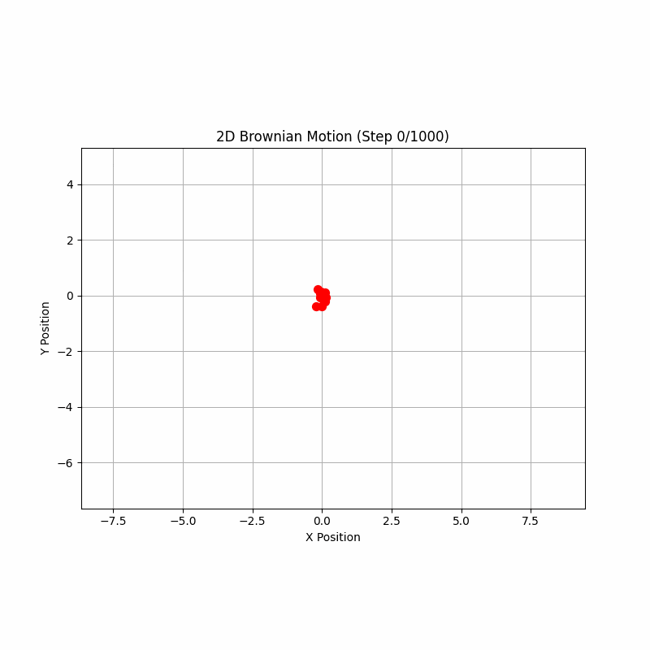

10个独立的“随机漫步者”（walkers）从同一个中心点（红色圆点）出发，经过1000个时间步后的运动轨迹。每一条彩色曲线都代表了一个粒子可能经历的一种独特历史路径。这张图正是福克-普朗克方程所描述的微观基础。方程本身并不关心某一条具体的、曲折的路径，而是致力于描述大量此类路径在统计上共同形成的“概率云”是如何随时间演化的。

为了从杂乱的个体轨迹中洞察集体的统计规律，我们把模拟的粒子数量增加到10000个，并只关注它们的最终位置。这张图以“热图”（heatmap）的形式展示了这些终点在二维平面上的分布密度。整个分布呈现出一种圆形的、中心密集、向外逐渐稀疏的形态。这正是福克-普朗克方程在没有外部力（漂移项为零）的情况下，从一个点源（delta函数初始条件）演化出的解——一个二维高斯分布。图中叠加的蓝色同心圆是理论预测的二维高斯分布的等高线。我们可以看到，模拟数据（热图）与理论预测（等高线）吻合，福克-普朗克方程精确地捕捉了扩散过程的宏观统计行为。

这张图是连接微观随机性与宏观确定性的桥梁。虽然单个粒子的终点无法预测，但大量粒子的终点分布却遵循一个非常确定的数学规律。


为了更定量地分析这个二维高斯分布，我们可以将其分别投影到X轴和Y轴上，得到两个一维的概率密度分布图。左图（蓝色）显示了所有粒子最终X坐标的分布，右图（粉色）显示了最终Y坐标的分布。两个投影图都清晰地呈现出经典的一维高斯分布（“钟形曲线”）形态。这表明，**虽然粒子在二维平面上运动，但它在任何一个正交方向上的位移分量都遵循独立的一维布朗运动规律。**


# 总结
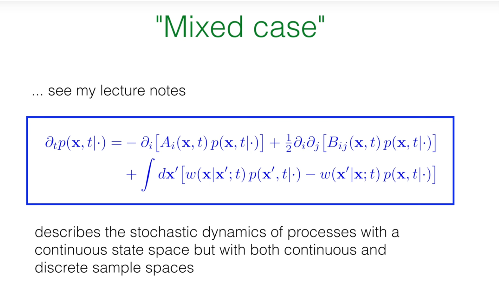


我们已经分别讨论了纯跳跃过程和纯扩散过程。然而，正如细菌的"奔跑-翻滚"运动所展示的，许多真实世界的系统同时包含了这两种动力学特征。为了描述这类**混合过程**，我们可以将前面推导出的两种方程结合起来。

一个系统在状态 $\vec{x}$ 的概率密度 $P(\vec{x},t)$ 的变化，既可以来自于局部的漂移和扩散，也可以来自于与其他位置的非局部跳跃。因此，总的演化方程是福克-普朗克项和连续主方程项的简单加和：

$$\partial_t P(\vec{x},t\mid\cdot) = \underbrace{-\partial_i[A_i(\vec{x},t)P] + \frac{1}{2}\partial_i \partial_j [B_{ij}(\vec{x},t)P]}_{\text{漂移与扩散 (Fokker-Planck)}} + \underbrace{\int dx'[w(\vec{x}\mid\vec{x}';t)P(\vec{x}',t\mid\cdot) - w(\vec{x}'\mid\vec{x};t)P(\vec{x},t\mid\cdot)]}_{\text{跳跃 (Master Equation)}}$$

这个通用方程为描述具有连续状态空间，但样本路径同时包含连续和不连续部分的复杂随机过程，提供了一个统一而强大的框架。


这节课我们完成了从离散到连续马尔可夫过程的推广，这是一个至关重要的概念飞跃。我们发现，根据样本路径的性质，连续空间中的随机过程可以被区分为两大类：

1. **跳跃过程**：由**连续空间主方程**描述，其核心是定义了状态间的转移速率密度。

2. **扩散过程**：由**福克-普朗克方程**描述，其核心是定义了微观随机运动的漂移和扩散系数。

因此，连续状态随机过程根据路径的规律性分为两大类：由连续空间主方程描述的跳跃过程，和由福克-普朗克方程描述的扩散过程。混合动力学则结合了这两种贡献。

