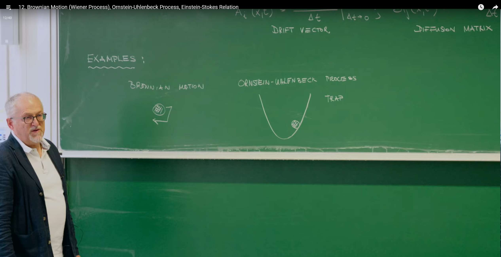
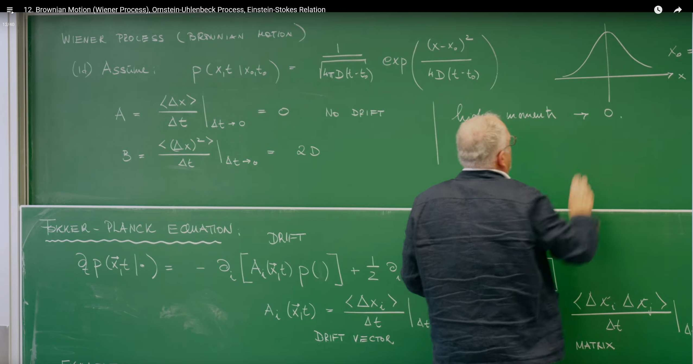
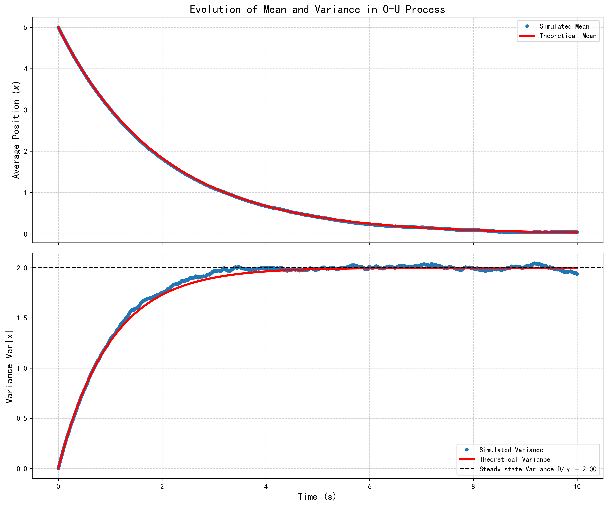

# 引言：福克-普朗克方程作为总框架


上节课教授介绍了**福克-普朗克方程 (Fokker-Planck Equation, FPE)。**这个方程为描述连续马尔可夫过程中概率密度函数的演化提供了一个普适而强大的数学框架。

一维系统中的通用福克-普朗克方程可以写为以下形式：

$$\frac{\partial P(x,t)}{\partial t} = -\frac{\partial}{\partial x}[A(x)P(x,t)] + D(x)\frac{\partial^2}{\partial x^2}P(x,t)$$

其中，$P(x,t)$ 是粒子在时刻 $t$ 位于位置 $x$ 的概率密度函数。这个方程由两个核心部分组成，它们分别描述了驱动粒子运动的两种基本物理过程：

1. **漂移项 (Drift Term)：**由系数 $A(x)$ 描述。这一项代表了作用在粒子上的确定性、系统性的影响，可以理解为一种力。它描述了粒子在位置 $x$ 处的平均速度，倾向于将概率分布的中心"推"向某个特定的方向或位置。例如，重力会使粒子向下漂移，弹簧的恢复力会使粒子向平衡位置漂移。

2. **扩散项 (Diffusion Term)：**由系数 $D(x)$ 描述。这一项代表了随机、偶然的影响，量化了粒子受到的随机"踢动"的强度。它源于系统环境（如液体中的分子）的热涨落，并导致概率分布随着时间的推移而"铺开"或弥散。扩散系数 $D(x)$ 与粒子位移的方差直接相关。

那么，这个方程从何而来？它并非凭空产生，而是基于深刻的物理假设。**福克-普朗克方程可以从更基本的查普曼-科尔莫戈罗夫方程（Chapman-Kolmogorov equation）出发，通过所谓的克莱默斯-莫亚尔展开（Kramers-Moyal expansion）推导得出**。这个推导过程的关键一步是做出一个物理上的简化：我们假设在一个无穷小的时间步长 $\Delta t$ 内，只有粒子位移的一阶矩（平均位移，与漂移相关）和二阶矩（均方位移，与扩散相关）是显著的，而所有更高阶的矩（如 $\langle(\Delta x)^3\rangle$ 等）都可以忽略不计。

这一假设在物理上是极其合理的，它精确地对应了这样一类过程：系统的演化是由大量、微小、独立的随机事件（例如，布朗粒子与水分子的无数次碰撞）累积而成的。在这种情况下，中心极限定理保证了总的位移趋向于一个高斯过程。因此，通过从福克-普朗克方程出发，我们实际上是在将我们的研究范围限定在一个由平滑的确定性力和细粒度的、类似高斯的噪声共同驱动的物理现象类别中。




这节课将要探讨的**维纳过程（Wiener Process）和奥恩斯坦-乌伦贝克过程（Ornstein-Uhlenbeck Process）**，正是这个宏大框架下两个最基本、最重要的特例。它们分别对应了最纯粹的扩散和扩散与线性恢复力相结合的情形，通过对它们的研究，我们将能揭示随机过程中最深刻的物理规律。

# 1. 维纳过程——纯粹扩散的原型

维纳过程是布朗运动（Brownian Motion）在数学上的严谨表述，它是随机过程理论的基石。这个过程描述了一个粒子在没有任何外力或势场引导的情况下，仅由环境的热涨落驱动而进行的随机运动。

## 1.1 基础性质




我们可以通过定义粒子在无穷小时间间隔 $\Delta t$ 内位移 $\Delta x$ 的矩（moments）来精确刻画维纳过程：

**零漂移 (Zero Drift)：**

$$
  A = \lim_{\Delta t \to 0} \frac{\langle \Delta x \rangle}{\Delta t} = 0
$$

这个条件的物理意义是，粒子的运动没有系统性的偏好方向。在任何时刻，它向左移动和向右移动的概率是完全相等的。因此，对大量粒子进行平均，它们的平均位移始终为零。粒子虽然在不停地运动，但"平均而言，它哪儿也没去"。

**恒定扩散 (Constant Diffusion)：**

$$
  B = \lim_{\Delta t \to 0} \frac{\langle (\Delta x)^2 \rangle}{\Delta t} = 2D
$$

  其中 $D$ 是一个正常数，被称为**扩散系数 (diffusion coefficient)。**这个条件是维纳过程的核心特征。它表明，粒子的均方位移（mean squared displacement, MSD）与时间成正比：$\langle(\Delta x)^2\rangle = 2D\Delta t$。这揭示了扩散过程的一个深刻本质：虽然粒子的平均位置不变，但其运动范围（或者说位置的不确定性）会随着时间的平方根稳定地增长。扩散系数 $D$ 的量纲是 [长度]$^2$/[时间]，它量化了这种不确定性区域扩张的速度。

将这两个条件（$A(x)=0$ 和 $D(x)=D$ 为常数）代入通用的福克-普朗克方程，我们便得到了描述维纳过程的偏微分方程，即**扩散方程 (Diffusion Equation)：**

$$\frac{\partial P(x,t|x_0,t_0)}{\partial t} = D \frac{\partial^2}{\partial x^2} P(x,t|x_0,t_0)$$

## 1.2 扩散方程及其解

扩散方程描述了在没有漂移的情况下，一个概率分布如何纯粹因为随机运动而随时间演化。对于一个在 $t_0$ 时刻确定位于 $x_0$ 的粒子（即初始条件为 $P(x,t_0|x_0,t_0)=\delta(x-x_0)$），这个方程的解是一个高斯函数（正态分布）：

$$P(x,t|x_0,t_0) = \frac{1}{\sqrt{4\pi D(t-t_0)}} \exp\left(-\frac{(x-x_0)^2}{4D(t-t_0)}\right)$$

这个解完美地体现了维纳过程的统计特性：

* **均值 (Mean)：**该高斯分布的中心（峰值）始终位于初始位置 $x_0$。这与零漂移的性质相符，即 $\langle x(t) \rangle = x_0$。

* **方差 (Variance)：**该高斯分布的方差为 $\sigma^2(t) = 2D(t-t_0)$。方差随时间线性增长，这意味着概率分布的宽度（以标准差 $\sigma(t) = \sqrt{2D(t-t_0)}$ 衡量）随时间的平方根增长。这正是均方位移随时间线性增长的直接体现。随着时间的推移，找到粒子的区域越来越广，我们对它的位置的预测也越来越不确定。

## 1.3 计算实验室 I：用Python模拟布朗运动

计算机模拟能让我们更直观地感受单个粒子的随机轨迹以及大量粒子构成的系综（ensemble）的集体行为。为了模拟维纳过程，我们通常使用其对应的随机微分方程 (Stochastic Differential Equation, SDE)：

$$dX(t) = \sqrt{2D} \, dW(t)$$

这里，$X(t)$ 是粒子的位置，$dW(t)$ 是维纳过程的无穷小增量。这个增量是一个均值为0，方差为 $dt$ 的高斯随机变量。

我们可以使用**欧拉-丸山方法 (Euler-Maruyama method)** 对这个SDE进行数值求解。这是一种将连续时间过程离散化的简单而有效的方法。其更新规则如下：

$$X(t+\Delta t) = X(t) + \sqrt{2D\Delta t} \cdot N(0,1)$$

其中，$N(0,1)$ 是从均值为0、方差为1的标准正态分布中抽取的一个随机数。这个更新规则直接实现了布朗运动增量的核心性质：位移的均值为0，方差为 $2D\Delta t$。

**1：单个布朗运动轨迹的模拟**

下面的Python代码模拟并绘制了几个独立的布朗运动轨迹。


```python
import numpy as np
import matplotlib.pyplot as plt

# Solve Chinese display issue
plt.rcParams['font.sans-serif'] = ['SimHei']  # Used to properly display Chinese labels
plt.rcParams['axes.unicode_minus'] = False    # Used to properly display minus sign

# --- Parameter settings ---
D = 1.0          # Diffusion coefficient (m^2/s)
T = 10.0         # Total simulation time (s)
dt = 0.01        # Time step (s)
num_steps = int(T / dt) # Total steps
num_particles = 5 # Number of particles to simulate

# --- Simulation process ---
# Create time axis
t = np.linspace(0, T, num_steps + 1)
# Initialize particle position array, all particles start at x=0
x = np.zeros((num_particles, num_steps + 1))

# Euler-Maruyama method for iteration
for i in range(num_steps):
    # Generate random increment
    random_increment = np.random.randn(num_particles)
    # Update positions of all particles
    x[:, i+1] = x[:, i] + np.sqrt(2 * D * dt) * random_increment

# --- Results visualization ---
plt.figure(figsize=(12, 7))
for i in range(num_particles):
    plt.plot(t, x[i, :], label=f'Particle {i+1}')

plt.title('Trajectories of 5 Independent Brownian Motion Particles (Wiener Process)', fontsize=16)
plt.xlabel('Time (s)', fontsize=14)
plt.ylabel('Position (m)', fontsize=14)
plt.grid(True, linestyle='--', alpha=0.6)
plt.legend()
plt.savefig('single_brownian_motion_trajectory.png', dpi=300, bbox_inches='tight')
plt.show()
```


从图中可以看出，每个粒子的轨迹都是高度不规则和"锯齿状"的。这直观地展示了维纳过程的一个深刻数学特性：其路径是**处处连续但处处不可微的**。连续性意味着粒子不会瞬时跳跃，而不可微性则意味着在任何时间点都无法定义一个瞬时速度。如果我们放大轨迹的任何一小段，它看起来仍然和整体一样曲折，没有变得更平滑。这背后的原因是位移 $\Delta X$ 与 $\Delta t$ 成正比，因此瞬时速度的估计值 $\Delta X/\Delta t$ 会随着 $\Delta t \to 0$ 而发散。这也解释了为什么我们使用微分形式 $dX(t)$ 而不是导数形式 $dX/dt$ 来书写SDE。

**2：粒子系综的演化**

单个轨迹是随机的，但大量粒子的集体行为却是确定的，并遵循扩散方程的预测。下面的代码模拟了一个由10000个粒子组成的系综，并将其在不同时刻的位置分布与理论上的高斯解进行比较。

```python
import numpy as np
import matplotlib.pyplot as plt
from scipy.stats import norm
# Solve Chinese display issue
plt.rcParams['font.sans-serif'] = ['SimHei']  # Used to properly display Chinese labels
plt.rcParams['axes.unicode_minus'] = False    # Used to properly display minus sign

# --- Parameter settings ---
D = 1.0          # Diffusion coefficient (m^2/s)
T = 5.0          # Total simulation time (s)
dt = 0.01        # Time step (s)
num_steps = int(T / dt) # Total steps
num_particles = 10000 # Number of particles to simulate
x0 = 0.0         # Initial position

# --- Simulation process ---
# Initialize particle positions, all particles start at x0
x = np.full(num_particles, x0)
# Record particle positions at specific times
snapshots = {}
snapshot_times = [0.1, 1.0, 5.0]

for i in range(num_steps):
    t_current = (i + 1) * dt
    # Update positions of all particles
    random_increment = np.random.randn(num_particles)
    x = x + np.sqrt(2 * D * dt) * random_increment
    
    # Check if we've reached a snapshot time
    for t_snap in snapshot_times:
        if np.isclose(t_current, t_snap):
            snapshots[t_snap] = x.copy()

# --- Results visualization ---
plt.figure(figsize=(14, 8))
bins = np.linspace(-15, 15, 101) # Histogram bins

for t_snap, positions in snapshots.items():
    # Plot histogram of simulated data
    plt.hist(positions, bins=bins, density=True, alpha=0.7, label=f'Simulation t={t_snap}s')
    
    # Calculate and plot theoretical Gaussian distribution
    mean_theory = x0
    variance_theory = 2 * D * t_snap
    std_dev_theory = np.sqrt(variance_theory)
    x_theory = np.linspace(-15, 15, 200)
    pdf_theory = norm.pdf(x_theory, loc=mean_theory, scale=std_dev_theory)
    plt.plot(x_theory, pdf_theory, lw=3, linestyle='--', label=f'Theory t={t_snap}s')

plt.title('Evolution of Position Distribution for Brownian Motion Particle Ensemble', fontsize=16)
plt.xlabel('Position (m)', fontsize=14)
plt.ylabel('Probability Density', fontsize=14)
plt.grid(True, linestyle='--', alpha=0.6)
plt.legend()
plt.savefig('particle_ensemble_evolution.png', dpi=300, bbox_inches='tight')
plt.show()
```


这个模拟展示了理论与实践的统一。尽管每个粒子的路径不可预测，但整个粒子群体的概率分布却以一种完全确定的方式演化：从一个集中在初始位置的尖峰（狄拉克$\delta$函数）开始，逐渐展宽成一个越来越宽的高斯分布。模拟得到的直方图与扩散方程的解析解（高斯分布）高度吻合，这有力地证明了福克-普朗克方程是如何从微观的随机行走中涌现出来的宏观确定性规律。

# 2. 奥恩斯坦-乌伦贝克过程——受约束的扩散

维纳过程描述了完全自由的扩散，但在许多物理和生物系统中，随机运动会受到某种形式的约束。**奥恩斯坦-乌伦贝克（Ornstein-Uhlenbeck, O-U）**过程就是描述这类系统最经典的模型。它引入了一个将粒子拉向平衡位置的恢复力，从而与扩散效应相抗衡。

## 2.1 物理系统：谐振子势阱中的布朗粒子


想象一个悬浮在液体中的微小粒子，它不仅受到水分子的随机碰撞（布朗运动），还被一个看不见的"弹簧"束缚在原点附近。这种束缚可以用一个**谐振子势 (harmonic potential)** 来描述：

$$U(x) = \frac{1}{2}kx^2$$

其中 $k$ 是"弹簧"的劲度系数，代表了势阱的强度。

现在，我们来分析作用在这个粒子上的两种力：

**1. 确定性漂移（弹簧的恢复力）：**

势能 $U(x)$ 产生一个线性恢复力 $F_{\text{restore}} = -\nabla U = -kx$。这个力总是指向势能最低点（$x=0$），并与偏离中心的距离成正比。在低雷诺数的流体环境中（即运动缓慢、尺寸微小），粒子的惯性可以忽略不计，这种恢复力会与流体的斯托克斯阻力 (Stokes' drag) 相平衡。斯托克斯定律告诉我们，对于一个半径为 $R$ 的球形粒子，在黏度为 $\eta$ 的流体中以速度 $\dot{x}$ 运动时，受到的阻力为 $F_{\text{drag}} = \zeta \dot{x}$，其中 $\zeta = 6\pi\eta R$ 是**摩擦系数 (friction coefficient)**。

   力平衡方程为 $F_{\text{restore}} + F_{\text{drag}} = 0$，即：

$$
   -kx = \zeta \dot{x}
$$

   整理后，我们得到粒子在没有随机噪声影响下的确定性运动方程：

$$
   \dot{x} = -\frac{k}{\zeta}x = -\gamma x
$$

这里的 $\gamma = k/\zeta$ 被称为**弛豫率 (relaxation rate)，**它的倒数 $\tau = 1/\gamma$ 是系统的特征弛豫时间。这个方程描述了粒子如何指数级地回到平衡位置。因此，O-U过程的漂移项是一个与位置线性相关的函数：$A(x) = -\gamma x$。这个漂移项体现了一种"均值回归"（mean-reversion）的特性。

**2. 随机扩散（流体的热涨落）：**

与维纳过程一样，来自周围流体分子的随机碰撞依然存在。我们假设这种随机力的强度不依赖于粒子的位置，因此扩散项仍然是一个常数：$B = 2D$。

## 2.2 控制方程及其求解

将我们推导出的漂移项 $A(x) = -\gamma x$ 和扩散项 $D$ 代入通用的福克-普朗克方程，便得到了描述O-U过程的控制方程 (4)：

$$
\frac{\partial P(x,t)}{\partial t} = \frac{\partial}{\partial x}[\gamma x P(x,t)] + D \frac{\partial^2}{\partial x^2} P(x,t)
$$

这个方程生动地描绘了一场"拔河比赛"：第一项（漂移项）试图将概率分布向原点压缩，使其变得更窄、更高；而第二项（扩散项）则试图将概率分布向外铺开，使其变得更宽、更扁平。系统的最终状态将是这两种效应达到动态平衡的结果。

为了求解这个偏微分方程，讲座中采用了一种非常强大的技术——**特征函数法 (method of characteristics)，**并结合了傅里叶变换。下面我们详细地重现这个求解过程：

**1. 傅里叶变换：**

我们定义概率密度 $P(x,t)$ 的傅里叶变换，即其特征函数 (characteristic function) $\phi(k,t)$：

$$
   \phi(k,t) := \int_{-\infty}^{\infty} dx \, e^{ikx} P(x,t)
$$

傅里叶变换的优点在于它可以将空间导数 $\partial/\partial x$ 转化为波数 $k$ 的乘法（具体来说是乘以 $ik$）。应用这个变换后，原先的偏微分方程会变得更简单。

**2. 变换后的偏微分方程：**

对O-U的FPE两边进行傅里叶变换，利用分部积分和变换性质，可以得到 $\phi(k,t)$ 所满足的方程：

$$
   \frac{\partial \phi(k,t)}{\partial t} + \gamma k \frac{\partial \phi(k,t)}{\partial k} = -Dk^2 \phi(k,t)
$$

   这是一个关于 $\phi(k,t)$ 的一阶线性偏微分方程。

**3. 特征函数法求解：**

我们寻找在 $(k,t)$ 空间中的一些特殊曲线，称为特征线 (characteristics)，沿着这些曲线，上述偏微分方程可以简化为一个常微分方程。这些特征线由方程 $dt/1 = dk/(\gamma k)$ 给出，积分得到特征线方程：

$$
   \frac{dk}{dt} = -\gamma k \implies k(t) = k_0 e^{-\gamma t}
$$

   其中 $k_0$ 是 $t=0$ 时的初始波数。沿着这样一条特征线，$\phi(k(t),t)$ 对时间的全导数为：

$$
   \frac{d\phi}{dt} = \frac{\partial \phi}{\partial t} + \frac{\partial \phi}{\partial k} \frac{dk}{dt} = \frac{\partial \phi}{\partial t} - \gamma k \frac{\partial \phi}{\partial k}
$$

   对比变换后的PDE，我们发现沿着特征线，方程简化为：

$$
   \frac{d\phi}{dt} = -Dk(t)^2 \phi(t)
$$

   这是一个简单的一阶常微分方程，其解为：

$$
   \phi(t) = \phi(0) \exp\left(-D \int_0^t dt' k(t')^2 \right)
$$

**4. 代入求解：**

我们将 $k(t') = k_0 e^{-\gamma t'}$ 代入积分，并假设初始时刻 $t=0$ 粒子位于 $x_0$，此时 $P(x,0) = \delta(x-x_0)$，对应的初始特征函数为 $\phi(k,0) = e^{ikx_0}$，因此 $\phi(0) = e^{ik_0x_0}$。

$$
   \int_0^t dt' k_0^2 e^{-2\gamma t'} = k_0^2 \left[\frac{e^{-2\gamma t'}}{-2\gamma}\right]_0^t = \frac{k_0^2}{2\gamma}(1 - e^{-2\gamma t})
$$

   于是，$\phi(t)$ 的解为：

$$
   \phi(t) = \exp\left(ik_0x_0 - \frac{Dk_0^2}{2\gamma}(1 - e^{-2\gamma t})\right)
$$

**5. 反变换回原变量：**

最后，我们将 $k_0$ 用 $k(t)$ 表示回来，$k_0 = k(t)e^{\gamma t}$，代入上式，得到最终的特征函数解：

$$
   \phi(k, t) = \exp\left(ikx_0e^{-\gamma t} - \frac{Dk^2}{2\gamma}(1 - e^{-2\gamma t})\right)
$$

## 2.3 动力学诠释

这个特征函数 $\phi(k,t)$ 的形式非常特殊，它是一个高斯函数的傅里叶变换。一个通用高斯分布的特征函数具有标准形式：

$$\phi_{\text{Gaussian}}(k) = \exp\left(ik\langle x \rangle - \frac{1}{2}k^2 \text{Var}(x)\right)$$

通过将我们的解与这个标准形式进行逐项比较，我们可以直接读出粒子位置的均值和方差随时间的演化规律：

**均值 (Mean)：**

$$
  \langle x \rangle(t) = x_0 e^{-\gamma t}
$$

  粒子系综的平均位置从初始位置 $x_0$ 开始，指数衰减趋向于势阱中心 $x=0$。这与完全忽略噪声时的确定性动力学解完全一致。这说明，随机噪声虽然使得每个粒子的轨迹变得曲折，但并不会改变整个系综的平均运动趋势。

**方差 (Variance)：**

$$
\text{Var}[x](t) = \frac{D}{\gamma}(1 - e^{-2\gamma t})
$$

  粒子位置的方差（即分布的宽度）的演化则更有趣。

  * 在初始阶段（$t \to 0$），利用泰勒展开 $e^{-2\gamma t} \approx 1 - 2\gamma t$，方差近似为 $\text{Var}[x](t) \approx (D/\gamma)(2\gamma t) = 2Dt$。这表明在短时间内，粒子还没来得及感受到恢复力的作用，其行为和自由的布朗运动（维纳过程）完全一样。

  * 随着时间推移（$t \to \infty$），指数项 $e^{-2\gamma t}$ 趋于零，方差会趋于一个恒定的稳态值：

$$
\text{Var}_{ss} = \lim_{t \to \infty} \text{Var}[x](t) = \frac{D}{\gamma}
$$

这个**稳态 (steady state)** 是O-U过程最关键的特性。它意味着系统最终会达到一个动态平衡：恢复力将粒子向中心拉的趋势，与扩散作用将粒子向外推的趋势，达到了完美的抵消。此时，概率分布不再随时间变化，形成一个中心在原点、方差为 $D/\gamma$ 的稳定高斯分布。系统"忘记"了它的初始状态 $x_0$。

## 2.4 计算实验室 II：模拟受束缚的粒子

与维纳过程类似，我们可以通过数值模拟O-U过程对应的SDE来获得直观的理解：

$$
dX(t) = -\gamma X(t) dt + \sqrt{2D} \, dW(t)
$$

其欧拉-丸山离散形式为：

$$
X(t+\Delta t) = X(t) - \gamma X(t) \Delta t + \sqrt{2D\Delta t} \cdot N(0,1)
$$

这个更新规则中包含了确定性的漂移项（使粒子向原点移动）和随机的扩散项。

**1. 单个受束缚粒子的轨迹**

```python
import numpy as np
import matplotlib.pyplot as plt
# Solve Chinese display issue
plt.rcParams['font.sans-serif'] = ['SimHei']  # Used to properly display Chinese labels
plt.rcParams['axes.unicode_minus'] = False    # Used to properly display minus sign

# --- Parameter settings ---
D = 1.0          # Diffusion coefficient (m^2/s)
gamma = 0.5      # Relaxation rate (1/s)
T = 50.0         # Total simulation time (s)
dt = 0.01        # Time step (s)
num_steps = int(T / dt) # Total steps
x0 = 10.0        # Initial position

# --- Simulation process ---
t = np.linspace(0, T, num_steps + 1)
x = np.zeros(num_steps + 1)
x[0] = x0

for i in range(num_steps):
    random_increment = np.random.randn()
    # Update with drift and diffusion terms
    x[i+1] = x[i] - gamma * x[i] * dt + np.sqrt(2 * D * dt) * random_increment

# --- Results visualization ---
plt.figure(figsize=(12, 7))
plt.plot(t, x, label='Particle Trajectory')
plt.axhline(0, color='r', linestyle='--', label='Equilibrium Position (x=0)')
plt.title('Trajectory of a Single Particle in a Harmonic Potential Well (O-U Process)', fontsize=16)
plt.xlabel('Time (s)', fontsize=14)
plt.ylabel('Position (m)', fontsize=14)
plt.grid(True, linestyle='--', alpha=0.6)
plt.legend()
plt.savefig('single_confined_particle_trajectory.png', dpi=300, bbox_inches='tight')
plt.show()
```


从轨迹图中可以清晰地看到，粒子在原点附近随机波动。当它偶然漂到离原点较远的地方时，强大的恢复力（漂移项）会更明显地把它"拉"回来。最终，粒子的运动被限制在一个以原点为中心的有限区域内。

**2. 系综演化与理论验证**

现在我们模拟一个粒子系综，并验证其均值和方差是否与我们的解析解完全一致。
```python
import numpy as np
import matplotlib.pyplot as plt
from scipy.stats import norm
# Solve Chinese display issue
plt.rcParams['font.sans-serif'] = ['SimHei']  # Used to properly display Chinese labels
plt.rcParams['axes.unicode_minus'] = False    # Used to properly display minus sign

# --- Parameter settings ---
D = 1.0
gamma = 0.5
T = 10.0
dt = 0.01
num_steps = int(T / dt)
num_particles = 10000
x0 = 5.0

# --- Simulation process ---
t = np.linspace(0, T, num_steps + 1)
x = np.full((num_particles, num_steps + 1), x0)

# Record mean and variance during simulation
mean_sim = np.zeros(num_steps + 1)
var_sim = np.zeros(num_steps + 1)
mean_sim[0] = x0
var_sim[0] = 0

for i in range(num_steps):
    random_increment = np.random.randn(num_particles)
    x[:, i+1] = x[:, i] - gamma * x[:, i] * dt + np.sqrt(2 * D * dt) * random_increment
    mean_sim[i+1] = np.mean(x[:, i+1])
    var_sim[i+1] = np.var(x[:, i+1])

# --- Theoretical solution ---
mean_theory = x0 * np.exp(-gamma * t)
var_theory = (D / gamma) * (1 - np.exp(-2 * gamma * t))

# --- Results visualization ---
fig, (ax1, ax2) = plt.subplots(2, 1, figsize=(12, 10), sharex=True)

# Mean comparison
ax1.plot(t, mean_sim, 'o', markersize=4, label='Simulated Mean')
ax1.plot(t, mean_theory, 'r-', lw=3, label='Theoretical Mean')
ax1.set_ylabel(r'Average Position $\langle x \rangle$', fontsize=14)
ax1.set_title('Evolution of Mean and Variance in O-U Process', fontsize=16)
ax1.grid(True, linestyle='--', alpha=0.6)
ax1.legend()

# Variance comparison
ax2.plot(t, var_sim, 'o', markersize=4, label='Simulated Variance')
ax2.plot(t, var_theory, 'r-', lw=3, label='Theoretical Variance')
ax2.axhline(D / gamma, color='k', linestyle='--', label=f'Steady-state Variance D/γ = {D/gamma:.2f}')
ax2.set_xlabel('Time (s)', fontsize=14)
ax2.set_ylabel('Variance Var[x]', fontsize=14)
ax2.grid(True, linestyle='--', alpha=0.6)
ax2.legend()

plt.tight_layout()
plt.savefig('confined_particle_ensemble_evolution.png', dpi=300, bbox_inches='tight')
plt.show()
```


计算出的系综均值和方差与理论公式的曲线重合。我们可以看到均值如何指数衰减到0，以及方差如何从0开始增长并最终饱和到稳态值 $D/\gamma$。

## 2.5 维纳过程与奥恩斯坦-乌伦贝克过程的对比

为了巩固理解，下表总结了这两个核心随机过程的关键区别与联系。

| 特性 | 维纳过程 (Wiener Process) | 奥恩斯坦-乌伦贝克过程 (Ornstein-Uhlenbeck Process) |
| :--- | :--- | :--- |
| 物理类比 | 在无限空间中自由漂浮的尘埃 | 被弹簧拴住并在液体中振动的微珠 |
| 漂移系数 A(x) | 0 (无偏好方向) | $-\gamma x$ (线性恢复力，均值回归) |
| 扩散系数 D(x) | D (常数) | D (常数) |
| 福克-普朗克方程 | $\partial_{t} P = D \partial_{x}^{2} P$ (扩散方程) | $\partial_{t} P = \partial_{x} (\gamma x P) + D \partial_{x}^{2} P$ |
| 均值 $\langle x \rangle(t)$ | $x_{0}$ (保持不变) | $x_{0} e^{-\gamma t}$ (指数衰减至0) |
| 方差 $\operatorname{Var}[x](t)$ | $2Dt$ (无限线性增长) | $\frac{D}{\gamma} (1 - e^{-2\gamma t})$ (增长并饱和) |
| 稳态 ($t \to \infty$) | 不存在稳态分布 (无限扩散) | 存在稳态高斯分布，方差为 $\frac{D}{\gamma}$ |

这个表格揭示了漂移项的引入是如何从根本上改变系统行为的。维纳过程是一个无界的过程，其不确定性会无限增长。而O-U过程则是一个有界的过程，由于恢复力的存在，系统最终会达到一个统计上的平衡状态。

# 3. 爱因斯坦-斯托克斯关系——涨落与耗散的深刻联系

这节课的最后一部分，是将我们从随机过程动力学中得到的结论与经典的热力学理论联系起来，从而推导出一个物理学中极为深刻和优美的关系。

## 3.1 通往热力学的桥梁

我们已经知道，当时间趋于无穷大时（$t \to \infty$），处于谐振子势阱中的布朗粒子系统会达到一个稳态。在这个稳态下，系统完全"忘记"了其初始位置 $x_0$，其概率分布是一个不随时间变化的、中心位于原点的高斯分布。这个稳态的方差，也就是粒子位置的均方值为：

$$\langle x^2 \rangle_{ss} = \text{Var}_{ss} = \frac{D}{\gamma}$$

这个结果完全是从随机动力学（即福克-普朗克方程）的角度推导出来的。

物理上，这个长时间极限下的稳态，正对应于系统与周围环境（热浴）达到**热平衡 (thermal equilibrium)** 的状态。

## 3.2 能量均分定理

现在，我们暂时放下随机过程，转而从经典**统计力学**的角度来审视这个处于热平衡的系统。**能量均分定理 (Equipartition Theorem)** 是统计力学的一个基本结论。该定理指出，在一个处于温度为 $T$ 的热平衡系统里，能量表达式中每一个独立的、二次方的自由度（例如动能项 $\frac{1}{2}mv^2$ 或势能项 $\frac{1}{2}kx^2$），其平均能量都精确地等于 $\frac{1}{2}k_B T$，其中 $k_B$ 是玻尔兹曼常数。

对于我们所研究的、被谐振子势 $U(x) = \frac{1}{2}kx^2$ 束缚的粒子，其势能就是一个二次型的自由度。因此，根据能量均分定理，其平均势能必须满足：

$$\langle U \rangle = \left\langle \frac{1}{2}kx^2 \right\rangle = \frac{1}{2}k \langle x^2 \rangle = \frac{1}{2}k_B T$$

从这个纯粹的**热力学**关系中，我们可以直接解出系统在热平衡时粒子位置的均方值：

$$\langle x^2 \rangle_{\text{eq}} = \frac{k_B T}{k}$$

## 3.3 推导与洞见

现在，我们拥有了两个在完全不同理论框架下得到的、关于同一个物理量（系统达到平衡时的 $\langle x^2 \rangle$）的表达式：

1. **来自随机动力学 (FPE)**: $\langle x^2 \rangle_{ss} = \frac{D}{\gamma}$

2. **来自平衡统计力学 (Equipartition)**: $\langle x^2 \rangle_{eq} = \frac{k_B T}{k}$

因为这两个表达式描述的是同一个物理状态，它们必然相等：

$$\frac{D}{\gamma} = \frac{k_B T}{k}$$

现在，我们代入之前定义的弛豫率 $\gamma = k/\zeta = k/(6\pi\eta R)$：

$$\frac{k}{6\pi\eta R} \cdot D = k_B T$$

对这个方程进行简单的代数整理，两边的劲度系数 $k$ 恰好消掉，我们便得到了著名的**爱因斯坦-斯托克斯关系 (Einstein-Stokes Relation)：**

$$D = \frac{k_B T}{6\pi\eta R} = \frac{k_B T}{\zeta}$$

## 3.4 涨落-耗散定理

这个公式的优美之处远不止于它联系了几个物理量，更在于它所揭示的深刻物理原理，这个原理被称为**涨落-耗散定理 (Fluctuation-Dissipation Theorem)** 的一个具体实例。让我们来解读这个关系式的两端：

* **涨落 (Fluctuation)：**等式左边的扩散系数 $D$，描述的是系统内在的、微观的随机涨落的强度。它量化了粒子由于与环境分子进行无休止的随机碰撞而产生的"抖动"或"摇摆"的剧烈程度。这是一个关于系统"无序"和"随机性"的量。

* **耗散 (Dissipation)：**等式右边的分母，摩擦系数 $\zeta = 6\pi\eta R$，描述的是一个宏观的、确定性的能量耗散过程。当我们试图推动粒子穿过流体时，流体会产生阻力，这个阻力会使粒子的宏观动能转化为热能而耗散掉。这是一个关于系统"阻尼"和"摩擦"的量。

爱因斯坦-斯托克斯关系石破天惊地指出：**涨落和耗散并非两个独立的现象，它们本质上是同一物理过程的两个不同侧面**。这两个过程都源于同一个微观起源——系统与环境（热浴）中大量粒子之间的相互作用。那些导致宏观物体运动时产生摩擦力的微观碰撞，也正是驱动微观粒子进行无规则布朗运动的随机力。

温度 $T$ 在这个关系中扮演了至关重要的角色，它像一座桥梁，将微观的随机涨落与宏观的能量耗散联系在一起。一个温度更高的环境，意味着其内部粒子的热运动更剧烈。这既会导致对布朗粒子的随机"踢动"更强（更大的 $D$），也会导致对试图穿过它的宏观物体产生更大的阻力（更大的 $\eta$，从而更大的 $\zeta$）。涨落-耗散定理精确地量化了这两者之间的关系。

# 总结

回看整个讲座的逻辑，我们可以发现它实际上构成了一个对涨落-耗散定理的精妙的、建设性的证明。奥恩斯坦-乌伦贝克过程之所以是如此完美的理论"实验室"，正是因为它足够简单，可以被解析求解，同时又足够复杂，在其数学结构中天然地包含了涨落项（$D$）和耗散项（通过 $\gamma$ 关联的 $\zeta$）。通过求解这个过程的动力学并将其稳态解与热力学平衡原理进行对比，我们不仅解决了一个具体的物理问题，更揭示了一条贯穿于物理学众多领域的普适原理。这个原理的适用范围远超布朗运动，例如在电子学中，它表现为电阻的热噪声（约翰逊-奈奎斯特噪声）与电阻值的关系。**宏观的确定性规律（如趋向热平衡）与不可避免的耗散，其根源在于微观世界的永恒涨落**

