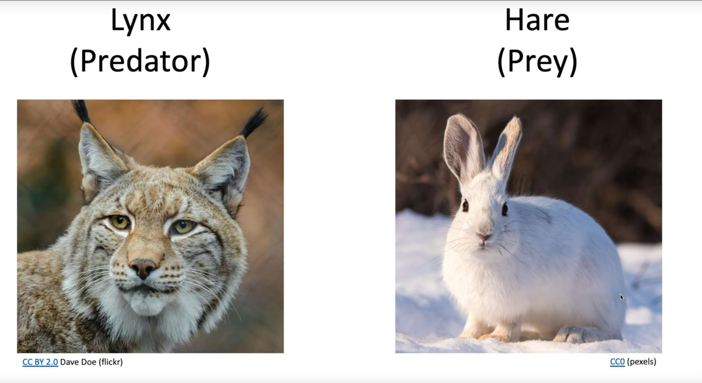
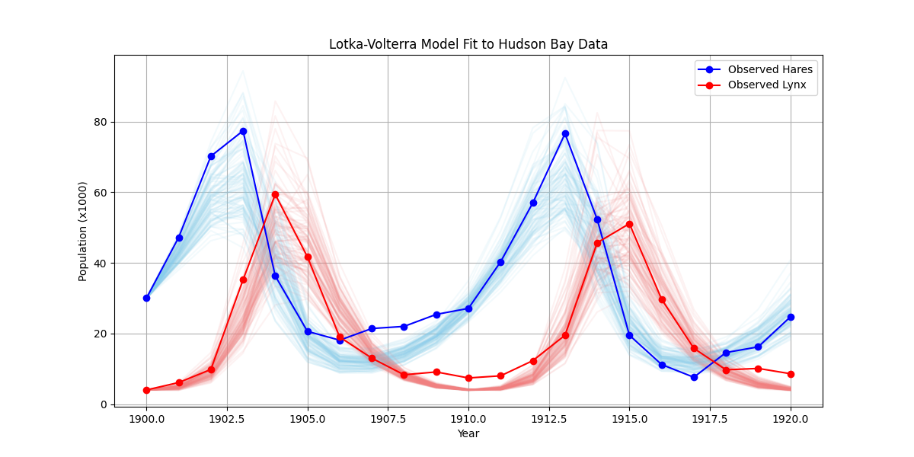

# 引言:从理论分析到计算工具

这节课由助教讲授。在过去的几讲中，Erwin Frey 教授已经帮我们建立了一个强大的理论框架来理解和描述随机过程。我们从马尔可夫过程的基本概念出发，推导了查普曼-科尔莫戈罗夫方程（Chapman-Kolmogorov equation），并进一步得到了主方程（Master Equation）和福克-普朗克方程（Fokker-Planck equation）。我们还深入探讨了系统的稳态、细致平衡（detailed balance）条件以及佩龙-弗罗贝尼乌斯定理（Perron-Frobenius theorem），这些都为我们理解系统如何达到并维持其平衡态提供了深刻的见解。


到目前为止,我们的视角主要是**分析性**的:给定一个随机过程(由其转移速率定义),我们分析它的行为,比如它的稳态分布是什么。在这节课中,我们将进行转变,将视角从分析转向**综合**与**应用**。我们将展示如何将整个随机过程的理论框架,特别是马尔可夫链的概念,转变为一种强大的计算工具,用于解决一个在所有科学领域都至关重要的问题:**统计推断(statistical inference)**,即如何从数据中学习模型的参数。

通过巧妙地"设计"一个马尔可夫过程,使其稳态恰好是我们想要的目标概率分布,我们就可以生成该分布的样本,从而解决那些在解析上无法处理的复杂积分问题。这个方法被称为马尔可夫链蒙特卡洛(Markov Chain Monte Carlo, MCMC),它彻底改变了贝叶斯统计学和许多依赖于计算建模的科学领域。

# 1. 问题的提出:从真实世界数据中推断模型

科学研究的核心任务之一是从观测数据中构建和验证数学模型。一个好的模型不仅能解释现有数据,还能对未来做出预测。然而,一个模型的预测能力完全取决于其参数的取值。那么,我们如何利用实验或观测数据来确定这些未知参数呢?

## 1.1 一个经典的生态系统:猞猁与雪兔

为了让问题具体化,让我们来看一个生态学中非常经典的例子:加拿大猞猁(lynx,捕食者)和雪兔(hare,猎物)的种群动态。哈德逊湾公司(Hudson Bay Company)在1900年至1920年间记录了收集到的这两种动物的毛皮数量,这些数据被认为是它们各自种群数量的可靠指标。




将这些数据绘制成图表,我们可以清晰地看到两个种群数量随时间的周期性振荡,并且捕食者(猞猁)的种群高峰总是略微滞后于猎物(雪兔)的种群高峰。


面对这样的数据,一个自然而然的科学问题是:**我们能否找到一个数学模型来描述并预测这种周期性行为?** 更进一步,我们能否从这些具体的数据点中,推断出控制这个生态系统动态的"法则"?

## 1.2 洛特卡-沃尔泰拉模型:一个数学描述

为了描述这种捕食者-猎物系统,一个著名的数学模型是**洛特卡-沃尔泰拉(Lotka-Volterra)方程。**该模型用一组耦合的常微分方程(ODEs)来描述两个种群数量的变化。

设 $x$ 为雪兔(猎物)的种群数量, $y$ 为猞猁(捕食者)的种群数量。该模型可以写为:

$$
\frac{dx}{dt} = \alpha x - \beta xy \quad \text{(雪兔)}
$$

$$
\frac{dy}{dt} = -\gamma y + \delta xy \quad \text{(猞猁)}
$$

让我们剖析这个模型中的每一项,理解其背后的生物学意义:

* $\alpha x$: 这一项代表雪兔的自然增长。在没有捕食者的情况下($y=0$),雪兔种群会以速率 $\alpha$ 进行指数增长。因此,$\alpha$ 可以被看作是雪兔的"出生率"。

* $-\beta xy$: 这一项描述了雪兔因被猞猁捕食而导致的数量减少。捕食事件发生的频率正比于雪兔和猞猁相遇的频率,而相遇频率又可以近似为它们种群数量的乘积 $xy$。参数 $\beta$ 代表了捕食的"成功率"或"捕食效率"。

* $-\gamma y$: 这一项代表猞猁的自然死亡。在没有食物(雪兔)的情况下($x=0$),猞猁种群会因为饥饿、疾病或种内竞争而以速率 $\gamma$ 指数衰减。因此,$\gamma$ 可以被看作是猞猁的"死亡率"。

* $+\delta xy$: 这一项描述了猞猁种群因捕食雪兔而获得的增长。同样,这个增长率也正比于相遇频率 $xy$。参数 $\delta$ 代表了猞猁将捕食到的雪兔转化为自身繁殖的"转化效率"。

现在,我们的问题变得更加精确了。描述这个系统动态的"法则"被封装在了这四个参数 $\theta=\{\alpha,\beta,\gamma,\delta\}$ 中。我们的任务就是,给定观测数据 $D$(即那张时间序列图表),如何推断出这组参数 $\theta$ 最可能的值?这便是**参数推断(parameter inference)**的核心问题。

这个过程是从混乱的真实世界观测(毛皮数据)到抽象的数学模型(微分方程)的飞跃。洛特卡-沃尔泰拉模型无疑是对复杂生态系统的简化,但它抓住了捕食者与猎物之间相互作用的核心反馈循环。**挑战不仅在于求解这组方程,更在于找到方程的特定"版本"(即最合适的参数值),**使其能够最好地代表我们所观测到的真实世界。这为我们接下来引入概率方法奠定了基础。


# 2. 贝叶斯框架:系统性的推断方法

如何系统地从数据中学习参数 $\theta$?贝叶斯推断(Bayesian inference)为我们提供了一个基于概率论的、逻辑严谨的框架来解决这个问题。它本质上是一种在获得新证据后更新我们对事物信念程度的方法。

## 2.1 贝叶斯定理的引入

贝叶斯推断的核心工具是贝叶斯定理(Bayes' Theorem)。它将我们关心的量联系在一起,其形式如下:

$$
p(\theta|D) = \frac{p(D|\theta)p(\theta)}{p(D)}
$$

这个公式看起来很简单,但它蕴含了深刻的逻辑。它告诉我们如何将关于参数的先验知识与数据中包含的信息结合起来,从而得到更新后的知识。

## 2.2 解构贝叶斯定理

为了在我们的猞猁-雪兔问题中应用这个定理,我们需要理解公式中的每一个组成部分。

贝叶斯推断的视角与传统的"最佳拟合"方法(如最小二乘法)有着根本性的不同。传统方法可能会给我们一组唯一的"最佳"参数值。而贝叶斯方法则告诉我们:"不存在唯一正确的 $\theta$。相反,这里有一幅可能性的图景。参数空间中的这个区域非常可能,而另一个区域则非常不可能。"

这种概率性的视角非常强大。它允许我们回答更深入的问题,例如:"雪兔出生率 $\alpha$ 介于0.5到0.6之间的概率是多少?"或者"捕食率 $\beta$ 和猞猁死亡率 $\gamma$ 是否相关?"。**这是一种从确定性思维到概率性思维的深刻转变,它更诚实地反映了我们在面对有限数据时的不确定性。**


# 3. 计算瓶颈:高维积分的挑战

拥有后验分布 $p(\theta|D)$ 理论上解决了推断问题,但在实践中,我们通常需要从这个分布中提取一些摘要信息,比如参数的期望值(平均值)或方差(不确定性的大小)。

## 3.1 从分布到期望值

要计算某个关于参数的函数 $f(\theta)$ 的期望值(例如,$f(\theta)=\alpha$ 就是为了计算参数 $\alpha$ 的平均值),我们需要求解如下积分:

$$
\langle f(\theta) \rangle = \int f(\theta) p(\theta|D) d\theta^n
$$

这里的 $n$ 是参数的数量(在我们的例子中,$n=4$)。这个积分是在整个 $n$ 维参数空间上进行的。

此外,我们还需要计算归一化常数,即证据 $p(D)$,它本身也是一个同样形式的积分:

$$
p(D) = \int p(D|\theta)p(\theta) d\theta
$$

这个积分通常是贝叶斯推断中最困难的部分。

## 3.2 维度灾难

为什么这些积分如此难以计算?原因在于所谓的**维度灾难(Curse of Dimensionality)。**

一种最直观的数值积分方法是"网格法":我们将每个参数维度划分成若干个离散的格点,然后在这些格点上计算被积函数的值,最后加权求和。


让我们看看为什么这种方法会迅速失效。假设我们对每个参数维度只取10个格点。

* 对于1个参数(1D),我们需要计算 $10^1=10$ 次。

* 对于2个参数(2D),我们需要计算 $10^2=100$ 次。

* 对于我们的4参数洛特卡-沃尔泰拉模型(4D),我们需要计算 $10^4=10,000$ 次。

* 对于一个有20个参数的更复杂的模型,我们需要计算 $10^{20}$ 次!这个数字已经远远超出了任何现代计算机的处理能力。

计算量随维度指数增长,这使得网格法在高维空间中完全不可行。

更深层次的问题在于,高维空间的行为与我们的低维直觉相悖。正如助教在黑板上的草图所示,后验概率分布 $p(\theta|D)$ 的"质量"通常集中在参数空间中一个非常微小的、形状不规则的区域内。而广阔的参数空间中的绝大部分区域,其概率密度几乎为零。


网格法是"盲目"的,它会均匀地探索整个参数空间。这意味着它会花费绝大部分的计算资源去评估那些 $p(\theta|D) \approx 0$ 的点。这些点的函数值对最终积分的贡献几乎为零,因此这些计算完全是浪费。

"维度灾难"不仅仅是计算速度变慢的问题,它是一个根本性的尺度问题,使得一整类简单直观的算法变得毫无用处。问题归结为**搜索效率**:我们正在一个指数级增长的巨大空间中,寻找一个微小的、我们事先不知道其位置的"重要"区域。这迫使我们必须彻底改变策略。如果我们无法探索整个空间,那么我们是否能被某种方法**引导**,只去探索那些重要的区域呢?

# 4. 新策略:蒙特卡洛积分

面对高维积分的挑战,我们需要一种更智能的方法。**蒙特卡洛积分(Monte Carlo Integration)**提供了一个绝妙的解决方案。它用随机采样代替了确定性的网格划分。

## 4.1 大数定律的威力

蒙特卡洛积分的核心思想基于大数定律。它将积分的计算近似为一个样本均值的计算:

$$
\langle f(\theta) \rangle = \int f(\theta) p(\theta|D) d\theta \approx \frac{1}{N} \sum_{i=1}^{N} f(\theta^{(i)})
$$

这个公式看起来非常简单,就像是计算 $f(\theta)$ 的普通平均值。但它的魔力在于这些样本 $\theta^{(i)}$ 是如何生成的。

## 4.2 重要性采样:关键的洞见

为了使这个近似有效且高效,这些样本 $\theta^{(i)}$ 必须是**从目标概率分布 $p(\theta|D)$ 本身中抽取出来的**。

这便是"重要性采样"(Importance Sampling)的核心思想。通过直接从 $p(\theta|D)$ 中抽样,我们自然而然地将计算精力集中在了概率密度高的区域——也就是对积分贡献最大的区域。我们不再浪费时间在参数空间中那些概率为零的"荒漠"里。样本点会以与其概率成正比的频率出现,这正是我们所需要的。

这个转变是革命性的。我们已经成功地将一个棘手的积分问题,转化为了一个同样具有挑战性但可以解决的采样问题:

我们如何从一个我们甚至无法归一化(因为不知道 $p(D)$)的、复杂的、高维的概率分布 $p(\theta|D)$ 中生成随机样本?

蒙特卡洛积分代表了一种从确定性、穷举式计算到近似性、随机性模拟的范式转变。它拥抱随机性,并将其作为克服维度灾难的有力工具。它解决了效率问题,因为我们不再需要预先知道重要区域在哪里,采样过程会自动发现它。现在,我们需要的不再是一个积分器,而是一个**采样器**。这为我们引入整个随机过程理论体系提供了最终的动机。

# 5. 通过随机过程生成样本:马尔可夫链蒙特卡洛(MCMC)

如何构建一个能够从任意复杂分布 $p(\theta|D)$ 中采样的机器呢?这就回到了这节课的核心——马尔可夫链。

## 5.1 回顾我们的工具箱:马尔可夫链与稳态分布

让我们回顾一下前几讲(特别是第6-8讲)的核心概念:

* **马尔可夫链**:一个"无记忆"的随机过程,其未来的状态只依赖于当前状态,而与过去无关。

* **稳态分布(Stationary Distribution)** $\pi$:在某些条件下(遍历性),一个马尔可夫链在运行足够长时间后,其状态的概率分布会收敛到一个不再变化的极限分布,即稳态分布。

* **佩龙-弗罗贝尼乌斯定理**:为一大类系统的稳态的存在性和唯一性提供了数学保证。

* **细致平衡条件(Detailed Balance)**:这是一个确保系统能够收敛到稳态 $\pi$ 的**充分条件**。其数学表达式为:$\pi(\theta)W(\theta'|\theta) = \pi(\theta')W(\theta|\theta')$,其中 $W(\theta'|\theta)$ 是从状态 $\theta$ 转移到状态 $\theta'$ 的转移概率。

## 5.2 MCMC的核心思想

现在,我们揭示MCMC方法的核心思想:**如果我们能够设计一个马尔可夫链,使其唯一的稳态分布 $\pi$ 恰好就是我们想要采样的目标后验分布 $p(\theta|D)$,那会怎么样?**

如果能做到这一点,那么采样过程将变得异常简单:

1. 在参数空间中随机选择一个初始点 $\theta^{(0)}$。

2. 让这个马尔可夫链根据其转移规则不断进行状态转移(随机游走)。

3. 运行足够长的时间,让链"忘记"其初始状态,收敛到其稳态分布。这个初始阶段被称为"**燃烧期**"(burn-in)。

4. 在燃烧期结束后,我们开始记录链所访问的状态序列 $\{\theta^{(i)}\}$。

**根据稳态分布的定义,这个序列 $\{\theta^{(i)}\}$ 就是我们梦寐以求的、从目标分布 $p(\theta|D)$ 中抽取的一系列样本!我们成功地构建了一个采样器。**

这是本讲座概念上的核心。MCMC将描述性的随机过程理论转变为一个指令性的、可操作的计算引擎。我们不再仅仅是分析一个给定物理系统的平衡态;我们是在**工程化地设计**一个计算"系统"(马尔可夫链),使其平衡态成为对我们有用的工具(后验分布)。

以前的讲座教会我们:"如果你有一个转移矩阵 $W$,这里是如何找到它的稳态分布 $\pi$。" 而MCMC将这个问题完全颠倒过来:**"我们有一个想要的目标稳态分布 $\pi=p(\theta|D)$,我们如何能找到一个可以产生它的转移矩阵 $W$?" **这是一次从分析到综合的飞跃。马尔可夫链理论(特别是细致平衡条件)为我们构建这样的 $W$ 提供了蓝图。

# 6. Metropolis-Hastings算法:一个实用的配方

那么,具体该如何构建满足条件的转移规则 $W$ 呢?**Metropolis-Hastings算法**提供了一个通用且强大的配方,可以为任意目标分布构建马尔可夫链。

Metropolis-Hastings 算法是现代计算统计学和物理学中最重要的算法之一,其发展横跨了二十世纪中叶的两次关键创新。这个算法最初的版本由 Nicholas Metropolis 及其合作者(包括 Arianna Rosenbluth, Marshall Rosenbluth, Augusta Teller, 和 Edward Teller)在1953年提出,当时主要用于解决物理学中高维系统的状态方程计算问题,其核心思想是构建一个马尔可夫链,使其最终的稳定分布是我们想要抽样的目标分布,最初的版本仅限于对称的提议分布。随后,在1970年,统计学家 W. K. Hastings 将该算法推广到了非对称提议分布的情况,极大地扩展了其适用范围,形成了我们今天所知的 Metropolis-Hastings 算法。

该算法的应用极为广泛,尤其在贝叶斯统计中扮演着核心角色。当一个模型的后验概率分布形式复杂、维度很高,以至于无法直接进行解析计算或抽样时,Metropolis-Hastings 算法便提供了一个强大的数值模拟工具。具体应用包括但不限于:在机器学习中进行贝叶斯推断,估计复杂模型的参数;在计算生物学中用于系统发育树的构建;在物理学中模拟多粒子系统的行为;在金融领域用于风险建模和期权定价。可以说,任何需要从一个难以直接处理的概率分布中进行抽样的科学和工程领域,都能看到 Metropolis-Hastings 算法的身影。

## 6.1 算法步骤

该算法的流程非常清晰,可以分为两个阶段:**提议**和**接受/拒绝**。

**1. 初始化:**在参数空间中任意选择一个初始状态 $\theta^{(0)}$。

**2. 迭代:对于 $i=1,2,...,N$:**

a. **提议 (Propose):**根据一个提议分布(proposal distribution) $q(\theta'|\theta^{(i-1)})$,从当前状态 $\theta^{(i-1)}$ 出发,生成一个候选状态 $\theta'$。这个提议分布可以很简单,例如一个以当前状态为中心的正态分布。

b. **计算接受率 (Accept/Reject):**计算接受这个提议的概率 $A(\theta'|\theta^{(i-1)})$。Metropolis-Hastings算法给出的接受率为:

$$
A(\theta' | \theta) = \min\left(1, \frac{p(\theta')q(\theta|\theta')}{p(\theta)q(\theta'|\theta)}\right)
$$

注意,我们在这里用 $p(\theta)$ 来代表我们的目标分布 $p(\theta|D)$。

c. **决策:**从 $[0,1]$ 的均匀分布中抽取一个随机数 $u$。

如果 $u<A $,则接受这个提议,令新状态 $\theta^{(i)}=\theta'$。

否则,拒绝这个提议,令新状态 $\theta^{(i)}=\theta^{(i-1)}$(即停留在原地)。

通过重复这个过程,我们就得到了一个马尔可夫链样本序列 $\{\theta^{(0)},\theta^{(1)},...,\theta^{(N)}\}$。

## 6.2 为什么它有效:强制满足细致平衡

这个算法的精妙之处在于,上述定义的接受率 $A$ 恰好能保证整个过程满足细致平衡条件,从而确保链的稳态分布就是我们的目标分布 $p(\theta)$。

让我们来理解接受率公式中的两个关键比率:

* $\frac{p(\theta')}{p(\theta)}$:这是目标分布在提议点和当前点的概率密度之比。如果提议的新点 $\theta'$ 位于一个概率更高的区域($p(\theta')>p(\theta)$),那么这个比率大于1,接受率 $A$ 将为1,我们总是会接受这个移动。这保证了链倾向于向高概率区域移动。如果提议点概率更低,我们则以一定的概率接受它,这使得链能够探索整个分布,而不仅仅是停留在概率的最高峰。

* $\frac{q(\theta|\theta')}{q(\theta'|\theta)}$:这是提议分布的修正因子。它用于修正任何可能存在的"提议偏见"。如果从 $\theta$ 提议 $\theta'$ 比从 $\theta'$ 提议 $\theta$ 更容易,这个比率就会对此进行补偿,确保探索是公平的。在许多实际应用中,我们会选择一个**对称的提议分布**,例如正态分布,此时 $q(\theta|\theta')=q(\theta'|\theta)$,这个修正因子就等于1。算法简化为原始的**Metropolis算法**,其接受率为 $A=\min(1,\frac{p(\theta')}{p(\theta)})$。

这个算法还有一个巨大的实践优势:请注意,在接受率的计算中,我们只需要目标分布的**比率** $\frac{p(\theta')}{p(\theta)}$。这意味着,对于贝叶斯推断 $p(\theta|D)=\frac{p(D|\theta)p(\theta)}{p(D)}$,那个极其难以计算的归一化常数(证据)$p(D)$ 在比率中被完美地消掉了!

$$
\frac{p(\theta|D)}{p(\theta'|D)} = \frac{p(D|\theta)p(\theta)/p(D)}{p(D|\theta')p(\theta')/p(D)} = \frac{p(D|\theta)p(\theta)}{p(D|\theta')p(\theta')}
$$

我们只需要能够计算似然 $p(D|\theta)$ 和先验 $p(\theta)$ 即可,而这通常是可行的。这正是MCMC方法如此成功和普及的关键原因之一。它巧妙地绕过了贝叶斯推断中最大的计算障碍。

算法的结构可以看作一个"提议-修正"的智能系统。**提议分布** $q$ 负责探索,它可以是简单甚至是"盲目"的。而**接受概率** $A$ 则是智能的过滤器,它通过强制执行细致平衡这一物理法则,确保了无论探索过程如何,最终的结果都会收敛到正确的目标分布。


# 7. 使用MCMC求解洛特卡-沃尔泰拉模型参数

现在,我们将理论付诸实践。我们回到讲座最初的例子:猞猁与雪兔的种群动态。我们将使用Metropolis-Hastings MCMC算法,根据哈德逊湾公司提供的数据,来推断出最可能描述这个生态系统的洛特卡-沃尔泰拉模型的四个参数 ($\alpha, \beta, \gamma, \delta$)。

这个案例的挑战在于,洛特卡-沃尔泰拉模型是一组微分方程,没有简单的解析解。对于给定的参数,我们需要通过数值积分来得到种群数量的演化曲线。这使得后验概率分布 $p(\theta|D)$ 变得异常复杂,无法直接计算或采样。这正是MCMC大显身手的场景。

## 7.1 建模思路

1.  **模型**: 洛特卡-沃尔泰拉微分方程组。
2.  **数据**: 1900-1920年的雪兔(H)和猞猁(L)数量。
3.  **目标**: 求解后验概率分布 $p(\alpha, \beta, \gamma, \delta | \text{数据})$。
4.  **方法**: 构建一个Metropolis-Hastings采样器。
    *   **状态空间**: 四维参数空间 $(\alpha, \beta, \gamma, \delta)$。
    *   **目标分布**: 后验概率 $p(\theta|D) \propto p(D|\theta)p(\theta)$。
        *   **似然函数 $p(D|\theta)$**: 我们假设观测数据与模型预测之间的误差服从对数正态分布。这意味着我们会计算模型在给定参数$\theta$下预测的种群数量,并将其与真实数据进行比较,计算其概率。
        *   **先验分布 $p(\theta)$**: 由于我们对参数没有太多先验知识,我们选择一个无信息的、宽泛的均匀分布或正态分布作为先验。
    *   **提议分布 $q(\theta'|\theta)$**: 我们采用一个简单的随机游走策略。在当前参数点$\theta$附近,通过添加一个小的随机扰动(例如,从一个多元正态分布中采样)来生成新的提议点$\theta'$。

## 7.2 Python 实现

下面的代码将完整地展示如何实现这个MCMC过程。

```python
import numpy as np
import matplotlib.pyplot as plt
from scipy.integrate import odeint
from scipy.stats import norm

# 1. Load data
# Data source: https://github.com/stan-dev/example-models
# Year, Lynx (x1000), Hare (x1000)
data = np.array([
    [1900, 4.0, 30.0], [1901, 6.1, 47.2], [1902, 9.8, 70.2],
    [1903, 35.2, 77.4], [1904, 59.4, 36.3], [1905, 41.7, 20.6],
    [1906, 19.0, 18.1], [1907, 13.0, 21.4], [1908, 8.3, 22.0],
    [1909, 9.1, 25.4], [1910, 7.4, 27.1], [1911, 8.0, 40.3],
    [1912, 12.3, 57.0], [1913, 19.5, 76.6], [1914, 45.7, 52.3],
    [1915, 51.1, 19.5], [1916, 29.7, 11.2], [1917, 15.8, 7.6],
    [1918, 9.7, 14.6], [1919, 10.1, 16.2], [1920, 8.6, 24.7]
])
years = data[:, 0]
lynx_data = data[:, 1]
hare_data = data[:, 2]
y_obs = np.vstack((hare_data, lynx_data)).T # Observed data [H, L]

# 2. Define Lotka-Volterra model
def lotka_volterra(y, t, alpha, beta, gamma, delta):
    """
    Lotka-Volterra differential equations
    y: [H, L] population array
    t: time
    alpha, beta, gamma, delta: model parameters
    """
    H, L = y
    dH_dt = alpha * H - beta * H * L
    dL_dt = delta * H * L - gamma * L
    return [dH_dt, dL_dt]

# 3. Define log posterior probability function
def log_posterior(theta, y_obs, t_obs):
    alpha, beta, gamma, delta = theta
    
    # a. Log-Prior
    # Assume parameters follow wide normal distributions, and must be positive
    if any(p <= 0 for p in theta):
        return -np.inf
    log_prior_alpha = norm.logpdf(alpha, loc=1, scale=1)
    log_prior_beta = norm.logpdf(beta, loc=0.05, scale=0.05)
    log_prior_gamma = norm.logpdf(gamma, loc=1, scale=1)
    log_prior_delta = norm.logpdf(delta, loc=0.02, scale=0.02)
    log_p = log_prior_alpha + log_prior_beta + log_prior_gamma + log_prior_delta

    # b. Log-Likelihood
    # Initial conditions use the first point of data
    y0 = y_obs[0, :]
    # Numerically solve differential equations using odeint
    y_pred = odeint(lotka_volterra, y0, t_obs, args=(alpha, beta, gamma, delta))
    
    # Assume errors follow a log-normal distribution, equivalent to log-transformed data following a normal distribution
    # We also need to estimate a standard deviation sigma for the error
    # For simplicity, we fix a reasonable sigma value here
    sigma = 0.5 
    log_likelihood = np.sum(norm.logpdf(np.log(y_obs), loc=np.log(y_pred), scale=sigma))
    
    return log_p + log_likelihood

# 4. Implement Metropolis-Hastings MCMC
def metropolis_hastings(log_posterior_func, n_iter, initial_theta, proposal_std, y_obs, t_obs):
    # Initialization
    n_params = len(initial_theta)
    chain = np.zeros((n_iter, n_params))
    chain[0, :] = initial_theta
    
    current_log_post = log_posterior_func(initial_theta, y_obs, t_obs)
    
    accepted_count = 0
    
    for i in range(1, n_iter):
        if i % 1000 == 0:
            print(f"Iteration {i}/{n_iter}...")
            
        # a. Propose new point
        proposal_theta = np.random.normal(loc=chain[i-1, :], scale=proposal_std)
        
        # b. Calculate acceptance probability
        proposal_log_post = log_posterior_func(proposal_theta, y_obs, t_obs)
        
        log_alpha = proposal_log_post - current_log_post
        
        # c. Accept or reject
        if np.log(np.random.rand()) < log_alpha:
            chain[i, :] = proposal_theta
            current_log_post = proposal_log_post
            accepted_count += 1
        else:
            chain[i, :] = chain[i-1, :]
            
    print(f"Acceptance rate: {accepted_count / n_iter:.2f}")
    return chain

# 5. Run MCMC
n_iterations = 50000
burn_in = 10000 # Discard early unstable samples
initial_params = [1.0, 0.05, 1.0, 0.02] # Initial guess
proposal_widths = [0.05, 0.001, 0.05, 0.001] # Proposal distribution standard deviation, needs tuning
t_span = np.arange(len(years)) # Time points (0, 1, 2, ...)

chain = metropolis_hastings(log_posterior, n_iterations, initial_params, proposal_widths, y_obs, t_span)

# Discard burn-in phase
posterior_samples = chain[burn_in:, :]

# 6. Results visualization
param_names = ['alpha', 'beta', 'gamma', 'delta']

# a. Plot trace plots of parameters
plt.figure(figsize=(15, 8))
for i in range(4):
    plt.subplot(2, 2, i+1)
    plt.plot(posterior_samples[:, i])
    plt.title(f'Trace of {param_names[i]}')
    plt.xlabel('Iteration')
    plt.ylabel('Parameter Value')
plt.tight_layout()
plt.show()

# b. Plot posterior distributions
plt.figure(figsize=(15, 8))
for i in range(4):
    plt.subplot(2, 2, i+1)
    plt.hist(posterior_samples[:, i], bins=50, density=True, alpha=0.6)
    plt.title(f'Posterior of {param_names[i]}')
    plt.xlabel('Parameter Value')
    plt.ylabel('Density')
plt.tight_layout()
plt.show()

# c. Plot model predictions vs. real data
plt.figure(figsize=(12, 6))
# Randomly sample some parameter combinations from the posterior distribution for simulation
n_samples_plot = 100
sample_indices = np.random.randint(0, len(posterior_samples), n_samples_plot)

for idx in sample_indices:
    params = posterior_samples[idx, :]
    y_pred = odeint(lotka_volterra, y_obs[0,:], t_span, args=tuple(params))
    plt.plot(years, y_pred[:, 0], color='skyblue', alpha=0.1) # Predicted hares
    plt.plot(years, y_pred[:, 1], color='lightcoral', alpha=0.1) # Predicted lynx

# Plot original data points
plt.plot(years, hare_data, 'o-', color='blue', label='Observed Hares')
plt.plot(years, lynx_data, 'o-', color='red', label='Observed Lynx')
plt.xlabel('Year')
plt.ylabel('Population (x1000)')
plt.title('Lotka-Volterra Model Fit to Hudson Bay Data')
plt.legend()
plt.grid(True)
plt.show()
```


**轨迹图:**这个图显示了在MCMC的迭代过程中,每个参数的采样值是如何变化的。理想情况下,我们希望看到这些轨迹像一条"毛毛虫"一样,在一个稳定的值附近随机波动,没有明显的上升或下降趋势。这表明马尔可夫链已经"忘记"了它的初始位置,并开始在目标后验分布的典型区域进行探索。如果轨迹图呈现出明显的趋势,通常意味着"burn-in"阶段不够长,或者提议分布不合适,链的混合效率低。


**后验分布图 (Posterior Distributions)**:这是我们进行贝叶斯推断的核心结果。这些直方图近似地描绘了在给定数据之后,我们对每个参数不确定性的认知。分布的峰值代表了参数最可能的值(即最大后验估计),而分布的宽度则量化了我们对这个值的不确定性。例如,一个又高又窄的分布意味着数据非常有力地将该参数约束在了一个小范围内;而一个又矮又胖的分布则表明数据提供的信息有限,我们对该参数的真实值仍然不太确定。


**模型预测与数据对比图**:这张图将我们的推断结果与真实世界的数据进行了直观的比较。图中半透明的细线代表了从后验分布中随机抽取的100组不同参数所产生的模型演化轨迹。这些曲线构成的"置信带"展示了模型在考虑了参数不确定性后的预测范围。我们可以看到,真实的数据点(蓝色和红色的圆点)基本都落在了这个置信带内,这表明我们的洛特卡-沃尔泰拉模型和推断出的参数能够很好地捕捉并再现历史上猞猁和雪兔种群的周期性波动。这为模型的有效性提供了有力的视觉证据。

通过这个案例,我们完整地走了一遍使用高级采样方法解决实际科学问题的流程:**从一个现实世界的数据集出发,建立一个数学模型,利用贝叶斯推断的框架定义目标(后验分布),最后通过构建一个巧妙的随机过程(MCMC),成功地从这个复杂的目标分布中抽取了样本,完成了对模型参数的量化学习。这正是蒙特卡洛方法作为随机过程在现代科学研究中强大威力的体现。**

# 结论

这节课将随机过程的理论从一个纯粹的分析工具,转变为一个强大的计算引擎。我们从一个实际的科学问题——从数据中推断模型参数——出发,认识到贝叶斯框架为我们提供了理论上的解决方案,即后验概率分布。然而,这个方案被"维度灾难"所困,导致直接计算变得不可行。

MCMC方法,特别是Metropolis-Hastings算法,为我们提供了一条优雅的出路。通过将采样问题重新表述为寻找一个特定马尔可夫链的稳态分布问题,我们巧妙地利用了细致平衡等基本原理,构建了一个能够从任意目标分布中采样的通用"机器"。这个过程不仅绕过了计算归一化常数的难题,还为我们提供了一种在复杂高维空间中进行有效探索的策略。

这次讲座连接了课程的前半部分(随机过程理论)和后半部分(应用),展示了深刻的理论知识如何能够直接转化为解决现实世界问题的实用工具。MCMC及其变体是现代计算统计学、机器学习和许多定量科学领域的基石,掌握其核心思想,将为我们打开探索更复杂模型的大门。


