# 引言：克服随机游走的低效性

这节课继续由助教来教授，将介绍一种更强大的马尔可夫链蒙特卡洛（MCMC）方法，旨在克服标准Metropolis-Hastings算法的主要弱点：其在状态空间中低效的"随机游走"式探索。新的方法通过借鉴经典力学的概念，发展出一种更"智能"的提议机制。

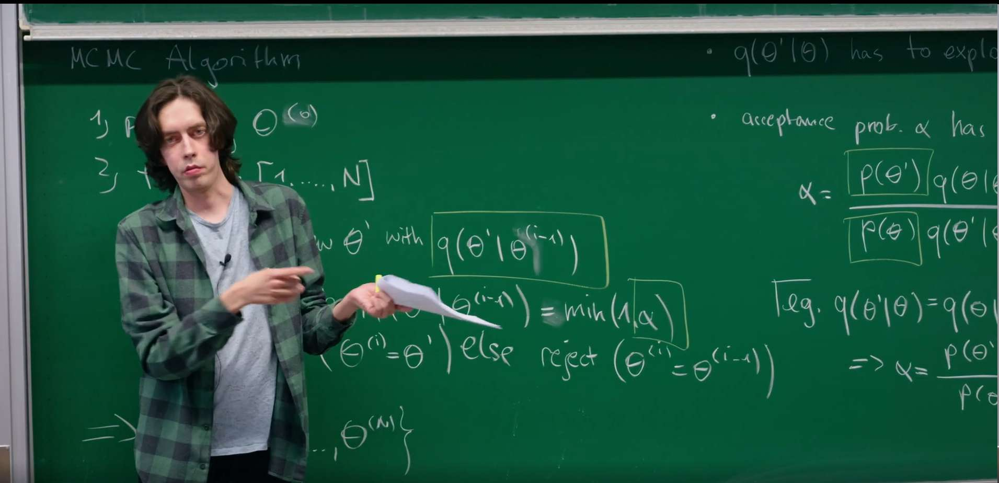


其核心思想是，我们不再采取随机、无方向的步骤，而是将采样变量视为在势能场中运动的粒子。通过模拟其物理轨迹，我们可以提出远离当前状态但仍有很高接受概率的新状态。这使得算法能够更快地探索和收敛，尤其是在高维问题中。

# 1. 回顾：Metropolis-Hastings算法及其局限性

正如我们在上一节**作为随机过程的蒙特卡洛采样**中所学到的，我们的目标是构建一个马尔可夫链，使其平稳分布是我们想要采样的目标概率分布 $p(\theta)$。Metropolis-Hastings算法为此提供了一个通用的方案。

该算法的工作方式是从一个提议分布 $q(\theta'|\theta)$ 中提出一个新状态 $\theta'$，并以概率 $\alpha$ 接受它。正如助教在课程开始时所指出的，这个接受概率是满足细致平衡条件的关键。其通用形式为：

$$\alpha(\theta'|\theta) = \min\left(1, \frac{p(\theta)q(\theta'|\theta)}{p(\theta')q(\theta|\theta')}\right)$$

这个比率的设计旨在修正提议分布 $q$ 中的任何不对称性，并使链偏向于具有更高概率 $p$ 的状态。如果我们提议移动到一个高概率区域，那么 $p(\theta')$ 项会很大，从而增加 $\alpha$。如果我们的提议分布使得从 $\theta$ 到 $\theta'$ 比返回更容易，那么 $q(\theta|\theta')/q(\theta'|\theta)$ 项会对此进行修正，确保链不会被困在那些容易进入但难以离开的区域。

一个常见的简化是使用对称的提议分布，即 $q(\theta'|\theta) = q(\theta|\theta')$。在这种情况下，接受概率简化为：

$$\alpha = \min\left(1, \frac{p(\theta')}{p(\theta)}\right)$$

这被称为"Metropolis"算法，是Metropolis-Hastings算法的一个特例。至关重要的是，概率分布 $p(\theta)$ 的归一化常数 $Z$ 在比率中被消掉了，这是一个巨大的实践优势。我们只需要知道 $p(\theta)$ 的形式，而无需计算其归一化常数。

## "随机游走" Metropolis-Hastings及其致命缺陷

一种非常常见的对称提议分布是以当前状态为中心的高斯分布：

$$q(\theta'|\theta) = \mathcal{N}(\theta'|\theta, \sigma^2)$$

这种方法直观且易于实现，但它正是该算法效率低下的根源。这种随机游走的性能严重依赖于步长 $\sigma$ 的选择。

**小步长 $\sigma$：**提议的新状态会非常接近当前状态。由于 $p(\theta)$ 的变化很小，接受率会很高。然而，链的移动非常缓慢，以扩散的方式探索分布。这导致样本之间存在高度的自相关性，意味着我们需要一条非常长的链才能获得一组具有代表性的独立样本。**算法可能会被"困"在局部的概率峰值中。**

**大步长 $\sigma$：**原则上，算法可以更快地探索空间。然而，在任何稍微复杂的分布中，一次大的随机跳跃极有可能落在一个概率低得多的区域（一个分布的"典型集"通常是一个薄壳，而不是一个实心球）。这会导致接受率 $\alpha$ 急剧下降，链几乎停滞不前，拒绝了几乎所有的提议。

这种步长选择上的两难困境在高维空间中会变得尤其严重。在一维空间中，随机一步有50%的机会朝向"正确"的大致方向。但在 $D$ 维空间中，状态空间的体积呈指数级增长。一个随机的步骤几乎可以肯定会指向一个"坏"的方向，远离那些高概率所在的狭窄区域。因此，随着参数数量 $D$ 的增加，随机游走的效率呈指数级下降。

这种权衡使得随机游走Metropolis-Hastings采样器不适用于现代贝叶斯统计、机器学习和物理学中经常遇到的复杂、高维概率分布。我们需要一种方法来提出既**距离远**又**可能被接受**的新状态。


## 2. 新视角：将概率重新诠释为势能

为了克服随机游走在高维空间中效率低下的根本局限性，我们需要一种更“智能”的探索策略。这个策略的灵感来自于统计物理学的基石模型之一——**伊辛模型（Ising model）**。

伊辛模型是理解物质相变（如磁铁的磁化）的范例。在其中，系统处于某个特定微观状态（例如，一串自旋向上或向下，用 $\{\sigma\}$ 表示）的概率，完全由其能量和环境温度决定，其形式为优美的**玻尔兹曼分布**：

$$p(\{\sigma\}) = \frac{1}{Z} e^{-\beta H(\{\sigma\})}$$

在这里，$H$ 是该构型的哈密尔顿量（也就是能量），$\beta$ 是与温度相关的常数，$Z$ 是确保总概率为1的归一化常数（配分函数）。这个公式蕴含了一个深刻的物理直觉：**能量越低的状态，其出现的概率呈指数级增高**。物理系统总是倾向于停留在更稳定的低能量状态。


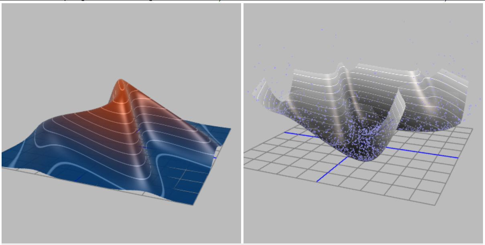
这个物理图像给了我们巨大的启发。我们可以“反转”这个逻辑：对于任何我们想要采样的、抽象的目标概率分布 $p(\theta)$，我们是否也能为它定义一个等效的“能量”函数 $E(\theta)$ 呢？答案是肯定的，我们可以强制让它们满足类似玻尔兹曼分布的关系：

$$p(\theta) \propto e^{-E(\theta)}$$

通过对两边取对数，我们可以直接写出它们之间的换算关系：

$$E(\theta) = -\log p(\theta) + \text{const}$$

我们将这个新定义的 $E(\theta)$ 称为**势能（Potential Energy）**。


这个看似简单的数学变换，实际上是一次根本性的认知飞跃 ，它彻底改变了我们看待采样问题的方式。

1.  **从“盲目”到“有向”**：我们最初的目标是在高维空间中寻找 $p(\theta)$ 值高的区域。现在，我们等价的新目标是探索势能 $E(\theta)$ 低的区域。这成功地将一个纯粹的统计采样问题，**转化为一个极富物理直觉的、探索能量景观的问题**。原来在 $p(\theta)$ 中的高概率“山峰”，现在变成了 $E(\theta)$ 能量景观中的深邃“山谷”。

2.  **引入“力”的概念**：随机游走之所以效率低下，是因为它是“盲目”的，它在提议下一步时完全不了解地形的走向。但在物理世界中，物体的运动不是盲目的。一个在山谷中滚动的小球会受到力的作用。这个力，正是势能的**负梯度**：

    $$F = -\nabla E(\theta) = - \nabla (-\log p(\theta)) = \nabla \log p(\theta)$$

我们找到了摆脱随机性的钥匙。我们现在有了一个“力”，它直接由目标分布的对数梯度给出，并且这个力**永远指向概率密度增长最快的方向**。我们不再需要盲目试探，而是可以顺着“力”的方向，高效地向着高概率区域前进。

通过这个视角转换，我们将抽象的采样问题具象化为在一个由目标分布定义的势能场中，模拟一个物理粒子的运动。这个粒子会被自然地“推”向我们最感兴趣的区域。


将物理系统的动力学思想用于统计计算的想法，最早在物理学界酝酿。将这一思想 kristallisiert 成我们今天所知的哈密顿蒙特卡罗（当时被称为混合蒙特卡罗，Hybrid Monte Carlo）的开创性工作，是由 **Duane, Kennedy, Pendleton 和 Roweth 在1987年**发表的。他们当时的目标是解决格点量子色动力学（Lattice QCD）中极具挑战性的高维积分问题。后来，这一强大方法被统计学和机器学习社区（特别是 **Radford Neal**）所发现和推广，并最终成为现代贝叶斯推断中最高效、最核心的算法之一。


# 3. 构建哈密尔顿系统：引入动量

通过引入“势能”的概念，成功地将采样问题转化为一个探索物理能量景观的问题。但这还不够，因为一个只具有位置和势能的“粒子”是静止的，它无法自行探索。为了让粒子“动起来”，我们需要赋予它**动量（Momentum）**。这是哈密尔tonian Monte Carlo (HMC) 的核心创新，也是它与传统MCMC方法的根本区别所在。

HMC的完整思想并非凭空而来。它的历史可以追溯到1980年代，最初由Simon Duane等物理学家在解决格点规范理论的复杂计算时提出。他们天才地意识到，可以借用经典力学中描述行星运动的**哈密尔顿动力学**框架，来指导统计采样过程，从而改变其效率。

## 3.1 为什么要引入动量？

引入一个与我们模型参数 $\theta$ （位置）维度相同的、虚构的辅助“动量”变量 $v$，相当于将我们的问题从一个静态的景观探索，升级为一个动态的物理系统模拟。

* **从一阶到二阶**：传统的随机游走方法是一阶的，下一步的位置仅仅取决于当前位置。这就像一个蒙着眼睛的人，每一步都只能在原地随机摸索。引入动量后，我们构建了一个二阶动力学系统，下一步的位置不仅取决于当前位置，还取决于当前的速度（动量）。这就像给山谷中的一个溜冰者一个初始推力，他会沿着一条平滑的轨迹持续滑行很长一段距离，而不是在原地打转。
* **持久且有方向的探索**：动量赋予了探索过程“惯性”。一旦被赋予了初始动量，粒子倾向于沿着一个方向持续运动，同时受到势能力（梯度的反方向）的作用而优雅地转向。这种持久性的运动使得采样器能够进行长距离的、有意义的移动，一次性跨越参数空间中的大片区域，从而高效地探索整个概率分布。

## 3.2 定义哈密尔顿量 $H(\theta, v)$

在经典力学中，一个孤立系统的总能量是守恒的。这个总能量，即**哈密尔顿量 $H$，**是其势能和动能之和。我们完全照搬这个物理学中最核心的概念来构建我们的系统：

$$H(\theta, v) = E(\theta) + K(v)$$

* **势能 $E(\theta)$：**如上定义，$E(\theta) = -\log p(\theta)$。这部分完全由我们的目标概率分布决定，它构建了粒子运动的“地形”或“能量景观”。概率越高的区域，势能越低。

* **动能 $K(v)$：**这是与运动相关的能量。其形式直接借鉴物理学，是动量的二次型函数：
    $$K(v) = \frac{1}{2} v^T M^{-1} v$$
    这里的$M$是一个对称正定矩阵，被称为**质量矩阵**。
    * **动量 $v$：**可以直观地理解为粒子在参数空间中探索的“速度和方向”。
    * **质量矩阵 $M$：**在物理上，质量代表了惯性的大小。在这里，它扮演着一个重要的调节角色。
        * **简单情况**：最简单的选择是将 $M$ 设为**单位矩阵 ($M=I$)。**这意味着我们假设所有参数维度的“质量”都相同，粒子在各个方向上对“力”的响应是均等的。
        * **深层含义**：更高级的应用中，$M$可以被设置为与目标分布的协方差相关，这使得粒子在概率密度狭窄的方向上“质量”更大（更难被推动，移动更谨慎），在概率密度宽阔的方向上“质量”更小（更容易被推动，移动更大胆），从而极大地提升了在复杂相关分布上的采样效率。

## 3.3 联合正则分布

我们现在基于这个哈密尔顿量，以和玻尔兹曼分布完全相同的形式，定义一个关于位置和动量的**联合概率分布 $p(\theta, v)$**，这在物理学中被称为**正则分布（Canonical Distribution）**:

$$p(\theta, v) = \frac{1}{Z'} e^{-H(\theta, v)} = \frac{1}{Z'} e^{-(E(\theta) + K(v))} = \frac{1}{Z'} e^{-E(\theta)} e^{-K(v)}$$

这个构造看起来让问题更复杂了：我们本来只想从 $p(\theta)$ 采样，现在却要去从一个更高维的 $p(\theta, v)$ 采样。这里的奥秘在于，这个联合分布的结构是**可分离的**。因为哈密尔顿量被设计为两部分的和，所以联合概率可以**因式分解**：

$$p(\theta, v) = \left(\frac{1}{Z_E} e^{-E(\theta)}\right) \left(\frac{1}{Z_K} e^{-K(v)}\right) = p(\theta) p(v)$$

在我们对动能 $K(v)$ 的常见选择下，$p(v)$ 就是一个简单的中心高斯分布：$p(v) = \mathcal{N}(v|0, M)$。

这个因式分解是HMC整个理论框架的基石。它向我们保证：

**在这个扩展的联合分布中，位置 $\theta$ 和动量 $v$ 是相互独立的。**

这意味着，我们引入的动量变量虽然在**动力学演化**中至关重要（它驱动了探索），但它并不会影响我们最终采样的**静态目标分布**。因此，如果我们能设计一个算法从联合分布 $p(\theta, v)$ 中生成样本对 $(\theta, v)$，我们只需在采样后简单地**丢弃动量 $v$ 分量**，剩下的 $\theta$ 就是我们梦寐以求的、来自原始目标分布 $p(\theta)$ 的有效样本。

动量就像一个临时的“助推器”或“脚手架”：我们在每一步开始时随机设定一个动量（给粒子一个随机的“踢动”），让系统在物理定律的指引下演化，从而高效地提出一个高质量的候选点，任务完成后，我们就把这个助推器扔掉，准备下一次的发射。


# 4. 哈密尔顿蒙特卡洛分步指南

HMC的每一次迭代包含两个主要阶段：首先，对动量进行一次随机"踢动"；其次，通过模拟哈密尔顿动力学生成一个确定性的提议。

## 4.1 第一步：动量重采样

在每次迭代开始时，我们丢弃旧的动量，并从其分布 $p(v)$ 中抽取一个新的。这通常是一个标准多元高斯分布：

$$v \sim \mathcal{N}(0, M)$$

从物理直觉上看，这一步相当于给我们的虚构粒子一个随机的"踢动"。这改变了系统的总能量 $H$，使得采样器能够在不同的能量等值线之间跳跃，从而探索整个能量景观。没有这一步，模拟将是纯粹确定性的，并被困在单一的能量等值面上。

## 4.2 第二步：用哈密尔顿方程模拟物理过程

给定一个起始点 $(\theta, \tilde{v})$，我们通过根据哈密尔顿运动方程将系统向前演化一段固定的时间 $T$，来生成一个提议 $(\theta', v')$：

$$\frac{d\theta}{dt} = \frac{\partial H}{\partial v} = M^{-1}v$$

$$\frac{dv}{dt} = -\frac{\partial H}{\partial \theta} = -\nabla_\theta E(\theta) = \nabla_\theta \log p(\theta)$$

从物理直觉上看：

* 第一个方程很简单：位置的变化率就是速度 $(M^{-1}v)$。

* 第二个方程是牛顿第二定律 $(F = ma)$：动量的变化率是力，即势能的负梯度。粒子被"拉"向能量更低（概率更高）的区域。

这正是HMC强大之处的核心。与随机游走不同，其轨迹是由对数概率的梯度引导的。粒子会自然地朝向并探索高概率区域。这使我们能够提出一个远离当前状态 $\theta$ 但仍处于合理区域的新状态 $\theta'$，从而获得很高的接受率。

## 4.3 第三步：使用蛙跳法进行数值积分

哈密尔顿方程是一个连续的微分方程组。对于大多数有趣的问题，我们无法解析地求解它们，因此必须使用数值积分器来近似轨迹。像欧拉法这样的简单方法会迅速累积误差并且不能保持能量守恒，导致接受率非常低。HMC需要一种特殊的积分器，称为**辛积分器**（symplectic integrator）。最常见的选择是**蛙跳法（Leapfrog integrator）。**

蛙跳算法通过先更新半步动量，再更新一整步位置，最后再更新半步动量来工作。对于一个很小的时间步长 $\epsilon$，一个蛙跳步骤如下 (5)：

1. $v(t + \epsilon/2) = v(t) - (\epsilon/2) \nabla_\theta E(\theta(t)) = v(t) + (\epsilon/2) \nabla_\theta \log p(\theta(t))$

2. $\theta(t + \epsilon) = \theta(t) + \epsilon M^{-1} v(t + \epsilon/2)$

3. $v(t + \epsilon) = v(t + \epsilon/2) - (\epsilon/2) \nabla_\theta E(\theta(t + \epsilon)) = v(t + \epsilon/2) + (\epsilon/2) \nabla_\theta \log p(\theta(t + \epsilon))$

要模拟总时间 $T$，我们将这个过程重复 $L = T/\epsilon$ 次。

为什么要费心使用这种特定的更新方案呢？像蛙跳法这样的辛积分器具有两个至关重要的特性：

1. **时间可逆性**：如果你用蛙跳法运行 $L$ 步从 $(\theta, v)$ 到达 $(\theta', v')$，然后将最终动量反转为 $-v'$ 再运行 $L$ 步，你将精确地回到 $(\theta, -v)$。这个性质对于满足细致平衡至关重要。

2. **体积保持性**：该积分器保持了 $(\theta, v)$ 相空间的体积。这意味着它不会人为地压缩或稀释概率密度，这对于一个有效的MCMC算法来说是必需的。

虽然蛙跳法不能完美地保持哈密尔顿量 $H$（它会有 $\epsilon^2$ 量级的小误差），但它具有出色的长期稳定性和保持MCMC转移有效性所需的几何特性。这使得HMC即使在许多积分步骤之后也能保持很高的接受率。

## 4.4 第四步：Metropolis-Hastings修正

经过 $L$ 步蛙跳积分后，我们得到了一个提议状态 $(\theta', v')$。由于数值积分并不完美，总能量 $H$ 并未完全守恒。$H(\theta', v')$ 会与 $H(\theta, \tilde{v})$ 略有不同。为了修正这个数值误差并使算法精确，我们执行最后一步Metropolis接受步骤 (1)：

$$\alpha = \min\left(1, \exp[-(H(\theta', v') - H(\theta, \tilde{v}))]\right)$$

这一点非常深刻。与随机游走Metropolis不同，HMC中的接受/拒绝步骤不是探索的主要驱动力。哈密尔顿动力学才是探索者。接受步骤是对数值积分器的质量控制检查。如果积分器在保持能量方面做得很好（$H' \approx H$），那么接受概率 $\alpha$ 就会接近1，正如黑板上所写的（$\alpha \approx 1$）。如果步长 $\epsilon$ 太大，积分误差会很大，能量不守恒，提议就会被（正确地）拒绝。

# 5. 可视化HMC与随机游走Metropolis
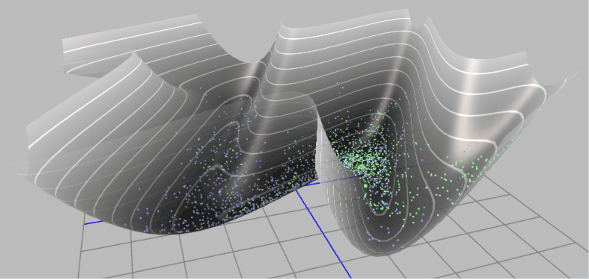

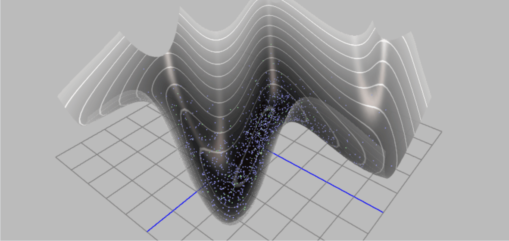

通过上面两幅动态示意图，可以清晰的了解基于Metropolis 算法的采样和基于哈密尔顿蒙特卡洛采样的区别。

为了建立直观理解，我们将通过可视化来比较一个简单的随机游走Metropolis（RWM）采样器和我们新的HMC采样器的探索行为。我们将使用一个二维相关高斯分布作为目标分布。这是一个经典的测试案例，因为变量之间的相关性使得轴对齐或简单的随机游走采样器难以高效探索。


以下代码将实现并对比这两种算法。

1. **定义目标分布**：实现二维高斯分布的对数概率（即负势能）及其梯度。

2. **RWM采样器**：实现标准的随机游走Metropolis算法。

3. **HMC采样器**：实现蛙跳积分器和完整的HMC循环。

4. **可视化**：在目标分布的等高线图上，绘制两种算法生成的样本路径。

```python
import numpy as np
import matplotlib.pyplot as plt
from scipy.stats import multivariate_normal

# --- Target distribution (correlated 2D Gaussian distribution) --- 
# This defines our "potential energy field"
mean = np.array([0.0, 0.0])
cov = np.array([[1.0, 0.95], 
                [0.95, 1.0]])
inv_cov = np.linalg.inv(cov)
target_dist = multivariate_normal(mean, cov)

def potential_energy(theta):
    """ Potential energy U(theta) = -log p(theta) """
    return -target_dist.logpdf(theta)

def grad_potential_energy(theta):
    """ Gradient of potential energy, i.e., -d/d(theta) log p(theta) """
    # For Gaussian distribution N(mu, Sigma), the gradient of log p is -inv(Sigma) * (theta - mu)
    # So the gradient of potential energy (-log p) is inv(Sigma) * (theta - mu)
    return inv_cov @ (theta - mean)

# --- Leapfrog integrator ---
def leapfrog(theta, v, grad_U, epsilon, L):
    """
    Perform L steps of leapfrog integration.
    theta: current position
    v: current momentum
    grad_U: function to compute gradient of potential energy
    epsilon: step size
    L: number of steps
    """
    # Initial half-step momentum update
    v_half = v - 0.5 * epsilon * grad_U(theta)
    # L-1 full-step updates
    for _ in range(L - 1):
        theta = theta + epsilon * v_half
        v_half = v_half - epsilon * grad_U(theta)
    # Final full-step position update
    theta = theta + epsilon * v_half
    # Final half-step momentum update
    v = v_half - 0.5 * epsilon * grad_U(theta)
    return theta, v

# --- HMC sampler ---
def hmc_sampler(start_theta, n_samples, epsilon, L):
    samples = [start_theta]
    theta = start_theta
    
    for _ in range(n_samples - 1):
        # 1. Sample momentum
        v_current = np.random.randn(2)
        
        # 2. Simulate trajectory using leapfrog
        theta_prop, v_prop = leapfrog(np.copy(theta), np.copy(v_current), grad_potential_energy, epsilon, L)
        
        # 3. Metropolis-Hastings correction
        # H(theta, v) = U(theta) + K(v), where K(v) = 0.5 * v.T @ v
        U_current = potential_energy(theta)
        K_current = 0.5 * (v_current @ v_current)
        H_current = U_current + K_current
        
        U_prop = potential_energy(theta_prop)
        K_prop = 0.5 * (v_prop @ v_prop)
        H_prop = U_prop + K_prop
        
        # Acceptance probability
        alpha = min(1.0, np.exp(H_current - H_prop))
        
        if np.random.rand() < alpha:
            theta = theta_prop
            
        samples.append(theta)
        
    return np.array(samples)

# --- Random Walk Metropolis sampler ---
def rwm_sampler(start_theta, n_samples, step_size):
    samples = [start_theta]
    theta = start_theta
    
    for _ in range(n_samples - 1):
        # Propose a new state
        theta_prop = theta + step_size * np.random.randn(2)
        
        # Acceptance probability
        alpha = min(1.0, np.exp(potential_energy(theta) - potential_energy(theta_prop)))
        
        if np.random.rand() < alpha:
            theta = theta_prop
            
        samples.append(theta)
        
    return np.array(samples)

# --- Run simulation and plot ---
n_samples = 500
start_theta = np.array([-2.5, 2.5])

# Adjust parameters
hmc_samples = hmc_sampler(start_theta, n_samples, epsilon=0.1, L=20)
rwm_samples = rwm_sampler(start_theta, n_samples, step_size=0.15)

# Plotting
x = np.linspace(-3, 3, 100)
y = np.linspace(-3, 3, 100)
X, Y = np.meshgrid(x, y)
pos = np.dstack((X, Y))
Z = target_dist.pdf(pos)

plt.figure(figsize=(12, 6))

# RWM plot
plt.subplot(1, 2, 1)
plt.contour(X, Y, Z, levels=10, cmap='viridis')
plt.plot(rwm_samples[:, 0], rwm_samples[:, 1], 'r-o', markersize=3, alpha=0.5)
plt.title(f"Random Walk Metropolis (N={n_samples})")
plt.xlabel(r"$\theta_1$")
plt.ylabel(r"$\theta_2$")

# HMC plot
plt.subplot(1, 2, 2)
plt.contour(X, Y, Z, levels=10, cmap='viridis')
plt.plot(hmc_samples[:, 0], hmc_samples[:, 1], 'b-o', markersize=3, alpha=0.5)
plt.title(f"Hamiltonian Monte Carlo (N={n_samples})")
plt.xlabel(r"$\theta_1$")
plt.ylabel(r"$\theta_2$")

plt.tight_layout()
plt.show()
```
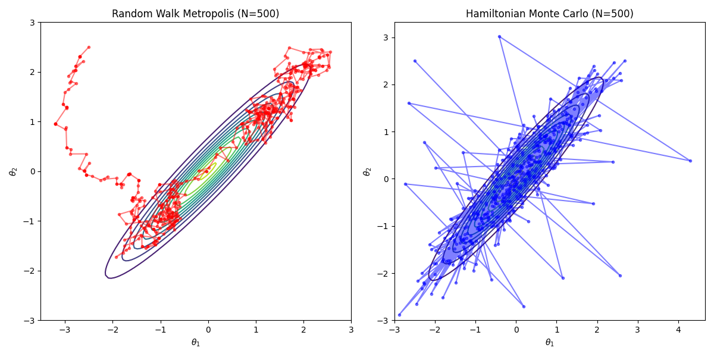

从图中可以清晰地看到，RWM采样器（左图）的路径非常密集，步子很小，探索速度缓慢，呈现出典型的扩散行为。相比之下，HMC采样器（右图）能够进行长距离的跳跃，高效地在分布的高概率区域之间移动，从而更快地获得整个分布的代表性样本。

# 6. 使用现代贝叶斯方法求解洛特卡-沃尔泰拉模型参数


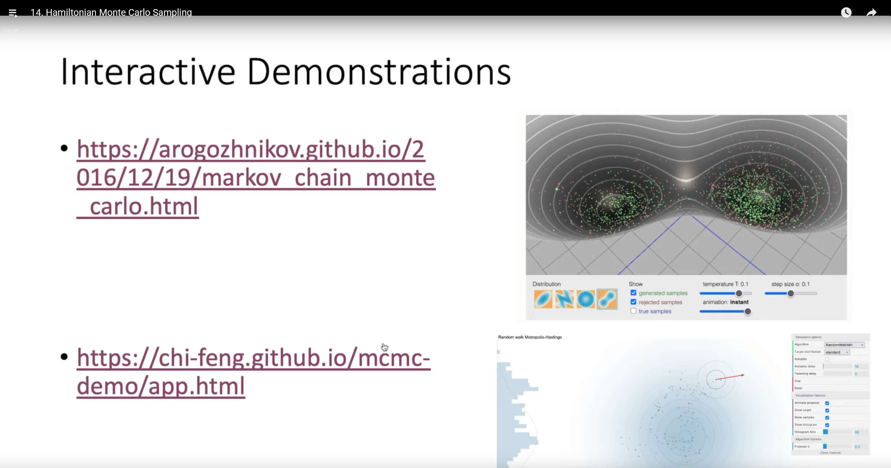


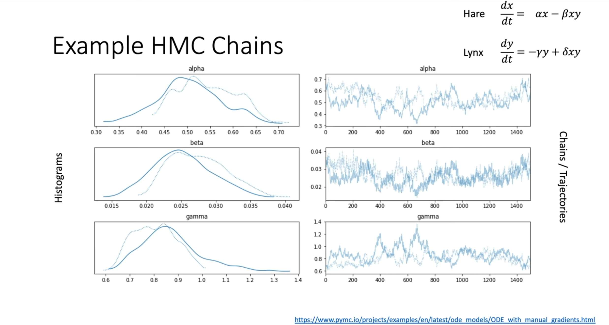


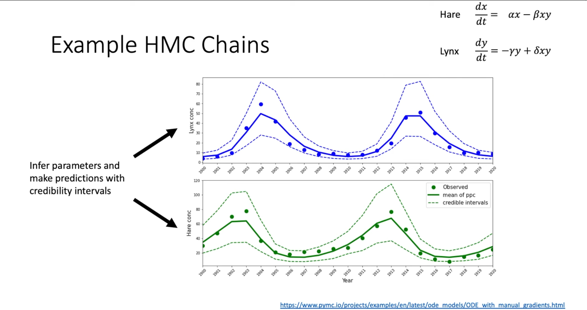


现在，我们将理论付诸实践，复现上图课堂举的例子。回到讲座最初的例子：猞猁与雪兔的种群动态。我们将使用的哈密顿蒙特卡洛（Hamiltonian Monte Carlo, HMC）算法，在一个名为 **PyMC** 的现代概率编程框架中，根据哈德逊湾公司提供的数据，来推断描述这个生态系统的洛特卡-沃尔泰拉模型的七个未知参数（$\alpha$，$\beta$，$\gamma$，$\delta$，初始种群数量 $H_{0}$，$L_{0}$，以及观测噪声 $\sigma$）。

这个案例的挑战在于，洛特卡-沃尔泰拉模型是一组微分方程，没有简单的解析解。对于给定的参数，我们需要通过数值积分来得到种群数量的演化曲线。这使得后验概率分布 $p(\theta|D)$ 变得异常复杂且维度较高，参数之间可能存在强烈的相关性。这正是HMC 这类先进的 MCMC 算法大显身手的场景。

## 6.1 建模思路
1. **模型**：洛特卡-沃尔泰拉（Lotka-Volterra）常微分方程组。

2. **数据**：1900-1920年的雪兔（Hares）和猞猁（Lynx）种群数量。

3. **目标**：求解所有未知参数的联合后验概率分布 $p(\alpha,\beta,\gamma,\delta,H_{0},L_{0},\sigma|\text{数据})$。

4. **方法**：在PyMC中构建概率模型，并使用其默认的NUTS（No-U-Turn Sampler）采样器，这是一种高效的HMC变体。

   

   **状态空间**：七维参数空间 $(\alpha,\beta,\gamma,\delta,H_{0},L_{0},\sigma)$。

   

   **目标分布**：后验概率 $p(\theta|D) \propto p(D|\theta) p(\theta)$。

   

   **似然函数 $p(D|\theta)$：**我们假设观测数据与模型预测之间的误差服从对数正态分布。这意味着模型预测的种群数量（必须为正）在对数尺度上与观测数据的对数呈正态误差。这对于不能为负且方差可能随均值变化的种群数据是一个非常合理的假设。

   

   **先验分布 $p(\theta)$：**我们为所有参数选择了对数正态（Lognormal）或半正态（Half-Normal）分布作为先验。这是一个关键的建模选择，目的是为了施加一个物理约束：所有这些参数，无论是增长率、交互率、初始种群数还是噪声，其物理意义都决定了它们必须为正。这不仅是合理的先验知识，更是保证数值求解器稳定性的必要条件。

   

   **梯度信息与HMC**：与依赖随机游走的Metropolis-Hastings不同，HMC算法通过模拟物理系统中的哈密顿动力学来进行采样。它利用后验分布的梯度信息来指导采样方向，从而能够以更高的效率探索复杂、高维的参数空间。在这个案例中，我们借助sunode库，它能够自动且高效地计算出ODE解对各个参数的梯度。正是这些精确的梯度信息，使得NUTS采样器能够成功地应对这个挑战。

   


```python
"""
Using modern PyMC (v5+) and sunode library to reproduce the Lotka-Volterra model.
This version replaces the old PyMC3 + Theano + manual gradient implementation.
"""
import pymc as pm
import numpy as np
import arviz as az
import sunode
import sunode.wrappers.as_pytensor
import matplotlib.pyplot as plt
import pandas as pd


# 1. Data preparation (Hudson Bay Company dataset)
# Keeping consistent with the data used in the original tutorial
times = np.arange(1900, 1921, 1)
hare_data = np.array([
    30.0, 47.2, 70.2, 77.4, 36.3, 20.6, 18.1, 21.4, 22.0, 25.4,
    27.1, 40.3, 57.0, 76.6, 52.3, 19.5, 11.2, 7.6, 14.6, 16.2, 24.7
])
lynx_data = np.array([
    4.0, 6.1, 9.8, 35.2, 59.4, 41.7, 19.0, 13.0, 8.3, 9.1, 7.4,
    8.0, 12.3, 19.5, 45.7, 51.1, 29.7, 15.8, 9.7, 10.1, 8.6
])
data = np.stack([hare_data, lynx_data]).T
species_names = ['hares', 'lynx']

# 2. Define ODE equations
# sunode uses sympy for symbolic definition and automatic differentiation, which is very efficient
def lotka_volterra(t, y, p):
    """
    Right-hand side of the Lotka-Volterra (predator-prey) equations.
    
    Args:
        t: Time (sympy symbol)
        y: Dataclass of state variables (species populations), containing y.hares and y.lynx
        p: Dataclass of parameters, containing p.alpha, p.beta, p.gamma, p.delta
        
    Returns:
        A dictionary describing the rate of change of each state variable.
    """
    return {
        'hares': p.alpha * y.hares - p.beta * y.lynx * y.hares,
        'lynx': p.delta * y.hares * y.lynx - p.gamma * y.lynx,
    }

# 3. Build PyMC probabilistic model
# Define coordinates to use 'time' and 'species' dimensions in the model
coords = {"time": times, "species": species_names}

with pm.Model(coords=coords) as model:
    # --- Prior distributions ---
    # Use Lognormal priors to ensure parameters are positive, preventing ODE solutions from becoming negative
    alpha = pm.Lognormal("alpha", mu=np.log(1), sigma=0.5)
    beta = pm.Lognormal("beta", mu=np.log(0.05), sigma=0.5)
    gamma = pm.Lognormal("gamma", mu=np.log(1), sigma=0.5)
    delta = pm.Lognormal("delta", mu=np.log(0.05), sigma=0.5)

    # Priors for initial states
    initial_hares = pm.Lognormal("initial_hares", mu=np.log(30), sigma=1)
    initial_lynx = pm.Lognormal("initial_lynx", mu=np.log(4), sigma=1)

    # Prior for observation noise
    sigma = pm.HalfNormal("sigma", sigma=1)

    # --- Solve ODE using sunode ---
    # This is the key step that replaces the manual Theano Op
    y_hat, _, _, _, _, _ = sunode.wrappers.as_pytensor.solve_ivp(
        y0={
            # Define initial conditions for the ODE
            # Format: {'variable_name': (PyTensor variable, shape)}
            'hares': (initial_hares, ()),
            'lynx': (initial_lynx, ()),
        },
        params={
            # Define parameters for the ODE
            # sunode will automatically compute gradients with respect to these PyTensor variables
            'alpha': (alpha, ()),
            'beta': (beta, ()),
            'gamma': (gamma, ()),
            'delta': (delta, ()),
            # sunode requires all parameters to be PyTensor variables or numpy arrays
            '_dummy': np.array(0.), 
        },
        # Pass in the ODE function we defined earlier
        rhs=lotka_volterra,
        # Define time points for solving
        tvals=times,
        t0=times[0],
    )

    # --- Likelihood function ---
    # sunode returns a dictionary, we need to stack the solution into a matrix to match the shape of observed data
    ode_solution = pm.math.stack([y_hat['hares'], y_hat['lynx']], axis=1)
    
    # Assume observations follow a log-normal distribution
    Y_obs = pm.Lognormal(
        "Y_obs", 
        mu=pm.math.log(ode_solution), 
        sigma=sigma, 
        observed=data, 
        dims=("time", "species")
    )
    
# 4. Run sampler
# The NUTS sampler will utilize the exact gradient information provided by sunode
with model:
    # sunode's C backend does not support multiprocessing "pickling", so we must use a single core
    idata = pm.sample(2000, tune=2000, chains=4, cores=1, target_accept=0.9)

# 5. Results visualization
# Plot posterior distributions of parameters
az.plot_posterior(idata, var_names=["alpha", "beta", "gamma", "delta", "initial_hares", "initial_lynx", "sigma"])
plt.suptitle("Posterior Distributions of Parameters", y=1.02)
plt.tight_layout()
plt.savefig("lv_posterior_distributions.png", dpi=300, bbox_inches='tight')
plt.show()

# Extract posterior predictive samples
with model:
    posterior_predictive = pm.sample_posterior_predictive(idata)

# Plot posterior predictions vs. real data
fig, axes = plt.subplots(2, 1, figsize=(10, 8), sharex=True)

for i, (spec, color) in enumerate(zip(species_names, ['C0', 'C1'])):
    # Plot real data
    axes[i].plot(times, data[:, i], 'o', color=color, label=f"Observed {spec.capitalize()}")
    
    # Extract posterior predictive mean and 94% credible interval
    pred_mean = posterior_predictive.posterior_predictive['Y_obs'].mean(dim=('chain', 'draw')).sel(species=spec)
    hdi_94 = az.hdi(posterior_predictive.posterior_predictive['Y_obs'].sel(species=spec), hdi_prob=0.94)
    
    # Plot posterior predictions
    axes[i].plot(times, pred_mean, color=color, lw=2, label=f"Posterior Mean {spec.capitalize()}")
    # Use isel (integer selection) instead of sel (label selection) to get HDI upper and lower bounds
    axes[i].fill_between(times, hdi_94.Y_obs.isel(hdi=0), hdi_94.Y_obs.isel(hdi=1), color=color, alpha=0.3, label="94% HDI")
    
    axes[i].set_ylabel("Population")
    axes[i].set_title(f"{spec.capitalize()} Population Dynamics")
    axes[i].legend()

axes[1].set_xlabel("Year")
plt.tight_layout()
plt.savefig("lv_posterior_predictions.png", dpi=300, bbox_inches='tight')
plt.show()

# 6. Phase plot
plt.figure(figsize=(8, 8))
pred_mean_hares = posterior_predictive.posterior_predictive['Y_obs'].mean(dim=('chain', 'draw')).sel(species='hares')
pred_mean_lynx = posterior_predictive.posterior_predictive['Y_obs'].mean(dim=('chain', 'draw')).sel(species='lynx')

plt.plot(pred_mean_hares, pred_mean_lynx, lw=2, label="Posterior Mean Trajectory")
plt.plot(hare_data, lynx_data, 'o', alpha=0.8, label="Observed Data")
plt.xlabel("Hares Population")
plt.ylabel("Lynx Population")
plt.title("Lotka-Volterra Phase Portrait")
plt.legend()
plt.grid(True, linestyle='--', alpha=0.6)
plt.savefig("lv_phase_portrait.png", dpi=300, bbox_inches='tight')
plt.show()


# 7. Trace plot
# This plot is used to diagnose the health of the MCMC sampling process
az.plot_trace(idata, var_names=["alpha", "beta", "gamma", "delta", "initial_hares", "initial_lynx", "sigma"])
plt.tight_layout()
plt.savefig("lv_trace_plot.png", dpi=300, bbox_inches='tight')
plt.show()

# 8. Results visualization
# Plot posterior distributions of parameters
az.plot_posterior(
    idata, 
    var_names=["alpha", "beta", "gamma", "delta", "initial_hares", "initial_lynx", "sigma"],
    kind="hist"  # Set chart type to histogram
)
plt.suptitle("Posterior Distributions of Parameters (Histogram)", y=1.02)
plt.tight_layout()
plt.savefig("lv_posterior_histograms.png", dpi=300, bbox_inches='tight')
plt.show()
```

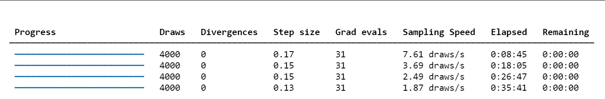

我们可以发现，与上一节课我们实现的Metropolis-Hastings MCMC 代码相比，这份代码运行时长更久。根本原因在于其采用了计算上更昂贵的 **哈密顿蒙特卡洛（HMC） 算法**，在每次迭代中，Metropolis-Hastings 仅需对微分方程（ODE）进行一次数值求解来计算似然；而HMC 为了实现更高效的参数空间探索，不仅需要求解ODE，还必须通过 sunode 求解一个更复杂的伴随微分方程组来获得后验概率的梯度 ，并利用这个梯度信息模拟一整段运动轨迹来产生下一个样本点。

为什么计算时间那么长我们还是要使用 HMC呢？首先 HMC 更全面的建模，更诚实的不确定性,我们没有假定初始值和误差是已知的。通过同时推断这8个参数，我们得到了一个对系统整体不确定性更完整、更诚实的评估。上一节的MH代码因为固定了这些值，可能会低估最终的不确定性。 

其次，无与伦比的采样效率和可靠性，这可能是最重要的优势。虽然MH在10分钟内给出50000个样本，但这些样本可能因为高度相关，实际只相当于几百个独立的有效样本。而NUTS花更长4000个样本，可能就相当于上千个独立的有效样本。对于复杂的科学问题， 样本的“质”远比“量”重要 。 HMC 给出的结果远比MH可靠，更能保证我们探索到了后验分布的真实形状。 

其实有一点数据基础的同学可能会有疑惑，我们明明会有更快速的方法(如 scipy.optimize.curve_fit)  ：可以在几秒钟内给你一组最优的参数值（一个点估计）。它能告诉你“哪条曲线能最好地穿过这些数据点”。但贝叶斯ODE方法(我们用的)  ：它不仅给出了参数的估计，还给出了 参数的完整后验分布 。它能告诉你：“根据数据和我们的物理模型，猎物出生率 α 有95%的可能性在[0.5, 0.8] 这个区间内，最可能的值是0.65”。 

这在科研追求中是天壤之别。**我们关心的往往不是那条最优的曲线，而是驱动这个系统的内在规律 ，也就是$\alpha, \beta, \gamma, \delta$这些参数的真实值。**理解这些参数，就是理解这个生态系统本身。这就像医生诊断病因，而不是仅仅退烧。 

因此，我们真正的科学是严谨的不确定性量化(Rigorous Uncertainty Quantification)而非仅仅是数据炼丹，在科学、工程和政策制定中，知道我们对一个结果“有多确定”至关重要。比如，当我们说“根据模型，2030年的海平面上升有95%的概率在10到15厘米之间”，这种带有严格概率保证的陈述，是制定应对气候变化政策的基石。同样，在药物研发中，确定一个新药有效剂量的置信区间，直接关系到患者的生命安全。我们愿意花几周的计算时间，来换取这种可靠性。 

更为重要的是，我们可以榨干数据中的每一滴信息，在很多科研领域，数据是极其宝贵和稀疏的。比如： 

- 临床试验 ：病人数量有限。

- 古生物学 ：化石样本稀少。 

- 太空探索 ：探测器传回的数据有限。 

在这些场景下，我们无法使用需要海量数据的深度学习。但贝叶斯方法可以通过结合先验知识（我们的ODE模型就是一种极强的先验） 和少量数据，得出非常稳健的结论。它“榨干”了数据中的每一滴信息。 


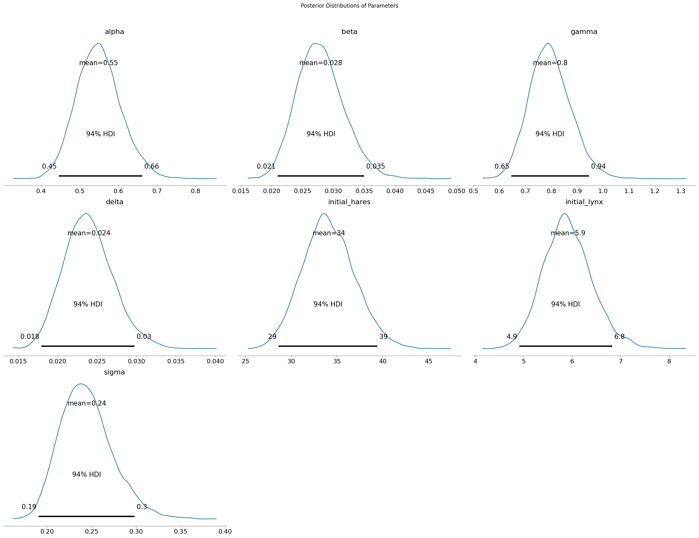
贝叶斯模型在学习了哈德逊湾公司的历史数据后，对洛特卡-沃尔泰拉方程中七个未知参数（包括两个初始值和噪声）的最终推断结果。每一幅子图都代表一个参数的概率分布。 

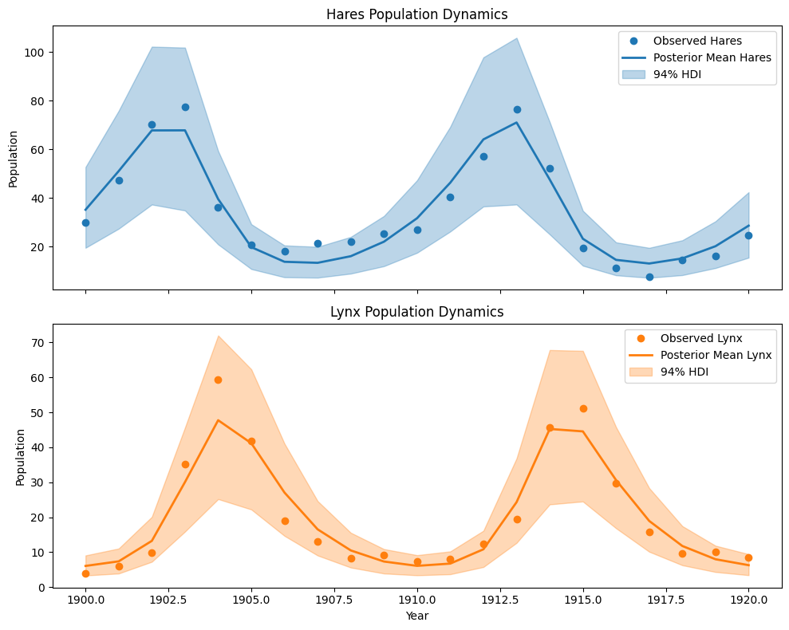

图中两条实线（蓝色代表雪兔，橙色代表猞猁）是模型的“最佳预测”轨迹（即后验均值预测）。我们可以清楚地看到，这条预测线非常成功地捕捉了两种物种数量随时间变化的周期性涨落规律。雪兔种群先达到顶峰，随后作为食物来源的猞猁种群也随之繁荣；而猞-猁数量的增加又导致雪兔被大量捕食而减少，接着猞猁也因食物短缺而数量下降，如此循环往复。 

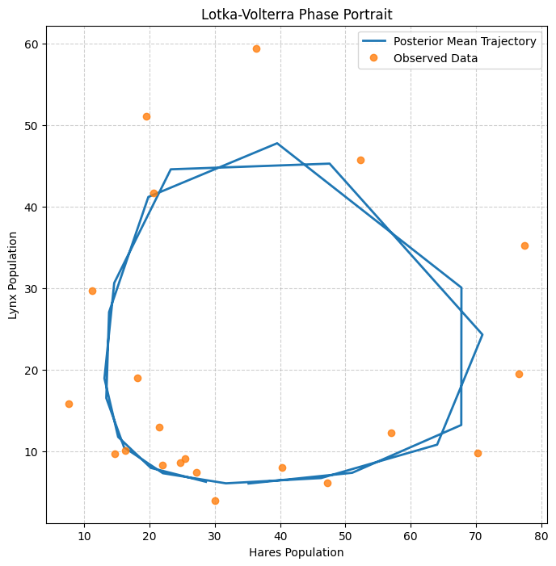

洛特卡-沃尔泰拉模型的相图(Phase Portrait)。这张图最核心的特征就是一个 闭合的环路 。这正是捕食者-被捕食者系统的标志性动力学特征。与上一张时间序列图相比，这张相图更能证明模型不仅仅是“拟合了几个数据点”，而是真正理解并复现了这个生态系统内部的动力学反馈机制它证明了模型所学到的参数（ $α , β , γ , δ$）组合在一起时，能够生成一个与现实世界观察到的循环路径非常相似的理论路径。 

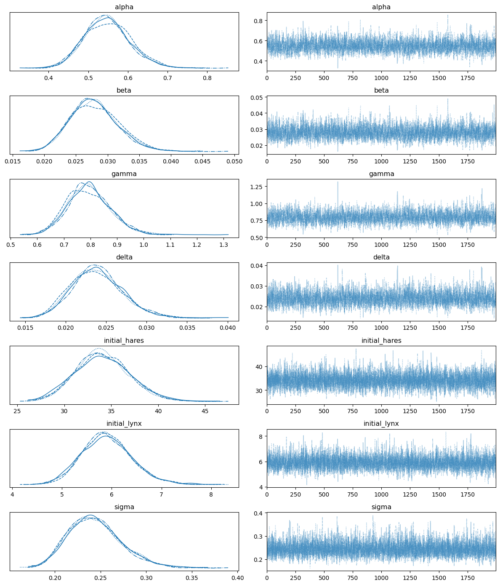

图的右侧部分，每个参数的采样轨迹都像一条稳定而“毛茸茸的毛毛虫”，没有向上或向下的漂移趋势，这表明采样过程已经完全收敛。同时，左侧的后验分布图中，来自4个独立采样链的曲线几乎完美地重叠在一起，这进一步证明它们都一致地找到了相同的目标分布


# 总结

HMC利用目标分布的几何信息（通过其梯度）来提出远距离且有效的移动，极大地提高了相比于随机游走等扩散性方法的采样效率。然而，这种效率是有代价的：HMC要求计算对数概率的梯度，并且有更多的调节参数（步长 $\epsilon$，步数 $L$），算法运行时长更长。

下表总结了本讲讨论的MCMC算法之间的关键区别。

**表1：MCMC采样算法比较**


| 特性 | 随机游走Metropolis (RWM) | 哈密尔顿蒙特卡洛 (HMC) |
|:---|:---|:---|
| 提议机制| 扩散性随机步（如高斯噪声） | 基于哈密尔顿动力学的确定性轨迹 |
| 探索行为| 局部、缓慢、样本自相关性高 | 全局、快速、样本自相关性低 |
| 所需信息| 目标密度 p(θ) (可差一个常数) | 目标密度 p(θ) 及其梯度 ▽log p(θ) |
|接受率| 对步长敏感；通常调至约23%以达最优效率 | 若调节得当，通常非常高(>80%)；反映了积分器的精度 |
|关键调节参数| 步长 σ | 步长 ε，步数 L |
|高维性能| 差；受维度灾难影响严重 | 优秀；性能随维度增加的扩展性更好 |
|主要应用场景| 简单问题或梯度不可用时 | 复杂模型中对连续可微分布采样的黄金标准 |
|**速度**|**单次迭代速度快，因为计算简单**|**单次迭代速度极慢，因为要计算梯度**|


**作为初学者，学完这一讲这自然会引出一个问题：在拥有强大深度学习工具的今天，这种“老派”方法是否已经过时或“不如”深度学习？**

答案是： 它们不是简单的优劣关系，而是适用于不同问题、各有千秋的两种强大工具。而真正的科学前沿，正是在于将这两者结合起来。 


让我们来深入对比一下。

**方法对比：贝叶斯ODE推断 vs. 纯深度学习**


| 特性 | 贝叶斯ODE推断 (我们刚刚用的方法) | 纯深度学习方法 (例如 RNN, LSTM, Transformer) |
| :--- | :--- | :--- |
| **可解释性** | **极强 (白箱)。**模型的每个参数都有明确的物理意义（$\alpha$是出生率，$\beta$是捕食率等）。我们可以分析参数的后验分布，理解系统内在的驱动力。 | **极弱 (黑箱)。**模型由数百万个权重和偏置组成，很难理解其内部决策逻辑。我们只知道输入和输出的关系，不知道“为什么”。 |
| **数据需求** | **较低**。由于模型结构基于物理定律，它为数据提供了一个强大的“骨架”。即使数据点不多，也能得到相对可靠的结果。 | **极高**。需要大量数据才能让网络学习到潜在的动态模式，否则很容易过拟合。 |
| **先验知识/物理约束** | **核心优势**。整个模型就是建立在领域知识（Lotka-Volterra方程）之上的。我们可以通过先验分布融入更多专家经验。 | **默认忽略**。模型从数据中学习一切，不直接利用已知的物理定律。 |
| **不确定性量化** | **黄金标准**。天生就能提供所有参数的完整后验分布，以及对预测结果的严格置信区间（Credible Intervals），这对于科学决策至关重要。 | **默认不提供**。标准神经网络只给出一个点估计预测。虽然有贝叶斯神经网络（BNN）等技术，但通常更复杂且应用较少。 |
| **计算速度** | **推断(采样)极慢**，正如我们所见。但**训练/学习**的概念较弱，主要是采样。 | **训练极慢**，需要大量GPU时间和数据。但一旦训练完成，**预测(推断)极快**。 |
| **泛化与外推** | **较强**。因为模型基于“定律”，它在数据范围之外进行预测（外推）时，表现通常比纯数据驱动方法更可靠。 | **极弱**。非常不擅长外推。如果遇到训练数据之外的新情况，预测结果可能完全错误。 |


当前计算科学领域最热门的方向之一：**科学机器学习 (Scientific Machine Learning)，**其核心思想就是将两者最好的部分结合起来。代表性的技术有：

**1. 通用微分方程 (Universal Differential Equations, UDEs)**

它的做法是：
* 我们从一个已知的、但不完美的物理模型（比如我们的Lotka-Volterra方程）开始。
* 然后，我们**用一个神经网络来学习模型的未知部分或误差项**。

方程就变成了这样：

$$\frac{dx}{dt} = \alpha x - \beta xy + \mathbf{NN_x}(x, y, \theta_{NN})$$


$$\frac{dy}{dt} = \delta xy - \gamma y + \mathbf{NN_y}(x, y, \theta_{NN})$$


**这样做的好处是：**

* **保留可解释性**：我们仍然可以推断出有物理意义的参数 $\alpha, \beta, \gamma, \delta$。

  

* **提升模型精度**：神经网络 $\mathbf{NN}$ 可以从数据中学习并修正原始物理模型的不足之处（例如，环境承载力、季节变化等Lotka-Volterra没考虑的因素）。

  

* **数据效率更高**：因为大部分结构由物理定律提供，神经网络只需要学习“残差”部分，所需数据远少于纯深度学习。

  

* **速度更快**：通常使用基于梯度的优化算法进行训练，比纯MCMC采样快几个数量级。

  

**2. 物理信息神经网络 (Physics-Informed Neural Networks, PINNs)**

这是另一种思路。它让一个神经网络直接去拟合数据，但**在训练的损失函数中加入一项，惩罚那些不遵守已知物理定律（如ODE方程）的解**。


* **损失函数 =** 数据拟合误差 + 物理方程残差

  

这相当于强迫神经网络在学习数据模式的同时，也必须“尊重”物理定律。