# 序言：从无偏到有偏的随机游走

在前面的课程中，Erwin Frey 教授已经探讨了简单随机游走（random walk）的概念，并揭示了它在宏观尺度上如何与扩散方程建立深刻的联系。这种游走是完全无偏的，每一步的方向选择都是纯粹随机的，最终导致粒子云的弥散。然而，在生物世界中，我们观察到许多微生物，尽管身处一个黏性主导、惯性可以忽略不计的物理环境中，却能表现出惊人的导航能力，朝着食物源移动或远离有害物质。

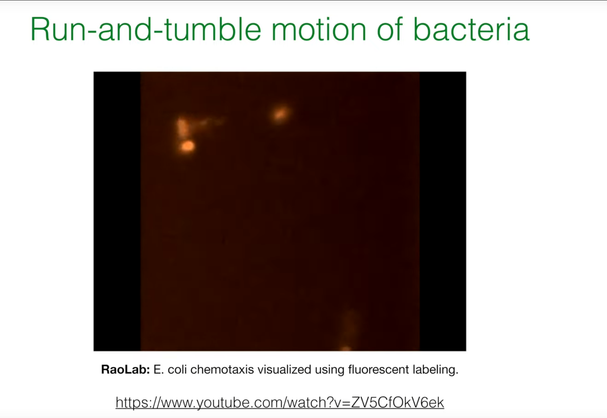

这节课的核心问题是：一个生物体，在低雷诺数（ 惯性力与黏性力之比，低则黏性主导）环境的随机力作用下，如何实现**定向**运动？本节课将以细菌的**趋化性（Chemotaxis）**为范例，深入剖析这一问题。趋化性是一个典型的**有偏**随机游走过程，它展示了微观层面的随机决策如何巧妙地汇聚成宏观层面的有效**导航策略。**这不仅是生物学上的奇迹，也是统计物理学中一个引人入胜的课题。


# 1. 细菌趋化性的生物学背景

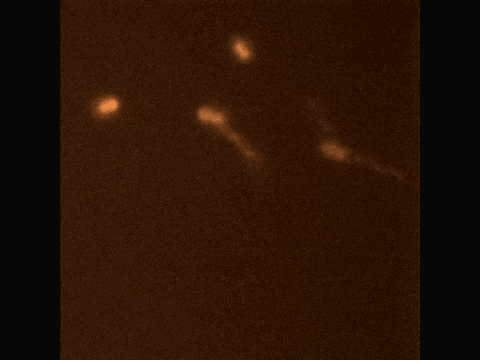

## 1.1. 大肠杆菌的运动模式：跑动-翻滚运动


大肠杆菌（*E. coli*）的运动模式并非连续的平滑游动，而是由两种截然不同的行为交替组成：

* **跑动 (Run):** 在此阶段，细菌的数根鞭毛会逆时针（Counter-clockwise, CCW）旋转，它们会汇集成一束，像螺旋桨一样推动菌体，使其近似地沿直线前进。

* **翻滚 (Tumble):** 在此阶段，鞭毛的旋转方向变为顺时针（Clockwise, CW）。这会导致鞭毛束散开，每根鞭毛独立运动，从而使菌体在原地随机地改变方向，为下一次“跑动”设定一个新的、随机的出发角度。

趋化性的核心机制并不在于细菌能够“操纵”方向盘进行精确转向，而在于它们能够根据环境中有利或有害化学物质的浓度变化来**调控翻滚的频率**。当细菌感知到自己正朝着化学引诱剂（chemoattractant）浓度更高的方向移动时，它会抑制翻滚的发生，从而延长当前的“跑动”时间。相反，如果它发现自己正游向不利的方向（例如引诱剂浓度降低或趋避剂浓度升高），它会增加翻滚的频率，以便更快地尝试一个新的随机方向。通过这种简单的“更好则继续，更差则改变”的策略，细菌的随机游走就带上了统计上的偏向性，最终实现了向高浓度引诱剂区域的宏观迁移。


## 1.2. 微观世界的物理学：低雷诺数下的生命


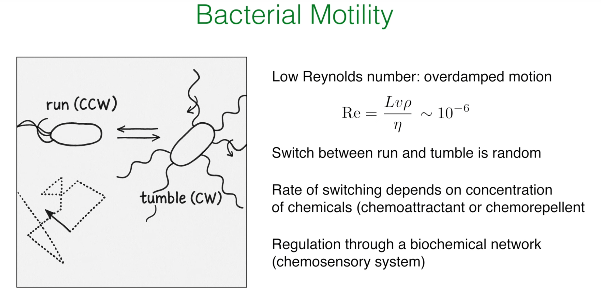

为了理解为什么细菌会采用这种看似笨拙的跑动-翻滚策略，我们必须审视它们所处的物理环境。描述流体动力学中惯性力与黏性力相对重要性的无量纲数是**雷诺数（Reynolds number），**其定义为：

$$Re = \frac{\rho Lv}{\eta}$$

其中，$L$ 是特征长度（对细菌约为几微米），$v$ 是速度（约20-30 μm/s），$\rho$ 是流体密度（水的密度），$\eta$ 是流体黏度。对于一个典型的大肠杆菌，计算出的雷诺数极低，约为 $10^{-6}$。

如此之低的雷诺数意味着黏性力在细菌的运动中占据了绝对主导地位，而惯性力则完全可以忽略不计。这带来了几个至关重要的物理后果。**首先，不存在“滑行”或“惯性”。**一旦细菌的鞭毛停止提供推力，黏性阻力会使其几乎瞬间停止。这解释了为什么“跑动”（有推力）和“翻滚”（方向重置）之间的切换如此泾渭分明。其次，像宏观世界的鱼类那样通过身体摆动来连续转向的策略，在黏性主导的世界里是行不通的。因此，细菌必须演化出一种适应这种“高阻尼”环境的独特运动策略，即随机的跑动-翻滚运动。这并非一种次优选择，而是在其所处物理尺度下一种高效且必要的导航方式。


## 1.3. 分子机器：化学感应系统


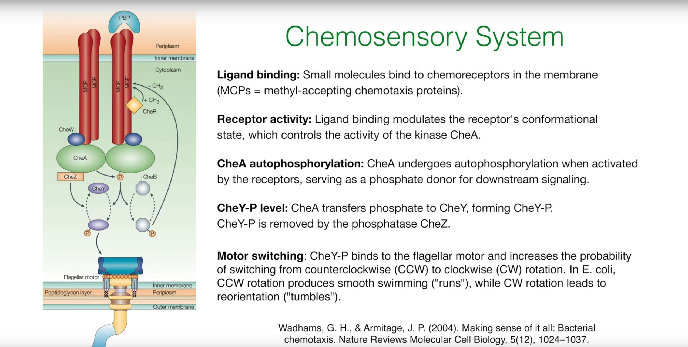

细菌如何感知环境变化并将其转化为对鞭毛马达的控制信号？这背后是一套精密复杂的生化信号转导网络，即化学感应系统（chemosensory system）。其核心步骤如下：

1. **配体结合 (Ligand Binding):** 化学引诱剂或趋避剂分子与细胞膜上的甲基接纳趋化蛋白（Methyl-accepting Chemotaxis Proteins, MCPs）结合。

2. **信号转导 (Signal Transduction):** 配体的结合会改变MCPs的构象，这种构象变化会进一步调节与之偶联的组氨酸激酶CheA的自磷酸化活性。引诱剂的结合会抑制CheA的活性。

3. **磷酸化级联 (Phosphorylation Cascade):** 活化的CheA（CheA-P）会将其磷酸基团转移给响应调节蛋白CheY。

4. **马达控制 (Motor Control):** 磷酸化的CheY（CheY-P）是关键的信号分子。它在细胞质中扩散，并与鞭毛马达的开关复合体结合，显著增加马达从CCW（跑动）旋转切换到CW（翻滚）旋转的概率。因此，高浓度的CheY-P意味着高翻滚频率。

5. **适应 (Adaptation):** 系统还包含一个适应模块。磷酸酶CheZ会持续地移除CheY-P上的磷酸基团，使其失活。更重要的是，MCPs的胞内结构域可以被可逆地甲基化（由CheR催化）和去甲基化（由CheB催化）。这种甲基化修饰水平能够调节MCPs对CheA活性的影响，使得细菌能够对化学物质浓度的**相对变化**（即梯度）做出响应，而不是对**绝对浓度**做出响应。这正是下一节将要讨论的“时间感知”机制的生物学基础。


## 1.4. 趋化性研究面临的挑战

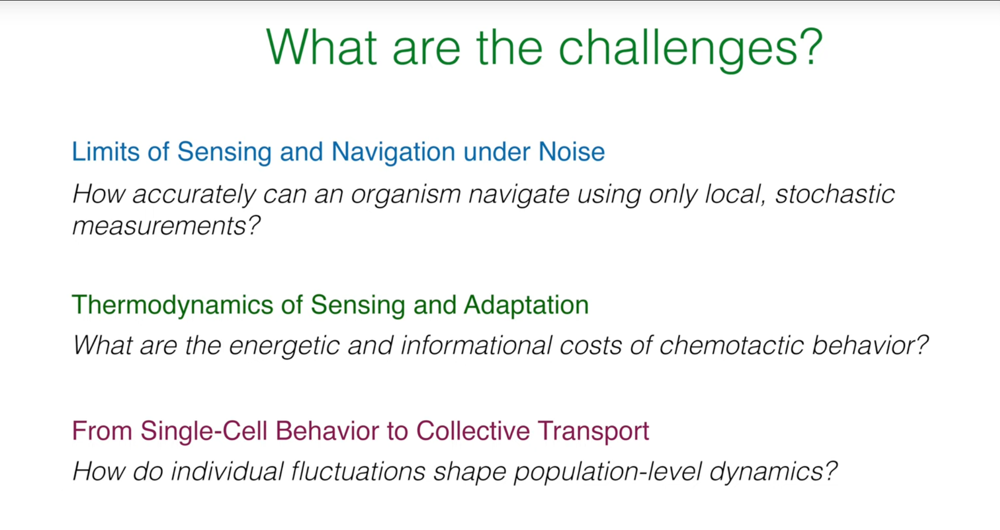

理解趋化性，特别是细菌趋化性，不仅仅是描述其运动模式和分子机制。更深入的研究面临着一系的挑战，这些挑战横跨了物理学、生物学和信息论等多个领域：

1.  **噪声下的感知与导航极限 (Limits of Sensing and Navigation under Noise):**
    * **核心问题:** 生物体（如细菌）如何仅仅依靠局部、随机（随机涨落）的测量，来准确地进行导航？
    * **深层含义:** 在微观尺度上，化学物质分子的扩散和结合是随机事件，导致细胞感知的信号本身就带有噪声。此外，细胞内部的信号转导网络也存在固有的生化噪声。在这种高噪声环境下，细胞需要从嘈杂的信号中提取有用的梯度信息，并做出有效的决策。这涉及到统计推断、信息论和控制理论的交叉问题：一个有限大小、有限能量的生物系统，其感知和导航的理论极限在哪里？它如何通过其分子网络，在物理极限下优化信息获取和处理？

2.  **感知与适应的热力学 (Thermodynamics of Sensing and Adaptation):**
    * **核心问题:** 趋化行为的能量和信息成本是多少？
    * **深层含义:** 细胞感知化学梯度、处理信号、调控鞭毛马达并实现适应（即对背景浓度变化不敏感，只响应相对变化）都需要消耗能量。例如，磷酸化的过程、甲基化酶和去甲基化酶的活性都需要ATP。适应机制本身需要精确的平衡来维持其敏感性。从热力学角度看，为了获取和处理环境信息，生物系统需要付出多少能量代价？是否存在一个基本的热力学下限，规定了实现特定感知精度所需的最小能量？这些问题将信息论与非平衡态热力学联系起来。

3.  **从单细胞行为到集体输运 (From Single-Cell Behavior to Collective Transport):**
    * **核心问题:** 个体细胞的涨落如何塑造群体层面的动力学？
    * **深层含义:** 尽管我们理解了单个细菌的跑动-翻滚机制，但当数百万甚至数十亿个细菌聚集在一起时，它们会展现出复杂的集体行为，例如群体迁移、生物膜形成和刚才提到的趋化性塌缩。这些集体现象往往不能简单地从单个细胞的行为叠加得到。我们需要理解个体细胞之间（直接或间接通过化学场）的相互作用如何导致宏观上的自组织模式。这需要将微观的随机过程与宏观的连续介质模型（如Keller-Segel模型）相结合，并探索个体变异性对群体动力学的影响。


# 2. 运动的简化模型：双态过程

为了从物理层面理解趋化性的本质，我们需要构建一个数学模型。我们将从一个最简化的模型入手，将复杂的三维跑动-翻滚运动抽象为一个一维空间中的双态过程。

## 2.1. 简化到一维空间

我们假设细菌只能在一个一维直线上运动。它的状态不仅由其位置 $x$ 决定，还由其内部的运动方向状态 $\sigma$ 决定。
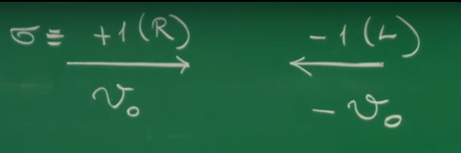


* $\sigma=+1$：代表细菌正在向右运动（Right-movers）。

* $\sigma=-1$：代表细菌正在向左运动（Left-movers）。

## 2.2. 定义状态切换速率

细菌在"跑动"过程中方向是固定的，而"翻滚"则对应于方向状态 $\sigma$ 的改变。我们将这种状态切换（即翻滚）建模为一个随机过程，由两个速率参数控制：

* $\alpha_+(x)$：在位置 $x$ 处，一个向右运动的细菌（$\sigma=+1$）发生翻滚并转为向左运动（$\sigma=-1$）的速率，即单位时间内的概率。

* $\alpha_-(x)$：在位置 $x$ 处，一个向左运动的细菌（$\sigma=-1$）发生翻滚并转为向右运动（$\sigma=+1$）的速率。

这里的关键假设是，这些切换速率可以依赖于空间位置 $x$。这正是将环境信息（化学物质浓度梯度）编码进模型的切入点。如果在一个区域 $\alpha_+(x)$ 和 $\alpha_-(x)$ 不相等，那么细菌的随机游走就会出现偏向性。

## 2.3. 方向概率的主方程

现在，我们引入两个核心变量来描述这个系统：

* $p_+(x,t)$：在时刻 $t$、位置 $x$ 处，找到一个向右运动的细菌的概率密度。

* $p_-(x,t)$：在时刻 $t$、位置 $x$ 处，找到一个向左运动的细菌的概率密度。

我们可以通过考虑在一个微小区间 $[x,x+dx]$ 内，这两种概率密度随时间的变化来推导它们的演化方程，即主方程（Master Equations）。

对于 $p_+(x,t)$，其随时间的变化由三部分贡献：

1. **平流项 (Advection):** 由于细菌以速度 $v_0$ 向右运动，单位时间内从左边 $x$ 处流入区间的概率通量和从右边 $x+dx$ 处流出区间的概率通量。

2. **损失项 (Loss):** 在位置 $x$ 的右行细菌以速率 $\alpha_+(x)$ 翻滚，转变为左行细菌，导致 $p_+$ 的减少。

3. **增益项 (Gain):** 在位置 $x$ 的左行细菌以速率 $\alpha_-(x)$ 翻滚，转变为右行细菌，导致 $p_+$ 的增加。

综合这三项，我们得到 $p_+$ 的主方程：

$$\partial_t p_+(x,t) = -v_0 \partial_x p_+(x,t) - \alpha_+(x) p_+(x,t) + \alpha_-(x) p_-(x,t)$$

同理，对于 $p_-(x,t)$，细菌以速度 $-v_0$ 向左运动，其主方程为：

$$\partial_t p_-(x,t) = +v_0 \partial_x p_-(x,t) - \alpha_-(x) p_-(x,t) + \alpha_+(x) p_+(x,t)$$

这两个耦合的偏微分方程构成了我们描述一维趋化性运动的最小理论模型。

**双态模型的关键变量与参数表**

| 符号 | 名称 | 物理意义 | 单位 |
|------|------|----------|------|
| $x,t$ | 位置,时间 | 时空坐标 | m, s |
| $\sigma$ | 方向状态 | 细菌的内部状态 (+1代表向右, -1代表向左) | 无量纲 |
| $v_0$ | 游泳速度 | 细菌在"跑动"阶段的恒定速率 | m/s |
| $\alpha_+(x)$ | 右转左切换速率 | 在位置x处，从向右运动翻滚到向左运动的单位时间概率 | 1/s |
| $\alpha_-(x)$ | 左转右切换速率 | 在位置x处，从向左运动翻滚到向右运动的单位时间概率 | 1/s |
| $p_+(x,t)$ | 右行者概率密度 | 在(x,t)处找到一个向右运动细菌的概率 | 1/m |
| $p_-(x,t)$ | 左行者概率密度 | 在(x,t)处找到一个向左运动细菌的概率 | 1/m |

# 3. 从微观状态到宏观输运

主方程描述了微观方向状态的概率演化，但我们更关心的是整个细菌群体的宏观行为，例如总的细菌密度分布和净的流动。为此，我们需要从 $p_+$ 和 $p_-$ 构建宏观的物理量。

## 3.1. 定义宏观可观测量

我们定义两个宏观量：

* 总概率密度 (Total Probability Density):

  $$
  p(x,t) := p_+(x,t) + p_-(x,t)
  $$

  这代表在时刻 $t$、位置 $x$ 找到一个细菌的总概率，无论其运动方向如何。

* 概率流 (Probability Current):

  $$
  J(x,t) := v_0 [p_+(x,t) - p_-(x,t)]
  $$

  这个量描述了在 $x$ 点处概率的净流动。如果向右运动的细菌比向左的多（$p_+>p_-$），则有净的向右流动，$J>0$。反之亦然。

## 3.2. 推导连续性方程

有了这两个定义，我们可以通过简单的代数操作将两个主方程结合起来。将描述 $p_+$ 和 $p_-$ 的两个主方程相加：

$$\partial_t (p_+ + p_-) = -v_0 \partial_x (p_+ - p_-) - (\alpha_+ p_+ - \alpha_- p_-) + (-\alpha_- p_- + \alpha_+ p_+)$$

可以发现，与翻滚速率 $\alpha_\pm$ 相关的项恰好完全抵消。代入 $p$ 和 $J$ 的定义，我们立即得到：

$$\partial_t p(x,t) = -\partial_x J(x,t)$$

这是一个极其重要的方程，即连续性方程（Continuity Equation），它是一个普适的守恒定律。这个推导过程揭示了一个深刻的物理内涵：翻滚（状态切换）是一个内部过程。它只在右行和左行这两个群体之间重新分配粒子，但并不会在空间中凭空创造或消灭粒子。一个地方的总粒子数（或总概率）发生变化，唯一的原因只能是粒子从邻近区域游动进来或出去。数学上翻滚项的完美抵消，恰恰反映了粒子数（概率）的局域守恒这一基本物理原理。

## 3.3. 概率流的动力学

现在，我们不将两个主方程相加，而是用第一个方程减去第二个方程，以考察概率差 $(p_+-p_-)$ 的动力学，这正比于概率流 $J$。

$$\partial_t (p_+ - p_-) = -v_0 \partial_x (p_+ + p_-) - (\alpha_+ p_+ + \alpha_- p_-) + (\alpha_- p_- + \alpha_+ p_+)$$

为了用宏观量 $p$ 和 $J$ 来表示这个方程，我们需要用到关系式：

$$p_\pm = \frac{1}{2}(p \pm \frac{J}{v_0})$$

将此代入并整理，可以得到概率流 $J$ 自身的演化方程：

$$\partial_t J(x,t) = -v_0^2 \partial_x p(x,t) - (\alpha_+ + \alpha_-)J(x,t) + v_0(\alpha_- - \alpha_+)p(x,t)$$

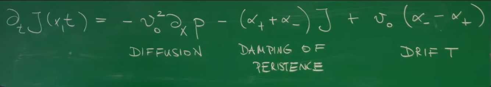

这个方程的结构非常丰富，每一项都有明确的物理意义：

* $-v_0^2 \partial_x p$：**扩散项**。它表明总密度的梯度（$\partial_x p$）会像压力一样驱动产生概率流。

* $-(\alpha_+ + \alpha_-)J$：**持续性的阻尼项**。任何存在的净概率流 $J$ 都会以 $\alpha_+ + \alpha_-$ 的总速率衰减。这是因为翻滚过程会随机化细菌的运动方向，从而破坏方向的持续性（persistence），使净的流动趋于零。

* $v_0(\alpha_- - \alpha_+)p$：**漂移项**。这是趋化性得以实现的核心项。如果切换速率存在不对称性（$\alpha_- \neq \alpha_+$），即使在没有密度梯度的情况下，也会产生一个正比于总密度 $p$ 的净漂移流。这正是定向运动的来源。


# 4. 粗粒化视角：福克-普朗克方程

我们已经得到了描述宏观量 $p$ 和 $J$ 演化的两个耦合方程。然而，在很多情况下，我们可以进一步简化模型，得到一个只包含总密度 $p$ 的有效方程。

## 4.1. 绝热近似：时间尺度的分离

让我们考察系统中涉及的时间尺度：

* **跑动时间 (Run time):** $\tau_{run} \sim 1/\alpha \sim 1$ s。这是微观层面方向发生改变的特征时间，由翻滚速率决定。

* **扩散时间 (Diffusion time):** $\tau_D \sim L^2/D_{eff}$。这是宏观密度分布 $p(x,t)$ 发生显著变化的特征时间。对于一个 $L\sim 100\mu m$ 的尺度，这个时间大约是 25 s。

我们发现 $\tau_D \gg \tau_{run}$。这个时间尺度上的显著分离是进行近似的关键。它告诉我们，概率流 $J$ 的动力学（由快速的翻滚过程主导）要比总密度 $p$ 的动力学快得多。这意味着，对于缓慢演化的 $p$ 而言，我们可以认为 $J$ 总是能够瞬间调整到与当前 $p$ 及其梯度相适应的准稳态。这在物理学中被称为"绝热消除"或"奴役原理" (slave principle)：快速变化的变量（$J$）被慢速变化的变量（$p$）所"奴役"。因此，我们可以做出一个强有力的近似：$\partial_t J \approx 0$。

## 4.2. 推导有效的福克-普朗克方程

在概率流的动力学方程中应用绝热近似 $\partial_t J \approx 0$，我们可以直接解出准稳态下的有效概率流 $J_{eff}$：

$$J_{eff}(x,t) = -\frac{v_0^2}{\alpha_+ + \alpha_-} \partial_x p + v_0 \frac{\alpha_- - \alpha_+}{\alpha_+ + \alpha_-} p$$

这个表达式清晰地展示了有效概率流由两部分构成：一部分由密度梯度驱动（扩散），另一部分由切换速率不对称性驱动（漂移）。

接下来，我们将这个 $J_{eff}$ 的表达式代回到我们之前推导的、精确成立的连续性方程 $\partial_t p = -\partial_x J$ 中。这样，我们就得到了一个只包含总密度 $p$ 的封闭方程：

$$\partial_t p = \partial_x \left[ \frac{v_0^2}{\alpha_+ + \alpha_-} \partial_x p - v_0 \frac{\alpha_- - \alpha_+}{\alpha_+ + \alpha_-} p \right]$$

这个方程是描述粒子在漂移和扩散共同作用下演化的标准形式，被称为**福克-普朗克方程**（**Fokker-Planck Equation**, **FPE**）。我们可以将其写成更紧凑的形式：

$$\partial_t p(x,t) = \partial_x \left[ D_{eff}(x) \partial_x p - v_{eff}(x) p \right]$$

其中，我们定义了两个依赖于局域翻滚速率的有效输运系数：

* 有效扩散系数 (Effective Diffusion Coefficient):

  $$
  D_{eff}(x) = \frac{v_0^2}{\alpha_+(x) + \alpha_-(x)}
  $$

* 有效漂移速度 (Effective Drift Velocity):

  $$
  v_{eff}(x) = v_0 \frac{\alpha_+(x) - \alpha_-(x)}{\alpha_+(x) + \alpha_-(x)}
  $$


这个结果意义重大：我们从一个描述微观状态切换的复杂模型出发，通过一个合理的物理近似（时间尺度分离），成功地推导出了一个描述宏观群体行为的、形式更简洁的连续介质模型。


## 4.3. Python模拟 I：有偏的跑动-翻滚模型

我们可以通过计算机模拟来验证微观的跑动-翻滚规则确实能够产生宏观的漂移和扩散。下面的Python代码模拟了一组（系综）一维粒子，它们的翻滚概率依赖于其所处的位置，从而模拟了在一个有偏环境中的运动。

```python
import numpy as np
import matplotlib.pyplot as plt

def run_tumble_1d_simulation(num_particles=5000, num_steps=4000, v0=20.0, dt=0.01, L=200.0):
    """
    Simulate biased run-and-tumble motion in one-dimensional space.

    Parameters:
    num_particles (int): Number of particles to simulate.
    num_steps (int): Total number of simulation steps.
    v0 (float): Run speed (um/s).
    dt (float): Time step (s).
    L (float): Length of spatial domain (-L/2 to L/2).
    """
    # Initialize particle positions and directions
    # Positions start from a uniform distribution between -1 and 1 to observe aggregation toward center
    positions = np.random.uniform(-1, 1, num_particles)
    # Initial directions randomly +1 or -1
    directions = np.random.choice([1, -1], num_particles)
    
    # Store history of positions for calculating mean and variance
    position_history = np.zeros((num_steps, num_particles))
    
    # Define position-dependent switching rates
    def alpha_plus(x):
        # When x>0, particles moving right are more likely to tumble (alpha_+ increases)
        # When x<0, particles moving right are less likely to tumble (alpha_+ decreases)
        # This creates a drift toward x=0
        return 1.0 * (1 + 2.0 * np.tanh(x / (L/4))) # Base rate 1.0/s
    
    def alpha_minus(x):
        # When x<0, particles moving left are more likely to tumble (alpha_- increases)
        # When x>0, particles moving left are less likely to tumble (alpha_- decreases)
        # This also creates a drift toward x=0
        return 1.0 * (1 - 2.0 * np.tanh(x / (L/4))) # Base rate 1.0/s
    
    for step in range(num_steps):
        position_history[step] = positions
        
        # Calculate tumbling probability at current positions
        # P(tumble) = alpha * dt
        prob_tumble_plus = alpha_plus(positions) * dt
        prob_tumble_minus = alpha_minus(positions) * dt
        
        # Generate random numbers to determine if tumbling occurs
        rand_nums = np.random.rand(num_particles)
        
        # Update directions based on current direction and tumbling probability
        # For particles moving right (directions == 1)
        tumble_indices_plus = (directions == 1) & (rand_nums < prob_tumble_plus)
        directions[tumble_indices_plus] = -1
        # For particles moving left (directions == -1)
        tumble_indices_minus = (directions == -1) & (rand_nums < prob_tumble_minus)
        directions[tumble_indices_minus] = 1
        
        # Update positions
        positions += directions * v0 * dt
        
        # Apply reflecting boundary conditions
        positions[positions > L/2] = L - positions[positions > L/2]
        directions[positions > L/2] *= -1
        positions[positions < -L/2] = -L - positions[positions < -L/2]
        directions[positions < -L/2] *= -1
    
    return position_history

# --- Run simulation and visualize ---
history = run_tumble_1d_simulation()
num_steps, num_particles = history.shape
time_points = np.arange(num_steps) * 0.01

# Calculate evolution of mean and variance over time
mean_pos = np.mean(history, axis=1)
var_pos = np.var(history, axis=1)

# --- Plot three separate figures and save to local files ---

# 1. Plot particle trajectories
plt.style.use('seaborn-v0_8-whitegrid')
fig, ax = plt.subplots(figsize=(10, 6))
# Plot more particle trajectories to make the figure more visually appealing
for i in range(20):
    ax.plot(time_points, history[:, i], lw=0.8, alpha=0.7)
ax.set_title('Single Particle Trajectories')
ax.set_xlabel('Time (s)')
ax.set_ylabel('Position (渭m)')
plt.tight_layout()
plt.savefig('particle_trajectories.png', dpi=300, bbox_inches='tight')
plt.close()

# 2. Plot particle distribution histograms at different times
fig, ax = plt.subplots(figsize=(10, 6))
time_indices_to_plot = [int(num_steps/10), int(num_steps/3), int(2*num_steps/3), num_steps-1]
for t_idx in time_indices_to_plot:
    time = t_idx * 0.01
    ax.hist(history[t_idx, :], bins=50, density=True, alpha=0.6, label=f't = {time:.1f} s')
ax.set_title('Distribution of Particles')
ax.set_xlabel('Position (渭m)')
ax.set_ylabel('Probability Density')
ax.legend()
plt.tight_layout()
plt.savefig('particle_distributions.png', dpi=300, bbox_inches='tight')
plt.close()

# 3. Plot evolution of mean and variance over time
fig, ax = plt.subplots(figsize=(10, 6))
ax2 = ax.twinx()
p1, = ax.plot(time_points, mean_pos, 'r-', label='Mean Position')
p2, = ax2.plot(time_points, var_pos, 'b-', label='Variance')
ax.set_title('Evolution of Mean and Variance')
ax.set_xlabel('Time (s)')
ax.set_ylabel('Mean Position (渭m)', color='r')
ax2.set_ylabel('Variance (渭m虏)', color='b')
ax.tick_params(axis='y', labelcolor='r')
ax2.tick_params(axis='y', labelcolor='b')
ax.legend([p1, p2], ['Mean Position', 'Variance'], loc='center right')
plt.tight_layout()
plt.savefig('mean_variance_evolution.png', dpi=300, bbox_inches='tight')
plt.close()
```


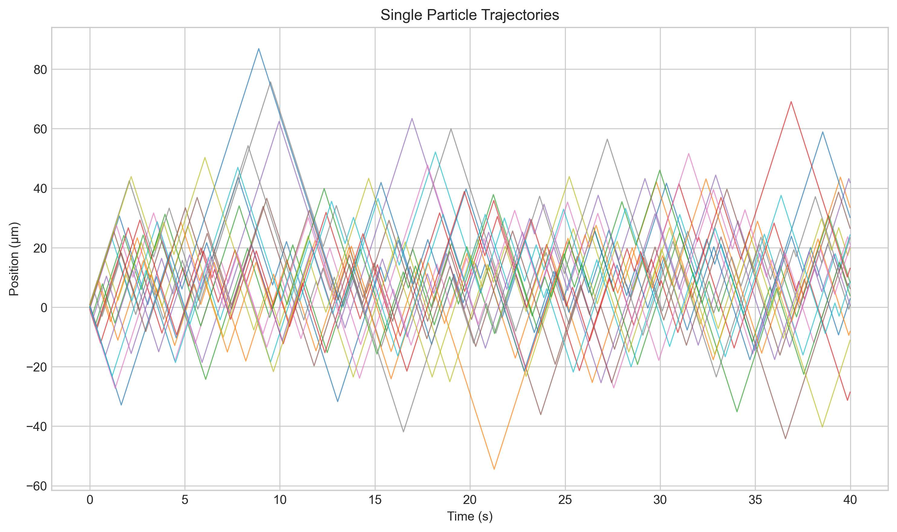


1. **轨迹图**显示，单个粒子的运动是随机的，但总体上被"拉"向中心区域（0），表现出有偏的特性。

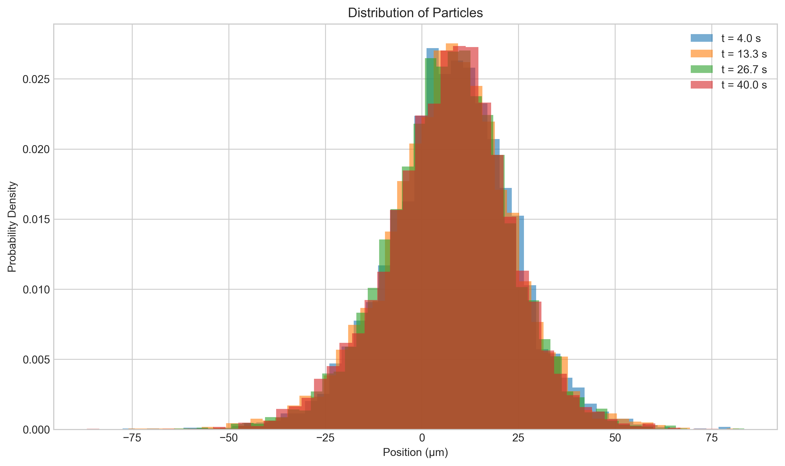


2. **分布直方图**显示，粒子系综从初始的均匀分布逐渐向中心 $x=0$ 聚集，形成一个稳定的分布。这证实了宏观漂移的存在。


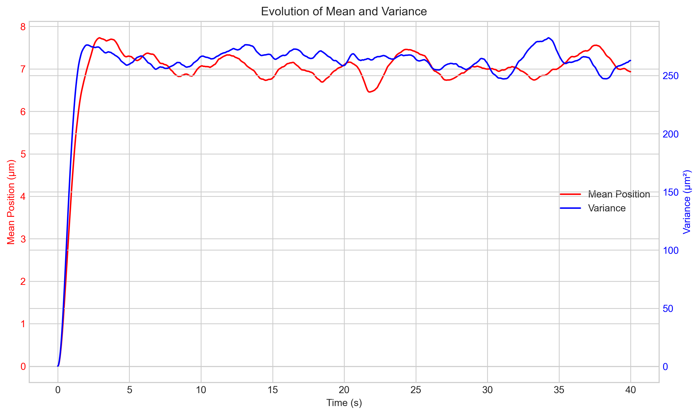

3. **均值和方差图**定量地展示了系综的行为。在这个例子中，由于漂移指向中心，系综的平均位置会趋于0。方差则会先增大后达到一个稳定值，反映了漂移和扩散之间的平衡。如果漂移场是恒定的（例如，$\alpha_+$ 和 $\alpha_-$ 是常数且不等），我们会观察到均值随时间线性变化，方差也随时间线性增长，这与FPE的预测完全一致。

# 5. 闭合回路：感知的生物学基础

到目前为止，我们已经建立了从微观切换速率 $\alpha_\pm(x)$ 到宏观漂移速度 $v_{eff}(x)$ 的数学联系。但还有一个关键问题没有回答：**细菌是如何通过其生物化学网络，将对外部化学场 $c(x)$ 的感知，转化为对空间依赖的切换速率 $\alpha_\pm(x)$ 的调控的？**

## 5.1. 时间感知机制

一个尺寸仅为几微米的细菌，无法直接测量其身体两端的微小浓度差来判断空间梯度 $\partial_x c$。它采用了一种更为巧妙的策略：时间感知（Temporal Sensing）。当细菌在空间中游动时，它会持续监测其周围的化学物质浓度。它实际测量的是浓度随时间的变化率 $\frac{dc}{dt}$。利用链式法则，我们可以将这个时间导数与空间梯度联系起来：

$$
\frac{dc}{dt} = \frac{\partial c}{\partial t} + \frac{\partial c}{\partial x} \frac{dx}{dt}
$$

假设化学场 $c(x)$ 是静态的（$\frac{\partial c}{\partial t} = 0$），并且细菌以速度 $v_0\sigma(t)$ 运动，那么它所经历的浓度变化率为：

$$
\frac{dc}{dt} = v_0 \sigma(t) \partial_x c
$$

正是这个时间导数 $\frac{dc}{dt}$ 作为输入信号，被第一节中描述的化学感应系统所处理。如果细菌是向着引诱剂浓度增加的方向游动（例如，$\sigma=+1$ 且 $\partial_x c > 0$），那么 $\frac{dc}{dt} > 0$。这个正信号会通过信号通路抑制CheA活性，降低CheY-P水平，从而减少翻滚概率，延长当前的“跑动”。反之，如果 $\frac{dc}{dt} < 0$，翻滚概率就会增加。

## 5.2. 切换速率的建模

我们可以将上述生物学机制用一个简单的线性响应模型来描述。假设翻滚速率是对所感知到的浓度变化率 $\frac{dc}{dt}$ 的线性响应，围绕一个基础速率 $\alpha_0$ 波动：

$$
\alpha(\text{感知到的变化}) = \alpha_0(1 - \chi' \frac{dc}{dt})
$$

其中 $\chi'$ 是一个衡量趋化性敏感度的系数。对于向右运动的粒子（$\sigma=+1$），它感知的变化率是 $v_0\partial_x c$；对于向左运动的粒子（$\sigma=-1$），感知到的变化率是 $-v_0\partial_x c$。因此，我们可以得到对 $\alpha_+$ 和 $\alpha_-$ 的具体表达式：

$$
\alpha_+(x) = \alpha_0(1 - \chi v_0 \partial_x c)\alpha_-(x) = \alpha_0(1 + \chi v_0 \partial_x c)
$$

这里我们将 $\chi'\alpha_0$ 合并为一个新的趋化性系数 $\chi$。

现在，我们可以将这两个表达式代入我们之前推导出的有效漂移速度 $v_{eff}$ 和有效扩散系数 $D_{eff}$ 的公式中，从而将输运系数与化学场梯度直接联系起来。

有效漂移速度的推导：

$$
v_{eff} = v_0 \frac{\alpha_+(x) - \alpha_-(x)}{\alpha_+(x) + \alpha_-(x)} = v_0 \frac{\alpha_0(1 - \chi v_0 \partial_x c) - \alpha_0(1 + \chi v_0 \partial_x c)}{\alpha_0(1 - \chi v_0 \partial_x c) + \alpha_0(1 + \chi v_0 \partial_x c)}
$$

$$
v_{eff} = v_0 \frac{-2 \chi v_0 \partial_x c}{2 \alpha_0 (1 - (\chi v_0 \partial_x c)^2)} \approx -\frac{\chi v_0^2}{\alpha_0} \partial_x c
$$

在梯度较缓（$\chi v_0 \partial_x c \ll 1$）的常见情况下，我们得到了一个核心结论：有效漂移速度正比于化学引诱剂浓度的负梯度。这意味着细菌群体会朝着引诱剂浓度增加的方向漂移（如果 $\chi > 0$）。

有效扩散系数的推导：

$$
D_{eff} = \frac{v_0^2}{\alpha_+(x) + \alpha_-(x)} = \frac{v_0^2}{2 \alpha_0 (1 - (\chi v_0 \partial_x c)^2)} \approx \frac{v_0^2}{2\alpha_0}
$$

在同样的缓梯度近似下，有效扩散系数近似为一个常数。

至此，我们已经完整地构建了从外部化学场到细菌群体宏观运动的理论链条。


# 6. 集体动力学：Keller-Segel模型

前面的讨论都假设化学场 $c(x)$ 是一个固定的、由外部环境决定的背景场。然而，在许多生物场景中，生物体自身会通过代谢活动（例如消耗营养物或分泌信号分子）来改变其所处的化学环境。这就引入了一个关键的**反馈回路**：细菌的运动响应于化学梯度，而它们的聚集和代谢活动又反过来改变了化学梯度。**这种细胞与环境的动态耦合是导致复杂的集体行为和模式形成（pattern formation）的根源。**


Keller-Segel模型由Evelyn F. Keller和Lee A. Segel于1970年代初共同提出，最初旨在通过一个耦合的偏微分方程组来描述黏菌（Dictyostelium discoideum）在饥饿条件下受环磷酸腺苷（cAMP）浓度梯度引导的聚集过程，这一开创性工作为数学生物学研究细胞趋化性（chemotaxis）奠定了基石。该模型的核心在于刻画了细胞群体不仅随机扩散，更会沿着化学信号物的浓度梯度定向迁移这一关键生物物理现象。其具体应用已从最初的黏菌研究极大地扩展到诸多领域，包括解释细菌群落模式的形成、血管新生（angiogenesis）中内皮细胞的导向迁移、肿瘤细胞的侵袭与转移过程、免疫系统中白细胞向炎症部位的募集、乃至多细胞生物胚胎发育中的形态发生（morphogenesis），成为连接细胞自组织行为与宏观模式涌现的一个典范数学模型。


## 6.1. 耦合方程组

描述这种耦合系统的最著名的模型之一是**Keller-Segel (KS) 模型**。它由两个耦合的偏微分方程组成：

1.细胞密度 $\rho(x,t)$ 的演化方程：这本质上就是我们之前推导的福克-普朗克方程，但现在漂移项明确地依赖于动态变化的化学场 $c(x,t)$。漂移项 $v_{eff}\rho$ 通常被写作一个趋化通量（chemotactic flux）的形式，即 $-\chi(\rho,c)\rho\nabla c$。此外，还可以加入描述细胞增殖或死亡的反应项。

$$
   \partial_t \rho = \nabla \cdot [D \nabla \rho - \chi(\rho,c)\rho \nabla c] + f_{growth}(\rho)
$$

   （这里我们使用 $\rho$ 代表细胞密度，并使用梯度算子 $\nabla$ 以便推广到高维空间）


该方程物理意义：一个区域内细胞数量的变化，等于随机扩散进来的减去扩散出去的，加上趋化运动迁移进来的减去迁移出去的，最后加上本地净增殖的数量。

2.化学物质浓度 $c(x,t)$ 的演化方程：这是一个标准的反应-扩散方程，描述了化学物质的扩散、由细菌产生的过程以及其自身的降解过程。

$$
   \partial_t c = D_c \nabla^2 c + f_{prod}(\rho) - f_{degrad}(c)
$$

该方程物理意义：一个区域内信号物浓度的变化，等于扩散进来的减去扩散出去的，加上细胞产生的，减去自然降解的。

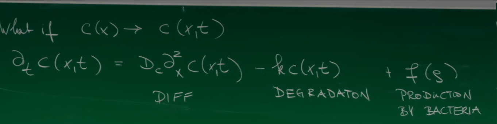


## 6.2. Keller-Segel模型


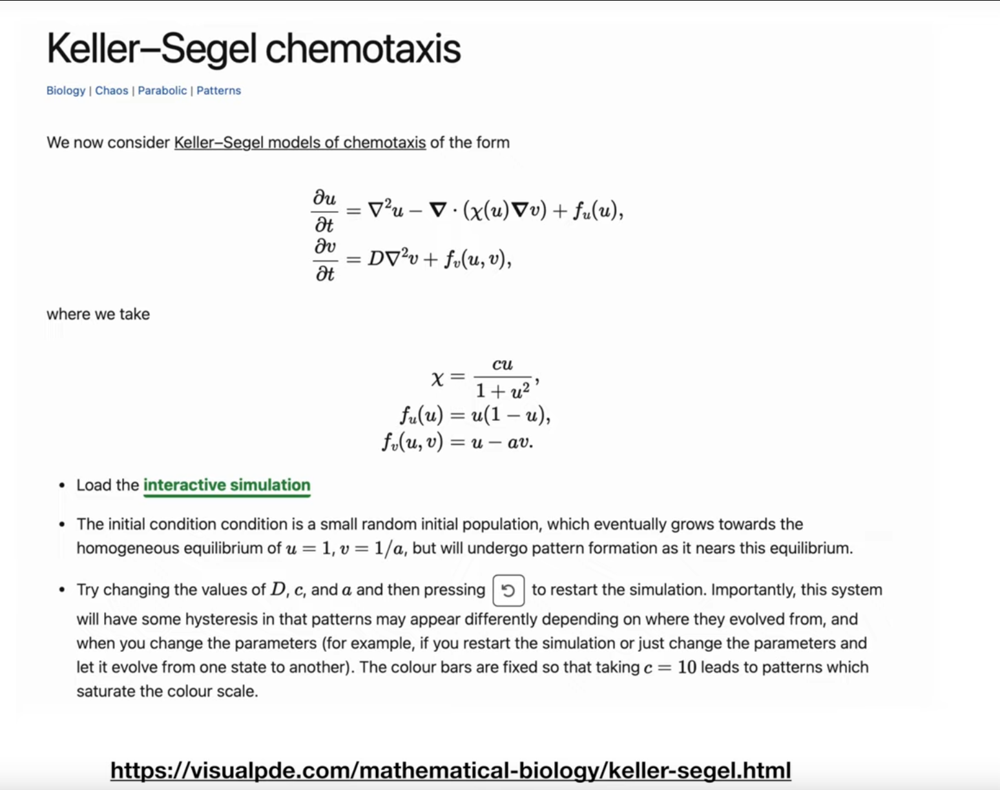

<video src="../../assets/images/remote/KellerSegel.mp4"></video>
<p><strong>二维趋化性可视化，源自：https://visualpde.com/sim/?preset=KellerSegel</strong></p>


讲座中引用并链接了一个可视化的KS模型，其具体形式为：

$$
\frac{\partial u}{\partial t} = \nabla^2 u - \nabla \cdot (\chi(u) \nabla v) + u(1 - u)
$$

$$
\frac{\partial v}{\partial t} = D \nabla^2 v + u - av
$$

这里，$u$ 代表细胞密度，$v$ 代表化学物质浓度。我们来逐项分析这个模型：

* $\nabla^2 u$：细胞的随机运动，对应于我们推导的有效扩散 $D_{eff}$（这里设为1）。

* $-\nabla \cdot (\chi(u) \nabla v)$: 趋化通量。细胞以正比于 $\nabla v$ 的速度移动（即向 $v$ 浓度高处移动）。趋化敏感性$\chi(u) = \frac{cu}{1 + u^2}$ 是密度依赖的，这可以模拟高密度下的饱和效应。


* $u(1-u)$：细胞的逻辑斯蒂增长（Logistic growth）。当密度 $u$ 较小时，细胞以正比于 $u$ 的速率增长；当 $u$ 接近承载能力1时，增长停止。

* $D\nabla^2 v$：化学物质的扩散。

* $u-av$：化学物质的产生与降解。产生速率正比于细胞密度 $u$，而降解速率是简单的线性衰减 $-av$。

## 6.3. 模式的涌现：趋化性塌缩

**这个耦合系统的核心动力学是什么？**考虑一个均匀的细胞分布中的一个微小涨落，即某个局域的细胞密度略微偏高。根据第二个方程，这些细胞会产生更多的化学物质，从而在这个位置形成一个微弱的浓度峰值。这个浓度峰值会产生一个指向该处的梯度 $\nabla v$。根据第一个方程的趋化项，这个梯度会吸引周围更多的细胞向这个峰值聚集。新聚集来的细胞会产生更多的化学物质，进一步强化这个浓度峰值，从而吸引更多细胞。

这是一个强烈的**正反馈循环**。如果趋化吸引的效应（由系数 $\chi$ 控制）足够强大，能够压倒细胞自身的随机扩散效应（由系数 $D$ 控制），那么这个正反馈将变得不稳定。最初微小的密度涨落会被指数级放大，导致细胞在某些点上大量聚集，形成尖锐的峰值。这种现象被称为**趋化性塌缩**（chemotactic collapse）。它完美地展示了简单的局部相互作用规则如何在宏观上涌现出复杂的空间结构和模式，这是复杂系统的一个标志性特征。数学上的线性不稳定性分析可以给出模式形成的精确条件。

## 6.4. Python模拟 II：一维Keller-Segel模型的有限差分求解

为了亲眼见证趋化性塌缩的过程，我们可以用数值方法求解一维的Keller-Segel方程组。下面是一个使用简单的有限差分法和前向欧拉时间步进的Python实现。

```python
import numpy as np
import matplotlib.pyplot as plt
from matplotlib.animation import FuncAnimation
import imageio
import os

def solve_keller_segel_1d(L=100.0, Nx=200, T=50.0, Nt=5000, D_u=1.0, D_v=20.0, chi_0=25.0, a=1.0):
    """
    Solve the one-dimensional Keller-Segel model using finite difference method.
    u_t = D_u * u_xx - chi_0 * (u * v_x)_x
    v_t = D_v * v_xx + u - a*v
    """
    dx = L / Nx
    dt = T / Nt
    x = np.linspace(0, L, Nx, endpoint=False)
    
    # Check numerical stability conditions (for explicit method)
    # Courant-Friedrichs-Lewy (CFL) condition
    if dt > dx**2 / (2 * max(D_u, D_v)):
        print(f"Warning: Time step {dt:.4f} may be too large for stability.")
        # Adjust time step to ensure stability
        dt = 0.2 * dx**2 / (2 * max(D_u, D_v))
        Nt = int(T / dt)
        print(f"Adjusted time step to {dt:.6f} and Nt to {Nt}")

    # Initialize cell density u and chemical concentration v
    # u: Uniform distribution plus small random perturbation
    u = 1.0 + 0.01 * (np.random.rand(Nx) - 0.5)
    v = u / a  # Initially v is in local equilibrium
    
    u_history = [u.copy()]
    v_history = [v.copy()]
    
    for n in range(Nt):
        # Use periodic boundary conditions
        u_prev = np.roll(u, 1)
        u_next = np.roll(u, -1)
        v_prev = np.roll(v, 1)
        v_next = np.roll(v, -1)
        
        # Calculate second derivatives (Laplacian)
        u_xx = (u_next - 2*u + u_prev) / dx**2
        v_xx = (v_next - 2*v + v_prev) / dx**2
        
        # Calculate first derivatives (Gradient)
        v_x = (v_next - v_prev) / (2*dx)
        
        # Calculate chemotactic flux J = chi * u * v_x
        J = chi_0 * u * v_x
        J_prev = np.roll(J, 1)
        
        # Calculate divergence of flux (Divergence)
        div_J = (J - J_prev) / dx  # Using upwind scheme
        
        # Update u and v
        u_new = u + dt * (D_u * u_xx - div_J)
        v_new = v + dt * (D_v * v_xx + u - a*v)
        
        # Ensure non-negativity of solutions
        u_new = np.maximum(u_new, 0)
        v_new = np.maximum(v_new, 0)
        
        # Check for NaN or infinity
        if np.any(np.isnan(u_new)) or np.any(np.isnan(v_new)) or \
           np.any(np.isinf(u_new)) or np.any(np.isinf(v_new)):
            print(f"Warning: NaN or Inf encountered at step {n}. Stopping simulation.")
            break
            
        u, v = u_new, v_new
        
        if n % 50 == 0:  # Store every 50 steps
            u_history.append(u.copy())
            v_history.append(v.copy())
            
    return x, u_history, v_history

# --- Run simulation ---
# Use parameters more suitable for demonstrating chemotactic collapse
x, u_hist, v_hist = solve_keller_segel_1d(T=100.0, Nt=20000, chi_0=40.0)

# --- Create GIF animation ---
fig, ax = plt.subplots(figsize=(10, 6))
line, = ax.plot(x, u_hist[0], 'b-', lw=2)
ax.set_xlim(0, 100)

# Fix y-axis range to better show the chemotactic collapse process
ax.set_ylim(0, 5)  # Set appropriate range based on expected collapse effect
ax.set_xlabel('Position x')
ax.set_ylabel('Cell Density u(x,t)')
ax.set_title('1D Keller-Segel Simulation: Chemotactic Collapse')
time_text = ax.text(0.05, 0.9, '', transform=ax.transAxes)

# Create temporary directory to store frames
temp_dir = 'temp_frames'
os.makedirs(temp_dir, exist_ok=True)
gif_filename = 'keller_segel_simulation.gif'

def update(frame):
    line.set_ydata(u_hist[frame])
    # Correct time calculation formula
    time = frame * 50 * (100.0/20000)
    time_text.set_text(f'Time = {time:.2f}')
    return line, time_text

# Save each frame as an image
filenames = []
for i in range(len(u_hist)):
    update(i)
    filename = f'{temp_dir}/frame_{i:03d}.png'
    plt.savefig(filename)
    filenames.append(filename)
    if (i+1) % 10 == 0:  # Reduce print frequency
        print(f'Saving frame {i+1}/{len(u_hist)}')

# Use imageio to create GIF, add loop parameter to ensure infinite looping
with imageio.get_writer(gif_filename, mode='I', duration=0.1, loop=0) as writer:
    for filename in filenames:
        image = imageio.imread(filename)
        writer.append_data(image)

# Clean up temporary files
for filename in filenames:
    os.remove(filename)
os.rmdir(temp_dir)

print(f'GIF animation saved as {gif_filename}')

# Plot snapshots at several time points
plt.figure(figsize=(10, 6))
time_snapshots = [0, len(u_hist)//4, len(u_hist)//2, len(u_hist)-1]
for i, frame in enumerate(time_snapshots):
    time = frame * 50 * (100.0/20000)
    plt.plot(x, u_hist[frame], label=f'Time = {time:.2f}')
plt.xlabel('Position x')
plt.ylabel('Cell Density u(x,t)')
plt.title('Snapshots of Cell Density Evolution')
plt.legend()
plt.grid(True)
plt.savefig('keller_segel_snapshots.png', dpi=300, bbox_inches='tight')
plt.show()
```
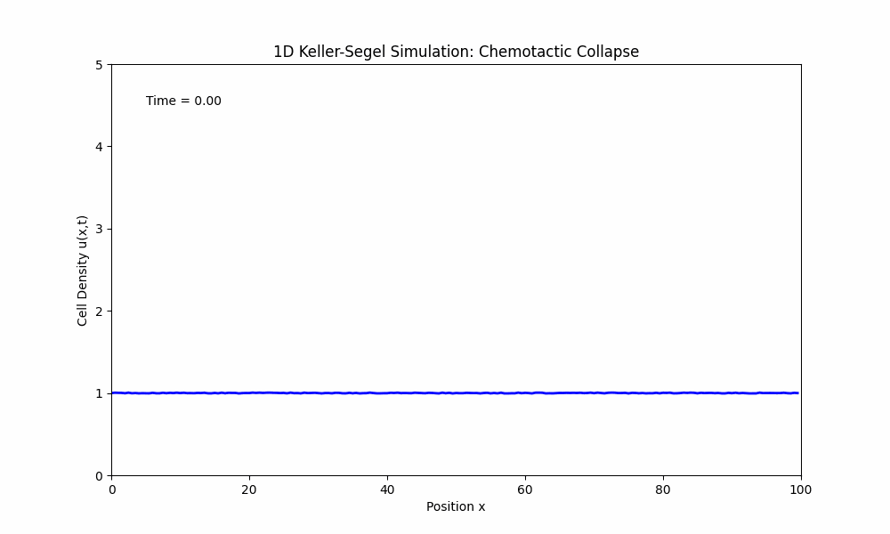

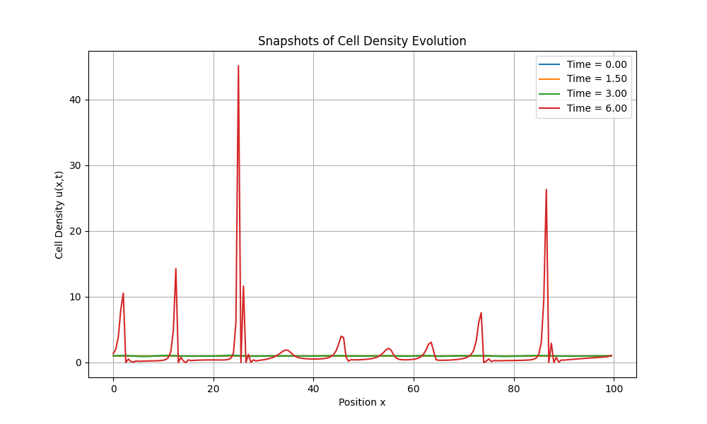


模拟结果生动地再现了趋化性塌缩的过程。从一个几乎均匀的、带有微小随机扰动的初始状态开始，我们可以看到某些区域的密度开始缓慢增长。随着时间的推移，这些微小的"山丘"变得越来越高、越来越窄，最终形成非常尖锐的、稳定的密度峰值。这清晰地表明，细胞间的（通过化学物质介导的）相互作用能够自发地打破系统的均匀性，形成高度有序的宏观结构。

# 结论

这节课我们从**分子尺度**出发，了解了单个细菌内部精密的化学感应网络，这是其感知环境的基础)。然后，我们将这种复杂的生物行为抽象为一个**单粒子统计模型**——一维双态过程，用几个关键的速率参数 $\alpha_\pm$ 捕捉了其跑动-翻滚运动的本质。

通过粗粒化和绝热近似，我们将这个微观随机模型提升到了**连续介质力学**的层次，推导出了描述整个细菌群体密度演化的福克-普朗克方程，并明确了有效扩散系数和漂移速度的物理来源。

最后，我们将细菌群体与其所处的化学环境耦合起来，构建了**非线性动力学模型**（Keller-Segel模型），并发现这个耦合系统能够涌现出单个细菌所不具备的、令人惊叹的**集体行为**——自发的模式形成和趋化性塌缩。

这个从"分子"到"群体"，从"微观随机"到"宏观确定性"的建模过程，完美地诠释了理论物理学的思想和方法如何能够帮助我们理解复杂的物理和生物现象，揭示隐藏背后的普适物理原理。
