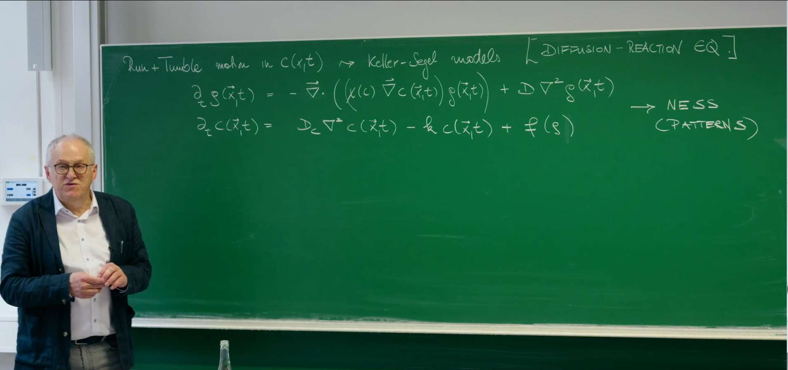
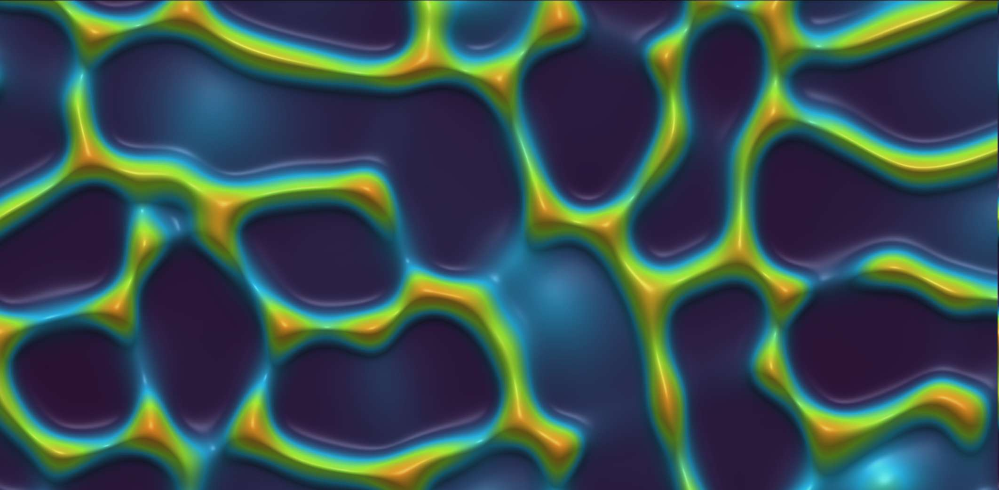
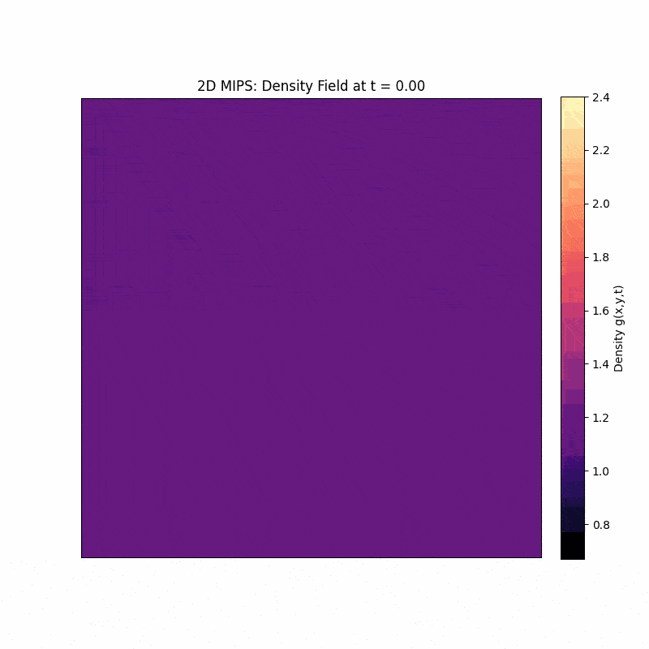
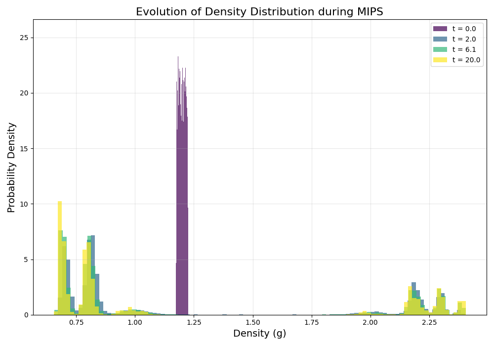

# 引言：从外部信号驱动到内部机制驱动的模式形成

在上一讲中，Erwin Frey 教授探讨了趋化性（chemotaxis）以及经典的Keller-Segel模型，它描述了生物群体（如细菌）如何响应化学信号梯度而聚集。为了更好地理解本讲内容，Erwin Frey 教授首先简要回顾了其核心思想。Keller-Segel模型由一组耦合的反应-扩散方程构成，描述了粒子（如细菌）密度 $g(\vec{x},t)$ 和化学信号浓度 $c(\vec{x},t)$ 的时空演化。



粒子密度的演化方程为：
$$
\partial_t g(\vec{x}, t) = - \vec{\nabla} \cdot \left( \left( \chi(c) \vec{\nabla} c(\vec{x}, t) \right) g(\vec{x}, t) \right) + D \nabla^2 g(\vec{x}, t)
$$

化学信号浓度的演化方程为：

$$\partial_t c(\vec{x},t) = D_c \nabla^2 c(\vec{x},t) - k c(\vec{x},t) + f(g)$$

第一个方程描述了粒子密度的变化。右侧第一项是**趋化项**，表示粒子会朝着化学信号浓度更高的方向移动，其中 $\chi(c)$ 是趋化敏感性；第二项是标准的**扩散项**，描述了粒子的随机运动。第二个方程描述了化学信号的产生和消散，包括信号自身的扩散（$D_c \nabla^2 c$）、降解（$-k c$）以及由粒子产生的信号源（$f(g)$）。

Keller-Segel模型的核心机制是一个正反馈循环：粒子聚集的地方会产生更高浓度的化学信号，而更高浓度的信号又会吸引更多的粒子前来聚集。这种由**外部信号**（化学梯度）引导的运动，最终可以导致系统从一个均匀的状态转变为一个具有复杂空间结构的非平衡稳态（Non-Equilibrium Steady State, NESS），例如形成**团簇或斑图**（Pattern）。





Keller-Segel模型成功地解释了许多生物系统中的聚集现象，但它依赖于一个相对复杂的生物机制：粒子必须能够感知环境中的化学梯度，并相应地调整其运动方向。这就引出了一个更深层次、更具普遍性的物理问题：**即使没有外部信号的引导，也没有粒子间的直接吸引力，仅仅通过粒子自身的运动特性，系统能否自发地形成有序的结构？**

这节课将围绕这个问题展开，探讨一种全新的模式形成机制。我们将看到，粒子运动的内在属性——特别是其速度如何受周围环境（例如，粒子密度）的影响——足以驱动系统发生**相分离**。这种现象被称为**运动诱导相分离（Motility-Induced Phase Separation, MIPS）**。**这标志着我们从研究由外部信号驱动的特定生物行为，转向探索由更普适的物理原理主导的自组织现象。**

# 1. Schnitzer模型：跑动-翻滚动力学的微观描述

为了从微观层面理解粒子运动如何导致宏观上的模式形成，教授引入一个经典模型——Schnitzer模型。该模型最初是为了给趋化性中的大肠杆菌（E. coli）等微生物的"跑动-翻滚"（run-and-tumble）运动建立一个连续介质理论。在本讲中，我们将其作为一个理想化的模型系统，来揭示MIPS的物理本质。

Schnitzer模型于20世纪90年代末至21世纪初由Martin J. Schnitzer、George Oster和Howard C. Berg等人发展起来，其历史背景是为了从第一性原理出发，为大肠杆菌等细菌的趋化性行为建立一个严谨的统计力学框架。该模型的核心本质是将微观的“跑动-翻滚”随机运动与细胞内化学信号转导通路耦合，通过主方程（Master Equation）和福克-普朗克方程（Fokker-Planck Equation）等数学工具，从单个细菌的随机运动规律推导出细胞群体在化学物质浓度场中的宏观扩散、漂移等连续介质行为。其具体应用远不止于解释趋化性，它已成为研究微生物运动的标准范式，被广泛应用于量化细菌在复杂环境中的搜索策略、优化病原体侵袭和免疫细胞追踪的模型，以及启发微纳机器人集群的算法设计。

## 1.1. 系统的定义

我们考虑一个简化的一维系统。在这个系统中，存在两类粒子：

* 密度为 $P_+(x,t)$ 的粒子，它们以速度 $v(x)$ 向右（$+x$ 方向）移动。

* 密度为 $P_-(x,t)$ 的粒子，它们以速度 $v(x)$ 向左（$-x$ 方向）移动。

这里的速度 $v(x)$ 和翻滚率 $\alpha(x)$ 都可能依赖于空间位置 $x$。翻滚（tumble）是指粒子会以一定的速率 $\alpha(x)$ 随机地改变其运动方向。在一维情况下，这意味着向右运动的粒子会变为向左运动，反之亦然。

## 1.2. 主方程

基于以上定义，我们可以写出描述 $P_+$ 和 $P_-$ 密度演化的主方程（Master Equations）。这是一对耦合的偏微分方程。

对于向右运动的粒子密度 $P_+$，其演化方程为：

$$\partial_t P_+ = -\partial_x [v(x) P_+] - \frac{1}{2} \alpha(x) P_+ + \frac{1}{2} \alpha(x) P_-$$

该方程的物理意义可以分解为三个部分：

1. **平流项**（Advection）：$-\partial_x [v(x) P_+]$。这是一个连续性方程的流出项，描述了 $P_+$ 粒子以速度 $v(x)$ 向右运动所导致的密度变化。

2. **损失项**（Loss）：$-\frac{1}{2} \alpha(x) P_+$。向右运动的粒子会以速率 $\alpha(x)$ 发生翻滚。在一维模型中，我们假设翻滚后方向完全随机，因此有一半的概率（这里简化为确定性地）变为向左运动。因此，这一项描述了 $P_+$ 群体因翻滚而减少的速率。

3. **增益项**（Gain）：$+\frac{1}{2} \alpha(x) P_-$。同理，向左运动的粒子 $P_-$ 也会发生翻滚，并有一定概率变为向右运动，从而补充了 $P_+$ 群体。

对于向左运动的粒子密度 $P_-$，其演化方程具有对称的形式：

$$\partial_t P_- = +\partial_x [v(x) P_-] - \frac{1}{2} \alpha(x) P_- + \frac{1}{2} \alpha(x) P_+$$

注意，这里的平流项 $\partial_x [v(x) P_-]$ 前面的符号为正，因为它描述的是粒子向左（-x方向）运动。损失项和增益项的物理解释与 $P_+$ 方程类似。

## 1.3. 宏观可观测量

$P_+$ 和 $P_-$ 是微观状态的描述。在实验或宏观理论中，我们更关心的是一些宏观可观测量，例如总粒子密度和粒子流。它们可以由 $P_+$ 和 $P_-$ 定义如下：

* **总粒子密度**（Total Density）：$g(x,t) = P_+(x,t) + P_-(x,t)$

* **粒子流**（Particle Flux/Current）：$J(x,t) = v(x) [P_+(x,t) - P_-(x,t)]$

我们的最终目标是推导出一个只包含宏观量 $g(x,t)$ 的封闭演化方程，而无需再关心微观的 $P_+$ 和 $P_-$。这个过程被称为"**粗粒化**"（coarse-graining）。

# 2. 粗粒化：通过绝热消除从微观规则到宏观定律

为了从描述微观状态（$P_+, P_-$）的Schnitzer模型得到描述宏观密度（$g$）的方程，我们需要一种系统性的简化方法。这里，我们将使用一种在物理学中非常强大的技术——**绝热消除**（Adiabatic Elimination）。

## 2.1. 绝热消除原理

绝热消除法的核心思想是，当一个动力学系统包含演化速率差异巨大的变量时，我们可以简化系统。具体来说，系统中的变量可以分为"快变量"和"慢变量"。快变量的演化时间尺度很短（弛豫速率快），而慢变量的演化时间尺度很长（弛豫速率慢）。绝热消除假设快变量能够"瞬时"地适应慢变量的任何变化，并始终处于由当前慢变量值所决定的**准稳态（quasi-steady state）**。通过求解快变量的准稳态，并将其代入慢变量的动力学方程，我们就可以"消除"快变量，从而得到一个只描述慢变量演化的、更简单的有效动力学方程。

在我们的Schnitzer模型中：

* **慢变量**：总密度 $g = P_+ + P_-$。它的变化依赖于粒子在空间中的输运，这是一个相对缓慢的过程。

* **快变量**：粒子流 $J$ 所关联的密度差 $P_+ - P_-$。粒子通过翻滚（由速率 $\alpha$ 控制）在向左和向右的状态之间快速转换。我们假设翻滚过程远快于粒子在宏观尺度上移动的过程，即 $\alpha$ 很大。

## 2.2. 有效Fokker-Planck方程的推导

现在，我们遵循课堂中的推导步骤，对Schnitzer模型进行绝热消除。

1. **将 $P_+$ 和 $P_-$ 的主方程相加和相减。**

   * 相加：
   
   $$
   \partial_t (P_+ + P_-) = -\partial_x [v (P_+ - P_-)] \implies \partial_t g = -\partial_x J
   $$
   
   这个结果是一个精确的粒子数守恒定律，表明总密度的变化率等于粒子流的负散度。

   * 相减：
   
   $$
   \partial_t (P_+ - P_-) = -\partial_x [v (P_+ + P_-)] - \alpha (P_+ - P_-)
   $$

**2. 应用绝热近似。**

我们假设快变量 $(P_+ - P_-)$ 的弛豫非常快，以至于它的时间导数可以近似为零，即 $\partial_t (P_+ - P_-) \approx 0$。

**3. 求解快变量的准稳态。**

在 $\partial_t (P_+ - P_-) \approx 0$ 的条件下，第二个方程变为：

   $$
   0 \approx -\partial_x [v (P_+ + P_-)] - \alpha (P_+ - P_-) = -\partial_x [v g] - \alpha (P_+ - P_-)
   $$

解出 $(P_+ - P_-)$：

   $$
   (P_+ - P_-) \approx -\frac{1}{\alpha(x)} \partial_x [v(x) g(x,t)]
   $$

**7. 将准稳态表达式代回宏观量的定义中。**

首先，代入粒子流 $J$ 的定义：

   $$
   J = v(x) (P_+ - P_-) \approx -\frac{v(x)}{\alpha(x)} \partial_x [v(x) g(x,t)]
   $$

然后，将这个有效粒子流的表达式代入粒子数守恒定律 $\partial_t g = -\partial_x J$：

   $$
   \partial_t g(x,t) = \partial_x \left( \frac{v(x)}{\alpha(x)} \partial_x [v(x) g(x,t)] \right)
   $$

在主方程中，$\alpha$ 已隐含$\frac{1}{2}$ 因子（损失项为 $\frac{1}{2} \alpha P_+$），为了严谨点，最终方程需显式添加 $\frac{1}{2}$

$$\partial_t g(x,t) = \partial_x \left( \frac{v(x)}{2\alpha(x)} \partial_x [v(x) g(x,t)] \right)$$

通过这一系列步骤，我们成功地消除了微观变量 $P_+$ 和 $P_-$，得到了一个只描述宏观总密度 $g$ 演化的封闭偏微分方程。这个方程在形式上是一个**福克-普朗克方程（Fokker-Planck Equation）**。

## 2.3. 有效粒子流与扩散

为了更深入地理解这个宏观方程的物理意义，我们可以将有效粒子流 $J$ 的表达式展开：

$$J = -\frac{v(x)}{\alpha(x)} \left( g(x,t) \frac{\partial v(x)}{\partial x} + v(x) \frac{\partial g(x,t)}{\partial x} \right)$$

整理后得到：

$$J = -\underbrace{\frac{v^2(x)}{\alpha(x)}}_{D_{\text{eff}}(x)} \frac{\partial g}{\partial x} - \underbrace{\frac{g(x,t) v(x)}{\alpha(x)} \frac{\partial v(x)}{\partial x}}_{\text{漂移项 (Drift Term)}}$$

这个表达式揭示了宏观粒子运动的两个组成部分：

* **有效扩散项**：第一项的形式与菲克扩散定律（Fick's Law of Diffusion）完全相同，其中 $D_{\text{eff}}(x) = \frac{v^2(x)}{\alpha(x)}$ 扮演了**有效扩散系数**的角色。它表明，即使微观运动是确定性的跑动（run），宏观上由于频繁的翻滚（tumble）也会表现出类似扩散的行为。

* **有效漂移项**：第二项是一个漂移项，它的大小正比于粒子密度 $g$ 和速度梯度 $\partial_x v(x)$。这一项意味着，粒子会受到一个等效的"力"，驱使它们向速度 $v(x)$ 更低的方向移动。

# 3. 活性粒子聚集的物理学

我们刚刚推导出的宏观方程蕴含着活性物质（active matter）物理学的一个核心原理。为了揭示这一点，我们来分析系统的稳态解。

## 3.1. 稳态分析

我们考虑一个封闭系统，这意味着在稳态（steady state）时，净粒子流 $J_{ss}$ 必须处处为零。为了简化分析，我们假设翻滚率 $\alpha(x)$ 是一个常数 $\alpha_0$。

稳态条件 $J_{ss} = 0$ 意味着：

$$-\alpha_0 v(x) \partial_x [v(x) g_{ss}(x)] = 0$$

这要求方括号内的项为一个常数：

$$v(x) g_{ss}(x) = \text{constant}$$

因此，我们得到了一个非常简洁而深刻的结论：

$$g_{ss}(x) \propto \frac{1}{v(x)}$$

稳态粒子密度 $g_{ss}(x)$ 与当地的粒子运动速度 $v(x)$ 成反比。

## 3.2. 物理诠释："活性粒子在运动缓慢处聚集"

这个 $g \propto 1/v$ 的关系是活性物质物理学区别于平衡态统计物理学的基石之一 。

在**平衡态系统**中，粒子的稳态分布由玻尔兹曼分布（Boltzmann distribution）决定，$g \propto \exp(-U/k_B T)$，其中 $U$ 是势能。粒子的分布只取决于能量景观，而与它们的运动学参数（如速度）无关。

然而，在**活性系统**中，系统处于非平衡态，其稳态分布由动力学过程决定。$g \propto 1/v$ 的物理图像非常直观：可以把它想象成一个"交通堵塞"效应。当粒子运动到一个它们速度会减慢的区域时，它们需要花费更长的时间才能离开这个区域。相反，当粒子处于一个高速区域时，它们会迅速穿过。随着时间的推移，这种动力学差异导致了粒子在低速区域的净积累。这个简单的动力学"交通堵塞"论证，正是 $g \propto 1/v$ 背后深刻的物理原理。

# 4. 运动诱导相分离（MIPS）

到目前为止，我们假设速度 $v(x)$ 是空间 $x$ 的固定函数。现在，我们引入一个至关重要的、更符合物理实际的设定，它将直接导致相分离的发生。

## 4.1. 关键反馈：依赖于密度的运动性

我们假设粒子的运动速度不再是空间坐标的先验函数，而是依赖于**局部的粒子密度**，即 $v = v(g)$。这是一个非常合理的假设。在许多真实系统中，例如密集的细胞群或胶体悬浮液中，当粒子密度升高时，它们会因为空间位阻（steric hindrance）或"拥挤"（crowding）效应而相互阻碍，导致运动速度下降。此外，也可能存在生物化学信号机制（如群体感应，quorum sensing），使得粒子在高密度下主动减速。在本讲中，我们主要考虑速度随密度增加而减小的情况，即

$$v'(g) = \frac{dv}{dg} < 0$$

## 4.2. 不稳定性的出现：反常扩散

引入 $v(g)$ 后，我们重新审视有效粒子流 $J$ 的表达式。为简化起见，我们采纳讲座中的设定，令翻滚率 $\alpha = 1$。

$$J = -v(g) \partial_x [g v(g)]$$

利用链式法则展开导数项：

$$J = -v(g) \left[ v(g) \frac{\partial g}{\partial x} + g \frac{dv(g)}{dg} \frac{\partial g}{\partial x} \right]$$

整理后得到：

$$J = - \left[ v(g)^2 + g v(g) v'(g) \right] \frac{\partial g}{\partial x}$$

这个表达式的形式仍然是菲克定律 $J = -D_{\text{eff}}(g) \frac{\partial g}{\partial x}$，但现在有效扩散系数 $D_{\text{eff}}(g)$ 本身也依赖于密度：

$$D_{\text{eff}}(g) = v(g)^2 + g v(g) v'(g)$$

## 4.3. 聚集条件与正反馈循环

这个依赖于密度的有效扩散系数 $D_{\text{eff}}(g)$ 的行为决定了系统的宏观动力学。

* **正常扩散**（Normal Diffusion）：如果 $D_{\text{eff}}(g) > 0$，粒子流的方向与密度梯度方向相反（从高密度流向低密度）。这会抹平任何密度不均匀性，使系统趋向于一个均匀的稳态。

* **反常扩散**（Anti-Diffusion）：如果 $D_{\text{eff}}(g) < 0$，情况将发生戏剧性的逆转！此时粒子流的符号为正，意味着粒子会**顺着**密度梯度流动，即从低密度区域流向高密度区域 (1)。这种行为会放大任何微小的密度涨落，导致粒子自发地聚集，最终形成团簇和斑图。

因此，系统变得不稳定的条件是 $D_{\text{eff}}(g) < 0$。由于 $v(g)$ 总是正的，这个条件可以简化为：

$$v(g) + g v'(g) < 0$$

这个条件等价于讲座笔记中给出的形式 1：

$$\frac{d}{dg}[g v(g)] < 0$$

这个数学条件背后是一**正反馈循环**（Positive Feedback Loop），它正是MIPS的核心机制。

1. **初始涨落**：假设系统最初处于一个均匀的密度状态。由于热噪声或其他随机因素，某个局部区域的密度出现了一个微小的正向涨落。

2. **减速**：由于我们假设 $v'(g) < 0$，这个密度稍高区域内的粒子运动速度会因此而减慢。

3. **聚集**：根据我们在第4节建立的原理（$g \propto 1/v$），活性粒子倾向于在运动缓慢的地方聚集。因此，更多的粒子会被吸引到这个已经略微密集的区域。

4. **放大**：粒子的进一步聚集使得该区域的密度变得更高，从而导致粒子速度进一步下降，这又会吸引更多的粒子……

这是一个失控的过程。最初微不足道的密度涨落被不断放大，最终导致均匀状态的崩溃。系统会自发地分离成一个高密度、低迁移率的"液相"和一个低密度、高迁移率的"气相"。这就是**运动诱导相分离**。值得强调的是，这是一种纯粹的非平衡现象，其驱动力是粒子的运动特性，而非像平衡态相变那样由粒子间的吸引力驱动。

好的，我们根据最终优化的代码和输出结果，来重写教程的第六节，使其成为一份完整、精炼且包含核心洞见的案例分析。

好的，我完全理解了。我们将以这个二维模拟案例为准，构建一个内容详实、公式清晰的新章节。之前的所有内容将被这个更完整的版本所取代。


# 5. MIPS的二维模拟与数值方法

为了深入探索运动诱导相分离（MIPS）在空间自组织（self-organization）过程中的丰富细节，我们将直接建立并求解一个二维模型。一维模型虽然可以揭示不稳定的本质，但二维模拟能更直观地展示斑图（Pattern）的形成、竞争与**粗化（Coarsening）**，这些都是相分离现象的核心特征。


## 5.1. 物理模型：Cahn-Hilliard方程

在二维空间中，描述相分离最通用和稳健的方程是**Cahn-Hilliard方程**。它优雅地捕捉了驱动相分离的"反向扩散"效应和抑制无限尖锐界面的"表面张力"效应之间的竞争。

该方程描述了粒子密度 $g(\vec{x}, t)$ 随时间的演化，其形式如下：

$$\frac{\partial g}{\partial t} = M \nabla^2 \mu$$

这是一个连续性方程，其中 $M$ 是一个常数，称为迁移率（mobility），而 $\mu$ 是有效化学势。方程表明，粒子会从化学势高的地方流向化学势低的地方。化学势 $\mu$ 本身由两部分贡献，它由一个有效自由能泛函 $F[g]$ 对密度的泛函导数给出：

$$\mu = \frac{\delta F}{\delta g} = \underbrace{f'(g)}_{\text{体能量项}} - \underbrace{\kappa \nabla^2 g}_{\text{界面能量项}}$$

* **体能量项 $f'(g)$：**这一项源于粒子间的有效相互作用。在MIPS的背景下，它与我们之前推导的有效扩散系数 $D_{\text{eff}}(g)$ 直接相关（具体关系为 $f''(g) \propto D_{\text{eff}}(g)$）。它的作用是，当密度处于不稳定区间时，会驱动系统分离成两个密度不同的物相。对于我们使用的 $v(g) = v_0(1-g/g^*)$ 模型，该项的具体形式为：

$$
f'(g) = v_0^2 \left( g - \frac{3}{2g^*}g^2 + \frac{2}{3(g^*)^2}g^3 \right)
$$

* **界面能量项 $-\kappa \nabla^2 g$：**这一项是模型的关键修正。$\kappa$ 是一个正的常数，代表了界面张力的强度。$\nabla^2 g$ 是密度的拉普拉斯算子，它衡量了密度场的"弯曲"程度。这一项的作用是惩罚具有高曲率的、尖锐的密度梯度，从而阻止了我们在初级模型中看到的非物理尖峰，并赋予了相分离界面一个特征宽度和能量代价。

将这两个公式结合起来，我们就得到了要求解的完整四阶非线性偏微分方程。

许多种类的细菌，如大肠杆菌（E. coli）或黏菌（Myxococcus xanthus），在营养丰富的培养基表面会形成高密度的“菌群”或生物膜 。在这些密集的群体中，细菌的运动会因频繁的物理碰撞而受阻。符合“**拥挤减速**”这一核心规则，从而自发地分离成高密度的、几乎静止的细菌团簇（液滴）和低密度的、快速运动的“气体”区域。

宏观世界的直观类比，如拥挤的人群（购物窗口效应），这是Frey教授在讲座中提到的一个绝佳类比 。想象一条繁忙的商业街，当一个有趣的橱窗吸引了一些人驻足观看时，他们的减速会迫使后面的人也慢下来或绕路，从而导致这个区域的人流密度瞬间增高，形成一个自发的“交通堵塞”。这里没有“吸引力”，仅仅是运动规则（减速）导致了聚集。

### 5.2. 数值方法：有限差分法

我们将在一个 $N_x \times N_y$ 的二维正交网格上，使用**有限差分法（Finite Difference Method）**来数值求解Cahn-Hilliard方程。空间点的索引为 $(i, j)$，时间步的索引为 $n$。

### 空间离散化：二维拉普拉斯算子

方程的核心是**拉普拉斯算子** $\nabla^2 = \frac{\partial^2}{\partial x^2} + \frac{\partial^2}{\partial y^2}$。我们使用二阶中心差分（也称为**五点模板**）来近似它。对于任意函数 $U$ 在格点 $(i, j)$ 上的值 $U_{i,j}$，其拉普拉斯算子可离散化为：

$$(\nabla^2 U)_{i,j} \approx \frac{U_{i+1,j} + U_{i-1,j} + U_{i,j+1} + U_{i,j-1} - 4U_{i,j}}{(\Delta x)^2}$$

这里我们假设空间步长在x和y方向上是相同的，即 $\Delta x = \Delta y$。$U_{i+1,j}$ 代表y方向下一个格点的值，$U_{i,j+1}$ 代表x方向下一个格点的值，以此类推。

### 时间离散化：前向欧拉法

对于时间导数 $\frac{\partial g}{\partial t}$，我们使用最简单的**前向欧拉法**：

$$\frac{\partial g}{\partial t} \bigg|_{t=t_n} \approx \frac{g_{i,j}^{n+1} - g_{i,j}^n}{\Delta t}$$

其中，$g_{i,j}^n$ 是密度在 $(i,j)$ 点、$n$ 时刻的值，$g_{i,j}^{n+1}$ 是下一个时间步的值。

### 完整的更新算法

结合以上离散化方法，我们可以得到从 $n$ 时刻的密度场 $g^n$ 计算出 $n+1$ 时刻密度场 $g^{n+1}$ 的完整算法：

1. **第一步：计算 $g^n$ 的拉普拉斯**
   对于网格上的每一个点 $(i,j)$，利用五点模板公式计算 $(\nabla^2 g)^n_{i,j}$。

2. **第二步：计算化学势 $\mu^n$**
   利用上一步的结果，计算每个点的化学势：

   $$
   \mu_{i,j}^n = f'(g_{i,j}^n) - \kappa (\nabla^2 g)^n_{i,j}
   $$

3. **第三步：计算 $\mu^n$ 的拉普拉斯**
   再次使用五点模板公式，对刚刚得到的化学势场 $\mu^n$ 求拉普拉斯，得到 $(\nabla^2 \mu)^n_{i,j}$。

4. **第四步：更新密度场 $g^{n+1}$**
   使用前向欧拉法更新密度：

   $$
   g_{i,j}^{n+1} = g_{i,j}^n + M \cdot \Delta t \cdot (\nabla^2 \mu)^n_{i,j}
   $$

我们对整个网格重复这四步，即可完成一个时间步的演化。不断迭代，就能模拟出完整的相分离过程。

## 5.3. Python代码实现

```python
import numpy as np
import matplotlib.pyplot as plt
import imageio
import os
from tqdm import tqdm

# --- 1. Parameter settings ---
L = 10.0      # System domain side length
Nx = 128      # Number of spatial grid points (same in x and y directions)
dx = L / Nx   # Spatial step size

# --- Simulation total time T=20 ---
T = 20.0
# --- Correspondingly reduce total steps ---
Nt = 8000
dt = T / Nt

# Model parameters
v0 = 1.0
g_star = 2.0
g0 = 1.2      # Average density
M = 1.0       # Mobility
kappa = 1e-4  # Surface tension coefficient

# --- 2. Define relevant functions ---
def mu_bulk_func(g, v0, g_star):
    term1 = g
    term2 = -(3.0 / (2.0 * g_star)) * g**2
    term3 = (2.0 / (3.0 * g_star**2)) * g**3
    return v0**2 * (term1 + term2 + term3)

# --- 3. Initialize density field ---
g = g0 + 0.05 * (np.random.rand(Nx, Nx) - 0.5)

# Frames for storing GIF and statistical plots
frames = []

# --- 4. Main simulation loop ---
for n in tqdm(range(Nt), desc=f"Simulating 2D MIPS (T={T})"):
    g_up, g_down = np.roll(g, -1, axis=0), np.roll(g, 1, axis=0)
    g_left, g_right = np.roll(g, -1, axis=1), np.roll(g, 1, axis=1)
    lap_g = (g_up + g_down + g_left + g_right - 4*g) / (dx**2)
    
    mu_bulk = mu_bulk_func(g, v0, g_star)
    mu = mu_bulk - kappa * lap_g
    
    mu_up, mu_down = np.roll(mu, -1, axis=0), np.roll(mu, 1, axis=0)
    mu_left, mu_right = np.roll(mu, -1, axis=1), np.roll(mu, 1, axis=1)
    lap_mu = (mu_up + mu_down + mu_left + mu_right - 4*mu) / (dx**2)

    g = g + M * dt * lap_mu

    if n % (Nt // 100) == 0:
        frames.append(g.copy())

# --- 5. Create GIF animation ---
print("\nCreating GIF animation...")
temp_dir = 'temp_frames_mips2d_short'
os.makedirs(temp_dir, exist_ok=True)
gif_filename = 'MIPS_2D.gif'
filenames = []

all_data = np.concatenate([frame.flatten() for frame in frames])
vmin = np.percentile(all_data, 0.1)
vmax = np.percentile(all_data, 99.9)

for i, frame_data in enumerate(frames):
    fig, ax = plt.subplots(figsize=(8, 8))
    im = ax.imshow(frame_data, cmap='magma', vmin=vmin, vmax=vmax, interpolation='bicubic')
    ax.set_title(f'2D MIPS: Density Field at t = {i / (len(frames)-1) * T:.2f}')
    ax.set_xticks([]); ax.set_yticks([])
    plt.colorbar(im, ax=ax, fraction=0.046, pad=0.04, label="Density g(x,y,t)")
    
    filename = f'{temp_dir}/frame_{i:03d}.png'
    plt.savefig(filename)
    filenames.append(filename)
    plt.close(fig)

gif_duration = 0.2 
with imageio.get_writer(gif_filename, mode='I', duration=gif_duration, loop=0) as writer:
    for filename in tqdm(filenames, desc="Building GIF"):
        image = imageio.imread(filename)
        writer.append_data(image)

print(f'\nAnimation saved as {gif_filename}')

# --- 6. Plot core statistics: density histogram ---
print("Creating statistical histogram plot...")
fig_hist, ax_hist = plt.subplots(figsize=(10, 7))


# Select representative time points to plot
# Change last index from 100 to 99, as list indices range from 0 to 99
snapshot_indices = [0, 10, 30, 99] 
colors = plt.cm.viridis(np.linspace(0, 1, len(snapshot_indices)))

for i, frame_idx in enumerate(snapshot_indices):
    time = frame_idx / (len(frames) - 1) * T # Corrected time calculation
    data = frames[frame_idx].flatten()
    ax_hist.hist(data, bins=100, density=True, alpha=0.7, 
                 label=f't = {time:.1f}', color=colors[i])

ax_hist.set_title('Evolution of Density Distribution during MIPS', fontsize=16)
ax_hist.set_xlabel('Density (g)', fontsize=14)
ax_hist.set_ylabel('Probability Density', fontsize=14)
ax_hist.legend()
ax_hist.grid(True, alpha=0.3)
plt.tight_layout()
plt.savefig('MIPS_density_histogram.png')
plt.show()

print(f'Histogram plot saved as MIPS_density_histogram.png')
```



动画清晰地展示了相分离的启动过程：系统从一个几乎均匀的状态开始，内在的不稳定性迅速放大了微小的随机噪声，形成了相互交织的、类似迷宫的“旋节线”结构。很快，这些细长结构会因表面张力而断裂、收缩，形成轮廓清晰的“液滴”状高密度区域，漂浮在低密度的“气体”背景中。



**$t = 0.0$ (紫色)**: 分布是一个位于平均密度 $g_0=1.2$ 的**单一窄峰**，代表系统初始的均匀状态。**$t = 2.0$ (蓝色)**: 分布迅速**变宽并向两边坍塌**，表明均匀态正在瓦解，系统同时出现了高于和低于平均密度的区域。**$t = 6.1$ (绿色)**: **双峰结构出现**！这标志着相分离已经发生，系统中明确地形成了两种不同的物相：一个低密度相和一个高密度相。**$t = 20.0$ (黄色)**: **双峰结构完全成熟**。两个尖锐的峰分别代表了稳定存在的“气体”相（密度约0.7）和“液体”相（密度约2.25）。


# 6. 一种有效的热力学描述

MIPS的动力学过程虽然复杂且本质上是非平衡的，课堂最后教授揭示，它的行为可以被一个类似于平衡态热力学自由能的数学结构所描述。

## 6.1. 映射为梯度流

讲座指出，有效粒子流 $J_{\text{eff}}$ 可以被重写成一种在平衡态输运理论中常见的形式：

$$J_{\text{eff}}(x,t) = -M(g) \partial_x \mu_{\text{eff}}(g)$$

通过与我们之前推导的 $J$ 的表达式进行比较，可以识别出以下两项：

* **迁移率**（Mobility）：$M(g) = g v(g)^2$。它描述了粒子在受到一个等效"力"（由化学势梯度产生）时移动的难易程度。

* **有效化学势**（Effective Chemical Potential）：$\mu_{\text{eff}}(g) = \log g + \log v(g)$。在平衡态热力学中，化学势的差异驱动粒子从高化学势区域流向低化学势区域。在这里，$\mu_{\text{eff}}$ 扮演了类似的角色。

## 6.2. 李雅普诺夫泛函

化学势通常可以由一个自由能函数对粒子数求导得到。类似地，这里的有效化学势 $\mu_{\text{eff}}(g)$ 可以被看作一个**有效自由能泛函**（Effective Free Energy Functional）$F_{\text{eff}}[g]$ 对密度 $g$ 的泛函导数。这个泛函 $F_{\text{eff}}[g]$ 也被称为**李雅普诺夫泛函**（Lyapunov Functional）。

其定义如下：

$$F_{\text{eff}}[g] = \int dx \left[ g(x) \log g(x) - g(x) + \int_0^g ds \log v(s) \right]$$

我们可以验证，对这个泛函求关于 $g$ 的泛函导数，确实能得到我们之前定义的有效化学势：

$$\mu_{\text{eff}}(g) = \frac{\delta F_{\text{eff}}}{\delta g} = \frac{\partial}{\partial g} \left( g \log g - g + \int_0^g ds \log v(s) \right) = (\log g + 1) - 1 + \log v(g) = \log g + \log v(g)$$

这验证了整个数学框架的自洽性。

## 6.3. 系统总是向"山下"演化

有了有效自由能泛函，整个系统的动力学方程可以被优雅地写成一个**梯度流**（Gradient Flow）的形式：

$$\partial_t g = \partial_x \left[ M(g) \partial_x \frac{\delta F_{\text{eff}}}{\delta g} \right]$$

这个形式有一个极其重要的推论：系统在演化过程中，其有效自由能 $F_{\text{eff}}$ 总是不断减小的。我们可以证明这一点：

$$\frac{dF_{\text{eff}}}{dt} = \int dx \frac{\delta F_{\text{eff}}}{\delta g} \frac{\partial g}{\partial t} = \int dx \, \mu_{\text{eff}} \, \partial_t g$$

将 $\partial_t g$ 的表达式代入：

$$\frac{dF_{\text{eff}}}{dt} = \int dx \, \mu_{\text{eff}} \, \partial_x \left[ M(g) \partial_x \mu_{\text{eff}} \right]$$

使用分部积分法（假设周期性边界条件）：

$$\frac{dF_{\text{eff}}}{dt} = - \int dx \, (\partial_x \mu_{\text{eff}}) \left[ M(g) \partial_x \mu_{\text{eff}} \right] = - \int dx \, M(g) (\partial_x \mu_{\text{eff}})^2$$

由于迁移率 $M(g) = g v(g)^2$ 总是非负的，而 $(\partial_x \mu_{\text{eff}})^2$ 也总是非负的，所以整个积分项是非负的。因此，我们证明了：

$$\frac{dF_{\text{eff}}}{dt} \le 0$$

这个结果告诉我们，尽管MIPS是一个复杂的非平衡动力学过程，但它的演化方向可以被看作是在一个由 $F_{\text{eff}}$ 定义的有效"**能量景观**"上下滑的过程。系统会不断地调整自身构型，以寻找并最终达到这个有效自由能的最小值。这个最小值对应的状态，就是我们观察到的稳定的、相分离的稳态。这也解释了模拟中观察到的"粗粒化"现象：小液滴合并成大液滴，是为了减少总的"相界面"，从而降低系统的总有效自由能，这与平衡态系统中的奥斯特瓦尔德熟化（Ostwald ripening）过程非常相似。

# 结论

这节课从一个描述单个粒子"跑动-翻滚"运动的**微观模型**（Schnitzer模型）出发。通过**粗粒化技术**（绝热消除），我们推导出了描述粒子群体密度的**宏观动力学方程**（有效Fokker-Planck方程）。

通过引入一个物理上合理的**反馈机制**（拥挤减速），这个宏观方程预言了一种**动力学不稳定性**（反常扩散），并最终导致了壮观的**集体现象**（运动诱导相分离）。最后，我们发现这整个复杂的非平衡过程，可以被一个优美的**有效热力学框架**（李雅普诺夫泛函）所描述，系统的演化如同在一个能量景观上寻找最低点。

运动诱导相分离是活性物质物理学中最基本、最普适的自组织机制之一，它广泛存在于从细菌菌落、合成活性胶体到机器人集群等各种系统中。本讲所介绍的理论工具，为理解这些迷人的自组织现象提供了坚实的基础。
