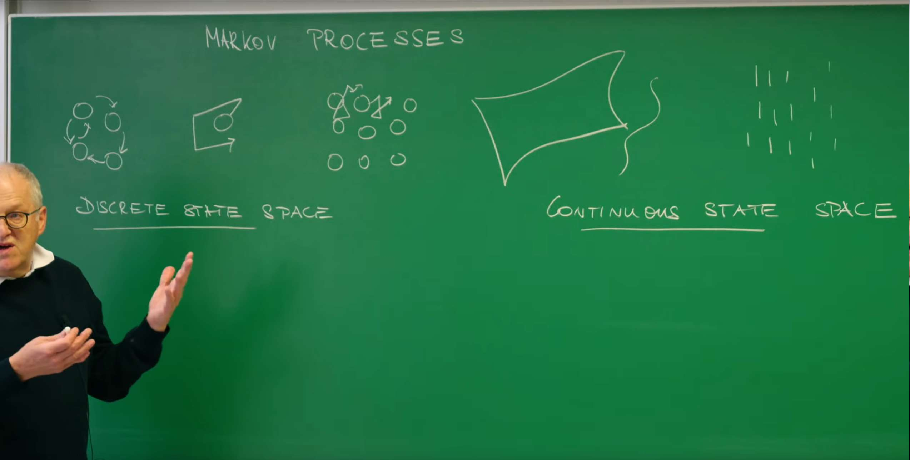
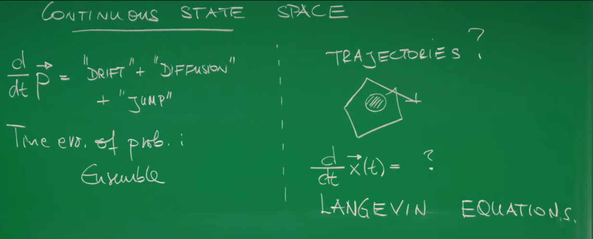
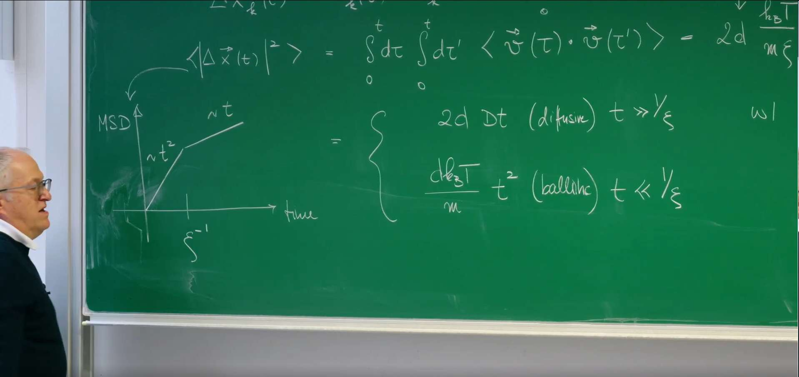
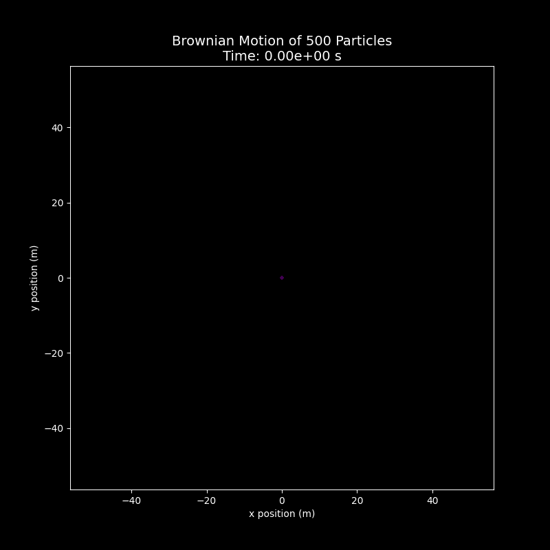
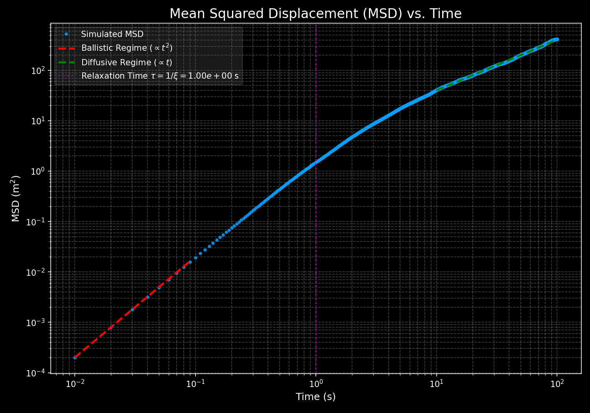

# 引言

在之前的课程中，Erwin Frey 教授已经探讨了如何使用主方程和福克-普朗克方程来描述随机过程。这些工具非常强大，它们描述了一个系统在给定时间处于某个特定状态的概率分布如何随时间演化。这种视角，我们称之为"系综视角"，因为它关注的是由无数个相同系统构成的理论集合的平均行为。然而，这种方法并没有告诉我们单个粒子——比如在液体中悬浮的一个花粉粒——所经历的具体、曲折的运动轨迹是怎样的。本讲座将标志着一个关键的视角转变：我们将从描述概率的平滑演化，转向构建一个能够描绘单个粒子随机轨迹的动力学方程。这个核心工具就是**朗之万方程 (Langevin Equation)，**它将牛顿力学的确定性思想与统计物理的随机性巧妙地结合在一起，为我们理解和模拟处于热环境中的粒子行为提供了全新的、更为直观的途径。

# 1. 从系综到轨迹：回顾与新视角



## 1.1. 马尔可夫过程回顾

为了构建描述单粒子轨迹的理论，我们首先回顾一下之前描述随机过程的框架。

* **离散状态空间 (Discrete State Space)**

  对于状态可以被离散计数的系统（例如，一个区域内的分子数量），其概率演化由主方程 (Master Equation) 描述：

  $$
  \frac{dP(t)}{dt} = QP(t)
  $$

  这里，$P(t)$ 是一个向量，其分量表示系统处于各个离散状态的概率，$Q$ 是包含状态间跃迁速率的矩阵。这个方程描述了整个概率分布（即系综）的确定性演化。如果我们想模拟单个系统的具体随机历史，我们会使用像**吉莱斯皮算法 (Gillespie Algorithm)** 这样的方法来生成一条随机轨迹。

* **连续状态空间 (Continuous State Space)**

  对于状态是连续变量的系统（例如，粒子的位置或速度），其概率演化由**福克-普朗克方程 (Fokker-Planck Equation) 描述**。从概念上讲，它可以被分解为几个部分：

  $$
  \frac{\partial P(x,t)}{\partial t} = \text{"漂移 (DRIFT)"} + \text{"扩散 (DIFFUSION)"} + \text{"跳跃 (JUMP)"}
  $$

  这个方程同样描述了概率密度 $P(x,t)$ 这个系综量的确定性演化。它告诉我们，一个由大量粒子构成的"概率云"会如何漂移和扩散。

## 1.2. 提出核心问题

无论是主方程还是福克-普朗克方程，它们都回答了"在时间 $t$，粒子**可能**在哪里？"这个问题。然而，它们并没有直接回答"某个**特定**粒子从时间0到时间 $t$ 是**如何**运动的？"。我们观察到的单个布朗粒子的轨迹是一条连续但处处"拐角"的、不可预测的路径。



这就引出了这节课的核心问题：**我们能否为单个随机粒子写出一个类似于牛顿第二定律的运动方程？即，我们能否确定下面这个方程中的未知项？**

$$
\frac{dx(t)}{dt} = ?
$$

这个问题的答案，正是由保罗·朗之万 (Paul Langevin) 在20世纪初提出的朗之万方程。

朗之万方程由法国物理学家保罗·朗之万于1908年提出，最初用于描述布朗运动中悬浮粒子在流体中受到分子碰撞而产生的无规则运动，为统计力学和随机过程研究奠定了基础。其核心本质是一个随机微分方程，通过结合确定性力（如粘滞阻力）和随机噪声力（高斯白噪声），刻画了微观粒子在势能场中受趋势力、摩擦力与随机力共同作用的动力学行为，并满足涨落耗散定理，揭示了系统从非平衡态趋向热平衡的过程。

该方程的应用范围极广：从物理学的布朗运动模拟和分子动力学研究，到化学中的反应速率建模，再到生物学中的蛋白质折叠动力学分析；此外，它在机器学习中为随机梯度下降算法提供了理论框架，并在金融数学中用于风险评估和股价波动模拟。

从福克-普朗克方程到朗之万方程的转变，不仅仅是数学工具的改变，更是一种基础观念上的深刻改变。福克-普朗克方程本身对于概率分布 $P(x,t)$ 而言是确定性的：给定一个初始分布，其未来的演化是完全确定的。而朗之万方程对于单个粒子的轨迹 $x(t)$ 而言，其本质是**随机的（stochastic）**。这两者并非相互独立，而是同一枚硬币的两面。一个描述了随机行走者的"云"如何演化，另一个则描绘了单个行走者的每一步。正如我们将在后面看到的，朗之万方程中的参数（如驱动力和噪声强度）与福克-普朗克方程中的系数（漂移项和扩散项）之间存在着深刻而精确的数学联系。理解这种**对偶性**是掌握随机过程理论的基石。

# 2. 为布朗粒子建模：随机力的必要性

## 2.1. 朴素的宏观模型

让我们从一个具体的物理系统开始：一个悬浮在液体中的微观粒子，即经典的**布朗粒子 (Brownian Particle)。**最简单的建模思路是直接应用我们熟悉的宏观物理定律。一个在粘性流体中运动的物体会受到阻力，该阻力通常与速度成正比（斯托克斯阻力）。根据牛顿第二定律，我们可以写出：

$$
m\frac{dv(t)}{dt} = -m\xi v(t)
$$

这里，$m$ 是粒子的质量，$v(t)$ 是其速度。教授在他的板书中使用了 $m\xi$ 来表示摩擦系数，这个量通常也被记为 $\gamma$。因此，$\gamma = m\xi$ 是描述阻力大小的摩擦系数。对于一个半径为 $R$ 的球形粒子，在粘度为 $\eta$ 的流体中，这个系数由斯托克斯公式给出：

$$
\gamma = 6\pi\eta R
$$

这是一个简单的一阶常微分方程，其解为：

$$
v(t) = v_0 e^{-\xi t}
$$

这个模型预言，无论粒子的初速度 $v_0$ 是多少，它的速度都会在 $\xi^{-1}$ 这个特征时间尺度上指数衰减至零。这个朴素的宏观模型，其核心物理意义是试图用经典的、确定性的牛顿力学来描述一个本质上由微观随机性主导的系统。它准确抓住了“​​摩擦耗散能量”这一关键物理机制。

然而，这个模型的根本局限性在于，它完全忽略了流体分子热运动带来的随机撞击。它预言粒子会停止，但这与我们在显微镜下实际观察到的永不停歇的布朗运动相矛盾。

## 2.2. 与热力学的矛盾

这个朴素模型的结论——即液体中的粒子最终会静止下来——显然与我们的观察和物理直觉相悖。一个处于有温度的液体中的花粉粒永远不会真正地"静止"，它总是在不停地做无规则运动。

这里的关键在于热力学。根据统计力学中的**能量均分定理 (Equipartition Theorem)，**在热平衡状态下，系统每个自由度的平均动能都等于 $\frac{1}{2}k_B T$。对于一个在三维空间中运动的粒子，它有三个平动自由度，因此其平均动能为：

$$
\langle E_{kin} \rangle = \frac{1}{2}m\langle v^2 \rangle = \frac{3}{2}k_B T
$$

其中，$k_B$ 是玻尔兹曼常数，$T$ 是环境的绝对温度。

这个基本定理要求，只要温度 $T > 0$，粒子的平均速率平方 $\langle v^2 \rangle$ 就必须是一个非零的定值。其方均根速率，即**热速率 (thermal velocity)，**为：

$$
\sqrt{\langle v^2 \rangle} = \sqrt{\frac{3k_B T}{m}}
$$

这就产生了一个尖锐的矛盾：朴素的确定性模型预言 $v \to 0$，而热力学定律则断言 $\langle v^2 \rangle$ 必须保持一个由温度决定的非零值。

## 2.3. 朗之万的假说：一个涨落力

为了解决这个矛盾，朗之万提出了一个天才的假设：除了宏观的粘性阻力外，粒子还受到一个额外的、快速变化的随机力，记为 $\eta(t)$。这个力代表了来自周围无数个液体分子的、永不停歇的、无规则的碰撞。

将这个随机力加入运动方程，我们就得到了描述布朗粒子速度演化的朗之万方程：

$$
m\frac{dv(t)}{dt} = -m\xi v(t) + \eta(t)
$$

这个方程优美地体现了流体对布朗粒子的双重作用：

1. **耗散 (Dissipation)：**通过粘性阻力项 $-m\xi v(t)$，流体不断地消耗粒子的动能，使其减速。

2. **涨落 (Fluctuation)：**通过随机力项 $\eta(t)$，流体又不断地将自身的热能（分子无规则运动的动能）传递给粒子，使其加速。

引入随机力 $\eta(t)$ 并非一个简单的"打补丁"式的修正。它蕴含了一个极为深刻的物理思想：导致能量耗散（摩擦力）的微观机制与导致热涨落（随机力）的微观机制是完全相同的。摩擦力和随机的"踢力"都源于粒子与流体分子的碰撞。宏观的阻力 $-m\xi v$ 是当粒子以速度 $v$ 运动时，所受到的无数次分子碰撞的**平均**效果；而随机力 $\eta(t)$ 则是这些碰撞力偏离其平均值的**涨落**部分。因此，耗散和涨落并非两个独立的物理现象，它们是同一个微观过程的两个不同侧面——平均效应和涨落效应。这一认识正是我们接下来要推导的**涨落-耗散定理**的核心思想。


# 3. 朗之万方程与涨落-耗散定理

我们无法精确知道随机力 $\eta(t)$ 在每一时刻的具体值，但我们可以描述它的统计性质。

## 3.1. 噪声的统计特性

* **零均值 (Zero Mean)：**从任何方向而来的分子碰撞概率都是均等的，因此在长时间平均下，随机力的平均效果为零。这保证了如果我们对许多条轨迹进行平均，将能够恢复那个没有随机力的确定性方程。用数学语言表达为：

  $$
  \langle \eta(t) \rangle = 0
  $$

* **Delta-关联（白噪声）：**分子碰撞发生的时间尺度（皮秒级）远小于布朗粒子运动的典型时间尺度（微秒级或更长）。因此，我们可以做一个理想化的假设：任意两个不同时刻的随机力是完全不相关的。这种在时间上没有任何关联的噪声被称为高斯白噪声 (Gaussian White Noise)。

  其关联函数（correlation function）的数学形式为：

  $$
  \langle \eta_i(t) \eta_j(t') \rangle = 2\Gamma \delta_{ij} \delta(t-t')
  $$

  让我们来逐项解释这个重要的公式：

  * **$\Gamma$：噪声强度 (Noise Strength)。**它是一个常数，描述了随机力的涨落幅度有多大。目前，它的值还是未知的。

  * **$\delta_{ij}$：**克罗内克 Delta 符号 (Kronecker delta)。它表示当 $i=j$ 时为1，否则为0。这意味着 $x$ 方向的随机力与 $y$ 或 $z$ 方向的随机力是不相关的。

  * **$\delta(t-t')$：**狄拉克 Delta 函数 (Dirac delta function)。它表示只有在 $t=t'$ 这同一个瞬间，随机力才与自身相关，在任何 $t \neq t'$ 的情况下，相关性都为零。

## 3.2. 求解速度

朗之万方程是一个线性随机微分方程。我们可以把它看作一个由随机力 $\eta(t)$ 驱动的一阶常微分方程。其形式解可以写成一个积分方程：

$$
v(t) = v_0 e^{-\xi t} + \frac{1}{m}\int_0^t d\tau e^{-\xi(t-\tau)} \eta(\tau)
$$

为了数学处理上的方便，我们引入一个标准化的白噪声 $\lambda(t) = \frac{1}{\sqrt{2\Gamma}}\eta(t)$，它的关联函数更简单：$\langle \lambda_i(t)\lambda_j(t') \rangle = \delta_{ij}\delta(t-t')$。于是，速度的解可以写为：

$$
v(t) = v_0 e^{-\xi t} + \frac{\sqrt{2\Gamma}}{m} \int_0^t d\tau e^{-\xi(t-\tau)} \lambda(\tau)
$$

## 3.3. 速度自关联函数

为了将我们的动力学模型与热力学联系起来，我们需要计算 $\langle v^2(t) \rangle$。一个更通用且功能更强大的物理量是**速度自关联函数 (Velocity Autocorrelation Function, VACF)，**记为 $\langle v_i(t) v_j(t') \rangle$。它衡量了粒子在 $t$ 时刻的速度与在另一个时刻 $t'$ 的速度之间的关联程度。

我们通过将速度的解代入 $\langle v_i(t) v_j(t') \rangle$ 并取系综平均来计算它。这个计算过程在讲座的板书中有详细的推导。计算中包含四项，其中两项交叉项由于 $\langle \lambda(\tau) \rangle = 0$ 而消失。剩下两项，一项是初速度的衰减项，另一项是噪声贡献的双重积分项：

$$
\langle v_i(t) v_j(t') \rangle = v_0^i v_0^j e^{-\xi(t+t')} + \frac{2\Gamma}{m^2}\int_0^t d\tau \int_0^{t'} d\tau' \langle \lambda_i(\tau) \lambda_j(\tau') \rangle e^{-\xi(t-\tau)} e^{-\xi(t'-\tau')}
$$

利用白噪声的核心性质 $\langle \lambda_i(\tau) \lambda_j(\tau') \rangle = \delta_{ij}\delta(\tau-\tau')$，双重积分可以被简化为一重积分，最终得到：

$$
\langle v_i(t) v_j(t') \rangle = \left( v_{0i} v_{0j} - \frac{\Gamma}{\xi m^2} \delta_{ij} \right) e^{-\xi (t + t')} + \frac{\Gamma}{\xi m^2} \delta_{ij} e^{-\xi |t - t'|}
$$
## 3.4. 涨落-耗散定理的推导

现在，我们来考察系统达到热平衡后的行为。在长时间极限下（$t, t' \gg \xi^{-1}$），系统会"忘记"其初始速度 $v_0$。此时，上式中包含 $e^{-\xi(t+t')}$ 的第一项会衰减至零，我们得到稳态下的速度自关联函数：

$$
\langle v_i(t) v_j(t') \rangle_{\text{stat}} = \frac{\Gamma}{\xi m^2} \delta_{ij} e^{-\xi |t - t'|}
$$
这个结果告诉我们，即使在稳态下，速度的关联也并非瞬间消失，而是随着时间差 $|t-t'|$ 的增大而指数衰减，其特征时间就是速度的弛豫时间 $\xi^{-1}$。

现在是最关键的一步。我们令 $t=t'$，就可以得到任意时刻稳态下的速度平方均值：

$$
\langle v_i(t) v_i(t) \rangle = \frac{\Gamma}{\xi m^2}
$$

对于三维空间，总的速度平方均值为三个分量之和：

$$
\langle v^2(t) \rangle = \sum_{i=1}^{3} \langle v_i(t) v_i(t) \rangle = 3 \frac{\Gamma}{\xi m^2}
$$
最后，我们将这个从朗之万动力学模型推导出的结果，与从能量均分定理得出的热力学要求 $\langle v^2 \rangle = \frac{3k_B T}{m}$ 相等同：

$$
\frac{3 \Gamma}{\xi m^2} = \frac{3 k_B T}{m} \Rightarrow \Gamma = m \xi k_B T = \gamma k_B T
$$
**这就是这节课的核心成果之一：涨落-耗散定理 (Fluctuation-Dissipation Theorem, FDT)。**

这个定理的物理意义极为深刻：**它明确指出，描述随机力涨落幅度的噪声强度 $\Gamma$ 并不是一个独立的、需要额外测量的参数。它完全由两个我们已知的量所决定：描述能量耗散的摩擦系数 ($m\xi = \gamma$) 和描述系统热能的温度 ($k_B T$)。涨落与耗散，这两个看似对立的过程，被一个简洁而普适的公式紧密地联系在了一起。**

为了更好地理解后续内容，下表总结了这节课中出现的关键物理参数。


| 符号 | 名称 | **物理意义** |
| --- | --- | --- |
| $m$ | 质量 | 布朗粒子的惯性。 |
| $v(t)$ | 速度 | 粒子的瞬时速度。 |
| $\xi$ | 阻尼率 | 单位质量的摩擦系数 ($\gamma / m$)，决定了速度弛豫的时间尺度 $\xi^{-1}$。 |
| $\gamma = m\xi$ | 摩擦系数 | 衡量粘性阻力大小的物理量。对于球体，$\gamma = 6\pi\eta R$。 |
| $\eta(t)$ | 随机力 | 由分子碰撞产生的、代表热涨落的随机力。 |
| $\Gamma$ | 噪声强度 | 随机力关联函数的幅度，$\langle \eta(t)\eta(t') \rangle \propto \Gamma$。 |
| $k_B$ | 玻尔兹曼常数 | 连接温度与能量的基本物理常数。 |
| $T$ | 绝对温度 | 衡量流体分子平均动能的物理量。 |
| $D$ | 扩散系数 | (将在第4节引入) 衡量粒子扩散快慢的物理量。 |


# 4. 均方位移：从弹道式运动到扩散运动

我们已经完整地描述了布朗粒子的速度。现在，我们转向描述其位置的变化，这在实验上更容易观测。

## 4.1. 计算均方位移

粒子的位移矢量定义为速度对时间的积分：

$$\Delta x(t) = x(t) - x(0) = \int_0^t v(s) ds$$

我们最关心的统计量是**均方位移 (Mean Squared Displacement, MSD)，**即位移大小平方的系综平均值：

$$\langle |\Delta x(t)|^2 \rangle = \left\langle \left(\int_0^t v(s) ds\right) \cdot \left(\int_0^t v(s') ds'\right) \right\rangle = \int_0^t ds \int_0^t ds' \langle v(s) \cdot v(s') \rangle$$

我们将稳态下的速度自关联函数 $\langle \vec{v}(s) \cdot \vec{v}(s') \rangle = \sum_{i} \langle v_i(s) v_i(s') \rangle = 3 \frac{\Gamma}{\xi m^2} e^{-\xi |s - s'|}$ 代入。利用涨落-耗散定理 $\Gamma = m\xi k_B T$，我们得到：

$$
\langle \vec{v}(s) \cdot \vec{v}(s') \rangle = 3 \frac{k_B T}{m} e^{-\xi |s - s'|}
$$

将此式代入双重积分并求解，经过一番计算，可以得到最终的MSD表达式：

$$\langle |\Delta x(t)|^2 \rangle = \frac{6k_B T}{m\xi} \left[t - \frac{1}{\xi}(1-e^{-\xi t})\right]$$

## 4.2. 运动的两种模式

这个MSD公式包含了丰富的物理内容。通过分析其在不同时间尺度下的极限行为，我们可以揭示布朗运动的两种截然不同的模式。

* **短时极限（弹道式运动）**

  当时间 $t$ 远小于速度弛豫时间 $\xi^{-1}$ ($t \ll \xi^{-1}$) 时，我们可以对指数项进行泰勒展开：$e^{-\xi t} \approx 1 - \xi t + \frac{1}{2}(\xi t)^2 - \cdots$。代入MSD公式，我们发现：

  $$
  \langle |\Delta x(t)|^2 \rangle \approx \frac{6k_B T}{m\xi} \left[t - \frac{1}{\xi}\left(1-(1-\xi t + \frac{1}{2}(\xi t)^2)\right)\right] = \frac{3k_B T}{m} t^2
  $$

  注意到 $\langle v^2 \rangle = \frac{3k_B T}{m}$，所以 $\langle |\Delta x(t)|^2 \rangle \approx \langle v^2 \rangle t^2$。

  **物理意义：**在极短的时间尺度内，粒子还没有来得及与足够多的流体分子碰撞来改变其运动方向和速率。它的运动主要由其自身的惯性主导，就像一颗微型子弹一样做直线运动，位移约等于初速度乘以时间。这种运动模式被称为弹道式运动 (ballistic motion)，其特征是MSD与 $t^2$ 成正比。

* **长时极限（扩散运动）**

  当时间 $t$ 远大于速度弛豫时间 $\xi^{-1}$ ($t \gg \xi^{-1}$) 时，指数项 $e^{-\xi t}$ 趋近于零。此时MSD公式简化为：

  $$
  \langle |\Delta x(t)|^2 \rangle \approx \frac{6k_B T}{m\xi} t
  $$

  **物理意义：**在足够长的时间尺度上，粒子的初始速度信息已经被无数次的随机碰撞完全"抹去"了。它的运动轨迹变成了一系列无规则的、不相关的步伐，即**随机行走 (random walk)**。这是**扩散运动 (diffusive motion)** 的典型特征，其MSD与时间 $t$ 成线性关系。

整个MSD曲线不仅仅是一个数学结果，它更像是一个记录了粒子与环境相互作用的"动力学指纹"。在MSD对时间的双对数图上，我们可以清晰地看到一条曲线，其斜率从短时间区的2平滑地过渡到长时间区的1。这个斜率的变化，直观地展示了随着时间的推移，主导粒子运动的物理机制从惯性转变为摩擦力的过程。这个转变的发生，恰好就在速度弛豫时间 $\tau_v = \xi^{-1} = m/\gamma$ 附近。因此，这条曲线生动地讲述了一个从"惯性世界"到"摩擦主导世界"的完整故事。



## 4.3. 斯托克斯-爱因斯坦关系

在扩散理论中，扩散系数 $D$ 通常通过MSD的长时间行为来定义。在 $d$ 维空间中，其定义为：

$$\langle |\Delta x(t)|^2 \rangle = 2dDt$$

我们将这个定义与我们在三维空间($d=3$)中推导出的长时极限结果进行比较：

$$2(3)Dt = \frac{6k_B T}{m\xi} t$$

两边消去 $6t$，我们立刻得到了一个极为重要的关系式：

$$D = \frac{k_B T}{m\xi} = \frac{k_B T}{\gamma}$$

这就是著名的**斯托克斯-爱因斯坦关系 (Stokes-Einstein Relation)。**它将一个宏观的输运性质——扩散系数 $D$（描述物质扩散的快慢）——与系统的微观性质——温度 $T$ 和摩擦系数 $\gamma$——联系了起来。这个关系是统计物理学的基石之一，它使得我们可以通过观测宏观的扩散现象来推断微观世界的信息，例如分子的尺寸。


# 5. 用Python模拟布朗粒子

现在我们通过计算机模拟直观地感受大量粒子的集体扩散，并定量验证我们理论的正确性。

## 5.1. 数值方法：欧拉-丸山格式

由于朗之万方程中包含一个我们无法预知的随机项 $\eta(t)$，因此无法像普通微分方程那样求出特定轨迹的解析解。我们必须借助数值方法。

对于随机微分方程 (SDEs)，最简单的数值积分方法是**欧拉-丸山 (Euler-Maruyama)** 方法。它是我们熟悉的求解常微分方程的欧拉法的一个直接推广。我们将时间和变量离散化，时间步长为 $\Delta t$。位置和速度的更新规则如下：

$$x_{n+1} = x_n + v_n \Delta t$$

$$m(v_{n+1} - v_n) = -m\xi v_n \Delta t + \int_{t_n}^{t_{n+1}} \eta(\tau) d\tau$$

这里的关键在于如何处理噪声的积分项 $\int_{t_n}^{t_{n+1}} \eta(\tau) d\tau$。由于白噪声的delta-关联特性，这个积分的结果是一个随机变量，其标准差的标度不是 $\Delta t$，而是 $\sqrt{\Delta t}$。具体来说，这个积分项可以被一个均值为0、方差为 $2\Gamma\Delta t$ 的高斯随机数来近似。

因此，速度的最终更新迭代格式为：

$$v_{n+1} = v_n - \xi v_n \Delta t + \frac{\sqrt{2\Gamma\Delta t}}{m} \cdot N(0,1)$$

其中，$N(0,1)$ 是一个分量从标准正态分布（均值为0，方差为1）中抽取的随机向量。

## 5.2. Python 实现

下面是一个完整的、带有详细注释的Python脚本，用于模拟二维空间中多个布朗粒子的运动。它将首先生成一个展示粒子系综扩散的动态GIF，然后计算并绘制关键的MSD统计图。


```python
import numpy as np
import matplotlib.pyplot as plt
import imageio
import os
import shutil
import warnings


plt.style.use('dark_background')
warnings.filterwarnings("ignore", category=UserWarning, module='imageio')

# --- Parameter settings ---

m = 1.0
xi = 1.0         # Friction rate -> Relaxation time tau = 1/xi = 1.0s
kBT = 1.0        # Thermal energy, set to 1
gamma = m * xi
Gamma = gamma * kBT
total_time = 100.0
dt = 0.01

# --- General simulation parameters ---
num_particles = 500
num_steps = int(total_time / dt)
dimensions = 2

# --- 2. Initialization and simulation execution ---
positions = np.zeros((num_particles, num_steps + 1, dimensions))
velocities = np.zeros((num_particles, num_steps + 1, dimensions))

# Draw initial velocities from Gaussian distribution according to equipartition theorem
v_std = np.sqrt(kBT / m)
velocities[:, 0, :] = np.random.normal(0, v_std, (num_particles, dimensions))

# Pre-calculate noise term amplitude for efficiency
noise_amp = np.sqrt(2 * Gamma * dt) / m

print("Starting particle motion simulation...")
for i in range(num_steps):
    random_force = np.random.normal(0, 1, (num_particles, dimensions))
    velocities[:, i+1, :] = velocities[:, i, :] * (1 - xi * dt) + noise_amp * random_force
    positions[:, i+1, :] = positions[:, i, :] + velocities[:, i, :] * dt
print("Simulation complete.")

# --- 3. Generate GIF animation of Brownian motion for many particles ---
print("Generating Brownian motion GIF animation...")
gif_filename = 'brownian_motion.gif'
temp_dir = 'temp_frames'
if os.path.exists(temp_dir): shutil.rmtree(temp_dir)
os.makedirs(temp_dir)

frame_step = max(1, int(num_steps / 150))
filenames = []
max_pos_dynamic = np.max(np.abs(positions)) * 1.1

for i in range(0, num_steps + 1, frame_step):
    fig, ax = plt.subplots(figsize=(8, 8))
    dist_from_origin = np.linalg.norm(positions[:, i, :], axis=1)
    ax.scatter(positions[:, i, 0], positions[:, i, 1], s=5, alpha=0.6, cmap='viridis', c=dist_from_origin)
    ax.set_title(f'Brownian Motion of {num_particles} Particles\nTime: {i*dt:.2e} s', color='white', fontsize=14)
    ax.set_xlabel('x position (m)', color='white')
    ax.set_ylabel('y position (m)', color='white')
    ax.set_xlim(-max_pos_dynamic, max_pos_dynamic)
    ax.set_ylim(-max_pos_dynamic, max_pos_dynamic)
    ax.set_aspect('equal', adjustable='box')
    filename = f'{temp_dir}/frame_{i:05d}.png'
    filenames.append(filename)
    plt.savefig(filename, dpi=100)
    plt.close()

with imageio.get_writer(gif_filename, mode='I', duration=0.08, loop=0) as writer:
    for filename in filenames:
        writer.append_data(imageio.imread(filename))
shutil.rmtree(temp_dir)
print(f"Animation saved to '{gif_filename}'")

# --- 4. Calculate and plot key MSD statistics ---
print("Calculating and plotting MSD statistics...")
sq_displacements = np.sum(positions**2, axis=2)
msd = np.mean(sq_displacements, axis=0)
time_axis = np.arange(num_steps + 1) * dt
fig_msd, ax_msd = plt.subplots(figsize=(10, 7))
ax_msd.loglog(time_axis[1:], msd[1:], 'o', color='#00A0FF', markersize=3, alpha=0.8, label='Simulated MSD')

tau_relax = 1/xi
ballistic_indices = (time_axis > 0) & (time_axis < 0.1 * tau_relax)
ballistic_line = (dimensions * kBT / m) * time_axis[ballistic_indices]**2
ax_msd.loglog(time_axis[ballistic_indices], ballistic_line, 'r--', lw=2.5, label=r'Ballistic Regime ($\propto t^2$)')

diffusive_indices = time_axis > 10 * tau_relax
D_eff = kBT / gamma
diffusive_line = 2 * dimensions * D_eff * time_axis[diffusive_indices]
ax_msd.loglog(time_axis[diffusive_indices], diffusive_line, 'g--', lw=2.5, label=r'Diffusive Regime ($\propto t$)')

ax_msd.axvline(x=tau_relax, color='purple', linestyle=':', lw=2, label=f'Relaxation Time $\\tau = 1/\\xi = {tau_relax:.2e}$ s')
ax_msd.set_title("Mean Squared Displacement (MSD) vs. Time", color='white', fontsize=16)
ax_msd.set_xlabel("Time (s)", color='white', fontsize=12)
ax_msd.set_ylabel("MSD (m$^2$)", color='white', fontsize=12)
ax_msd.legend(facecolor='gray', framealpha=0.2, labelcolor='white')
ax_msd.grid(True, which="both", ls="--", color='gray', alpha=0.5)
plt.tight_layout()
plt.savefig("msd_plot.png", dpi=150)
plt.show()
print(f"MSD image saved to 'msd_plot.png'")
```



展示了500个布朗粒子构成的系综（Ensemble）如何随时间演化。所有粒子从原点出发，在随机力的驱动下向外扩散，描绘出“概率云”的扩张过程，为抽象的福克-普朗克方程提供了物理图像。


所有500个模拟粒子的MSD，并将其绘制在双对数坐标系上。在短时间尺度上（tlltau=1.0s），模拟数据点（蓝色圆圈）与斜率为2的理论线（红色虚线）重合，这正是弹道式运动的特征。在长时间尺度上（tggtau=1.0s），模拟数据点与斜率为1的理论线（绿色虚线）重合，这正是扩散运动的特征。在中间区域，由紫色虚线标记的特征弛豫时间 tau=1.0s 附近，模拟数据平滑地从一个区域过渡到另一个区域。

这个计算实验仅仅是一个简单的可视化。在理论推导中，我们使用了一个在物理上并不完全真实的理想化模型，即delta-关联的白噪声。然而，我们的数值模拟，正是基于这个理想化模型的离散化版本（即每一步的噪声都与前一步完全无关），却复现了具有两种不同动力学模式的复杂物理现象。这表明，尽管微观碰撞具有有限的持续时间，但只要我们关心的布朗粒子运动时间尺度远大于碰撞时间，白噪声就是一个极其有效且准确的物理模型。

# 总结

这节课我们完成了从系综描述到单体轨迹描述的关键一步，其核心思想与结论可以总结为以下几点：

1. **视角转变**：我们从描述概率分布的福克-普朗克方程，转向了直接描述单个粒子轨迹的**朗之万方程**。这是研究随机过程中两种互补的重要视角。

2. **随机力的必要性**：一个只包含宏观阻力的朴素动力学模型会导致与热力学**能量均分定理**相矛盾的错误结论。为了修正这一点，必须在方程中引入一个代表微观热涨落的**随机力（噪声）项**。

3. **涨落-耗散定理**：该定理是这几课的核心。它指出，描述系统能量耗散的**摩擦系数** ($m\xi$) 和描述微观随机涨落的**噪声强度** ($\Gamma$) 并非相互独立，而是通过温度 $T$ 紧密联系在一起 ($\Gamma = m\xi k_B T$)。这个深刻的原理保证了动力学模型在长时间演化后能够达到正确的、符合统计力学预言的热平衡态。

4. **两种运动模式的统一**：朗之万方程的解自然地统一了两种运动模式。在短于速度弛豫时间 ($t \ll 1/\xi$) 的尺度上，粒子表现为**弹道运动** ($\text{MSD} \propto t^2$)；在远大于该时间的尺度上，则过渡为**扩散运动** ($\text{MSD} \propto t$)。这导出了著名的**爱因斯坦-斯托克斯关系**。

通过这节课的学习，我们不仅得到了一个强大的工具——**朗之万方程**，来模拟和分析随机动力学系统，更重要的是，我们深入理解了宏观世界的耗散与微观世界的涨落之间不可分割的内在联系。