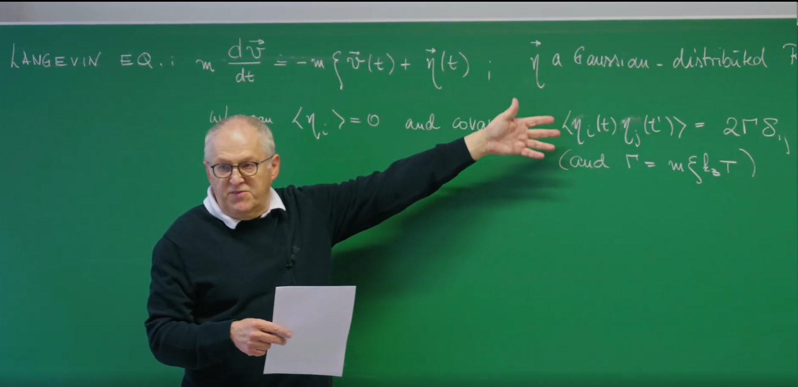
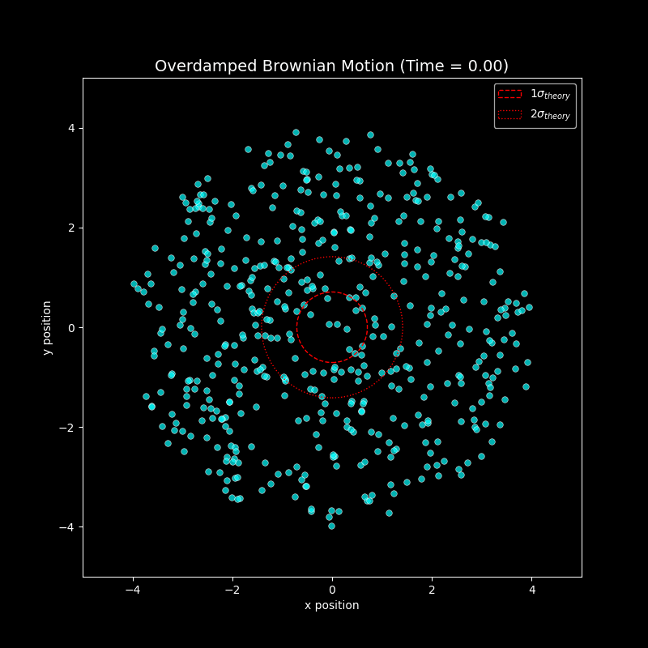
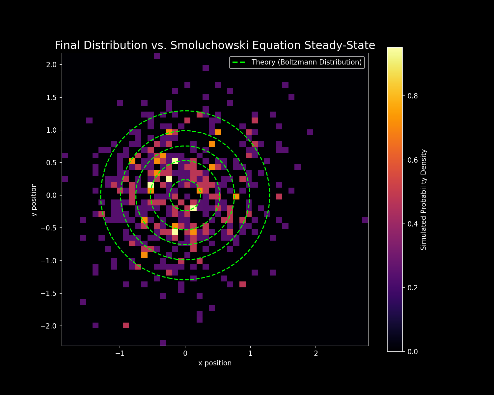

# 引言

上一节课,Erwin Frey 教授引入了**朗之万方程(Langevin Equation),**它通过平衡两种力来描述单个布朗粒子的运动轨迹:一种是确定性的摩擦阻力,与粒子的速度成正比并反向;另一种是随机的、快速涨落的力,代表了粒子与周围溶剂分子的持续碰撞。这种描述方式为我们提供了一个基于微观、追踪单一粒子轨迹的视角。



这节课将从描述一个特定、随机的粒子路径,转向描述一个由大量非相互作用粒子组成的系综的**概率分布**如何随时间演化。这是一个从描述单个粒子轨迹的随机常微分方程(Stochastic Ordinary Differential Equation, SDE)到描述概率密度本身的确定性偏微分方程(Partial Differential Equation, PDE)的转变。这个新的方程,就是之前介绍过的——**福克-普朗克方程(Fokker-Planck Equation, FPE)**。

朗之万方程包含一个随机变量项 $\eta(t)$,这使得它的任何一个解(即一条轨迹)都是不可预测的。然而,通过对这个噪声的统计性质进行平均,我们可以推导出一个完全确定性的、描述概率分布 $p(v,t)$ 的演化方程。这个过程展示了统计力学中的一个核心原理:**宏观量(如概率分布)的确定性、可预测的规律是如何从其背后混乱、随机的微观动力学中涌现出来的。**福克-普朗克方程虽然不能预测单个粒子的具体路径,但它能够精确地预测由无数可能性构成的"**概率云**"是如何随时间演变的。**这体现了统计平均如何"洗去"微观的随机性,从而揭示出宏观的确定性**,这是连接力学与热力学的基石。

# 1. 速度的福克-普朗克方程

## 1.1 起点:速度空间中的朗之万方程

我们从描述一个自由布朗粒子速度 $v$ 的朗之万方程开始:

$$
m\frac{dv}{dt} = -m\xi v(t) + \eta(t)
$$

让我们对这个方程的各项进行物理分析:

* $m\frac{dv}{dt}$:惯性项,即牛顿第二定律中的质量乘以加速度。

* $-m\xi v(t)$:摩擦阻力或阻尼力,其方向总是与运动方向相反。这里的 $\xi$ 是单位质量的摩擦系数。

* $\eta(t)$:随机力,代表了来自周围流体分子的持续、随机的碰撞。

随机力 $\eta(t)$ 的统计性质至关重要。它被建模为一个高斯分布的随机变量,并具有以下特性:

* **零均值**:$\langle\eta_i(t)\rangle=0$。这表明从平均意义上看,随机的碰撞在任何方向上都没有偏好。

* **Delta相关的协方差(白噪声)**:$\langle\eta_i(t)\eta_j(t')\rangle=2\Gamma\delta_{ij}\delta(t-t')$。这是对热涨落的数学理想化描述。狄拉克 $\delta(t-t')$ 函数意味着在任何一个时刻的力与任何其他时刻的力都是完全不相关的,无论这两个时刻相距多近。这些涨落的强度由 $\Gamma$ 决定。

在这里,$\Gamma$ 的表达式为 $\Gamma=m\xi k_B T$。这是一个源自上一讲的深刻结果,它正是**涨落-耗散定理(Fluctuation-Dissipation Theorem)**的一种体现。该定理将随机涨落的幅度(由 $\Gamma$ 描述)与系统的能量耗散(由摩擦 $\xi$ 描述)以及热浴的温度($T$)联系在了一起。这种联系并非巧合,而是系统能够最终达到热平衡的必要条件。

## 1.2 动力学的离散化

为了分析速度变化的统计特性,我们将朗之万方程在一个微小的时间步长 $\Delta t$ 上进行离散化。这使得微分方程转变为一个更新规则:

$$
m\frac{\Delta v}{\Delta t} = -m\xi v(t)\Delta t + \Delta W(t,\Delta t)
$$

我们定义"噪声增量"(Noise Increment)$\Delta W$ 为随机力在这个微小时间间隔内的积分:

$$
\Delta W(t,\Delta t) := \int_t^{t+\Delta t} d\tau \eta(\tau)
$$

这个量代表了在 $\Delta t$ 时间内,粒子受到的净随机冲量。

利用 $\eta(t)$ 的统计性质,我们可以推导出 $\Delta W$ 的均值和协方差:

* **均值**:$\langle\Delta W_i\rangle = \int_t^{t+\Delta t} d\tau \langle\eta_i(\tau)\rangle = 0$。

* **协方差**:根据视频中的关键计算:

$$
\langle\Delta W_k \Delta W_j\rangle = \int_t^{t+\Delta t} d\tau \int_t^{t+\Delta t} d\tau' \langle\eta_k(\tau)\eta_j(\tau')\rangle = 2m\xi k_B T \delta_{kj} \Delta t
$$

噪声增量的方差 $\langle(\Delta W)^2\rangle$ 与 $\Delta t$ 成正比,而不是与 $(\Delta t)^2$ 成正比,这是理解随机过程的关键。一个标准的确定性过程,其位移与 $\Delta t$ 成正比,位移的平方则与 $(\Delta t)^2$ 成正比。然而,积分噪声的方差与 $\Delta t$ 的线性关系是噪声 $\eta(t)$ 具有Delta相关性(白噪声)的直接后果。这一数学特性正是布朗运动中位移与时间的平方根 $\sqrt{t}$ 成正比这一特征的根源,这也是随机积分与普通积分的本质区别。

## 1.3 推导福克-普朗克方程的系数

现在,我们引入漂移(drift)系数 $A_i$ 和扩散(diffusion)系数 $B_{ij}$ 的概念,它们分别定义为单位时间内速度变化的一阶矩和二阶矩。这两个系数是构建福克-普朗克方程的基石。

### 漂移系数 $A_i$ (代表"推力")

* **定义**:$A_i = \lim_{\Delta t \to 0} \frac{\langle\Delta v_i\rangle}{\Delta t}$。它代表了粒子速度所经历的平均的、确定性的"漂移"或"推力"。

* **推导**:根据视频,我们对离散化的 $\Delta v_i$ 方程取平均:

$$
\langle\Delta v_i\rangle = \langle -\xi v_i \Delta t + \frac{\Delta W_i}{m}\rangle = -\xi v_i \Delta t
$$

这是因为噪声增量的平均值为零,即 $\langle\Delta W_i\rangle=0$。

* **结果**:$A_i = -\xi v_i$。这个结果的物理意义非常明确:速度的平均漂移完全由摩擦力引起,而摩擦力总是试图减小速度,将其推向零。

### 扩散系数 $B_{ij}$ (代表"扩散")

* **定义**:$B_{ij} = \lim_{\Delta t \to 0} \frac{\langle\Delta v_i \Delta v_j\rangle}{\Delta t}$。它代表了速度涨落的方差,量化了由于随机力的作用,概率分布在速度空间中"扩散开来"的程度。

* **推导**:我们遵循课程中的计算,在 $\Delta t \to 0$ 的极限下只保留 $\Delta t$ 的最低阶项:

$$
\langle\Delta v_i \Delta v_j\rangle = \langle(-\xi v_i \Delta t + \frac{\Delta W_i}{m})(-\xi v_j \Delta t + \frac{\Delta W_j}{m})\rangle \approx \frac{1}{m^2}\langle\Delta W_i \Delta W_j\rangle
$$

在取极限的过程中,与 $(\Delta t)^2$ 和 $\Delta t\langle\Delta W\rangle$ 相关的项都将消失。

* **结果**:$B_{ij} = \frac{1}{\Delta t} \frac{1}{m^2}(2m\xi k_B T \delta_{ij} \Delta t) = \frac{2k_B T \xi}{m} \delta_{ij}$。这个结果表明,在速度空间中的扩散是恒定的,并且其强度正比于环境的温度。

## 1.4 速度的福克-普朗克方程

现在,我们将推导出的系数代入福克-普朗克方程的一般形式:

$$
\partial_t p = -\sum_i \partial_{v_i} (A_i p) + \frac{1}{2} \sum_{i,j} \partial_{v_i} \partial_{v_j} (B_{ij} p)
$$

代入我们得到的 $A_i$ 和 $B_{ij}$,便可得到速度分布 $p(v,t)$ 的福克-普朗克方程:

$$
\partial_t p(v, t) = \nabla_v \cdot [\xi v p(v, t)] + \frac{k_B T \xi}{m} \nabla_v^2 p(v, t)
$$

这个方程在物理上可以被理解为一个概率的连续性方程。等式右边的第一项是**漂移项**,描述了概率分布如何被摩擦力系统性地拖拽向速度为零的中心。第二项是**扩散项**,描述了随机力如何导致概率分布向外扩散开来。

## 1.5 平衡态:重现热力学

当时间足够长($t \to \infty$)时,系统将达到平衡,此时概率分布不再随时间变化,即达到稳态:$\partial_t p = 0$。这意味着由漂移和扩散引起的概率流必须完全相互抵消。

这个稳态方程的解为:

$$
p_{eq}(v) \propto \exp\left(-\frac{mv^2}{2k_B T}\right)
$$

这是一个极其深刻的结果。我们从一个纯粹的动力学模型(朗之万方程)出发,这个模型本身对统计系综或热力学一无所知。通过推导并求解福克-普朗克方程,我们证明了这个动力学模型必然会导致速度的**麦克斯韦-玻尔兹曼分布(Maxwell-Boltzmann distribution),**而这正是平衡态统计力学的基石。朗之万方程描述了原因(摩擦和随机碰撞),福克-普朗克方程描述了过程(概率的漂移和扩散),而麦克斯韦-玻尔兹曼分布则是最终的结果(唯一、稳定的平衡态)。**福克-普朗克方程为我们揭示了一个系统如何通过与环境的相互作用(摩擦和涨落)进行热化,并最终达到其热力学所预言的平衡态的具体动力学机制。**在这个过程中,涨落-耗散定理($\Gamma \propto \xi T$)是保证系统能够达到正确平衡态的关键。没有它,漂移和扩散之间的平衡将被打破,系统也就不会弛豫到由温度 $T$ 所决定的正确状态。

# 2. 过阻尼极限与斯摩棱霍夫斯基方程

## 2.1 高摩擦环境:忽略惯性

现在,我们将研究的系统从自由粒子扩展到在一个势场 $U(x)$ 中运动的粒子。其完整的朗之万方程为:

$$
m\frac{d^2x}{dt^2} + m\xi\frac{dx}{dt} = -\nabla U(x) + \eta(t)
$$

我们可以清楚地识别出方程中的各项:惯性项、阻尼项、保守力项和随机力项。

在许多物理和生物系统中,例如水中的胶体颗粒或细胞质中的蛋白质,阻尼力($m\xi\frac{dx}{dt}$)与惯性项($m\frac{d^2x}{dt^2}$)相比是巨大的。在这种"过阻尼"(overdamped)或"高摩擦"的极限下,粒子的动量会因频繁的碰撞而被迅速随机化,以至于其速度能够瞬时地适应局域的力场。

这种近似是**时间尺度分离(timescale separation)**的一个典型例子。速度 $v$ 是一个"快变量",它在 $1/\xi$ 这样一个极短的时间尺度上就弛豫到了其准稳态值。而位置 $x$ 是一个"慢变量",它在更长的时间尺度上发生变化。通过假设快变量瞬时达到平衡,我们可以为慢变量推导出一个更简单的有效运动方程。换句话说,在过阻尼极限下,我们不再关心速度 $v$ 围绕其平衡值的快速涨落,只关心由此导致的粒子位置 $x$ 的缓慢演化。

通过将惯性项 $m\frac{d^2x}{dt^2}$ 设为零,我们得到了过阻尼朗之万方程,也称为斯摩棱霍夫斯基朗之万方程:

$$
m\xi\frac{dx}{dt} = -\nabla U(x) + \eta(t)
$$

## 2.2 迁移率、扩散与爱因斯坦关系

我们可以将上述方程重新整理成一个更标准的形式:

$$
\frac{dx}{dt} = -\frac{1}{m\xi}\nabla U(x) + \frac{1}{m\xi}\eta(t) = -\mu\nabla U(x) + \xi(t)
$$

在这里,我们定义了**迁移率(mobility)** $\mu := \frac{1}{m\xi}$。它代表了单位外力作用下粒子所能达到的终端速度。

新的噪声项 $\xi(t) = \frac{1}{m\xi}\eta(t)$ 具有新的统计性质。其协方差为:

$$
\langle\xi_i(t)\xi_j(t')\rangle = \frac{\langle\eta_i(t)\eta_j(t')\rangle}{(m\xi)^2} = \frac{2m\xi k_B T}{(m\xi)^2} \delta_{ij}\delta(t-t') = 2\mu k_B T \delta_{ij}\delta(t-t')
$$


通常,我们通过噪声强度来定义扩散系数 $D$:$\langle\xi_i(t)\xi_j(t')\rangle = 2D\delta_{ij}\delta(t-t')$。通过比较这两个表达式,我们得到了著名的**爱因斯坦关系(Einstein Relation)**:

$$
D = \mu k_B T
$$

这个关系式意义非凡,它将一个宏观的输运系数($D$,描述粒子扩散的速度)与微观上粒子对力的响应($\mu$)以及热能($k_B T$)联系了起来。

**爱因斯坦关系(Einstein Relation)** $D = \mu k_B T$ 的提出源于1905年爱因斯坦对布朗运动的理论研究,以及Marian Smoluchowski在1906年的独立推导。其核心思想是:粒子在热平衡下的随机运动(扩散)与外部力场驱动的定向运动(迁移)受同一热力学量 $k_B T$ 调控。这一公式不仅是涨落-耗散定理的早期体现,还为后续研究提供了理论基石。爱因斯坦关系将微观涨落与宏观响应统一,成为连接统计物理与工程应用的关键桥梁。


## 2.3 斯摩棱霍夫斯基方程

现在,我们重复福克-普朗克方程的推导过程,但这次是针对位置变量 $x$,并使用过阻尼朗之万方程。

* **漂移系数 $A_i$:**

$$
A_i = \lim_{\Delta t \to 0} \frac{\langle\Delta x_i\rangle}{\Delta t} = \langle-\mu \partial_i U\rangle = -\mu \partial_i U = \mu F_i
$$

此时的漂移是由保守力 $F = -\nabla U$ 决定的。

* **扩散系数 $B_{ij}$:**

$$
B_{ij} = \lim_{\Delta t \to 0} \frac{\langle \Delta x_i \Delta x_j \rangle}{\Delta t} = \frac{1}{\Delta t} \langle (\Delta W_\xi)_i (\Delta W_\xi)_j \rangle = 2D \delta_{ij}
$$

在位置空间中的扩散是恒定的(如果$D$是常数),其大小由扩散系数 $D$ 给出。

将这些系数组合起来,我们就得到了描述位置概率分布 $P(x,t)$ 的**斯摩棱霍夫斯基方程(Smoluchowski Equation)**,它正是位置空间的福克-普朗克方程:

$$
\partial_t P(x, t) = \nabla \cdot [\mu(\nabla U)P(x, t)] + D\nabla^2 P(x, t)
$$

这个方程也可以写作 $\partial_t P = \nabla \cdot [\mu(\nabla U)P + D\nabla P]$。

## 2.4 势场中的平衡态

与之前一样,我们通过设置 $\partial_t P = 0$ 来求解稳态解。这意味着散度项内部的概率流在稳态时必须为零(假设在无穷远处概率流为零)。

这个条件的解为:

$$
P_{eq}(x) \propto \exp\left(-\frac{\mu}{D}U(x)\right)
$$

利用我们刚刚得到的爱因斯坦关系 $D = \mu k_B T$,可以得到 $\frac{\mu}{D} = \frac{1}{k_B T}$。代入上式,我们便得到了本讲的第二个主要结果:

$$
P_{eq}(x) \propto \exp\left(-\frac{U(x)}{k_B T}\right)
$$

这就是**玻尔兹曼分布(Boltzmann distribution),**它是正则系综统计力学的基本假设。斯摩棱霍夫斯基方程为玻尔兹曼分布提供了动力学上的合理解释。它告诉我们,一个与温度为 $T$ 的热浴接触的系统,之所以会以玻尔兹曼因子给出的概率来探索一个势能景观 $U(x)$,是因为存在一个精确的平衡:势场 $U(x)$ 产生了一个使粒子趋向能量最小处的漂移,而强度与温度成正比的热噪声 $D$ 则产生了一个使粒子能够逃离势阱、探索整个相空间的扩散。爱因斯坦关系恰好是保证这种能量最小化漂移与熵最大化扩散之间达到平衡,并产生正确的玻尔兹曼统计的精确条件。

玻尔兹曼分布 $P_{\text{eq}}(x) \propto \exp\left(-\frac{U(x)}{k_B T}\right)$ 是统计力学的基石性结果,其重要性远超单一物理模型。它由路德维希·玻尔兹曼在1870年代提出,通过将麦克斯韦气体分子速度分布推广至能量空间,首次为热力学第二定律提供了**微观动力学基础——系统趋向熵最大化的状态,本质上是概率分布由能量主导的平衡结果。**1902年,约西亚·吉布斯在系综理论中将其形式化为正则系综,奠定了现代统计物理的数学框架;1905年,爱因斯坦通过布朗运动的涨落-耗散定理($D = \mu k_B T$)从动力学角度严格验证了该分布的普适性,揭示了能量最小化漂移与熵最大化扩散的精确平衡机制。

在应用层面,玻尔兹曼分布已渗透至多学科:在**化学**中,它解释了阿伦尼乌斯方程的温度依赖性,用于计算反应速率和平衡常数;在**材料科学**中,它描述了晶体中缺陷(如空位、位错)的浓度分布,指导半导体掺杂设计;在**生物物理学**中,它成为蛋白质折叠能量景观的核心模型,预测了酶活性位点的构象概率;在**信息科学**中,玻尔兹曼机(Boltzmann machine)利用其概率结构开发了深度学习算法。更深远的是,它为量子统计(如费米-狄拉克和玻色-爱因斯坦分布的高温极限)提供了统一框架,并在宇宙学中用于分析星系团的暗物质分布。


### 总结:速度空间与位置空间福克-普朗克系统的对比

为了更好地理解本讲的两个核心部分,下表将它们并列进行比较,突出它们在数学结构上的相似性以及在物理变量和解释上的差异。


| 特征 | 第一部分:速度空间| 第二部分:位置空间(过阻尼)|
|----------------|----------------|--------------|
| 相关变量| 速度 $v(t)$ | 位置 $x(t)$|
| 朗之万方程| $m\dot{v} = -m\xi v + \eta(t)$| $\dot{x} = -\mu\nabla U + \xi(t)$|
| 漂移系数| $A_i = -\xi v_i$ | $A_i = -\mu\partial_i U$|
| 扩散系数 | $B_{ij} = \frac{2k_B T\xi}{m}\delta_{ij}$|$B_{ij} = 2D\delta_{ij}$|
| 福克-普朗克方程|$\partial_t p = \nabla_v \cdot (\xi vp) + \frac{k_B T\xi}{m}\nabla_v^2 p$|$\partial_t P = \nabla \cdot (\mu(\nabla U)P) + D\nabla^2 P$ |
| 平衡解| 麦克斯韦-玻尔兹曼分布| 玻尔兹曼分布|
| 物理意义| 动能的热化| 在势场中的空间排布|


# 3. 可视化斯摩棱霍夫斯基过程

案例部分,我们将通过Python代码来模拟多个粒子在二维势阱中的过阻尼布朗运动,并将其制作成动画。

## 3.1 数值挑战:求解随机微分方程

对于普通的常微分方程(ODE),我们可以使用简单的欧拉法 $x_{n+1} = x_n + f(x_n)\Delta t$ 进行数值求解。然而,对于随机微分方程(SDE),这种朴素的方法是错误的,因为它没有正确地处理随机项的标度关系。

正确的、也是最简单的数值求解SDE的格式是**欧拉-丸山法(Euler-Maruyama method)**。对于一个形如 $dX = a(X)dt + b(X)dW$ 的SDE,其更新规则为:

$$
X_{n+1} = X_n + a(X_n)\Delta t + b(X_n)\sqrt{\Delta t} \cdot \mathcal{N}(0,1)
$$

其中 $\mathcal{N}(0,1)$ 是一个从均值为0、方差为1的标准正态分布中抽取的随机数。

这里的关键区别在于随机增量项,它与 $\sqrt{\Delta t}$ 成正比,而不是 $\Delta t$。这直接反映了我们之前从理论上推导出的结论:噪声增量的方差与 $\Delta t$ 成正比。欧拉-丸山法正是这一理论结果在数值计算上的直接应用。

## 3.2 系统设置:二维谐振子势阱中的粒子

我们将模拟多个非相互作用粒子在二维空间中的过阻尼朗之万动力学。

* **势场模型**:为了清晰地展示概念,我们选择一个简单的二维谐振子势阱,其势能函数为 $U(x,y) = \frac{1}{2}k(x^2+y^2)$。这是一个中心的束缚势,它产生的力为 $F = -\nabla U = -kr$,总是指向原点。

* **离散化方程**:将欧拉-丸山法应用于我们的二维系统,可以得到每个时间步的更新规则:

$$
x_{n+1} = x_n - \mu k x_n \Delta t + \sqrt{2D \Delta t} \cdot \mathcal{N}_x(0,1)
$$

$$
y_{n+1} = y_n - \mu k y_n \Delta t + \sqrt{2D \Delta t} \cdot \mathcal{N}_y(0,1)
$$

其中 $\mathcal{N}_x$ 和 $\mathcal{N}_y$ 是两个独立的标准正态随机数。

* **模拟参数**:在代码中,我们将定义必要的参数,包括粒子数量 `num_particles`、迁移率 `mu`、势阱强度 `k`、扩散系数 `D`(它通过爱因斯坦关系与温度 `kBT` 相关)、时间步长 `dt` 以及总模拟步数 `num_steps`。

## 3.3 Python代码实现与可视化

下面的Python代码将实现上述模拟过程,并生成一个GIF动画,展示粒子系综的演化。

```python
import numpy as np
import matplotlib.pyplot as plt
import os
import imageio

# --- 0. Set plotting style ---
plt.style.use('dark_background')

# --- 1. Simulation parameter definition ---
num_particles = 500      # Increase number of particles for better statistics
k = 1.0                  # Harmonic oscillator potential strength (U = 0.5*k*r^2)
kBT = 0.5                # Thermal energy, k_B * T
mu = 1.0                 # Mobility
# Core relationship: Diffusion coefficient determined by fluctuation-dissipation theorem (Einstein relation)
D = mu * kBT             

dt = 0.01                # Time step
num_steps = 1000         # Total simulation steps
simulation_time = dt * num_steps

# --- 2. Initialize particle positions ---
# Initially distribute particles randomly within a disk
initial_radius = 4.0
theta = np.random.uniform(0, 2 * np.pi, num_particles)
r = np.sqrt(np.random.uniform(0, initial_radius**2, num_particles))
positions = np.zeros((num_particles, 2))
positions[:, 0] = r * np.cos(theta)
positions[:, 1] = r * np.sin(theta)

# --- 3. Simulation main loop and GIF generation ---
fig, ax = plt.subplots(figsize=(8, 8))
ax.set_aspect('equal')

# Prepare folder to store image frames
output_folder = 'brownian_motion_frames'
if not os.path.exists(output_folder):
    os.makedirs(output_folder)

# Pre-calculate coefficient for random term
noise_strength = np.sqrt(2 * D * dt)

# Store filenames for each frame
frame_files = []

print("Starting to generate GIF animation frames...")
# Simulation loop
for step in range(num_steps):
    # This is the numerical solution of the overdamped Langevin equation (Euler-Maruyama method).
    # This equation describes the trajectory of individual particles, and is the microscopic basis of the Fokker-Planck (Smoluchowski) equation.
    
    # Calculate drift term (from harmonic oscillator potential F = -k*r)
    drift = -mu * k * positions * dt
    
    # Calculate random term (diffusion)
    noise = noise_strength * np.random.randn(num_particles, 2)
    
    # Update positions of all particles
    positions += drift + noise
    
    # Save a frame image every few steps to create GIF
    if step % 10 == 0:
        ax.clear()
        # Use brighter colors to adapt to black background
        ax.scatter(positions[:, 0], positions[:, 1], alpha=0.7, c='cyan', edgecolors='w', s=30, linewidths=0.5)
        ax.set_xlim(-5, 5)
        ax.set_ylim(-5, 5)
        ax.set_title(f"Overdamped Brownian Motion (Time = {step*dt:.2f})", fontsize=14)
        ax.set_xlabel("x position")
        ax.set_ylabel("y position")
        
        # Plot contour lines of theoretical equilibrium distribution
        # Theoretical standard deviation sigma^2 = kBT/k
        sigma_theory = np.sqrt(kBT / k)
        circle1 = plt.Circle((0, 0), sigma_theory, color='r', fill=False, linestyle='--', label=r'$1\sigma_{theory}$')
        circle2 = plt.Circle((0, 0), 2*sigma_theory, color='r', fill=False, linestyle=':', label=r'$2\sigma_{theory}$')
        ax.add_artist(circle1)
        ax.add_artist(circle2)
        ax.legend()
        
        filename = os.path.join(output_folder, f'frame_{step//10:04d}.png')
        plt.savefig(filename)
        frame_files.append(filename)

plt.close(fig)
print(f"Generated {len(frame_files)} image frames.")

# --- 4. Use imageio to combine image frames into GIF ---
print("Combining image frames into GIF...")
gif_path = 'overdamped_brownian_motion_dark.gif'
with imageio.get_writer(gif_path, mode='I', fps=20, loop=0) as writer:
    for filename in frame_files:
        image = imageio.imread(filename)
        writer.append_data(image)

print(f"GIF saved as '{gif_path}'")

# Clean up temporary image files
for filename in frame_files:
    os.remove(filename)
os.rmdir(output_folder)
print("Cleaned up temporary image files.")


# --- 5. Final distribution analysis: Comparison of simulation results with steady-state solution of Smoluchowski equation ---
print("Plotting final probability distribution...")
fig_dist, ax_dist = plt.subplots(figsize=(10, 8))

# Plot 2D histogram (heatmap) of simulation results
# This represents the particle probability distribution P(x, y) obtained from Langevin dynamics simulation
counts, xedges, yedges, im = ax_dist.hist2d(
    positions[:, 0], positions[:, 1], 
    bins=50, density=True, cmap='inferno'
)
fig_dist.colorbar(im, ax=ax_dist, label='Simulated Probability Density')

# Calculate and plot theoretical steady-state solution
# The steady-state solution of the Smoluchowski equation is the Boltzmann distribution: P(x, y) ~ exp(-U(x,y)/kBT)
# For harmonic oscillator potential U = 0.5*k*(x^2+y^2), this is a 2D Gaussian distribution
sigma_theory = np.sqrt(kBT / k)
x = np.linspace(-5, 5, 100)
y = np.linspace(-5, 5, 100)
X, Y = np.meshgrid(x, y)
Z = (1.0 / (2 * np.pi * sigma_theory**2)) * np.exp(-(X**2 + Y**2) / (2 * sigma_theory**2))

# Overlay theoretical solution as contour lines on heatmap
ax_dist.contour(X, Y, Z, levels=5, colors='lime', linewidths=1.5, linestyles='--')

# Set chart title and labels
ax_dist.set_title("Final Distribution vs. Smoluchowski Equation Steady-State", fontsize=16)
ax_dist.set_xlabel("x position")
ax.set_aspect('equal')
ax_dist.set_ylabel("y position")

# Create a fake line object for legend
from matplotlib.lines import Line2D
legend_elements = [Line2D([0], [0], color='lime', lw=2, linestyle='--', label='Theory (Boltzmann Distribution)')]
ax_dist.legend(handles=legend_elements)
ax_dist.set_aspect('equal', 'box')

final_dist_path = 'final_distribution_comparison.png'
plt.savefig(final_dist_path, dpi=150)
print(f"Final distribution comparison plot saved as '{final_dist_path}'")
plt.show()
```




上图展示了粒子如何从一个较大的初始区域,在谐振子势的"吸引"和热噪声的"扰动"下,逐渐向中心聚集,最终在一个核心区域内动态平衡的过程。




上图是由模拟结束时所有500个粒子的最终位置生成的二维直方图,代表了实验或模拟测量出的粒子概率密度。叠加在热力图上的是几圈平滑的绿色虚线同心圆。这代表了理论预测。它是根据斯莫鲁霍夫斯基方程的稳态解——玻尔兹曼分布 $P_{\text{eq}}(x) \propto \exp\left(-\frac{U(x)}{k_B T}\right)$ ——精确计算出的二维高斯分布的等高线。基于单粒子轨迹的朗之万动力学(微观模拟),其长时间演化的统计结果(热力图),精确地收敛于福克-普朗克/斯莫鲁霍夫斯基方程所描述的概率分布的稳态解(绿色等高线)。


# 总结
这节课是在描述随机过程的两种基本视角之间建立了一座桥梁:一种是基于**粒子轨迹**的**朗之万方程 (L Langevin Equation)**,另一种是基于**概率分布演化**的**福克-普朗克方程 (Fokker-Planck Equation)。**这两种视角虽然在数学形式上截然不同——前者是随机微分方程,后者是确定性的偏微分方程——但它们描述的是同一个物理现实,并且在数学上是等价的。


1.  **从速度的随机游走到统计规律**:我们从一个布朗粒子的完整朗之万方程出发,它包含了惯性、摩擦力和随机力。通过分析速度在微小时间间隔内的变化(即计算其漂移和扩散系数),我们严格地推导出了描述速度概率分布 $p(v,t)$ 演化的福克-普朗克方程。这个方程的稳态解,不负众望地,正是热力学平衡态下的 **麦克斯韦-玻尔兹曼分布 (Maxwell-Boltzmann distribution)。**这验证了朗之万模型与统计力学基本原理的一致性。

2.  **高阻尼下的简化:斯莫鲁霍夫斯基方程**:在许多物理和生物系统中(如细胞内部),环境的粘性极强,导致粒子的惯性可以忽略不计。在这个**过阻尼极限 (overdamped limit)** 下,朗之万方程被大大简化,粒子的瞬时速度直接由作用在它上面的力决定。我们将推导福克-普朗克方程的数学工具再次应用于这个简化的、描述位置 $x$ 的朗之万方程上,得到了一个只关于位置概率密度 $P(x,t)$ 的演化方程——**斯莫鲁霍夫斯基方程 (Smoluchowski Equation)。**

3.  **势场中的平衡态**:斯莫鲁霍夫斯基方程描述了粒子在外部势场 $U(x)$ 中的扩散行为。它的稳态解是统计物理学中另一个基石性的结果——**玻尔兹曼分布 (Boltzmann distribution),**$P_{eq}(x) \propto e^{-U(x)/k_B T}$。这直观地告诉我们,在长时间演化后,粒子最有可能在势能低的地方被发现。我们的Python模拟生动地再现了这一过程:粒子系综如何在谐振子势阱中演化,并最终形成符合玻尔兹曼分布的构型。

贯穿整个推导过程的内在物理联系是**涨落-耗散定理 (Fluctuation-Dissipation Theorem),**在本讲中具体体现为**爱因斯坦关系** $D = \mu k_B T$。它深刻地揭示了驱动粒子随机运动的"涨落"(通过扩散系数 $D$ 体现)与系统抵抗运动并耗散能量的"耗散"(通过迁移率 $\mu$ 或摩擦系数 $\xi$ 体现)之间,必须由环境温度 $T$ 建立一个确定的比例关系,才能保证系统最终能够正确地达到热力学平衡。

