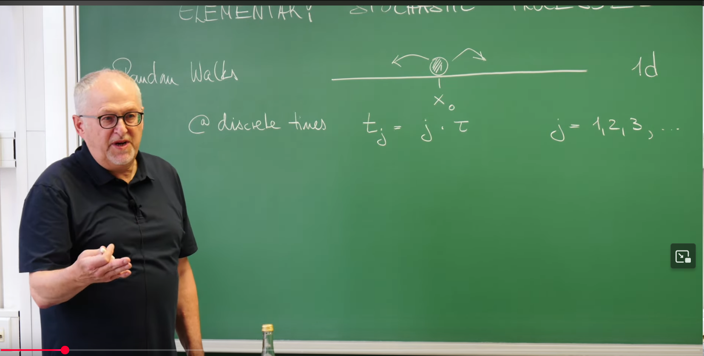
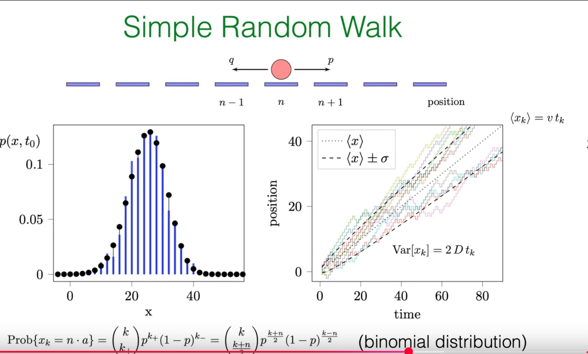
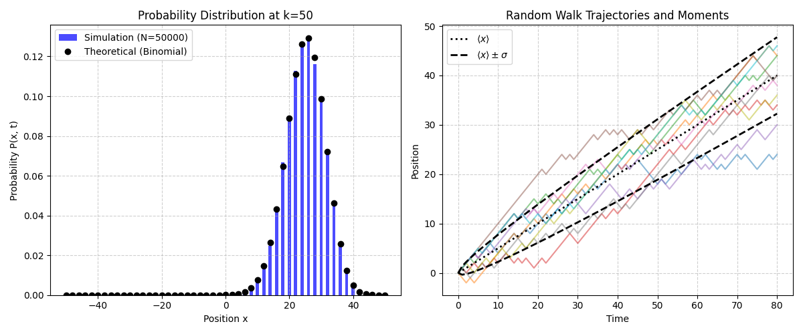

# 引言:从随机步到物理定律

随机过程(stochastic process)是描述那些随时间以概率方式演化的系统的数学框架。在众多随机过程中,随机游走(random walk)无疑是最典型、最基础的模型。它的应用无处不在,从细胞内分子的扩散,到金融市场中价格的波动,其基本思想都扮演着核心角色。本笔记旨在根据Erwin Frey教授的讲座内容,系统性地梳理和阐释一维简单随机游走模型。

## 定义随机游走

根据Frey教授在讲座伊始的板书,我们可以构建一维随机游走的基本模型。



**模型基本要素**:想象一个粒子(或称为"游走者")在一维的直线上运动。它的运动不是连续的,而是在离散的时间点 $t_k=k\tau$ 上发生跳跃,其中 $k=1,2,3,\ldots$ 是步数,$\tau$ 是每次跳跃的时间间隔。我们在任意时刻 $t_k$ 观察到的粒子位置,记为 $X_k$。

**核心随机变量:步长 $\xi_k$**:每次跳跃的位移,即步长 $\xi_k$,是一个随机变量。这个模型的关键假设是,所有的步长 $\xi_k$ 都是**独立同分布(Independent and Identically Distributed, IID)**的随机变量。"同分布"意味着每次跳跃都遵循相同的概率规则;"独立"意味着任何一步的结果都不会影响其他任何一步。

**离散步长与连续步长**:步长的分布可以是离散的,也可以是连续的。

**离散情况**:步长只能取有限个特定值。最简单的情况是,粒子每一步只能向右移动距离 $a$ 或向左移动距离 $a$。即 $\xi_k \in \{+a, -a\}$。向右的概率为 $p$,向左的概率为 $q$,且 $p+q=1$。这便是本讲座的核心——**简单随机游走(Simple Random Walk)**。

**连续情况**:步长可以取任意实数值,其概率由一个概率密度函数 $W(\xi)$ 描述,即步长落在 $[\xi, \xi+d\xi]$ 区间内的概率为 $W(\xi)d\xi$.

## 数学表述

该模型的动态演化可以用一个简单的递推关系来描述:

$$
X_k = X_{k-1} + \xi_k
$$
这个公式表达了模型"局部"的运动规则:新的位置等于旧的位置加上一个随机的步长。

如果我们假设粒子从原点出发,即 $X_0=0$,那么通过迭代展开上述递推关系,我们可以得到在第 $k$ 步时粒子位置的显式解:

$$
X_k = \sum_{j=1}^{k} \xi_j
$$
这个公式揭示了该模型最深刻的数学结构:我们所观察的宏观物理量(位置 $X_k$),本质上是大量微观、独立的随机变量(步长 $\xi_j$)的总和。正是这个"加和"的结构,使得我们可以运用强大的统计学工具,如大数定律和中心极限定理,来分析这个看似完全随机的过程,并从中发现确定性的、可预测的宏观规律。IID的假设是这一切分析的基石,它保证了过程的统计性质不随时间改变,从而允许我们推导出如漂移速度和扩散系数这类不依赖于时间的物理常数。

为了清晰起见,我们将模型中的关键变量和参数总结如下。

**表1:简单随机游走模型的关键变量与参数**

| 符号 | 描述 | 定义公式/值 |
| --- | --- | --- |
| $k$ | 步数 | 整数,$1, 2, 3, \ldots$ |
| $\tau$ | 时间步长 | 每次跳跃的持续时间 |
| $t_k$ | 物理时间 | $k\tau$ |
| $a$ | 步长大小 | 单步移动的固定距离 |
| $p$ | 向右跳跃的概率 | $P(\xi_k = +a)$ |
| $q$ | 向左跳跃的概率 | $P(\xi_k = -a), q = 1 - p$ |
| $\xi_k$ | 第 $k$ 步的步长 | 随机变量,取值为 $+a$ 或 $-a$ |
| $X_k$ | 第 $k$ 步后的位置 | $\sum_{j=1}^{k} \xi_j$ (假设 $X_0 = 0$) |
| $v$ | 漂移速度 | $\frac{a(p-q)}{\tau}$ |
| $D$ | 扩散系数 | $\frac{2a^2pq}{\tau}$ |


# 1. 统计平均与物理定律的涌现

对于一个随机过程,我们无法准确预测单次实验中游走者的确切位置。然而,通过分析大量此类过程的统计平均行为,我们可以提取出具有确定性的物理信息。我们不再问"粒子在哪里?",而是问"粒子**平均**在哪里?"以及"粒子的可能位置有多分散?"。这些问题可以通过计算随机变量的矩(如均值和方差)来回答。

## 1.1 平均位置:揭示漂移现象

我们首先计算经过 $k$ 步后,粒子位置的期望值(或均值),记为 $\langle X_k \rangle$。


* **推导过程**:

利用期望的线性性质,总位移的期望等于每一步位移期望的总和:

$$
\langle X_k \rangle = \left\langle \sum_{j=1}^{k} \xi_j \right\rangle = \sum_{j=1}^{k} \langle \xi_j \rangle
$$

计算单步位移的期望 $\langle \xi_j \rangle$。根据期望的定义,它等于所有可能取值与其对应概率的乘积之和:

$$
\langle \xi_j \rangle = (+a) \cdot P(\xi_j = a) + (-a) \cdot P(\xi_j = -a) = ap - aq = a(p-q)
$$

这个值代表了每一步的平均位移。

由于所有步长是同分布的,每一步的期望都相同。因此,总位移的期望为:

$$
\langle X_k \rangle = \sum_{j=1}^{k} a(p-q) = k \cdot a(p-q)
$$

* **物理诠释**:

这个数学结果告诉我们,粒子的平均位置与步数 $k$ 成正比。引入物理时间 $t_k = k\tau$,我们可以定义一个平均速度,即漂移速度(drift velocity) $v$:

$$
v = \frac{\langle X_k \rangle}{t_k} = \frac{k a(p-q)}{k\tau} = \frac{a(p-q)}{\tau}
$$

这意味着,尽管单个粒子的运动轨迹是曲折和不可预测的,但从整体上看,粒子群体仿佛以一个恒定的速度 $v$ 在进行定向运动。这种由概率不对称性引起的宏观定向运动,就是**漂移(drift)**。

* **对称与非对称游走**:

平均位置的表达式完全由 $(p-q)$ 这一项的性质决定。这揭示了模型行为的两种基本模式:

  1. **对称随机游走 $(p=q=1/2)$**:此时 $p-q=0$,因此 $\langle X_k \rangle = 0$。粒子向左和向右的概率相等,没有任何方向上的偏好。平均而言,粒子始终停留在原点附近。这是一种**纯扩散(pure diffusion)**过程。

  2. **有偏/非对称随机游走 $(p \neq q)$:**此时 $p-q \neq 0$,导致漂移速度不为零。粒子在平均意义上会朝着概率较大的方向移动。PPT幻灯片(Image 4)中,平均位置 $\langle x \rangle$ 随时间线性增加的虚线,清晰地描绘了一个 $p>q$ 的有偏随机游走。

因此,参数 $p$ 的取值将抽象的数学模型与具体的物理情景联系起来。一个在静止溶剂中扩散的染料分子可以用对称模型描述,而一个在外电场中运动的带电粒子(电泳)或在流动液体中悬浮的颗粒,则需要用有偏模型来描述。


## 1.2 方差:扩散现象的数学指纹

接下来,我们分析粒子位置的方差 $\mathrm{Var}[X_k]$,它衡量了粒子位置分布的离散程度或宽度。

* **推导过程**:

根据方差的定义:$\mathrm{Var}[X_k] = \langle X_k^2 \rangle - \langle X_k \rangle^2$。我们已经求得 $\langle X_k \rangle$,现在的任务是计算二阶矩 $\langle X_k^2 \rangle$。

展开 $X_k^2$:

$$
\langle X_k^2 \rangle = \left\langle \left( \sum_{j=1}^{k} \xi_j \right)^2 \right\rangle = \left\langle \left( \sum_{i=1}^{k} \xi_i \right) \left( \sum_{j=1}^{k} \xi_j \right) \right\rangle = \sum_{i=1}^{k} \sum_{j=1}^{k} \langle \xi_i \xi_j \rangle
$$

**关键步骤:分离对角项与非对角项**。这是求解过程中的一个核心技巧。我们将双重求和拆分为两部分:

* 对角项 $(i=j)$:$\sum_{j=1}^{k} \langle \xi_j^2 \rangle$

* 非对角项 $(i \neq j)$:$\sum_{i \neq j} \langle \xi_i \xi_j \rangle$

**应用IID性质**:

对于非对角项 $(i \neq j)$,由于步长 $\xi_i$ 和 $\xi_j$ 是相互独立的,它们的乘积的期望等于各自期望的乘积:

$$
\langle \xi_i \xi_j \rangle = \langle \xi_i \rangle \langle \xi_j \rangle = (a(p-q))^2
$$

对于对角项 $(i=j)$,我们计算步长平方的期望:

$$
\langle \xi_j^2 \rangle = (+a)^2 \cdot p + (-a)^2 \cdot q = a^2(p+q) = a^2
$$

**合并计算**:总共有 $k$ 个对角项和 $k(k-1)$ 个非对角项。因此,

$$
\langle X_k^2 \rangle = k \cdot a^2 + k(k-1) \cdot (a(p-q))^2
$$

**最终计算方差**:将 $\langle X_k^2 \rangle$ 和 $\langle X_k \rangle^2 = (ka(p-q))^2$ 代入方差定义式:


$$
\mathrm{Var}[X_k] = (k a^2 + k(k-1)a^2(p-q)^2) - (k a(p-q))^2
$$

$$
= k a^2 + (k^2-k)a^2(p-q)^2 - k^2 a^2(p-q)^2
$$

$$
= k a^2 - k a^2(p-q)^2 = k a^2 (1 - (p-q)^2)
$$


利用 $p+q=1$,我们有 $1-(p-q)^2 = (p+q)^2 - (p-q)^2 = 4pq$。所以最终得到:

$$
\mathrm{Var}[X_k] = 4k a^2 pq
$$

**物理诠释**:

这个结果最重要的特征是,方差与步数 $k$ 成正比,因此也与物理时间 $t_k$ 成正比。这种方差随时间线性增长的特性,正是**扩散过程(diffusive process)**的标志。

我们可以通过关系式 $\mathrm{Var}[X_k] = 2D t_k$ 来定义**扩散系数(diffusion coefficient)** $D$。通过比较我们推导出的结果,可以得到:

$$
2D = \frac{4k a^2 pq}{t_k} = \frac{4k a^2 pq}{k\tau} = \frac{4 a^2 pq}{\tau} \implies D = \frac{2 a^2 pq}{\tau}
$$

扩散系数 $D$ 是一个衡量随机扩散快慢的物理量。

**"不确定性的漏斗"与平方根标度**:

方差随时间线性增长($\mathrm{Var} \propto t$)的物理含义是,粒子位置分布的宽度,即标准差 $\sigma = \sqrt{\mathrm{Var}}$,是随时间的平方根增长的($\sigma \propto \sqrt{t}$)。这种亚线性(sub-linear)的增长方式是扩散过程的普适特征,它与弹道式运动(ballistic motion,位置 $x \propto t$)有着本质区别。PPT中由 $\langle x \rangle \pm \sigma$ 构成的锥形区域(或称为"不确定性的漏斗")正是这一基本标度律的绝佳可视化呈现。$\sqrt{t}$ 标度解释了为何扩散在微观尺度(如细胞内)是高效的,但在宏观尺度上却极其缓慢。




## 1.3 应用实例:大肠杆菌的随机游走

为了将抽象理论与真实世界联系起来,Frey教授在讲座中进行了一个估算,这在物理学中被称为"信封背后的计算"(back-of-the-envelope calculation),用以检验模型的合理性。

**问题**:一个分子要通过扩散穿过一个大肠杆菌细胞,大约需要多长时间?

**估算**:我们已知细胞尺寸 $L \approx 1\,\mu\mathrm{m}$,以及类似大小分子在细胞质中的扩散系数 $D \approx 10\,\mu\mathrm{m}^2/\mathrm{s}$。我们可以通过令位置分布的方差约等于距离的平方来估算特征时间 $t$,即 $L^2 \approx 2Dt$。

**计算**:

$$
t \approx \frac{L^2}{2D} \approx \frac{(1\,\mu\mathrm{m})^2}{2 \cdot (10\,\mu\mathrm{m}^2/\mathrm{s})} = 0.05\,\mathrm{s}
$$


**意义**:这个简单的计算展示了扩散系数 $D$ 作为一个关键物理参数的强大之处,它将微观的随机步履与宏观的扩散时间尺度联系起来,使我们能够对真实生物或化学系统进行定量预测。


# 2. 完整概率分布

均值和方差描述了分布的中心和宽度,但要获得关于粒子位置的全部信息,我们需要求解其完整的概率分布函数 $P(X_k=x)$。它回答了这样一个问题:"经过 $k$ 步后,在位置 $x$ 找到粒子的确切概率是多少?"

## 2.1 组合学方法:二项分布

我们可以通过组合学的方法来精确求解这个问题。

**问题设定**:假设粒子在 $k$ 步中,有 $k_+$ 步向右($+a$),有 $k_-$ 步向左($-a$)。那么总步数 $k = k_+ + k_-$。最终的位置为 $X_k = (k_+ - k_-)a$。为了方便,我们定义一个无量纲的位置 $n = k_+ - k_-$,则 $X_k = na$。

**推导过程**:

**求解 $k_+$ 和 $k_-$**:我们可以用已知的 $k$ 和 $n$ 来表示 $k_+$ 和 $k_-$:

$$
k_+ = \frac{k+n}{2}, k_- = \frac{k-n}{2}
$$

值得注意的是,为了使 $k_+$ 和 $k_-$ 为整数,$k$ 和 $n$ 必须具有相同的奇偶性(同为偶数或同为奇数),否则粒子不可能到达位置 $na$,其概率为零。

**计算单条路径的概率**:任何一条包含 $k_+$ 次向右和 $k_-$ 次向左的具体路径(例如"右-右-左-右-..."),由于每一步都是独立的,其发生的概率为:

$$
p^{k_+} q^{k_-} = p^{k_+} (1-p)^{k_-}
$$

**计算路径总数**:所有能够到达最终位置 $na$ 的不同路径有多少条?这是一个经典的组合问题:在 $k$ 个总位置中,选择 $k_+$ 个位置放置"向右的步",其方法数由二项式系数给出:

$$
\binom{k}{k_+} = \frac{k!}{k_+!(k-k_+)!} = \frac{k!}{k_+! k_-!}
$$

**最终结果**:将单条路径的概率与路径总数相乘,我们就得到了粒子在第 $k$ 步后位于位置 $na$ 的总概率,这正是**二项分布(Binomial Distribution)**:

$$
P(X_k = na) = \binom{k}{k_+} p^{k_+} (1-p)^{k_-}
$$


**微观态与宏观态的联系**:
这个公式的结构深刻地体现了统计力学的基本思想。每一个具体的步伐序列(如 RRLR...)是一个微观态(microstate)。而最终的净位移(如 $n=2$)是一个宏观态(macrostate)。公式表明,一个宏观态出现的概率,等于导致该宏观态的单个微观态的概率($p^{k_+} q^{k_-}$)乘以该宏观态的简并度或多重性($\binom{k}{k_+}$),即有多少个不同的微观态可以产生相同的宏观结果。最可能出现的宏观态,是那些对应最多微观路径的态。这里的组合系数,扮演了类似于"熵"的角色。


## 2.2 连续极限:高斯分布的涌现

二项分布是精确的,但当步数 $k$ 很大时,其计算会变得非常繁琐。在物理学中,我们常常更关心大量步骤后的宏观行为。

**中心极限定理(Central Limit Theorem, CLT)**:

教授的指出,当步数 $k$ 非常大时($k \gg 1$),二项分布可以近似为一个高斯分布(Gaussian Distribution),也称正态分布:

$$
P(n) \approx \frac{1}{\sqrt{2\pi \mathrm{Var}[n]}} \exp\left(-\frac{(n-\langle n \rangle)^2}{2\mathrm{Var}[n]}\right)
$$

这一转变不仅仅是数学上的近似(例如对阶乘使用斯特林公式),它是一个更深层次物理原理的体现——**中心极限定理**。该定理指出:大量独立同分布的随机变量之和(在我们的模型中即为 $X_k = \sum \xi_j$),其分布会趋向于一个高斯分布,而与单个随机变量自身的分布形式无关(在这里,单个步长的分布是一个简单的两点伯努利分布)。这解释了为什么在自然界中,凡是涉及大量随机因素累加的过程,其结果往往都呈现出高斯分布。

**高斯分布的参数**:

这个近似的高斯分布的均值和方差,恰好就是我们在第一小节中直接计算出的均值和方差。

**均值:**$\langle n \rangle = k(p-q)$,对应位置的均值为 $\langle X_k \rangle = a\langle n \rangle = ak(p-q)$。

**方差:**$\mathrm{Var}[n] = 4kpq$,对应位置的方差为 $\mathrm{Var}[X_k] = a^2\mathrm{Var}[n] = 4k a^2 pq$。

这完美地展示了模型的自洽性。通过直接计算矩得到的结果,与通过求解完整分布再取极限得到的结果完全一致。**这一过程清晰地展示了宏观的扩散定律(其解为高斯函数)是如何从微观的随机行走规则中"涌现"出来的。**


# 3. Python计算模拟与可视化

### 注：以下内容为作者学习课程后撰写,非讲座内容

理论分析为我们提供了深刻的洞见,而计算模拟则是物理学研究的"第三种方法",它能帮助我们建立直观的物理图像,并验证理论预测的正确性。

## 3.1 模拟算法

模拟单个随机游走轨迹的算法非常简单:

1. 初始化位置 $x=0$ 和时间 $t=0$。

2. 进行 $k$ 次循环。

3. 在每一步中,生成一个 $[0,1]$ 区间内的随机数。如果该数小于 $p$,则向右移动一步($x \leftarrow x+a$);否则向左移动一步($x \leftarrow x-a$)。

4. 记录每一步的位置。

要分析粒子群的整体行为,我们只需将上述过程重复执行 $N_{\text{walkers}}$ 次即可。

下面提供一段完整的Python代码,使用 `numpy` 和 `matplotlib` 库来模拟简单随机游走,并重现课程中PPT幻灯片中的两幅图。


```python
import numpy as np
import matplotlib.pyplot as plt
from scipy.special import comb

# --- Simulation parameters (inferred from PPT) ---
p = 0.75  # Probability of moving right
q = 1 - p # Probability of moving left
a = 1     # Step size
tau = 1   # Time interval

# --- Figure 1: Probability distribution (left plot) ---
num_steps_dist = 50       # Total number of steps
num_walkers_dist = 50000  # Number of simulated particles for statistical distribution

# Simulation
# Generate displacement for each step (+a or -a)
steps = np.random.choice([a, -a], size=(num_walkers_dist, num_steps_dist), p=[p, q])
# Calculate final position of each particle
final_positions = np.sum(steps, axis=1)

# Plot histogram of simulation results
plt.figure(figsize=(12, 5))
plt.subplot(1, 2, 1)
# Use bins to center on even or odd positions
bins = np.arange(final_positions.min(), final_positions.max() + 2) - 0.5
plt.hist(final_positions, bins=bins, density=True, color='blue', alpha=0.7, label=f'Simulation (N={num_walkers_dist})')

# Calculate and plot theoretical binomial distribution
n_values = np.arange(-num_steps_dist, num_steps_dist + 1, 2) # Possible final positions n = k+ - k-
k_plus = (num_steps_dist + n_values) / 2
prob_theory = comb(num_steps_dist, k_plus) * (p**k_plus) * (q**(num_steps_dist - k_plus))
plt.plot(n_values * a, prob_theory, 'ko', label='Theoretical (Binomial)')

plt.title(f'Probability Distribution at k={num_steps_dist}')
plt.xlabel('Position x')
plt.ylabel('Probability P(x, t)')
plt.legend()
plt.grid(True, linestyle='--', alpha=0.6)


# --- Figure 2: Trajectories and statistical moments (right plot) ---
num_steps_traj = 80       # Total number of steps
num_walkers_traj_show = 10 # Number of displayed trajectories
num_walkers_traj_stat = 2000 # Number of particles for calculating mean and variance statistics

# Simulation
steps_stat = np.random.choice([a, -a], size=(num_walkers_traj_stat, num_steps_traj), p=[p, q])
# Calculate position of each particle at each step (cumulative sum)
trajectories = np.cumsum(steps_stat, axis=1)
# Add initial position 0 before trajectories
trajectories = np.insert(trajectories, 0, 0, axis=1)

# Plotting
plt.subplot(1, 2, 2)
time_points = np.arange(num_steps_traj + 1) * tau

# Plot sample trajectories
for i in range(num_walkers_traj_show):
    plt.plot(time_points, trajectories[i, :], alpha=0.5)

# Calculate and plot statistical mean (from simulation)
mean_sim = np.mean(trajectories, axis=0)
# Calculate and plot theoretical mean
mean_theory = time_points * a * (p - q) / tau
plt.plot(time_points, mean_theory, 'k:', linewidth=2, label=r'$\langle x \rangle$')

# Calculate and plot theoretical standard deviation range
variance_theory = 4 * (time_points/tau) * (a**2) * p * q
std_theory = np.sqrt(variance_theory)
plt.plot(time_points, mean_theory + std_theory, 'k--', linewidth=2, label=r'$\langle x \rangle \pm \sigma$')
plt.plot(time_points, mean_theory - std_theory, 'k--', linewidth=2)


plt.title('Random Walk Trajectories and Moments')
plt.xlabel('Time')
plt.ylabel('Position')
plt.legend()
plt.grid(True, linestyle='--', alpha=0.6)

plt.tight_layout()
plt.show()
```


左侧的概率分布图,实际上等价于在右侧图中某个特定的时间点(例如 $t=50$)做一条"竖直切片",然后统计该时刻所有模拟粒子位置的分布情况。

# 总结:一个简单模型的强大力量

Erwin Frey教授的讲座以一个极其简单的模型为起点,带领我们领略了统计物理学的核心思想:**如何从微观世界的基本随机规则,推导出宏观世界中可观测到的、确定性的物理定律**。

我们看到,粒子位置的**均值随时间线性增长**($\langle X_k \rangle \propto t$),这是**漂移**的宏观表现;而其**方差也随时间线性增长**($\mathrm{Var}[X_k] \propto t$),这是**扩散**的普适特征。方差的线性增长等价于标准差随时间的**平方根增长**($\sigma_k \propto \sqrt{t}$),这是区分扩散与其他输运过程的关键标度律。

从定义最基本的随机步,到计算其统计矩,再到求解完整的概率分布并揭示其在高斯分布中的普适性,整个过程不仅是一次数学推导,更是一堂关于物理世界如何从无序中涌现出有序的精彩课程。简单随机游走模型虽简,却为我们理解更复杂的随机现象提供了坚实的基石和深刻的物理直觉。


