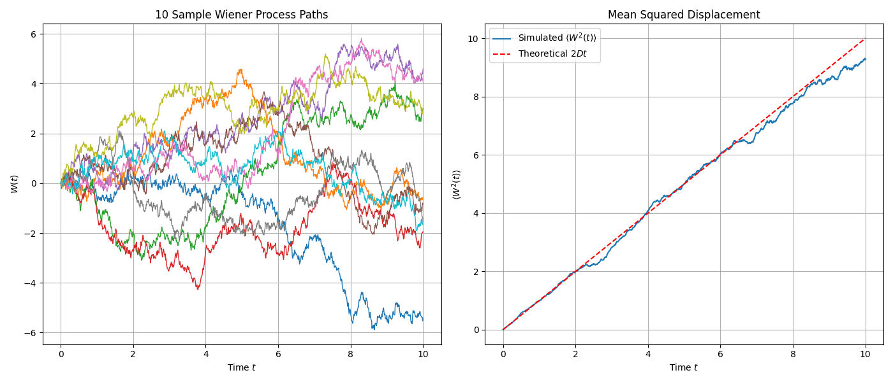
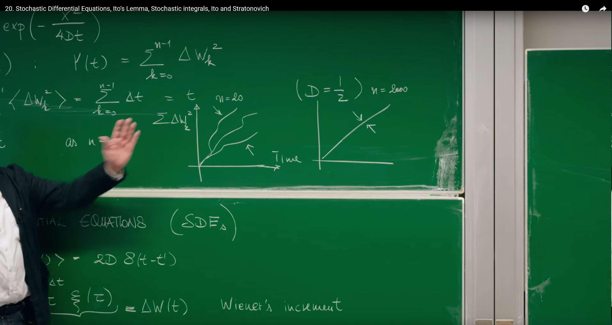
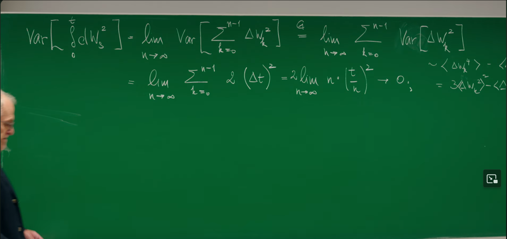
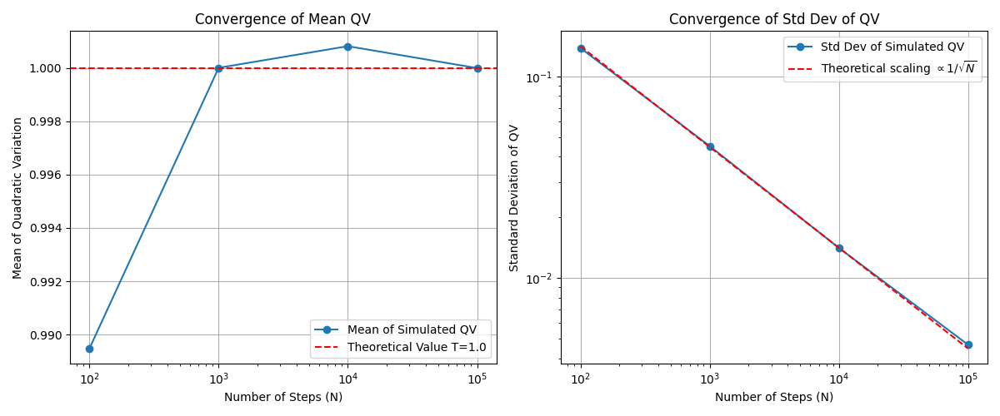
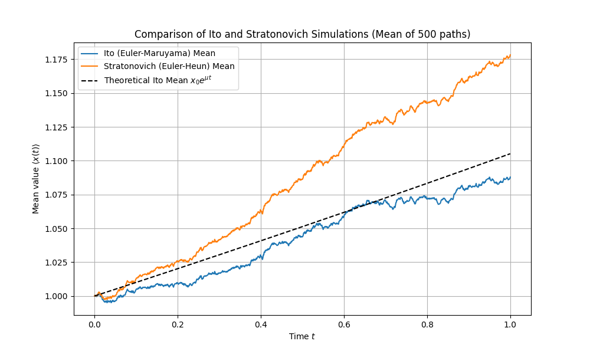

# 引言：从物理直觉到数学严谨

在前面的课程中（特别是第16讲），我们已经接触了描述布朗运动等随机现象的**朗之万方程**（Langevin Equation）。朗之万方程提供了一个非常直观的物理图像：一个粒子的运动由两部分决定，一部分是确定的、可预测的力（如摩擦力），另一部分则是由大量微观粒子碰撞产生的、快速涨落的随机力 $\xi(t)$ 。

这个随机力，即**白噪声**（white noise），通常被理想化地假设为在任意两个不同时刻都完全不相关。这种"无记忆"的特性在数学上通过狄拉克 $\delta$ 函数（Dirac delta function）来表达：

$$\langle\xi(t)\xi(t')\rangle=2D\delta(t-t')$$

然而，这种理想化处理虽然在物理上很有用，但在数学上却带来了麻烦。一个在任意时刻都与其他时刻不相关的"函数"必然充满了无穷大的尖峰，其方差无穷大，因此它并不是一个严格意义上的函数。直接对这样的对象进行微积分运算，会遇到严峻的数学挑战。

为了克服这一困难，数学家们发展出了一套全新的语言——**随机微分方程（Stochastic Differential Equations, SDEs）。**这不仅仅是符号上的改变，更是思想上的根本性飞跃。其核心思想是，**避开直接处理行为奇异的白噪声 $\xi(t)$，转而研究其积分。**白噪声的积分，即**维纳过程（Wiener Process）$W(t)$，**是一个行为良好、路径连续的随机过程。这节课的目的，就是建立这套严谨的数学工具，从而让我们能够精确地描述和分析由随机性驱动的物理、生物乃至金融系统。


# 1. 随机微分方程的语言

随机微分方程（SDEs）的发展历史源于对布朗运动的理论描述，法国物理学家保罗·朗之万在1908年首次提出朗之万方程，通过结合确定性的粘滞阻力与随机噪声力，为统计力学和随机过程研究奠定了基础。这一物理模型后来在数学上被进一步严谨化，特别是通过伊藤（Itô）和斯特拉托诺维奇（Stratonovich）等人发展出完善的随机积分理论，解决了如何正确处理随机变量微积分的难题。如今，SDEs的应用极为广泛：在金融领域，它是风险评估、股价波动模拟以及著名的布莱克-斯科尔斯方程的基础；在物理学中，它被用于布朗运动和分子动力学模拟；在生物学中，则应用于种群动力学和蛋白质折叠分析；此外，它还为化学中的反应速率建模以及机器学习中的随机梯度下降算法提供了理论框架。

## 1.1 维纳增量：捕捉随机性的基本单元

Erwin Frey 教授从最简单的随机微分方程入手，它描述了一个只受随机力驱动的粒子的运动：

$$\dot{x}=\xi(t)$$

这里的 $\xi(t)$ 就是我们之前讨论过的白噪声，其关联函数为 $\langle\xi(t)\xi(t')\rangle=2D\delta(t-t')$，其中 $D$ 是扩散系数。

为了在数学上处理这个方程，我们不直接求解 $\dot{x}$，而是考察在一个微小时间间隔 $\Delta t$ 内，粒子位置 $x$ 的变化量。通过对上式进行积分，我们得到：

$$x(t+\Delta t)-x(t)=\int_t^{t+\Delta t}d\tau\xi(\tau)\equiv\Delta W(t)$$

这个积分结果 $\Delta W(t)$ 被定义为维纳增量（Wiener's increment）。它的物理意义非常清晰：**在 $\Delta t$ 这段时间内，粒子受到周围介质分子的无数次、微小且独立的随机碰撞，$\Delta W(t)$ 就是这些碰撞效应累积产生的净位移。**

维纳增量具有两个至关重要的统计性质：

**1. 均方值（Mean Square）：**

我们可以直接计算 $\Delta W(t)$ 的平方的平均值：


$$
\langle\Delta W^2(t)\rangle=\langle\int_t^{t+\Delta t}d\tau\xi(\tau)\int_t^{t+\Delta t}d\tau'\xi(\tau')\rangle
$$
利用期望和积分可以互换顺序的性质，我们得到：


$$
\langle\Delta W^2(t)\rangle=\int_t^{t+\Delta t}d\tau\int_t^{t+\Delta t}d\tau'\langle\xi(\tau)\xi(\tau')\rangle
$$
代入白噪声的关联函数：


$$
\langle\Delta W^2(t)\rangle=\int_t^{t+\Delta t}d\tau\int_t^{t+\Delta t}d\tau'2D\delta(\tau-\tau')
$$


由于 $\delta$ 函数的性质，只有当 $\tau=\tau'$ 时积分才有值，因此对 $\tau'$ 的积分结果为1（只要积分区间包含 $\tau$）。最终得到：


$$
\langle\Delta W^2(t)\rangle=\int_t^{t+\Delta t}d\tau 2D=2D\Delta t
$$
 

这个结果 $\langle\Delta W^2(t)\rangle=2D\Delta t$ 是扩散过程的标志性特征：**均方位移与时间间隔成正比**，而不是与时间间隔的平方成正比（后者是匀速直线运动的特征）。这反映了随机运动的本质。

**2. 高斯分布（Gaussian Distribution）：**

由于维纳增量是大量独立随机碰撞效应的叠加，根据中心极限定理（Central Limit Theorem），无论单次碰撞的细节如何，它们的总和总是趋向于一个高斯（正态）分布。因此，$\Delta W(t)$ 的概率分布为：


$$
P(\Delta W(t)) = \frac{1}{\sqrt{4\pi D \Delta t}} \exp\left(-\frac{\Delta W(t)^2}{4D\Delta t}\right)
$$
这是一个均值为0，方差为 $2D\Delta t$ 的高斯分布。

## 1.2 随机积分与维纳过程

有了基本单元——**维纳增量**，我们就可以构建粒子在任意时刻 $t$ 的位置 $x(t)$。我们将时间 $[0,t]$ 分割成 $n$ 个微小的间隔 $\Delta t=t/n$，每个间隔对应一个独立的维纳增量 $\Delta W_k$。粒子的总位移就是这些增量的总和。当时间间隔趋于无穷小时（$n\to\infty$），这个求和就变成了积分：

$$x(t)=\lim_{n\to\infty}\sum_{k=0}^{n-1}\Delta W_k\equiv\int_0^t dW(s)$$

这个极限过程定义的积分被称为**随机积分（Stochastic Integral）。**而这个积分本身，作为一个关于时间 $t$ 的函数，就定义了**维纳过程**（Wiener Process）$W(t)$，它也被称为**布朗运动**（Brownian Motion）。

这种从离散的、独立的随机步（$\Delta W_k$）出发，通过极限构造出连续时间随机过程（$W(t)$）的方法，是连接离散随机游走和连续随机过程的桥梁。

维纳过程 $W(t)\equiv x(t)$ 的统计性质可以从其构成单元 $\Delta W_k$ 的性质中推导出来：

* **均方位移**：由于各个 $\Delta W_k$ 是独立同分布的（iid Gaussian），总位移平方的期望等于各个位移平方期望之和：
  $$
  \langle x^2(t)\rangle=\langle(\sum_{k=0}^{n-1}\Delta W_k)^2\rangle=\sum_{k=0}^{n-1}\langle\Delta W_k^2\rangle=\sum_{k=0}^{n-1}2D\Delta t=n\cdot(2D\frac{t}{n})=2Dt
  $$
  

* **概率分布**：同样根据中心极限定理，多个高斯随机变量的和仍然是高斯随机变量，其方差是各个方差之和。因此，$x(t)$ 的概率分布为：
  $$
  P(x,t)=\frac{1}{\sqrt{4\pi Dt}}\exp\left(-\frac{x^2}{4Dt}\right)
  $$
  
  

值得注意的是，这个概率分布 $P(x,t)$ 正是我们在前期课程中推导出的**扩散方程**（或热传导方程）的解。这揭示了随机微分方程（微观轨迹描述）和福克-普朗克方程（概率演化描述）之间的深刻联系。

从 $\xi(t)$ 到 $dW_t$ 的转变，是整个随机微积分理论的核心。它将我们的焦点从一个数学上难以处理的对象（白噪声）转移到了一个定义良好、路径连续（尽管处处不可微）的随机过程（维纳过程）上。朗之万方程 $\dot{x}=\cdots+\xi(t)$ 在物理上直观，但数学上不严谨。而随机微分方程 $dx=\cdots+dW_t$ 并非简单的符号替换，它本质上是一个**积分方程**的简写，即 $x(t)-x(0)=\int_0^t\cdots ds+\int_0^t dW_s$。**只有在积分形式下，整个理论才是数学上自洽和严谨的。**

## 1.3 计算模拟：维纳过程

我们可以利用维纳增量的性质，通过简单的迭代来生成维纳过程的轨迹。其核心的离散化更新规则是：

$$W(t_{i+1})=W(t_i)+\Delta W_i$$

其中 $\Delta W_i$ 是一个从均值为0、方差为 $2D\Delta t$ 的高斯分布中抽取的随机数，这等价于 $\sqrt{2D\Delta t}\cdot N(0,1)$，其中 $N(0,1)$ 是标准正态分布。

下面的Python代码模拟并绘制了多条维纳过程的轨迹，并验证了其均方位移随时间线性增长的特性。

```python
import numpy as np
import matplotlib.pyplot as plt

# --- Parameter settings ---
T = 10.0          # Total time
N = 1000          # Number of time steps
dt = T / N        # Time step size
D = 0.5           # Diffusion coefficient (2D = 1)
num_paths = 500   # Number of simulated trajectories

# --- Simulate Wiener process ---
# Create an array of shape (num_paths, N+1) to store all trajectories
# N+1 because it includes the initial point at t=0
paths = np.zeros((num_paths, N + 1))

# Generate random increments for all time steps
# np.random.normal(loc=mean, scale=std_dev, size=...)
# std_dev = sqrt(variance) = sqrt(2*D*dt)
increments = np.random.normal(0, np.sqrt(2 * D * dt), (num_paths, N))

# Build trajectories by accumulating increments
# paths[:, 1:] means filling from the second time point onwards
# np.cumsum(..., axis=1) performs cumulative sum along the time axis (columns)
paths[:, 1:] = np.cumsum(increments, axis=1)

# --- Plotting ---
# 1. Plot several sample trajectories
plt.figure(figsize=(14, 6))
time_axis = np.linspace(0, T, N + 1)

plt.subplot(1, 2, 1)
for i in range(min(num_paths, 10)): # Only plot first 10 to maintain clarity
    plt.plot(time_axis, paths[i, :], lw=1)
plt.title(f'{min(num_paths, 10)} Sample Wiener Process Paths')
plt.xlabel('Time $t$')
plt.ylabel('$W(t)$')
plt.grid(True)

# 2. Verify mean squared displacement
# Calculate mean squared displacement at each time point
# np.mean(paths**2, axis=0) computes mean along the trajectory axis (rows)
mean_squared_displacement = np.mean(paths**2, axis=0)
theoretical_msd = 2 * D * time_axis

plt.subplot(1, 2, 2)
plt.plot(time_axis, mean_squared_displacement, label='Simulated $\\langle W^2(t) \\rangle$')
plt.plot(time_axis, theoretical_msd, 'r--', label='Theoretical $2Dt$')
plt.title('Mean Squared Displacement')
plt.xlabel('Time $t$')
plt.ylabel('$\\langle W^2(t) \\rangle$')
plt.legend()
plt.grid(True)

plt.tight_layout()
plt.show()
```


左图展示了10条模拟的维纳过程样本轨迹，它们都从0点出发，进行随机游走。右图将500条轨迹在每个时间点的位移平方进行平均，得到的均方位移（蓝线）与理论值 $2Dt$（红色虚线）吻合，验证了扩散过程的核心特性。


# 2. 随机微积分的惊奇之处

进入随机微积分的核心领域后，我们会发现它遵循着一套与普通微积分截然不同的运算法则。这些差异的根源在于维纳过程路径的内在"**粗糙性**"。

## 2.1 伊藤引理初探：$(dW_s)^2$ 的积分

教授引入了一个看似奇怪的量：

$$Y(t)=\sum_{k=0}^{n-1}(\Delta W_k)^2$$

在普通的黎曼积分中，类似的求和 $\sum(\Delta t_k)^2$ 会随着 $\Delta t\to 0$ 而迅速消失，因为 $(\Delta t)^2$ 是比 $\Delta t$ 更高阶的无穷小。**但在随机世界里，情况截然不同。**

首先，我们计算这个量的期望值。为了简化，我们遵循讲座的设定，令 $2D=1$，此时 $\langle(\Delta W_k)^2\rangle=\Delta t_k$。

$$\langle Y(t)\rangle=\langle\sum_{k=0}^{n-1}(\Delta W_k)^2\rangle=\sum_{k=0}^{n-1}\langle(\Delta W_k)^2\rangle=\sum_{k=0}^{n-1}\Delta t_k=t$$

这是一个惊人的结果：**随机增量平方和的期望值，恰好等于总的时间长度 $t$**。这个求和在随机分析中被称为过程的**二次变分**（Quadratic Variation）。

更令人惊讶的是，当 $n\to\infty$ 时，这个和不仅仅是期望值为 $t$，它会收敛到确定的值 $t$。这一结论是**伊藤微积分（Itô Calculus）**的基石，通常用一个简洁但极其强大的符号规则来表示：

$$(dW_t)^2=dt$$

这与普通微积分中 $(dt)^2=0$ 的规则形成了鲜明对比，也是所有随机微积分与普通微积分差异的最终来源。



这种差异的根本原因在于涨落的**标度行为。**一个光滑、可微的函数，在微小区间 $\Delta t$ 内的变化 $\Delta f$ 正比于 $\Delta t$。因此，它的平方 $(\Delta f)^2$ 正比于 $(\Delta t)^2$，是更高阶的无穷小，在积分中可以忽略。而维纳过程的路径是连续但处处不可微的，具有**分形特征。**它在 $\Delta t$ 时间内的典型涨落大小不是 $\Delta t$，而是 $\sqrt{\Delta t}$。因此，它的平方涨落 $(\Delta W)^2$ 的量级是 $(\sqrt{\Delta t})^2=\Delta t$。这意味着，随机涨落的平方与确定性漂移项（如 $A(x)\Delta t$）是**同阶的无穷小**，绝不能被忽略。这正是**伊藤引理（Ito's Lemma）**——随机过程的链式法则——为何会有一个额外修正项的根本原因。

## 2.2 方差与均方收敛

为了证明 $\sum(\Delta W_k)^2$ 确实收敛于一个确定值 $t$，我们需要证明它的方差在 $n\to\infty$ 时趋于零。



**1. 计算方差：**

由于各 $\Delta W_k$ 相互独立，和的方差等于方差的和：

$$
\text{Var} = \text{Var}\left[\sum_{k=0}^{n-1}(\Delta W_k)^2\right] = \sum_{k=0}^{n-1} \text{Var}[(\Delta W_k)^2]
$$
**2. 单个增量平方的方差：**

根据方差定义 $\text{Var}[Z]=\langle Z^2\rangle-(\langle Z\rangle)^2$，我们有：

   
$$
\text{Var}[(\Delta W_k)^2]=\langle(\Delta W_k^2)^2\rangle-(\langle\Delta W_k^2\rangle)^2=\langle\Delta W_k^4\rangle-(\langle\Delta W_k^2\rangle)^2
$$
**3. 高斯变量的四阶矩：**

对于一个均值为0，方差为 $\sigma^2$ 的高斯随机变量 $Z$，其四阶矩为 $\langle Z^4\rangle=3(\sigma^2)^2$。在我们的例子中（$2D=1$），$\sigma^2=\langle\Delta W_k^2\rangle=\Delta t$。因此：

$$
\langle\Delta W_k^4\rangle=3(\Delta t)^2
$$


4. 代入计算：

   $$
   \text{Var}[(\Delta W_k)^2]=3(\Delta t)^2-(\Delta t)^2=2(\Delta t)^2
   $$
   

5. 总方差：

将单个方差加起来，并代入 $\Delta t=t/n$：

$$
\text{Var}=\sum_{k=0}^{n-1}2(\Delta t)^2=n\cdot 2(\frac{t}{n})^2=\frac{2t^2}{n}
$$


6. 取极限：

当时间分割无限加密时，$n\to\infty$，总方差趋于零：

$$
\lim_{n\to\infty}\text{Var}=\lim_{n\to\infty}\frac{2t^2}{n}=0
$$
一个随机变量，其期望为 $t$，方差为0，意味着这个随机变量的分布是一个在 $t$ 点的 $\delta$ 函数——它不再随机，而是确定地等于 $t$。这种收敛方式被称为**均方收敛**（convergence in mean square）。这为我们写下如下积分恒等式提供了严格的数学依据：


$$\int_0^t(dW_s)^2=t=\int_0^t ds$$


## 2.3 计算模拟：验证二次变分

我们可以通过数值模拟来直观地验证二次变分理论。下面的Python代码模拟了一条维纳过程路径，并计算其二次变分 $\sum(\Delta W_k)^2$。通过改变时间步数 $N$，我们可以观察到其结果如何收敛到总时长 $T$。

```python
import numpy as np
import matplotlib.pyplot as plt

def simulate_quadratic_variation(T=1.0, N_steps_list=[100, 1000, 10000, 100000], num_trials=1000):
    """
    Simulate and demonstrate convergence of quadratic variation
    """
    results_mean = []
    results_std = []
    
    print("N_steps\t\tMean(QV)\tStd(QV)")
    print("-" * 40)

    for N in N_steps_list:
        dt = T / N
        qvs = []
        for _ in range(num_trials):
            # Generate increments of a Brownian motion path
            # 2D=1, so variance = dt
            dW = np.random.normal(0, np.sqrt(dt), N)
            
            # Calculate quadratic variation
            qv = np.sum(dW**2)
            qvs.append(qv)
        
        mean_qv = np.mean(qvs)
        std_qv = np.std(qvs)
        results_mean.append(mean_qv)
        results_std.append(std_qv)
        print(f"{N:<10}\t{mean_qv:.6f}\t{std_qv:.6f}")
        
    # Plotting
    plt.figure(figsize=(12, 5))
    
    # Mean convergence plot
    plt.subplot(1, 2, 1)
    plt.plot(N_steps_list, results_mean, 'o-', label='Mean of Simulated QV')
    plt.axhline(T, color='r', linestyle='--', label=f'Theoretical Value T={T}')
    plt.xscale('log')
    plt.xlabel('Number of Steps (N)')
    plt.ylabel('Mean of Quadratic Variation')
    plt.title('Convergence of Mean QV')
    plt.legend()
    plt.grid(True)

    # Standard deviation convergence plot
    plt.subplot(1, 2, 2)
    plt.plot(N_steps_list, results_std, 'o-', label='Std Dev of Simulated QV')
    # Theoretically standard deviation is proportional to 1/sqrt(N)
    # Var = 2T^2/N => Std = T*sqrt(2/N)
    theoretical_std = T * np.sqrt(2 / np.array(N_steps_list))
    plt.plot(N_steps_list, theoretical_std, 'r--', label=r'Theoretical scaling $\propto 1/\sqrt{N}$')
    plt.xscale('log')
    plt.yscale('log')
    plt.xlabel('Number of Steps (N)')
    plt.ylabel('Standard Deviation of QV')
    plt.title('Convergence of Std Dev of QV')
    plt.legend()
    plt.grid(True)
    
    plt.tight_layout()
    plt.show()

# Run simulation
simulate_quadratic_variation(T=1.0)
```
运行代码输出
```Python
N_steps          Mean(QV)        Std(QV)
----------------------------------------
100             0.989475        0.138506
1000            1.000001        0.045184
10000           1.000812        0.014119
100000          0.999990        0.004668
```



数值模拟验证二次变分理论。左图显示，随着时间步数N的增加，模拟得到的二次变分（QV）的均值迅速收敛于理论值 T=1。右图以对数坐标展示，模拟得到的标准差（蓝线）与理论预测的 $1/\sqrt{N}$ 标度（红线）一致，表明其方差确实随着 $N\to\infty$ 而趋于零。


# 3. 乘性噪声及其后果

## 3.1 当噪声依赖于系统状态

到目前为止，我们讨论的噪声 $\xi(t)$ 或 $dW_t$ 的强度是恒定的，不随系统状态 $x$ 的变化而变化。这种噪声被称为**加性噪声**（Additive Noise）。然而，在许多现实系统中，随机扰动的强度本身就依赖于系统当前的状态。这类噪声被称为**乘性噪声**（Multiplicative Noise）。

一个具有乘性噪声的通用朗之万方程可以写成：

$$\frac{dx(t)}{dt}=A(x,t)+C(x,t)\Lambda(t)$$

其中，噪声项被乘以一个依赖于状态 $x$ 和时间 $t$ 的函数 $C(x,t)$。

乘性噪声在各个领域都有着广泛的应用：

* **种群动力学**：一个规模为 $N$ 的种群，其出生和死亡事件的随机波动数量，自然与种群规模 $N$ 成正比。一个大种群的随机事件数远多于小种群。

* **金融学**：一支股票的价格波动率（volatility），通常被认为与其自身价格成正比。价格越高的股票，其价格的绝对波动值也越大。这正是著名的几何布朗运动模型的基础。

* **物理学**：当一个系统中的某个参数（如温度、压力）发生随机涨落，而这个参数又影响系统的演化速率时，就会产生乘性噪声。

## 3.2 从乘性到加性：一个变换和一个意外

处理乘性噪声的SDE通常比加性噪声更复杂。课程中介绍了一种巧妙的变量代换方法，试图将乘性噪声问题转化为我们已经熟悉的加性噪声问题。

考虑SDE $\dot{x}=A(x)+C(x)\Lambda(t)$。我们定义一个新变量 $y$，使得它的变化率与 $x$ 的变化率通过 $C(x)$ 联系起来：

$$
dy = \frac{dx}{C(x)}
$$

将原SDE代入，我们得到 $y$ 的方程：

$$\frac{dy}{dt}=\frac{1}{C(x)}\frac{dx}{dt}=\frac{A(x)}{C(x)}+\Lambda(t)$$

如果我们把 $A(x)/C(x)$ 写成 $y$ 的函数 $\tilde{A}(y)$，那么 $y$ 的方程就变成了一个标准的加性噪声SDE：

$$\frac{dy}{dt}=\tilde{A}(y)+\Lambda(t)$$

对于这个关于 $y$ 的加性噪声过程，我们可以直接写出其概率密度 $\tilde{p}(y,t)$ 所满足的福克-普朗克方程（回顾第17讲，并设噪声强度为1）：

$$\partial_t\tilde{p}(y,t)=-\partial_y[\tilde{A}(y)\tilde{p}(y,t)]+\frac{1}{2}\partial_y^2\tilde{p}(y,t)$$

现在，最关键的一步是**将这个方程变换回原来的变量 $x$。**这需要用到两个变换关系：

1. **导数变换**：根据链式法则，$dy=dx/C(x)\implies\partial_x=\frac{dy}{dx}\partial_y=\frac{1}{C(x)}\partial_y\implies\partial_y=C(x)\partial_x$。

2. **概率密度变换**：概率守恒要求 $p(x,t)dx=\tilde{p}(y,t)dy$，因此 $\tilde{p}(y,t)=p(x,t)\frac{dx}{dy}=C(x)p(x,t)$。

将这两个关系代入上面关于 $\tilde{p}$ 的福克-普朗克方程，经过一系列繁琐但直接的代数运算，最终得到 $p(x,t)$ 的方程 (4)：

$$\partial_tp(x,t)=-\partial_x[(A(x)+\frac{1}{2}C(x)C'(x))p(x,t)]+\frac{1}{2}\partial_x^2[C^2(x)p(x,t)]$$

对比这个结果和我们"天真"预期的福克-普朗克方程，我们会发现漂移项（drift term）中多出了一项：$\frac{1}{2}C(x)C'(x)$。这个项被称为"**伪漂移**"（spurious drift）或"**伊藤漂移**"（Ito drift）。它看起来像是凭空出现的一个额外的确定性力，这并非计算错误，而是随机微积分深刻内涵的体现。

这个额外漂移项的出现，可以理解为一种**几何效应。**想象一个粒子在一条线上随机游走。如果它的步长是固定的（加性噪声），那么它没有净漂移。但如果步长依赖于位置 $C(x)$（乘性噪声），情况就不同了。假设当 $x>0$ 时步长更大。那么，当粒子从原点随机向右迈出一步后，它的下一步（无论向左还是向右）的平均步长会变大；反之，如果它向左迈出一步，下一步的平均步长会变小。长此以往，粒子在步长更大的区域进行的"探索"范围更广，导致它有一种净的趋势，从步长小的区域漂移到步长大的区域。这个伊藤漂移项 $\frac{1}{2}C(x)C'(x)$ 正是对此效应的数学量化，它正比于噪声强度 $C(x)$ 和噪声强度的梯度 $C'(x)$。它不是传统意义上的力，而是由噪声的几何结构产生的统计性偏好。


# 4. 与斯特拉托诺维奇之争

第三部分中出现的神秘"伊藤漂移"，其根源在于随机积分定义的模糊性。这引出了随机微积分中一个核心且微妙的议题：伊藤（Itô）积分与斯特拉托诺维奇（Stratonovich）积分的区别。

## 4.1 随机积分的模糊性

我们现在使用更严谨的SDE微分形式来书写方程：

$$dx_t=A(x_t,t)dt+C(x_t,t)dW_t$$

这个表达式是其积分形式的简写。其中的随机部分 $\int C(x_\tau,\tau)dW_\tau$ 在定义时遇到了困难。我们自然地会想到用黎曼和（Riemann sum）来定义它：

$$\int_{t_0}^t C(x_\tau,\tau)dW_\tau=\lim_{n\to\infty}\sum_{i=1}^n C(x_{\bar{t}_i},\bar{t}_i)\Delta W_i$$

其中 $\Delta W_i=W(t_i)-W(t_{i-1})$，而 $\bar{t}_i$ 是在小区间 $[t_{i-1},t_i]$ 内的某个取样点。

对于普通的黎曼-斯蒂尔杰斯积分（Riemann-Stieltjes integral），如果积分函数和被积函数都是"行为良好"的（例如，被积函数有界变差），那么无论 $\bar{t}_i$ 在区间内如何取值，极限都是唯一的。然而，维纳过程 $W_t$ 的路径虽然连续，但其总变差是无穷大的（路径极其曲折）。这导致了一个惊人的后果：

**$\bar{t}_i$ 的不同选择，会导致积分收敛到完全不同的结果。**

## 4.2 两种约定，两种微积分

为了解决这种模糊性，数学家和物理学家发展出了两种主流的积分约定，它们分别定义了一套自洽的微积分体系。

### 伊藤积分 (Itô Integral)

* **定义**：选择区间的**左端点**作为取样点，即 $\bar{t}_i=t_{i-1}$。

  
  $$
  \int_{t_0}^t C(x_\tau)dW_\tau:=\lim_{n\to\infty}\sum_{i=1}^n C(x_{t_{i-1}})\Delta W_i
  $$
  

* **核心性质**：这种定义方式具有一个非常重要的特性，即**非预见性**（non-anticipating）。在求和的每一项中，被积函数 $C(x_{t_{i-1}})$ 的值是在随机"踢动" $\Delta W_i$ 发生**之前**确定的。因此，$C(x_{t_{i-1}})$ 与 $\Delta W_i$ 是统计不相关的，即 $\langle C(x_{t_{i-1}})\Delta W_i\rangle=\langle C(x_{t_{i-1}})\rangle\langle\Delta W_i\rangle=0$。这使得伊藤积分具有**鞅**（martingale）的性质，即其期望值不随时间变化（在没有漂移项的情况下）。这个性质在金融数学中至关重要，因为它符合"不能利用未来的价格信息来决定当前的交易策略"这一基本原则。

* **链式法则**：伊藤积分不满足经典的链式法则，需要使用修正后的**伊藤引理**。

### 斯特拉托诺维奇积分 (Stratonovich Integral)

* **定义**：选择区间的**中点**作为取样点，即 $\bar{t}_i=(t_i+t_{i-1})/2$。

  $$
  \int_{t_0}^t C(x_\tau)\circ dW_\tau:=\lim_{n\to\infty}\sum_{i=1}^n C(x_{\frac{t_i+t_{i-1}}{2}})\Delta W_i
  $$
  （通常用 $\circ$ 符号表示斯特拉托诺维奇积分）。

* **核心性质**：这种对称的取点方式，使得其微积分体系**满足经典的链式法则**。例如，对于函数 $f(W_t)$，其微分就是 $df=f'(W_t)\circ dW_t$。这使得它对于习惯经典微积分的物理学家来说更为直观，并且在处理流形上的随机运动等几何问题时必不可少。

* **物理渊源**：斯特拉托诺维奇积分可以被看作是更真实的物理过程的数学极限。现实世界中的噪声（称为"**有色噪声**"）总是有着一个极短但非零的关联时间 $\tau_c$。著名的**王-扎才定理**（Wong-Zakai theorem）证明，当这个关联时间 $\tau_c\to 0$ 时，由有色噪声驱动的系统的解会收敛到由白噪声驱动的斯特拉托诺维奇SDE的解。因此，它通常被认为是更"物理"的选择。

## 4.3 连接两种微积分，解开"伪漂移"之谜

这两种积分并非相互独立，它们之间可以通过一个精确的公式相互转换：

$$\int_0^t C(x_s)\circ dW_s\text{(Stratonovich)}=\int_0^t C(x_s)dW_s\text{(Ito)}+\frac{1}{2}\int_0^t C(x_s)\frac{\partial C(x_s)}{\partial x}ds$$

谜底就此揭晓！**两种积分的差，恰好就是我们在第三部分遇到的那个"伪漂移"项**。这意味着：

* 我们在第三部分通过变量代换推导出的福克-普朗克方程，实际上是与**伊藤SDE**相对应的。

* 如果我们从一个**斯特拉托诺维奇SDE**出发，即 $dx_t=A(x_t)dt+C(x_t)\circ dW_t$，那么它对应的福克-普朗克方程的漂移项就是 $A(x)$，**不包含**额外的 $\frac{1}{2}C(x)C'(x)$ 项。

所以，"伊藤-斯特拉托诺维奇之争"并非一个数学上的对错问题，而是一个**物理建模的选择问题**。你选择哪种微积分，就等于选择了如何解释噪声的物理来源，并决定了系统概率演化中的有效漂移项。

| 特性 | 伊藤积分 (Itô Integral) | 斯特拉托诺维奇积分 (Stratonovich Integral) |
|------|-------------------------|-------------------------------------------|
| 求和取样点 | 区间左端点: $t_{i-1}$ | 区间中点: $(t_{i}+t_{i-1})/2$ |
| 链式法则 | 修正的链式法则 (伊藤引理) | 遵守经典链式法则 |
| 鞅性质 | $\int C(x_{t})dW_{t}$ 是鞅 | 不一定是鞅 |
| 物理模型 | 理想化的白噪声；非预见性系统 (如金融) | 有限关联时间的有色噪声的极限 (如物理) |
| F-P方程漂移项 | $A(x)+\frac{1}{2} C(x)C^{\prime}(x)$ | $A(x)$ |
| 数值格式 | 欧拉-丸山法 (Euler-Maruyama) | 欧拉-休恩法 (Euler-Heun) / Milstein法 |

## 4.4 计算模拟：伊藤与斯特拉托诺维奇SDE的轨迹差异

我们可以通过模拟一个简单的乘性噪声SDE来直观感受两种积分的区别。金融学中的**几何布朗运动**（Geometric Brownian Motion, GBM）是一个绝佳的例子：

$$dx_t=\mu x_t dt+\sigma x_t dW_t$$

其中 $\mu$ 是漂移率，$\sigma$ 是波动率。

* 伊藤形式模拟 (欧拉-丸山法)：

  这是最直接的离散化，对应伊藤积分的左端点取样。

  $$
  x_{i+1}=x_i+\mu x_i\Delta t+\sigma x_i\Delta W_i
  $$
  

* 斯特拉托诺维奇形式模拟 (欧拉-休恩法)：

  这是一种预测-校正格式，近似了中点取样的效果。

  1. **预测步** (Euler-Maruyama)：
     $$
     \tilde{x}_{i+1}=x_i+\mu x_i\Delta t+\sigma x_i\Delta W_i
     $$
     
  
  2. **校正步**：
     $$
     x_{i+1}=x_i+\mu x_i\Delta t+\frac{\sigma}{2}(x_i+\tilde{x}_{i+1})\Delta W_i
     $$
     

下面的Python代码使用相同的随机数序列，分别模拟了伊藤和斯特拉托诺维奇两种解释下的GBM过程。

```python
import numpy as np
import matplotlib.pyplot as plt
# Can use sdeint library for more complex SDE solving
# import sdeint

# --- Parameter settings ---
x0 = 1.0          # Initial value
T = 1.0           # Total time
N = 1000          # Number of time steps
dt = T / N        # Time step size
mu = 0.1          # Drift rate
sigma = 0.4       # Volatility
num_paths = 500   # Number of simulated trajectories

# --- Simulation ---
# Generate Wiener increments shared by all paths
dW = np.random.normal(0, np.sqrt(dt), (num_paths, N))

# Initialize path arrays
x_ito = np.zeros((num_paths, N + 1))
x_stratonovich = np.zeros((num_paths, N + 1))
x_ito[:, 0] = x0
x_stratonovich[:, 0] = x0

# Iterative solving
for i in range(N):
    # Ito (Euler-Maruyama)
    x_ito[:, i+1] = x_ito[:, i] + mu * x_ito[:, i] * dt + sigma * x_ito[:, i] * dW[:, i]
    
    # Stratonovich (Euler-Heun)
    # Prediction step
    x_pred = x_stratonovich[:, i] + mu * x_stratonovich[:, i] * dt + sigma * x_stratonovich[:, i] * dW[:, i]
    # Correction step
    g_avg = 0.5 * (sigma * x_stratonovich[:, i] + sigma * x_pred)
    x_stratonovich[:, i+1] = x_stratonovich[:, i] + mu * x_stratonovich[:, i] * dt + g_avg * dW[:, i]

# --- Plotting ---
time_axis = np.linspace(0, T, N + 1)
mean_ito = np.mean(x_ito, axis=0)
mean_stratonovich = np.mean(x_stratonovich, axis=0)

# Theoretical mean
# Ito interpretation: E[x(t)] = x0 * exp(mu * t)
# Stratonovich interpretation: E[x(t)] = x0 * exp((mu + 0.5*sigma^2) * t)
theoretical_mean_ito = x0 * np.exp(mu * time_axis)
theoretical_mean_stratonovich = x0 * np.exp((mu + 0.5 * sigma**2) * time_axis)

plt.figure(figsize=(10, 6))
plt.plot(time_axis, mean_ito, label='Ito (Euler-Maruyama) Mean')
plt.plot(time_axis, mean_stratonovich, label='Stratonovich (Euler-Heun) Mean')
plt.plot(time_axis, theoretical_mean_ito, 'k--', label='Theoretical Ito Mean $x_0 e^{\mu t}$')
# plt.plot(time_axis, theoretical_mean_stratonovich, 'g:', label='Theoretical Stratonovich Mean')
plt.title('Comparison of Ito and Stratonovich Simulations (Mean of 500 paths)')
plt.xlabel('Time $t$')
plt.ylabel('Mean value $\langle x(t) \\rangle$')
plt.legend()
plt.grid(True)
plt.show()
```



对同一个几何布朗运动SDE进行数值模拟，分别采用伊藤（蓝线）和斯特拉托诺维奇（橙线）的数值格式。图中显示的是500条轨迹的平均路径。可以看到，斯特拉托诺维奇解释下的轨迹平均值系统性地高于伊藤解释下的轨迹，后者与理论上的伊藤解的期望值 $x_0e^{\mu t}$（黑色虚线）吻合。这直观地展示了两种不同积分约定导致的有效漂移差异。

# 结论

这节课教授带领我们完成了一次从物理直觉到数学严谨的旅程。我们从直观但定义模糊的朗之万方程出发，通过引入维纳过程，建立了随机微分方程（SDE）这套严谨的数学语言。

我们发现，这个由随机性主导的新世界遵循着一套奇特的法则，其核心是 $(dW_t)^2=dt$。这一规则颠覆了经典微积分的认知，并直接催生了随机分析的基石——伊藤引理。

进一步，在探讨更贴近现实的乘性噪声问题时，我们揭示了随机积分定义本身的模糊性。这导致了伊藤和斯特拉托诺维奇两种不同的微积分体系。我们最终阐明，这两种体系并无对错之分，而是对应着对噪声来源不同的物理建模假设。**伊藤积分强调严格的因果律，是金融等领域的首选；而斯特拉托诺维奇积分保留了经典微积分的形式，并与真实物理系统中的有色噪声极限相对应。两者之间的差异，恰好解释了乘性噪声中出现的神秘"伪漂移"项。**

掌握了本讲介绍的数学工具，就如同获得了一张进入随机动力学世界的地图。在后续的课程中，我们将运用这套强大的语言，去定量地分析和预测物理、化学、生物等领域中更为复杂的随机系统。
