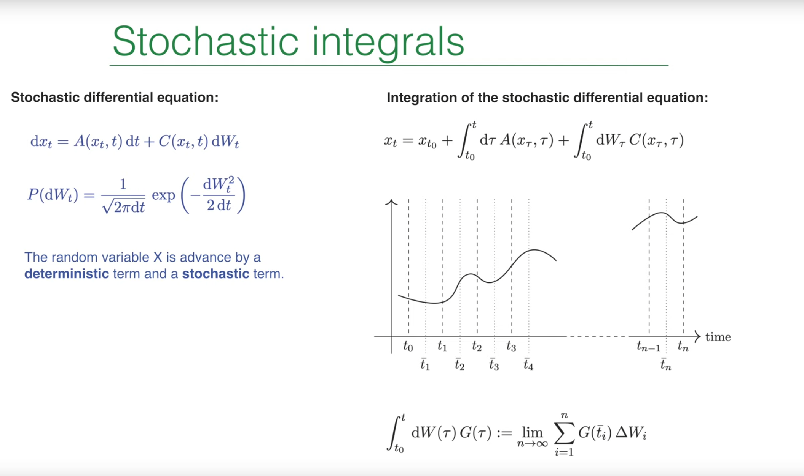
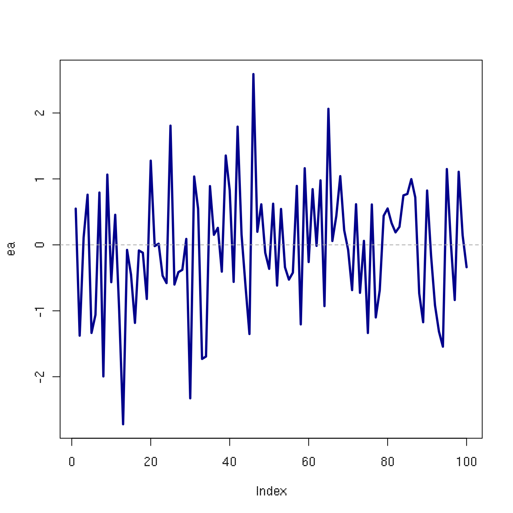
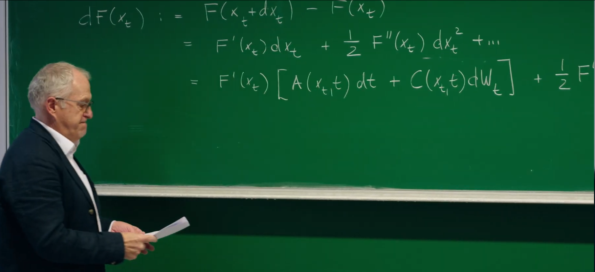
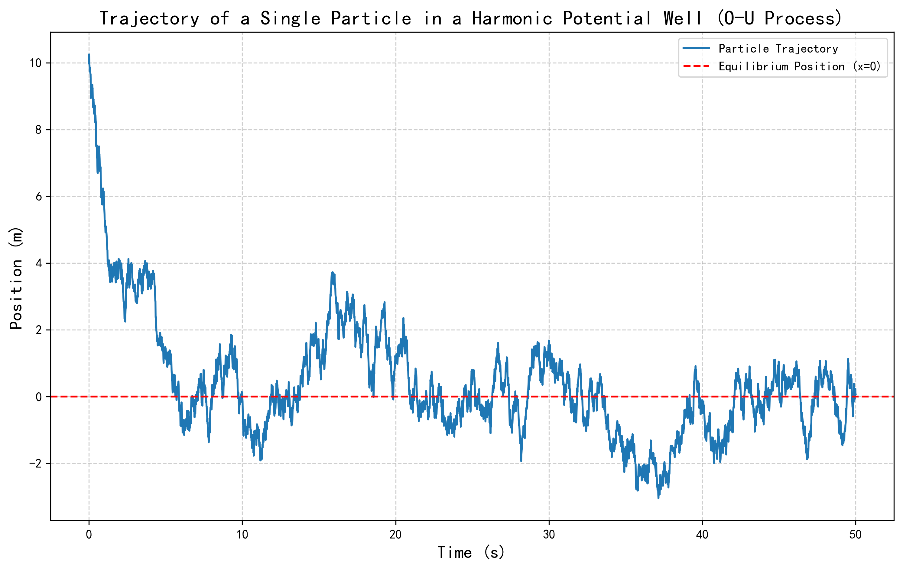
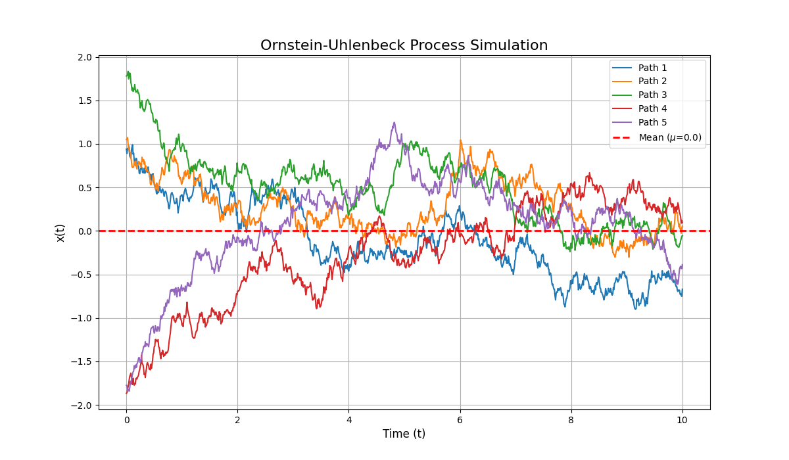
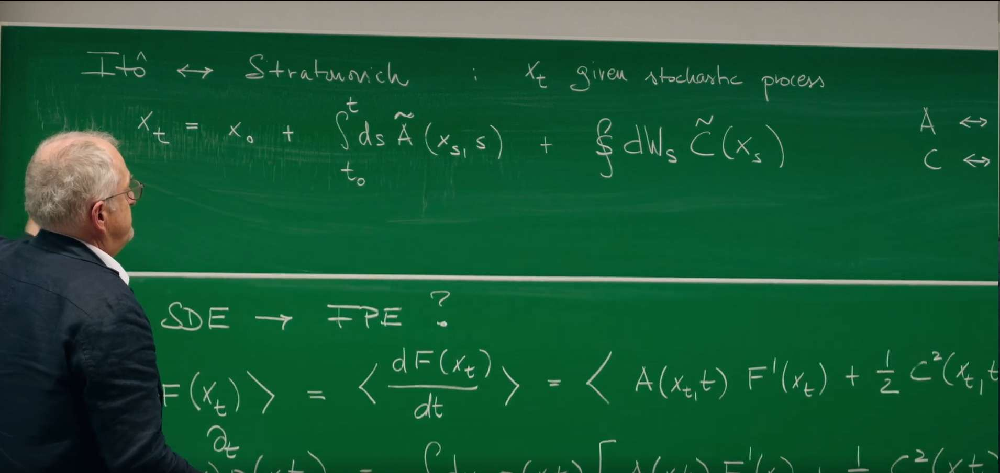
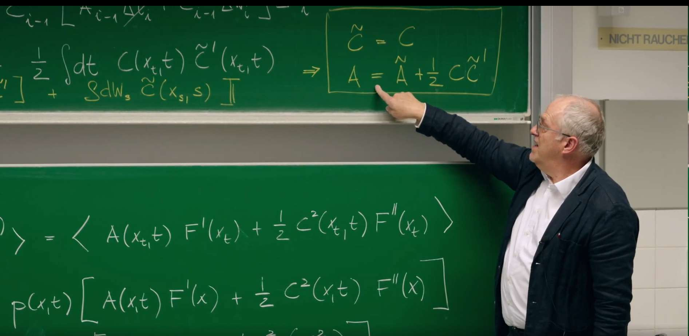
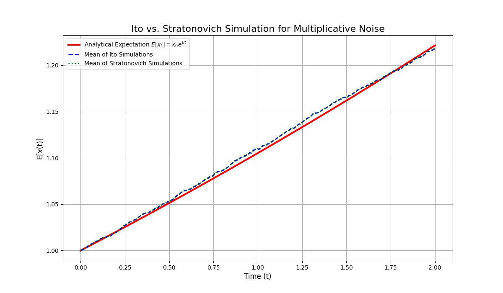
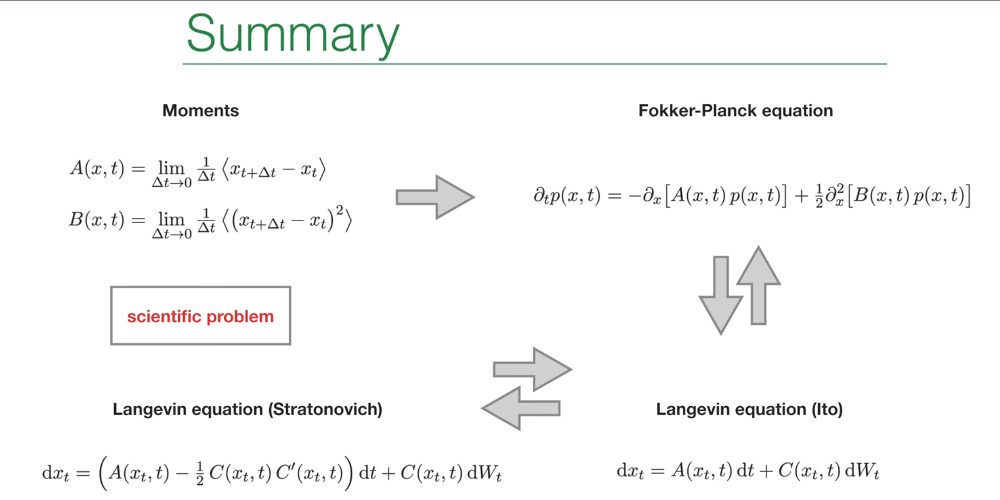

# 引言

在上一讲(第20讲)中,Erwin Frey 教授已经正式引入了随机微分方程(SDEs)作为描述受随机噪声影响系统动力学的强大工具。我们完成了从物理上直观但数学上不严谨的朗之万方程到形式上更严谨的SDE的过渡,其核心是将行为奇异的白噪声 $\xi(t)$ 替换为其积分——行为良好的**维纳过程 $W(t)$。** **然而,这也给我们留下了一个悬而未决的核心问题:如何对包含随机增量 $dW_t$ 的项进行积分?我们初步窥见了随机微积分的惊奇之处,即 $(dW_t)^2 = dt$,这预示着它将遵循一套与经典微积分截然不同的法则。**

这节课将进一步介绍上一节提及的核心数学工具——**伊藤微积分 (Ito's Calculus)。**这节课将从上一讲定义随机积分的模糊之处出发,精确地建立起一套适用于随机过程的微积分体系。伊藤公式 (Ito's Formula)在随机微积分中的地位堪比经典微积分中的链式法则,并揭示随机性如何引入一个额外的"修正项"。

此外,利用这一强大工具,这节课将建立起从微观随机轨迹(伊藤SDE)到宏观概率演化(福克-普朗克方程 Fokker-Planck Equation)的桥梁。最后,上一节课已经简要提及两种随机积分——伊藤积分 (Ito integral) 和斯特拉托诺维奇积分 (Stratonovich integral),这节课将详细理解它们的物理背景差异,并阐明它们之间的精确转换关系。

# 1. 回顾:随机微分方程与伊藤积分


在前面几讲中,我们学习了如何描述一个随机变量 $x_t$ 的演化。其核心思想是,在一个微小的时间步长 $dt$ 内,$x_t$ 的变化 $dx_t$ 由两部分组成:一个确定的、可预测的漂移项 (drift) 和一个随机的、不可预测的扩散项 (diffusion)。描述这类过程最通用的语言是一维随机微分方程(Stochastic Differential Equation, SDE):

$$
dx_t = A(x_t, t)dt + C(x_t, t)dW_t
$$


这个方程描述了随机变量 $x_t$ 在一个无穷小时间步长 $dt$ 内的演化。

* **漂移项 (Drift Term)**: $A(x_t, t)dt$ 代表了系统的确定性演化部分。$A(x_t, t)$ 可以被理解为粒子在时间 $t$ 位于位置 $x$ 时所感受到的平均速度或"力"。

* **扩散项 (Diffusion Term)**: $C(x_t, t)dW_t$ 代表了系统的随机演化部分。$C(x_t, t)$ 是扩散系数或噪声强度,它决定了随机波动的大小。

* **维纳过程增量 (Wiener Process Increment)**: $dW_t$ 是维纳过程的无穷小增量,它是对布朗运动的数学建模。$dW_t$ 本身是一个随机变量,服从均值为0,方差为 $dt$ 的高斯分布:

$$
P(dW_t) = \frac{1}{\sqrt{2\pi dt}} \exp\left(-\frac{dW_t^2}{2dt}\right)
$$


## 1.1 积分形式与伊藤积分的定义

**经典微积分的法则,如链式法则,在处理随机过程的"粗糙"或"锯齿状"路径时会失效。这些路径,以维纳过程为典型代表,虽然处处连续,但却处处不可微。**这种独特的数学性质要求我们发展一套全新的微积分框架——伊籐微积分(Ito's Calculus)。

需要强调的是,SDE的微分形式在数学上只是一种简便的记法。由于**维纳过程的路径处处不可微**,表达式 "$dW_t/dt$" 是没有严格定义的。因此,SDE的严谨定义是其对应的积分形式:

$$
x_t = x_{t_0} + \int_{t_0}^{t} d\tau A(x_\tau, \tau) + \int_{t_0}^{t} C(x_\tau, \tau) dW_\tau
$$

其中,第一个积分是标准的黎曼积分(Riemann integral),而第二个积分——随机积分(stochastic integral)——的定义则需要特别小心。根据教授在PPT上的定义,该积分被定义为一个离散求和的极限:

$$
\int_{t_0}^{t} G(\tau) dW(\tau) := \lim_{n\rightarrow\infty} \sum_{i=1}^{n} G(\bar{t}_i) \Delta W_i
$$

这里,时间区间 $[t_0, t]$ 被划分为 $n$ 个小区间,$\Delta W_i = W(t_i) - W(t_{i-1})$ 是在第 $i$ 个区间上的维纳过程增量。

## 1.2 伊藤约定:不预知未来的积分

随机积分的数值取决于在每个小区间 $[\tilde{t}_i]$ 上对被积函数 $G(\tau)$ 的取样点。不同的取样约定会导致不同类型的随机积分。课堂上默认采用的是**伊藤约定(Ito convention)**,即在每个时间区间的**左端点**进行取样,$\tilde{t}_i = t_{i-1}$。

$$
\int_{t_0}^{t} G(\tau) dW(\tau) := \lim_{n\rightarrow\infty} \sum_{i=1}^{n} G(t_{i-1}) \Delta W_i
$$

这个选择具有深刻的物理和数学意义:它体现了**不可预知性(non-anticipation)原则**。在时间 $t_{i-1}$,我们根据系统当前的状态 $G(t_{i-1})$ 来决定我们对未来随机"踢动" $\Delta W_i$ 的权重。系统在 $t_{i-1}$ 时刻的状态无法"预知"即将在 $(t_{i-1}, t_i]$ 区间内发生的随机涨落。这一特性使得伊藤积分成为一种**鞅(martingale)**,这意味着积分的期望值为零,这在金融数学和许多物理应用中是一个极其重要的性质。

**鞅(martingale)**,原指一类于18世纪流行于法国的投注策略,用来描述像"公平赌博"一样的随机过程——未来的平均结果永远等于现在的值,比如抛硬币赌输赢,长期来看你的平均收益不会变,这种"不偏不倚"的特性在金融中被用来分析股票价格或期权定价。鞅论是概率论和随机过程中的核心概念,用于描述一种**未来期望值与当前信息无关的随机过程**。数学上,一个随机过程 $\{X_t\}$ 被称为鞅,若其满足以下条件:  
1. **适应性**:$X_t$ 的值仅依赖于当前及过去的信息(即 $\mathcal{F}_t$-可测)。  
2. **期望守恒**:在已知当前时刻 $t$ 的信息下,未来任意时刻 $s > t$ 的期望值等于当前值,即 $\mathbb{E}[X_s \mid \mathcal{F}_t] = X_t$。  



这一性质体现了**不可预知性**:鞅的未来行为无法通过当前或过去的信息预测,其期望值始终保持不变。例如,在伊藤积分中,随机积分 $\int_{t_0}^t G(\tau) dW_\tau$ 是一个鞅,其期望值为零,反映了布朗运动(维纳过程)的无偏性。鞅在金融数学中尤为重要,常用于建模公平游戏或无套利市场的价格动态。


# 2. 伊藤微积分:随机世界的新法则

经典微积分的链式法则告诉我们,如果 $x(t)$ 是一个可微函数,那么 $dF(x(t)) = F'(x)dx$。然而,对于由SDE描述的随机过程 $x_t$,由于其路径的"粗糙"和不可微性,这个简单的法则不再成立。我们需要一个新的法则来处理随机变量的函数,这就是伊藤公式。

伊藤微积分由日本数学家伊藤清于20世纪40年代创立,最初用于描述**布朗运动**(维纳过程)的随机路径特性。其核心在于定义**随机积分**(如 $\int G(t) dW_t$),通过在时间区间的**左端点取样**(伊藤约定),避免对未来随机涨落的"预知",从而构建出严格数学框架下的随机微分方程(SDE)。其物理本质是**不可预知性**:系统在任意时刻的状态仅依赖于当前信息,无法通过过去或未来预测,这一特性使伊藤积分成为**鞅**(期望值守恒),反映了自然界和金融系统中随机过程的无偏性。具体应用包括:**金融数学**(期权定价、风险对冲)、**量子力学**(路径积分表述)、**生物统计**(种群动态建模)、**工程控制**(噪声环境下的系统稳定性分析)等,为处理"粗糙"随机路径提供了数学工具,成为现代随机分析的基石。

## 2.1 推导伊藤公式



我们的目标是计算一个关于随机变量 $x_t$ 的任意(足够平滑的)函数 $F(x_t)$ 的无穷小变化量 $dF(x_t)$。我们从 $F(x_t)$ 的泰勒展开式入手,正如教授在黑板上所演示的:

$$
dF(x_t) = F(x_t + dx_t) - F(x_t) = F'(x_t)dx_t + \frac{1}{2}F''(x_t)dx_t^2 + O(dx_t^3)
$$

接下来,我们将SDE的表达式 $dx_t = A dt + C dW_t$ 代入上式:

$$
dF(x_t) = F'(x_t)(A dt + C dW_t) + \frac{1}{2}F''(x_t)(A dt + C dW_t)^2 + \cdots
$$

展开平方项:

$$
(A dt + C dW_t)^2 = A^2(dt)^2 + 2AC(dt dW_t) + C^2(dW_t)^2
$$

## 2.2 随机微积分的乘法规则与核心恒等式 $dW_t^2 = dt$

为了简化上述表达式,我们需要确定各个无穷小量的量级。基于维纳过程的性质,即其标准差与时间的平方根成正比($\Delta W \sim \sqrt{\Delta t}$),我们可以建立一套"随机乘法规则":

* $(dt)^2 \sim O(dt^2)$:可以忽略。
* $dt dW_t \sim O(dt^{3/2})$:可以忽略。
* $(dW_t)^2 \sim O(dt)$:**不可忽略**。

**其中,第三条规则是随机微积分中最反直觉但也是最核心的结论。**它表明,维纳过程增量的平方,在无穷小极限下,其行为不再是随机的,而是表现得像一个确定性的量 $dt$。

这个结论并非凭空猜测,而是可以在严格的**均方极限(mean square limit)**意义下证明的。考虑离散求和 $\sum_i (\Delta W_i^2 - \Delta t_i)$。我们想证明当时间步长趋于零时,这个和的涨落也趋于零。为此,我们计算其方差,即教授在黑板上定义的量 $\Delta I$:

$$
\Delta I := \lim_{n\rightarrow\infty} \left\langle \left( \sum_i G_{i-1}^2 (\Delta W_i^2 - \Delta t_i) \right)^2 \right\rangle
$$

展开平方项,我们得到对角项($i=j$)和非对角项($i \neq j$)。由于不同时间区间的维纳增量是相互独立的(即 $\langle \Delta W_i \Delta W_j \rangle = 0$ for $i \neq j$),所有交叉项的期望均为零。因此,只剩下对角项的和:

$$
\Delta I = \lim_{n \to \infty} \sum_i \left\langle G_{i-1}^2 (\Delta W_i^2 - \Delta t_i)^2 \right\rangle
$$

展开括号内的平方,并利用维纳过程增量的矩的性质($\langle \Delta W_i^2 \rangle = \Delta t_i$ 和 $\langle \Delta W_i^4 \rangle = 3(\Delta t_i)^2$),我们得到:

$$
\langle (\Delta W_i^2 - \Delta t_i)^2 \rangle = \langle \Delta W_i^4 \rangle - 2\Delta t_i \langle \Delta W_i^2 \rangle + (\Delta t_i)^2 = 3(\Delta t_i)^2 - 2(\Delta t_i)^2 + (\Delta t_i)^2 = 2(\Delta t_i)^2
$$

代入 $\Delta I$ 的表达式:

$$
\Delta I = \lim_{n\rightarrow\infty} \sum_i \langle G_{i-1}^2 \rangle \cdot 2(\Delta t_i)^2
$$

假设 $G$ 是有界的,且时间步长均匀 $\Delta t_i = t/n$,则:

$$
\Delta I \leq 2G_{\text{bound}}^2 \lim_{n \to \infty} \sum_{i=1}^{n} \left( \frac{t}{n} \right)^2 = 2G_{\text{bound}}^2 \lim_{n \to \infty} n \left( \frac{t^2}{n^2} \right) = 2G_{\text{bound}}^2 \lim_{n \to \infty} \frac{t^2}{n} \to 0
$$

方差趋于零,这意味着在均方意义下,随机积分 $\int G(\tau) dW_\tau^2$ 等价于普通积分 $\int G(\tau) d\tau$。这为我们的核心恒等式提供了严格的数学基础 :

$$
dW_t^2 = dt
$$

**物理意义**: 这个恒等式是维纳过程**有限二次变差(finite quadratic variation)**的体现。一个普通的布朗粒子,其位移的期望是零,但其位移平方的期望(与方差成正比)是随时间线性增长的,即 $\langle (\Delta x)^2 \rangle \propto \Delta t$。$dW_t^2 = dt$ 这个关系正是将这一宏观统计性质提升到了微积分法则的层面。它告诉我们,虽然粒子的路径是随机的,但其"累积的平方涨落"却以一种确定的、可预测的方式随时间增长。

## 2.3 伊藤公式的最终形式

将 $dW_t^2 = dt$ 以及其他高阶项为零的规则代入 $dF(x_t)$ 的展开式中,我们便得到了最终的**伊藤公式**(也称为伊藤引理,Ito's Lemma):

$$
dF(x_t) = \left[ A(x_t, t) F'(x_t) + \frac{1}{2} C^2(x_t, t) F''(x_t) \right] dt + C(x_t, t) F'(x_t) dW_t
$$

对比经典微积分的链式法则,我们发现多出了一个额外的项 $\frac{1}{2} C^2 F'' dt$。这一项被称为**伊藤修正项(Ito correction term)**。

**物理意义**: 这个修正项完全由噪声产生,它是一个确定性的漂移项,其大小取决于噪声的强度($C^2$)和函数 $F(x)$ 的曲率($F''$)。直观地看,如果函数是凸的($F'' > 0$,像一个碗),那么随机波动会使得 $F(x_t)$ 的期望值系统性地向上漂移;反之,如果函数是凹的($F'' < 0$),噪声则会使其期望值向下漂移。这可以类比于**琴生不等式(Jensen's inequality)**。伊藤公式精确地量化了这种由噪声与非线性函数相互作用所产生的有效漂移。


# 3. 应用:从单条轨迹到概率动力学

伊藤公式最强大的应用之一,是建立起微观的SDE描述和宏观的概率密度演化方程(即福克-普朗克方程)之间的桥梁。

## 3.1 从伊藤SDE推导福克-普朗克方程

**我们的目标是推导出一个描述概率密度函数 $p(x, t)$ 如何随时间演化的偏微分方程。为此,我们考察一个任意光滑测试函数 $F(x)$ 的期望值的时间演化。**

首先,写出期望值的导数:

$$
\frac{d}{dt}\langle F(x_t) \rangle = \left\langle \frac{d}{dt} F(x_t) \right\rangle
$$

这里,我们将微分形式的伊藤公式代入期望值内部。伊藤公式的 $dt$ 部分给出了确定性的演化,而 $dW_t$ 部分是随机的。

$$
\frac{d}{dt}\langle F(x_t) \rangle = \left\langle A(x_t, t) F'(x_t) + \frac{1}{2} C^2(x_t, t) F''(x_t) \right\rangle + \left\langle C(x_t, t) F'(x_t) \frac{dW_t}{dt} \right\rangle
$$

由于伊藤积分的不可预知性,在 $t$ 时刻的系统状态 $x_t$ 与紧随其后的维纳增量 $dW_t$ 是不相关的,且 $\langle dW_t \rangle = 0$。因此,随机项的期望为零:

$$
\left\langle C(x_t, t) F'(x_t) dW_t \right\rangle = 0
$$

于是,期望值的演化完全由确定性项决定:

$$
\frac{d}{dt}\langle F(x_t) \rangle = \left\langle A(x_t, t) F'(x_t) + \frac{1}{2} C^2(x_t, t) F''(x_t) \right\rangle
$$

现在,我们将期望值用概率密度 $p(x, t)$ 的积分形式表示:

$$
\int dx F(x) \frac{\partial p(x, t)}{\partial t} = \int dx p(x, t) \left[ A(x, t) F'(x) + \frac{1}{2} C^2(x, t) F''(x) \right]
$$

为了得到 $p(x, t)$ 的方程,我们需要将右侧积分中的导数从测试函数 $F(x)$ 转移到 $p(x, t)$ 上。这可以通过**分部积分法(integration by parts)**来实现。假设在无穷远处边界条件良好($p(x, t)$ 和它的导数趋于零)。

对第一项进行分部积分:

$$
\int dx p(x, t) A(x, t) F'(x) = [pAF]_{-\infty}^{\infty} - \int dx F(x) \frac{\partial}{\partial x} [A(x, t) p(x, t)] = -\int dx F(x) \frac{\partial}{\partial x} [Ap]
$$

对第二项进行两次分部积分:

$$
\frac{1}{2} \int dx p C^2 F'' = \frac{1}{2} ([pC^2F']_{-\infty}^{\infty} - \int dx F' \frac{\partial}{\partial x} [pC^2]) = -\frac{1}{2} \int dx F' \frac{\partial}{\partial x} [pC^2]
$$

$$
= -\frac{1}{2} ([F \frac{\partial}{\partial x} [pC^2]]_{-\infty}^{\infty} - \int dx F \frac{\partial^2}{\partial x^2} [pC^2]) = \frac{1}{2} \int dx F(x) \frac{\partial^2}{\partial x^2} [C^2(x, t) p(x, t)]
$$

将分部积分后的结果代回原式:

$$
\int dx F(x) \frac{\partial p(x, t)}{\partial t} = \int dx F(x) \left[ -\frac{\partial}{\partial x}(A p) + \frac{1}{2} \frac{\partial^2}{\partial x^2}(C^2 p) \right]
$$

由于这个等式对任意的测试函数 $F(x)$ 都成立,所以两个积分号下的被积函数必须相等。由此,我们得到了心心念念的**福克-普朗克方程(Fokker-Planck Equation, FPE)**:

$$
\frac{\partial p(x, t)}{\partial t} = -\frac{\partial}{\partial x}[A(x, t) p(x, t)] + \frac{1}{2} \frac{\partial^2}{\partial x^2}[C^2(x, t) p(x, t)]
$$

这个方程是一个关于概率密度的连续性方程,描述了概率"流体"如何在状态空间中漂移和扩散。漂移通量为 $J_{\text{drift}} = Ap$,扩散通量为 $J_{\text{diff}} = -\frac{1}{2} \frac{\partial}{\partial x}(C^2 p)$。


## 3.2 Python模拟:奥恩斯坦-乌伦贝克过程的可视化
还记得我们在**12. 布朗运动与 O-U 过程**模拟过单个受束缚的粒子**奥恩斯坦-乌伦贝克过程(Ornstein-Uhlenbeck process, OU process)**,这个一个在物理学和金融学中都非常重要的模型:它描述了一个在谐振子势阱中运动并受到热噪声影响的布朗粒子,其SDE为:

$$
dx_t = -\theta (x_t - \mu) dt + \sigma dW_t
$$

其中,$\theta > 0$ 是回复速率(决定了系统向均值回复的速度),$\mu$ 是长期均值(势阱的中心),$\sigma$ 是噪声强度。



为了加深印象,这节课我们可以使用**欧拉-丸山(Euler-Maruyama)方法**对这个Ito SDE进行多个粒子的数值模拟,这是对SDE最直接的离散化:

$$
x_{i+1} = x_i - \theta (x_i - \mu) \Delta t + \sigma \sqrt{\Delta t} \cdot Z_i
$$

其中 $\Delta t$ 是时间步长,$Z_i$ 是从标准正态分布 $N(0,1)$ 中抽取的独立随机数。

下面的Python代码模拟了多条OU过程的轨迹,展示了它们如何从不同的初始位置出发,最终围绕均值 $\mu$ 波动。

```python
import numpy as np
import matplotlib.pyplot as plt

# --- Parameter definition ---
theta = 0.5  # Reversion rate
mu = 0.0     # Long-term mean
sigma = 0.4  # Noise intensity
dt = 0.01    # Time step
T = 10.0     # Total time
n = int(T / dt) # Total steps
num_paths = 5 # Number of simulated trajectories

# --- Simulation process ---
x = np.zeros((num_paths, n + 1))
x[:, 0] = np.random.uniform(-2, 2, num_paths) # Random initial positions

# Generate all random numbers
Z = np.random.randn(num_paths, n)

for i in range(n):
    # Euler-Maruyama method
    dW = np.sqrt(dt) * Z[:, i]
    dx = -theta * (x[:, i] - mu) * dt + sigma * dW
    x[:, i+1] = x[:, i] + dx

# --- Plotting ---
t = np.linspace(0, T, n + 1)
plt.figure(figsize=(12, 7))

for i in range(num_paths):
    plt.plot(t, x[i, :], lw=1.5, label=f'Path {i+1}')

plt.axhline(mu, color='r', linestyle='--', lw=2, label=f'Mean ($\\mu$={mu})')
plt.title("Ornstein-Uhlenbeck Process Simulation", fontsize=16)
plt.xlabel("Time (t)", fontsize=12)
plt.ylabel("x(t)", fontsize=12)
plt.grid(True)
plt.legend()
plt.show()
```


无论初始位置在哪里,所有轨迹都趋向于在均值 $\mu$ 附近波动,波动的幅度由 $\sigma$ 决定。


# 4. 伊藤-斯特拉托诺维奇之争:两种积分的故事
上一节,我们已经简要介绍了两种积分约定,并做了一张表格进行区分。到目前为止,我们一直采用伊藤约定来定义随机积分。然而,我们知道这并非唯一的选择。另一种在物理学中广泛使用的约定是**斯特拉托诺维奇(Stratonovich)约定**。这两种约定反映了对随机过程建模的不同哲学思想,深入理解它们之间的关系至关重要。


| 特性 | 伊藤积分 (Itô Integral) | 斯特拉托诺维奇积分 (Stratonovich Integral) |
|------|-------------------------|-------------------------------------------|
| 求和取样点 | 区间左端点: $t_{i-1}$ | 区间中点: $(t_{i}+t_{i-1})/2$ |
| 链式法则 | 修正的链式法则 (伊藤引理) | 遵守经典链式法则 |
| 鞅性质 | $\int C(x_{t})dW_{t}$ 是鞅 | 不一定是鞅 |
| 物理模型 | 理想化的白噪声;非预见性系统 (如金融) | 有限关联时间的有色噪声的极限 (如物理) |
| F-P方程漂移项 | $A(x)+\frac{1}{2} C(x)C^{\prime}(x)$ | $A(x)$ |
| 数值格式 | 欧拉-丸山法 (Euler-Maruyama) | 欧拉-休恩法 (Euler-Heun) / Milstein法 |


## 4.1 斯特拉托诺维奇积分的定义与物理动机

斯特拉托诺维奇随机积分的定义与伊藤积分非常相似,唯一的区别在于被积函数的取样点。它选择在时间区间的**中点**进行取样:

$$
\int C(x_t) \circ dW_t := \lim_{n\rightarrow\infty} \sum_{i=1}^{n} C\left(\frac{x_i + x_{i-1}}{2}\right) \Delta W_i
$$

(这里的 $\circ$ 符号是用来区分斯特拉托诺维奇积分的常用标记)。

**物理动机**: 为什么物理学家常常偏爱斯特拉托诺维奇积分?原因在于,许多物理系统中的噪声并非理想的"白噪声"(即时间上完全不相关),而是具有一个很小但有限的相关时间的"有色噪声"。当我们将一个由有色噪声驱动的物理过程,通过取相关时间趋于零的极限来推导其对应的SDE时,得到的自然结果就是斯特拉托诺维奇形式的SDE。

更重要的是,斯特拉托诺维奇微积分**保留了经典微积分的链式法则**。也就是说,如果 $x_t$ 是一个斯特拉托诺维奇过程,那么 $dF(x_t) = F'(x_t) \circ dx_t$,形式上与经典微积分完全一样。这使得它在基于经典力学或热力学原理建立模型时更为直观。

## 4.2 推导两种表述的转换关系

既然同一个物理过程可以用两种不同的数学语言来描述,那么这两种语言之间必然存在一个"翻译词典"。现在,我们来推导这个转换公式,推导过程将严格遵循教授的板书。



我们从斯特拉托诺维奇积分的离散和出发:

$$
\sum_i C\left(\frac{x_i + x_{i-1}}{2}\right) \Delta W_i = \sum_i C\left(x_{i-1} + \frac{1}{2}\Delta x_i\right) \Delta W_i
$$

我们将被积函数 $C$ 在左端点 $x_{i-1}$ 处进行泰勒展开:

$$
C\left(x_{i-1} + \frac{1}{2}\Delta x_i\right) \approx C(x_{i-1}) + \frac{1}{2} C'(x_{i-1}) \Delta x_i
$$

将展开式代回求和中,得到两项:

$$
\sum_i C(x_{i-1}) \Delta W_i + \frac{1}{2} \sum_i C'(x_{i-1}) \Delta x_i \Delta W_i
$$

* 第一项 $\sum_i C(x_{i-1}) \Delta W_i$ 正是**伊藤积分**的定义。

* 第二项是两者差异的关键。我们将伊藤SDE的离散形式 $\Delta x_i = A_{i-1} \Delta t_i + C_{i-1} \Delta W_i$ 代入第二项:

$$
\frac{1}{2} \sum_i C'_{i-1} (A_{i-1} \Delta t_i + C_{i-1} \Delta W_i) \Delta W_i = \frac{1}{2} \sum_i (C'_{i-1} A_{i-1} \Delta t_i \Delta W_i + C'_{i-1} C_{i-1} (\Delta W_i)^2)
$$

在取极限 $n\rightarrow\infty$ 的过程中,$\Delta t_i \Delta W_i$ 项是高阶无穷小,将消失。而 $(\Delta W_i)^2$ 项根据我们之前证明的核心恒等式,将变为 $\Delta t_i$。因此,第二项收敛于一个普通的黎曼积分:

$$
\lim_{n\rightarrow\infty} \frac{1}{2} \sum_i C'_{i-1} C_{i-1} \Delta t_i = \frac{1}{2} \int C(x_t) C'(x_t) dt
$$

## 4.3 最终的转换公式

综合以上推导,我们得到了伊藤积分和斯特拉托诺维奇积分之间的转换关系:

$$
\text{(Stratonovich)} \int C(x_s) \circ dW_s = \text{(Ito)} \int C(x_s) dW_s + \frac{1}{2} \int dt \, C(x_t) C'(x_t)
$$

这个积分关系直接导致了两种SDE表述之间的转换法则。假设一个物理过程可以用斯特拉托诺维奇SDE描述为:

$$
dx_t = \tilde{A}(x_t, t) dt + C(x_t, t) \circ dW_t
$$

那么,与之完全等价的伊藤SDE为:

$$
dx_t = A(x_t, t) dt + C(x_t, t) dW_t
$$

其中,扩散系数 $C$ 保持不变,而漂移系数之间存在如下关系:

$$
A_{\text{Ito}} = A_{\text{Strat}} + \frac{1}{2} C(x_t, t) C'(x_t, t)
$$

**这个关系是这节课的核心成果之一。它表明,伊藤形式的SDE漂移项中包含了一个额外的"噪声诱导漂移"(noise-induced drift)或"伪漂移"(spurious drift)。这个漂移项的出现,正是为了补偿伊藤积分在定义中忽略的被积函数与噪声增量之间的相关性。**





## 4.4 Python模拟:乘性噪声下的差异

当噪声强度 $C(x_t, t)$ 依赖于系统状态 $x_t$ 时(即所谓的**乘性噪声**),伊藤和斯特拉托诺维奇表述的差异变得至关重要。我们以几何布朗运动为例,这是金融中模拟股票价格的标准模型:

$$
dx_t = \mu x_t dt + \sigma x_t dW_t \quad \text{(Ito)}
$$

其对应的斯特拉托诺维奇形式为(使用转换公式 $A_{\text{Strat}} = A_{\text{Ito}} - \frac{1}{2} C C'$,其中 $C = \sigma x$, $C' = \sigma$):

$$
dx_t = (\mu - \frac{1}{2} \sigma^2) x_t dt + \sigma x_t \circ dW_t \quad \text{(Stratonovich)}
$$

该SDE的精确解为 $x_t = x_0 \exp((\mu - \frac{1}{2} \sigma^2) t + \sigma W_t)$。其期望值为 $E[x_t] = x_0 e^{\mu t}$。

下面的代码将使用两种数值方法模拟该过程,并与解析期望值进行比较:

1. **伊藤模拟**: 使用标准的欧拉-丸山法。

2. **斯特拉托诺维奇模拟**: 使用一个简单的预测-校正格式(Heun方法)来近似中点规则。

```python
import numpy as np
import matplotlib.pyplot as plt

# --- Parameter definition ---
mu = 0.1      # True drift rate
sigma = 0.3   # Volatility
x0 = 1.0      # Initial value
dt = 0.001    # Time step
T = 2.0       # Total time
n = int(T / dt) # Total steps
num_paths = 5000 # Simulate large number of trajectories to calculate expected values

# --- Simulation process ---
x_ito = np.zeros((num_paths, n + 1))
x_strat = np.zeros((num_paths, n + 1))
x_ito[:, 0] = x0
x_strat[:, 0] = x0

# Generate all random numbers
Z = np.random.randn(num_paths, n)
dW = np.sqrt(dt) * Z

# Drift coefficient
A_ito = mu
A_strat = mu - 0.5 * sigma**2

for i in range(n):
    # 1. Ito Simulation (Euler-Maruyama)
    x_ito[:, i+1] = x_ito[:, i] + A_ito * x_ito[:, i] * dt + sigma * x_ito[:, i] * dW[:, i]

    # 2. Stratonovich Simulation (Heun's method)
    # Predictor step
    x_pred = x_strat[:, i] + A_strat * x_strat[:, i] * dt + sigma * x_strat[:, i] * dW[:, i]
    # Corrector step using midpoint approximation
    C_mid = sigma * (x_strat[:, i] + x_pred) / 2.0
    x_strat[:, i+1] = x_strat[:, i] + A_strat * x_strat[:, i] * dt + C_mid * dW[:, i]


# --- Calculate expected values and plot ---
t = np.linspace(0, T, n + 1)
expected_x_ito = np.mean(x_ito, axis=0)
expected_x_strat = np.mean(x_strat, axis=0)
analytical_expected_x = x0 * np.exp(mu * t)

plt.figure(figsize=(12, 7))
plt.plot(t, analytical_expected_x, 'r-', lw=3, label='Analytical Expectation $E[x_t]=x_0 e^{\mu t}$')
plt.plot(t, expected_x_ito, 'b--', lw=2, label='Mean of Ito Simulations')
plt.plot(t, expected_x_strat, 'g:', lw=2, label='Mean of Stratonovich Simulations')

plt.title("Ito vs. Stratonovich Simulation for Multiplicative Noise", fontsize=16)
plt.xlabel("Time (t)", fontsize=12)
plt.ylabel("E[x(t)]", fontsize=12)
plt.grid(True)
plt.legend()
plt.show()
```


两种数值方法得到的系综平均值都正确地收敛到了解析期望值 $x_0 e^{\mu t}$。这有力地证明了,只要为给定的SDE形式(伊藤或斯特拉托诺维奇)选择**与之匹配的数值积分方案**,两者是描述同一物理现实的完全等价的语言。

**如果错误地将欧拉-丸山法(一种伊藤格式)用于斯特拉托诺维奇形式的SDE,将会得到错误的期望值演化轨迹。这个实践性的例子最终强调了理解并正确应用伊藤-斯特拉托诺维奇转换规则的极端重要性(将在下一小节进一步强调)。**


# 5. 总结:统一的随机过程框架
最后,Erwin Frey 教授它将本讲乃至前几讲的核心内容融汇贯通,构建了一个描述一维随机过程的**统一理论框架**。这个框架包含了四种数学上等价但物理视角各异的表述方式,并揭示了它们之间精确的转换关系。将一个随机过程的三个不同层面的描述——微观矩、宏观概率演化和中观轨迹动力学——联系在一起。




## 起点:从"科学问题"到可测量的"矩"

理论的构建往往始于一个具体的**"科学问题" (scientific problem)。**这可能是一次实验观测(如追踪单个胶体颗粒的布朗运动)、一次计算机模拟(如分子动力学模拟),或一个微观理论模型。面对这些复杂的、充满随机性的数据或轨迹,第一步便是提取其最核心的统计特征,即**"矩" (Moments)。**


**漂移系数 (Drift)**: $A(x, t) = \lim_{\Delta t \to 0} \frac{1}{\Delta t} \langle x_{t+\Delta t} - x_t \rangle$。
    
**物理意义**: 漂移系数 $A$ 描述了系统在单位时间内所经历的**平均的、确定性的位移**。它代表了作用在粒子上的所有确定性"力"的合效果,例如来自外势场的力、摩擦力等。在宏观上,它决定了**粒子系综(概率云)**整体的运动方向和速度。

**扩散系数 (Diffusion)**: $B(x, t) = \lim_{\Delta t \to 0} \frac{1}{\Delta t} \langle (x_{t+\Delta t} - x_t)^2 \rangle$。

**物理意义**: 扩散系数 $B$ 描述了系统在单位时间内的**均方位移**,它量化了随机涨落的强度。它代表了来自环境(如热浴)的无数次微观碰撞所产生的随机"踢动"的剧烈程度。在宏观上,它决定了概率云扩散、展宽的速度。

漂移和扩散这两个矩,是从微观随机性中提炼出的、最基本的宏观动力学参数,是连接微观轨迹与宏观统计规律的桥梁。

## 从矩到宏观演化:福克-普朗克方程

一旦我们通过实验或微观模型确定了漂移系数 $A$ 和扩散系数 $B$,我们就可以立即写下描述整个系统概率密度 $p(x,t)$ 演化的宏观动力学方程——**福克-普朗克方程 (Fokker-Planck Equation, FPE)。**

$$
\partial_t p(x,t) = -\partial_x [A(x, t) p(x, t)] + \frac{1}{2} \partial_x^2 [B(x, t) p(x, t)]
$$

**物理过程与意义**: 福克-普朗克方程是一个**描述概率守恒的连续性方程**。它描绘了一幅"概率流体"在相空间中流动的图景:


**漂移项** $-\partial_x [A p]$ 如同一个**平流项**,描述了概率云的中心如何被确定性的漂移力 $A$ 所推动。


**扩散项** $\frac{1}{2} \partial_x^2 [Bp]$ 如同一个**扩散项**,描述了概率云如何因随机涨落 $B$ 而不断展宽和弥散。

FPE 本身是一个**确定性**的偏微分方程。它完美地诠释了统计物理学的核心思想:尽管单个粒子的轨迹是不可预测的,但由大量粒子组成的系综的概率演化规律却是完全确定的。这是从"一棵树"的随机生长到"整片森林"的确定性变迁的视角转换。

## 从宏观演化到微观轨迹:等价的朗之万方程

福克-普朗克方程所描述的宏观概率演化,其背后必然对应着一个微观的、单粒子层面的随机动力学。这个微观动力学正是由**朗之万方程(Langevin Equation)**,也就是我们本讲学习的**随机微分方程 (SDE)** 所描述的。FPE 与 SDE 之间是完全等价的,可以相互推导。

**伊藤形式 (Ito Formulation)**:

$$
dx_t = A(x_t, t) dt + C(x_t, t) dW_t
$$

这里的噪声幅度 $C(x,t)$ 与 FPE 中的扩散系数有直接关系:$B(x,t) = C^2(x,t)$。这个形式与 FPE 的系数 $A$ 和 $B$ 直接对应,并且由于其优秀的数学性质(鞅性质),成为理论分析和数值模拟(如欧拉-丸山法)的首选。

**斯特拉托诺维奇形式 (Stratonovich Formulation)**:

$$
dx_t = \left(A(x_t, t) - \frac{1}{2} C(x_t, t) C'(x_t, t) \right) dt + C(x_t, t) dW_t
$$

(注意:PPT中的 $dW_t$ 在此应理解为 $\circ dW_t$)

这个形式描述的是**完全相同**的物理过程,但采用了不同的数学约定。

**物理过程与意义**: 斯特拉托诺维奇形式的迷人之处在于,它遵循经典微积分的链式法则。它通常被认为更"物理",因为它可以被严格证明是当一个物理系统受到具有极短但非零关联时间的"有色噪声"驱动时,在关联时间趋于零的极限下得到的正确数学形式。为了保持经典微积分法则的优美形式,它必须将伊藤形式中由于 $(dW_t)^2=dt$ 规则产生的修正效应,**显式地吸收进漂移项中。**这个修正项 $-\frac{1}{2}CC'$ 正是我们之前推导出的伊藤漂移的反向体现。它并非一个真实的物理力,而是为了在不同的数学语言间进行翻译所付出的"代价"。

## 统一的随机过程框架

这张总结图揭示的**连通性与等价性**告诉我们,面对一个随机动力学问题,我们可以根据需求,在四个等价的描述层次之间自由切换:

1. 从**实验数据**出发,计算**矩** $A$ 和 $B$。

2. 有了矩,便可构建**FPE**,从宏观层面分析概率分布的演化、稳态和弛豫时间。

3. 若想进行计算机模拟,可以直接将 $A$ 和 $B$ 翻译成**伊藤SDE**,生成具体的随机轨迹。

4. 如果理论模型更适合用经典微积分法则来表述,可以通过精确的转换公式,将其转化为**斯特拉托诺维奇SDE**。

最终,选择哪种表述(特别是伊藤 vs. 斯特拉托诺维奇)不是一个物理对错的问题,而是一个**数学工具的选择问题**。**物理现实是唯一的,但描述它的语言可以不同。**只要我们掌握了它们之间的转换规则,就能确保我们对同一个物理过程的描述是**自洽和正确的**。这个统一的框架,是现代非平衡统计物理学中分析、建模和模拟随机现象的基石。


## 入门者指南:何时使用何种表述?

### 何时使用伊藤表述?

  * **数值模拟**: 绝大多数标准的SDE数值积分格式,如我们用过的欧拉-丸山法,都是基于伊藤积分的离散化。因此,在进行计算机模拟前,通常需要将SDE转换为伊藤形式。

  * **金融数学**: 伊藤积分的鞅性质是风险中性定价理论的基石,因此在金融领域占据主导地位。

  * **数学分析**: 当需要利用鞅理论等强大数学工具进行严谨分析时,伊藤表述是首选。

### 何时使用斯特拉托诺维奇表述?

  * **物理建模**: 当从遵循经典微积分法则的物理原理(如变分原理)出发构建模型时,斯特拉托诺维奇是更自然的选择。

  * **有色噪声极限**: 当模型是作为有色噪声驱动系统的白噪声极限时,斯特拉托诺维奇表述是正确的结果。

  * **坐标不变性**: 在流形上处理SDE时,斯特拉托诺维奇表述具有更好的坐标变换性质。

**黄金法则**: 一个没有明确指定积分约定的SDE是**不明确的**。在任何应用中,都必须清晰地指明你使用的是伊藤积分还是斯特拉托诺维奇积分。
