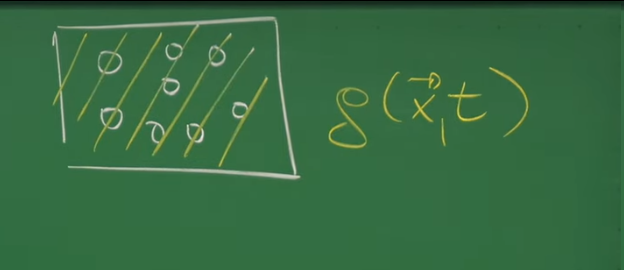
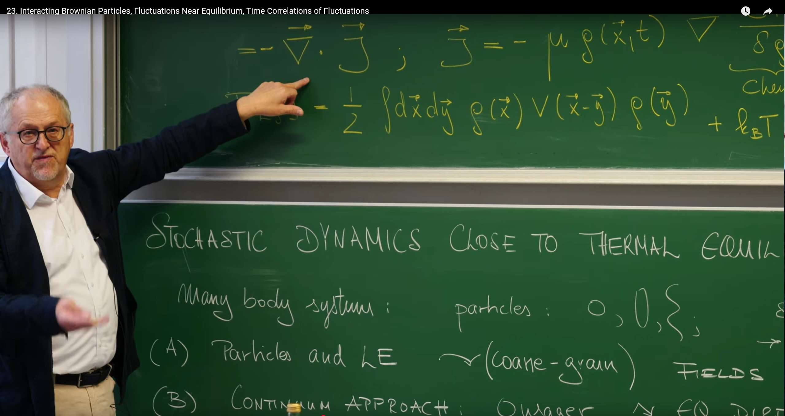
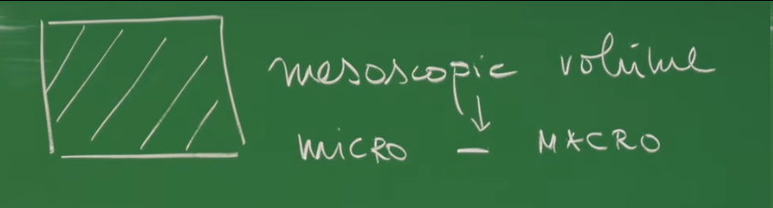
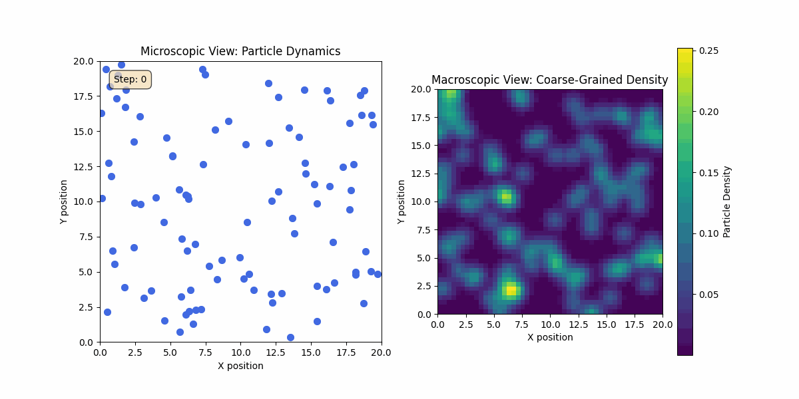

# 引言：从微观粒子到连续场

这节课是我们随机动力学课程的一个关键转折点。在前面的课程中（特别是第17讲到第23讲），我们已经建立了一套强大的理论工具，包括朗之万方程、福克-普朗克方程以及路径积分表述。现在，我们将运用这些工具来解决物理学中的一个核心问题：**一个多体系统的集体行为，是如何从其构成粒子各自的随机动力学中涌现出来的。**

**因此，这节课要回答的核心问题是：我们如何描述一个由大量相互作用粒子组成的系统（例如溶液中的胶体颗粒或细胞中的蛋白质）在其热力学平衡态附近的涨落行为？** 

为了解答这个问题，Erwin Frey 教授介绍了两种互补的强大视角，将在这节课中深入探讨并建立它们之间的联系 ：  

- **（A）微观的“自下而上”（Bottom-Up）方法：**我们从描述单个粒子的已知物理定律（朗之万方程）出发，通过一种称为**粗粒化（coarse-graining）**的步骤，推导出宏观系统的动力学方程。我们将这个离散的、基于粒子的描述转化为一个连续的场论描述，最终得到一个描述粒子密度场演化的随机偏微分方程。这种方法的好处是物理图像清晰，能让我们直观地看到宏观行为如何从微观规则中产生。


- **（B）宏观的“自上而下”（Top-Down）方法：**我们直接从宏观层面入手，利用热力学和对称性的基本原理（由Onsager等人开创）来约束宏观动力学方程可能具有的形式。利用热力学和对称性的基本原理来构建一个关于涨落的普适理论，其强大之处在于它不依赖于任何具体的微观模型细节。只要系统接近一个稳定的热平衡态，其涨落行为就必须遵循某些普适的规律。

首先，教授将展示方法（A）如何从粒子图像自然地过渡到一个连续的场论描述。接着，发展方法（B）的普适性框架，用于描述任何系统在平衡态附近的涨落。最后，我们将运用这个框架，通过时间关联函数和基本对称性的视角，来理解这些涨落的动力学特性。从微观粒子到连续场，描述的是单个粒子运动的微观随机动力学与系统的宏观热力学性质。**我们将看到，系统的集体行为，如密度涨落，可以从底层的粒子相互作用中涌现出来，并最终由普适的热力学原理所支配。**

# 1. 从相互作用粒子到连续场论

从描述离散粒子的方程过渡到描述连续场的方程，这不仅仅是一种数学上的便利，它体现了一个深刻的物理概念——**粗粒化**。这个过程有意地忽略了系统中高频、短波长的微观信息（例如每个粒子的精确位置），转而关注那些决定系统宏观行为的、缓慢变化的、长波长的集体变量（例如局域的粒子密度）。在这个过程中，一个名为**自由能泛函$F[\rho]$** 的量会自然而然地出现，它扮演了这个粗粒化场论的有效“哈密顿量”或“作用量”的角色，主导着系统的平衡态和动力学演化。

对于一个包含 $N$ 个粒子的朗之万系统，当 $N$ 很大时，直接求解是计算上和解析上都难以处理的，因为自由度太多了。然而，对于许多物理现象，如扩散或相分离，我们并不关心第1,304,567号粒子的精确坐标。我们关心的是在一个小体积内的**平均密度**。将粒子坐标在小体积内进行平均，从而定义一个连续的密度场 $\rho(\mathbf{x}, t)$，这正是粗粒化的核心思想。

一旦我们有了密度场 $\rho$，原来基于粒子间相互作用势的力也必须被某种作用在场上的等效驱动力所取代。在朗之万方程中，漂移项 $-\mu \nabla V$ 是由**势能梯度**驱动的。那么，对于密度场 $\rho$ 而言，等效的驱动力是什么呢？热力学告诉我们，系统会演化以使其自由能最小化。因此，$\rho$ 的动力学必须被一个自由能“地形”的“下坡”方向所驱动。这个地形不是一个简单的函数，而是一个**泛函** $F[\rho]$，它为每一个可能的密度分布函数 $\rho(\mathbf{x}, t)$ 赋予一个标量值（即系统的总自由能）。这个泛函的导数，$\frac{\delta F}{\delta \rho}$，扮演了广义力（即**化学势**）的角色，驱动系统朝向使 $F$ 最小化的那个密度分布演化。这一过程优雅地将微观的粒子相互作用与宏观的热力学驱动力联系在了一起。

## 1.1 微观视角：相互作用的布朗粒子系统

我们从一个由 $N$ 个布朗粒子组成的具体模型开始。这些粒子悬浮于一个恒定温度 $T$ 的粘性流体（热库）中。我们考虑的是**过阻尼极限（overdamped limit）**，这意味着流体的粘滞阻力非常大，以至于粒子的惯性（$m\mathbf{a}$）可以完全忽略。在这种情况下，粒子的速度 $d\mathbf{x}/dt$ 瞬时地与其受到的总力成正比，而不是由牛顿第二定律描述。

每个粒子 $i$ 的运动轨迹 $\mathbf{x}_i(t)$ 由一组耦合的朗之万方程描述：

$$
\frac{d\mathbf{x}_i}{dt} = \mu \sum_{j \neq i} \mathbf{F}_{ij} + \boldsymbol{\xi}_i(t)
$$

其中：

$$
\mathbf{F}_{ij} = -\nabla_i V(\mathbf{x}_i - \mathbf{x}_j)
$$

这个方程精确地描述了两种基本物理过程的平衡：

**确定性漂移 (Deterministic Drift)：**方程的第一项 $\mu \sum \mathbf{F}_{ij}$ 代表由系统内部保守力驱动的确定性运动。

  * $\mathbf{F}_{ij} = -\nabla_i V(\ldots)$ 是粒子 $j$ 对粒子 $i$ 施加的力，它由一个成对相互作用势 $V(r)$ 的负梯度给出。这个势能可以是Lennard-Jones势、库仑力或简单的硬球排斥势。

  * $\sum_{j \neq i}$ 表示对所有其他粒子施加在粒子 $i$ 上的力的矢量和。正是这一项耦合了所有粒子的运动，使得系统成为一个复杂的多体问题。

  * $\mu$ 是**迁移率 (mobility)，**它量化了粒子在单位力驱动下的速度，即 $\mathbf{v} = \mu \mathbf{F}$。它与流体的粘滞（摩擦）系数 $\gamma$ 成反比，$\mu = 1/\gamma$，完全由溶剂的性质决定。

**随机力 (Stochastic Force)：**$\boldsymbol{\xi}_i(t)$，也称为朗之万力，是一个随机项。它代表了来自周围溶剂分子的、无数次快速且无规的碰撞的集体效应。我们无法追踪每一次微观碰撞，因此将其建模为一个随机过程。

### 噪声的统计性质

我们通常假设随机力 $\boldsymbol{\xi}_i(t)$ 是一个高斯白噪声，其统计特性由其一阶矩和二阶矩（关联函数）完全定义：

1. **零均值**: $\langle \xi_{i\alpha}(t) \rangle = 0$

   * 物理上，这意味着热库的碰撞在任何方向上都没有偏好，长时间平均的合力为零。否则，系统将存在一个净的驱动力，这会违反热力学第二定律。

2. **时空关联**: $\langle \xi_i^\alpha(t) \xi_j^\beta(t') \rangle = 2 \mu k_B T \, \delta_{ij} \, \delta^{\alpha\beta} \, \delta(t - t')$
* $\delta(t - t')$ 体现了噪声在时间上的**“白”**特性：任意两个不同时刻的随机力是完全不相关的。这是一个有效的近似，其假设是溶剂分子碰撞的时间尺度远小于布朗粒子位置发生显著变化的时间尺度。
   
* $\delta_{ij}$ 和 $\delta^{\alpha\beta}$ 分别表示不同粒子之间、以及同一粒子不同空间分量（如x, y, z）上的随机力是相互独立的。这反映了热库的碰撞是局域且各向同性的。

### 物理核心：涨落-耗散定理

噪声关联函数中的系数 $2\mu k_B T$ 并非任意选择，它是**涨落-耗散定理 (Fluctuation-Dissipation Theorem, FDT)** 的直接体现，是连接微观随机性与宏观热力学的桥梁。

该定理指出，溶剂对布朗粒子有两个看似对立的作用：

1. **耗散 (Dissipation)：**当粒子运动时，溶剂会产生粘滞阻力，使粒子的动能耗散成热量。这种效应的强度由摩擦系数 $\gamma$ 或其倒数迁移率 $\mu$ 来量化。

2. **涨落 (Fluctuation)：**由于溶剂分子自身在进行热运动（温度 $T$ 的体现），它们会对粒子进行永不停歇的随机碰撞，导致粒子做无规的布朗运动。这种效应的强度由噪声关联函数的大小来量化。

**FDT的深刻内涵是：这两个过程源自同一种微观物理机制（与溶剂分子的相互作用），因此它们的强度必须严格相关。** 一个具有强耗散（高粘滞性）的系统，必然也经历着强烈的热涨落。

这个定理确保了系统在没有外力的情况下，会自发地演化到一个热力学平衡态。随机力的“踢动”不断地为系统注入能量，而粘滞阻力则不断地将能量耗散掉。在平衡态下，这两种过程达到动态平衡，使得系统的平均动能与温度 $T$ 保持一致，最终粒子的空间分布遵循玻尔兹曼分布。如果这个关系不成立，系统要么会无限升温，要么会“冻结”到绝对零度。


### 从粒子到场的演化方程




经过粗粒化之后，我们的目标是得到一个描述密度场 $\rho(\mathbf{x}, t)$ 演化的方程。由于粒子总数是守恒的，这个方程必须是一个**连续性方程**的形式：
$$
\frac{\partial \rho}{\partial t} = -\nabla \cdot \mathbf{J}
$$

这个方程的物理意义是：某个区域内密度的变化率，等于流入该区域的净粒子流 $\mathbf{J}$。因此，问题的核心就变成了：**这个宏观的粒子流 $\mathbf{J}$ 是由什么决定的？**

通过对底层的朗之万方程进行系统性的粗粒化推导，可以得到 $\mathbf{J}$ 的表达式，进而得到密度场的完整演化方程，即一个**随机偏微分方程 (SPDE)：**

$$
\frac{\partial \rho}{\partial t} = \nabla \cdot \left[ \mu \rho \nabla \left( \int d\mathbf{y} \, V(\mathbf{x} - \mathbf{y}) \rho(\mathbf{y}, t) \right) \right] + D \nabla^2 \rho + \nabla \cdot \left( \sqrt{2 D \rho} \, \boldsymbol{\eta}(\mathbf{x}, t) \right)
$$

其中 $D = \mu k_B T$ 是扩散系数，$\boldsymbol{\eta}$ 是一个标准化的时空高斯白噪声。

上面这个方程通常被称为迪恩-川崎方程 (Dean-Kawasaki equation)，它把微观世界里单个粒子的随机运动（朗之万方程描述的）和宏观世界里我们能观察到的密度变化连接了起来。

- **第一项：相互作用项 (Drift Term)**

    $$
    \nabla \cdot \left[ \mu \rho(x, t) \nabla \left( \int dy \, V(x - y) \rho(y, t) \right) \right]
    $$

    这部分描述的是粒子之间的“社交行为”。$\nabla$ 是它们之间的相互作用力（比如是互相排斥还是互相吸引）。这一整项说明了粒子会因为周围其他粒子的作用力而移动，从而导致密度发生变化。

- **第二项：扩散项 (Diffusion Term)**

    $$
    D \nabla^2 \rho(x, t)
    $$

    是经典的菲克扩散定律。它描述的是粒子因为无规则的热运动，会自发地从密度高的地方跑到密度低的地方，就像一滴墨水在清水中散开一样。

- **第三项：涨落项/噪声项 (Noise Term)**

    $$
    \nabla \cdot \left( \sqrt{2D\rho(x,t)} \eta(x,t) \right)
    $$

    这正是这个方程“随机”的灵魂所在。它告诉我们，密度的变化不是完全平滑和确定的，而是有随机的“抖动”或“涨落”。这是因为我们描述的系统是由一个个分立的粒子组成的，而不是真正连续的“密度膏”。这个噪声项的大小和局部密度 $\rho$ 的平方根有关，这也很直观：没有粒子的地方 ($\rho=0$)，当然也就没有粒子数目的随机涨落啦！

注意$\frac{\partial \rho}{\partial t}$经常写为$\partial_t \rho(\vec{x}, t)$，$\frac{\partial \rho}{\partial t}$是更经典、更正式的写法，叫做莱布尼茨表示法 (Leibniz's notation)。它非常清晰地表明了“对 $\rho$ 这个量求关于时间 $t$ 的偏导数”。

$\partial_t \rho(\vec{x}, t)$：这是一种更简洁的写法，在物理学，尤其是场论和连续介质力学中非常流行，叫做下标表示法 (Subscript notation)。这里的下标 $t$ 就代表了对时间求偏导。写成 $\rho(\vec{x}, t)$ 是为了时刻提醒我们，密度 $\rho$ 不仅和时间 $t$ 有关，还和空间位置 $\vec{x}$ 有关。


## 1.2 自由能泛函：一个更深刻的组织原则

上面的SPDE看起来非常复杂，各个项似乎来源不同。然而，物理学的美妙之处在于，这些看似无关的确定性项可以被一个更深刻、更统一的原则所支配——**系统总是向着总自由能 $F$ 减小的方向演化**。



我们引入一个**自由能泛函 (Free Energy Functional)** $F[\rho]$，它为每一种可能的密度分布 $\rho(\mathbf{x})$ 赋予一个数值——即该分布下系统的总自由能。对于我们所考虑的系统，其自由能泛函由两部分构成：

$$
\begin{aligned}
F[\rho] &= \underbrace{\frac{1}{2} \int d\mathbf{x} \int d\mathbf{y} \, \rho(\mathbf{x}) V(\mathbf{x} - \mathbf{y}) \rho(\mathbf{y})}_{\text{能量项 } E[\rho] \text{ (类焓)}} - \underbrace{T S[\rho]}_{\text{熵贡献}} \\
&= \frac{1}{2} \int d\mathbf{x} \int d\mathbf{y} \, \rho(\mathbf{x}) V(\mathbf{x} - \mathbf{y}) \rho(\mathbf{y}) + k_B T \int d\mathbf{x} \, [\rho(\mathbf{x}) \ln \rho(\mathbf{x}) - \rho(\mathbf{x})]
\end{aligned}
$$

我们来回忆一下，在热力学里，一个很重要的自由能——吉布斯自由能 (Gibbs Free Energy) $G$ 的定义是：$G = H - TS$。$H$ 是焓，代表了系统的总能量内容（包括内能和为了维持体积与压强所做的功）。它是一个能量项。$TS$ 是熵贡献项，代表了系统的混乱程度或不确定性。上面的泛函和吉布斯自由能相似。

**$F[\rho]$ 的物理诠释——一场能量与熵的“拔河”**：

1. **能量项 $E[\rho]$：**这是系统中所有粒子对之间相互作用能的平均值。

   * 如果相互作用 $V$ 是**吸引**的（如范德华力），这一项会倾向于让粒子**聚集**在一起，形成高密度团簇，以降低总能量。

   * 如果相互作用 $V$ 是**排斥**的（如库仑力），这一项会倾向于让粒子**彼此远离**，保持均匀分布。

2. **熵项 $-TS[\rho]$：**这一项源于统计力学中的构型熵。热力学第二定律告诉我们，系统总是倾向于熵增的方向。

   * 熵代表了系统的“无序度”。对于大量粒子来说，将它们均匀地散布在空间中的微观状态数量远远多于将它们聚集在某个角落的状态数量。

   * 因此，**熵的贡献总是倾向于将任何密度不均匀性“抹平”**，使系统趋向于一个完全均匀的密度分布，以最大化其无序度。

系统的动力学，正是在这场**能量最小化**和**熵最大化**之间的竞争中展开。

## 1.3 用自由能重写动力学方程

有了自由能泛函，我们可以将确定性的粒子流 $\mathbf{J}_{\text{det}}$ 写成一个非常简洁优美的形式：

$$
\mathbf{J}_{\text{det}} = -\mu \rho(\mathbf{x}, t) \nabla \left( \frac{\delta F[\rho]}{\delta \rho(\mathbf{x}, t)} \right)
$$

这里的泛函导数 $\frac{\delta F[\rho]}{\delta \rho}$ 正是系统的**局域化学势**。化学势的梯度 $\nabla (\delta F/\delta \rho)$ 构成了驱动粒子流动的广义热力学力。可以证明，对我们定义的 $F[\rho]$ 求泛函导数，然后代入上式，恰好就能得到SPDE中的前两项（相互作用流和扩散流）。

最终，包含随机项在内的总粒子流可以写为：

$$
\mathbf{J} = -\mu \rho \nabla \left( \frac{\delta F[\rho]}{\delta \rho} \right) + \sqrt{2 \mu k_B T \rho} \, \boldsymbol{\eta}(\mathbf{x}, t)
$$

**这个形式清晰地揭示了物理图像：密度场的演化，可以被看作是 $\rho(\mathbf{x}, t)$ 在由 $F[\rho]$ 构成的无穷维“自由能地貌”上，沿着最陡峭的“下坡”方向滚动，同时被永不停歇的热噪声所“摇晃”。系统的最终平衡态 $\rho_{\text{eq}}(\mathbf{x})$，就是这个自由能地貌的最低点。**

而，“**近热平衡**”(near-equilibrium)描述的是一个系统处于其最稳定、最“平静”的平衡状态附近，但又存在着微小、永不停歇的随机“抖动”或“涨落”的情景。你可以把它想象成一颗安静地待在碗底的弹珠，当你非常轻微地晃动碗时，弹珠并不会飞出去，而只是在碗底附近来回滚动。在这个状态下，系统的宏观性质（如密度、温度）不是绝对不变的，而是在其平衡平均值附近微小地波动。最关键的是，因为系统离“碗底”很近，所以它总能感受到一股强大的恢复力，时刻将它拉向最稳定的中心点，这使得这些微小的涨落行为遵循着非常普适和简洁的规律。

# 2. 近热平衡涨落的普适框架




上一节，我们已经完成了“自下而上”的旅程：从$N$个相互作用的布朗粒子的朗之万方程出发，通过“粗粒化”这一略显复杂的数学推导，最终得到了一个描述密度场 $ρ$ 演化的随机偏微分方程(SPDE)。这个方程虽然精确，但形式复杂，并且它的推导依赖于我们对微观相互作用势 $V$ 的了解。核心问题是： **假设我们对微观细节一无所知，能否仅凭热力学的基本原理，就构建一个理论来描述任何系统在稳定平衡态附近的涨落行为？**

这一节我们转向更普适的视角——**“自上而下”**的方法。这一部分的核心思想在于其**普适性**。通过从相互作用粒子的具体细节中抽离出来，转而关注一组通用的、演化缓慢的**“介观变量” $\phi_a$**

## 2.1 从密度场到普适的介观变量$\{\phi_a\}$

在第一部分，我们关心的宏观量是密度场 $\rho(\mathbf{x}, t)$。为了和现在这个更普适的框架联系起来，你可以想象把空间划分成许多小格子，每个格子里的密度 $\rho(\mathbf{x}, t)$ 就是一个宏观变量。这样一来，密度场就可以看作是无数个宏观变量的集合。

现在我们进行推广。我们不再局限于粒子密度，而是考虑任何一组能够描述介观尺度系统状态的、演化缓慢的宏观变量，记为 $\{\phi_a\}$。这些 $\phi_a$ 代表了系统状态对其平衡平均值的偏离，因此在平衡态系综平均下 $\langle \phi_a \rangle_{\text{eq}} = 0$。这些$\{\phi_a\}$ 可以是磁体中的局域磁化强度，
元混合液体中的浓度差，发生相变时描述有序程度的序参量

此框架的核心假设是**局域热平衡**：尽管整个系统可能处于轻微的非平衡态（即某些 $\phi_a \neq 0$），但系统的任何一个足够小的部分都近似处于局域的平衡中，并且可以用标准的热力学变量来描述。

## 2.2 作为组织原则的熵：构建涨落的“势能地貌”
在第1节中，我们看到自由能泛函 $F[ρ]$ 扮演了驱动系统演化的“势能”。对于一个宏观的孤立系统，扮演这个角色的普适的热力学量是熵 $S$。
### 爱因斯坦-玻尔兹曼关系

系统的基本公设是，在平衡态下，观测到一组特定涨落 $\{\phi_a\}$ 的概率由爱因斯坦对玻尔兹曼分布的推广给出：

$$
P_{\text{eq}}(\{\phi_a\}) \propto \exp \left( \frac{S(\{\phi_a\})}{k_B} \right)
$$

**物理意义：** 这个公式是连接宏观热力学（熵 $S$）和统计力学（概率 $P$）的桥梁。它告诉我们，熵越大的宏观态，出现的概率也越高。系统的平衡态，正是那个熵最大、最可能出现的宏观态。

### 熵的高斯近似

如前所述，任何处于热力学平衡的孤立系统，其熵 $S$ 必然处于极大值。我们可以围绕这个极大值点（定义为 $\phi = 0$）对熵进行泰勒展开。由于$\phi = 0$是极大值点，熵的一阶导数为零。围绕这个熵的极大值点对 $S$ 进行泰勒展开：

$$
S(\{\phi_a\}) = S_0 + \left.\frac{\partial S}{\partial \phi_a}\right|_{\phi=0} \phi_a + \frac{1}{2} \left.\frac{\partial^2 S}{\partial \phi_a \partial \phi_b}\right|_{\phi=0} \phi_a \phi_b + \ldots
$$

由于系统在 $\phi = 0$ 处达到熵的极大值，一阶导数项 $\left.\frac{\partial S}{\partial \phi_a}\right|_{\phi=0}$ 必然为零。对于微小的涨落，我们可以忽略 $\phi^3$ 及更高阶的项。这样，熵就可以近似为一个简单的二次型：

$$
S(\{\phi_a\}) \approx S_0 - \frac{1}{2} \Gamma_{ab} \phi_a \phi_b
$$

其中，我们定义了矩阵 $\Gamma_{ab} = -\left.\frac{\partial^2 S}{\partial \phi_a \partial \phi_b}\right|_{\phi=0}$。

这里，$S_0$ 是平衡态时的最大熵，我们采用了爱因斯坦求和约定（对重复出现的指标求和）。

**物理意义：** 这个公式的含义是，在任何稳定平衡点附近，热力学的“熵地貌”局部都可以近似为一个倒扣的抛物面（二次型）。这个近似的普适性，正是整个理论框架强大威力的来源。

### 稳定性矩阵 $\Gamma_{ab}$

矩阵 $\Gamma_{ab} = -\left.\frac{\partial^2 S}{\partial \phi_a \partial \phi_b}\right|_{\phi=0}$ 被称为稳定性矩阵或热力学稳定性矩阵。

它描述了熵地貌在平衡点处的 曲率，衡量了熵“山峰”的陡峭程度。

它是一个对称矩阵（$\Gamma_{ab} = \Gamma_{ba}$），并且是正定的，这确保了 $\phi = 0$ 确实是熵的极大值点（而不是鞍点），从而是一个 稳定 的平衡态。如果它不正定，系统就会“滚下山坡”，不会停留在平衡点。


## 2.3 热力学力、感受率与平衡关联：从地貌到动力学响应
有了熵地貌，我们就可以定义出驱动系统回归平衡的“力”，并衡量系统对这个力的“响应”，最终揭示涨落本身的性质。

### 广义恢复力$\mu_a$

与变量 $\phi_a$ 共轭的热力学力被定义为熵的梯度：

$$
\mu_a = \frac{\partial S}{\partial \phi_a}
$$

这个 $\mu_a$ 扮演了广义恢复力的角色。它总是试图将系统拉回到熵最大的平衡状态。在我们对熵的二次近似下，这个力与偏离位移 $\phi$ 呈线性关系：

$$
\mu_a = -\Gamma_{ab} \phi_b
$$

**物理意义：**这就是广义的 胡克定律 ($F = -kx$)！它表明，系统偏离平衡越远（ $\phi_a$  越大），把它拉回来的恢复力 $\mu_a$ 就越强。稳定性矩阵 $\Gamma$ 在此扮演了弹簧劲度系数矩阵的角色。一个非常稳定的系统（$\Gamma$ 很大），就像一个很硬的弹簧，会产生巨大的恢复力。


### 感受率矩阵 $\chi_{ab}$

有“力”和“位移”，自然就可以定义“响应”。稳定性矩阵的逆矩阵被称为 感受率矩阵 (susceptibility matrix)：

$$\chi = \Gamma^{-1}$$

它可以从 $\mu = -\Gamma\phi$ 反解出 $\phi = -\Gamma⁻^{-1}\mu = -\chi \mu$。

**物理意义：** 感受率 $\chi$ 衡量了系统对外界扰动（由 $\mu_a$ 体现）的“柔顺性”或响应能力。一个感受率很大的系统，就像一根很软的弹簧，一点点力就能让它产生很大的形变。


### 平衡关联函数

现在，我们利用利用高斯形式的平衡概率分布 $P_{\text{eq}} \propto \exp\left(-\frac{1}{2} \Gamma_{ab} \phi_a \phi_b\right)$，涨落自身的统计性质（即方差和协方差），奇迹即将发生：

$$
\langle \phi_a \phi_b \rangle_{\text{eq}} = (\Gamma^{-1})_{ab} \equiv \chi_{ab}
$$

**物理意义：** 这是一个极为深刻和美妙的结果！它构成了**涨落-耗散定理**的又一种核心表现形式。它告诉我们：

衡量系统对一个确定性外力响应的“柔顺度”（感受率 $chi$），竟然完全等同于系统在没有外力时，自发热涨落的幅度（关联函数 $⟨\phi\phi⟩$）。一个在内部“活蹦乱跳”（涨落大）的系统，在外部“推”它一下时，也必然会“摇晃”得很厉害（响应大）。


其他重要的关联函数也可以直接导出：

$$
\langle \phi_a \mu_b \rangle_{\text{eq}} = \langle \phi_a (-\Gamma_{bc} \phi_c) \rangle = -\Gamma_{bc} \langle \phi_a \phi_c \rangle = -\Gamma_{bc} (\Gamma^{-1})_{ac} = -\delta_{ab}
$$

**物理意义：** 一个涨落位移 $\phi_a$ 与其自身的恢复力 $\mu_a$ 是完全反相关的（$a=b$ 时结果为-1），但与其他方向的恢复力 $\mu_{b≠a}$ 不相关。这非常直观：你往东偏离，恢复力就把你往西拉。

$$
\langle \mu_a \mu_b \rangle_{\text{eq}} = \langle (-\Gamma_{ac}\phi_c)(-\Gamma_{bd}\phi_d) \rangle = \Gamma_{ac}\Gamma_{bd} \langle \phi_c \phi_d \rangle = \Gamma_{ac}\Gamma_{bd} (\Gamma^{-1})_{cd} = \Gamma_{ab}
$$

**物理意义：** 恢复力自身的涨落幅度由稳定性矩阵 $\Gamma$ 决定。在一个非常稳定的系统里（$\Gamma$ 很大，熵山峰很陡），即使位移涨落 $\phi_a$ 很小，恢复力 $\mu$ 的涨落也会非常剧烈。


由此，**我们构建了一个适用于各种近平衡系统（例如磁体中的磁化强度、混合物中的浓度差、相变过程中的序参量等）的统一理论框架。其核心是，在任何稳定平衡点附近，热力学“地貌”（由熵 $S$ 描述）局部总可以近似为一个二次型。熵 $S$ 扮演着势能的角色，而其曲率——**稳定性矩阵** $\Gamma$——则定义了将系统拉回平衡的恢复力以及涨落的幅度。将这个二次型的熵代入玻尔兹曼分布 $P_{\text{eq}} \propto \exp(S/k_B)$，**我们立即发现，涨落变量 $\{\phi_a\}$ 的平衡概率分布是一个多变量高斯分布。**这是一个对于任何处在稳定平衡态附近的系统都成立的普适性结论。


# 3. 涨落的动力学：时间关联函数

我们到目前通过熵 $S$ 构建了一个描述平衡态涨落的普适静态框架，得到了一个强大的结论：系统在某一时刻的涨落关联$⟨\phi_a(0)\phi_b(0)⟩$等于其对外界扰动的响应（感受率 $\chi_{ab}$）。但目前获得的统计规律无法回答下面的问题：

**如果一个涨落此刻出现，它将如何随时间演化、最终消失？**

**系统的“记忆”能持续多久？此刻的涨落与一秒钟后的涨落之间有何关联？**

为了回答这些关于动力学 (dynamics) 的问题，需要引入一个强大的新工具——时间关联函数。这些函数的性质并非随意，它们身上深刻地烙印着微观世界最基本的**对称性**，尤其是**时间反演对称性**。


## 3.1 时间关联函数：：衡量系统的“记忆”

### 定义

为了刻画涨落的动力学特征，我们引入时间关联函数：

$$
C_{ab}(t - t') := \langle \phi_a(t) \phi_b(t') \rangle
$$

这里的系综平均 $\langle \ldots \rangle$ 是在热平衡态下进行的。它衡量了在 $t'$ 时刻的涨落 $\phi_b$ 与在稍晚的 $t$ 时刻的涨落 $\phi_a$ 之间的统计关联性。

**物理意义：** 这个函数是衡量系统“记忆能力”的标尺。它回答了一个核心问题：“如果我在0时刻观测到了一个值为 $\phi_b(0)$ 的涨落，那么在 $t$ 时刻之后，我期望观测到的涨落 $\phi_a(t)$ 的平均值会是多少？”

如果 $t$ 很小，系统“记忆犹新”，$C_{ab}(t)$ 的值就可能很大。

如果 $t$ 很大，系统早已“忘记”了最初的涨落，回归到了随机的平衡态，那么 $\phi_a(t)$ 和 $\phi_b(0)$ 将变得毫不相关，$C_{ab}(t)$ 会趋向于 $⟨\phi_a⟩⟨\phi_b⟩ = 0$。

**重要连接：** 这个函数是第2节静态关联的自然推广。当时间差为零时，它就退化为我们熟悉的感受率：

$$
C_{ab}(0) = \langle \phi_a(0) \phi_b(0) \rangle = \chi_{ab}
$$

### 定常性 (Stationarity)

对于一个处于定常态（平衡态）的系统，它的统计性质不应随时间的推移而改变。这意味着关联函数只依赖于时间差 $\tau = t - t'$，而与起始时刻 $0$ 的选择无关因此这个性质被称为定常性(Stationarity)。我们可以令 $t' = 0$：

由定常性，我们可以进行一个简单的推导：
$$
C_{ab}(t) = \langle \phi_a(t) \phi_b(0) \rangle
$$

由于统计规律不随时间平移而改变，我们可以把整个系统的时间轴向前移动 $t$：
$$
\langle \phi_a(t) \phi_b(0) \rangle = \langle \phi_a(0) \phi_b(-t) \rangle
$$
而 $\langle \phi_a(0) \phi_b(-t) \rangle$按照定义就是 $C_ba(-t)$。于是我们得到了第一个重要的对称关系：
$$
C_{ab}(t) = C_{ba}(-t)
$$

**物理意义：** 这个关系告诉我们，测量 $b$ 事件发生 $t$ 时间后 $a$ 事件的关联，与测量 $a$ 事件发生 $t$ 时间前 $b$ 事件的关联是完全一样的。这是平衡态系统**时间平移不变性**的直接体现。

## 3.2 时间对称性的烙印：微观可逆性

现在，我们来看一个更深刻、更惊人的对称性，它源于一个看似矛盾的事实：我们生活的宏观世界里“时间之箭”是单向的（比如覆水难收），但支配所有粒子运动的微观物理定律却是时间对称的。

### 微观可逆性原理

微观世界的动力学方程（无论是牛顿力学还是哈密顿力学）在时间反演变换（$t \rightarrow -t$，同时反转所有粒子的动量$\vec{p} \rightarrow -\vec{p}$）下保持形式不变。这意味着，如果你录下一段两个分子碰撞的视频然后倒着播放，看到的景象完全符合物理定律，是可能发生的。这就是**微观可逆性原理(microscopic reversibility)。**

### 变量的宇称 ($\epsilon_a$)

当微观时间倒流时，由大量粒子构成的宏观变量 $\phi_a$ 也会以特定的方式变换，有的变量不变，有的变量会反号。其变换性质由宇称 (parity) $\epsilon_a = \pm 1$ 来刻画：

$$
\phi_a(t) \xrightarrow{\text{Time Reversal}} \epsilon_a \phi_a(-t)
$$

在时间反演下为**偶宇称**（$\epsilon_a = +1$）的变量包括位置、密度、能量等。为**奇宇称**（$\epsilon_a = -1$）的变量包括速度、动量、角动量等。

### 昂萨格-卡西米尔倒易关系 (Onsager-Casimir Reciprocal Relations)

既然微观动力学是时间可逆的，那么一个宏观关联函数的统计平均值，应该和其所有组分都经历了时间反演后的统计平均值完全相等：

既然微观动力学是时间可逆的，那么一个宏观关联函数的统计平均值，应该和其所有组分都经历了时间反演后的统计平均值完全相等。据此，我们有：

$$
\langle \phi_a(t) \phi_b(0) \rangle = \langle (T\text{-reversed } \phi_a(t)) (T\text{-reversed } \phi_b(0)) \rangle
$$

代入宇称的定义，上式变为：

$$
\langle \phi_a(t) \phi_b(0) \rangle = \langle \epsilon_a \phi_a(-t) \epsilon_b \phi_b(0) \rangle = \epsilon_a \epsilon_b \langle \phi_a(-t) \phi_b(0) \rangle
$$

于是我们得到


$$
( C_{ab}(t) = \epsilon_a \epsilon_b C_{ab}(-t)
$$


现在，我们将这个新关系与上一节的定常性关系 $C_{ab}(-t) = C_{ba}(t)$  结合起来，便得到了物理学中一个极其重要的**对称性原理——昂萨格-卡西米尔倒易关系**：

$$
C_{ab}(t) = \epsilon_a \epsilon_b C_{ba}(t)
$$

**物理意义：** 这个关系式如同一座桥梁，它将宏观层面不可逆的“时间之箭”（体现在关联函数 $C(t)$ 通常随时间衰减）与微观层面可逆的时间对称性（体现在宇称 $\epsilon$ ）联系了起来。它告诉我们，即使我们无法看到微观世界的细节，微观世界的对称性也必然会以这种严格的方式，为我们能在宏观上测量的动力学关联施加一个强大的、不可违背的约束。

举个例子：让我们考虑位置 $\mathbf{r}$ （宇称 $\epsilon_{\mathbf{r}} = +1$ ）和速度 $\mathbf{v}$ （宇称 $\epsilon_{\mathbf{v}} = -1$ ）的关联。根据倒易关系：

$$
C_{\mathbf{r}\mathbf{v}}(t) = (+1)(-1) C_{\mathbf{v}\mathbf{r}}(t) = -C_{\mathbf{v}\mathbf{r}}(t)
$$

$$
\langle \mathbf{r}(t) \mathbf{v}(0) \rangle = -\langle \mathbf{v}(t) \mathbf{r}(0) \rangle
$$

这是一个非平庸的物理预言：知道粒子此刻的速度，去预测它未来的位置，得到的关联值；与知道粒子此刻的位置，去预测它未来的速度，得到的关联值，两者竟是相反数！因为速度在时间反演下会变号，所以这两个关联的数值就必须是相反数。

**正着放的“物理过程电影”和倒着放的“物理过程电影”，在统计上是无法区分的。昂萨格关系 $\langle \mathbf{r}(t) \mathbf{v}(0) \rangle = -\langle \mathbf{v}(t) \mathbf{r}(0) \rangle$ 正是这个深刻的时间对称性在宏观统计数据上留下的一个“数学指纹”。它本质上说的是，系统“忘记”过去的方式，和系统“走向”未来的方式，被同一个底层的、时间对称的物理学所支配，但符号会发生改变。**


**表1：常见物理量在时间反演下的宇称**

为了将抽象的宇称因子 $\epsilon_a$ 具体化，下表列出了一些常见物理量在时间反演变换下的行为。这对于将昂萨格关系应用于具体物理问题至关重要。

| 物理量 | 符号 | 时间反演下的行为 $(t \to -t)$ | 宇称 $(\epsilon)$ |
| :--- | :--- | :--- | :--- |
| 位置 | $\vec{r}$ | $\vec{r}(-t) = \vec{r}(t)$ | $+1$ (偶) |
| 速度 | $\vec{v}$ | $\vec{v}(-t) = -\vec{v}(t)$ | $-1$ (奇) |
| 动量 | $\vec{p}$ | $\vec{p}(-t) = -\vec{p}(t)$ | $-1$ (奇) |
| 加速度 | $\vec{a}$ | $\vec{a}(-t) = \vec{a}(t)$ | $+1$ (偶) |
| 力 | $\vec{F}$ | $\vec{F}(-t) = \vec{F}(t)$ | $+1$ (偶) |
| 能量 | $E$ | $E(-t) = E(t)$ | $+1$ (偶) |
| 粒子密度 | $\rho$ | $\rho(-t) = \rho(t)$ | $+1$ (偶) |
| 角动量 | $\vec{L}$ | $\vec{L}(-t) = -\vec{L}(t)$ | $-1$ (奇) |
| 电场 | $\vec{E}$ | $\vec{E}(-t) = \vec{E}(t)$ | $+1$ (偶) |
| 磁场 | $\vec{B}$ | $\vec{B}(-t) = -\vec{B}(t)$ | $-1$ (奇) |

# ４．动态模拟粗粒化
下面将模拟一个由　$N$　个相互作用的、处在过阻尼极限下的布朗粒子组成的系统。通过“欧拉-丸山法” (Euler-Maruyama method)　进行数值离散化。

在每个微小的时间步 $dt$ 里，一个粒子的移动都由两部分叠加而成：

**确定性的漂移 (Deterministic Drift):** 它来自于周围所有其他粒子对它的推力。我们将用一个简单的排斥势来计算这个力，防止粒子们互相“穿越”。

**随机的踢动 (Stochastic Kick):**　它模拟了来自恒温热库的、永不停歇的随机碰撞。我们将用一个高斯分布的随机数来生成这个踢动，其强度由我们设定的温度 T 决定。

### 代码实现

```python
"""
Python script to simulate interacting Brownian particles (Langevin dynamics)
and visualize their microscopic motion alongside the coarse-grained macroscopic density field.
The final output is a GIF animation.
"""

import numpy as np
import matplotlib.pyplot as plt
from matplotlib.animation import FuncAnimation
from scipy.ndimage import gaussian_filter

# --- 1. Simulation Parameters ---

# System parameters
N = 100          # Number of particles
L = 20.0         # Size of the simulation box (2D)
T = 1.0          # Temperature (we set Boltzmann constant k_B=1)
mu = 1.0         # Mobility
D = mu * T       # Diffusion coefficient, from Einstein relation

# Simulation parameters
dt = 0.02        # Timestep length
n_steps = 1000   # Total simulation steps
save_interval = 10 # Save trajectory every 'save_interval' steps for animation

# Interaction parameters (Weeks-Chandler-Andersen potential, a purely repulsive force)
sigma = 1.0      # Characteristic size of a particle
epsilon = 1.0    # Interaction strength
rcut = sigma * (2**(1/6)) # Cutoff distance for the force

# Visualization parameters
grid_bins = 50   # Number of bins for the density grid
blur_sigma = 1.5 # Sigma for the Gaussian filter to smooth the density field


# --- 2. Core Functions ---

def calculate_forces(positions, box_size, eps, sig, r_cut):
    """
    Calculates the total force on each particle using the WCA potential
    and applies periodic boundary conditions (minimum image convention).
    """
    forces = np.zeros_like(positions)
    r_cut2 = r_cut**2
    
    for i in range(N):
        for j in range(i + 1, N):
            # Displacement vector between particle i and j
            dr = positions[i] - positions[j]
            
            # Apply periodic boundary conditions
            dr = dr - box_size * np.round(dr / box_size)
            
            r_sq = np.sum(dr**2)
            
            # Calculate force only if particles are closer than the cutoff distance
            if r_sq < r_cut2:
                r_sq_inv = 1.0 / r_sq
                sig_r6 = (sig**2 * r_sq_inv)**3
                
                # Force magnitude from the derivative of the WCA potential
                force_mag = 48 * eps * r_sq_inv * (sig_r6**2 - 0.5 * sig_r6)
                force_vec = force_mag * dr
                
                # Apply force according to Newton's third law
                forces[i] += force_vec
                forces[j] -= force_vec
                
    return forces

# --- 3. Initialization ---

# Set a random seed for reproducibility
np.random.seed(42)

# Initialize particle positions randomly within the box [0, L] x [0, L]
pos = np.random.rand(N, 2) * L

# --- 4. Run Simulation & Store Trajectory ---

print("Running simulation to generate trajectory...")
# Store the trajectory for the animation
# We pre-calculate the trajectory to make the animation rendering smoother
trajectory = [pos.copy()]
num_frames = n_steps // save_interval

for step in range(n_steps):
    # Calculate deterministic forces
    F = calculate_forces(pos, L, epsilon, sigma, rcut)
    
    # Calculate drift and random kick terms
    drift = mu * F * dt
    random_kick = np.sqrt(2 * D * dt) * np.random.randn(N, 2)
    
    # Update particle positions
    pos += drift + random_kick
    
    # Enforce periodic boundary conditions on positions
    pos = pos % L
    
    # Store the current frame in the trajectory
    if (step + 1) % save_interval == 0:
        trajectory.append(pos.copy())

trajectory = np.array(trajectory)
print(f"Simulation finished. Trajectory shape: {trajectory.shape}")


# --- 5. Animation Setup ---

print("Setting up animation...")
# Create the figure and subplots
fig, (ax1, ax2) = plt.subplots(1, 2, figsize=(12, 6))

# Setup for the left subplot (Microscopic View)
ax1.set_title('Microscopic View: Particle Dynamics')
ax1.set_xlabel('X position')
ax1.set_ylabel('Y position')
ax1.set_xlim(0, L)
ax1.set_ylim(0, L)
ax1.set_aspect('equal', adjustable='box')
scatter = ax1.scatter(trajectory[0, :, 0], trajectory[0, :, 1], s=50, c='royalblue')

# Setup for the right subplot (Macroscopic View)
ax2.set_title('Macroscopic View: Coarse-Grained Density')
ax2.set_xlabel('X position')
ax2.set_ylabel('Y position')
ax2.set_aspect('equal', adjustable='box')

# Create the grid for the heatmap
grid_x = np.linspace(0, L, grid_bins)
grid_y = np.linspace(0, L, grid_bins)

# Initial density field
hist, _, _ = np.histogram2d(
    trajectory[0, :, 0], trajectory[0, :, 1],
    bins=[grid_x, grid_y]
)
density_field = gaussian_filter(hist.T, sigma=blur_sigma)
heatmap = ax2.imshow(density_field, origin='lower', extent=[0, L, 0, L], cmap='viridis')
fig.colorbar(heatmap, ax=ax2, label='Particle Density')

# Add a time display
time_text = ax1.text(0.05, 0.95, '', transform=ax1.transAxes, ha='left', va='top',
                     bbox=dict(boxstyle='round,pad=0.5', fc='wheat', alpha=0.7))


# --- 6. Animation Update Function ---

def update(frame):
    """
    This function is called for each frame of the animation.
    """
    # Get current positions from the pre-computed trajectory
    current_pos = trajectory[frame]
    
    # --- Update Microscopic View ---
    scatter.set_offsets(current_pos)
    
    # --- Update Macroscopic View ---
    # 1. Coarse-graining: create a histogram
    hist, _, _ = np.histogram2d(
        current_pos[:, 0], current_pos[:, 1],
        bins=[grid_x, grid_y]
    )
    # 2. Smoothing: apply Gaussian filter
    density_field = gaussian_filter(hist.T, sigma=blur_sigma)
    
    # 3. Update heatmap data
    heatmap.set_data(density_field)
    
    # Update the color limits to match the new data range for better contrast
    heatmap.set_clim(vmin=density_field.min(), vmax=density_field.max())
    
    # Update time text
    time_text.set_text(f'Step: {frame * save_interval}')
    
    return scatter, heatmap, time_text


# --- 7. Create and Save Animation ---

print("Creating and saving animation... This may take a few minutes.")
# Create the animation object

anim = FuncAnimation(
    fig,
    update,
    frames=num_frames,
    interval=50, # milliseconds between frames
    blit=True
)

# Save the animation as a GIF
try:
    anim.save('particle_dynamics.gif', writer='imagemagick', fps=15)
    print("\nAnimation successfully saved as 'particle_dynamics.gif'!")
except Exception as e:
    print(f"\nError saving GIF: {e}")

```




在一个恒温热库中，$N$ 个相互作用粒子的过阻尼朗之万动力学 (overdamped Langevin dynamics)。每个粒子的无规则运动是两种力的叠加：一是来自周围溶剂分子的永恒随机力 (stochastic force)，导致了布朗运动；二是来自其他粒子的确定性排斥力 (deterministic force)，这阻止了粒子间的重叠并产生了液体般的结构。整个系统正在热平衡态附近不断地探索其所有可能的微观构型。

右侧的“宏观视角”面板 是左侧微观世界的粗粒化 (coarse-graining) 结果，它展示了演化中的连续密度场 $\rho(\mathbf{x}, t)$。图上不断出现、变化和消失的亮黄色“热点”，正是理论中描述的热力学密度涨落 (thermal density fluctuations)。这些涨落是系统围绕其均匀的平均密度（即平衡态）发生的、自发的、暂时的局部密度偏离。


# 结论：粗粒化与重整化群

这节课从描述 $N$ 个相互作用布朗粒子的具体朗之万模型出发，通过粗粒化方法，将其演化为一个由自由能泛函主导的连续场论。随后，我们从中提炼出核心原理，构建了一个基于熵的、适用于任何近平衡系统的普适性涨落理论。最后，我们利用时间关联函数这一工具，分析了这些涨落的动力学行为，并揭示了它们如何受到微观世界基本对称性（如时间反演对称性）的深刻制约。

本讲所建立的理论框架是现代统计物理学的基石之一。它清晰地展示了宏观世界中不可逆的弛豫过程和有色（非白噪声）的涨落，是如何从时间对称的微观动力学定律中涌现出来的。

初学者可能会将**粗粒化（Coarse-Graining）** 与统计物理一个重要的理论 **重整化群（Renormalization Group, RG）** 相联系。这两者在思想上有着非常紧密的联系，但一个是方法一个是理论框架。

本质上，它们都遵循着一个核心思想：**通过系统地忽略（或积分掉）小尺度（高能量）的自由度，来得到一个只描述大尺度（低能量）物理行为的有效理论。**


### 联系：共同的哲学——尺度分离

1.  **消除微观细节**：两者都旨在从一个复杂的、包含所有微观细节的理论出发，推导出一个更简单、只描述宏观或长波行为的理论。“粗粒化”就是将大量分立的粒子坐标 $\mathbf{x}_i$ 替换为平滑的连续密度场 $\rho(\mathbf{x})$。这个过程“忘记”了每个粒子的身份和精确位置。重整化群在动量空间中做的也是类似的事情：它会积分掉（平均掉）高动量（短波长）的涨落模式。

2.  **有效理论的产生**：经过操作后，得到的都是一个“有效理论”。在粗粒化中，你得到了一个关于密度场 $\rho$ 的随机偏微分方程，其中的参数（如扩散系数、迁移率）以及自由能泛函 $F[\rho]$ 的形式，都是从底层粒子相互作用中“涌现”出来的。在重整化群中，每一步变换后，也会得到一个新的哈密顿量（或作用量），它的耦合常数会发生改变（即所谓的“重整化”），这个新的哈密顿量就是描述下一个更大尺度的有效理论。

### 区别：目标与方法的不同


| 特征 | 粗粒化 (Coarse-Graining) | 重整化群 (Renormalization Group) |
| :--- | :--- | :--- |
| **主要目标** | 从一个**具体的微观模型**（如朗之万方程）推导出一个**宏观动力学方程**（如关于密度的SPDE）。重点在于连接微观与宏观。 | 研究系统在**不同尺度下的行为**，特别是寻找物理量如何随观测尺度变化的规律（标度律），以及寻找理论的不动点（通常对应相变点）。 |
| **操作方式** | 通常是一次性的、固定的空间或时间平均。比如，把盒子划分成 $10 \times 10$ 的网格，然后就不再改变这个网格大小。 | 一个**迭代和动态**的过程。它包含两个关键步骤：1. **粗粒化**（积分掉高动量模式）；2. **尺度重标**（将系统“放大”回原来的大小以便比较）。这个过程会反复进行，形成一个“流”（RG flow）。 |
| **核心问题** | “这个多粒子系统的宏观行为是什么样的？” | “当系统接近临界点（相变点）时，它的物理性质（如比热、磁化率）是如何随温度发散的？这种发散行为背后有什么普适的规律？” |
| **应用场景** | 软物质物理、流体力学、化学动力学等，用于推导宏观连续介质模型。 | 临界现象（相变理论）、量子场论、高能物理。RG是理解**普适性（Universality）**——即不同微观系统在临界点附近表现出相同行为——的关键工具。 |


综上，**粗粒化** 就像是用一台**固定分辨率的相机**去拍摄一张非常高清的画，得到了一个分辨率较低但依然能看清轮廓的图像。这个过程只做了一次。

**重整化群** 就像用一个**变焦镜头**。先离得很远拍一张（粗粒化），然后**向前走一步并调整焦距**，使得照片里的物体看起来和第一张一样大（尺度重标）。然后再重复这个过程：再离远一点拍，再走近并变焦... 通过观察在反复“变焦-走近”的过程中，图像的哪些特征保持不变，哪些特征变得模糊或锐利，就能理解这幅画的内在结构和尺度对称性。

**粗粒化**是作为一个具体的数学步骤，用来从已知的粒子动力学推导场论方程。而**重整化群**则是一个更抽象、更强大的理论框架，它本身就包含“粗粒化”这一思想作为其操作步骤之一，但其最终目的是研究系统在跨越多个尺度时的对称性和普适规律，尤其是在相变点附近。

