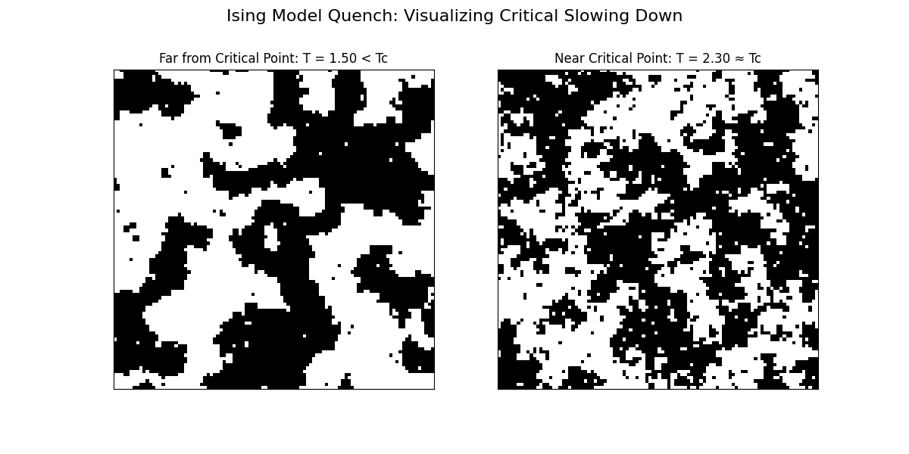
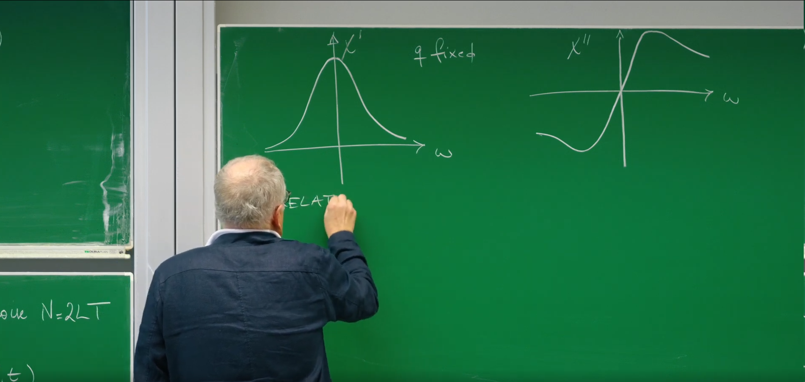
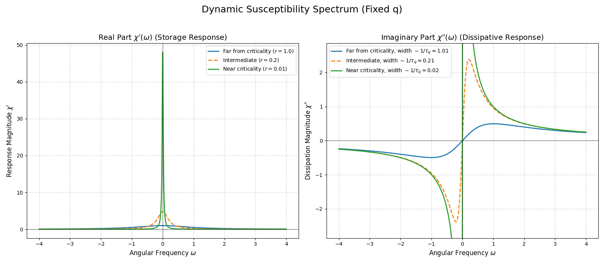
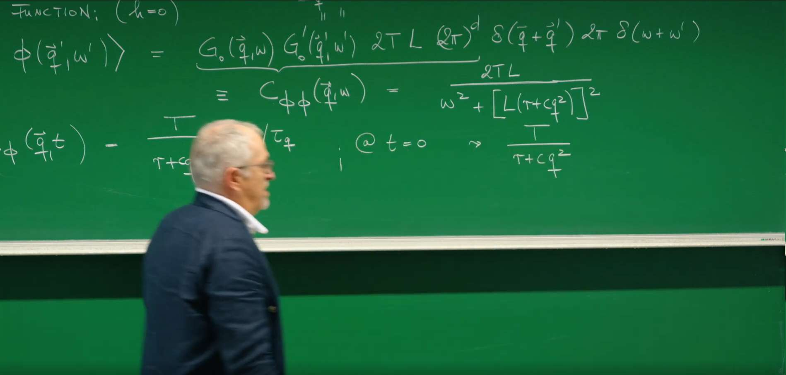
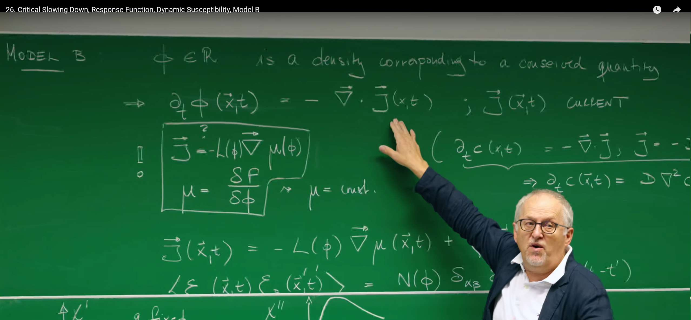

# 引言

在上一讲中，我们借助强大的**金兹堡-朗道理论**，描绘了一幅静态的**自由能景观 (free energy landscape)** 图：系统会通过梯度动力学，稳定地“滑向”并停留在景观的“山谷”之中。这引导我们得到了**模型 A (Model A)**，它描述了系统平衡态的**静态属性**。

然而，一个根本性的问题依然悬而未决：**系统“下山”的速度有多快？** 这节课，我们的焦点将从系统**是否**达到平衡，转移到它**如何以及多快**达到平衡。我们将深入研究涨落的时间特性，特别是在临界点附近，此时自由能景观变得异常平坦。这一探索将揭示临界现象最引人注目的动态特征之一：**临界慢化 (critical slowing down)** 。

随后，Erwin Frey 教授将介绍一套强大的分析工具——**响应函数 (response function)** 和**动态磁化率 (dynamic susceptibility)**——来主动“探测”这些动力学过程。这将揭示一个深刻的内在联系：系统内部的自发**涨落**与其对外场响应的**耗散**之间是如何被**涨落-耗散定理**统一起来的。

最后，课程将引入一类新的动力学模型——**模型 B (Model B)**。它与模型A的根本区别在于，它专门用于描述序参量是**守恒量**的系统，为我们后续理解相分离和斑图形成等更为复杂的现象奠定坚实的基础。

# 1. 模型 A 的动力学与临界慢化

在上一节课中，模型A构建了一幅静态的“自由能地貌图”。这幅图景虽然成功地预测了系统在不同温度下的平衡相态，但它本身是静止的。现在，我们将为这幅静态的画卷注入时间的维度，探讨系统是如何在这片地貌上动态演化的。我们将从最基本的问题入手：**一个偏离了平衡“山谷”的涨落，会以多快的速度衰减回去？**对这个问题的探索，将引导我们发现临界点附近一个普适的动力学现象——**临界慢化。**

## 1.1 回顾模型 A 的运动方程

从模型 A 的朗之万方程出发，在平均场（或高斯近似）的框架下，我们忽略了自由能中的四次项，只考虑涨落的二次贡献。对于序参量 $\phi$ 的涨落，其在傅里叶空间中的动力学方程可以线性化为：

$$\partial_t\phi(\mathbf{q},t) = -L(r+cq^2)\phi(\mathbf{q},t) + Lh(\mathbf{q},t) + \xi(\mathbf{q},t)$$


* **左侧项 $\partial_t \phi(\mathbf{q}, t)$** ：代表了波矢 (wave vector)为 $\mathbf{q}$ 的涨落模式（可以理解为空间尺度 $\lambda \sim 1/|\mathbf{q}|$ 的一种“波纹”）其振幅随时间的变化率。

* **恢复力项 $-L(r + cq^2)\phi(\mathbf{q}, t)$** ：这是驱动系统回归平衡的确定性“恢复力”。
    * $L$ 是**昂萨格动力学系数**，它设定了系统弛豫的整体时间尺度，衡量了系统“下滑”的速度。
    * 括号中的项 $(r + cq^2)$ 正是我们在第25讲中推导出的**静态关联函数的倒数**（忽略温度因子 $T$），即 $\langle \phi(\mathbf{q}) \phi(-\mathbf{q}) \rangle_0 = \frac{T}{r + cq^2}$。这一联系告诉我们：**一个静态时关联越强的模式（分母越小），它在动态演化中感受到的恢复力就越微弱。**

* **外场驱动项 $Lh(\mathbf{q}, t)$** ：代表来自与序参量 $\phi$ 共轭的外部场 $h$ 的驱动力。例如，在磁性系统中，这就是外部磁场。

* **热噪声项 $\xi(\mathbf{q}, t)$**：代表系统与热库耦合产生的、永不停歇的随机“踢动”。它是一个时空高斯白噪声，其强度由**涨落-耗散定理**严格确定为 $\langle \xi(\mathbf{q}, t) \xi(\mathbf{q}', t') \rangle = 2LT(2\pi)^d \delta(\mathbf{q} + \mathbf{q}') \delta(t - t')$。

## 1.2 推导特征弛豫时间 $\tau_q$

为了理解系统的**本征动力学**（intrinsic dynamics），即系统自身的“个性”，我们需要剥离外部的干扰。为此，我们考察在没有外场 ($h=0$) 并且忽略瞬时噪声（或者说，对噪声进行系综平均，$\langle\xi\rangle=0$）的情况下，一个涨落是如何自行衰减的。此时，平均值 $\langle\phi(\mathbf{q},t)\rangle$ 的演化遵循一个纯粹确定性的方程：

$$\frac{d}{dt}\langle\phi(\mathbf{q},t)\rangle = -L(r+cq^2)\langle\phi(\mathbf{q},t)\rangle$$

这是一个标准的一阶线性常微分方程，其解为我们非常熟悉的指数衰减形式：

$$\langle\phi(\mathbf{q},t)\rangle = \phi(\mathbf{q},0)e^{-t/\tau_q}$$

其中，我们定义了波矢为 $\mathbf{q}$ 的模式的**特征弛豫时间 (characteristic relaxation time) $\tau_q$** ：

$$\tau_q = \frac{1}{L(r+cq^2)}$$

这个 $\tau_q$ 的物理意义非常直观：它就是波矢为 $\mathbf{q}$ 的涨落模式从一个非平衡态恢复到平衡态所需要的特征时间。$\tau_q$ 越长，意味着该模式的“记忆”越持久，衰减得越慢。

## 1.3 临界慢化的物理内涵 (Critical Slowing Down)

现在，我们到达了这节课的第一个核心。让我们考察当系统接近临界点时，这个弛豫时间会发生什么戏剧性的变化。临界点由 $r \to 0$ 来标志。从 $\tau_q$ 的表达式中可以清晰地看到：

当 $r \to 0$ （接近临界温度）且 $\mathbf{q} \to 0$ （考虑宏观大尺度涨落）时，$\tau_q \to \infty$！

这种弛豫时间在临界点附近的发散现象，就是所谓的**临界慢化 (critical slowing down)** 。它的物理根源，可以直接从我们之前建立的自由能景观图中得到深刻的理解：

* **参数 $r$ 的作用（地貌的平坦化）**：参数 $r \propto (T-T_c)$ 衡量系统离临界温度 $T_c$ 的距离。当 $r \to 0$ 时，系统趋近 $T_c$，自由能景观 $f(\phi) = \frac{r}{2}\phi^2 + \dots$ 在原点附近的曲率（二次项系数）消失，变得**极为平坦**。在一个平坦的势能面上，系统几乎不受恢复力的作用，因此在受到热扰动后，需要极长的时间才能“滚回”平衡位置。

* **参数 $\mathbf{q}$ 的作用（大尺度涨落的低成本）** ：波矢 $\mathbf{q}$ 反映了涨落的空间尺度，即 $\lambda \sim 1/|\mathbf{q}|$。当 $\mathbf{q} \to 0$ 时，我们考虑的是波长极长、空间尺度非常大的涨落。$c|\mathbf{q}|^2$ 项代表了产生空间梯度（即序参量的不均匀性）的能量代价。对于平缓的大尺度涨落，这个能量代价非常小。

* **综合效应**：在临界点（$r=0$），长波涨落（$\mathbf{q} \to 0$）的恢复力完全消失，导致其弛豫时间发散。系统的动力学行为仿佛被“**冻结**”了，对扰动的响应变得无限缓慢。

这种“慢化”并不仅仅是简单的发散，它遵循着普适的标度律。在动态临界现象理论中，人们定义了一个普适的**动态临界指数 $z$**，它描述了特征弛豫时间 $\tau_\xi$ 与**关联长度 $\xi$** 之间的标度关系：$\tau_\xi \sim \xi^z$。在我们的平均场模型 A 中，关联长度 $\xi \sim r^{-1/2}$。对于与关联尺度相当的模式，其波矢 $q \sim 1/\xi$，其弛豫时间为 $\tau_\xi \approx \frac{1}{L(r+c\xi^{-2})} \sim \frac{1}{L(r+cr)} \sim r^{-1}$。将 $\xi \sim r^{-1/2}$ 代入，我们得到 $\tau_\xi \sim (\xi^{-2})^{-1} = \xi^2$。因此，对于模型 A，其动态临界指数 **$z=2$** 。这表明临界慢化是一种具有特定幂律行为的、深刻的普适现象。

临界慢化（Critical slowing down）这一概念源于19世纪对液体-气体相变中“临界乳光”现象的观察，由比利时物理学家Léon Van Hove (莱昂·范霍夫) 在1954年正式提出的，他预测，当系统接近临界点时，其动力学将急剧减慢。**其物理本质在于，当一个系统无限趋近于连续相变的临界点时，其对应的自由能景观会变得异常平坦，导致将系统从涨落中拉回平衡态的恢复力几乎消失。**因此，系统内部的涨落可以在空间上形成宏观尺度的长程关联（即关联长度发散），而这些巨大的、相互关联的涨落需要极长的时间才能耗散掉，最终使得系统的弛豫时间趋于无穷。**这一深刻的物理现象不仅是凝聚态物理中的基本特征，如今更被广泛用作一种普适的“早期预警信号”，用于预测复杂系统（如气候模式、生态系统稳定性、乃至金融市场）即将发生的临界突变或“引爆点”。**


## 1.4. Python 模拟：临界慢化的动态可视化

为了能亲眼“看见”临界慢化，我们转向一个具体的微观模型——**二维伊辛模型**。该模型是模型A理论的经典范例。我们将通过**蒙特卡洛模拟**，观察一个初始处于完全无序（高温随机态）的自旋系统，在被瞬间“淬火”到不同温度后，是如何演化（弛豫）到其平衡态的。

下面的Python代码将模拟并生成一个动画，并排比较系统在**远离临界点 ($T < T_c$)** 和**接近临界点 ($T ≈ T_c$)** 两种情况下的动态演化过程。

```python
import numpy as np
import matplotlib.pyplot as plt
import matplotlib.animation as animation

# --- 1. Simulation Parameters ---
N = 100  # Lattice size (N x N)
# Critical temperature for 2D Ising model
Tc = 2 / np.log(1 + np.sqrt(2))  # ~2.269

# We will compare two scenarios
T_far = 1.5  # Temperature far below Tc (fast relaxation)
T_near = 2.3 # Temperature very close to Tc (critical slowing down)

n_frames = 200  # Number of frames in the animation
mc_steps_per_frame = 10  # Monte Carlo steps between each frame

# --- 2. Core Ising Model Functions ---
def initial_state(N):
    """Generates a random spin configuration."""
    return np.random.choice([-1, 1], size=(N, N))

def metropolis_step(config, T):
    """Performs one Monte Carlo step using the Metropolis algorithm."""
    for _ in range(N * N):
        # 1. Pick a random spin
        x, y = np.random.randint(0, N, size=2)
        spin = config[x, y]
        
        # 2. Calculate energy change if flipped
        # Periodic boundary conditions are used here
        neighbors = config[(x+1)%N, y] + config[x, (y+1)%N] + \
                    config[(x-1+N)%N, y] + config[x, (y-1+N)%N]
        delta_E = 2 * spin * neighbors  # J=1, k_B=1
        
        # 3. Flip spin based on Metropolis criterion
        if delta_E < 0 or np.random.rand() < np.exp(-delta_E / T):
            config[x, y] = -spin
    return config

# --- 3. Setup the Animation ---
fig, (ax1, ax2) = plt.subplots(1, 2, figsize=(12, 6))

# Initialize two separate spin configurations
config_far = initial_state(N)
config_near = config_far.copy()  # Start from the exact same random state

# Setup for the "Far from Tc" plot
ax1.set_title(f'Far from Critical Point: T = {T_far:.2f} < Tc')
im1 = ax1.imshow(config_far, cmap='binary', animated=True)
ax1.set_xticks([])
ax1.set_yticks([])

# Setup for the "Near Tc" plot
ax2.set_title(f'Near Critical Point: T = {T_near:.2f} ≈ Tc')
im2 = ax2.imshow(config_near, cmap='binary', animated=True)
ax2.set_xticks([])
ax2.set_yticks([])

fig.suptitle('Ising Model Quench: Visualizing Critical Slowing Down', fontsize=16)

# --- 4. Animation Update Function ---
def update(frame):
    """This function is called for each frame of the animation."""
    global config_far, config_near
    
    # Perform Monte Carlo steps for both systems
    for _ in range(mc_steps_per_frame):
        config_far = metropolis_step(config_far, T_far)
        config_near = metropolis_step(config_near, T_near)
    
    # Update the plots
    im1.set_data(config_far)
    im2.set_data(config_near)
    
    # Print progress
    if (frame + 1) % 20 == 0:
        print(f'Animating frame {frame + 1}/{n_frames}...')
        
    return im1, im2

# --- 5. Create and Save the Animation ---
print("Generating animation... this may take a minute.")
ani = animation.FuncAnimation(
    fig, update, frames=n_frames, interval=50, blit=True, repeat=True
)

# Save the animation to a file instead of showing it
ani.save('critical_slowing_down.gif', writer='pillow', fps=10)
print("Animation saved as 'critical_slowing_down.gif'")
```



**远离临界点, $T < Tc$** :从初始的随机“雪花点”状态开始，系统**非常迅速**地自组织起来。小磁畴快速合并、长大，很快就形成了大块的、稳定的黑色和白色区域。这个“大鱼吃小鱼”的粗化过程非常高效。在动画的后半段，系统结构基本稳定，只有边界在缓慢地“拉直”以进一步降低能量。这代表了系统已经**快速弛豫**到了它的低能有序状态。

**接近临界点, T ≈ Tc** :系统同样从完全相同的随机状态出发，但其演化过程**极其缓慢** 。磁畴在**所有尺度**上不断地形成、合并又破碎，呈现出一幅闪烁不定、犬牙交错的复杂斑图（**临界涨落**）。
系统似乎“犹豫不决”，无法在宏观上形成稳定的有序结构。直到动画结束，系统依然处于一种高度动态和混乱的状态。这种演化的停滞，正是**临界慢化**的直接视觉证据：由于自由能地貌变得平坦，恢复力极其微弱，系统需要无限长的时间才能从涨落中弛豫出来。动力学仿佛被“**冻结**”了。


# 2. 系统响应与动态磁化率 $\chi(q,\omega)$

上一小节，我们是被动地"观察"一个系统如何自发地从扰动中恢复平静。这就像是看到一个钟摆自己慢慢停下来。但要真正了解这个钟摆的特性（比如它的固有频率和阻尼），一个更主动、更强大的方法是去"推"它一下，看看它是如何反应的。

这一部分，我们将扮演"实验物理学家"的角色。我们不再被动等待，而是主动地用一个微小的、周期性变化的外部"探针"（外场）去"拨动"系统，然后仔细听它的回响。通过分析系统是如何响应这个探针的，我们将能以前所未有的深度，揭示其内在的动力学特性。这个"回响"的数学描述，就是本节课要介绍的核心物理量——**动态磁化率**。

## 2.1. 在频域中探测系统：动力学的"光谱"

我们研究系统自发弛豫时，关注的是时间 $t$。但要研究系统对一个**周期性**探针的响应，最自然的语言不是时间域，而是**频率域 (frequency domain)** 。这就像在音乐中，我们不仅关心音符何时响起，更关心它的音高（频率）。

我们的"探针"是一个在空间和时间上都呈周期性变化的微小外场 $h(\mathbf{x}, t)$。通过傅里叶变换，任何复杂的时空变化都可以被分解为一系列简单的平面波的叠加。我们只取其中一个分量来研究：$h(\mathbf{q}, t) = h_0 e^{-i\omega t}$。

  * $\mathbf{q}$ 是**波矢**，决定了探针在**空间**上的周期性 ($\lambda \sim 1/|\mathbf{q}|$)。
  * $\omega$ 是**角频率**，决定了探针在**时间**上的周期性 ($T \sim 1/\omega$)。

为了分析系统的响应 $\phi(\mathbf{q}, t)$，我们同样对它进行时间上的傅里叶变换，得到 $\phi(\mathbf{q}, \omega)$：

$$\phi(\mathbf{q},\omega) = \int_{-\infty}^{\infty} dt \, e^{i\omega t} \phi(\mathbf{q},t)$$

这个变换的威力在于，它将一个随时间演化的复杂动力学问题，分解成了一系列在不同频率 $\omega$ 下的、简单的代数问题。时间导数 $\partial_t$ 在频域中被一个简单的乘法因子 $-i\omega$ 所取代。这使得求解变得异常简单，更重要的是，它让我们能看到系统对不同频率的"音高"是如何选择性响应的，从而绘制出系统的**动力学"光谱"** 。

## 2.2. 动态磁化率的推导：系统的"传递函数"

我们将傅里叶变换应用于模型 A 的线性化运动方程的每一项：

$$\underbrace{-i\omega\phi(\mathbf{q},\omega)}_{\text{from } \partial_t\phi} = \underbrace{-L(r+c|\mathbf{q}|^2)\phi(\mathbf{q},\omega)}_{\text{恢复力}} + \underbrace{Lh(\mathbf{q},\omega)}_{\text{外场驱动}} + \underbrace{\xi(\mathbf{q},\omega)}_{\text{噪声}}$$

我们关心的是系统对外部场的**平均响应**，因此对上式取系综平均 $\langle\ldots\rangle$。由于热噪声的平均值为零，$\langle\xi(\mathbf{q},\omega)\rangle=0$，噪声项便消失了。剩下的就是一个纯粹的代数方程：

$$-i\omega\langle\phi(\mathbf{q},\omega)\rangle = -L(r+c|\mathbf{q}|^2)\langle\phi(\mathbf{q},\omega)\rangle + Lh(\mathbf{q},\omega)$$

整理一下，将所有包含 $\langle\phi\rangle$ 的项移到左边，我们就可以解出**输出 (系统响应 $\langle\phi\rangle$)** 与**输入 (外部探针 $h$)** 之间的关系：

$$\langle\phi(\mathbf{q},\omega)\rangle = \underbrace{\frac{L}{-i\omega+L(r+c|\mathbf{q}|^2)}}_{\text{比例系数}} h(\mathbf{q},\omega)$$

这个比例系数，在物理学中被定义为**动态磁化率 (dynamic susceptibility)** ，记作 $\chi(\mathbf{q},\omega)$。在工程学上，它就是系统的 **"传递函数" (transfer function)** 。它精确地告诉我们，系统是如何"过滤"或"转换"一个特定时空频率的输入的。

$$\chi(\mathbf{q},\omega) := \left.\frac{\partial\langle\phi(\mathbf{q},\omega)\rangle}{\partial h(\mathbf{q},\omega)}\right|_{h=0} = \frac{L}{-i\omega+L(r+c|\mathbf{q}|^2)}$$

利用我们在第一部分定义的弛豫时间 $\tau_q = \frac{1}{L(r+c|\mathbf{q}|^2)}$，上式可以写成一个更紧凑、物理意义更清晰的形式：

$$\chi(\mathbf{q}, \omega) = \frac{L\tau_q}{1 - i\omega\tau_q}$$

这个公式完美地将系统的响应特性 ($\chi$) 与其内在的弛豫时间 ($\tau_q$) 联系在了一起。

## 2.3. 静态极限：连接动态与静态的桥梁

一个可靠的新理论，必须能在适当的极限下回归到已知的、被验证过的旧理论。这是一个重要的**自洽性检验**。让我们考察当外部探针的变化无限缓慢时，即**静态极限** ($\omega=0$)，会发生什么。

$$\chi(\mathbf{q},\omega=0) = \frac{L\tau_q}{1 - 0} = L\tau_q = L \cdot \frac{1}{L(r+c|\mathbf{q}|^2)} = \frac{1}{r+c|\mathbf{q}|^2}$$

这个结果正是我们在上一讲中推导出的**静态磁化率**（或静态Ornstein-Zernike关联函数的形式）。这表明，我们的动态理论是自洽的，它正确地包含了静态平衡态理论作为其一个特例。这给了我们继续探索的信心。

## 2.4. $\chi'$ 和 $\chi''$ 的物理诠释：储能与耗散

动态磁化率 $\chi(\mathbf{q},\omega)$ 是一个复数，这意味着系统的响应与外部的驱动之间存在**相位差**。我们可以将其分解为实部和虚部，这两部分各自具有深刻的物理意义。

通过对 $\chi(\mathbf{q}, \omega) = \frac{L\tau_q}{1 - i\omega\tau_q}$ 的分母进行有理化（分子分母同乘 $1+i\omega\tau_q$），我们得到：

$$\chi(\mathbf{q},\omega) = \underbrace{\frac{L\tau_q}{1+(\omega\tau_q)^2}}_{\chi'(\mathbf{q},\omega)} + i \underbrace{\frac{L\omega\tau_q^2}{1+(\omega\tau_q)^2}}_{\chi''(\mathbf{q},\omega)}$$

  * **实部 $\chi'(\mathbf{q},\omega)$ (色散部分)**：
    它描述了系统响应中与驱动场**同相 (in-phase)** 的部分。想象一下无摩擦地推一个秋千，你的推力与秋千的位移是同相的。这部分响应不消耗能量，只涉及能量在系统与外场之间的可逆交换，因此也被称为**弹性 (elastic)** 或**储能 (storage)** 部分。

  * **虚部 $\chi''(\mathbf{q},\omega)$ (耗散部分)**：
    它描述了系统响应中比驱动场**滞后90度 (out-of-phase)** 的部分。现在想象推一个有空气阻力的秋千，你必须在它到达最高点之前就开始用力，你的力的峰值会超前于位移的峰值。从系统的角度看，它的响应（位移）总是落后于你的驱动。这种相位滞后直接与**能量耗散**相关：系统从外场吸收能量，并通过类似摩擦的内部过程将其转化为热量。因此，$\chi''$ 也被称为**吸收 (absorptive)** 部分。一个非零的 $\chi''$ 是系统存在不可逆过程的标志，并与热力学第二定律紧密相连。

**临界慢化的"光谱"特征：**

如教授在黑板的绘图所示，$\chi''(\omega)$ 的函数形式是一个**洛伦兹峰**。这个峰的宽度蕴含着关键的动力学信息。其**半高宽恰好等于系统弛豫速率的倒数**，$\Delta\omega_{1/2} = 1/\tau_q$。这是一个深刻的联系：
**时域**中的弛豫过程越慢（$\tau_q$ 越大），**频域**中系统能够有效吸收能量的频率范围就越窄（$\Delta\omega_{1/2}$ 越小）。

因此，**临界慢化** ($\tau_q \to \infty$) 在频域中的表现就是：**吸收峰 $\chi''(\omega)$ 变得无限尖锐（宽度 $\to 0$）**。这意味着，在临界点，系统变得极度"挑剔"，它只能够对频率趋近于零的、极其缓慢的扰动产生耗散响应。对于任何有限频率的"快"扰动，它都"来不及"反应。

| 特性 | 实部 $\chi'(\mathbf{q},\omega)$ | 虚部 $\chi''(\mathbf{q},\omega)$ |
| :--- | :--- | :--- |
| **物理名称** | 色散 / 弹性 / 储能 | 吸收 / 耗散 |
| **与外场的相位关系** | 同相 (In-phase) | 滞后90度 (Out-of-phase) |
| **能量过程** | 能量在系统与外场间可逆交换 (储能) | 系统从外场吸收能量并转化为热 (耗散) |
| **函数形状 (vs $\omega$)** | 对称的色散曲线 | 对称的洛伦兹吸收峰 |
| **临界点行为** | 在 $\omega=0$ 处发散 | 峰变得无限高、无限尖锐 |


## 2.5. Python 可视化：动态响应的光谱剖析

为了精准地理解动态磁化率的实部和虚部是如何随频率 $ω$ 变化的，我们来直接复现 Erwin Frey 教授在课堂黑板上绘制的经典谱图，并用代码精确地揭示其内在规律。

我们将绘制在一个**固定的空间尺度 (fixed q)** 下，系统响应的**储能部分 $χ'(ω)$** 和**耗散部分 $χ''(ω)$** 的图像。通过设置三个不同但递进的 $r$ 值（$r=1.0$ 远离临界点，$r=0.2$ 为中间状态，$r=0.01$ 极度接近临界点），我们可以清晰地观察到系统是如何一步步陷入“临界慢化”状态的。

```python
import numpy as np
import matplotlib.pyplot as plt

# --- 1. Model Parameters ---
L = 1.0
c = 1.0
q_fixed = 0.1  # We fix the wavevector q as shown on the blackboard

# --- Define three scenarios to show the transition ---
r_far = 1.0       # Far from critical point (gentle curve)
r_inter = 0.2     # Intermediate case
r_near = 0.01     # Very near critical point (sharp peak)

# --- Calculate the corresponding relaxation times ---
tau_q_far = 1.0 / (L * (r_far + c * q_fixed**2))
tau_q_inter = 1.0 / (L * (r_inter + c * q_fixed**2))
tau_q_near = 1.0 / (L * (r_near + c * q_fixed**2))

# Setup the frequency omega range
omega = np.linspace(-4, 4, 1000)

# --- 2. Define functions for chi' and chi'' ---
def chi_prime(omega, L, tau_q):
    """Calculates the real part of the dynamic susceptibility."""
    return (L * tau_q) / (1 + (omega * tau_q)**2)

def chi_double_prime(omega, L, tau_q):
    """Calculates the imaginary part of the dynamic susceptibility."""
    return (L * omega * tau_q**2) / (1 + (omega * tau_q)**2)

# --- 3. Calculate data for all scenarios ---
chi_p_far = chi_prime(omega, L, tau_q_far)
chi_pp_far = chi_double_prime(omega, L, tau_q_far)

chi_p_inter = chi_prime(omega, L, tau_q_inter)
chi_pp_inter = chi_double_prime(omega, L, tau_q_inter)

chi_p_near = chi_prime(omega, L, tau_q_near)
chi_pp_near = chi_double_prime(omega, L, tau_q_near)

# --- 4. Visualization (replicating the blackboard concept) ---
fig, (ax1, ax2) = plt.subplots(1, 2, figsize=(16, 7))
fig.suptitle('Dynamic Susceptibility Spectrum (Fixed q)', fontsize=18)

# --- Plot for chi' (Real Part - Storage Response) ---
ax1.plot(omega, chi_p_far, label=f'Far from criticality ($r={r_far}$)', lw=2)
ax1.plot(omega, chi_p_inter, label=f'Intermediate ($r={r_inter}$)', lw=2, linestyle='--')
ax1.plot(omega, chi_p_near, label=f'Near criticality ($r={r_near}$)', lw=2)
ax1.set_title(r"Real Part $\chi'(\omega)$ (Storage Response)", fontsize=14)
ax1.set_xlabel(r'Angular Frequency $\omega$', fontsize=12)
ax1.set_ylabel(r"Response Magnitude $\chi'$", fontsize=12)
ax1.grid(True, linestyle='--', alpha=0.6)
ax1.legend()
ax1.axhline(0, color='black', lw=0.5)
ax1.axvline(0, color='black', lw=0.5)

# --- Plot for chi'' (Imaginary Part - Dissipative Response) ---
ax2.plot(omega, chi_pp_far, label=f'Far from criticality, width $\sim 1/\\tau_q \\approx {1/tau_q_far:.2f}$', lw=2)
ax2.plot(omega, chi_pp_inter, label=f'Intermediate, width $\sim 1/\\tau_q \\approx {1/tau_q_inter:.2f}$', lw=2, linestyle='--')
ax2.plot(omega, chi_pp_near, label=f'Near criticality, width $\sim 1/\\tau_q \\approx {1/tau_q_near:.2f}$', lw=2)
ax2.set_title(r"Imaginary Part $\chi''(\omega)$ (Dissipative Response)", fontsize=14)
ax2.set_xlabel(r'Angular Frequency $\omega$', fontsize=12)
ax2.set_ylabel(r"Dissipation Magnitude $\chi''$", fontsize=12)
ax2.grid(True, linestyle='--', alpha=0.6)
ax2.legend()
ax2.axhline(0, color='black', lw=0.5)
ax2.axvline(0, color='black', lw=0.5)

# Set a symmetric y-limit for the chi'' plot to better see the change in width
max_y_val = np.max(chi_pp_inter) * 1.2
ax2.set_ylim(-max_y_val, max_y_val)


plt.tight_layout(rect=[0, 0, 1, 0.95])
plt.show()
```



**左图 (Real Part $\chi'(\omega)$  储能响应)**:
此图展示了系统的弹性或储能响应，其形状为对称的“钟形”曲线，在$\omega=0$处达到峰值。当我们逐渐接近临界点（$r$ 从1.0的蓝色曲线变为0.2的橙色曲线，再到0.01的绿色曲线），峰值变得越来越高，曲线也越来越尖锐。这表明，系统对缓慢的、近乎静态的扰动($\omega \approx 0$)变得极其敏感（响应幅度$\chi'$巨大）。然而，它对高频扰动的响应能力却急剧下降。系统变得“挑剔”，只对特定类型的扰动有强烈反应。

**右图 (Imaginary Part $\chi''(\omega)$ - 耗散响应)**:
此图展示了系统的能量耗散能力，形状为反演对称的“S形”曲线。能量耗散的峰值出现在一个特征频率上。这是**临界慢化**最直接的体现。随着$r$减小，曲线急剧地向中心$ω=0$收缩。图例中的数据显示，耗散谱的特征宽度（正比于$1/\tau_q$）从远离临界点的1.01，急剧缩小到接近临界点的0.02。耗散谱的“变窄”意味着系统的弛豫时间$\tau_q$在急剧增长。一个“慢”的系统无法跟上快速变化的外部扰动，因此它只能在非常低的频率下才能有效地吸收和耗散能量。在临界点，系统变得无限“慢”，其耗散能力完全集中在了零频率上。
## 3. 涨落-耗散定理

在上一小节，我们通过施加一个外部“探针”$h(q, \omega)$，成功地绘制出了系统动力学响应的“光谱指纹”$\chi(q, \omega)$。我们理解了其虚部 $\chi''$ 是系统**耗散**能量能力的量度。

现在，我们进入这节课的理论核心。我们将关掉所有外部探针 ($h=0$)，让系统回归到纯粹的热平衡态。在这种状态下，系统并非静止不动，而是由于与热库的持续能量交换，内部充满了永不停歇的、自发的**热涨落**。我们的任务是，为这些内在的、随机的能量交换建立数学描述，即**动态关联函数 $C(q, \omega)$** 。

最终，我们将证明，系统在被动状态下的内在“涨落”，与它在主动状态下的“耗散”响应，并非孤立的现象，而是由一个深刻的物理原理——**涨落-耗散定理 (Fluctuation-Dissipation Theorem, FDT)** ——紧密地联系在一起。

## 3.1. 动态关联函数 $C(q,\omega)$：涨落的功率谱

我们的出发点，依然是模型 A 的线性化朗之万方程，但这次外场 $h=0$。在频域中，它变为：

$$-i\omega\phi(q,\omega) = -L(r+cq^2)\phi(q,\omega) + \xi(q,\omega)$$


解出 $\phi(q,\omega)$，我们得到：


$$\phi(q,\omega) = \frac{1}{-i\omega+L(r+cq^2)}\xi(q,\omega) = G_0(q,\omega)\xi(q,\omega)$$


这个方程的物理图像极为清晰：

* **输入 (Source):** $\xi(q,\omega)$ 是来自热库的、最原始的**高斯白噪声**。所谓“白”，意味着它的功率在所有频率上都是均匀的，就像白光包含所有颜色的光一样。
* **滤波器 (Filter):** $G_0(q,\omega)$ 是我们之前定义的**响应函数**。在这里，它扮演了系统自身的“滤波器”角色。
* **输出 (Output):** $\phi(q,\omega)$ 是我们宏观上能观测到的序参量涨落。它不再是“白”的，而是经过系统自身动力学特性（由$G_0$描述）过滤后的**“有色”噪声**。系统会放大某些频率的噪声（在共振频率附近），同时抑制其他频率的噪声。

我们感兴趣的物理量是**动态关联函数**，也称为**功率谱密度 (Power Spectral Density)** 。它被定义为涨落的二阶矩，衡量了涨落“功率”在不同频率上的分布：

$$C_{\phi\phi}(q, \omega) \equiv \frac{\langle \phi(q, \omega) \phi(-q, -\omega) \rangle}{(2\pi)^{d+1}}$$

代入 $\phi = G_0 \xi$ 的关系，我们得到：


$$C_{\phi\phi}(q,\omega) \propto \langle G_0(q,\omega)\xi(q,\omega) G_0(-q,-\omega)\xi(-q,-\omega) \rangle$$


$$= G_0(q,\omega)G_0(-q,-\omega) \langle \xi(q,\omega)\xi(-q,-\omega) \rangle $$


由于 $G_0(-q,-\omega) = G_0^*(q,\omega)$（$G_0$的共轭），因此 $G_0(q,\omega)G_0(-q,-\omega) = |G_0(q,\omega)|^2$。

我们知道热噪声的关联性质为：

$$\langle\xi(q,\omega)\xi(q',\omega')\rangle = 2LT(2\pi)^{d+1}\delta(q+q')\delta(\omega+\omega')$$

代入后，我们可以得到关联函数的最终表达式：

$$C_{\phi\phi}(q, \omega) = |G_0(q, \omega)|^2 (2LT) = \frac{1}{\omega^2 + [L(r + cq^2)]^2} \cdot (2LT)$$


整理后得到：


$$C_{\phi\phi}(q, \omega) = \frac{2LT}{\omega^2 + [L(r + cq^2)]^2}$$

这个公式告诉我们，系统内部涨落的频谱形状（一个关于$\omega$的洛伦兹函数）完全由其自身的响应特性（由分母中的项决定）和热噪声的强度（由分子$2LT$决定）所塑造。


## 3.2. 连接涨落与耗散





现在，我们将上一部分“推动”实验的结果与这一部分“倾听”实验的结果并列在一起，正如教授在黑板上所做的那样，一个深刻的联系即将浮现。

* **耗散 (来自“推动”实验)**: 系统的能量耗散能力由响应的虚部$\chi''$描述：
  
    $$\chi''(q,\omega) = \frac{L\omega}{\omega^2+[L(r+cq^2)]^2}$$
    
* **涨落 (来自“倾听”实验)**: 系统的内在涨落功率谱由关联函数$C$描述：
  
    $$C_{\phi\phi}(q,\omega) = \frac{2LT}{\omega^2+[L(r+cq^2)]^2}$$

仔细观察这两个表达式，它们的**分母完全相同**！这绝非巧合。通过简单的代数运算，我们可以立即发现它们之间存在一个惊人而优美的关系：


$$C_{\phi\phi}(q,\omega) = \frac{2T}{\omega} \chi''(q,\omega)$$

这个简洁的等式就是著名的**涨落-耗散定理 (Fluctuation-Dissipation Theorem, FDT)** 。**它是在平均场近似下推导出来的，但其普适性远超于此，对于更广泛的系统同样成立。**

## 3.3. FDT 的深刻含义：一枚硬币的两面

涨落-耗散定理是统计物理学中最深刻、最普适的原理之一。它如同一座桥梁，连接了两个看似截然不同的物理世界：**平衡态**的微观世界和**近非平衡态**的宏观世界。

* **等式左边 $C_{\phi\phi}(q,\omega)$**：描述了一个处于**热力学平衡态**的系统，其内部自发的、微观的**热涨落**的频谱。这是系统在完全不受外界干扰，“静静地待着”时的内在属性。

* **等式右边 $\chi''(q,\omega)$**：描述了当系统被一个外部力**驱动偏离平衡**时，它如何**耗散能量**。这是系统在被“推动”时，表现出的宏观“摩擦”或“阻尼”属性。


**这两种现象源于同一个微观物理过程**。那些导致序参量在平衡值附近“摇摆不定”的微观过程（例如粒子碰撞、热搅动等，这些都被我们打包在噪声项 $\xi$ 和与之相关的阻尼项 $L$ 中），也正是当系统被外力推动时产生摩擦力、导致能量耗散的微观过程。**一个系统的内在“嘈杂”程度与它对外来干扰的“阻碍”程度，是同一枚硬币的两面。**这经在前面的课程中多次提及。

**温度 $T$** 在这个关系中扮演了至关重要的角色：它设定了驱动热涨落的能量尺度。在绝对零度 $T=0$ 时，所有热涨落消失（$C=0$），但系统的耗散能力 $\chi''$ 依然存在（在量子体系中）。

这个定理的强大之处在于它的**预测能力**：它允许实验物理学家通过测量一个系统的宏观耗散响应（例如，通过交流磁化率测量），来推断其内部微观的平衡涨落谱，反之亦然。

为了更清晰地理解这一点，我们可以将这两个核心概念总结在下表中：

| 特征         | 关联函数 $C(q,\omega)$        | 动态磁化率虚部 $\chi''(q,\omega)$   |
| ---------- | ------------------ | ------------------ |
| **物理情景** | 平衡态下的自发涨落 ($h=0$)    | 对外部扰动的响应 ($h\neq 0$)    |
| **描述内容** | 热涨落的功率谱 (“倾听”)     | 能量耗散与相位滞后 (“推动”)   |
| **正比于** | 温度 $T$               | 动力学系数 $L$            |
| **FDT 连接** | $C(q,\omega)=\frac{2T}{\omega} \chi''(q,\omega)$ | $\chi''(q,\omega)=\frac{\omega}{2T} C(q,\omega)$ |
| **物理本质** | 系统的内在“微观抖动”        | 系统的宏观“摩擦阻力”        |


# 4. 模型 B：守恒律下的输运与相分离

至此，我们已经深入剖析了模型 A。它的核心是一种**局域弛豫 (local relaxation)** 动力学：系统在自由能景观的每个点上，都试图独立地“滑向”山谷。这完美地描述了一个**非守恒**序参量，比如磁铁中的自旋，一个局域的自旋可以与晶格交换能量和角动量，从而自行翻转，而无需考虑遥远处的另一个自旋必须反向翻转。

然而，自然界中许多更常见的相变，发生在序参量**守恒**的系统中。想象一下一杯混合均匀的油和水，当它开始分离时，油分子并不能在A点凭空消失，然后在B点出现。它必须**物理地流过**中间的每一个点。这种物质不能被凭空创造或毁灭的限制，即**守恒律 (conservation law)** ，为系统的动力学施加了最强的“枷锁”。

为了描述这类过程，我们需要一个全新的动力学框架。这个框架不再基于局域的“产生”与“湮灭”，而是基于物质的**“输运” (transport)** 与 **“流” (current)**。这就是**模型 B** 的核心思想。

## 4.1. 物理动机：守恒的序参量

模型 A 描述的微观过程可以看作是一种局域的“反应”，例如自旋向上 $\uparrow$ 与自旋向下 $\downarrow$ 的相互转换。

然而，在许多物理系统中，序参量是守恒的。这意味着序参量的总积分（例如，总粒子数、总浓度）在整个系统内是一个不随时间改变的常量。典型的例子包括：

* **二元合金**：A、B 两种原子的浓度。A原子想到达新位置，必须与那里的B原子交换位置。
* **液-气相变**：流体的密度。分子必须通过流动来改变局域密度。
* **高分子溶液**：聚合物的浓度。

在这些系统中，如果某个区域的密度 $\varphi$ 降低了，那么必然有粒子**流出**该区域，并**流入**其他区域，导致其他区域的密度相应升高。这种非局域的物质重新分布，是守恒系统动力学的本质特征。

## 4.2. 连续性方程：守恒律的数学化身

任何守恒量的动力学都必须无条件地遵循**连续性方程 (continuity equation)** 。这是守恒律最直接的数学翻译：
$$
\frac{\partial \phi(\mathbf{x},t)}{\partial t} = -\nabla \cdot \mathbf{J}(\mathbf{x},t)
$$

这个方程的物理图像非常直观，就像浴缸里的水量变化：

* $\frac{\partial \phi}{\partial t}$：浴缸里**水位（密度 $\phi$）的变化率**。
* $\mathbf{J}$：通过水龙头流入或通过排水口流出的**水流（流 $\mathbf{J}$）**。
* $-\nabla \cdot \mathbf{J}$：流入减去流出后的**净流入量**（流的负散度）。

方程表明，局域密度的任何变化，都**必须**由一个穿过该区域边界的**流**来解释。因此，构建守恒系统动力学的问题，就完全转化为一个核心任务：**为这个流 $\mathbf{J}$ 建立一个物理上合理的表达式。**

## 4.3. 构建粒子流 $\mathbf{J}$：化学势的梯度

驱动粒子流的根本热力学“力”是什么？答案是**化学势 $\mu$ 的梯度**。化学势 $\mu = \frac{\delta F}{\delta \phi}$ 可以被理解为增加一个粒子到系统某处所需要的自由能，它衡量了粒子在局域的“拥挤程度”。系统会自发地将粒子从化学势高的区域（拥挤）输运到化学势低的区域（稀疏），以使总自由能 $F$ 最小化。在最终的平衡态，整个系统的化学势处处相等，$\mu = \text{const.}$，所有宏观的粒子流都停止了。



因此，流的确定性部分与化学势的梯度成正比：
$$
\mathbf{J}_{\text{det}} = -L(\phi)\nabla\mu = -L(\phi)\nabla\frac{\delta F}{\delta \phi}
$$

这里的 $L(\phi)$ 是一个正比于粒子**迁移率 (mobility)** 的昂萨格动力学系数。

与模型 A 一样，一个有限温度的系统必然存在热涨落。对于守恒系统，这种涨落表现为一个随机的**涨落流 $\boldsymbol{\xi}_J$** 。根据涨落-耗散定理，这个随机流的强度与迁移率 $L(\phi)$ 和温度 $T$ 直接相关。总的流表达式为：
$$
\mathbf{J}(\mathbf{x},t) = -L(\phi)\nabla\frac{\delta F}{\delta \phi} + \boldsymbol{\xi}_J(\mathbf{x},t)
$$

其中涨落流的关联性质为：
$$
\langle \xi_{J\alpha}(\mathbf{x}, t) \xi_{J\beta}(\mathbf{x}', t') \rangle = 2L(\phi)T \delta_{\alpha\beta} \delta(\mathbf{x}-\mathbf{x}')\delta(t-t')
$$

## 4.4. 模型 B 的最终形式与物理内涵

将流 $\mathbf{J}$ 的完整表达式代入连续性方程，我们就得到了**模型 B (Model B)** 的一般形式，它也被称为**含噪的卡恩-希尔亚德方程 (stochastic Cahn-Hilliard equation)** ：
$$
\frac{\partial \phi}{\partial t} = 
-\nabla\cdot\left[-L\nabla\frac{\delta F}{\delta \phi} + \boldsymbol{\xi}_J\right] 
= \nabla\cdot\left[L\nabla\frac{\delta F}{\delta \phi}\right] - \nabla\cdot\boldsymbol{\xi}_J
$$

为了看清守恒律带来的深刻改变，让我们再次使用金兹堡-朗道自由能，并对比模型 A 和模型 B 的确定性部分：

| 特征 | **模型 A (非守恒)** | **模型 B (守恒)** |
| :--- | :--- | :--- |
| **核心物理** | 局域弛豫 (Local Relaxation) | 物质输运 (Mass Transport) |
| **基本方程** | $\frac{\partial \phi}{\partial t} = -L \frac{\delta F}{\delta \phi}$ | $\frac{\partial \phi}{\partial t} = \nabla \cdot \left(L \nabla \frac{\delta F}{\delta \phi}\right)$ |
| **GL 方程** | $\frac{\partial \phi}{\partial t} = -L(r\phi - c\nabla^2\phi)$ | $\frac{\partial \phi}{\partial t} = Lr\nabla^2\phi - Lc\nabla^4\phi$ |
| **动力学本质** | 反应-扩散方程 | 输运方程 (高阶) |
| **弛豫率** | $1/\tau_q \sim L(r+cq^2)$ | $1/\tau_q \sim L q^2(r+cq^2)$ |

这个对比揭示了两者之间一个根本性的结构差异：

1. **梯度算子的出现**：模型 B 的方程比模型 A 多了**两个**梯度算子 $\nabla$。这不是一个微小的数学修改，而是守恒律的直接烙印。它意味着 $\phi$ 的变化率不再由局域的化学势 $\mu$ 决定，而是由化学势的**空间变化 ($\nabla\mu$)** 所驱动的**流的汇聚 ($\nabla \cdot \mathbf{J}$)** 决定。
   
2. **弛豫率的 $q^2$ 因子**：在傅里叶空间中，每个 $\nabla$ 算子对应一个因子 $iq$。因此模型 B 的弛豫率比模型 A 多了一个 $q^2$ 因子。这个 $q^2$ 因子具有决定性的物理意义：
   * 当 $q \to 0$ 时（对应整个系统的总质量或平均浓度），弛豫率 $1/\tau_{q=0}^{\text{Model B}} \to 0$。这正是守恒律的数学表达：**系统的总质量（$q=0$ 模式）是一个不变量，它永远不会衰减**。
   * 弛豫只能发生在 $q > 0$ 的模式，这代表着物质在空间上的**重新分布**。
   
3. **相分离动力学**：当系统被淬火到低温区 ($r < 0$) 时，模型 B 方程中的 $Lr\nabla^2\phi$ 项变成了一个**负的扩散项**。这意味着它不再抹平涨落，而是会**放大**微小的密度涨落，这被称为**上坡扩散 (uphill diffusion)**。这个不稳定性正是**旋节线分解 (spinodal decomposition)** 的驱动力，它使得均匀混合相自发地分离成富含A相和富含B相的区域。而更高阶的 $-Lc\nabla^4\phi$ 项则起到了稳定作用，防止涨落无限增长，并最终决定了相分离结构的特征尺度。这是模型 A 完全无法描述的丰富动力学行为。


# 结论：从弛豫到输运，一座通往流体力学的桥梁

这节课不仅是**第25讲**静态相变理论的动态延伸，更是我们将**第24讲**中抽象的昂萨格理论和涨落-耗散原理应用于一个具体物理模型的完美展示。

* 我们首先深入分析了**模型 A** 的动力学，从理论上揭示并直观地看到了**临界慢化**这一深刻现象。我们发现，当系统趋近临界点时，其自由能景观变得异常平坦，导致系统的本征弛豫时间发散。这正是静态理论（发散的关联长度）在时间维度上的直接体现。

* 接着，我们引入了**动态磁化率 $\chi(q,\omega)$** 这一强大工具。通过主动“探测”系统，我们发现临界慢化在频域中的“指纹”是耗散谱峰的无限锐化。这让我们从另一个角度理解了系统在临界点是如何丧失对快速、局域扰动的响应能力的。

* 通过比较系统内在的涨落与外在的响应，我们为这个具体模型推导出了**涨落-耗散定理**。这不再仅仅是第24讲中的抽象原则，而是连接了具体物理量（关联函数C与响应函数$\chi''$）的实用公式，它完美印证了“涨落”与“耗散”源于同一微观过程的深刻思想。

* 最后，我们通过引入**守恒律**这一基本约束，完成了从**模型 A** 到**模型 B** 的关键跃迁。我们揭示了守恒律是如何从根本上改变动力学方程的结构的：它将局域的、非守恒的**弛豫**过程（模型 A），转变为非局域的、守恒的**输运**过程（模型 B）。弛豫率中多出的 $q^2$ 因子，正是“物质不能凭空消失，只能靠流动来重新分布”这一物理实在的数学烙印。

**模型 A** 和 **模型 B** 的区分，不仅仅是两个模型的区别，它代表了非平衡动力学中两种最基本的思维方式。它为我们理解自然界中种类繁多的相变和斑图形成现象提供了最核心的理论框架。

而我们对**模型 B**——这个最简单的**单标量守恒场**动力学模型的学习，正是一座通往更广阔领域的桥梁。在下一讲中，我们将把“守恒”这一思想推广到物理世界中最重要的一组守恒量上：**质量、动量和能量**。对这些守恒量动力学的研究，正是**流体力学 (Hydrodynamics)** 的核心。我们将从最简单的情况——无摩擦的理想流体——出发，推导出流体力学的基石性方程之一：**欧拉方程 (Euler Equation)** 。