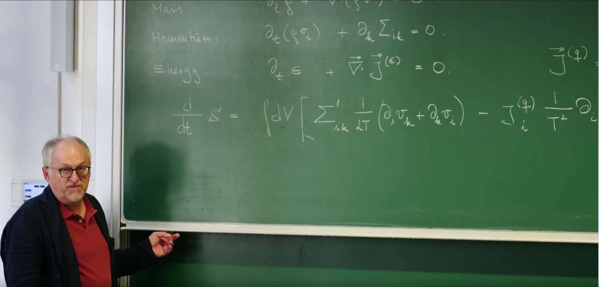
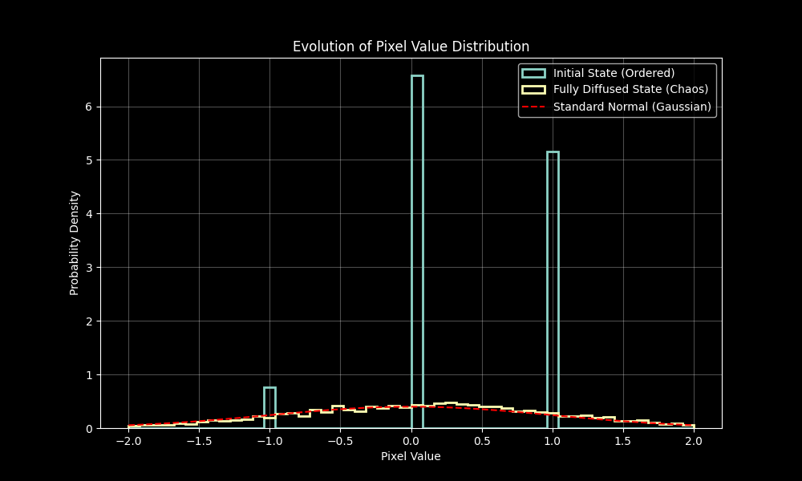

# 引言：流体动力学回顾回顾

在第27讲中，Erwin Frey 教授从物理学最基本的三大守恒定律——**质量守恒、动量守恒和能量守恒**出发，成功推导出了**理想流体**的动力学方程组，核心是**欧拉方程**。这个理论基于流体无粘性、无热传导的假设，描绘了一个完全**可逆**的等熵流世界。


这些守恒定律构成了连续介质力学的三大支柱，它们源于基本的对称性原理，具有普适性和精确性。其局域微分形式回顾如下：

1.  **质量守恒（连续性方程）**:
    $$
    \partial_t \rho + \nabla \cdot (\rho \mathbf{v}) = 0
    $$
    这个方程直观地表明，在一个微小的流体元内，**质量密度 $\rho$** 的时间变化率，完全取决于穿过其边界的**质量通量 $\rho \mathbf{v}$** 的净流入（散度）。它意味着质量不会凭空产生或消失。
    
2.  **动量守恒（类欧拉/纳维-斯托克斯方程）**:
    $$
    \partial_t (\rho v_i) + \partial_k \Sigma_{ik} = 0
    $$
    这是**牛顿第二定律**在流体微元上的体现。它指出，流体微元的**动量密度 $\rho v_i$** 的变化，是由作用在其表面上的**总应力张量 $\Sigma_{ik}$** 的散度所引起的。其中，所有复杂的相互作用和耗散效应都隐含在 $\Sigma_{ik}$ 的具体形式中。
    
3.  **能量守恒**:
    $$
    \partial_t \epsilon + \nabla \cdot \mathbf{j}^{(\epsilon)} = 0
    $$
    这个方程与质量守恒类似，表明局部**总能量密度 $\epsilon$** 的变化是由**总能量通量 $\mathbf{j}^{(\epsilon)}$** 的流入或流出决定的。

然理想流体模型无法描述现实世界中普遍存在的**不可逆性**。在第28讲中，为了将这些物理现实融入理论，引入了**粘性**（内部摩擦）和**热传导**（内部热量传递）这两个核心耗散机制。为此对总应力张量进行分解:

$$\Sigma_{ik} = -P \delta_{ik} + \Sigma'_{ik}$$

其中，$-P \delta_{ik}$ 是**静水压力**项，代表可逆的、理想流体部分；而 $\Sigma'_{ik}$ 是**粘性应力张量**，一个对称无迹的张量，它描述了由速度梯度引起的剪切力，是能量耗散和熵产生的主要来源。类似地，**热流密度 $\mathbf{j}^{(q)}$** 描述了由温度不均匀引起的热量流动，也是总能量通量 $\mathbf{j}^{(\epsilon)}$ 的一部分。

这些守恒定律本身虽精确，却不足以构成封闭的方程组，因为像 $\Sigma'_{ik}$ 和 $\mathbf{j}^{(q)}$ 这样的耗散项的具体形式仍是未知的。上一节课已经通过对称性原理和线性响应理论，为粘性应力张量 $\Sigma'_{ik}$ 和热流密度 $\mathbf{j}^{(q)}$ 构建了**本构关系**，从而推导出了**纳维-斯托克斯方程**和完整的**能量守恒方程**，并最终通过**熵平衡方程**，将流体动力学与**热力学第二定律**深刻联系起来，证明了输运系数（如粘度 $\eta, \xi$ 和热导率 $\kappa$）必须为正。

这节课将把之前在**第24讲**中建立的 ，关于**近平衡态下不可逆过程的普适理论框架** ，以及**涨落-耗散定理** ，系统地应用于描述这些耗散项，特别是为了推导所谓的**本构关系（Constitutive Relations）**。核心内容是，如何利用这个基于物理原理的普适框架，来理解各种**热力学通量**（如粘性应力、热流）与其**共轭的热力学力**（如速度梯度、温度梯度）之间的线性关系。此外，Erwin Frey 教授通过一个**“干性”扩散粒子系统**的案例研究，完整展示现代统计物理中构建动力学模型的标准流程：从自由能出发，识别守恒律，最终利用昂萨格框架推导随机动力学方程，从而将微观涨落与宏观耗散紧密联系起来。


# 1. 不可逆性的核心：熵产生

在上一节课的结尾，教授通过结合流体动力学守恒律与热力学，最终推导出了**熵平衡方程**，并揭示了粘性和热传导是熵的“源泉”。这节课将把这个结论作为出发点，将其形式化为一个深刻且普适的理论框架。

要描述不可逆过程，必须引入**热力学第二定律**，其核心概念是**熵**。在一个孤立系统中，总熵永不减少。在局部形式下，这意味着熵可以在空间中流动，但更重要的是，它可以在系统内部由于**耗散过程 (dissipative processes)** 而被“凭空创造”出来。

正如上一讲笔记所写，通过结合能量守恒定律和**局域热平衡假设**下的吉布斯关系 ($Tds = d\epsilon + Pdv_s$)，经过一系列推导，可以得到系统总熵由于不可逆过程而产生的变化率：

$$\frac{dS'}{dt} = \int dV \left[ \frac{1}{T} \Sigma'_{ik} \left( \frac{1}{2}(\partial_i v_k + \partial_k v_i) \right) - \frac{1}{T^2} j_i^{(q)} \partial_i T \right]$$


这个方程精确地描述熵是如何在连续系统中产生的：

**积分内的第一项**：$\frac{1}{T} \Sigma'_{ik} \left( \frac{1}{2}(\partial_i v_k + \partial_k v_i) \right)$。

  * 这一项代表由**粘性摩擦**引起的熵产生。
  
  * $\Sigma'_{ik}$ 是上节课引入的**粘性（或耗散）应力张量**，它代表了一种不可逆的动量"流动"或"**通量**"。
  
  * 对称化的速度梯度 $\frac{1}{2}(\partial_i v_k + \partial_k v_i)$ 是引起这种应变的“**驱动力**” ，它描述了流体微元的**形变率 (rate-of-strain)** 。正是这种导致相邻流体层发生相对滑动的形变，才是内部摩擦的真正来源，它会将宏观有序的动能不可逆地转化为微观无序的内能，从而产生熵。

**积分内的第二项**：$-\frac{1}{T^2} j_i^{(q)} \partial_i T$。

  * 这一项代表由**热传导**引起的熵产生。
  
  * $\mathbf{j}^{(q)}$ 是上节课通过傅里叶定律引入的**热流密度**，它是一种能量的"**通量**"。
  
    * 温度梯度 $\partial_i T$ 则是驱动热流的“**力**”。热量总是自发地从高温区流向低温区以抹平温度差异，这个过程是不可逆的，同样导致熵的增加。

这个表达式正是在**第24讲**中介绍的**昂萨格理论**的核心。可以将局域熵产生率（单位时间单位体积的熵增）$\sigma_s$ 写成一个更具一般性的双线性形式：

$$\sigma_s = \sum_a J_a X_a$$


其中：
* $J_a$ 被称为**热力学通量 (Thermodynamic Fluxes)** ，它代表了系统为响应不平衡而产生的各种“流”（如粒子流、热流、动量流）。

* $X_a$ 被称为共轭的**热力学力 (Thermodynamic Forces)** ，它量化了系统偏离热力学平衡的程度（如化学势梯度、温度梯度等）。

这种“通量-力”的配对是线性不可逆过程热力学理论的基石。对于简单流体，这个抽象的框架可以被清晰地翻译成具体的物理量：

**表1：简单流体中的热力学通量-力配对**

| 不可逆过程 | 热力学通量 $J_a$ (Flux) | 共轭热力学力 $X_a$ (Force) |
| :--- | :--- | :--- |
| **粘性耗散** | 粘性应力张量 $\Sigma'_{ik}$ | $\frac{1}{T} \left( \frac{1}{2}(\partial_i v_k + \partial_k v_i) \right)$ |
| **热传导** | 热流密度 $j_i^{(q)}$ | $-\frac{1}{T^2}\partial_i T = \partial_i\left(\frac{1}{T}\right)$ |


这个框架的重要性在于：要理解一个系统中的耗散，只需要通过守恒定律推导出熵产生率的表达式，然后将其整理成 $\sum_a J_a X_a$ 的形式，就能自动识别出所有相关的不可逆过程及其驱动力。当系统处于完美的热力学平衡态时，所有的“力”（如温度梯度、速度梯度）都为零，因此通量也为零，熵不再产生。**这一步清晰地识别出通量-力配对，是接下来建立它们之间线性关系（即本构关系）的逻辑前提**。


# 2. 昂萨格框架与涨落-耗散定理

上一节通过分析熵产生，成功地将复杂的耗散过程分解为一系列**热力学通量 ($J_a$)** 与其**共轭力 ($X_a$)** 的配对。这一分解是构建动力学方程的基石。接下来的任务是建立这些通量与力之间的定量关系，即找到普适的**本构关系**，并将有限温度下的热涨落也无缝地融入这个理论框架。

## 2.1 线性响应与昂萨格倒易关系

对于一个偏离热力学平衡不太远的系统，一个极其有效且物理上合理的假设是，系统产生的响应（通量）与驱动它的不平衡程度（力）之间存在线性关系。这便是**线性响应假设**，其数学形式为：

$$J_a = \sum_b L_{ab} X_b$$


这里的系数矩阵 $L_{ab}$ 被称为**昂萨格动力学系数 (Onsager kinetic coefficients)**。它并非一个抽象的数学符号，而是包含了系统中所有宏观输运性质的物理实体，例如在上一节课中遇到的**热导率 $\kappa$**、**剪切粘度 $\eta$** 和**体积粘度 $\xi$** 都是 $L_{ab}$ 矩阵的具体分量。

物理学家拉斯·昂萨格（Lars Onsager）进一步提出了一个基于微观动力学对称性的深刻见解：这个输运系数矩阵 $L_{ab}$ 并非是任意的，其分量之间存在着一种对称关系。这便是著名的**昂萨格倒易关系 (Onsager reciprocal relations)**，其思想在**第24讲**中有详细探讨：

$$L_{ab} = \varepsilon_a \varepsilon_b L_{ba}$$

其中，$\varepsilon_a = \pm 1$ 是宏观变量 $a$ 在**时间反演**变换下的**宇称 (parity)** （例如，密度、能量是偶宇称 $\varepsilon=+1$，而动量、磁场是奇宇称 $\varepsilon=-1$）。这个关系如同一座桥梁，将宏观世界可测量的输运现象（如热电效应）与微观世界不可见的时间反演对称性联系起来，是统计物理学中的一个里程碑。

## 2.2 热力学一致性：涨落-耗散定理

然而，一个纯粹确定性的关系 $J_a = \sum_b L_{ab} X_b$ 仍然是不完整的。一个只有耗散项的动力学系统，会单调地弛豫到其自由能的最低点，这对应于一个**绝对零度**的、完全静止的平衡态。但在任何有限温度 $T > 0$ 的系统中，构成系统的微观粒子（如分子）都在进行无休止的热运动，这必然导致宏观物理量围绕其平衡值进行永不停歇的**涨落 (fluctuations)** 。

**耗散**和**涨落**是同一枚硬币的两面，它们都源于系统与热库之间微观层面的能量与动量交换。为了保证动力学模型在没有外界驱动力时，能够正确地演化到由玻尔兹曼分布 $P \sim e^{-F/k_B T}$ 所描述的、有限温度下的热力学平衡态，动力学方程中必须包含一个随机项。

因此，通量的表达式需要修正为随机形式：

$$J_a = \sum_b L_{ab} X_b + \xi_a$$


这里的 $\xi_a$ 是一个随机噪声项，代表热涨落的效应。这个噪声的性质并非任意，其统计特性必须与系统的耗散性质（由 $L_{ab}$ 描述）和环境温度 $T$ 精确地关联起来。这个深刻的联系就是**涨落-耗散定理 (Fluctuation-Dissipation Theorem, FDT)** 。其核心内容是，噪声项的时空关联函数由昂萨格系数唯一确定：

$$\langle \xi_a(\mathbf{x}, t) \xi_b(\mathbf{x}', t') \rangle = 2 k_B T L_{ab} \delta(\mathbf{x}-\mathbf{x}') \delta(t-t')$$

(注意：Frey教授的课程中通常将玻尔兹曼常数 $k_B$ 设为1)。这个公式的物理内涵是：耗散越强的过程（$L_{ab}$ 越大），其伴随的热涨落也必然越剧烈。

让我们用**热传导**的例子来具体说明这一点：

* **确定性部分**：即**傅里叶定律** $j_i^{(q)} = -\kappa \partial_i T$。与上一节识别出的热力学力 $X_k = -\frac{1}{T^2}\partial_k T$ 对比，可以推导出昂萨格系数为 $L_{ik}^{(q)} = \kappa T^2 \delta_{ik}$。

* **涨落部分**：根据FDT，必然存在一个随机热流 $\eta_i$。其时空关联函数由 $L_{ik}^{(q)}$ 决定：

    $$\langle \eta_i(\mathbf{x}, t) \eta_j(\mathbf{x}', t') \rangle = 2 k_B T L_{ij}^{(q)} \delta(\mathbf{x}-\mathbf{x}') \delta(t-t') = 2 k_B T \kappa T^2 \delta_{ij} \delta(\mathbf{x}-\mathbf{x}') \delta(t-t')$$

这个结果的物理图像极为清晰：耗散过程（如热导、粘性）如同“摩擦力”，驱动系统“下山”，滑向自由能的最低点；而热涨落则如同随机的“踢动”，为系统提供“上山”的可能。涨落-耗散定理给出了这种“踢动”的恰当强度，使得“下山”的耗散与“上山”的涨落达到一个精妙的动态平衡。正是这个平衡，确保了系统最终能够正确地探索整个自由能形貌，并以玻尔兹曼分布的概率停留在各个状态，从而达到真正的热力学平衡。这正是连接系统动力学与平衡态统计力学的核心桥梁。

# 3. 案例研究：干性扩散粒子系统（模型B）的动力学

在建立了线性不可逆热力学的普适框架后，现在是时候将其应用于一个具体的物理系统，看理论如何转化为可计算的动力学模型。教授将以一个相互作用的扩散粒子系统为案例，完整地展示现代统计物理中构建宏观动力学模型的标准流程：

**1. 假设一个自由能 → 2. 识别守恒律 → 3. 利用昂萨格框架和涨落-耗散定理推导随机动力学方程**。

## 3.1 系统定义与自由能

所考虑的系统是一个由大量相互作用粒子构成的集合，其状态由一个连续的 **粒子密度场 $\rho(\mathbf{x}, t)$** 来描述。一个关键的设定是，这是一个**“干性” (dry) 系统**。这意味着粒子在一个静态的背景（热库）中运动，该背景只提供摩擦和热涨落，但其自身没有动力学。这与下一节课要讨论的、悬浮在动态流体中的“湿性” (wet) 系统形成了本质区别，后者会包含由流体介导的流体动力学相互作用。

描述该系统平衡态性质的出发点是其**自由能泛函 (Free Energy Functional) $F[\rho]$**。对于一个具有短程相互作用的系统，一个典型且普适的形式是**金兹堡-朗道 (Ginzburg-Landau) 自由能**：

$$F[\rho] = \int d\mathbf{x} \left[ f(\rho) + \frac{1}{2} K (\nabla \rho)^2 \right]$$


这个泛函的物理内涵是一场**有序与无序之间的“拔河”** ，由两部分构成：

1. **局域自由能密度 $f(\rho)$** ：它本身包含两项 $f(\rho) = k_B T\rho(\ln \rho - 1) + \frac{1}{2} \chi \rho^2$。

- 第一项是理想气体的**熵贡献** ，它倾向于最大化系统的无序度，将粒子均匀地散布在空间中。

- 第二项是**平均场相互作用项** ，参数 $\chi$ 描述了粒子间的有效吸引力（$\chi < 0$）或排斥力（$\chi > 0$）。这一项倾向于让系统能量降低，可能导致粒子聚集或形成有序结构。

2. **梯度平方项 $\frac{1}{2} K (\nabla \rho)^2$** ：这一项代表了对密度不均匀的能量惩罚，其中 $K>0$。它源于粒子间的短程相互作用，使得形成密度急剧变化的尖锐界面需要付出能量代价，因此它倾向于使密度分布变得平滑。

## 3.2 推导动力学方程

现在即可按照前述的“配方”来推导 $\rho(\mathbf{x}, t)$ 的动力学方程。

1.  **守恒律**：系统的总粒子数是守恒的。其局域表现形式就是**连续性方程**：
    $$
    \partial_t \rho = -\nabla \cdot \mathbf{J}
    $$
    其中 $\mathbf{J}$ 是粒子流密度。
    
2.  **识别通量和力**：
    * **通量**：在这个守恒系统中，**粒子流 $\mathbf{J}$** 显然是热力学通量。
    * **力**：驱动粒子流动的“势”是**化学势 $\mu$** 。在场论框架下，化学势被定义为自由能泛函对密度的泛函导数：$\mu = \frac{\delta F}{\delta \rho}$。因此，与之共轭的热力学力是化学势的负梯度，即 $X = -\nabla \mu$。

3. **应用昂萨格关系与FDT**：根据线性响应理论，确定性通量与力成正比，即 $\mathbf{J}_{\text{det}} = L(\rho) X = -L(\rho) \nabla\mu$。这里的输运系数 $L(\rho)$ 被称为**迁移率 (Mobility)** ，它描述了粒子在单位力驱动下移动的难易程度，本身可以依赖于密度。结合涨落-耗散定理，总的粒子流表达式为：

    $$\mathbf{J} = -L(\rho) \nabla \frac{\delta F[\rho]}{\delta \rho} + \sqrt{2k_B T L(\rho)} \boldsymbol{\Lambda}(\mathbf{x}, t)$$
   
    其中 $\boldsymbol{\Lambda}$ 是一个归一化的高斯白噪声矢量，满足：
    $$
    \langle \Lambda_\alpha(\mathbf{x}, t) \Lambda_\beta(\mathbf{x}', t') \rangle = \delta_{\alpha\beta} \delta(\mathbf{x} - \mathbf{x}') \delta(t - t')
    $$
    

将这个 $\mathbf{J}$ 的表达式代入连续性方程，就得到了描述该系统动力学的完整的随机偏微分方程。这个方程就是我们之前介绍过的**模型B (Model B)**，它描述了一个**守恒标量场**的纯耗散过阻尼动力学。


## 3.3 扩散方程

为了验证这个复杂框架的正确性，并揭示其中物理量的深刻联系，可以考察一个最简单的情形：**无相互作用的理想气体** 。这意味着忽略相互作用（$\chi = 0$）和梯度能量（$K = 0$）。自由能只剩下理想气体熵的部分：$F_{\text{ideal}} = k_B T \int \rho(\ln \rho - 1) d\mathbf{x}$。

在这种情况下，推导过程如下：

1.  **计算化学势**：
    $$
   \mu = \frac{\delta F_{\text{ideal}}}{\delta \rho} = k_B T (\ln \rho + 1 - 1) = k_B T \ln \rho
   $$
   
   
2.  **计算化学势梯度**：
    $$
   \nabla \mu = \frac{k_B T}{\rho} \nabla \rho
   $$
   
   
3.  **写出确定性粒子流**：
    $$
    \mathbf{J}_{\text{det}} = -L(\rho) \nabla \mu = -L(\rho) \frac{k_B T}{\rho} \nabla \rho
    $$
    
    
4.  **物理辨识**：现在需要确定迁移率 $L(\rho)$ 的具体形式。一个物理上合理的假设是，迁移率应与粒子数成正比，因为粒子越多，对梯度的响应也越强。课堂板书明确指出，为了恢复扩散方程，必须有 $L(\rho) = \frac{D\rho}{k_B T}$。其中 $D$ 是一个常数，即**扩散系数**。

5.  **恢复菲克定律**：将上述 $L(\rho)$ 的形式代入粒子流表达式：
    $$
    \mathbf{J}_{\text{det}} = -\left(\frac{D\rho}{k_B T}\right) \frac{k_B T}{\rho} \nabla \rho = -D \nabla \rho
    $$
    这正是我们熟知的**菲克第一定律 (Fick's First Law)** ！

将菲克定律代入连续性方程 $\partial_t \rho = -\nabla \cdot \mathbf{J}_{\text{det}}$，便得到了著名的**扩散方程** ：
$$
\partial_t \rho = D \nabla^2 \rho
$$

这个推导过程堪称完美：它不仅展示了这个普适的、基于自由能和熵产生的抽象框架能够正确地回归到已知的、更简单的物理定律，而且还揭示了宏观输运系数（扩散系数 $D$）与微观动力学参数（迁移率 $L(\rho)$）以及温度之间的深刻联系。关系式 $D = L(\rho) k_B T / \rho$ 正是**爱因斯坦关系**在这个连续场论框架下的具体体现。


# 4. 代码实践：连接物理扩散与生成式AI
粒子扩散的模拟我们已经在**第17讲**笔记中进行过代码实践，因此本节代码将做更进一步的拓展和思考。讲到扩散模型，初学者最先想到的是，当经深度学习中最流行的模型——Diffusion Model(DDPM)。这个扩散模型和这节课将的扩散模型有什么联系呢？

简单来说，它们的核心思想**一脉相承**，但**目标和应用却截然相反**。

* **物理学中的扩散模型** (本课程内容) 是一个**描述性 (Descriptive)** 模型，其目标是**理解和预测自然**。它描述了粒子如何从有序状态自发地演化到无序状态（熵增）。

* **深度学习中的扩散模型** 是一个**生成式 (Generative)** 模型，其目标是**学习和创造数据**。它通过学习如何**逆转**一个从有序到无序的过程，来实现从完全的无序（噪声）中创造出高度有序的数据（如图片）。

**核心区别与联系对照表**

| 特征             | 物理学扩散模型 (本课程)                                  | 深度学习扩散模型 (AI领域)                                    |
| :--------------- | :------------------------------------------------------- | :----------------------------------------------------------- |
| **核心目标** | **描述与预测**：理解并用数学方程描述一个真实发生的物理过程。 | **生成与创造**：学习一个数据分布，从而能够创造出全新的、类似的数据。 |
| **过程方向** | **正向过程 (Forward Process)** ：只关心从有序（如墨滴）到无序（均匀混合）的单向演化。 | **逆向过程 (Reverse Process)** ：核心是学习如何从无序（随机噪声）一步步恢复到有序（清晰图片）。 |
| **理论基础** | **热力学与统计物理**：基于自由能、熵、化学势等物理概念。 | **机器学习与概率论**：基于马尔可夫链、随机微分方程和神经网络参数化。 |
| **控制方程** | 确定的偏微分方程，如 $\partial_t \rho = D \nabla^2 \rho$。 | 由一个**经过训练的神经网络**来参数化的、可学习的逆向随机过程。 |
| **“扩散”的作用** | 一个需要被建模和理解的**自然现象**。                       | 一个**人为设计**的、用于逐渐破坏数据结构的**工具**。         |
| **学习/求解什么** | 通过实验数据求解物理参数，如扩散系数 $D$。                 | 学习一个神经网络的权重，使其能够精确地预测并移除每一步添加的噪声。 |

### 深度解读

深度学习扩散模型的灵感，**完全来自于**本课程所学的物理扩散过程。

**在物理学中**，一个高度有序的密度分布（比如一滴墨水）会随着时间流逝，因粒子的随机运动（布朗运动）而逐渐扩散，最终变成完全均匀、无序的混沌状态。这个过程是自发的，由热力学第二定律驱动。

**在深度学习中**，研究人员“模拟”了这个过程。他们从一张高度有序的清晰图片（比如猫的照片）开始，人为地、一步步地向图片中加入微量的高斯噪声。经过成百上千步之后，最初的猫的照片完全消失了，变成了一张纯粹的、毫无规律的随机噪声“马赛克”。

这个在AI中被称为**“正向过程”**或“扩散过程”的步骤，其数学形式与物理学中的扩散方程（或其离散化的朗之万动力学）是**完全一致的**。它是一个固定的、无需学习的、将复杂数据转化为简单噪声的配方。


**物理学家的目标**，是为上述的正向过程建立一个数学模型，以便能够预测墨水在任何时刻的浓度分布。我们**不会**去问：“如何让均匀混合的墨水自动变回一滴墨滴？”——因为这在宏观上是违背热力学第二定律的。

**AI研究者的目标**，却恰恰是这个物理上不可能的问题。他们问：“既然我有一个能将任何图片都变成标准噪声的固定流程，能否**学习一个‘时间倒流’的机器**，能将这个过程**完美地逆转**过来？”

这个“时间倒流的机器”就是一个**深度神经网络**（通常是U-Net架构）。它的任务是：输入一张加了噪声的图片和当前的时间步，然后**预测出在那一步被加入的噪声是什么**。

一旦这个网络被训练得足够好，就可以进行**生成**：

1.  从一个与目标图片尺寸相同的、纯粹的随机高斯噪声开始。

2.  让神经网络预测这个噪声图像中的“噪声部分”。

3.  从图像中减去这个预测出的噪声（只减去一小部分）。

4.  重复上一步数百次。

神奇的是，随着噪声被一步步地、有指导地移除，一个清晰、全新的、此前从未见过的图像（比如另一只猫）就会从混沌中逐渐浮现出来。

总结来说，深度学习的扩散模型巧妙地“借用”了物理扩散过程的数学形式来设计其正向的“数据销毁”过程，但其真正的创新和核心在于，利用强大的神经网络**学习了这个过程的逆过程**，从而把它变成了一个强大的生成工具。


### 代码实现
为了将本课程所学的物理扩散模型与当前人工智能领域最热门的生成式扩散模型联系起来，下面将通过代码同时模拟这两个过程：

**正向物理扩散 (Forward Process):**  
  从一张清晰的图像 $x_0$ 开始。在每一个时间步，我们都向图像中加入少量的高斯噪声。这个过程在数学上与第23讲中从朗之万方程推导出的涨落动力学是等价的，也与本讲中模型B的随机项 $\xi_J$ 的作用类似。其核心思想是，在任意时刻 $t$ 的状态 $x_t$ 可以由初始状态 $x_0$ 和一个标准高斯噪声 $\epsilon$ 直接得到：
$$
  x_t = \sqrt{\bar{\alpha}_t} x_0 + \sqrt{1 - \bar{\alpha}_t} \epsilon
$$

  其中，$\bar{\alpha}_t$ 是一个预先设定的、随时间 $t$ 减小的系数，它控制了信号（原始图像）与噪声的相对比例。随着时间推移，$\bar{\alpha}_t \to 0$，图像的“信息”会不断被噪声“污染”，最终完全融入背景噪声中，系统的熵达到最大。

**逆向生成过程 (Reverse Process):**  
  这是深度学习扩散模型的精髓。从一个纯粹的随机噪声图像 $x_T$ 开始。在每个“逆向”的时间步，我使用一个**“去噪”模型**来预测并移除图像中的一小部分噪声。这个模型的目标是预测在正向过程中加入的噪声 $\epsilon$，然后通过以下公式来近似恢复出前一时刻的状态 $x_{t-1}$：

$$
  x_{t-1} = \frac{1}{\sqrt{\alpha_t}} \left( x_t - \frac{1 - \alpha_t}{\sqrt{1 - \bar{\alpha}_t}} \epsilon_\theta(x_t, t) \right) + \sigma_t z
$$

这里的 $\epsilon_\theta(x_t, t)$ 就是由神经网络。为了简化代码，省略训练过程，在代码中由一个理想化的“神谕模型”(oracle_model)代替所预测的噪声。通过反复迭代这个去噪步骤，一个有意义的、清晰的图像将从噪声中逐渐“浮现”出来。

使用 oracle_model 的目的是为了演示理想的反向过程，而不需要实际训练神经网络。这样可以看到如果有一个完美的模型（能准确预测噪声），反向过程会是什么样子。这是理论上的最佳情况，在实际应用中，神经网络只能近似达到这种性能水平。

```python
# --- 1. Preamble and Imports ---
import numpy as np
import torch # Using PyTorch for its GPU capabilities and autograd, convenient for ML
import matplotlib.pyplot as plt
import matplotlib.animation as animation
from scipy.stats import norm

# --- 2. Setup and Hyperparameters ---
# Timesteps for the diffusion process
T = 200 
# Define the beta schedule (how much noise is added at each step)
# This is a linear schedule, which is simple and effective.
betas = torch.linspace(0.0001, 0.02, T)

# Pre-calculate alphas and their cumulative products, which are key to the diffusion math
alphas = 1. - betas
alphas_cumprod = torch.cumprod(alphas, axis=0)
# These pre-calculated values are essential for both the forward and reverse processes

# --- 3. Create the "Ordered System": A Simple Image ---
def create_initial_state(size=64, shape='smiley'):
    """Creates a simple 2D image as our initial ordered state."""
    img = torch.zeros((size, size))
    if shape == 'smiley':
        # Face circle
        for i in range(size):
            for j in range(size):
                if (i - size//2)**2 + (j - size//2)**2 < (size//2.5)**2:
                    img[i, j] = 1.0
        # Eyes
        img[size//2-10:size//2-5, size//2-10:size//2-5] = -1.0
        img[size//2-10:size//2-5, size//2+5:size//2+10] = -1.0
        # Mouth
        for i in range(size//2+5, size//2+15):
            img[i, size//2-10:size//2+10] = -1.0
    return img

x_start = create_initial_state()

# --- 4. The Forward Process (Physics Perspective) ---
def q_sample(x_start, t, noise=None):
    """
    Adds noise to an image x_start to get its state at time t.
    This function directly implements the forward physical diffusion process.
    """
    if noise is None:
        noise = torch.randn_like(x_start)
    
    # Get the pre-calculated coefficients for the given timestep t
    sqrt_alphas_cumprod_t = torch.sqrt(alphas_cumprod[t])
    sqrt_one_minus_alphas_cumprod_t = torch.sqrt(1. - alphas_cumprod[t])
    
    # Apply the forward process formula
    # x_t = sqrt(alpha_cumprod_t) * x_0 + sqrt(1 - alpha_cumprod_t) * noise
    noisy_image = sqrt_alphas_cumprod_t * x_start + sqrt_one_minus_alphas_cumprod_t * noise
    return noisy_image

# --- 5. The Reverse Process (Generative AI Perspective) ---
def p_sample(model, x, t):
    """
    Performs one step of denoising using a 'model'.
    This is the core of the reverse generative process.
    """
    # Use the model to predict the noise that was added at this timestep
    predicted_noise = model(x, t)
    
    # The mathematical formula to reverse one step
    alpha_t = alphas[t]
    alpha_cumprod_t = alphas_cumprod[t]
    
    # Subtract the predicted noise from the current image
    denoised_x = (x - torch.sqrt(1. - alpha_cumprod_t) * predicted_noise) / torch.sqrt(alpha_t)
    
    # Add back a small amount of stochastic noise (optional but common in practice)
    if t > 0:
        noise = torch.randn_like(x)
        beta_t = betas[t]
        sigma_t = torch.sqrt(beta_t) # Simplified variance
        denoised_x += sigma_t * noise
        
    return denoised_x

# --- 6. The "Oracle" Model (Simulating a Perfectly Trained AI) ---
def oracle_model(x_t, t, x_start_ref):
    """
    This is a placeholder for a real, trained neural network (like a U-Net).
    An 'oracle' has access to the original image (x_start_ref) and can therefore
    perfectly calculate the noise that was added. This allows us to visualize
    the ideal reverse process without the need for model training.
    """
    # The true noise is calculated by rearranging the forward process formula
    true_noise = (x_t - torch.sqrt(alphas_cumprod[t]) * x_start_ref) / torch.sqrt(1. - alphas_cumprod[t])
    return true_noise

# --- 7. Run the Full Simulation and Store Data ---
print("Running forward and reverse simulations to generate data...")
# Timesteps to display in the GIF and plots
display_timesteps = [0, T//4, T//2, 3*T//4, T-1]

# --- Run Forward Process ---
forward_images = []
for t in range(T):
    forward_images.append(q_sample(x_start, t))

# --- Run Reverse Process ---
# We need a reference to the original image for our 'oracle_model'
oracle_with_ref = lambda x, t: oracle_model(x, t, x_start)

reverse_images = []
# Start the reverse process from pure noise
x_t = torch.randn_like(x_start)
reverse_images.append(x_t)

for t in reversed(range(T)):
    x_t = p_sample(oracle_with_ref, x_t, t)
    reverse_images.append(x_t)
reverse_images = list(reversed(reverse_images)) # Put them in chronological order
print("Simulations finished.")

# --- 8. Create and Save Visualization ---
print("Creating visualization GIF and plots...")
plt.style.use('dark_background')
fig = plt.figure(figsize=(12, 7))
gs = fig.add_gridspec(2, 5)

# Create axes for the images
ax_f = [fig.add_subplot(gs[0, i]) for i in range(5)]
ax_r = [fig.add_subplot(gs[1, i]) for i in range(5)]

def update(frame):
    """Update function for the animation."""
    fig.clear()
    gs = fig.add_gridspec(2, 5)
    ax_f = [fig.add_subplot(gs[0, i]) for i in range(5)]
    ax_r = [fig.add_subplot(gs[1, i]) for i in range(5)]
    
    fig.suptitle('Physics Diffusion vs. Generative AI Diffusion', fontsize=16)

    # --- Update Forward Process Visualization ---
    for i, t_idx in enumerate(display_timesteps):
        # We show the gradual noising process
        current_t = min(t_idx, frame)
        ax_f[i].imshow(forward_images[current_t].numpy(), cmap='viridis', vmin=-2, vmax=2)
        ax_f[i].set_title(f'Forward t={current_t+1}')
        ax_f[i].axis('off')
    ax_f[0].set_ylabel('Forward Process\n(Order to Chaos)', fontsize=12, labelpad=20)

    # --- Update Reverse Process Visualization ---
    for i, t_idx in enumerate(display_timesteps):
        # We show the gradual denoising process
        current_t_rev = T - min(t_idx, frame)
        img_to_show = reverse_images[T - current_t_rev] if current_t_rev < len(reverse_images) else reverse_images[-1]
        ax_r[i].imshow(img_to_show.numpy(), cmap='viridis', vmin=-2, vmax=2)
        ax_r[i].set_title(f'Reverse t={T-current_t_rev+1}')
        ax_r[i].axis('off')
    ax_r[0].set_ylabel('Reverse Process\n(Chaos to Order)', fontsize=12, labelpad=20)
    
    return fig,

# Create and save the animation
anim = animation.FuncAnimation(fig, update, frames=T, interval=50, blit=False)
anim.save('physics_vs_ai_diffusion.gif', writer='pillow', fps=20)
plt.close(fig) # Close the animation figure

# --- Create Final Distribution Plot ---
fig_dist, ax_dist = plt.subplots(figsize=(10, 6))
ax_dist.set_title('Evolution of Pixel Value Distribution')
ax_dist.set_xlabel('Pixel Value')
ax_dist.set_ylabel('Probability Density')

# Plot initial distribution
initial_pixels = x_start.flatten().numpy()
ax_dist.hist(initial_pixels, bins=50, range=(-2, 2), density=True, histtype='step', lw=2, label='Initial State (Ordered)')

# Plot noise distribution (final state of forward process)
noise_pixels = forward_images[-1].flatten().numpy()
ax_dist.hist(noise_pixels, bins=50, range=(-2, 2), density=True, histtype='step', lw=2, label='Fully Diffused State (Chaos)')

# Plot a standard normal distribution for reference
x_norm = np.linspace(-2, 2, 100)
y_norm = norm.pdf(x_norm, 0, 1)
ax_dist.plot(x_norm, y_norm, 'r--', label='Standard Normal (Gaussian)')

ax_dist.legend()
ax_dist.grid(True, alpha=0.3)
plt.show()
print("Visualization saved and plot displayed.")

```


**上半部分 (Forward Process)**，是本课程所学的**物理扩散**。从一个有序、信息丰富的状态（笑脸）开始。随着时间的推移，随机噪声不断被加入，图像的结构和信息逐渐被破坏，最终系统达到了一个完全无序、混乱的宏观状态——纯粹的高斯噪声。**下半部分 (Reverse Process)** ，从一个完全无序、不包含任何信息的纯噪声状态开始（最右侧的图像）。然后，利用一个“理想化的”去噪模型，在每个时间步都精确地预测并移除一小部分噪声。随着这个迭代过程的进行，隐藏在混沌之下的结构和秩序逐渐浮现，最终从纯粹的噪声中**生成**了一个清晰的笑脸图像。



笑脸图像的像素值主要集中在 -1（背景）、0（眼睛/嘴巴）和 1（脸）这三个值附近，形成了一个高度结构化的、非高斯的分布。

扩散后分布 (橙色)，经过200步的物理扩散后，初始的结构完全消失，像素值的分布变成了一个标准的高斯分布（正态分布），与参考的红色虚线完美重合。这定量地表明，系统已经达到了完全随机、最大熵的状态。

纵观整个人工智能的发展史，其基石无不烙印着物理学的深刻思想：**从统计力学中的自旋玻璃模型催生出霍普菲尔德网络与玻尔兹曼机，到热力学熵概念奠定信息论的根基，再到优化算法广泛应用的梯度下降法，其思想与经典力学中物体沿势能最速下降的路径一致。如今，以非平衡热力学为灵感的扩散模型，更是在图像生成等领域掀起了革命性的浪潮。**

2024年，物理学家约翰·霍普菲尔德（John Hopfield）与杰弗里·辛顿（Geoffrey Hinton）因其在机器学习领域的奠基性工作而荣获诺贝尔物理学奖，这无疑是将“物理AI”这一交叉学科推向了前所未有的高潮。这一里程碑式的认可不仅彰显了物理学为构建复杂智能系统提供了严谨的理论框架和强大的数学工具，也预示着两大领域的融合将继续催生出更强大、更可解释、也更接近世界本质的下一代人工智能。

# 总结

这节课不仅为描述近平衡态系统构建了普适的动力学框架，还通过一个具体的案例展示了该框架的实际应用能力，为下一讲更复杂的流体耦合系统做好了铺垫。

这节课有两个核心内容：

1.  **建立了普适的理论框架**：课程系统性地阐述了**线性不可逆热力学**的核心思想。该理论围绕三个核心概念构建：

    * **熵产生率**的双线性形式 $\sigma_s = \sum_a J_a X_a$，它将所有不可逆过程都分解为“通量-力”的配对。
    
    * **线性响应关系** $J_a = \sum_b L_{ab} X_b$，它假设在近平衡区域，通量与力成正比，比例系数为昂萨格动力学系数 $L_{ab}$。
    
    * 连接宏观耗散与微观涨落的**涨落-耗散定理**，它规定了随机噪声项的关联强度必须为 $\langle \xi_a(t) \xi_b(t') \rangle = 2k_B T L_{ab} \delta(t-t')$，从而保证了系统能够正确地弛豫到有限温度下的热平衡态。
    
    这是一个极其强大的框架，可以为任何接近平衡的连续介质系统，构建出符合热力学基本原理的随机动力学方程。
    
2.  **应用框架于具体模型（模型B）**：课程将这个通用框架应用于一个**“干性”的扩散粒子系统**，从其**自由能泛函**出发，系统地推导出了描述其密度场演化的随机动力学方程（**模型B**）。并且，通过考察无相互作用的理想气体极限，验证了该模型可以正确地退化为我们所熟知的**菲克定律**和**扩散方程**，同时揭示了宏观扩散系数 $D$ 与微观迁移率 $L(\rho)$ 之间的深刻联系。

在这节课的案例分析中，特意强调了系统是**“干性” (dry)** 的，即粒子是在一个静态的背景（热库）中运动。这个背景只提供摩擦和热涨落，但其自身没有动力学，因此动量并不守恒，而是耗散到背景中。

这自然引出了一个问题：如果这些粒子是悬浮在一种**动态的流体（如水）**中，情况会发生什么变化？这就是所谓的**“湿性” (wet) 系统**，也是下一讲的主题。

在“湿性”系统中，粒子不仅会因为化学势梯度而扩散，还会被周围流体的流动所携带。这种效应被称为**平流 (Advection)** 。因此，总的粒子流将由两部分组成：

$$\mathbf{J}_{\text{total}} = \mathbf{J}_{\text{diffusive}} + \rho \mathbf{v}$$

其中 $\mathbf{v}$ 是流体的速度场。

这意味着，描述粒子密度场 $\rho$ 演化的**连续性方程**，现在必须与描述流体速度场 $\mathbf{v}$ 演化的**纳维-斯托克斯方程** **耦合** 在一起。这个描述悬浮粒子与流体耦合动力学的模型，通常被称为**模型H (Model H)** 。

这种耦合引入了全新的物理。一个粒子运动时，会搅动周围的流体，产生一个速度场。这个速度场会通过流体传播到很远的地方，从而影响其他所有粒子的运动。这是一种由流体介导的、长程的**流体动力学相互作用 (Hydrodynamic Interactions)** 。这种相互作用在“干性”的模型B中是不存在的，它对于理解胶体悬浮液、聚合物溶液以及生物细胞内部的物质输运等众多物理和生物现象至关重要。

因此，第29讲将带领我们进入一个更复杂也更丰富的领域，探索当一个守恒的序参量（如粒子密度）与流体的动量守恒发生耦合时，会涌现出怎样的新动力学行为。
