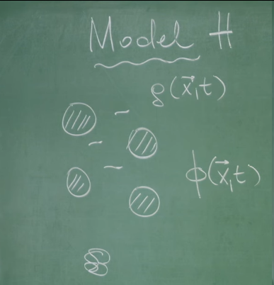
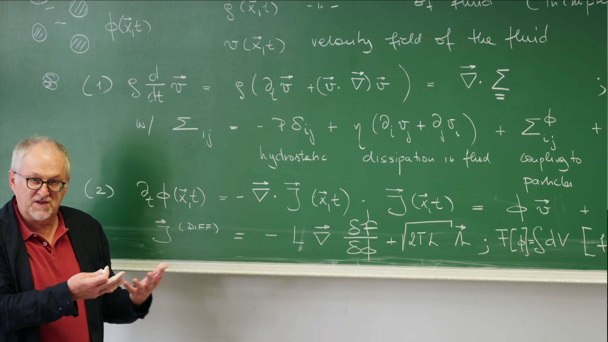

# 引言：流体动力学与悬浮粒子相互作用的桥梁

## 从B模型到H模型：耦合守恒场的动力学

在**第25讲**和**第26讲**中，对描述序参量动力学的模型进行了区分，特别是针对守恒序参量引入了**B模型**。正如在**第29讲**中详细探讨的，对于粒子密度 $\phi(\vec{x}, t)$ 这样的守恒量，其动力学不能简单地用局域弛豫来描述，而必须遵循一个**连续性方程**：

$$\frac{\partial \phi(\vec{x}, t)}{\partial t} = -\nabla \cdot \vec{J}(\vec{x}, t)$$

此方程表达了一个基本的物理事实：某个区域内粒子密度的变化率，只能源于粒子流 $\vec{J}(\vec{x}, t)$ 的净流入或流出。在B模型中，粒子流 $\vec{J}(\vec{x}, t)$ 被假设为由化学势 $\mu = \frac{\delta F}{\delta \phi}$ 的梯度驱动，即 $\vec{J}(\vec{x}, t) = -L \nabla\mu = -L \nabla \frac{\delta F[\phi]}{\delta \phi}$，其中 $L$ 为迁移率。这最终导出了一个类似于扩散的方程，为将 $\phi$ 理解为一个守恒标量场奠定了基础。这种B模型描述的是粒子在**"干性"背景**中扩散的情况。

这节课的核心问题在于，当这个由 $\phi(\vec{x}, t)$ 描述的守恒粒子系统被悬浮在一种**动态的流体**中时，其动力学将发生怎样的根本性变化？流体本身也拥有一个至关重要的守恒量：**动量密度 $\rho\vec{v}(\vec{x}, t)$**。流体动量场的动力学由在**第27讲**和**第28讲**中推导的著名**纳维-斯托克斯方程 (Navier-Stokes Equations)** 描述。因此，现在面对的是一个包含两个相互耦合的守恒场——粒子密度场 $\phi(\vec{x}, t)$ 和流体速度场 $\vec{v}(\vec{x}, t)$——的复杂系统。

这个双重守恒且相互耦合的系统，在Hohenberg和Halperin的动态普适类分类中被称为**H模型 (Model H)**。**H模型是描述一个守恒的标量序参量（如粒子密度 $\phi$）与一个守恒的矢量场（如流体动量 $\rho\vec{v}$，或直接体现为流体速度 $\vec{v}$）动态耦合的通用理论框架。**这种耦合是该模型的定义性特征，也是其丰富流体动力学行为的根源。这节课的目标，就是从第一性原理出发，推导出描述 $\phi(\vec{x}, t)$ 和 $\vec{v}(\vec{x}, t)$ 相互影响的耦合运动方程。



## 耦合的物理本质：一个动态反馈回路

H模型的结构并非简单地将两个独立系统（粒子与流体）进行叠加，它描述的是一个深刻的物理反馈回路。

一方面，流体通过**平流 (Advection)** 效应携带悬浮粒子运动。这意味着流体速度场 $\vec{v}(\vec{x}, t)$ 的变化会直接影响粒子密度场 $\phi(\vec{x}, t)$ 的演化。这个效应直观易懂：例如，水流会带动水中的沙粒运动。因此，粒子流 $\vec{J}(\vec{x}, t)$ 将包含一个由流体平流引起的贡献。

然而，根据牛顿第三定律，作用力与反作用力总是成对出现的。如果流体对粒子施加了平流力，那么粒子也必然对流体施加一个反作用力。这个反作用力并非一个简单的外部力，而必须源于粒子-流体混合物内在的热力学性质。这意味着，描述流体内力的**总应力张量 $\Sigma_{ij}$** （在**第28讲**中引入，用于描述粘性和压强），必然需要包含一个依赖于粒子构型 $\phi(\vec{x}, t)$ 的附加项，记为 $\Sigma_{ij}^\phi$。这个由粒子产生的附加应力 $\Sigma_{ij}^\phi$ 会通过其散度 $\nabla \cdot \Sigma^\phi$ 的形式，作用于流体，从而影响流体速度场 $\vec{v}(\vec{x}, t)$ 的演化。

因此，这节课的核心任务可以被看作是推导出这个关键的耦合项 $\Sigma_{ij}^\phi$ 以及描述平流的粒子流项，从而闭合这个粒子与流体之间的动态反馈回路。目标并非仅仅推导两个独立的方程，而是在揭示它们之间相互作用的深刻物理联系。通过H模型的研究，能够更全面地理解复杂流体-粒子混合系统中的集体动力学行为。

# 1. 控制方程：两个耦合守恒场的故事

在**第29讲**的结尾，区分了粒子在静态背景中运动的“干性”系统（如B模型）和悬浮于动态流体中的“湿性”系统。这节课将为这种更复杂的“湿性”系统建立其动力学的基本方程。整个系统的行为由两个核心的、相互耦合的守恒场共同主宰：描述流体运动的**速度场** $\vec{v}(\vec{x}, t)$ 和描述悬浮粒子分布的**密度场** $\phi(\vec{x}, t)$。

## 1.1 流体场：随机、不可压缩的纳维-斯托克斯方程

描述流体速度场 $\vec{v}(\vec{x}, t)$ 的基本方程是**动量守恒定律**。正如在**第27讲**和**第28讲**中从第一性原理建立的那样，该定律在流体微元上的体现（即牛顿第二定律）为：

$$
\rho \frac{D\vec{v}}{Dt} = \nabla \cdot\Sigma_{ij}
$$

其中，$\rho$ 是流体的（常数）质量密度。

* **物质导数 (Material Derivative)**：左侧的 $\frac{D\vec{v}}{Dt}$ 是连接欧拉视角与拉格朗日视角的关键，它描述了跟随一个流体元运动时所观察到的加速度。

    $$
    \frac{D\vec{v}}{Dt} = \underbrace{\frac{\partial \vec{v}}{\partial t}}_{\text{局域加速度}} + \underbrace{(\vec{v} \cdot \nabla)\vec{v}}_{\text{对流加速度}}
    $$

$\frac{\partial \vec{v}}{\partial t}$ 是在空间固定点上观测到的速度随时间的变化，而 **非线性对流项** $(\vec{v} \cdot \nabla)\vec{v}$ 则是由于流体元被自身携带到速度不同的新位置而产生的速度变化，它是流体力学中湍流等复杂现象的根源。

* **不可压缩条件 (Incompressibility Condition)**：对于水这样的液体，可以很好地近似为不可压缩流体。这一物理条件在数学上表现为一个对速度场的运动学约束，即其散度处处为零：
    $$
    \nabla \cdot \vec{v} = 0
    $$
    这个条件意味着任何一个流体元的体积在运动过程中都保持不变，它将极大地简化应力张量的形式。

* **应力张量 $\Sigma_{ij}$ 的分解**：方程的右侧 $\nabla \cdot \Sigma_{ij}$ 代表作用在流体元上的净表面力密度。总的应力张量 $\Sigma_{ij}$ 可以被分解为几个物理来源截然不同的部分，这直接来源于**第28讲**的推导：
    $$
    \Sigma_{ij} = -p\delta_{ij} + \eta(\partial_i v_j + \partial_j v_i) + \Sigma^\phi_{ij} + \sigma_{ij}
    $$
    1. **各向同性压力 ($-p\delta_{ij}$)**：这是流体的**可逆**部分，代表热力学压力，是理想流体（欧拉方程）中唯一存在的内应力。
    2. **粘性应力 ($\eta(\partial_i v_j + \partial_j v_i)$)**：这是流体的**不可逆耗散**部分，代表内摩擦力。$\eta$ 是剪切粘滞系数。注意，这里使用的是不可压缩流（$\nabla \cdot \vec{v} = 0$）条件下的简化形式。
    3. **随机应力 ($\sigma_{ij}$)**：这是动量方程的朗之万噪声项，是**涨落**的来源。它代表了来自流体分子自身热运动所产生的随机动量交换。根据**涨落-耗散定理**，其强度与耗散（粘性）和温度严格相关，确保系统在没有外力时能达到正确的玻尔兹曼平衡态。
    4. **粒子诱导应力 ($\Sigma^\phi_{ij}$)**：这是这节课需要寻找的关键**耦合项**。它描述了悬浮粒子对流体施加的反作用力，是连接两个场的桥梁。其推导是这节课的中心任务之一。

## 1.2 粒子场：耦合的对流-扩散方程

对于粒子密度场 $\phi(\vec{x}, t)$ 的演化，与**第29讲**中的B模型完全一样，由于粒子数守恒，其动力学必须由**连续性方程**决定：

$$
\frac{\partial \phi}{\partial t} = -\nabla \cdot \vec{J}
$$

在“湿性”系统中，粒子流 $\vec{J}$ 由两个物理上截然不同的过程贡献：

$$
\vec{J} = \vec{J}_{\text{conv}} + \vec{J}_{\text{diff}}
$$

* **对流 ($\vec{J}_{\text{conv}} = \phi\vec{v}$)** ：这部分描述了粒子被背景流体 $\vec{v}$ 被动携带（平流）的输运过程。这是与“干性”B模型相比的全新项，它构成了耦合反馈回路的第一环：**流体场 $\vec{v}$ 驱动粒子场 $\phi$ 的运动**。

* **扩散流 ($\vec{J}_{\text{diff}}$)** ：这部分描述了粒子相对于周围流体的、由热力学力驱动的运动。其形式与“干性”的B模型完全相同，都是由**第24讲**和**第29讲**中建立的**昂萨格线性关系**和**涨落-耗散定理**给出的：
    $$
    \vec{J}_{\text{diff}} = -L\nabla\mu + \vec{\xi}_J
    $$
    其中，化学势 $\mu = \frac{\delta F}{\delta \phi}$ 是驱动扩散的**热力学力** ，$L$ 是昂萨格动力学系数（迁移率），而 $\vec{\xi}_J$ 是与扩散过程相关的随机噪声流，其关联强度由 $L$ 和温度 $T$ 决定。

将这两部分组合，便构成了粒子密度场的完整动力学方程，一个**含噪的对流-扩散方程**：
$$
\frac{\partial \phi}{\partial t} + \nabla \cdot (\phi \vec{v}) = \nabla \cdot (L \nabla \mu) - \nabla \cdot \vec{\xi}_J
$$
在方程的最终形式中，对流项被移到了左侧。$\partial_t \phi + \nabla \cdot (\phi \vec{v})$ 这一组合清晰地展示了密度场 $\phi$ 是如何被速度场 $\vec{v}$ "携带"和输运的，这在数学结构上与纳维-斯托克斯方程中的物质导数项遥相呼应。

至此，H模型的两个基本控制方程的形式已经确立。它们清晰地展示了一个**单向的耦合关系**：纳维-斯托克斯方程中的速度场 $\vec{v}$，通过对流项 $\phi\vec{v}$ 直接影响了粒子密度场 $\phi$ 的时空演化。

然而，这个理论框架目前是不完备的，因为反馈回路尚未闭合。根据牛顿第三定律，如果流体能推动粒子，粒子也必须对流体施加反作用力。这个反作用力隐藏在纳维-斯托克斯方程中那个尚未确定的**粒子诱导应力张量 $\Sigma^\phi_{ij}$** 之中。在当前的形式下，粒子场 $\phi$ 的任何变化都不会对流体场 $\vec{v}$ 产生任何影响，这在物理上是不可能的。

因此，接下来的核心任务，就是利用热力学和对称性原理，推导出这个关键的耦合项 $\Sigma^\phi_{ij}$ 的具体表达式，从而**闭合这个反馈回路**，构建出完整且自洽的H模型。


# 2. 关键的耦合：从热力学推导应力张量 $\Sigma^\phi$

粒子如何对流体施加反作用力？这个物理过程在数学上被封装在**粒子诱导应力张量 $\Sigma^\phi$** 中。这小节将通过连接**粒子系统的热力学**与**流体力学** ，为这个关键的耦合项找到其精确的表达式。推导的巧妙之处在于应用**虚功原理 (Principle of Virtual Work)** ，它断言一个系统在微小虚位移下，外力所做的功等于其自由能的变化。

**虚功 (Virtual Work)** 不是真实发生的功。它是一个在“思想实验”中计算出来的功。

想象一个处于**静止平衡 (static equilibrium)** 状态的系统，比如一块石头稳稳地放在地上，或者一个天平两端平衡。现在，我们在脑海里对这个系统进行一个**虚位移 (Virtual Displacement)** 。

这个“虚位移”有三个关键特征：**假想的 (Hypothetical)** 、**无穷小的 (Infinitesimal)** 、**瞬时的 (Instantaneous)** ，作用在系统上的所有力所做的功的总和。

因此，对于一个处于静力平衡状态的系统，所有外力作用下所产生的总虚功为零。

数学上表示为：

$$\delta W = \sum_i \vec{F}_i \cdot \delta\vec{r}_i = 0$$

其中 $\delta W$ 是总虚功，$\vec{F}_i$ 是作用在质点 $i$ 上的力，$\delta\vec{r}_i$ 是质点 $i$ 的虚位移。

它允许我们只分析力和位移，而完全忽略那些我们不关心的、复杂的内部约束力（比如绳子的张力、接触面的支持力等），这些约束力在虚位移中通常不做功或者其做的功会相互抵消。

## 2.1 热力学驱动力：自由能泛函 $F[\phi]$

要理解粒子系统的行为，其出发点必须是描述其平衡态性质的**自由能泛函 $F[\phi]$** 。这与在**第25讲**和**第29讲**中对模型A和模型B的分析一脉相承。自由能是驱动系统演化的“势能”，其具体形式为经典的Ginzburg-Landau（或Cahn-Hilliard）泛函：

$$
F[\phi] = \int d^3x \left[ f(\phi) + \frac{\kappa}{2}(\nabla\phi)^2 \right]
$$

* **体自由能密度 ($f(\phi)$)** ：这一项描述了均匀系统中单位体积的自由能，它由熵的贡献和粒子间平均场相互作用共同决定。对于会发生相分离的系统，$f(\phi)$ 通常具有双势阱结构。

* **梯度能量 ($\frac{\kappa}{2}(\nabla\phi)^2$)** ：这一项是对浓度梯度的能量惩罚，其中系数 $\kappa > 0$。它使得形成陡峭的浓度梯度（即相界面）需要付出能量代价，这正是**表面张力**的微观来源。

有了自由能泛函，驱动粒子扩散的**化学势 $\mu$** 就可以通过泛函变分导数来定义，它代表了增加一个粒子到系统中某处所引起的自由能变化：

$$
\mu = \frac{\delta F}{\delta \phi} = \frac{\partial f}{\partial \phi} - \kappa \nabla^2 \phi
$$

这个化学势 $\mu$ 就是驱动粒子扩散的有效热力学力。
## 2.2 通过虚功原理的推导

现在，严格按照讲座中的推导思路，来找出 $\Sigma^\phi$ 和 $\mu$ 之间的关系。

**第一步：从力学角度计算自由能变化**

考虑一个微小的、不可压缩的 ($\nabla \cdot \vec{u} = 0$) 流体**虚位移场** $\vec{u}(\vec{x})$。在这个形变过程中，粒子应力张量 $\Sigma^\phi$ 对流体所做的功，等于系统自由能的变化量 $\delta F$。这个功由应力与应变率（此处为位移梯度 $\partial_i u_j$）的乘积在整个体积上积分得到：

$$
\delta F_{\text{mech}} = \int d^3x \sum_{i,j} \Sigma^\phi_{ij} (\partial_i u_j)
$$

**第二步：从热力学角度计算自由能变化**

同一个流体位移 $\vec{u}$ 必然会平流（advect）粒子密度场。位移后 $\vec{x}$ 点的新密度 $\phi'(\vec{x})$ 来自于位移前 $\vec{x}-\vec{u}$ 点的密度，即 $\phi'(\vec{x}) = \phi(\vec{x}-\vec{u})$。对于微小位移 $\vec{u}$，密度的局域变化量为 $\delta\phi = \phi'(\vec{x}) - \phi(\vec{x}) \approx -\vec{u} \cdot \nabla\phi$。这个由物质重新分布引起的自由能变化，可以从热力学角度计算：

$$
\delta F_{\text{therm}} = \int d^3x \frac{\delta F}{\delta \phi} \delta \phi = \int d^3x \mu (-\vec{u} \cdot \nabla \phi) \text{ }
$$

**第三步：令两种表达相等**

对于一个由保守力（可以由势能函数导出的力）主导的系统：

1.  **力学功 ($\delta F_{mech}$)** ：是系统内部的应力（力）在虚位移（形变）过程中所做的功。它代表了**能量的输入或交换**。
2.  **自由能变化 ($\delta F_{therm}$)** ：是系统内部储存的势能（在这里是热力学自由能）的变化。它代表了**系统内部能量状态的改变**。

在这种情况下，虚功原理实际上是**功-能原理**的体现：在一个可逆的、无穷小的过程中，对系统做的功必须等于系统内部储存的能量的变化。

这就像你缓慢地压缩一根弹簧：你对弹簧做的**机械功** ($\delta W_{mech}$)，被**完全转化**并储存为弹簧的**弹性势能** ($\delta U_{potential}$)。两者在数值上必须相等：$\delta W_{mech} = \delta U_{potential}$。

因此，根据虚功原理，这两种从不同角度（力学 vs. 热力学）计算的自由能变化必须相等：

$$
\int d^3x \sum_{i,j} \Sigma^\phi_{ij} (\partial_i u_j) = -\int d^3x \mu (\vec{u} \cdot \nabla \phi)
$$

**第四步：分部积分以分离 $\vec{u}$**

为了从积分中提取出普遍成立的关系，需要通过分部积分将导数从任意的位移场 $\vec{u}$ 上移开。

* **左侧积分**：利用分部积分（并假设边界项为零），导数从 $u_j$ 转移到 $\Sigma^\phi_{ij}$：

    $$
    \int \Sigma^\phi_{ij} (\partial_i u_j) d^3x 
    = -\int u_j (\partial_i \Sigma^\phi_{ij}) d^3x \text{}
    $$

* **右侧积分**：这里的目标是将 $\vec{u}$ 从导数中分离出来。利用矢量恒等式 $\mu(\nabla\phi) = \nabla(\mu\phi) - \phi(\nabla\mu)$，代入右侧积分：
    $$
    -\int \vec{u} \cdot [\nabla(\mu\phi) - \phi(\nabla\mu)] d^3= -\int \vec{u} \cdot \nabla(\mu\phi) d^3x + \int \vec{u} \cdot (\phi \nabla\mu) d^3x
    $$
    对第一项再次使用分部积分，并利用不可压缩条件 $\nabla \cdot \vec{u} = 0$，可以证明其积分为零。因此，右侧最终化为：
    $$
    \delta F_{\text{therm}} = \int d^3x \vec{u} \cdot (\phi \nabla\mu)
    $$

**第五步：得到核心关系**

现在等式两边都将 $\vec{u}$ 分离了出来：

$$
-\int d^3x \sum_j u_j (\partial_i \Sigma^\phi_{ij}) = \int d^3x \sum_j u_j (\phi \partial_j \mu)
$$

由于位移场 $\vec{u}$ 是任意的，上述等式要恒成立，只有被积函数处处相等。因此，得到了最核心的耦合关系：

$$
\nabla \cdot \Sigma^\phi = \phi \nabla\mu
$$

## 2.3 物理诠释：渗透压与界面张力

这个结果虽然优美，但仍有些抽象。它告诉我们，粒子对流体施加的**力密度 (force density)** 是 $\phi \nabla\mu$。这个力到底是什么？其物理内涵：

$$
\Sigma^\phi_{ij} = (\phi\mu - \tilde{f}(\phi))\delta_{ij} - \kappa (\partial_i \phi)(\partial_j \phi) \text{}
$$

其中 $\tilde{f}(\phi) = f(\phi) + \frac{\kappa}{2}(\nabla\phi)^2$ 。这个表达式完美地编码了两种重要的物理现象：

1.  **渗透压 (Osmotic Pressure)** ：第一项 $(\phi\mu - \tilde{f}(\phi))\delta_{ij}$ 是一个各向同性的应力，即一个压力。它正是由于悬浮粒子的存在而产生的**渗透压 $\Pi_{\text{osm}}$** 。在热力学中，溶质浓度不均会产生渗透压梯度，从而驱动溶剂流动。在这里，力密度项 $\phi\nabla\mu$ 正是这种由粒子浓度不均产生的热力学力在流体上的宏观体现。

2.  **界面张力 (Interfacial Tension)** ：第二项 $-\kappa (\partial_i \phi)(\partial_j \phi)$ 是一种各向异性的应力 。它只在 $\nabla\phi \neq 0$ 的地方（即相界面处）才不为零。它的张量结构 $-(gradient)⊗(gradient)$ 意味着，这是一个沿着界面方向的**拉伸应力**（试图缩小界面积），而在垂直于界面的方向上是**压缩应力**，这正是**表面张力**的力学表现。

综上所述，推导出的耦合力密度 $\phi\nabla\mu$ 并非凭空出现，它深刻地源于粒子系统的热力学自由能，并通过渗透压（体效应）和界面张力（界面效应）这两种物理机制，作用于流体，从而完成了H模型中至关重要的反馈回路。


通过虚功原理，成功地将粒子系统的热力学性质（由自由能 $F[\phi]$ 和化学势 $\mu$ 描述）与流体的力学性质（应力张量 $\Sigma$）联系了起来。**核心关系式 $\nabla \cdot \Sigma^\phi = \phi \nabla\mu$ 的推导，正式闭合了在第1节末尾提出的反馈回路**。

现在，H模型的两个控制方程都已完备。流体通过平流项 $\phi\vec{v}$ 影响粒子，而粒子则通过力密度项 $\phi\nabla\mu$ 反作用于流体。至此，所有构建完整模型所需的物理要素都已齐备，接下来可以将它们组装起来，得到H模型的最终形式。

# 3. H模型的最终方程组

经过前两节的构建与推导，构成H模型的所有关键要素——粒子流 $\vec{J}$ 和粒子诱导应力 $\Sigma^\phi$——都已确定。现在，将这些结果代入各自的守恒律框架，便可得到描述悬浮粒子与流体耦合动力学的完整方程组。

## 3.1 粒子密度方程 (含噪对流-扩散方程)

将粒子流的完整表达式 $\vec{J} = \phi\vec{v} - L\nabla\mu + \vec{\xi}_J$ 代入连续性方程 $\partial_t \phi = -\nabla \cdot \vec{J}$，得到：

$$
\frac{\partial \phi}{\partial t} = -\nabla \cdot (\phi\vec{v}) + \nabla \cdot (L\nabla\mu) - \nabla \cdot \vec{\xi}_J
$$

利用流体的不可压缩条件 $\nabla \cdot \vec{v} = 0$，对流项可以展开为 $\nabla \cdot (\phi\vec{v}) = (\nabla\phi)\cdot\vec{v} + \phi(\nabla\cdot\vec{v}) = \vec{v} \cdot \nabla\phi$。同时假设迁移率 $L$ 为常数，方程最终整理为：

$$
\frac{\partial \phi}{\partial t} + \vec{v} \cdot \nabla \phi = L\nabla^2\mu - \nabla \cdot \vec{\xi}_J
$$

这个方程优美地描绘了粒子密度的双重动力学：

* **左侧 $\frac{\partial \phi}{\partial t} + \vec{v} \cdot \nabla \phi$** 正是密度场 $\phi$ 的**物质导数 $\frac{D\phi}{Dt}$** （在不可压缩流体中）。它描述了跟随流体一同运动的观察者所看到的密度变化。

* **右侧** 则描述了这种变化的来源：一是粒子相对于背景流体的**扩散**过程，由化学势梯度驱动（$L\nabla^2\mu$）；二是由热库引起的**随机涨落**（$-\nabla \cdot \vec{\xi}_J$）。


## 3.2 流体速度方程 (广义纳维-斯托克斯方程)

将核心的耦合关系 $\nabla \cdot \Sigma^\phi = \phi \nabla\mu$ 代入动量守恒方程 $\rho \frac{D\vec{v}}{Dt} = \nabla \cdot \Sigma$，并展开其他项，得到：

$$
\rho \left( \frac{\partial \vec{v}}{\partial t} + (\vec{v} \cdot \nabla)\vec{v} \right) = -\nabla p + \eta\nabla^2\vec{v} + \phi \nabla\mu + \nabla \cdot \sigma
$$

此方程是对标准纳维-斯托克斯方程的推广：

* **左侧和前两项** ($\rho \frac{D\vec{v}}{Dt}$, $-\nabla p$, $\eta\nabla^2\vec{v}$) 是标准的流体力学术语，分别代表惯性、压力梯度和粘性耗散。

* **核心耦合项 $\phi \nabla\mu$** 是新引入的力密度。它代表了粒子系统的热力学状态（由化学势 $\mu$ 描述）如何直接转化为作用于流体的机械力。正是这一项，构成了反馈回路的第二环：**粒子场 $\phi$ 通过化学势梯度反作用于流体场 $\vec{v}$** 。

## 3.3 动量守恒：理论自洽性的检验

现在我们来证明动量守恒，检验整个理论框架自洽性。

系统的总动量为 $\vec{P}_{\text{tot}} = \int d^3x (\rho \vec{v})$（此处仅考虑流体动量，因粒子质量通常远小于流体）。其时间变化率为：

$$
\frac{d\vec{P}_{\text{tot}}}{dt} = \int d^3x \ \rho \frac{D\vec{v}}{Dt} = \int d^3x (\nabla \cdot \Sigma)
$$

根据高斯散度定理，体积内的散度积分可以转化为穿过该体积边界的通量积分。对于一个孤立系统，其无穷远边界面上没有力，因此通量为零。

$$
\int_V (\nabla \cdot \Sigma) d^3x = \oint_{\partial V} \Sigma \cdot d\vec{S} = 0
$$

这表明，**包括关键耦合项 $\phi\nabla\mu$ 在内的所有内力，其在整个系统中的合力为零** 。耦合项的作用是在粒子和流体这两个子系统之间**重新分配动量**，但整个粒子-流体系统的总动量是守恒的。这一检验确认了所推导的耦合项在物理上是合理的，它正确地扮演了一个“内力”的角色。


# 4. 代码实践：可视化平流与扩散的动态竞争

完整求解H模型的耦合偏微分方程是一项复杂的数值任务。然而，为了直观地理解其核心的物理过程——**平流 (Advection)** 与 **扩散 (Diffusion)** ——可以通过一个简化的模拟来捕捉其精髓。这次实践将不直接求解场方程，而是追踪构成密度场的、单个布朗粒子的运动轨迹。

这种方法将抽象的场论方程，如 
$$\partial_t\phi + \vec{v}\cdot\nabla\phi = \nabla \cdot (L\nabla\mu) - \nabla \cdot \vec{\xi}_J$$

与其微观基础——单个粒子的朗之万动力学——直接联系起来。单个粒子的运动方程为：
$$
\frac{d\vec{r}}{dt} = \vec{v}(\vec{r}) + \sqrt{2D} \vec{\eta}(t)
$$
其中，确定性的平流项 $\vec{v}(\vec{r})$ 对应场方程中的对流项，而随机的布朗运动项 $\sqrt{2D} \vec{\eta}(t)$ 则是场方程中扩散和噪声项在粒子层面的体现。

## 4.1 模拟：剪切流中的布朗粒子团簇

下面的Python代码模拟了一团布朗粒子在简单线性剪切流 $\vec{v}(x, y) = (\gamma y, 0)$ 中的演化。这个流场代表了两块平行板之间流体被剪切的情形，$\gamma$ 是剪切率。

```python
import numpy as np
import matplotlib.pyplot as plt
from matplotlib.animation import FuncAnimation, PillowWriter

# --- 1. Set simulation parameters ---
n_particles = 50     # Number of particles to simulate (increased)
n_steps = 5000       # Number of time steps
dt = 0.01            # Length of each time step
D = 0.1              # Diffusion coefficient (controls Brownian motion strength)
gamma = 1.0          # Shear rate (controls flow field strength)

# --- 2. Initialize particle positions ---
# Randomly place particles near the center of the region
np.random.seed(42) # For reproducible results
positions = np.random.randn(n_particles, 2) * 0.5
# Record trajectories of each particle
trajectories = np.zeros((n_particles, n_steps + 1, 2))
trajectories[:, 0, :] = positions

# --- 3. Simulate evolution (Euler-Maruyama method) ---
for i in range(n_steps):
    # Current positions
    r = trajectories[:, i, :]
    # Flow field velocity v(r) = (gamma * y, 0)
    v_flow = np.zeros_like(r)
    v_flow[:, 0] = gamma * r[:, 1]
    
    # Random noise term
    noise = np.random.randn(n_particles, 2)
    
    # Update positions
    # r(t+dt) = r(t) + v_flow(r) * dt + sqrt(2*D*dt) * noise
    trajectories[:, i + 1, :] = r + v_flow * dt + np.sqrt(2 * D * dt) * noise
    
    # Keep particles within bounds to prevent them from leaving the view
    # X boundary
    outbound_x = np.where(trajectories[:, i + 1, 0] > 5)
    trajectories[outbound_x, i + 1, 0] = 5
    outbound_x = np.where(trajectories[:, i + 1, 0] < -5)
    trajectories[outbound_x, i + 1, 0] = -5
    
    # Y boundary
    outbound_y = np.where(trajectories[:, i + 1, 1] > 5)
    trajectories[outbound_y, i + 1, 1] = 5
    outbound_y = np.where(trajectories[:, i + 1, 1] < -5)
    trajectories[outbound_y, i + 1, 1] = -5

# --- 4. Create dynamic visualization ---
fig, ax = plt.subplots(figsize=(10, 8))

# Set black background
fig.patch.set_facecolor('black')
ax.set_facecolor('black')

# a) Plot background flow field (Quiver Plot)
x_grid = np.linspace(-5, 5, 20)
y_grid = np.linspace(-5, 5, 20)
X, Y = np.meshgrid(x_grid, y_grid)
U = gamma * Y  # x-direction velocity
V = np.zeros_like(X) # y-direction velocity

# Create alternating color pattern for flow field arrows
# Alternate between two colors to create moving effect
colors_pattern = np.zeros((X.shape[0], X.shape[1], 4))
colors_pattern[::2, ::2] = [1, 1, 1, 0.7]  # White
colors_pattern[1::2, 1::2] = [1, 1, 1, 0.7]  # White
colors_pattern[::2, 1::2] = [0.5, 0.5, 1, 0.7]  # Blueish
colors_pattern[1::2, ::2] = [0.5, 0.5, 1, 0.7]  # Blueish

# Flatten the color array for use with quiver
C = np.zeros((X.shape[0] * X.shape[1], 4))
C[::2] = [1, 1, 1, 0.7]  # White
C[1::2] = [0.5, 0.5, 1, 0.7]  # Blueish

# Set flow field arrows with alternating colors
quiver = ax.quiver(X, Y, U, V, color=C, alpha=0.7)

# b) Initialize trajectory lines and particle points with comet effect
lines = []
points = []
# Create multiple points for each particle to achieve glowing effect
glow_points = []
colors = plt.cm.plasma(np.linspace(0, 1, n_particles))

# Tail length for comet effect (increased)
tail_length = 100

for i in range(n_particles):
    # Main particle point
    point, = ax.plot([], [], 'o', color=colors[i], markersize=8)
    # Comet tail (longer trajectory)
    line, = ax.plot([], [], color=colors[i], alpha=0.6, linewidth=2)
    # Glowing effect - multiple points with decreasing size and increasing transparency
    glow_set = []
    for j in range(5):
        glow_point, = ax.plot([], [], 'o', color=colors[i], 
                             markersize=8-j*1.2, alpha=0.8-j*0.15)
        glow_set.append(glow_point)
    
    points.append(point)
    lines.append(line)
    glow_points.append(glow_set)

# c) Set figure format
ax.set_title('Brownian Particles in a Shear Flow', fontsize=16, color='white')
ax.set_xlabel('x position', fontsize=12, color='white')
ax.set_ylabel('y position', fontsize=12, color='white')
ax.set_aspect('equal', adjustable='box')
ax.set_xlim(-5, 5)
ax.set_ylim(-5, 5)
ax.grid(True, linestyle='--', alpha=0.3, color='gray')

# Set axis tick colors
ax.tick_params(colors='white')

# d) Animation update function
def update(frame):
    # Animate the flow field by shifting the color pattern
    t = frame % 4  # Cycle through 4 phases
    
    # Create new color pattern based on time
    if t == 0:
        C_new = np.zeros((X.shape[0] * X.shape[1], 4))
        C_new[::2] = [1, 1, 1, 0.7]  # White
        C_new[1::2] = [0.5, 0.5, 1, 0.7]  # Blueish
    elif t == 1:
        C_new = np.zeros((X.shape[0] * X.shape[1], 4))
        C_new[1::4] = [1, 1, 1, 0.7]  # White
        C_new[3::4] = [1, 1, 1, 0.7]  # White
        C_new[::4] = [0.5, 0.5, 1, 0.7]  # Blueish
        C_new[2::4] = [0.5, 0.5, 1, 0.7]  # Blueish
    elif t == 2:
        C_new = np.zeros((X.shape[0] * X.shape[1], 4))
        C_new[::2] = [0.5, 0.5, 1, 0.7]  # Blueish
        C_new[1::2] = [1, 1, 1, 0.7]  # White
    else:  # t == 3
        C_new = np.zeros((X.shape[0] * X.shape[1], 4))
        C_new[1::4] = [0.5, 0.5, 1, 0.7]  # Blueish
        C_new[3::4] = [0.5, 0.5, 1, 0.7]  # Blueish
        C_new[::4] = [1, 1, 1, 0.7]  # White
        C_new[2::4] = [1, 1, 1, 0.7]  # White
    
    # Update quiver colors to create moving effect
    quiver.set_color(C_new)
    
    # Display more trajectory points per frame for smoother animation
    step = max(1, frame * 5)  # Add 5 time steps of data points per frame
    if step > n_steps:
        step = n_steps
    
    for i in range(n_particles):
        # Determine the range for the comet tail
        start_idx = max(0, step - tail_length)
        end_idx = step
        
        # Update comet tail (longer trajectory)
        lines[i].set_data(trajectories[i, start_idx:end_idx, 0], 
                         trajectories[i, start_idx:end_idx, 1])
        
        # Update main particle point position
        points[i].set_data(trajectories[i, step-1, 0], trajectories[i, step-1, 1])
        
        # Update glowing effect points (multiple points trailing behind)
        for j, glow_point in enumerate(glow_points[i]):
            offset = j + 1
            if step > offset:
                glow_point.set_data(trajectories[i, step-1-offset, 0], 
                                   trajectories[i, step-1-offset, 1])
            else:
                glow_point.set_data([], [])  # Hide if not enough history
    
    # Return all animated elements
    flat_glow_points = [item for sublist in glow_points for item in sublist]
    return [quiver] + lines + points + flat_glow_points

# e) Create animation
# To control animation length, we calculate total frames
n_frames = n_steps // 5
ani = FuncAnimation(fig, update, frames=range(0, n_frames, 5), blit=True, interval=30)

# f) Save as GIF
ani.save('brownian_particles_comet.gif', writer=PillowWriter(fps=25))

plt.show()

```


这个模拟揭示了H模型中两个核心物理过程的动态竞争：

  * **平流 (Advection) 塑造结构**：动画清晰地展示了初始的圆形粒子团簇（一个局域的密度涨落）是如何被背景剪切流（由箭头表示）**拉伸**成一个倾斜的椭球状的。y \> 0 的粒子比 y \< 0 的粒子向右运动得更快，这种速度差异**变形 (deform)** 并**输运 (transport)** 了整个粒子团簇。这正是场方程中**对流项** $\vec{v} \cdot \nabla\phi$ 的直接视觉体现：它描述了流场 $\vec{v}$ 如何作用于密度梯度 $\nabla\phi$，从而产生非均匀的输运，塑造了宏观结构的形态。

  * **扩散 (Diffusion) 抹平结构**：与此同时，可以观察到整个粒子团簇的边界在不断变得模糊，整体范围在逐渐扩大。布朗运动是热力学涨落驱动的扩散过程。它对应于场方程中的**扩散项** $\nabla \cdot (L\nabla\mu)$ 和**噪声项** $-\nabla \cdot \vec{\\xi}_J$。这些项的集体效应是抵抗任何密度不均匀性，试图将粒子均匀地散布在整个空间中，从而最大化系统的熵。

**平流是一种确定性的、倾向于产生和拉伸结构的过程，而扩散则是一种随机性的、倾向于抹平任何结构的熵增过程。** H模型的丰富动力学，正是源于这两种效应在不同时空尺度上的持续竞争与平衡。


# 5. 结论




这节课系统性地推导并诠释了H模型。H模型是一个强大的连续介质理论，它描述了守恒序参量（如粒子浓度）与宿主流体动量场的耦合动力学。其核心物理内涵在于两者之间的相互作用：流体通过平流效应输运粒子，而粒子则通过热力学力密度 $\phi\nabla\mu$ 对流体施加反作用力。这个力在宏观上表现为渗透压和界面张力。最终得到的耦合方程组，为研究相分离、胶体悬浮液等复杂流体系统的动力学行为提供了坚实的理论基础。

到目前为止，课程所采用的方法是推导系统的随机**运动方程**（朗之万方程）。这些方程描述了系统如何随时间一步步演化，是一种“微分”的观点。

下一讲将转换视角，提出一个更全局性的问题：系统演化出某一条特定**历史轨迹** $\phi(\vec{x}, t)$ 的概率是多少？回答这个问题，是我们曾经介绍过的路径积分。

**Onsager-Machlup泛函**将被引入，作为随机动力学的“作用量”。在经典力学中，最小作用量原理可以筛选出唯一的经典路径；而在随机动力学中，Onsager-Machlup泛函则赋予了每一条可能的涨落路径一个概率权重。它为分析非平衡系统的统计性质提供了一个更为强大和优美的框架，能够用于计算涨落谱、响应函数等重要的物理量。
